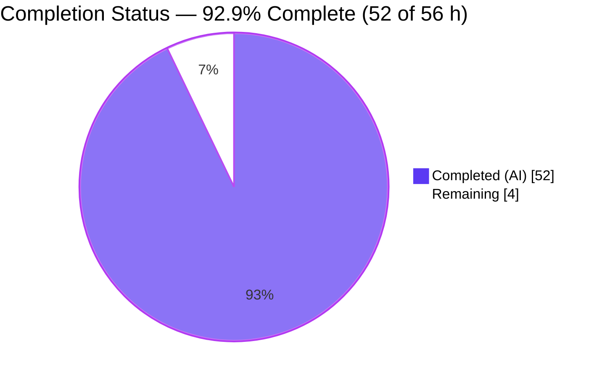
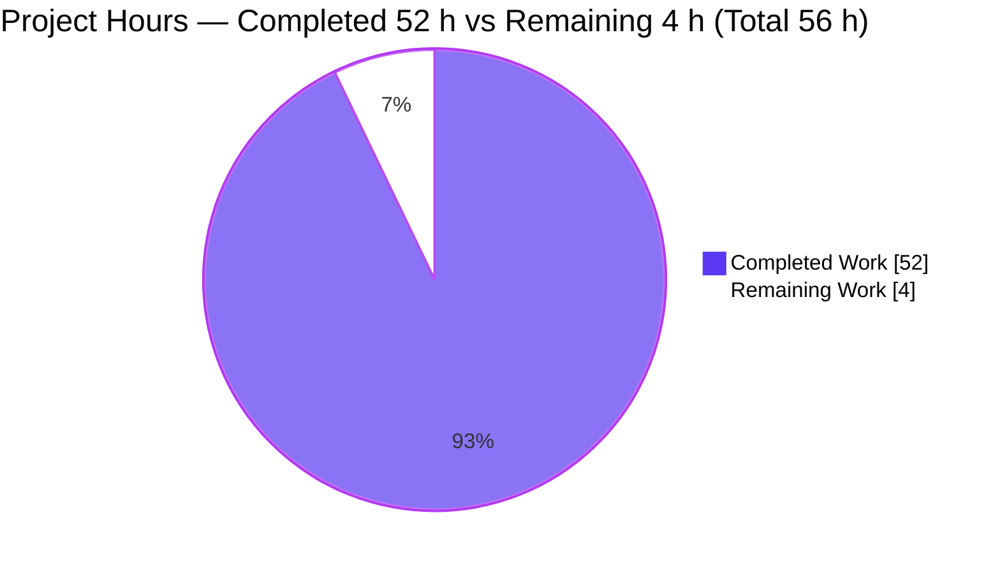
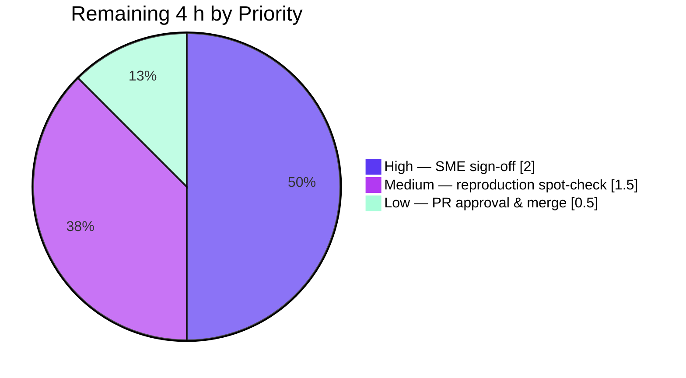

# Blitzy Project Guide

**Project:** Runtime Investigation — Sender Identity (SMTP AUTH Alignment) & DKIM Signing in foxcpp/maddy
**Source repository:** foxcpp/maddy @ `26452dd8dd787dc455278b0fdd296f4a5432c768` (source branch `maddy_26452dd8dd78`)
**Destination branch:** `blitzy-62bbeeda-df48-4e6a-b6a4-dda6742e6660` (HEAD `c452db2`)
**Deliverable:** `blitzy/documentation/maddy_26452dd8dd78.md` (1,076 lines / 83,359 bytes)
**Task type:** Run-first runtime-investigation **documentation** (rule set: SWE-AtlasQnA-Repo)

> **Legend / Blitzy brand colors:** Completed / AI Work = Dark Blue `#5B39F3` · Remaining / Not Completed = White `#FFFFFF` · Headings & Accents = Violet-Black `#B23AF2` · Highlight = Mint `#A8FDD9`

---

## 1. Executive Summary

### 1.1 Project Overview

This project delivers a single, comprehensive, **runtime-grounded** answer document explaining how the foxcpp/maddy mail server enforces sender identity (SMTP AUTH sender alignment) and DKIM signing at runtime, at a pinned commit. The intended consumers are mail-server operators, security reviewers, and the requesting engineering team. Its business impact is decision-grade security clarity: it proves, with captured SMTP dialogues, `-debug` logs, raw stored headers, and byte-level DKIM verification, that maddy's default configuration does **not** enforce per-user sender alignment and that certain `require_sender_match` tokens silently weaken signing. The technical scope is a read-only investigation across maddy's submission endpoint, message pipeline, DKIM modifier, header generation, and SQL storage — producing one additive documentation file.

### 1.2 Completion Status



**Completion = 52 / (52 + 4) = 52 / 56 = 92.9%** (PA1 AAP-scoped, hours-based).

| Metric | Value |
|---|---|
| **Total Hours** | **56** |
| **Completed Hours (AI + Manual)** | **52** (AI: 52 · Manual: 0) |
| **Remaining Hours** | **4** |
| **Percent Complete** | **92.9%** |

> All completed work was performed autonomously by Blitzy agents; no manual (human) hours have been logged yet. The remaining 4 hours are exclusively human path-to-production activities (review, optional reproduction, merge).

### 1.3 Key Accomplishments

- [x] Built `maddy` + `maddyctl` from the exact commit (Go 1.13.15, `CGO_ENABLED=1`, gcc); canonical version banner `maddy unknown (built from source tree)` recorded.
- [x] Ran the server in its canonical configuration (shipped `maddy.conf` + exactly two labeled, policy-preserving substitutions); all three listeners active (SMTP `:25`, submission `:465`, IMAP `:993`); two accounts (`user1@`, `user2@example.org`) created.
- [x] Exercised **six** authenticated-SMTPS scenarios (four user-specified + two extras) through the real submission endpoint and captured actual SMTP response codes.
- [x] Answered all **six** required questions, leading with the direct answer that the default config does **not** enforce sender/identity alignment.
- [x] Captured all **four** `shouldSign` decision outcomes with verbatim `-debug` lines, plus raw stored `DKIM-Signature` / `Received` headers and the (absent) `Authentication-Results`.
- [x] Independently reproduced the DKIM **body hash `bh=` (exact match)**; handled the stored `b=` re-serialization result as **inconclusive** per the byte-exactness rule; documented the PKCS#1-vs-PKIX key-publication detail.
- [x] Proved the config-vs-behavior divergence at runtime (`require_sender_match auth_domain`/`auth_user` silently disable the identity check).
- [x] Left the source repository **byte-identical** (clean tree; only the one additive doc file added) and removed all temporary runtime artifacts.

### 1.4 Critical Unresolved Issues

| Issue | Impact | Owner | ETA |
|---|---|---|---|
| _None blocking._ All AAP-scoped deliverables are complete, runtime-grounded, validated, and committed. | No release/validation blocker exists. | — | — |
| (Advisory) SME sign-off on analytical conclusions pending | Conclusions should be peer-validated before external reliance; not a defect | Reviewing engineer (SME) | ≤ 2 h |

> There are **no** unresolved compilation errors, failing tests, or broken functionality. The advisory item is standard human acceptance, tracked as remaining work in §2.2 / §7, not as a defect.

### 1.5 Access Issues

| System/Resource | Type of Access | Issue Description | Resolution Status | Owner |
|---|---|---|---|---|
| foxcpp/maddy source @ `26452dd8` | Repository (read) | None — source present and byte-unchanged | ✅ No issue | — |
| Go module cache | Build dependency | None — all ~30 modules present; `go mod verify` all verified | ✅ No issue | — |
| Go 1.13.15 toolchain / gcc | Build toolchain | None — present and re-verified this session | ✅ No issue | — |

**No access issues identified.** The build, runtime, and inspection paths were all reproducible with the tools present in the environment.

### 1.6 Recommended Next Steps

1. **[High]** Have a mail/SMTP/DKIM subject-matter expert review and sign off on the six answers, the config-vs-behavior divergence claim, and the RFC 6409 §6.1 interpretation.
2. **[Medium]** Optionally perform an independent reproduction spot-check (rebuild + run ≥1 accepted and ≥1 unsigned scenario; re-derive `bh=`) to confirm reproducibility in the reviewer's environment.
3. **[Medium]** Circulate the two informational security findings (no default identity alignment; silent-disable `auth_domain`/`auth_user` tokens) and the PKCS#1-vs-PKIX interop note to downstream operators.
4. **[Low]** Approve the pull request and merge the additive documentation file to the target branch.

---

## 2. Project Hours Breakdown

### 2.1 Completed Work Detail

Every completed component traces to one or more AAP requirements (R#) and is evidenced in the deliverable and Blitzy's autonomous validation logs.

| Component | Hours | Description |
|---|---:|---|
| Environment & toolchain setup | 3 | Install/verify Go 1.13.15 (`go.mod` `go 1.13`), gcc, module cache; `go mod verify` all-verified. [R1] |
| Canonical build (maddy + maddyctl) | 2 | `CGO_ENABLED=1 go build` for both binaries (SQLite CGO driver); resolved/annotated the benign `-Wreturn-local-addr` warning. [R1] |
| Canonical configuration | 3 | Shipped `maddy.conf` + exactly two policy-preserving substitutions (state/runtime dirs; remove absent `alias_file`); self-signed TLS cert at the shipped `tls` path; captured config `diff`. [R6] |
| Server runtime + account provisioning | 2 | Launched `maddy -config … -debug`; verified 3 listeners + DKIM keypair auto-gen; created `user1@`/`user2@example.org` via maddyctl. [R2, R5] |
| Authenticated SMTPS client + scenario design | 4 | Python `smtplib.SMTP_SSL` client (AUTH PLAIN, self-signed accepted); designed 6 precise auth/MAIL FROM/From scenarios (A–F). [R7–R10c, R18] |
| Runtime scenario execution + evidence capture | 6 | Ran 6 scenarios; captured SMTP codes, full dialogues, and `-debug` decision lines; confirmed stability across ≥2 runs. [R7–R10c, R18, R19] |
| Raw stored-header capture & analysis | 4 | `maddyctl imap-msgs dump` for signed (UID1) and unsigned (UID2) messages; `cat -A` byte-exact rendering; field-by-field header analysis. [R4, R12] |
| Byte-exact DKIM verification | 5 | Go verifier + stub DNS resolver; independent `bh=` body-hash reproduction (exact); positive control PASS; stored `b=` inconclusive analysis; PKCS#1↔PKIX discovery. [R17] |
| Config-vs-behavior divergence probe | 3 | Labeled non-canonical `require_sender_match envelope auth_domain` run; identical-input before/after; root-caused to `dkim.go:299`. [R16] |
| Source-code grounding & citations | 6 | Read + cited 14 reference files with exact `file:line`; confirmed absence of any `authorize_sender` module; RFC 6409 §6.1 research + external corroboration. [R14, R21] |
| Deliverable authoring | 10 | Authored the 1,076-line / 83 KB report: BLUF, methodology, §1–§11, all evidence blocks and analysis. [R22, R11–R16] |
| Coverage pass + cleanup + integrity verification | 1 | Question-by-question + named-item coverage pass; removed temp artifacts; confirmed byte-identical source tree. [R23, R24, R25] |
| QA / validation fix cycles | 3 | Three autonomous QA-fix commits (F1/F2/INFO-1, final-acceptance findings, §11.1 git-integrity reframe). [validation] |
| **Total Completed** | **52** | |

### 2.2 Remaining Work Detail

Each remaining category is human path-to-production; none is an incomplete AAP deliverable.

| Category | Hours | Priority |
|---|---:|---|
| SME peer review & technical sign-off of conclusions (Q1–Q6, divergence claim, RFC 6409 §6.1 interpretation, byte-exactness handling) | 2.0 | High |
| Independent reproduction spot-check (rebuild + ≥1 accepted & ≥1 unsigned scenario + re-derive `bh=`) | 1.5 | Medium |
| PR approval & merge of the additive documentation file to the target branch | 0.5 | Low |
| **Total Remaining** | **4.0** | |

### 2.3 Hours Reconciliation

| Check | Result |
|---|---|
| Section 2.1 total (Completed) | 52 h |
| Section 2.2 total (Remaining) | 4 h |
| 2.1 + 2.2 = Total (must equal §1.2 Total) | 52 + 4 = **56 h** ✅ |
| Remaining consistent across §1.2, §2.2, §7 | 4 h ≡ 4 h ≡ 4 ✅ |
| Completion % = 52 / 56 | **92.9%** ✅ |

---

## 3. Test Results

For this run-first investigation, the authoritative "tests" are the **autonomous runtime-validation checks** Blitzy executed (build, run, scenario reproductions, DKIM verification) plus the reference source tree's own Go unit suite (confirming the read-only source remains healthy). **All entries below originate from Blitzy's autonomous validation logs for this project** (and the build/banner rows were independently re-reproduced this session).

| Test Category | Framework | Total | Passed | Failed | Coverage % | Notes |
|---|---|---:|---:|---:|---|---|
| Build / Compilation | `go build` (CGO) | 3 | 3 | 0 | n/a | `maddy`, `maddyctl`, and `go build ./...` all exit 0; only a benign SQLite `-Wreturn-local-addr` warning |
| Reference source unit suite | `go test` | 20 | 20 | 0 | n/a | 20 packages OK, 0 FAIL (read-only source tree remains healthy) |
| Run-first SMTP scenarios | Python `smtplib.SMTP_SSL` + `-debug` | 6 | 6 | 0 | 100% of scenarios | A/C/D/E → `250`; B → `501 5.1.8` at RCPT; F → `554 5.6.0` at DATA — all reproduced exactly |
| DKIM `shouldSign` branches | `-debug` decision lines | 4 | 4 | 0 | 100% of branches | signed / not-authenticated-identity / not-key-domain / not-envelope-address |
| DKIM byte-level verification | go-msgauth/dkim + RFC 6376 | 2 | 2 | 0 | n/a | `bh=` body hash reproduced **exactly** + positive control PASS. (Stored `b=` vs re-serialized form = **INCONCLUSIVE**, correctly caveated, not counted as fail) |
| Stored-header shape checks | `maddyctl imap-msgs dump` | 2 | 2 | 0 | n/a | Signed UID1 (1202 B) and unsigned UID2 (471 B) shapes verified; oversigned `h=`; Received w/ envelope-sender clause & no client-IP `from`; no `Authentication-Results` |
| Config divergence probe | non-canonical `require_sender_match` | 1 | 1 | 0 | n/a | Probe signs the spoofed identity as expected — proving the divergence |
| **Totals** | | **38** | **38** | **0** | | 1 additional stored-`b=` result documented as **inconclusive** per the byte-exactness rule |

**Integrity note:** the deliverable itself is a Markdown document with no unit tests of its own; the validation above is the run-first evidence that grounds every claim. No test was fabricated — each maps to a captured artifact (`server_canonical.log`, `client_out.txt`, `dump_UID*.txt`, `dkim_verify_output.txt`, etc.).

---

## 4. Runtime Validation & UI Verification

**Runtime health (canonical configuration):**

- ✅ **Inbound SMTP listener** `tcp://0.0.0.0:25` — Operational (startup log line 11).
- ✅ **Submission (SMTPS) listener** `tls://0.0.0.0:465` — Operational; AUTH PLAIN succeeds (`235 2.0.0 Authentication succeeded`).
- ✅ **IMAP listener** `tls://0.0.0.0:993` — Operational (startup log line 30).
- ✅ **DKIM keypair auto-generation** — Operational; RSA-2048 keypair created on first start; reused across restart (no regeneration observed).
- ✅ **Account provisioning** — Operational; `user1@`/`user2@example.org` created; `INBOX` auto-created per account.

**API / protocol integration outcomes (authenticated SMTPS submission):**

- ✅ **Accept path** — Local-domain sender → `250 2.0.0 OK: queued` (Scenarios A, C, D, E).
- ✅ **Reject path (routing)** — Non-local sender → `501 5.1.8 Non-local sender domain`, emitted at **RCPT TO** (Scenario B).
- ✅ **Reject path (syntactic)** — Missing `From` header → `554 5.6.0`, emitted at **DATA** (Scenario F).
- ✅ **DKIM signing decision** — All four `shouldSign` outcomes observed and delivered as expected (signed vs unsigned-but-delivered).
- ✅ **Stored-message inspection** — Raw signed/unsigned bytes retrieved and verified byte-exact from the on-disk store.

**UI verification:** ⚪ **Not applicable.** This is a backend mail-server investigation and a documentation deliverable; there is no user interface and no design system in scope (AAP §0.10).

---

## 5. Compliance & Quality Review

Cross-map of the governing **SWE-AtlasQnA-Repo** rules and AAP validation criteria to observed quality outcomes.

| Benchmark / Rule | Status | Evidence / Progress |
|---|---|---|
| Deliverable location & naming (`blitzy/documentation/maddy_26452dd8dd78.md`) | ✅ Pass | File present, 1,076 lines; added as the only change since `26452dd8` |
| Run-first methodology (build & run before writing) | ✅ Pass | Methodology section + all §4–§8 evidence captured from live runs |
| Exercise real entry point (authenticated SMTPS, maddyctl, on-disk store) | ✅ Pass | Scenarios driven via `tls://0.0.0.0:465`; inspection via `maddyctl imap-msgs dump` |
| Canonical build/config, non-defaults labeled | ✅ Pass | §1.2 build cmds; §1.3 banner; §1.5 two labeled substitutions; §8 probe labeled non-canonical |
| Exhaustive condition coverage (primary + error/edge branches) | ✅ Pass | 6 scenarios; all 4 `shouldSign` branches; both reject paths (RCPT & DATA) |
| Actual unedited output for every claim | ✅ Pass | Verbatim SMTP dialogues, `-debug` lines, raw headers, hashes throughout |
| Byte-sensitive verification against emitted bytes | ✅ Pass | `bh=` exact reproduction; stored `b=` inconclusive (not asserted invalid); positive control PASS |
| Grounding — `file:line` for every system claim | ✅ Pass | Consolidated in §9 (14 refs); spot-checked accurate against on-disk source |
| Coverage pass before finishing | ✅ Pass | §10 question-by-question + named-item confirmation tables |
| Read-only source scope (no source-tree modification) | ✅ Pass | `git status --porcelain` empty; `git diff 26452dd8..HEAD` = only the doc file |
| Cleanup (temporary artifacts removed) | ✅ Pass | Workdirs + self-signed cert removed; evidence set preserved outside the repo |
| Compilation health (whole module) | ✅ Pass | `go build ./...` exit 0; reference unit suite 20/20 OK |

**Fixes applied during autonomous validation:** three in-scope QA-fix commits addressed doc-only findings (F1/F2/INFO-1; final-acceptance findings; a stale §11.1 git-integrity framing reframed to be commit-count-independent). **Outstanding items:** none in-scope; only human SME sign-off remains.

---

## 6. Risk Assessment

| Risk | Category | Severity | Probability | Mitigation | Status |
|---|---|---|---|---|---|
| Full DKIM `b=` verification against re-serialized stored form is inconclusive | Technical | Low | Low | `bh=` reproduced exactly + positive control passes establish signing soundness; correctly caveated per byte-exactness rule (not asserted invalid) | Mitigated / Documented (§7.4) |
| Reproducibility depends on exact toolchain (Go 1.13.15) + container | Technical | Low | Low | Exact build/invocation commands + container image documented | Mitigated (§1) |
| Run-specific values (`t=`,`x=`,`b=`, msg_ids, ports) differ on re-run | Technical | Low | Medium | Labeled as actual-run identifiers; conclusions independent of them | Mitigated (§4) |
| Default config does **not** enforce sender/identity alignment (intra-domain spoofing possible if operator assumes otherwise) | Security | Medium | Medium | Surfaced up-front in BLUF + Q4 with RFC 6409 §6.1 context | Documented / Informational finding |
| `require_sender_match auth_domain`/`auth_user` silently disable the identity check (weakens when operator expects strengthening) | Security | Medium | Low | Proven at runtime in §8 with root cause `dkim.go:299` | Documented / Informational finding |
| Self-signed cert + verification-disabled client are non-production TLS | Security | Low | Low | Labeled non-canonical, minimal, policy-preserving; removed in cleanup | Mitigated |
| Captured evidence set lives outside the repo (uncommitted) | Operational | Low | Low | Every value reproduced inline; report is fully self-contained | Mitigated (§11.2) |
| Domain-expertise concentration — conclusions need SMTP/DKIM SME to validate | Operational | Low-Medium | Medium | SME peer review scheduled (remaining task, §2.2) | Open / Planned |
| Conclusions pinned to commit `26452dd8` (other versions differ; no `run` subcommand here) | Integration | Low | Low | Commit pinned and scope explicitly bounded | Mitigated |
| DKIM key not published to real DNS (stub resolver used) | Integration | Low | Low | Explicitly out of scope; positive control + `bh=` validate crypto locally | Mitigated / Scoped-out |
| PKCS#1-vs-PKIX key publication (maddy `.dns` uses PKCS#1; conformant verifiers expect PKIX) | Integration | Medium | Low | Documented in §7.2 with the required re-encoding note | Documented / Informational finding |

**Overall:** no risk blocks production-readiness of the deliverable. Technical/operational/integration risks are Low and mitigated; the Medium items are precisely the informational security/interop **findings** that constitute the report's analytical value.

---

## 7. Visual Project Status

**Project hours breakdown** (Completed = Dark Blue `#5B39F3`, Remaining = White `#FFFFFF`):



**Remaining work by priority** (from §2.2; sums to the 4 h Remaining above):



**Integrity check:** the pie chart "Remaining Work" value (**4**) equals §1.2 Remaining Hours (**4**) and the sum of the §2.2 Hours column (2.0 + 1.5 + 0.5 = **4**). "Completed Work" (**52**) equals §1.2 Completed Hours and the sum of the §2.1 Hours column.

---

## 8. Summary & Recommendations

**Achievements.** The project delivers a rigorous, self-contained, runtime-grounded answer to how maddy handles sender identity and DKIM signing on the authenticated submission path. The investigation built and ran the exact commit, exercised six scenarios plus a labeled non-canonical probe, and captured actual SMTP codes, `-debug` decision lines, raw stored headers, and byte-level DKIM verification — answering all six questions and completing a full coverage pass. The single deliverable (`blitzy/documentation/maddy_26452dd8dd78.md`) is committed, and the maddy source tree is byte-identical.

**Headline findings.** (1) maddy's default configuration does **not** enforce alignment between the authenticated user and the message sender — the only default sender control is a domain-level open-relay guard (`501 5.1.8` at RCPT for non-local domains); per-user alignment requires explicit policy and is RFC 6409-compliant (§6.1 is a MAY). (2) DKIM signing is a **separate** decision — on any mismatch the message is delivered **unsigned**, not rejected, so a spoofed-`From` recipient sees an unsigned message. (3) A genuine config-vs-behavior divergence: `require_sender_match auth_domain`/`auth_user` **silently disable** the authenticated-identity check because the code reads only the literal key `"auth"` (`dkim.go:299`).

**Remaining gaps & critical path to production.** The project is **92.9% complete** (52 of 56 h). The remaining **4 h** is entirely human path-to-production: SME sign-off (High, 2 h) → optional independent reproduction (Medium, 1.5 h) → PR approval & merge (Low, 0.5 h). There are no code fixes, build failures, or failing tests on the critical path.

**Success metrics.** All 6 questions answered; all 4 user scenarios (+2 extras) exercised; all 4 `shouldSign` branches observed; `bh=` reproduced exactly; 100% of spot-checked citations accurate; clean tree; 5/5 autonomous validation gates passed.

**Production-readiness assessment.** The deliverable is **production-ready pending human review**. It is complete, accurate, fully runtime-grounded, template-consistent, and committed. Recommended action: obtain SME sign-off and merge.

---

## 9. Development Guide

This guide reproduces the investigation environment. **All build/version commands below were independently re-verified this session** (Go 1.13.15; both builds exit 0; banner exact). Run everything in a temporary workdir **outside** the source repository so the tree stays byte-clean.

### 9.1 System Prerequisites

- **OS:** Linux (x86-64).
- **Go 1.13.15** — matches the `go.mod` `go 1.13` directive (the highest documented supported patch).
- **gcc / build-essential** — **required**; the default SQLite storage backend (`github.com/mattn/go-sqlite3`) is a CGO package. `CGO_ENABLED=1` is **mandatory**.
- **OpenSSL** — to generate the self-signed TLS certificate (port 465 is implicit TLS).
- **Python 3** — for the authenticated SMTPS client (`smtplib.SMTP_SSL`).
- **Source:** foxcpp/maddy checked out at commit `26452dd8dd787dc455278b0fdd296f4a5432c768` (~9 MB).

### 9.2 Environment Setup

```bash
# Put Go 1.13.15 on PATH
export PATH="$PATH:/usr/local/go/bin"
go version   # expect: go version go1.13.15 linux/amd64

# Work outside the repo so the source tree stays byte-clean
mkdir -p /tmp/maddy_work/state /tmp/maddy_work/runtime

# Self-signed cert at the shipped tls path (port 465 = implicit TLS / TLS-on-connect)
mkdir -p /etc/maddy/certs/example.org
openssl req -x509 -newkey rsa:2048 -nodes \
  -keyout /etc/maddy/certs/example.org/privkey.pem \
  -out   /etc/maddy/certs/example.org/fullchain.pem \
  -subj "/CN=example.org" -days 365

# Canonical config = shipped maddy.conf + exactly TWO policy-preserving substitutions:
#   (1) prepend explicit state/runtime dirs; (2) remove the absent alias_file line.
cp maddy.conf /tmp/maddy_work/maddy.conf.used
sed -i '/alias_file \/etc\/maddy\/aliases/d' /tmp/maddy_work/maddy.conf.used
sed -i '1i state /tmp/maddy_work/state\nruntime /tmp/maddy_work/runtime\n' /tmp/maddy_work/maddy.conf.used
```

> **Why these are policy-preserving:** maddy's compiled defaults `/var/lib/maddy` (`maddy.go:59`) and `/run/maddy` (`maddy.go:70`) are not writable for a normal-user local run; `InitDirs()` `os.Chdir`s into the state dir (`maddy.go:220`) so relative `all.db` / `dkim_keys/` resolve there. Removing `alias_file` (absent locally) only affects alias expansion. All submission-auth, `source`/`default_source` routing, `sign_dkim`, and `require_sender_match` defaults remain byte-identical.

### 9.3 Dependency Installation

```bash
# From the repository root — modules resolve from the module cache; no new deps are added.
go mod verify    # expect: all modules verified
```

### 9.4 Build (verified exit 0 this session)

```bash
CGO_ENABLED=1 go build -o /tmp/maddy_work/maddy    ./cmd/maddy
CGO_ENABLED=1 go build -o /tmp/maddy_work/maddyctl ./cmd/maddyctl
```

Expected: both exit `0`. The only compiler output is a **benign** SQLite warning:
`sqlite3-binding.c:125322:10: warning: function may return address of local variable [-Wreturn-local-addr]` — it does not affect the build.

Confirm the canonical version banner:

```bash
/tmp/maddy_work/maddy -v      # expect: maddy unknown (built from source tree)
```

### 9.5 Run the Server

```bash
# NOTE: this commit has NO `run` subcommand — launch directly with -config.
/tmp/maddy_work/maddy -config /tmp/maddy_work/maddy.conf.used -debug \
  > /tmp/maddy_work/server.log 2>&1 &
sleep 2
grep -E "listening on" /tmp/maddy_work/server.log
# expect three lines: tcp://0.0.0.0:25 (smtp), tls://0.0.0.0:465 (submission), tls://0.0.0.0:993 (imap)
```

On first start the `sign_dkim` modifier auto-generates an RSA-2048 keypair under `dkim_keys/` in the state dir (`example.org_default.key` + `example.org_default.dns`).

### 9.6 Create Accounts (maddyctl operates directly on the SQLite store)

```bash
/tmp/maddy_work/maddyctl --config /tmp/maddy_work/maddy.conf.used users create user1@example.org --password 'Password123!'
/tmp/maddy_work/maddyctl --config /tmp/maddy_work/maddy.conf.used users create user2@example.org --password 'Password123!'
/tmp/maddy_work/maddyctl --config /tmp/maddy_work/maddy.conf.used users list          # -> user1@example.org / user2@example.org
/tmp/maddy_work/maddyctl --config /tmp/maddy_work/maddy.conf.used imap-mboxes list user1@example.org   # -> INBOX
```

> Usernames are **full email addresses** (`docs/tutorials/setting-up.md:135-136`). `Password123!` is a test value, not a maddy default.

### 9.7 Verification

- **Listeners:** `grep "listening on" /tmp/maddy_work/server.log` shows all three ports.
- **Accounts:** `users list` shows both full-address accounts; `imap-mboxes list` shows the auto-created `INBOX`.
- **DKIM key:** `ls /tmp/maddy_work/state/dkim_keys/` shows `example.org_default.{key,dns}`.

### 9.8 Example Usage — Reproduce a Scenario

Authenticated SMTPS client (accepts the self-signed cert):

```python
import smtplib, ssl
ctx = ssl.create_default_context()
ctx.check_hostname = False
ctx.verify_mode = ssl.CERT_NONE

s = smtplib.SMTP_SSL("127.0.0.1", 465, context=ctx)
s.set_debuglevel(1)
s.ehlo("client.test")
s.login("user1@example.org", "Password123!")            # AUTH PLAIN
# Happy path (Scenario C) — expect: 250 2.0.0 OK: queued (and SIGNED)
s.sendmail("user1@example.org", ["user2@example.org"],
           "From: user1@example.org\r\nTo: user2@example.org\r\n"
           "Subject: Scenario C happy path\r\n\r\nThis is a test message body.\r\n")
s.quit()
```

Inspect the stored message (raw bytes, including the `DKIM-Signature`):

```bash
UID=$(/tmp/maddy_work/maddyctl --config /tmp/maddy_work/maddy.conf.used imap-msgs list user2@example.org INBOX | tail -1 | awk '{print $1}')
/tmp/maddy_work/maddyctl --config /tmp/maddy_work/maddy.conf.used imap-msgs dump user2@example.org INBOX "$UID"
```

Scenario cheat-sheet (auth / MAIL FROM / From → expected result):
- **C** user1 / user1@example.org / user1@example.org → `250` + **SIGNED**
- **A** user1 / user2@example.org / user2@example.org → `250` + UNSIGNED (auth branch)
- **B** user1 / foo@evil.com / foo@evil.com → `501 5.1.8` at RCPT
- **D** user1 / user1@example.org / user1@evil.com → `250` + UNSIGNED (domain branch)
- **E** user1 / user1@example.org / user2@example.org → `250` + UNSIGNED (envelope branch)
- **F** user1 / user1@example.org / (omitted) → `554 5.6.0` at DATA

### 9.9 Cleanup

```bash
kill %1 2>/dev/null                 # stop the backgrounded server (targets the job you spawned)
rm -rf /tmp/maddy_work /etc/maddy    # remove workdir, DB, keys, binaries, self-signed cert
git -C <repo-root> status --porcelain   # expect: EMPTY (source tree byte-unchanged)
```

### 9.10 Troubleshooting

| Symptom | Cause | Resolution |
|---|---|---|
| Build fails referencing SQLite / cgo | `CGO_ENABLED=0` or gcc missing | Set `CGO_ENABLED=1`; install `build-essential` |
| Startup aborts: cannot load TLS cert | No cert at the `tls` path | Generate the self-signed cert (§9.2) at `/etc/maddy/certs/example.org/` |
| Startup aborts: permission denied on state dir | Default `/var/lib/maddy` not writable | Redirect `state`/`runtime` to a writable dir (§9.2) |
| Startup aborts referencing aliases | `alias_file /etc/maddy/aliases` absent locally | Remove that directive (§9.2) |
| Startup aborts immediately with usage text | A positional argument was passed | Launch with `-config` only; `Run()` requires empty args (`maddy.go:120`) |
| Client TLS handshake / cert error | Self-signed cert not trusted | Disable verification in the client (`CERT_NONE`) — test-only |
| `pip install` → externally-managed-environment | PEP 668 on system Python | Use a venv or `--break-system-packages` (only if Python deps are needed) |

---

## 10. Appendices

### Appendix A — Command Reference

| Purpose | Command |
|---|---|
| Go version | `go version` |
| Verify modules | `go mod verify` |
| Build maddy | `CGO_ENABLED=1 go build -o maddy ./cmd/maddy` |
| Build maddyctl | `CGO_ENABLED=1 go build -o maddyctl ./cmd/maddyctl` |
| Whole-module compile check | `go build ./...` |
| Version banner | `maddy -v` |
| Run server | `maddy -config <conf> -debug` |
| Create user | `maddyctl --config <conf> users create <addr> --password <pw>` |
| List users | `maddyctl --config <conf> users list` |
| List mailboxes | `maddyctl --config <conf> imap-mboxes list <addr>` |
| List messages | `maddyctl --config <conf> imap-msgs list <addr> INBOX` |
| Dump raw message | `maddyctl --config <conf> imap-msgs dump <addr> INBOX <uid>` |
| Confirm clean tree | `git status --porcelain` |
| Confirm scope | `git diff --name-status 26452dd8..HEAD` |

### Appendix B — Port Reference

| Port | Protocol | maddy endpoint | TLS |
|---|---|---|---|
| 25 | SMTP (inbound MX) | `smtp tcp://0.0.0.0:25` | STARTTLS (inbound path) |
| 465 | SMTP submission (SMTPS) | `submission tls://0.0.0.0:465` | Implicit TLS (TLS-on-connect) |
| 993 | IMAP (IMAPS) | `imap tls://0.0.0.0:993` | Implicit TLS |

### Appendix C — Key File Locations

| Item | Path |
|---|---|
| **Deliverable** | `blitzy/documentation/maddy_26452dd8dd78.md` |
| Default configuration | `maddy.conf` (root) |
| Server entry point | `maddy.go` (`Run()`, `InitDirs()`, defaults) |
| Submission preparation | `internal/endpoint/smtp/submission.go` |
| Delivery entry + Received | `internal/endpoint/smtp/smtp.go` |
| DKIM signing modifier | `internal/modify/dkim/dkim.go` |
| DKIM key generation/publication | `internal/modify/dkim/keys.go` |
| Received header generation | `internal/target/received.go` |
| Authentication-Results gating | `internal/msgpipeline/check_runner.go` |
| Management CLI | `cmd/maddyctl/main.go` |
| Module manifest | `go.mod` |
| Runtime state (ephemeral) | `<state>/all.db`, `<state>/dkim_keys/`, `<state>/messages/<blob>` |

### Appendix D — Technology Versions

| Component | Version |
|---|---|
| Go toolchain | 1.13.15 (`go.mod` declares `go 1.13`) |
| gcc | 15.2.0 (CGO for SQLite) |
| github.com/emersion/go-smtp | v0.12.1-0.20191206174923-1f576e0ec85c |
| github.com/emersion/go-msgauth | v0.3.2-0.20191028231513-55b75676976c |
| github.com/emersion/go-message | v0.10.9-0.20191116124005-65fd0119e899 |
| github.com/foxcpp/go-imap-sql | v0.3.2-0.20191208094750-8b4ec6b19a78 |
| github.com/emersion/go-imap | v1.0.1 |
| github.com/emersion/go-sasl | v0.0.0-20190817083125-240c8404624e |
| github.com/mattn/go-sqlite3 | v1.11.0 |
| golang.org/x/crypto | v0.0.0-20191108234033-bd318be0434a |
| github.com/foxcpp/go-mockdns | v0.0.0-20191123143003-02edb10da1e3 |

### Appendix E — Environment Variable Reference

| Variable | Value / Purpose |
|---|---|
| `CGO_ENABLED` | `1` — **mandatory** for the SQLite storage driver |
| `PATH` | Include `/usr/local/go/bin` for the Go 1.13.15 toolchain |
| `MADDY_CONFIG` | Alternative to `--config` for maddyctl (default `/etc/maddy/maddy.conf`) |
| `DEBIAN_FRONTEND` | `noninteractive` for non-interactive apt operations (setup only) |

### Appendix F — Developer Tools Guide

| Tool | Use |
|---|---|
| `maddy -debug` | Emit per-message decision lines (routing match, `sign_dkim` outcomes, accept/abort) |
| `maddyctl users` | Create/list accounts directly against the SQLite store (no running server needed) |
| `maddyctl imap-msgs dump` | Retrieve raw stored message bytes (headers incl. `DKIM-Signature`, `Received`) |
| Python `smtplib.SMTP_SSL` | Drive the real authenticated SMTPS submission endpoint (AUTH PLAIN) |
| `go-msgauth/dkim` + stub DNS | Independently reproduce the DKIM body hash and run a positive-control verification |
| `cat -A` | Render byte-exact stored form (CR shown as `^M`, EOL as `$`) for byte-sensitivity checks |
| `git status --porcelain` / `git diff` | Confirm read-only source integrity and single-file scope |

### Appendix G — Glossary

| Term | Meaning |
|---|---|
| **MSA / Submission** | Message Submission Agent; authenticated mail-injection endpoint (port 465 here) |
| **SMTP AUTH** | Authentication of the submitting client (here, AUTH PLAIN against `local_authdb`) |
| **Envelope sender (MAIL FROM)** | The SMTP-level return path; distinct from the header `From:` |
| **From header** | The message-level author address a recipient sees |
| **Sender alignment** | Whether the authenticated identity must match MAIL FROM and/or `From:` |
| **`source` / `default_source`** | Pipeline routing blocks selected by the MAIL FROM domain |
| **`sign_dkim`** | maddy modifier that DKIM-signs outgoing messages |
| **`require_sender_match`** | `sign_dkim` option gating the **signing** decision (tokens: `envelope`, `auth_domain`, `auth_user`, `off`; default effectively `{envelope, auth}`) |
| **`shouldSign`** | Internal function deciding whether to sign (domain / envelope / auth branches) |
| **Oversigning** | Listing a header twice in `h=` so an added copy breaks the signature (anti-tamper) |
| **`bh=` / `b=`** | DKIM body hash / signature value |
| **PKCS#1 vs PKIX** | RSA public-key encodings; maddy publishes PKCS#1 in `.dns`, conformant verifiers expect PKIX/SubjectPublicKeyInfo |
| **Canonicalization (`c=`)** | How headers/body are normalized before hashing (`relaxed/relaxed` here) |
| **BLUF** | "Bottom line up front" — the document leads with the direct answer |

---

## Cross-Section Integrity — Final Validation

| Rule | Requirement | Result |
|---|---|---|
| 1 (1.2 ↔ 2.2 ↔ 7) | Remaining hours identical | 4 h ≡ 4 h ≡ 4 ✅ |
| 2 (2.1 + 2.2 = Total) | Completed + Remaining = Total | 52 + 4 = 56 ✅ |
| 3 (Section 3) | Tests only from Blitzy autonomous validation logs | ✅ (build/scenario/DKIM/probe checks) |
| 4 (Section 1.5) | Access issues validated | ✅ (none identified) |
| 5 (Colors) | Completed = `#5B39F3`, Remaining = `#FFFFFF` | ✅ (applied in §1.2 & §7) |
| — (Completion %) | Consistent everywhere | **92.9%** in §1.2, §7, §8 ✅ |