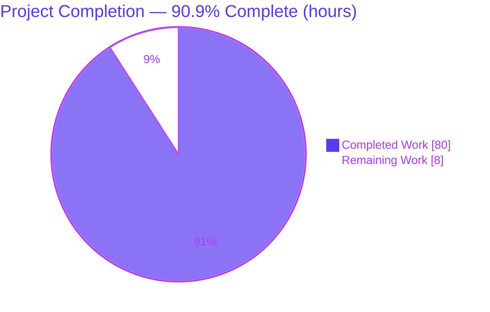
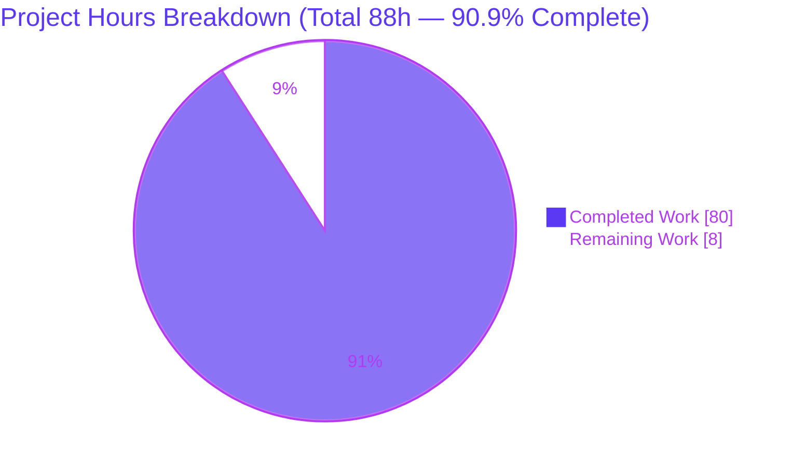
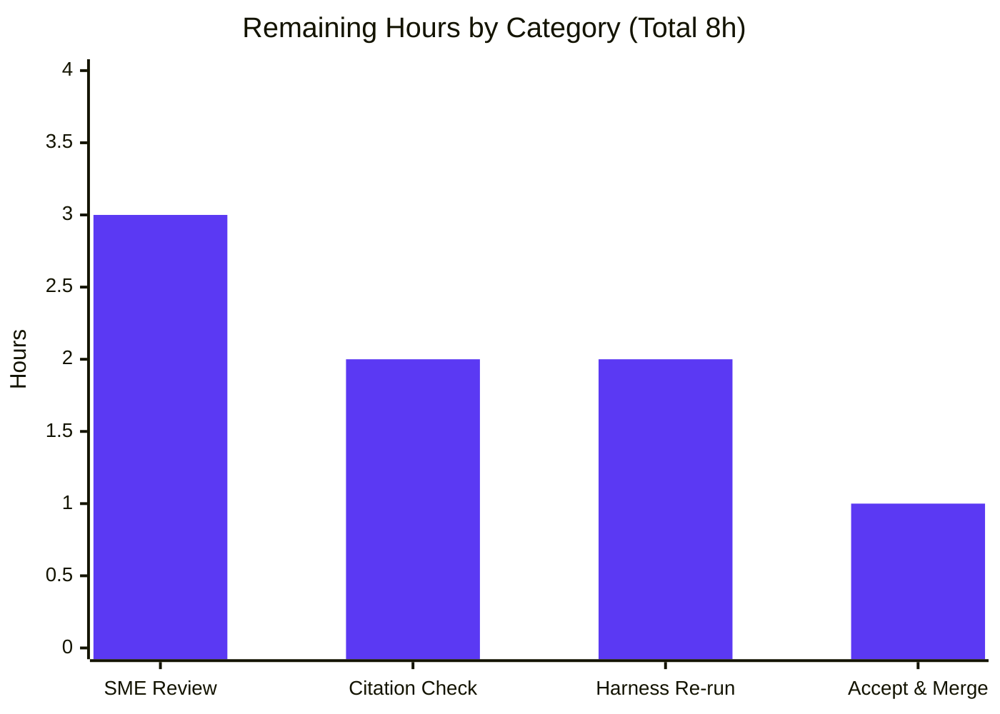

# Blitzy Project Guide — maddy Inbound SMTP `DATA`-Boundary Investigation

> **Project type:** Read-only, runtime-grounded code investigation (SWE-AtlasQnA-Repo)
> **Deliverable:** `blitzy/documentation/maddy_26452dd8dd78.md` (single Markdown answer document)
> **Repository:** `github.com/foxcpp/maddy` · source parent `26452dd` · branch `blitzy-438524cc-5240-4dd1-904e-f2f199faf5de`

---

## 1. Executive Summary

### 1.1 Project Overview

This project delivers a runtime-grounded written investigation of how the **maddy** mail server's inbound SMTP endpoint decides that a `DATA` message body has ended and resumes command parsing, and how ambiguous message-boundary framing (line endings, dot-stuffing, end-of-`DATA` sequences) changes that decision. Every claim is established by **building and running the real server** and observing actual wire transcripts, logs, and delivered bytes — not by reading code alone. The audience is mail-server engineers and security reviewers. The single deliverable is one Markdown document answering six sub-questions (Q1–Q6), spanning the maddy SMTP endpoint, the `go-smtp` library, and the Go standard-library `net/textproto` dot-reader. Per the read-only mandate, **no production code is modified**.

### 1.2 Completion Status



**AAP-scoped completion: 90.9%** — calculated as Completed Hours ÷ Total Hours = 80 ÷ 88 = 90.9% (PA1 methodology; only AAP-scoped and path-to-production work counted).

| Metric | Hours |
|--------|-------|
| **Total Hours** | **88** |
| Completed Hours (AI + Manual) | 80 (AI 80 + Manual 0) |
| Remaining Hours | 8 |
| **Percent Complete** | **90.9%** |

> Color legend — **Completed = Dark Blue `#5B39F3`**, **Remaining = White `#FFFFFF`** (applied to all charts).

### 1.3 Key Accomplishments

- ✅ **Single deliverable created and committed** — `blitzy/documentation/maddy_26452dd8dd78.md` (2,623 lines / 165,530 bytes), the only file added on the branch.
- ✅ **All six sub-questions (Q1–Q6) answered from live observation** — each with the exact command, unedited transcript, structured logs, and delivered bytes.
- ✅ **Real canonical wire entry point exercised** — byte-controlled raw-socket client through a live TCP SMTP listener (not the Go `Session`-level test harness that cannot emit bare-LF terminators).
- ✅ **Three-layer code path mapped and cited** — maddy `internal/endpoint/smtp/smtp.go`, `go-smtp` `conn.go`, and Go stdlib `net/textproto/reader.go` `dotReader` FSM, with `file:line` references verified accurate.
- ✅ **SMTP-smuggling condition demonstrated** — maddy accepts a bare-LF `<LF>.<LF>` terminator and delivers **two** messages where an RFC-5321-strict reference peer delivers **one**.
- ✅ **Determinism confirmed across ≥2 runs** — identical delivered-body SHA-256 (`6fafed38…`) across canonical and bare-LF variants; no run-to-run wobble.
- ✅ **Compilation & tests green** — `go build ./...` exit 0; `go test ./... -count=1` = 20 packages ok, 0 FAIL; race detector clean on the investigation-core path.
- ✅ **Read-only mandate proven & temporary harness removed** — `git status --porcelain` empty; `git diff 26452dd HEAD` = exactly one file added.
- ✅ **Independently reproduced** — the Final Validator reconstructed the `/tmp` harness verbatim and reproduced every Q1–Q6 value; this session re-built a byte-identical binary (19,386,576 bytes).

### 1.4 Critical Unresolved Issues

There are **no unresolved issues that block release of the deliverable**. The one item below is a third-party build notice, not a defect.

| Issue | Impact | Owner | ETA |
|-------|--------|-------|-----|
| Benign `mattn/go-sqlite3` cgo compiler warning (`-Wreturn-local-addr`) during `go build` | None — build exits 0; the warning is from a transitive storage dependency unrelated to the `DATA` path; already documented in the deliverable §5 | N/A (upstream `go-sqlite3`) | N/A |

> **Note:** The SMTP-smuggling exposure in maddy itself (see Risk **R1**) is the investigation's central **finding for downstream decision-makers**, not a defect in the deliverable, and is explicitly out of scope to fix under the read-only mandate.

### 1.5 Access Issues

**No access issues identified.** The entire investigation runs on loopback (`127.0.0.1`, ports 2524–2527) using the Go toolchain and pre-populated module cache already present in the environment. No repository permissions, service credentials, or third-party API access are required to build, test, or reproduce the findings.

| System/Resource | Type of Access | Issue Description | Resolution Status | Owner |
|-----------------|----------------|-------------------|-------------------|-------|
| — | — | No access issues identified | N/A | N/A |

### 1.6 Recommended Next Steps

1. **[High]** Perform SME technical review of the full investigation (Q1–Q6 logic, RFC 5321/5322 framing, and the R1 smuggling finding). *(HT-1)*
2. **[Medium]** Independently spot-check a sample of `file:line` citations against source at the pinned revision, noting the Go 1.18.10 line-number basis. *(HT-2)*
3. **[Medium]** Reconstruct the `/tmp` harness from Appendix §7.1–7.8 and re-run it to confirm reproducibility (delivered-body SHA-256 `6fafed38…`; 2-vs-1 smuggling). *(HT-3)*
4. **[Low]** Record the downstream disposition of the R1 security finding and merge the deliverable. *(HT-4)*
5. **[Low]** *(Separate / out of scope)* If the organization elects to act on R1, open a dedicated maddy-hardening effort (upstream reject front proxy per Q5, `go-smtp` upgrade, or a bare-newline rejection control) — **not** part of this deliverable's hours.

---

## 2. Project Hours Breakdown

### 2.1 Completed Work Detail

Every completed component traces to an AAP requirement. Rows sum to **80 hours** (= Completed Hours in §1.2).

| Component | Hours | Description |
|-----------|-------|-------------|
| Repository scope discovery & 3-layer code-path analysis | 8 | Read maddy endpoint + `go-smtp` + `net/textproto`; grep for any smuggling mitigation (none found); establish `file:line` citations across all three layers [AAP §0.2] |
| Observation harness construction | 12 | `maddy.conf` baseline + oversize variant; `rawclient.py` (13 byte-controlled modes); `sink.py` capturing SMTP sink; `proxy.py` normalize/reject/passthrough; `strictpeer.py` RFC-strict peer; `lib.sh`; `extract_msg.py` [AAP §0.3.1, §0.8.1] |
| Canonical build, smoke test & toolchain/`dotReader` confirmation | 3 | `go build ./cmd/maddy`; launch with `io_debug`; confirm container Go 1.18.10 and `dotReader` FSM before asserting behavior [AAP §0.1.1, §0.8.1] |
| Q1 — boundary-decision moment (experiment + writeup) | 3 | `354` greeting, terminator consumed → `stateEOF`, `250 OK: queued`, `smtp: accepted` log, delivered body; true causal order established [AAP Q1] |
| Q2 — framing-variation matrix (experiment + writeup) | 5 | Five variants (canonical, bare-LF terminator, bare-LF body, dot-stuffing, resembling lines); byte-identical delivery proven via SHA-256 `6fafed38…` [AAP Q2] |
| Q3 — SMTP smuggling + RFC-strict peer (experiment + writeup) | 6 | Bare-LF terminator + pipelined 2nd transaction ⇒ maddy delivers **2**; byte-identical input to strict reference peer delivers **1** [AAP Q3] |
| Q4 — back-to-back stability (experiment + writeup) | 3 | Two independent 5-message batches + three back-to-back on one connection; envelope reset between transactions; deterministic [AAP Q4] |
| Q5 — cleaning/blocking front proxy (experiment + writeup) | 5 | Normalize mode manufactures a canonical boundary (→2 delivered); reject mode returns `500` bare-newline (→0 delivered); single- and split-chunk packetizations [AAP Q5] |
| Q6 — lingering & never-seen (experiment + writeup) | 6 | Drop-mid-`DATA` (`unexpected EOF`), oversize `552`, over-long line `554` (×2 packetizations), post-error same-connection probe, and the **absence** of any bare-newline `5xx` [AAP Q6] |
| §1 Direct-answer summary + §3 three-layer code-path map | 6 | Per-question one-line answers; `dotReader` FSM quote, `handleData` flow, `Session.Data`/`prepareBody`, and the outbound re-encode chain [AAP §0.4.2] |
| §4 RFC/smuggling context + §5 caveats & build transcript | 5 | RFC 5321 §2.3.8/§4.1.1.4/§4.5.2 & RFC 5322; SEC Consult Dec-2023 / Postfix CVE-2023-51764; observed-vs-inferred, environment & reproducibility [AAP §0.2.2, §0.4.2] |
| §6 coverage pass + §7 appendix curation | 4 | Exhaustive named-item coverage (every sub-Q, mechanism, flag, file, example); verbatim harness source §7.1–7.8 [AAP §0.7] |
| QA remediation cycles | 8 | 17 QA findings + F1 stale-count + MINOR-1 Q5 commands + 4 final-acceptance findings, across 4 follow-up commits |
| Final validation reproduction (5 gates) | 6 | `go build`, `go test`, `-race`, full Q1–Q6 re-run with value matching, citation verification, read-only & cleanup confirmation |
| **Total Completed** | **80** | |

### 2.2 Remaining Work Detail

Every remaining item is path-to-production human review/acceptance. Rows sum to **8 hours** (= Remaining Hours in §1.2 and §7).

| Category | Hours | Priority |
|----------|-------|----------|
| Human SME technical review of the full investigation | 3 | High |
| Independent `file:line` citation spot-check | 2 | Medium |
| Harness reproducibility re-run (Appendix §7.1–7.8) | 2 | Medium |
| Final acceptance & merge | 1 | Low |
| **Total Remaining** | **8** | — |

> **Cross-check:** §2.1 (80) + §2.2 (8) = **88** = Total Hours in §1.2. ✔

---

## 3. Test Results

All tests below originate from **Blitzy's autonomous validation logs** for this project (the Final Validator's run and this session's spot-check). maddy is a Go project; its tests are package-level `go test` suites — there is no separate UI/E2E suite in scope for this read-only investigation.

| Test Category | Framework | Total Tests | Passed | Failed | Coverage % | Notes |
|---------------|-----------|-------------|--------|--------|------------|-------|
| Compilation | `go build` (Go 1.18.10) | all packages | Pass | 0 | — | `GOPROXY=off go build ./...` exit 0 (offline; module cache "all modules verified"); only stderr is the benign `go-sqlite3` cgo warning |
| Unit & Integration | Go `testing` (`go test`) | 20 packages | 20 | 0 | Not quantified* | `GOPROXY=off go test ./... -count=1` exit 0; 0 `--- FAIL`; matches setup baseline |
| Race Detection (core path) | Go `-race` | 3 packages | 3 | 0 | — | `internal/endpoint/smtp`, `internal/target/smtp_downstream`, `internal/msgpipeline`; no data races |
| Spot-check re-run (this session) | Go `build`/`vet`/`test` | 3 pkgs + vet | Pass | 0 | — | Core packages build exit 0; `go vet ./internal/endpoint/smtp/` exit 0; `go test ./internal/endpoint/smtp/` = ok 1.531s |

\* Coverage percentage was **not quantified** in the validation run because it used `-count=1` (not `-cover`); the project's CI (`.build.yml`) runs `go test ./... -cover -race`, but no numeric coverage value is present in the autonomous logs, so none is asserted here.

**Test integrity:** No tests were authored or modified for this task (read-only mandate). The results above reflect the existing maddy test suite executed by Blitzy's autonomous systems to confirm the investigation is reproducible.

---

## 4. Runtime Validation & UI Verification

**UI Verification: Not applicable.** maddy is a headless SMTP server process; there is no graphical user interface in scope (AAP §0.3.3). "Runtime validation" here means the live SMTP protocol exchange, server logs, and delivered bytes captured through the real wire entry point. Every item below was **independently reproduced** by the Final Validator and matched the deliverable.

**Server runtime health**
- ✅ **Build & launch** — maddy binary built (19,386,576 bytes; byte-identical across builds) and launched on `tcp://127.0.0.1:2525` with `io_debug` raw-wire logging.
- ✅ **Capturing sink** — Python raw-socket SMTP sink on `:2526` records exact delivered bytes per message.
- ✅ **Front proxy / strict peer** — normalize/reject proxy on `:2524`; RFC-strict reference receiver on `:2527`.

**Per-question runtime outcomes (SMTP protocol / delivery)**
- ✅ **Q1 boundary moment** — client observed `354 2.0.0 Go ahead…` then `250 2.0.0 OK: queued`; maddy logged `incoming message` + `smtp: accepted {msg_id}`; message delivered to sink.
- ✅ **Q2 framing matrix** — canonical `<CRLF>.<CRLF>` **and** genuine bare-LF `<LF>.<LF>` **both accepted**; delivered bodies byte-identical (SHA-256 `6fafed38…`, 131 B); variant sizes 131/131/133/160/137 for V-A…V-E; stable across 2 runs.
- ✅ **Q3 smuggling** — one pipelined bare-LF-terminated send ⇒ maddy accepts **two** messages (2nd with spoofed sender) on one connection; RFC-strict reference peer fed byte-identical input accepts **one**.
- ✅ **Q4 stability** — two independent 5-message batches = 5/5 each (single body hash per batch); three back-to-back on one connection = 3 accepted + 3 envelope resets. Deterministic; no wobble.
- ✅ **Q5 front proxy** — normalize rewrote `<LF>.<LF>` → `<CRLF>.<CRLF>` (in 325 B → out 327 B), **manufacturing** the boundary (maddy still delivered 2); reject returned `500 5.5.2 bare newline rejected` (bare LF at offset 156), maddy delivered 0, while a fully-canonical message passed.
- ✅ **Q6 lingering & never-seen** — drop-mid-`DATA` → `DATA error {"reason":"unexpected EOF"}` + `aborted`, 0 delivered; oversize → `552 5.3.4 Maximum message size exceeded`; over-long one-chunk → `554` (`too longer line in input stream`); over-long split-chunk → accepted (`curLineLength` reset); post-error same-connection probe shows session persistence; and the **absence** of any bare-newline `5xx` (scoped source/config grep exit 1, stable ×2).

---

## 5. Compliance & Quality Review

The deliverable is measured against the governing **SWE-AtlasQnA-Repo** rules (AAP §0.7) and Blitzy quality benchmarks. Fixes were applied by prior agents during autonomous QA (17 findings + F1 + MINOR-1 + 4 final); the Final Validator required **zero** additional edits.

| Benchmark / Rule | Status | Progress | Evidence |
|------------------|--------|----------|----------|
| Deliver one branch-named answer document | ✅ Pass | 100% | `blitzy/documentation/maddy_26452dd8dd78.md` (2,623 lines) |
| Investigate by running the code first | ✅ Pass | 100% | Embedded build transcript + live transcripts per Q1–Q6 |
| Use the real, canonical wire entry point | ✅ Pass | 100% | Byte-controlled raw-socket client over live TCP `:2525`; Session-level harness deliberately bypassed |
| Exercise every condition/variant | ✅ Pass | 100% | Q2 five-variant matrix; Q5 normalize/reject × single/split chunk; Q6 drop-mid/oversize/over-long ×2/post-error |
| Include actual, complete, unedited output + exact commands | ✅ Pass | 100% | Verbatim transcripts, logs, delivered bytes, error text throughout §2 |
| Answer every part and named item (coverage pass) | ✅ Pass | 100% | §6 exhaustive coverage: sub-Qs, mechanisms, flags, files, examples, standards/CVE |
| Be exact and grounded (`file:line`, observed vs inferred) | ✅ Pass | 100% | Citations across all 3 layers verified accurate; 25 "(observed)" markers vs 8 "inferred" |
| Confirm stability across ≥2 runs | ✅ Pass | 100% | §5 "run-to-run variation: none"; Q4 batches + back-to-back |
| Confirm toolchain/`dotReader` version before asserting | ✅ Pass | 100% | Container Go 1.18.10 confirmed; AAP-anticipated 1.21.13 discrepancy flagged; FSM stable Go 1.13–1.21 |
| Read-only scope (no source file modified) | ✅ Pass | 100% | `git diff 26452dd HEAD` = 1 file added; `git status --porcelain` empty |
| Cleanup temporary artifacts | ✅ Pass | 100% | `/tmp/maddy-smtp` removed; ports 2524–2527 freed; shutdown transcript in §5 |
| Compilation clean | ✅ Pass | 100% | `go build ./...` exit 0 |
| Tests pass | ✅ Pass | 100% | `go test ./... -count=1` = 20 pkgs ok, 0 FAIL; `-race` clean on core path |
| Human SME sign-off | ⬜ Pending | 0% | Remaining work (HT-1…HT-4); does not block autonomous completion |

---

## 6. Risk Assessment

Risks span all four PA3 categories. Because this is a read-only investigation, most deliverable risks are Low and well-mitigated; the headline **security** item (R1) is the investigation's finding *about maddy*, not a defect in the deliverable.

| # | Risk | Category | Severity | Probability | Mitigation | Status |
|---|------|----------|----------|-------------|------------|--------|
| R1 | maddy accepts bare-LF `<LF>.<LF>` as end-of-`DATA` → **SMTP-smuggling** class (2nd message with spoofed `MAIL FROM`; enables SPF/DKIM/DMARC bypass downstream) | Security | **High** (for maddy operators) | High (deterministic; reproduced Q3/Q5) | **Out of scope to fix** under the read-only mandate — this is the central finding. Downstream owners should evaluate a reject front proxy (Q5), a `go-smtp` upgrade, or a bare-newline rejection control (maddy has none; the `smtpd_forbid_bare_newline` analogue is absent). Documented §2 Q3/Q6 + §4 | Open (documented, no code fix by design) |
| R2 | Go stdlib version dependence — `dotReader` FSM `file:line` citations verified on container Go 1.18.10 (AAP anticipated 1.21.13) | Technical | Low | Medium (Go upgrades shift line numbers) | Exact version stated in build transcript; FSM behavior confirmed stable across Go 1.13–1.21; regions re-verified by inspection | Mitigated / Documented (§5) |
| R3 | Behavior + Layer-2 citations pinned to `go-smtp@v0.12.1-0.20191206174923-1f576e0ec85c` (2019) | Integration / Dependency | Low | Low | Exact pin recorded (`go.mod:L19` + `go list -m`); all results reported against that exact revision | Mitigated |
| R4 | Temporary `/tmp` harness removed per read-only mandate; reviewers must reconstruct it to reproduce | Operational | Low | Low | §7.1–7.8 verbatim source (py_compile-clean); Final Validator reconstructed it and reproduced all six experiments with matching values | Mitigated |
| R5 | Documentation/citation staleness as maddy HEAD advances beyond source parent `26452dd` | Operational | Low | Medium (long term) | Pinned to exact source parent `26452dd8dd787…`; compatibility caveat in §5 | Mitigated / Documented |
| R6 | `io_debug` test baseline self-warns it "may leak passwords in logs" | Security | Low (test-only) | Low | Confined to the `/tmp` baseline (removed after); explicitly labeled test-baseline-not-shipping-default in §5 | Closed |
| R7 | Residual: security-relevant claims (esp. R1) should receive human SME confirmation before acceptance | Technical | Low | Low | 8 h human-review plan (HT-1…HT-4); every claim already observed + independently reproduced (5 gates, zero edits) | Open (this is the remaining work) |

---

## 7. Visual Project Status

### 7.1 Project Hours (Completed vs Remaining)



> **Integrity:** "Remaining Work" = **8** matches §1.2 Remaining Hours and the §2.2 "Hours" total. Colors: Completed `#5B39F3`, Remaining `#FFFFFF`.

### 7.2 Remaining Hours by Category (Section 2.2)



| Category | Hours | Priority |
|----------|-------|----------|
| Human SME technical review | 3 | High |
| Independent citation spot-check | 2 | Medium |
| Harness reproducibility re-run | 2 | Medium |
| Final acceptance & merge | 1 | Low |
| **Total** | **8** | — |

---

## 8. Summary & Recommendations

**Achievements.** The project is **90.9% complete** (80 of 88 AAP-scoped hours). It delivers a single, thorough, runtime-grounded investigation document (2,623 lines) that answers all six sub-questions from live observation, maps the end-of-`DATA` decision across three cooperating code layers with verified `file:line` citations, and demonstrates the SMTP-smuggling condition against an RFC-strict reference peer. Compilation and the full test suite are green (20 packages ok), the read-only mandate is proven (one file added, zero source modifications), and every runtime value was independently reproduced with a byte-identical binary.

**Remaining gaps.** The outstanding **8 hours** are entirely **human review and acceptance** — SME technical review (3 h), citation spot-check (2 h), harness reproducibility re-run (2 h), and final acceptance/merge (1 h). No autonomous engineering work remains; there are no partially-completed or not-started AAP-specified requirements.

**Critical path to production.** SME review → citation spot-check + harness re-run → record R1 disposition → merge. For a documentation deliverable, "production" is acceptance and merge of the answer document.

**Security note (R1).** The investigation's central finding is that maddy is in the SMTP-smuggling vulnerable class. This is a **finding for downstream decision-makers**, not a defect in the deliverable, and remediating maddy is explicitly out of scope under the read-only mandate. If the organization elects to act, a separate hardening effort (reject front proxy, `go-smtp` upgrade, or a bare-newline rejection control) should be opened — it is not counted in this project's hours.

**Production-readiness assessment.** The deliverable is **ready for human review**. Confidence is **High**: the AAP is a single well-defined document, fully validated across five gates with zero edits, and all values independently reproduced.

| Success Metric | Target | Actual | Status |
|----------------|--------|--------|--------|
| All sub-questions answered from observation | Q1–Q6 | Q1–Q6 | ✅ |
| Compilation | Clean | `go build ./...` exit 0 | ✅ |
| Test suite | No failures | 20 pkgs ok, 0 FAIL | ✅ |
| Read-only mandate | 0 source files modified | 1 file added, 0 modified | ✅ |
| Reproducibility | Stable ≥2 runs | Deterministic; byte-identical binary | ✅ |
| Human acceptance | Signed off | Pending (8 h) | ⬜ |

---

## 9. Development Guide

> All commands below were executed in the project environment and their real outputs verified during assessment.

### 9.1 System Prerequisites

- **OS:** Linux (assessed on the container base; loopback networking required).
- **Go toolchain:** Go **1.18.10** (`go.mod` declares a minimum of `go 1.13`; the `dotReader` FSM behavior is stable across Go 1.13–1.21).
- **C compiler + `CGO_ENABLED=1`:** required only because a transitive storage dependency (`github.com/mattn/go-sqlite3`) uses cgo; **unrelated** to the `DATA` boundary path.
- **Python 3 (standard library only):** container ships **3.13.7**; the harness uses raw sockets (the `smtpd` module was removed in Python 3.12+), so no third-party packages are installed.
- **git**, ~10 MB free disk, and free loopback ports **2524–2527**.

### 9.2 Environment Setup

```bash
# Load the Go environment (Go 1.18.10, GOPATH=/go, GOMODCACHE=/go/pkg/mod, CGO_ENABLED=1)
source /etc/profile.d/go.sh

# Verify toolchain
go version                         # -> go version go1.18.10 linux/amd64
go env GOROOT GOMODCACHE GOPATH CGO_ENABLED
# -> /usr/local/go  /go/pkg/mod  /go  1
```

### 9.3 Dependency Installation

No dependencies are added (the deliverable is pure Markdown; the toolchain and module cache are already present). Builds are offline via `GOPROXY=off`.

```bash
# Confirm the pinned SMTP library the investigation cites (Layer 2)
go list -m github.com/emersion/go-smtp
# -> github.com/emersion/go-smtp v0.12.1-0.20191206174923-1f576e0ec85c
```

### 9.4 Build

```bash
# Compile everything (offline; exit 0). The only stderr is a benign go-sqlite3 cgo warning.
GOPROXY=off go build ./...

# Build the investigation binary used by the harness (reproducible: 19,386,576 bytes)
GOPROXY=off go build -o /tmp/maddy-smtp/maddy ./cmd/maddy
```

### 9.5 Run the Harness (optional — for reviewers reproducing the findings)

Reconstruct the eight harness files verbatim from the deliverable's Appendix (§7.1–7.8) under `/tmp/maddy-smtp/`, then:

```bash
# 1) Capturing sink (records exact delivered bytes per message)
python3 /tmp/maddy-smtp/sink.py 2526 /tmp/maddy-smtp/delivered /tmp/maddy-smtp/sink_delivered.log &

# 2) RFC-strict reference receiver (Q3 contrast)
python3 /tmp/maddy-smtp/strictpeer.py 2527 &

# 3) Front proxy (Q5) — choose a mode
python3 /tmp/maddy-smtp/proxy.py normalize 2524 127.0.0.1 2525 &   # or: reject

# 4) maddy inbound endpoint (io_debug raw-wire transcript)
/tmp/maddy-smtp/maddy -config /tmp/maddy-smtp/maddy.conf &

# 5) Byte-controlled client — pick a mode
python3 /tmp/maddy-smtp/rawclient.py canonical 127.0.0.1 2525
# modes: canonical | barelf | barelf-body | dotstuff | resembles | smuggle |
#        smuggle-split | dropmid | longline | longline-split | oversize |
#        posterror | backtoback
```

### 9.6 Verification

```bash
# Read the deliverable
less blitzy/documentation/maddy_26452dd8dd78.md

# Full test suite (offline): 20 packages ok, 0 FAIL
GOPROXY=off go test ./... -count=1

# Confirm the delivered-body identity for Q2 (canonical == bare-LF)
sha256sum /tmp/maddy-smtp/delivered/*.bin   # expect 6fafed38… for canonical & barelf bodies

# Confirm the read-only mandate holds
git status --porcelain                       # (empty)
git diff 26452dd HEAD --name-status          # A  blitzy/documentation/maddy_26452dd8dd78.md
```

### 9.7 Example Usage

The primary "usage" is reading the answer document. To reproduce **Q1** end-to-end:

```bash
python3 /tmp/maddy-smtp/rawclient.py canonical 127.0.0.1 2525
```

Expected: the client sees `354 2.0.0 Go ahead…` then `250 2.0.0 OK: queued`; maddy logs `smtp: accepted {msg_id}`; and one `.bin` file appears in `/tmp/maddy-smtp/delivered/`.

### 9.8 Troubleshooting

- **`go-sqlite3` cgo warning during build** — benign; the build still exits 0. Ignore it (documented in deliverable §5).
- **`ModuleNotFoundError: No module named 'smtpd'`** — expected on Python 3.12+. The harness uses raw sockets, not `smtpd`; use the Appendix scripts as-is.
- **"address already in use"** — a prior harness process holds a port. Free ports 2524–2527 (`lsof -i :2525`) or choose different ports consistently across the scripts and config.
- **`net/textproto/reader.go` line numbers differ from citations** — line numbers are Go-version-specific (citations verified on Go 1.18.10); the FSM *behavior* is stable across Go 1.13–1.21.
- **`pip` "externally-managed-environment"** — not applicable; the harness uses only the Python standard library.

---

## 10. Appendices

### Appendix A — Command Reference

| Command | Purpose |
|---------|---------|
| `source /etc/profile.d/go.sh` | Load Go 1.18.10 environment |
| `GOPROXY=off go build ./...` | Offline compile of all packages |
| `GOPROXY=off go build -o /tmp/maddy-smtp/maddy ./cmd/maddy` | Build the investigation binary (19,386,576 B) |
| `GOPROXY=off go test ./... -count=1` | Run the full test suite (20 pkgs ok) |
| `go list -m github.com/emersion/go-smtp` | Confirm the pinned SMTP library |
| `/tmp/maddy-smtp/maddy -config <cfg>` | Run maddy (no `run` subcommand; uses `-config`) |
| `python3 rawclient.py <mode> 127.0.0.1 2525` | Drive a byte-controlled SMTP session |
| `git diff 26452dd HEAD --name-status` | Prove the read-only mandate (1 file added) |

### Appendix B — Port Reference

| Port | Component | Notes |
|------|-----------|-------|
| 2524 | Front proxy (`proxy.py`) | normalize / reject / passthrough |
| 2525 | maddy inbound SMTP endpoint | canonical wire entry point (`io_debug`) |
| 2526 | Capturing SMTP sink (`sink.py`) | records delivered bytes via `smtp_downstream` relay |
| 2527 | RFC-strict reference receiver (`strictpeer.py`) | Q3 strict-peer contrast |

### Appendix C — Key File Locations

| Path | Role |
|------|------|
| `blitzy/documentation/maddy_26452dd8dd78.md` | **The deliverable** (2,623 lines) |
| `internal/endpoint/smtp/smtp.go` | Layer 1 — `Session.Data`/`prepareBody`, accept/error logs, knobs |
| `internal/target/smtp_downstream/smtp_downstream.go` | Outbound relay to the observation sink |
| `internal/msgpipeline/msgpipeline.go` | Delivery `Body`/`Commit` routing |
| `internal/buffer/memory.go` | `BufferInMemory` body buffering |
| `/go/pkg/mod/github.com/emersion/go-smtp@v0.12.1-0.20191206174923-1f576e0ec85c/conn.go` | Layer 2 — `handleData`, `354`, drain, reset |
| `/usr/local/go/src/net/textproto/reader.go` | Layer 3 — `dotReader` FSM (`type dotReader` at L317) — the actual end-of-`DATA` decision |
| `go.mod` | Module path, `go 1.13` minimum, go-smtp pin (L19) |

### Appendix D — Technology Versions

| Technology | Version | Source |
|------------|---------|--------|
| Go toolchain | 1.18.10 (linux/amd64) | `go version` (container) |
| `go.mod` minimum | go 1.13 | `go.mod:L3` |
| `github.com/emersion/go-smtp` | v0.12.1-0.20191206174923-1f576e0ec85c | `go.mod:L19` / `go list -m` |
| `github.com/emersion/go-message` | v0.10.9-0.20191116124005-65fd0119e899 | `go.mod:L16` |
| Python | 3.13.7 (stdlib only) | `python3 --version` |
| maddy source parent | `26452dd` (`26452dd8dd787…`) | `git log -1 26452dd` |

### Appendix E — Environment Variable Reference

| Variable | Value | Purpose |
|----------|-------|---------|
| `GOROOT` | `/usr/local/go` | Go installation root |
| `GOMODCACHE` | `/go/pkg/mod` | Module cache (pre-populated & verified) |
| `GOPATH` | `/go` | Go workspace |
| `CGO_ENABLED` | `1` | Required for the transitive `go-sqlite3` dependency |
| `GOPROXY` | `off` (for offline builds) | Forces use of the local module cache |

### Appendix F — Developer Tools Guide (harness client modes)

`rawclient.py <mode>` drives the canonical wire entry point with full byte control:

| Mode | Exercises |
|------|-----------|
| `canonical` | `<CRLF>.<CRLF>` terminator (Q1 baseline) |
| `barelf` | bare-LF `<LF>.<LF>` terminator (Q2/Q3) |
| `barelf-body` | bare-LF body line endings (Q2) |
| `dotstuff` | leading dot-stuffing `..` → `.` (Q2) |
| `resembles` | body lines resembling the terminator (Q2) |
| `smuggle` / `smuggle-split` | pipelined 2nd transaction after bare-LF terminator (Q3) |
| `backtoback` | multiple transactions on one connection (Q4) |
| `dropmid` | drop connection mid-`DATA` (Q6) |
| `longline` / `longline-split` | exceed `MaxLineLength` = 2000 (Q6) |
| `oversize` | exceed `max_message_size` (Q6, with oversize config) |
| `posterror` | probe session persistence after an error (Q6) |

### Appendix G — Glossary

| Term | Definition |
|------|------------|
| **`DATA` boundary** | The point where the SMTP server decides the message body has ended and resumes command parsing. |
| **`dotReader`** | Go stdlib `net/textproto` state machine that decodes the dot-terminated message body — the layer that actually makes the end-of-`DATA` decision. |
| **Dot-stuffing** | RFC 5321 §4.5.2 transparency: a leading `.` in body text is doubled (`..`) on the wire and un-stuffed on decode. |
| **SMTP smuggling** | Exploiting a lenient end-of-`DATA` interpretation (e.g., bare-LF `<LF>.<LF>`) to inject a second message with a spoofed envelope, bypassing SPF/DKIM/DMARC (SEC Consult, Dec 2023; Postfix CVE-2023-51764). |
| **`io_debug`** | maddy SMTP option that tees raw wire bytes to the debug log via `io.TeeReader` — the transcript source for this investigation. |
| **Canonical wire entry point** | A real live TCP SMTP session (the byte layer), as opposed to the Go `Session`-level test harness that abstracts framing away. |
