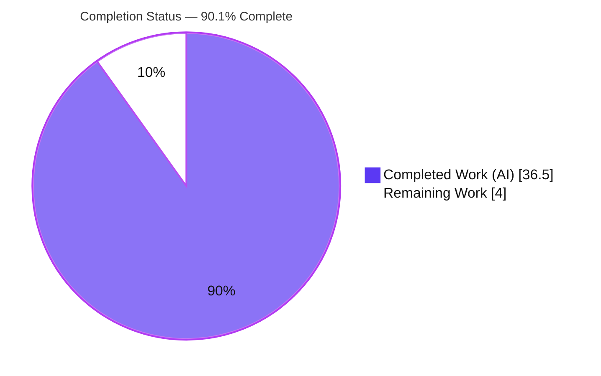
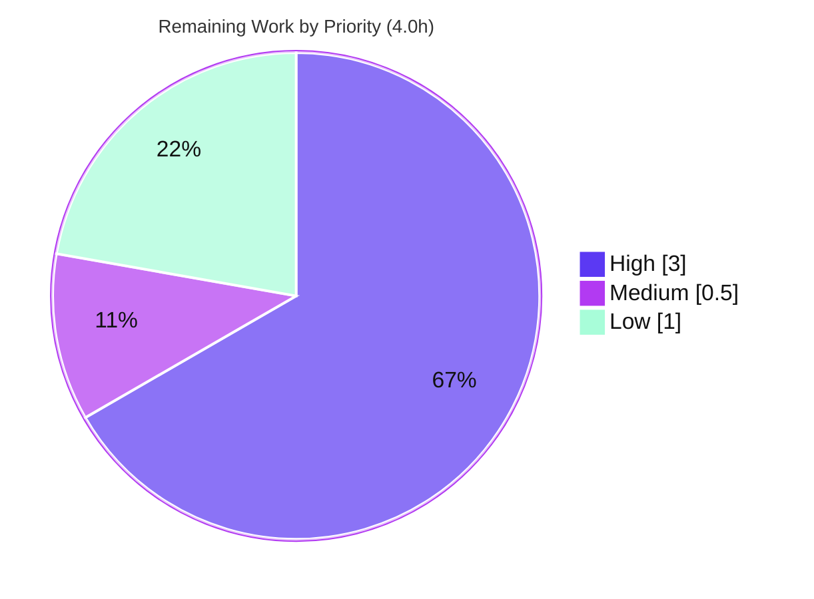

# Blitzy Project Guide — Maddy Module-System Startup Onboarding Q&A

> **Brand legend** — In every chart and table in this guide: **Completed / AI Work = Dark Blue `#5B39F3`**, **Remaining / Not Completed = White `#FFFFFF`**, headings/accents = Violet‑Black `#B23AF2`, soft highlight = Mint `#A8FDD9`.

---

## 1. Executive Summary

### 1.1 Project Overview

This project delivers a single, code‑grounded onboarding document that explains — strictly from the source of the **Maddy** mail server (`github.com/foxcpp/maddy`) — how Maddy's module system assembles itself at server startup, with emphasis on configurations that mix SMTP and IMAP endpoints. The target audience is engineers new to the Maddy codebase. It is a **documentation / knowledge‑transfer deliverable**, not a change to the server. The scope is deliberately narrow and additive: exactly one new Markdown file, backed by read‑only source analysis and a genuine build‑and‑run cycle that captures real `-debug` startup logs as evidence. Business impact: faster, more accurate onboarding into Maddy's most intricate subsystem (module registration, lazy initialization, and the message pipeline), with every claim traceable to a specific file and line.

### 1.2 Completion Status

The completion percentage is computed using the AAP‑scoped, hours‑based methodology (PA1): only work defined in the Agent Action Plan and the standard path‑to‑production activities required to ship it are counted.



| Metric | Hours |
|---|---|
| **Total Hours** | **40.5** |
| **Completed Hours (AI + Manual)** | **36.5** (AI = 36.5, Manual = 0.0) |
| **Remaining Hours** | **4.0** |
| **Percent Complete** | **90.1%** |

> Calculation: `36.5 / (36.5 + 4.0) × 100 = 90.1%`. The deliverable is fully authored, fully cited, and runtime‑verified; the remaining 4.0h is human SME review, merge, and an optional evidence enhancement. Per Blitzy policy, completion is capped below 100% pending human review.

### 1.3 Key Accomplishments

- ✅ Authored `blitzy/documentation/maddy_26452dd8dd78.md` (643 lines) answering all **six** questions with mechanism **and** rationale.
- ✅ Grounded every factual claim in source: **173 `[path:line]` citations across 25 files**, consolidated in a Quick Citations Index.
- ✅ Built Maddy with the Go toolchain (`go1.23.12`) and captured **genuine `-debug` runtime evidence** for both the success path (mixed SMTP/submission endpoints, out‑of‑order `&` references) and the failure path (unused‑block guard).
- ✅ Verified the full source compiles (`go build ./...`, exit 0) and the existing test suite passes (`go test ./...` → 20 packages ok, 0 fail), corroborating the document's concurrency claims via `-race`.
- ✅ Honored the hard non‑modification constraint: **0 edits to the Maddy source tree**; `git diff` vs. base shows only the additive document.
- ✅ Cleaned up all temporary observation artifacts; working tree verified pristine (`git status --porcelain` empty).

### 1.4 Critical Unresolved Issues

| Issue | Impact | Owner | ETA |
|---|---|---|---|
| _None — no blocking issues._ All autonomous AAP requirements are delivered and independently verified. | None | — | — |
| Human SME technical sign‑off not yet performed (expected, non‑blocking gate before merge) | Cannot merge until reviewed | Maddy SME / reviewer | 0.5 day |

### 1.5 Access Issues

| System / Resource | Type of Access | Issue Description | Resolution Status | Owner |
|---|---|---|---|---|
| Maddy source repository | Read/Write (git) | None — repo present and writable; branch verified | ✅ No issue | — |
| Go module proxy / dependencies | Read | None — `go mod verify` reports "all modules verified"; no network fetch required for build/test/run | ✅ No issue | — |
| Go toolchain & C compiler | Local | None — `go1.23.12` and `gcc` available; CGO and CGO‑free builds both succeed | ✅ No issue | — |

**No access issues identified.** All build, test, and runtime‑evidence steps completed locally without restricted credentials or external services.

### 1.6 Recommended Next Steps

1. **[High]** Perform SME technical‑accuracy review of the document — confirm Q1–Q6 are correct against the codebase and spot‑verify a sample of the 173 citations (≈2.0h).
2. **[High]** Re‑run the documented build + runtime‑evidence sequence to confirm the success and failure (exit‑2) logs reproduce in your environment (≈0.5h).
3. **[Medium]** Approve the PR, confirm `git diff` vs. base is the single additive file, merge, and assign a documentation owner (≈0.5h).
4. **[Low]** Optionally capture direct IMAP runtime evidence with CGO enabled (currently generalized from SMTP via the shared endpoint code path) and decide on discoverability/linking (≈1.0h).

---

## 2. Project Hours Breakdown

### 2.1 Completed Work Detail

All completed hours were delivered by Blitzy AI agents (creation commit `3529ad6`, review‑revision commit `cd44925`, plus final validation). Each component traces to a specific AAP requirement.

| Component | Hours | Description |
|---|---:|---|
| Module‑subsystem source comprehension & boot‑path tracing | 5.0 | Static analysis of the 25 cited files (registry, instances, module interface, parser, modconfig, msgpipeline, check_runner, modify, smtp/imap endpoints, bootstrap) to trace startup end‑to‑end. |
| Orientation (two‑registry model) + Startup Sequence narrative | 3.0 | AAP §0.5.1 scaffolding: constructor vs. instance registry mental model and the in‑order Step 0–3 two‑pass bootstrap walkthrough. |
| Q1 — mixed SMTP/IMAP startup assembly | 2.0 | `instancesFromConfig` two‑pass construct‑then‑eager‑init for a mixed‑endpoint config. |
| Q2 — eager registration vs. deferred resolution | 2.0 | Import‑time constructor registry vs. parse‑time instances left uninitialized until referenced. |
| Q3 — lazy init, `&` references, out‑of‑order | 3.0 | Full parse precedes module work; `GetInstance` lazy at‑most‑once engine; decoupled `Init` rationale. |
| Q4 — endpoint vs. regular lifecycle divergence | 2.5 | Separate endpoint registry, no instance registration, eager init; `FuncNewEndpoint` contract. |
| Q5 — implicit check/modifier coordination | 3.0 | Positional composition into ordered groups; parallel check runner; serial modifier chain. |
| Q6 — runtime‑evidence section authoring | 2.0 | Success + failure log narratives with per‑line source‑mapping tables. |
| Citation grounding (173 anchors / 25 files) + Quick Citations Index | 3.5 | Verifying each claim to its exact source line and consolidating the source map. |
| Build + genuine runtime‑evidence capture | 4.0 | Compiling (CGO + CGO‑free), authoring throwaway configs, running, capturing & normalizing success and failure logs. |
| Test‑suite verification | 1.0 | Running `go test ./...` (+ `-race`) to corroborate the parallel‑check‑runner claims. |
| Review‑cycle revisions (commit `cd44925`, +114/−40) | 2.5 | Addressing review findings to tighten citations and narrative. |
| Final 5‑gate validation + temp cleanup + pristine‑source verification | 3.0 | Dependencies, compilation, tests, runtime reproduction, and source‑pristine gates; artifact cleanup. |
| **Total Completed** | **36.5** | |

### 2.2 Remaining Work Detail

Each remaining category traces to a path‑to‑production need (human review/merge) or an optional AAP‑adjacent enhancement.

| Category | Hours | Priority |
|---|---:|---|
| Documentation SME technical‑accuracy review (read 643 lines; verify Q1–Q6; sample‑check citations; confirm rationale & runtime‑evidence claims) | 2.5 | High |
| PR approval, merge & documentation‑owner assignment (confirm source pristine vs. base) | 0.5 | Medium |
| Optional: capture direct IMAP runtime evidence with CGO enabled + decide discoverability/linking | 1.0 | Low |
| **Total Remaining** | **4.0** | |

### 2.3 Hours Reconciliation & Methodology

- **Methodology:** PA1 (AAP‑scoped) — `Completion % = Completed ÷ (Completed + Remaining) × 100`.
- **Reconciliation (cross‑section integrity):**
  - Section 2.1 total = **36.5h** = Section 1.2 Completed Hours ✅
  - Section 2.2 total = **4.0h** = Section 1.2 Remaining Hours = Section 7 "Remaining Work" ✅
  - 2.1 + 2.2 = **36.5 + 4.0 = 40.5h** = Section 1.2 Total Hours ✅
  - `36.5 / 40.5 × 100 = 90.1%` = Section 1.2 / Section 7 / Section 8 ✅
- **Confidence:** High. Hours reflect a senior engineer's effort to comprehend a non‑trivial Go subsystem, author 643 lines of precisely cited prose, and capture genuine runtime evidence — independently re‑verified by build, test, and reproduction.

---

## 3. Test Results

This is a **documentation‑only** task; the deliverable **adds zero tests** (per the AAP). The testing below is Maddy's **existing** suite, executed by Blitzy's autonomous validation to (a) confirm the unmodified source compiles and passes, and (b) corroborate the document's concurrency claims (the parallel check runner) via the race detector. All results originate from Blitzy's autonomous validation logs and were independently re‑run for this guide.

| Test Category | Framework | Total Tests | Passed | Failed | Coverage % | Notes |
|---|---|---:|---:|---:|---|---|
| Unit / Package (full tree) | Go `testing` (`go test ./...`) | 20 packages (232 test funcs) | 20 pkgs | 0 | CI configured `-cover` | 26 additional packages have no test files; 0 failures. |
| Concurrency (race) | Go `testing` `-race` | Cited pkgs (module, msgpipeline, modify, cfgparser, endpoints) | All | 0 | n/a | 0 data races — corroborates the document's parallel‑check‑runner / mutex claims. |
| Build verification | `go build ./...` | Whole module | exit 0 | — | n/a | Only the benign, documented sqlite3 `-Wreturn-local-addr` C warning. |
| Build (server, CGO‑free) | `CGO_ENABLED=0 go build ./cmd/maddy` | 1 binary | exit 0 | — | n/a | ~18.5 MB binary used for runtime‑evidence capture. |

**Integrity note:** Every entry above is sourced from Blitzy's autonomous test/validation execution and re‑confirmed during this assessment (`go test ./...` → exit 0, 20 ok / 0 FAIL).

---

## 4. Runtime Validation & UI Verification

Runtime behavior was validated by building Maddy and running it against throwaway configurations in `/tmp` (source tree never touched). Results were reproduced independently for this guide.

**Runtime health**
- ✅ **Operational** — `go build ./...` compiles the whole tree (exit 0).
- ✅ **Operational** — CGO‑free server binary builds and starts (`CGO_ENABLED=0 go build -o <tmp>/maddy ./cmd/maddy`).
- ✅ **Operational** — Success path: a config mixing `smtp` + `submission` endpoints with **out‑of‑order** `&` references starts cleanly; debug logs show inline‑check construction (`new module require_mx_record []`), forward `reference &remote_target` (target declared *after* the endpoints), the resolved auth provider, and **both** endpoints reaching `listening on`.
- ✅ **Operational** — Failure path (active guard): a top‑level block referenced by nothing aborts startup with **exit code 2** and `Unused configuration block at …:N - orphan_block (dummy)`, proving the module graph must be fully connected.

**API integration**
- ✅ **Operational** — SMTP/submission endpoints bound to their TCP listeners during observation. IMAP is generalized from SMTP via the shared `RegisterEndpoint` + eager‑`Init` code path (verified identical), with direct IMAP capture available as an optional enhancement (Section 2.2).

**UI verification**
- ⚠ **Not applicable** — There is no user interface in scope. The deliverable is a Markdown document and the subject system is a headless mail server; no UI screens, components, or responsive breakpoints exist to verify.

---

## 5. Compliance & Quality Review

Cross‑mapping the AAP's governing directives ("SWE‑AtlasQnA‑Repo") and Blitzy quality benchmarks to delivered status. Fixes applied during autonomous validation: none required — zero defects were found in the deliverable; one transient out‑of‑scope side‑effect (a `go mod download all` that appended hashes to `go.sum`) was reverted, and the repo re‑verified pristine.

| Benchmark / Directive | Requirement | Status | Notes |
|---|---|---|---|
| Deliverable form | New Markdown named `<source_branch>.md` | ✅ Pass | `blitzy/documentation/maddy_26452dd8dd78.md` |
| Placement | In `blitzy/documentation/` of destination repo | ✅ Pass | Exact path confirmed |
| Comprehensiveness | Answer all six questions | ✅ Pass | Dedicated Q1–Q6 sections + orientation + appendix |
| Code‑grounded fidelity | Every claim cites `[path:line]`; no lore | ✅ Pass | 173 anchors / 25 files; sampled anchors verified exact |
| Rationale ("why") | Each answer includes design reasoning | ✅ Pass | e.g., decoupled `Init`, endpoint bypass of instance registry |
| Build‑and‑run evidence | Genuine runtime logs for Q6 | ✅ Pass | Success + failure paths captured & independently reproduced |
| Non‑modification | Zero edits to Maddy source tree | ✅ Pass | `git diff` base shows only the additive `.md` |
| No extra code | No source/tests/scripts committed to the tree | ✅ Pass | Single additive document; temp configs in `/tmp`, deleted |
| Cleanup | Temporary artifacts removed; repo pristine | ✅ Pass | `git status --porcelain` empty |
| Zero‑placeholder policy | No TODO/stub/placeholder content | ✅ Pass | Only false positive is the literal word "placeholder" describing log normalization |
| Markdown integrity | Balanced code fences, consistent index, no trailing whitespace | ✅ Pass | 3 balanced code blocks; 25‑file index 1:1 with inline citations |

**Overall compliance: ✅ Fully compliant** with all governing directives and quality benchmarks.

---

## 6. Risk Assessment

No High‑severity risks. Because the deliverable introduces zero code, traditional software risks (vulnerabilities, scalability, data integrity) are largely not applicable; the meaningful risks are documentation‑maintenance concerns.

| Risk | Category | Severity | Probability | Mitigation | Status |
|---|---|---|---|---|---|
| Citation drift if upstream source evolves (line numbers shift) | Technical | Low | Medium | Document is pinned to branch `maddy_26452dd8dd78`; citations are branch‑scoped | Mitigated (by design) |
| Runtime‑evidence environment divergence (toolchain/CGO differences) | Technical | Low | Low | Exact toolchain, CGO state, `dummy`‑module substitution, and log normalization disclosed; independently reproduced | Mitigated |
| Not all edge cases runtime‑demonstrated (dup‑name panic, unknown‑`&`, zero‑endpoint reject) | Technical | Low | Low | Each is cited to source; runtime demo not required for correctness | Accepted |
| No code/credentials/attack surface introduced | Security | None | — | Additive Markdown only; `go.mod`/`go.sum` unchanged | N/A |
| Reader copies throwaway `tls off` observation config to production | Security | Low | Low | Configs explicitly framed as throwaway observation artifacts | Mitigated |
| Documentation ownership unassigned → drift over time | Operational | Low | Medium | Assign a documentation owner at merge | Open (human) |
| Discoverability — lives in `blitzy/documentation/`, not upstream `docs/` or mkdocs nav | Operational | Low | Medium | Optionally link from `HACKING.md`/mkdocs (would modify source = out of current scope) | Open (human decision) |
| Only PR‑merge "integration"; no CI/build wiring | Integration | Low | Low | Standard PR merge | Low |
| IMAP evidence generalized (not directly captured) | Integration | Low | Low | Code‑justified via shared endpoint path + verified; optional CGO capture available | Accepted |

---

## 7. Visual Project Status


**Remaining hours by category (Section 2.2 → 4.0h total):**

| Category | Hours | Share |
|---|---:|---|
| SME technical review | 2.5 | 62.5% |
| PR approval & merge + owner | 0.5 | 12.5% |
| Optional IMAP‑CGO evidence + discoverability | 1.0 | 25.0% |
| **Total** | **4.0** | **100%** |



> **Integrity:** "Remaining Work" = **4.0h**, identical to Section 1.2 Remaining Hours and the Section 2.2 Hours total. "Completed Work" = **36.5h** = Section 2.1 total.

---

## 8. Summary & Recommendations

**Achievements.** The project delivers a complete, code‑grounded onboarding Q&A (643 lines) that answers all six questions about Maddy's module‑system startup with both mechanism and rationale, anchored by 173 verified `[path:line]` citations across 25 files and a genuine, reproducible runtime‑evidence appendix. The Maddy source tree is untouched, the full suite builds and tests green (20 packages, 0 failures; race‑clean), and the working tree is pristine.

**Remaining gaps.** Only human‑side work remains: a subject‑matter‑expert technical review and merge, plus an optional direct‑IMAP‑with‑CGO evidence enhancement. None of this is blocking, and none requires further autonomous code work.

**Critical path to production.** SME review (2.5h) → PR approval/merge + owner assignment (0.5h). The optional IMAP evidence (1.0h) can follow merge.

**Success metrics.** All governing directives satisfied (Section 5); all five validation gates pass (dependencies, compilation, tests, runtime, pristine source); runtime evidence reproduces byte‑faithfully after the disclosed normalization.

**Production readiness assessment.** The deliverable is **90.1% complete** and **ready for human review**. For a documentation artifact, "production" means merged and discoverable; the artifact is technically complete and verified, pending SME sign‑off. Recommendation: **approve after SME review and merge.**

| Metric | Value |
|---|---|
| AAP‑scoped completion | 90.1% |
| Completed / Total hours | 36.5 / 40.5 |
| Blocking issues | 0 |
| High‑severity risks | 0 |
| Source‑tree edits | 0 (constraint satisfied) |

---

## 9. Development Guide

All commands are copy‑pasteable and were verified in the assessment environment (`go1.23.12`, `gcc 15.2.0`). Run from the repository root unless noted. Temporary observation artifacts live under `/tmp` and must be deleted afterward — **never modify the Maddy source tree.**

### 9.1 System Prerequisites

- **OS:** Linux/macOS (assessment used Ubuntu).
- **Go toolchain:** `go 1.13`+ per `go.mod`; verified with `go1.23.12`.
- **Git:** any recent version (assessment used 2.51.0).
- **C compiler (optional):** `gcc`/`cc` — only needed for the CGO sqlite build; the CGO‑free path needs none.

```bash
go version          # expect go1.13+ (verified: go1.23.12)
git --version
gcc --version       # optional; only for CGO builds
```

### 9.2 Get the Code / Confirm Branch

```bash
git rev-parse --abbrev-ref HEAD     # branch
git log --oneline -1                # HEAD commit
git diff 26452dd --name-status      # expect ONLY: A blitzy/documentation/maddy_26452dd8dd78.md
```

### 9.3 Dependency Verification

```bash
go mod verify                       # expect: all modules verified
# Do NOT run `go mod download all` — its `all` arg appends test-dep hashes to go.sum,
# dirtying the read-only source. The committed go.sum already satisfies build/test/run.
```

### 9.4 Build

```bash
go build ./...                      # whole tree; exit 0 (benign sqlite3 C warning only)
CGO_ENABLED=0 go build -o /tmp/maddy-demo/maddy ./cmd/maddy   # CGO-free server binary
```

### 9.5 Test

```bash
go test ./...                       # expect: 20 packages ok, 0 FAIL
# Optional concurrency check (corroborates the doc's parallel-check-runner claims):
go test -race ./internal/module/... ./internal/msgpipeline/... ./internal/modify/... \
              ./pkg/cfgparser/... ./internal/endpoint/...
```

### 9.6 Reproduce the Runtime Evidence (Q6)

Create throwaway configs **outside** the repo. Substitute the CGO‑free `dummy` module for storage and use `tls off` to avoid certificate setup.

**Success path — mixed endpoints with an out‑of‑order reference:**

```bash
mkdir -p /tmp/maddy-demo/state /tmp/maddy-demo/runtime
cat > /tmp/maddy-demo/success.conf <<'EOF'
state /tmp/maddy-demo/state
runtime /tmp/maddy-demo/runtime
hostname example.test
tls off

smtp tcp://127.0.0.1:11025 {
    deliver_to &remote_target
}
submission tcp://127.0.0.1:11587 {
    auth &local_authdb
    check { require_mx_record }
    deliver_to &remote_target
}

dummy local_authdb
dummy remote_target
EOF

/tmp/maddy-demo/maddy -debug -config /tmp/maddy-demo/success.conf -log stderr &
sp=$!; sleep 4; kill -TERM "$sp"      # kill ONLY this captured pid
```

Expected (debug) highlights: `new module require_mx_record []`, `reference &remote_target` (resolved though declared later), `reference &local_authdb`, `submission: authentication provider: dummy local_authdb`, and **both** `smtp:`/`submission: listening on …`.

**Failure path — the unused‑block guard (exit code 2):**

```bash
cat > /tmp/maddy-demo/unused.conf <<'EOF'
state /tmp/maddy-demo/state
runtime /tmp/maddy-demo/runtime
hostname example.test
tls off

dummy orphan_block

smtp tcp://127.0.0.1:11026 {
    deliver_to &delivery_target
}

dummy delivery_target
EOF

/tmp/maddy-demo/maddy -debug -config /tmp/maddy-demo/unused.conf -log stderr; echo "exit=$?"
# Expect exit=2 and: Unused configuration block at <file>:N - orphan_block (dummy)
```

### 9.7 Read the Deliverable

```bash
sed -n '1,40p' blitzy/documentation/maddy_26452dd8dd78.md   # intro + the six questions
grep -n '^#' blitzy/documentation/maddy_26452dd8dd78.md      # section map
```

### 9.8 Cleanup & Pristine Verification (required)

```bash
rm -rf /tmp/maddy-demo
git status --porcelain        # expect EMPTY (pristine)
git checkout -- go.sum 2>/dev/null || true   # only if accidentally touched
```

### 9.9 Troubleshooting

- **`error: externally-managed-environment` (pip):** unrelated to this Go project; not needed here.
- **sqlite3 `-Wreturn-local-addr` warning during build:** benign and documented; build still exits 0. Use the `CGO_ENABLED=0` path to avoid it entirely.
- **`address already in use`:** change the demo ports (e.g., `11025`/`11587`/`11026`).
- **`Unused configuration block …` during the failure demo:** this is the **expected** output proving the guard — exit code 2 is intended.
- **`go.sum` shows as modified:** you likely ran `go mod download all`; restore with `git checkout -- go.sum`. The documented build/test/run commands do not dirty it.
- **Stray `maddy` process after the success demo:** kill the exact captured pid (`kill -TERM "$sp"`); never use broad `pkill`/`killall`.

---

## 10. Appendices

### A. Command Reference

| Command | Purpose |
|---|---|
| `go mod verify` | Verify module checksums ("all modules verified") |
| `go build ./...` | Compile the whole tree (exit 0) |
| `CGO_ENABLED=0 go build -o <out> ./cmd/maddy` | Build the CGO‑free server binary |
| `go test ./...` | Run the full suite (20 ok / 0 FAIL) |
| `go test -race <pkgs>` | Race‑detector run for concurrency claims |
| `maddy -debug -config <conf> -log stderr` | Run server with debug logs to stderr |
| `git diff 26452dd --name-status` | Confirm only the additive document changed |
| `git status --porcelain` | Confirm pristine working tree |

### B. Port Reference

| Port | Context | Notes |
|---|---|---|
| 11025 / 11587 / 11026 | Demo (this guide) | Arbitrary high ports for throwaway observation runs |
| 25 | SMTP (MX) | Maddy default inbound SMTP |
| 587 / 465 | Submission | Mail submission (STARTTLS / implicit TLS) |
| 143 / 993 | IMAP | IMAP (STARTTLS / implicit TLS) |

### C. Key File Locations

| Path | Role |
|---|---|
| `blitzy/documentation/maddy_26452dd8dd78.md` | **The deliverable** (643 lines) |
| `maddy.go` | Entrypoint; side‑effect imports; `moduleMain`; two‑pass `instancesFromConfig`; unused‑block guard |
| `internal/module/registry.go` | Constructor registry (`modules`/`endpoints` maps; panic on dup) |
| `internal/module/instances.go` | Instance registry; `GetInstance` lazy at‑most‑once engine |
| `internal/module/module.go` | `Module` interface; decoupled‑`Init` rationale; `FuncNewEndpoint` contract |
| `internal/config/module/modconfig.go` | `&`‑reference vs. inline construction (debug log formats) |
| `pkg/cfgparser/parse.go` | Full config parse into a `Node` tree before module work |
| `internal/msgpipeline/{config,check_runner}.go` | Positional check/modify groups; parallel check runner |
| `internal/modify/group.go` | Serial modifier chain |
| `internal/endpoint/{smtp,imap}/*.go` | Endpoint lifecycle + `RegisterEndpoint` |
| `HACKING.md`, `maddy.conf` | Developer narrative + worked mixed‑endpoint example |

### D. Technology Versions

| Component | Version |
|---|---|
| Go (installed) | `go1.23.12` |
| Go (declared minimum) | `go 1.13` (`go.mod:L3`) |
| Git | 2.51.0 |
| gcc | 15.2.0 (optional, CGO only) |
| Maddy module | `github.com/foxcpp/maddy` |
| Key deps | `go-smtp v0.12.1‑…`, `go-imap v1.0.1`, `go-message`, `go-msgauth`, `go-sqlite3 v1.11.0` (CGO) |

### E. Environment Variable Reference

| Variable | Use |
|---|---|
| `CGO_ENABLED` | `0` for the CGO‑free server build used in evidence capture; default `1` for the full tree |
| `GOFLAGS` / `GOTOOLCHAIN` | Standard Go toolchain controls (no project‑specific overrides required) |

> Maddy itself is configured via its config file (globals `state`, `runtime`, `hostname`, `tls`, `debug`, `log`), not primarily via environment variables; the parser does support `{env:VAR}` expansion at parse time (`pkg/cfgparser/env.go`).

### F. Developer Tools Guide

| Tool / Flag | Purpose |
|---|---|
| `-debug` | Emits reference‑resolution and module‑construction debug logs (the Q6 evidence) |
| `-config <path>` | Selects the configuration file |
| `-log stderr` | Sends logs to stderr for easy capture |
| `go test -race` | Validates the parallel check runner is data‑race free |
| `go vet ./...` | Optional static checks (not required for this deliverable) |

### G. Glossary

| Term | Meaning |
|---|---|
| **Constructor registry** | Global `modules`/`endpoints` maps of factory functions, populated eagerly at package‑`init()` time via side‑effect imports |
| **Instance registry** | Global maps of configured top‑level blocks (`instances`/`aliases`/`Initialized`), populated at parse time and initialized lazily |
| **Lazy `Init`** | A module's `Init` runs at most once, on first reference, via `GetInstance`; `Initialized` is set before `Init` to break cycles |
| **`&` reference** | Config syntax referencing a named instance; resolved through the instance registry, enabling out‑of‑order declarations |
| **Two‑pass bootstrap** | `instancesFromConfig` constructs all blocks (pass 1) then eagerly initializes endpoints (pass 2) |
| **Endpoint divergence** | Endpoints use a separate registry, skip instance registration, and initialize eagerly — they are the graph roots |
| **Check / Modifier** | Pipeline components composed positionally into ordered groups (parallel checks, serial modifiers) without explicit `&` wiring |
| **Unused‑block guard** | Startup check that aborts (exit 2) if any top‑level regular block was never referenced/initialized |
