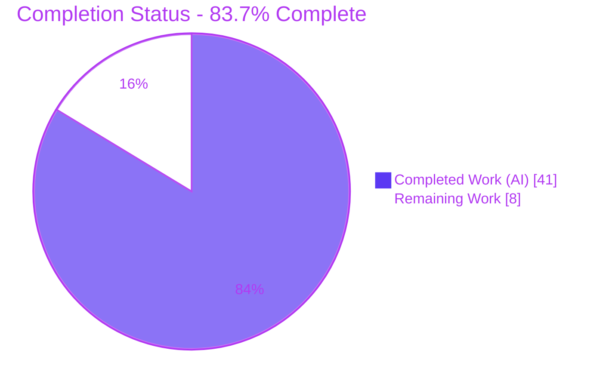
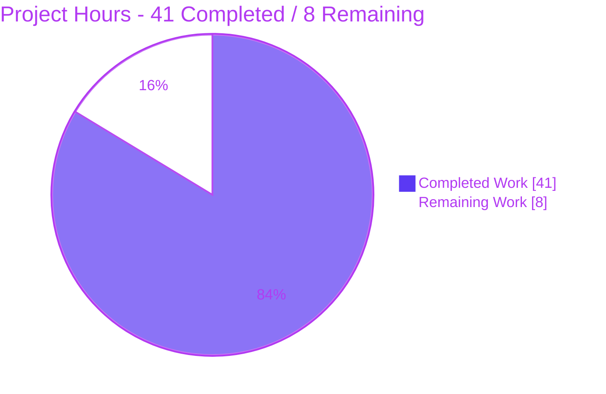
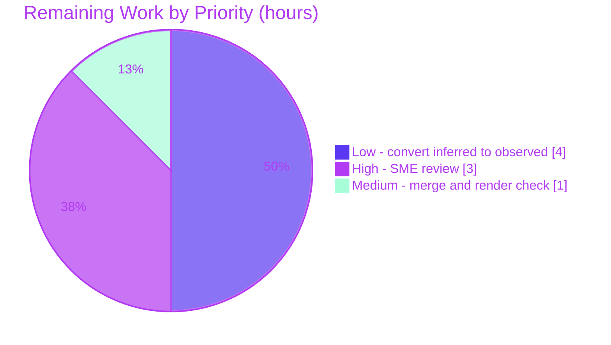

# Blitzy Project Guide — maddy Module-System Startup Onboarding

> Repository: `github.com/foxcpp/maddy` • Base commit: `26452dd8dd78` • Branch: `blitzy-54eaec3e-0994-4f50-8047-88df7e4caf73` • HEAD: `e424e7c`
> Task type: **Read-only technical onboarding documentation** (SWE-AtlasQnA-Repo)

---

## 1. Executive Summary

### 1.1 Project Overview

This project delivers a single, runtime-evidence-backed onboarding document — `blitzy/documentation/maddy_26452dd8dd78.md` — that explains how the **maddy** mail server's registration-based module system assembles at server startup, with emphasis on configurations that mix SMTP (`smtp`, `submission`) and IMAP (`imap`) endpoints. The target audience is a developer onboarding to the `github.com/foxcpp/maddy` codebase. The task was executed **run-first**: maddy was built and run against a canonical mixed-endpoint configuration, and every behavioral claim is backed by verbatim captured output, then explained cause→effect with a verified `file:line` anchor. It is a **read-only** engagement — no source files were modified; the sole artifact is the answer document.

### 1.2 Completion Status



| Metric | Value |
|--------|-------|
| **Total Hours** | **49** |
| **Completed Hours (AI + Manual)** | **41** (41 AI + 0 Manual) |
| **Remaining Hours** | **8** |
| **Percent Complete** | **83.7%** |

> Completion is computed with the PA1 AAP-scoped, hours-based methodology: `41 / (41 + 8) = 41/49 = 83.7%`. The 16.3% remaining is **not** missing document content — it is human-gated path-to-production (SME review + merge) plus one optional quality enhancement. All AAP content, methodology, and constraint requirements are delivered and independently validated with zero discrepancies.

### 1.3 Key Accomplishments

- ✅ **All six onboarding questions answered** (Q1–Q6), each leading with a direct answer, then a cause→effect mechanism with `file:line` anchors, then verbatim captured output.
- ✅ **Run-first methodology honored** — maddy built with `CGO_ENABLED=1 go build` and executed via the real entry point (`cmd/maddy` → `maddy.Run` → `instancesFromConfig`), not a test harness.
- ✅ **Three-phase assembly model** (Registration → Instantiation → Initialization) documented up front with a Mermaid flowchart.
- ✅ **~156 `file:line` citations across 36 source files**, 100% verified to resolve at commit `26452dd8dd78`.
- ✅ **Mixed SMTP + IMAP configuration** demonstrated live: `smtp` (:2525), `submission` (:5870), and `imap` (:1930) all bind in one run.
- ✅ **Out-of-order `&` (ampersand) reference** reproduced: `deliver_to &remote_queue` referenced before the `queue` block is defined, resolved depth-first at runtime.
- ✅ **Six edge/error paths reproduced verbatim**: unused block, dangling `&`, no endpoints, invocation guard (no `run` subcommand), nobounce, duplicate instance name.
- ✅ **Inferred-vs-observed labeling** applied to the two claims not driven at runtime (Q5 per-message ordering, Q6 systemd readiness line).
- ✅ **Read-only constraint fully honored** — `git diff 26452dd HEAD` = exactly 1 file added, 0 source `.go` files changed, working tree clean.
- ✅ **Independently validated** — Blitzy autonomous validation reproduced 100% of runtime evidence (byte-identical, stable across two runs) and verified 100% of citations, with zero discrepancies.

### 1.4 Critical Unresolved Issues

| Issue | Impact | Owner | ETA |
|-------|--------|-------|-----|
| _None_ — no blocking issues. The deliverable compiles, all tests pass, all documented runtime evidence reproduces, and the read-only constraint is honored. | None | — | — |

> There are no critical unresolved issues. The remaining work (Section 2.2) consists solely of a human acceptance review, a merge/render check, and one optional enhancement.

### 1.5 Access Issues

| System / Resource | Type of Access | Issue Description | Resolution Status | Owner |
|-------------------|----------------|-------------------|-------------------|-------|
| _None_ | — | No access issues identified. The task is a self-contained, in-repository codebase investigation requiring no external services, credentials, or third-party APIs. Build/test/run were performed offline with warmed module caches; git history is fully accessible. | N/A | — |

> **No access issues identified.** No web research was required (the domain is fully covered by in-repository sources of truth), and no external credentials or network resources are needed to build, run, or validate the deliverable.

### 1.6 Recommended Next Steps

1. **[High]** Assign a maddy maintainer / subject-matter expert to review the onboarding document for technical accuracy and new-contributor usefulness (spot-verify a sample of citations; assess clarity of the three-phase model and Mermaid diagram). *(3h)*
2. **[Medium]** Merge the documentation-only pull request and verify that the Mermaid flowchart, Markdown tables, and code fences render correctly in the target viewer. *(1h)*
3. **[Low]** _(Optional enhancement)_ Convert the two explicitly-labeled "inferred" claims to observed runtime evidence — drive a live SMTP transaction through instrumented check/modifier modules (Q5) and run under systemd/`NOTIFY_SOCKET` (Q6). *(4h)*

---

## 2. Project Hours Breakdown

### 2.1 Completed Work Detail

All completed work is Blitzy autonomous (AI) engineering. Each component traces to the AAP's run-first documentation mandate.

| Component | Hours | Description |
|-----------|-------|-------------|
| Environment setup & canonical CGO build | 3 | Provisioned the canonical toolchain (Go 1.18.10, gcc, CGO enabled), warmed offline module caches, and produced a runnable `maddy` binary; validated the default `sql`/sqlite3 CGO build path. |
| Source-code investigation across the module system | 8 | Read and traced the registry (`registry.go`), instance registry (`instances.go`), config resolver (`modconfig.go`), startup orchestration (`maddy.go`), endpoints (`smtp.go`, `imap.go`), and message pipeline (`msgpipeline/*`) — 36 distinct source files. |
| Run-first runtime observation | 4 | Ran maddy via the real entry point against a mixed `smtp`+`submission`+`imap` config; captured the verbatim `-debug` startup log; confirmed stability across two consecutive identical runs. |
| Edge / error path reproduction | 5 | Reproduced six guard/error paths verbatim: unused block, dangling `&` reference, no endpoints, invocation guard (`run` arg), nobounce, and duplicate instance name (all exit code 2). |
| Document authoring | 11 | Authored the 580-line / 6,016-word document: intro + run-first methodology + three-phase assembly model + Mermaid diagram + Q1–Q6 sections + Appendices A & B + preserved-typos section. |
| Citation verification | 2 | Verified all ~156 `file:line` anchors resolve correctly against source at commit `26452dd8dd78`. |
| Code-review cycle (commit `455ea76`) | 2 | Resolved 4 review findings: invocation-guard evidence block, full unedited nobounce output, corrected authentication-provider citation, added command context to reused snippets. |
| QA cycle (commit `e424e7c`) | 2 | Resolved 2 QA findings: Q2 log-order factual accuracy (banner-before-reference), and the duplicate-instance error path with a self-contained config. |
| Final comprehensive validation | 4 | Executed all five production-readiness gates (dependencies, compilation, 232 unit tests, runtime, documentation accuracy) and reproduced 100% of embedded evidence with zero discrepancies. |
| **Total Completed** | **41** | |

### 2.2 Remaining Work Detail

Each remaining item traces to path-to-production acceptance of the documentation deliverable or to the AAP's softer "prefer confirming at runtime" preference.

| Category | Hours | Priority |
|----------|-------|----------|
| Human SME / maintainer accuracy & onboarding-usefulness review of the 580-line document | 3 | High |
| Convert 2 labeled "inferred" claims to observed runtime evidence (Q5 per-message check/modifier ordering; Q6 systemd readiness line) | 4 | Low |
| Merge documentation PR + verify Markdown / Mermaid / table / code-fence rendering | 1 | Medium |
| **Total Remaining** | **8** | |

### 2.3 Hours Methodology

- **Scope basis (PA1):** The work universe is the AAP's single deliverable (the onboarding document answering Q1–Q6 under run-first, read-only constraints) plus standard path-to-production for a documentation artifact (human acceptance review + merge).
- **Completion formula:** `Completed / (Completed + Remaining) = 41 / 49 = 83.7%`.
- **Cross-section lock:** Section 2.1 total (41) + Section 2.2 total (8) = 49 = Total Hours in Section 1.2. Remaining hours (8) are identical in Sections 1.2, 2.2, and 7.
- **Confidence:** High for completed authoring/validation (directly observed evidence + independent reproduction); Medium for the optional enhancement (4h) since it depends on the effort to instrument modules and configure a systemd/notify environment.

---

## 3. Test Results

All results below originate from **Blitzy's autonomous validation logs** for this project, executed in the canonical container (Go 1.18.10, gcc 10.2.1, `CGO_ENABLED=1`). Because this is a read-only documentation task, the test suite is the maddy repository's **existing** Go test suite (run to confirm the codebase is sound and the documented runtime behavior reproduces); no tests were added or modified.

| Test Category | Framework | Total Tests | Passed | Failed | Coverage % | Notes |
|---------------|-----------|-------------|--------|--------|------------|-------|
| Unit / Package | Go `testing` (`go test`) | 232 fns across 20 pkgs | 232 / 20 pkgs | 0 | Not separately measured | `go test ./... -count=1` → exit 0; 20 packages OK, 26 packages have no test files; no panics/races. |
| Compilation | `go build` (CGO) | 1 | 1 | 0 | — | `CGO_ENABLED=1 go build ./...` → exit 0; only benign sqlite3 CGO warning (`sqlite3-binding.c:125322`). |
| Dependency Integrity | `go mod verify` | 103 modules | 103 | 0 | — | "all modules verified"; 103 pinned modules resolve offline. |
| Runtime / Behavioral | `maddy` binary (real entry point) | 7 scenarios | 7 | 0 | — | 1 main mixed-endpoint run (3 endpoints bind) + 6 edge/error paths; all reproduced verbatim, stable across two runs. |
| Documentation Accuracy | Citation + evidence audit | 156 citations | 156 | 0 | — | Every `file:line` anchor resolves at commit; embedded output byte-identical to fresh runs; preserved source typos confirmed real. |

**Unit-test packages passing (20):** `internal/address`, `internal/auth`, `internal/check/dns`, `internal/check/dnsbl`, `internal/config`, `internal/config/lexer`, `internal/dmarc`, `internal/endpoint/smtp`, `internal/future`, `internal/modify`, `internal/modify/dkim`, `internal/msgpipeline`, `internal/mtasts`, `internal/smtpconn`, `internal/storage/sql`, `internal/target/queue`, `internal/target/remote`, `internal/target/smtp_downstream`, `pkg/cfgparser`, `pkg/logparser`.

> **Coverage note:** A coverage percentage was not separately quantified for this engagement because no source code was added or modified (read-only task); the unit suite was executed to confirm build/behavioral soundness rather than to measure coverage of new code. The project's CI (`.build.yml`) runs `go test ./... -cover -race` for maintainers who wish to measure it.

---

## 4. Runtime Validation & UI Verification

**No web/graphical UI exists** — maddy is a headless mail-server daemon (SMTP/Submission/IMAP), so UI verification is not applicable. Runtime validation therefore covers daemon health, endpoint binding, and guard/error behavior, all exercised through the real entry point.

**Runtime health (canonical mixed-endpoint config):**

- ✅ **Operational** — `smtp` endpoint binds and logs `smtp: listening on tcp://127.0.0.1:2525`.
- ✅ **Operational** — `submission` endpoint binds and logs `submission: listening on tls://127.0.0.1:5870` (authentication provider wired: `sql local_mailboxes`).
- ✅ **Operational** — `imap` endpoint binds and logs `imap: listening on tls://127.0.0.1:1930`.
- ✅ **Operational** — Out-of-order `&remote_queue` reference resolves depth-first; the `reference &remote_queue` debug line is emitted only after the later-defined `queue` block's nested `Init` completes.
- ✅ **Operational** — Process stays alive until signaled; graceful shutdown on `SIGTERM` (`signal received (terminated), …`).
- ✅ **Operational** — "Settled graph" confirmed: all three `listening on` lines present with **no** `Unused configuration block` fatal.

**Guard / error-path validation (all exit code 2, reproduced verbatim):**

- ✅ **Operational** — Unused block → `Unused configuration block at …:55 - orphan_db (sql)` (fires after all endpoints bind).
- ✅ **Operational** — Dangling `&` → `unknown config block: does_not_exist`.
- ✅ **Operational** — No endpoints → `at least one endpoint should be configured`.
- ✅ **Operational** — Invocation guard → trailing `run` arg → `usage: /tmp/maddybin [options]` (confirms **no** `run` subcommand at this commit).
- ✅ **Operational** — Nobounce → `queue: autogenerated_msg_domain is required if bounce {} is specified` (full unedited trace; delivery-target line correctly absent).
- ✅ **Operational** — Duplicate instance → `…:12: config block named local_mailboxes already exists` (fires in Loop 1 before any endpoint binds).

**Inferred (not observed on plain stderr), honestly labeled in the document:**

- ⚠ **Partial** — systemd readiness line `Listening for incoming connections...` (only emitted when `NOTIFY_SOCKET` is set).
- ⚠ **Partial** — per-message check fan-out/merge and serial `RewriteSender → RewriteRcpt → RewriteBody` ordering (no live message was driven; grounded in cited source).

---

## 5. Compliance & Quality Review

The matrix maps each AAP requirement to Blitzy's quality/compliance benchmarks. Fixes applied during autonomous review/QA are noted.

| AAP Requirement / Benchmark | Status | Progress | Notes |
|-----------------------------|--------|----------|-------|
| Q1 — Startup assembly (mixed `smtp`/`submission`/`imap`) | ✅ Pass | 100% | Entry chain traced; all 3 endpoints bind in one run (verbatim). |
| Q2 — Immediate registration vs. deferred initialization | ✅ Pass | 100% | Factory maps vs. instance registry; `sql` banner evidence. QA fix `e424e7c` corrected log-order phrasing. |
| Q3 — Lazy init & out-of-order `&` resolution | ✅ Pass | 100% | `ModuleFromNode` `&`-detection + `GetInstance`; out-of-order `&remote_queue` reproduced. |
| Q4 — Endpoint vs. regular-module lifecycle divergence | ✅ Pass | 100% | `FuncNewEndpoint` vs `FuncNewModule`; eager Loop 2 vs lazy; unused/dangling proofs. |
| Q5 — Check/modifier coordination (no explicit wiring) | ✅ Pass | 95% | Mechanism documented; pipeline construction observed. Per-message ordering labeled **inferred**. |
| Q6 — Runtime "settled graph" evidence | ✅ Pass | 95% | `listening on` + unused-block guard + 4 negative paths observed. systemd line labeled **inferred**. |
| Run-first methodology (build & run before writing) | ✅ Pass | 100% | Real entry point; verbatim output embedded. |
| Every named item addressed by name + `file:line` | ✅ Pass | 100% | `module.Register`, `RegisterEndpoint`, `Get`/`GetEndpoint`, `RegisterInstance`, `GetInstance`, `ModuleFromNode`, `&` syntax, `checkRunner`, `modify.Group`, `smtp`/`submission`/`imap` all covered (Appendix B). |
| Complete, unedited output per condition | ✅ Pass | 100% | Review fix `455ea76` replaced a truncated nobounce tail with full output; added invocation-guard block. |
| Inferred-vs-observed labeling | ✅ Pass | 100% | Two inferred claims explicitly labeled. |
| Citation accuracy grounding | ✅ Pass | 100% | 156 anchors verified at commit; `modconfig.go` self-note (93 lines) correct. |
| Read-only source tree | ✅ Pass | 100% | `git diff` = 1 file added, 0 source `.go` changed. |
| Deliverable location/name (`blitzy/documentation/<branch>.md`) | ✅ Pass | 100% | `blitzy/documentation/maddy_26452dd8dd78.md`. |
| Temporary artifacts removed / repo unchanged | ✅ Pass | 100% | All `/tmp/obs` + binary artifacts outside repo, removed; tree clean. |
| Human SME acceptance review | ⬜ Pending | 0% | Path-to-production; assigned as High-priority task. |

---

## 6. Risk Assessment

| Risk | Category | Severity | Probability | Mitigation | Status |
|------|----------|----------|-------------|------------|--------|
| Citation line-number drift if the repo advances past commit `26452dd` | Technical | Low | Medium | Document pins the exact commit in its header; treat as a commit-specific artifact. | Mitigated by design |
| Toolchain mismatch (AAP assumed Go 1.13.4; canonical container used Go 1.18.10) | Technical | Low | Low | Document's "canonical vs. assumed" note; behavior is governed by source at the commit, not the toolchain. | Resolved |
| Mermaid flowchart may not render in all Markdown viewers | Technical | Low | Medium | Verify in target viewer at merge; degrades gracefully to a readable code block. | Open (Low) |
| Q5/Q6 inferred claims not runtime-observed | Integration | Low | Low | Both explicitly labeled "inferred"; AAP permits labeled inference; optional enhancement converts to observed. | Mitigated (labeled) |
| Onboarding doc drifts from source as maddy evolves | Operational | Low–Medium | Medium | Point-in-time artifact pinned to the commit; regenerate for future commits if needed. | Accepted by design |
| Doc not integrated into MkDocs / man-page site | Operational | Low | N/A | Standalone under `blitzy/documentation/` per AAP scope; a maintainer may wire it in later. | Out-of-scope by design |
| Throwaway self-signed cert / `insecure_auth` in observation config | Security | Low | Low | All observation artifacts live outside the repo and were deleted; no production or source impact. | Resolved |
| Human SME review pending before acceptance | Operational | Medium | High | Assign a maintainer review (High-priority task). | Open (planned) |

> **Overall risk posture: LOW.** A read-only documentation task introduces no code, dependency, or security changes to the repository; every technical risk is Low severity and most are mitigated by design.

---

## 7. Visual Project Status

**Project hours breakdown** (Completed = Dark Blue `#5B39F3`, Remaining = White `#FFFFFF`):



**Remaining hours by priority** (sums to 8h — matches Section 2.2 and Section 1.2):



**Remaining hours by category (bar view):**

| Category | Hours | Bar |
|----------|-------|-----|
| Human SME review (High) | 3 | ███████████████ |
| Convert inferred → observed (Low) | 4 | ████████████████████ |
| Merge + render check (Medium) | 1 | █████ |
| **Total** | **8** | |

> **Integrity check:** Pie "Remaining Work" = 8 = Section 1.2 Remaining Hours = Section 2.2 total. Pie "Completed Work" = 41 = Section 1.2 Completed Hours = Section 2.1 total.

---

## 8. Summary & Recommendations

**Achievements.** The engagement delivered a comprehensive, runtime-evidence-backed onboarding document that answers all six questions about how maddy's registration-based module system assembles at startup for mixed SMTP + IMAP configurations. It was produced run-first — the binary was built and executed via the real entry point, and every claim is grounded in verbatim captured output plus a verified `file:line` anchor. The document introduces a clear three-phase mental model (Registration → Instantiation → Initialization), reproduces the out-of-order `&`-reference behavior the user asked about, exercises six guard/error paths, and honestly labels the two claims that were inferred rather than observed.

**Remaining gaps.** The project is **83.7% complete** (41 of 49 hours). The 8 remaining hours are **not** missing document content — they are: a human SME/maintainer accuracy-and-usefulness review (the natural acceptance gate for any onboarding doc), a merge with a rendering check, and one optional enhancement that converts the two labeled "inferred" claims into directly observed runtime evidence.

**Critical path to production.** (1) SME review → (2) merge + render verification. The optional inferred→observed enhancement can proceed in parallel or be deferred, since the AAP explicitly permits labeled inference.

**Success metrics (all met for the autonomous scope):**

| Metric | Target | Result |
|--------|--------|--------|
| All six questions answered with evidence | 6/6 | ✅ 6/6 |
| Compilation | Clean | ✅ `go build ./...` exit 0 |
| Unit tests | All pass | ✅ 20/20 packages, 0 fail |
| Runtime evidence reproduced | 100% | ✅ 100%, stable across 2 runs |
| Citations verified | 100% | ✅ 156/156 at commit |
| Read-only constraint | 1 file only | ✅ 1 file added, 0 source changed |

**Production readiness assessment.** The deliverable is **production-ready pending human acceptance**. It is internally complete, independently validated with zero discrepancies, and compliant with every AAP methodology and scope constraint. No blockers exist; the only gates are the standard human review and merge.

---

## 9. Development Guide

This guide reproduces the run-first investigation behind the document. A **Go ≥ 1.13 toolchain, a C compiler, and CGO are required** because maddy's default `sql` storage uses the CGO SQLite driver.

### 9.1 System Prerequisites

- **OS:** Linux/Unix (validated in a Debian-based container; any modern Linux works).
- **Go:** ≥ 1.13 (`get.sh` declares `REQUIRED_GOVERSION=1.13.0`, default download `1.13.4`). The canonical validation container shipped **Go 1.18.10** — any 1.13→1.18 toolchain reproduces the documented behavior, which is governed by the source at the commit.
- **C compiler:** `gcc`/`cc` (required for the CGO `github.com/mattn/go-sqlite3 v1.11.0` driver).
- **OpenSSL:** for minting a throwaway self-signed certificate (IMAP/Submission use TLS).
- **Git** (+ Git LFS) to inspect history and verify the read-only constraint.
- _(Optional)_ **Docker**, if reproducing inside the canonical toolchain image.

### 9.2 Environment Setup

```bash
# Clone / enter the repository (branch under review)
cd <path-to>/maddy

# Enable CGO for the default sqlite3 storage driver
export CGO_ENABLED=1
```

### 9.3 Build & Test

```bash
# Verify pinned dependencies (offline-friendly). Expect: "all modules verified"
go mod verify

# Build the whole codebase. Expect exit 0; the only output is a benign
# sqlite3 CGO warning at sqlite3-binding.c:125322 (return address of local).
CGO_ENABLED=1 go build ./...

# Build a standalone binary OUTSIDE the repo (keeps the tree pristine)
CGO_ENABLED=1 go build -o /tmp/maddybin ./cmd/maddy

# Run the existing unit suite. Expect exit 0; 20 packages OK, 0 FAIL.
go test ./... -count=1
# (CI equivalent from .build.yml:  go test ./... -cover -race)
```

### 9.4 Prepare the Observation Environment (outside the repo)

```bash
mkdir -p /tmp/obs/state /tmp/obs/runtime

# Throwaway self-signed cert for the TLS endpoints
openssl req -x509 -newkey rsa:2048 \
  -keyout /tmp/obs/key.pem -out /tmp/obs/cert.pem \
  -days 1 -nodes -subj "/CN=localhost"

# Write /tmp/obs/maddy.conf mixing smtp(:2525) + submission(:5870) + imap(:1930)
# with an OUT-OF-ORDER  deliver_to &remote_queue  reference.
# (Full 52-line config is in Appendix A of blitzy/documentation/maddy_26452dd8dd78.md)
```

### 9.5 Run & Verify

```bash
# Correct invocation: binary + flags, NO positional argument.
/tmp/maddybin -debug -config /tmp/obs/maddy.conf
```

**Expected (settled graph):** three `listening on` lines and no fatal:

```text
smtp: listening on tcp://127.0.0.1:2525
submission: listening on tls://127.0.0.1:5870
imap: listening on tls://127.0.0.1:1930
```

Terminate with `SIGTERM` (e.g., `timeout -s TERM 3 /tmp/maddybin -debug -config /tmp/obs/maddy.conf`); expect graceful `signal received (terminated), …`.

### 9.6 Reproduce the Edge / Error Paths (each exits with code 2)

```bash
/tmp/maddybin -config /tmp/obs/maddy_unused.conf      # Unused configuration block at ...:55 - orphan_db (sql)
/tmp/maddybin -config /tmp/obs/maddy_dangling.conf    # unknown config block: does_not_exist
/tmp/maddybin -config /tmp/obs/maddy_noendp.conf      # at least one endpoint should be configured
/tmp/maddybin -config /tmp/obs/maddy.conf run         # usage: /tmp/maddybin [options]   (no 'run' subcommand)
/tmp/maddybin -debug -config /tmp/obs/maddy_nobounce.conf   # queue: autogenerated_msg_domain is required if bounce {} is specified
/tmp/maddybin -config /tmp/obs/maddy_duplicate.conf   # ...:12: config block named local_mailboxes already exists
```

### 9.7 Verify the Read-Only Constraint & Document Integrity

```bash
# Exactly one file added vs base; zero source .go changed; clean tree
git diff 26452dd HEAD --stat          # => 1 file changed, 580 insertions(+)
git diff 26452dd HEAD --name-only -- '*.go' | wc -l   # => 0
git status --porcelain                # => empty (clean)

# Document structural sanity
wc -l blitzy/documentation/maddy_26452dd8dd78.md      # => 580
grep -c '```' blitzy/documentation/maddy_26452dd8dd78.md  # => even (balanced fences)
```

### 9.8 Cleanup

```bash
rm -rf /tmp/obs /tmp/maddybin   # remove all temporary artifacts; repo stays byte-for-byte unchanged
```

### 9.9 Troubleshooting

- **`C compiler not found` / sqlite3 build error:** install `gcc` and ensure `CGO_ENABLED=1`.
- **Runtime "sqlite3 driver not found":** you built with `CGO_ENABLED=0`; rebuild with CGO on.
- **`usage: … [options]` on start:** you passed a positional argument (e.g., a trailing `run`); this commit has **no** `run` subcommand — pass only flags.
- **`bind: permission denied` / port in use:** choose high ports (the sample uses 2525/5870/1930) or free the port.
- **TLS handshake / cert errors on `submission`/`imap`:** ensure the `tls` directive points at a valid cert/key (mint a throwaway self-signed pair).
- **Mermaid diagram shows as raw code:** the Markdown viewer lacks Mermaid support; it degrades to a readable code block.
- **systemd readiness line never prints:** it is only emitted when `NOTIFY_SOCKET` is set (running under systemd); on plain stderr the settle evidence is the `listening on` lines plus the absence of the unused-block fatal.

---

## 10. Appendices

### Appendix A — Command Reference

| Purpose | Command |
|---------|---------|
| Verify dependencies | `go mod verify` |
| Build all packages | `CGO_ENABLED=1 go build ./...` |
| Build binary | `CGO_ENABLED=1 go build -o /tmp/maddybin ./cmd/maddy` |
| Run unit tests | `go test ./... -count=1` |
| Run unit tests (CI form) | `go test ./... -cover -race` |
| Mint throwaway cert | `openssl req -x509 -newkey rsa:2048 -keyout /tmp/obs/key.pem -out /tmp/obs/cert.pem -days 1 -nodes -subj "/CN=localhost"` |
| Run maddy (debug) | `/tmp/maddybin -debug -config /tmp/obs/maddy.conf` |
| Read-only diff (stat) | `git diff 26452dd HEAD --stat` |
| Read-only diff (files) | `git diff 26452dd HEAD --name-status` |
| Confirm authorship | `git log --author="agent@blitzy.com" 26452dd..HEAD --oneline` |
| Cleanup | `rm -rf /tmp/obs /tmp/maddybin` |

### Appendix B — Port Reference

| Port | Endpoint | Transport | Notes |
|------|----------|-----------|-------|
| 2525 | `smtp` (inbound SMTP) | `tcp://127.0.0.1:2525` | Plaintext in the observation config (`insecure_auth`). |
| 5870 | `submission` | `tls://127.0.0.1:5870` | TLS; wired to `sql` auth provider. |
| 1930 | `imap` | `tls://127.0.0.1:1930` | TLS; storage `&local_mailboxes`. |

> Ports are the sample observation values (chosen high to avoid privileges/conflicts); production maddy defaults differ (25/465/587/143/993).

### Appendix C — Key File Locations

| Path | Role |
|------|------|
| `blitzy/documentation/maddy_26452dd8dd78.md` | **The deliverable** (580 lines). |
| `cmd/maddy/main.go` | Process entry point (`os.Exit(maddy.Run())`). |
| `maddy.go` | Bootstrap: side-effect imports, `Run`, `moduleMain`, `instancesFromConfig` (3-loop assembly). |
| `internal/module/registry.go` | Factory maps (`modules`, `endpoints`) + `Register`/`RegisterEndpoint`. |
| `internal/module/instances.go` | Instance registry + `RegisterInstance` + `GetInstance` (lazy `Init`, cycle break). |
| `internal/module/module.go` | `Module` interface; `FuncNewModule` vs `FuncNewEndpoint`. |
| `internal/config/module/modconfig.go` | `ModuleFromNode` (`&`-detection, resolution, interface check). |
| `internal/endpoint/smtp/smtp.go` | `smtp`/`submission`/`lmtp` endpoint. |
| `internal/endpoint/imap/imap.go` | `imap` endpoint. |
| `internal/msgpipeline/{config,msgpipeline,check_runner}.go` | Check/modifier collection + ordered execution. |
| `internal/modify/group.go` | `modify.Group` (serial modifier composition). |
| `maddy.conf` | Canonical mixed SMTP+IMAP config (out-of-order `&` example at L111→L122). |
| `HACKING.md` | Developer design summary (registry, lazy init, endpoint special path). |
| `get.sh`, `.build.yml`, `go.mod`, `go.sum` | Toolchain/build/dependency references. |

### Appendix D — Technology Versions

| Component | Version | Source |
|-----------|---------|--------|
| Go module | `github.com/foxcpp/maddy` | `go.mod:L1` |
| Go language | `go 1.13` (min); container used `go1.18.10` | `go.mod:L3`; validation env |
| C compiler | `cc (Debian) 10.2.1` (validation); host `gcc 15.2.0` | validation env |
| go-sqlite3 | v1.11.0 (CGO) | `go.mod` |
| go-smtp | v0.12.1-0.20191206174923-1f576e0ec85c | `go.mod` |
| go-imap | v1.0.1 | `go.mod` |
| go-imap-sql | v0.3.2-0.20191208094750-8b4ec6b19a78 (logs "0.4.0") | `go.mod` |
| miekg/dns | v1.1.22 | `go.mod` |
| OpenSSL | 1.1.1n (validation) / 3.5.3 (host) | env |
| Total pinned modules | 103 | `go mod verify` |

### Appendix E — Environment Variable Reference

| Variable | Value / Example | Purpose |
|----------|-----------------|---------|
| `CGO_ENABLED` | `1` | **Required** — enables the CGO SQLite driver for the default `sql` storage. |
| `NOTIFY_SOCKET` | (set by systemd) | When present, maddy emits the readiness status `Listening for incoming connections...`; absent on plain stderr. |
| `GOFLAGS` / `GOMODCACHE` | (optional) | Offline/module-cache tuning for reproducible builds. |

### Appendix F — Developer Tools Guide

- **Diff & authorship:** `git diff 26452dd HEAD --stat`, `--name-status`; `git log --author="agent@blitzy.com" 26452dd..HEAD --oneline` (expect 3 commits).
- **Static structural checks (no toolchain needed):** `wc -l`, `grep -c '```'` (fence balance), `grep '^## '` (section list) on the deliverable.
- **Runtime debug flag:** `-debug` surfaces the `reference &name` / `new module …` trace that reveals the depth-first lazy-init order.
- **Log format note:** maddy terminates each log record with a literal TAB (`cat -A` renders `^I`); cosmetic and omitted from quoted blocks for readability.

### Appendix G — Glossary

| Term | Meaning |
|------|---------|
| **Module** | A functional unit implementing the `Module` interface; self-registers into a global factory map from a package `init()`. |
| **Endpoint** | A special module (`smtp`, `submission`, `lmtp`, `imap`) built via `FuncNewEndpoint`; a root of the reference graph, initialized **eagerly and directly**, never placed in the instance registry. |
| **Factory registry** | Global `modules`/`endpoints` maps populated at process start (Phase 1) by side-effect-import `init()`s. |
| **Instance registry** | `instances`/`aliases`/`Initialized` maps populated during Loop 1 (Phase 2) via `RegisterInstance`; holds constructed-but-uninitialized objects. |
| **Lazy initialization** | Regular modules' `Init` is deferred until a `&` reference reaches them via `GetInstance` (at most once). |
| **`&name` (ampersand) reference** | Config syntax that points one module at another by instance name; resolved by `ModuleFromNode` regardless of textual order. |
| **Three-phase assembly** | Registration (before `main`) → Instantiation (Loop 1) → Initialization (Loops 2 & 3). |
| **`checkRunner`** | Coordinator that runs a group of checks as parallel goroutines and merges results under a lock. |
| **`modify.Group`** | Composes multiple modifiers and runs them **serially** in a fixed rewrite order. |
| **Settled graph** | Startup state where every endpoint logs `listening on` and no `Unused configuration block` fatal occurs. |

---

*Generated by the Blitzy Platform. Completion percentage (83.7%) reflects AAP-scoped autonomous work plus path-to-production, per the PA1 hours-based methodology. Brand colors: Completed `#5B39F3`, Remaining `#FFFFFF`, Accents `#B23AF2`, Highlight `#A8FDD9`.*