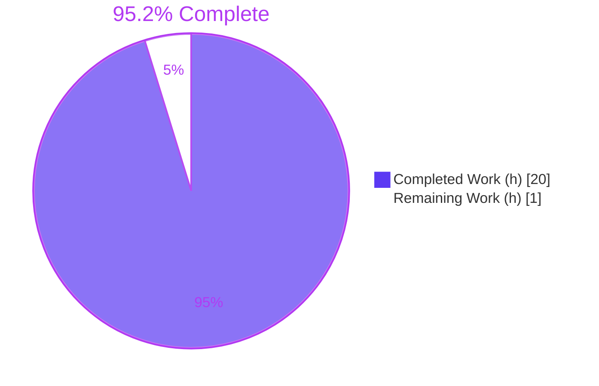
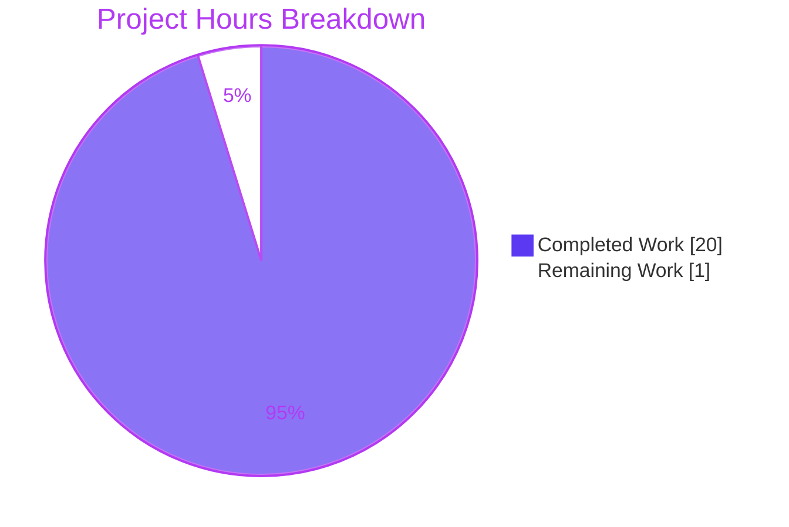
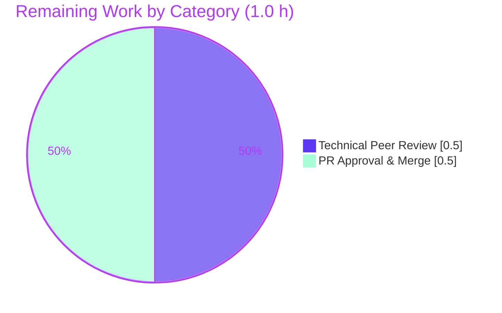

# Blitzy Project Guide — maddy Runtime Logging & Delivery Behavior Q&A

## 1. Executive Summary

### 1.1 Project Overview

This project is a SWE-Atlas Q&A documentation task against the `maddy` mail server codebase (`github.com/foxcpp/maddy`, commit `26452dd8dd787dc455278b0fdd296f4a5432c768`). The deliverable is one evidence-grounded Markdown document, `blitzy/documentation/maddy_26452dd8dd78.md`, that answers four clusters of runtime-behavior questions about how `maddy` logs and behaves during SMTP intake, queue delivery, retry scheduling, and remote delivery. Every answer is derived from actual `go test -v` output and corroborated line-by-line against the emitting Go source, with explicit per-answer rationale and RFC 3463 validation of the SMTP enhanced status codes. The audience is engineers who need an authoritative, reproducible reference for maddy's structured-log contract. The repository is treated strictly read-only.

### 1.2 Completion Status

The project is **95.2% complete** on an AAP-scoped, hours-based basis. The remaining 1.0 hour is the human acceptance gate (technical peer review and PR merge) — there is no remaining engineering work, no failing tests, and no unresolved errors.



| Metric | Value |
|--------|-------|
| Total Hours | 21.0 h |
| Completed Hours (AI + Manual) | 20.0 h (AI: 20.0 h, Manual: 0.0 h) |
| Remaining Hours | 1.0 h |
| Percent Complete | **95.2%** |

> Completion is computed using the AAP-scoped PA1 methodology: `Completed ÷ (Completed + Remaining) = 20.0 ÷ 21.0 = 95.238% → 95.2%`.

### 1.3 Key Accomplishments

- ✅ **All four question clusters (R1–R4) answered** with verbatim log output captured from live `go test -v` runs and reconciled against the emitting source.
- ✅ **Single in-scope deliverable created** — `blitzy/documentation/maddy_26452dd8dd78.md` (615 lines), correctly named after the source branch and placed in `blitzy/documentation/`.
- ✅ **Full build & test suite green** — `go build ./...` exit 0; `go test ./...` = 20 packages OK, 0 failures.
- ✅ **Verbatim fidelity honored** — the upstream "estabilish" misspelling preserved (14 occurrences, 0 corrected); JSON fields rendered alphabetically; numeric fields kept numeric.
- ✅ **RFC 3463 validated** against the authoritative IETF standard to explain the `5.7.0` (and surfaced aggregate `5.4.0`) enhanced status codes.
- ✅ **Read-only constraint upheld** — git diff shows exactly one file added (+615/−0); no maddy source/test/config modified; working tree clean.
- ✅ **Subtle behaviors documented honestly** — the two-layer error chain (inner `5.7.0` vs. surfaced aggregate `5.4.0`), non-deterministic per-recipient failure-line ordering, and the `-test.debuglog` flag-placement gotcha.

### 1.4 Critical Unresolved Issues

| Issue | Impact | Owner | ETA |
|-------|--------|-------|-----|
| None | No unresolved issues block release or validation. Build is green, full test suite passes, and the deliverable is verified accurate against live output. | — | — |

### 1.5 Access Issues

No access issues identified. The Go 1.13.15 toolchain, module cache, and test fixtures were all available offline in the provided environment; no external credentials, repository permissions, or third-party API access were required to build, test, or reproduce the documented behavior.

| System/Resource | Type of Access | Issue Description | Resolution Status | Owner |
|-----------------|---------------|-------------------|-------------------|-------|
| — | — | No access issues identified | N/A | — |

### 1.6 Recommended Next Steps

1. **[Medium]** Conduct a technical peer review of `maddy_26452dd8dd78.md` for accuracy and completeness against the four question clusters (≈0.5 h).
2. **[Low]** Approve and merge the documentation PR into the target branch (≈0.5 h).
3. **[Low]** Optionally re-run the four reproduction commands in Section 9 to independently confirm the captured log output before sign-off.

---

## 2. Project Hours Breakdown

### 2.1 Completed Work Detail

| Component | Hours | Description |
|-----------|-------|-------------|
| Environment setup & full build verification | 1.0 | Activate Go 1.13.15 toolchain, verify module cache (`go mod verify`), `go build ./...` exit 0 [AAP §0.3.1] |
| Logging subsystem investigation | 2.0 | Trace `log.go` (module prefix, base-field merge, `Error()` reason), `orderedjson.go` (alphabetical key sort, Duration/Time normalization), `delivery.go` (`msg_id` injection) [AAP §0.3.5] |
| R1 — SMTP endpoint investigation & capture | 2.5 | Run `TestSMTPDelivery`/`_AbortData`/`_AbortLogout`; capture `RCPT ok`, `aborted`, `DATA error`; confirm module name `smtp` and 8-char hex `msg_id` |
| R2 — Queue delivery-trace investigation & capture | 2.5 | Run `TestQueueDelivery_TemporaryFail` with `-test.debuglog`; capture the ordered `delivery attempt #N` → `delivery attempt failed` → `will retry` sequence |
| R3 — Remote MX-auth + TLS fallback investigation | 3.0 | Run `TestRemoteDelivery_AuthMX_Fail` and `_TLSErrFallback`; capture the MX-auth error, `550`/`5.7.0` vs aggregate `5.4.0`, and TLS→plaintext fallback fields |
| R4 — Retry-delay field investigation | 1.0 | Confirm `next_try_delay` field name, companion `attempts_count`, Duration→string rendering, and config-dependent value |
| RFC 3463 web research & validation | 1.0 | Validate enhanced status code class/subject/detail semantics against the IETF standard |
| Document authoring | 4.0 | Write the 615-line Markdown deliverable: per-cluster answers, quoted output, and rationale |
| Verbatim-fidelity QA & review-fix cycles | 2.0 | Preserve "estabilish", alphabetical fields, numeric fields; address review findings (commits 2d5da5e, 632da58) |
| Final validation pass & commit | 1.0 | Re-verify all five production-readiness gates, cleanup temp artifacts, commit deliverable |
| **Total** | **20.0** | **Completed AAP-scoped engineering hours** |

### 2.2 Remaining Work Detail

| Category | Hours | Priority |
|----------|-------|----------|
| Documentation technical peer review & accuracy sign-off (path-to-production) | 0.5 | Medium |
| PR approval & merge of documentation deliverable (path-to-production) | 0.5 | Low |
| **Total** | **1.0** | — |

### 2.3 Estimation Notes

- All hours trace to a specific AAP requirement (R1–R4, constraints C1–C8) or a path-to-production activity (P1–P5).
- Confidence is **High**: the task is documentation-only with a well-defined, deterministic evidence base. Per RG2, completion never reaches 100% before human review — the residual 1.0h reflects the human acceptance gate, not outstanding engineering.
- `2.1 (20.0 h) + 2.2 (1.0 h) = 21.0 h` total, matching Section 1.2.

---

## 3. Test Results

All tests below are the project's **own existing Go test suite**, executed by Blitzy's autonomous validation systems as the evidence base for the documentation. **No new tests were authored** — the read-only constraint forbids adding code beyond the single Markdown file. The targeted runs surfaced the structured-log output quoted in the deliverable.

| Test Category | Framework | Total Tests | Passed | Failed | Coverage % | Notes |
|---------------|-----------|-------------|--------|--------|-----------|-------|
| Full repository suite | Go `testing` | 20 pkgs w/ tests | 20 pkgs OK | 0 | — | `go test ./...` exit 0; 26 packages report no test files |
| SMTP endpoint (R1) | Go `testing` | 23 funcs | 23 | 0 | 79.4% | `internal/endpoint/smtp` — `RCPT ok` / `aborted` / `DATA error` lines |
| Queue target (R2, R4) | Go `testing` | 21 funcs | 21 | 0 | 74.7% | `internal/target/queue` — delivery-attempt → failed → `will retry` (run with `-test.debuglog`) |
| Remote target (R3) | Go `testing` | 38 funcs | 38 | 0 | 76.3% | `internal/target/remote` — MX-auth `550`/`5.7.0`+`5.4.0`, TLS→plaintext fallback |
| Message-ID generator (support) | Go `testing` | included above | pass | 0 | 74.5% | `internal/msgpipeline` — `msg_id` = 8-char lowercase hex |

> Running the three traced packages together (`smtp` + `queue` + `remote`) yields **80 PASS lines, 0 FAIL**. Coverage figures are statement coverage reported by `go test -cover` on the respective packages. The only non-test output across the full build is a benign vendored `mattn/go-sqlite3` cgo compiler warning (out-of-scope C; build exit remains 0).

---

## 4. Runtime Validation & UI Verification

**UI Verification:** Not applicable. `maddy` is a headless mail server with no graphical interface; the deliverable is a Markdown document. No UI work is in scope.

**Runtime Validation** (each behavior reproduced from a live `go test -v` run and matched against the emitting source):

- ✅ **Operational — Build:** `go build ./...` compiles all packages, exit 0.
- ✅ **Operational — R1 SMTP endpoint logging:** `smtp: RCPT ok` emits exactly `{"msg_id":"<8 hex>","rcpt":"<addr>"}` (alphabetical); `smtp: aborted` emits only `{"msg_id":"<8 hex>"}`; module prefix is `smtp`; `msg_id` is an 8-char lowercase hex string.
- ✅ **Operational — R2 queue delivery trace:** ordered sequence reproduced — `[debug] queue: delivery attempt #1` (debug-gated) → `queue: delivery attempt failed {"msg_id",...,"rcpt","reason"}` → `queue: will retry {"attempts_count","msg_id","next_try_delay","rcpts"}`.
- ✅ **Operational — R3 remote MX-auth failure:** inner error string `Failed to estabilish the MX record (mx.example.invalid.) authenticity` with `550` / `5.7.0`; the surfaced aggregate "No usable MXs" error reports `5.4.0` — both documented and explained via RFC 3463.
- ✅ **Operational — R3 TLS→plaintext fallback:** `remote: TLS error, falling back to plaintext` emits exactly four alphabetical fields `{"domain","msg_id","mx","reason"}`.
- ✅ **Operational — R4 retry-delay field:** `will retry` line carries `next_try_delay` (Go `time.Duration` rendered as a string) alongside the numeric `attempts_count`; value is configuration-dependent.

No partial or failing runtime behaviors were observed.

---

## 5. Compliance & Quality Review

| # | AAP Requirement / Rule | Benchmark | Status | Progress |
|---|------------------------|-----------|--------|----------|
| 1 | R1 — `RCPT ok` line + all JSON fields | Verbatim capture + rationale | ✅ Pass | 100% |
| 2 | R1 — `aborted` contrast line | Verbatim capture + rationale | ✅ Pass | 100% |
| 3 | R1 — module name `smtp` in prefix | Source-cited [smtp.go:715] | ✅ Pass | 100% |
| 4 | R1 — `msg_id` 8-char hex format | Source-cited [msgid.go:12-15] | ✅ Pass | 100% |
| 5 | R2 — complete ordered log sequence | Captured with `-test.debuglog` | ✅ Pass | 100% |
| 6 | R3 — MX-auth error string (verbatim) | "estabilish" preserved | ✅ Pass | 100% |
| 7 | R3 — enhanced status code (X.Y.Z) + reply | `550`/`5.7.0` + aggregate `5.4.0` | ✅ Pass | 100% |
| 8 | R3 — TLS→plaintext fallback log (all fields) | 4 alphabetical fields | ✅ Pass | 100% |
| 9 | R4 — `next_try_delay` field name | Source-cited [queue.go:417] | ✅ Pass | 100% |
| 10 | Read-only repository | git diff = 1 file added | ✅ Pass | 100% |
| 11 | Evidence-based (run, don't assume) | All answers from live test output | ✅ Pass | 100% |
| 12 | Exact file name & location | `blitzy/documentation/maddy_26452dd8dd78.md` | ✅ Pass | 100% |
| 13 | Verbatim fidelity (no corrections) | Misspelling + alphabetical + numeric | ✅ Pass | 100% |
| 14 | Per-answer rationale provided | Each cluster has a Rationale section | ✅ Pass | 100% |
| 15 | RFC 3463 web validation | Standard consulted & cited | ✅ Pass | 100% |
| 16 | Mandatory test flags (`-v`, `-test.debuglog`) | Used + placement gotcha documented | ✅ Pass | 100% |
| 17 | Temporary scripts cleaned up | No temp artifacts in repo | ✅ Pass | 100% |
| 18 | Build & full suite green | build exit 0; tests 0 fail | ✅ Pass | 100% |
| 19 | Human peer review & acceptance | Path-to-production gate | ⬜ Pending | 0% |

**Fixes applied during autonomous validation:** review findings addressed in commit `2d5da5e` (R2 trace & methodology commands) and `632da58` (R2 per-recipient failure-line ordering fidelity). The final validation pass found the deliverable already accurate and made zero further edits. **Outstanding:** only the human peer-review/acceptance gate (row 19).

---

## 6. Risk Assessment

Overall risk posture: **LOW**. The deliverable is verified accurate; the only residual is human acceptance.

| Risk | Category | Severity | Probability | Mitigation | Status |
|------|----------|----------|-------------|------------|--------|
| Non-deterministic per-recipient failure-line ordering (Go map range) could surprise a reader expecting fixed order | Technical | Low | Medium | Documented explicitly as non-deterministic with both observed orderings | Mitigated |
| Random/config-dependent values (`msg_id`, `next_try_delay`) vary per run | Technical | Low | High | Documented as run/config-dependent; formula + defaults + test override explained, not hard-coded | Mitigated |
| Go 1.13 toolchain dependency for reproduction | Technical | Low | Low | Exact toolchain + activation documented in Section 9; module cache offline-ready | Mitigated |
| `-test.debuglog` flag placement gotcha (before vs. after package path) | Technical | Low | Medium | Correct placement documented with a negative-control note in Section 9 | Mitigated |
| Benign vendored `mattn/go-sqlite3` cgo compiler warning | Operational | Low | Low | Out-of-scope C code; build exit 0, no test impact; accepted | Accepted |
| Commit drift could change line numbers/strings cited in the doc | Integration | Low | Low | Doc pinned to commit `26452dd…`; citations verified at that commit | Mitigated |
| Security exposure from the documentation change | Security | None | N/A | Documentation-only; no code paths, secrets, or dependencies altered | N/A |

---

## 7. Visual Project Status

**Project hours — completed vs. remaining** (Completed = Dark Blue `#5B39F3`, Remaining = White `#FFFFFF`):



**Remaining work by category** (totals to the 1.0 h in Sections 1.2 and 2.2):



**Completed hours by component** (sums to 20.0 h):

| Component | Hours |
|-----------|------:|
| Document authoring | 4.0 |
| R3 remote investigation | 3.0 |
| R1 SMTP investigation | 2.5 |
| R2 queue investigation | 2.5 |
| Logging subsystem investigation | 2.0 |
| Verbatim-fidelity QA & review fixes | 2.0 |
| Environment setup & build | 1.0 |
| R4 retry-field investigation | 1.0 |
| RFC 3463 research | 1.0 |
| Final validation & commit | 1.0 |
| **Total** | **20.0** |

---

## 8. Summary & Recommendations

**Achievements.** The project delivered a single, authoritative, evidence-grounded documentation file answering all four runtime-behavior question clusters (R1–R4) for the `maddy` mail server. Every quoted log line, error string, enhanced status code, and JSON field name was captured from live `go test -v` output and reconciled against the emitting source, with per-cluster rationale and RFC 3463 validation. The full build and test suite are green, and the read-only constraint was strictly honored (exactly one file added).

**Completion.** The project is **95.2% complete** (20.0 of 21.0 AAP-scoped hours). The remaining **1.0 hour** is entirely the human acceptance gate.

**Remaining gaps & critical path.** There is no outstanding engineering work. The critical path to production is: (1) technical peer review of the document (0.5 h) → (2) PR approval & merge (0.5 h).

**Success metrics.** Build exit 0; `go test ./...` 20 packages OK / 0 failures; all R1–R4 behaviors reproduced verbatim; "estabilish" misspelling preserved with 0 corrections; git diff = 1 file added.

**Production-readiness assessment.** **Ready for human review.** The deliverable meets every AAP requirement and quality benchmark with a LOW overall risk posture and no blocking issues. Recommend proceeding directly to peer review and merge.

---

## 9. Development Guide

This guide reproduces the runtime evidence behind the documentation. All commands were tested in the provided environment.

### 9.1 System Prerequisites

- **OS:** Linux (Ubuntu-based container used during validation)
- **Go toolchain:** Go **1.13.x** (validated with `go1.13.15`) — required by `go.mod` (`go 1.13`)
- **Disk/network:** Module cache is pre-provisioned and offline-ready; no internet access is required for build or test
- **Repository:** `github.com/foxcpp/maddy` at commit `26452dd8dd787dc455278b0fdd296f4a5432c768`

### 9.2 Environment Setup

```bash
# Activate the Go 1.13 toolchain (adds /usr/local/go/bin to PATH)
. /etc/profile.d/go.sh

# Verify the toolchain and module integrity
go version          # expect: go version go1.13.15 linux/amd64
go env GO111MODULE  # expect: on
go mod verify       # expect: all modules verified
```

### 9.3 Build

```bash
# From the repository root
go build ./...      # expect: exit 0
# Note: a benign vendored mattn/go-sqlite3 cgo warning may print; build still succeeds.
```

### 9.4 Full Test Suite

```bash
go test ./...
# expect: 20 packages "ok", 0 failures, 26 "[no test files]"
```

### 9.5 Reproduce the Documented Behavior (R1–R4)

```bash
# R1 — SMTP endpoint logging (RCPT ok / aborted / DATA error)
go test -v -run 'TestSMTPDelivery$|TestSMTPDelivery_AbortData|TestSMTPDelivery_AbortLogout' ./internal/endpoint/smtp/

# R2 + R4 — Queue delivery trace & retry scheduling
# IMPORTANT: -test.debuglog MUST come AFTER the package path (see Troubleshooting)
go test -v -run TestQueueDelivery_TemporaryFail ./internal/target/queue/ -test.debuglog

# R3 — Remote MX-auth failure & TLS→plaintext fallback
go test -v -run 'TestRemoteDelivery_AuthMX_Fail|TestRemoteDelivery_TLSErrFallback' ./internal/target/remote/
```

Representative expected output (values such as `msg_id` and `next_try_delay` vary per run):

```text
smtp: RCPT ok	{"msg_id":"3a5eda68","rcpt":"rcpt1@example.com"}
smtp: aborted	{"msg_id":"2b4c0bf4"}
[debug] queue: delivery attempt #1	{"msg_id":"<40 hex>"}
queue: delivery attempt failed	{"msg_id":"<40 hex>","rcpt":"tester2@example.org","reason":"go away"}
queue: will retry	{"attempts_count":1,"msg_id":"<40 hex>","next_try_delay":"-463ns","rcpts":["tester2@example.org"]}
remote: TLS error, falling back to plaintext	{"domain":"example.invalid","msg_id":"<40 hex>","mx":"mx.example.invalid.","reason":"smtpconn: x509: certificate signed by unknown authority"}
```

### 9.6 View the Deliverable

```bash
# The single in-scope artifact (615 lines)
sed -n '1,40p' blitzy/documentation/maddy_26452dd8dd78.md
wc -l blitzy/documentation/maddy_26452dd8dd78.md   # expect: 615
```

### 9.7 Troubleshooting

- **The `delivery attempt #N` line is missing.** It is debug-gated; pass `-test.debuglog`. Without it, the line is suppressed by design.
- **`-test.debuglog` placement gotcha.** Placing the flag *before* the package path causes Go to treat it as a build flag and the tests do not run (output: `? github.com/foxcpp/maddy [no test files]`). The flag MUST follow the package path, e.g. `./internal/target/queue/ -test.debuglog`.
- **No log lines appear.** The test logger forwards each line to `t.Log`, which is only printed in verbose mode — always pass `-v`.
- **`next_try_delay` shows a tiny/negative value (e.g., `-463ns`).** Expected in tests: the harness overrides `initialRetryTime=0`, `retryTimeScale=1`. Production defaults are `15m` × `2^(n-1)`.
- **cgo warning during build.** The vendored `mattn/go-sqlite3` prints a benign `-Wreturn-local-addr` warning; it is out-of-scope C and does not fail the build.
- **Per-recipient failure ordering differs between runs.** Expected: the failure lines iterate a Go map, so ordering is non-deterministic.

---

## 10. Appendices

### A. Command Reference

| Command | Purpose |
|---------|---------|
| `. /etc/profile.d/go.sh` | Activate the Go 1.13 toolchain |
| `go version` | Confirm `go1.13.15` |
| `go mod verify` | Confirm module cache integrity |
| `go build ./...` | Build all packages (exit 0) |
| `go test ./...` | Run the full suite (20 OK / 0 fail) |
| `go test -v -run '<pattern>' ./<pkg>/` | Run targeted tests in verbose mode |
| `go test ... ./internal/target/queue/ -test.debuglog` | Surface debug-gated queue lines |
| `go test -cover ./<pkg>/` | Report statement coverage |

### B. Port Reference

Not applicable as fixed ports. Integration tests run in-process on ephemeral loopback addresses with mocked DNS (`go-mockdns`); no externally exposed service ports are used during reproduction.

### C. Key File Locations

| Path | Role |
|------|------|
| `blitzy/documentation/maddy_26452dd8dd78.md` | **The deliverable** (only file added) |
| `internal/endpoint/smtp/smtp.go` | `RCPT ok` [243], `aborted` [72], module `smtp` [715] |
| `internal/msgpipeline/msgid.go` | `GenerateMsgID()` → 8-char hex [12-15] |
| `internal/target/queue/queue.go` | `delivery attempt #N` [367], `delivery attempt failed` [384], `will retry`/`next_try_delay` [415-417] |
| `internal/target/remote/connect.go` | MX-auth `550`/`5.7.0` [94-99], TLS fallback log [176-177] |
| `internal/log/log.go` | Module prefix [182], base-field merge, `Error()` reason [89-99] |
| `internal/log/orderedjson.go` | Alphabetical key sort [23], Duration/Time normalization [42-50] |
| `internal/target/delivery.go` | `DeliveryLogger` injects `msg_id` [8-14] |
| `internal/testutils/logger.go` | Routes log lines to `t.Log` [34]; `-test.debuglog` [14] |
| `.build.yml` | Canonical build/test commands [11,14] |

### D. Technology Versions

| Component | Version |
|-----------|---------|
| Go (language/runtime) | 1.13.15 |
| Module mode | `GO111MODULE=on` |
| `github.com/emersion/go-smtp` | v0.12.1-0.20191206174923-1f576e0ec85c |
| `github.com/foxcpp/go-mockdns` | v0.0.0-20191123143003-02edb10da1e3 |
| `github.com/miekg/dns` | v1.1.22 |
| `github.com/emersion/go-message` | v0.10.9-0.20191116124005-65fd0119e899 |
| `github.com/emersion/go-sasl` | v0.0.0-20190817083125-240c8404624e |

### E. Environment Variable Reference

| Variable | Value / Note |
|----------|--------------|
| `GO111MODULE` | `on` (module-aware build) |
| `GOROOT` | `/usr/local/go` |
| `GOPATH` | `/root/go` |
| `PATH` | Must include `/usr/local/go/bin` (set by `/etc/profile.d/go.sh`) |

No application-level secrets or credentials are required for this read-only documentation task.

### F. Developer Tools Guide

| Tool / Flag | Use |
|-------------|-----|
| `go test -v` | Verbose mode — required so the test logger's `t.Log` output is printed |
| `-test.debuglog` | Surfaces debug-gated lines (e.g., `delivery attempt #N`); place AFTER the package path |
| `-test.directlog` | Alternative direct-to-stdout log routing (not required for these captures) |
| `-run '<regex>'` | Select specific test functions per question cluster |
| `-cover` | Statement coverage for a package |
| `go vet ./<pkg>/` | Static analysis on traced packages (clean) |

### G. Glossary

| Term | Definition |
|------|------------|
| **AAP** | Agent Action Plan — the governing specification for this task |
| **R1–R4** | The four question clusters: SMTP endpoint logging, queue delivery trace, remote delivery, queue retry |
| **`msg_id`** | Per-message identifier; hex encoding of 4 random bytes → 8-char lowercase hex (40-char in delivery loggers that carry the full ID) |
| **`next_try_delay`** | JSON field on the `will retry` line holding the retry delay (Go `time.Duration` rendered as a string) |
| **Enhanced status code** | RFC 3463 `class.subject.detail` (X.Y.Z); class 5 = permanent failure, subject 7 = security/policy (`5.7.0`), subject 4 = network/routing (`5.4.0`) |
| **debug-gated** | A log line emitted only when debug logging is enabled (`-test.debuglog`) |
| **"estabilish"** | The upstream source misspelling of "establish" in the MX-auth error string; preserved verbatim per the verbatim-fidelity rule |
| **Headless** | No graphical UI; `maddy` is a server, so UI verification is not applicable |