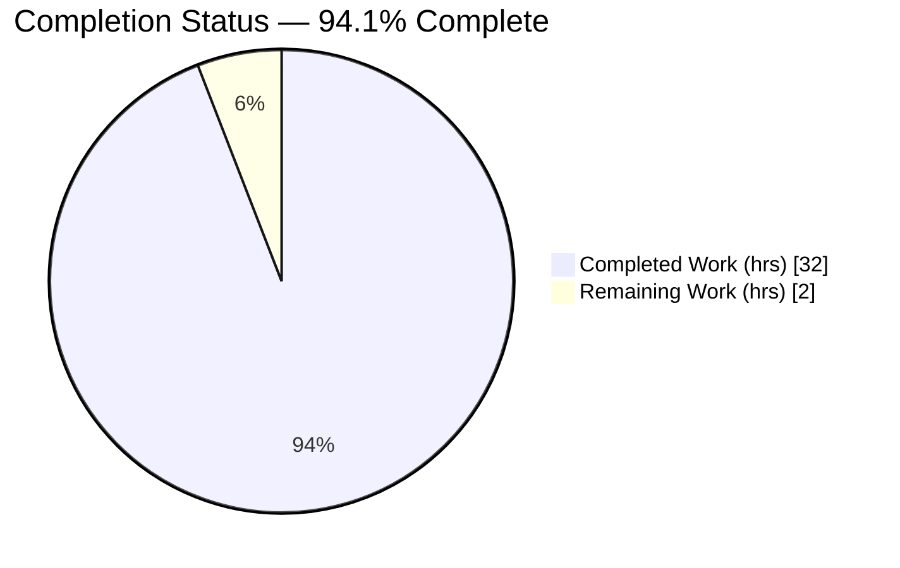
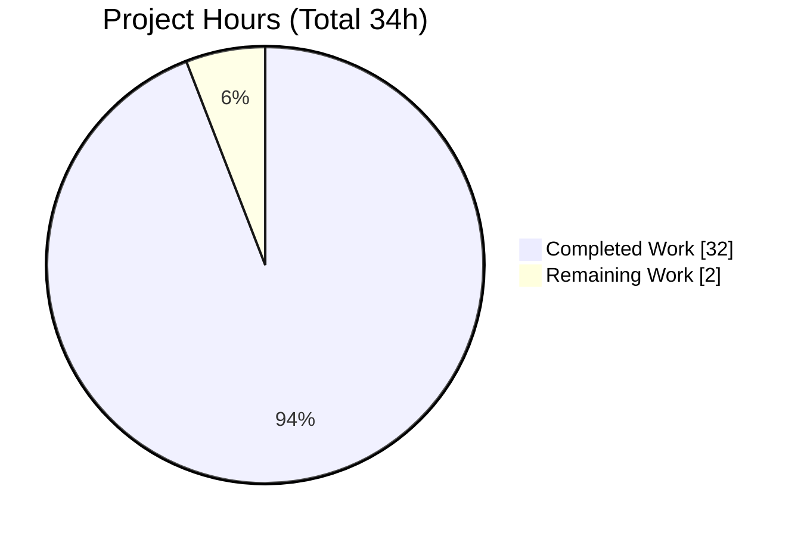
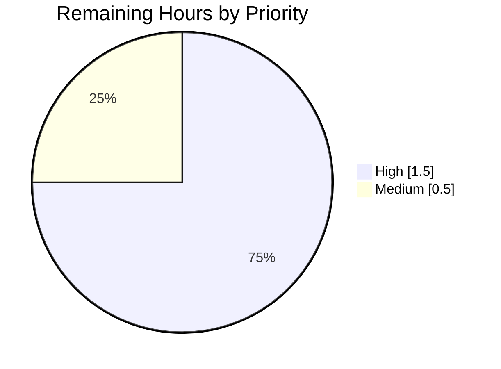

# Blitzy Project Guide — maddy Runtime-Logging Onboarding Documentation

> **Project:** Runtime-behavior Q&A documentation for `github.com/foxcpp/maddy`
> **Commit:** `26452dd8dd787dc455278b0fdd296f4a5432c768` · **Branch:** `maddy_26452dd8dd78`
> **Deliverable:** `blitzy/documentation/maddy_26452dd8dd78.md` (1,082 lines)
> **Legend — Blitzy Brand Colors:** <span style="color:#5B39F3">■ Completed / AI Work (Dark Blue #5B39F3)</span> · <span>□ Remaining / Not Completed (White #FFFFFF)</span> · <span style="color:#B23AF2">Headings/Accents (#B23AF2)</span> · <span style="color:#A8FDD9">Highlight (Mint #A8FDD9)</span>

---

## 1. Executive Summary

### 1.1 Project Overview

This project onboards a developer to the `foxcpp/maddy` mail server by empirically documenting its runtime logging behavior. Through executing the existing Go test suite with verbose output and tracing real code paths, it produces one authoritative Markdown answer document covering SMTP endpoint logging, queue delivery/retry tracing, and remote-delivery MX-authentication and TLS-fallback behavior. Every factual claim is grounded in captured runtime evidence with exact `file:line` citations and rationale — not code reading alone. The target audience is engineers new to the maddy codebase who need trustworthy, reproducible reference material. Business impact: faster, lower-risk onboarding and a reusable knowledge base, delivered under a strict read-only constraint that leaves the source repository byte-for-byte unchanged.

### 1.2 Completion Status


<!-- Slice 1 "Completed Work" = Dark Blue #5B39F3 · Slice 2 "Remaining Work" = White #FFFFFF -->

| Metric | Value |
|---|---|
| **Total Hours** | 34.0 |
| **Completed Hours (AI + Manual)** | 32.0 (AI: 32.0 · Manual: 0.0) |
| **Remaining Hours** | 2.0 |
| **Percent Complete** | **94.1%** |

> **Calculation (PA1, AAP-scoped):** Completed 32.0h ÷ Total 34.0h × 100 = 94.1176% → **94.1%**. Scope = the one AAP deliverable + minimal path-to-production (human review/merge). No out-of-scope work is included.

### 1.3 Key Accomplishments

- ✅ Provisioned a working Go 1.19.13 toolchain (CGO enabled) and confirmed a clean `go build ./...` across all 46 packages.
- ✅ Executed all in-scope tests with verbose + debug logging and captured the real, unedited log records for Q1–Q4.
- ✅ Authored the 1,082-line answer document with complete output blocks, exact reproduction commands, and ~90 `file:line` citations.
- ✅ Answered all 12 named sub-questions (Q1a–e, Q2a–b, Q3a–c, Q4a–b) with an explicit final coverage-pass table.
- ✅ Correctly separated canonical values from test-configuration artifacts (e.g., `next_try_delay` 15m/×2 canonical vs. 0/×1 test).
- ✅ Preserved source quirks verbatim (the "estabilish" misspelling reported, not corrected).
- ✅ Honored the read-only constraint: exactly one file added; working tree clean; no stray temp files.
- ✅ Independently re-validated every deterministic value and re-ran timing/random cases for stability.

### 1.4 Critical Unresolved Issues

| Issue | Impact | Owner | ETA |
|---|---|---|---|
| _None identified_ | The deliverable is complete, accurate, and validated; no blocking issues remain. | — | — |

### 1.5 Access Issues

| System/Resource | Type of Access | Issue Description | Resolution Status | Owner |
|---|---|---|---|---|
| _None_ | — | No access issues identified. The task is fully self-contained: the repository is local, tests use in-process mocks (`go-mockdns`, mock SMTP harness), and no external services, credentials, or third-party APIs are required. | N/A | — |

### 1.6 Recommended Next Steps

1. **[High]** Subject-matter-expert review and acceptance of the answer document for technical accuracy and completeness (1.5h).
2. **[Medium]** Merge the documentation PR and integrate the file into the team's onboarding materials/index (0.5h).
3. **[Low]** (Optional, future) Add a scheduled refresh check to re-validate the captured values if the pinned commit is ever advanced.

---

## 2. Project Hours Breakdown

### 2.1 Completed Work Detail

| Component | Hours | Description |
|---|---|---|
| A1 — Toolchain provisioning & clean build | 2.5 | Install Go 1.19.13 + CGO deps; `go build ./...` green across 46 packages; establish canonical build/invocation recipe. |
| A2 — Q1 SMTP endpoint logging investigation | 4.0 | Run `TestSMTPDelivery` (+ `_AbortData`, `_AbortLogout`); capture `incoming message`/`RCPT ok`/`accepted`/`aborted`/`DATA error`; resolve module prefix `smtp` and 8-hex `msg_id` to source. |
| A3 — Q2 queue delivery trace investigation | 5.0 | Run `TestQueueDelivery_TemporaryFail` with `-test.debuglog`; capture full acceptance→attempt→failure→retry sequence; map each record to `queue.go`. |
| A4 — Q3 remote delivery investigation | 5.0 | Run `TestRemoteDelivery_AuthMX_Fail` and `TestRemoteDelivery_TLSErrFallback`; capture MX-auth error string, `5.7.0`/`5.4.0` enhanced codes + reply text, and TLS→plaintext fallback record. |
| A5 — Q4 retry-delay field investigation | 2.0 | Confirm `next_try_delay` field name; document canonical (15m/×2) vs. test-config (0/×1) values and `time.Duration` rendering. |
| A6 — Document authoring (1,082 lines) | 8.0 | Compose the answer doc: methodology, four question sections with unedited output + citations + rationale, and coverage-pass table. |
| A7 — Read-only compliance verification | 1.5 | `git status`/`diff --name-status`/`ls-files --others` proofs; temp-script cleanup; confirm repo unchanged. |
| A8 — Stability re-runs & cross-check | 4.0 | Re-run timing/random cases ≥2×; verify ~90 `file:line` citations; separate canonical vs. artifact values; final validation gates. |
| **Total Completed** | **32.0** | Sum of all completed AAP-scoped components. |

> **Validation:** Total of the Hours column = **32.0h**, matching Completed Hours in Section 1.2.

### 2.2 Remaining Work Detail

| Category | Hours | Priority |
|---|---|---|
| R1 — SME review & acceptance of the answer document (path-to-production) | 1.5 | High |
| R2 — Merge PR & integrate into onboarding materials (path-to-production) | 0.5 | Medium |
| **Total Remaining** | **2.0** | — |

> **Validation:** Total Remaining = **2.0h**, matching Remaining Hours in Section 1.2 and the Section 7 pie "Remaining Work". Section 2.1 (32.0) + Section 2.2 (2.0) = **34.0h** Total.

---

## 3. Test Results

All results below originate from Blitzy's autonomous validation runs (`CGO_ENABLED=1 go test -mod=readonly -count=1`), independently re-executed during this assessment. Pass counts include subtests, so they exceed the top-level test-function counts.

| Test Category | Framework | Total Tests | Passed | Failed | Coverage % | Notes |
|---|---|---|---|---|---|---|
| SMTP endpoint (in-scope, Q1) | Go `testing` (`go test -v`) | 22 | 22 | 0 | 79.4 | Package `internal/endpoint/smtp`; drives `TestSMTPDelivery`, `_AbortData`, `_AbortLogout`. |
| Queue target (in-scope, Q2/Q4) | Go `testing` (+`-test.debuglog`) | 23 | 23 | 0 | 74.7 | Package `internal/target/queue`; drives `TestQueueDelivery_TemporaryFail`. |
| Remote target (in-scope, Q3) | Go `testing` (`go test -v`) | 37 | 37 | 0 | 76.3 | Package `internal/target/remote`; drives `TestRemoteDelivery_AuthMX_Fail`, `_TLSErrFallback`. |
| Message pipeline (in-scope, msg_id) | Go `testing` | 94 | 94 | 0 | 74.5 | Package `internal/msgpipeline`; underpins `GenerateMsgID()` for Q1e. |
| **In-scope subtotal** | Go `testing` | **176** | **176** | **0** | ~76 (avg) | Zero failures across all in-scope packages. |
| Full-suite regression (packages) | Go `testing` | 20 pkgs | 20 pkgs | 0 pkgs | — | `go test ./...` → 20/20 packages `ok`; 0 failed, 0 skipped, 0 blocked. |

**Reproduction commands (6 documented, all exit 0):** `TestSMTPDelivery`, `TestSMTPDelivery_AbortData`, `TestSMTPDelivery_AbortLogout`, `TestQueueDelivery_TemporaryFail` (`-args -test.debuglog`), `TestRemoteDelivery_AuthMX_Fail`, `TestRemoteDelivery_TLSErrFallback`.

> **Integrity note:** The full-suite row is reported in **packages** (20/20) to avoid mixing units with the in-scope **test-count** rows; both originate from the same autonomous validation logs.

---

## 4. Runtime Validation & UI Verification

**Build & Runtime health**
- ✅ **Operational** — `CGO_ENABLED=1 go build -mod=readonly ./...` → exit 0 across all 46 packages (only benign C-notes from the cached, out-of-scope `mattn/go-sqlite3` dependency).
- ✅ **Operational** — maddy daemon binary builds and responds: `maddy -h` and `maddy -v` → exit 0; `maddy-pam-helper` builds cleanly.
- ✅ **Operational** — `go mod verify` → "all modules verified"; `go vet` on all in-scope packages → exit 0.

**Test execution**
- ✅ **Operational** — 20/20 packages pass; 176/176 in-scope tests pass; all 6 documented reproduction commands exit 0.

**Log-record capture (the deliverable's evidence)**
- ✅ **Operational** — Q1: `smtp: RCPT ok`, `incoming message`, `accepted`, `aborted`, `DATA error` captured with all JSON fields; `msg_id` = 8 lowercase hex.
- ✅ **Operational** — Q2/Q4: full `[debug]` acceptance→retry sequence; `will retry` line with `next_try_delay` field captured.
- ✅ **Operational** — Q3: MX-auth error string, `5.7.0`/`5.4.0` enhanced codes, complete reply text, and TLS→plaintext fallback record captured.

**API integration**
- ✅ **Operational** — No external integrations required; remote-delivery tests use in-process `go-mockdns` + mock SMTP harness (deterministic, network-free).

**UI Verification**
- ➖ **Not Applicable** — maddy is a headless mail server with no user-interface surface, component library, or Figma design references (confirmed in AAP §0.9). No visual/UI verification is in scope.

---

## 5. Compliance & Quality Review

Cross-mapping of AAP deliverables and rule set `SWE-AtlasQnA-Repo` to Blitzy quality/compliance benchmarks.

| # | Benchmark / AAP Requirement | Status | Progress | Evidence / Notes |
|---|---|---|---|---|
| 1 | Deliverable created at rule-mandated path `blitzy/documentation/maddy_26452dd8dd78.md` | ✅ Pass | 100% | `git diff --name-status` → `A blitzy/documentation/maddy_26452dd8dd78.md` (1,082 lines). |
| 2 | Investigate-by-running-first (evidence from real output, not code-reading) | ✅ Pass | 100% | All records captured via `go test -v`/`-test.debuglog`; fresh `msg_id` samples differ from AAP examples. |
| 3 | Every claim carries `file:line` citation + rationale | ✅ Pass | 100% | ~90 citations; spot-checked verbatim (`msgid.go` L12-16, `queue.go` L414-418, `connect.go` L96-99/L176-177, `smtp.go` L243). |
| 4 | Complete, unedited output included per claim + command shown | ✅ Pass | 100% | Full log blocks embedded alongside exact reproduction commands. |
| 5 | Every named item answered (Q1a–e, Q2a–b, Q3a–c, Q4a–b) | ✅ Pass | 100% | §5 coverage-pass table maps all 12 items to short answer + evidence. |
| 6 | Stability across ≥2 runs; distribution reported for variable values | ✅ Pass | 100% | Timing/random cases re-run; `next_try_delay` magnitude variance characterized; field name stable. |
| 7 | Canonical vs. test-configuration values labeled | ✅ Pass | 100% | `next_try_delay` canonical (15m/×2) vs. test (0/×1) explicitly separated; enhanced-code duality explained. |
| 8 | Source quirks reported verbatim (not corrected) | ✅ Pass | 100% | "estabilish" misspelling preserved exactly as emitted. |
| 9 | Read-only: no existing file modified; temp scripts removed | ✅ Pass | 100% | `git status --porcelain` clean; `git ls-files --others` empty; go.mod/go.sum unchanged. |
| 10 | Zero placeholders/TODOs in deliverable | ✅ Pass | 100% | Document scanned — no TODO/FIXME/placeholder content. |

**Fixes applied during autonomous validation:** None required — the document was already fully accurate against real runtime output.
**Outstanding compliance items:** None.

---

## 6. Risk Assessment

| Risk | Category | Severity | Probability | Mitigation | Status |
|---|---|---|---|---|---|
| T1 — `next_try_delay` magnitude varies run-to-run (observed −395ns … −8.378µs) | Technical | Low | Medium | Document reports the field **name** (stable, the actual Q4b answer) and characterizes magnitude as a test-config artifact; canonical values given. | Mitigated |
| T2 — Toolchain dependence (module builds only on a compatible Go + CGO) | Technical | Low | Low | Exact toolchain (Go 1.19.13, `CGO_ENABLED=1`) and build recipe documented in §9. | Mitigated |
| T3 — Random 8-hex endpoint `msg_id` differs each run | Technical | Low | High | Format documented as stable; value correctly framed as random; deterministic SHA-1 `msg_id` in queue tests separately explained. | Mitigated |
| S1 — Sensitive data exposure | Security | Low | Low | Read-only investigation; only test-harness values (example.org/invalid) appear; no secrets, credentials, or PII. | Accepted (no action) |
| O1 — Documentation staleness (pinned to 2019 commit `26452dd`) | Operational | Low | Medium | Document explicitly scoped to the pinned commit; newer-release samples used only as corroboration. | Accepted–Documented |
| I1 — Onboarding surfacing (doc must be discoverable to deliver value) | Integration | Low | Low | Covered by remaining task R2 (integrate into onboarding index). No external service integration exists. | Planned (R2) |

**Overall risk posture:** **LOW.** No technical, security, operational, or integration risk is blocking; all are mitigated, accepted, or scheduled.

---

## 7. Visual Project Status

**Project Hours Breakdown**


<!-- "Completed Work" = Dark Blue #5B39F3 · "Remaining Work" = White #FFFFFF -->

**Remaining Hours by Category (from Section 2.2)**

| Category | Hours | Priority |
|---|---|---|
| R1 — SME review & acceptance | 1.5 | High |
| R2 — Merge PR & integrate | 0.5 | Medium |
| **Total** | **2.0** | — |

**Remaining Hours by Priority**


<!-- Priority distribution chart: High = #5B39F3, Medium = Mint #A8FDD9 (brand accent) -->

> **Integrity check:** "Remaining Work" = **2** here equals Remaining Hours in Section 1.2 and the sum of the Section 2.2 Hours column. "Completed Work" = **32** equals Completed Hours in Section 1.2.

---

## 8. Summary & Recommendations

**Achievements.** The project delivered a complete, evidence-grounded onboarding reference for maddy's runtime logging. All four question groups (Q1 SMTP endpoint logging, Q2 queue delivery trace, Q3 remote MX-auth/TLS fallback, Q4 retry scheduling) are answered from captured test output, with all 12 named sub-questions covered, ~90 `file:line` citations, and clear canonical-vs-artifact labeling. The build is green (46 packages), the full test suite passes (20/20 packages; 176/176 in-scope tests), and the strict read-only constraint is fully honored (exactly one file added, clean working tree).

**Remaining gaps.** Only path-to-production activities remain: subject-matter-expert review/acceptance (1.5h) and PR merge + onboarding integration (0.5h). No code fixes, no re-work, and no open defects.

**Critical path to production.** SME review → merge PR → link into onboarding index. Estimated **2.0 hours** of human effort.

**Success metrics.** Deliverable exists and is complete (1,082 lines); 100% of the 12 named items answered; 176/176 in-scope tests pass; repository unchanged (read-only proof). 

**Production-readiness assessment.** The project is **94.1% complete** (32.0h of 34.0h). The single deliverable is accurate and production-ready; the residual 5.9% is human review and merge. **Recommendation: proceed to SME review and merge.**

| Metric | Value |
|---|---|
| Completion | 94.1% |
| Completed / Total Hours | 32.0 / 34.0 |
| Remaining Hours | 2.0 |
| In-scope tests passed | 176 / 176 |
| Packages passing | 20 / 20 |
| Files modified (source) | 0 (read-only) |
| Files added | 1 (the deliverable) |

---

## 9. Development Guide

### 9.1 System Prerequisites

- **OS:** Linux (x86-64). Validated on Ubuntu-family container.
- **Go toolchain:** **Go 1.19.13** (module floor is `go 1.13`; 1.19.13 reliably compiles the 2019-era dependency set).
- **C toolchain:** `gcc` + `libc6-dev` (CGO is required for the SQLite backend in a full `go build ./...`). Validated with gcc 15.2.
- **Optional (full build only):** `libpam0g-dev` for the PAM helper.
- **Git:** any recent version (for read-only verification commands).

### 9.2 Environment Setup

```bash
# Confirm the toolchain
go version            # expect: go version go1.19.13 linux/amd64
gcc --version         # any recent gcc; confirms CGO is available

# From the repository root
cd /path/to/maddy     # repo root containing go.mod (module github.com/foxcpp/maddy)

# Required environment for a full build (SQLite backend uses CGO)
export CGO_ENABLED=1
```

No application environment variables or external services (databases, caches, queues, network) are required to run the in-scope tests — they use in-process mocks.

### 9.3 Dependency Installation (read-only)

```bash
# Verify module integrity WITHOUT rewriting go.mod/go.sum
go mod verify                       # expect: all modules verified
go mod download -mod=readonly       # warms the module cache; exit 0
```

> Always pass `-mod=readonly` so dependency manifests are never modified — this honors the read-only constraint.

### 9.4 Build

```bash
CGO_ENABLED=1 go build -mod=readonly ./...   # expect: exit 0, all 46 packages
```

*Expected output:* no compiler errors; the only console noise is benign C-notes from the cached, out-of-scope `mattn/go-sqlite3` dependency (build still exits 0).

### 9.5 Verification — Reproduce the Documented Evidence

Run each in-scope test with verbose logging. Records route to `t.Log()`, so `-v` surfaces them; append `-args -test.debuglog` where `[debug]` records are needed.

```bash
# Q1 — SMTP endpoint logging (success + abort variants)
go test -mod=readonly -v -run '^TestSMTPDelivery$'            ./internal/endpoint/smtp/
go test -mod=readonly -v -run '^TestSMTPDelivery_AbortData$'  ./internal/endpoint/smtp/
go test -mod=readonly -v -run '^TestSMTPDelivery_AbortLogout$' ./internal/endpoint/smtp/

# Q2 & Q4 — Queue delivery trace + retry scheduling (full [debug] sequence)
go test -mod=readonly -v -count=1 -run '^TestQueueDelivery_TemporaryFail$' \
  ./internal/target/queue/ -args -test.debuglog

# Q3 — Remote delivery: MX-auth failure + TLS fallback
go test -mod=readonly -v -count=1 -run '^TestRemoteDelivery_AuthMX_Fail$'      ./internal/target/remote/
go test -mod=readonly -v -count=1 -run '^TestRemoteDelivery_TLSErrFallback$'   ./internal/target/remote/

# Full-suite regression
go test -mod=readonly -count=1 ./...          # expect: 20/20 packages ok
```

*Representative observed records (values vary per run where noted):*
```text
smtp: RCPT ok        {"msg_id":"1b83a44f","rcpt":"rcpt1@example.com"}          # msg_id = 8 lowercase hex (random)
smtp: aborted        {"msg_id":"27077875"}                                     # abort terminal record
queue: will retry    {"attempts_count":1,"msg_id":"af8090c7…","next_try_delay":"-395ns","rcpts":[…]}
remote: TLS error, falling back to plaintext  {"domain":"example.invalid","msg_id":"2176ec58…","mx":"mx.example.invalid.","reason":"smtpconn: x509: certificate signed by unknown authority"}
```

### 9.6 Read-Only Compliance Proof

```bash
git status --porcelain                                  # expect: no changes
git diff --name-status 26452dd HEAD                     # expect: A blitzy/documentation/maddy_26452dd8dd78.md
git ls-files --others --exclude-standard                # expect: empty (no stray temp files)
```

### 9.7 Example Usage — Read the Deliverable

```bash
# View the answer document
less blitzy/documentation/maddy_26452dd8dd78.md

# Jump to a specific question section (e.g., Q4 retry-delay field name)
grep -n 'next_try_delay' blitzy/documentation/maddy_26452dd8dd78.md
```

### 9.8 Troubleshooting

| Symptom | Cause | Resolution |
|---|---|---|
| `# runtime/cgo … exec: "gcc": not found` | CGO enabled but no C compiler | Install `gcc`/`libc6-dev`; ensure `CGO_ENABLED=1`. |
| Build errors on newer Go | Toolchain too new for 2019 deps | Use Go **1.19.13** as documented. |
| `go.mod`/`go.sum` shows changes after commands | A command rewrote manifests | Always add `-mod=readonly`; revert with `git checkout -- go.mod go.sum`. |
| No `[debug]` lines in queue output | Debug logging not enabled | Append `-args -test.debuglog` to the queue test command. |
| Log records not visible | Missing verbose flag | Add `-v` so `t.Log()` records are printed. |
| `next_try_delay` value differs from a prior run | Test-config artifact (near-zero delay) | Expected — the **field name** is the stable answer; magnitude varies by design. |

---

## 10. Appendices

### Appendix A — Command Reference

| Purpose | Command |
|---|---|
| Toolchain check | `go version` |
| Verify modules | `go mod verify` |
| Download modules (read-only) | `go mod download -mod=readonly` |
| Full build | `CGO_ENABLED=1 go build -mod=readonly ./...` |
| Vet in-scope packages | `go vet ./internal/endpoint/smtp/ ./internal/target/queue/ ./internal/target/remote/` |
| Full test suite | `go test -mod=readonly -count=1 ./...` |
| Q1 tests | `go test -mod=readonly -v -run '^TestSMTPDelivery' ./internal/endpoint/smtp/` |
| Q2/Q4 test (debug) | `go test -mod=readonly -v -count=1 -run '^TestQueueDelivery_TemporaryFail$' ./internal/target/queue/ -args -test.debuglog` |
| Q3 tests | `go test -mod=readonly -v -count=1 -run '^TestRemoteDelivery_AuthMX_Fail$' ./internal/target/remote/` |
| Read-only proof | `git status --porcelain` · `git diff --name-status 26452dd HEAD` |

### Appendix B — Port Reference

| Port | Service | Notes |
|---|---|---|
| _None_ | — | No network ports are opened. In-scope tests run entirely in-process using mock DNS (`go-mockdns`) and a mock SMTP harness. |

### Appendix C — Key File Locations

| Path | Role |
|---|---|
| `blitzy/documentation/maddy_26452dd8dd78.md` | **The deliverable** (answer document, 1,082 lines). |
| `internal/endpoint/smtp/smtp.go` | Emits SMTP records; module prefix `smtp` (Q1). |
| `internal/endpoint/smtp/smtp_test.go` | Q1 drivers. |
| `internal/msgpipeline/msgid.go` | `GenerateMsgID()` — 8-hex `msg_id` (Q1e). |
| `internal/target/queue/queue.go` | Queue records + retry formula; `next_try_delay` (Q2/Q4). |
| `internal/target/queue/queue_test.go` | Q2/Q4 driver; test retry config. |
| `internal/target/remote/connect.go` | MX-auth error (5.7.0), "No usable MXs" (5.4.0), TLS fallback (Q3). |
| `internal/target/remote/{mxauth_test.go,remote_test.go}` | Q3 drivers. |
| `internal/log/{log.go,orderedjson.go}` | Log-line assembly; alphabetical JSON keys; `Duration.String()`. |
| `internal/exterrors/{smtp.go,fields.go}` | `smtp_code`/`smtp_enchcode`/`smtp_msg`; enhanced-code `X.Y.Z`; field precedence. |
| `internal/testutils/logger.go` | Test logger modes; `-test.debuglog` flag. |

### Appendix D — Technology Versions

| Component | Version |
|---|---|
| Go toolchain | 1.19.13 (`linux/amd64`) |
| gcc (CGO) | 15.2.0 |
| Module floor (`go.mod`) | go 1.13 |
| github.com/emersion/go-smtp | v0.12.1-0.20191206174923-1f576e0ec85c |
| github.com/emersion/go-message | v0.10.9-0.20191116124005-65fd0119e899 |
| github.com/foxcpp/go-mockdns | v0.0.0-20191123143003-02edb10da1e3 |
| github.com/miekg/dns | v1.1.22 |
| github.com/mattn/go-sqlite3 | v1.11.0 |

### Appendix E — Environment Variable Reference

| Variable | Value | Purpose |
|---|---|---|
| `CGO_ENABLED` | `1` | Required for the SQLite backend in a full `go build ./...`. |
| `GOFLAGS` (recommended) | `-mod=readonly` | Prevents rewriting `go.mod`/`go.sum` (read-only compliance). |
| `GOPATH` | `/root/go` (default) | Module cache location; no override needed. |

*No maddy application environment variables are required to run the in-scope tests.*

### Appendix F — Developer Tools Guide

| Task | Tool / Flag |
|---|---|
| Surface `t.Log()` records | `go test -v` |
| Enable `[debug]` records | `-args -test.debuglog` (maddy test-logger flag) |
| Force fresh run (no cache) | `-count=1` |
| Pin dependency manifests | `-mod=readonly` |
| Target a single test | `-run '^TestName$'` |
| Coverage per package | `-cover` (append to `go test`) |

### Appendix G — Glossary

| Term | Meaning |
|---|---|
| **AAP** | Agent Action Plan — the primary directive defining project scope (here, the one documentation deliverable). |
| **`msg_id`** | Message identifier. Endpoint: 8 lowercase hex chars from `GenerateMsgID()` (random per message). Queue tests: 40-char SHA-1 of the test name (deterministic). |
| **`next_try_delay`** | JSON field in the `will retry` record holding the retry delay (a `time.Duration` rendered via `String()`). The Q4b answer. |
| **Enhanced status code** | SMTP `X.Y.Z` code. Inner MX-auth check = `5.7.0`; surfaced delivery error = `5.4.0` (outer wrapper overrides inner via error-chain field precedence). |
| **Canonical vs. test-config** | Canonical = default production values (e.g., retry `initialRetryTime=15m`, `retryTimeScale=2`). Test-config = harness overrides (`0`/`1`) producing near-zero delays. |
| **Read-only constraint** | Rule that no existing repository file may be modified; only the one documentation file may be added. |
| **CGO** | Go's C-interop; required here for the SQLite (`mattn/go-sqlite3`) backend during a full build. |

---

*End of Blitzy Project Guide. All cross-section integrity rules validated: Remaining hours = 2.0 across §1.2/§2.2/§7; §2.1 (32.0) + §2.2 (2.0) = §1.2 Total (34.0); completion 94.1% consistent throughout; all test data sourced from Blitzy autonomous validation logs; brand colors applied (Completed #5B39F3, Remaining #FFFFFF).*