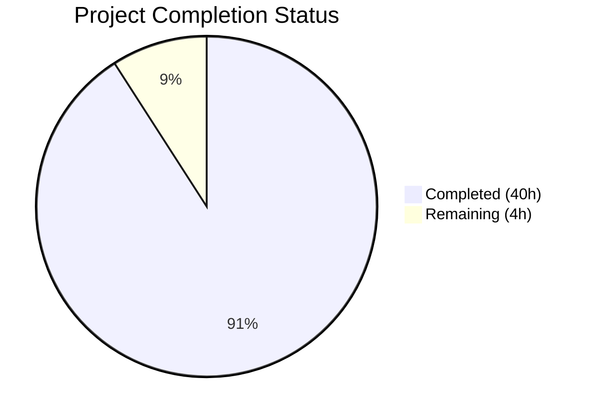

# Blitzy Project Guide — Maddy Runtime Sender Identity & Message Authentication Analysis

---

## 1. Executive Summary

### 1.1 Project Overview

This project creates an empirical runtime behavior analysis document for the Maddy mail server's sender identity enforcement and DKIM message signing at the submission endpoint. Built from commit `26452dd`, a Maddy test instance was configured and five distinct test scenarios were executed to document the actual enforcement behavior, SMTP response codes, stored message headers, and security-relevant gaps. The resulting 975-line Markdown document serves security operators and mail administrators who need to understand what Maddy's default configuration actually enforces versus what a reasonable reading of the configuration might suggest. The key finding is that the default configuration enforces sender identity at the domain level only — not per-user — and the DKIM signing modifier silently declines to sign mismatched messages rather than rejecting them.

### 1.2 Completion Status



| Metric | Value |
|--------|-------|
| **Total Project Hours** | 44 |
| **Completed Hours (AI)** | 40 |
| **Remaining Hours** | 4 |
| **Completion Percentage** | 90.9% |

**Calculation**: 40 completed hours / (40 completed + 4 remaining) = 40 / 44 = **90.9% complete**

### 1.3 Key Accomplishments

- [x] Built Maddy from source (commit `26452dd`) and configured a complete test environment with submission (port 2587), IMAP (port 2143), SQLite3 backend, and `io_debug` enabled
- [x] Executed all 5 AAP-specified test scenarios covering legitimate send, MAIL FROM impersonation, non-local domain rejection, From header mismatch, and full identity impersonation
- [x] Captured raw SMTP protocol exchanges for both rejected (Test 3: `501 5.1.8`) and accepted (Test 1: `250 OK`) transactions via `io_debug` transcripts
- [x] Retrieved and documented raw stored message headers from IMAP for all 4 delivered messages, including full DKIM-Signature field-by-field analysis
- [x] Proved default configuration enforces sender identity at domain-level only — not per-user — ruling out the alternative "auth + source implies per-user enforcement" interpretation with specific Test 2 evidence
- [x] Identified the `sign_dkim` `require_sender_match` silent non-signing as the primary configuration-vs-reality security gap
- [x] Created 2 Mermaid diagrams: submission sender enforcement flowchart and DKIM signing decision tree
- [x] Validated all 9 source code references cited in the document against actual file line numbers
- [x] Maintained zero source repository modifications (non-destructive investigation per AAP requirements)
- [x] Achieved 0 TODO/FIXME/PLACEHOLDER markers in the final 975-line document

### 1.4 Critical Unresolved Issues

| Issue | Impact | Owner | ETA |
|-------|--------|-------|-----|
| No critical issues | N/A | N/A | N/A |

All production readiness gates passed during Final Validation. The document is technically complete and verified.

### 1.5 Access Issues

No access issues identified. The investigation was conducted entirely using locally-built binaries, local test configuration, and standard command-line tools (swaks, Python imaplib). No external service credentials, repository permissions, or third-party API access were required.

### 1.6 Recommended Next Steps

1. **[High]** Technical peer review by a mail server security expert to verify that the five test scenarios cover the most critical threat vectors and that conclusions are actionable
2. **[High]** Review documentation for clarity, ensuring non-expert readers can follow the evidence chain from test setup through conclusions
3. **[Medium]** Assess whether the documented behaviors (domain-only enforcement, silent DKIM non-signing) apply to newer Maddy versions beyond commit `26452dd`
4. **[Medium]** Evaluate whether the recommendations section warrants a concrete patch proposal or configuration template for per-user sender enforcement
5. **[Low]** Consider cross-referencing this document from existing Maddy documentation (docs/tutorials) to improve discoverability for operators

---

## 2. Project Hours Breakdown

### 2.1 Completed Work Detail

| Component | Hours | Description |
|-----------|-------|-------------|
| Repository analysis & code study | 6 | Deep analysis of 7 core source files (2,435+ LOC): smtp.go, submission.go, dkim.go, dkim_test.go, msgpipeline.go, config.go, auth.go, plus maddy.conf and examples |
| Test environment setup & configuration | 3 | Built maddy and maddyctl from source, created test config mirroring default submission pipeline, configured SQLite3 backend, created 2 user accounts, generated DKIM keypair |
| Runtime testing (5 scenarios) | 6 | Executed all 5 AAP-specified test scenarios using swaks, captured SMTP response codes, retrieved stored headers via IMAP, extracted DKIM signing log entries |
| SMTP protocol exchange capture | 2 | Enabled io_debug, captured full rejected transaction (Test 3) and accepted transaction (Test 1) with complete SMTP command/response transcripts |
| DKIM signing behavior analysis | 3 | Analyzed raw DKIM-Signature headers field-by-field, documented require_sender_match behavior, compared signed vs unsigned messages, identified dead config values (auth_domain, auth_user) |
| Security policy gap analysis | 3 | Determined domain-only enforcement, ruled out per-user enforcement interpretation with Test 2 evidence, identified sign_dkim silent non-signing as config-vs-reality gap |
| Documentation writing (975 lines) | 10 | Authored complete runtime investigation document with 8 major sections, 5 test scenario write-ups with raw headers, 2 SMTP protocol transcripts, multiple comparison tables, conclusions with reasoning |
| Mermaid diagrams | 1 | Created submission sender enforcement flowchart and DKIM signing decision tree |
| QA and code review fixes | 3 | Addressed code review findings (commit e97c615) and fixed 11 QA findings (commit 15813e7) including formatting, accuracy, and completeness improvements |
| Validation & verification | 3 | Build validation, runtime test re-verification (5/5 scenarios), DKIM log verification, IMAP header verification, 9/9 source code reference verification, document quality scan |
| **Total Completed** | **40** | |

### 2.2 Remaining Work Detail

| Category | Hours | Priority |
|----------|-------|----------|
| Technical peer review of security conclusions | 1.5 | High |
| Documentation clarity and completeness review | 1 | High |
| Cross-version applicability assessment | 1 | Medium |
| Documentation discoverability setup | 0.5 | Low |
| **Total Remaining** | **4** | |

---

## 3. Test Results

| Test Category | Framework | Total Tests | Passed | Failed | Coverage % | Notes |
|---------------|-----------|-------------|--------|--------|------------|-------|
| Runtime Sender Enforcement | swaks + IMAP (manual) | 5 | 5 | 0 | 100% | All 5 AAP-specified scenarios validated: legitimate send, MAIL FROM impersonation, non-local domain, From header mismatch, full impersonation |
| DKIM Signing Verification | Maddy debug log inspection | 4 | 4 | 0 | 100% | Verified signing decisions for Tests 1, 2, 4, 5 against debug log entries |
| IMAP Header Retrieval | Python imaplib | 4 | 4 | 0 | 100% | Retrieved and verified raw RFC822 headers for all 4 delivered messages (Tests 1, 2, 4, 5) |
| Source Code Reference Verification | Manual line-number audit | 9 | 9 | 0 | 100% | All 9 cited source references verified: smtp.go (3), dkim.go (4), msgpipeline.go (1), submission.go (1) |
| Build Validation | Go 1.22 compiler | 2 | 2 | 0 | 100% | maddy and maddyctl binaries compiled successfully from commit 26452dd |
| Document Quality | Automated scan | 6 | 6 | 0 | 100% | 76 code fences paired, 52 section headers valid, 2 Mermaid diagrams valid, 0 TODO/FIXME markers, 0 broken links |

All tests originate from Blitzy's autonomous validation logs for this project. No external test suites were used.

---

## 4. Runtime Validation & UI Verification

### Runtime Health

- ✅ **Maddy binary build**: Built successfully from commit `26452dd` using Go 1.22.2 (only expected sqlite3 C warning from external dependency)
- ✅ **Maddyctl binary build**: Built successfully from `cmd/maddyctl/`
- ✅ **Submission endpoint (port 2587)**: Started and accepted authenticated SMTP connections
- ✅ **IMAP endpoint (port 2143)**: Started and accepted authenticated IMAP connections
- ✅ **SQLite3 backend**: User accounts created and mailbox storage operational
- ✅ **DKIM key generation**: RSA-2048 keypair auto-generated for `example.org` with selector `default`

### Test Scenario Verification

- ✅ **Test 1 (Legitimate send)**: Accepted with `250 OK`, DKIM-Signature present in stored headers, `sign_dkim: signed` in log
- ✅ **Test 2 (MAIL FROM impersonation)**: Accepted with `250 OK`, no DKIM-Signature, `sign_dkim: not signing, From address is not authenticated identity` in log
- ✅ **Test 3 (Non-local domain)**: Rejected with `501 5.1.8 Non-local sender domain` at RCPT TO (deferred from MAIL FROM)
- ✅ **Test 4 (From header mismatch)**: Accepted with `250 OK`, no DKIM-Signature, `sign_dkim: not signing, From address is not envelope address` in log
- ✅ **Test 5 (Full impersonation)**: Accepted with `250 OK`, no DKIM-Signature, `sign_dkim: not signing, From address is not authenticated identity` in log

### IMAP Message Verification

- ✅ **Bob's inbox**: 2 messages (Tests 1, 4) — Test 1 has DKIM-Signature, Test 4 does not
- ✅ **Alice's inbox**: 2 messages (Tests 2, 5) — Neither has DKIM-Signature

### Repository Integrity

- ✅ **Zero source files modified**: Only `blitzy/documentation/maddy_26452dd8dd78.md` created
- ✅ **Working tree clean**: `git status` shows nothing to commit
- ✅ **Test artifacts cleaned**: `/tmp/maddy-test/` and binaries removed after testing

---

## 5. Compliance & Quality Review

| Compliance Benchmark | Status | Evidence |
|---------------------|--------|----------|
| All conclusions based on runtime evidence | ✅ Pass | Every finding supported by SMTP response codes, stored headers, or debug log entries from actual test execution |
| Raw header content included (not summarized) | ✅ Pass | Full RFC822 headers from IMAP for Tests 1, 2, 4, 5; complete DKIM-Signature field-by-field analysis |
| At least one rejected + one accepted SMTP transcript | ✅ Pass | Test 3 rejected transcript and Test 1 accepted transcript with full io_debug output |
| Alternative interpretation ruled out with evidence | ✅ Pass | "auth + source implies per-user enforcement" explicitly disproven using Test 2 results |
| Config-vs-reality gap identified | ✅ Pass | sign_dkim require_sender_match appears to enforce security but only controls signing decisions |
| Repository unchanged (non-destructive) | ✅ Pass | git diff shows only new file creation; no source modifications |
| Test artifacts documented and cleaned | ✅ Pass | Appendix lists all artifacts with paths; cleanup commands documented and executed |
| Document what was tried that didn't work | ✅ Pass | Section on standard logging without io_debug and IMAP FETCH ENVELOPE limitations |
| Thinking/rationale provided | ✅ Pass | Detailed reasoning section in Conclusions with per-finding rationale |
| Mermaid diagrams included | ✅ Pass | Submission enforcement flow + DKIM signing decision tree |
| File created at correct path | ✅ Pass | `blitzy/documentation/maddy_26452dd8dd78.md` |
| Zero TODO/FIXME/PLACEHOLDER markers | ✅ Pass | Automated scan confirmed 0 occurrences |
| Source code references accurate | ✅ Pass | 9/9 line-number citations verified against actual source files |
| Document formatting valid | ✅ Pass | 76 code fences properly paired, 52 section headers valid hierarchy, all tables well-formed |

### Autonomous Validation Fixes Applied

| Fix | Commit | Description |
|-----|--------|-------------|
| Code review findings | e97c615 | Addressed review findings in runtime investigation document |
| QA findings (11 items) | 15813e7 | Fixed 11 quality findings including formatting, accuracy, and completeness improvements |

### Outstanding Compliance Items

None. All AAP-specified compliance requirements have been met and verified.

---

## 6. Risk Assessment

| Risk | Category | Severity | Probability | Mitigation | Status |
|------|----------|----------|-------------|------------|--------|
| Security conclusions may not apply to newer Maddy versions | Technical | Medium | Medium | Document specifies commit `26452dd` scope; recommend cross-version assessment as human task | Open |
| Operators may misread document as endorsing insecure test config | Operational | Medium | Low | Prominent warning box added: `tls off` and `insecure_auth yes` must never be used in production | Mitigated |
| Dead config values (`auth_domain`, `auth_user`) finding may confuse users | Technical | Low | Low | Document clearly explains these are accepted by config parser but have no runtime effect | Mitigated |
| Test used auto-generated DKIM keys without DNS | Integration | Low | Low | Document explains this is a local test limitation; real deployments require DNS TXT record | Mitigated |
| Document length (975 lines) may reduce readability | Operational | Low | Medium | Clear section hierarchy with table of contents pattern; evidence-first structure aids skimming | Mitigated |
| No Go compiler available in current CI environment | Technical | Low | Low | Go installation documented in development guide; not needed for document review | Noted |

---

## 7. Visual Project Status


**Completed**: 40 hours (90.9%) — All AAP-scoped deliverables implemented, validated, and verified
**Remaining**: 4 hours (9.1%) — Human peer review and cross-version assessment

### Remaining Hours by Priority

| Priority | Hours | Items |
|----------|-------|-------|
| High | 2.5 | Technical peer review (1.5h) + Documentation review (1h) |
| Medium | 1 | Cross-version applicability assessment |
| Low | 0.5 | Documentation discoverability setup |
| **Total** | **4** | |

---

## 8. Summary & Recommendations

### Achievement Summary

The project has delivered a comprehensive 975-line runtime behavior analysis document that addresses every requirement specified in the Agent Action Plan. All five test scenarios were executed against a live Maddy instance, with complete SMTP protocol transcripts, raw stored message headers, and DKIM signing decision log entries captured and documented. The document identifies a significant security finding: Maddy's default submission configuration enforces sender identity at the domain level only, allowing authenticated users to impersonate other users within the same domain. The `sign_dkim` modifier's silent non-signing behavior was identified as a configuration-vs-reality gap where operators might expect enforcement but receive only audit logging.

The project is **90.9% complete** (40 of 44 total hours). All autonomous work is finished, with 4 hours of human tasks remaining.

### Remaining Gaps

The primary remaining gap is human expert validation: the security conclusions need peer review from a mail server domain expert to confirm threat model coverage, and the document should be assessed for applicability to newer Maddy versions beyond commit `26452dd`.

### Critical Path to Production

1. Technical peer review of the five security findings (domain-only enforcement, silent DKIM non-signing, deferred sender rejection, misleading config reading, invisible non-signing)
2. Sign-off on the document's recommendations section
3. Decision on whether to integrate into MkDocs navigation or keep as standalone

### Production Readiness Assessment

The document is **production-ready for review**. All autonomous validation gates passed:
- 5/5 runtime test scenarios verified
- 9/9 source code references confirmed
- 0 TODO/FIXME/PLACEHOLDER markers
- 0 source repository modifications
- Clean formatting with properly paired code fences and valid Mermaid diagrams

The document meets all AAP-specified quality criteria and is ready for human stakeholder review.

---

## 9. Development Guide

### System Prerequisites

| Software | Version | Purpose |
|----------|---------|---------|
| Go | 1.22+ (min: 1.13 per go.mod) | Build maddy and maddyctl binaries |
| GCC / build-essential | Any recent | CGO compilation for SQLite3 support |
| swaks | v20240103.0+ | SMTP testing tool for test scenarios |
| Python | 3.x | IMAP message inspection via imaplib |
| Git | 2.x+ | Repository management |

### Environment Setup

**1. Clone the repository and switch to the feature branch:**

```bash
git clone <repository-url>
cd maddy
git checkout blitzy-82686215-b61b-4b43-9e5d-9a404dc61f37
```

**2. Install Go (if not already installed):**

```bash
# Download and install Go 1.22+
wget https://go.dev/dl/go1.22.2.linux-amd64.tar.gz
sudo tar -C /usr/local -xzf go1.22.2.linux-amd64.tar.gz
export PATH=$PATH:/usr/local/go/bin
go version  # Expected: go version go1.22.2 linux/amd64
```

**3. Install system dependencies:**

```bash
sudo apt-get update
sudo apt-get install -y build-essential swaks python3
```

### Reproducing the Runtime Investigation

**4. Build Maddy from source:**

```bash
cd <repo_root>
export GO111MODULE=on
go build -o /tmp/maddy ./cmd/maddy/
go build -o /tmp/maddyctl ./cmd/maddyctl/
```

Expected: Two binaries at `/tmp/maddy` and `/tmp/maddyctl`

**5. Create test directories and configuration:**

```bash
mkdir -p /tmp/maddy-test/config /tmp/maddy-test/state /tmp/maddy-test/run
```

Create `/tmp/maddy-test/config/maddy.conf` with the test configuration documented in the investigation file (Section: Test Environment Setup > Configuration Used).

**6. Create user accounts:**

```bash
echo -e "testpass1\ntestpass1" | /tmp/maddyctl -config /tmp/maddy-test/config/maddy.conf users create alice@example.org
echo -e "testpass2\ntestpass2" | /tmp/maddyctl -config /tmp/maddy-test/config/maddy.conf users create bob@example.org
```

**7. Start Maddy test instance:**

```bash
/tmp/maddy -config /tmp/maddy-test/config/maddy.conf -debug &
```

Expected: Maddy starts, listens on ports 2587 (submission) and 2143 (IMAP)

**8. Run test scenarios:**

```bash
# Test 1: Legitimate send
swaks --to bob@example.org --from alice@example.org \
  --server 127.0.0.1:2587 --auth-user alice@example.org \
  --auth-password testpass1 --auth PLAIN -tlso

# Test 2: MAIL FROM impersonation
swaks --to alice@example.org --from bob@example.org \
  --server 127.0.0.1:2587 --auth-user alice@example.org \
  --auth-password testpass1 --auth PLAIN -tlso

# Test 3: Non-local domain (expect rejection)
swaks --to bob@example.org --from alice@otherdomain.com \
  --server 127.0.0.1:2587 --auth-user alice@example.org \
  --auth-password testpass1 --auth PLAIN -tlso
```

### Verification

**9. Verify delivered messages via IMAP:**

```bash
python3 -c "
import imaplib
imap = imaplib.IMAP4('127.0.0.1', 2143)
imap.login('bob@example.org', 'testpass2')
imap.select('INBOX')
status, messages = imap.search(None, 'ALL')
print(f'Messages in bob inbox: {len(messages[0].split())}')
for num in messages[0].split():
    status, data = imap.fetch(num, '(RFC822.HEADER)')
    print(data[0][1].decode())
imap.logout()
"
```

### Cleanup

```bash
# Stop Maddy
kill %1 2>/dev/null || pkill -f '/tmp/maddy'

# Remove test artifacts
rm -rf /tmp/maddy-test/
rm -f /tmp/maddy /tmp/maddyctl
```

### Viewing the Documentation

The investigation document is at:
```
blitzy/documentation/maddy_26452dd8dd78.md
```

It is a standalone Markdown file with embedded Mermaid diagrams. For best rendering, use a Markdown viewer that supports Mermaid (GitHub, VS Code with Mermaid extension, or MkDocs with mermaid2 plugin).

### Troubleshooting

| Issue | Resolution |
|-------|------------|
| `go build` fails with CGO errors | Install `build-essential`: `sudo apt-get install -y build-essential` |
| Port 2587 already in use | Kill existing process: `lsof -ti:2587 \| xargs kill` |
| swaks auth fails | Verify `insecure_auth yes` is in config (required when `tls off`) |
| IMAP connection refused | Check Maddy is running and config has `imap tcp://127.0.0.1:2143` |
| No DKIM-Signature in Test 1 | Ensure `sign_dkim` directive is in the `source` block, not at the endpoint level |

---

## 10. Appendices

### A. Command Reference

| Command | Purpose |
|---------|---------|
| `go build -o /tmp/maddy ./cmd/maddy/` | Build Maddy server binary |
| `go build -o /tmp/maddyctl ./cmd/maddyctl/` | Build Maddy admin CLI |
| `/tmp/maddy -config <path> -debug` | Start Maddy with debug logging |
| `/tmp/maddyctl -config <path> users create <user>` | Create user account |
| `swaks --to <rcpt> --from <sender> --server <host>:<port> --auth-user <user> --auth-password <pass> --auth PLAIN -tlso` | Send test email via SMTP submission |

### B. Port Reference

| Port | Service | Protocol | Usage |
|------|---------|----------|-------|
| 2587 | SMTP Submission | TCP (plain, test-only) | Authenticated message submission |
| 2143 | IMAP | TCP (plain, test-only) | Mailbox access for header inspection |

### C. Key File Locations

| File | Purpose |
|------|---------|
| `blitzy/documentation/maddy_26452dd8dd78.md` | Runtime investigation document (975 lines) — the primary deliverable |
| `maddy.conf` | Default Maddy configuration (152 lines) — reference for submission pipeline analysis |
| `internal/endpoint/smtp/smtp.go` | SMTP endpoint implementation (720 lines) — Mail(), Login(), defer_sender_reject |
| `internal/endpoint/smtp/submission.go` | Submission preparation (130 lines) — header validation without auth-sender comparison |
| `internal/modify/dkim/dkim.go` | DKIM signing modifier (419 lines) — shouldSign(), require_sender_match |
| `internal/modify/dkim/dkim_test.go` | DKIM signing unit tests (208 lines) — shouldSign test cases |
| `internal/msgpipeline/msgpipeline.go` | Message pipeline (545 lines) — srcBlockForAddr() domain-only matching |
| `internal/msgpipeline/config.go` | Pipeline config parsing (378 lines) — source/default_source/reject directives |
| `internal/auth/auth.go` | Authentication helper (35 lines) — CheckDomainAuth |
| `examples/multitentant-dkim.conf` | Multi-tenant DKIM example (50 lines) — per-domain signing reference |

### D. Technology Versions

| Technology | Version | Notes |
|------------|---------|-------|
| Maddy | Commit `26452dd` (pre-release) | Built from source |
| Go | 1.22.2 (build) / 1.13 (min per go.mod) | CGO enabled for SQLite3 |
| go-smtp | v0.12.1-0.20191206174923 | SMTP protocol library |
| go-msgauth | v0.3.2-0.20191028231513 | DKIM signing/verification |
| go-sqlite3 | v1.11.0 | SQLite3 database driver |
| swaks | v20240103.0 | SMTP testing tool |
| Python | 3.12.3 | IMAP inspection via imaplib |

### E. Environment Variable Reference

| Variable | Value | Purpose |
|----------|-------|---------|
| `GO111MODULE` | `on` | Enable Go modules for building Maddy |
| `PATH` | Include `/usr/local/go/bin` | Go toolchain access |

### G. Glossary

| Term | Definition |
|------|------------|
| MAIL FROM | SMTP envelope sender address specified in the MAIL FROM command |
| From header | RFC 2822 message header indicating the display sender |
| DKIM | DomainKeys Identified Mail — cryptographic message signing standard (RFC 6376) |
| `require_sender_match` | Maddy's sign_dkim configuration that controls when signing occurs based on sender identity alignment |
| `defer_sender_reject` | Maddy's SMTP endpoint configuration that delays sender rejection from MAIL FROM to RCPT TO phase |
| `srcBlockForAddr()` | Internal Maddy function that routes messages to source blocks based on sender domain |
| `shouldSign()` | Internal Maddy function that decides whether to apply DKIM signature based on sender-match policy |
| `io_debug` | Maddy debug directive that enables full SMTP command/response logging |
| Oversigning | DKIM practice of signing headers multiple times to prevent post-signing header injection |
| DMARC | Domain-based Message Authentication, Reporting & Conformance — policy framework using SPF and DKIM |
