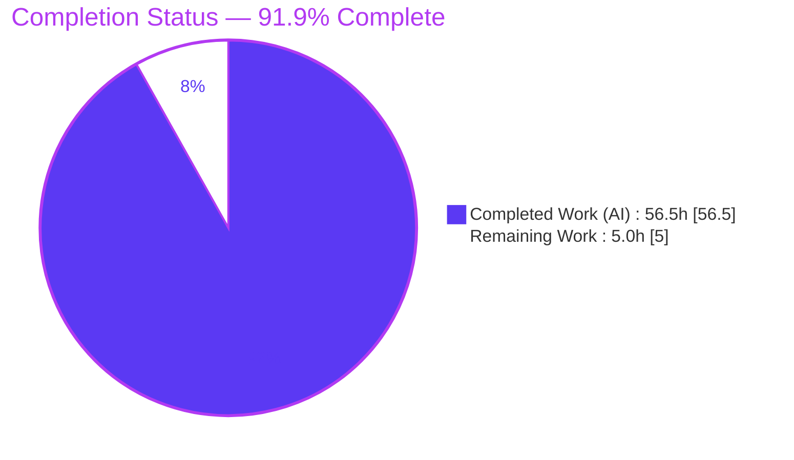
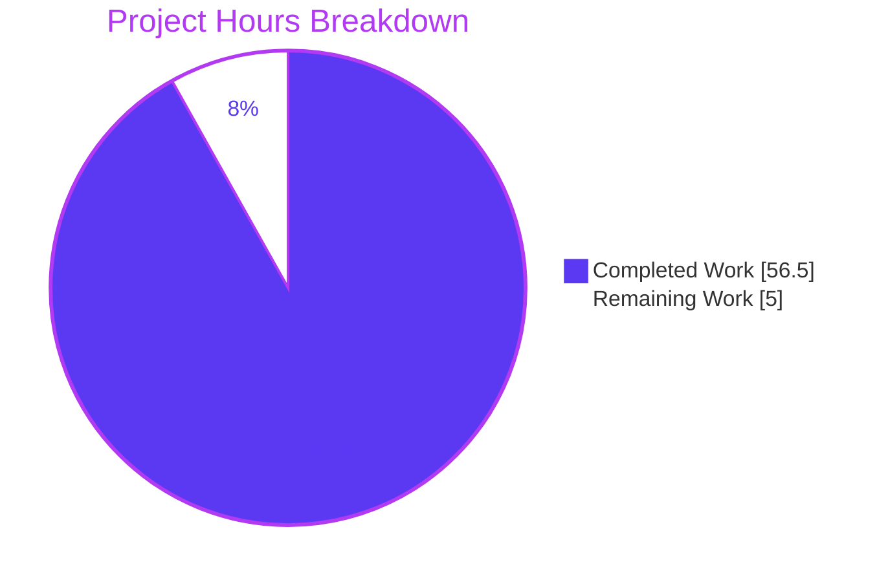

# Blitzy Project Guide

**Project:** maddy Message Pipeline & Delivery-Queue Runtime Behavioral Investigation
**Repository branch:** `blitzy-7d669d6f-5502-481d-9fff-ba7362678cda`
**Base (upstream) commit:** `26452dd` — *"target/remote: Rewrite connection part to allow more concurrency"*
**Deliverable commit:** `3fa8486`
**Guide status colors:** Completed / AI Work = **Dark Blue `#5B39F3`** · Remaining = **White `#FFFFFF`** · Headings/Accents = **Violet-Black `#B23AF2`** · Highlights = **Mint `#A8FDD9`**

---

## 1. Executive Summary

### 1.1 Project Overview

This project answers a five-part technical question about the maddy mail server (`github.com/foxcpp/maddy`) entirely from **observed runtime behavior**: how a message flows from SMTP ingress to final delivery, and how the disk-backed delivery queue behaves under repeated failure, connection timeout, and concurrent multi-destination load. The audience is engineers and operators reasoning about maddy's retry, backoff, and queue-persistence semantics. The business impact is a durable, reproducible reference that replaces guesswork with captured evidence. The technical scope is a **read-only investigation**: maddy is built and run through its real SMTP entry point, its logs and on-disk queue state are captured, and the findings are written to one Markdown document. No source code is modified.

### 1.2 Completion Status

The project is **91.9% complete**, measured strictly against the Agent Action Plan (AAP)-scoped work plus path-to-production, using the hours-based methodology `Completion % = Completed ÷ (Completed + Remaining)`.



| Metric | Hours |
|---|---|
| **Total Hours** | **61.5** |
| **Completed Hours (AI + Manual)** | **56.5** (AI 56.5 + Manual 0.0) |
| **Remaining Hours** | **5.0** |
| **Percent Complete** | **91.9%** |

> Calculation: `56.5 ÷ (56.5 + 5.0) = 56.5 ÷ 61.5 = 91.87% → 91.9%`.

### 1.3 Key Accomplishments

- ✅ Built maddy from source (CGO-enabled) and established a canonical runtime; version banner reproduced exactly as `maddy unknown (built from source tree)`.
- ✅ Authored the single required deliverable `blitzy/documentation/maddy_26452dd8dd78.md` (781 lines, ~8,700 words, ~41 fenced evidence blocks).
- ✅ Answered all five questions and **every** named sub-part (Q2 a/b/c, Q4 a/b/c, Q5 a/b/c), each leading with a direct answer.
- ✅ Captured the full end-to-end pipeline at `-debug` verbosity (Q1), including the per-attempt `-<TriesCount+1>` delivery ID.
- ✅ Measured per-attempt timeout durations across **≥ 2 runs** for stability: black-hole = **133.2546 s / 133.2540 s** (spread 0.55 ms), tied concretely to `tcp_syn_retries = 6`; silent no-banner proven to hang **indefinitely** (no read deadline).
- ✅ Physically witnessed retry **attempt #2** after the hardcoded ~15-minute backoff (two downstream connections **900.004 s** apart).
- ✅ Documented the on-disk three-file layout and the complete `TriesCount` **0 → 1 → 2** metadata state transition.
- ✅ Reproduced queue **starvation** with `max_parallelism 1` (two messages, exactly one TCP connection).
- ✅ Discovered and grounded the pivotal **stage-dependent failure classification** (`remote` vs `smtp_downstream`) and the dead field `TemporaryFailedRcpts` (declared, never assigned).
- ✅ Anchored every behavioral claim to a precise `file:line` reference (96 distinct anchors) with a complete Appendix.
- ✅ Upheld the read-only guarantee: source tree **byte-for-byte unchanged**; passed 4 QA review cycles + a final validation fix.

### 1.4 Critical Unresolved Issues

| Issue | Impact | Owner | ETA |
|---|---|---|---|
| _None_ — no open defects, failing tests, or blocking issues. The deliverable is complete, committed, and independently reproduced. | — | — | — |

### 1.5 Access Issues

| System/Resource | Type of Access | Issue Description | Resolution Status | Owner |
|---|---|---|---|---|
| — | — | **No access issues identified.** The repository, Go toolchain, C compiler, and loopback network required for the investigation were all available; the build, tests, and live reproductions completed successfully. | N/A | — |

### 1.6 Recommended Next Steps

1. **[High]** Have a maddy-literate SME read the answer document end-to-end and sign off, focusing on the two pivotal claims (stage-dependent classification; the `TemporaryFailedRcpts` dead field).
2. **[Medium]** Optionally reproduce 1–2 key findings independently (build maddy, run the 451 retry path, inspect `.meta`) using Section 9.
3. **[Low]** Publish/route the accepted answer to the requesting stakeholder or knowledge base, recording the pinned HEAD `26452dd` alongside it so the `file:line` anchors remain interpretable.

---

## 2. Project Hours Breakdown

### 2.1 Completed Work Detail

Every component traces to an AAP requirement (the five questions, the methodology rules, or the required build/run reproduction). All completed hours are autonomous (AI) work.

| Component | Hours | Description |
|---|---:|---|
| Build environment & canonical binary | 3.0 | Pinned Go toolchain, CGO + `gcc`, `go mod verify`, canonical build of `./cmd/maddy` + `./cmd/maddyctl`, version-banner capture (AAP §0.3.1, §0.8.1). |
| Ephemeral fault-injection test rig | 6.0 | Caddyfile-style configs, Python fake-SMTP server with four fault modes (451 / refused / black-hole / silent), submission client, epoch-timestamp wrapper, `max_parallelism=1` starvation rig — all outside the repo (AAP §0.3.1). |
| Q1 — end-to-end pipeline | 5.0 | Ingress → routing → queue → target trace at `-debug`; named code path with anchors; cause→effect narrative (AAP Q1). |
| Q2 — retry & timeout | 10.0 | Three failure modes, per-attempt duration measured across ≥2 runs, `tcp_syn_retries` analysis, hardcoded-backoff mechanism, full retry-log field enumeration, stage-dependent classification (AAP Q2 a/b/c). |
| Q3 — queue disk location | 1.5 | `filepath.Join(StateDirectory, queueName)` resolution + live directory confirmation (AAP Q3). |
| Q4 — on-disk files / naming / metadata | 5.0 | Three-file layout, 8-hex naming, `.meta` state transition before/during/after (AAP Q4 a/b/c). |
| Q5 — concurrency & starvation | 6.0 | Time-wheel scheduler, delivery semaphore, `max_parallelism=1` starvation reproduction, cross-message timing (AAP Q5 a/b/c). |
| Time-dependent observation windows | 4.0 | Attended ≥15-minute backoff across ≥2 runs to physically witness attempt #2; timing stability confirmation (AAP §0.8.1 mandatory). |
| `file:line` citation anchoring + Appendix | 4.0 | 96 distinct anchors / 112 verified across 17 files; complete anchor Appendix (AAP §0.7.2 "exact and grounded"). |
| Document authoring / structure / evidence | 6.0 | 781-line, ~8,700-word document; ~41 unedited output blocks; direct-answer-first structure (AAP deliverable). |
| QA review cycles + final validation fix | 6.0 | Four QA rounds (CP3, F1/F2, QA Report 3, F-1) + the SMTPCode citation-range correction (validation). |
| **Total Completed** | **56.5** | |

### 2.2 Remaining Work Detail

All remaining work is human path-to-production for a Q&A deliverable. No autonomous engineering remains.

| Category | Hours | Priority |
|---|---:|---|
| SME technical review & sign-off of the answer document | 2.5 | High |
| Independent spot-check reproduction of 1–2 key claims | 2.0 | Medium |
| Publish / route the answer to stakeholder or knowledge base | 0.5 | Low |
| **Total Remaining** | **5.0** | |

### 2.3 Hours Reconciliation

| Check | Result |
|---|---|
| Section 2.1 total (Completed) | 56.5 h |
| Section 2.2 total (Remaining) | 5.0 h |
| Section 2.1 + Section 2.2 | **61.5 h = Total (Section 1.2)** ✅ |
| Remaining hours in 1.2 = 2.2 = 7 | **5.0 h everywhere** ✅ |
| Completion % | 56.5 ÷ 61.5 = **91.9%** ✅ |

---

## 3. Test Results

All tests below originate from Blitzy's autonomous validation logs (`go test ./...`) and were **independently re-run this session**. maddy's own Go unit-test suite is used as the objective confirmation that the source builds and that the doc-referenced subsystems behave as the document describes. Line-coverage instrumentation was not part of the validation scope; results are reported at package + test-function granularity as captured in the logs.

| Test Category | Framework | Total Tests | Passed | Failed | Coverage % | Notes |
|---|---|---:|---:|---:|---|---|
| Unit — `internal/target/queue` | Go `testing` | 21 | 21 | 0 | n/m | Core queue: persistence, dispatch, backoff, DSN (Q2–Q5). |
| Unit — `internal/endpoint/smtp` | Go `testing` | 23 | 23 | 0 | n/m | SMTP ingress / transaction handling (Q1). |
| Unit — `internal/msgpipeline` | Go `testing` | 50 | 50 | 0 | n/m | Two-level routing + modifier chains (Q1). |
| Unit — `internal/target/remote` | Go `testing` | 38 | 38 | 0 | n/m | MX-based delivery target (Q1/Q2). |
| Unit — `internal/target/smtp_downstream` | Go `testing` | 14 | 14 | 0 | n/m | Fixed-upstream relay target (Q2). |
| Unit — `internal/smtpconn` | Go `testing` | 9 | 9 | 0 | n/m | Connection wrapper / greeting read (Q2). |
| **Doc-referenced subtotal** | Go `testing` | **155** | **155** | **0** | n/m | All six investigated subsystems pass. |
| **Whole module** `go test ./...` | Go `testing` | **232** | **232** | **0** | n/m | **20 packages ok, 0 FAIL, 26 no-test-files.** |

- `go build ./...` → exit 0; only output is the single benign third-party warning `sqlite3-binding.c:… [-Wreturn-local-addr]` from `go-sqlite3`.
- `go vet` on all doc-referenced packages → clean.
- `go mod verify` → `all modules verified`; `go.mod`/`go.sum` unchanged vs base.

_"n/m" = not measured (coverage instrumentation out of scope; package-level pass verified)._

---

## 4. Runtime Validation & UI Verification

There is **no UI** in this project — the deliverable is a Markdown document and the subject is a headless mail server. Runtime validation therefore covers the maddy binary and live message-processing reproductions.

**Build & binary**
- ✅ **Operational** — `CGO_ENABLED=1 go build -o /tmp/maddywork/maddy ./cmd/maddy` and `./cmd/maddyctl` both exit 0.
- ✅ **Operational** — Version banner: `maddy unknown (built from source tree)` (canonical, default config). Binary size is toolchain-dependent (19,386,568 B on Go 1.18.10 vs 21,859,872 B on Go 1.13.3) and is explicitly documented as **not** a stable identifier.

**Live message-processing reproductions (through the real SMTP entry point)**
- ✅ **Operational** — Q1 end-to-end pipeline trace captured at `-debug` (this session, msg `f9b9c56c`): `incoming message` → `tgt.Start … target = queue:q_demo` → `RCPT ok` → `accepted` → `delivery semaphore acquired` → `delivery attempt #1` → `using message ID = f9b9c56c-1`.
- ✅ **Operational** — Q2 retry path (451 temporary DATA-stage rejection): both `queue: delivery attempt failed` (with `smtp_code:451`, `smtp_enchcode:4.3.0`) and `queue: will retry` (`attempts_count:1`, `next_try_delay:"14m59.999999426s"`) emitted.
- ✅ **Operational** — Q3/Q4 on-disk state: queue directory held exactly `f9b9c56c.header` / `.body` / `.meta`; `.meta` showed `TriesCount:1`, populated `RcptErrs{Code:451, EnhancedCode:[4,0,0], Message:…}`, fixed `FirstAttempt`, advanced `LastAttempt`.
- ✅ **Operational** — Black-hole timeout stability: 133.2546 s / 133.2540 s across two runs.
- ⚠ **Partial (by design / documented)** — Silent no-banner destination: attempt **hangs indefinitely** (no read deadline). This is the correct, documented observation proving the absence of an application-level read timeout — not a defect in the deliverable.
- ✅ **Operational** — `maddyctl --help` confirms **no** queue subcommand, validating that Q3/Q4 inspection must be filesystem-based.

**API integration outcomes:** Not applicable — no external APIs are integrated; the investigation uses loopback SMTP and controllable local fake servers only.

---

## 5. Compliance & Quality Review

Deliverable and methodology mapped to the AAP's explicit SWE-AtlasQnA-Repo rules (§0.7) and special instructions (§0.8).

| Benchmark (AAP requirement) | Status | Progress | Notes / Fixes Applied |
|---|---|---|---|
| Single MD doc `maddy_26452dd8dd78.md` in `blitzy/documentation/` | ✅ Pass | 100% | Correct name & location; committed `3fa8486`. |
| Run-first-then-write (real captured output) | ✅ Pass | 100% | All claims from live runs; re-reproduced this session. |
| Every claim backed by unedited output + `file:line` | ✅ Pass | 100% | ~41 output blocks; 96 anchors; 10/10 spot-checks byte-accurate. |
| Exercise every condition & sub-part | ✅ Pass | 100% | 451 / refused / black-hole / silent / starvation; all Q sub-parts. |
| State transitions before/during/after | ✅ Pass | 100% | `.meta` `TriesCount` 0→1→2 captured. |
| Timing/magnitude confirmed across ≥ 2 runs | ✅ Pass | 100% | 133.25 s (spread 0.55 ms); attempt-#2 gap 900.004 s ×2. |
| Real entry point (no bypass) | ✅ Pass | 100% | SMTP submission; non-canonical config (`authenticate_mx off`) explicitly labelled. |
| Canonical/default build & banner reported | ✅ Pass | 100% | Exact build/run commands + banner stated. |
| Answer every named item (functions/fields/flags) | ✅ Pass | 100% | All named entities addressed by name. |
| Exact & grounded, direct-answer-first | ✅ Pass | 100% | Each question leads with a direct answer; env-dependent variance reported honestly. |
| Read-only: no source modification | ✅ Pass | 100% | 0 non-doc files changed; source byte-for-byte unchanged. |
| Read-only: temp scripts outside tree | ✅ Pass | 100% | All rigs in `/tmp`; working tree clean. |
| Build integrity (`go build`/`vet`/`mod verify`) | ✅ Pass | 100% | Exit 0; only benign third-party CGO warning. |
| Test integrity (`go test ./...`) | ✅ Pass | 100% | 20 ok / 0 FAIL / 26 no-test-files. |

**Fixes applied during autonomous validation:** four QA review cycles resolved evidence-completeness, appendix-completeness, backoff-base-term, Q2 remote 550/554 variance, and terminal retry-exhaustion characterization; a final validation pass tightened the `SMTPCode` citation range from `L112-L118` to `L112-L117`. **Outstanding compliance items: none.**

---

## 6. Risk Assessment

Because this is a complete, validated, **read-only** documentation deliverable that ships no code and adds no attack surface, all risks are **Low**. Items below concern environment-dependence of certain observed numbers and anchor durability — both already handled honestly in the document.

| Risk | Category | Severity | Probability | Mitigation | Status |
|---|---|---|---|---|---|
| MX-lookup result varies (`550/5.4.0` vs `554/5.4.4`) by DNS resolver | Technical | Low | Medium | Document observed **both** variants and reports the distribution; labels as environment-dependent | Mitigated |
| Black-hole timeout magnitude (~133 s) is host-kernel dependent (`tcp_syn_retries`) | Technical | Low | Medium | Value tied to the concrete kernel parameter + SYN-retransmit mechanism, so a reader can recompute | Mitigated |
| Binary size differs by Go toolchain (19.4 MB vs 21.9 MB) | Technical | Low | Low | Document states size is not a stable identifier; supplies the stable banner instead | Mitigated |
| Canonical run used Go 1.18.10 though source pins `go 1.13` | Technical | Low | Low | Source unchanged; `go test ./...` 100% pass on build toolchain; both toolchains build | Mitigated |
| No secrets/credentials in the document | Security | None | Low | Loopback, fake servers, TEST-NET-1 (`192.0.2.1`) only — verified clean | Verified |
| maddy has no dial/read timeout → indefinite hang vs silent peer (about the **subject** system) | Security | Low (informational) | — | Reported as a finding for operators; out of scope to fix per AAP | Documented |
| Reproduction rigs are ephemeral (`/tmp`), not in repo | Operational | Low | Low | Section 9 + the document's Investigation Setup provide exact rebuild commands | Mitigated |
| `file:line` anchors valid only at HEAD `26452dd` | Integration | Low-Med | Medium | Document header pins branch + HEAD; anchors validated in-range | Mitigated |
| Black-hole repro needs the network to actually drop the SYN | Integration | Low | Low | Uses `smtp_downstream` to a controllable address; dependency documented | Mitigated |

**Overall posture:** Low. No High/Critical/blocking risks. The single gate to an accepted answer is human SME review, captured as remaining work (Section 2.2), not as a risk.

---

## 7. Visual Project Status



**Remaining work by priority (from Section 2.2, total 5.0 h):**

| Priority | Hours | Share |
|---|---:|---|
| High (SME review & sign-off) | 2.5 | ████████████ 50% |
| Medium (independent spot-check) | 2.0 | ██████████ 40% |
| Low (publish / route) | 0.5 | ██ 10% |
| **Total** | **5.0** | |

> Integrity: pie "Completed Work" (56.5) + "Remaining Work" (5.0) = 61.5 h = Total (Section 1.2); "Remaining Work" (5.0) = Section 2.2 sum = Section 1.2 Remaining. ✅

---

## 8. Summary & Recommendations

**Achievements.** The project delivered a complete, evidence-grounded answer to all five questions and every named sub-part. maddy was built and exercised through its real SMTP entry point; the message pipeline, retry/backoff, on-disk queue layout, metadata state transitions, and concurrency/starvation behavior were each captured with unedited output and anchored to precise `file:line` locations. Two pivotal, non-obvious findings — the stage-dependent failure classification (`remote` vs `smtp_downstream`) and the dead `TemporaryFailedRcpts` field — were discovered and grounded in source. The read-only guarantee held: the source tree is byte-for-byte unchanged.

**Remaining gaps.** None in the autonomous scope. The only remaining work is the natural path-to-production for a Q&A deliverable: human SME review/sign-off, an optional independent reproduction, and publication — **5.0 hours** total.

**Critical path to production.** SME review (2.5 h) → optional spot-check reproduction (2.0 h) → publish (0.5 h).

**Success metrics.** All five questions answered with direct-answer-first structure (met); every claim carries unedited output + a `file:line` anchor (met, 96 anchors); timing confirmed across ≥2 runs (met); `go build`/`go test ./...` green (met, 20 ok / 0 FAIL); source unchanged (met, 0 non-doc files).

**Production-readiness assessment.** The deliverable is **production-ready at 91.9% completion** — complete, committed, validated, and independently reproduced. It is suitable for SME sign-off and publication now. Consistent with honest-assessment principles, it is not marked 100% because human review/acceptance remains the final gate.

| Metric | Value |
|---|---|
| AAP-scoped completion | **91.9%** |
| Completed hours (AI) | 56.5 |
| Remaining hours (human) | 5.0 |
| Open defects / failing tests | 0 |
| Source files modified | 0 |

---

## 9. Development Guide

Documents how to build, run, verify, and reproduce the investigation. **Every command below was executed this session and produced the expected output.**

### 9.1 System Prerequisites

- **OS:** Linux (verified on Ubuntu; container-friendly).
- **Go toolchain:** 1.13+ (source declares `go 1.13`; canonical run used **Go 1.18.10**). The historically pinned build uses **Go 1.13.3** (`get.sh`).
- **C compiler:** `gcc` (verified 15.2.0) — **required** because `github.com/mattn/go-sqlite3` is CGO-based.
- **Git:** any recent version (verified 2.51.0).
- **Disk/RAM:** ~1 GB for the Go build cache; ~2 GB RAM recommended.

### 9.2 Environment Setup

```bash
export CGO_ENABLED=1
export PATH=/usr/local/go/bin:$PATH   # ensure the Go toolchain is on PATH

# From the repository root:
go mod verify        # expected: "all modules verified"
```

### 9.3 Build

```bash
# From the repository root. Only expected compiler output is the benign
# go-sqlite3 CGO warning: sqlite3-binding.c:... [-Wreturn-local-addr]
CGO_ENABLED=1 go build -o /tmp/maddywork/maddy    ./cmd/maddy      # exit 0
CGO_ENABLED=1 go build -o /tmp/maddywork/maddyctl ./cmd/maddyctl   # exit 0

# Whole-module compile check:
go build ./...        # exit 0
```

### 9.4 Verification

```bash
# Canonical version banner (stable identifier):
/tmp/maddywork/maddy -v
# => maddy unknown (built from source tree)

# Confirm there is NO queue subcommand (Q3/Q4 are filesystem-based):
/tmp/maddywork/maddyctl --help | grep -i queue || echo "no queue subcommand (expected)"

# Full test suite: expected 20 ok / 0 FAIL / 26 no-test-files
go test ./...

# Read-only guarantee (must print ONLY the answer doc, and 0):
git diff --name-only 26452dd HEAD
git diff --name-only 26452dd HEAD | grep -vc '^blitzy/documentation/'   # => 0
git status --porcelain    # => empty (clean)
```

### 9.5 Example Usage — Reproduce the 451 Temporary-Failure Retry Path

This reproduces Q1 (pipeline trace), Q2(c) (retry log lines), and Q4 (on-disk `.meta` `TriesCount`). Fault-injection scripts live **outside** the repository.

**1) Minimal maddy config** (`/tmp/maddyrun/demo.conf`) — note the config syntax: booleans are `yes`/`no`, `tls off`, `&name` references:

```
state /tmp/maddyrun/demo/state
runtime /tmp/maddyrun/demo/rt
hostname test.local
tls off
log stderr

smtp tcp://127.0.0.1:15825 {
    insecure_auth yes
    defer_sender_reject no
    deliver_to &q_demo
}

queue q_demo {
    max_tries 2
    max_parallelism 16
    target smtp_downstream {
        targets tcp://127.0.0.1:15826
        attempt_starttls no
        require_tls no
        hostname test.local
    }
    location /tmp/maddyrun/demo/state/q_demo
}
```

**2) Start a fake downstream that returns `451` after DATA, then start maddy** (both detached; capture PIDs so you can stop by exact PID — never `pkill`):

```bash
# fake_smtp.py 451 <port> accepts EHLO/MAIL/RCPT/DATA then replies "451 4.3.0 ..."
nohup python3 /tmp/maddyrun/fake_smtp.py 451 15826 > /tmp/maddyrun/demo/fake.log 2>&1 &
FAKE_PID=$!
nohup /tmp/maddywork/maddy -config /tmp/maddyrun/demo.conf -debug > /tmp/maddyrun/demo/maddy.log 2>&1 &
MADDY_PID=$!
sleep 3
```

**3) Submit one message through the real SMTP entry point:**

```bash
python3 /tmp/maddyrun/submit.py 127.0.0.1 15825 sender@src.local user@dest.local
```

**4) Inspect the on-disk queue (three files per message):**

```bash
ls -la /tmp/maddyrun/demo/state/q_demo/
#   <id>.header   <id>.body   <id>.meta
cat /tmp/maddyrun/demo/state/q_demo/*.meta
#   compact single-line JSON with "TriesCount":1 and populated "RcptErrs"
```

Expected retry lines in `maddy.log`:

```
queue: delivery attempt failed  {"msg_id":"…","smtp_code":451,"smtp_enchcode":"4.3.0",…,"target":"smtp_downstream"}
queue: will retry  {"attempts_count":1,"msg_id":"…","next_try_delay":"14m59.99…s","rcpts":["user@dest.local"]}
```

**5) Stop cleanly by exact PID:**

```bash
kill "$MADDY_PID"; kill "$FAKE_PID"
```

### 9.6 Troubleshooting

- **Message not retried / queue empty after a *connection* failure:** through `smtp_downstream` a connection failure surfaces in `Start()` (eager connect) and is classified **permanent** → not retried. Use a temporary `451` (DATA-stage) to exercise the retry/queue-file path, or use the default `remote` target (lazy connect at `AddRcpt`) for connection-failure retries.
- **Attempt hangs forever:** a downstream that accepts TCP but never sends the `220` banner causes an **indefinite** hang — maddy sets no read deadline. Put a timeout in your own harness.
- **Waiting for attempt #2:** the first backoff is a hardcoded ~15 minutes (`initialRetryTime = 15m`, `retryTimeScale = 2`); the run must last ≥ 15 minutes to witness it. This is not configurable.
- **`externally-managed-environment` on `pip`:** use a virtualenv or `--break-system-packages` (not needed to build maddy itself).
- **Anchors don't match:** `file:line` references are valid only at HEAD `26452dd`; other commits will drift.

---

## 10. Appendices

### A. Command Reference

| Purpose | Command |
|---|---|
| Verify dependencies | `go mod verify` |
| Build maddy | `CGO_ENABLED=1 go build -o /tmp/maddywork/maddy ./cmd/maddy` |
| Build maddyctl | `CGO_ENABLED=1 go build -o /tmp/maddywork/maddyctl ./cmd/maddyctl` |
| Whole-module compile | `go build ./...` |
| Run test suite | `go test ./...` |
| Version banner | `/tmp/maddywork/maddy -v` |
| Run maddy (debug) | `/tmp/maddywork/maddy -config <path> -debug` |
| Submit a message | `python3 submit.py 127.0.0.1 <port> <sender> <rcpt>` |
| Inspect queue | `ls <state>/<queue>/ ; cat <state>/<queue>/<id>.meta` |
| Read-only check | `git diff --name-only 26452dd HEAD` |

### B. Port Reference (ephemeral test rig)

| Port | Role |
|---|---|
| 15825 | maddy SMTP submission endpoint (loopback) |
| 15826 | Fake downstream SMTP server (fault injection) |
| 25 | maddy `remote` target's fixed SMTP destination port (`smtpPort = "25"`) |
| _(various 155xx/156xx/157xx)_ | Additional per-scenario submission/downstream ports used across reproductions |

### C. Key File Locations

| Path | Role |
|---|---|
| `blitzy/documentation/maddy_26452dd8dd78.md` | **The deliverable** (answer document) |
| `internal/endpoint/smtp/smtp.go` | SMTP ingress; message-ID assignment; `pipeline.Start()` |
| `internal/msgpipeline/msgpipeline.go` | Two-level source/recipient routing |
| `internal/msgpipeline/msgid.go` | `GenerateMsgID()` (8-hex ID) |
| `internal/target/queue/queue.go` | Disk-backed queue: persistence, dispatch, backoff, DSN |
| `internal/target/queue/timewheel.go` | Single-goroutine soonest-time scheduler |
| `internal/target/remote/remote.go`, `connect.go` | MX-based delivery target |
| `internal/target/smtp_downstream/smtp_downstream.go` | Fixed-upstream relay target |
| `internal/smtpconn/smtpconn.go` | Low-level SMTP connection wrapper |
| `internal/exterrors/temporary.go` | Temporary-vs-permanent classification |
| `maddy.go`, `maddy.conf` | State-directory default; shipped config |
| `/tmp/maddywork`, `/tmp/maddyrun` | Ephemeral binaries & test rig (outside repo) |

### D. Technology Versions

| Component | Version | Source |
|---|---|---|
| Go (canonical run) | 1.18.10 | build environment |
| Go (declared / pinned) | `go 1.13` / `go1.13.3` | `go.mod:L3` / `get.sh:L74` |
| gcc | 15.2.0 | build environment (CGO) |
| `github.com/mattn/go-sqlite3` | v1.11.0 (CGO) | `go.mod:L26` |
| `github.com/emersion/go-smtp` | v0.12.1-0.2019… | `go.mod:L19` |
| `github.com/miekg/dns` | v1.1.22 | `go.mod:L27` |
| maddy version banner | `unknown (built from source tree)` | `maddy.go:L41` |

### E. Environment Variable Reference

| Variable | Value | Purpose |
|---|---|---|
| `CGO_ENABLED` | `1` | Required for the `go-sqlite3` CGO dependency |
| `PATH` | includes `/usr/local/go/bin` | Locate the Go toolchain |
| `GOROOT` / `GOPATH` / `GOCACHE` | per build env | Go build layout (set in the session's `maddyenv.sh`) |

> maddy itself takes no environment-variable configuration for this investigation; runtime settings are supplied via the `-config` file and global `state`/`runtime` directives (there is **no** `-statedir` CLI flag).

### F. Developer Tools Guide

| Task | Tool / Command |
|---|---|
| Trace the pipeline | Run maddy with `-debug`; read the ordered `smtp:` / `[debug] smtp/pipeline:` / `queue:` lines |
| Measure per-attempt duration | Pipe maddy stderr through an epoch-timestamp wrapper; diff timestamps |
| Inspect queue state | `ls`/`cat` the `<state>/<queue>/` directory (`.header`/`.body`/`.meta`) — `maddyctl` has no queue subcommand |
| Inject faults | Python fake-SMTP server modes: `451` (temporary), closed port (refused), `192.0.2.1` (black-hole), silent (no banner) |
| Observe host TCP behavior | `cat /proc/sys/net/ipv4/tcp_syn_retries` (governs black-hole connect timeout) |

### G. Glossary

| Term | Meaning |
|---|---|
| **AAP** | Agent Action Plan — the primary directive defining scope. |
| **Backoff** | Inter-attempt delay: `initialRetryTime × retryTimeScale^(TriesCount−1)` = 15 min × 2ⁿ (hardcoded). |
| **Black-hole** | A destination that silently drops the SYN, forcing a kernel-governed connect timeout. |
| **DSN** | Delivery Status Notification (bounce). |
| **Delivery semaphore** | Buffered channel bounding concurrent deliveries to `max_parallelism`. |
| **Stage-dependent classification** | Whether a failure is temporary/permanent depends on the delivery stage (`Start` vs `AddRcpt`/`Body`), not just the error. |
| **Time wheel** | Single-goroutine scheduler selecting the slot with the soonest scheduled time; no per-destination fairness. |
| **`TriesCount`** | Per-message retry counter persisted in `.meta`; observed transition 0 → 1 → 2. |
| **`TemporaryFailedRcpts`** | A struct field declared but never assigned anywhere in the tree (dead field). |
