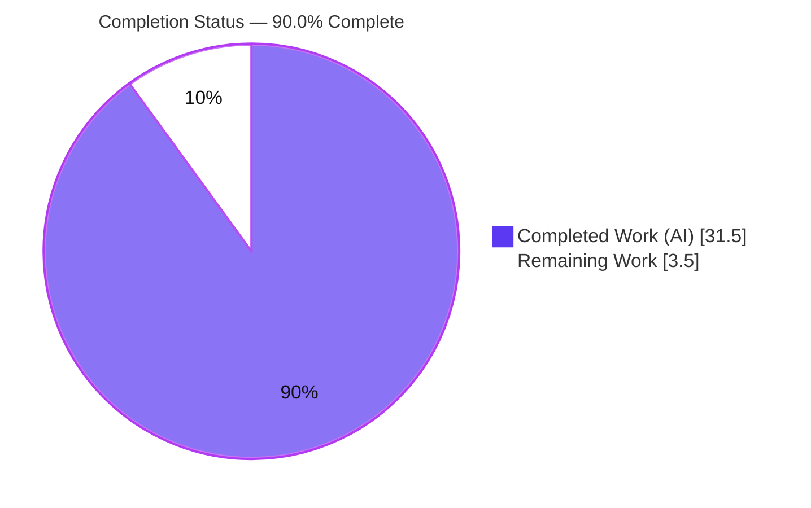
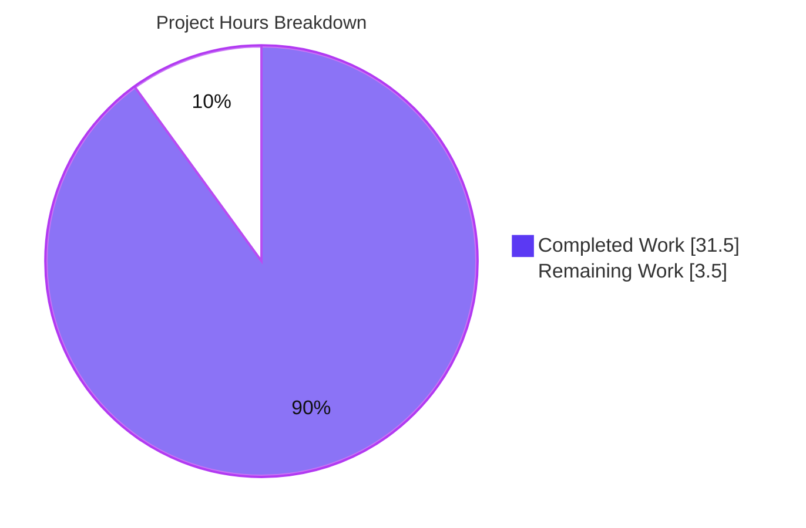
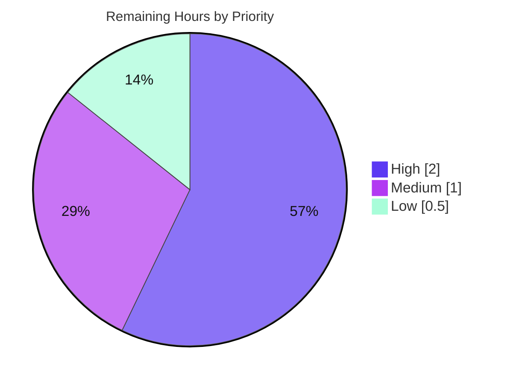

# Blitzy Project Guide — maddy SMTP Security Review (DATA Boundary & Auth-State Reuse)

> **Branch:** `blitzy-00c7078d-6b3b-4711-aec6-2a9632c79236` · **HEAD:** `2c8e1aa` · **Base:** `26452dd`
> **Deliverable:** `blitzy/documentation/maddy_26452dd8dd78.md` (single additive file)
> **Color legend:** <span style="color:#5B39F3">■ Completed / AI Work (Dark Blue #5B39F3)</span> · <span>□ Remaining / Not Completed (White #FFFFFF)</span> · <span style="color:#B23AF2">Headings/Accents (#B23AF2)</span> · <span style="color:#A8FDD9">Highlight (#A8FDD9)</span>

---

## Section 1 — Executive Summary

### 1.1 Project Overview

maddy is a self-hosted, single-process, all-in-one mail server (IMAP4rev1 + SMTP) written in Go. This project delivered an **evidence-based security review** of maddy's SMTP receive path, pinned to source commit `26452dd`. Using a build-run-observe methodology, it answers two protocol-edge-case questions for mail-server operators and security engineers: how the DATA reader frames the end-of-data marker (a bare `.` line), and how authenticated identity persists across an `RSET` followed by a new `MAIL FROM`. The sole committed artifact is one markdown report; no source, configuration, or tests were modified, in keeping with the observe-only `SWE-AtlasQnA-Repo` ruleset.

### 1.2 Completion Status



| Metric | Value |
|--------|-------|
| **Total Hours** | 35.0 |
| **Completed Hours (AI + Manual)** | 31.5 (AI: 31.5 · Manual: 0.0) |
| **Remaining Hours** | 3.5 |
| **Percent Complete** | **90.0%** |

> Completion is computed with the PA1 AAP-scoped, hours-based method: 31.5 / (31.5 + 3.5) = 31.5 / 35.0 = **90.0%**. All remaining work is human review/disposition; remediation is explicitly out of AAP scope.

### 1.3 Key Accomplishments

- [x] Built maddy and maddyctl from source (Go 1.18.10, CGO_ENABLED=1, gcc 15.2.0) — clean compile.
- [x] Stood up an ephemeral, out-of-tree `/tmp` harness (unauth SMTP + authenticated submission on tcp/587 with `insecure_auth` + `io_debug`) and provisioned test users A and B via `maddyctl users create`.
- [x] **Q1 (DATA end-of-data) answered with runtime proof:** maddy stops the body at the first lone-`.` line; trailing bytes re-enter the SMTP command grammar. Three variants observed (junk → `501`; valid `MAIL FROM` → new transaction; >2000 B line → `500` + close).
- [x] **Q2 (auth-state reuse across RSET) answered with runtime proof:** a post-`RSET` `MAIL FROM:<B>` is accepted with `250` and **no re-authentication**; the visible message asserts B while authenticated identity A survives only in the live server log.
- [x] **Empirical correction of the AAP:** queue `<id>.meta` shows `"Conn": null` (serializer nulls `MsgMeta.Conn`, `queue.go:L752`) — runtime-correcting AAP §0.5.4's assumption that `AuthUser` is serialized to disk.
- [x] Authored the 417-line evidence-based report with 18 code blocks, 2 mermaid diagrams, and an 18-claim evidence/locator table — every citation verified at commit `26452dd`.
- [x] Independent validation passed all five gates: dependencies, compilation, tests (20/20 packages), runtime reproduction, and in-scope deliverable integrity.
- [x] Ephemeral harness fully torn down; working tree left clean (single additive file in the diff).

### 1.4 Critical Unresolved Issues

| Issue | Impact | Owner | ETA |
|-------|--------|-------|-----|
| Disposition of Q1 finding (SMTP-smuggling surface: valid trailing command after lone-`.` opens a new transaction) | Decision needed: accept-as-risk vs. open hardening ticket. No release blocker — behavior is RFC-correct end-of-data framing. | Security stakeholder | 1.0 h (within remaining scope) |
| Disposition of Q2 finding (no default `MAIL FROM` ↔ `AuthUser` check; accountability blur on authenticated submission) | Decision needed: accept-as-risk vs. open sender-authorization ticket. No release blocker — analysis-only task. | Security stakeholder | (covered by the 1.0 h disposition task) |
| SME technical sign-off of the report's two conclusions and a spot-check of citations | Gate before merge; confirms evidence integrity. | Senior mail/security engineer | 2.0 h |

> These are **review/disposition** items, not defects in the deliverable. Remediation (writing a sender-auth check or smuggling hardening) is **out of AAP scope** and carries no hours here.

### 1.5 Access Issues

**No access issues identified.** The repository was present and on the correct branch, the working tree was clean, the Go toolchain and the full module cache were available, and every build, test, and runtime-reproduction step completed autonomously without missing credentials, permissions, or third-party access.

| System/Resource | Type of Access | Issue Description | Resolution Status | Owner |
|-----------------|----------------|-------------------|-------------------|-------|
| — | — | No access issues identified | N/A | N/A |

### 1.6 Recommended Next Steps

1. **[High]** Conduct SME technical review and sign-off of `blitzy/documentation/maddy_26452dd8dd78.md`; spot-check 3–5 source locators at commit `26452dd` and optionally re-run one scenario (2.0 h).
2. **[Medium]** Hold a stakeholder disposition for the two documented findings (Q1 smuggling surface, Q2 accountability blur): accept-as-risk or open follow-up tickets (1.0 h).
3. **[Low]** Review the single-file additive PR and merge (0.5 h).
4. **[Low — out of scope, no hours]** If the disposition elects remediation, open separate tickets to (a) add a `MAIL FROM` ↔ `AuthUser` sender-authorization check and (b) evaluate SMTP-smuggling hardening. These are new feature work, outside this analysis task's AAP scope.

---

## Section 2 — Project Hours Breakdown

### 2.1 Completed Work Detail

| Component | Hours | Description |
|-----------|------:|-------------|
| Build environment + maddy/maddyctl compilation | 3.0 | Toolchain setup (Go 1.18.10, CGO_ENABLED=1, gcc), `go mod download/verify`, `go build ./...` clean. |
| SMTP receive-path source analysis | 6.0 | Read maddy `internal/endpoint/smtp/*`, `internal/target/{received,queue}`, `internal/storage/sql`, `internal/module/msgmetadata`, plus go-smtp `data.go`/`conn.go`/`server.go` to ground both answers. |
| Ephemeral harness authoring + user A/B provisioning | 2.5 | `/tmp` `maddy.conf` (unauth smtp + submission tcp/587 `insecure_auth`+`io_debug`, sql storage+authdb, queue→remote); `maddyctl users create`. |
| Q1 reproduction (DATA boundary) | 3.5 | Raw-socket driver (no dot-stuffing); 3 crafted variants; captured replies, logs, persisted artifacts. |
| Q2 reproduction (auth-state reuse) | 3.5 | AUTH-A → RSET → MAIL-FROM-B session; captured `io_debug` transcript, `Received` header, queue meta. |
| Persisted-artifact forensics & cross-check | 2.0 | Inspected stored body size, queue `<id>.meta`/`.body`; discovered `"Conn": null` correcting AAP §0.5.4. |
| Web research (RFC 5321, net/textproto, SMTP smuggling) | 1.0 | Confirmed end-of-data framing rules and stdlib DotReader semantics; framed CERT VU#302671 context. |
| Report authoring | 6.0 | 417-line evidence-based review: transcripts, rationale, 2 mermaid diagrams, 18-claim evidence table. |
| Independent runtime validation | 4.0 | Re-built, re-ran both scenarios, audited every citation at `26452dd`, confirmed clean tree. |
| **Total Completed** | **31.5** | Matches Section 1.2 Completed Hours. |

### 2.2 Remaining Work Detail

| Category | Hours | Priority |
|----------|------:|----------|
| Human SME technical review & sign-off of the report | 2.0 | High |
| Stakeholder disposition of the two documented findings (accept-as-risk vs. ticket) | 1.0 | Medium |
| PR review & merge (single-file additive diff) | 0.5 | Low |
| **Total Remaining** | **3.5** | — |

### 2.3 Basis of Estimate & Reconciliation

- **Total Project Hours** = 31.5 (completed) + 3.5 (remaining) = **35.0**.
- **Completion %** = 31.5 / 35.0 = **90.0%**.
- **Confidence:** High — scope is a single, fully-delivered, runtime-validated documentation artifact with a tightly bounded review/disposition tail.
- **Out of scope (no hours):** code remediation of either finding; IMAP/DKIM/SPF/DMARC internals; remote MX delivery mechanics; TLS negotiation — examined only insofar as they affect the two answers.

---

## Section 3 — Test Results

All results below originate from Blitzy's autonomous validation logs for this project (no tests were authored or modified — the ruleset forbids touching test files). maddy's existing Go suite was executed under `CGO_ENABLED=1 go test ./...`, and two protocol scenarios were independently reproduced against the running server.

| Test Category | Framework | Total Tests | Passed | Failed | Coverage % | Notes |
|---------------|-----------|------------:|-------:|-------:|-----------:|-------|
| Unit/Integration (Go package suite) | `go test` | 20 packages | 20 | 0 | Not collected | 20/20 packages report `ok`; 0 FAIL, 0 panics. 26 additional packages have no test files. |
| Report-relevant packages (subset) | `go test` | 6 packages | 6 | 0 | Not collected | `internal/endpoint/smtp`, `internal/target/queue`, `internal/storage/sql`, `internal/msgpipeline`, `internal/target/remote`, `internal/modify/dkim` — all `ok`. |
| Runtime scenario — Q1 (DATA boundary) | Raw-socket SMTP driver | 3 variants | 3 | 0 | N/A | junk trailing → `501`×2 (233-byte stored object); valid trailing `MAIL FROM` → new transaction; >2000 B line → `500` + close. |
| Runtime scenario — Q2 (auth-state reuse) | Raw-socket SMTP driver | 1 scenario (+1 secondary) | 2 | 0 | N/A | Post-RSET `MAIL FROM:<B>` accepted `250`, no re-auth; secondary: missing From → `554`. |
| Deliverable integrity | Static checks (`wc`, `sha256sum`, fence/mermaid/NUL scan) | 1 | 1 | 0 | N/A | 417 lines, balanced fences, 2 mermaid blocks, no NUL, trailing newline, no real secrets. |

- **Compilation:** `CGO_ENABLED=1 go build ./...` → exit 0 (only the benign `go-sqlite3 -Wreturn-local-addr` warning).
- **Dependencies:** `go mod download` + `go mod verify` → clean; `go.mod`/`go.sum` unchanged.

> Coverage % is reported as "Not collected" rather than estimated: `-cover` was not part of the autonomous validation run, and fabricating a figure would violate Section 3 integrity. Pass/fail counts are exactly as emitted by the validation logs.

---

## Section 4 — Runtime Validation & UI Verification

**Runtime health (live maddy instance, ephemeral harness):**
- ✅ **Operational** — maddy binary built and started with `-config … -debug -log stderr`.
- ✅ **Operational** — unauthenticated SMTP listener bound (tcp), `io_debug` active ("I/O debugging is on!").
- ✅ **Operational** — authenticated submission listener bound on tcp/587 with `insecure_auth` + `auth &local_authdb`; AUTH PLAIN accepted for users A and B.
- ✅ **Operational** — SQLite storage + authdb initialized; queue → remote target wired (`authenticate_mx off`).

**API/protocol integration outcomes:**
- ✅ **Operational** — Q1 DATA framing: body truncates at the first lone-`.`; trailing bytes correctly re-dispatched as commands; stored body byte-exact (e.g., 233-byte object containing only pre-dot content).
- ✅ **Operational** — Q2 identity provenance: `Received: … (envelope-sender <B@local>)`, `From: B`, with source-host clause suppressed for submission (`DontTraceSender=true`); authenticated A visible in the server log (`"username":"a@local"` alongside `"sender":"B@local"`).
- ⚠ **Partial (by design / finding)** — accountability persistence: the authenticated identity A is **not** persisted to the queue meta (`"Conn": null`), so the on-disk record cannot tie the message back to A. This is the documented Q2 finding, not a harness failure.

**UI verification:**
- ✅ **N/A — no UI in scope.** maddy is a headless mail server and the deliverable is a markdown report. "UI verification" reduces to document rendering/well-formedness, which passed: balanced code fences, 2 valid mermaid diagrams, clean tables, trailing newline, no NUL bytes.

---

## Section 5 — Compliance & Quality Review

Cross-mapping AAP deliverables and the `SWE-AtlasQnA-Repo` ruleset to Blitzy quality benchmarks.

| Benchmark / Rule | Requirement | Status | Notes / Fixes Applied |
|------------------|-------------|--------|-----------------------|
| Branch-named answer document | Produce `<source_branch>.md` | ✅ Pass | `maddy_26452dd8dd78.md` created. |
| Placement in `blitzy/documentation/` | Correct destination dir | ✅ Pass | File at `blitzy/documentation/maddy_26452dd8dd78.md`. |
| Build & run to analyze behavior | Conclusions from a running server | ✅ Pass | Built + ran; both scenarios reproduced on a live instance. |
| Evidence-first; code as truth | Anchor every claim to a locator + runtime | ✅ Pass | 18-claim evidence table; all locators resolve at `26452dd`. |
| Provide rationale | Explain *why*, not just *what* | ✅ Pass | DotReader delegation (Q1); session-vs-transaction separation (Q2) explained. |
| Do not modify existing files | Source/config/tests read-only | ✅ Pass | `git diff 26452dd..HEAD` = one added file; nothing else touched. |
| Add no other code | Only the document is committed | ✅ Pass | No helper scripts/fixtures/config committed; harness lived in `/tmp`. |
| Observe, do not remediate | Analysis only | ✅ Pass | No code path patched; findings reported, not fixed. |
| Repository integrity | Clean working tree after teardown | ✅ Pass | Ephemeral `/tmp` harness + binaries removed; tree clean. |
| Accuracy vs. AAP | Report matches reality | ✅ Pass (with correction) | Runtime corrected AAP §0.5.4 (`Conn` is nulled on disk → `"Conn": null`); report's §3.3 reflects the true behavior. |
| Deliverable hygiene | No secrets, well-formed | ✅ Pass | AUTH base64 redacted; throwaway local creds on a destroyed harness; balanced fences. |

**Outstanding compliance items:** none at the automation layer. The only open items are the human review/disposition tasks in Section 2.2.

---

## Section 6 — Risk Assessment

| Risk | Category | Severity | Probability | Mitigation | Status |
|------|----------|----------|-------------|------------|--------|
| R1 — SMTP-smuggling surface: a valid trailing command after a lone-`.` opens a new transaction on the same connection. | Security | Medium | Low–Medium | Documented in report §2.5/§4; inherent to RFC-correct end-of-data framing; awaiting stakeholder disposition (no code change in scope). | Documented / Open |
| R2 — Sender-spoofing / accountability blur: no default `MAIL FROM` ↔ `AuthUser` check; queue serializer nulls `Conn` (`queue.go:L752`). | Security | Medium | Medium | Documented §3/§4; submission source-domain reject constrains domain (not user); live log retains A; disposition pending. | Documented / Open |
| R3 — Config-dependent reachability: harness used `tls off` + `insecure_auth` + relaxed inbound checks to observe AUTH without TLS. | Technical | Low | Low | Report §5.2 scopes this: affects *reachability* of the path, not the *logic* under test. | Documented / Mitigated |
| R4 — Citation locator drift over time. | Operational | Low | Low | All locators pinned to HEAD source commit `26452dd`; verified during validation. | Mitigated |
| R5 — go-smtp version dependence of the observed framing/session behavior. | Technical / Integration | Low | Low | Pinned to `v0.12.1-0.20191206174923-1f576e0ec85c` in `go.mod`; behavior tied to that exact version. | Documented / Mitigated |
| R6 — Reproduction artifacts not persisted (ephemeral harness destroyed). | Operational | Low | Low | Full transcripts embedded in the report; teardown is an explicit AAP requirement. | Mitigated |
| R7 — `io_debug` can echo credentials to logs. | Security | Low | Low | AUTH base64 redacted in the report; harness destroyed; `io_debug` is off by default in shipped config. | Mitigated |

---

## Section 7 — Visual Project Status



**Remaining hours by priority (sums to 3.5, matching Section 2.2):**



| Priority | Category | Hours |
|----------|----------|------:|
| High | SME technical review & sign-off | 2.0 |
| Medium | Stakeholder disposition of 2 findings | 1.0 |
| Low | PR review & merge | 0.5 |
| **Total** | — | **3.5** |

> **Integrity:** "Remaining Work" = 3.5 here equals Section 1.2 Remaining Hours and the Section 2.2 Hours total. "Completed Work" = 31.5 equals Section 1.2 Completed Hours and the Section 2.1 total.

---

## Section 8 — Summary & Recommendations

**Achievements.** The project is **90.0% complete** (31.5 of 35.0 hours). The full automated scope — build, harness, provisioning, dual-scenario reproduction, persisted-artifact forensics, report authoring, and independent validation — is delivered and verified. The deliverable answers both user questions with runtime evidence corroborated against source at commit `26452dd`, and even **corrected the AAP** where reality diverged from its assumption (the queue serializes `"Conn": null`, so `AuthUser` is *not* persisted to disk).

**Findings (both confirmed at runtime):**
- **Q1 — DATA end-of-data:** maddy **fails safely for framing integrity.** It stops the body at the first lone-`.` line (delegating to go-smtp's `dataReader` → stdlib `net/textproto` DotReader); trailing bytes never become body and instead re-enter the command grammar. The residual concern is the generic SMTP-smuggling surface (a *valid* trailing command starts a new transaction), captured as R1.
- **Q2 — auth-state reuse across RSET:** maddy is **partially safe for accountability.** A post-`RSET` `MAIL FROM:<B>` is accepted with no re-authentication; the visible message asserts B while the authenticated identity A survives only in the live server log and is nulled in the on-disk queue meta. Captured as R2.

**Critical path to production.** (1) SME technical review & sign-off (2.0 h) → (2) stakeholder disposition of R1/R2 (1.0 h) → (3) PR merge (0.5 h). Total remaining: **3.5 h**.

**Production readiness.** The deliverable is **ready for human review and merge.** It is a self-contained, single-file additive change with a clean working tree, all validation gates passed, and no access issues. No release blockers exist; the remaining 10.0% is human judgment (review + finding disposition), not engineering rework.

| Success Metric | Target | Result |
|----------------|--------|--------|
| Both user questions answered with runtime evidence | Yes | ✅ Yes |
| Repository unchanged except deliverable | 1 added file | ✅ 1 file (+417/-0) |
| Build/test gates | Green | ✅ Compile exit 0; 20/20 packages `ok` |
| Citations resolve at pinned commit | 100% | ✅ All locators verified at `26452dd` |
| Completion | ≤ 99% pre-review | ✅ 90.0% |

---

## Section 9 — Development Guide

### 9.1 System Prerequisites
- **OS:** Linux (validated on Ubuntu 25.10 container).
- **Go:** 1.18.10 (`go.mod` declares minimum `go 1.13`).
- **C toolchain:** `gcc` (validated 15.2.0) — **required**, because `github.com/mattn/go-sqlite3 v1.11.0` is CGO.
- **Environment:** `CGO_ENABLED=1` is **mandatory** for build and tests.
- **Other:** Git; ~40 MB free disk for the two binaries.

### 9.2 Environment Setup
```bash
# From the repository root
cd /tmp/blitzy/maddy/blitzy-00c7078d-6b3b-4711-aec6-2a9632c79236_1b00a6
export CGO_ENABLED=1
go version          # expect: go1.18.10 linux/amd64
gcc --version       # expect: gcc (Ubuntu 15.2.0-...) 15.2.0
```

### 9.3 Dependency Installation / Verification
```bash
go mod download
go mod verify       # expect: "all modules verified"
```
> Dependencies are vendored in the module cache and pinned by `go.mod`/`go.sum`; no network install is required, and neither manifest is modified.

### 9.4 Build
```bash
CGO_ENABLED=1 go build ./...                       # whole tree, expect exit 0
CGO_ENABLED=1 go build -o ./maddy    ./cmd/maddy    # ~19 MB binary
CGO_ENABLED=1 go build -o ./maddyctl ./cmd/maddyctl # ~19 MB binary
```
> A benign `go-sqlite3 -Wreturn-local-addr` compiler warning is expected and does not affect the build.

### 9.5 Test
```bash
CGO_ENABLED=1 go test ./internal/endpoint/smtp/     # report-relevant package: expect "ok"
CGO_ENABLED=1 go test ./...                          # full suite: expect 20/20 packages "ok"
```

### 9.6 Inspect the Deliverable
```bash
wc -l -w -c blitzy/documentation/maddy_26452dd8dd78.md   # expect 417 lines / 4572 words / 33724 bytes
sha256sum   blitzy/documentation/maddy_26452dd8dd78.md   # expect 1ad93158...0c47be
git diff 26452dd..HEAD --stat                            # expect "1 file changed, 417 insertions(+)"
```

### 9.7 Example Usage — Reproduce the Review (ephemeral, out-of-tree)
> Run everything under `/tmp` so the repository stays clean; delete the harness afterward.

1. **Author an ephemeral `/tmp/maddy.conf`** with: `hostname mx.local`, `tls off`, an `sql` module providing `local_mailboxes` + `local_authdb` (`local_domains = local`), an **unauthenticated** `smtp tcp://0.0.0.0:2525` listener, and an **authenticated** `submission tcp://0.0.0.0:587` listener with `auth &local_authdb`, `insecure_auth`, and `io_debug`, plus a `queue` → `remote` target (`authenticate_mx off`).
2. **Provision users** (passwords are lowercased throwaway local creds):
   ```bash
   ./maddyctl -config /tmp/maddy.conf users create a@local --password <pw-A>
   ./maddyctl -config /tmp/maddy.conf users create b@local --password <pw-B>
   ```
3. **Run the server** (flag-based 2019 binary — there is **no** `run` subcommand):
   ```bash
   ./maddy -config /tmp/maddy.conf -debug -log stderr &
   ```
4. **Drive the scenarios with raw sockets** (Python), sending crafted, **non-dot-stuffed** payloads so the lone-`.` reaches the server unaltered:
   - **Q1:** `body line one<CRLF>.<CRLF>SMUGGLED-LINE<CRLF>.<CRLF>` → observe `250` then `501`×2 and a 233-byte stored object containing only `body line one`.
   - **Q2:** `EHLO` → `AUTH PLAIN <redacted A>` → `MAIL FROM:<a@local>` → `RCPT` → `RSET` → `MAIL FROM:<b@local>` (no re-AUTH) → `RCPT` → `DATA … .` → observe `250` acceptance, `Received: … (envelope-sender <b@local>)`, and `"Conn": null` in the queue `<id>.meta`.
5. **Tear down:** stop the server (`kill <pid>` of the process you started), then `rm -rf /tmp/maddy*` and remove the config/state/scripts.

### 9.8 Troubleshooting
- **`pip install` "externally-managed-environment":** use a venv or `pip install --break-system-packages` (only needed if scripting the driver with extra libs; the stdlib `socket` suffices).
- **`maddyctl` "no requested block found":** points to the wrong `-config` path (a swallowed file-not-found in `cmd/maddyctl/config.go`) — pass the correct `/tmp/maddy.conf`.
- **`go-sqlite3` gcc warning:** benign; ignore.
- **Queue triplet disappears before inspection:** delivery is async and the bounce removes it (e.g., `ext@remote.test` is NXDOMAIN) — poll the queue dir on a tight loop to capture `<id>.meta`/`.header`/`.body` before removal.
- **`io_debug` warns about password leakage:** expected; redact the AUTH base64 in any captured transcript.
- **Build fails with cgo errors:** ensure `CGO_ENABLED=1` and that `gcc` is on `PATH`.

---

## Section 10 — Appendices

### Appendix A — Command Reference
| Purpose | Command |
|---------|---------|
| Build all | `CGO_ENABLED=1 go build ./...` |
| Build maddy | `CGO_ENABLED=1 go build -o ./maddy ./cmd/maddy` |
| Build maddyctl | `CGO_ENABLED=1 go build -o ./maddyctl ./cmd/maddyctl` |
| Verify deps | `go mod verify` |
| Run report-relevant tests | `CGO_ENABLED=1 go test ./internal/endpoint/smtp/` |
| Run full suite | `CGO_ENABLED=1 go test ./...` |
| Create user | `./maddyctl -config /tmp/maddy.conf users create a@local --password <pw>` |
| Run server | `./maddy -config /tmp/maddy.conf -debug -log stderr` |
| Diff scope | `git diff 26452dd..HEAD --stat` |
| Deliverable hash | `sha256sum blitzy/documentation/maddy_26452dd8dd78.md` |

### Appendix B — Port Reference
| Port | Role | Source |
|------|------|--------|
| 25 | Inbound SMTP (shipped default) | `maddy.conf` |
| 465 | Submission, implicit TLS (shipped default) | `maddy.conf` L93–L120 |
| 587 | Submission (ephemeral harness, `insecure_auth`) | test config only |
| 2525 | Unauthenticated SMTP (ephemeral harness) | test config only |

### Appendix C — Key File Locations
| Path | Role |
|------|------|
| `blitzy/documentation/maddy_26452dd8dd78.md` | **The deliverable** (security review report) |
| `internal/endpoint/smtp/smtp.go` | SMTP/submission session, `Data`/`Mail`/`Reset`, `prepareBody`, AuthUser capture, knobs |
| `internal/endpoint/smtp/submission.go` | Submission prep; sets `DontTraceSender`; no sender↔AuthUser bind |
| `internal/target/received.go` | `GenerateReceived` — envelope-sender provenance |
| `internal/target/queue/queue.go` | Queue triplet persistence; `metaCopy.MsgMeta.Conn = nil` (L752) |
| `internal/storage/sql/sql.go` | SQLite-backed mailbox storage |
| `internal/module/msgmetadata.go` | `ConnState.AuthUser` / `MsgMetadata` |
| go-smtp `data.go` / `conn.go` / `server.go` | DotReader delegation; `reset()` preserves session; `MaxLineLength` |

### Appendix D — Technology Versions
| Component | Version |
|-----------|---------|
| Go toolchain | 1.18.10 linux/amd64 (module min `go 1.13`) |
| gcc | 15.2.0 |
| github.com/emersion/go-smtp | v0.12.1-0.20191206174923-1f576e0ec85c |
| github.com/emersion/go-message | v0.10.9-0.20191116124005-65fd0119e899 |
| github.com/emersion/go-sasl | v0.0.0-20190817083125-240c8404624e |
| github.com/foxcpp/go-imap-sql | v0.3.2-0.20191208094750-8b4ec6b19a78 |
| github.com/mattn/go-sqlite3 | v1.11.0 (CGO) |
| github.com/google/uuid | v1.1.1 |

### Appendix E — Environment Variable Reference
| Variable | Value | Purpose |
|----------|-------|---------|
| `CGO_ENABLED` | `1` | Required for go-sqlite3 (build + test) |
| `DEBIAN_FRONTEND` | `noninteractive` | Non-interactive apt (if installing toolchain) |

### Appendix F — Developer Tools Guide
- **maddy flags:** `-config <path>` (default `/etc/maddy/maddy.conf`), `-debug`, `-log <target>` (default stderr), `-libexec`, `-v`. No `run` subcommand (2019-era binary).
- **maddyctl subcommands:** `users` (create/list/…), `imap-mboxes`, `help`.
- **io_debug:** SMTP-endpoint option that mirrors the raw line-by-line SMTP conversation into the log — the primary observability lever for both scenarios.
- **Raw-socket driver:** Python `socket` is sufficient; avoid client libraries that auto dot-stuff, or the lone-`.` probe will not reach the server intact.

### Appendix G — Glossary
| Term | Meaning |
|------|---------|
| End-of-data marker | The SMTP line containing only `.` that terminates a DATA payload (RFC 5321). |
| Dot-stuffing | Client doubles a leading `.`; server strips it — so a *bare* `.` line is unambiguously the terminator. |
| DotReader | stdlib `net/textproto` decoder that ends the stream at the lone-`.` line; reused by go-smtp's `dataReader`. |
| RSET | SMTP command that resets the current transaction; in go-smtp it clears the transaction but **not** the authenticated session. |
| AuthUser | The authenticated identity captured at login (`ConnState.AuthUser`). |
| SMTP smuggling | Vulnerability class (CERT VU#302671) arising from end-of-data framing ambiguity between hops. |
| Accountability blur | Condition where the visible message asserts one identity (B) while the trusted/authenticated identity (A) is recorded only transiently. |

---

*Generated by the Blitzy autonomous validation agent. Completion basis: PA1 AAP-scoped, hours-based methodology. All test results derive from Blitzy's autonomous validation logs.*
