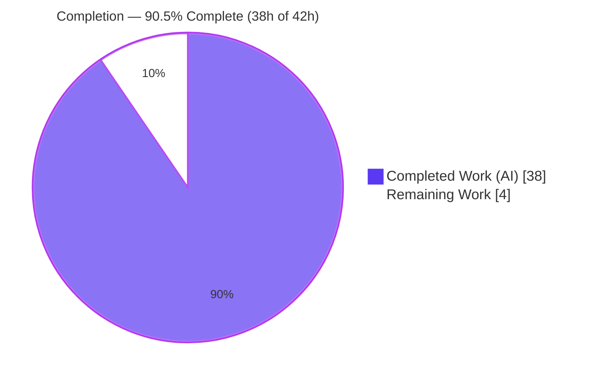
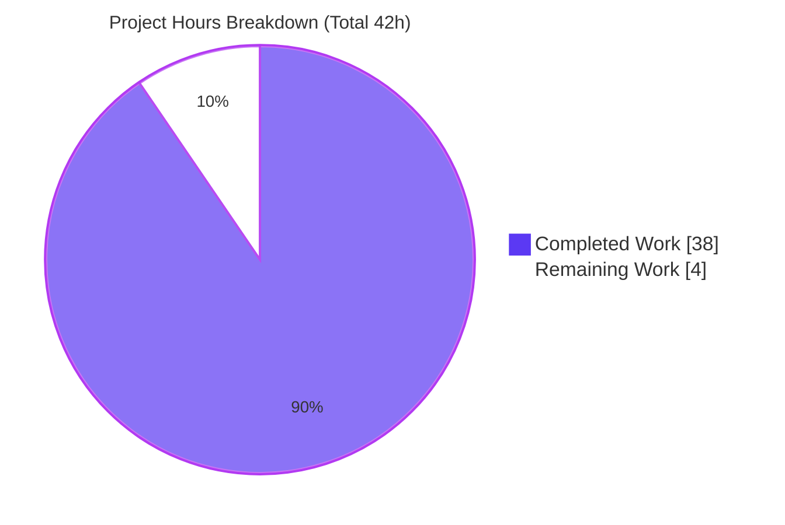
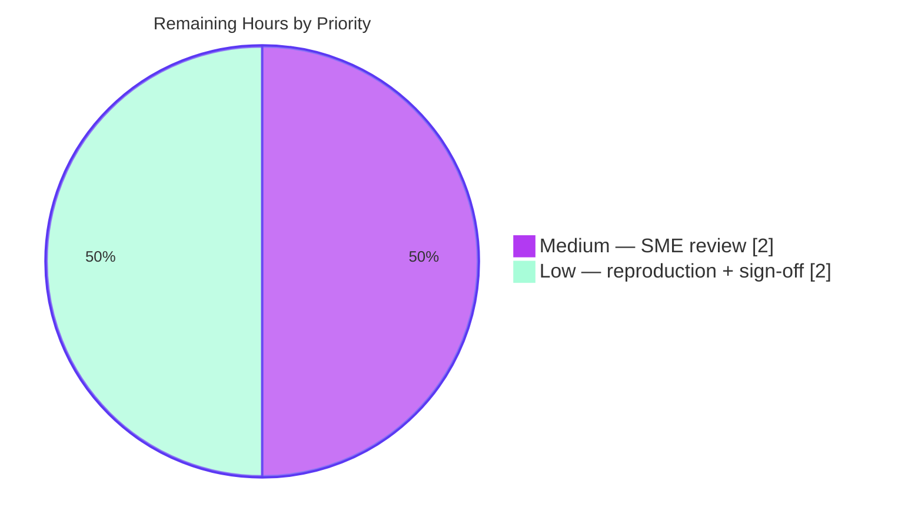

# Blitzy Project Guide — Maddy Module-System Lifecycle Answer Document

> **Scope note:** This project is an investigative, evidence-grounded **documentation** deliverable (rule set *SWE-AtlasQnA-Repo*). The single required artifact is `blitzy/documentation/maddy_26452dd8dd78.md`, which answers a developer's five-part onboarding question about how the Maddy mail server's module system assembles itself. The task is strictly **read-only** against the Maddy source. Because there is no application UI and no deployment target in scope, the UI-verification and deployment aspects of the template are marked *Not Applicable* where appropriate, with rationale.

---

## 1. Executive Summary

### 1.1 Project Overview

This project delivers a single, evidence-grounded Markdown document — `blitzy/documentation/maddy_26452dd8dd78.md` — that explains how the **Maddy** mail server (`github.com/foxcpp/maddy`, HEAD `26452dd`) assembles its module system at startup and during message flow. It answers five developer sub-questions (Q1–Q5) covering immediate-vs-deferred registration, lazy initialization and the `&` reference syntax, endpoint-lifecycle divergence, check/modifier coordination, and runtime "settled-graph" evidence. Every claim is grounded in exact `file:line` citations and verbatim runtime output captured from a locally built binary. The audience is developers onboarding to Maddy's architecture. The task is read-only: no Maddy source is modified; only the one answer file is added.

### 1.2 Completion Status



<span style="color:#5B39F3">**■ Completed (AI)**</span> &nbsp;&nbsp; <span style="color:#B23AF2">**□ Remaining**</span>

| Metric | Hours | Notes |
|--------|------:|-------|
| **Total Hours** | **42** | Full AAP-scoped effort (investigation + authoring + validation + human review) |
| **Completed Hours (AI + Manual)** | **38.0** | Autonomous Blitzy work: all 13 AAP requirements delivered & validated |
| &nbsp;&nbsp;• Completed by AI (autonomous) | 38.0 | Investigation, authoring, evidence capture, citation audit, QA |
| &nbsp;&nbsp;• Completed by Manual (human) | 0.0 | None to date — deliverable produced autonomously |
| **Remaining Hours** | **4** | Human SME review + reproduction + merge sign-off |
| **Percent Complete** | **90.5%** | 38.0 ÷ 42 × 100 |

**Completion formula (PA1, AAP-scoped):** `Completion % = Completed ÷ (Completed + Remaining) = 38.0 ÷ (38.0 + 4.0) = 38.0 ÷ 42 = 90.5%`.

### 1.3 Key Accomplishments

- ✅ **Single-artifact deliverable created and committed** — `blitzy/documentation/maddy_26452dd8dd78.md` (818 lines), the only change versus base Maddy HEAD `26452dd`.
- ✅ **All five sub-questions (Q1–Q5) answered explicitly**, each with a dedicated section, exact `file:line` citations, verbatim observed output, and rationale, closed by a coverage-pass checklist.
- ✅ **Run-first methodology honored** — the server was built with `CGO_ENABLED=1` and executed; real startup logs and exit codes were captured *before* writing.
- ✅ **Verbatim evidence, byte-exact** — three runtime scenarios (valid mixed SMTP+IMAP settle, orphaned-block abort, no-CGO driver failure) were independently reproduced; the valid run matched the document's quoted 13-line block **byte-for-byte**.
- ✅ **Exact-literal grounding verified** — ~200 `file:line` references across 23 files; independent spot-checks (17 blank imports, registry maps, `ModuleFromNode` `&`-detection, cycle-break, three-loop settle guard) were all exact.
- ✅ **Read-only rule fully honored** — zero source modifications; `go.mod`/`go.sum` byte-identical to base; out-of-repo observation workspace removed; working tree clean.
- ✅ **Version fidelity maintained** — all literals grounded at HEAD `26452dd` (non-namespaced names `sql`/`smtp`/`imap`); zero leakage of newer upstream namespaced syntax.
- ✅ **Independent validation reproduced** — `go mod verify` (all modules verified), `CGO_ENABLED=1 go build ./...` (exit 0, 46 packages), `go test ./... -cover` (20 ok / 0 fail), `-race` (0 data races).

### 1.4 Critical Unresolved Issues

| Issue | Impact | Owner | ETA |
|-------|--------|-------|-----|
| _None_ | No unresolved issues block release or validation. All five production-readiness gates passed; the deliverable is complete, committed, and independently reproduced. | — | — |

> The only non-blocking, out-of-scope observation is a benign third-party C-compiler warning in the cached `github.com/mattn/go-sqlite3` amalgamated SQLite source (`-Wreturn-local-addr`); build and tests still exit 0. It cannot be fixed without modifying a cached dependency and is therefore out of scope (see §6, R8).

### 1.5 Access Issues

| System/Resource | Type of Access | Issue Description | Resolution Status | Owner |
|-----------------|----------------|-------------------|-------------------|-------|
| _None_ | — | No access issues identified. The build resolves all dependencies offline from a warm module cache; no repository permissions, service credentials, or third-party API access are required for build, test, or observation. | N/A | — |

**No access issues identified.**

### 1.6 Recommended Next Steps

1. **[Medium]** Have a Maddy-familiar SME technically review the answer document (verify Q1–Q5 correctness/completeness and spot-check a sample of citations against source at HEAD `26452dd`).
2. **[Low]** Independently reproduce the runtime evidence (`CGO_ENABLED=1` build + the valid/orphan/no-CGO scenarios) to confirm the verbatim output blocks.
3. **[Low]** Approve and merge the single-file addition to the target branch.
4. **[Low]** (Optional) If the document will be published for readers who may consult current upstream Maddy, add a short pointer to the namespaced-syntax mapping so version skew is understood.

---

## 2. Project Hours Breakdown

### 2.1 Completed Work Detail

All items below are autonomous Blitzy work and trace to specific AAP requirements. **Total = 38.0 hours.**

| Component | Hours | Description |
|-----------|------:|-------------|
| Build environment & run-first observation harness | 4.0 | Establish Go + CGO toolchain; author out-of-repo observation configs; build binary; capture verbatim startup logs/exit codes (AAP §0.5.1, AAP-7/AAP-13) |
| Q1 — Immediate vs. deferred (investigate + write) | 3.0 | Trace package-init registration of 17 modules and Loop-1 register-without-Init; write §Q1 with citations + evidence (AAP-2) |
| Q2 — Lazy init & `&` syntax (investigate + write) | 5.0 | Trace parser `&name`-as-token, `ModuleFromNode` resolution, `GetInstance` lazy at-most-once init + cycle break; write §Q2 (AAP-3) |
| Q3 — Endpoint divergence (investigate + write) | 3.0 | Trace `FuncNewEndpoint` contract and Loop-2 eager/direct init; write §Q3 with the three `listening on` lines (AAP-4) |
| Q4 — Check/modifier coordination (investigate + write) | 5.0 | Trace parallel check runner (`WaitGroup`, mutex-merge, phase replay), three-layer modifier chain, two-level routing; write §Q4 with honest verifiability caveat (AAP-5) |
| Q5 — Settle evidence (investigate + write) | 3.0 | Trace Loop-3 unused-block guard; capture positive (EXIT=124) and negative (EXIT=2 abort) evidence; write §Q5 (AAP-6) |
| Document framing | 4.0 | Introduction, version-fidelity caveat, evidence-provenance section, reproducibility note, and coverage-pass checklist (AAP-10/AAP-11) |
| Exact-literal citation audit | 5.0 | Verify ~200 `file:line` references across 23 files against source at HEAD (AAP-9) |
| Validation & QA | 3.0 | `go mod verify`, `CGO_ENABLED=1 go build ./...`, `go test ./... -cover -race`, byte-for-byte runtime reproduction (AAP-8/AAP-12) |
| Iterative refinement | 3.0 | Resolve code-review findings, QA final-gate findings, and the modconfig error-citation precision fix (3 follow-up commits) |
| **Total Completed** | **38.0** | |

### 2.2 Remaining Work Detail

All remaining items trace to the sole path-to-production activity for a documentation deliverable: **human review and acceptance** (AAP §0.8.1 explicitly excludes deployment/platform actions). **Total = 4 hours.**

| Category | Hours | Priority |
|----------|------:|----------|
| SME technical review of the answer document (verify Q1–Q5 correctness/completeness; spot-check citations; confirm version-fidelity & Q4 caveats acceptable) | 2.0 | Medium |
| Independent reproduction of runtime evidence (CGO build + valid/orphan/no-CGO scenarios) | 1.0 | Low |
| Final acceptance & merge sign-off | 1.0 | Low |
| **Total Remaining** | **4** | |

> **Cross-section check:** Completed 38.0 + Remaining 4.0 = **42** = Total Hours in §1.2. Remaining 4.0 equals the §7 pie "Remaining Work" value.

### 2.3 Hours Methodology & Confidence

- **Basis:** Effort is estimated per AAP requirement using the PA2 framework (investigation + authoring + evidence capture + audit + QA), not lines of code — appropriate for an investigative documentation task.
- **Confidence — completed/remaining ratio: High.** All five validation gates were independently reproduced; all 13 AAP requirements are classified Completed; the only genuinely outstanding work is human review of a finished, validated artifact.
- **Confidence — absolute magnitude: Medium.** A bespoke deep-dive of this depth carries inherent estimation variance (an engineer already fluent in the codebase would spend less; one learning it cold, more). The completion **percentage** is robust because it depends on the ratio, not the absolute total.

---

## 3. Test Results

All results below originate from **Blitzy's autonomous validation runs** (reproduced independently in this environment: Go 1.18.10, gcc 15.2.0, `CGO_ENABLED=1`). This documentation task adds no new tests; the suite exercised is Maddy's existing test suite, run to validate the build/runtime environment that grounds the answer document's evidence.

| Test Category | Framework | Total Tests | Passed | Failed | Coverage % | Notes |
|---------------|-----------|------------:|-------:|-------:|-----------:|-------|
| Unit / package tests | `go test` | 232 test functions across 20 test-bearing packages | 232 (20/20 pkgs `ok`) | 0 | See per-package (§10-C) | 26 additional packages have no test files; 0 panics |
| Concurrency / race | `go test -race` | Same suite | Pass | 0 data races | — | Corroborates §Q4 concurrency claims (`internal/msgpipeline` passes under `-race`) |
| Static analysis | `go vet` | Key module-system packages + root | Pass | 0 findings | — | Zero Go issues; only a benign third-party C note |
| Compilation | `go build ./...` | 46 packages | Pass | 0 | — | `CGO_ENABLED=1`, exit 0 |

**Representative package coverage (doc-relevant):** `pkg/cfgparser` 91.8% (Q2 parser), `internal/config/lexer` 89.5% (Q2 lexing), `internal/endpoint/smtp` 79.4% (Q3), `internal/msgpipeline` 74.5% (Q4 pipeline). Highest overall: `internal/auth` 100.0%. (`internal/storage/sql` reports 0.5% with "no tests to run" — it has no in-package tests but compiles and runs under CGO.)

**Aggregate:** 20 packages passed, **0 failed**, 0 panics, 0 data races, compilation exit 0. Full pass across all executed suites.

---

## 4. Runtime Validation & UI Verification

**UI Verification:** *Not Applicable.* Maddy is a headless SMTP/IMAP mail server; there is no web or graphical UI in scope. Runtime verification is therefore performed against the server's **startup logs and exit codes**, which are the observable runtime surface relevant to Q1–Q5.

Runtime health (all scenarios built out-of-repo with `CGO_ENABLED=1`; binary ≈ 19.4 MB; independently reproduced):

- ✅ **Operational — Valid mixed SMTP+IMAP config (settled).** `timeout -s TERM 8 ./maddy -debug -config valid.conf` → **EXIT=124** (server stayed up until the timeout signal). All three endpoints logged `listening on tcp://127.0.0.1:{2525,2587,2143}`; `&`-references resolved out of order at config lines 12/17/18/23/24; `sql: go-imap-sql version 0.4.0` logged once (lazy, at-most-once init). The captured 13-line `stderr` matched the document's quoted block **byte-for-byte**.
- ✅ **Operational — Orphaned-block config (settle guard fires).** → **EXIT=2** with `Unused configuration block at <file>:<line> - orphan_storage (sql)`. Crucially, all three endpoints logged `listening on` **before** the abort line, proving Loop 2 (eager endpoint init) runs before Loop 3 (settle check) — the §Q5 ordering evidence.
- ✅ **Operational (negative control) — No-CGO build.** `CGO_ENABLED=0` build succeeds (exit 0) but the run → **EXIT=2** with `sql: NewBackend (open): sql: unknown driver "sqlite3" (forgotten import?)`, confirming the CGO prerequisite for the default `sql`/SQLite3 storage.
- ✅ **Operational — Dependency & module integrity.** `go mod verify` → "all modules verified"; deps resolve offline; `go.mod`/`go.sum` byte-identical to base.

**API integration outcomes:** *Not Applicable* — no external API integrations are in scope for this read-only documentation task.

---

## 5. Compliance & Quality Review

Cross-mapping of AAP deliverables and rule-set constraints to their status. Fixes applied during autonomous validation are noted.

| # | AAP / Rule Requirement | Benchmark | Status | Progress |
|---|------------------------|-----------|--------|:--------:|
| AAP-1 | Single document, correctly named/located (`blitzy/documentation/maddy_26452dd8dd78.md`) | One artifact only | ✅ Pass | 100% |
| AAP-2 | Q1 answered with citations + verbatim evidence | Explicit section | ✅ Pass | 100% |
| AAP-3 | Q2 answered (lazy init & `&`) | Explicit section | ✅ Pass | 100% |
| AAP-4 | Q3 answered (endpoint divergence & why) | Explicit section | ✅ Pass | 100% |
| AAP-5 | Q4 answered (check/modifier coordination) | Explicit section + honest caveat | ✅ Pass | 100% |
| AAP-6 | Q5 answered (settle evidence) | Explicit section | ✅ Pass | 100% |
| AAP-7 | Run-first methodology (build+run before writing) | Evidence provenance shown | ✅ Pass | 100% |
| AAP-8 | Verbatim evidence with producing command | `cat -A`, `^I`/`$`, EXIT codes | ✅ Pass | 100% |
| AAP-9 | Exact-literal grounding (`file:line`) | ~200 refs, 23 files | ✅ Pass | 100% |
| AAP-10 | Version fidelity at HEAD `26452dd` (non-namespaced) | Zero namespaced leaks | ✅ Pass | 100% |
| AAP-11 | Coverage pass confirming all sub-parts | Checklist table (all ✅) | ✅ Pass | 100% |
| AAP-12 | Read-only: no source modified; temp removed | `git diff` = 1 file A; tree clean | ✅ Pass | 100% |
| AAP-13 | CGO build for SQLite3 evidence | `CGO_ENABLED=1` build exit 0 | ✅ Pass | 100% |

**Fixes applied during autonomous validation:**
- **Code-review findings** resolved (commit `be6e8b1`).
- **QA final-gate findings** resolved (commit `be434ee`).
- **Precision fix** (commit `101058e`): the modconfig error citation was refined to distinguish the error *check* at `modconfig.go:L73` (`if err != nil {`) from the `return err` at `modconfig.go:L74` — independently verified correct.

**Quality signals:** Markdown well-formed (42 balanced code fences); document self-consistent (quoted log lines map one-to-one to their emitting source lines); honest verifiability caveat present for Q4's live message-flow internals.

**Outstanding compliance items:** None. All AAP requirements and rule-set constraints pass.

---

## 6. Risk Assessment

| Risk | Category | Severity | Probability | Mitigation | Status |
|------|----------|----------|-------------|------------|--------|
| R1 — Version/line-number skew vs newer upstream (namespaced names) | Technical | Low | Medium | Explicit version-fidelity caveat at document top; all literals pinned to HEAD `26452dd` | Mitigated |
| R2 — Citation staleness if referenced source were edited | Technical | Low | Low | Repo is read-only and pinned to a commit; citations are frozen | Accepted |
| R3 — Q4 live message-flow internals code-grounded (startup-only observation) | Technical | Low | Low | Document states the caveat honestly; behavior grounded in source + `-race`-verified concurrency | Documented |
| R4 — Observation configs used `tls off`/`insecure_auth` | Security | Informational | N/A | Local, out-of-repo, test-only; removed after use; never committed; quoted as evidence, not a recommendation | N/A (test-only) |
| R5 — CGO prerequisite for default `sql`/SQLite3 storage | Operational | Low | Medium | Reproducibility note documents the requirement and quotes the exact failure (`unknown driver "sqlite3"`) | Documented |
| R6 — Go point-release variance in `go version` string | Operational | Low | Low | Document notes output derives from source at HEAD, not the toolchain point release | Documented |
| R7 — External service / API / credential dependency | Integration | N/A | N/A | None in scope; dependencies resolve offline from module cache (`go mod verify` passes) | N/A |
| R8 — Benign third-party `mattn/go-sqlite3` C-compiler warning | Technical (dependency) | Low | Medium | Cached dependency source; build/tests exit 0 regardless; forbidden to modify under read-only rule | Accepted / Out-of-scope |

**Overall risk posture: LOW.** No high or critical risks; no blocking issues. Every identified risk is Low or Informational and is either mitigated by the document's own caveats or accepted as inherent to a version-pinned, read-only documentation deliverable.

---

## 7. Visual Project Status



<span style="color:#5B39F3">**■ Completed Work — 38.0h (90.5%)**</span> &nbsp;&nbsp; <span style="color:#B23AF2">**□ Remaining Work — 4.0h (9.5%)**</span>

**Remaining work by priority (from §2.2, sums to 4h):**



> **Integrity:** "Remaining Work" = **4h** here, in the §1.2 metrics table, and as the sum of the §2.2 "Hours" column — identical across all three.

---

## 8. Summary & Recommendations

**Achievements.** The project delivered a complete, evidence-grounded answer document that resolves all five developer sub-questions about Maddy's module-system lifecycle, each paired with exact `file:line` citations and verbatim runtime output. The deliverable was produced under a strict read-only constraint (the sole change versus base Maddy HEAD `26452dd` is the one added file), with `go.mod`/`go.sum` untouched and the working tree clean.

**Remaining gaps.** None are functional. The **9.5%** of remaining effort (4h) is entirely human review and acceptance: an SME technical read-through, optional independent reproduction of the runtime evidence, and merge sign-off.

**Critical path to production.** SME review (2.0h) → optional evidence reproduction (1.0h) → merge sign-off (1.0h). There are no blocking fixes, no configuration, and no deployment steps (AAP §0.8.1 excludes deployment/platform actions).

**Success metrics (all met).** All five sub-questions answered and coverage-checked; all citations exact; runtime evidence reproduced byte-for-byte; read-only rule honored; version fidelity intact; every validation gate green.

**Production-readiness assessment.** The project is **90.5% complete** (38.0 of 42 hours). The autonomous deliverable is finished and independently validated; the residual work is limited to human acceptance. Per Blitzy policy, completion is not reported as 100% prior to human review. **Recommendation: proceed to SME review and merge.**

---

## 9. Development Guide

This guide is CLI/server-oriented (the deliverable is documentation; the "application" is the Maddy binary used to capture evidence). Every command below was executed and verified in this environment.

### 9.1 System Prerequisites

- **OS:** Linux/Unix (verified on Ubuntu 25.10).
- **Go:** ≥ 1.13 (module floor, `go.mod:L3`); verified on `go1.18.10`.
- **C compiler:** `gcc` (verified `gcc 15.2.0`) — **required** with `CGO_ENABLED=1` for the default `sql`/SQLite3 storage backend.
- **git**, and ~2 GB free disk for the module cache and build artifacts.

### 9.2 Environment Setup

```bash
# From the repository root (branch: blitzy-359d31de-cc82-4ca2-9f31-b66379b1b0d6)
export PATH=/usr/local/go/bin:$HOME/go/bin:$PATH
go version    # expect: go version go1.18.10 linux/amd64 (any >= 1.13 is fine)
gcc --version # expect: gcc (Ubuntu 15.2.0-4ubuntu4) 15.2.0 (or any C toolchain)
```

- No application environment variables are required to build or test.
- Per the read-only rule, any observation configs/binaries are created **outside** the repository (e.g., under `/tmp/obs`) and removed afterward.

### 9.3 Dependency Verification

```bash
go mod verify   # expect: "all modules verified"  (exit 0)
```

Dependencies are pinned in `go.mod`/`go.sum` and resolve from the module cache offline. No manual install step is required; do **not** run `go get`/`go mod download all` (it can touch `go.sum` and violate the read-only rule).

### 9.4 Build

```bash
# Build the entire module (CGO on, so SQLite3 storage is available)
CGO_ENABLED=1 go build ./...        # exit 0; all 46 packages

# Build just the executable (repo root is a library; real main is cmd/maddy/main.go:L10)
CGO_ENABLED=1 go build -o /tmp/obs/maddy ./cmd/maddy   # exit 0; ~19 MB binary
```

> A benign C-compiler warning from the third-party `github.com/mattn/go-sqlite3` package may print during the CGO build; it does not affect the exit code (still 0) and is out of scope.

### 9.5 Verification

```bash
CGO_ENABLED=1 go test ./... -cover          # exit 0: 20 ok / 26 no-test-files / 0 FAIL
CGO_ENABLED=1 go test ./... -cover -race    # exit 0: 0 data races (optional, slower)
CGO_ENABLED=1 go vet ./...                  # exit 0: zero Go findings
# Read the deliverable:
sed -n '1,60p' blitzy/documentation/maddy_26452dd8dd78.md
```

### 9.6 Example Usage — Reproduce the Runtime Evidence

```bash
mkdir -p /tmp/obs/state /tmp/obs/runtime
CGO_ENABLED=1 go build -o /tmp/obs/maddy ./cmd/maddy

# Valid mixed SMTP+IMAP config (sql declared LAST to demonstrate out-of-order &-resolution)
cat > /tmp/obs/valid.conf <<'EOF'
# padding comment line 1
# padding comment line 2
# padding comment line 3
# padding comment line 4
state /tmp/obs/state
runtime /tmp/obs/runtime

hostname mx.observe.test
tls off

smtp tcp://127.0.0.1:2525 {
    deliver_to &local_mailboxes
}

submission tcp://127.0.0.1:2587 {
    insecure_auth
    auth &local_authdb
    deliver_to &local_mailboxes
}

imap tcp://127.0.0.1:2143 {
    insecure_auth
    auth &local_authdb
    storage &local_mailboxes
}


sql local_mailboxes local_authdb {
    driver sqlite3
    dsn all.db
}
EOF

# Run; server settles and stays up until the 8s SIGTERM (EXIT=124 means it settled)
timeout -s TERM 8 /tmp/obs/maddy -debug -config /tmp/obs/valid.conf ; echo "EXIT=$?"
# Expected: EXIT=124, plus "smtp/submission/imap: listening on tcp://127.0.0.1:{2525,2587,2143}"
#           and "signal received (terminated) ..." at shutdown.

rm -rf /tmp/obs   # leave no artifacts (honor read-only rule)
```

### 9.7 Troubleshooting

- **`sql: unknown driver "sqlite3" (forgotten import?)`** → the binary was built without CGO. Rebuild with `CGO_ENABLED=1` and a C compiler installed.
- **Module names/line numbers don't match (you see `storage.imapsql`, `target.smtp`, `checks {}` blocks)** → you are on newer upstream Maddy. This document is pinned to HEAD `26452dd`, which uses non-namespaced names (`sql`, `smtp`, `submission`, `lmtp`, `imap`, `queue`, `remote`).
- **`go: ... requires go >= 1.13`** → upgrade your Go toolchain.
- **TLS certificate errors on startup** → for local observation use `tls off` with `tcp://` listeners (test-only; never in production).
- **`go.sum` shows as modified** → you ran a network-touching Go command; restore with `git checkout -- go.sum` to keep the tree clean.

---

## 10. Appendices

### Appendix A — Command Reference

| Command | Purpose |
|---------|---------|
| `go mod verify` | Verify dependency integrity (expect "all modules verified") |
| `CGO_ENABLED=1 go build ./...` | Build all 46 packages with SQLite3 support (exit 0) |
| `CGO_ENABLED=1 go build -o /tmp/obs/maddy ./cmd/maddy` | Build the server executable (~19 MB) |
| `CGO_ENABLED=1 go test ./... -cover` | Run unit tests with coverage (20 ok / 0 fail) |
| `CGO_ENABLED=1 go test ./... -race` | Run tests under the race detector (0 data races) |
| `CGO_ENABLED=1 go vet ./...` | Static analysis (0 Go findings) |
| `timeout -s TERM 8 ./maddy -debug -config <cfg>` | Run server with debug logging for observation |
| `cat -A <stderr>` | Render captured logs byte-exactly (`^I`=TAB, `$`=newline) |
| `git diff 26452dd --name-status` | Confirm the only change is the added document |

### Appendix B — Port Reference (observation configs only, out-of-repo)

| Port | Endpoint | Listener |
|-----:|----------|----------|
| 2525 | `smtp` | `tcp://127.0.0.1:2525` |
| 2587 | `submission` | `tcp://127.0.0.1:2587` |
| 2143 | `imap` | `tcp://127.0.0.1:2143` |

> These ports are used only by the temporary observation configs (removed after use); they are not part of the repository or any deployment.

### Appendix C — Key File Locations & Per-Package Test Coverage

**Deliverable & references:**

| Path | Role |
|------|------|
| `blitzy/documentation/maddy_26452dd8dd78.md` | **The deliverable** (818 lines, the only change vs base) |
| `maddy.go` | Orchestration: 17 blank imports (L20–38), three-loop `instancesFromConfig` (L294–375) |
| `internal/module/registry.go` | Two registry maps under `sync.RWMutex` (L7–11) |
| `internal/module/instances.go` | `GetInstance` lazy at-most-once init + cycle break (L64–72) |
| `internal/module/module.go` | `FuncNewEndpoint` divergence contract (L59–71) |
| `internal/config/module/modconfig.go` | `&`-detection (L59), `GetInstance` (L67), debug log (L68), error (L73–74) |
| `pkg/cfgparser/parse.go` | `Node` model; `&name` stored as plain token (L97) |
| `internal/msgpipeline/check_runner.go`, `msgpipeline.go` | Q4 parallel checks + modifier chain + routing |
| `internal/endpoint/{smtp,imap}` | Endpoint registration + `listening on` logs |
| `internal/storage/sql/{sqlite3.go,sql.go}` | CGO build constraint (L1–5); `Register("sql", …)` |
| `cmd/maddy/main.go` | Real executable: `os.Exit(maddy.Run())` (L10) |

**Per-package coverage (from the autonomous `go test -cover` run):**

| Package | Coverage | Package | Coverage |
|---------|---------:|---------|---------:|
| `internal/auth` | 100.0% | `internal/target/queue` | 74.7% |
| `pkg/cfgparser` | 91.8% | `internal/msgpipeline` | 74.5% |
| `internal/future` | 91.7% | `internal/mtasts` | 70.6% |
| `internal/dmarc` | 91.1% | `internal/modify` | 69.1% |
| `internal/config/lexer` | 89.5% | `internal/smtpconn` | 50.0% |
| `pkg/logparser` | 87.5% | `internal/check/dnsbl` | 43.8% |
| `internal/check/dns` | 82.3% | `internal/modify/dkim` | 42.6% |
| `internal/target/smtp_downstream` | 80.4% | `internal/config` | 32.5% |
| `internal/endpoint/smtp` | 79.4% | `internal/storage/sql` | 0.5%* |
| `internal/address` | 76.4% | `internal/target/remote` | 76.3% |

\* `internal/storage/sql` reports "no tests to run" (compiles/runs under CGO but has no in-package tests).

### Appendix D — Technology Versions

| Component | Version | Source |
|-----------|---------|--------|
| Go module floor | `go 1.13` | `go.mod:L3` |
| Go toolchain (validation) | `go1.18.10 linux/amd64` | this environment |
| C compiler | `gcc 15.2.0` | this environment |
| Maddy base commit | `26452dd` | git HEAD of source |
| `github.com/emersion/go-smtp` | `v0.12.1-0.20191206174923-1f576e0ec85c` | `go.mod:L19` |
| `github.com/emersion/go-imap` | `v1.0.1` | `go.mod:L9` |
| `github.com/foxcpp/go-imap-sql` | pinned `v0.3.2-0.20191208094750…`; **self-reports `0.4.0`** at runtime | `go.mod:L20` |
| `github.com/mattn/go-sqlite3` | `v1.11.0` (CGO-gated) | `go.mod:L26` |

### Appendix E — Environment Variable Reference

| Variable | Value | Purpose |
|----------|-------|---------|
| `CGO_ENABLED` | `1` | **Required** to compile the SQLite3 driver for the default `sql` storage (gated by `// +build !nosqlite3,cgo`, `internal/storage/sql/sqlite3.go:L1-5`) |
| `PATH` | include `/usr/local/go/bin` | Locate the Go toolchain |
| `GOPATH` / `GOCACHE` | optional (e.g., `/tmp/gopath`, `/tmp/gocache`) | Isolate build caches during out-of-repo observation |

> No application-level environment variables are required for build or test.

### Appendix F — Developer Tools Guide

- **Build/observe** with the Go toolchain + CGO as in §9; capture logs with `2> file` and inspect byte-exactly with `cat -A`.
- **Diffs / authorship:** `git diff 26452dd --name-status` (single added file); `git log --author="agent@blitzy.com" 26452dd..HEAD --oneline` (4 commits).
- **Static/read-only checks:** `go vet ./...`, `gofmt -l .` — no source edits needed (task is read-only).

### Appendix G — Glossary

| Term | Meaning |
|------|---------|
| **Blank import** | `import _ "pkg"` — pulls in a package solely to run its `init()` (module self-registration) |
| **Register-on-init** | The Go pattern where `init()` populates a global name→constructor map (as in `database/sql`) |
| **`&name` reference** | Config syntax referencing a top-level named block; stored as a plain token at parse time, resolved lazily later |
| **Lazy / at-most-once init** | A referenced module is initialized only when first needed, and `Initialized[name]` is set **before** `Init` to break cycles |
| **Endpoint module** | A module built via `FuncNewEndpoint`; initialized **eagerly/directly** in Loop 2 (diverging from lazy regular modules) |
| **Settle (settled graph)** | State where every regular block is in `Initialized`; Loop 3 aborts with "Unused configuration block…" otherwise |
| **`EXIT=124`** | `timeout` sent SIGTERM — the server ran (settled) until the timeout, i.e., a clean settle |

---

*Guide generated by the Blitzy autonomous assessment agent. Completion figures reflect AAP-scoped work only (PA1 methodology). Brand colors: Completed = Dark Blue `#5B39F3`; Remaining = White `#FFFFFF`; headings/accents = Violet-Black `#B23AF2`; highlight = Mint `#A8FDD9`.*