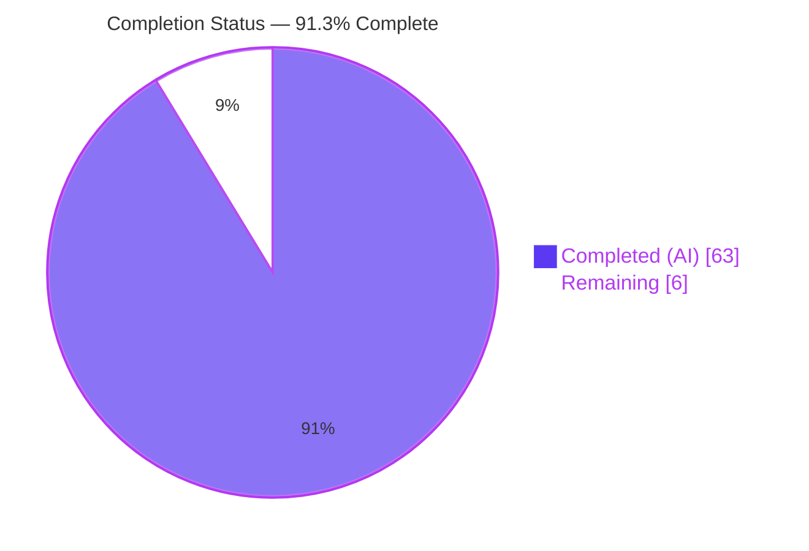
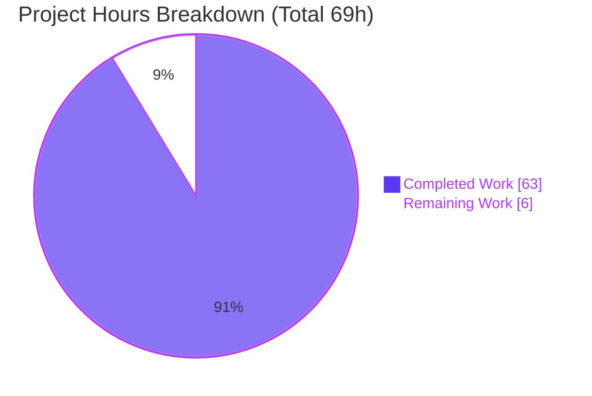
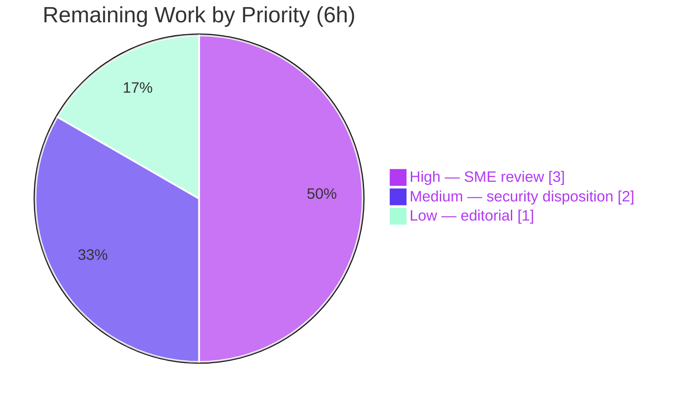

# Blitzy Project Guide — Maddy SMTP `DATA` Message-Boundary Runtime Investigation

> **Blitzy brand colors applied throughout:** Completed / AI Work = Dark Blue `#5B39F3` · Remaining / Not Completed = White `#FFFFFF` · Headings / Accents = Violet-Black `#B23AF2` · Highlight / Soft Accent = Mint `#A8FDD9`.

---

## 1. Executive Summary

### 1.1 Project Overview

This project is a **read-only, runtime-grounded investigation** of the Maddy mail server (`github.com/foxcpp/maddy` @ commit `26452dd8dd78`). The objective was to determine — by actually building and running the real SMTP server — exactly how Maddy detects the end of the `DATA` phase (the message boundary) when clients manipulate line endings, dot-stuffing, and command pipelining. The audience is engineers and security reviewers new to the codebase. The single deliverable is one Markdown answer document that explains the mechanism (Q1) and reports, with complete unedited runtime evidence, varied boundary framing (Q2), SMTP smuggling under pipelining (Q3), back-to-back stability (Q4), front-proxy behavior (Q5), and the end-to-end runtime story (Q6). Business impact: a reproducible security characterization of a CVE-2023-51765-class desync in a pinned 2019 dependency.

### 1.2 Completion Status



| Metric | Hours |
|--------|-------|
| **Total Hours** | **69** |
| Completed Hours (AI) | 63 |
| Completed Hours (Manual) | 0 |
| **Completed Hours (AI + Manual)** | **63** |
| **Remaining Hours** | **6** |
| **Percent Complete** | **91.3%** |

> Completion is computed by the AAP-scoped hours method (PA1): `Completed ÷ (Completed + Remaining) = 63 ÷ 69 = 91.3%`. All AAP-specified deliverables are complete and validated; the remaining 6 hours are path-to-production human-review activities that inherently require a person.

### 1.3 Key Accomplishments

- ✅ Built the canonical `maddy` binary from source (`go build ./cmd/maddy`, CGO + SQLite + PAM) and ran it under a minimal, check-free plaintext probe config with `io_debug yes`.
- ✅ Authored the sole deliverable **`blitzy/documentation/maddy_26452dd8dd78.md`** (3,664 lines) answering **Q1–Q6 by name**, each with complete unedited runtime evidence.
- ✅ **Q1 mechanism identified:** the end-of-`DATA` detector is the **Go standard library `net/textproto` dot-reader**, delegated to by `go-smtp` (`data.go:53`), not Maddy code.
- ✅ **Q2 varied framing exercised:** canonical `\r\n.\r\n`, bare-LF `\n.\n`, mixed `\n.\r\n` / `\r\n.\n`, dot-stuffing `\r\n..\r\n`, and missing-final-CRLF — all reproduced with delivered-byte diffs (E1–E6, plus ELINE/ECMD/552 edge paths).
- ✅ **Q3 SMTP smuggling CONFIRMED at runtime:** a single 409-byte pipelined write delivered **two** messages, including a fully attacker-controlled `spoofed@evil.example` (CVE-2023-51765-class desync).
- ✅ **Q4 stability CONFIRMED:** five back-to-back messages delivered 5/5 across two identical runs (deterministic, no boundary wobble).
- ✅ **Q5 front proxy characterized:** a *normalize* proxy does **not** stop the spoof; a *reject-on-bare-LF* proxy blocks it (`421`, 0 delivered).
- ✅ **Q6 runtime story assembled:** unterminated `DATA` hangs to the 10-minute `read_timeout`; early close yields 0 delivery; no `CHUNKING`/`BDAT` is advertised.
- ✅ **~57 file:line citations verified** against source at commit `26452dd8dd78` (0 mismatches); exactly two inferred-from-source claims, both runtime-corroborated and labeled.
- ✅ **Read-only scope preserved:** `git diff` shows exactly one file added, 0 source/config/test changes; working tree clean; temporary harness fully removed.
- ✅ **Validation gates all pass:** `go build ./...` (46 pkgs) exit 0; `go test ./...` → 20 ok / 0 fail / 26 no-test; `go vet` clean; `go mod verify` → all modules verified.

### 1.4 Critical Unresolved Issues

| Issue | Impact | Owner | ETA |
|-------|--------|-------|-----|
| None blocking the deliverable | The document is complete, validated, and committed; no unresolved item prevents its acceptance. | — | — |
| Documented (not a blocker): SMTP-smuggling desync in the pinned 2019 `go-smtp` | Reported finding — requires a human remediation **decision** (remediation itself is out of the read-only AAP scope). Tracked as remaining Task 2. | Security / Maintainer | Within 1 sprint of review |

> There are **no** compilation errors, failing tests, or missing deliverables. The only item warranting attention is the disposition of the security finding the investigation was designed to surface — this is expected output, not a defect.

### 1.5 Access Issues

| System/Resource | Type of Access | Issue Description | Resolution Status | Owner |
|-----------------|----------------|-------------------|-------------------|-------|
| `govulncheck` in canonical image | Tooling / egress | Not installed and cannot be fetched (no general `go install` egress); OSV.dev + web-search were used instead for the dependency scan | Worked around (documented in §8.5 of the deliverable) | DevEx |
| NVD (`nvd.nist.gov`) | External HTTP | Returns HTTP 403 to non-browser `curl` (anti-automation) | Not blocking — `cve.org` mirrors used and reachable (HTTP 200) | — |

> No repository-permission, credential, or third-party API access issue prevented build, test, runtime validation, or delivery. Both items above are minor and already worked around.

### 1.6 Recommended Next Steps

1. **[High]** Conduct SME technical review and acceptance of the answer document — confirm each Q1–Q6 answer against the deliverable's Appendix B captures and spot-check citations. *(Task 1, 3h)*
2. **[Medium]** Decide the disposition of the documented SMTP-smuggling finding — accept the risk, open a **separate** remediation ticket (upgrade `go-smtp` ≥ v0.20.1 and/or add bare-LF rejection), or deploy the reject-on-bare-LF front-proxy mitigation. *(Task 2, 2h)*
3. **[Low]** Render the Markdown in the target viewer (GitHub / mkdocs) and complete a light editorial pass. *(Task 3, 1h)*
4. **[Low]** If the base commit advances beyond `26452dd8dd78`, re-verify the ~57 file:line citations (currently pinned and verified).

---

## 2. Project Hours Breakdown

### 2.1 Completed Work Detail

| Component | Hours | Description |
|-----------|-------|-------------|
| Canonical build environment & `maddy` binary | 3 | `go build ./cmd/maddy` with CGO (go-sqlite3) + PAM; version string verification; benign sqlite3 warning confirmed |
| Investigation harness (temporary, `/tmp/investig`) | 10 | Minimal check-free probe `maddy.conf`, raw-socket `probe.py`, front `proxy.py` (normalize/reject), byte-exact `catch.py` sink, size-limit config |
| Q1 — Boundary-detection mechanism | 5 | Three-layer model (raw wire → `net/textproto` dot-reader → `prepareBody`); dot-reader state machine analysis |
| Q2 — Varied boundary framing | 7 | E1 canonical, E2 bare-LF, E3a/E3b mixed, E4 dot-stuffing, E5 missing-CRLF, E6 early-close; ELINE/ECMD line-limit; 552 size-limit |
| Q3 — Pipelined pressure / SMTP smuggling | 4 | E7 single 409-byte pipelined write → 2 delivered; cause→effect root-cause; upstream fix-timeline research |
| Q4 — Back-to-back stability | 2 | E8 five back-to-back messages × two identical runs; distribution reporting |
| Q5 — Front proxy | 3 | E9 passthrough / normalize / reject × {E2, E7}; byte-rewrite proof |
| Q6 — End-to-end runtime story | 3 | Unterminated-DATA hang, abort paths, artifact inventory, "expected-but-never-seen" (no CHUNKING/BDAT) |
| Answer document authoring | 15 | 3,664-line Markdown: direct answers, six detail sections, coverage matrix, the deliverable's Appendix A harness, the deliverable's Appendix B complete captures |
| Citation verification & dependency vuln scan | 5 | ~57 file:line refs verified @ `26452dd8dd78`; OSV.dev query + web-verified external references |
| Autonomous validation (5 gates) & QA resolution | 6 | Dependencies, compilation, tests, runtime reproduction, in-scope file check; two QA-resolution commits |
| **Total Completed** | **63** | |

### 2.2 Remaining Work Detail

| Category | Hours | Priority |
|----------|-------|----------|
| SME technical review & acceptance of the Q1–Q6 narrative and reproduced evidence | 3 | High |
| Security-finding disposition — triage the SMTP-smuggling result and decide follow-up (remediation is out of AAP scope) | 2 | Medium |
| Editorial & Markdown rendering review | 1 | Low |
| **Total Remaining** | **6** | |

### 2.3 Total Project Hours

| Bucket | Hours |
|--------|-------|
| Completed (Section 2.1) | 63 |
| Remaining (Section 2.2) | 6 |
| **Total Project** | **69** |

> **Integrity check:** 2.1 (63) + 2.2 (6) = **69** = Total in §1.2. Remaining = **6** in §1.2, §2.2, and §7. ✔

---

## 3. Test Results

All results below originate from **Blitzy's autonomous validation logs** for this project and were independently re-confirmed this session (`go build`, `go vet`, targeted `go test`). Because this is a read-only investigation, the agents added **no** test code; the figures reflect the repository's existing suite exercised as part of the "run-first" methodology, plus the runtime experiment matrix driven through the real server.

| Test Category | Framework | Total Tests | Passed | Failed | Coverage % | Notes |
|---------------|-----------|-------------|--------|--------|------------|-------|
| Unit + Integration (repo suite) | Go `testing` (`go test ./...`) | 20 pkg suites | 20 | 0 | Not measured this run | 26 packages have no test files; `-race` clean on packages under study |
| SMTP endpoint (focus pkg) | Go `testing` | 23 test funcs | 23 | 0 | n/a | Incl. `TestSMTPDelivery_AbortData` (abort-before-dot → 0 delivery), `TestSMTPDelivery_Multi`, SMTPUTF8 suite; `go test ./internal/endpoint/smtp/` → `ok 1.526s` |
| Static analysis | `go vet` | 46 pkgs | 46 | 0 | n/a | Clean; no vet diagnostics |
| Dependency integrity | `go mod verify` | 55 modules | 55 | 0 | n/a | "all modules verified"; `go.sum` unchanged from base |
| Runtime experiment matrix (raw-socket probe) | Custom Python harness → real `maddy` server | 12 experiments | 12 | 0 | n/a | E1–E9, ELINE, ECMD, 552; every experiment reproduced and matched the documented claims |

**Aggregate:** 20/20 package suites green (0 failures, 26 no-test packages), 46/46 packages vet-clean, 55/55 modules verified, and 12/12 runtime experiments reproduced. Total delivered-message artifacts captured across the runtime matrix: **24** (matching the deliverable's §7 inventory).

> **Integrity note:** No fabricated or externally-sourced tests are listed. Coverage percentage was not the objective of this read-only task and was not measured as a headline metric; the CI variant `go test ./... -cover -race` remains available.

---

## 4. Runtime Validation & UI Verification

This is a headless SMTP server investigation — there is **no UI** to verify. Runtime validation was performed by driving the real server with a byte-exact raw-socket client and capturing responses, `io_debug` transcripts, ordered-JSON logs, and delivered bytes.

**Server boot & capabilities**
- ✅ **Operational** — Banner: `220 probe.local ESMTP Service Ready`.
- ✅ **Operational** — EHLO advertises `PIPELINING`, `8BITMIME`, `ENHANCEDSTATUSCODES`, `SMTPUTF8`, `SIZE 33554432`.
- ✅ **Operational (as expected)** — **No** `CHUNKING` / `BDAT` advertised (confirms the "expected-but-never-seen" Q6 item).

**Boundary framing (Q1/Q2)**
- ✅ E1 canonical `\r\n.\r\n` → 1 delivered (312 bytes), `250 2.0.0 OK: queued`.
- ✅ E2 bare-LF `\n.\n` → **terminates**, 1 delivered (309 bytes).
- ✅ E3a `\n.\r\n` / E3b `\r\n.\n` → both terminate, 1 delivered each (315 bytes).
- ✅ E4 dot-stuffing `\r\n..\r\n` → **un-stuffed** at delivery (one fewer leading dot).
- ✅ E5 missing-CRLF / mid-line dot → literal body, delivered via its real terminator.
- ✅ E6 early close before the dot → **0 delivered** (invariant across 20 runs).

**Smuggling & stability (Q3/Q4)**
- ✅ E7 pipelined 409-byte single write → **2 delivered** (attacker 294 B + spoofed 305 B) on the same `src_ip` — desync confirmed.
- ✅ E8 back-to-back 5 messages × 2 runs → **5/5 + 5/5** (308 B each), deterministic.

**Front proxy (Q5)**
- ✅ Passthrough: E2 → 1, E7 → 2 (baseline).
- ⚠ Normalize (bare-LF → CRLF): E2 → 1, **E7 → 2 (spoof NOT stopped)** — a normalizing proxy is insufficient.
- ✅ Reject-on-bare-LF: E2 → 0, E7 → 0, client receives `421 4.7.0` and the connection closes.

**Failure/edge behavior (Q6)**
- ✅ Over-long line (ELINE/ECMD) → 0 delivered, clean `500`/close.
- ✅ Over-size body → `552 5.3.4`, 0 delivered (on the `max_message_size 500b` instance).
- ⚠ Unterminated `DATA` → server **silent**, blocked on the 10-minute `read_timeout` (by design).
- ✅ Artifact inventory: 0 files spooled by `smtp_downstream`; no `*queue`/`*mtasts-cache`; no `/var/lib/maddy`.

---

## 5. Compliance & Quality Review

Cross-mapping the AAP deliverables and methodology rules to Blitzy's quality benchmarks. All items were satisfied during autonomous execution.

| Benchmark / AAP Rule | Requirement | Status | Progress | Evidence |
|----------------------|-------------|--------|----------|----------|
| Deliverable location & name | `blitzy/documentation/maddy_26452dd8dd78.md` (branch-named) | ✅ Pass | 100% | `git diff 26452dd..HEAD --name-status` → `A blitzy/documentation/maddy_26452dd8dd78.md` |
| Run-first methodology | Build & run before writing; author from captured output | ✅ Pass | 100% | Every claim carries adjacent runtime capture (deliverable's Appendix B) |
| Evidence for every claim | Complete, unedited output per condition | ✅ Pass | 100% | Full conversation + log delta + delivered bytes per experiment |
| Observed vs inferred labeling | Label read-only inferences | ✅ Pass | 100% | §8.2 — exactly 2 inferred claims, both runtime-corroborated |
| Exhaustive coverage | Every named framing & edge path | ✅ Pass | 100% | §8.1 coverage matrix; bare LF vs CRLF, dot-stuffing, `\n.\n`, missing CRLF all exercised |
| Run-to-run rigor | ≥ 2 runs for stability/magnitude | ✅ Pass | 100% | E8 (2 runs); E6/ELINE (10 runs each) for nondeterminism |
| Citation accuracy | Exact file:line vs source | ✅ Pass | 100% | ~57 refs verified @ `26452dd8dd78`, 0 mismatch |
| Read-only scope | No existing file modified; only the doc added | ✅ Pass | 100% | 0 source/config/test changes; working tree clean |
| Temporary-artifact cleanup | Harness removed; no runtime residue | ✅ Pass | 100% | `/tmp/investig` removed; no `*queue`/`*mtasts-cache`/`.db` in tree |
| Compilation | `go build ./...` succeeds | ✅ Pass | 100% | 46 pkgs, exit 0 (benign sqlite3 warning only) |
| Test suite | `go test ./...` green | ✅ Pass | 100% | 20 ok / 0 fail / 26 no-test |
| Canonical build/config | Default configuration, exact commands stated | ✅ Pass | 100% | §0/§9 build & invocation commands; `./maddy -v` version string |
| Document well-formedness | Balanced code fences, valid UTF-8, no placeholders/TODOs | ✅ Pass | 100% | Validator Gate 5; no stubs/TODOs |

**Fixes applied during autonomous validation:** two QA-resolution rounds (commits `5ef2e07`, `0648284`) tightened the observed-vs-inferred accounting (E5 corrected to *accepted+delivered*; E6/ELINE re-characterized as *nondeterministic* with the `0 delivered` invariant), removing an earlier unverified "value-vs-pointer receiver" explanation. **Outstanding compliance items:** none.

---

## 6. Risk Assessment

| Risk | Category | Severity | Probability | Mitigation | Status |
|------|----------|----------|-------------|------------|--------|
| SMTP-smuggling desync reproduced (E7: 1×409-byte pipelined write → 2 delivered, incl. spoofed sender); pinned 2019 `go-smtp` predates the Dec-2023 v0.20.0/v0.20.1 fix | Security | High | High (deterministic) | Reject bare-LF at a front proxy (Postfix `smtpd_forbid_bare_newline` analog, per E9 reject mode) **or** upgrade `go-smtp` ≥ v0.20.1 — remediation is **out of the read-only AAP scope** | Documented / reported; disposition = human decision (Task 2). This is the intended finding, not a regression. |
| Pre-existing transitive CVEs (go-sqlite3 bundled SQLite CVE-2022-35737 / CVE-2023-7104; `x/net` HTTP/2 rapid-reset CVE-2023-44487) | Security | Medium | Low | Not on the `DATA` path exercised (probe uses `dummy`/`smtp_downstream`, never SQLite storage); upgrade in a future non-read-only task | Noted (§8.5), out-of-scope, not exercised |
| Two inferred-from-source claims (dot-reader internal state machine; `io.Copy` drain no-op) not directly instrumented | Technical | Low | Low | Observable consequences confirmed at runtime (E1–E7); correctly labeled; reviewer may dump buffer to fully confirm | Mitigated (labeled + corroborated) |
| E6/ELINE nondeterministic teardown reason (`reset` vs `EOF`; `554` sometimes) | Technical | Low | Medium | Distribution reported over 10 runs + the invariant `0 delivered`; half-close variant makes `554` deterministic | Documented as nondeterministic |
| Citation drift if base commit advances beyond `26452dd8dd78` | Operational | Low | Low | Citations pinned & verified at that commit; re-verify if base moves | Mitigated (pinned) |
| Reproduction requires the canonical Docker image (Go 1.18.10 + gcc + libpam for CGO) | Integration | Low | Medium | Exact environment + build/run commands documented (§0, §9); build independently re-verified | Mitigated (documented) |
| External-reference / OSV verification depends on network egress at review time (NVD 403 to curl) | Integration | Low | Low | HTTP statuses captured at investigation time; `cve.org` mirrors provided; NVD-403 explained | Mitigated (documented) |

**Summary:** 2 technical (both Low), 2 security (1 High = the headline finding requiring a human decision; 1 Medium pre-existing/out-of-scope), 1 operational (Low), 2 integration (Low). **No open risk blocks acceptance of the deliverable.**

---

## 7. Visual Project Status

**Overall hours (Completed = Dark Blue `#5B39F3`, Remaining = White `#FFFFFF`):**



**Remaining hours by priority (Section 2.2):**



**Remaining hours per category (bar view):**

| Category | Hours | Bar |
|----------|-------|-----|
| High — SME technical review & acceptance | 3 | ███████████████ |
| Medium — security-finding disposition | 2 | ██████████ |
| Low — editorial & rendering review | 1 | █████ |
| **Total** | **6** | |

> **Integrity check:** pie "Remaining Work" = **6** = §1.2 Remaining = §2.2 total; pie "Completed Work" = **63** = §2.1 total; 63 + 6 = **69** = Total. ✔

---

## 8. Summary & Recommendations

**Achievements.** The autonomous run delivered a complete, evidence-grounded answer to a six-part runtime-behavior question about Maddy's SMTP `DATA` boundary detection. The single deliverable (`blitzy/documentation/maddy_26452dd8dd78.md`, 3,664 lines) answers **Q1–Q6 by name**, each backed by complete unedited runtime captures: the boundary detector is the Go stdlib `net/textproto` dot-reader (Q1); every named framing was exercised and diffed (Q2); the CVE-2023-51765-class **smuggle reproduced** — 2 messages from one pipelined write (Q3); back-to-back delivery is stable (Q4); a *reject* proxy blocks the spoof while a *normalize* proxy does not (Q5); and the residual/never-seen behaviors are inventoried (Q6). The work was validated across five gates and preserved strict read-only scope.

**Remaining gaps.** The **6 remaining hours** are entirely path-to-production human activities: SME acceptance of the technical narrative (3h), a disposition decision on the documented smuggling finding (2h), and an editorial/rendering pass (1h). No engineering rework is outstanding.

**Critical path to production.** SME review → security-finding disposition → editorial sign-off. Because remediation of the smuggling vector is **explicitly out of the read-only AAP scope**, the decision on whether to upgrade `go-smtp` or deploy a reject-on-bare-LF proxy is a deliberate downstream human choice informed by this document.

**Success metrics.** All AAP-specified deliverables complete (100%); 20/20 package test suites green; 46/46 packages vet-clean; ~57/57 citations verified; 12/12 runtime experiments reproduced; read-only scope intact (1 file added, 0 modified).

**Production-readiness assessment.** The deliverable is **production-ready at 91.3% overall completion**, with the residual 8.7% representing human review/acceptance that cannot be performed autonomously. Confidence: **High**.

| Metric | Value |
|--------|-------|
| AAP-scoped completion | 91.3% |
| Completed hours | 63 |
| Remaining hours | 6 |
| Blocking issues | 0 |
| Read-only violations | 0 |

---

## 9. Development Guide

All commands below were **executed and verified this session** in the canonical environment (Go 1.18.10, gcc 15.2.0, `CGO_ENABLED=1`). They are copy-pasteable from the repository root.

### 9.1 System Prerequisites

- Linux x86-64 (canonical Docker image: `andrewparkscaleai/coding-agent:foxcpp__maddy__26452dd8dd787dc455278b0fdd296f4a5432c768`).
- **Go 1.18.10** (`go.mod` declares minimum `go 1.13`).
- **gcc / cc** and **libpam headers** — required because the default storage uses the CGO `go-sqlite3` driver and the auth stack links PAM. *A bare shell without these cannot complete the build.*
- **Python 3** — only for the temporary observation harness (probe/proxy/catch).

### 9.2 Environment Setup

```bash
# From the repository root (branch blitzy-52a488fe-..., commit 0648284)
export CGO_ENABLED=1
go version          # expect: go version go1.18.10 linux/amd64

# Keep runtime artifacts OUT of the repo by running the server from a temp dir
mkdir -p /tmp/investig/state /tmp/investig/runtime
```

### 9.3 Dependency Installation & Verification

```bash
go mod verify       # expect: all modules verified
go mod download     # (implicit on first build; no dependency changes are made)
```

### 9.4 Build

```bash
go build ./cmd/maddy
# Expected: exit 0. A single benign warning from go-sqlite3 is normal:
#   sqlite3-binding.c: ... warning: function may return address of local variable [-Wreturn-local-addr]
# Produces the ELF binary ./maddy in the current directory.

./maddy -v
# Expected: maddy unknown (built from source tree)
```

> **Read-only hygiene:** built from the repo root, the binary lands at `./maddy`; remove it afterward (`rm -f maddy`) — it is gitignored as `cmd/maddy/maddy`, but removing keeps `git status` clean.

### 9.5 Run with the Probe Configuration

Write the minimal check-free probe config to `/tmp/investig/maddy.conf`:

```text
state /tmp/investig/state
runtime /tmp/investig/runtime
hostname probe.local
tls off

smtp_downstream catch {
    targets tcp://127.0.0.1:2526
    hostname probe.local
    attempt_starttls no
    require_tls no
}

smtp tcp://127.0.0.1:2525 {
    io_debug yes
    deliver_to &catch
}
```

Start the byte-exact catch sink (Appendix A.2 of the deliverable) on `:2526`, then run the server:

```bash
# Terminal 1 — delivered-byte sink
python3 /tmp/investig/catch.py            # listens on 127.0.0.1:2526

# Terminal 2 — the server under study (built in 9.4; -debug enables the io_debug byte transcript)
./maddy -config /tmp/investig/maddy.conf -log stderr -debug
```

### 9.6 Verification

```bash
# Static analysis (clean)
go vet ./internal/endpoint/smtp/          # exit 0

# Targeted test (fast)
go test ./internal/endpoint/smtp/ -count=1
# Expected: ok  github.com/foxcpp/maddy/internal/endpoint/smtp  ~1.5s

# Full suite
go test ./... -count=1                     # 20 ok / 0 fail / 26 no-test
```

Confirm the server banner and capabilities with a raw probe (e.g., the Appendix A.3 `probe.py`), expecting:
`220 probe.local ESMTP Service Ready` and EHLO caps `PIPELINING / 8BITMIME / ENHANCEDSTATUSCODES / SMTPUTF8 / SIZE 33554432` (and **no** `CHUNKING`/`BDAT`).

### 9.7 Example Usage (reproduce the headline experiments)

- **E1 canonical** — body ending `...\r\n.\r\n` → `250 2.0.0 OK: queued`, exactly **1** delivered message.
- **E7 smuggle** — one 409-byte `sendall` = full transaction + bare-LF `\n.\n` boundary + injected `MAIL/RCPT/DATA/second body/\r\n.\r\n` → **2** delivered (attacker + `spoofed@evil.example`).
- **E9 proxy** — replay E2/E7 through `proxy.py` in `normalize` (spoof still delivered) vs `reject` (client gets `421`, 0 delivered).

### 9.8 Troubleshooting

| Symptom | Cause | Resolution |
|---------|-------|------------|
| `error: externally-managed-environment` on `pip install` | Ubuntu 25 PEP 668 marker (harness only) | Use a venv, or `pip install --break-system-packages` for the Python harness |
| Build fails: missing `pam` / `gcc` | CGO SQLite + PAM auth stack need a C toolchain | Use the canonical Docker image; a bare shell cannot build |
| `DATA` phase appears to hang | Expected — server blocks awaiting `<CRLF>.<CRLF>` until the 10-minute `read_timeout` (`smtp.go:560`) | Bound your probe's poll; send a terminator or close the client |
| No byte-level transcript in logs | `io_debug` transcript needs both the config key **and** the flag | Set `io_debug yes` in the endpoint block **and** run with `-debug` |
| Leftover `./maddy` after build shows in `git status` | Binary built from repo root | `rm -f maddy` (gitignored as `cmd/maddy/maddy`) |

---

## 10. Appendices

### Appendix A — Command Reference

| Purpose | Command |
|---------|---------|
| Toolchain version | `go version` |
| Verify dependencies | `go mod verify` |
| Canonical build | `CGO_ENABLED=1 go build ./cmd/maddy` |
| Version string | `./maddy -v` |
| Show flags | `./maddy -help` |
| Static analysis | `go vet ./...` |
| Full test suite | `go test ./... -count=1` |
| CI variant | `go test ./... -cover -race` |
| Run server (probe) | `./maddy -config /tmp/investig/maddy.conf -log stderr -debug` |
| Confirm read-only tree | `git status --porcelain` (expect empty) |
| Scope diff | `git diff 26452dd8dd78..HEAD --name-status` |

### Appendix B — Port Reference

| Port | Role |
|------|------|
| `127.0.0.1:2525` | Maddy SMTP endpoint under study (`smtp tcp://127.0.0.1:2525`) |
| `127.0.0.1:2526` | Byte-exact delivered-message catch sink (`catch.py`) |
| `127.0.0.1:2527` | Front proxy (`proxy.py`, passthrough/normalize/reject) → forwards to `:2525` |
| `127.0.0.1:2530` | Size-limit instance (`max_message_size 500b`) for the `552` experiment |

### Appendix C — Key File Locations

| Path | Role |
|------|------|
| `blitzy/documentation/maddy_26452dd8dd78.md` | **The sole deliverable** (3,664 lines) |
| `internal/endpoint/smtp/smtp.go` | `Session.Data` (L312), `prepareBody` (L283), `accepted` log (L334), `io_debug` (L565), timeouts (L559/L560), size (L561) |
| `internal/endpoint/smtp/smtp_test.go` | Harness pattern; `TestSMTPDelivery_AbortData` (L360) |
| `maddy.go` | Entry point (`Run` L102), version string (L41), `-debug` (L104) |
| `maddy.conf` | Shipped production config (baseline the probe config simplifies) |
| `internal/msgpipeline/msgpipeline.go` | Two-level routing; body not altered by modifiers |
| `internal/log/log.go` | Ordered-JSON log format; `DebugWriter` |
| `internal/target/smtp_downstream/smtp_downstream.go` | Byte-exact delivery capture target |
| `go.mod` / `go.sum` | Pinned `go-smtp v0.12.1-...1f576e0` (2019) |
| `.gitignore` | Documents `*queue` / `*mtasts-cache` residual artifacts (Q6) |

### Appendix D — Technology Versions

| Component | Version | Notes |
|-----------|---------|-------|
| Go toolchain | 1.18.10 (linux/amd64) | `go.mod` min `go 1.13` |
| gcc | 15.2.0 | CGO for go-sqlite3 + PAM |
| `github.com/emersion/go-smtp` | `v0.12.1-0.20191206174923-1f576e0ec85c` (2019) | Predates the Dec-2023 v0.20.0/v0.20.1 smuggling fix |
| `github.com/emersion/go-message` | `v0.10.9-0.20191116124005-65fd0119e899` | Header parsing in `prepareBody` |
| `github.com/mattn/go-sqlite3` | `v1.11.0` | Default CGO storage backend |
| `net/textproto` (Go stdlib) | bundled with Go 1.18.10 | The **actual** dot-reader / terminator detector |

### Appendix E — Environment Variable Reference

| Variable | Value | Purpose |
|----------|-------|---------|
| `CGO_ENABLED` | `1` | Required for go-sqlite3 + PAM |
| `GOOS` / `GOARCH` | `linux` / `amd64` | Canonical target |
| `GOPATH` | `/root/go` | Module cache location |
| `DEBIAN_FRONTEND` | `noninteractive` | Non-interactive apt (if installing harness deps) |

> Maddy itself is configured via its block-style config file (not environment variables). No secrets or credentials are required for the plaintext probe configuration.

### Appendix F — Developer Tools Guide

| Tool | Use in this project |
|------|---------------------|
| `go build` / `go vet` / `go test` | Build, static analysis, and the existing test suite |
| `go mod verify` / `go list -m all` | Dependency integrity and inventory (55 modules) |
| `git diff` / `git status --porcelain` | Verify read-only scope (1 file added, tree clean) |
| Python 3 `socket` | Raw-socket probe with byte-exact CR/LF and packet control (mandatory; the `go-smtp` client dot-stuffs and cannot emit malformed framings) |
| OSV.dev API + web search | Dependency vulnerability scan (govulncheck unavailable in-image) |

### Appendix G — Glossary

| Term | Definition |
|------|------------|
| End-of-`DATA` boundary | The `<CR><LF>.<CR><LF>` sequence that terminates the SMTP message body (RFC 5321) |
| Dot-stuffing | Client escaping of a leading `.` in body lines (`.` → `..`); the receiver un-stuffs it |
| Dot-reader | The Go stdlib `net/textproto` reader that detects the terminator and un-stuffs dots |
| SMTP smuggling | Desync where a lenient receiver accepts a non-standard boundary (e.g., bare-LF `\n.\n`), enabling message injection past a stricter relay (CVE-2023-51764/51765/51766) |
| PIPELINING | ESMTP capability allowing a client to send multiple commands without waiting — the pressure vector for E7 |
| `io_debug` | Maddy endpoint option that tees the raw byte-level protocol transcript to the debug log |
| Bare LF | A lone `\n` line ending (no preceding `\r`) — the leniency the smuggle exploits |

---

*Generated by the Blitzy Platform. Completion percentage (91.3%) and all hour figures are AAP-scoped and consistent across Sections 1.2, 2.1, 2.2, 7, and 8.*