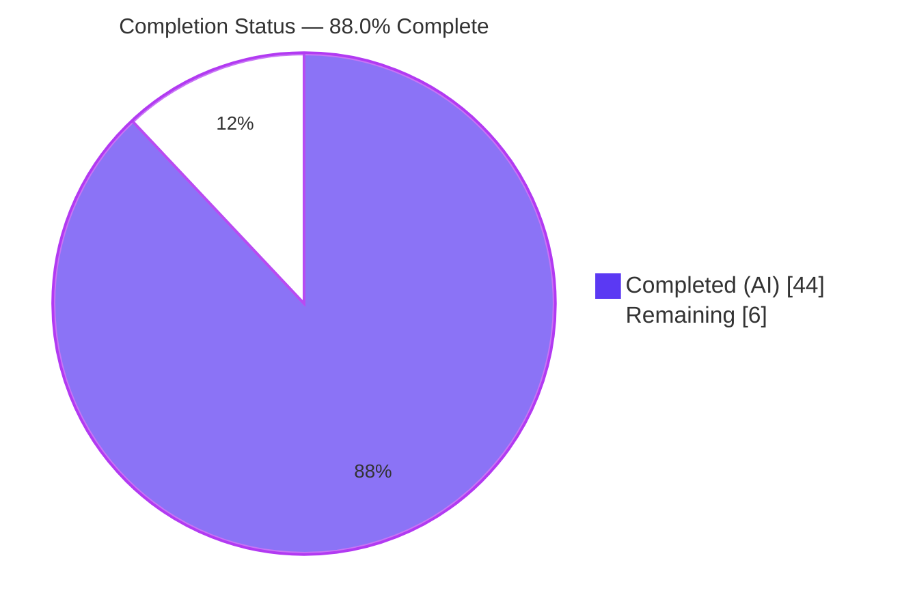
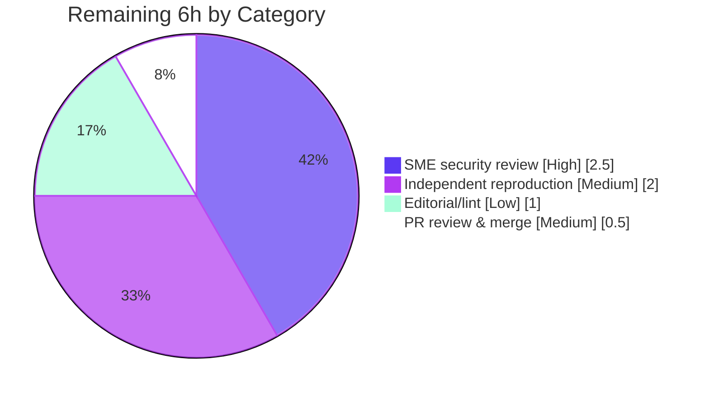

# Blitzy Project Guide — maddy SMTP DATA-Boundary Runtime Analysis

> **Document type:** Investigative, runtime-observed Q&A (read-only analysis)
> **Repository:** `github.com/foxcpp/maddy` · **Base commit:** `26452dd8dd787dc455278b0fdd296f4a5432c768` · **Branch:** `blitzy-7775fead-3283-43ab-af40-de01d09b53ee`
> **Rule set:** `SWE-AtlasQnA-Repo`

---

## 1. Executive Summary

### 1.1 Project Overview

This project delivers a single, evidence-based analysis document that answers — with verbatim runtime output — exactly how the **maddy** mail server detects the end of the SMTP **DATA** phase (the instant it stops reading the message body and returns to command parsing) under conformant and adversarial line-ending framing. It is a **read-only investigative task**: the target audience is mail-server operators and security engineers, and the business impact is a grounded, reproducible characterization of an **SMTP-smuggling-class** behavior. The technical scope spans maddy's SMTP endpoint, the `github.com/emersion/go-smtp` protocol dependency, and Go's standard-library `net/textproto` dot reader. Exactly one file is created in the repository; every other file is consumed read-only as a citation anchor.

### 1.2 Completion Status

The project is **88.0% complete** based on AAP-scoped hours: all 19 AAP-specified requirements are delivered and validated; the remaining 6 hours are standard path-to-production **human review** (no code fixes outstanding).



| Metric | Value |
|---|---|
| **Total Hours** | 50 |
| **Completed Hours (AI + Manual)** | 44 (44 AI + 0 Manual) |
| **Remaining Hours** | 6 |
| **Percent Complete** | **88.0%** |

### 1.3 Key Accomplishments

- ✅ Built and ran maddy at the exact target commit with `-debug`, and drove it with a **raw, byte-exact TCP client** (never a normalizing SMTP library).
- ✅ Answered **all six sub-questions (O1–O6)** across three evidence surfaces: the SMTP response, the `io_debug` protocol transcript, and the delivered `<id>.body` bytes.
- ✅ Proved the **central finding** end-to-end: maddy delegates the end-of-DATA decision to Go's `net/textproto` dot reader, which accepts a bare `<LF>.<LF>` boundary identically to `<CR><LF>.<CR><LF>`.
- ✅ Reproduced the **SMTP-smuggling** condition: one 168-byte pipelined blast → 2 delivered messages on one connection, the second spoofed (`From=attacker@evil.test`).
- ✅ Grounded every claim with an exact `file:line` citation (~50 total, independently re-verified); fixed one imprecise citation.
- ✅ Honored the **read-only constraint** (single-file diff, zero source edits) and cleaned up all temporary artifacts.

### 1.4 Critical Unresolved Issues

There are **no blocking or release-critical issues**. The autonomous work is complete and validated; the items below are recommended (non-blocking) reviews.

| Issue | Impact | Owner | ETA |
|---|---|---|---|
| SME sign-off on security claims (SMTP-smuggling classification, CVE-2023-51764 family attribution, RFC 5321 §4.5.2 interpretation) | Non-blocking — needed before treating the document as an *authoritative* security reference | Security / SMTP SME | 2.5h |
| No blocking compilation, test, or runtime failures | None — all validation gates passed | — | — |

### 1.5 Access Issues

**No access issues identified.** The autonomous agent had full repository access, built and ran maddy, resolved all pinned dependencies from the module cache, and executed the full test suite without permission or credential blockers.

| System/Resource | Type of Access | Issue Description | Resolution Status | Owner |
|---|---|---|---|---|
| Repository (git) | Read/Write | None | ✅ No issue | — |
| Go module cache (go-smtp, go-sqlite3, etc.) | Read | None — all modules verified | ✅ No issue | — |
| Build toolchain (Go 1.13.4, GCC/CGO) | Execute | None | ✅ No issue | — |

### 1.6 Recommended Next Steps

1. **[High]** Conduct SME technical/security review of the analysis — validate the smuggling classification, CVE-2023-51764 family attribution, and RFC 5321 §4.5.2 interpretation (2.5h).
2. **[Medium]** Independently reproduce the runtime observations by recreating the inline probe/proxy scripts and re-running representative payloads at commit `26452dd` (2h).
3. **[Medium]** Review the single-file diff and merge to the target branch (0.5h).
4. **[Low]** Perform an editorial / markdown-lint pass, confirming the two intentional verbatim trailing-whitespace lines are acceptable under team policy (1h).

---

## 2. Project Hours Breakdown

### 2.1 Completed Work Detail

All completed hours are autonomous (AI) work; Manual = 0. Each component traces to an AAP requirement.

| Component | Hours | Description |
|---|---|---|
| Environment & build | 3 | Go 1.13.4 toolchain + CGO C compiler; `go build ./cmd/maddy` (daemon binary 21,846,744 B); `go mod verify` |
| Minimal run configuration | 3 | Out-of-repo `maddy.conf` with `io_debug`/`debug`, `read_timeout 5s`, and an inspectable `queue` → `smtp_downstream` capture delivery target |
| Raw TCP probe client | 4 | Byte-exact framing-matrix client (`probe.py`) + pipelined smuggling client (`probe_smuggle.py`) |
| Front-proxy tooling | 3 | External throwaway proxy (`proxy.py`) with "clean" (rewrite bare CR/LF→CRLF) and "block" (reject bare newline) modes |
| O1 — boundary moment | 2 | `354` prompt, post-DATA status, transcript, 3 surfaces, 18-byte delivered body |
| O2 — identical-except-for-framing matrix | 5 | 7 variants × 3 surfaces (byte-identical `crlf`/`lflf`/`lfcrlf`/`purelf`; `dotstuff`; `crcr`; over-length line; 32 MiB size limit) with SHA-256 and byte counts |
| O3 — pipelined SMTP smuggling | 3 | 168-byte blast → 2 delivered messages on one connection; spoofed `attacker@evil.test` |
| O4 — back-to-back stability + failure mode | 3 | 4 distinct `msg_id`s with timing; bare-`CR` non-terminating hang (10.00s → 451 → idle 221) |
| O5 — front-proxy contrast | 2 | DIRECT=2 / CLEAN=2 / BLOCK=0; `521 5.5.2 bare newline rejected` + maddy `unexpected EOF` → 554 |
| O6 — negative space | 2 | 0 files linger after failure; 0 bare-LF rejections; `lflf` structured markers ≡ `crlf` markers |
| Source analysis & citations | 5 | ~50 `file:line` citations across maddy, go-smtp, and `net/textproto`, re-verified against source |
| Web research | 2 | SMTP-smuggling class, CVE-2023-51764 family, RFC 5321 §4.5.2 framing of a "stricter peer" |
| Document authoring | 5 | 680-line document: evidence, reasoning, summary, coverage-pass checklist |
| Autonomous QA | 2 | Coverage pass, citation re-verification, one discrepancy fix, cleanup, 5 commits |
| **Total** | **44** | |

### 2.2 Remaining Work Detail

All remaining work is human path-to-production review; no incomplete AAP-specified work remains.

| Category | Hours | Priority |
|---|---|---|
| SME technical/security review (smuggling classification, CVE / RFC claims, O1–O6 soundness) | 2.5 | High |
| Independent runtime reproduction from inline scripts (rebuild + re-run representative payloads) | 2.0 | Medium |
| Editorial & markdown-lint review (incl. intentional verbatim trailing-whitespace lines) | 1.0 | Low |
| PR review & merge to target branch | 0.5 | Medium |
| **Total** | **6.0** | |

### 2.3 Hours Reconciliation

| Check | Value | Status |
|---|---|---|
| Section 2.1 completed sum | 44h | ✅ = Section 1.2 Completed |
| Section 2.2 remaining sum | 6h | ✅ = Section 1.2 Remaining = §7 pie Remaining |
| Section 2.1 + Section 2.2 | 50h | ✅ = Section 1.2 Total |
| Completion (44 / 50 × 100) | 88.0% | ✅ = §1.2 = §7 = §8 |

---

## 3. Test Results

All tests below originate from Blitzy's autonomous validation logs for this project. Because this is a read-only documentation task, the repository's own Go regression suite was executed to (a) confirm the investigation left the code behaving correctly and (b) ground the runtime behavioral observations. The Go tooling reports at **package** granularity (individual per-test-case counts were not enumerated in the autonomous logs).

| Test Category | Framework | Total | Passed | Failed | Coverage % | Notes |
|---|---|---|---|---|---|---|
| Go package tests (whole module) | Go `testing` (`go test ./...`) | 20 pkgs | 20 | 0 | — | All packages report `ok`; zero failures/skips |
| Race + coverage (key packages) | Go `testing` (`go test -race -cover`) | 4 pkgs | 4 | 0 | 74.5–80.4 | No data races detected |
| — `internal/endpoint/smtp` | Go `testing` `-cover` | 1 pkg | 1 | 0 | 79.4 | Re-verified this session (`1.523s`, `79.4%`) |
| — `internal/target/queue` | Go `testing` `-race -cover` | 1 pkg | 1 | 0 | 74.7 | Delivery target that persists `<id>.body` |
| — `internal/target/smtp_downstream` | Go `testing` `-race -cover` | 1 pkg | 1 | 0 | 80.4 | Downstream capture path |
| — `internal/msgpipeline` | Go `testing` `-race -cover` | 1 pkg | 1 | 0 | 74.5 | Delivery fan-out invoked by `Session.Data` |

**Pass rate:** 20/20 packages (100%). **Failures:** 0. **Dependency integrity:** `go mod verify` → *all modules verified*; `go.mod`/`go.sum` unchanged.

---

## 4. Runtime Validation & UI Verification

Runtime validation exercised the daemon under `-debug` and reproduced every sub-question. **UI verification is not applicable** — maddy is a headless mail server / CLI daemon with no graphical interface.

**Daemon & protocol health**
- ✅ **Operational** — Daemon builds (binary 21,846,744 B) and starts; emits the documented 5-line `-debug` startup output before accepting connections.
- ✅ **Operational** — SMTP command/response exchange (EHLO → MAIL → RCPT → DATA → `354` prompt → `250 2.0.0 OK: queued`), advertising `250 SIZE 33554432`.
- ✅ **Operational** — Delivery pipeline persists `<id>.body`/`<id>.header`/`<id>.meta` to the queue target for byte inspection.

**Sub-question reproductions (all runtime-observed)**
- ✅ **O1 — boundary moment:** `354 2.0.0 Go ahead. End your data with <CR><LF>.<CR><LF>`, body consumed, `250 2.0.0 OK: queued`, `[debug] smtp: reset`; 18-byte body across 3 surfaces.
- ✅ **O2 — framing matrix:** `crlf`/`lflf`/`lfcrlf`/`purelf` byte-identical (18 B, SHA-256 `5416a9e2…`); `dotstuff` 32 B (SHA-256 `827b8731…`); `crcr` no body (451 / i-o-timeout); over-length line rejected (451 small / 554+500 large); over-size `552 5.3.4`.
- ✅ **O3 — pipelined smuggling:** one 168-byte blast → 2 delivered messages on one `src_ip`; second forged `From=attacker@evil.test` (`msg_id=2abdd736`).
- ✅ **O4 — back-to-back + failure mode:** 4 distinct `msg_id`s, 4 correct 20-byte bodies, tight monotonic timing; bare-`CR` hang measured `elapsed=10.00s` → `451` → `221 2.4.2 Idle timeout, bye bye`.
- ✅ **O5 — front proxy:** DIRECT=2, CLEAN=2, BLOCK=0; block mode → `521 5.5.2 bare newline rejected (proxy block mode)` + maddy `DATA error {unexpected EOF}` → 554.
- ✅ **O6 — negative space:** 0 files linger after a failed `crcr`; 0 bare-LF rejection signals in any accept log; `lflf` structured markers identical to `crlf` (incoming=1 / accepted=1 / queued=1 / reset=1).
- ⚠️ **Partial (by design):** per-run-random values (`msg_id`, ephemeral source ports, wall-clock timings) are not byte-reproducible across runs; the document explicitly labels deterministic vs per-run values.
- **N/A** UI verification — no graphical interface exists for this project.

---

## 5. Compliance & Quality Review

AAP deliverables and rule-set directives mapped to Blitzy quality/compliance benchmarks.

| AAP / Rule Requirement | Benchmark | Status | Progress |
|---|---|---|---|
| Single-file deliverable at `blitzy/documentation/maddy_26452dd8dd78.md` | Correct location & name | ✅ Pass | 100% |
| Read-only scope — no existing file modified | Full-branch diff = 1 file, +680/−0, 0 source edits | ✅ Pass | 100% |
| Run-before-write methodology | Built + ran maddy; captured real output before writing | ✅ Pass | 100% |
| Verbatim observed output | Responses, transcripts, byte counts, SHA-256, timings quoted | ✅ Pass | 100% |
| Exact `file:line` citations | ~50 citations re-verified; 1 imprecision fixed (`reader.go:367`→`367/368/369`) | ✅ Pass | 100% |
| Reasoning/rationale per answer | Each O-section has a mechanism-tied "Reasoning" block | ✅ Pass | 100% |
| Total coverage of all sub-questions | O1–O6 + coverage-pass checklist present | ✅ Pass | 100% |
| Web-research framing (smuggling / CVE / RFC) | Summary ties findings to CVE-2023-51764 family, RFC 5321 §4.5.2 | ✅ Pass | 100% |
| Dependency integrity | `go mod verify` OK; `go.mod`/`go.sum` unchanged | ✅ Pass | 100% |
| Cleanup of temporary artifacts | All `/tmp` scripts/config/runtime dirs removed; `git status` clean | ✅ Pass | 100% |
| Compilation & tests | `go build ./...` exit 0; `go test ./...` 20/20 pkgs OK | ✅ Pass | 100% |
| Independent SME sign-off on security claims | Human authoritative review | ⏳ Pending | 0% (human) |

**Fixes applied during autonomous validation:** setup startup-output claim corrected; §1.3 structured-marker grep count corrected (3→2); `net/textproto` `stateCR` citation sharpened. **Outstanding:** SME sign-off (non-blocking).

---

## 6. Risk Assessment

| Risk | Category | Severity | Probability | Mitigation | Status |
|---|---|---|---|---|---|
| Per-run-random values (`msg_id`, ports, timings) do not reproduce byte-identically | Technical | Low | High | Document explicitly separates deterministic (byte counts, SHA-256, status codes, literals) from per-run values | ✅ Mitigated |
| Version drift — conclusions specific to commit `26452dd`, pinned go-smtp, Go 1.13.4 `net/textproto` | Technical | Low | Low | All conclusions explicitly scoped to this commit and pinned dependency versions | ✅ Mitigated |
| Over-length-line surfaced error is not stable (small → 451/i-o-timeout; large → `ErrTooLongLine`/554) | Technical | Low | N/A | Documented as an observed nuance (value-receiver `lineLimitReader`), not a defect | ✅ Documented |
| Authoritative security claims (bare-LF acceptance = smuggling; CVE / RFC attribution) require validation | Security | Medium | Low | Strong runtime evidence + correct RFC 5321 §4.5.2 citation; **human SME review recommended before treating as authoritative** | ⏳ Open |
| Reader may expect a remediation/fix | Security | Low | Medium | Document repeatedly states remediation is out of scope (analysis only) | ✅ Accepted |
| Temporary observation scripts deleted per cleanup rule | Operational | Low | Low | All probe/proxy scripts are embedded **verbatim inline** in the document, so reproduction is fully recoverable | ✅ Mitigated |
| Evidence depends on a specific run environment (`:2525`, `:19999`, `read_timeout 5s`) | Operational | Low | Low | Fully reproducible setup documented in §1 of the deliverable | ✅ Mitigated |
| Standalone document — no product/runtime integration | Integration | Low | Low | Isolated artifact under `blitzy/documentation/`; no code paths altered | ✅ N/A |
| Citation line numbers require identical go-smtp / `net/textproto` versions | Integration | Low | Low | Exact versions and module-cache paths documented in §1.1 | ✅ Mitigated |

**Overall risk posture:** Low. The single Medium risk (accuracy of authoritative security claims) is the driver of the recommended human SME review and does not block delivery.

---

## 7. Visual Project Status

### Project Hours Breakdown


- **Completed Work:** 44h (Dark Blue `#5B39F3`) — matches Section 1.2 Completed and Section 2.1 total.
- **Remaining Work:** 6h (White `#FFFFFF`) — matches Section 1.2 Remaining and Section 2.2 total.

### Remaining Work by Category (hours)



**Integrity check:** Remaining categories sum to 6h, equal to the §7 "Remaining Work" slice, the §1.2 Remaining Hours, and the Section 2.2 total.

---

## 8. Summary & Recommendations

**Achievements.** The project delivers a thorough, reproducible, runtime-observed analysis of maddy's end-of-DATA behavior. Every one of the six sub-questions (O1–O6) is answered with verbatim evidence across three surfaces, and the central finding — that maddy delegates the end-of-DATA decision to Go's `net/textproto` dot reader and consequently accepts a bare `<LF>.<LF>` boundary identically to `<CR><LF>.<CR><LF>` — is proven end-to-end, including a working SMTP-smuggling reproduction. The read-only constraint is strictly honored: the branch diff is a single new file with zero source edits.

**Remaining gaps.** The remaining 6 hours are **path-to-production human review**, not incomplete engineering: an SME sign-off on the security claims, an independent runtime reproduction, an editorial pass, and PR merge. No compilation, test, or runtime failures remain.

**Critical path to production.** SME security review (2.5h) → optional independent reproduction (2h) → editorial pass (1h) → PR review & merge (0.5h).

**Success metrics.** 19/19 AAP-specified requirements complete; 20/20 test packages passing; ~50 citations verified; daemon binary reproduces to the byte; repository read-only-clean.

**Production readiness assessment.** The project is **88.0% complete** and ready for human review. As an analytical/documentation deliverable it carries low delivery risk; the recommended SME review exists to certify the security claims as authoritative rather than to remediate any defect. Per Blitzy honesty standards, completion is capped below 100% pending that human review.

| Metric | Value |
|---|---|
| AAP-specified requirements complete | 19 / 19 |
| Path-to-production items remaining | 4 (all human review) |
| Completion | 88.0% |
| Overall risk | Low (1 Medium: security-claim accuracy) |

---

## 9. Development Guide

> All commands below were executed and verified in the current environment. Run each fresh shell setup line first.

### 9.1 System Prerequisites

- **OS:** Linux x86-64 (verified on Ubuntu container).
- **Go:** 1.13.4 (`go version` → `go version go1.13.4 linux/amd64`). Pinned by `get.sh:10` (`GOVERSION=1.13.4`) and `go.mod:3` (`go 1.13`).
- **C compiler (CGO):** GCC (verified `gcc (Ubuntu 15.2.0-4ubuntu4) 15.2.0`) — required by the `github.com/mattn/go-sqlite3 v1.11.0` driver.
- **git** and roughly **1 GB** free disk for the module cache and build artifacts.

### 9.2 Environment Setup

```bash
# Load the Go toolchain into PATH (fresh shell each time)
source /etc/profile.d/go.sh

# Confirm the environment
go version                       # -> go version go1.13.4 linux/amd64
gcc --version | head -1          # -> gcc (Ubuntu 15.2.0-4ubuntu4) 15.2.0
go env CGO_ENABLED CC GOPATH GOROOT
# -> 1
#    gcc
#    /root/go
#    /usr/local/go
```

### 9.3 Dependency Installation & Verification

Dependencies are resolved from the module cache on first build; nothing to add or upgrade.

```bash
cd /tmp/blitzy/maddy/blitzy-7775fead-3283-43ab-af40-de01d09b53ee_6779c3
go mod verify                    # -> all modules verified
```

### 9.4 Build

```bash
# Build the whole module (verifies everything compiles)
go build ./...                   # exit 0

# Build the daemon binary
go build -o /tmp/maddy_bin ./cmd/maddy
stat -c%s /tmp/maddy_bin         # -> 21846744  (reproduces the documented size to the byte)
```

> A benign upstream `go-sqlite3` CGO warning (`function may return address of local variable [-Wreturn-local-addr]`) is emitted during the build. It originates from an out-of-scope dependency and does not affect the build (exit 0).

### 9.5 Run maddy with debug (for DATA-boundary observation)

Write a minimal **out-of-repository** config (do **not** place it in the repo):

```bash
mkdir -p /tmp/maddy_run/state /tmp/maddy_run/runtime /tmp/maddy_run/queue_dbg
cat > /tmp/maddy_run/maddy.conf <<'CONF'
state /tmp/maddy_run/state
runtime /tmp/maddy_run/runtime

hostname test.local
tls off

smtp tcp://127.0.0.1:2525 {
    io_debug
    debug
    read_timeout 5s
    deliver_to queue {
        location /tmp/maddy_run/queue_dbg
        hostname test.local
        max_tries 8
        target smtp_downstream {
            targets tcp://127.0.0.1:19999
            require_tls no
            attempt_starttls no
        }
    }
}
CONF

# Start the daemon in the background, capturing the debug log
/tmp/maddy_bin -debug -config /tmp/maddy_run/maddy.conf > /tmp/maddy_run/maddy.log 2>&1 &
maddy_pid=$!
sleep 1
```

### 9.6 Verification

```bash
# Daemon flags (confirms -debug / -config exist)
/tmp/maddy_bin -help 2>&1 | head -8

# Confirm the listener is up
timeout 2 bash -c 'cat < /dev/null > /dev/tcp/127.0.0.1/2525' && echo "listener up on :2525"

# Representative regression test with coverage (reproduces 79.4%)
go test ./internal/endpoint/smtp/ -cover -count=1
# -> ok  github.com/foxcpp/maddy/internal/endpoint/smtp  1.5xx s  coverage: 79.4% of statements
```

### 9.7 Example Usage — raw, byte-exact SMTP probe

> **Important:** use a **raw socket** client. maddy's own SMTP client (and most libraries) normalize line endings and would mask the very framing differences under study.

```bash
# Conformant end-of-DATA (CRLF.CRLF) via a raw Python socket
python3 - <<'PY'
import socket, time
s = socket.create_connection(("127.0.0.1", 2525)); s.settimeout(5)
def rd(): time.sleep(0.1); print(s.recv(4096).decode(errors="replace").strip())
rd()                                   # 220 greeting
for cmd in [b"EHLO probe.local\r\n",
            b"MAIL FROM:<sender@test.local>\r\n",
            b"RCPT TO:<user@test.local>\r\n",
            b"DATA\r\n"]:
    s.sendall(cmd); rd()
s.sendall(b"Subject: hi\r\n\r\nThis is the body.\r\n.\r\n"); rd()   # -> 250 2.0.0 OK: queued
s.sendall(b"QUIT\r\n"); s.close()
PY

# Inspect the delivered body bytes (the source of truth)
for b in /tmp/maddy_run/queue_dbg/*.body; do echo "== $b =="; od -c "$b"; done
```

### 9.8 Teardown

```bash
kill "$maddy_pid" 2>/dev/null       # stop exactly the daemon we started
rm -rf /tmp/maddy_run /tmp/maddy_bin # remove all out-of-repo artifacts
```

### 9.9 Troubleshooting

- **`exec: "gcc": executable file not found`** — CGO needs a C compiler. Install GCC and ensure `CGO_ENABLED=1`.
- **`bool argument should be 'yes' or 'no'`** — in the `smtp_downstream` block, use `require_tls no` / `attempt_starttls no` (not `off`), or maddy refuses to start.
- **A `crcr` (bare `<CR>.<CR>`) probe appears to hang** — expected: a lone `CR` is not a boundary, so the reader blocks until `read_timeout` fires (`i/o timeout` → `451`). Keep `read_timeout` short for experiments.
- **`bind: address already in use`** — a previous maddy instance is still listening on `:2525`/`:19999`. Stop it (`kill <pid>`) before re-running.
- **No transcript in the log** — the protocol transcript appears only when **both** `io_debug` (maddy-side tee) is set in the config **and** `debug`/`-debug` makes the debug writer non-discarding.

---

## 10. Appendices

### A. Command Reference

| Command | Purpose |
|---|---|
| `source /etc/profile.d/go.sh` | Load Go 1.13.4 toolchain into PATH |
| `go mod verify` | Verify module cache integrity (→ `all modules verified`) |
| `go build ./...` | Compile the whole module |
| `go build -o /tmp/maddy_bin ./cmd/maddy` | Build the daemon binary (21,846,744 B) |
| `go test ./...` | Run the full regression suite (20 pkgs) |
| `go test ./... -race -cover` | CI-exact race + coverage run |
| `/tmp/maddy_bin -debug -config <path>` | Run the daemon with debug logging |
| `git diff --stat 26452dd..HEAD` | Confirm single-file deliverable scope |

### B. Port Reference

| Port | Role | Source |
|---|---|---|
| 2525 | maddy inbound SMTP listener (investigation) | Minimal `maddy.conf` (`smtp tcp://127.0.0.1:2525`) |
| 19999 | Local `smtp_downstream` capture server (forces a `451` so bytes persist) | Minimal `maddy.conf` (`targets tcp://127.0.0.1:19999`) |
| 2526 | Front proxy listen port (O5) | O5 proxy invocation (client → 2526 → maddy 2525) |
| 25 | Default production SMTP port | `maddy.conf:53` (reference only) |

### C. Key File Locations

| Path | Role |
|---|---|
| `blitzy/documentation/maddy_26452dd8dd78.md` | **The sole deliverable** (680 lines) |
| `internal/endpoint/smtp/smtp.go` | `Session.Data` (L312), `BufferInMemory` (L298), `max_message_size` (L561), logs `accepted`/`DATA error` (L334/L317) |
| `internal/buffer/memory.go` | `BufferInMemory` (L27) — in-memory body buffer |
| `internal/target/queue/queue.go` | `storeNewMessage` writes `<id>.body` (`os.Create`, L713) |
| `internal/target/smtp_downstream/smtp_downstream.go` | Downstream relay/capture target |
| go-smtp `data.go` | `r: c.text.DotReader()` (L53) — end-of-DATA delegated |
| go-smtp `conn.go` | `354` prompt (L510), debug tee (L62–71), discard-drain + reset (L521/L512) |
| go-smtp `server.go` | `MaxLineLength: 2000` (L76) |
| go-smtp `lengthlimit_reader.go` | `ErrTooLongLine` literal (L8) |
| `/usr/local/go/src/net/textproto/reader.go` | `DotReader` (L299) — the actual end-of-DATA state machine |

### D. Technology Versions

| Component | Version | Source |
|---|---|---|
| Go toolchain | 1.13.4 | `get.sh:10`, `go.mod:3` |
| `github.com/emersion/go-smtp` | v0.12.1-0.20191206174923-1f576e0ec85c | `go.mod:19` |
| `github.com/mattn/go-sqlite3` | v1.11.0 | `go.mod:26` |
| `github.com/emersion/go-imap` | v1.0.1 | `go.mod` |
| GCC (CGO) | 15.2.0 | System |
| `net/textproto` | Bundled with Go 1.13.4 | GOROOT |

### E. Environment Variable Reference

| Variable | Value | Purpose |
|---|---|---|
| `GOROOT` | `/usr/local/go` | Go installation root |
| `GOPATH` | `/root/go` | Module cache & workspace (`/root/go/pkg/mod`) |
| `GOCACHE` | `/root/.cache/go-build` | Build cache |
| `CGO_ENABLED` | `1` | Required for the SQLite driver |
| `CC` | `gcc` | C compiler used by CGO |

### F. Developer Tools Guide

| Tool | Use |
|---|---|
| `go` (1.13.4) | Build, test, module verification |
| `gcc` | CGO compilation of the SQLite driver |
| `git` | Diff/scope verification (`git diff --stat 26452dd..HEAD`) |
| Raw socket client (`python3` / `nc`) | Byte-exact SMTP framing probes — **do not** substitute a normalizing SMTP library |
| `od -c` / `sha256sum` / `wc -c` | Inspect delivered `<id>.body` bytes and compute deterministic evidence |

### G. Glossary

| Term | Definition |
|---|---|
| **End-of-DATA** | The SMTP sequence that terminates the message body; conformant form is `<CR><LF>.<CR><LF>` (RFC 5321 §4.5.2). |
| **Dot-stuffing** | Client-side escaping of a leading `.` as `..`; the receiver un-stuffs it back to a single `.`. |
| **SMTP smuggling** | An end-of-DATA parsing differential (CVE-2023-51764 family) where a lenient receiver accepts a non-standard boundary (e.g. bare `<LF>.<LF>`), letting an attacker inject a spoofed message. |
| **CRLF / LF / CR** | Carriage-return+line-feed (`\r\n`) / line-feed (`\n`) / carriage-return (`\r`). |
| **`net/textproto` dot reader** | Go standard-library state machine that maddy (via go-smtp) uses to detect the DATA boundary and un-stuff dots. |
| **`io_debug` / `debug`** | maddy config directives; together they surface the go-smtp protocol transcript into the debug log. |
| **AAP** | Agent Action Plan — the primary directive defining project scope. |
