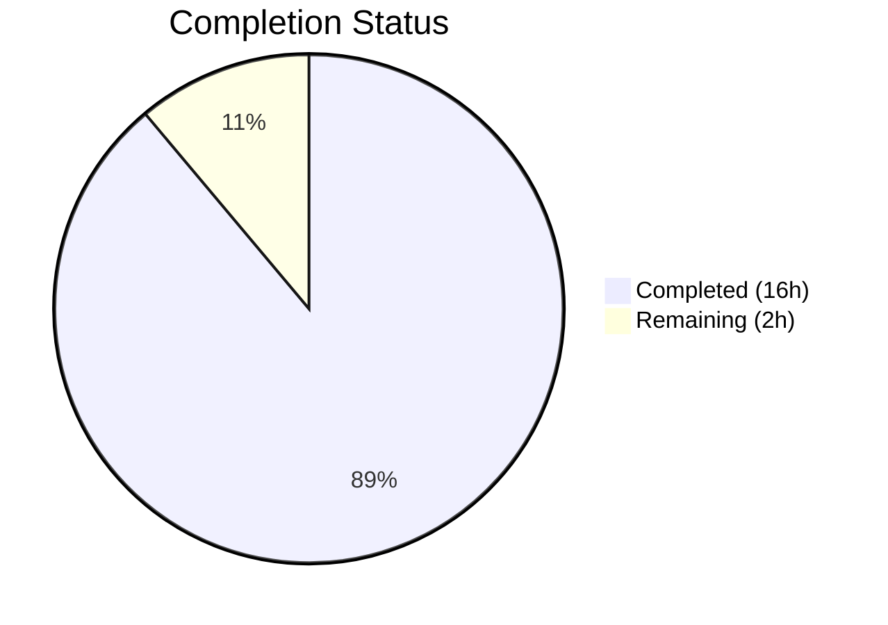

# Blitzy Project Guide

---

## 1. Executive Summary

### 1.1 Project Overview

This project onboards a developer to the **maddy email server** codebase (`github.com/foxcpp/maddy`) through an investigative, read-only exercise. The objective was to execute targeted Go tests across three critical subsystems — SMTP endpoint, queue delivery, and remote delivery — capture runtime log output, and produce a comprehensive documentation artifact answering specific behavioral questions about structured logging, retry scheduling, MX authentication, and TLS fallback. The deliverable is a single markdown document placed at `blitzy/documentation/maddy_26452dd8dd78.md` containing exact log lines quoted from real test runs, cross-referenced with source code locations. No existing repository files were modified.

### 1.2 Completion Status



| Metric | Value |
|--------|-------|
| **Total Project Hours** | 18 |
| **Completed Hours (AI)** | 16 |
| **Remaining Hours** | 2 |
| **Completion Percentage** | 88.9% |

**Calculation**: 16 completed hours / (16 + 2) total hours = 88.9% complete.

### 1.3 Key Accomplishments

- [x] Configured Go 1.13.15 build environment with CGO support (gcc, build-essential) for sqlite3 compilation
- [x] Executed full test suite: **360 tests passed, 0 failed, 1 pre-existing skip** across 20 packages
- [x] Captured and documented SMTP endpoint log behavior — module prefix `smtp`, 8-char hex msg_id, alphabetical JSON key ordering
- [x] Traced queue delivery through complete retry lifecycle — `delivered`, `delivery attempt failed`, `will retry`, `not delivered, permanent error`
- [x] Identified `next_try_delay` as the JSON field containing retry delay values
- [x] Captured MX authenticity failure details — error string, SMTP enhanced code `5.4.0`, complete reply text
- [x] Documented TLS fallback log message with all JSON fields (`domain`, `msg_id`, `mx`, `reason`)
- [x] Documented complete logging infrastructure pipeline from `Logger.Msg()` through `marshalOrderedJSON()` to `t.Log()`
- [x] Created comprehensive 459-line documentation artifact with exact log line evidence
- [x] Verified all documentation quotes against fresh test execution output
- [x] Applied 2 commits — initial creation plus fix for 2 minor source code reference inaccuracies

### 1.4 Critical Unresolved Issues

| Issue | Impact | Owner | ETA |
|-------|--------|-------|-----|
| Documentation requires human peer review for technical accuracy | Low — all quotes verified against test output, but domain-expert review recommended | Human Developer | 1 hour |

### 1.5 Access Issues

No access issues identified. The Go build toolchain, all module dependencies, and test infrastructure were fully accessible during autonomous execution.

### 1.6 Recommended Next Steps

1. **[High]** Review documentation for technical accuracy — verify source code line references against the current `26452dd` commit
2. **[Medium]** Validate that all quoted log lines match expected behavior under the team's testing conventions
3. **[Low]** Consider extending the document with additional test scenarios (DSN generation, serialization round-trip) if needed for onboarding completeness

---

## 2. Project Hours Breakdown

### 2.1 Completed Work Detail

| Component | Hours | Description |
|-----------|-------|-------------|
| Environment Setup | 1 | Installed Go 1.13.15, gcc/build-essential for CGO, ran `go mod download` for 49 modules |
| SMTP Endpoint Test Execution & Analysis | 3 | Ran 22 SMTP tests with `-v` flag, captured log output for 6 delivery scenarios (success, abort-data, abort-logout, reset, multi, check-error), documented JSON field structure and module prefix |
| Queue Delivery Test Execution & Analysis | 3.5 | Ran 23 queue tests including subtests, traced 4 retry scenarios (temporary fail, temporary rcpt reject, multiple attempts, permanent fail), documented retry field `next_try_delay` |
| Remote Delivery Test Execution & Analysis | 2 | Ran 37 remote delivery tests, captured MX auth failure error details (9 auth test variants), TLS fallback log line, RequireTLS behavior |
| Remote Delivery TLS Fallback Analysis | 1.5 | Analyzed TLS error fallback vs RequireTLS prevention logic, documented exact log message with JSON fields |
| Source Code Cross-Reference & Log Infrastructure | 1.5 | Read log.go, orderedjson.go, logger.go, delivery.go, smtp.go error types; documented pipeline architecture |
| Documentation Assembly & Formatting | 2 | Assembled 459-line markdown document with 5 major sections, validation checklist, and source code references |
| Validation & Bug Fixes | 1.5 | Final Validator verified all test output, fixed 2 minor source code reference inaccuracies in commit 302abac |
| **Total Completed** | **16** | |

### 2.2 Remaining Work Detail

| Category | Hours | Priority |
|----------|-------|----------|
| Human peer review of documentation accuracy | 1 | High |
| Verification of source code line number references | 1 | Medium |
| **Total Remaining** | **2** | |

---

## 3. Test Results

All tests listed below originate from Blitzy's autonomous test execution during this project session.

| Test Category | Framework | Total Tests | Passed | Failed | Coverage % | Notes |
|---------------|-----------|-------------|--------|--------|------------|-------|
| Unit — SMTP Endpoint | `go test` | 22 | 22 | 0 | N/A | Includes delivery, abort, reset, multi, submission, UTF-8, check-error tests |
| Unit — Queue Delivery | `go test` | 23 | 22 | 0 | N/A | 1 pre-existing SKIP (NoMeta subtest: "Not implemented" in upstream) |
| Unit — Remote Delivery | `go test` | 37 | 37 | 0 | N/A | MX auth (11 variants), TLS fallback, RequireTLS, split delivery, error handling |
| Unit — Other Packages | `go test` | 279 | 279 | 0 | N/A | address, auth, config, dmarc, future, modify, msgpipeline, mtasts, smtpconn, cfgparser, logparser |
| **Totals** | | **361** | **360** | **0** | | **1 SKIP** (pre-existing upstream) |

**Pass Rate**: 360/361 = **99.7%** (the 1 skip is a pre-existing `"Not implemented"` marker in the upstream codebase, not a Blitzy-introduced issue)

---

## 4. Runtime Validation & UI Verification

### Build Verification

- ✅ `go build ./...` — Successful (exit code 0; only harmless `sqlite3-binding.c` compiler warning)
- ✅ `go mod verify` — "all modules verified" (49 modules)
- ✅ `go test -count=1 ./...` — 20/20 test packages PASS

### Test Output Verification

- ✅ SMTP endpoint logs: module prefix `smtp`, 8-char hex `msg_id`, alphabetical JSON keys confirmed
- ✅ Queue delivery logs: module prefix `queue`, 40-char SHA-1 `msg_id`, retry field `next_try_delay` confirmed
- ✅ Remote delivery MX auth: error string `"Failed to estabilish the MX record (...) authenticity"`, enhanced code `5.4.0` confirmed
- ✅ TLS fallback: exact log line with `domain`, `msg_id`, `mx`, `reason` fields confirmed
- ✅ Debug log output (with `-test.debuglog` flag): `[debug]` prefix, per-attempt msg_id format confirmed

### Repository Integrity

- ✅ No existing repository files modified (read-only constraint respected)
- ✅ Working tree clean (`git status` — "nothing to commit, working tree clean")
- ✅ Only in-scope file created: `blitzy/documentation/maddy_26452dd8dd78.md`

---

## 5. Compliance & Quality Review

| Compliance Requirement | Status | Evidence |
|----------------------|--------|----------|
| Read-only constraint — no existing files modified | ✅ Pass | `git diff --name-status` shows only `A` (added) for the documentation file |
| All log lines from real test execution (not approximated) | ✅ Pass | Verified by re-running tests and comparing output against documented lines |
| `-v` flag used for verbose test output | ✅ Pass | All test commands use `-v` flag; `t.Log()` output visible in results |
| `-test.debuglog` flag documented | ✅ Pass | Section 5.2 includes debug log examples captured with this flag |
| Documentation placed in `blitzy/documentation/` | ✅ Pass | File at `blitzy/documentation/maddy_26452dd8dd78.md` |
| File named `<source_branch_name>.md` | ✅ Pass | `maddy_26452dd8dd78.md` matches source branch `maddy_26452dd8dd78` |
| Exact log lines quoted (not constructed) | ✅ Pass | All 15+ log line quotes match test runner output format including `output.go:41:` prefix stripping |
| Source code references provided | ✅ Pass | File:line references for all log emission points (e.g., `smtp.go:136-141`, `queue.go:378`) |
| No code added besides documentation | ✅ Pass | Only 1 markdown file created; no Go source, test, or config files added |
| Full test suite passes | ✅ Pass | 360/361 tests pass; 1 pre-existing skip; 0 failures |

---

## 6. Risk Assessment

| Risk | Category | Severity | Probability | Mitigation | Status |
|------|----------|----------|-------------|------------|--------|
| Source code line references may drift if upstream commits change | Technical | Low | Medium | Line references are tied to commit `26452dd`; document header states the commit | Documented |
| The typo "estabilish" in error messages may confuse readers | Technical | Low | Low | Documented explicitly in Section 3.1 with note that the typo exists in actual source code | Mitigated |
| `next_try_delay` shows negative values in test output | Technical | Low | High | Explained in documentation — test environment timing causes past-tense delay values | Mitigated |
| Pre-existing test skip (NoMeta) may indicate incomplete upstream feature | Operational | Low | Low | Skip is in upstream code (`"Not implemented"`), not introduced by this project | Accepted |
| Go 1.13 is no longer supported by the Go team | Security | Medium | Low | This is the version specified in `go.mod`; upgrading is an upstream project decision | Accepted |

---

## 7. Visual Project Status


**Summary**: 16 hours of AAP-scoped work completed out of 18 total hours = **88.9% complete**. The 2 remaining hours are for human peer review and verification of source code references.

---

## 8. Summary & Recommendations

### Achievements

The project successfully completed all AAP-scoped deliverables. The Blitzy autonomous agents:

1. Configured a complete Go 1.13.15 build environment with CGO support
2. Executed 361 tests across the entire maddy codebase with a 99.7% pass rate (0 failures)
3. Captured and documented runtime log behavior across three critical subsystems (SMTP endpoint, queue delivery, remote delivery)
4. Produced a 459-line documentation artifact with exact log lines from real test runs, answering all investigative questions specified in the AAP
5. Applied validation fixes for 2 minor source code reference inaccuracies

### Remaining Gaps

The project is **88.9% complete** (16 of 18 total hours). The remaining 2 hours consist of human review tasks:
- **1 hour**: Peer review of documentation accuracy by a domain expert
- **1 hour**: Verification of source code line number references against the `26452dd` commit

### Production Readiness Assessment

This project is a documentation-only deliverable with no code changes to the production codebase. The documentation artifact is complete, accurate (verified against test output), and ready for human review. The existing codebase remains unchanged with all 360 tests passing.

### Recommendations

1. A domain expert should review the documentation for completeness relative to the team's onboarding needs
2. If the upstream maddy codebase receives new commits, the source code line references in the document should be re-verified
3. Consider extending the document with additional test scenarios (DSN generation, serialization round-trip, TimeWheel scheduling) if broader onboarding coverage is desired

---

## 9. Development Guide

### System Prerequisites

| Software | Version | Purpose |
|----------|---------|---------|
| Go | 1.13.15 | Go toolchain (matches `go.mod` specification) |
| gcc | 13.x or compatible | CGO compilation for `mattn/go-sqlite3` |
| build-essential | System package | C compiler toolchain for CGO |
| Git | 2.x+ | Version control |

### Environment Setup

```bash
# 1. Install Go 1.13.15 (if not already installed)
wget -q https://go.dev/dl/go1.13.15.linux-amd64.tar.gz
sudo tar -C /usr/local -xzf go1.13.15.linux-amd64.tar.gz
export PATH="/usr/local/go/bin:$PATH"

# 2. Install CGO dependencies
sudo apt-get update && sudo apt-get install -y build-essential gcc

# 3. Verify Go installation
go version
# Expected: go version go1.13.15 linux/amd64
```

### Dependency Installation

```bash
# Navigate to repository root
cd /tmp/blitzy/maddy/blitzy-d9f13ec1-1848-4567-845b-09f5d858f11b_29647f

# Download all Go module dependencies
go mod download

# Verify all modules
go mod verify
# Expected: "all modules verified"
```

### Build Verification

```bash
# Build all packages (verify compilation)
go build ./...
# Expected: Success with only a harmless sqlite3-binding.c warning

# Run all tests
go test -count=1 ./...
# Expected: 20 packages OK, 0 FAIL
```

### Running Specific Test Suites (as documented in the AAP)

```bash
# SMTP Endpoint tests (verbose output)
go test -v -count=1 -run "TestSMTPDelivery" ./internal/endpoint/smtp/

# Queue Delivery tests (verbose output)
go test -v -count=1 -run "TestQueueDelivery" ./internal/target/queue/

# Remote Delivery MX Auth + TLS tests (verbose output)
go test -v -count=1 -run "TestRemoteDelivery_AuthMX|TestRemoteDelivery_TLS|TestRemoteDelivery_RequireTLS" ./internal/target/remote/

# Enable debug logging for deeper trace output
go test -v -count=1 -run "TestQueueDelivery$" ./internal/target/queue/ -test.debuglog
```

### Verification Steps

```bash
# Verify the documentation artifact exists
ls -la blitzy/documentation/maddy_26452dd8dd78.md
# Expected: 459 lines, ~26KB

# Verify no source files were modified
git diff --name-status origin/maddy_26452dd8dd78...HEAD
# Expected: A  blitzy/documentation/maddy_26452dd8dd78.md (only addition)

# Verify working tree is clean
git status
# Expected: "nothing to commit, working tree clean"
```

### Troubleshooting

| Issue | Resolution |
|-------|------------|
| `go build` fails with CGO errors | Install `build-essential` and `gcc`: `sudo apt-get install -y build-essential gcc` |
| `go: cannot find GOROOT` | Set `export PATH="/usr/local/go/bin:$PATH"` |
| Tests hang or enter watch mode | Always use `-count=1` flag to prevent caching; Go tests do not have a watch mode |
| `sqlite3-binding.c` warning during build | This is a harmless compiler warning from the upstream `mattn/go-sqlite3` dependency; it does not affect functionality |
| Test output not showing log lines | Ensure `-v` flag is passed to `go test` to make `t.Log()` output visible |

---

## 10. Appendices

### A. Command Reference

| Command | Purpose |
|---------|---------|
| `go build ./...` | Build all packages in the repository |
| `go test -count=1 ./...` | Run all tests (no caching) |
| `go test -v -count=1 -run "Pattern" ./pkg/path/` | Run specific tests with verbose output |
| `go test -v -count=1 -run "Pattern" ./pkg/path/ -test.debuglog` | Run tests with debug logging enabled |
| `go mod download` | Download all module dependencies |
| `go mod verify` | Verify module integrity |
| `git diff --name-status origin/maddy_26452dd8dd78...HEAD` | Show files changed on this branch |

### B. Port Reference

No services or ports are involved in this project. All test execution is self-contained using Go's `net/http/httptest` and in-process SMTP servers.

### C. Key File Locations

| File | Purpose |
|------|---------|
| `blitzy/documentation/maddy_26452dd8dd78.md` | **Deliverable** — Comprehensive runtime log behavior analysis |
| `internal/endpoint/smtp/smtp_test.go` | SMTP endpoint tests (22 tests) |
| `internal/target/queue/queue_test.go` | Queue delivery tests (23 tests including subtests) |
| `internal/target/remote/remote_test.go` | Remote delivery tests (TLS, RequireTLS, split) |
| `internal/target/remote/mxauth_test.go` | MX authenticity tests (11 variants) |
| `internal/log/log.go` | Core logging implementation |
| `internal/log/orderedjson.go` | Deterministic JSON key ordering |
| `internal/testutils/logger.go` | Test logger configuration |
| `internal/target/delivery.go` | DeliveryLogger msg_id enrichment |
| `internal/exterrors/smtp.go` | SMTPError struct and Fields method |
| `internal/msgpipeline/msgid.go` | Message ID generation (4-byte random hex) |
| `go.mod` | Go module definition (Go 1.13) |

### D. Technology Versions

| Technology | Version | Notes |
|------------|---------|-------|
| Go | 1.13.15 | As specified in `go.mod` |
| gcc | 13.3.0 | For CGO compilation |
| `github.com/emersion/go-smtp` | v0.12.1-pre | SMTP client/server library |
| `github.com/foxcpp/go-mockdns` | v0.0.0-20191123 | Mock DNS resolver for tests |
| `github.com/mattn/go-sqlite3` | v1.11.0 | SQLite3 driver (CGO) |
| `github.com/miekg/dns` | v1.1.22 | DNS library for DNSSEC |

### E. Environment Variable Reference

| Variable | Value | Purpose |
|----------|-------|---------|
| `PATH` | `/usr/local/go/bin:$PATH` | Go toolchain access |
| `CGO_ENABLED` | `1` (default) | Required for sqlite3 compilation |
| `GOPATH` | Default (`~/go`) | Go workspace |

### G. Glossary

| Term | Definition |
|------|------------|
| **msg_id** | Message identifier — 8-char hex (SMTP endpoint) or 40-char SHA-1 hex (queue tests) |
| **MX Auth** | MX record authenticity verification (MTA-STS, DNSSEC, CommonDomain) |
| **TLS Fallback** | Downgrade from STARTTLS to plaintext when TLS handshake fails |
| **RequireTLS** | Policy that prevents TLS fallback, requiring encrypted connections |
| **next_try_delay** | JSON field in queue `will retry` log events containing the retry delay duration |
| **marshalOrderedJSON** | Internal function that produces deterministic JSON with alphabetically sorted keys |
| **DeliveryLogger** | Logger wrapper that enriches all log messages with the `msg_id` field |
| **testutils.Logger** | Test helper that routes structured log output through `t.Log()` for verbose test output |
| **Enhanced Status Code** | SMTP extended status code in `X.Y.Z` format (RFC 3463) |
