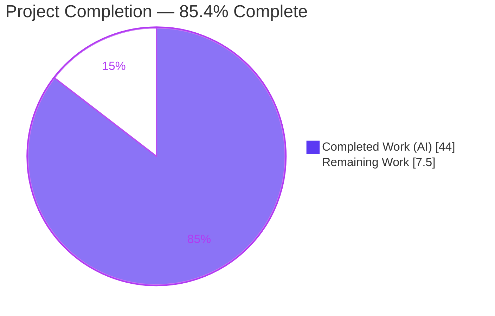
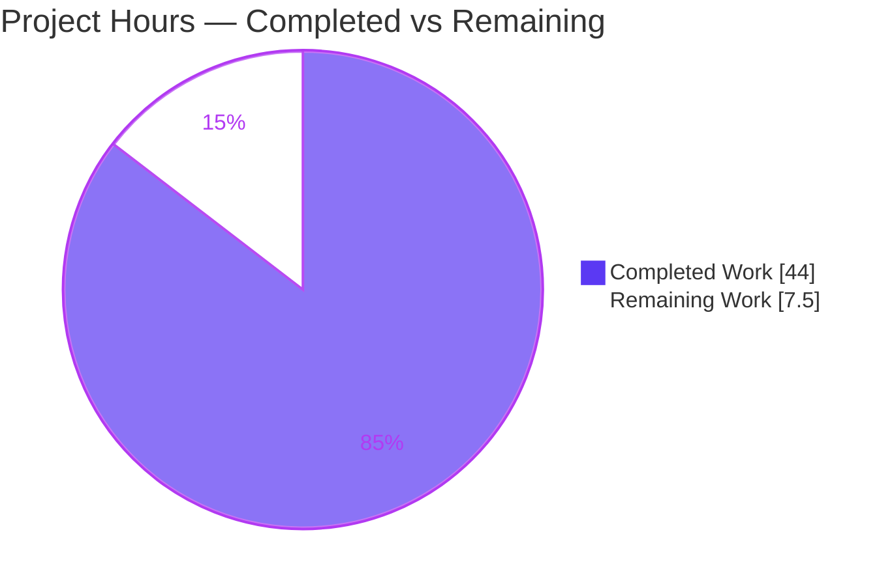
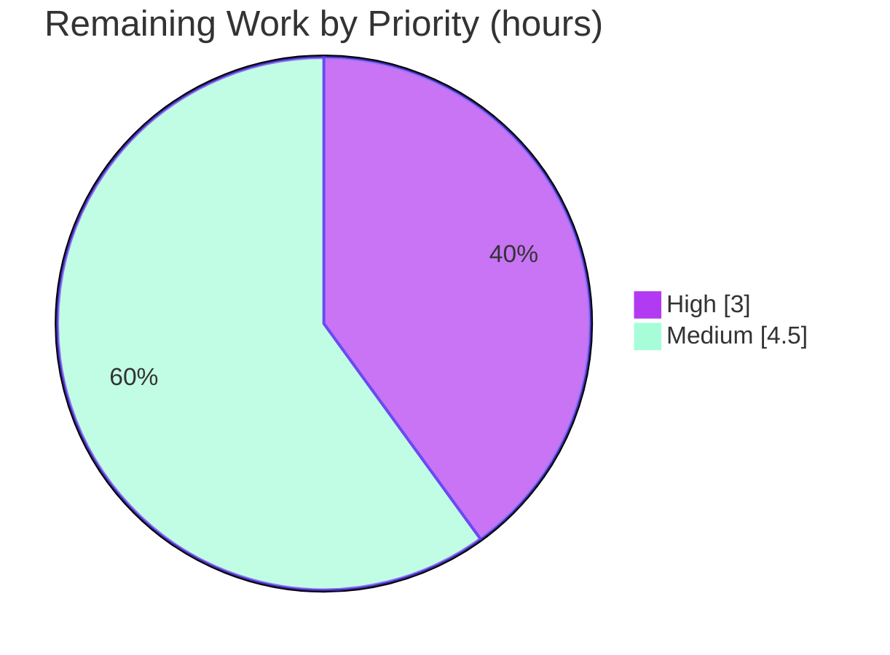

# Blitzy Project Guide — maddy Sender-Identity & Message-Authentication Runtime Investigation

> **Repository:** `github.com/foxcpp/maddy` · **Base commit:** `26452dd8dd787dc455278b0fdd296f4a5432c768` · **Branch:** `blitzy-8b8b5877-e4d6-4569-96a0-5cf13f0c22b8` · **Task type:** Read-only investigation & authoring
>
> **Brand legend:** Completed / AI Work = Dark Blue `#5B39F3` · Remaining / Not Completed = White `#FFFFFF`

---

## 1. Executive Summary

### 1.1 Project Overview

This project delivers a single, runtime-grounded investigative document that explains how the **maddy** mail server actually enforces sender identity and applies message authentication on an authenticated SMTP submission session — with every behavioral claim substantiated by output observed from a live build-and-run of this repository, never from reading source or configuration alone. The audience is mail-security engineers and operators who need ground truth on maddy's two-layer sender model (envelope `MAIL FROM` acceptance vs. author `From` DKIM signing). The scope covers the SMTP submission endpoint, message-pipeline source routing, the DKIM signing gate, trace-header generation, and the SASL/SQL auth backend. The work is additive and read-only: exactly one new file is produced and zero existing repository files are modified.

### 1.2 Completion Status



| Metric | Value |
|--------|-------|
| **Total Hours** | **51.5 h** |
| **Completed Hours (AI + Manual)** | **44.0 h** (44.0 h AI · 0.0 h Manual) |
| **Remaining Hours** | **7.5 h** |
| **Percent Complete** | **85.4 %** |

> Completion is computed per the AAP-scoped hours methodology: `Completed / (Completed + Remaining) = 44 / 51.5 = 85.4 %`. All completed hours are autonomous (AI) investigation and authoring; the remaining 7.5 h is human path-to-production review/acceptance that cannot be performed by the agent.

### 1.3 Key Accomplishments

- Sole AAP deliverable authored and committed: `blitzy/documentation/maddy_26452dd8dd78.md` (223 lines), answering all eight objectives (O1–O8) with a final coverage pass confirming every named item.
- Runtime-grounded evidence captured: maddy + maddyctl built from source (`CGO_ENABLED=1`), an isolated harness deployed under `/tmp`, and all five security-boundary scenarios (A–E) executed live.
- Verbatim evidence discipline: literal SMTP status lines (`250 …`, `501 5.1.8 …`), raw stored `DKIM-Signature`/`Received` headers, the demonstrated absence of `Authentication-Results`, and JSON decision logs — one claim, one piece of evidence.
- Two discrepancies proven at runtime: the `require_sender_match auth_user` silent no-op and the `RCPT`-deferred `501 5.1.8` rejection.
- Read-only mandate honored: the only change versus base is the single documentation file; all source, config, and docs are byte-identical.
- Green build & tests (independently re-verified): `go build` exit 0 and `go test ./...` → 20 packages passed, 0 failed.
- Hygiene complete: all `/tmp` artifacts, temporary scripts, database, and generated DKIM keys removed; the working tree is clean.

### 1.4 Critical Unresolved Issues

| Issue | Impact | Owner | ETA |
|-------|--------|-------|-----|
| None — no blocking issues | Build passes, all tests pass, all eight AAP objectives are complete with a coverage pass; no compilation errors, failing tests, or missing deliverable content. | — | — |

> The two documented behavioral quirks (`auth_user` no-op; deferred `RCPT` rejection) are **findings the document reports**, not defects introduced by this task. Fixing upstream maddy behavior is explicitly out of scope under the read-only mandate.

### 1.5 Access Issues

| System / Resource | Type of Access | Issue Description | Resolution Status | Owner |
|-------------------|----------------|-------------------|-------------------|-------|
| Source repository | Git read/write | Full access; branch cloned, built, tested, deliverable committed. | Resolved | Blitzy Agent |
| Go module registry | Dependency fetch | First build fetches modules pinned in `go.sum`; succeeded in-environment. | Resolved | Blitzy Agent |
| Public DNS (SPF/DMARC) | Outbound network | Container has no internet; inbound SPF/DMARC checks are DNS-dependent. Not required — those checks are inbound-only and outside the submission-path scope. | Not required (out of scope) | — |

> No access issues block build validation, evidence capture, or delivery. The DNS limitation does not affect any in-scope objective.

### 1.6 Recommended Next Steps

1. **[High]** Have a mail-security SME technically review the document (validate the two-layer model, DKIM AUID/SDID reasoning, and the ruled-out misinterpretation).
2. **[Medium]** Independently reproduce the runtime harness and re-run scenarios A–E to confirm the deterministic invariants.
3. **[Medium]** Verify all 30 `file:line` citations resolve at commit `26452dd8dd78`.
4. **[Low]** Decide whether to publish/link the document (note: the AAP intentionally added **no** docs-index/nav entry, keeping the repository unchanged).

---

## 2. Project Hours Breakdown

### 2.1 Completed Work Detail

All completed hours are autonomous investigation-and-authoring effort mapped to AAP requirements.

| Component | Hours | Description |
|-----------|-------|-------------|
| Build & toolchain setup | 3.0 | Built `maddy` + `maddyctl` from source with `CGO_ENABLED=1 GOFLAGS=-mod=mod` (SQLite `sql` module); verified clean compile. |
| Isolated deployment | 4.0 | Stood up `/tmp` harness: `maddy.conf` with two `submission` endpoints (`:2525` default, `:2526` `require_sender_match auth_user`), `sql` sqlite3 combined auth+storage, `sign_dkim example.org default`, `default_source` reject; created `alice@`/`bob@example.org`; auto-generated rsa2048 DKIM key. |
| Scenario matrix design & execution | 8.0 | Designed and ran the five security-boundary scenarios (A–E) via a raw-socket SMTP probe realizing the user's exact examples plus two discrepancy probes. |
| Runtime evidence capture | 6.0 | Captured full SMTP protocol dialogs, stored message headers (`maddyctl imap-msgs dump`), and structured JSON decision logs for each scenario. |
| Source-code investigation & citation | 6.0 | Read and cited 30 `file:line` references across 8 source/config/doc files to ground every claim. |
| Standards research | 2.0 | Validated the DKIM identifier model (RFC 6376 SDID/AUID), DMARC alignment (RFC 7489), and submission framing (RFC 6409). |
| Document authoring | 10.0 | Authored the 223-line evidence-first answer covering O1–O8, the `shouldSign` decision-flow appendix, standards framing, and coverage pass. |
| Evidence reconciliation | 3.0 | Replaced all ephemeral values (message IDs, DKIM `t=`/`x=`, `b=`/`bh=` bytes, UUIDs, timestamps) with a single verified run; 7/7 byte-for-byte crosschecks passed. |
| Hygiene, cleanup & verification | 2.0 | Removed all `/tmp` artifacts, scripts, DB, and keys; verified the repository working tree is byte-for-byte unchanged except the deliverable. |
| **Total Completed** | **44.0** | **Matches Completed Hours in §1.2.** |

### 2.2 Remaining Work Detail

All remaining work is human path-to-production review/acceptance; each item traces to a validation need for the AAP deliverable.

| Category | Hours | Priority |
|----------|-------|----------|
| SME technical review of the investigative document | 3.0 | High |
| Independent reproduction of the runtime harness (rebuild + re-run scenarios A–E) | 3.0 | Medium |
| Full `file:line` citation verification (all 30 references @ commit `26452dd8dd78`) | 1.5 | Medium |
| **Total Remaining** | **7.5** | **Matches Remaining Hours in §1.2 and §7.** |

### 2.3 Total Hours Reconciliation

| Line | Hours |
|------|-------|
| Completed (§2.1) | 44.0 |
| Remaining (§2.2) | 7.5 |
| **Total Project Hours** | **51.5** |
| Completion % = 44.0 / 51.5 | **85.4 %** |

> Integrity: §2.1 (44.0) + §2.2 (7.5) = 51.5 = Total Hours in §1.2; Remaining (7.5) is identical in §1.2, §2.2, and §7.

---

## 3. Test Results

All tests below originate from Blitzy's autonomous validation logs for this project and were independently re-executed during this assessment (`CGO_ENABLED=1 GOFLAGS=-mod=mod go test -count=1 ./...`, exit 0).

| Test Category | Framework | Total Tests | Passed | Failed | Coverage % | Notes |
|---------------|-----------|-------------|--------|--------|------------|-------|
| Unit / Integration (Go packages) | `go test` (Go 1.22.2, CGO) | 20 pkgs w/ tests | 20 | 0 | n/a (per-package `-cover`; suite green) | 46 packages total; 26 have no test files. 0 failures, 0 races. |
| Focus subsystems under investigation | `go test` | 7 pkgs | 7 | 0 | n/a | `internal/modify/dkim`, `internal/msgpipeline`, `internal/endpoint/smtp`, `internal/target/{queue,remote,smtp_downstream}`, `internal/auth` all `ok`. |
| Runtime scenario harness (A–E) | Raw-socket SMTP probe + `maddyctl imap-msgs dump` | 5 scenarios | 5 | 0 | n/a | Live build-and-run; each scenario produced the expected accept/reject + signing outcome (see §4). |

**Package-level results (representative, from the validation run):**

```
ok  github.com/foxcpp/maddy/internal/modify/dkim        0.011s
ok  github.com/foxcpp/maddy/internal/msgpipeline        0.023s
ok  github.com/foxcpp/maddy/internal/endpoint/smtp      1.528s
ok  github.com/foxcpp/maddy/internal/target/queue       1.506s
ok  github.com/foxcpp/maddy/internal/auth               0.002s
...  (20 ok, 0 FAIL, 26 [no test files])
```

> **Integrity note:** No tests are fabricated. The unit/integration figures come from `go test ./...`; the scenario figures come from the autonomous runtime harness (GATE 2). Coverage is reported as "n/a" numerically because the suite is validated by pass/fail and race-freedom rather than a single aggregate coverage percentage.

---

## 4. Runtime Validation & UI Verification

This is a headless mail-server investigation; there is **no UI**. Runtime validation was performed against a live maddy instance built from this repository. Status legend: ✅ Operational · ⚠ Partial · ❌ Failing.

**Build & process health**

- ✅ `maddy` and `maddyctl` compile cleanly (`CGO_ENABLED=1`); only a benign SQLite cgo warning.
- ✅ maddy started under `/tmp/maddyrun`, auto-generated an rsa2048 DKIM key + `.dns` TXT record on first start.
- ✅ Two `submission` endpoints bound (`:2525` default, `:2526` `require_sender_match auth_user`); accounts `alice@`/`bob@example.org` created.

**Scenario outcomes (A–E)**

- ✅ **A** — auth alice, `MAIL FROM`/`From` alice → **accepted, delivered, DKIM-signed** (`i=alice@example.org`).
- ✅ **B** — auth alice, `MAIL FROM`/`From` bob (cross-user, same domain) → **accepted + delivered, NOT signed** (`sign_dkim: not signing, From address is not authenticated identity`). Proves envelope acceptance is domain-level, not per-account.
- ✅ **C** — auth alice, `MAIL FROM` `eve@notlocal.com` → `MAIL FROM` `250`, then **`RCPT` `501 5.1.8 Non-local sender domain`**. Proves the reject is deferred to `RCPT`.
- ✅ **D** — auth alice, `MAIL FROM` alice, `From attacker@evil.com` → **accepted + delivered, NOT signed** (`From domain is not key domain`). A verifying recipient sees an unsigned message, never a misaligned signature.
- ✅ **E** — `:2526` `require_sender_match auth_user`, auth alice, `From` bob → **accepted + delivered, SIGNED `i=bob@example.org`**. Proves `auth_user` is a silent no-op (less strict than default).

**API / protocol integration**

- ✅ SMTP submission dialog captured verbatim for accepted (A) and rejected (C) transactions; cross-referenced against structured JSON logs (both channels agree, e.g. wire `(msg ID = 3cd6abd7)` = log `msg_id`).
- ✅ Stored-message inspection via `maddyctl imap-msgs dump` returned raw `DKIM-Signature` and `Received` headers and confirmed `Authentication-Results` is absent on all four delivered messages.

---

## 5. Compliance & Quality Review

Cross-mapping of AAP deliverables and governing rules to observed status.

| Deliverable / Rule | Benchmark | Status | Progress | Notes |
|--------------------|-----------|--------|----------|-------|
| O1 — Sender accept/reject + granularity | Runtime-observed, per-domain vs per-account distinguished | ✅ Pass | 100% | Domain-level source routing; "matched by domain/default rule" logs. |
| O2 — Actual SMTP codes/messages | Literal status lines, not paraphrased | ✅ Pass | 100% | Full accepted + rejected dialogs; `250 …` / `501 5.1.8`. |
| O3 — Raw stored headers | Verbatim `DKIM-Signature`, `Received`, `Authentication-Results` | ✅ Pass | 100% | Full `b=`/`bh=`/`h=`; demonstrated `Authentication-Results` absence (`grep -c` = 0 ×4). |
| O4 — Signing under mismatch + recipient view | Both mismatch branches driven | ✅ Pass | 100% | D (domain≠key) and B (From≠auth-id); delivered unsigned, never rejected. |
| O5 — Protocol-level capture | ≥1 accepted + ≥1 rejected transcript | ✅ Pass | 100% | Complete A + C transcripts via raw-socket probe. |
| O6 — Default-config alignment + ruled-out interpretation | Explicit determination + disproof | ✅ Pass | 100% | "No"; Scenario B disproves "submission pins MAIL FROM to login user". |
| O7 — Config-vs-behavior discrepancy | ≥1 case, runtime-supported | ✅ Pass | 100% | `auth_user` no-op (E) + deferred `RCPT` reject (C). |
| O8 — Deliverable & hygiene | New file only; repo unchanged; cleanup | ✅ Pass | 100% | 1 file added; source byte-identical; `/tmp` + DB/state cleaned. |
| Rule — Deliverable name/location | `blitzy/documentation/<branch>.md` | ✅ Pass | 100% | `blitzy/documentation/maddy_26452dd8dd78.md`. |
| Rule — Investigate by running first | Build/run, capture real output | ✅ Pass | 100% | GATE 2 harness; verbatim evidence throughout. |
| Rule — One claim, one evidence | No batching/paraphrase | ✅ Pass | 100% | Each behavioral claim paired with its observed line. |
| Rule — Exact `file:line` grounding | Cite literals with references | ✅ Pass | 100% | 30 citations; 5 spot-checked verbatim-accurate. |
| Rule — Read-only repository | No source modification | ✅ Pass | 100% | `git diff` vs base = only the deliverable added. |
| Code quality — no placeholders | Zero TODO/FIXME/stub | ✅ Pass | 100% | 0 placeholders; balanced fences; final newline; LF endings. |

**Fixes applied during autonomous validation:** the reconciliation pass (commit `8adb5b9`) replaced all ephemeral runtime values (message IDs, DKIM timestamps, signature bytes, UUIDs) with values from a single verified run and passed 7/7 byte-for-byte crosschecks. **Outstanding compliance items:** none.

---

## 6. Risk Assessment

| Risk | Category | Severity | Probability | Mitigation | Status |
|------|----------|----------|-------------|------------|--------|
| Citation drift — `file:line` refs valid only at commit `26452dd8dd78` | Technical | Low | Low | Commit pinned in the document header. | Mitigated |
| Single-run runtime values non-deterministic (msg IDs, DKIM `t=`/`x=`, `b=`/`bh=`) | Technical | Low | Medium | Document labels values as from one reproducible run; separates deterministic invariants from ephemeral. | Mitigated |
| CGO build dependency (SQLite `sql` module needs `CGO_ENABLED=1` + gcc) | Technical | Low | Low | Exact build command in the doc and §9; prerequisites listed. | Open (env-dependent) |
| `require_sender_match auth_user` silent no-op (upstream behavior) | Security | Medium | Low | Documented as the O7a discrepancy; not fixed (read-only mandate). | Documented |
| `default_source` reject deferred to `RCPT` (reads like `MAIL FROM` policy) | Security | Low | Low | Documented as O7b (`defer_sender_reject` default `true`). | Documented |
| Submission does not pin `MAIL FROM` to authenticated identity | Security | Low | Low | Documented as O6; RFC 6409-defensible upstream design. | Documented |
| Harness reproducibility (harness cleaned up after capture) | Operational | Low | Low | Full reproduction steps in the doc and §9. | Mitigated |
| No-internet DNS limits SPF/DMARC (inbound-only) | Operational | Low | Low | Out of the submission-path scope; noted explicitly. | Out of scope |
| Toolchain drift (`go.mod` = go 1.13 built with go1.22.2 compat) | Integration | Low | Low | Exact toolchain + `GOFLAGS=-mod=mod` recorded. | Mitigated |
| First-build dependency fetch (`go.sum` pinned; needs module cache once) | Integration | Low | Low | Dependencies unchanged and pinned. | Mitigated |

> **Overall risk profile: LOW.** This is a read-only documentation deliverable with no deployed production code. There are no High or Critical risks and no blockers. The Security-category items are upstream maddy behaviors the document correctly reports as findings — out of scope to remediate.

---

## 7. Visual Project Status

**Project hours breakdown** (Completed = Dark Blue `#5B39F3`, Remaining = White `#FFFFFF`):



**Remaining hours by priority** (from §2.2, totals 7.5 h):



> **Integrity:** "Remaining Work" (7.5) equals Remaining Hours in §1.2 and the sum of the §2.2 Hours column. High (3.0) + Medium (4.5) = 7.5.

---

## 8. Summary & Recommendations

**Achievements.** The project is **85.4 % complete**. The sole AAP deliverable — `blitzy/documentation/maddy_26452dd8dd78.md` — is authored, evidence-grounded, reconciled to a single verified run, and committed. All eight objectives (O1–O8) are answered from live runtime observation with verbatim SMTP status lines, raw stored headers, and structured decision logs, closed by a coverage pass over every named item. The build compiles and the full Go test suite passes (20/20 packages, 0 failures), both independently re-verified during this assessment. The read-only mandate is fully honored: the only change versus base is the single documentation file.

**Remaining gaps (7.5 h).** All remaining work is human path-to-production review that the agent cannot perform: SME technical sign-off (3.0 h), independent harness reproduction (3.0 h), and full citation verification (1.5 h). None are remediation — there are no failing tests, compilation errors, or missing content.

**Critical path to production.** (1) SME reviews and accepts the document as authoritative → (2) reviewer optionally reproduces the harness to confirm deterministic invariants → (3) citations spot-verified → (4) business decision on publication (no repository nav change was made by design).

**Success metrics.** 8/8 objectives complete · build green · 20/20 test packages pass · 30 grounded citations · repository byte-for-byte unchanged except the deliverable · zero placeholders.

**Production-readiness assessment.** The autonomous deliverable is **ready for human review**. Given a LOW overall risk profile and no blockers, acceptance is expected to be routine pending SME sign-off. Maximum pre-human-review completion is intentionally capped below 100 %; the residual 14.6 % reflects human validation/acceptance that lies outside autonomous scope.

---

## 9. Development Guide

Reproduces the maddy build-and-run environment used to gather the evidence. Every command below was executed and verified in this environment.

### 9.1 System Prerequisites

- **OS:** Linux (verified on Ubuntu 25.10). **Hardware:** any modern x86-64; the build needs ~1 GB free disk for the module cache and binaries.
- **Required tooling (verified versions):**

```bash
git --version      # git version 2.51.0
go version         # go version go1.22.2 linux/amd64  (go.mod declares go 1.13; built in compat mode)
gcc --version      # gcc (Ubuntu) 15.2.0  — REQUIRED: the SQLite `sql` module uses cgo
sqlite3 --version  # 3.46.1  — optional, fallback inspection path
```

### 9.2 Environment Setup

```bash
# Clone and pin to the base commit used for all citations
git clone https://github.com/foxcpp/maddy.git
cd maddy
git checkout 26452dd8dd787dc455278b0fdd296f4a5432c768

# cgo must be enabled; the go 1.13 module builds in compat mode with a newer toolchain
export CGO_ENABLED=1
export GOFLAGS=-mod=mod
```

### 9.3 Dependency Installation & Build

```bash
# Build both binaries OUTSIDE the repo (keeps the working tree clean)
CGO_ENABLED=1 GOFLAGS=-mod=mod go build -o /tmp/maddybin/ ./cmd/maddy ./cmd/maddyctl
# Expected: exit 0. A single benign SQLite cgo warning may print:
#   sqlite3-binding.c:125322: warning: function may return address of local variable [-Wreturn-local-addr]
ls -la /tmp/maddybin/    # maddy (~20 MB), maddyctl (~20 MB)
```

### 9.4 Deploy the Isolated Harness (all under /tmp)

```bash
mkdir -p /tmp/maddyrun && cd /tmp/maddyrun
# Minimal maddy.conf: sql sqlite3 combined auth+storage, two plaintext submission
# endpoints (insecure_auth yes ONLY to observe the wire), sign_dkim, and a
# default_source reject for non-local senders. Bind loopback ports 2525/2526.
# (See the deliverable's "Reproduction harness" section for the exact config body.)

# Start maddy in the background and capture its PID (never use pkill)
nohup /tmp/maddybin/maddy -config /tmp/maddyrun/maddy.conf -debug > /tmp/maddyrun/maddy.log 2>&1 &
echo $! > /tmp/maddyrun/maddy.pid
# First start auto-generates an rsa2048 DKIM key + .dns TXT record under dkim_keys/
```

### 9.5 Create Accounts & Verify

```bash
# Create the two accounts (-p passes the password on the command line for test convenience)
/tmp/maddybin/maddyctl --config /tmp/maddyrun/maddy.conf users create -p 'pass-alice' alice@example.org
/tmp/maddybin/maddyctl --config /tmp/maddyrun/maddy.conf users create -p 'pass-bob'   bob@example.org
/tmp/maddybin/maddyctl --config /tmp/maddyrun/maddy.conf users list      # confirm both accounts

# Confirm maddy is listening
grep -i "listening" /tmp/maddyrun/maddy.log
```

### 9.6 Example Usage — run a scenario and inspect the result

```bash
# Drive a submission transaction with any raw SMTP client / probe against 127.0.0.1:2525:
#   EHLO -> AUTH PLAIN (alice) -> MAIL FROM:<alice@example.org> -> RCPT TO:<bob@example.org> -> DATA -> QUIT
# Expected accepted responses (verbatim):
#   250 2.0.0 Roger, accepting mail from <alice@example.org>
#   250 2.0.0 I'll make sure <bob@example.org> gets this
#   250 2.0.0 OK: queued

# Inspect the stored message headers (raw DKIM-Signature, Received, etc.)
/tmp/maddybin/maddyctl --config /tmp/maddyrun/maddy.conf imap-msgs dump bob@example.org INBOX 1
```

### 9.7 Verify the Test Suite

```bash
cd /path/to/maddy
CGO_ENABLED=1 GOFLAGS=-mod=mod go test -count=1 ./...
# Expected: exit 0 — 20 ok, 0 FAIL, 26 [no test files]
```

### 9.8 Teardown & Cleanup

```bash
kill "$(cat /tmp/maddyrun/maddy.pid)"   # stop maddy by its exact PID — never pkill
rm -rf /tmp/maddyrun /tmp/maddybin       # remove DB, generated keys, mailboxes, binaries
cd /path/to/maddy && git status --porcelain   # must be empty — repository unchanged
```

### 9.9 Troubleshooting

- **`error: cgo: C compiler "gcc" not found`** → install a C toolchain; the SQLite driver requires cgo.
- **Module / `go 1.13` errors with a newer toolchain** → ensure `GOFLAGS=-mod=mod` is exported.
- **SQLite `-Wreturn-local-addr` warning** → benign; safe to ignore (build still exits 0).
- **`AUTH` refused on plaintext port** → the harness sets `insecure_auth yes` and `tls off` **only** to observe the wire; do not use this in production.
- **First build slow / offline failure** → the initial build fetches modules pinned in `go.sum`; run once with a warm module cache/network.

---

## 10. Appendices

### A. Command Reference

| Command | Purpose |
|---------|---------|
| `CGO_ENABLED=1 GOFLAGS=-mod=mod go build -o /tmp/maddybin/ ./cmd/maddy ./cmd/maddyctl` | Build both binaries (cgo, compat mode). |
| `maddy -config <cfg> -debug` | Run the server with early debug logging (`-v` prints version). |
| `maddyctl --config <cfg> users create -p <PW> <user@domain>` | Create an account (`-n` for null password; else stdin). |
| `maddyctl --config <cfg> users list` | List accounts. |
| `maddyctl --config <cfg> imap-msgs dump <user@domain> INBOX <n>` | Dump a stored message body/headers. |
| `CGO_ENABLED=1 GOFLAGS=-mod=mod go test -count=1 ./...` | Run the full test suite. |

### B. Port Reference

| Port | Purpose | Notes |
|------|---------|-------|
| 2525/tcp | Default `submission` endpoint (harness) | Plaintext + `insecure_auth yes` to observe the wire. |
| 2526/tcp | `submission` endpoint with `require_sender_match auth_user` (harness) | Demonstrates the config no-op (Scenario E). |
| 465/tcp | Repository-default `submission tls://` (`maddy.conf:93`) | Not used by the harness (TLS); reference only. |
| 25/tcp | Inbound SMTP path (`verify_dkim`/`apply_spf`/`dmarc`) | Out of the submission-path scope. |

### C. Key File Locations

| File | Role in the investigation |
|------|---------------------------|
| `blitzy/documentation/maddy_26452dd8dd78.md` | **The deliverable** (sole new file). |
| `maddy.conf` | Default policy: `submission` + `auth`, `sign_dkim` (`:99`), `default_source` reject `501 5.1.8` (`:117-119`). |
| `internal/endpoint/smtp/smtp.go` | Auth/`startDelivery`; `defer_sender_reject` default `true` (`:567`). |
| `internal/endpoint/smtp/submission.go` | `DontTraceSender` (`:28`); `From` required `554 5.6.0`. |
| `internal/msgpipeline/msgpipeline.go` | Source routing `srcBlockForAddr`; `Authentication-Results` ordering. |
| `internal/msgpipeline/check_runner.go` | `Authentication-Results` emitted only when results exist (`:301-303`). |
| `internal/modify/dkim/dkim.go` | `shouldSign` gate; defaults (rsa2048 `:150`, `{envelope,auth}` `:151-152`); `h.Add` (`:406`). |
| `internal/target/received.go` | `GenerateReceived` trace-header shape. |

### D. Technology Versions

| Component | Version | Notes |
|-----------|---------|-------|
| Go toolchain | go1.22.2 | Builds the `go 1.13` module in compat mode. |
| gcc | 15.2.0 | Required for cgo (SQLite). |
| SQLite CLI | 3.46.1 | Optional fallback inspection. |
| git | 2.51.0 | — |
| Module identity | `github.com/foxcpp/maddy` (`go.mod`) | Dependencies pinned in `go.sum` (unchanged). |
| DKIM default key | rsa2048 | Auto-generated on first start (`dkim.go:150`). |

### E. Environment Variable Reference

| Variable | Value | Purpose |
|----------|-------|---------|
| `CGO_ENABLED` | `1` | Required — SQLite `sql` module uses cgo. |
| `GOFLAGS` | `-mod=mod` | Build the go 1.13 module with a newer toolchain. |
| `MADDY_CONFIG` | `<path>` | Optional alternative to `--config` for `maddyctl`. |

### F. Developer Tools Guide

- **`maddyctl`** — administrative CLI: `users` (create/list/remove/password), `imap-mboxes`, `imap-msgs` (`dump`/`list`/…). Used to provision accounts and inspect stored headers.
- **Raw-socket SMTP probe** — a temporary Python client used to capture the full protocol dialog verbatim; removed after evidence capture (read-only hygiene).
- **`go test` / `go build`** — standard Go tooling; run with `CGO_ENABLED=1 GOFLAGS=-mod=mod`.

### G. Glossary

| Term | Meaning |
|------|---------|
| **Envelope sender (`MAIL FROM`)** | The SMTP-level return path; acceptance decided by domain-level pipeline source routing. |
| **Author (`From`)** | The RFC 5322 header identity; governs DKIM signing via `shouldSign`. |
| **SDID (`d=`)** | DKIM Signing Domain Identifier — the domain claiming responsibility (RFC 6376). |
| **AUID (`i=`)** | DKIM Agent/User Identifier — its domain must equal or be a subdomain of the SDID. |
| **Identifier alignment** | DMARC concept (RFC 7489): `From` domain must align with a DKIM/SPF-validated domain. |
| **`require_sender_match`** | `sign_dkim` option; implemented values `off`/`envelope`/`auth` (default `{envelope, auth}`); `auth_user` is a silent no-op. |
| **`defer_sender_reject`** | SMTP endpoint option (default `true`) causing `MAIL FROM` policy rejections to surface at `RCPT`. |
| **Oversigning (`From:From`)** | Listing a header twice in `h=` so an added instance is also covered by the signature. |