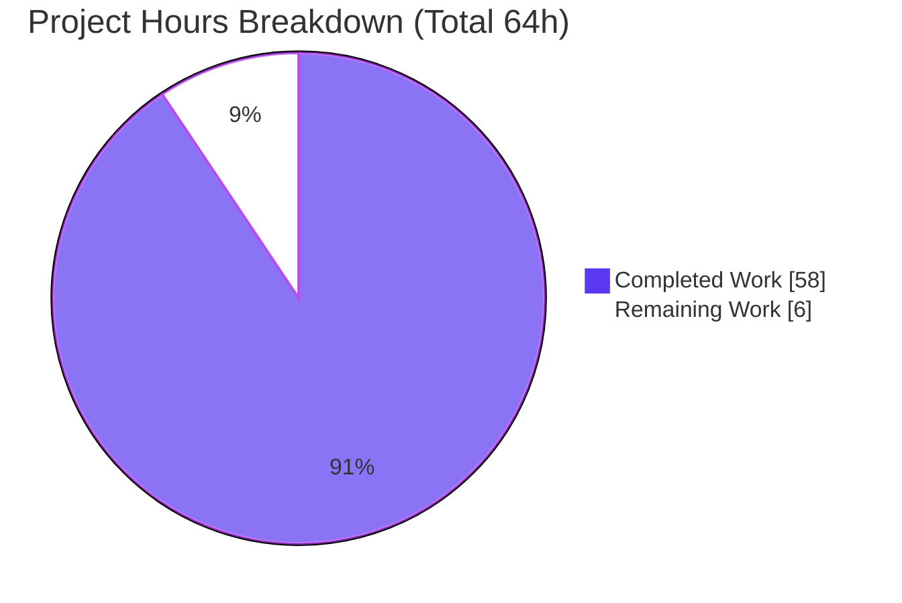
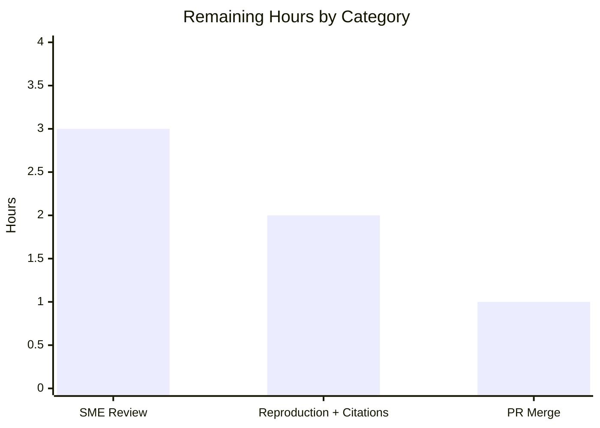

# Blitzy Project Guide

> **Project:** Runtime Investigation — How Maddy Enforces Sender Identity & Message Authentication on an Authenticated SMTP Submission Session
> **Repository:** `foxcpp/maddy` @ base commit `26452dd8dd787dc455278b0fdd296f4a5432c768` · Branch `blitzy-7857c091-7f7d-4c74-bcee-a70f933c820a`
> **Governing rule:** SWE-AtlasQnA-Repo (read-only repository; single documentation deliverable)
> **Head commit:** `7590845` · Working tree: **CLEAN**

---

## 1. Executive Summary

### 1.1 Project Overview

This project delivers a single, runtime-grounded answer document explaining how the Maddy email server enforces sender identity and message authentication on an authenticated SMTP *submission* session. Rather than reasoning from source alone, Maddy was actually built, configured, and run; driven through the user's boundary scenarios over live SMTP; and its stored output inspected byte-for-byte. The audience is a security engineer or operator evaluating Maddy's default trust boundaries. The headline finding: Maddy's **default** configuration authorizes the envelope sender by **domain membership, not by the authenticated user**, while DKIM "sender match" gates only *signing*, never *acceptance*. The sole persistent deliverable is `blitzy/documentation/maddy_26452dd8dd78.md`; the Maddy source tree is untouched (read-only).

### 1.2 Completion Status


<div style="color:#5B39F3"><strong>90.6% Complete</strong></div>

| Metric | Hours |
|--------|-------|
| **Total Hours** | 64 |
| **Completed Hours (AI + Manual)** | 58 (58 AI + 0 Manual) |
| **Remaining Hours** | 6 |
| **Percent Complete** | **90.6%** (58 ÷ 64) |

> **Basis (PA1).** Completion measures AAP-scoped autonomous work plus path-to-production. All eight requirements (R1–R8), every implicit prerequisite, and every rule constraint are **Completed**. The remaining 6 hours are entirely **human path-to-production sign-off** (technical review, independent reproduction, and PR merge) — there is no autonomous work left. Per Blitzy honesty policy, completion is capped below 100% pending human review.

### 1.3 Key Accomplishments

- [x] **Built and ran Maddy** (`maddy` + `maddyctl`) from source at commit `26452dd` inside the pinned toolchain image with `CGO_ENABLED=1` (required by the C-backed `github.com/mattn/go-sqlite3 v1.11.0`).
- [x] **All eight requirements (R1–R8) answered** from observed runtime behavior, with verbatim captures and exact `file:line` citations.
- [x] **Established the headline finding** — sender authorization is **domain-scoped, not user-scoped**: authenticating as `alice@example.org` and sending `MAIL FROM:<bob@example.org>` is **accepted** (`250 2.0.0 OK: queued`).
- [x] **Captured the exact accept/reject matrix** verbatim on the wire: `502 5.7.0`, `454 4.7.0`, `250 2.0.0 OK: queued`, `501 5.1.8`, `554 5.6.0`, `554 5.0.0`.
- [x] **Quoted stored headers byte-for-byte** — the re-cased `Dkim-Signature`, the double-space `Received` with stripped client origin, and the **absence** of `Authentication-Results` (confirmed two independent ways).
- [x] **Discovered a genuine runtime defect** — Maddy emits a DKIM signature that a standards-compliant verifier **fails to verify** (Maddy writes a PKCS#1 public key; `go-msgauth` expects PKIX/SPKI).
- [x] **Honestly corrected the plan against observation** — unauthenticated/bad-credential replies are `502 5.7.0` / `454 4.7.0` (go-smtp library defaults), not the RFC-idealized `530`/`535`.
- [x] **Kept the repository pristine** — `git diff 26452dd..HEAD` = exactly one file added; all ephemeral test artifacts removed; working tree clean.
- [x] **Passed all five autonomous validation gates** — dependencies, compilation (`go build ./...` EXIT=0), tests (`go test ./... -cover -race`, 20 packages OK / 0 fail / 0 races), runtime reproduction, and zero unresolved errors.

### 1.4 Critical Unresolved Issues

| Issue | Impact | Owner | ETA |
|-------|--------|-------|-----|
| _None blocking._ All R1–R8 answers are complete, validated, and reproduced. No compilation errors, no failing tests, no citation errors, no quote inaccuracies. | No release blockers | — | — |
| _(Informational, non-blocking)_ Discovered DKIM PKCS#1-vs-PKIX verification defect in Maddy | Interoperability finding about Maddy itself; **out of scope** to fix (read-only rule). Documented in R5/R8. | Maddy upstream (optional) | N/A for this deliverable |

### 1.5 Access Issues

**No access issues identified.** The build, tests, and runtime investigation ran fully offline inside the pinned image (`--network none`, `GOPROXY=off`) using a warmed module cache. No repository-permission, service-credential, or third-party-API access was required or blocked.

| System/Resource | Type of Access | Issue Description | Resolution Status | Owner |
|-----------------|----------------|-------------------|-------------------|-------|
| _None_ | — | No access issues encountered | N/A | — |

### 1.6 Recommended Next Steps

1. **[High]** Perform SME technical review of the answer document — confirm the R1–R8 answers, the domain-scoped conclusion (R7), and the DKIM "signed-yet-fails-verify" claim (R5/R8).
2. **[Medium]** Independently reproduce Scenario 1 (accepted) and Scenario 2 (rejected) in the pinned image and spot-check a sample of `file:line` citations against source at commit `26452dd`.
3. **[Medium]** Review the single-file PR diff, confirm the working tree is pristine, and merge.
4. **[Low, optional / out of scope]** Report the discovered DKIM PKCS#1-vs-PKIX signature-verification defect upstream to the Maddy project. This is a valuable follow-up but is **not** part of this read-only documentation task and is **not** counted in the remaining hours.

---

## 2. Project Hours Breakdown

### 2.1 Completed Work Detail

Every completed component traces to a specific AAP requirement (R1–R8), rule constraint, or the autonomous validation performed by Blitzy agents.

| Component | Hours | Description |
|-----------|------:|-------------|
| R1 — Environment & setup | 6 | Built `maddy`/`maddyctl` in the pinned image (`CGO_ENABLED=1`); authored the ephemeral config modeled on `maddy.conf`; generated self-signed TLS; observed DKIM key auto-generation; provisioned `alice@`/`bob@example.org` via `maddyctl users create`. |
| R2/R3 — Boundary tests & accept/reject logic | 7 | Drove the three verbatim sender constructions plus unauthenticated, bad-credential, and header-fault cases; captured exact wire codes; established domain-vs-user acceptance and reply-timing (`501` deferred to `RCPT`). |
| R4 — Stored-header capture & analysis | 5 | Fetched raw RFC822 via IMAP and `sqlite3`; quoted `DKIM-Signature`, `Received`, and the absence of `Authentication-Results` verbatim; analyzed tag ordering, `From:From` over-signing, double-space quirk, ESMTP/ESMTPS. |
| R5 — DKIM under `From` mismatch | 5 | Observed silent signing-skip → unsigned delivery (not rejection); captured both non-signing branches; confirmed `From` coverage when signing occurs; analyzed verifier `FAIL` (two independent causes incl. the key-format defect). |
| R6 — SMTP transaction capture | 4 | Documented capture methods and TLS-opacity reasoning; captured verbatim ACCEPTED (Scenario 3) and REJECTED (Scenario 2) transactions via `smtplib` debug / plaintext endpoint / `openssl s_client`. |
| R7 — Default-policy conclusion + standards research | 4 | Synthesized the domain-scoped conclusion; ruled out the per-user-binding interpretation with Scenario-1 evidence; grounded it in RFC 6409 §6.1 ("MAY") and RFC 4954. |
| R8 — Config-vs-runtime divergences | 5 | Documented three divergences plus a bonus, including an empirical `require_sender_match` enum test and the DKIM signed-yet-unverifiable defect. |
| Document authoring & structuring | 8 | Wrote the 846-line answer document: abstract, environment table, per-requirement sections with rationale, coverage-pass table, and citation appendix. |
| Citation verification | 5 | Vetted ~55 `file:line` citations against source at commit `26452dd`. |
| Autonomous validation (5 gates + fixes) | 8 | Ran build, `go test -cover -race`, and full runtime reproduction of every scenario; resolved code-review findings; applied and committed two verbatim-quote fixes. |
| Cleanup & repo-pristine verification | 1 | Removed all ephemeral artifacts (config, TLS, DKIM keys, `all.db`, scripts, transcripts); confirmed `git status` clean. |
| **Total Completed** | **58** | **Matches Completed Hours in §1.2** |

### 2.2 Remaining Work Detail

Each remaining category is path-to-production human sign-off; none is autonomous.

| Category | Hours | Priority |
|----------|------:|----------|
| Documentation SME Technical Review (R1–R8 correctness & completeness) | 3 | High |
| Independent Runtime Reproduction & Citation Spot-Check | 2 | Medium |
| Pull Request Review & Merge Approval | 1 | Medium |
| **Total Remaining** | **6** | **Matches Remaining Hours in §1.2 and the §7 pie chart** |

> **Note (excluded from the 6 hours):** Reporting the discovered DKIM defect upstream to Maddy is an optional follow-up that is **out of AAP scope** (read-only rule) and is deliberately not counted here.

---

## 3. Test Results

All tests below originate from **Blitzy's autonomous validation logs** for this project (GATE 3 = static test suite; GATE 4 = runtime behavioral reproduction). Command references are `.build.yml:L14` for the suite and the runtime harness for scenarios.

| Test Category | Framework | Total Tests | Passed | Failed | Coverage % | Notes |
|---------------|-----------|------------:|-------:|-------:|-----------|-------|
| Regression / Unit + Integration suite | Go `testing` (`go test ./... -cover -race`) | 20 packages | 20 | 0 | See below | Maddy's own suite run as a read-only integrity gate; 0 data races. Package-level pass/fail granularity. |
| — investigation pkg: `internal/endpoint/smtp` | Go `testing` | pkg | ok | 0 | 79.4% | Submission/auth/header-validation paths |
| — investigation pkg: `internal/msgpipeline` | Go `testing` | pkg | ok | 0 | 74.5% | Source-block routing / acceptance path |
| — investigation pkg: `internal/modify/dkim` | Go `testing` | pkg | ok | 0 | 42.6% | DKIM signing / `shouldSign` branches |
| — investigation pkg: `internal/auth` | Go `testing` | pkg | ok | 0 | 100% | Credential auth helper |
| Runtime behavioral scenarios | Live SMTP/IMAP (Python `smtplib`/`imaplib`, `sqlite3`, `openssl s_client`) | 10 scenarios | 10 | 0 | n/a | Accept/reject matrix, stored-header inspection, DKIM mismatch, transaction capture, TLS proof, enum test — all reproduced and matched the document. |

**Runtime scenarios executed (all reproduced):** unauthenticated `MAIL` → `502 5.7.0`; bad credentials → `454 4.7.0`; same-domain impersonation → `250` (accepted); non-local domain → `501 5.1.8` (deferred to `RCPT`); legitimate signed → `250` (accepted & signed); DKIM `From`-mismatch → accepted **unsigned**; missing `From` → `554 5.6.0`; malformed `Date` → `554 5.0.0`; implicit-TLS proof via `openssl s_client`; `require_sender_match` enum test (documented `auth` rejected at startup, undocumented `auth_user` accepted but inert).

> **Integrity note (Rule 3):** No tests are invented. The suite result (20 packages OK / 0 fail / 0 races) and coverage figures are taken directly from the autonomous `go test ./... -cover -race` log; the runtime scenarios are the behavioral checks driven during the autonomous investigation. `go build ./...` returned EXIT=0 (only a benign C-compiler warning from the vendored SQLite driver).

---

## 4. Runtime Validation & UI Verification

**UI Verification:** Not applicable — Maddy is a headless mail server with no graphical interface. The "interfaces" are the SMTP/IMAP protocols and the `maddyctl` CLI, all exercised below.

**Runtime health & behavioral outcomes** (status reflects whether the behavior was successfully observed and captured):

- ✅ **Server startup** — clean boot; verbatim banner `220 example.org ESMTP Service Ready`; listeners on `tls://…:4650` (submission), `tcp://…:4655` (plaintext, for wire visibility), `imap tls://…:4930`.
- ✅ **DKIM key auto-generation** — verbatim log captured; key materialized at `dkim_keys/example.org_default.key` with companion `.dns` TXT record.
- ✅ **Mandatory authentication** — unauthenticated `MAIL FROM` rejected `502 5.7.0 Please authenticate first`; bad credentials `454 4.7.0 Invalid credentials`.
- ✅ **Acceptance path (domain-scoped)** — same-domain impersonation accepted `250 2.0.0 OK: queued`; non-local domain rejected `501 5.1.8 Non-local sender domain` (deferred to `RCPT TO`).
- ✅ **Header validation** — missing `From` → `554 5.6.0`; malformed `Date` → `554 5.0.0` (verbatim).
- ✅ **Local delivery & storage** — messages delivered to the SQLite mailbox and re-read via IMAP `FETCH` and `sqlite3`.
- ✅ **DKIM signing (legitimate case)** — `Dkim-Signature` emitted; `From` over-signed (`h=…From:From…`); relaxed/relaxed canonicalization.
- ✅ **DKIM skip (mismatch case)** — signing silently skipped; message delivered **unsigned** (not rejected); both non-signing debug branches captured.
- ✅ **Received header** — client origin stripped (`DontTraceSender`); double-space quirk; `ESMTP` vs `ESMTPS` by TLS state.
- ✅ **Authentication-Results** — confirmed **absent** on the submission/local-delivery path (0 of 4 stored messages).
- ✅ **Implicit-TLS proof** — `openssl s_client` on port 4650 negotiated TLSv1.3 (`TLS_AES_128_GCM_SHA256`, `CN=example.org`, self-signed verify code 18).
- ⚠️ **DKIM signature verification at recipient** — a standards-compliant verifier reports **FAIL**. This is the *correct, expected observation* the document set out to capture (Maddy PKCS#1 key vs `go-msgauth` PKIX). Flagged ⚠ because it reflects a real Maddy interoperability defect, not a deliverable defect — it is thoroughly documented in R5/R8.

---

## 5. Compliance & Quality Review

Cross-mapping AAP deliverables and the governing rule (SWE-AtlasQnA-Repo) to Blitzy's quality/compliance benchmarks. Fixes applied during autonomous validation are noted.

| Benchmark / Requirement | Status | Progress | Evidence / Notes |
|-------------------------|--------|----------|------------------|
| R1 — Environment & setup | ✅ Pass | 100% | Verbatim build/config/keygen/account evidence (doc §R1). |
| R2 — Three verbatim sender constructions | ✅ Pass | 100% | Constructions preserved verbatim (doc §R2/R3). |
| R3 — Accept/reject logic from observation | ✅ Pass | 100% | Exact wire codes + domain-scoped core answer + reply-timing. |
| R4 — Actual stored headers verbatim | ✅ Pass | 100% | Byte-for-byte header blocks; two-way `Authentication-Results` absence proof. |
| R5 — DKIM under `From` mismatch | ✅ Pass | 100% | Silent-skip → unsigned; `From` coverage; verifier `FAIL` analysis. |
| R6 — SMTP transaction capture (≥1 rejected + ≥1 accepted) | ✅ Pass | 100% | Verbatim accepted + rejected transcripts; methods documented. |
| R7 — Default-policy conclusion + ruled-out interpretation | ✅ Pass | 100% | Domain-scoped; per-user binding refuted; RFC 6409/4954 framing. |
| R8 — ≥1 config-vs-runtime divergence | ✅ Pass | 100% | Three divergences + bonus, each evidence-backed. |
| Rule: single deliverable at exact path | ✅ Pass | 100% | `blitzy/documentation/maddy_26452dd8dd78.md` — the only added file. |
| Rule: run-first, then write | ✅ Pass | 100% | Every claim backed by a captured value or `file:line` citation. |
| Rule: verbatim quotes + producing command | ✅ Pass | 100% | Commands shown alongside outputs throughout. |
| Rule: coverage pass over all sub-parts | ✅ Pass | 100% | Coverage-pass table (doc L765–780). |
| Rule: exact `file:line` citations | ✅ Pass | 100% | ~55-entry verified citation appendix; 2 quote fixes applied (`362eb3e`, `423aefb`, `187ca87`, `7590845`). |
| Rule: read-only repository | ✅ Pass | 100% | No Maddy source/config modified; `git diff 26452dd..HEAD` = 1 file. |
| Rule: cleanup of ephemeral artifacts | ✅ Pass | 100% | All artifacts removed; working tree clean; cleanup-confirmation section in doc. |
| Blitzy: compilation gate | ✅ Pass | 100% | `go build ./...` EXIT=0. |
| Blitzy: test gate | ✅ Pass | 100% | `go test ./... -cover -race`: 20 packages OK / 0 fail / 0 races. |
| Blitzy: no placeholders / balanced structure | ✅ Pass | 100% | Zero TODO/FIXME/TBD; 94 code-fence lines balanced. |
| Human SME sign-off & merge | ⏳ Pending | 0% | Path-to-production; 6 hours estimated (§2.2). |

---

## 6. Risk Assessment

| Risk | Category | Severity | Probability | Mitigation | Status |
|------|----------|----------|-------------|------------|--------|
| Toolchain-version note (observed `go1.18.10` vs blueprint-claimed `1.21.6`) | Technical | Low | Low | Doc reports the **observed** value and notes both satisfy `go.mod` `go 1.13` and neither changes analyzed behavior | Resolved |
| Citations anchored to commit `26452dd`; a reviewer diffing against `master` (newer Maddy) sees mismatched line numbers | Technical | Low | Medium | Commit hash stated prominently; appendix asserts verification against `26452dd`; dev guide instructs checking out the base commit | Mitigated |
| Runtime evidence requires the pinned image + CGO to re-run | Technical | Low | Low | Dev guide documents the exact image and commands; validator already reproduced all evidence | Mitigated |
| Discovered DKIM PKCS#1-vs-PKIX verification defect (Maddy emits an unverifiable signature) | Security | Medium | N/A (observed fact) | Documented in R5/R8; **out of scope** to fix per read-only rule; optional upstream report recommended | Documented (out-of-scope) |
| Ephemeral test credential (`AlicePass123`) quoted in transcripts | Security | Low | Low | Synthetic, test-only, confined to the removed `/tmp/maddy-exp` sandbox; never committed | Resolved |
| Headline behavior: default auth is domain-scoped (same-domain impersonation accepted) | Security | Informational | N/A | This is the *answer* to the question and is standards-permissible (RFC 6409 §6.1 "MAY"); clearly explained | Documented |
| Repository cleanliness — ephemeral artifacts leaking into the tree | Operational | Low | Low | Working tree verified clean; cleanup-confirmation section; `git diff` = 1 file | Resolved |
| No CI/deploy pipeline for a plain-text doc | Operational | Low | Low | None required; Git LFS hooks are no-op for plain text | N/A |
| Markdown rendering on GitHub/GitLab (tables, fences, blockquotes) | Integration | Low | Low | Fence balance verified (94, even); no exotic syntax | Mitigated |
| External service integration | Integration | N/A | N/A | Closed-box: DNS isolation (`go-mockdns`), self-signed TLS, local SQLite; nothing reaches the Internet | N/A |

---

## 7. Visual Project Status

**Project hours — completed vs remaining** (Completed = Dark Blue `#5B39F3`, Remaining = White `#FFFFFF`):



**Remaining hours by category** (from §2.2; sums to 6h):



> **Integrity:** "Remaining Work" = **6** here equals the Remaining Hours in §1.2 and the sum of the §2.2 Hours column. "Completed Work" = **58** equals the §2.1 total and the Completed Hours in §1.2.

---

## 8. Summary & Recommendations

**Achievements.** The project is **90.6% complete** (58 of 64 hours). The single mandated deliverable — `blitzy/documentation/maddy_26452dd8dd78.md`, 846 lines — answers all eight requirements (R1–R8) exclusively from observed runtime behavior, with verbatim wire captures, byte-for-byte stored headers, and ~55 verified `file:line` citations. Maddy was genuinely built and run: the investigation reproduced the full accept/reject matrix, established that acceptance is **domain-scoped, not user-scoped**, and even discovered that Maddy emits a DKIM signature a standards-compliant verifier cannot validate. The repository is pristine — exactly one file added, working tree clean — fully honoring the read-only rule.

**Remaining gaps (6 hours, all human).** The only outstanding work is path-to-production sign-off: (1) SME technical review of the R1–R8 answers; (2) independent reproduction of the key accepted/rejected scenarios plus a citation spot-check; and (3) PR review and merge. No autonomous work remains and there are no release blockers.

**Critical path to production.** SME review → independent reproduction/citation spot-check → merge. Each step is well-bounded; the deliverable already passed all five autonomous validation gates.

**Production readiness assessment.** **Ready for human review and merge.** As a documentation deliverable there is no deployment surface; "production" means a reviewed, merged answer document. Quality indicators are strong: balanced structure, no placeholders, honest corrections of the plan against observation, and complete evidence traceability.

**Success metrics.**

| Metric | Target | Actual |
|--------|--------|--------|
| Requirements answered (R1–R8) | 8/8 | 8/8 ✅ |
| Autonomous validation gates passed | 5/5 | 5/5 ✅ |
| Repository files modified beyond deliverable | 0 | 0 ✅ |
| Compilation / test suite | pass | `go build` EXIT=0; 20 pkgs OK / 0 fail / 0 races ✅ |
| Completion | ≥ 90% | 90.6% ✅ |

**Recommendations.** Proceed with the three human sign-off steps in §1.6. Optionally (and separately from this task) report the DKIM PKCS#1-vs-PKIX defect upstream to Maddy — a valuable finding, but explicitly outside this read-only documentation scope.

---

## 9. Development Guide

Because the deliverable is a **runtime-investigation document** (not a runnable application), this guide has two tracks: **(A)** consume and validate the deliverable, and **(B)** optionally reproduce the runtime investigation for independent verification. All commands in Track A were executed and verified during this assessment.

### 9.1 System Prerequisites

- **Git** (with the branch checked out at head `7590845`, base `26452dd`).
- For Track B only: **Docker** (28.x verified) and the pinned image `ghcr.io/scaleapi/swe-atlas:swe_atlas_QnA_foxcpp_maddy_1.0` (Go 1.18.10, gcc 10.2.1). The module lower bound is `go 1.13` (`go.mod:L3`); building requires `CGO_ENABLED=1` and a C compiler because `github.com/mattn/go-sqlite3 v1.11.0` is C-backed.
- Optional local tooling for reproduction: `python3` (`smtplib`, `imaplib`, `ssl`), `openssl`, `sqlite3`, optionally `swaks`.

### 9.2 Track A — Consume & Validate the Deliverable (verified)

```bash
# From the repository root
cd /path/to/maddy   # branch: blitzy-7857c091-...

# 1) Confirm the working tree is pristine and only the deliverable was added
git status --porcelain                       # expect: no output (clean)
git diff --name-status 26452dd..HEAD         # expect: A  blitzy/documentation/maddy_26452dd8dd78.md

# 2) Locate and size the deliverable
ls -la blitzy/documentation/maddy_26452dd8dd78.md   # ~64,511 bytes
wc -l   blitzy/documentation/maddy_26452dd8dd78.md   # 846 lines

# 3) Structural validation
grep -c -E '^`{3}' blitzy/documentation/maddy_26452dd8dd78.md   # 94 (even => balanced fences)
grep -nE '^## R'  blitzy/documentation/maddy_26452dd8dd78.md    # 7 headings covering R1..R8 (R2&R3 combined)
grep -c 'Coverage pass' blitzy/documentation/maddy_26452dd8dd78.md  # 1

# 4) Spot-check a few file:line citations against source at the base commit
sed -n '93,95p' maddy.conf                                # submission tls://... + auth &local_authdb
sed -n '28p'    internal/endpoint/smtp/submission.go      # msgMeta.DontTraceSender = true
sed -n '151,152p' internal/modify/dkim/dkim.go            # require_sender_match enum + default + &senderMatch
```

### 9.3 Track B — Reproduce the Runtime Investigation (optional)

> Run entirely inside the pinned image, over loopback, fully offline, with all state under an ephemeral directory (e.g. `/exp`) — **never** inside the repository tree.

```bash
# Build (offline, read-only repo mount, warmed cache)
docker run --rm --network none \
  -v "$PWD":/app:ro -v /root/maddy-gocache:/root/.cache/go-build \
  ghcr.io/scaleapi/swe-atlas:swe_atlas_QnA_foxcpp_maddy_1.0 \
  -c 'cd /app && GOPROXY=off GOFLAGS=-mod=readonly CGO_ENABLED=1 go build ./...'   # EXIT=0

# Test (exact CI command from .build.yml:L14)
docker run --rm \
  -v "$PWD":/app:ro -v /root/maddy-gocache:/root/.cache/go-build \
  ghcr.io/scaleapi/swe-atlas:swe_atlas_QnA_foxcpp_maddy_1.0 \
  -c 'cd /app && GOFLAGS=-mod=readonly CGO_ENABLED=1 go test ./... -cover -race'   # 20 pkgs ok

# Runtime reproduction (sketch — see doc §R1/§R6 for the exact harness)
#  1. Author an ephemeral maddy-test.conf (auth submission tls:// + plaintext tcp:// with insecure_auth,
#     sign_dkim example.org default, one sql instance for storage+auth, self-signed TLS).
#  2. maddyctl --config maddy-test.conf users create alice@example.org --password ...
#  3. maddyctl --config maddy-test.conf users create bob@example.org   --password ...
#  4. Start maddy -debug; drive scenarios with a python3 smtplib client (set_debuglevel(1)).
#  5. Inspect stored mail: maddyctl imap-msgs <mbox> dump   OR   sqlite3 all.db
#  6. Verify DKIM with a go-msgauth + go-mockdns harness.
#  7. Remove /exp and confirm `git status` is clean.
```

### 9.4 Verification Steps

- `git status --porcelain` prints nothing → repository is pristine.
- The deliverable opens and renders (tables, code fences, blockquotes) in any standard Markdown viewer.
- Each spot-checked `sed -n` command prints the exact literal the citation references.
- Track B build returns EXIT=0; the test command reports 20 packages OK with 0 failures and 0 data races.

### 9.5 Example Usage

The deliverable is meant to be **read**. Suggested reading path: Abstract → Environment table → R1 (setup) → R2/R3 (the accept/reject matrix and the domain-scoped core answer) → R4 (stored headers) → R5 (DKIM under mismatch) → R6 (transcripts) → R7 (conclusion) → R8 (divergences) → Coverage pass → Citation appendix.

### 9.6 Troubleshooting

- **Citations don't match line numbers** → you are on the wrong commit. Check out the base commit `26452dd` (not `master`, which is a newer Maddy).
- **`go build` fails with SQLite/C errors** → ensure `CGO_ENABLED=1` and a C compiler (gcc) are present; `go-sqlite3` is C-backed.
- **`pip` reports `externally-managed-environment`** → only relevant if adding local tooling; use a venv or `--break-system-packages`. Not needed for the document itself.
- **`tcpdump` shows opaque bytes on the TLS port** → expected for implicit TLS; use client-side tracing (`smtplib` debug) or the plaintext `tcp://` test endpoint.
- **Your own MTA test says the DKIM signature fails** → expected and documented: Maddy writes a PKCS#1 public key while `go-msgauth` expects PKIX/SPKI (doc §R5/§R8).

---

## 10. Appendices

### A. Command Reference

| Purpose | Command |
|---------|---------|
| Verify clean tree | `git status --porcelain` |
| Show agent changes since base | `git diff --name-status 26452dd..HEAD` |
| Line/byte count of deliverable | `wc -l blitzy/documentation/maddy_26452dd8dd78.md` |
| Fence-balance check | Count lines beginning with a triple-backtick fence; expect an even total (94) |
| Build (pinned image) | `... CGO_ENABLED=1 go build ./...` |
| Test (pinned image) | `... CGO_ENABLED=1 go test ./... -cover -race` |
| Create user | `maddyctl --config maddy-test.conf users create <addr> --password <pw>` |
| Dump stored message | `maddyctl imap-msgs <mailbox> dump` |
| Read DB directly | `sqlite3 all.db` |
| Implicit-TLS probe | `openssl s_client -connect 127.0.0.1:4650` |

### B. Port Reference

| Port | Role | Notes |
|------|------|-------|
| 465 | Submission (implicit TLS) — default in `maddy.conf:L93` | Mapped to `4650` in the ephemeral test config |
| 993 | IMAP (implicit TLS) — default | Mapped to `4930` in the ephemeral test config |
| 4650 | Test submission (implicit TLS) | Self-signed cert |
| 4655 | Test submission (plaintext `tcp://`, `insecure_auth`) | Added only for wire visibility |
| 4930 | Test IMAP (implicit TLS) | Raw stored-header inspection |

### C. Key File Locations

| Path | Role |
|------|------|
| `blitzy/documentation/maddy_26452dd8dd78.md` | **The deliverable** (only added file) |
| `maddy.conf` | Default config (REFERENCE) — submission/auth, `sign_dkim`, `default_source` reject |
| `internal/endpoint/smtp/{submission.go,smtp.go}` | Submission endpoint — auth, header checks, `DontTraceSender` |
| `internal/msgpipeline/msgpipeline.go` | Source-block routing / acceptance path |
| `internal/modify/dkim/{dkim.go,keys.go}` | DKIM signing, `shouldSign`, key generation/format |
| `internal/target/received.go` | `Received` header generation |
| `internal/storage/sql/sql.go` | Combined storage + auth backend |
| `cmd/maddyctl/main.go` | Admin CLI (`users create`, `imap-msgs`) |
| `.build.yml`, `go.mod` | CI commands; toolchain and dependency pins |

### D. Technology Versions

| Component | Version | Source |
|-----------|---------|--------|
| Go module lower bound | `go 1.13` | `go.mod:L3` |
| Go toolchain (observed) | `go1.18.10 linux/amd64` | Pinned image |
| C compiler | `gcc (Debian 10.2.1-6) 10.2.1` | Pinned image |
| SQLite driver (CGO) | `github.com/mattn/go-sqlite3 v1.11.0` | `go.mod` |
| DKIM / authres | `github.com/emersion/go-msgauth` | `go.mod` |
| SMTP backend | `github.com/emersion/go-smtp` | `go.mod` |
| Mock DNS | `github.com/foxcpp/go-mockdns` | `go.mod` |
| Pinned build image | `ghcr.io/scaleapi/swe-atlas:swe_atlas_QnA_foxcpp_maddy_1.0` | AAP §0.8 |

### E. Environment Variable Reference

| Variable | Value (build/reproduction) | Purpose |
|----------|----------------------------|---------|
| `CGO_ENABLED` | `1` | Required for the C-backed SQLite driver |
| `GOPROXY` | `off` | Offline build using the warmed module cache |
| `GOFLAGS` | `-mod=readonly` | Prevent any `go.mod`/`go.sum` drift |
| `CC` | `gcc` | C compiler for CGO |

*(No runtime environment variables are required to read the deliverable.)*

### F. Developer Tools Guide

| Tool | Use in this project |
|------|---------------------|
| `git` | Confirm pristine tree, inspect the single-file diff, verify commit authorship |
| `grep` / `sed` / `wc` | Validate document structure and spot-check citations against source |
| Docker + pinned image | Reproduce the offline build, test suite, and runtime scenarios |
| Python `smtplib`/`imaplib` | Drive SMTP submission scenarios and fetch stored mail (with `set_debuglevel(1)`) |
| `openssl s_client` | Prove implicit-TLS negotiation on the submission port |
| `sqlite3` | Read stored RFC822 directly from `all.db` |
| `maddyctl` | Provision users; dump stored messages |

### G. Glossary

| Term | Meaning |
|------|---------|
| **Submission** | Authenticated mail-sending endpoint (RFC 6409), distinct from inbound port-25 relay |
| **DKIM** | DomainKeys Identified Mail — cryptographic signature over selected headers/body |
| **Over-signing** | Listing a header name twice in the DKIM `h=` tag so adding a later instance breaks the signature (Maddy over-signs `From`) |
| **`require_sender_match`** | DKIM modifier policy that gates **signing** (never acceptance); default `[envelope, auth]` |
| **Domain-scoped authorization** | Envelope sender authorized by domain membership, not by the authenticated username — the headline finding |
| **`DontTraceSender`** | Submission-path flag that strips the client origin from the `Received` header |
| **PKCS#1 vs PKIX** | Two RSA public-key encodings; Maddy writes PKCS#1 where `go-msgauth`'s verifier expects PKIX/SPKI — the discovered verification defect |
| **Path-to-production** | Here: human SME review + PR merge (no deployment surface for a documentation deliverable) |

---

*Generated by the Blitzy Platform. Completion: 90.6% (58 of 64 hours). Remaining: 6 hours of human path-to-production sign-off. Repository state: clean (single deliverable added).*