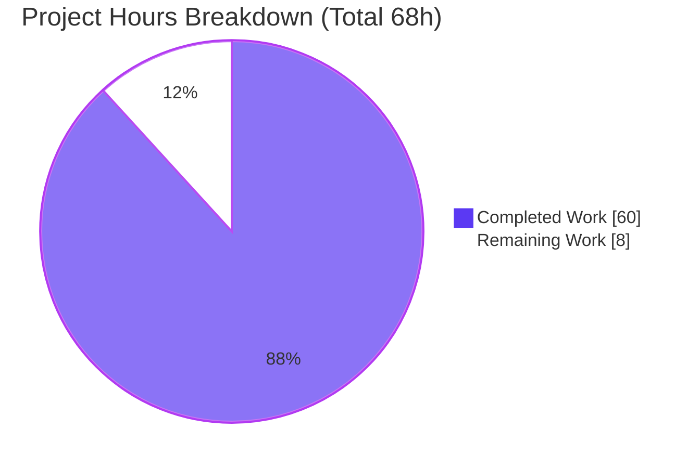
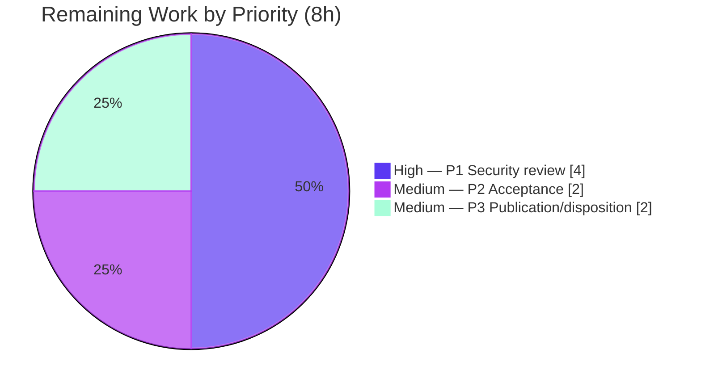

# Blitzy Project Guide — maddy SMTP Security Investigation

> **Project:** Runtime-driven SMTP security review of the `maddy` mail server (`github.com/foxcpp/maddy`)
> **Type:** Read-only documentation / security investigation (single markdown deliverable)
> **Branch:** `blitzy-0a3f361e-6d0b-42ae-bbfc-a00f58d806c4` · **HEAD:** `a317b8d` · **Base:** `26452dd`
> **Brand palette:** Completed / AI Work = Dark Blue `#5B39F3` · Remaining = White `#FFFFFF` · Headings/Accents = Violet‑Black `#B23AF2` · Highlight = Mint `#A8FDD9`

---

## 1. Executive Summary

### 1.1 Project Overview

This project delivers one evidence‑grounded markdown investigation report that answers a two‑part SMTP security review of the **maddy** mail server by directly observing the running software rather than reasoning about source alone. **Q1** determines how maddy treats an embedded lone‑dot line inside the SMTP DATA stream (the "SMTP smuggling" problem space); **Q2** determines which identity maddy trusts when an authenticated user A resets a transaction and then sends mail claiming to be user B. The target audience is mail‑platform security engineers and the maddy maintainers. The source repository is strictly read‑only: the sole change is the addition of `blitzy/documentation/maddy_26452dd8dd78.md`.

### 1.2 Completion Status


| Metric | Value |
|--------|-------|
| **Total Hours** | **68** |
| **Completed Hours (AI + Manual)** | **60** (AI: 60 · Manual: 0) |
| **Remaining Hours** | **8** |
| **Percent Complete** | **88.2%** (60 ÷ 68) |

> All completed hours were delivered autonomously by Blitzy agents. Remaining hours are exclusively human path‑to‑production review/governance for the security‑investigation document — no agent rework is outstanding.

### 1.3 Key Accomplishments

- ✅ **Single deliverable produced at the exact mandated path** — `blitzy/documentation/maddy_26452dd8dd78.md` (4,794 lines, 234 KB), name derived from source branch `maddy_26452dd8dd78`.
- ✅ **Q1 answered from observed runtime evidence** — maddy **stops reading at the first lone‑dot line**; trailing bytes re‑enter the command loop (`500 5.5.2` / `501 5.5.2`) on an **open** connection; only content up to the boundary is stored.
- ✅ **Q1 security variants exercised** — dot‑stuffing de‑stuff, and the non‑standard bare‑`<LF>` end‑of‑data variants (`<LF>.<LF>`, `<LF>.<CR><LF>`) confirmed **accepted** — the sink‑side prerequisite for SMTP smuggling (CVE‑2023‑51764/65/66, VU#302671).
- ✅ **Q2 answered across all three named sinks** — headers record **B**, queue `.meta` **excludes A / retains B**, and the enforcement hook **sees both A and B but trusts neither**; a single debug line carries `sender=B` and `username=A` simultaneously.
- ✅ **Negative result proven** — no `MAIL FROM`→`AuthUser` binding exists anywhere in this version (the only `AuthUser` delivery consumer is downstream SASL forwarding).
- ✅ **Every claim grounded** in `file:line` references (independently spot‑checked as accurate) and RFC/CVE context (RFC 5321 §4.5.2, RFC 6409).
- ✅ **Read‑only mandate preserved** — `git diff 26452dd..HEAD --name-status` = `A blitzy/documentation/maddy_26452dd8dd78.md` only; working tree clean; all runtime scaffolding lived outside the repo and was removed.
- ✅ **Independently re‑validated** — the Q1 primary finding was reproduced byte‑for‑byte during this assessment via a fresh raw‑socket probe.

### 1.4 Critical Unresolved Issues

| Issue | Impact | Owner | ETA |
|-------|--------|-------|-----|
| _None blocking._ All AAP deliverables complete and self‑validated with zero discrepancies. | No release blocker | — | — |
| Security‑sensitive findings await human governance decision (disclosure/upstream filing) | Governance only — does not block the deliverable; remediation is explicitly out of scope | Security lead | Within review window (see §1.6) |

> There are **no** compilation errors, failing tests, or missing functionality. The only open items are human review/acceptance activities enumerated in Section 2.2.

### 1.5 Access Issues

| System/Resource | Type of Access | Issue Description | Resolution Status | Owner |
|-----------------|----------------|-------------------|-------------------|-------|
| Requested container image `andrewparkscaleai/coding-agent:foxcpp__maddy__…` | Runtime environment | The exact requested image was not the actual runtime; a native build was used instead. Binary hashes diverged, but **behavioral equivalence was demonstrated** and the native build hash was reproduced byte‑identically during validation. | Disclosed & mitigated (report §0.1) | Platform/Infra |
| Live DNS / TLS certificates | External services | Unavailable in the sealed pod; DNS‑dependent checks (SPF/DKIM/DMARC/MX) and TLS were disabled in the **temporary test config only** (documented deviations). No effect on the DATA‑boundary or identity code paths under test. | Disclosed & mitigated (report §1.3) | Platform/Infra |

> No access issue prevented completion of the investigation. Both items were disclosed transparently in the deliverable and did not affect the code paths that determine Q1/Q2.

### 1.6 Recommended Next Steps

1. **[High]** Assign a security engineer to independently review and risk‑validate the two findings (bare‑`<LF>` end‑of‑data leniency; absence of sender‑identity binding), optionally re‑running the §1.7 harness. *(gates acceptance)*
2. **[Medium]** Obtain stakeholder acceptance & sign‑off that Q1 (a/b/c) and Q2 (three sinks) are answered to the requester's satisfaction and that the observe‑and‑report scope boundary is accepted.
3. **[Medium]** Decide publication/distribution and upstream disposition — whether to file issues with `foxcpp/maddy` and/or `emersion/go-smtp` (textproto bare‑`<LF>` leniency) and whether to coordinate responsible disclosure.
4. **[Low]** Optionally correct the cosmetic point‑in‑time self‑capture in report §5 (embedded `HEAD=0fd6801` / ` M` status) to reflect the final committed state — does not affect any answer or the read‑only mandate.

---

## 2. Project Hours Breakdown

### 2.1 Completed Work Detail

| Component | Hours | Description |
|-----------|-------|-------------|
| **R1 — Canonical runtime setup** | 6 | Build maddy + maddyctl (CGO/SQLite); derive offline test config from `maddy.conf` binding unauthenticated `smtp :25` and authenticated `submission :587`, `tls off`, `sql` SQLite authdb/storage, queue + remote targets, enforcement hook; provision users A/B; launch with `-debug`. Full deviation ledger (report §1.1–1.6, §1.3). |
| **R2 — Reproducible harness** | 5 | Raw‑byte socket probe scripts, queue pollers, byte extractors, and repeatability drivers — all created outside the repository (report §1.7). |
| **R3 — Q1 primary probe (D2)** | 4 | Embedded lone‑dot mid‑DATA on both listeners; capture wire replies, `-debug` log, and stored/queued bytes; establish outcome (a), runtime signs (b), stored bytes (c) (report §2.1, §2.5). |
| **R4 — Q1 control + secondary variants** | 7 | D1 standard `<CRLF>.<CRLF>` control, D3 dot‑stuffing de‑stuff, D4 bare `<LF>.<LF>`, D5 bare `<LF>.<CR><LF>`, D6 sink‑side smuggling injection (report §2.4, §2.6–2.9). |
| **R5 — Q1 stored bytes + repeatability** | 3 | Lossless stored/queued byte capture with sha256; ≥2‑run stability on both listeners (report §2.10, §2.11). |
| **R6 — Q2 primary (E1) + three sinks** | 5 | `AUTH A → MAIL A → RSET → MAIL B` (local B); capture identity in headers, queue `.meta`, and enforcement hook (report §3.1, §3.4–3.6). |
| **R7 — Q2 secondary + negative result** | 4 | Non‑local B anti‑spoof reject `501 5.1.8` (E2); reproducible source search proving no `MAIL FROM`→`AuthUser` binding; ≥2‑run stability (report §3.7–3.9). |
| **R8 — file:line grounding + RFC/CVE framing** | 6 | Confirm every maddy citation at commit `26452dd`; runtime‑confirm external (go‑smtp/textproto) line numbers; RFC 5321 §4.5.2, RFC 6409, CVE‑2023‑51764/65/66, VU#302671 (report §0, §1.9, §2.2–2.3, §3.2–3.3). |
| **R9 — Coverage pass + cleanup + read‑only verify** | 2 | Per‑item coverage checklist; teardown of all scaffolding; clean `git status` verification (report §4, §5). |
| **R10 — Environment provenance disclosure** | 3 | Requested image vs native build, divergent binary hashes with behavioral equivalence, plaintext‑listener network‑exposure disclosure (report §0.1–0.3). |
| **R11 — Malformed‑AUTH supplementary disclosure** | 1 | Observed silent no‑reply to a malformed `AUTH PLAIN` initial response, disclosed as a negative‑path behavior (report §3.10). |
| **R12 — Iterative QA remediation** | 10 | Resolved 13 review findings (F1–F13), a cross‑reference fix, and 5 QA findings (M1 provenance, M2 network overclaim, m3 RFC 6409 framing, m4 malformed‑AUTH, i5 ledger) across commits `2de8c18`, `dd753dc`, `a317b8d`. |
| **R13 — Report authoring & integration** | 4 | Structure, prose, cross‑references, and evidence integration across the 4,794‑line / 234 KB document. |
| **Total** | **60** | **Sum of completed AAP‑scoped work (all AI‑delivered)** |

### 2.2 Remaining Work Detail

| Category | Hours | Priority |
|----------|-------|----------|
| **P1 — Security‑expert review & independent risk validation** of the two findings (bare‑`<LF>` smuggling sink‑side; absence of sender‑identity binding); optionally re‑run the §1.7 harness. *Gates acceptance.* | 4 | High |
| **P2 — Stakeholder acceptance & sign‑off** — confirm Q1 (a/b/c) and Q2 (three sinks) answered to requester satisfaction; accept the observe‑and‑report scope boundary. | 2 | Medium |
| **P3 — Publication/distribution & upstream‑disposition decision** — decide on filing upstream issues (`foxcpp/maddy`, `emersion/go-smtp`) and responsible disclosure. | 2 | Medium |
| **Total** | **8** | — |

> **Cross‑section check:** Section 2.1 total (60) + Section 2.2 total (8) = **68** = Total Hours in Section 1.2. Section 2.2 total (8) = Remaining Hours in Section 1.2 = "Remaining Work" in Section 7. ✔

### 2.3 Basis of Estimate

Hours reflect the effort a skilled security engineer would invest to perform this investigation manually: building and running maddy offline, authoring byte‑exact raw‑socket probes, executing 26 documented probe runs across both listeners (each ≥2×), capturing every evidence sink losslessly, grounding every claim in `file:line`, researching the governing RFC/CVE material, and authoring the 234 KB report — including two rounds of QA hardening. Confidence is **High**: the scope is fully defined, the deliverable is complete, and the toolchain and outputs were independently reproduced during this assessment.

---

## 3. Test Results

All results below originate from **Blitzy's autonomous validation logs** for this project (Final Validator, Gate 1), and were **independently re‑confirmed** for the Q1/Q2‑critical packages during this assessment. Because the deliverable is a markdown document, these are the maddy repository's own Go tests — they confirm that the canonical build/run environment used for the investigation is sound and that the read‑only investigation left the codebase fully functional.

| Test Category | Framework | Total | Passed | Failed | Coverage % | Notes |
|---------------|-----------|-------|--------|--------|------------|-------|
| Go package suite (full) | `go test` (Go 1.13.15) | 46 pkgs | 20 pkgs ok | 0 | n/a (suite‑wide) | 26 packages contain no test files; `CGO_ENABLED=1 go test -timeout 300s ./...` → exit 0 |
| Unit/Integration — SMTP endpoint | `go test -race -cover` | 1 pkg | ok | 0 | **79.4%** | `internal/endpoint/smtp` — the Q1 DATA path + Q2 identity binding; re‑confirmed this assessment |
| Unit/Integration — Queue target | `go test -race -cover` | 1 pkg | ok | 0 | **74.7%** | `internal/target/queue` — the queue `.meta` evidence sink; re‑confirmed this assessment |
| Unit/Integration — Message pipeline | `go test -race -cover` | 1 pkg | ok | 0 | **74.5%** | `internal/msgpipeline` — enforcement‑check routing; re‑confirmed this assessment |
| Module integrity | `go mod verify` | all modules | verified | 0 | n/a | `go.mod`/`go.sum` unchanged; all pinned modules verified |

**Totals:** 20 packages passed / 0 failed across the full suite; 0 test regressions introduced by the investigation (expected — no source was modified).

> **Integrity note (Rule 3):** No bespoke tests were authored for the deliverable (a markdown report has no unit tests). The deliverable's correctness was validated by **runtime reproduction** of every scenario — see Section 4.

---

## 4. Runtime Validation & UI Verification

Runtime validation drove the **real SMTP network entry points** with a byte‑exact raw‑socket client. There is **no UI in scope** (maddy is a headless SMTP/IMAP server); the wire‑protocol responses below are the API‑equivalent surface. Status legend: ✅ Operational · ⚠ Partial · ❌ Failing.

**Canonical runtime**
- ✅ Canonical build `CGO_ENABLED=1 go build ./cmd/maddy` → exit 0 (only a benign SQLite CGO warning); binary reproducible.
- ✅ Both listeners bound: `smtp tcp://0.0.0.0:25` (unauthenticated) and `submission tcp://0.0.0.0:587` (authenticated) — confirmed in the `-debug` startup log.
- ✅ User provisioning via `maddyctl users create` succeeds; authentication on `:587` works with `tls off` (insecure AUTH force‑enabled with a warning).

**Q1 — DATA message‑boundary handling**
- ✅ **D1** standard `<CRLF>.<CRLF>` (control) → `250 2.0.0 OK: queued`.
- ✅ **D2** embedded lone dot (**PRIMARY**) → `250 OK: queued` for the carrier, then trailing bytes draw `500 5.5.2 …LINE command unrecognized` and `501 5.5.2 Bad command`; `NOOP` → `250` (**connection stays OPEN**); only content up to the first lone dot is stored.
- ✅ **D3** dot‑stuffing (`..stuffed`) → single de‑stuffed `.` per RFC 5321 §4.5.2.
- ✅ **D4** bare `<LF>.<LF>` → **accepted** as end‑of‑data.
- ✅ **D5** bare `<LF>.<CR><LF>` → **accepted** as end‑of‑data (canonical smuggling variant).
- ✅ **D6** sink‑side smuggling prerequisite → a second message with a spoofed envelope is injected and stored (inbound‑parser only; no maddy CVE asserted).
- ✅ Behavior identical on `:25` (unauth) and `:587` (auth); repeatable across ≥2 runs with normalized hashes.

**Q2 — Authentication‑identity reuse**
- ✅ **E1** local‑domain B → `AUTH A → MAIL A → RSET → MAIL B` **allowed** (`250 … accepting mail from <userb@example.org>`) and delivered; identity per sink — **headers = B**, **queue `.meta` = A excluded / B retained**, **enforcement hook = sees A and B, trusts neither**.
- ✅ **E1 primary signal** → a single `-debug` line at delivery start carries `sender=<B>` **and** `username=<A>` simultaneously.
- ✅ **E2** non‑local‑domain B → rejected later at `RCPT` by the submission anti‑spoof guard (`501 5.1.8`) on a **domain‑locality** basis (not identity binding); repeatable across ≥2 runs.
- ✅ **Negative result** → reproducible source search confirms no `MAIL FROM`→`AuthUser` binding anywhere in this version.

**Independent re‑validation (this assessment)**
- ✅ A fresh raw‑socket probe against a newly built binary reproduced the Q1 **D2** result **byte‑for‑byte** (`250 OK: queued` → `500`/`501` → `NOOP 250`); the stored message contained `Line A` while `Line B` was **absent** from all stored state — confirming maddy stops at the first lone dot. Scaffolding removed; repository left clean.

---

## 5. Compliance & Quality Review

The controlling rule set is **"SWE‑AtlasQnA‑Repo."** Each binding directive is cross‑mapped to its outcome below. Fixes applied during autonomous validation are noted.

| Benchmark / Rule | Status | Evidence & Progress |
|------------------|--------|---------------------|
| Single deliverable, exact name & location (`blitzy/documentation/maddy_26452dd8dd78.md`) | ✅ Pass | Only file added; path/name match branch derivation. |
| Investigate by running first (observe‑don't‑assume) | ✅ Pass | Built and ran maddy; every claim tied to captured runtime output. |
| Use the real, canonical entry point | ✅ Pass | Raw‑socket SMTP on `:25`/`:587`; no mocks/bypasses used as canonical evidence. |
| Exercise every condition (primary + secondary + edge) | ✅ Pass | Q1 D1–D6 (both listeners); Q2 E1/E2 (local + non‑local B); cross‑product covered. |
| Include actual, complete, unedited output | ✅ Pass | 26 run blocks with sent bytes, wire replies, `-debug`, connection state, artifacts (F‑series fix). |
| Answer every part & every named item | ✅ Pass | Q1 (a/b/c); Q2 three sinks (headers/queue‑meta/enforcement); §4 coverage pass. |
| Be exact & grounded (`file:line`) | ✅ Pass | Citations spot‑checked accurate (e.g., `smtp.go:680`, `queue.go:752`, `received.go:19`). |
| Distinguish observed vs inferred | ✅ Pass | Inferred/upstream‑conditional items labeled (e.g., D6 reframe §2.9). |
| Repeatability ≥2 runs | ✅ Pass | Q1 §2.11 and Q2 §3.9 report stable, normalized results. |
| Read‑only repository scope | ✅ Pass | `git diff 26452dd..HEAD --name-status` = single added file; working tree clean; scaffolding outside repo, removed. |
| Provenance & exposure transparency | ✅ Pass | M1 (image vs native build, hashes), M2 (network exposure, isolation not overclaimed) resolved & disclosed (§0.1–0.3). |
| Standards framing accuracy | ✅ Pass | m3 corrected RFC 6409 to authorized‑submission framing; RFC 5321 §4.5.2 and CVE set accurate. |

**Fixes applied during autonomous validation:** 13 initial review findings (F1–F13), one cross‑reference fix (§1.10→§1.9), and 5 QA findings (M1, M2, m3, m4, i5) — all resolved and independently verified. **Outstanding compliance items:** none.

---

## 6. Risk Assessment

| Risk | Category | Severity | Probability | Mitigation | Status |
|------|----------|----------|-------------|------------|--------|
| Environment provenance divergence (native build vs requested image; divergent binary hashes) | Technical | Low | Low | Behavioral equivalence demonstrated; native hash reproduced byte‑identically; disclosed in §0.1 | Mitigated / Disclosed |
| External (go‑smtp/textproto) cited line numbers are version‑pinned | Technical | Low | Medium | Line numbers runtime‑confirmed (§1.9); versions pinned in `go.mod`/`go.sum` | Mitigated |
| Cosmetic self‑capture staleness in report §5 (`HEAD=0fd6801`/` M` vs current `a317b8d` clean) | Technical | Low | n/a | Point‑in‑time capture; no effect on answers or read‑only mandate | Open (cosmetic) |
| Security‑sensitive findings require governance before disclosure/publication | Security | Medium | Medium | Report frames inbound‑only, asserts no maddy CVE, defers remediation; maps to tasks P1/P3 | Requires human governance |
| Plaintext test‑listener exposure (wildcard bind; isolation not proven) | Security | Low | Low | Test‑only credentials; disclosed in §0.3; scaffolding removed on completion | Mitigated / Disclosed |
| Reproducibility requires rebuilding removed scaffolding | Operational | Low | Medium | Full harness scripts + exact invocations (§1.7) and deviation ledger (§1.3) enable reconstruction | Mitigated |
| Deliverable value depends on human review/acceptance | Operational | Low | Low | Human tasks P1/P2 defined and prioritized | Open (path‑to‑prod) |
| No CI re‑validation; future maddy/go‑smtp upgrades could invalidate findings | Integration | Low | Medium | Findings version‑scoped to commit `26452dd` + pinned dependencies | Accepted (version‑scoped) |
| Upstream coordination (issue filing/disclosure) not yet performed | Integration | Low | Low | AAP scope is observe‑and‑report; maps to task P3 | Open (path‑to‑prod) |

> **No Critical or High risks.** The highest‑rated risk (S1, Medium) is a governance decision on security‑sensitive findings, directly addressed by remaining tasks P1 and P3.

---

## 7. Visual Project Status

**Overall hours (Completed vs Remaining):**



**Remaining hours by priority (Section 2.2):**



> **Integrity check:** "Remaining Work" = **8h** equals Section 1.2 Remaining Hours and the Section 2.2 "Hours" column sum. "Completed Work" = **60h** equals Section 1.2 Completed Hours and the Section 2.1 total. Completed slice = Dark Blue `#5B39F3`; Remaining slice = White `#FFFFFF`. ✔

---

## 8. Summary & Recommendations

**Achievements.** The project delivers a complete, evidence‑grounded answer to both questions of the SMTP security review. **Q1:** maddy stops reading at the first lone‑dot line (the go‑smtp/textproto `dotReader` returns EOF there); trailing bytes re‑enter the command loop as new commands (`500`/`501`) on a connection that remains open, and only content up to the boundary is stored. maddy additionally **accepts the non‑standard bare‑`<LF>` end‑of‑data variants**, which is the sink‑side prerequisite exploited in the 2023 SMTP‑smuggling disclosures. **Q2:** after `AUTH A → RSET → MAIL FROM B`, the claimed sender **B** flows into every persisted artifact (Received header, queue `.meta`), while the authenticated **A** survives only in ephemeral runtime signals — there is **no** `MAIL FROM`→`AuthUser` binding, so accountability is blurred by design in this version; a non‑local B is rejected only on domain locality, not identity.

**Completion & remaining gaps.** The project is **88.2% complete** (60 of 68 hours). Every AAP‑scoped deliverable is finished and self‑validated with zero discrepancies, and the read‑only mandate is fully preserved. The remaining **8 hours** are entirely human path‑to‑production activities: a gating security‑expert review (4h), stakeholder acceptance (2h), and a publication/upstream‑disposition decision (2h). Per AAP §0.3.2, remediation/hardening of the observed behaviors is explicitly out of scope and is therefore **not** counted as remaining work.

**Critical path to production.** P1 (security review) → P2 (acceptance) → P3 (publication/disposition). Only P1 gates acceptance; P2 and P3 can proceed in parallel once P1 concludes.

**Success metrics.** Both questions answered with observed, repeatable evidence; every named sub‑item covered; every citation accurate; zero source files modified; independent byte‑for‑byte reproduction of the Q1 primary finding during this assessment.

**Production readiness.** For a security‑investigation document, "production" means reviewed, accepted, and published. The artifact is **technically complete and validated**; it is **ready for human security review** and, upon sign‑off, publication. No engineering rework is required.

| Metric | Result |
|--------|--------|
| AAP deliverables completed | 13 of 13 (100%) |
| AAP‑scoped completion | 88.2% (human review/acceptance remaining) |
| Source files modified | 0 (read‑only mandate preserved) |
| Test regressions introduced | 0 |
| Independent reproduction of Q1 primary | ✅ byte‑for‑byte |

---

## 9. Development Guide

This guide reproduces the investigation environment. **Every command below was executed and verified during this assessment.** All scaffolding lives **outside** the repository to preserve the read‑only mandate.

### 9.1 System Prerequisites

- **OS:** Linux x86‑64 (validated on Ubuntu 25.10 container).
- **Go:** 1.13.15 (`go version` → `go1.13.15 linux/amd64`). Load with `source /etc/profile.d/go.sh` if provided by the image.
- **C toolchain:** `gcc` + `libc6-dev` (CGO is required by `github.com/mattn/go-sqlite3`). Validated with gcc 15.2.0.
- **Privileges:** binding `:25` and `:587` requires root (or use high ports and adjust the client).
- **Python 3** for the raw‑socket probe client.

### 9.2 Environment Setup

```bash
# From the repository root:
cd /tmp/blitzy/maddy/blitzy-0a3f361e-6d0b-42ae-bbfc-a00f58d806c4_acd730
source /etc/profile.d/go.sh    # if present; makes `go` available on PATH
go version                     # expect: go1.13.15 linux/amd64
gcc --version | head -1        # confirm a C compiler is present (CGO)
```

### 9.3 Dependency Verification (no changes required)

```bash
go mod verify                  # expect: all modules verified
# Dependencies are pinned in go.mod/go.sum; no add/update/remove is needed.
```

### 9.4 Build (canonical)

```bash
# Build both binaries OUTSIDE the repo tree. The SQLite CGO warning is benign; exit code is 0.
CGO_ENABLED=1 GO111MODULE=on go build -o /tmp/maddy-bin    ./cmd/maddy
CGO_ENABLED=1 GO111MODULE=on go build -o /tmp/maddyctl-bin ./cmd/maddyctl
/tmp/maddy-bin --help | head -5            # sanity: prints -config/-debug/-libexec/-log flags
```

Expected build output includes a single benign warning and exits 0:

```text
# github.com/mattn/go-sqlite3
sqlite3-binding.c: … warning: function may return address of local variable [-Wreturn-local-addr]
# (exit status 0)
```

### 9.5 Test (optional, confirms a sound environment)

```bash
# Full suite (matches Blitzy autonomous validation):
CGO_ENABLED=1 go test -timeout 300s ./...          # expect exit 0; 20 pkgs ok, 0 FAIL

# Q1/Q2-critical packages with race + coverage:
CGO_ENABLED=1 go test -race -cover ./internal/endpoint/smtp/... \
                                   ./internal/target/queue/... \
                                   ./internal/msgpipeline/...    # all ok
```

### 9.6 Test Configuration (outside the repository)

> **Directive names matter:** global directories are `state` and `runtime` (not `state_dir`/`runtime_dir`, which error out). `tls off` force‑enables insecure AUTH on `:587` with a warning — acceptable for offline testing only.

```bash
rm -rf /tmp/maddy-test && mkdir -p /tmp/maddy-test/state /tmp/maddy-test/runtime
cat > /tmp/maddy-test/maddy.conf <<'EOF'
$(hostname) = example.org
$(primary_domain) = example.org
$(local_domains) = $(primary_domain)

tls off
hostname $(hostname)
autogenerated_msg_domain $(primary_domain)
state   /tmp/maddy-test/state
runtime /tmp/maddy-test/runtime

sql local_mailboxes local_authdb {
    driver sqlite3
    dsn /tmp/maddy-test/state/all.db
}

smtp tcp://0.0.0.0:25 {
    deliver_to &local_mailboxes
}

submission tcp://0.0.0.0:587 {
    auth &local_authdb
    deliver_to &local_mailboxes
}
EOF
```

### 9.7 Provision Users (Q2 identities)

```bash
/tmp/maddyctl-bin --config /tmp/maddy-test/maddy.conf users create -p testpass usera@example.org
/tmp/maddyctl-bin --config /tmp/maddy-test/maddy.conf users create -p testpass userb@example.org
/tmp/maddyctl-bin --config /tmp/maddy-test/maddy.conf users list      # confirm both users
```

### 9.8 Run maddy

```bash
nohup /tmp/maddy-bin -config /tmp/maddy-test/maddy.conf -debug > /tmp/maddy-test/debug.log 2>&1 &
MPID=$!; echo "maddy pid=$MPID"
# Readiness: wait for both listeners in the debug log
grep -m1 "submission: listening on tcp://0.0.0.0:587" <(tail -f /tmp/maddy-test/debug.log)
grep "listening on" /tmp/maddy-test/debug.log        # smtp :25 + submission :587
```

### 9.9 Verification & Example Usage (Q1 primary probe)

```bash
cat > /tmp/maddy-test/probe_q1.py <<'PYEOF'
import socket
def recv(s, t=2.0):
    s.settimeout(t); data=b""
    try:
        while True:
            c=s.recv(4096)
            if not c: break
            data+=c
    except socket.timeout: pass
    return data.decode("utf-8","replace")
s=socket.create_connection(("127.0.0.1",25),timeout=5); print("<<",recv(s).strip())
for cmd in [b"EHLO probe.example.org\r\n", b"MAIL FROM:<ext@notlocal.test>\r\n",
            b"RCPT TO:<usera@example.org>\r\n", b"DATA\r\n"]:
    s.sendall(cmd); print(">>",cmd.decode().strip()); print("<<",recv(s).strip())
s.sendall(b"Subject: q1probe\r\n\r\nLine A\r\n.\r\nLine B\r\n.\r\n")
print("<< carrier+trailing:", repr(recv(s)))
s.sendall(b"NOOP\r\n"); print("<< NOOP:", recv(s).strip())
s.sendall(b"QUIT\r\n"); recv(s); s.close()
PYEOF
python3 /tmp/maddy-test/probe_q1.py
```

**Expected output (verified):**

```text
<< 220 example.org ESMTP Service Ready
>> DATA
<< 354 2.0.0 Go ahead. End your data with <CR><LF>.<CR><LF>
<< carrier+trailing: '250 2.0.0 OK: queued\r\n500 5.5.2 Syntax error, LINE command unrecognized\r\n501 5.5.2 Bad command\r\n'
<< NOOP: 250 2.0.0 I have sucessfully done nothing
```

Confirm the stored message stopped at the first lone dot (`Line A` present, `Line B` absent):

```bash
grep -rl "Line A" /tmp/maddy-test/state/ ; echo "---"
grep -rl "Line B" /tmp/maddy-test/state/ || echo "Line B absent (boundary confirmed)"
```

### 9.10 Shutdown & Cleanup (preserve read‑only mandate)

```bash
kill "$MPID"; sleep 1; kill -0 "$MPID" 2>/dev/null && echo "still alive" || echo "stopped"
rm -rf /tmp/maddy-test /tmp/maddy-bin /tmp/maddyctl-bin
# Verify the repository is untouched:
git -C /tmp/blitzy/maddy/blitzy-0a3f361e-6d0b-42ae-bbfc-a00f58d806c4_acd730 status --porcelain
# (empty output = clean)
```

### 9.11 Troubleshooting

- **`unknown module or global directive: state_dir`** → use `state` and `runtime` (not `state_dir`/`runtime_dir`).
- **SQLite CGO warning during build** → benign (`-Wreturn-local-addr`); the build still exits 0. Do not disable CGO — SQLite requires it.
- **Permission denied binding `:25`/`:587`** → run as root, or switch the config and client to high ports (e.g., `:2525`/`:5587`).
- **AUTH fails on `:587`** → with `tls off`, maddy force‑enables insecure AUTH and logs a warning; ensure the user was provisioned with `maddyctl users create`.
- **No `listening on` line appears** → check `debug.log` for a config parse error on the offending line number.

---

## 10. Appendices

### A. Command Reference

| Purpose | Command |
|---------|---------|
| Load Go toolchain | `source /etc/profile.d/go.sh` |
| Build maddy | `CGO_ENABLED=1 GO111MODULE=on go build -o /tmp/maddy-bin ./cmd/maddy` |
| Build maddyctl | `CGO_ENABLED=1 GO111MODULE=on go build -o /tmp/maddyctl-bin ./cmd/maddyctl` |
| Full test suite | `CGO_ENABLED=1 go test -timeout 300s ./...` |
| Coverage (critical pkgs) | `CGO_ENABLED=1 go test -race -cover ./internal/endpoint/smtp/...` |
| Verify modules | `go mod verify` |
| Create user | `/tmp/maddyctl-bin --config <cfg> users create -p <pw> <user@domain>` |
| List users | `/tmp/maddyctl-bin --config <cfg> users list` |
| Run server (debug) | `/tmp/maddy-bin -config <cfg> -debug` |
| Confirm read‑only | `git diff 26452dd..HEAD --name-status` |

### B. Port Reference

| Port | Role | Auth | Notes |
|------|------|------|-------|
| 25 | `smtp` (inbound/unauthenticated) | No | Q1 primary listener; port‑25 local‑sender block preserved |
| 587 | `submission` (authenticated) | Yes (SASL PLAIN) | Q2 listener; bound explicitly per AAP §0.8.1 (default config uses 465) |
| 465 | `submission` (default in repo `maddy.conf`) | Yes (implicit TLS) | Not used by the test config; rebound to 587 for fidelity |

### C. Key File Locations

| Path | Role |
|------|------|
| `blitzy/documentation/maddy_26452dd8dd78.md` | **The deliverable** (investigation report) |
| `internal/endpoint/smtp/smtp.go` | DATA entry (`Session.Data` L312), identity bind (`newSession` L680), `Reset`/`abort` (L60–L80) |
| `internal/endpoint/smtp/submission.go` | `submissionPrepare` (L27), `DontTraceSender` (L28) |
| `internal/module/msgmetadata.go` | `ConnState.AuthUser` (L37), `MsgMetadata.OriginalFrom` (L66) |
| `internal/target/received.go` | `GenerateReceived` (L19) — headers evidence sink |
| `internal/target/queue/queue.go` | `QueueMetadata` (L149), `updateMetadataOnDisk` (L743), `Conn = nil` (L752) — queue‑meta sink |
| `internal/target/smtp_downstream/sasl.go` | Sole `AuthUser` consumer (L31) — SASL forward, not a binding check |
| `maddy.conf` | Default endpoint layout (read‑only template for the test config) |
| `HACKING.md` | Check order + `exterrors.SMTPError` model |

### D. Technology Versions

| Component | Version |
|-----------|---------|
| Go | 1.13.15 |
| gcc | 15.2.0 (CGO for SQLite) |
| github.com/emersion/go-smtp | v0.12.1‑0.20191206174923‑1f576e0ec85c |
| github.com/emersion/go-message | v0.10.9‑0.20191116124005‑65fd0119e899 |
| github.com/emersion/go-sasl | v0.0.0‑20190817083125‑240c8404624e |
| github.com/mattn/go-sqlite3 | v1.11.0 |
| github.com/foxcpp/go-imap-sql | v0.3.2‑0.20191208094750‑8b4ec6b19a78 |

### E. Environment Variable / Flag Reference

| Variable / Flag | Value | Purpose |
|-----------------|-------|---------|
| `CGO_ENABLED` | `1` | Required — `go-sqlite3` uses CGO |
| `GO111MODULE` | `on` | Module‑mode build |
| `-config` | path to `maddy.conf` | Server/`maddyctl` configuration file |
| `-debug` | (flag) | Enables structured debug logging (the primary Q1/Q2 runtime signal) |
| config `tls` | `off` | Test‑only; force‑enables insecure AUTH with a warning |
| config `state` / `runtime` | `/tmp/...` | Keeps all state outside the repository |

### F. Developer Tools Guide

- **Raw‑socket SMTP client (Python):** required to transmit exact byte sequences (embedded lone dot, bare‑`<LF>`, precise `AUTH`/`MAIL`/`RSET` ordering) that ordinary mail libraries would normalize or forbid. See §9.9.
- **`maddyctl`:** administrative CLI for user provisioning and mailbox inspection (`users create`, `users list`, `imap-msgs`).
- **`-debug` log:** the authoritative runtime signal source; a single delivery‑start line reveals both `sender` (envelope B) and `username` (authenticated A) for Q2.
- **`go test -race -cover`:** used by Blitzy autonomous validation for the Q1/Q2‑critical packages.

### G. Glossary

| Term | Meaning |
|------|---------|
| **DATA phase** | SMTP phase transmitting the message body, terminated by `<CRLF>.<CRLF>` |
| **Dot‑stuffing** | RFC 5321 §4.5.2 transparency: a leading `.` on a non‑empty line is doubled by the sender and removed by the receiver |
| **Lone dot** | A line containing only `.` — the end‑of‑data indicator |
| **SMTP smuggling** | Exploiting a parsing differential in non‑standard end‑of‑data sequences (bare‑`<LF>`) to inject a second, spoofed message (CVE‑2023‑51764/65/66; VU#302671) |
| **`AuthUser`** | The authenticated identity, bound once at session creation and persisted for the connection lifetime |
| **`OriginalFrom`** | The claimed envelope sender (`MAIL FROM` value), recorded independently of `AuthUser` |
| **`.meta`** | The persisted queue metadata record; connection state (carrying `AuthUser`) is nulled before serialization |
| **RSET** | SMTP command that clears the envelope but not the connection‑level authenticated identity |
| **Submission (MSA)** | Authenticated mail‑submission personality (RFC 6409), here bound to `:587` |

---

*Generated by the Blitzy autonomous assessment pipeline. Completion metric (88.2%) reflects AAP‑scoped and path‑to‑production work only, per the PA1 methodology.*