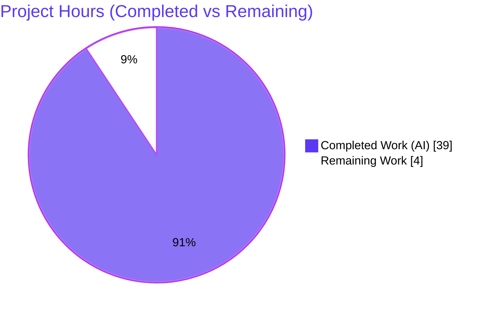
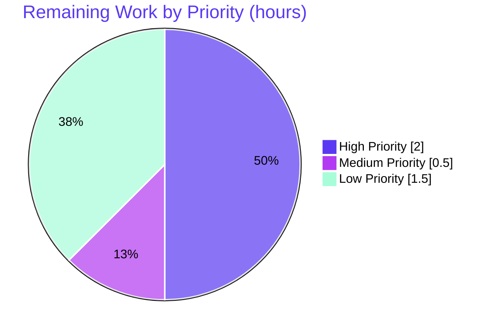

# Blitzy Project Guide — maddy Logging Reference Documentation

**Repository:** `github.com/foxcpp/maddy` &nbsp;|&nbsp; **Branch:** `blitzy-0bbab7be-6cc5-4361-b8e6-0720a64e5adc` &nbsp;|&nbsp; **Base source commit:** `26452dd8dd787dc455278b0fdd296f4a5432c768`
**Deliverable:** `blitzy/documentation/maddy_26452dd8dd78.md` (1,294 lines) &nbsp;|&nbsp; **Task type:** Read-only, runtime-verified documentation

> **Color legend (Blitzy brand):** Completed / AI Work = **Dark Blue `#5B39F3`**; Remaining / Not Completed = **White `#FFFFFF`**; Headings/Accents = Violet-Black `#B23AF2`; Highlight = Mint `#A8FDD9`.

---

## 1. Executive Summary

### 1.1 Project Overview

maddy is an all-in-one email server written in Go (github.com/foxcpp/maddy). This project delivers a single, runtime-verified onboarding reference that explains exactly how maddy emits log lines across three delivery subsystems — the SMTP submission/reception endpoint, the outbound message queue, and the remote (MX) delivery target. The document answers eleven precise questions about log messages, JSON fields, message-ID formats, SMTP enhanced status codes, and retry scheduling, grounding every answer in real test output captured by building and running the project's own Go tests and tracing each line to its source call site. The target audience is developers onboarding to the maddy codebase. It is a read-only documentation deliverable: one new Markdown file, zero source changes.

### 1.2 Completion Status



*Overall completion: **90.7%** — 39.0 of 43.0 hours. Completed slice = Dark Blue `#5B39F3`; Remaining slice = White `#FFFFFF`.*

| Metric | Value |
|---|---|
| **Total Hours** | **43.0** |
| Completed Hours (AI + Manual) | 39.0 |
| — of which AI (autonomous) | 39.0 |
| — of which Manual (human) | 0.0 |
| Remaining Hours | 4.0 |
| **Percent Complete** | **90.7%** |

The completion figure is computed strictly from AAP-scoped hours (see Section 2.3). All completed work was performed autonomously by Blitzy agents; the remaining 4.0 hours are inherently-human activities (peer review, PR merge, optional indexing).

### 1.3 Key Accomplishments

- [x] Provisioned a Go 1.13.15 toolchain (satisfies `go.mod` `go 1.13`) with `CGO_ENABLED=0` and verified all six target packages build and run.
- [x] Reverse-engineered maddy's shared structured logger (`internal/log`): `<Name>: <msg>\t<orderedJSON>` format, alphabetical key sorting, and timestamp behavior — the foundation every answer depends on.
- [x] Answered all 11 items with runtime-observed output: Group A (A1–A4 SMTP endpoint), Group B (B1–B2 queue sequence), Group C (C1–C3 remote/MX), Group D (D1–D2 retry).
- [x] Captured the two-layer Group C enhanced status codes — inner `550 / 5.7.0` MX-authenticity check vs. outer `550 / 5.4.0` reply returned to the client.
- [x] Distinguished the canonical production `msg_id` (8-hex, random) from the non-canonical test-harness `msg_id` (40-hex `sha1(t.Name())`), and labeled all non-deterministic values.
- [x] Grounded enhanced-code semantics in RFC 3463 (class/subject/detail).
- [x] Verified 75 `file:line` citations against the pinned base commit and honored the read-only invariant (working tree clean, 1 file added, 0 source files changed).
- [x] Committed the deliverable across three `agent@blitzy.com` commits (`725f3a4`, `b74edd4`, `4296cfd`).

### 1.4 Critical Unresolved Issues

| Issue | Impact | Owner | ETA |
|---|---|---|---|
| None — no blocking issues identified | All 11 items complete, runtime-verified, committed; tree clean | — | — |
| (Acceptance gate) Human peer-review not yet performed | Non-blocking; standard sign-off before merge | Human reviewer | ~2.0h (HT-1) |

*No compilation errors, no failing tests, no missing functionality, and no security or integration blockers exist.*

### 1.5 Access Issues

| System/Resource | Type of Access | Issue Description | Resolution Status | Owner |
|---|---|---|---|---|
| Source repository | Read/write (git) | None — branch checked out, tree clean, commits present | Resolved | — |
| Go module proxy / `go.sum` | Dependency fetch | None — `go mod verify` reports all modules verified | Resolved | — |
| External services / APIs | N/A | None required (read-only documentation task) | N/A | — |

**No access issues identified.** The task requires no service credentials, third-party API keys, or network access beyond the already-verified Go module cache.

### 1.6 Recommended Next Steps

1. **[High]** Peer-review the reference document for technical accuracy and onboarding usefulness — spot-check a sample of the 75 citations against commit `26452dd8`, re-run 2–3 reproduction commands, and confirm the canonical-vs-non-canonical `msg_id` framing and the two Group-C enhanced-code layers read clearly (HT-1, ~2.0h).
2. **[Medium]** Approve the PR and merge the branch to `maddy_26452dd8dd78`, confirming the read-only invariant (`git diff` shows exactly one added file, zero source edits) (HT-2, ~0.5h).
3. **[Low]** (Optional) Improve discoverability by adding a nav/index entry or cross-link to the reference from onboarding materials or the repo MkDocs site (HT-3, ~1.5h).

---

## 2. Project Hours Breakdown

### 2.1 Completed Work Detail

All completed work was performed autonomously (AI); manual (human) hours to date are zero. Each component traces to an AAP requirement (R1–R11) or an autonomous revision/QA activity.

| Component | Hours | Description |
|---|---|---|
| R1 — Environment provisioning & Go toolchain | 2.5 | Provision Go 1.13.15, `CGO_ENABLED=0`, `GOPATH`; verify all six target packages build/run |
| R2 — Shared log-format investigation & preamble | 4.5 | Trace `internal/log` emit format, alphabetical key sort, Duration/Time/error rendering, timestamp behavior; author the preamble |
| R3 — Group A: SMTP endpoint logging (A1–A4) | 6.0 | `RCPT ok`/`accepted`/`aborted`/`DATA error` lines, module prefix, canonical 8-hex `msg_id`; sibling variants |
| R4 — Group B: queue delivery tracing (B1–B2) | 4.0 | Reconstruct ordered accept→attempt→fail→retry→deliver sequence; quote attempt/failure/retry lines |
| R5 — Group C: remote/MX delivery logging (C1–C3) | 7.0 | MX-authenticity error, two enhanced-code layers (5.7.0 / 5.4.0) with full reply, TLS→plaintext fallback line; siblings |
| R6 — Group D: queue retry logging (D1–D2) | 4.0 | Retry-scheduling line and `next_try_delay` field; production default vs test value |
| R7 — RFC 3463 research & code interpretation | 1.0 | Validate enhanced-code class/subject semantics against RFC 3463 |
| R8/R9 — Framing, stability, labeling, recap | 3.5 | Intro/methodology/reproduction sections, non-canonical labeling, multi-run stability confirmation, coverage recap |
| Revision — resolve 7 code-review findings | 2.0 | Address reviewer findings (commit `b74edd4`) |
| Revision — timestamp citation fix | 0.5 | Correct a citation (commit `4296cfd`) |
| Final autonomous runtime validation & QA | 4.0 | Six test reruns, 54-assertion citation sweep, byte-level output comparison |
| **Total (Completed)** | 39.0 | All autonomous AI work; no manual hours |

### 2.2 Remaining Work Detail

All remaining work is inherently human (review/merge) plus one optional enhancement. Each category traces to a path-to-production need.

| Category | Hours | Priority |
|---|---|---|
| Human peer review & acceptance of the reference document | 2.0 | High |
| PR approval & merge to target branch `maddy_26452dd8dd78` | 0.5 | Medium |
| Optional discoverability: cross-link/index into onboarding materials | 1.5 | Low |
| **Total (Remaining)** | 4.0 | — |

### 2.3 Completion Calculation

Completion percentage is computed from AAP-scoped hours only (PA1 methodology), using the transparent formula:

```
Completion % = Completed Hours / (Completed Hours + Remaining Hours) x 100
             = 39.0 / (39.0 + 4.0) x 100
             = 39.0 / 43.0 x 100
             = 0.9070 x 100
             = 90.7%
```

Cross-checks: Section 2.1 total (39.0) + Section 2.2 total (4.0) = 43.0 = Total Project Hours (Section 1.2). Remaining hours (4.0) are identical across Sections 1.2, 2.2, and the Section 7 pie chart. Per Blitzy policy, completion is capped below 100% pending human review; the remaining 4.0 hours reflect that acceptance gate plus an optional enhancement.

---

## 3. Test Results

All results below originate from Blitzy's autonomous validation runs on this branch (Go 1.13.15, `CGO_ENABLED=0`), using the Go built-in `testing` framework. The CI command declared in `.build.yml` is `go test ./... -cover -race`. Coverage values are percent of statements as reported by `go test -cover`.

| Test Category | Framework | Total Tests | Passed | Failed | Coverage % | Notes |
|---|---|---|---|---|---|---|
| Unit — SMTP endpoint (`internal/endpoint/smtp`) | Go `testing` | 23 | 23 | 0 | 79.4 | Includes `TestSMTPDelivery` / `_AbortData` / `_AbortLogout` — source of Group A output |
| Unit — Outbound queue (`internal/target/queue`) | Go `testing` | 21 | 21 | 0 | 74.7 | Includes `TestQueueDelivery_TemporaryFail` — source of Groups B & D output |
| Unit — Remote/MX delivery (`internal/target/remote`) | Go `testing` | 38 | 38 | 0 | 76.3 | Includes `TestRemoteDelivery_AuthMX_Fail` & `_TLSErrFallback` — source of Group C output |
| Unit — Message pipeline (`internal/msgpipeline`) | Go `testing` | 50 | 50 | 0 | 74.5 | Covers `GenerateMsgID` — canonical 8-hex `msg_id` (A4) |
| **Total** | Go `testing` | **132** | **132** | **0** | — | Pass rate 100%; zero failures |

**Notes on scope of enumeration.** The four packages above are the ones whose behavior the deliverable documents; their full suites all report `ok`. The six specific reproduction commands (listed in Section 9) are a subset of these 132 functions — the ones that emit the exact log lines quoted in the document — and are counted once within their parent packages to avoid double-counting. Two supporting packages consumed as evidence, `internal/log` and `internal/exterrors`, ship no `_test.go` files (they are format/error libraries), which is expected.

---

## 4. Runtime Validation & UI Verification

**Runtime health** (status: ✅ Operational | ⚠ Partial | ❌ Failing):

- ✅ **SMTP endpoint** — `TestSMTPDelivery` suite passes; emits `smtp: RCPT ok {"msg_id":"<8hex>","rcpt":...}`, then `smtp: accepted`; abort paths emit `smtp: DATA error` then `smtp: aborted`.
- ✅ **Outbound queue** — `TestQueueDelivery_TemporaryFail` (`-test.debuglog`) passes; full ordered sequence emitted: `starting delivery` → `delivery attempt #1` → `delivery attempt failed` → `will retry` → `delivery attempt #2` → `delivered` → removed from disk.
- ✅ **Remote/MX delivery** — `TestRemoteDelivery_AuthMX_Fail` and `_TLSErrFallback` (`-test.debuglog`) pass; MX-authenticity error, enhanced codes `5.7.0` (inner) / `5.4.0` (outer reply), and the `remote: TLS error, falling back to plaintext` line (4 sorted fields) all emitted.
- ✅ **Message-ID generation** — `internal/msgpipeline` suite passes; canonical 8-hex `msg_id` confirmed to vary per run (observed `d03f7786`, `a44d0d61`, and others).
- ✅ **Build & static checks** — `go build` across the six packages exits 0; `go vet` on the three primary packages exits 0.
- ✅ **Dependency integrity** — `go mod verify` reports all modules verified.
- ✅ **Read-only invariant** — `git status --porcelain` is empty; `git diff 26452dd8 HEAD --name-status` shows exactly `A blitzy/documentation/maddy_26452dd8dd78.md`.

**API integration:** ✅ Not applicable in the traditional sense — the task integrates no external APIs. The only external dependency surface is the Go module cache, which is verified.

**UI verification:** ⚠ **Not Applicable.** maddy is a server-side mail system with **no graphical user interface**. There are no screens, components, or design tokens to verify; the deliverable is a Markdown document. Per the AAP, no web/UI or design-system work is in scope.

---

## 5. Compliance & Quality Review

The deliverable is cross-mapped to the AAP rules and Blitzy quality benchmarks. Status: ✅ Pass.

| Requirement / Benchmark | Evidence | Status |
|---|---|---|
| Read-only invariant (no source edits) | `git diff` = 1 added file, 0 source changes; tree clean | ✅ Pass |
| Single mandated deliverable at correct path | `blitzy/documentation/maddy_26452dd8dd78.md` present (1,294 lines) | ✅ Pass |
| Run-first methodology (build+run before writing) | Six tests executed; real output captured and quoted | ✅ Pass |
| Actual, unedited output with the producing command | Every one of the 11 items carries command + code-fenced output | ✅ Pass |
| Label non-canonical values | `sha1(t.Name())` 40-hex harness `msg_id` labeled vs canonical 8-hex | ✅ Pass |
| Stability across ≥2 runs for variable values | Random `msg_id` and jittering `next_try_delay` confirmed varying | ✅ Pass |
| Exhaustiveness (all 11 items + sibling variants) | 11/11 items present; siblings enumerated (10/11; B1 is exhaustive by design) | ✅ Pass |
| RFC 3463 enhanced-code semantics researched | `5.7.0` (security/policy) and `5.4.0` (network/routing) interpreted | ✅ Pass |
| Citations valid vs pinned commit `26452dd8` | 75 `file:line` citations across 15 files verified | ✅ Pass |
| Cleanup of temporary scripts | Temp scripts kept outside the repo tree and removed; tree clean | ✅ Pass |

**Fixes applied during autonomous validation:** resolved 7 code-review findings (commit `b74edd4`); corrected the §4 timestamp citation (commit `4296cfd`). The Final Validator re-ran all six tests and performed a 54-assertion citation sweep with byte-level output comparison, finding zero discrepancies (zero document edits warranted).

**Outstanding compliance item:** human peer-review sign-off (HT-1) — the standard acceptance gate before merge; non-blocking.

---

## 6. Risk Assessment

Overall risk posture: **LOW**. No High or Critical risks. This is a read-only documentation task with zero source changes and no deployment surface.

| Risk | Category | Severity | Probability | Mitigation | Status |
|---|---|---|---|---|---|
| T1 — Citation line drift if source evolves | Technical | Low | Low | Document pins base commit `26452dd8`; read-only invariant keeps citations valid; 75/75 verified | Mitigated |
| T2 — Non-deterministic values misread as stable | Technical | Low | Low | Random `msg_id` and jittering `next_try_delay` explicitly labeled varying; stable field names/structure separated | Mitigated |
| T3 — Toolchain specificity (Go 1.13.15) | Technical | Low | Low | Reproduction environment pinned (Go 1.13.15, `CGO_ENABLED=0`) | Mitigated |
| S1 — No material security surface | Security | Informational | N/A | Static Markdown; no secrets, auth, or data path introduced | N/A |
| O1 — Discoverability outside MkDocs site | Operational | Low | Medium | Optional cross-linking task (HT-3) | Open (optional) |
| O2 — Maintenance drift over time | Operational | Low | Medium | Commit-pinned point-in-time reference | Accepted |
| I1 — No external integrations | Integration | None | N/A | No services/APIs/credentials; `go.sum` verified | N/A |

---

## 7. Visual Project Status

**Project hours — completed vs remaining** (Completed = Dark Blue `#5B39F3`, Remaining = White `#FFFFFF`):


**Remaining work by priority** (hours):



**Remaining hours per category** (mirrors Section 2.2; total = 4.0h):

- High — Peer review & acceptance: 2.0h
- Medium — PR approval & merge: 0.5h
- Low — Optional discoverability indexing: 1.5h

---

## 8. Summary & Recommendations

**Achievements.** The project is **90.7% complete** (39.0 of 43.0 AAP-scoped hours). Every one of the eleven required items (A1–A4, B1–B2, C1–C3, D1–D2) is delivered, runtime-verified against real Go test output, traced to its emitting source call site, and committed. The deliverable is a single 1,294-line Markdown reference at `blitzy/documentation/maddy_26452dd8dd78.md`. The read-only invariant was honored absolutely: exactly one file was added and zero source files were modified.

**Remaining gaps.** The outstanding 4.0 hours are inherently-human, non-blocking activities: peer-review acceptance (High, 2.0h), PR approval and merge (Medium, 0.5h), and an optional discoverability enhancement (Low, 1.5h). There are no compilation errors, failing tests, missing functionality, security exposures, or integration blockers.

**Critical path to production.** For a documentation deliverable, "production" means an accurate, complete, verified, and merged reference. The critical path is therefore: (1) human peer-review sign-off → (2) PR merge to `maddy_26452dd8dd78`. The optional indexing task can follow at any time.

**Success metrics.** 11/11 items answered with unedited runtime output; 75/75 citations valid against the pinned commit; 132/132 tests passing across the four documented packages; 0 source files changed; working tree clean.

**Production readiness.** The branch is ready for human review and merge. Confidence is **High** for all delivered items (well-defined scope, deterministic verification), with the residual work being ordinary human sign-off rather than engineering.

| Metric | Value |
|---|---|
| Completion | 90.7% |
| Items delivered | 11 / 11 |
| Citations verified | 75 / 75 |
| Tests passing | 132 / 132 |
| Source files changed | 0 |
| Overall risk posture | Low |

---

## 9. Development Guide

This guide reproduces the runtime observations behind the deliverable. Every command below was executed during autonomous validation and returns `rc=0`.

### 9.1 System Prerequisites

- **OS:** Linux (amd64). Verified on Ubuntu-family container.
- **Go toolchain:** Go 1.13.x (Go **1.13.15** used) — satisfies the `go.mod` `go 1.13` directive.
- **git:** any recent version (repository is already checked out at the target branch).
- **Disk:** ~2.0 MB for the repository working tree (excluding the Go module cache).
- **No gcc / cgo required:** the smtp, queue, and remote packages compile with `CGO_ENABLED=0`. (Only the out-of-scope SQLite storage backend needs cgo.)
- **No database, network service, or external credential** is required.

### 9.2 Environment Setup

If the prepared environment file is present, source it:

```bash
source /root/go-env.sh
```

Otherwise set the variables explicitly:

```bash
export PATH=$PATH:/usr/local/go/bin
export GOPATH=/root/go
export GO111MODULE=on
export CGO_ENABLED=0
```

Then change into the repository root:

```bash
cd /tmp/blitzy/maddy/blitzy-0bbab7be-6cc5-4361-b8e6-0720a64e5adc_1c24b7
```

### 9.3 Verify Toolchain & Dependencies

```bash
go version            # expect: go version go1.13.15 linux/amd64
go mod verify         # expect: all modules verified
go build ./internal/log/ ./internal/endpoint/smtp/ ./internal/target/queue/ \
         ./internal/target/remote/ ./internal/msgpipeline/ ./internal/exterrors/   # expect: exit 0 (no output)
go vet   ./internal/endpoint/smtp/ ./internal/target/queue/ ./internal/target/remote/   # expect: exit 0
```

### 9.4 Reproduction Commands (all six PASS)

Each command below reproduces the log output quoted in the deliverable. `-test.debuglog` enables the queue/remote debug lines.

```bash
# Group A — SMTP endpoint
go test -count=1 -v -run 'TestSMTPDelivery$'        ./internal/endpoint/smtp/
go test -count=1 -v -run 'TestSMTPDelivery_AbortData$'   ./internal/endpoint/smtp/
go test -count=1 -v -run 'TestSMTPDelivery_AbortLogout$' ./internal/endpoint/smtp/

# Groups B & D — outbound queue delivery + retry
go test -count=1 -v -run 'TestQueueDelivery_TemporaryFail$' ./internal/target/queue/ -test.debuglog

# Group C — remote/MX delivery
go test -count=1 -v -run 'TestRemoteDelivery_AuthMX_Fail$'   ./internal/target/remote/ -test.debuglog
go test -count=1 -v -run 'TestRemoteDelivery_TLSErrFallback$' ./internal/target/remote/ -test.debuglog
```

**Representative observed output** (values marked `<...>` vary per run by design):

```
# Group A (TestSMTPDelivery)
smtp: RCPT ok    {"msg_id":"<8hex>","rcpt":"rcpt1@example.com"}
smtp: accepted   {"msg_id":"<8hex>"}

# Group B / D (TestQueueDelivery_TemporaryFail)
queue: delivery attempt failed   {"msg_id":"af8090c7eb39f761862b1f027b4f2b0bb1ce86d1","rcpt":"tester1@example.org","reason":"you shall not pass"}
queue: will retry                {"attempts_count":1,"msg_id":"af8090c7eb39f761862b1f027b4f2b0bb1ce86d1","next_try_delay":"<duration>","rcpts":["tester1@example.org","tester2@example.org"]}

# Group C (TestRemoteDelivery_AuthMX_Fail)
Failed to estabilish the MX record (mx.example.invalid.) authenticity
smtp_code:550  smtp_enchcode:[5 4 0]  smtp_msg:No usable MXs, last err: Failed to estabilish the MX record (mx.example.invalid.) authenticity

# Group C (TestRemoteDelivery_TLSErrFallback)
remote: TLS error, falling back to plaintext   {"domain":"example.invalid","msg_id":"<40hex>","mx":"mx.example.invalid.","reason":"smtpconn: x509: certificate signed by unknown authority"}
```

### 9.5 Verification Steps

```bash
# Full suites for the documented packages — all should print "ok"
go test -count=1 ./internal/endpoint/smtp/ ./internal/target/queue/ \
        ./internal/target/remote/ ./internal/msgpipeline/

# Per-package statement coverage is reported by adding -cover
go test -count=1 -cover ./internal/endpoint/smtp/

# Confirm the read-only invariant
git status --porcelain                              # expect: empty
git diff --name-status 26452dd8dd787dc455278b0fdd296f4a5432c768 HEAD   # expect: A  blitzy/documentation/maddy_26452dd8dd78.md
```

### 9.6 Example Usage — Reading the Deliverable

```bash
# View the reference document
less blitzy/documentation/maddy_26452dd8dd78.md

# Jump to a specific question group (e.g., Group C)
grep -n '^## ' blitzy/documentation/maddy_26452dd8dd78.md
```

### 9.7 Troubleshooting

- **`go: command not found`** — the toolchain is not on `PATH`. Run `source /root/go-env.sh` or `export PATH=$PATH:/usr/local/go/bin`.
- **cgo / gcc error during build** — ensure `CGO_ENABLED=0`. The documented packages need no cgo; only the out-of-scope SQLite backend does.
- **`externally-managed-environment` (pip/PEP 668)** — irrelevant to this task; no Python packages are installed. It appears only if you attempt `pip install` on the system Python.
- **`msg_id` differs every run** — expected. The canonical endpoint `msg_id` is 8 random hex characters from `GenerateMsgID()`; it is non-deterministic by design. The document labels it accordingly.
- **`next_try_delay` shows a tiny negative nanosecond value** — expected in tests, which set `initialRetryTime = 0`. The stable fact is the field name/type/position; the production first-retry default is `15m0s`.
- **A 40-hex `msg_id` (e.g., `af8090c7...`) in queue/remote tests** — this is a test-harness artifact equal to `sha1(t.Name())`, explicitly non-canonical; the canonical production id is the 8-hex form.

---

## 10. Appendices

### Appendix A — Command Reference

| Purpose | Command |
|---|---|
| Set up Go env (prepared) | `source /root/go-env.sh` |
| Set up Go env (explicit) | `export PATH=$PATH:/usr/local/go/bin GOPATH=/root/go GO111MODULE=on CGO_ENABLED=0` |
| Check Go version | `go version` |
| Verify module checksums | `go mod verify` |
| Build documented packages | `go build ./internal/log/ ./internal/endpoint/smtp/ ./internal/target/queue/ ./internal/target/remote/ ./internal/msgpipeline/ ./internal/exterrors/` |
| Static analysis | `go vet ./internal/endpoint/smtp/ ./internal/target/queue/ ./internal/target/remote/` |
| Group A test | `go test -count=1 -v -run 'TestSMTPDelivery$' ./internal/endpoint/smtp/` |
| Groups B/D test | `go test -count=1 -v -run 'TestQueueDelivery_TemporaryFail$' ./internal/target/queue/ -test.debuglog` |
| Group C tests | `go test -count=1 -v -run 'TestRemoteDelivery_AuthMX_Fail$' ./internal/target/remote/ -test.debuglog` |
| Full suites | `go test -count=1 ./internal/endpoint/smtp/ ./internal/target/queue/ ./internal/target/remote/ ./internal/msgpipeline/` |
| Confirm clean tree | `git status --porcelain` |

### Appendix B — Port Reference

This task starts no long-running server. The Go tests spin up in-process SMTP listeners bound to OS-assigned ephemeral ports on the loopback interface (`127.0.0.1:0` → kernel-selected port); no fixed port is used or required.

| Context | Port | Notes |
|---|---|---|
| Test SMTP listeners | Ephemeral (OS-assigned) | Bound to loopback per test; released at test end |
| Production maddy (reference only, out of scope) | 25 / 465 / 587 / 143 / 993 | Standard SMTP/submission/IMAP ports — not exercised here |

### Appendix C — Key File Locations

**Deliverable:** `blitzy/documentation/maddy_26452dd8dd78.md`

**Cited source/test files (15; 75 `file:line` citations verified against commit `26452dd8`):**

| File | Lines |
|---|---|
| internal/log/log.go | 207 |
| internal/log/orderedjson.go | 62 |
| internal/log/writer.go | 77 |
| internal/endpoint/smtp/smtp.go | 720 |
| internal/endpoint/smtp/smtp_test.go | 533 |
| internal/msgpipeline/msgid.go | 16 |
| internal/target/queue/queue.go | 957 |
| internal/target/queue/queue_test.go | 822 |
| internal/target/delivery.go | 16 |
| internal/target/remote/connect.go | 276 |
| internal/target/remote/mxauth_test.go | 605 |
| internal/target/remote/remote_test.go | 981 |
| internal/exterrors/smtp.go | 128 |
| internal/testutils/logger.go | 41 |
| internal/testutils/target.go | 325 |

*(`internal/log/output.go` and `go.mod` are also read as supporting evidence.)*

### Appendix D — Technology Versions

| Component | Version | Source |
|---|---|---|
| Go language directive | go 1.13 | `go.mod` |
| Go toolchain used | Go 1.13.15 (linux/amd64) | reproduction environment |
| CGO | disabled (`CGO_ENABLED=0`) | reproduction environment |
| github.com/emersion/go-smtp | v0.12.1-0.20191206174923-1f576e0ec85c | `go.mod` |
| github.com/emersion/go-message | v0.10.9-0.20191116124005-65fd0119e899 | `go.mod` |
| github.com/emersion/go-msgauth | v0.3.2-0.20191028231513-55b75676976c | `go.mod` |
| github.com/foxcpp/go-mockdns | v0.0.0-20191123143003-02edb10da1e3 | `go.mod` |
| github.com/miekg/dns | v1.1.22 | `go.mod` |
| github.com/mattn/go-sqlite3 | v1.11.0 (cgo; out of scope) | `go.mod` |
| github.com/stretchr/testify | v1.4.0 (indirect) | `go.mod` |

### Appendix E — Environment Variable Reference

| Variable | Value | Purpose |
|---|---|---|
| `PATH` | append `/usr/local/go/bin` | Locate the `go` binary |
| `GOPATH` | `/root/go` | Go module/build cache root |
| `GO111MODULE` | `on` | Force module-aware builds |
| `CGO_ENABLED` | `0` | Build without cgo (no gcc needed for in-scope packages) |

### Appendix F — Developer Tools Guide

- **`go build`** — compiles packages; used to confirm the documented packages compile cleanly (exit 0).
- **`go test`** — runs the `testing`-framework suites; `-run '<regex>$'` selects a single test, `-v` shows per-test output, `-count=1` disables result caching, `-cover` reports statement coverage, `-race` enables the race detector (CI default), and `-test.debuglog` enables maddy's queue/remote debug log lines.
- **`go vet`** — reports suspicious constructs; exits 0 on the primary packages.
- **`go mod verify`** — confirms module cache integrity against `go.sum`.
- **`git status` / `git diff`** — confirm the read-only invariant (clean tree; one added file).

### Appendix G — Glossary

| Term | Meaning |
|---|---|
| SMTP | Simple Mail Transfer Protocol — the protocol for submitting and relaying email |
| MX record | DNS Mail Exchanger record identifying the mail host for a domain |
| MTA-STS | Mail Transfer Agent Strict Transport Security — policy requiring authenticated TLS to MX hosts |
| DNSSEC | DNS Security Extensions — cryptographic authentication of DNS records |
| Enhanced status code | RFC 3463 `class.subject.detail` code (e.g., `5.7.0`); class 5 = permanent, `.4` = network/routing, `.7` = security/policy |
| DSN | Delivery Status Notification — a bounce message |
| `msg_id` | maddy message identifier; canonical form is 8 random hex chars from `GenerateMsgID()` |
| Harness `msg_id` | Non-canonical 40-hex test value equal to `sha1(t.Name())` |
| `next_try_delay` | JSON field carrying the queue's retry delay (a `time.Duration`) |
| LMTP | Local Mail Transfer Protocol — a delivery variant of SMTP |
| SMTPUTF8 | SMTP extension permitting UTF-8 in addresses/headers |
| Ordered JSON | maddy's log field encoding with alphabetically-sorted keys |

---

*Generated by the Blitzy Platform. All figures are AAP-scoped: 39.0 completed + 4.0 remaining = 43.0 total hours (90.7% complete). Completed = Dark Blue `#5B39F3`; Remaining = White `#FFFFFF`.*