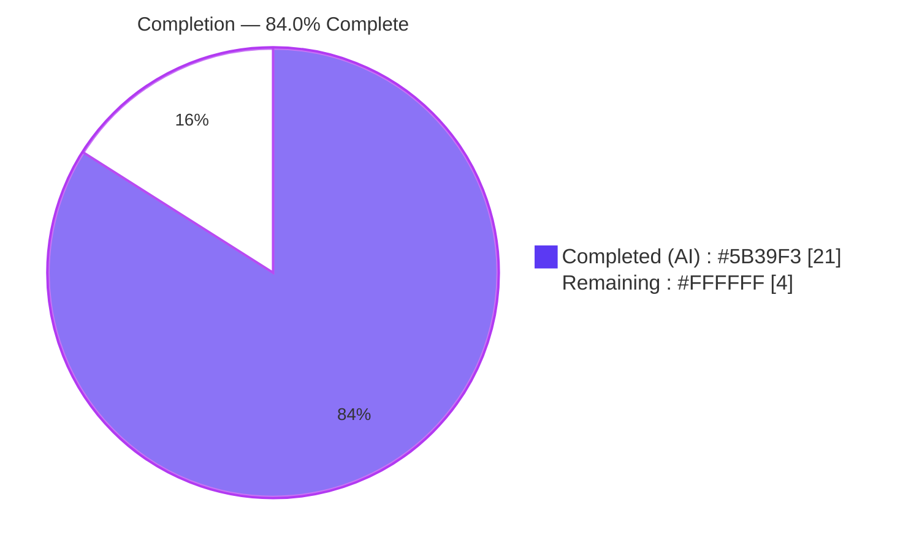
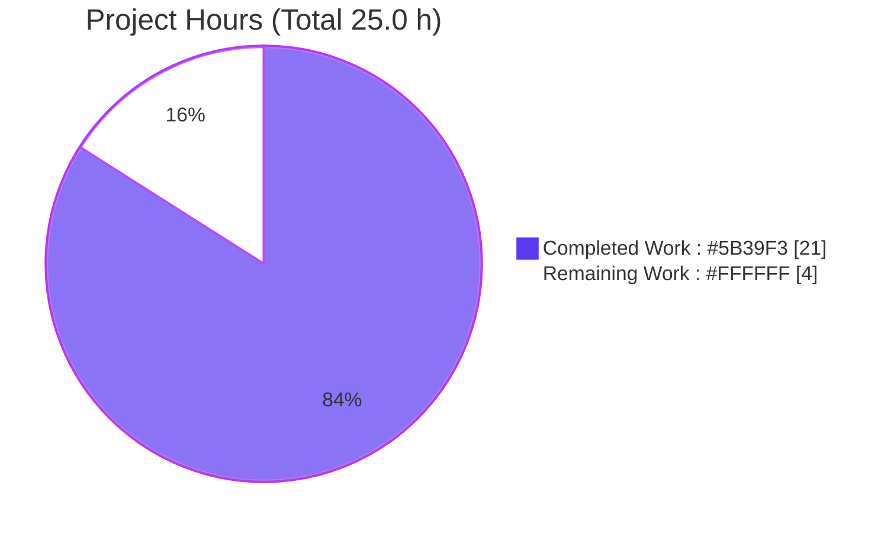
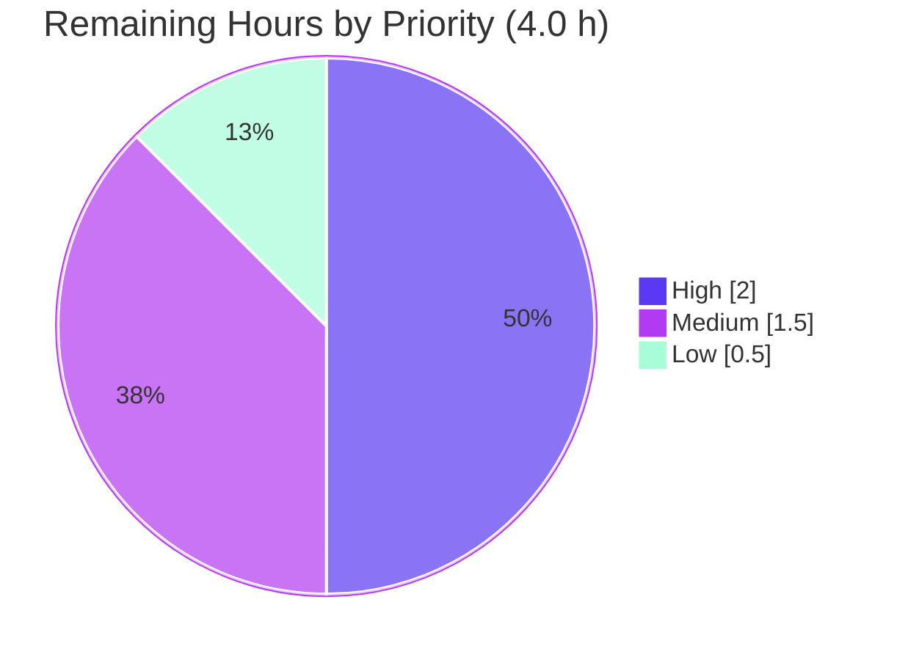

# Blitzy Project Guide

**Project:** maddy Runtime Logging & Error-Behavior Onboarding Documentation
**Repository:** `github.com/foxcpp/maddy`
**Branch:** `blitzy-38b44df9-cfe2-4334-bb4c-a252228cccc1`
**Head Commit:** `435cd97` — *docs: address code review findings in maddy onboarding notes*
**Base Commit:** `26452dd` — *target/remote: Rewrite connection part to allow more concurrency*

> **Color Key (Blitzy brand):** Completed / AI Work = Dark Blue `#5B39F3` · Remaining / Not Completed = White `#FFFFFF` · Headings / Accents = Violet-Black `#B23AF2` · Highlight = Mint `#A8FDD9`

---

## 1. Executive Summary

### 1.1 Project Overview

This project delivers a single, evidence-grounded onboarding reference document that explains the maddy mail server's runtime logging and error behavior for engineers new to the `github.com/foxcpp/maddy` codebase. Rather than describing behavior from static code reading, every answer is derived from actual Go test-suite execution output, quoting verbatim log lines, error strings, JSON fields, and SMTP status codes with `file:line` citations. The target users are developers onboarding to maddy who need to understand how SMTP delivery, queue retries, and remote MX-authentication/TLS-fallback paths log and fail at runtime. The technical scope is strictly read-only: exactly one new Markdown file is added; no production behavior, source, test, or build configuration changes.

### 1.2 Completion Status



| Metric | Value |
|--------|-------|
| **Total Hours** | 25.0 h |
| **Completed Hours (AI + Manual)** | 21.0 h (AI: 21.0 h · Manual: 0.0 h) |
| **Remaining Hours** | 4.0 h |
| **Percent Complete** | **84.0 %** |

> Completion is computed per PA1 (AAP-scoped hours only): `21.0 / (21.0 + 4.0) × 100 = 84.0%`.

### 1.3 Key Accomplishments

- ✅ Established a reproducible pinned build environment (Go 1.13.15 + gcc, `CGO_ENABLED=1`, `GOFLAGS` unset) and confirmed all in-scope packages compile.
- ✅ Executed all four target test suites with `-v -test.debuglog` and captured verbatim runtime output (176 in-scope tests, 0 failures).
- ✅ Authored, ran, and removed a temporary MX-authenticity observation harness to capture the one reply not asserted by any existing test — leaving the tree byte-for-byte clean.
- ✅ Delivered the onboarding document (`blitzy/documentation/maddy_26452dd8dd78.md`, 511 lines / 32,822 bytes) answering all **15 named items (1a–4b)** with one-claim-one-evidence discipline and `file:line` citations.
- ✅ Documented the flagship "run reveals reality" finding: observed enhanced status code **`5.4.0`** (not the `5.7.0` a static read suggests) and preserved the source misspelling `estabilish` exactly as observed.
- ✅ Distinguished the two `msg_id` shapes (run-varying 8-hex `crypto/rand` endpoint IDs vs. deterministic 40-hex SHA-1 queue/remote IDs) and cryptographically verified the deterministic values.

### 1.4 Critical Unresolved Issues

| Issue | Impact | Owner | ETA |
|-------|--------|-------|-----|
| _None._ No autonomous fixes were required; the deliverable is accurate against freshly executed output, and all in-scope tests pass. | None | — | — |

### 1.5 Access Issues

No access issues identified. The repository, the pinned Go toolchain, gcc, and all Go modules were fully accessible; `go mod download` and `go mod verify` succeeded, and every in-scope package compiled and ran locally.

| System/Resource | Type of Access | Issue Description | Resolution Status | Owner |
|-----------------|----------------|-------------------|-------------------|-------|
| — | — | No access issues identified | N/A | — |

### 1.6 Recommended Next Steps

1. **[High]** Subject-matter-expert technical review and accuracy sign-off of the onboarding document (verify all 15 named items answered by name; spot-check citations). — 2.0 h
2. **[Medium]** Fresh-environment reproduction of the four target suites to confirm run-varying vs. deterministic values. — 1.0 h
3. **[Medium]** Merge the branch and publish the document into the onboarding knowledge base. — 0.5 h
4. **[Low]** Optional house-style/formatting polish (heading style, optional table of contents). — 0.5 h

---

## 2. Project Hours Breakdown

### 2.1 Completed Work Detail

| Component | Hours | Description |
|-----------|-------|-------------|
| Environment setup & reproducible build | 2.5 | Pin Go 1.13.15 + gcc, fetch modules, resolve `GOFLAGS`/`-mod=mod` and cgo pitfalls, confirm four in-scope packages compile. |
| SMTP suite execution & evidence capture | 2.0 | Run `TestSMTPDelivery`, `_AbortData`, `_AbortLogout` with `-v -test.debuglog`; capture verbatim log lines (items 1a–1g). |
| Queue suite execution & evidence capture | 2.0 | Run `TestQueueDelivery_TemporaryFail`, `_MultipleAttempts`; trace accept→fail→retry→deliver sequence (items 2a–2c, 4a–4b). |
| Remote suite execution & evidence capture | 1.5 | Run `TestRemoteDelivery_TLSErrFallback`; capture TLS→plaintext fallback line with all JSON fields (item 3d). |
| Temporary MX-auth observation harness | 2.5 | Author `TestZZObserve…`, capture `err.Error()` + `exterrors.Fields()`, discover observed `5.4.0` ≠ `5.7.0`, run, then delete (items 3a–3c). |
| Documentation — Group 1 authoring (1a–1g) | 3.5 | Seven SMTP items + two-shapes `msg_id` analysis with verbatim evidence and citations. |
| Documentation — Group 2 authoring (2a–2c) | 1.5 | Queue accept→attempt→failure→retry→delivery sequence. |
| Documentation — Group 3 authoring (3a–3d) | 3.0 | MX-auth error string, `5.4.0` wrap-mechanism explanation, complete reply text, TLS fallback line. |
| Documentation — Group 4 + framing sections | 1.5 | Retry line + `next_try_delay`; reproducibility, `msg_id`-shapes, coverage-pass, quirks sections. |
| Review-finding fixes (commit `435cd97`) | 1.0 | Embed harness code block, correct SHA-1 attribution/target wording, reword cleanliness note. |
| **Total Completed** | **21.0** | |

> **Validation:** Total of the Hours column = **21.0 h**, matching Completed Hours in Section 1.2.

### 2.2 Remaining Work Detail

| Category | Hours | Priority |
|----------|-------|----------|
| SME technical review & accuracy sign-off (AAP deliverable acceptance) | 2.0 | High |
| Fresh-environment reproduction of the four suites (path-to-production) | 1.0 | Medium |
| Merge & publish document to onboarding knowledge base (path-to-production) | 0.5 | Medium |
| Optional house-style/formatting polish | 0.5 | Low |
| **Total Remaining** | **4.0** | |

> **Validation:** Total of the Hours column = **4.0 h**, matching Remaining Hours in Section 1.2 and the "Remaining Work" value in Section 7.

### 2.3 Totals Reconciliation

| Quantity | Value |
|----------|-------|
| Section 2.1 Completed | 21.0 h |
| Section 2.2 Remaining | 4.0 h |
| **Total Project Hours** (2.1 + 2.2) | **25.0 h** |
| Completion % (21.0 ÷ 25.0 × 100) | **84.0 %** |

---

## 3. Test Results

All tests below originate from Blitzy's autonomous validation logs for this project and were re-executed live during assessment on Go 1.13.15 with `-count=1 -v`, per package (isolated). The framework is the Go standard-library `testing` package.

| Test Category | Framework | Total Tests | Passed | Failed | Coverage % | Notes |
|---------------|-----------|-------------|--------|--------|------------|-------|
| SMTP endpoint (`internal/endpoint/smtp`) | Go `testing` | 22 | 22 | 0 | n/a¹ | Includes `TestSMTPDelivery`, `_AbortData`, `_AbortLogout` (items 1a–1g). |
| Queue delivery (`internal/target/queue`) | Go `testing` | 23 | 23 | 0 | n/a¹ | Includes `TestQueueDelivery_TemporaryFail`, `_MultipleAttempts` (items 2a–2c, 4a–4b). |
| Remote delivery (`internal/target/remote`) | Go `testing` | 37 | 37 | 0 | n/a¹ | Includes `TestRemoteDelivery_TLSErrFallback`, `_AuthMX_Fail` (items 3a–3d). |
| Message pipeline (`internal/msgpipeline`) | Go `testing` | 94 | 94 | 0 | n/a¹ | Supports `GenerateMsgID` provenance (item 1g). |
| **Total (in-scope)** | Go `testing` | **176** | **176** | **0** | — | 100 % pass rate across all four in-scope packages. |

¹ Coverage percentage was not the objective of this documentation-only, read-only task; the mandate was to observe and quote runtime behavior. No test files were added or modified, so no new coverage was generated. `internal/exterrors` contains no `*_test.go` files and is validated via the remote suite that exercises `SMTPError`/`SMTPEnchCode`.

**Dependency & build gates (from autonomous logs, re-verified):** `go mod download` exit 0 · `go mod verify` → *all modules verified* · `go build ./...` exit 0 (only a benign vendored `mattn/go-sqlite3` cgo `-Wreturn-local-addr` warning) · in-scope `go vet` exit 0.

---

## 4. Runtime Validation & UI Verification

This is a headless mail-server library/CLI project with **no UI**; runtime validation covers log-emission and error paths reproduced live with `-v -test.debuglog`.

**SMTP endpoint (`internal/endpoint/smtp`)**
- ✅ **Operational** — Successful delivery emits, in order: `smtp: incoming message` → `smtp: RCPT ok` (one per recipient) → `smtp: accepted`.
- ✅ **Operational** — DATA-abort emits `smtp: DATA error` with `"reason":"unexpected EOF"` → `smtp: aborted`; logout-abort goes straight to `smtp: aborted`.
- ✅ **Operational** — `RCPT ok` JSON carries exactly `{msg_id, rcpt}`; `aborted` carries only `{msg_id}`. Module prefix confirmed `smtp` (pipeline sub-logger `smtp/pipeline`).
- ✅ **Operational** — Endpoint `msg_id` observed as 8-hex `crypto/rand` value (run-varying, e.g. `4f9fb4dc` this run).

**Queue delivery (`internal/target/queue`)**
- ✅ **Operational** — Temporary-fail path: `queue: delivery attempt failed` (`"reason":"you shall not pass"`) → `queue: will retry` (`attempts_count`, `next_try_delay`, `rcpts`) → `queue: delivered`.
- ✅ **Operational** — Deterministic `msg_id af8090c7eb39f761862b1f027b4f2b0bb1ce86d1` reproduced exactly; `next_try_delay` value is small-negative nanoseconds (run-varying).

**Remote delivery (`internal/target/remote`)**
- ✅ **Operational** — TLS fallback: `remote: TLS error, falling back to plaintext` with all four JSON fields `{domain, msg_id, mx, reason}`; deterministic `msg_id 2176ec5872ed2b87d832b4070e88232bd94ac7d3` reproduced byte-for-byte.
- ✅ **Operational** — MX-auth failure returns observed reply `550 5.4.0 No usable MXs, last err: Failed to estabilish the MX record (mx.example.invalid.) authenticity` (enhanced code **`5.4.0`**, not `5.7.0`).

**Repository integrity**
- ✅ **Operational** — `git status --porcelain` empty before and after all runs; temporary harness fully removed.

---

## 5. Compliance & Quality Review

Cross-mapping of AAP deliverables and methodological rules (SWE-AtlasQnA-Repo) to observed quality benchmarks.

| Benchmark / AAP Requirement | Status | Evidence / Notes |
|-----------------------------|--------|------------------|
| Deliverable at mandated path/name (`blitzy/documentation/maddy_26452dd8dd78.md`) | ✅ Pass | Single new file; name matches source branch `maddy_26452dd8dd78`. |
| Run-first, then write | ✅ Pass | Four suites executed with `-v -test.debuglog`; answers quote executed output. |
| Quote observed output verbatim | ✅ Pass | Log lines, JSON, status codes pasted verbatim; commands shown. |
| One claim, one piece of evidence | ✅ Pass | Each behavioral claim paired with its exact observed line. |
| Answer every named item (1a–4b) | ✅ Pass | 15/15 items have dedicated headings + coverage-pass table. |
| Exact & grounded (`file:line` citations) | ✅ Pass | All citations re-verified against current source (0 stale line numbers). |
| Report quirks as observed | ✅ Pass | `5.4.0` and misspelling `estabilish` reported, not "corrected". |
| Distinguish the two `msg_id` shapes | ✅ Pass | 8-hex `crypto/rand` vs 40-hex SHA-1; SHA-1 values cryptographically verified. |
| Read-only mandate (no source/test/build edits) | ✅ Pass | `git diff 26452dd..HEAD` = 1 file, +511/−0; tree clean. |
| Temporary harness removed | ✅ Pass | No `zzobserve`/adhoc/`.orig`/`.tmp` artifacts; tree byte-for-byte clean. |
| Zero placeholder / TODO language in deliverable | ✅ Pass | 70 balanced code fences; no stub/placeholder text. |
| Dependencies verified | ✅ Pass | `go mod verify` → all modules verified. |
| Compilation clean | ✅ Pass | `go build ./...` exit 0; in-scope `go vet` exit 0. |

**Fixes applied during autonomous validation:** None required — the committed document was already accurate against freshly executed output. **Outstanding items:** human review/merge only (see Sections 2.2 and 8).

---

## 6. Risk Assessment

| Risk | Category | Severity | Probability | Mitigation | Status |
|------|----------|----------|-------------|------------|--------|
| `TestRemoteDelivery_MXAuth_IPLiteral` (out-of-scope) fails `bind: address already in use` under parallel `go test ./...` | Technical | Low | Medium | Run `go test -p 1 ./...` or per-package; root cause is read-only out-of-scope `TestMain` port reuse. All four in-scope suites pass 100% isolated. | Documented / Accepted |
| Run-varying values (endpoint 8-hex `msg_id`, `next_try_delay` ns, ephemeral ports) misread as errors | Technical | Low | Low | Document explicitly flags these as run-varying; deterministic SHA-1 IDs used where stable. | Mitigated |
| Go 1.13.15 is EOL; reproduction requires the pinned toolchain | Technical | Low | Low | Prerequisites pin Go 1.13.15 + gcc and the two build pitfalls (`GOFLAGS` unset, cgo). | Mitigated |
| Benign vendored `mattn/go-sqlite3` cgo `-Wreturn-local-addr` warning | Technical | Informational | High | Documented benign; does not fail the build. | Documented |
| Documentation drift — future refactors move cited line numbers / change log strings | Operational | Low | Medium | Citations anchor to stable string literals + function names; re-validate on major refactor. | Open (human ownership) |
| No CI gate binds the document to source | Operational | Low | Low | Optional periodic re-run of the four suites; noted as advisory. | Open |
| Reproduction depends on exact pinned environment | Integration | Low | Medium | Development Guide (Section 9) documents full setup and pitfalls. | Mitigated |
| Security exposure from the change | Security | None | — | Single Markdown file; no code, dependencies, credentials, or attack surface introduced. | N/A |
| External-service integration failure | Integration | None | — | Tests mock DNS (`go-mockdns`) and use in-process SMTP; no external services. | N/A |

---

## 7. Visual Project Status

**Project hours breakdown** (Completed = Dark Blue `#5B39F3`, Remaining = White `#FFFFFF`):



**Remaining work by priority** (sums to 4.0 h, matching Section 2.2):



**Remaining hours per category** (Section 2.2):

| Category | Hours |
|----------|------:|
| SME review & sign-off | 2.0 |
| Fresh-env reproduction | 1.0 |
| Merge & publish | 0.5 |
| Formatting polish | 0.5 |
| **Total** | **4.0** |

> **Integrity:** "Remaining Work" = 4 h here equals Section 1.2 Remaining Hours and the Section 2.2 Hours sum.

---

## 8. Summary & Recommendations

**Achievements.** The project delivers a complete, evidence-grounded onboarding document answering all 15 named items (1a–4b) from actual test-execution output, with verbatim evidence and re-verified `file:line` citations. The read-only mandate was upheld exactly: `git diff 26452dd..HEAD` shows one new file (+511/−0) and a byte-for-byte-clean tree. All 176 in-scope tests pass, dependencies verify, and the whole tree compiles.

**Completion.** The project is **84.0 % complete** (21.0 of 25.0 hours). The entire AAP-scoped deliverable and all investigation activities are finished; the remaining **4.0 hours** are human path-to-production activities only.

**Remaining gaps / critical path to production.**
1. SME technical review and accuracy sign-off (**2.0 h, High**) — the gate for onboarding acceptance.
2. Fresh-environment reproduction (**1.0 h, Medium**).
3. Merge & publish to the onboarding knowledge base (**0.5 h, Medium**).
4. Optional formatting polish (**0.5 h, Low**).

**Advisory (out of project scope, excluded from hours).** The maddy maintainers — not this onboarding task — may wish to address the out-of-scope `TestRemoteDelivery_MXAuth_IPLiteral` port-reuse flake in the remote `TestMain`, or run CI with `go test -p 1 ./...`.

**Success metrics.**

| Metric | Result |
|--------|--------|
| AAP named items answered | 15 / 15 |
| In-scope tests passing | 176 / 176 |
| Source/test/build files modified | 0 |
| Working tree clean | Yes |
| Completion | 84.0 % (21 of 25 hours) |

**Production-readiness assessment.** The deliverable is **ready for human review**. No autonomous fixes were required; risk is low across all categories (no security or external-integration exposure for a Markdown-only change). Upon SME sign-off and merge, the document is ready to serve as the maddy runtime-behavior onboarding reference.

---

## 9. Development Guide

How to build the project and reproduce the exact observations the document quotes. All commands were tested live on the assessment environment.

### 9.1 System Prerequisites

- **OS:** Linux/amd64 (validated on Ubuntu container).
- **Go:** 1.13.15 (matches the `go.mod` floor `go 1.13`). Newer Go may change output/flag handling.
- **C compiler:** `gcc` (cgo is required to build the tree — vendored `github.com/mattn/go-sqlite3`).
- **git**.

### 9.2 Environment Setup

```bash
# Load the pinned toolchain. This sets GOROOT/GOPATH/GOCACHE/PATH,
# GO111MODULE=on, CGO_ENABLED=1, and deliberately UNSETS GOFLAGS.
source /etc/profile.d/go.sh

# Verify
go version         # expect: go version go1.13.15 linux/amd64
gcc --version      # any recent gcc; validated with 15.2.0
```

> **Pitfall:** Go 1.13 rejects the `-mod=mod` flag. Ensure `GOFLAGS` is empty (`go env GOFLAGS` prints nothing). If set, run `unset GOFLAGS`.

### 9.3 Dependency Installation

```bash
go mod download    # exit 0
go mod verify      # expect: all modules verified
```

### 9.4 Build

```bash
go build ./...     # exit 0
# The ONLY expected output is a benign cgo warning from the vendored
# github.com/mattn/go-sqlite3 (not from any in-scope file):
#   sqlite3-binding.c: ... warning: function may return address of local
#   variable [-Wreturn-local-addr]

go vet ./internal/endpoint/smtp/ ./internal/target/queue/ \
       ./internal/target/remote/ ./internal/msgpipeline/    # exit 0
```

### 9.5 Run the Target Test Suites (observe runtime behavior)

> **Critical:** `-test.debuglog` must appear **after** the package path, otherwise Go treats it as a package selector and runs the root module.

```bash
# SMTP endpoint (items 1a–1g)
go test -count=1 -v -run '^TestSMTPDelivery$'        ./internal/endpoint/smtp/ -test.debuglog
go test -count=1 -v -run '^TestSMTPDelivery_Abort'   ./internal/endpoint/smtp/ -test.debuglog

# Queue (items 2a–2c, 4a–4b)
go test -count=1 -v -run '^TestQueueDelivery_TemporaryFail$'   ./internal/target/queue/ -test.debuglog
go test -count=1 -v -run '^TestQueueDelivery_MultipleAttempts$' ./internal/target/queue/ -test.debuglog

# Remote (items 3a–3d)
go test -count=1 -v -run '^TestRemoteDelivery_TLSErrFallback$' ./internal/target/remote/ -test.debuglog
go test -count=1 -v -run '^TestRemoteDelivery_AuthMX_Fail$'    ./internal/target/remote/ -test.debuglog

# Whole suite, serialized (avoids the out-of-scope IPLiteral port-reuse flake)
go test -p 1 ./...
```

### 9.6 Verification

- **SMTP:** expect `smtp: RCPT ok\t{"msg_id":"<8hex>","rcpt":"..."}` followed by `--- PASS`. The `msg_id` is run-varying (`crypto/rand`).
- **Queue:** expect `queue: will retry` carrying the `next_try_delay` field; deterministic `msg_id af8090c7…`.
- **Remote:** expect `remote: TLS error, falling back to plaintext` with `{domain, msg_id, mx, reason}`; deterministic `msg_id 2176ec58…`.
- **Cleanliness:** `git status --porcelain` prints nothing (clean) before and after runs.

### 9.7 Troubleshooting

| Symptom | Cause | Resolution |
|---------|-------|-----------|
| `? github.com/foxcpp/maddy [no test files]` | `-test.debuglog` placed **before** the package path | Move `-test.debuglog` **after** the package path. |
| Build error mentioning `-mod=mod` | `GOFLAGS` is set (Go 1.13 rejects it) | `unset GOFLAGS`. |
| `gcc: command not found` / cgo error | Missing C compiler | Install `gcc`; ensure `CGO_ENABLED=1`. |
| `bind: address already in use` on `TestRemoteDelivery_MXAuth_IPLiteral` | Out-of-scope `TestMain` port reuse under parallel `go test ./...` | Run `go test -p 1 ./...` or per-package. |

---

## 10. Appendices

### A. Command Reference

| Command | Purpose |
|---------|---------|
| `source /etc/profile.d/go.sh` | Load pinned Go 1.13.15 toolchain; unset `GOFLAGS`. |
| `go mod download` / `go mod verify` | Fetch and verify dependencies. |
| `go build ./...` | Compile the whole tree (cgo required). |
| `go test -count=1 -v -run '<regex>' ./internal/<pkg>/ -test.debuglog` | Run a target suite with debug logging (flag **after** path). |
| `go test -p 1 ./...` | Run the full suite serialized (avoids IPLiteral flake). |
| `git status --porcelain` | Confirm the tree is clean (empty output). |
| `git diff 26452dd..HEAD --stat` | Confirm exactly one file changed (+511/−0). |

### B. Port Reference

No fixed application ports are used by these tests — the harness binds **ephemeral** `127.0.0.1` ports for the in-process SMTP server, and DNS is mocked via `go-mockdns`. (For context only, maddy production defaults — not exercised here — are SMTP 25, submission 587, IMAP 143/993.)

### C. Key File Locations

| Path | Role |
|------|------|
| `blitzy/documentation/maddy_26452dd8dd78.md` | **The deliverable** (only added file). |
| `internal/endpoint/smtp/smtp.go` | SMTP log call-sites: `incoming message` L128, `RCPT ok` L243, `accepted` L334, `DATA error` L317, `aborted` L72; logger name L495; `smtp/pipeline` L586. |
| `internal/msgpipeline/msgid.go` | `GenerateMsgID` L12–16 (8-hex `crypto/rand`). |
| `internal/target/queue/queue.go` | `delivered` L378, `delivery attempt failed` L384, `will retry` + `next_try_delay` L415–418. |
| `internal/target/remote/connect.go` | MX-auth error L95–99, MTA-STS variant L66–67, "No usable MXs" wrapper L204–211, TLS-fallback L176. |
| `internal/exterrors/smtp.go` | `SMTPError.Fields/Error/Temporary` L77–107; `SMTPEnchCode` L122–128 (forces class digit → `5.4.0`). |
| `internal/testutils/logger.go` | `-test.debuglog` / `-test.directlog` flags. |

### D. Technology Versions

| Component | Version |
|-----------|---------|
| Go toolchain | 1.13.15 (go.mod floor `go 1.13`) |
| gcc | 15.2.0 (any recent gcc; cgo required) |
| `github.com/emersion/go-smtp` | v0.12.1-0.20191206174923-1f576e0ec85c |
| `github.com/emersion/go-message` | v0.10.9-0.20191116124005-65fd0119e899 |
| `github.com/foxcpp/go-mockdns` | v0.0.0-20191123143003-02edb10da1e3 |
| `github.com/mattn/go-sqlite3` | vendored (source of the benign cgo warning) |

### E. Environment Variable Reference

| Variable | Value | Notes |
|----------|-------|-------|
| `GO111MODULE` | `on` | Module mode. |
| `CGO_ENABLED` | `1` | Required (cgo build). |
| `GOFLAGS` | *(unset)* | Must be empty — Go 1.13 rejects `-mod=mod`. |
| `GOPATH` | `/root/go` | Set by `/etc/profile.d/go.sh`. |
| `CC` | `gcc` | C compiler for cgo. |

### F. Developer Tools Guide

- **Test flags:** `-v` surfaces `t.Log` output; `-test.debuglog` enables `[debug]` lines (both required to observe the full sequences); `-count=1` disables test caching; `-run '<regex>'` selects a suite; `-p 1` serializes packages.
- **Determinism:** queue/remote `msg_id` are SHA-1 of the test name — reproducible via `printf '<TestName>' | sha1sum`. Endpoint `msg_id` is `crypto/rand` (run-varying).

### G. Glossary

| Term | Meaning |
|------|---------|
| `msg_id` | Per-message identifier in log lines. Endpoint: 8-hex `crypto/rand` (run-varying). Queue/remote test target: 40-hex SHA-1 of the test name (deterministic). |
| Enhanced status code | SMTP `X.Y.Z` detail code. Observed MX-auth reply is `5.4.0` (outer wrapper), not the inner authenticity error's `5.7.0`. |
| `next_try_delay` | JSON field in the `queue: will retry` line holding the retry delay (run-varying nanoseconds). |
| `SMTPEnchCode` | Helper that normalizes the enhanced-code class digit; unconditionally sets the first digit to `5`, yielding the observed `5.4.0`. |
| `estabilish` | Source-code misspelling in the MX-authenticity error string, preserved verbatim per the read-only/report-as-observed rules. |
