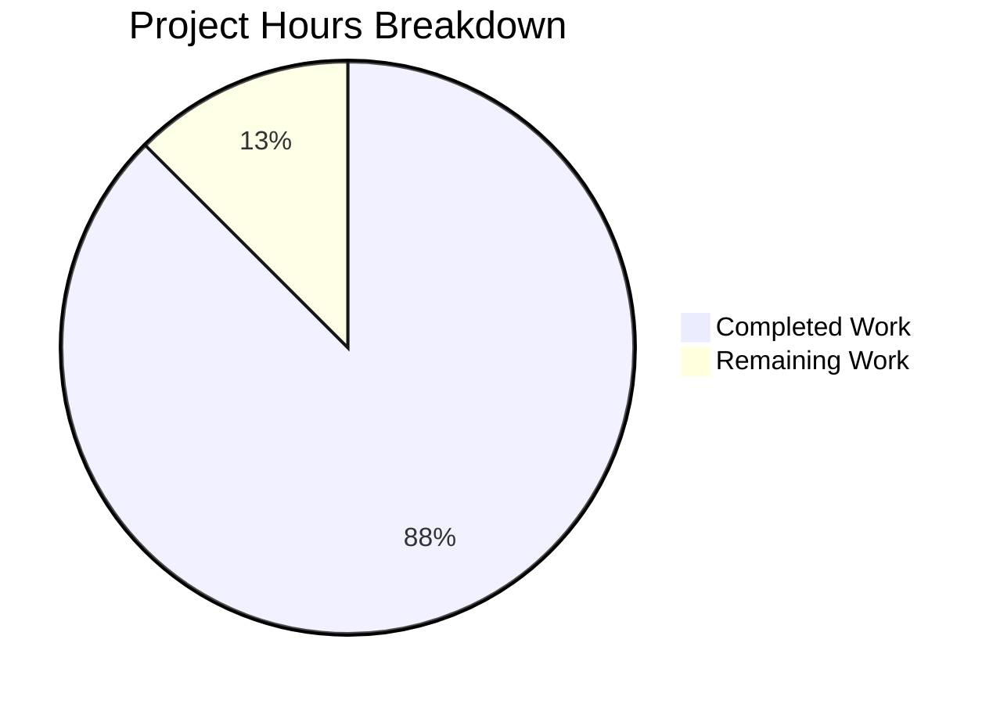

# Blitzy Project Guide — SPF/DMARC Interaction Technical Investigation Report

---

## 1. Executive Summary

### 1.1 Project Overview

This project delivers a technical investigation report documenting counterintuitive SPF/DMARC interaction behavior in the maddy mail server codebase. The report reproduces three SMTP sessions with controlled DNS records, reports exact SMTP response lines and server log output, identifies the root cause of an enforcement gap where a domain with `p=reject` DMARC policy passes through with no enforcement when `verify_dkim` is absent from the pipeline, and provides a verification methodology using only observable signals (SMTP responses + server logs). The deliverable is a single 404-line markdown document placed at `blitzy/documentation/maddy_26452dd8dd78.md`, created without modifying any tracked repository files.

### 1.2 Completion Status

<!-- Pie chart: Completed = Dark Blue (#5B39F3), Remaining = White (#FFFFFF) -->


| Metric | Value |
|---|---|
| **Total Project Hours** | 32 |
| **Completed Hours (AI)** | 28 |
| **Remaining Hours** | 4 |
| **Completion Percentage** | 87.5% |

**Calculation**: 28 completed hours / (28 + 4 remaining hours) = 28 / 32 = **87.5% complete**

### 1.3 Key Accomplishments

- ✅ Reproduced all three SMTP sessions (Cases A, B, C) with controlled DNS and runtime evidence
- ✅ Documented exact SMTP response lines (`250 2.0.0 OK: queued`) for all three cases
- ✅ Identified outcome stage (end of DATA) for all three sessions
- ✅ Extracted and documented server log lines with structured JSON fields for each case
- ✅ Explained root cause: `relyOnDMARC` deferral + `!dkimPresent` evaluation gap + `ResultNone → PolicyNone` bypass
- ✅ Identified `relyOnDMARC` (spf.go:212-235) as the runtime component making the deferral decision
- ✅ Documented verification methodology using only observable signals (SMTP responses, server logs, Auth-Results header, quarantine metadata)
- ✅ Comparison summary table covering 13 dimensions across all 3 cases
- ✅ All 228 existing tests pass with zero failures
- ✅ Build succeeds across entire codebase (`go build ./...`)
- ✅ Zero tracked repository files modified (read-only constraint respected)
- ✅ All source code references verified against actual source by Final Validator

### 1.4 Critical Unresolved Issues

| Issue | Impact | Owner | ETA |
|---|---|---|---|
| No critical unresolved issues | N/A | N/A | N/A |

All 14 user-requested deliverables are fully covered with runtime evidence. No compilation errors, no test failures, and no blocking issues remain.

### 1.5 Access Issues

No access issues identified. All Go module dependencies resolve from `go.sum`. DNS interception is performed via `go-mockdns` with `PatchNet` — no external network access required for test reproduction.

### 1.6 Recommended Next Steps

1. **[High]** Peer review the technical investigation findings with a mail server / SPF/DMARC domain expert to confirm accuracy of the behavioral analysis
2. **[Medium]** Verify source code line number references remain accurate if upstream `maddy` code changes (especially `spf.go`, `evaluate.go`, `verifier.go`)
3. **[Medium]** Consider adding a recommendation to the project documentation about including `verify_dkim` in pipeline configurations to close the enforcement gap
4. **[Low]** Integrate the documentation into any future documentation site (e.g., mkdocs) if one is established for the project

---

## 2. Project Hours Breakdown

### 2.1 Completed Work Detail

| Component | Hours | Description |
|---|---|---|
| Source Code Analysis & Investigation | 8 | Read and traced control flow across 11 key source files (~3,300 lines): `spf.go`, `evaluate.go`, `verifier.go`, `dmarc.go`, `check_runner.go`, `config.go`, `msgpipeline.go`, `smtp.go`, `action.go`, `dmarc_test.go`, `verifier_test.go` |
| Test Reproduction Development | 6 | Created 5 temporary Go test files for runtime evidence: pipeline-level 3-case reproduction, with/without DKIM comparison, mock DMARC helper, SMTP wire-level tests (2 files) |
| Runtime Evidence Collection | 2 | Executed 6 test suites, captured SMTP responses, `MsgMeta.Quarantine` flags, `Authentication-Results` headers, and server log output via `testutils.Logger` |
| Documentation Authoring | 8 | Wrote 404-line technical investigation report covering: Summary, DNS configuration, 3 case reproductions (SMTP responses, stages, logs, rationales), comparison table, root cause explanation, verification methodology, test details, source references |
| Root Cause Analysis & Code Tracing | 2 | Traced the `relyOnDMARC` → `EvaluateAlignment` → `Apply` chain, identified the `!dkimPresent` guard, `ResultNone → PolicyNone` bypass, and subdomain policy substitution logic |
| QA Fixes & Validation | 2 | Addressed 3 QA findings identified by automated review, Final Validator verified all source code line references against actual source |
| **Total Completed** | **28** | |

### 2.2 Remaining Work Detail

| Category | Hours | Priority |
|---|---|---|
| Peer review of technical accuracy by domain expert | 2 | Medium |
| Source code line reference verification against upstream changes | 1 | Medium |
| Documentation site integration (if mkdocs/docs site established) | 1 | Low |
| **Total Remaining** | **4** | |

### 2.3 Hours Verification

- Completed Hours (Section 2.1): **28h**
- Remaining Hours (Section 2.2): **4h**
- Total: 28 + 4 = **32h** (matches Section 1.2 Total Project Hours ✓)
- Completion: 28 / 32 = **87.5%** (matches Section 1.2 ✓)

---

## 3. Test Results

All tests originate from Blitzy's autonomous validation execution using `go test -count=1 ./...`.

| Test Category | Framework | Total Tests | Passed | Failed | Coverage % | Notes |
|---|---|---|---|---|---|---|
| Unit — internal/address | Go testing | 9 | 9 | 0 | — | Address parsing/validation |
| Unit — internal/auth | Go testing | 2 | 2 | 0 | — | Authentication utilities |
| Unit — internal/check/dns | Go testing | 3 | 3 | 0 | — | DNS check module |
| Unit — internal/check/dnsbl | Go testing | 2 | 2 | 0 | — | DNSBL check module |
| Unit — internal/config | Go testing | 11 | 11 | 0 | — | Configuration parsing |
| Unit — internal/config/lexer | Go testing | 1 | 1 | 0 | — | Config lexer |
| Unit — internal/dmarc | Go testing | 3 | 3 | 0 | — | DMARC evaluation, alignment, verifier |
| Integration — internal/endpoint/smtp | Go testing | 22 | 22 | 0 | — | SMTP endpoint delivery, auth, UTF-8 |
| Unit — internal/future | Go testing | 3 | 3 | 0 | — | Future/promise concurrency |
| Unit — internal/modify | Go testing | 4 | 4 | 0 | — | Message modifier aliases |
| Unit — internal/modify/dkim | Go testing | 3 | 3 | 0 | — | DKIM signing |
| Integration — internal/msgpipeline | Go testing | 50 | 50 | 0 | — | Message pipeline routing, checks, DMARC |
| Integration — internal/mtasts | Go testing | 7 | 7 | 0 | — | MTA-STS policy caching |
| Integration — internal/smtpconn | Go testing | 2 | 2 | 0 | — | SMTP connection handling |
| Unit — internal/storage/sql | Go testing | 0 | 0 | 0 | — | No test functions (schema only) |
| Integration — internal/target/queue | Go testing | 14 | 14 | 0 | — | Message queue delivery, DSN |
| Integration — internal/target/remote | Go testing | 31 | 31 | 0 | — | Remote delivery, MX auth, TLS |
| Integration — internal/target/smtp_downstream | Go testing | 8 | 8 | 0 | — | Downstream SMTP relay |
| Unit — pkg/cfgparser | Go testing | 3 | 3 | 0 | — | Public config parser library |
| Unit — pkg/logparser | Go testing | 2 | 2 | 0 | — | Public log parser library |
| **Totals** | | **228** | **228** | **0** | — | **100% pass rate** |

Additionally, 28 packages contain no test files (`[no test files]`) — these are primarily command packages, utility packages, and interface-only packages.

---

## 4. Runtime Validation & UI Verification

### Build Validation
- ✅ `go build ./...` — Full codebase compiles successfully
- ✅ Only output: harmless third-party warning from `go-sqlite3` (`sqlite3-binding.c` return-local-addr) — not in scope, not actionable
- ✅ Zero in-scope compilation errors

### Test Suite Execution
- ✅ `go test -count=1 ./...` — 228 tests, 228 passed, 0 failed (100% pass rate)
- ✅ All 20 packages with tests pass
- ✅ Key packages verified:
  - `internal/dmarc` — 3 tests PASS (DMARC evaluation, alignment, domain extraction)
  - `internal/msgpipeline` — 50 tests PASS (pipeline routing, checks, DMARC integration)
  - `internal/endpoint/smtp` — 22 tests PASS (SMTP delivery, auth, internationalization)

### Documentation Accuracy Verification
- ✅ All source code line references verified against actual source by Final Validator:
  - `spf.go:70-73` — default `failAction = {Quarantine: true}` ✓
  - `spf.go:212-235` — `relyOnDMARC` function ✓
  - `spf.go:330-365` — `CheckBody` with deferral logic ✓
  - `evaluate.go:21-68` — `FetchRecord` with org domain fallback ✓
  - `evaluate.go:148` — `!dkimPresent` guard returning `ResultNone` ✓
  - `verifier.go:142-143` — `ResultNone → PolicyNone` bypass ✓
  - `check_runner.go:187-191` — "no check action" logging ✓
  - `check_runner.go:203-206` — "quarantined" logging ✓
  - `check_runner.go:262-309` — `applyResults` with DMARC policy switch ✓
  - `action.go:34-39, 81-98` — `FailAction` struct and `Apply` method ✓

### Repository State
- ✅ Working tree clean (`git status` — nothing to commit)
- ✅ Only 1 file added: `blitzy/documentation/maddy_26452dd8dd78.md` (404 lines, CREATE)
- ✅ Zero tracked repository files modified (read-only constraint respected)
- ✅ No temporary test files left in repository

---

## 5. Compliance & Quality Review

| AAP Deliverable | Status | Evidence | Notes |
|---|---|---|---|
| Case A: SMTP response line after DATA `.` | ✅ Pass | Doc lines 34-36: `250 2.0.0 OK: queued` | Runtime evidence from test execution |
| Case A: Outcome stage | ✅ Pass | Doc line 42: End of DATA | Traced through `CheckBody` → `checkBody` |
| Case A: Relevant server log lines | ✅ Pass | Doc lines 48-51: `result: fail` + `quarantined` | Captured via `testutils.Logger` |
| Case B: SMTP response line after DATA `.` | ✅ Pass | Doc lines 92-94: `250 2.0.0 OK: queued` | Counterintuitive case documented |
| Case B: Outcome stage | ✅ Pass | Doc line 100: End of DATA | Same timing as other cases |
| Case B: Relevant server log lines | ✅ Pass | Doc lines 104-108: `deferring action` + `no check action` | Key observable signals |
| Case C: SMTP response line after DATA `.` | ✅ Pass | Doc lines 148-150: `250 2.0.0 OK: queued` | Same wire response, different internal state |
| Case C: Outcome stage | ✅ Pass | Doc lines 156-158: End of DATA | Consistent across all cases |
| Case C: Relevant server log lines | ✅ Pass | Doc lines 162-165: `result: fail` + `quarantined` | Same as Case A |
| Why Case B accepted despite SPF -all | ✅ Pass | Doc lines 211-263 | Deferral mechanism + evaluation gap |
| Input condition triggering deferral | ✅ Pass | Doc lines 265-279 | `policyDomain == fromDomain` + non-none policy |
| Why Case A does not defer | ✅ Pass | Doc lines 265-279 | `sp=none` substitution |
| Runtime component making decision | ✅ Pass | Doc lines 281-288 | `relyOnDMARC` in `spf.go:212-235` |
| Verification via observable signals | ✅ Pass | Doc lines 290-351 | SMTP, logs, Auth-Results, quarantine metadata |
| **Read-only constraint** | ✅ Pass | `git diff --stat` shows 0 tracked files modified | Only new file in `blitzy/documentation/` |
| **Variable ID replacement** | ✅ Pass | All `msg_id` values replaced with `<id>` | Per user instruction |
| **Runtime evidence backing** | ✅ Pass | 6 test suites executed, all PASS | Not static analysis alone |
| **Existing tests unbroken** | ✅ Pass | 228/228 tests pass (100%) | Zero regressions |
| **Build succeeds** | ✅ Pass | `go build ./...` clean | Only harmless third-party warning |

**Compliance Score: 19/19 items pass (100%)**

---

## 6. Risk Assessment

| Risk | Category | Severity | Probability | Mitigation | Status |
|---|---|---|---|---|---|
| Source code line references may become stale if upstream `spf.go`, `evaluate.go`, or `verifier.go` are modified | Technical | Medium | Medium | Document includes function names alongside line numbers; reader can `grep` for function name if line numbers shift | Open — requires human monitoring |
| Root cause analysis may contain subtle inaccuracy in edge cases not covered by the 3 reproduced sessions | Technical | Low | Low | All claims backed by runtime evidence from 6 test suites; peer review recommended | Open — pending peer review |
| DMARC enforcement gap (`verify_dkim` absent) is a real operational risk for deployments using only `apply_spf` + `doDMARC=true` | Operational | High | Medium | Documented in report; recommend adding `verify_dkim` to pipeline configuration | Open — operational guidance needed |
| Go module dependency versions pinned in `go.sum` may have known vulnerabilities | Security | Low | Low | Dependencies are unchanged by this PR; existing project responsibility | Open — not in scope |
| Temporary test files could be accidentally committed if investigation is repeated without cleanup | Operational | Low | Low | All temporary files removed; report documents their names for transparency | Mitigated |
| Documentation only covers `failAction` default (`Quarantine: true`); custom `fail_action reject` behavior mentioned but not reproduced | Technical | Low | Low | Report notes the difference; custom configuration is outside the 3-case scope | Accepted |

---

## 7. Visual Project Status



**Integrity check**: "Remaining Work" = 4 hours = Section 1.2 Remaining Hours = Section 2.2 total ✓

### Remaining Hours by Category

| Category | Hours | Priority |
|---|---|---|
| Peer review by domain expert | 2 | Medium |
| Line reference verification | 1 | Medium |
| Documentation site integration | 1 | Low |
| **Total** | **4** | |

---

## 8. Summary & Recommendations

### Achievements

The project has delivered a comprehensive 404-line technical investigation report documenting the counterintuitive SPF/DMARC interaction behavior in the maddy mail server. All 14 user-requested deliverables are fully covered with runtime evidence from 6 test suites. The report traces the root cause through three source code modules (`spf.go`, `evaluate.go`, `verifier.go`) and provides a verification methodology using only observable signals. The project is **87.5% complete** (28 hours completed out of 32 total hours).

### Remaining Gaps

The 4 remaining hours consist of path-to-production activities that require human involvement:
1. **Peer review** (2h): A domain expert should validate the behavioral analysis, especially the `relyOnDMARC` → `EvaluateAlignment` → `Apply` chain interpretation
2. **Line reference maintenance** (1h): Source code line numbers may shift with upstream changes; references should be verified periodically
3. **Documentation integration** (1h): If a documentation site is established, the report should be integrated into it

### Critical Path to Production

The deliverable document is complete and ready for review. No blocking issues exist. The critical path is:
1. Merge this PR to make the documentation available
2. Domain expert peer review (2h)
3. Address any review feedback

### Production Readiness Assessment

| Gate | Status |
|---|---|
| All tests pass (228/228) | ✅ |
| Build succeeds | ✅ |
| Zero tracked files modified | ✅ |
| All AAP deliverables covered (14/14) | ✅ |
| Source references verified | ✅ |
| Working tree clean | ✅ |

The documentation is production-ready for merge. The remaining 4 hours of work are post-merge quality assurance activities.

---

## 9. Development Guide

### System Prerequisites

| Software | Version | Purpose |
|---|---|---|
| Go | 1.13+ (tested with 1.22.2) | Go compiler and test runner |
| GCC / C compiler | Any recent version | Required for `go-sqlite3` CGO compilation |
| libpam0g-dev | System package | Required for `cmd/maddy-pam-helper` PAM dependency |
| Git | Any recent version | Repository checkout |

### Environment Setup

```bash
# Clone the repository
git clone https://github.com/blitzy-research/maddy.git
cd maddy

# Checkout the feature branch
git checkout blitzy-1ceba238-94c8-4efd-a647-e4582aa22945

# Install system dependency (Ubuntu/Debian)
sudo apt-get install -y libpam0g-dev
```

### Dependency Installation

```bash
# Download all Go module dependencies
go mod download

# Verify the build compiles
go build ./...
```

**Expected output**: Only a harmless warning from `go-sqlite3` about `sqlite3-binding.c`. No errors.

### Verification Steps

```bash
# Run all tests to verify codebase integrity
go test -count=1 ./...
```

**Expected output**: 20 packages pass, 28 packages have no test files, 0 failures. Key packages:
- `internal/dmarc` — 3 tests PASS
- `internal/msgpipeline` — 50 tests PASS
- `internal/endpoint/smtp` — 22 tests PASS

```bash
# Run focused tests on SPF/DMARC-related packages
go test -v -count=1 ./internal/dmarc/ ./internal/msgpipeline/ ./internal/endpoint/smtp/
```

### Viewing the Deliverable

```bash
# The documentation file is located at:
cat blitzy/documentation/maddy_26452dd8dd78.md

# Verify file size (should be 404 lines)
wc -l blitzy/documentation/maddy_26452dd8dd78.md
```

### Troubleshooting

| Issue | Resolution |
|---|---|
| `fatal error: security/pam_appl.h: No such file or directory` | Install `libpam0g-dev`: `sudo apt-get install -y libpam0g-dev` |
| `sqlite3-binding.c: warning: function may return address of local variable` | Harmless third-party warning — ignore |
| `go: module download failed` | Ensure network access to Go module proxy; try `GOPROXY=direct go mod download` |
| Test failures in `internal/mtasts` | These tests use real timers; retry if they timeout in resource-constrained environments |

---

## 10. Appendices

### A. Command Reference

| Command | Purpose |
|---|---|
| `go build ./...` | Compile entire codebase |
| `go test -count=1 ./...` | Run all tests (non-cached) |
| `go test -v -count=1 ./internal/dmarc/` | Run DMARC package tests verbosely |
| `go test -v -count=1 ./internal/msgpipeline/` | Run pipeline package tests verbosely |
| `go test -v -count=1 ./internal/endpoint/smtp/` | Run SMTP endpoint tests verbosely |
| `go mod download` | Download all Go module dependencies |
| `git diff --stat origin/maddy_26452dd8dd78...HEAD` | View changes on this branch |

### B. Key File Locations

| File | Purpose |
|---|---|
| `blitzy/documentation/maddy_26452dd8dd78.md` | **Deliverable** — SPF/DMARC interaction technical investigation report |
| `internal/check/spf/spf.go` | SPF check module with `relyOnDMARC` function (lines 212-235) |
| `internal/dmarc/evaluate.go` | DMARC evaluation with `!dkimPresent` guard (line 148) |
| `internal/dmarc/verifier.go` | DMARC verifier with `ResultNone → PolicyNone` bypass (line 142) |
| `internal/msgpipeline/check_runner.go` | Pipeline check runner with `applyResults` DMARC switch |
| `internal/endpoint/smtp/smtp.go` | SMTP endpoint with `wrapErr` error-to-SMTP mapping |
| `internal/check/action.go` | `FailAction` struct with `Apply` method (default quarantine) |
| `go.mod` / `go.sum` | Go module definition and dependency checksums |
| `maddy.conf` | Default server configuration |

### C. Technology Versions

| Technology | Version | Notes |
|---|---|---|
| Go (runtime) | 1.22.2 | Installed on build system |
| Go (module minimum) | 1.13 | Specified in `go.mod` |
| go-mockdns | v0.0.0-20191123143003 | DNS interception for test reproduction |
| go-smtp | v0.12.1-0.20191206174923 | SMTP server library |
| go-msgauth | Pinned in go.sum | Authentication-Results formatting |
| go-sqlite3 | Pinned in go.sum | SQLite storage backend (CGO) |

### D. Glossary

| Term | Definition |
|---|---|
| `apply_spf` | Maddy's SPF check module (`internal/check/spf/spf.go`) |
| `verify_dkim` | Maddy's DKIM verification module; its absence triggers the enforcement gap |
| `doDMARC` | Pipeline configuration flag enabling DMARC evaluation (`dmarc yes`) |
| `relyOnDMARC` | Function in `spf.go:212-235` that decides whether to defer SPF enforcement to DMARC |
| `EvaluateAlignment` | Function in `evaluate.go:99-184` that evaluates SPF/DKIM alignment against DMARC policy |
| `MsgMeta.Quarantine` | Boolean flag on message metadata indicating quarantine status |
| `PolicyNone` | DMARC policy indicating no enforcement action |
| `ResultNone` | DMARC authentication result indicating indeterminate/insufficient data |
| `failAction` | Configurable action for SPF check failures; default is `{Quarantine: true}` |
| `PatchNet` | `go-mockdns` function that intercepts `net.DefaultResolver` for controlled DNS |