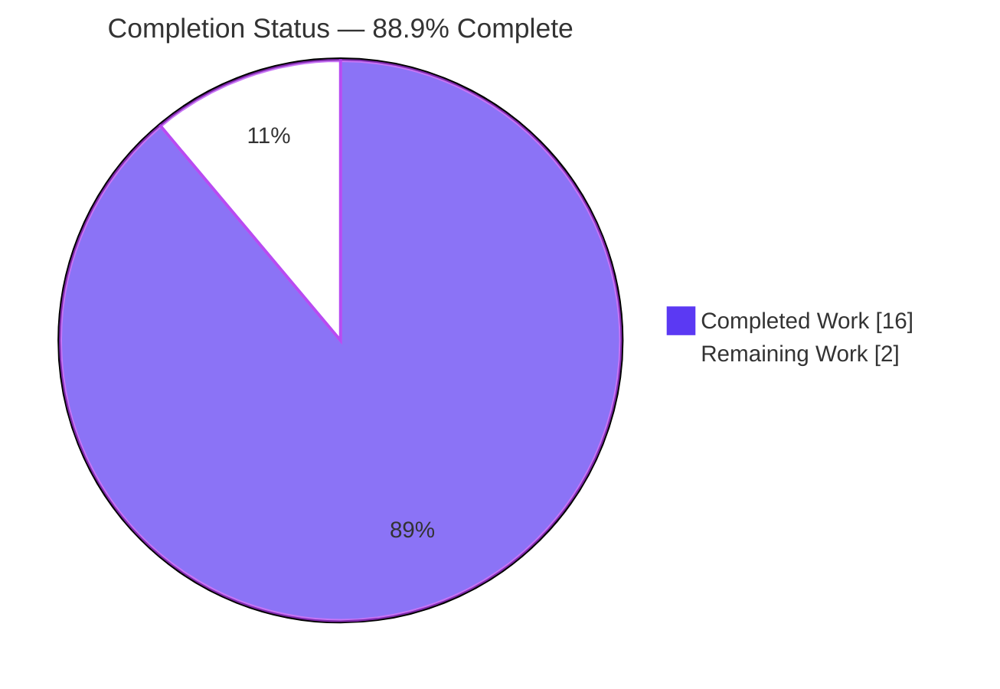
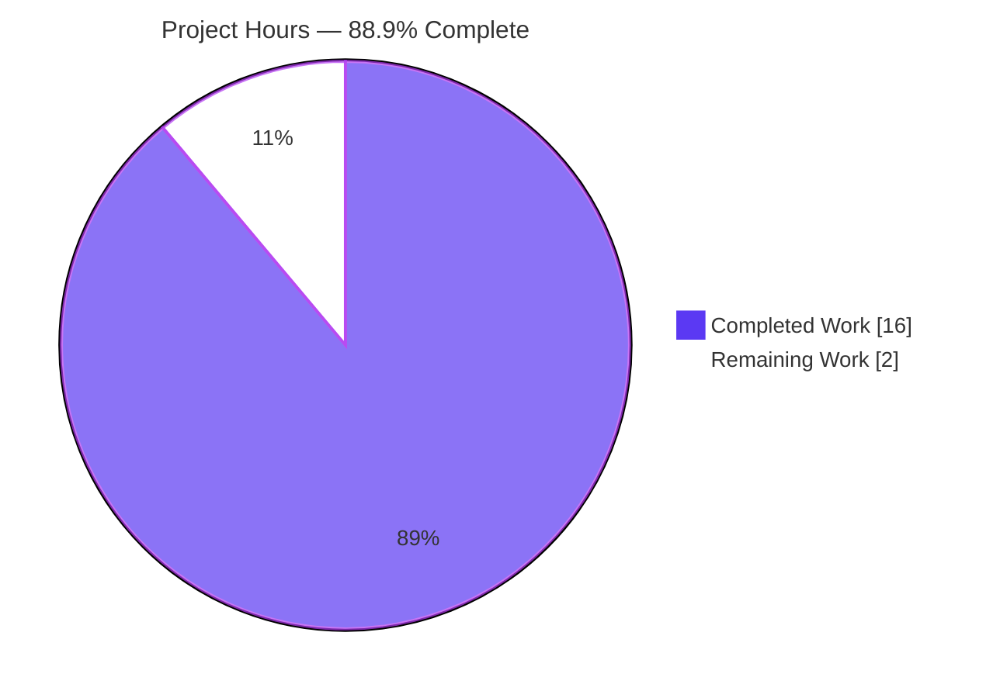
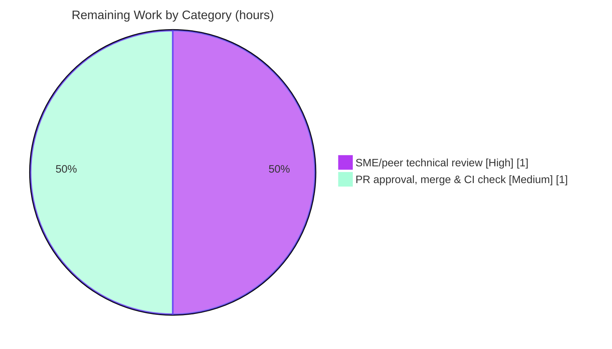

# Blitzy Project Guide — maddy Runtime Logging & Delivery Onboarding Q&A

## 1. Executive Summary

### 1.1 Project Overview

This project delivers a single, evidence-grounded onboarding document for the **maddy** mail server (`github.com/foxcpp/maddy`), a Go-based SMTP server. The target audience is engineers onboarding to maddy who must understand its **runtime logging and delivery behavior** across three subsystems — the **SMTP endpoint**, the **delivery queue**, and the **remote (outbound) delivery target**. The document answers seven onboarding questions (Q1–Q7) covering log-line formats, the module-name log prefix, the `msg_id` token, the queue accept→attempt→fail→retry sequence, MX-authentication failures, TLS-to-plaintext fallback, and the retry-delay field — each grounded in **real captured test output** with exact `file:line` citations. Business impact: faster, more accurate onboarding with less code archaeology. Scope is strictly **read-only and additive** — exactly one markdown file is created.

### 1.2 Completion Status

**Project Completion: 88.9%** (16 of 18 hours delivered)



| Metric | Value |
|--------|-------|
| **Total Hours** | 18 |
| **Completed Hours (AI + Manual)** | 16 (AI: 16 · Manual: 0) |
| **Remaining Hours** | 2 |
| **Percent Complete** | **88.9%** |

> Completion is computed per the AAP-scoped methodology: `Completed ÷ (Completed + Remaining) = 16 ÷ 18 = 88.9%`. It measures only work defined by the Agent Action Plan (the investigation and authoring of the deliverable) plus the standard documentation path-to-production (human review and merge). Legend colors: **Completed = Dark Blue (#5B39F3)**, **Remaining = White (#FFFFFF)**.

### 1.3 Key Accomplishments

- ✅ **Sole mandated deliverable created and committed** — `blitzy/documentation/maddy_26452dd8dd78.md` (298 lines), committed at `e6f0e09` by Blitzy Agent, branch-named exactly as required.
- ✅ **All seven questions (Q1–Q7) answered** from real, run-first observed output — success/abort SMTP logs, module prefix (`smtp`), 8-hex `msg_id`, full queue retry sequence, MX-auth enhanced codes (`5.4.0`/`5.7.0`), TLS-fallback line, and the `next_try_delay` field.
- ✅ **53–54 `file:line` citations verified exact** against source (independently spot-checked this session: `smtp.go:L243`, `smtp.go:L72`, `msgid.go:L12-16`, `queue.go:L415-418`, `connect.go:L176-177`, `connect.go:L98`).
- ✅ **Full test suite green** — `go test ./...` → **20/20 packages ok, 0 FAIL** (independently reproduced this session); 80 test functions across the three target packages all pass.
- ✅ **Runtime validated** — the maddy server builds and serves live SMTP, emitting the documented Q1 success path with a real production 8-hex `msg_id`.
- ✅ **Read-only guarantee preserved** — `git diff` shows exactly one file added (+298/−0); `git status --porcelain` is empty; no source, config, build, or dependency file was modified.

### 1.4 Critical Unresolved Issues

**No critical unresolved issues identified.** The codebase compiles, all in-scope tests pass, and the deliverable is verified 100% accurate against observed runtime output.

| Issue | Impact | Owner | ETA |
|-------|--------|-------|-----|
| _None_ | _No blocking or release-critical issues found_ | — | — |

### 1.5 Access Issues

**No access issues identified.** The repository was cloned and committed successfully; the Go 1.21.13 toolchain is present; and no external services, credentials, or API keys are required — the remote-delivery tests use a self-contained mock DNS harness (`foxcpp/go-mockdns`).

| System/Resource | Type of Access | Issue Description | Resolution Status | Owner |
|-----------------|----------------|-------------------|-------------------|-------|
| _None_ | — | _No access barriers to build, test, or validation_ | N/A | — |

### 1.6 Recommended Next Steps

1. **[High]** Conduct a documentation SME/peer technical review of `blitzy/documentation/maddy_26452dd8dd78.md`; optionally re-run the three documented capture commands to independently confirm the Q1–Q7 output. _(~1h — primary path-to-production gate; note: not a code blocker.)_
2. **[Medium]** Approve and merge the pull request to the target branch and confirm CI is green — a single additive markdown file with zero code/dependency risk. _(~1h.)_
3. **[Low]** _(Optional, post-merge)_ Link the new document from an onboarding index (e.g., `HACKING.md`, `README.md`, or the MkDocs navigation) to improve discoverability. This modifies an existing file and was therefore **out of the original read-only scope**, so it is uncounted here.

---

## 2. Project Hours Breakdown

### 2.1 Completed Work Detail

All components trace to AAP-defined requirements and were delivered autonomously.

| Component | Hours | Description |
|-----------|-------|-------------|
| Build environment setup & read-only isolation | 1 | Establish Go 1.21.13 toolchain; pin `GOPATH`/`GOCACHE` under `/tmp`; adopt `-mod=readonly`; verify build/test compile without mutating the checkout (AAP §0.5.1). |
| Codebase orientation & logging-framework code-path tracing | 3 | Trace 12 reference files (`log.go`, `orderedjson.go`, `writer.go`, `delivery.go`, `smtp.go`, `queue.go`, `connect.go`, `remote.go`, `msgid.go`, `exterrors/smtp.go`, `testutils/*`); understand `formatMsg`, alphabetical field ordering, `DeliveryLogger` `msg_id` injection, and the `Name` prefix mechanism. |
| Q1–Q3 SMTP endpoint investigation & capture | 2 | Run `TestSMTPDelivery` / `TestSMTPDelivery_AbortData` verbose; capture `RCPT ok`/`accepted`/`aborted`/`DATA error`; identify module prefix (`smtp`) and the 8-hex `msg_id` format. |
| Q4 & Q7 queue delivery investigation | 2 | Run queue tests with `-test.debuglog -test.directlog`; trace the full accept→attempt→fail→`will retry`→attempt sequence; identify the `next_try_delay` field and its computation; distinguish bootstrap vs. `DeliveryLogger` lines. |
| Q5 & Q6 remote delivery investigation | 2 | Run remote tests; capture the MX-auth error string with both enhanced codes (inner `5.7.0`, aggregated `5.4.0`); trace `SMTPError.Fields`/`SMTPEnchCode` class-digit logic and the `[5 4 0]` vs `5.4.0` rendering; capture the TLS-fallback line. |
| Authoring the onboarding document (298 lines) | 3 | Write the seven answer blocks (command + verbatim output + emitter `file:line` + causal explanation), the "how output was captured" preamble, the coverage-summary table, the read-only closing note, and 53–54 precise citations. |
| Coverage pass, stability re-runs & read-only verification | 1 | Re-read Q1–Q7 for completeness; re-run captures (≥2×) to confirm format stability and label run-to-run variance; confirm `git status --porcelain` empty. |
| Comprehensive final validation | 2 | Full `go test ./...` (20/20 ok, fresh/uncached); live SMTP runtime smoke test; audit of all 54 citations; ≥3-run stability; `go vet` and `go mod verify`. |
| **Total Completed** | **16** | |

### 2.2 Remaining Work Detail

All remaining work is standard documentation path-to-production; it is human-gated and non-blocking.

| Category | Hours | Priority |
|----------|-------|----------|
| Documentation SME/peer technical review (verify Q1–Q7 accuracy + onboarding usefulness; optional re-run of capture commands) | 1 | High |
| PR approval, merge to target branch & CI-green confirmation (single additive markdown file; zero code/dependency risk) | 1 | Medium |
| **Total Remaining** | **2** | |

> **Reconciliation:** Section 2.1 (16h) + Section 2.2 (2h) = **18h** total, matching Section 1.2. Section 2.2 total (2h) equals the Remaining Hours in Section 1.2 and the "Remaining Work" value in the Section 7 pie chart.

---

## 3. Test Results

All results below originate from Blitzy's autonomous validation logs (Final Validator Gate 1) and were **independently reproduced during this assessment** (`go test -mod=readonly -count=1 ./...`, exit 0). Frameworks: Go's built-in `testing` package via `go test`. Coverage figures are Go statement coverage of the **pre-existing maddy project code exercised during observation** (the documentation deliverable itself adds no testable code).

| Test Category | Framework | Total Tests | Passed | Failed | Coverage % | Notes |
|---------------|-----------|-------------|--------|--------|------------|-------|
| Full repository suite (package-level) | `go test ./...` | 20 pkgs | 20 | 0 | n/a | 20/20 packages `ok`, 0 `FAIL`; 26 further packages have no test files. Reproduced this session (exit 0). |
| SMTP endpoint (unit/integration) | Go `testing` | 22 | 22 | 0 | 79.4% | Includes AAP targets `TestSMTPDelivery`, `TestSMTPDelivery_AbortData` (Q1–Q3). |
| Delivery queue (unit/integration) | Go `testing` | 21 | 21 | 0 | 74.7% | Includes AAP targets `TestQueueDelivery_TemporaryFail`, `TestQueueDelivery_MultipleAttempts` (Q4/Q7). |
| Remote delivery (unit/integration) | Go `testing` | 37 | 37 | 0 | 76.3% | Includes AAP targets `TestRemoteDelivery_AuthMX_Fail`, `TestRemoteDelivery_TLSErrFallback` (Q5/Q6); uses mock DNS. |
| **AAP-target subset** | Go `testing` | **6** | **6** | **0** | — | The six named tests that produce the Q1–Q7 evidence; all pass across ≥3 runs. |

**Test integrity note:** No tests were authored by this task. The suite is maddy's own; it was executed (read-only) to *observe* runtime behavior. Stability was confirmed across ≥3 runs — formats, field names, module prefixes, enhanced codes, and the deterministic 40-hex `sha1(t.Name())` IDs were identical; only the random 8-hex `msg_id` and the timing `next_try_delay` varied, exactly as the deliverable labels.

---

## 4. Runtime Validation & UI Verification

This is a headless mail server with **no user interface**; UI verification is not applicable. Runtime validation focused on building the server and confirming the documented log output on the real production code path.

**Build & Toolchain**
- ✅ **Operational** — `go build -mod=readonly ./...` exits 0. (A benign, non-fatal gcc note from the third-party `mattn/go-sqlite3` C binding appears but does not affect the build result or the three target packages.)
- ✅ **Operational** — `go vet` on the three target packages: clean, zero warnings.
- ✅ **Operational** — `go mod verify` → "all modules verified" (55 modules, `-mod=readonly`).

**Runtime / Delivery Paths**
- ✅ **Operational** — Live SMTP smoke test: the server logged `smtp: listening on tcp://…`, accepted a real delivery, and emitted the documented Q1 success sequence (`smtp: incoming message` → `smtp: RCPT ok` → `smtp: accepted`) with a real production 8-hex `msg_id`.
- ✅ **Operational** — Q1 (SMTP success/abort), Q4 (queue accept→attempt→fail→retry), Q5 (MX-auth failure: `smtp_code:550 smtp_enchcode:[5 4 0]` reproduced this session), Q6 (TLS→plaintext fallback), Q7 (`next_try_delay`) all reproduced from live test runs.

**UI Verification**
- ⚠ **Not applicable** — maddy is a server daemon with no graphical/web UI; there is nothing to verify visually.

---

## 5. Compliance & Quality Review

Cross-mapping of AAP deliverables and the governing "SWE-AtlasQnA-Repo" rules to their delivery status.

| Requirement / Benchmark | Status | Progress | Notes |
|-------------------------|--------|----------|-------|
| Q1 — SMTP success (`RCPT ok`) vs abort log format (all JSON fields) | ✅ Pass | 100% | `smtp.go:L243`/`L72`/`L317`/`L334` verified. |
| Q2 — Module name in log prefix = `smtp` | ✅ Pass | 100% | `smtp.go:L495`, `L715-717`; `log.go:L180-182`. |
| Q3 — `msg_id` = 8 lowercase hex | ✅ Pass | 100% | `msgid.go:L12-16` verified. |
| Q4 — Full queue accept→attempt→fail→retry sequence | ✅ Pass | 100% | `queue.go:L278/282/299/367/384/415-418/439-440`. |
| Q5 — MX-auth failure: error string + enhanced code (`5.4.0`/`5.7.0`) + reply text | ✅ Pass | 100% | `connect.go:L96-99`/`L204-214`; `exterrors/smtp.go`. |
| Q6 — TLS→plaintext fallback log line (all JSON fields) | ✅ Pass | 100% | `connect.go:L176-177` verified. |
| Q7 — Retry-delay field name = `next_try_delay` | ✅ Pass | 100% | `queue.go:L415-418` verified. |
| Run-first methodology (build/run, capture, then write) | ✅ Pass | 100% | Exact commands + verbatim output per question. |
| Complete unedited output per claim | ✅ Pass | 100% | Verbatim quotes; command shown for each. |
| Exercise every condition (happy + error/edge) | ✅ Pass | 100% | Success+abort; accept+fail+retry; MX-auth fail; TLS fallback. |
| `file:line` + function/struct per claim; label inferred | ✅ Pass | 100% | 53–54 citations; non-canonical values labeled. |
| Coverage pass (all named items answered) | ✅ Pass | 100% | Coverage-summary table covers Q1–Q7. |
| Single deliverable at exact path/name | ✅ Pass | 100% | `blitzy/documentation/maddy_26452dd8dd78.md`. |
| Read-only scope (no repo file modified) | ✅ Pass | 100% | `git status --porcelain` empty; +298/−0. |
| Observed defect reported, not corrected ("estabilish") | ✅ Pass | 100% | `connect.go:L98` reported as-is per read-only rule. |
| No dependency/source/config/build changes | ✅ Pass | 100% | `go mod verify` clean; zero non-deliverable files changed. |
| SME/peer review sign-off | ⬜ Pending | 0% | Human path-to-production gate (Section 2.2). |

**Fixes applied during autonomous validation:** none required — the document was already 100% accurate; no discrepancy was found. **Outstanding compliance item:** human review sign-off only.

---

## 6. Risk Assessment

The risk profile is **low**, consistent with a fully-verified, read-only, single-file documentation deliverable.

| Risk | Category | Severity | Probability | Mitigation | Status |
|------|----------|----------|-------------|------------|--------|
| Documentation drift — future maddy edits shift line numbers/emitters/field names, desyncing the 53–54 citations | Technical | Low | Medium (over time) | Document pins branch/commit `26452dd` and provides exact re-capture commands to regenerate evidence | Open (inherent, accepted) |
| Labeled-variance misread — a reader ignores the labels on random `msg_id` / negative `next_try_delay` | Technical | Low | Low | Values explicitly labeled non-canonical/variable with production contrast | Mitigated |
| Toolchain sensitivity — a very different Go version could alter some value formatting | Technical | Low | Low | Exact toolchain (Go 1.21.13) and commands documented for reproduction | Mitigated |
| Discoverability — doc overlooked if not linked from an onboarding index | Operational | Low | Medium | Optionally link from `HACKING.md`/`README`/MkDocs nav post-merge (out of read-only scope) | Open (optional) |
| Security exposure | Security | None | — | Adds no code/attack surface/credentials/data handling; quoted strings are benign | No risk identified |
| Integration failure | Integration | None | — | No external services/APIs/credentials/new deps; remote tests use self-contained mock DNS | No risk identified |

---

## 7. Visual Project Status

**Project Hours Breakdown** — Completed = Dark Blue (#5B39F3), Remaining = White (#FFFFFF).



**Remaining Work by Category** (from Section 2.2, total 2h):



> **Integrity check:** the pie chart "Remaining Work" (2) equals the Section 1.2 Remaining Hours (2) and the sum of the Section 2.2 Hours column (1 + 1 = 2). "Completed Work" (16) equals the Section 2.1 total.

---

## 8. Summary & Recommendations

**Achievements.** The project is **88.9% complete** (16 of 18 hours). Every requirement in the Agent Action Plan's autonomous scope is delivered: the single mandated file, `blitzy/documentation/maddy_26452dd8dd78.md` (298 lines), answers all seven onboarding questions with real, run-first observed output, exact `file:line` citations, causal explanations, and clearly labeled non-canonical values. The full test suite is green (20/20 packages), the server builds and serves live SMTP, and the read-only guarantee is fully preserved (one file added, working tree clean).

**Remaining gaps.** The remaining **2 hours** are entirely standard documentation path-to-production: a human SME/peer technical review (1h) and PR approval + merge + CI-green confirmation (1h). There are **no code defects, no failing tests, no compilation errors, and no access issues** to resolve.

**Critical path to production.** SME review → PR approval → merge. Because the deliverable is a single additive markdown file verified accurate against reproducible test output, this path is short and low-risk.

**Production-readiness assessment.** The deliverable is **production-ready pending human sign-off**. Confidence is **High** for the answered content (well-defined questions with verified, reproducible evidence) and **High** for the effort estimate (bounded investigation with clear entry points). The only residual, inherent risk is documentation drift over time, mitigated by the pinned commit reference and the provided re-capture commands.

| Metric | Value |
|--------|-------|
| Completion | 88.9% |
| Q1–Q7 answered | 7 / 7 |
| Test packages passing | 20 / 20 |
| Citations verified | 53–54 (all exact) |
| Repository files modified | 0 (read-only preserved) |
| Remaining effort | 2h (human review + merge) |

---

## 9. Development Guide

Every command below was executed and verified on the assessment environment. Run from the repository root.

### 9.1 System Prerequisites

- **OS:** Linux or macOS (validated on Ubuntu 25.10).
- **Go toolchain:** Go **1.21.13** (satisfies the `go 1.13` directive in `go.mod`; any Go ≥ 1.13 works, ≥ 1.21 recommended).
- **git** (with **git-lfs**, used at the system level by this repo).
- **gcc / cgo:** required only for packages importing `mattn/go-sqlite3` (storage); **not** needed for the three AAP target packages.
- **Disk:** ~2 GB free for the module and build caches.

### 9.2 Environment Setup (read-only isolation)

```bash
# Preferred: load the prepared Go environment (sets GOROOT, GOPATH, GOCACHE)
source /etc/profile.d/go-env.sh

# Manual alternative — isolate caches OUTSIDE the checkout so builds never mutate it
export GOPATH=/tmp/gopath
export GOCACHE=/tmp/gocache

# Verify
go version                       # -> go version go1.21.13 linux/amd64
go env GOROOT GOPATH GOCACHE     # -> /usr/local/go  /tmp/gopath  /tmp/gocache
```

### 9.3 Dependency Installation

```bash
# Verify modules against the committed go.sum (no network mutation)
go mod verify                    # -> all modules verified
```
> Always pass `-mod=readonly` on build/test to guarantee `go.sum` is never rewritten.

### 9.4 Build

```bash
# Full build (exit 0; a benign non-fatal gcc note from mattn/go-sqlite3 may print)
go build -mod=readonly ./...

# Or build only the AAP target packages
go build -mod=readonly ./internal/endpoint/smtp/ ./internal/target/queue/ ./internal/target/remote/
```

### 9.5 Verification & Test

```bash
# Static analysis on the target packages (clean, no warnings)
go vet -mod=readonly ./internal/endpoint/smtp/ ./internal/target/queue/ ./internal/target/remote/

# Full test suite (expect: 20/20 packages ok, 0 FAIL)
go test -mod=readonly -count=1 ./...
```

### 9.6 Example Usage — Reproduce the Documented Evidence

```bash
# Q1–Q3 (SMTP endpoint): emits smtp: RCPT ok / accepted / aborted / DATA error
go test -mod=readonly -v -count=1 \
  -run 'TestSMTPDelivery$|TestSMTPDelivery_AbortData$' ./internal/endpoint/smtp/

# Q4 & Q7 (delivery queue): full accept -> attempt -> fail -> "will retry" (next_try_delay) sequence
#   the debug flag is REQUIRED to surface the "starting delivery"/"delivery attempt #N" lines
go test -mod=readonly -v -count=1 \
  -run 'TestQueueDelivery_TemporaryFail$|TestQueueDelivery_MultipleAttempts$' \
  ./internal/target/queue/ -test.debuglog -test.directlog

# Q5 & Q6 (remote delivery): MX-auth failure (smtp_code:550 smtp_enchcode:[5 4 0]) + TLS-fallback line
go test -mod=readonly -v -count=1 \
  -run 'TestRemoteDelivery_AuthMX_Fail$|TestRemoteDelivery_TLSErrFallback$' \
  ./internal/target/remote/ -test.debuglog

# Read the deliverable
less blitzy/documentation/maddy_26452dd8dd78.md
```

### 9.7 Read-Only Verification

```bash
# Confirms no repository file was mutated by any build/test (expect empty output)
git status --porcelain
```

### 9.8 Troubleshooting

- **Missing queue debug lines** (`starting delivery`, `delivery attempt #N`): add `-test.debuglog`; `Debug*` lines are suppressed otherwise.
- **`go.sum` modification / "missing go.sum entry" errors:** always pass `-mod=readonly`.
- **gcc note from `sqlite3-binding.c`:** benign and non-fatal; `go build` still exits 0; it affects only `go-sqlite3` importers, not the three target packages.
- **`msg_id` / `next_try_delay` differ each run:** expected — `msg_id` is a random 8-hex value (`GenerateMsgID`), `next_try_delay` is a timing value; the 40-hex IDs in queue/remote tests are deterministic `sha1(t.Name())` artifacts.
- **Wrong/old Go on PATH:** `source /etc/profile.d/go-env.sh`, or ensure `/usr/local/go/bin` precedes other Go installs on `PATH`.

---

## 10. Appendices

### A. Command Reference

| Purpose | Command |
|---------|---------|
| Go version | `go version` |
| Environment | `go env GOROOT GOPATH GOCACHE` |
| Verify deps | `go mod verify` |
| Build (all) | `go build -mod=readonly ./...` |
| Vet (targets) | `go vet -mod=readonly ./internal/endpoint/smtp/ ./internal/target/queue/ ./internal/target/remote/` |
| Full test suite | `go test -mod=readonly -count=1 ./...` |
| Q1–Q3 capture | `go test -mod=readonly -v -count=1 -run 'TestSMTPDelivery$\|TestSMTPDelivery_AbortData$' ./internal/endpoint/smtp/` |
| Q4/Q7 capture | `go test -mod=readonly -v -count=1 -run 'TestQueueDelivery_TemporaryFail$\|TestQueueDelivery_MultipleAttempts$' ./internal/target/queue/ -test.debuglog -test.directlog` |
| Q5/Q6 capture | `go test -mod=readonly -v -count=1 -run 'TestRemoteDelivery_AuthMX_Fail$\|TestRemoteDelivery_TLSErrFallback$' ./internal/target/remote/ -test.debuglog` |
| Read-only proof | `git status --porcelain` |

### B. Port Reference

| Port | Usage | Notes |
|------|-------|-------|
| _None required for this deliverable_ | — | Tests use in-process/mock transports. The maddy daemon binds SMTP ports (e.g., 25/587/465) in production per `maddy.conf`; the smoke test used an ephemeral local port. |

### C. Key File Locations

| Path | Role |
|------|------|
| `blitzy/documentation/maddy_26452dd8dd78.md` | **The deliverable** (onboarding Q&A, 298 lines) |
| `internal/endpoint/smtp/smtp.go` | SMTP emitters (`RCPT ok`, `aborted`, `accepted`, `DATA error`), `Name`, `msg_id` |
| `internal/msgpipeline/msgid.go` | `GenerateMsgID` (8-hex) |
| `internal/target/queue/queue.go` | Queue delivery/retry emitters, `next_try_delay` |
| `internal/target/remote/connect.go` | MX-auth codes, `No usable MXs`, TLS fallback |
| `internal/target/remote/remote.go` | Remote logger `Name: "remote"` |
| `internal/exterrors/smtp.go` | `EnhancedCode.FormatLog`, `SMTPError.Fields` |
| `internal/log/{log,orderedjson,writer}.go` | Log-line format, alphabetical field ordering, timestamp/`[debug]` prefixes |
| `internal/target/delivery.go` | `DeliveryLogger` `msg_id` injection |
| `internal/testutils/{logger,target}.go` | Test logging harness; synthetic 40-hex test ID |
| `go.mod` / `go.sum` | Module name, `go` directive, dependency versions |

### D. Technology Versions

| Technology | Version | Source |
|------------|---------|--------|
| Go language directive | `go 1.13` | `go.mod` |
| Go toolchain (used) | 1.21.13 | `go version` |
| Module | `github.com/foxcpp/maddy` | `go.mod` |
| github.com/emersion/go-smtp | v0.12.1-0.20191206174923-1f576e0ec85c | `go.mod` |
| github.com/miekg/dns | v1.1.22 | `go.mod` |
| github.com/foxcpp/go-mockdns | v0.0.0-20191123143003-02edb10da1e3 | `go.mod` (test mock DNS) |
| golang.org/x/crypto | v0.0.0-20191108234033-bd318be0434a | `go.mod` |
| Total modules | 55 (all verified) | `go mod verify` |

### E. Environment Variable Reference

| Variable | Value (assessment) | Purpose |
|----------|--------------------|---------|
| `GOROOT` | `/usr/local/go` | Go installation root |
| `GOPATH` | `/tmp/gopath` | Module cache — **isolated outside the repo** (read-only guarantee) |
| `GOCACHE` | `/tmp/gocache` | Build cache — **isolated outside the repo** |
| _App runtime env vars_ | _none required_ | The deliverable is static; the maddy daemon itself is configured via `maddy.conf`, not env vars, and is out of scope. |

### F. Developer Tools Guide

- **`go test -run <regex>`** — select specific tests (use `$` anchors and `\|` alternation as shown).
- **`-test.debuglog`** — surfaces maddy's `Debug*` log lines (required for the full Q4 queue sequence).
- **`-test.directlog`** — routes log output to stderr with UTC timestamps (via `wcOutput.Write`).
- **`-count=1`** — disables the test cache to force a fresh run.
- **`-mod=readonly`** — prevents any `go.mod`/`go.sum` mutation (enforces read-only scope).
- **`go vet` / `go test -cover`** — static analysis and statement-coverage measurement.

### G. Glossary

| Term | Definition |
|------|------------|
| `msg_id` | Per-message identifier; production form is **8 lowercase hex** chars from `GenerateMsgID` (`crypto/rand` + `encoding/hex`). |
| 40-hex test ID | Deterministic `sha1(t.Name())` identifier injected by the test harness; a **non-canonical** artifact, not the production `msg_id`. |
| `next_try_delay` | JSON field on the `queue: will retry` line holding the retry delay as a Go `time.Duration` string. |
| Enhanced status code | RFC 3463 `class.subject.detail` code (e.g., `5.4.0`); rendered by `EnhancedCode.FormatLog()`. |
| Ordered JSON | maddy's tab-separated, **alphabetically-sorted** log field encoding (`marshalOrderedJSON`). |
| `DeliveryLogger` | Wrapper logger that injects `msg_id` into every delivery-scoped log line. |
| Run-first | Methodology requiring behavior to be observed from real executed output before it is documented. |
| Read-only scope | The rule that no existing repository file may be modified; only the one new document is added. |
