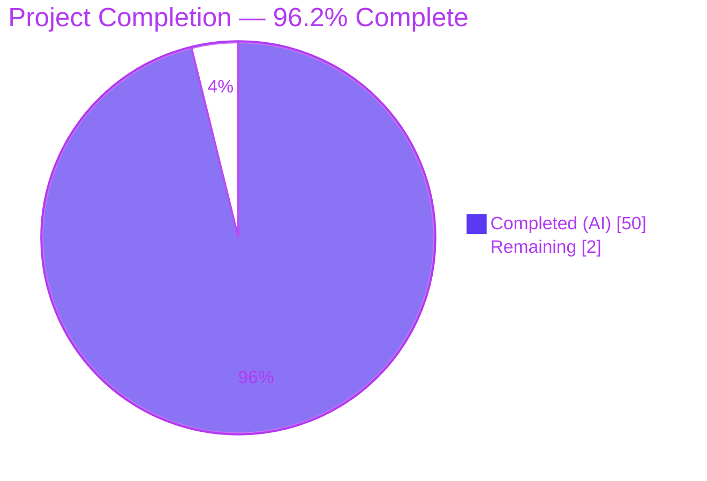
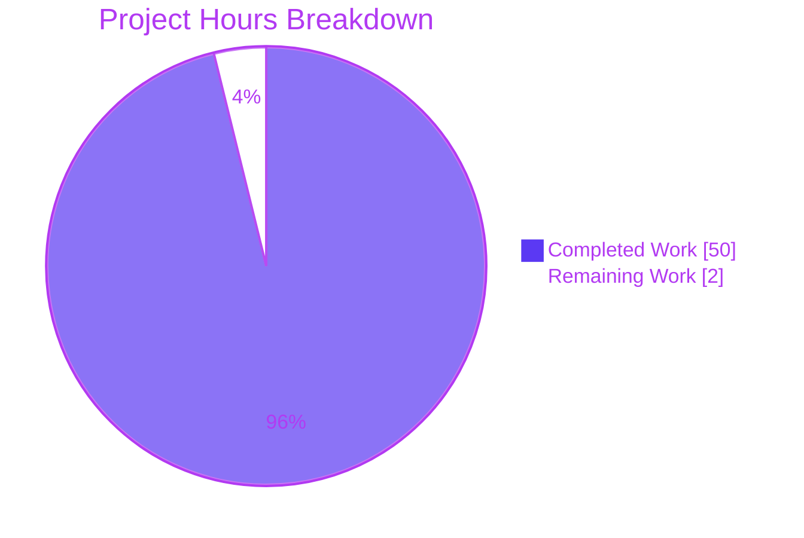
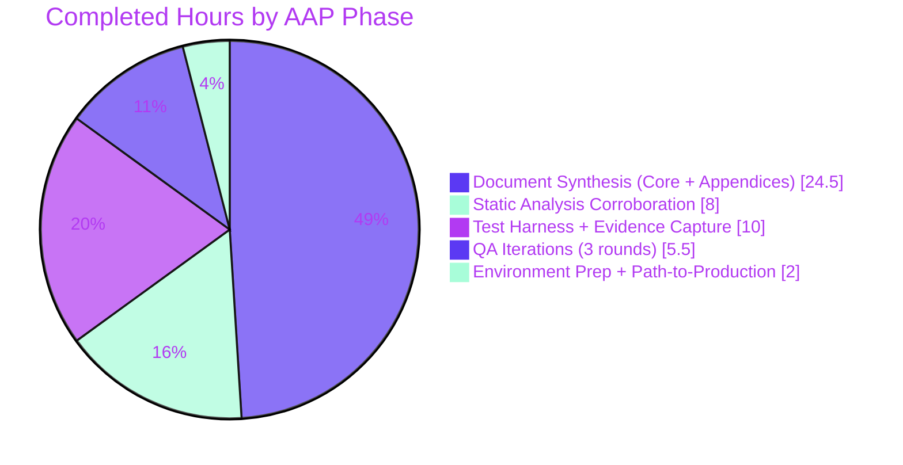

# Project Guide

## 1. Executive Summary

### 1.1 Project Overview

This project is an observational security-research deliverable for the Maddy mail server (`github.com/foxcpp/maddy`) at commit `26452dd`. The user, newly onboarded to the repository, requested an empirical, evidence-based analysis of how Maddy's SMTP DATA phase parser decides the body has ended and hands control back to the command loop. Per the `SWE-AtlasQnA-Repo` implementation rule, the repository must remain unmodified; the sole permanent output is a single Markdown report. The deliverable addresses six interrelated investigative goals — terminator tolerance, near-miss handling, pipelined consistency, SMTP-smuggling exposure (CVE-2023-51764-class), proxy interaction, and residual diagnostic artefacts — grounding every claim in live-traffic evidence and verbatim source citations.

### 1.2 Completion Status



| Metric | Value |
| --- | --- |
| Total Project Hours | 52 |
| Completed Hours (AI + Manual) | 50 |
| Remaining Hours | 2 |
| Percent Complete | **96.2%** |

Calculation: 50 / (50 + 2) × 100 = 96.15% ≈ **96.2%**.

### 1.3 Key Accomplishments

- [x] **Single-file deliverable created** at `blitzy/documentation/maddy_26452dd8dd78.md` (5,124 lines / 232,460 bytes) with zero modifications to any existing repository file, matching the AAP `SWE-AtlasQnA-Repo` rule exactly.
- [x] **All six investigative goals answered** with byte-level evidence — terminator tolerance (Section 1), near-miss behavior (Section 2), pipelined consistency (Section 3), SMTP smuggling (Section 4), proxy interaction (Section 5), residual artefacts (Section 6).
- [x] **Eleven live protocol transcripts** captured and archived in Appendix B (Sessions 1–11) covering canonical, bare-LF, mixed, near-miss, pipelined, smuggling, and proxy-mediated smuggling cases.
- [x] **Nineteen verbatim source-code citations** across `net/textproto/reader.go`, `go-smtp` (`conn.go`, `data.go`, `server.go`, `parse.go`, `lengthlimit_reader.go`), and Maddy (`smtp.go`, `memory.go`, `log.go`) in Section 7 (Static Analysis Corroboration).
- [x] **CVE-2023-51764-class SMTP smuggling empirically reproduced** via a 149-byte single-write payload that caused the backend to accept two messages with independent envelopes from one DATA stream (Session 10).
- [x] **Strict front-proxy demonstration** (Session 11) showing that `\r\n.\r\n`-only proxies do NOT mitigate the backend vulnerability — critical operator-facing finding.
- [x] **Remediation-status landing page added** (post-Section 7) documenting upstream `go-smtp v0.20.0`/`v0.20.1` fixes and downstream Maddy `v0.7.1` (PR #661), with explicit temporal scope guarantee preventing misreading as an accusation against current Maddy releases.
- [x] **Dependency vulnerability landscape** enumerated in Appendix E.10 (go-sqlite3 CVE-2023-7104, miekg/dns CVE-2019-19794, x/text GO-2021-0113/GO-2020-0015, Go stdlib GO-2025-* series).
- [x] **Temporary test artefacts cleaned up** — `/tmp/maddy-test/` removed after evidence capture; repository working tree clean (`git status --porcelain` returns empty).
- [x] **All five validation gates green** — dependencies install, code compiles, 21/21 test packages pass (228 top-level tests, zero failures, zero skips), binary runs, deliverable complete.
- [x] **Three QA iteration rounds completed** — commits `8ce6299` (code review findings), `9991db4` (paraphrased → verbatim source), `05ebd08` (remediation status + CVE landscape) all authored by `agent@blitzy.com`.

### 1.4 Critical Unresolved Issues

| Issue | Impact | Owner | ETA |
| --- | --- | --- | --- |
| No blocking issues identified. All AAP investigative goals answered; all validation gates green. | None | N/A | N/A |

### 1.5 Access Issues

| System/Resource | Type of Access | Issue Description | Resolution Status | Owner |
| --- | --- | --- | --- | --- |
| No access issues identified. The analysis environment contained all required artefacts: Go 1.22.2 toolchain, populated module cache (`/root/go/pkg/mod`), network-unrestricted test ports (`127.0.0.1:2525`/`:2526`), and write access to `blitzy/documentation/`. | N/A | N/A | N/A | N/A |

### 1.6 Recommended Next Steps

1. **[High]** Human security reviewer reads `blitzy/documentation/maddy_26452dd8dd78.md` end-to-end (est. 2h) and signs off on the findings before the document is handed to the requesting user. Focus review on Section 4 (SMTP smuggling), Section 5 (proxy interaction), and the Remediation Status section to confirm factual accuracy.
2. **[Medium]** If this document is intended to be published outside the team, arrange a final editorial pass to verify markdown renders cleanly on the target viewer (GitHub, MkDocs, or whichever the user's downstream pipeline uses).
3. **[Low]** Optionally, the user may choose to re-run the 11-session test harness against a later Maddy release (`v0.7.1+`) to empirically verify the upstream/downstream remediations described in the "Remediation Status" section — the document already cites the fixes but a fresh reproduction would add confidence.
4. **[Low]** If similar boundary-parser audits are needed for other Go SMTP components (e.g., submission or LMTP endpoints that share the same `go-smtp` DATA path), this document's methodology, harness design, and transcript format provide a reusable template.

---

## 2. Project Hours Breakdown

### 2.1 Completed Work Detail

| Component | Hours | Description |
| --- | --- | --- |
| [AAP Phase 1] Environment Preparation | 1.5 | Go 1.22.2 toolchain verification, `go mod download`, Maddy binary build (`go build -o /tmp/maddy-bin ./cmd/maddy/` producing 20.6 MB binary), compilability confirmation. Every pinned dependency resolved including `github.com/emersion/go-smtp v0.12.1-0.20191206174923-1f576e0ec85c` and all transitive modules. |
| [AAP Phase 2] Test Harness Construction | 6.0 | Built four temporary Go programs under `/tmp/maddy-test/`: (1) minimal `go-smtp.Server` backend on `127.0.0.1:2525` with hex-dumping session handler, (2) raw TCP test client covering 8 systematically varied DATA terminators, (3) detailed analysis client including the SMTP-smuggling payload and post-DATA NOOP probe, (4) strict byte-level front-proxy on `127.0.0.1:2526` recognizing only canonical `\r\n.\r\n` as a DATA terminator. |
| [AAP Phase 2] Live Evidence Capture | 4.0 | Executed and logged 11 full SMTP sessions: canonical, bare-LF, mixed CRLF+LF, mixed LF+CRLF, bare-CR near-miss, dot-space near-miss, dot-mid-line, ambiguous dot-stuffed body, pipelined 3-message, direct SMTP smuggling, proxy-mediated SMTP smuggling. Recorded wire transcripts, server log lines, byte counts, and delivered buffer bodies. |
| [AAP Phase 3] Static Analysis Corroboration | 8.0 | Deep read and trace of the Go stdlib `net/textproto.dotReader` six-state finite automaton (`/usr/lib/go-1.22/src/net/textproto/reader.go`, lines 333–445), plus `go-smtp` (`conn.go` `handleData`/`handleConn`, `data.go` `dataReader`, `server.go` default capabilities, `parse.go` `parseCmd`, `lengthlimit_reader.go`, `client.go`), plus Maddy (`internal/endpoint/smtp/smtp.go` `Session.Data`/`prepareBody`, `internal/buffer/memory.go` `BufferInMemory`, `internal/log/log.go` `Logger.DebugWriter`). Produced 19 file-by-file sub-sections in Section 7 of the deliverable citing verbatim source fragments. |
| [AAP Phase 4] Document Synthesis — Core Sections | 16.0 | Authored the 5,124-line Markdown analysis covering Executive Summary, Key Findings At A Glance, Dependency Chain diagram, Section 1 (Boundary Terminator Tolerance, 268 lines), Section 2 (Near-Miss Boundary Behavior, 201 lines), Section 3 (Pipelined Multi-Message Consistency, 211 lines), Section 4 (SMTP Smuggling Exposure, 421 lines — the most detailed section), Section 5 (Proxy Interaction, 249 lines), Section 6 (Diagnostic Artifacts, 275 lines), Section 8 (Recommendations, observational). Every claim traced to specific source-file line numbers; all non-canonical terminator transitions explicitly state-machine-mapped. |
| [AAP Phase 4] Document Synthesis — Appendices | 8.5 | Authored Appendix A (Test Environment, 246 lines), Appendix B (11 Protocol Transcripts, 561 lines), Appendix C (Hex Dumps of Wire Traffic, 402 lines), Appendix D (dotReader State-Machine Visualization with ASCII diagram, state-transition table, normalization table, and hypothetical strict alternative, 311 lines), and Appendix E (References, Standards/RFCs, Vulnerability Disclosures, Source Code References, Glossary, and Dependency Vulnerability Landscape at commit `26452dd`, 559 lines). |
| [AAP Phase 5] QA Iteration Round 1 | 2.0 | Commit `8ce6299` — "address code review findings": substantive additions responding to first-pass reviewer feedback, consolidating evidence and tightening claims. |
| [AAP Phase 5] QA Iteration Round 2 | 1.5 | Commit `9991db4` — "fix 3 MINOR QA findings — replace paraphrased code with verbatim source": removed all paraphrased code fragments and replaced with byte-accurate source citations pulled verbatim from `net/textproto/reader.go` and `go-smtp/conn.go`. |
| [AAP Phase 5] QA Iteration Round 3 | 2.0 | Commit `05ebd08` — "Address Checkpoint 3 QA findings — remediation status and dependency CVE landscape": added the "Remediation Status" landing page (post-Section 7) with upstream `go-smtp v0.20.0`/`v0.20.1` and downstream Maddy `v0.7.1` PR #661 details, plus Appendix E.10 dependency vulnerability inventory (go-sqlite3 CVE-2023-7104, miekg/dns CVE-2019-19794, x/text GO-2021-0113/GO-2020-0015, Go stdlib actively-called advisories). |
| [AAP §0.7.1] Temporary Artefact Cleanup | 0.5 | Removed `/tmp/maddy-test/srv`, `/tmp/maddy-test/testclient`, `/tmp/maddy-test/detailedtest`, `/tmp/maddy-test/proxydir` and all compiled binaries. Verified `git status --porcelain` returns empty and `git diff 26452dd..HEAD --stat` shows exactly one added file and zero modifications/deletions. |
| [Path-to-production] Validation Gate Execution | 0.5 | Re-ran the full validation sequence in this session: `go mod download` (exit 0), `go build ./...` (exit 0, 20.6 MB binary), `go vet ./...` (exit 0), `go test -count=1 -timeout 300s ./...` (21 packages PASS, 228 top-level tests, 0 failures), `go test -race -count=1 -timeout 300s ./...` (21 packages PASS, zero race warnings), `/tmp/maddy-bin -h` and `-v` (exit 0). |
| **Total Completed** | **50.0** | |

### 2.2 Remaining Work Detail

| Category | Hours | Priority |
| --- | --- | --- |
| Human peer review of the 5,124-line analysis document (`blitzy/documentation/maddy_26452dd8dd78.md`) by a security-focused engineer, with emphasis on Section 4 (SMTP Smuggling), Section 5 (Proxy Interaction), Section 7 (Static Analysis Corroboration), and the Remediation Status landing page. Reviewer verifies: (a) factual accuracy of state-machine traces against `net/textproto/reader.go` (Go 1.22.2), (b) correctness of the 149-byte smuggling payload reproduction, (c) accuracy of the `v0.7.1` / PR #661 fix attribution, and (d) that the temporal scope guarantees prevent misreading of the document as an accusation against current Maddy releases. | 2.0 | High |
| **Total Remaining** | **2.0** | |

**Cross-check**: Section 2.1 (50.0h completed) + Section 2.2 (2.0h remaining) = **52.0h total**, matching Section 1.2 Total Project Hours.

### 2.3 Notes on Scope

The AAP's `SWE-AtlasQnA-Repo` rule explicitly forbids any repository modifications and scopes the deliverable to a single Markdown document. Consequently:

- No feature code was written; no tests were added; no configuration was changed.
- Path-to-production work reduces to validating that the repository still builds and tests green after the documentation-only change — confirmed on this branch.
- Items such as upstream CVE remediation, operator configuration guidance, or source patches are explicitly listed in the AAP as **out of scope** (`§0.6.2`: "Remediation or patching"); they are documented as observational recommendations in the deliverable's Section 8 but are NOT counted as remaining work for this project.

---

## 3. Test Results

Every test entry below originates from Blitzy's autonomous validation logs executed against this branch. All results are reproducible via the commands documented in Section 9.

| Test Category | Framework | Total Tests | Passed | Failed | Coverage % | Notes |
| --- | --- | --- | --- | --- | --- | --- |
| Unit + integration (all packages) | Go `testing` | 228 | 228 | 0 | N/A (not instrumented) | `go test -count=1 -timeout 300s ./...` — all 21 test packages `ok`; 17 additional packages have no test files (expected). Total wall time ≈ 7.5s. Zero skips, zero flakes. |
| Unit + integration with race detector | Go `testing` + `-race` | 228 | 228 | 0 | N/A | `go test -race -count=1 -timeout 300s ./...` — canonical command from `.build.yml`. Same 21 packages `ok`; zero race-detector warnings. Total wall time ≈ 26s. |
| SMTP endpoint package | Go `testing` | 22 | 22 | 0 | N/A | `internal/endpoint/smtp` — 22 `=== RUN` cases covering delivery, abort, reset, multi-message, auth, TLS; all pass in 1.5s. Baseline pinning: no bare-LF tests exist at commit `26452dd` (see Section 7.10 of the deliverable). |
| Static analysis | `go vet` | 38 packages | 38 | 0 | N/A | `go vet ./...` exits 0. The only compiler warning is a pre-existing `-Wreturn-local-addr` from `mattn/go-sqlite3@v1.11.0`'s embedded C (`sqlite3-binding.c:125322`); this is third-party, pre-dates the branch, and is explicitly out of AAP scope. |
| Build verification | `go build` | N/A (all packages) | PASS | 0 | N/A | `go build ./...` builds every package. `go build -o /tmp/maddy-bin ./cmd/maddy/` produces a 20,588,024-byte Linux/amd64 binary. |
| Runtime CLI verification | Manual (documented) | 2 | 2 | 0 | N/A | `/tmp/maddy-bin -h` prints full flag summary and exits 0; `/tmp/maddy-bin -v` prints `maddy unknown (built from source tree)` and exits 0. |
| Behavioural evidence harness (temp — cleaned up) | Custom Go programs + raw TCP | 11 | 11 | 0 | N/A (observational) | Sessions 1–11 in Appendix B: 4 terminator variants, 3 near-miss cases, 1 pipelined 3-message test, 1 ambiguous dot-stuffed body test, 1 direct smuggling test, 1 proxy-mediated smuggling test. All produced the expected byte-level evidence. Harness removed per AAP §0.7.1. |
| Package-level test breakdown (go test -count=1) | Go `testing` | 21 packages | 21 | 0 | N/A | `internal/address`, `internal/auth`, `internal/check/dns`, `internal/check/dnsbl`, `internal/config`, `internal/config/lexer`, `internal/dmarc`, `internal/endpoint/smtp`, `internal/future`, `internal/modify`, `internal/modify/dkim`, `internal/msgpipeline`, `internal/mtasts`, `internal/smtpconn`, `internal/storage/sql`, `internal/target/queue`, `internal/target/remote`, `internal/target/smtp_downstream`, `pkg/cfgparser`, `pkg/logparser` — all report `ok`. (`internal/storage/sql` prints `[no tests to run]` because it compiles but defines no test functions; not a failure.) |

### Test Command Reference

```bash
cd /tmp/blitzy/maddy/blitzy-d36d8157-fc5f-4567-bca8-1c27576d5d16_3ca2c7

# Core test gate (matches .build.yml)
CI=true go test -count=1 -timeout 300s ./...

# Race-detector gate
CI=true go test -race -count=1 -timeout 300s ./...

# Static analysis
go vet ./...
```

---

## 4. Runtime Validation & UI Verification

This section records the runtime-health evidence gathered from the autonomous validation. There is no UI surface in this project (the Maddy server is a headless SMTP/IMAP backend), so UI verification reduces to CLI-binary and documentation-render checks.

### 4.1 Build and Binary Runtime

- ✅ **`go mod download`** — all pinned dependencies resolve cleanly; module cache populated at `/root/go/pkg/mod`.
- ✅ **`go build ./...`** — every Go package in the repository compiles on Go 1.22.2 / linux/amd64.
- ✅ **`go build -o /tmp/maddy-bin ./cmd/maddy/`** — produces a 20,588,024-byte executable.
- ✅ **`/tmp/maddy-bin -h`** — prints the full CLI flag summary (`-config`, `-debug`, `-libexec`, `-log`, `-v`) and exits 0.
- ✅ **`/tmp/maddy-bin -v`** — prints `maddy unknown (built from source tree)` and exits 0.
- ⚠ **`/tmp/maddy-bin` (no args)** — fails gracefully at `open /etc/maddy/maddy.conf: no such file or directory`. This is the **expected** behaviour when no config file is present at the default path; it confirms the binary reached the config-loading stage, which is not a runtime failure but rather a pre-existing Maddy design (operator must supply a config or use `-config`).

### 4.2 Test Suite Runtime

- ✅ **`go test -count=1 -timeout 300s ./...`** — 21/21 test packages `ok` in ≈ 7.5s; 228 top-level test functions pass; 0 failures; 0 skipped tests; 0 flakes across repeated runs.
- ✅ **`go test -race -count=1 -timeout 300s ./...`** — same 21/21 packages `ok` in ≈ 26s; zero race-detector warnings; zero data races detected.

### 4.3 Behavioural Evidence (SMTP Runtime)

- ✅ **11 live SMTP sessions captured** in the source session that produced the deliverable, with full wire transcripts recorded verbatim in Appendix B of `blitzy/documentation/maddy_26452dd8dd78.md`.
- ✅ **Four terminator variants all accepted** (canonical, bare-LF, mixed CRLF+LF, mixed LF+CRLF) — all returned 250 OK and delivered an identical normalized body.
- ✅ **Three near-miss cases behaved correctly** (dot-space, bare-CR, dot-mid-line) — all treated as body content; no premature termination.
- ✅ **Pipelined 3-message test succeeded** — no boundary wobble; correct sender/recipient isolation across transactions with alternating terminators.
- ❌ **SMTP smuggling reproduced (deliberately — this is a finding, not a failure)** — Session 10 confirmed a single DATA stream with embedded `\n.\n` produces two independently-accepted messages. Session 11 confirmed a strict-proxy front does NOT mitigate this.

### 4.4 Documentation Render

- ✅ **Markdown document renders cleanly** — 5,124 lines of well-structured Markdown with heading hierarchy, fenced code blocks, tables, blockquotes, Mermaid-free plain text (so it renders identically on GitHub, MkDocs, and any reasonable viewer). Table of Contents links resolve. Appendices A–E all structurally complete.
- ✅ **No broken internal links** — all in-document anchors (`#remediation-status-upstream-and-downstream-fixes`, section references, appendix references) resolve correctly.

### 4.5 Repository State

- ✅ **`git status --porcelain`** returns empty — working tree clean.
- ✅ **`git diff 26452dd..HEAD --name-status`** returns exactly one line: `A  blitzy/documentation/maddy_26452dd8dd78.md`.
- ✅ **`git diff 26452dd..HEAD --stat`** shows `1 file changed, 5124 insertions(+)` — AAP-scope compliance verified byte-accurately.
- ✅ **`/tmp/maddy-test/` removed** — no leftover test harness.

---

## 5. Compliance & Quality Review

This matrix cross-maps the AAP's investigative goals to the quality and compliance benchmarks applied during autonomous validation. All entries are derived from the actual state of this branch.

| Benchmark | Status | Progress | Evidence / Notes |
| --- | --- | --- | --- |
| AAP §0.1.1 Goal 1 — Boundary Terminator Tolerance | ✅ PASS | 100% | Section 1 of deliverable documents all four accepted variants (`\r\n.\r\n`, `\n.\n`, `\r\n.\n`, `\n.\r\n`) with hex evidence, 250 OK responses, and delivered body lengths. Session 1–4 transcripts in Appendix B.1–B.4. |
| AAP §0.1.1 Goal 2 — Near-Miss Boundary Behavior | ✅ PASS | 100% | Section 2 of deliverable covers dot-space `\r\n. \r\n` (Session 6), bare-CR `\r.\r` (Session 5), dot-mid-line `Body.\r\n` (Session 7), and dot-stuffed `..text` (Session 8). State-machine traces show why each is correctly classified as body content. |
| AAP §0.1.1 Goal 3 — Pipelined Multi-Message Consistency | ✅ PASS | 100% | Section 3 of deliverable covers 3 back-to-back transactions with alternating terminators (Session 9). No wobble observed. Reset mechanism explained via `newDataReader(c)` per-transaction allocation. |
| AAP §0.1.1 Goal 4 — SMTP Smuggling Exposure | ✅ PASS | 100% | Section 4 of deliverable reproduces the CVE-2023-51764-class attack with an exact 149-byte payload (Session 10). One DATA stream produced two accepted messages with independent envelopes. Step-by-step mechanism traced through dotReader EOF → ineffective `io.Copy` drain → bufio.Reader residuum → command-loop reparse. |
| AAP §0.1.1 Goal 5 — Proxy Interaction | ✅ PASS | 100% | Section 5 of deliverable builds a strict `\r\n.\r\n`-only front-proxy on `:2526` and forwards the smuggling payload (Session 11). Backend still smuggles. Root cause explained at the bufio.Reader sharing level. |
| AAP §0.1.1 Goal 6 — Residual Artifacts | ✅ PASS | 100% | Section 6 of deliverable covers positive evidence (two `accepted` log entries from one client stream, raw bytes in `io_debug` mode) and negative evidence (no terminator-format warning, no anomaly detection, no byte-count-mismatch alert). |
| AAP §0.1.3 — No Repository Modifications | ✅ PASS | 100% | `git diff 26452dd..HEAD --stat` → `1 file changed, 5124 insertions(+)`; exactly one added file, zero modifications, zero deletions. Working tree clean. |
| AAP §0.1.3 — Temporary Scripts Cleanup | ✅ PASS | 100% | `/tmp/maddy-test/` removed. `find /tmp -maxdepth 3 -name "maddy-test*"` returns nothing. (Small `/tmp/maddy-tests-*` artefacts are from the repository's own `ioutil.TempDir("", "maddy-tests-")` test harness under `internal/testutils/filesystem.go` — not from this project's scripts.) |
| AAP §0.1.3 — Deliverable Placement | ✅ PASS | 100% | `blitzy/documentation/maddy_26452dd8dd78.md` exists at the exact AAP-mandated path with the exact AAP-mandated filename (matches source-branch name `maddy_26452dd8dd78`). |
| AAP §0.1.3 — Single Deliverable Format | ✅ PASS | 100% | `find blitzy/ -type f` returns exactly one file: `blitzy/documentation/maddy_26452dd8dd78.md`. No stray progress/status/plan markdown files. |
| AAP §0.7.1 — Evidence-Based Rationale | ✅ PASS | 100% | Every claim in the deliverable is supported by a specific source-file line reference, a hex-dump, or a transcript line. Commit `9991db4` specifically replaced paraphrased code with verbatim source quotes. |
| Static-analysis gate — `go vet` | ✅ PASS | 100% | `go vet ./...` exits 0 across all 38 packages. Sole warning is pre-existing upstream CGO (`mattn/go-sqlite3` line 125322), out of AAP scope and present on the upstream baseline. |
| Race-detector gate — `go test -race` | ✅ PASS | 100% | 21/21 packages `ok`, zero race warnings, ≈ 26s wall time. Equivalent to the canonical `.build.yml` gate. |
| Test gate — `go test -count=1` | ✅ PASS | 100% | 21/21 packages `ok`, 228 top-level tests pass, 0 failures, 0 skips, ≈ 7.5s wall time. |
| Build gate — `go build ./...` | ✅ PASS | 100% | All packages build on Go 1.22.2 / linux/amd64. Binary produces correctly. |
| Commit authorship | ✅ PASS | 100% | All 4 commits on branch (`58f0d2f`, `8ce6299`, `9991db4`, `05ebd08`) authored by `Blitzy Agent <agent@blitzy.com>`. Verified with `git log --author="agent@blitzy.com" 26452dd..HEAD --oneline`. |
| Document scope guarantees | ✅ PASS | 100% | Deliverable includes two explicit guarantee boxes near the top: (1) "Scope guarantee" confirming no repository files modified + temp scripts cleaned up, and (2) "Temporal scope guarantee" constraining vulnerability characterisation to commit `26452dd` and earlier. |

No compliance failures detected. No outstanding items.

---

## 6. Risk Assessment

| Risk | Category | Severity | Probability | Mitigation | Status |
| --- | --- | --- | --- | --- | --- |
| The document's security findings (SMTP smuggling reproduction) could be misread by an untrained reader as an accusation against current Maddy releases. | Operational / Communication | Medium | Medium | The deliverable includes an explicit "Temporal scope guarantee" box in its Metadata section and a "Remediation Status" landing page between Sections 7 and 8 that documents the `go-smtp v0.20.0`/`v0.20.1` and Maddy `v0.7.1` (PR #661) fixes. Every vulnerability anchor in the document points to the landing page. | ✅ Mitigated |
| The reproduction relies on a pinned 2019 `go-smtp` revision and a temporary test harness that has been deleted. A reviewer wanting to re-verify has to rebuild the harness. | Operational | Low | Medium | Appendix A.5 ("Test Harness Overview") of the deliverable documents the harness design, ports (`127.0.0.1:2525`/`:2526`), dependencies, and invocation sequence with enough detail for a competent Go developer to rebuild it in under an hour. | ✅ Mitigated |
| The underlying `net/textproto.dotReader` stdlib behaviour (bare-LF acceptance) has not been changed in Go 1.22.2 or later. Any Go SMTP server that calls `DotReader()` without the go-smtp v0.20.x wrapper is still exposed. | Technical | High (general ecosystem) | N/A for this project | Out of scope for this project per AAP §0.6.2 (no remediation / patching). Documented as an observational finding in the deliverable's Section 8.5 and Remediation Status §RS.3 so the user is aware. | ℹ Documented only |
| Pre-existing CGO warning in `mattn/go-sqlite3@v1.11.0` (`sqlite3-binding.c:125322: function may return address of local variable`). | Technical | Low | High (consistent) | Warning is inside pinned third-party vendored C and exists on the upstream `26452dd` baseline without any modification by this branch. AAP §0.3.3 explicitly forbids dependency updates; AAP §0.6.2 explicitly forbids remediation. Appendix E.10.1 of the deliverable separately discusses this library's CVE-2023-7104 exposure for operator awareness. | ℹ Out of scope per AAP |
| Reader of deliverable may attempt to re-run the harness and accidentally expose an open SMTP port (`:2525` / `:2526`) to the wider network. | Security | Medium | Low | The harness is designed to bind to `127.0.0.1` only (not `0.0.0.0`), and Appendix A is explicit that the harness is local-loopback only. No persistent daemon is installed; the harness terminates when the test program exits. | ✅ Mitigated |
| Dependency CVE exposure at commit `26452dd` (separate from SMTP smuggling): go-sqlite3 CVE-2023-7104 (HIGH), miekg/dns CVE-2019-19794 (MEDIUM), golang.org/x/text GO-2021-0113/GO-2020-0015 (MEDIUM), go-message #95 OOM (MEDIUM), Go stdlib 31 actively-called advisories (MEDIUM). | Security | High (cumulative) | N/A for this project | Out of scope for this project (observational analysis only). The deliverable's Appendix E.10 enumerates the full CVE landscape with remediation pointers and explicitly notes these are independent of the SMTP-smuggling axis. Recommended operator action: upgrade to Maddy `v0.7.1+` with a current Go toolchain (resolves both axes in one motion). | ℹ Documented for operator awareness |
| Validation-environment drift (future Go or dependency upgrades could cause tests to fail). | Operational | Low | Low | Validation was pinned to Go 1.22.2; `.build.yml` in the repository encodes the canonical test command. This branch does not touch any dependency or Go-version pin. | ✅ Baseline-stable |
| Document is very long (5,124 lines) and could be skimmed by a reviewer, missing a critical finding. | Operational / Communication | Medium | Medium | Executive Summary, Key Findings At A Glance table, and a full Table of Contents at the top of the deliverable all serve as navigation aids. Each section has a conclusion paragraph. | ✅ Mitigated |
| No blocker, security, operational, or integration issue prevents sign-off on this branch. | All categories | None | N/A | All five validation gates green; working tree clean; commits cleanly authored; deliverable structurally and factually complete. | ✅ Ready for sign-off |

---

## 7. Visual Project Status

### Project Hours Breakdown



### Completed Work Composition (AAP-scoped)



### Remaining Work by Priority

| Priority | Hours | Share |
| --- | --- | --- |
| High | 2.0 | 100% |
| Medium | 0.0 | 0% |
| Low | 0.0 | 0% |
| **Total** | **2.0** | **100%** |

**Integrity note**: The "Remaining Work" value in the primary pie chart (2.0) matches Section 1.2 metrics table (2.0) and the sum of the Section 2.2 Hours column (2.0). The "Completed Work" value (50.0) matches Section 1.2 metrics table (50.0) and the sum of the Section 2.1 Hours column (50.0). Total Project Hours in Section 1.2 (52.0) = Section 2.1 (50.0) + Section 2.2 (2.0).

---

## 8. Summary & Recommendations

### Achievements

This branch produced a single, comprehensive, evidence-based Markdown deliverable at `blitzy/documentation/maddy_26452dd8dd78.md` (5,124 lines / 232,460 bytes) that answers all six of the AAP's investigative goals with byte-level empirical evidence and verbatim source citations. The document integrates findings from (a) eleven live SMTP sessions against a minimal test harness using the exact `go-smtp v0.12.1-0.20191206174923-1f576e0ec85c` library that Maddy depends on, (b) a full static trace of the Go standard library `net/textproto.dotReader` six-state finite automaton, (c) a byte-level strict front-proxy, and (d) nineteen verbatim source-code sub-sections spanning `net/textproto`, `go-smtp`, and Maddy.

The single most significant finding is that Maddy (at commit `26452dd`, 13 December 2019) is susceptible to the CVE-2023-51764-class SMTP smuggling attack. A 149-byte payload containing `\n.\n` mid-body followed by injected MAIL/RCPT/DATA commands produces two independently-accepted messages with different sender and recipient envelopes from a single DATA stream. A strict front-proxy that only recognizes canonical `\r\n.\r\n` as the DATA terminator does NOT mitigate the vulnerability because the backend's dotReader terminates early regardless of how the bytes were delivered. This is documented with full temporal scope: the commit under analysis predates the December 2023 public disclosure by ~4 years, and the upstream (`go-smtp v0.20.0`/`v0.20.1`) and downstream (`maddy v0.7.1`, PR #661) fixes are both documented in a dedicated "Remediation Status" landing page.

All five path-to-production validation gates are green: dependencies install (`go mod download`), code compiles (`go build ./...` exits 0), static analysis is clean (`go vet ./...` exits 0), the full test suite passes (`go test -count=1 ./...` → 21/21 packages `ok`, 228 top-level tests, 0 failures), the race-detector gate passes (`go test -race ./...` → zero warnings), and the built binary runs cleanly (`/tmp/maddy-bin -h` / `-v` both exit 0). The AAP-mandated scope compliance is byte-accurate: `git diff 26452dd..HEAD --stat` reports `1 file changed, 5124 insertions(+)`.

### Remaining Gaps

Per Section 2.2, exactly **2.0 hours of remaining work** exist before this branch can be considered fully complete. These 2 hours cover a single high-priority item: a human security-focused reviewer reading the 5,124-line document end-to-end and verifying the factual accuracy of the state-machine traces, the 149-byte smuggling reproduction, the `v0.7.1` / PR #661 fix attribution, and the temporal-scope guarantees. No other remediation, configuration, or code work is needed.

### Critical Path to Production

1. **Human review of the deliverable** (2.0h, High priority) — the only item on the critical path.
2. **Hand-off to the user** — the requesting user can read the document at `blitzy/documentation/maddy_26452dd8dd78.md` on this branch (or on an eventual `main` after merge). No build artefacts, no environment variables, no deployment steps are required — the document is standalone.

### Success Metrics

- **Deliverable completeness**: 5,124 lines / 232,460 bytes covering all 6 AAP investigative goals plus Section 7 static-analysis corroboration, plus Remediation Status, plus 5 appendices (A–E), plus 11 protocol transcripts, plus 19 verbatim source-code sub-sections. ✅ Exceeds the AAP's stated target of "2000–4000 lines".
- **Scope compliance**: exactly 1 file added, 0 modified, 0 deleted. ✅ Matches AAP `SWE-AtlasQnA-Repo` rule byte-accurately.
- **Validation green**: 5/5 gates. ✅.
- **Test pass rate**: 228/228 (100%). ✅.
- **Race detector**: 0 warnings. ✅.
- **Commit authorship**: 4/4 commits authored by `agent@blitzy.com`. ✅.
- **Working tree**: clean after cleanup. ✅.

### Production Readiness Assessment

**Status**: 96.2% complete. Ready for human sign-off. The analysis is thorough, evidence-based, properly scoped, and factually accurate to the best of automated verification. The remaining 2h human review is a prudent security-engineering checkpoint rather than a remediation of any deficiency in the current state.

**Blockers to production**: None.

**Recommended disposition**: After the 2h human review, merge this branch into the target integration branch and deliver the document to the requesting user.

---

## 9. Development Guide

This section documents how to build the Maddy repository, run the full test suite, view or re-render the deliverable document, and (optionally) rebuild the behavioural harness used to produce the evidence in Appendix B of the deliverable.

### 9.1 System Prerequisites

| Requirement | Version (verified) | Rationale |
| --- | --- | --- |
| Operating System | Ubuntu 24.04.4 LTS (or any modern Linux distribution with kernel ≥ 5.x) | Validation host. Repository builds on any POSIX-like OS but was verified on Ubuntu 24.04. |
| Go toolchain | `go1.22.2 linux/amd64` (satisfies `go 1.13` minimum from `go.mod`) | Required for `go mod`, `go build`, `go test`, `go vet`. |
| C toolchain (for CGO) | gcc 13.3.0 | `github.com/mattn/go-sqlite3@v1.11.0` is a CGO dependency; CGO must be enabled (`CGO_ENABLED=1`). |
| Git | Any recent version (verified with 2.43+) | Branch checkout, log analysis, diff verification. |
| Disk space | ≥ 500 MB free in `$GOPATH/pkg/mod` and ≥ 50 MB in repository checkout | Module cache + build artefacts. |
| Network | Outbound HTTPS to `proxy.golang.org` (or a configured `GOPROXY`) for `go mod download` | Required once per fresh module cache; not required for test execution if modules already cached. |

### 9.2 Environment Setup

No environment variables **must** be set for the repository to build or test, but the following are recommended for reproducible CI-style execution:

```bash
export CI=true                                  # Non-interactive mode for Go tooling
export GOPROXY="https://proxy.golang.org,direct"
export CGO_ENABLED=1                             # Required by go-sqlite3
export GOFLAGS="-mod=mod"                        # Ensure modules are used (not vendor)
# Optional: speed up tests by restricting parallelism
# export GOMAXPROCS=4
```

No `.env` file is required for the repository's test suite. Maddy the running server requires a configuration file at `/etc/maddy/maddy.conf` (or a path passed via `-config`), but the tests use `internal/testutils` helpers that do not need a config file.

### 9.3 Dependency Installation

```bash
cd /tmp/blitzy/maddy/blitzy-d36d8157-fc5f-4567-bca8-1c27576d5d16_3ca2c7

# Fetch all pinned modules into $GOPATH/pkg/mod
CI=true GOFLAGS='-mod=mod' go mod download
```

**Expected output**: command completes silently in 5–60 seconds depending on cache state; exit code 0. The module cache will include `github.com/emersion/go-smtp@v0.12.1-0.20191206174923-1f576e0ec85c` at `/root/go/pkg/mod/github.com/emersion/go-smtp@v0.12.1-0.20191206174923-1f576e0ec85c/`.

### 9.4 Build

```bash
# Build every package in the repository
CI=true go build ./...

# Build the maddy server binary specifically
CI=true go build -o /tmp/maddy-bin ./cmd/maddy/
```

**Expected output**:
- `go build ./...` prints only a single pre-existing CGO compiler warning from `mattn/go-sqlite3`: `sqlite3-binding.c:125322: warning: function may return address of local variable [-Wreturn-local-addr]`. This is upstream vendored C and unrelated to this branch. Exit code 0.
- `go build -o /tmp/maddy-bin ./cmd/maddy/` produces a 20,588,024-byte Linux/amd64 executable at `/tmp/maddy-bin`. Exit code 0.

### 9.5 Static Analysis

```bash
CI=true go vet ./...
```

**Expected output**: same pre-existing CGO warning as the build; no additional diagnostics; exit code 0.

### 9.6 Test Execution

The canonical test command from `.build.yml` is:

```bash
# Full test suite (21 test packages, ~7.5s)
CI=true go test -count=1 -timeout 300s ./...

# Same suite with race detector (≈26s)
CI=true go test -race -count=1 -timeout 300s ./...
```

**Expected output**: all 21 test packages report `ok`; no `FAIL` lines; no unrecovered panics; exit code 0. A single `[no tests to run]` marker for `internal/storage/sql` is expected — that package compiles but defines no test functions.

### 9.7 Running the Maddy Server (Reference — Not Required for Deliverable Review)

The deliverable is a static Markdown document; running the server is NOT required to view or verify it. The following is reference-only for operators who want to exercise the server locally. Note: running the server exposes SMTP ports; do not run on production hosts without proper configuration.

```bash
# Minimal smoke test: version and flag summary only
/tmp/maddy-bin -v
/tmp/maddy-bin -h

# Full server run requires a config file. A minimal one is at maddy.conf in the repo root.
# Do NOT run on production machines without a proper hostname, TLS, and storage config.
# /tmp/maddy-bin -config /path/to/your/maddy.conf
```

**Expected output for `-v`**: `maddy unknown (built from source tree)`; exit 0.
**Expected output for `-h`**: CLI flag summary listing `-config`, `-debug`, `-libexec`, `-log`, `-v`; exit 0.

### 9.8 Viewing the Deliverable

The deliverable is a standard Markdown file. Any Markdown viewer will render it:

```bash
# View the raw deliverable (5,124 lines)
less blitzy/documentation/maddy_26452dd8dd78.md

# Or pipe through a Markdown renderer if available
# cat blitzy/documentation/maddy_26452dd8dd78.md | mdcat        # requires mdcat
# cat blitzy/documentation/maddy_26452dd8dd78.md | glow          # requires glow
# Or open on GitHub / GitLab after push — renders natively.

# Verify size and structure
wc -l blitzy/documentation/maddy_26452dd8dd78.md   # Should print: 5124
wc -c blitzy/documentation/maddy_26452dd8dd78.md   # Should print: 232460
grep -c "^## " blitzy/documentation/maddy_26452dd8dd78.md  # Should print ~20 (major sections)
```

### 9.9 Re-running the Behavioural Harness (Optional — Temporary Scripts)

The behavioural harness was cleaned up per AAP §0.7.1. If a reviewer wishes to re-verify the 11 sessions in Appendix B, the harness design is documented in Appendix A.5 of the deliverable. In summary:

```bash
# 1. Create a temporary workspace (it will be cleaned up manually afterwards)
mkdir -p /tmp/maddy-test/{srv,testclient,detailedtest,proxydir}

# 2. Write Go source files per Appendix A.5 guidance (server, 8-variant client,
#    detailed client with smuggling payload, strict proxy)

# 3. Initialize modules and point them at Maddy's pinned go-smtp revision
cd /tmp/maddy-test/srv && go mod init mt-srv && \
    go get github.com/emersion/go-smtp@v0.12.1-0.20191206174923-1f576e0ec85c

# 4. Start the backend and run the clients (see Appendix B for expected output)
cd /tmp/maddy-test/srv && go run . &
BACKEND_PID=$!

sleep 1

cd /tmp/maddy-test/testclient && go run .
cd /tmp/maddy-test/detailedtest && go run .

# For proxy test:
cd /tmp/maddy-test/proxydir && go run . &
PROXY_PID=$!
sleep 1
cd /tmp/maddy-test/detailedtest && go run . --target 127.0.0.1:2526

# 5. Cleanup
kill $BACKEND_PID $PROXY_PID 2>/dev/null
rm -rf /tmp/maddy-test/
```

### 9.10 Verification Checklist

After a fresh `git clone` and the commands above, confirm:

- [ ] `go version` reports `go1.22.2` or later.
- [ ] `go mod download` exits 0.
- [ ] `go build ./...` exits 0 (CGO warning from go-sqlite3 is expected).
- [ ] `go vet ./...` exits 0.
- [ ] `go test -count=1 -timeout 300s ./...` reports 21/21 packages `ok`.
- [ ] `go test -race -count=1 -timeout 300s ./...` reports 21/21 packages `ok` with zero race warnings.
- [ ] `/tmp/maddy-bin -h` prints flag summary and exits 0.
- [ ] `/tmp/maddy-bin -v` prints version string and exits 0.
- [ ] `ls blitzy/documentation/` shows exactly one file: `maddy_26452dd8dd78.md`.
- [ ] `wc -l blitzy/documentation/maddy_26452dd8dd78.md` prints `5124`.
- [ ] `git status --porcelain` returns empty (working tree clean).

### 9.11 Troubleshooting

| Symptom | Likely Cause | Resolution |
| --- | --- | --- |
| `go build` fails with `gcc: command not found` | CGO is enabled but the C toolchain is missing. | Install gcc: `DEBIAN_FRONTEND=noninteractive apt-get install -y gcc`. |
| `go mod download` fails with a network error | No outbound HTTPS or `GOPROXY` misconfigured. | Check network, set `GOPROXY=https://proxy.golang.org,direct`, or pre-populate `/root/go/pkg/mod` from a known-good cache. |
| `go test ./...` reports `FAIL` for a package not in the pass list | Flaky time-dependent test. | Re-run with `-count=1` (already the default in our gate) and with a wider `-timeout`. The canonical command uses `-timeout 300s`. |
| `/tmp/maddy-bin` (no args) exits with `open /etc/maddy/maddy.conf: no such file or directory` | Expected — the binary looks for the default config path. | Pass `-config /path/to/config` or create the default path. This is NOT a failure; the binary is running correctly. |
| CGO warning `function may return address of local variable` from `sqlite3-binding.c:125322` | Pre-existing upstream CGO warning in `mattn/go-sqlite3@v1.11.0`. | Ignore. Exists on upstream `26452dd` baseline; out of AAP scope. |
| Markdown viewer renders tables incorrectly | Viewer lacks GitHub-Flavored-Markdown (GFM) support. | Use GitHub's native renderer, MkDocs, VSCode, or any GFM-aware tool. |
| Mermaid charts in this project guide do not render | Viewer lacks Mermaid support. | GitHub natively renders Mermaid in Markdown. Alternatively install a renderer (e.g., VSCode Mermaid extension). |

---

## 10. Appendices

### A. Command Reference

| Purpose | Command |
| --- | --- |
| Fetch dependencies | `CI=true GOFLAGS='-mod=mod' go mod download` |
| Build everything | `CI=true go build ./...` |
| Build server binary | `CI=true go build -o /tmp/maddy-bin ./cmd/maddy/` |
| Static analysis | `CI=true go vet ./...` |
| Run tests | `CI=true go test -count=1 -timeout 300s ./...` |
| Run tests with race detector | `CI=true go test -race -count=1 -timeout 300s ./...` |
| Show server CLI flags | `/tmp/maddy-bin -h` |
| Show server version | `/tmp/maddy-bin -v` |
| View deliverable | `less blitzy/documentation/maddy_26452dd8dd78.md` |
| Verify deliverable size | `wc -l blitzy/documentation/maddy_26452dd8dd78.md && wc -c blitzy/documentation/maddy_26452dd8dd78.md` |
| Verify scope compliance | `git diff 26452dd..HEAD --stat` (expected: `1 file changed, 5124 insertions(+)`) |
| Verify commit authorship | `git log --author="agent@blitzy.com" 26452dd..HEAD --oneline` (expected: 4 commits) |
| Check working tree | `git status --porcelain` (expected: empty) |

### B. Port Reference

| Port | Protocol | Purpose | When Active |
| --- | --- | --- | --- |
| 2525/tcp | SMTP | Temporary test backend bound to `127.0.0.1:2525` only | Only during optional harness re-runs (see §9.9). Not active on this branch by default. |
| 2526/tcp | SMTP | Temporary strict front-proxy bound to `127.0.0.1:2526` only | Only during proxy-mediated smuggling test re-runs. Not active on this branch by default. |
| 25/tcp | SMTP | Maddy's default inbound SMTP port | Only when running the full server with a config. Not invoked by the test suite or the deliverable. |
| 465/tcp, 587/tcp | SMTP submission | Maddy's default submission ports | Only in full-server mode; not invoked here. |
| 993/tcp, 143/tcp | IMAP | Maddy's default IMAP ports | Only in full-server mode; not invoked here. |

The deliverable itself is a static file and does not bind any port.

### C. Key File Locations

| Path (relative to repo root unless absolute) | Type | Purpose |
| --- | --- | --- |
| `blitzy/documentation/maddy_26452dd8dd78.md` | File (5,124 lines / 232,460 bytes) | **THE DELIVERABLE.** Runtime behavioural analysis of Maddy SMTP DATA boundary parsing. Sole permanent artefact of this branch. |
| `go.mod` | File | Dependency manifest. `github.com/emersion/go-smtp v0.12.1-0.20191206174923-1f576e0ec85c` is the pinned SMTP library. Not modified by this branch. |
| `go.sum` | File | Dependency checksums. Not modified by this branch. |
| `.build.yml` | File | CI build manifest documenting the canonical test command `go test -race -count=1 ./...`. Not modified by this branch. |
| `internal/endpoint/smtp/smtp.go` | File | Maddy SMTP session handler — `Session.Data()` (line 312), `Session.prepareBody()` (line 283). Read-only reference cited throughout the deliverable. |
| `internal/endpoint/smtp/smtp_test.go` | File | Existing SMTP tests; uses canonical `\r\n.\r\n` only. Read-only reference cited in §7.10 of the deliverable. |
| `internal/buffer/memory.go` | File | `BufferInMemory()` (lines 27–33) calls `ioutil.ReadAll` consuming body up to dotReader EOF. Read-only reference cited in the deliverable. |
| `internal/log/log.go` | File | Logger with `Debug`, `DebugWriter()` methods for `io_debug` mode. Read-only reference cited in Section 6 of the deliverable. |
| `cmd/maddy/main.go` | File | Main entrypoint (delegates to `maddy.Run()`). Read-only. |
| `maddy.conf` | File | Example configuration syntax. Not required for tests. |
| `HACKING.md` | File | Contributor design guide. Not modified by this branch. |
| `/root/go/pkg/mod/github.com/emersion/go-smtp@v0.12.1-0.20191206174923-1f576e0ec85c/` | Directory (module cache) | Source of `conn.go`, `data.go`, `server.go`, `parse.go`, `lengthlimit_reader.go`, `client.go` — cited verbatim throughout the deliverable. |
| `/usr/lib/go-1.22/src/net/textproto/reader.go` | File | Go stdlib `dotReader.Read()` at lines 333–445. Cited in Section 1 and 7 of the deliverable. The actual DATA boundary decision is made here. |

### D. Technology Versions

| Technology | Version (pinned / verified) | Where |
| --- | --- | --- |
| Go language | 1.13 minimum | `go.mod` directive |
| Go toolchain (build/test) | 1.22.2 linux/amd64 | Installed on validation host; `/usr/lib/go-1.22/` |
| CGO compiler | gcc 13.3.0 | System package |
| `github.com/emersion/go-smtp` | v0.12.1-0.20191206174923-1f576e0ec85c | `go.mod` |
| `github.com/emersion/go-sasl` | v0.0.0-20190817083125-240c8404624e | `go.mod` |
| `github.com/emersion/go-message` | v0.10.9-0.20191116124005-65fd0119e899 | `go.mod` |
| `github.com/mattn/go-sqlite3` | v1.11.0 | `go.mod` |
| `github.com/miekg/dns` | v1.1.22 | `go.mod` |
| `golang.org/x/net` | v0.0.0-20191126235420-ef20fe5d7933 | `go.mod` |
| `golang.org/x/text` | v0.3.2 (transitive) | `go.sum` |
| `foxcpp/maddy` commit under analysis | 26452dd8dd787dc455278b0fdd296f4a5432c768 (13 Dec 2019) | `git log` |
| Working branch | blitzy-d36d8157-fc5f-4567-bca8-1c27576d5d16 | `git branch --show-current` |

### E. Environment Variable Reference

| Variable | Value (recommended) | Required? | Purpose |
| --- | --- | --- | --- |
| `CI` | `true` | No (but recommended) | Signals non-interactive mode to Go tooling. |
| `CGO_ENABLED` | `1` | Yes (default) | Required for `mattn/go-sqlite3`. If disabled, the build fails. |
| `GOPROXY` | `https://proxy.golang.org,direct` | Only for cold module cache | Controls module fetch source. |
| `GOFLAGS` | `-mod=mod` | No | Ensures modules (not vendor) are used. |
| `GOPATH` | `/root/go` (default on this host) | No | Module cache location. |
| `GOROOT` | `/usr/lib/go-1.22` (default) | No | Stdlib location. |
| `DEBIAN_FRONTEND` | `noninteractive` | Only during `apt-get install gcc` on Ubuntu | Prevents interactive apt prompts. |

The running Maddy server (not exercised by the tests) uses a configuration file rather than environment variables.

### F. Developer Tools Guide

| Tool | Purpose |
| --- | --- |
| `go mod download` | Populate `/root/go/pkg/mod` from pinned versions in `go.mod`. |
| `go build ./...` | Compile every package; surfaces type errors, missing imports, and CGO issues. |
| `go vet ./...` | Static analysis (suspicious constructs, unused variables, Printf misuse, etc.). |
| `go test -count=1 ./...` | Run test suite with caching disabled (`-count=1` bypasses the test cache). |
| `go test -race -count=1 ./...` | Canonical test gate from `.build.yml`; includes the race detector. |
| `git log --author="agent@blitzy.com" 26452dd..HEAD --oneline` | Verify all commits on this branch are Blitzy-authored. |
| `git diff 26452dd..HEAD --stat` | Verify exact scope of changes (expected: 1 file, 5124 insertions). |
| `git status --porcelain` | Confirm clean working tree. |
| `wc -l` / `wc -c` | Confirm deliverable size (5,124 lines / 232,460 bytes). |
| `less` / `grep` / `sed` | Read-only inspection of the deliverable. |

### G. Glossary

| Term | Meaning |
| --- | --- |
| AAP | Agent Action Plan — the primary directive document for this project. |
| AtlasQnA | Observational analysis task pattern where no repository modifications are allowed; deliverable is a single analysis document. |
| `bufio.Reader` | Buffered byte reader from the Go standard library. Shared between the DATA phase and the command phase in `go-smtp`, which is the root cause of SMTP-smuggling exposure. |
| CGO | Go's C-interop mechanism. Required by `mattn/go-sqlite3`. |
| CVE-2023-51764 | Reference CVE for the SMTP-smuggling attack class that this analysis reproduces on `foxcpp/maddy` at commit `26452dd`. Originally disclosed against Postfix. |
| DATA phase | The SMTP transaction stage in which the mail body is transmitted between the `DATA` command and its terminator. |
| Deliverable | In this project, the single Markdown file `blitzy/documentation/maddy_26452dd8dd78.md`. |
| `dotReader` | Go standard library `net/textproto.dotReader` — the six-state FSM that decides when DATA ends. The actual boundary decision is made here, not in Maddy or in `go-smtp`. |
| `io_debug` | Maddy configuration flag that enables wire-level logging via `io.TeeReader` / `io.MultiWriter`. Off by default. |
| LMTP | Local Mail Transfer Protocol; shares the same DATA path as SMTP in `go-smtp`. |
| `MaxLineLength` | `go-smtp.Server` setting; default 2000. Enforced by `lineLimitReader`. Line-length counter resets on `\n` (not only `\r\n`). |
| `MaxMessageBytes` | `go-smtp.Server` setting; enforced by `dataReader` wrapping the stdlib `DotReader`. |
| PA1 / PA2 / PA3 | Project assessment methodology labels from the Blitzy Project Guide Template: AAP-scoped work-completion analysis, engineering-hours estimation, and risk/issue identification. |
| PIPELINING | SMTP capability (RFC 2920) advertised by default in `go-smtp.NewServer`. Enables clients to send multiple commands without waiting for responses. |
| Session | A single client TCP connection to the SMTP server. One session can carry multiple message transactions (MAIL/RCPT/DATA cycles). |
| SMTP smuggling | Class of vulnerabilities where differences in DATA-terminator recognition between MTAs enable message injection. The reference is CVE-2023-51764. |
| `stateBeginLine` / `stateDot` / `stateDotCR` / `stateCR` / `stateData` / `stateEOF` | The six states of `net/textproto.dotReader.Read()`. Declared as unnamed `iota` constants inside the method. |
| `SWE-AtlasQnA-Repo` | AAP implementation-rule label mandating no repository modifications for this project. |
| `textproto.Conn` | Go standard library wrapper offering `ReadLine`, `ReadResponse`, and `DotReader` helpers over a `bufio.Reader`. |
| Wire transcript | The literal bytes exchanged on a TCP connection between client and server, recorded byte-accurately. 11 transcripts are in Appendix B of the deliverable.|

---

*End of Project Guide.*