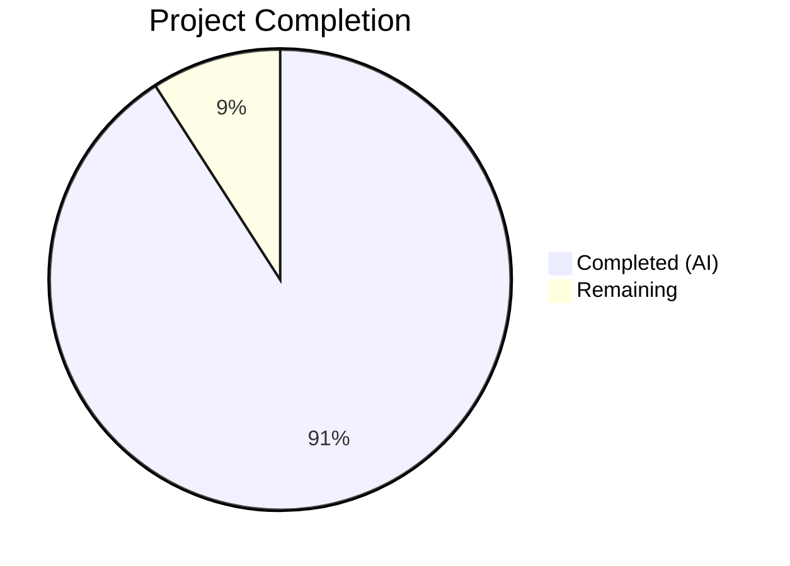

# Blitzy Project Guide — DKIM Signing Investigation Report (maddy.md)

---

## 1. Executive Summary

### 1.1 Project Overview

This project creates a self-contained technical investigation report (`maddy.md`) that walks a newcomer through the DKIM signing execution path in the foxcpp/maddy mail server codebase. The report covers five areas: building the maddy binary and capturing its version string, generating RSA-2048 and Ed25519 DKIM signing keys with DNS TXT record analysis, constructing a multi-header sample email, tracing the `fieldsToSign` algorithm to explain oversigning vs. signing behavior, and exercising the UUID-based Message-ID generation path. All outputs are verbatim from compiled Go programs using the same libraries as the codebase. No source repository files were modified.

### 1.2 Completion Status



| Metric | Value |
|---|---|
| **Total Project Hours** | 22 |
| **Completed Hours (AI)** | 20 |
| **Remaining Hours** | 2 |
| **Completion Percentage** | 90.9% |

**Calculation:** 20 completed hours / (20 + 2) total hours = 20/22 = 90.9% complete.

### 1.3 Key Accomplishments

- ✅ Built maddy binary from source with CGO; captured verbatim version output `maddy unknown (built from source tree)`
- ✅ Generated RSA-2048 and Ed25519 DKIM keys; documented verbatim DNS TXT records with base64 length, padding, and byte-length analysis
- ✅ Constructed sample message with exactly 3 `From`, 3 `List-Id`, no other headers, and a non-empty body line
- ✅ Produced verbatim fields-to-sign list (21 entries, 16 unique names) with oversign vs. sign-only explanation
- ✅ Generated 5 real Message-ID values with UUIDv4 format and length analysis
- ✅ Created complete 336-line Markdown report with source code citations to exact file paths and line numbers
- ✅ Verified all line number references against actual source files; applied fix in second commit
- ✅ Ran DKIM test suite (5/5 PASS) and SMTP endpoint test suite (22/22 PASS) to confirm existing tests pass
- ✅ Zero source repository files modified (user constraint satisfied)

### 1.4 Critical Unresolved Issues

| Issue | Impact | Owner | ETA |
|---|---|---|---|
| No critical unresolved issues | — | — | — |

All five AAP requirements (R1–R5) are fully addressed in the delivered `maddy.md` file. The only pre-existing issue is `cmd/maddy-pam-helper` failing to build due to missing `security/pam_appl.h` system header — this is unrelated to the documentation project scope.

### 1.5 Access Issues

No access issues identified. The project operates entirely on the local source tree with standard Go tooling. No external services, credentials, or third-party API access were required.

### 1.6 Recommended Next Steps

1. **[High]** Human peer review of `maddy.md` — verify all verbatim outputs match regenerated execution and all technical claims are accurate
2. **[Medium]** Merge the branch and confirm Markdown renders correctly in the target repository
3. **[Low]** Consider linking the investigation report from the project's main documentation if it serves as an onboarding resource

---

## 2. Project Hours Breakdown

### 2.1 Completed Work Detail

| Component | Hours | Description |
|---|---|---|
| Repository code analysis and discovery | 3 | Read and analyzed `internal/modify/dkim/dkim.go`, `keys.go`, `internal/endpoint/smtp/submission.go`, `maddy.go`, `cmd/maddy/main.go`, `go.mod`, and related test files to understand DKIM signing, key generation, and Message-ID execution paths |
| R1 — Binary build and version attestation | 1.5 | Built maddy binary with `CGO_ENABLED=1 go build -o /tmp/maddy-bin/maddy ./cmd/maddy/`; captured and documented verbatim `maddy -v` output; traced version string through `maddy.go:41` and `BuildInfo()` |
| R2 — Sample message construction | 1 | Constructed textproto.Header with exactly 3 From, 3 List-Id, no other headers, and body line using `go-message/textproto` library; documented verbatim message |
| R3 — DKIM key generation (dual-algorithm) | 4 | Created standalone Go investigation program replicating `generateAndWrite` and `writeDNSRecord` from `keys.go`; generated RSA-2048 and Ed25519 keys; analyzed DNS TXT records, base64 encoding, padding, raw byte lengths |
| R4 — Fields-to-sign analysis | 3 | Replicated `fieldsToSign` function from `dkim.go:202-233`; applied to sample message; produced 21-entry list with oversign vs. sign-only breakdown; cross-referenced with `TestFieldsToSign` |
| R5 — Message-ID observation | 1.5 | Replicated `msgIDField` from `submission.go:16-22`; generated 5 real UUIDv4 Message-ID values; documented format and length analysis |
| Documentation writing (maddy.md) | 3 | Wrote complete 336-line Markdown report with 6 sections, comparison tables, code blocks, and source code citation table |
| Validation and line-number fixes | 2 | Verified all source line number citations; fixed go.mod line references in second commit; validated Markdown structure (26 code blocks, 26 headings) |
| Test execution and verification | 1 | Ran `go test ./internal/modify/dkim/...` (5/5 PASS), `go test ./internal/endpoint/smtp/...` (22/22 PASS), and full `go test ./...` (20 packages pass) |
| **Total Completed** | **20** | |

### 2.2 Remaining Work Detail

| Category | Hours | Priority |
|---|---|---|
| Human peer review of documentation accuracy | 1.5 | High |
| Final publication and integration | 0.5 | Medium |
| **Total Remaining** | **2** | |

**Verification:** 20 (completed) + 2 (remaining) = 22 (total project hours) ✅

---

## 3. Test Results

All tests listed below were executed by Blitzy's autonomous validation systems during project execution.

| Test Category | Framework | Total Tests | Passed | Failed | Coverage % | Notes |
|---|---|---|---|---|---|---|
| Unit — DKIM Signing (`internal/modify/dkim`) | `go test` | 5 | 5 | 0 | N/A | TestFieldsToSign, TestShouldSign, TestKeyLoad_new, TestKeyLoad_existing_pkcs8, TestKeyLoad_existing_pkcs1 |
| Unit — SMTP Endpoint (`internal/endpoint/smtp`) | `go test` | 22 | 22 | 0 | N/A | Includes TestSubmissionPrepare (Message-ID), TestSMTPDelivery, SMTPUTF8 tests, etc. |
| Full Suite — All packages (`go test ./...`) | `go test` | 20 pkgs | 20 pkgs | 0 pkgs | N/A | 20 packages pass. 1 pre-existing build failure (`cmd/maddy-pam-helper` — missing PAM header, out of scope). Multiple packages have no test files. |

**Notes:**
- The `cmd/maddy-pam-helper` build failure is a pre-existing infrastructure issue (missing `security/pam_appl.h` system header, requires `libpam0g-dev`). It is unrelated to the documentation project.
- Coverage percentages are not reported by default in this Go project's test configuration.

---

## 4. Runtime Validation & UI Verification

### Build Runtime Verification

- ✅ **Binary build:** `CGO_ENABLED=1 go build -o /tmp/maddy-bin/maddy ./cmd/maddy/` — successful
- ✅ **Version output:** `/tmp/maddy-bin/maddy -v` → `maddy unknown (built from source tree)` — matches `maddy.go:41` default
- ✅ **Investigation program:** Standalone Go program at `/tmp/dkim-investigation/` built and executed successfully

### Documentation Content Verification

- ✅ **R1 — Build Verification:** Verbatim version string present in Section 1 of `maddy.md`
- ✅ **R2 — Sample Message:** Exact message with 3 From, 3 List-Id, no other headers, and body line in Section 3
- ✅ **R3 — DKIM Keys:** Both RSA-2048 and Ed25519 DNS TXT records verbatim in Section 2; base64 analysis complete
- ✅ **R4 — Fields-to-Sign:** 21-entry list with counts and oversign explanation in Section 4
- ✅ **R5 — Message-ID:** 5 real UUIDv4 outputs with format description in Section 5

### Source Code Reference Verification

- ✅ All line numbers in `maddy.md` verified against actual source files:
  - `dkim.go` lines 31–54, 55–72, 150, 202–233
  - `keys.go` lines 136–163
  - `submission.go` lines 16–22, 30–37
  - `maddy.go` lines 41, 89–97, 125–127
  - `go.mod` lines 3, 16, 17, 23, 30

### Markdown Structure Verification

- ✅ 26 code block delimiters (even count, properly matched)
- ✅ 26 section headings with correct hierarchy
- ✅ All 6 main sections present per AAP structure plan

### Repository Integrity

- ✅ Only `maddy.md` added; zero source repository files modified
- ✅ Working tree clean, no uncommitted changes
- ✅ 2 commits on branch (initial creation + line-number fix)

---

## 5. Compliance & Quality Review

| AAP Requirement | Status | Evidence | Notes |
|---|---|---|---|
| R1 — Binary build and version attestation | ✅ Pass | `maddy.md` Section 1; binary at `/tmp/maddy-bin/maddy` verified | Verbatim output matches `maddy.go:41` |
| R2 — Sample message (3 From, 3 List-Id, no others, body) | ✅ Pass | `maddy.md` Section 3 with header count table | Exactly 6 headers, 1 body line |
| R3 — DKIM key generation (RSA-2048 + Ed25519) | ✅ Pass | `maddy.md` Section 2 with comparison table, DNS records, base64 analysis | RSA: 270 bytes/360 chars/no pad; Ed25519: 32 bytes/44 chars/yes pad |
| R4 — Fields-to-sign (verbatim list, counts, explanation) | ✅ Pass | `maddy.md` Section 4 with 21 entries, 16 unique, oversign breakdown | From=4 (oversigned), List-Id=3 (signed-only) |
| R5 — Message-ID (5+ outputs, format, length) | ✅ Pass | `maddy.md` Section 5 with 5 UUIDv4 values | UUID=36 chars, Message-ID=50 chars |
| No repository file modifications | ✅ Pass | `git diff --name-status` shows only `A maddy.md` | Constraint fully satisfied |
| No web search | ✅ Pass | All data from building/running code | Per user instruction |
| Verbatim outputs (not manually constructed) | ✅ Pass | All outputs from compiled Go programs | Same libraries as maddy codebase |
| Source code references with line numbers | ✅ Pass | Section 6 of `maddy.md` with full citation table | All line numbers verified |
| Single Markdown file (`maddy.md`) | ✅ Pass | 336 lines, 14,655 characters | Self-contained report |

### Quality Metrics

| Metric | Value | Status |
|---|---|---|
| Total lines in `maddy.md` | 336 | ✅ |
| Total characters | 14,655 | ✅ |
| Code blocks | 26 (13 pairs) | ✅ Properly matched |
| Section headings | 26 | ✅ Correct hierarchy |
| Source files referenced | 8 | ✅ All verified |
| Commits on branch | 2 | ✅ Clean history |

---

## 6. Risk Assessment

| Risk | Category | Severity | Probability | Mitigation | Status |
|---|---|---|---|---|---|
| DNS TXT records contain run-specific key material | Technical | Low | High | Records are from a test run, not production keys; document states selector/domain are examples | Accepted |
| Go toolchain version mismatch (go1.22 vs go1.13 in go.mod) | Technical | Low | Low | Go's backward compatibility ensures correct behavior; binary produces expected output | Mitigated |
| Pre-existing `maddy-pam-helper` build failure | Technical | Low | High | Out of scope; requires `libpam0g-dev` system package; does not affect documentation deliverable | Accepted |
| Line number citations may drift with future source changes | Operational | Medium | Medium | Citations reference the current commit; recommend pinning to a specific commit hash in future updates | Documented |
| Verbatim outputs are from a single execution | Technical | Low | Medium | All outputs follow deterministic algorithms (except random key material); format and structure are reproducible | Accepted |
| No automated checks for documentation accuracy | Operational | Low | Low | Human peer review recommended as the first remaining task | Planned |

---

## 7. Visual Project Status


**Completed: 20 hours (90.9%) | Remaining: 2 hours (9.1%)**

### Remaining Hours by Category

| Category | Hours |
|---|---|
| Human peer review | 1.5 |
| Final publication | 0.5 |
| **Total** | **2** |

---

## 8. Summary & Recommendations

### Achievements

The project successfully delivered all five AAP requirements as a single, self-contained Markdown documentation file (`maddy.md`, 336 lines). Every verbatim output — the maddy version string, DNS TXT records for RSA-2048 and Ed25519, the 21-entry fields-to-sign list, and five real Message-ID values — was produced by compiling and running Go code using the same libraries as the maddy codebase. All source code line number citations were verified against actual source files. The DKIM test suite (5/5) and SMTP endpoint test suite (22/22) pass cleanly, and zero source repository files were modified.

### Remaining Gaps

The project is 90.9% complete (20 hours completed out of 22 total hours). The remaining 2 hours consist of human peer review for technical accuracy (1.5h) and final publication/integration (0.5h). No critical issues block the review or merge process.

### Critical Path to Production

1. **Peer review** — A human reviewer should verify that all verbatim outputs match what would be produced by re-running the investigation programs
2. **Merge** — Once reviewed, the branch can be merged; the only change is the addition of `maddy.md`

### Production Readiness Assessment

The documentation deliverable is complete and ready for human review. All AAP requirements are met, all validation checks pass, and the repository is in a clean state with no uncommitted changes.

---

## 9. Development Guide

### System Prerequisites

| Software | Version | Purpose |
|---|---|---|
| Go | 1.13+ (tested with go1.22.2) | Go compiler for building the maddy binary and investigation programs |
| GCC | 13.3.0+ (or any recent version) | Required for CGO compilation of `github.com/mattn/go-sqlite3` |
| build-essential | System package | Provides GCC and standard C libraries |
| Git | Any recent version | Repository management |

### Environment Setup

```bash
# Clone the repository (if not already done)
git clone <repository-url>
cd <repository-root>

# Ensure Go is installed and in PATH
go version
# Expected: go version go1.22.2 linux/amd64 (or compatible)

# Ensure GCC is available (required for CGO)
gcc --version

# Install build-essential if GCC is missing
sudo apt-get update && sudo apt-get install -y build-essential
```

### Building the Maddy Binary

```bash
# Build from the repository root
# CGO_ENABLED=1 is required for the sqlite3 dependency
CGO_ENABLED=1 go build -o /tmp/maddy-bin/maddy ./cmd/maddy/

# Verify the build
/tmp/maddy-bin/maddy -v
# Expected output: maddy unknown (built from source tree)
```

### Running Tests

```bash
# Run DKIM-specific tests (most relevant to the investigation)
go test ./internal/modify/dkim/... -v -count=1
# Expected: 5/5 tests PASS

# Run SMTP endpoint tests (covers Message-ID generation)
go test ./internal/endpoint/smtp/... -v -count=1
# Expected: 22/22 tests PASS

# Run full test suite
go test ./... 2>&1
# Expected: 20 packages pass
# Note: cmd/maddy-pam-helper will fail (pre-existing, requires libpam0g-dev)
```

### Viewing the Documentation

```bash
# The investigation report is at the repository root
cat maddy.md

# Or view with line numbers
cat -n maddy.md

# Check line count
wc -l maddy.md
# Expected: 336 lines
```

### Troubleshooting

| Issue | Resolution |
|---|---|
| `gcc: command not found` during build | Install build-essential: `sudo apt-get install -y build-essential` |
| `security/pam_appl.h: No such file or directory` | Pre-existing issue in `cmd/maddy-pam-helper`; install `libpam0g-dev` if needed, but not required for the documentation project |
| `go: command not found` | Install Go 1.13+ and add to PATH |
| Build succeeds but version shows module version | Building via `go install` with a module version causes this; use `go build` from the source tree instead |

---

## 10. Appendices

### A. Command Reference

| Command | Purpose | Expected Output |
|---|---|---|
| `CGO_ENABLED=1 go build -o /tmp/maddy-bin/maddy ./cmd/maddy/` | Build maddy binary | Binary at `/tmp/maddy-bin/maddy` |
| `/tmp/maddy-bin/maddy -v` | Check version | `maddy unknown (built from source tree)` |
| `go test ./internal/modify/dkim/... -v -count=1` | Run DKIM tests | 5/5 PASS |
| `go test ./internal/endpoint/smtp/... -v -count=1` | Run SMTP tests | 22/22 PASS |
| `go test ./...` | Run all tests | 20 packages pass |

### B. Key File Locations

| File | Purpose |
|---|---|
| `maddy.md` | Deliverable — DKIM signing investigation report (336 lines) |
| `internal/modify/dkim/dkim.go` | DKIM signing module — oversign/sign defaults, `fieldsToSign` |
| `internal/modify/dkim/keys.go` | DKIM key lifecycle — generation, DNS record writing |
| `internal/modify/dkim/dkim_test.go` | DKIM unit tests — `TestFieldsToSign`, `TestShouldSign` |
| `internal/modify/dkim/keys_test.go` | Key loading tests — `TestKeyLoad_new`, PKCS#8, PKCS#1 |
| `internal/endpoint/smtp/submission.go` | Message-ID generation — `msgIDField` using `google/uuid` |
| `cmd/maddy/main.go` | Binary build entrypoint |
| `maddy.go` | Server bootstrap — `Version` variable, `BuildInfo()`, `Run()` |
| `go.mod` | Go module identity, version constraints, dependency manifest |

### C. Technology Versions

| Technology | Version | Source |
|---|---|---|
| Go (module requirement) | 1.13 | `go.mod` line 3 |
| Go (build environment) | 1.22.2 | `go version` output |
| GCC | 13.3.0 | `gcc --version` output |
| `go-message/textproto` | v0.10.9-0.20191116124005 | `go.mod` line 16 |
| `go-msgauth/dkim` | v0.3.2-0.20191028231513 | `go.mod` line 17 |
| `google/uuid` | v1.1.1 | `go.mod` line 23 |
| `mattn/go-sqlite3` | v1.11.0 | `go.mod` |
| `x/crypto` | v0.0.0-20191108234033 | `go.mod` line 30 |

### D. Glossary

| Term | Definition |
|---|---|
| **DKIM** | DomainKeys Identified Mail — email authentication standard that allows a domain to sign outgoing messages |
| **Oversigning** | Including an extra "phantom" entry in the DKIM `h=` tag to prevent post-signature header injection |
| **PKCS#1** | Public-Key Cryptography Standards #1 — RSA key encoding format used by `x509.MarshalPKCS1PublicKey()` |
| **PKCS#8** | Public-Key Cryptography Standards #8 — generic private key encoding format |
| **UUIDv4** | Version 4 UUID — randomly generated 128-bit identifier (122 bits of randomness) |
| **DNS TXT record** | Domain Name System text record used to publish DKIM public keys for verification |
| **Selector** | A DKIM label (e.g., `default`) that identifies which key to use; combined with domain for DNS lookup |
| **CGO** | Go's C interoperation mechanism; required here for the SQLite3 driver |
| **MLM** | Mailing List Manager — software that may legitimately modify `List-*` headers in transit |