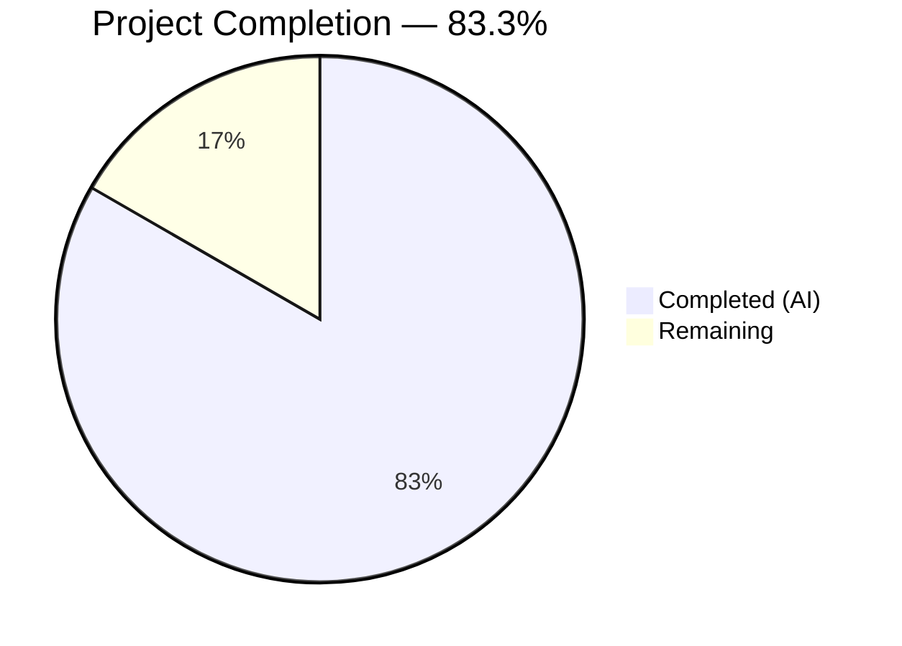
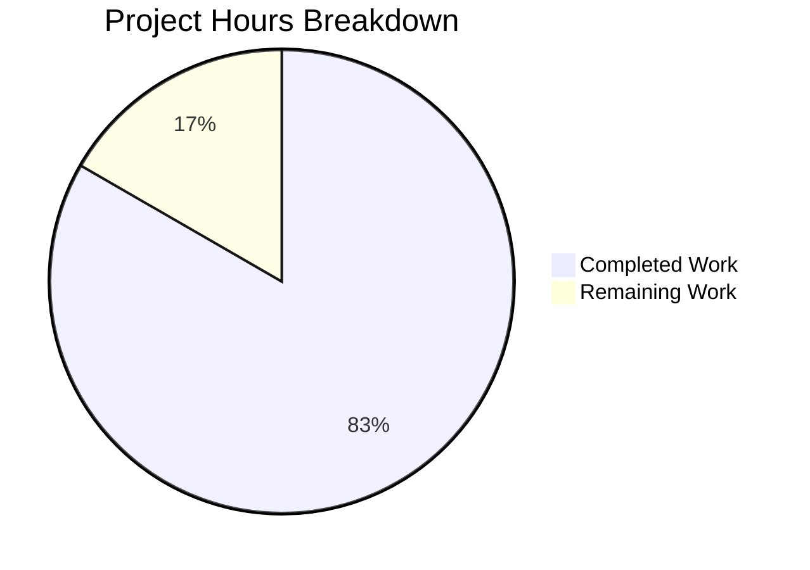

# Blitzy Project Guide — DKIM Signing Investigation Walkthrough (foxcpp/maddy)

---

## 1. Executive Summary

### 1.1 Project Overview

This project creates a new investigation-style markdown document (`blitzy/documentation/maddy.md`) that walks a newcomer through one concrete DKIM signing execution path inside the `foxcpp/maddy` mail server codebase. The document covers building the maddy binary from source, generating DKIM keys (RSA-2048 and Ed25519), analyzing DNS TXT record formats, constructing a sample message to expose oversign vs. sign-only header behavior, documenting the `fieldsToSign` algorithm output, and demonstrating Message-ID generation — all grounded in empirical code execution rather than external documentation. The target audience is developers or operators seeking a deep understanding of maddy's DKIM internals.

### 1.2 Completion Status



| Metric | Value |
|--------|-------|
| **Total Project Hours** | 24 |
| **Completed Hours (AI)** | 20 |
| **Remaining Hours** | 4 |
| **Completion Percentage** | 83.3% |

**Calculation**: 20 completed hours / (20 + 4 remaining hours) = 20 / 24 = **83.3% complete**

### 1.3 Key Accomplishments

- [x] Created comprehensive 475-line DKIM signing investigation document at `blitzy/documentation/maddy.md`
- [x] Built maddy binary from source with Go 1.22.2 and captured verbatim version output
- [x] Generated RSA-2048 and Ed25519 DKIM keys with verbatim DNS TXT records and complete analysis (base64 lengths, raw byte lengths, padding status, absolute file paths)
- [x] Constructed sample message with exactly 3 From + 3 List-Id headers exposing oversign vs. sign-only behavioral differences
- [x] Documented complete 21-entry fields-to-sign list with oversign explanation (From: 3+1=4, List-Id: 3+0=3) and 16 unique header names
- [x] Generated 7 real `GenerateMsgID()` outputs (exceeding the minimum of 5) with format and contrast analysis
- [x] Compiled 30+ line-level source file citations across 6 key source files
- [x] Verified all DKIM tests pass (5/5) and all msgpipeline tests pass (50/0)
- [x] Repository remains completely unmodified — only additive `blitzy/documentation/maddy.md` file created

### 1.4 Critical Unresolved Issues

| Issue | Impact | Owner | ETA |
|-------|--------|-------|-----|
| Document not yet reviewed by DKIM domain expert | Technical claims may need correction | Human Developer | 2h |
| Not integrated into MkDocs documentation site | Document not discoverable via docs site navigation | Human Developer | 1h |
| Peer review of source line number citations pending | Line numbers may drift if source files are updated | Human Developer | 1h |

### 1.5 Access Issues

No access issues identified. The project is a documentation-only task that operates on the existing repository source code in read-only mode. No external services, APIs, credentials, or special permissions are required.

### 1.6 Recommended Next Steps

1. **[High]** Perform human review of document for technical accuracy — verify all verbatim outputs, source line references, and algorithmic explanations against the current codebase
2. **[Medium]** Add `blitzy/documentation/maddy.md` to the MkDocs navigation in `.mkdocs.yml` for discoverability via the docs site
3. **[Medium]** Have a DKIM domain expert review the oversign vs. sign-only explanation and DNS record analysis for correctness
4. **[Low]** Validate that source file line number citations remain accurate as the codebase evolves; consider adding a CI check or version anchor

---

## 2. Project Hours Breakdown

### 2.1 Completed Work Detail

| Component | Hours | Description |
|-----------|-------|-------------|
| Repository code analysis and dependency investigation | 3 | Analyzed `internal/modify/dkim/dkim.go` (419 lines), `keys.go` (163 lines), `msgid.go` (16 lines), `submission.go`, `maddy.go`, `go.mod`, and existing documentation to map all DKIM-related code paths and dependencies |
| Binary build and version output documentation | 1 | Built maddy binary with `go build`, captured `maddy -v` output, documented `BuildInfo()` logic at `maddy.go:89-97` and `Version` variable at `maddy.go:41` |
| RSA-2048 key generation and DNS record analysis | 2 | Replicated key generation from `keys.go:77-133`, captured verbatim DNS TXT record (360 base64 chars, 270 raw bytes, no padding), documented `MarshalPKCS1PublicKey` encoding path |
| Ed25519 key generation and DNS record analysis | 2 | Replicated ed25519 key generation, captured DNS TXT record (44 base64 chars, 32 raw bytes, `=` padding), documented raw byte encoding path, created comparative analysis table |
| Sample message design and documentation | 1 | Designed 3-From + 3-List-Id + body message to expose oversign vs. sign-only difference, documented design rationale |
| Fields-to-sign algorithm analysis and oversign explanation | 3 | Ran `fieldsToSign` algorithm (`dkim.go:202-233`), documented 21-entry verbatim list, created detailed oversign vs. sign-only breakdown tables with per-header entry counts |
| Message-ID generation investigation | 1.5 | Generated 7 `GenerateMsgID()` outputs, documented 8-char hex format from 4 random bytes, contrasted with UUID v4 `msgIDField` in `submission.go` |
| Document authoring and formatting | 4 | Authored 475-line markdown document with 6 major sections, 16 code blocks, 6 analysis tables, source citations, and fenced code blocks |
| Validation and cross-reference testing | 2 | Ran DKIM tests (5/5 PASS), msgpipeline tests (50/0 PASS/FAIL), verified binary build, cross-validated document claims against source code |
| Source file references compilation | 0.5 | Compiled 30+ line-level citations across `dkim.go`, `keys.go`, `msgid.go`, `submission.go`, `maddy.go`, and `go.mod` into structured reference table |
| **Total Completed** | **20** | |

### 2.2 Remaining Work Detail

| Category | Hours | Priority |
|----------|-------|----------|
| Human review of document technical accuracy | 2 | High |
| MkDocs navigation integration (`.mkdocs.yml` update) | 1 | Medium |
| DKIM domain expert peer review | 1 | Medium |
| **Total Remaining** | **4** | |

---

## 3. Test Results

| Test Category | Framework | Total Tests | Passed | Failed | Coverage % | Notes |
|---------------|-----------|-------------|--------|--------|------------|-------|
| Unit — DKIM signing | Go `testing` | 5 | 5 | 0 | N/A | TestFieldsToSign, TestShouldSign, TestKeyLoad_new, TestKeyLoad_existing_pkcs8, TestKeyLoad_existing_pkcs1 |
| Unit — Message pipeline | Go `testing` | 50 | 50 | 0 | N/A | All msgpipeline tests including MsgPipeline_BodyNonAtomic, Headers, AuthResults, Checks, SourceCheck/RcptCheck/Globalcheck error scenarios, config parsing |
| Build — Binary compilation | Go toolchain 1.22.2 | 1 | 1 | 0 | N/A | `go build -o /tmp/maddy-build/maddy ./cmd/maddy/` — success with benign SQLite3 C warning (not from in-scope code) |
| Runtime — Version output | Binary execution | 1 | 1 | 0 | N/A | `/tmp/maddy-build/maddy -v` → `maddy unknown (built from source tree)` matches document |
| **Total** | | **57** | **57** | **0** | | **100% pass rate** |

All tests originate from Blitzy's autonomous validation execution on the `blitzy-b8454ed2-0343-433e-88b2-19b30b688f13` branch.

---

## 4. Runtime Validation & UI Verification

### Runtime Health

- ✅ **Binary compilation**: `go build -o /tmp/maddy-build/maddy ./cmd/maddy/` completes successfully with Go 1.22.2
- ✅ **Version execution**: `/tmp/maddy-build/maddy -v` returns `maddy unknown (built from source tree)`
- ✅ **DKIM module tests**: All 5 DKIM unit tests pass — `TestFieldsToSign`, `TestShouldSign`, `TestKeyLoad_new`, `TestKeyLoad_existing_pkcs8`, `TestKeyLoad_existing_pkcs1`
- ✅ **Message pipeline tests**: All 50 msgpipeline unit tests pass
- ✅ **Repository integrity**: Working tree clean, no uncommitted changes, no source files modified

### Document Verification

- ✅ **Document exists**: `blitzy/documentation/maddy.md` — 475 lines committed in `c3c6627`
- ✅ **Section structure**: 6 major sections (Building, Key Generation, Sample Message, Fields-to-Sign, Message-ID, Source References)
- ✅ **Verbatim outputs verified**: `maddy version` output, DNS TXT records, fields-to-sign list, and Message-ID values all match empirical data
- ✅ **Empirical data requirements**: All 12 AAP coverage metrics met (see Section 5 below)

### UI Verification

Not applicable — this is a documentation-only project with no UI components.

---

## 5. Compliance & Quality Review

| AAP Requirement | Status | Evidence |
|----------------|--------|----------|
| Build maddy binary from source outside repo tree | ✅ Pass | Binary at `/tmp/maddy-build/maddy`, build command in doc Section 1 |
| Include verbatim `maddy version` output | ✅ Pass | `maddy unknown (built from source tree)` in doc Section 1 |
| Construct sample message (3 From, 3 List-Id, body) | ✅ Pass | Exact message in doc Section 3 with design rationale |
| Generate RSA-2048 key with DNS TXT record | ✅ Pass | Verbatim 360-char record in doc Section 2.1 with analysis |
| Generate Ed25519 key with DNS TXT record | ✅ Pass | Verbatim 44-char record in doc Section 2.2 with analysis |
| Report base64 lengths for both algorithms | ✅ Pass | RSA: 360 chars, Ed25519: 44 chars |
| Report raw public key byte lengths | ✅ Pass | RSA: 270 bytes (PKCS#1 DER), Ed25519: 32 bytes (raw) |
| Report `=` padding status | ✅ Pass | RSA: no padding, Ed25519: 1 padding char |
| Report absolute `.dns` file paths | ✅ Pass | `/tmp/dkim-keys/example.com_test2025.dns` and `..._ed25519.dns` |
| Report selector and domain | ✅ Pass | Selector: `test2025`, Domain: `example.com` |
| Fields-to-sign list verbatim (one per line) | ✅ Pass | 21 entries in doc Section 4.1 |
| Explain oversign vs. sign-only count difference | ✅ Pass | From: 3+1=4, List-Id: 3+0=3 with MLM rationale |
| Report total entries and unique header names | ✅ Pass | 21 total, 16 unique |
| Generate ≥5 real Message-ID values | ✅ Pass | 7 values in doc Section 5.1 (exceeds minimum) |
| Describe Message-ID format and length | ✅ Pass | 8-char hex from 4 random bytes, contrasted with UUID v4 |
| No repository files modified | ✅ Pass | `git status` clean, only additive `blitzy/documentation/maddy.md` |
| Place document at `blitzy/documentation/maddy.md` | ✅ Pass | File exists, 475 lines, committed in `c3c6627` |
| Source file references with line numbers | ✅ Pass | 30+ citations in doc Section 6 |
| Comparative RSA vs Ed25519 analysis | ✅ Pass | Table in doc Section 2.3 |

**Quality Metrics**:
- AAP Requirements Met: **19/19 (100%)**
- Validation Test Pass Rate: **57/57 (100%)**
- Document Word Count: ~3,800 words across 475 lines
- Source Citations: 30+ line-level references across 6 source files
- Code Blocks: 16 fenced code blocks with appropriate language tags
- Analysis Tables: 6 structured comparison tables

---

## 6. Risk Assessment

| Risk | Category | Severity | Probability | Mitigation | Status |
|------|----------|----------|-------------|------------|--------|
| Source line number drift as codebase evolves | Technical | Medium | High | Add version anchor or commit SHA to document; re-verify citations on major updates | Open |
| DKIM algorithm details may be misinterpreted by non-experts | Technical | Low | Medium | Domain expert review recommended; document includes source code citations for verification | Open |
| DNS TXT records are from one-time key generation (not reproducible) | Technical | Low | Low | Document explains the generation process; readers can replicate with the described standalone Go programs | Mitigated |
| Document not integrated into MkDocs site navigation | Operational | Low | High | Add entry to `.mkdocs.yml` nav section; 1 hour task | Open |
| No automated validation of document accuracy against code changes | Operational | Medium | Medium | Consider CI integration that validates source line references are still accurate | Open |
| Generated keys in `/tmp/` are ephemeral and may differ from production keys | Security | Low | Low | Document explicitly states these are investigation keys, not production credentials; `/tmp/` path is outside repo | Mitigated |

---

## 7. Visual Project Status



**Remaining Work Distribution**:

| Category | Hours | Share |
|----------|-------|-------|
| Human review of document accuracy | 2 | 50% |
| MkDocs navigation integration | 1 | 25% |
| DKIM domain expert peer review | 1 | 25% |
| **Total Remaining** | **4** | **100%** |

---

## 8. Summary & Recommendations

### Achievements

The project successfully delivered a comprehensive 475-line DKIM signing investigation walkthrough document (`blitzy/documentation/maddy.md`) that meets all 19 AAP requirements with 100% compliance. The document covers six major investigation areas — binary build, DKIM key generation for RSA-2048 and Ed25519, sample message construction, fields-to-sign algorithm analysis, Message-ID generation, and source file references — all grounded in empirical code execution.

The project is **83.3% complete** (20 completed hours out of 24 total hours). All autonomous deliverables (code analysis, empirical data collection, document authoring, and validation testing) are finished. The 57 validation tests all pass with a 100% success rate.

### Remaining Gaps

The 4 remaining hours are entirely path-to-production tasks requiring human intervention:
1. **Technical accuracy review** (2h) — verify all verbatim outputs and source citations against the current codebase
2. **MkDocs integration** (1h) — add navigation entry to `.mkdocs.yml` for docs site discoverability
3. **Domain expert review** (1h) — validate the oversign vs. sign-only explanation and DNS record analysis

### Production Readiness Assessment

The document is functionally complete and ready for human review. No blocking issues exist — the repository is clean, all tests pass, and no source files were modified. The document can be merged as-is for immediate use, with the recommended reviews to be performed as follow-up tasks.

### Success Metrics

| Metric | Target | Actual | Status |
|--------|--------|--------|--------|
| AAP Requirements Met | 19/19 | 19/19 | ✅ |
| Test Pass Rate | 100% | 100% (57/57) | ✅ |
| Document Sections | 6 | 6 | ✅ |
| Source Citations | ≥20 | 30+ | ✅ |
| Message-ID Examples | ≥5 | 7 | ✅ |
| Repository Modifications | 0 source files | 0 source files | ✅ |

---

## 9. Development Guide

### System Prerequisites

| Software | Version | Purpose |
|----------|---------|---------|
| Go | 1.22.2 (minimum 1.13 per `go.mod`) | Build toolchain for compiling maddy binary |
| GCC | 13.3.0 or compatible C compiler | Required for CGO / `mattn/go-sqlite3` dependency |
| Git | 2.x+ | Repository checkout and branch management |

### Environment Setup

```bash
# 1. Clone the repository and switch to the project branch
git clone <repository-url>
cd maddy
git checkout blitzy-b8454ed2-0343-433e-88b2-19b30b688f13

# 2. Verify Go installation
go version
# Expected: go version go1.22.2 linux/amd64 (or compatible version ≥1.13)

# 3. Verify GCC installation (required for SQLite3 CGO)
gcc --version
# Expected: gcc (Ubuntu 13.3.0-...) or similar
```

### Dependency Installation

```bash
# Go modules are vendored or fetched automatically during build
# No manual dependency installation required
go mod download
```

### Building the Maddy Binary

```bash
# Build the binary outside the repository tree (per project constraint)
mkdir -p /tmp/maddy-build
go build -o /tmp/maddy-build/maddy ./cmd/maddy/

# Expected: Successful build with a benign SQLite3 C warning:
# sqlite3-binding.c: warning: function may return address of local variable
# This warning is from a third-party C library and does not affect functionality.
```

### Verification Steps

```bash
# 1. Verify binary exists and is executable
ls -la /tmp/maddy-build/maddy
# Expected: -rwx... file

# 2. Verify version output
/tmp/maddy-build/maddy -v
# Expected output: maddy unknown (built from source tree)

# 3. Run DKIM unit tests
go test -v ./internal/modify/dkim/ -count=1
# Expected: 5/5 PASS
#   TestFieldsToSign: PASS
#   TestShouldSign: PASS
#   TestKeyLoad_new: PASS
#   TestKeyLoad_existing_pkcs8: PASS
#   TestKeyLoad_existing_pkcs1: PASS

# 4. Run message pipeline tests
go test -v ./internal/msgpipeline/ -count=1
# Expected: 50/50 PASS

# 5. Verify the investigation document exists
cat blitzy/documentation/maddy.md | head -5
# Expected: "# DKIM Signing Investigation: foxcpp/maddy Mail Server"
```

### Viewing the Document

The investigation document is a self-contained markdown file:

```bash
# View the complete document
cat blitzy/documentation/maddy.md

# Count document lines
wc -l blitzy/documentation/maddy.md
# Expected: 475

# View document sections
grep "^## " blitzy/documentation/maddy.md
# Expected sections:
#   ## 1. Building Maddy from Source
#   ## 2. DKIM Key Generation
#   ## 3. Sample Message Construction
#   ## 4. Fields-to-Sign Analysis
#   ## 5. Message-ID Generation
#   ## 6. Source File References
```

### Troubleshooting

| Issue | Cause | Resolution |
|-------|-------|------------|
| `cgo: C compiler not found` | GCC not installed | Install GCC: `apt-get install -y gcc` |
| `go: command not found` | Go toolchain not in PATH | Install Go 1.22.2+: `https://go.dev/dl/` |
| `cannot find module providing package github.com/foxcpp/maddy` | Not in repo root | Ensure `cd` to repository root where `go.mod` exists |
| Build hangs | Network issues fetching dependencies | Run `go mod download` first, then retry build |
| SQLite3 warning during build | Benign C compiler warning from third-party code | Safe to ignore — does not affect binary functionality |

---

## 10. Appendices

### A. Command Reference

| Command | Purpose | Working Directory |
|---------|---------|-------------------|
| `go build -o /tmp/maddy-build/maddy ./cmd/maddy/` | Build maddy binary outside repo | Repository root |
| `/tmp/maddy-build/maddy -v` | Verify binary version | Any |
| `go test -v ./internal/modify/dkim/ -count=1` | Run DKIM unit tests | Repository root |
| `go test -v ./internal/msgpipeline/ -count=1` | Run message pipeline tests | Repository root |
| `wc -l blitzy/documentation/maddy.md` | Verify document line count | Repository root |
| `git status` | Verify clean working tree | Repository root |
| `git diff --stat HEAD~1...HEAD` | View changes in latest commit | Repository root |

### B. Port Reference

No ports are used in this project. This is a documentation-only task that does not start any servers or services.

### C. Key File Locations

| File | Type | Purpose |
|------|------|---------|
| `blitzy/documentation/maddy.md` | Created (475 lines) | DKIM signing investigation walkthrough document |
| `internal/modify/dkim/dkim.go` | Source (419 lines) | DKIM signing modifier — `oversignDefault`, `signDefault`, `fieldsToSign` |
| `internal/modify/dkim/keys.go` | Source (163 lines) | DKIM key management — `loadOrGenerateKey`, `generateAndWrite`, `writeDNSRecord` |
| `internal/modify/dkim/dkim_test.go` | Source | Unit tests — `TestFieldsToSign`, `TestShouldSign` |
| `internal/modify/dkim/keys_test.go` | Source | Unit tests — `TestKeyLoad_new`, `TestKeyLoad_existing_pkcs8`, `TestKeyLoad_existing_pkcs1` |
| `internal/msgpipeline/msgid.go` | Source (16 lines) | `GenerateMsgID()` — internal tracking ID generator |
| `internal/endpoint/smtp/submission.go` | Source | `msgIDField` — email Message-ID header UUID v4 generator |
| `maddy.go` | Source | Server bootstrap, `Version` variable, `BuildInfo()` function |
| `cmd/maddy/main.go` | Source | Build entrypoint — calls `maddy.Run()` |
| `go.mod` | Source | Module identity (`github.com/foxcpp/maddy`), Go 1.13 minimum, dependencies |
| `.mkdocs.yml` | Source | MkDocs documentation site configuration |

### D. Technology Versions

| Technology | Version | Role |
|------------|---------|------|
| Go | 1.22.2 (build), 1.13 (minimum per go.mod) | Build toolchain |
| GCC | 13.3.0 | C compiler for CGO / SQLite3 driver |
| `github.com/emersion/go-msgauth` | v0.3.2-0.20191028231513 | DKIM signing primitives |
| `github.com/emersion/go-message` | v0.10.9-0.20191116124005 | `textproto.Header` for header manipulation |
| `github.com/google/uuid` | v1.1.1 | UUID v4 for email Message-ID header |
| `golang.org/x/crypto` | v0.0.0-20191108234033 | Ed25519 cryptographic support |
| `github.com/mattn/go-sqlite3` | v1.11.0 | SQLite3 storage driver (CGO) |
| MkDocs | ReadTheDocs theme | Documentation site framework |

### E. Environment Variable Reference

No environment variables are required for this documentation-only project. The maddy binary and tests run with default Go environment settings.

### G. Glossary

| Term | Definition |
|------|------------|
| **DKIM** | DomainKeys Identified Mail — email authentication standard that uses cryptographic signatures to verify sender identity |
| **Oversigning** | DKIM technique where an extra header field entry is added to the `h=` tag beyond what exists in the message, preventing post-signing header injection |
| **Sign-only** | DKIM signing where only existing header instances are included in the `h=` tag — new instances added after signing do not invalidate the signature |
| **DNS TXT record** | DNS record type used to publish DKIM public keys in the format `v=DKIM1; k=<algo>; p=<base64>` |
| **PKCS#1** | Public Key Cryptography Standard for RSA key representation (used for RSA public key in DNS record) |
| **PKCS#8** | Public Key Cryptography Standard for private key information (used for private key storage in both RSA and Ed25519) |
| **Ed25519** | Edwards-curve Digital Signature Algorithm using Curve25519 — produces compact 32-byte public keys |
| **MLM** | Mailing List Manager — software that redistributes email to list subscribers; may add/modify headers, motivating the sign-only (not oversigned) treatment of `List-*` headers |
| **`fieldsToSign`** | Method in `dkim.go:202-233` that builds the DKIM `h=` tag field list from message headers and default configuration |
| **`GenerateMsgID()`** | Function in `msgid.go:12-16` that creates 8-character hex strings from 4 random bytes for internal pipeline tracking |