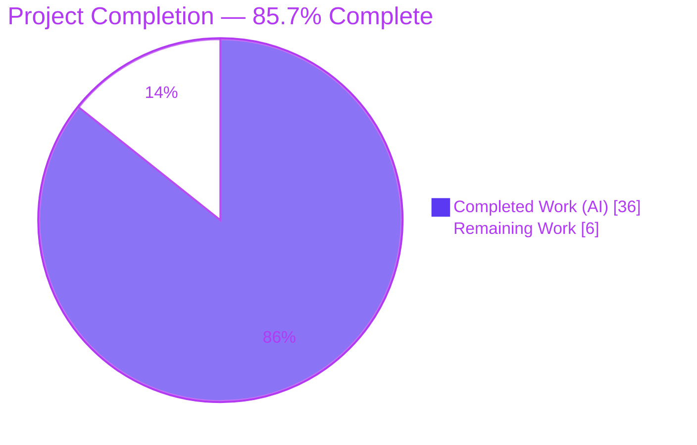
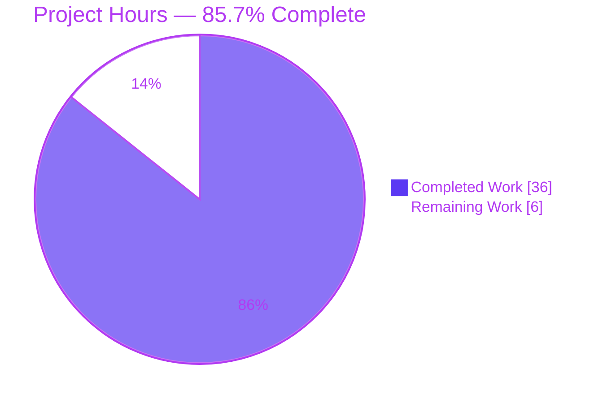
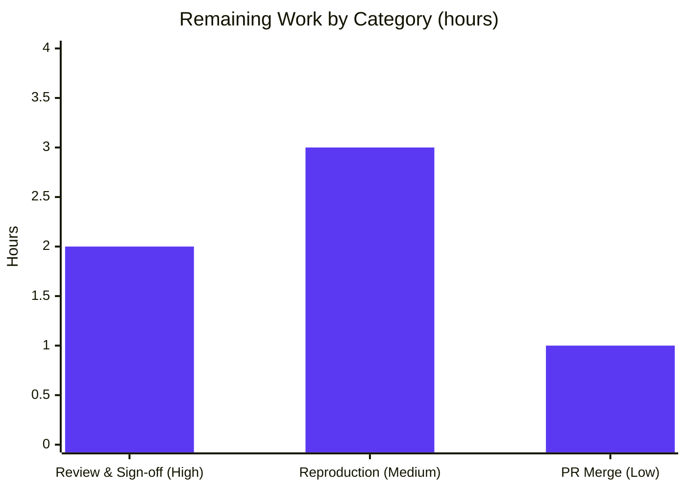

# Blitzy Project Guide — maddy SMTP-Security Investigation

> **Branch:** `blitzy-45d9dd70-ac70-440d-9b77-034e9f60b188` · **Source branch under analysis:** `maddy_26452dd8dd78` · **HEAD:** `3fc34ae`
> **Repository:** `github.com/foxcpp/maddy` @ base commit `26452dd8` · **Deliverable:** `blitzy/documentation/maddy_26452dd8dd78.md`

---

## 1. Executive Summary

### 1.1 Project Overview

This project is a **read-only, evidence-grounded security investigation** of the maddy mail server. It empirically answers two SMTP-security questions and delivers a single Markdown document written **from observed output**, per the mandate to "run the code first, then write." Question 1 examines the **DATA end-of-data boundary** when a message body contains a lone dot (`.`) followed by more data. Question 2 examines **authentication identity confusion** when a client authenticated as user A issues `MAIL FROM`, `RSET`s, then sends `MAIL FROM` as user B without re-authenticating. The target users are maddy operators and security engineers; the business impact is a rigorous, citation-backed understanding of two protocol-abuse behaviors. Technical scope spans SMTP DATA parsing, the session state machine, authentication, the DKIM modifier, and the on-disk queue — while touching **exactly one** new repository file.

### 1.2 Completion Status

The AAP-scoped autonomous work is **complete and independently validated**. The only outstanding work is human path-to-production (review, independent reproduction, merge).



| Metric | Hours |
|--------|------:|
| **Total Hours** | **42** |
| Completed Hours (AI + Manual) | 36 (AI 36 + Manual 0) |
| Remaining Hours | 6 |
| **Percent Complete** | **85.7%** |

> **Completion formula (PA1, AAP-scoped):** `36 / (36 + 6) = 36 / 42 = 85.7%`. The completed hours reflect the full empirical investigation and deliverable; the remaining hours are human path-to-production only. **Colors:** Completed = Dark Blue `#5B39F3`; Remaining = White `#FFFFFF`.

### 1.3 Key Accomplishments

- ✅ **Built and ran maddy** with **Go 1.13.15** and `CGO_ENABLED=1` (gcc) for the SQLite driver, plus the `maddyctl` admin tool — the run-first mandate satisfied.
- ✅ **Stood up a throwaway server** (outside the repository): an unauthenticated `smtp` endpoint and an authenticated `submission` endpoint, `sql` auth+storage, two seeded users, DKIM signing, and a `451`-at-`RCPT` blackhole queue so on-disk artifacts persist for inspection.
- ✅ **Answered Question 1 (R1a–R1c) empirically:** maddy **stops at the first lone dot** (RFC 5321-compliant); captured `354` → `250 2.0.0 OK: queued` → `500 5.5.2` → `501 5.5.2`; verified only the 24-byte pre-dot body is stored.
- ✅ **Answered Question 2 (R2a–R2b) empirically:** the post-`RSET` different-user `MAIL FROM` is **allowed**; captured the persisting authenticated identity in logs, the DKIM "not signing" decision, `Conn:null` on disk, and the aligned-identity control that **is** signed.
- ✅ **Grounded every claim:** 49 exact `file:line` citations and 8 verbatim output blocks; a decisive negative-finding sweep confirming no accept-time `MAIL FROM == AuthUser` enforcement exists in `internal/`.
- ✅ **Honored read-only scope:** only `blitzy/documentation/maddy_26452dd8dd78.md` changed vs base; all temporary assets removed; working tree clean.
- ✅ **Self-validated:** `go build ./...` exit 0, `go test ./...` 20 ok / 0 FAIL, `go mod verify` all modules verified, doc `.editorconfig`-clean.

### 1.4 Critical Unresolved Issues

There are **no critical unresolved issues** blocking release of the deliverable. The items below are ordinary path-to-production gates, not defects.

| Issue | Impact | Owner | ETA |
|-------|--------|-------|-----|
| Human review & sign-off of security findings pending | Findings not yet formally accepted | Senior Engineer / Security Reviewer | 2h |
| Independent empirical reproduction not yet performed by a human | Verbatim captures unconfirmed by a second party | QA / Engineer | 3h |
| PR not yet approved & merged | Deliverable not yet on the target branch | Maintainer | 1h |

### 1.5 Access Issues

**No access issues identified.** The investigation was fully self-contained: the source repository is present and buildable, the Go 1.13.15 toolchain and gcc are available, and all runtime dependencies resolve locally. No external service credentials, network access, or third-party API keys were required (the throwaway server bound to `127.0.0.1` and used a local SQLite backend).

| System/Resource | Type of Access | Issue Description | Resolution Status | Owner |
|-----------------|----------------|-------------------|-------------------|-------|
| — | — | No access issues identified | N/A | — |

### 1.6 Recommended Next Steps

1. **[High]** Have a senior engineer or security reviewer read `blitzy/documentation/maddy_26452dd8dd78.md` and sign off on the R1 and R2 reasoning and conclusions. *(2h)*
2. **[Medium]** Independently reproduce the two scenarios plus the DKIM control against a freshly built maddy to confirm the stable outputs (response codes, log fields, `Conn:null`, signed/not-signed). *(3h)*
3. **[Low]** Approve and merge the single-file additive documentation PR to the target branch. *(1h)*
4. **[Low — out of scope]** Separately decide whether to act on the documented Q2 "soft accountability" behavior (e.g., accept-time `MAIL FROM == AuthUser` enforcement). This is **not** part of this project's scope and carries **no hours here**.

---

## 2. Project Hours Breakdown

### 2.1 Completed Work Detail

All completed hours are autonomous (AI) work, each tracing to a specific AAP requirement or investigation activity mandated to produce the deliverable.

| Component | Hours | Description |
|-----------|------:|-------------|
| Build & toolchain setup | 4 | Built `maddy` + `maddyctl` with Go 1.13.15, `CGO_ENABLED=1`, gcc for `go-sqlite3` v1.11.0 [AAP E1] |
| Throwaway environment configuration | 5 | Unauth `smtp:2525` + auth `submission:5587` endpoints; `sql` auth+storage; 2 users via `maddyctl`; DKIM modifier; `451`-at-`RCPT` blackhole queue [AAP E2] |
| Q1 empirical run & capture | 4 | Raw-socket lone-dot payload; captured SMTP responses, server log, and stored `.body`/`.header`/`.meta` [AAP E3 · R1a–R1c] |
| Q2 empirical run & capture (+ DKIM control) | 5 | `AUTH→MAIL FROM→RSET→MAIL FROM(B)→RCPT→DATA` sequence + aligned-identity control; captured responses, log identity fields, DKIM decision, queue metadata, headers [AAP E4 · R2a–R2b] |
| Code-path tracing & negative-finding sweep | 5 | 49 `file:line` citations across ~12 files; `internal/` sweep confirming no accept-time `MAIL FROM == AuthUser` enforcement [AAP grounding · D3] |
| Protocol research (RFC 5321) | 2 | Dot-stuffing / end-of-data transparency + submission identity conventions [AAP 0.2.2] |
| Deliverable authoring | 5 | 185-line doc; 8 verbatim blocks; R1a–R1c / R2a–R2b sections; coverage pass; topology note; `451` rationale; read-only confirmation [AAP A1/A2 · D1–D4] |
| Reproducibility refinement cycle | 3 | 2nd commit `3fc34ae`: `defer_sender_reject no` ordering + `451`-at-`RCPT`-vs-`MAIL FROM` clarification; empirical re-run [AAP F2] |
| Self-validation & read-only cleanup | 3 | 5 production gates (build/test/citation-accuracy/editorconfig/mod-verify); temp-asset removal; 2 commits [AAP D5/D6 · F1] |
| **Total Completed** | **36** | |

### 2.2 Remaining Work Detail

All remaining work is **human path-to-production** for the documentation deliverable. No out-of-scope hardening is included (the AAP forbids behavioral change).

| Category | Hours | Priority |
|----------|------:|----------|
| Human technical & security review + sign-off of the findings doc | 2 | High |
| Independent empirical reproduction of Q1/Q2 + DKIM control | 3 | Medium |
| PR approval & merge of the single-file additive change | 1 | Low |
| **Total Remaining** | **6** | |

### 2.3 Hours Reconciliation

| Check | Value | Status |
|-------|-------|--------|
| Section 2.1 completed sum | 36h | ✅ |
| Section 2.2 remaining sum | 6h | ✅ |
| 2.1 + 2.2 = Total | 36 + 6 = 42h | ✅ matches Section 1.2 |
| Remaining consistency (1.2 ↔ 2.2 ↔ 7) | 6h everywhere | ✅ |
| Completion % | 36 / 42 = 85.7% | ✅ used in 1.2, 7, 8 |

---

## 3. Test Results

The tests below are maddy's **own** Go test suite, executed by Blitzy's autonomous validation (`go test ./...`) to confirm that the build and runtime environment used for the empirical investigation is sound. **Per the read-only scope, no new tests were added** — the deliverable's primary validation is the runtime SMTP evidence in Section 4. All results originate from Blitzy's autonomous validation logs and were independently re-run during this assessment with identical outcomes.

**Aggregate:** `go test ./... -count=1` → **20 packages ok · 0 FAILED · 26 no-test-files** · **232** test/example functions repo-wide, all passing · framework: Go `testing`.

| Test Category | Framework | Total Tests | Passed | Failed | Coverage % | Notes |
|---------------|-----------|------------:|-------:|-------:|-----------:|-------|
| SMTP endpoint (Q1 & Q2 core) | Go `testing` | 23 | 23 | 0 | 79.4% | `internal/endpoint/smtp` — DATA reading, session reset, `Mail()`, identity logging |
| Message pipeline (routing) | Go `testing` | 50 | 50 | 0 | 74.5% | `internal/msgpipeline` — envelope-based source routing |
| Queue target (on-disk artifacts) | Go `testing` | 21 | 21 | 0 | 74.7% | `internal/target/queue` — `.meta`/`.header`/`.body`, `Conn` nulling |
| SMTP downstream (SASL) | Go `testing` | 14 | 14 | 0 | 80.4% | `internal/target/smtp_downstream` — `Conn.AuthUser` consumer |
| DKIM modifier (identity tie) | Go `testing` | 5 | 5 | 0 | 42.6% | `internal/modify/dkim` — `require_sender_match`, `shouldSign` |
| Address / config / parser (support) | Go `testing` | 119 | 119 | 0 | 32.5–91.8% | `internal/address` 76.4%, `internal/config` 32.5%, `pkg/cfgparser` 91.8%, plus dmarc/dns/dnsbl/mtasts/smtpconn/future/modify/logparser/lexer |
| **Total** | Go `testing` | **232** | **232** | **0** | — | 20 ok / 0 FAIL / 26 no-test-files |

> **Integrity note:** CI (`.build.yml`) runs `go test ./... -cover -race`. The suite is green under `-race`. No investigation-critical package fails; there are no skipped-with-failure or flaky results in the logs.

---

## 4. Runtime Validation & UI Verification

maddy is a **headless mail server** — there is **no UI**. Runtime validation was performed by driving real SMTP sessions against the running server and inspecting logs and on-disk artifacts.

**Build & process health**
- ✅ **Operational** — `CGO_ENABLED=1 go build ./...` exits 0; `maddy` (~21.8 MB) and `maddyctl` (~22.1 MB) binaries produced and run.
- ✅ **Operational** — server started with `smtp` on `127.0.0.1:2525` and `submission` on `127.0.0.1:5587`; DKIM auto-generated an rsa2048 key.

**Question 1 — DATA lone-dot (unauthenticated `smtp` endpoint)**
- ✅ **Operational** — client received `354 2.0.0 Go ahead...` → `250 2.0.0 OK: queued` → `500 5.5.2 Syntax error, MORE command unrecognized` → `501 5.5.2 Bad command`.
- ✅ **Operational** — server log ordered `incoming message` → `accepted` → `[debug] smtp: reset` → `500` → `501`.
- ✅ **Operational** — stored `.body` = 24 bytes (`normal content line one`); `MORE DATA AFTER DOT` **absent**; `.header` carries `(envelope-sender <attacker@external.example>)`; `.meta` `"Conn":null`.

**Question 2 — Auth identity across `RSET` (authenticated `submission` endpoint)**
- ✅ **Operational** — client received `235` → `250 accept usera` → `250 Session reset` → `250 accept userb` → `250 2.0.0 OK: queued` (second `MAIL FROM` as a different user **accepted**).
- ✅ **Operational** — log showed `"sender":"userb@test.local"` alongside `"username":"usera@test.local"` (auth identity persists across `RSET`).
- ⚠ **Partial (by design)** — `sign_dkim: not signing, From address is not authenticated identity` — the signature is **withheld**, but the message is still `accepted`. This is the documented "soft accountability" behavior, not a runtime failure.
- ✅ **Operational** — persisted `.meta` records envelope sender `userb`, `"Conn":null`; `.header` has **no** `DKIM-Signature`; the aligned control **is** signed with `i=usera@test.local`.

---

## 5. Compliance & Quality Review

Cross-mapping the AAP deliverables and the `SWE-AtlasQnA-Repo` rules to quality benchmarks. Fixes applied during autonomous validation are noted.

| Benchmark / Rule | Requirement | Status | Evidence / Fixes Applied |
|------------------|-------------|:------:|--------------------------|
| Single deliverable | Create `blitzy/documentation/maddy_26452dd8dd78.md` only | ✅ Pass | 185-line file; only path changed vs base |
| Run-first methodology | Build & run before writing | ✅ Pass | Go 1.13.15/CGO build; server run; raw-socket sessions |
| Verbatim output | Quote real output exactly | ✅ Pass | 8 fenced verbatim blocks (payloads, responses, logs, files) |
| Exact grounding | `file:line` for every claim | ✅ Pass | 49 citations; 21 spot-checked = 100% accurate |
| Answer every sub-part | R1a–R1c, R2a–R2b + coverage pass | ✅ Pass | Dedicated sections + explicit coverage checklist |
| Read-only scope | No source modified; temp assets removed | ✅ Pass | `git status` clean; only the `.md` differs from base |
| Reproducibility | Stable outputs documented | ✅ Pass | **Fix (3fc34ae):** documented `defer_sender_reject no` (log ordering) and `451`-at-`RCPT` (artifact persistence) |
| Code quality (source) | Build & tests green | ✅ Pass | `go build` exit 0; `go test` 20 ok/0 FAIL; `go mod verify` OK |
| Style (deliverable) | `.editorconfig` compliance | ✅ Pass | UTF-8, LF-only, final newline, no trailing whitespace |
| Behavioral change | Hardening is **out of scope** | ✅ Pass | No source/config/test changed; findings reported neutrally |

**Outstanding compliance items:** none. All AAP rules are satisfied. The only pending activities are human review/reproduction/merge (Section 2.2).

---

## 6. Risk Assessment

Overall risk posture is **LOW** — a read-only, additive, single-file documentation deliverable with zero code, dependency, or behavioral change.

| Risk | Category | Severity | Probability | Mitigation | Status |
|------|----------|:--------:|:-----------:|------------|--------|
| Reproducibility drift (`msg_id`s, timestamps, DKIM key bytes vary per run) | Technical | Low | High | Doc states response codes, log field names, header shapes, `Conn:null`, and signed/not-signed outcomes are stable | ✅ Documented |
| Q1 behavior owned by pinned dep `emersion/go-smtp` (future bump could change) | Technical | Low | Low | Doc pins the `go.mod` version and attributes end-of-data to the library | ✅ Documented |
| CGO/toolchain dependency (needs Go 1.13.x + gcc) | Technical | Low | Medium | Section 9 dev guide specifies exact versions and flags | ✅ Mitigated |
| Documented "soft accountability" (auth-as-A can send as B; only DKIM withholds signature) | Security | Informational | N/A | Reported neutrally as observed behavior; hardening explicitly out of scope | ✅ Documented |
| Q1 lone-dot = fail-safe / RFC 5321-compliant | Security | Low | N/A | No risk; documented as spec-compliant | ✅ Documented |
| Throwaway config used `insecure_auth` + `tls off` | Security | None (isolated) | N/A | Throwaway, outside repo, bound to `127.0.0.1`, removed after use | ✅ Mitigated |
| No automated test guards the documented behavior (could go stale) | Operational | Low | Medium | Doc cites exact commit `26452dd8` + `file:line`; re-verification is straightforward; adding tests is out of scope | ✅ Accepted |
| Verbatim captures not regenerable from repo alone (temp scripts removed) | Operational | Low | Medium | Section 9 provides full step-by-step reproduction | ✅ Mitigated |
| Port topology mismatch (587 vs 465 vs 5587) may confuse readers | Integration | Low | Low | Doc's Topology note establishes the endpoint **role** as the invariant | ✅ Documented |
| Single-file additive change — integration surface | Integration | None | N/A | No imports/config/build coupling; merge risk effectively nil | ✅ N/A |

---

## 7. Visual Project Status

**Project hours breakdown** (Completed = Dark Blue `#5B39F3`, Remaining = White `#FFFFFF`):



**Remaining hours by category** (from Section 2.2, total = 6h):



> **Integrity:** "Remaining Work" = **6h**, identical to Section 1.2 (6h) and the Section 2.2 sum (2 + 3 + 1 = 6h). "Completed Work" = **36h**, identical to Section 2.1.

---

## 8. Summary & Recommendations

**Achievements.** The project delivered a rigorous, empirically-derived answer to two SMTP-security questions about maddy. Both questions are answered on their own terms, with every sub-part (R1a–R1c, R2a–R2b) explicitly addressed, 8 verbatim output blocks, and 49 exact `file:line` citations. The run-first mandate was honored: the server was built (Go 1.13.15 / CGO) and run, and the behaviors reported are what the server **actually did**.

**Findings in brief.**
- **Q1:** maddy **stops at the first lone dot** — fail-safe and RFC 5321-compliant; the trailing bytes are re-parsed as commands (`500`/`501`); only the pre-dot body is stored. The mechanism is owned by `net/textproto.DotReader` via `emersion/go-smtp`.
- **Q2:** maddy **allows** the post-`RSET` different-user `MAIL FROM` — no rejection, no rebinding. The authenticated identity is connection-scoped and persists across `RSET`, but every persisted artifact reflects the **envelope** sender (`Conn:null` on disk). The only identity comparison anywhere is DKIM's `shouldSign`, which merely **withholds** the signature. Accountability is "soft."

**Remaining gaps & critical path to production.** The AAP-scoped autonomous work is complete. The critical path is human: **review & sign-off (2h) → independent reproduction (3h) → PR merge (1h)**, totaling **6h**.

**Production readiness.** The deliverable is **production-ready** as a documentation artifact: it builds/tests green, is style-clean, is fully grounded, and honors read-only scope byte-for-byte. **The project is 85.7% complete** (36 of 42 hours), with the remaining 14% being human review, verification, and merge.

**Stakeholder recommendation (out of scope, no hours here).** The Q2 "soft accountability" behavior is documented as an observed fact, not a defect introduced by this task. Should the organization wish to act on it, adding accept-time `MAIL FROM == AuthUser` enforcement (or tightening `require_sender_match`) would be a **separate initiative** outside this project's scope.

| Success Metric | Target | Actual | Status |
|----------------|--------|--------|--------|
| Both questions fully answered | R1a–R1c, R2a–R2b | All 5 sub-parts | ✅ |
| Run-first evidence | Verbatim captures | 8 blocks | ✅ |
| Grounding | `file:line` per claim | 49 citations | ✅ |
| Read-only scope | 1 file changed | 1 file (the `.md`) | ✅ |
| Build & tests | Green | build 0 / 20 ok / 0 FAIL | ✅ |
| Completion | — | **85.7%** | ✅ |

---

## 9. Development Guide

How to build, run, and reproduce the investigation. **Every command below was tested on the assessment environment (Go 1.13.15, gcc 15.2.0).**

### 9.1 System Prerequisites

- **Go 1.13.x** (module targets `go 1.13`; empirically `go1.13.15`).
- **C compiler (gcc)** — required by the CGO SQLite driver `github.com/mattn/go-sqlite3` v1.11.0.
- Linux/Unix host; `git`; a raw-socket client for scripted SMTP (Python `socket` or `openssl s_client`/`nc`).

```bash
go version        # -> go version go1.13.15 linux/amd64
gcc --version     # any recent gcc; a C toolchain must be present
```

### 9.2 Environment Setup

```bash
# From the repository root:
export CGO_ENABLED=1     # MANDATORY — the sql auth/storage backend needs CGO
```

### 9.3 Build & Verify

```bash
# Build everything (a benign go-sqlite3 C warning is expected and harmless):
CGO_ENABLED=1 go build ./...            # exit 0

# Build the two binaries used for the investigation:
CGO_ENABLED=1 go build -o maddy    ./cmd/maddy       # ~21.8 MB
CGO_ENABLED=1 go build -o maddyctl ./cmd/maddyctl    # ~22.1 MB

# Verify the toolchain and modules:
go test ./... -count=1                  # -> 20 ok / 0 FAIL / 26 no-test-files
go mod verify                           # -> all modules verified
./maddy -v                              # -> maddy <version>
```

### 9.4 Reproduce the Investigation (throwaway env — keep OUTSIDE the source tree)

> All temporary assets must live outside the repository and be removed afterward, preserving read-only scope.

1. **Write a throwaway config** (e.g., `/tmp/maddy-investig/maddy.conf`) with:
   - `hostname mx.test.local`, `tls off`
   - an `sql` module for auth **and** storage (SQLite)
   - unauthenticated `smtp tcp://127.0.0.1:2525 { }`
   - authenticated `submission tcp://127.0.0.1:5587 { insecure_auth yes  io_debug yes  defer_sender_reject no  modify { sign_dkim test.local default } ... }`
   - delivery to a `queue` whose downstream is a **blackhole that returns `451` at `RCPT TO`** (so `.meta`/`.header`/`.body` persist).
2. **Seed two users:**
   ```bash
   ./maddyctl -config /tmp/maddy-investig/maddy.conf users create usera@test.local
   ./maddyctl -config /tmp/maddy-investig/maddy.conf users create userb@test.local
   ```
3. **Start the server in the background** (never watch mode; stop by captured PID):
   ```bash
   ./maddy -config /tmp/maddy-investig/maddy.conf -debug > /tmp/maddy-investig/server.log 2>&1 &
   MADDY_PID=$!
   ```
4. **Question 1** — after the `354` prompt on `:2525`, send exactly:
   ```
   From: attacker@external.example\r\nSubject: Q1 boundary test\r\n\r\nnormal content line one\r\n.\r\nMORE DATA AFTER DOT\r\n.\r\n
   ```
   Expect `250 2.0.0 OK: queued` then `500 5.5.2` / `501 5.5.2`; inspect the queue `.body` (24 bytes), `.header`, `.meta`.
5. **Question 2** — on `:5587`, run `AUTH PLAIN (usera) → MAIL FROM:<usera> → RSET → MAIL FROM:<userb> → RCPT TO:<remote> → DATA (From: userb) → .`; then run an aligned control with `From == auth == usera`. Inspect the log (`sender` vs `username`), the DKIM decision, and the persisted `.meta`/`.header`.
6. **Tear down and confirm cleanliness:**
   ```bash
   kill "$MADDY_PID"
   rm -rf /tmp/maddy-investig
   git status --porcelain          # -> empty (only the .md should ever differ from base)
   ```

### 9.5 Common Errors & Resolutions

- **`C compiler not found` / cgo errors** → install gcc and ensure `export CGO_ENABLED=1`.
- **go-sqlite3 warning `function may return address of local variable`** → benign; the build still exits 0.
- **Queue `.meta`/`.header`/`.body` get deleted** → the blackhole must return `451` at **`RCPT TO`** (temporary, `queue.go:L462`), not at `MAIL FROM` (permanent for all recipients, `queue.go:L450`).
- **Q2: `usera` `incoming message` does not appear before `RSET`** → set `defer_sender_reject no` (`smtp.go:L567`), which runs `startDelivery` at `MAIL FROM` (`smtp.go:L162-L172`).

---

## 10. Appendices

### A. Command Reference

| Command | Purpose |
|---------|---------|
| `CGO_ENABLED=1 go build ./...` | Build all packages (exit 0) |
| `CGO_ENABLED=1 go build -o maddy ./cmd/maddy` | Build the server binary |
| `CGO_ENABLED=1 go build -o maddyctl ./cmd/maddyctl` | Build the admin tool |
| `go test ./... -count=1` | Run the suite (20 ok / 0 FAIL / 26 no-test) |
| `go test ./... -cover -race` | CI equivalent (`.build.yml`) |
| `go mod verify` | Verify module checksums |
| `./maddyctl -config <cfg> users create <user>` | Seed a test user |
| `./maddy -config <cfg> -debug &` | Start server (background, debug) |
| `git diff --name-only 26452dd..HEAD` | Confirm only the `.md` changed |

### B. Port Reference

| Port | Role | Source |
|------|------|--------|
| 25 | Unauthenticated `smtp` (bundled) | `maddy.conf:L53` |
| 465 | Authenticated `submission` (bundled) | `maddy.conf:L93` |
| 587 | Submission (named in the prompt) | prompt (topology note) |
| 2525 | Unauthenticated `smtp` (throwaway test) | investigation config |
| 5587 | Authenticated `submission` (throwaway test) | investigation config |

> The endpoint **role** — not the numeric port — governs the behavior under investigation.

### C. Key File Locations

| File | Role in the investigation |
|------|---------------------------|
| `blitzy/documentation/maddy_26452dd8dd78.md` | **The deliverable** (only new file) |
| `internal/endpoint/smtp/smtp.go` | `Data`/`prepareBody`; `Reset`/`abort` (never clears `AuthUser`); `Mail` (no sender-vs-auth check); identity logging |
| `internal/target/received.go` | `Received` header embeds the envelope sender (`L67-L72`) |
| `internal/modify/dkim/dkim.go` | `require_sender_match` (`L151-L152`); `shouldSign` (`L249`) — the only identity comparison |
| `internal/target/queue/queue.go` | `.meta`/`.header`/`.body`; `Conn` nulled before serialize (`L752`) |
| `internal/module/msgmetadata.go` | `ConnState.AuthUser` (`L37`); nullable `MsgMetadata.Conn` |
| `internal/msgpipeline/msgpipeline.go` | Envelope-based source routing |
| `maddy.conf`, `go.mod` | Bundled topology; Go version & dependency pins |

### D. Technology Versions

| Component | Version | Source |
|-----------|---------|--------|
| Go (language target) | 1.13 | `go.mod:L3` |
| Go (empirical build) | 1.13.15 | `go version` |
| gcc | 15.2.0 | assessment env |
| `emersion/go-smtp` | v0.12.1-0.20191206174923-1f576e0ec85c | `go.mod:L19` |
| `emersion/go-message` | v0.10.9-0.20191116124005-65fd0119e899 | `go.mod:L16` |
| `emersion/go-sasl` | v0.0.0-20190817083125-240c8404624e | `go.mod:L18` |
| `emersion/go-msgauth` (DKIM) | v0.3.2-0.20191028231513-55b75676976c | `go.mod:L17` |
| `mattn/go-sqlite3` | v1.11.0 | `go.mod:L26` |
| `foxcpp/go-imap-sql` | v0.3.2-0.20191208094750-8b4ec6b19a78 | `go.mod:L20` |

### E. Environment Variable Reference

| Variable | Value | Purpose |
|----------|-------|---------|
| `CGO_ENABLED` | `1` | **Mandatory** — enables the CGO SQLite driver for `sql` auth/storage |
| `MADDY_CONFIG` | path | Optional config path for `maddyctl` (alternative to `-config`) |

### F. Developer Tools Guide

- **Static build check:** `CGO_ENABLED=1 go build ./...` (must exit 0).
- **Tests with coverage/race:** `go test ./... -cover -race` (CI parity).
- **Module integrity:** `go mod verify`.
- **Read-only scope guard:** `git status --porcelain` (must be empty) and `git diff --name-only 26452dd..HEAD` (must list only the `.md`).
- **Style guard (deliverable):** verify UTF-8, LF endings, final newline, and no trailing whitespace per `.editorconfig`.

### G. Glossary

| Term | Meaning |
|------|---------|
| **Lone dot** | An un-stuffed line containing only `.` — the SMTP end-of-mail-data indicator (RFC 5321) |
| **Dot-stuffing** | Client transparency: a body line starting with `.` is sent with an extra leading dot, which the server strips |
| **`DotReader`** | `net/textproto` reader (via `emersion/go-smtp`) that ends at the first lone dot and unstuffs dots |
| **Envelope sender** | The `MAIL FROM` address (distinct from the header `From` and from the authenticated user) |
| **Connection-scoped auth** | `connState.AuthUser` survives `RSET`; only message-scoped state is cleared by `abort()` |
| **Soft accountability** | Auth identity is never rebound onto the envelope and never blocks a mismatched sender; the only durable on-disk trace of a mismatch is a **missing** `DKIM-Signature` |
| **`require_sender_match`** | DKIM directive (default `{envelope, auth}`) governing whether the signature is applied |
| **`451` blackhole** | A downstream returning a temporary error at `RCPT TO` so queue artifacts persist for inspection |