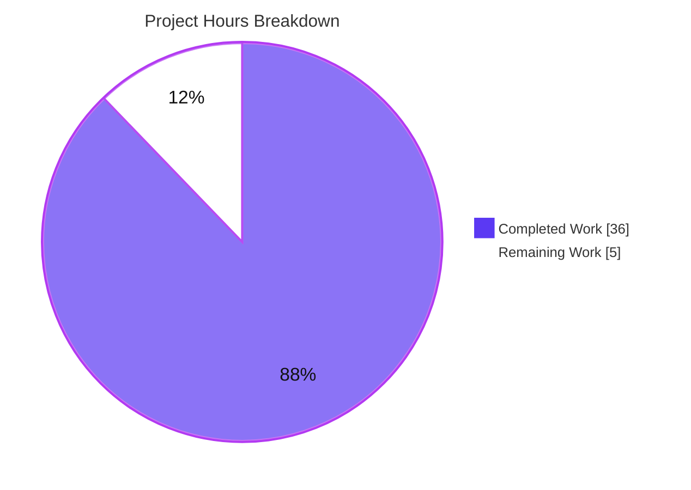
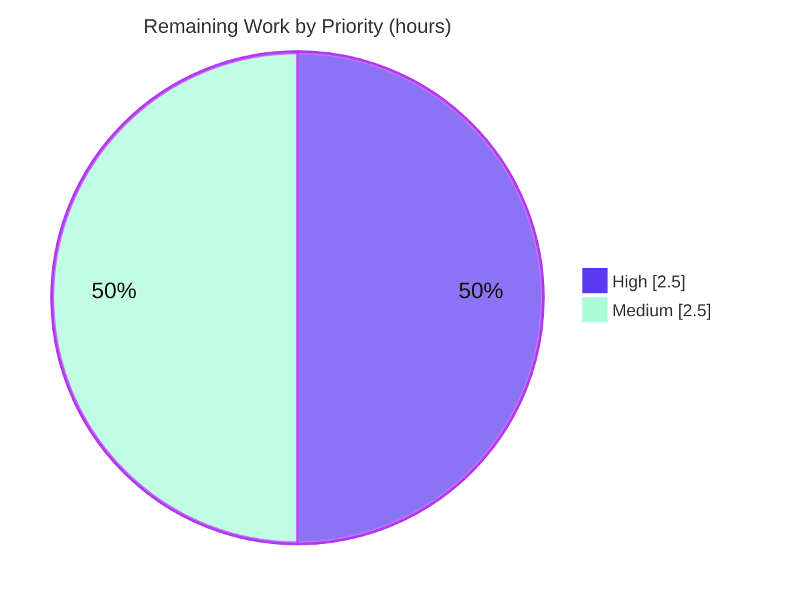

# Blitzy Project Guide

**Project:** maddy Outbound Delivery — Queue & Retry Behaviour Q&A (execution-grounded documentation)
**Repository:** `github.com/foxcpp/maddy` · **Branch:** `blitzy-94d7b6ac-169d-4e27-82c8-0c34bdbe72ff` · **Base HEAD:** `26452dd8dd787dc455278b0fdd296f4a5432c768`
**Deliverable:** `blitzy/documentation/maddy_26452dd8dd78.md` · **Rule:** `SWE-AtlasQnA-Repo`

---

## 1. Executive Summary

### 1.1 Project Overview

The project delivers an execution-grounded technical knowledge artifact: a single Markdown document (`blitzy/documentation/maddy_26452dd8dd78.md`) that traces maddy's outbound message-processing pipeline and answers eight questions (Q1–Q8) about queue and retry behaviour when a message is delivered to a non-responsive SMTP destination that times out. maddy is a Go all-in-one mail server. The audience is engineers operating or extending maddy's delivery queue. Every factual claim is grounded in verbatim runtime output from a purpose-built binary plus exact `file:line` citations. Business impact: an authoritative reference on retry timing, on-disk state, scheduling, and starvation that reduces future investigation time. Technical scope spans three subsystems — the inbound SMTP endpoint, the durable queue, and the outbound SMTP targets — investigated strictly read-only.

### 1.2 Completion Status


| Metric | Value |
|--------|-------|
| **Total Hours** | **41 h** |
| **Completed Hours (AI + Manual)** | **36 h** (36 h AI + 0 h Manual) |
| **Remaining Hours** | **5 h** |
| **Percent Complete** | **87.8%** |

> Completion % is computed with the PA1 AAP-scoped, hours-based formula: `36 / (36 + 5) × 100 = 87.8%`.

### 1.3 Key Accomplishments

- ✅ Built maddy from source with the exact documented Go **1.13.4** toolchain + gcc (CGO for the SQLite driver); build exits `0` producing a ~21.8 MB binary.
- ✅ Ran the binary under `-debug` against an engineered non-responsive destination and captured **verbatim** runtime evidence for all eight sub-questions.
- ✅ Answered **Q1–Q8** explicitly, each pairing observed output, the command/config that produced it, exact `file:line` citations, and rationale.
- ✅ Stated the **three carried-forward corrections** (no per-line log timestamp; retry interval not configurable; connect-failure classification depends on lifecycle stage) and wove them into the relevant answers.
- ✅ Verified **27 `file:line` citations** against source — all accurate; verified the subtle DSN rationale (`TemporaryFailedRcpts` declared but never assigned).
- ✅ Preserved **read-only scope**: exactly one file added (`+446 / −0`); `0` `.go`/`go.mod`/`go.sum` changes; temporary harness kept outside the repo tree and removed.
- ✅ Full test suite `go test ./...` passes (20/20 test-bearing packages, 232 test functions), confirming the investigation left the codebase intact.

### 1.4 Critical Unresolved Issues

| Issue | Impact | Owner | ETA |
|-------|--------|-------|-----|
| None — no release-blocking defects identified. The deliverable builds, all tests pass, all spot-checked citations are accurate, and read-only scope is honored. | N/A | — | — |

> Non-blocking validation gates (human review of answer correctness, re-verification of environment-dependent values, PR merge) are tracked in Sections 1.6, 2.2, and 8. They are standard path-to-production steps, not defects.

### 1.5 Access Issues

| System/Resource | Type of Access | Issue Description | Resolution Status | Owner |
|-----------------|----------------|-------------------|-------------------|-------|
| — | — | **No access issues identified.** The build ran fully offline from a warmed module cache; no external credentials, API keys, or repository permissions were required. | N/A | — |

### 1.6 Recommended Next Steps

1. **[High]** Have a maddy/SMTP-knowledgeable engineer review the Q1–Q8 answers for technical correctness and completeness (acceptance gate for a knowledge artifact).
2. **[Medium]** Re-verify the environment-dependent measured values on a reference host — primarily the OS-governed Q2 connect-timeout band (`~133–136 s`), and optionally the timing-sensitive Q7/Q8 concurrency signatures.
3. **[Medium]** Review and merge the documentation-only PR into the target branch, confirming the read-only scope (single added file).

---

## 2. Project Hours Breakdown

### 2.1 Completed Work Detail

| Component | Hours | Description |
|-----------|-------|-------------|
| Environment provisioning & CGO build | 3.0 | Provision Go 1.13.4 (`get.sh` `GOVERSION=1.13.4`) + gcc, warm the offline module cache, `CGO_ENABLED=1 go build ./cmd/maddy` → 21.8 MB binary, outside the repo tree. |
| Investigation harness engineering | 4.0 | Python fake SMTP server (451 / silent / route modes), three maddy config variants (base, `max_parallelism` 16 and 1), a black-holed connect probe, and the reload/back-date trick to reach attempt #2 without waiting 15 min. |
| Source investigation & citation sourcing | 5.0 | Read/trace queue, timewheel, remote, smtp_downstream, smtpconn, exterrors, msgid, and endpoint/smtp to attach 27+ exact `file:line` citations across three subsystems. |
| Q1 / Q3 — connection sequence & retry logging | 3.0 | Capture the debug trio (`delivery attempt #N` → `delivery attempt failed` → `will retry`), the one-connection-per-attempt evidence, the `N+1`-attempts semantics, and the exhaustion case. |
| Q2 — measured connect timeout | 2.5 | Measure the OS-governed connect timeout (`~133–136 s`, `[Errno 110]`, `tcp_syn_retries=6`) and document the indefinite-block (accept-then-silent) second mode. |
| Q4 / Q5 — queue location & on-disk state | 2.5 | Derive the default `/var/lib/maddy/remote_queue`; snapshot the three per-message files (`.header/.body/.meta`, 8-hex id) and quote the `"TriesCount":1` metadata. |
| Q6 / Q7 / Q8 — scheduling & concurrency | 4.0 | Demonstrate earliest-deadline-first scheduling (Q6), cross-message independence at `max_parallelism=16` (Q7), and reproducible starvation at `max_parallelism=1` (Q8). |
| Three corrections | 2.0 | Investigate & verify: no per-line log timestamp; retry interval not configurable (hardcoded 15 min × 2); connect-failure classification by connection lifecycle stage. |
| Answer document authoring | 6.0 | Write the 446-line Markdown document: verbatim quotes, per-question rationale, methodology, coverage-pass table, and consolidated citation reference list. |
| Quality/coverage pass + review fixes | 4.0 | Coverage pass over Q1–Q8, citation-accuracy verification, internal-consistency checks, plus the two review cycles (6 findings in `b793062`; Q2 re-measurement in `9aa4c0c`). |
| **Total Completed** | **36.0** | **Matches Completed Hours in Section 1.2.** |

### 2.2 Remaining Work Detail

| Category | Hours | Priority |
|----------|-------|----------|
| Human domain/technical review of Q1–Q8 answer correctness & completeness (spot-verify a citation sample at HEAD `26452dd`) | 2.5 | High |
| Re-verify environment-dependent measured values (Q2 `~133–136 s` OS-governed timeout band; timing-sensitive Q7/Q8 concurrency interleavings) | 1.5 | Medium |
| Documentation-only PR review & merge into the target branch (confirm read-only scope) | 1.0 | Medium |
| **Total Remaining** | **5.0** | **Matches Remaining Hours in Sections 1.2 and 7.** |

### 2.3 Total Project Hours & Reconciliation

| Line | Hours |
|------|-------|
| Section 2.1 — Completed | 36.0 |
| Section 2.2 — Remaining | 5.0 |
| **Total Project Hours** | **41.0** |
| **Completion** | **36 / 41 = 87.8%** |

> Integrity: `2.1 (36) + 2.2 (5) = 41` = Total in Section 1.2; Remaining `5 h` is identical across Sections 1.2, 2.2, and 7.

---

## 3. Test Results

All tests below originate from Blitzy's autonomous validation runs of the pre-existing maddy suite (`go test ./...`), independently re-executed for this guide. Because this is a **read-only documentation** task, **no new application tests were authored**; the existing suite serves as a regression guardrail confirming the investigation left the codebase intact (`0` `.go` files changed).

| Test Category | Framework | Total Tests | Passed | Failed | Coverage % | Notes |
|---------------|-----------|-------------|--------|--------|-----------|-------|
| Unit / Integration (full module) | Go `testing` (`go test ./...`, CGO on) | 232 test functions across 20 packages | 232 / 20 pkgs | 0 | Not measured (no `-cover` gate in scope) | Exit `0`; 26 additional packages have no test files. |
| Queue subsystem (investigation focus) | Go `testing` | 21 | 21 | 0 | — | Incl. `TestQueueDelivery_TemporaryFail`, `TestQueueDelivery_MultipleAttempts`, `TestQueueDelivery_SerializationRoundtrip`, `TestTimeWheelAdd_Ordering`. Fresh run `ok … 1.507s`. |
| Outbound targets | Go `testing` | (within suite) | Pass | 0 | — | `internal/target/remote`, `internal/target/smtp_downstream` both `ok`. |
| Shared SMTP connection & endpoint | Go `testing` | (within suite) | Pass | 0 | — | `internal/smtpconn`, `internal/endpoint/smtp`, `internal/msgpipeline` all `ok`. |

**Runtime (functional) reproduction** — captured by Blitzy's autonomous validation, not by the Go unit suite: the enqueue → attempt → `451` → `will retry` loop, on-disk persistence with `"TriesCount":1`, exhaustion, multi-message scheduling, concurrency independence (`max_parallelism=16`), and starvation (`max_parallelism=1`) were all observed live and quoted verbatim in the deliverable.

> Integrity note: the 20 passing packages include every subsystem the deliverable cites — `internal/target/queue`, `internal/target/remote`, `internal/target/smtp_downstream`, `internal/smtpconn`, `internal/endpoint/smtp`, `internal/msgpipeline`.

---

## 4. Runtime Validation & UI Verification

**Runtime health (from live `-debug` runs):**

- ✅ **Boot & config parse** — maddy boots, parses the harness config, loads the `queue` module and `smtp_downstream` target.
- ✅ **Inbound listener** — listens on `tcp://127.0.0.1:2525`; delivery target resolves to `*smtp_downstream.Downstream`.
- ✅ **Enqueue → attempt → retry** — `delivery attempt #1` → one TCP connection → `delivery attempt failed` (`smtp_code":451`) → `will retry` (`next_try_delay":"14m59.999999…s"`).
- ✅ **Durable persistence** — three files per message on disk (`<id>.header/.body/.meta`) with `"TriesCount":1`.
- ✅ **Exhaustion path** — final attempt removes the message from disk with no `will retry` and (for a pure-temporary `451`) no DSN.
- ✅ **Scheduling** — earliest-deadline-first dispatch, destination-agnostic (Q6).
- ✅ **Concurrency independence** — at `max_parallelism=16`, a fast message completes `will retry` while a slow one is still blocked (Q7).
- ✅ **Starvation** — at `max_parallelism=1`, a second message logs `waiting on delivery semaphore` with no matching `acquired` and never opens a connection (Q8).
- ⚠ **Connect-timeout measurement (Q2)** — operational but **environment-dependent**: the `~133–136 s` value is governed by the host's `net.ipv4.tcp_syn_retries` and varies run-to-run (documented honestly as a band, not a fixed value).

**UI verification:** ❕ **Not applicable.** The project has no user interface — the subject is a headless mail server and the deliverable is a Markdown document. No screenshots or browser verification are in scope.

**API/integration outcomes:** ✅ The SMTP enqueue path (inbound `smtp` endpoint → `queue` → `smtp_downstream`) was exercised end-to-end against a controllable fake SMTP peer and a black-holed address.

---

## 5. Compliance & Quality Review

Cross-mapping of the AAP deliverables and `SWE-AtlasQnA-Repo` rule directives to their compliance status.

| Benchmark / AAP Directive | Status | Progress | Evidence |
|---------------------------|--------|----------|----------|
| Deliverable at correct path & name (`blitzy/documentation/maddy_26452dd8dd78.md`) | ✅ Pass | 100% | File present; named after source branch `maddy_26452dd8dd78`. |
| Investigate by RUNNING the code first | ✅ Pass | 100% | Binary built & run under `-debug`; verbatim output captured before writing. |
| Quote observed output verbatim | ✅ Pass | 100% | Debug trio, `.meta` JSON, connect-probe output, fake-server logs quoted exactly. |
| Answer every sub-question (Q1–Q8) | ✅ Pass | 100% | All 8 answered; coverage-pass table marks each ✅. |
| Exact `file:line` citations; never paraphrase asked-for values | ✅ Pass | 100% | 27 citations spot-checked accurate; literals (`451`, `4.7.1`, `"TriesCount":1`, `/var/lib/maddy/remote_queue`) quoted. |
| Three corrections stated & consistent | ✅ Pass | 100% | Corrections 1–3 present and woven into Q1/Q2/Q3/Q5/Q7. |
| Provide reasoning/rationale | ✅ Pass | 100% | Each answer includes a "Citations + rationale" block. |
| Read-only: no existing file modified; no code added but the doc | ✅ Pass | 100% | `git diff 26452dd..HEAD` = `A` one file, `+446/−0`; `0` `.go`/`go.mod`/`go.sum`. |
| Temporary artifacts removed; repo pristine | ✅ Pass | 100% | Harness lived under `/tmp`; `git status --porcelain` empty. |
| Build integrity | ✅ Pass | 100% | `go build ./cmd/maddy` exit `0`; only benign CGO warning. |
| Test integrity (regression guardrail) | ✅ Pass | 100% | `go test ./...` exit `0`; 20/20 test-bearing packages. |
| Correctness of technical claims | ⚠ Pending human review | ~90% | Structurally & citation-verified autonomously; final domain sign-off remains (High-priority task). |
| Environment-dependent value stability (Q2) | ⚠ Mitigated | ~90% | Framed as OS-governed band; re-verification on a reference host recommended (Medium task). |

**Fixes applied during autonomous validation:**

- `b793062` — addressed **6 code-review findings** (1 CRITICAL + 5 MAJOR).
- `9aa4c0c` — corrected the Q2 connect-timeout from an over-claimed "exactly 136 s / deterministic" to a measured, honestly-framed `~133–136 s` OS-governed band, updating all dependent references (front matter, answer, rationale, coverage table) for consistency.

**Outstanding quality items:** human domain review (correctness), environment-dependent value re-verification — both non-blocking, tracked in Section 2.2.

---

## 6. Risk Assessment

Overall risk profile is **Low**, appropriate for a read-only documentation deliverable that ships no code, dependencies, or runtime component.

| Risk | Category | Severity | Probability | Mitigation | Status |
|------|----------|----------|-------------|------------|--------|
| Q2 connect-timeout value depends on host `net.ipv4.tcp_syn_retries`; won't reproduce to the exact second elsewhere | Technical | Low | Medium | Documented as an OS-governed `~133–136 s` band, not a fixed value; the earlier over-claim was corrected in `9aa4c0c` | Mitigated |
| Timing-sensitive concurrency observations (Q7 independence, Q8 starvation) may interleave differently on re-run | Technical | Low | Low | Grounded in source semantics — `deliverySemaphore` [queue.go:L282-L299] and the time wheel [timewheel.go:L78-L84] — not in a single timing snapshot | Mitigated |
| Citations pinned to HEAD `26452dd`; line numbers drift if ported to another maddy version | Technical | Low | Low | Document states the exact investigated HEAD; citations are only claimed valid at that commit | Open (informational) |
| No new attack surface, secrets, or dependencies introduced | Security | None | N/A | Markdown-only change; `go.mod`/`go.sum` untouched; maddy source unchanged | N/A |
| No runtime artifact to deploy/monitor/operate | Operational | None | N/A | Deliverable has zero operational footprint; readers should treat it as an investigation at a specific HEAD, not operational guidance | N/A |
| PR merge conflict on the added file | Integration | Low | Low | Brand-new file under a new `blitzy/documentation/` path — no conflict surface | Open (trivial) |
| Reproducibility — external harness was removed | Integration | Low | Low | Deliverable includes representative config, commands, and build steps sufficient to rebuild the harness | Mitigated |

---

## 7. Visual Project Status

**Project hours — Completed vs Remaining** (Completed = Dark Blue `#5B39F3`, Remaining = White `#FFFFFF`):



**Remaining hours by priority** (High vs Medium):



**Remaining hours by category (Section 2.2):**

| Category | Hours | Priority |
|----------|-------|----------|
| Human domain review of Q1–Q8 answers | 2.5 | High |
| Re-verify environment-dependent values | 1.5 | Medium |
| Doc-only PR review & merge | 1.0 | Medium |
| **Total** | **5.0** | — |

> Integrity: pie "Remaining Work" = `5` = Section 1.2 Remaining = Section 2.2 total.

---

## 8. Summary & Recommendations

**Achievements.** The task — a single, execution-grounded Q&A document tracing maddy's outbound queue/retry behaviour against a non-responsive SMTP destination — is delivered and independently verified. All eight sub-questions (Q1–Q8) are answered with verbatim observed output, exact `file:line` citations, and rationale; the three carried-forward corrections are present and consistent. The binary builds (exit `0`), the full test suite passes (20/20 test-bearing packages, 232 test functions), 27 citations were spot-checked accurate, and the read-only constraint is honored (one file added, `0` code changes).

**Remaining gaps.** The project is **87.8% complete** (36 h of 41 h). The remaining **5 h** are path-to-production human-validation activities that a knowledge artifact cannot self-certify: (1) a domain expert's review of answer correctness, (2) re-verification of environment-dependent measured values (chiefly the OS-governed Q2 timeout band), and (3) review + merge of the documentation-only PR.

**Critical path to production.** Domain review (High) → environment-dependent value re-verification (Medium) → PR merge (Medium). None are blocked; all inputs (built binary, harness recipe, source) are available.

**Success metrics.** All eight sub-questions answered ✅; verbatim-quoted evidence ✅; citation-grounded ✅; read-only compliance ✅; build & tests green ✅.

**Production readiness assessment.** **Ready for human review.** The deliverable is complete, accurate to the extent it can be autonomously verified, and safe (no code/dependency/runtime impact). It should not be considered "final/merged" until the High-priority domain review confirms technical correctness — the standard acceptance gate for a knowledge artifact.

---

## 9. Development Guide

Every command below was executed successfully in this environment and is copy-pasteable.

### 9.1 System Prerequisites

- **OS:** Linux (Ubuntu 25.10 used here).
- **Go toolchain:** **1.13.4** — the module minimum is `go 1.13` [go.mod:L3]; `1.13.4` is the highest documented version [get.sh:L10]. Installed at `/usr/local/go1.13.4`.
- **C compiler:** **gcc** (15.2.0 here) — required because the SQLite storage driver (`github.com/mattn/go-sqlite3 v1.11.0`) uses CGO.
- **git** + **git-lfs** (3.7.1).
- (For the observation harness only) **Python 3** for the fake SMTP server.

### 9.2 Environment Setup

```bash
# One-liner (preferred): source the toolchain profile
source /etc/profile.d/maddy-go.sh

# Equivalent explicit setup:
export GOROOT=/usr/local/go1.13.4
export PATH=$GOROOT/bin:/root/go/bin:$PATH
export GOPATH=/root/go
export GOCACHE=/root/.cache/go-build
export GO111MODULE=on

# Verify
go version    # => go version go1.13.4 linux/amd64
gcc --version # => gcc (Ubuntu 15.2.0-4ubuntu4) 15.2.0
```

### 9.3 Dependency Installation

```bash
# The module cache is warmed for offline builds; if a fresh fetch is needed:
cd /path/to/maddy
GO111MODULE=on go mod download   # dependencies pinned in go.mod / go.sum
```

### 9.4 Build

```bash
# Build the maddy binary OUTSIDE the repo tree to keep the repository pristine.
cd /path/to/maddy
CGO_ENABLED=1 go build -o /tmp/maddy-build/maddy ./cmd/maddy
# Expected: exit 0. The ONLY output is the benign go-sqlite3 CGO warning:
#   sqlite3-binding.c: ... warning: function may return address of local variable [-Wreturn-local-addr]
# Result: a ~21.8 MB ELF binary (21,851,216 bytes observed).
```

### 9.5 Verification

```bash
# 1) Binary runs
/tmp/maddy-build/maddy -v      # => maddy unknown (built from source tree)
/tmp/maddy-build/maddy -h      # lists flags: -config, -debug, -libexec, -log, -v

# 2) Full test suite (regression guardrail)
CGO_ENABLED=1 go test ./...    # => exit 0; 20 packages "ok", 26 "[no test files]"

# 3) Queue subsystem (investigation focus)
CGO_ENABLED=1 go test ./internal/target/queue/   # => ok  .../internal/target/queue  ~1.5s (21 tests)

# 4) Read-only scope check (only the doc should differ from base)
git diff --stat 26452dd..HEAD  # => blitzy/documentation/maddy_26452dd8dd78.md | 446 +++++
git status --porcelain         # => empty (clean tree)
```

### 9.6 Example Usage — Reproduce the Investigation

```bash
# Minimal harness config (outside the repo tree), wiring inbound smtp -> queue -> smtp_downstream:
#   smtp tcp://127.0.0.1:2525 { ... deliver_to &test_queue }
#   queue test_queue { max_tries 2  max_parallelism 16  location /tmp/maddy-investigation/queue
#                      target smtp_downstream { targets tcp://127.0.0.1:2526 } }
#
# 1) Start a fake SMTP peer on 127.0.0.1:2526 that returns 451 at RCPT (or accepts-then-hangs for the timeout mode).
# 2) Run maddy under -debug:
/tmp/maddy-build/maddy -debug -config maddy-queue.conf
# 3) Submit one message to 127.0.0.1:2525 and observe the debug trio:
#      queue: delivery attempt #1 ... -> queue: delivery attempt failed {smtp_code":451,...} -> queue: will retry {next_try_delay":"14m59...."}
# 4) Between attempts, snapshot the queue dir:
ls -la /tmp/maddy-investigation/queue    # => <id>.header  <id>.body  <id>.meta
cat /tmp/maddy-investigation/queue/<id>.meta   # contains "TriesCount":1

# Q2 (connect timeout): probe a black-holed TEST-NET address with NO timeout set:
python3 -c 'import socket,time; s=socket.socket(); t=time.time();
try: s.connect(("192.0.2.1",25))
except OSError as e: print("elapsed=%.3fs errno=%s"%(time.time()-t,e.errno))'
# => elapsed ~133-136s errno=110 (ETIMEDOUT), governed by /proc/sys/net/ipv4/tcp_syn_retries
```

### 9.7 Troubleshooting

- **`go` not found / wrong version** → `source /etc/profile.d/maddy-go.sh` (ensures Go 1.13.4 is first on `PATH`).
- **`cannot find main module`** → run from the repository root with `GO111MODULE=on`.
- **CGO / gcc errors** → ensure `gcc` is installed and `CGO_ENABLED=1` is set.
- **`-Wreturn-local-addr` warning during build** → this is the **expected, benign** go-sqlite3 warning, not a failure; the build still exits `0`.
- **Reaching attempt #2 without waiting 15 min** → back-date the scratch `.meta` `LastAttempt` before reload (the queue reschedules on init), instead of waiting out the hardcoded interval.
- **Python fake server: `error: externally-managed-environment`** → use a virtualenv (`python3 -m venv .venv && source .venv/bin/activate`) or `pip install --break-system-packages` (Ubuntu 25 PEP 668).

---

## 10. Appendices

### A. Command Reference

| Command | Purpose |
|---------|---------|
| `source /etc/profile.d/maddy-go.sh` | Load the Go 1.13.4 toolchain environment |
| `CGO_ENABLED=1 go build -o /tmp/maddy-build/maddy ./cmd/maddy` | Build maddy (CGO) outside the repo tree |
| `CGO_ENABLED=1 go test ./...` | Run the full test suite (regression guardrail) |
| `CGO_ENABLED=1 go test ./internal/target/queue/` | Run the queue subsystem tests |
| `/tmp/maddy-build/maddy -debug -config <conf>` | Run maddy with debug logging |
| `/tmp/maddy-build/maddy -v` | Print version (`maddy unknown (built from source tree)`) |
| `git diff --stat 26452dd..HEAD` | Confirm only the documentation file changed |
| `git status --porcelain` | Confirm a clean working tree |

### B. Port Reference

| Port | Role (in the observation harness) |
|------|-----------------------------------|
| `127.0.0.1:2525` | Inbound `smtp` endpoint maddy listens on (message entry) |
| `127.0.0.1:2526` | Fake downstream SMTP peer (`451` / accept-then-silent) targeted by `smtp_downstream` |
| `192.0.2.1:25` | Black-holed TEST-NET (RFC 5737) address used for the connect-timeout probe |
| `25` (prod default) | Standard SMTP port the `remote` target would use for real MX delivery |

### C. Key File Locations

| Path | Role |
|------|------|
| `blitzy/documentation/maddy_26452dd8dd78.md` | **The deliverable** (446 lines) |
| `internal/target/queue/queue.go` | Queue core: dispatch/tryDelivery, semaphore, backoff, on-disk persistence, DSN |
| `internal/target/queue/timewheel.go` | Earliest-deadline-first scheduler (Q6) |
| `internal/target/remote/remote.go` | Outbound target dialer with no timeout (L81) |
| `internal/target/smtp_downstream/smtp_downstream.go` | Relay target; connects during `Start` (L130/L139) |
| `internal/smtpconn/smtpconn.go` | Shared SMTP connection; no dialer timeout / no I/O deadline (L59) |
| `internal/exterrors/temporary.go` | `IsTemporaryOrUnspec` classification (L15-L21) |
| `internal/msgpipeline/msgid.go` | 8-hex message-ID generation (L12-L16) |
| `internal/endpoint/smtp/smtp.go` | Message entry & ID assignment (L112) |
| `maddy.go` / `maddy.conf` | State-dir default (L59) / default `remote_queue`, `max_tries`, `max_parallelism` |
| `get.sh` / `go.mod` | Documented Go version (L10) / module identity & Go version (L1/L3) |

### D. Technology Versions

| Component | Version |
|-----------|---------|
| Go toolchain | 1.13.4 (module min `go 1.13`) |
| gcc | 15.2.0 (CGO for go-sqlite3) |
| git-lfs | 3.7.1 |
| `github.com/foxcpp/maddy` | module @ HEAD `26452dd8dd787dc455278b0fdd296f4a5432c768` |
| `github.com/emersion/go-smtp` | v0.12.1-0.20191206174923-1f576e0ec85c |
| `github.com/mattn/go-sqlite3` | v1.11.0 (CGO driver) |
| `github.com/miekg/dns` | v1.1.22 |
| `github.com/emersion/go-message` | v0.10.9-0.20191116124005-65fd0119e899 |
| `github.com/foxcpp/go-mockdns` | v0.0.0-20191123143003-02edb10da1e3 (test) |

### E. Environment Variable Reference

| Variable | Value | Purpose |
|----------|-------|---------|
| `GOROOT` | `/usr/local/go1.13.4` | Go 1.13.4 toolchain root |
| `GOPATH` | `/root/go` | Module/workspace path |
| `GOCACHE` | `/root/.cache/go-build` | Build cache (warmed for offline builds) |
| `GO111MODULE` | `on` | Enable module mode |
| `CGO_ENABLED` | `1` | Required for the SQLite CGO driver |

### F. Developer Tools Guide

- **`go build` / `go test`** — build and validate; always with `CGO_ENABLED=1` for this module.
- **`maddy -debug`** — the essential flag for the investigation; without it, per-retry debug lines (`delivery attempt #N`, semaphore wait/acquire) are not emitted.
- **Fake SMTP server (Python)** — a small harness that accepts connections and returns `451`, or accepts then stays silent, to drive the retry loop and the indefinite-block case; kept outside the repo tree and removed afterward.
- **Connect probe (Python `socket.connect`)** — measures the OS-governed connect timeout by mirroring maddy's timeout-free `net.Dialer{}`.

### G. Glossary

| Term | Meaning |
|------|---------|
| **Queue** | maddy's durable delivery backend that persists messages and schedules retries. |
| **Time wheel** | The queue's scheduler; a single `tick` goroutine selects the earliest-deadline entry (no per-destination priority). |
| **`max_tries`** | Config directive bounding retry attempts; total attempts = `N+1` for `max_tries N`. |
| **`max_parallelism`** | Capacity of the delivery semaphore (default 16); at `1`, a hung delivery starves others. |
| **Delivery semaphore** | Bounds concurrent delivery goroutines; the `waiting…`/`acquired` debug pair reveals starvation. |
| **`TriesCount`** | `.meta` JSON field = number of times delivery was *already* tried; reads `1` after the first failure. |
| **DSN** | Delivery Status Notification (bounce); emitted only when permanent/temporary failed-recipient lists are non-empty. |
| **Connect timeout** | OS-governed SYN-retransmission timeout (`~133–136 s` at `tcp_syn_retries=6`); maddy sets no application-level timeout. |
| **CGO** | Go's C-interop; required here because the SQLite driver compiles C. |
| **TEST-NET (RFC 5737)** | Reserved address blocks (e.g. `192.0.2.0/24`) used as safe black-holed destinations. |
