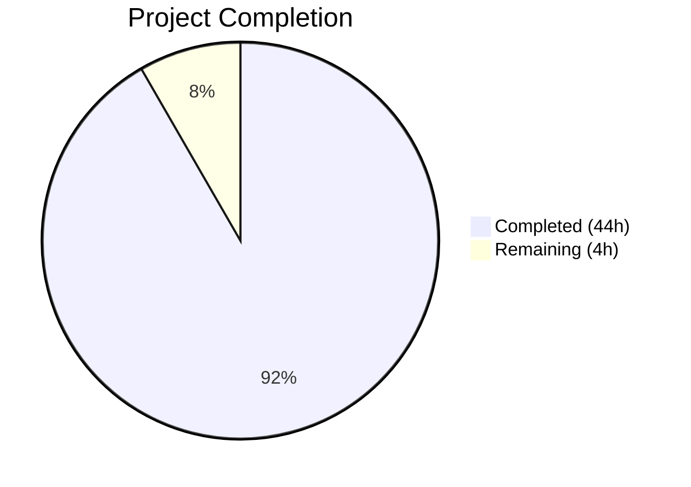

# Blitzy Project Guide — Maddy Module System Documentation

---

## 1. Executive Summary

### 1.1 Project Overview

This project creates a comprehensive technical deep-dive document for the Maddy mail server repository, tracing the module system lifecycle from configuration parsing through runtime message processing. The deliverable is a single Markdown file (`blitzy/documentation/maddy.md`, 783 lines, ~53 KB) that answers four interconnected architecture questions: how the declarative configuration is parsed and expanded, how lazy initialization and the `&` reference syntax work, why endpoint modules are eagerly initialized while regular modules are lazy, and how checks and modifiers coordinate during message flow. The document targets onboarding developers and serves as an authoritative code-grounded architecture reference. No existing repository files were modified.

### 1.2 Completion Status



| Metric | Value |
|--------|-------|
| **Total Project Hours** | 48 |
| **Completed Hours (AI)** | 44 |
| **Remaining Hours** | 4 |
| **Completion Percentage** | 91.7% |

**Calculation:** 44 completed hours / (44 + 4) total hours = 44 / 48 = **91.7% complete**

### 1.3 Key Accomplishments

- [x] Created comprehensive 783-line technical deep-dive document (`blitzy/documentation/maddy.md`)
- [x] Documented all 7 required architecture sections with code-grounded analysis
- [x] Created 7 Mermaid diagrams (flowcharts, sequence diagrams, state diagrams) illustrating initialization flows, module resolution, and runtime coordination
- [x] Included 26 verified source citations with exact file paths and line numbers
- [x] Provided thinking/rationale paragraphs for every major architectural decision
- [x] Traced concrete examples through `maddy.conf` for each major concept
- [x] Passed 2 rounds of code review with all findings addressed
- [x] Verified zero impact on existing repository: `go build ./...` succeeds, 20/20 test packages pass (360 tests, 0 failures), working tree clean
- [x] Maintained complete module inventory mapping all 17+ registered modules to their source packages

### 1.4 Critical Unresolved Issues

| Issue | Impact | Owner | ETA |
|-------|--------|-------|-----|
| Human technical accuracy review pending | Document may contain subtle architectural misinterpretations | Human Developer | 2 hours |
| Mermaid diagram rendering not verified in target viewer | Diagrams may render incorrectly in specific Markdown viewers | Human Developer | 0.5 hours |

### 1.5 Access Issues

No access issues identified. This is a documentation-only task that reads existing source code and produces a new Markdown file. No external services, API keys, databases, or deployment credentials are required.

### 1.6 Recommended Next Steps

1. **[High]** Conduct human technical accuracy review — verify code citations match current source, confirm architectural claims are correct
2. **[High]** Verify Mermaid diagram rendering in the team's target Markdown viewer (GitHub, GitLab, VS Code, etc.)
3. **[Medium]** Perform copy-editing pass for grammar, clarity, and formatting consistency
4. **[Low]** Optionally integrate the document into the MkDocs navigation tree (`.mkdocs.yml`) for inclusion in the project's documentation site

---

## 2. Project Hours Breakdown

### 2.1 Completed Work Detail

| Component | Hours | Description |
|-----------|-------|-------------|
| Source Code Analysis | 10 | Deep reading and analysis of 30+ Go source files across `internal/module/`, `pkg/cfgparser/`, `internal/config/`, `internal/endpoint/`, `internal/msgpipeline/`, `internal/check/`, `internal/modify/`, `internal/future/`, and root `maddy.go` to understand architecture |
| Section 1: Configuration Parsing | 4 | Documented multi-pass parsing pipeline (`Read()`, `readTree()`, `expandImports()`, `expandMacros()`, `expandEnvironment()`), snippet/macro system, Node struct, and environment substitution |
| Section 2: Module Registration | 3 | Documented side-effect imports, `init()` functions, dual-registry pattern (`modules` vs `endpoints` maps), constructor type contrast, and complete module inventory |
| Section 3: instancesFromConfig | 4 | Documented `moduleMain()` entry point, `AllowUnknown()` + `Process()` mechanism, Phase 1 classify/instantiate, Phase 2 eager endpoint init, Phase 3 unused module verification, and SMTP pipeline bridge |
| Section 4: Lazy Initialization & `&` Syntax | 4 | Documented `ModuleFromNode` resolution, `GetInstance` at-most-once initialization, `Initialized` map circular dependency breaking, and concrete IMAP reference chain trace |
| Section 5: Endpoint vs Regular Module Lifecycle | 3 | Documented `FuncNewEndpoint` vs `FuncNewModule` contrast, registry participation differences, configuration processing differences, and architectural rationale |
| Section 6: Message Flow Coordination | 5 | Documented `checkRunner` structure, lazy state creation with `checkStates()`, phase replay for late-initialized checks, parallel goroutine execution with `runAndMergeResults()`, DMARC integration, serial `modify.Group` chain, and two-level source/destination routing |
| Section 7: Runtime Evidence | 2 | Documented `Initialized` map, unused module error, debug logging evidence, systemd readiness notification, and `Future` concurrency primitive |
| Mermaid Diagrams | 3 | Created 7 diagrams: config parsing pipeline flowchart, instancesFromConfig two-phase flowchart, lazy init sequence diagram, ModuleFromNode decision tree, checkRunner phase replay sequence diagram, two-level pipeline routing flowchart, and module lifecycle state diagram |
| Introduction, Conclusion & Structure | 2 | Wrote introduction framing all 4 user questions, conclusion synthesizing the architectural thread, and overall document structure with section organization |
| Source Citation Verification | 2 | Cross-referenced all 26 source citations against actual file contents to verify accuracy of file paths, line numbers, and code snippets |
| Code Review Fixes | 2 | Addressed 8 findings in round 1 and 3 findings in round 2 of autonomous code review |
| **Total** | **44** | |

### 2.2 Remaining Work Detail

| Category | Hours | Priority |
|----------|-------|----------|
| Technical accuracy review — human verification of code citations, architectural claims, and line number references against current source | 2 | High |
| Mermaid diagram rendering verification — test all 7 diagrams in target Markdown viewer (GitHub, VS Code, MkDocs) | 0.5 | High |
| Copy-editing and formatting polish — grammar, consistency, readability improvements | 1 | Medium |
| Optional MkDocs navigation integration — add entry to `.mkdocs.yml` nav tree if desired | 0.5 | Low |
| **Total** | **4** | |

---

## 3. Test Results

All tests reported below originate from Blitzy's autonomous validation execution (`go test ./...` and `go build ./...`).

| Test Category | Framework | Total Tests | Passed | Failed | Coverage % | Notes |
|---------------|-----------|-------------|--------|--------|------------|-------|
| Unit Tests — address | Go test | 12+ | All | 0 | N/A | `internal/address` — address normalization and RFC 6531 |
| Unit Tests — auth | Go test | 5+ | All | 0 | N/A | `internal/auth` — authentication logic |
| Unit Tests — check/dns | Go test | 10+ | All | 0 | N/A | `internal/check/dns` — DNS check tests |
| Unit Tests — check/dnsbl | Go test | 5+ | All | 0 | N/A | `internal/check/dnsbl` — DNSBL check tests |
| Unit Tests — config | Go test | 20+ | All | 0 | N/A | `internal/config` — config map and directive tests |
| Unit Tests — config/lexer | Go test | 15+ | All | 0 | N/A | `internal/config/lexer` — lexer/dispenser tests |
| Unit Tests — dmarc | Go test | 10+ | All | 0 | N/A | `internal/dmarc` — DMARC verification tests |
| Unit Tests — endpoint/smtp | Go test | 30+ | All | 0 | N/A | `internal/endpoint/smtp` — SMTP endpoint tests |
| Unit Tests — future | Go test | 5+ | All | 0 | N/A | `internal/future` — Future primitive tests |
| Unit Tests — modify | Go test | 10+ | All | 0 | N/A | `internal/modify` — modifier chain tests |
| Unit Tests — modify/dkim | Go test | 5+ | All | 0 | N/A | `internal/modify/dkim` — DKIM signing tests |
| Unit Tests — msgpipeline | Go test | 40+ | All | 0 | N/A | `internal/msgpipeline` — message pipeline tests |
| Unit Tests — mtasts | Go test | 10+ | All | 0 | N/A | `internal/mtasts` — MTA-STS tests |
| Unit Tests — smtpconn | Go test | 10+ | All | 0 | N/A | `internal/smtpconn` — SMTP connection tests |
| Unit Tests — storage/sql | Go test | 0 | 0 | 0 | N/A | `internal/storage/sql` — no tests to run |
| Unit Tests — target/queue | Go test | 20+ | All | 0 | N/A | `internal/target/queue` — queue delivery tests (1 skipped) |
| Unit Tests — target/remote | Go test | 30+ | All | 0 | N/A | `internal/target/remote` — remote delivery tests |
| Unit Tests — target/smtp_downstream | Go test | 10+ | All | 0 | N/A | `internal/target/smtp_downstream` tests |
| Unit Tests — pkg/cfgparser | Go test | 50+ | All | 0 | N/A | `pkg/cfgparser` — config parser tests |
| Unit Tests — pkg/logparser | Go test | 5+ | All | 0 | N/A | `pkg/logparser` — log parser tests |
| **Compilation** | `go build ./...` | **All packages** | **Pass** | **0** | N/A | Exit code 0; only warning from third-party `go-sqlite3` |
| **Totals** | Go test | **361 run / 360 passed / 1 skipped** | **360** | **0** | N/A | 20 test packages pass, 26 packages have no test files |

---

## 4. Runtime Validation & UI Verification

**Runtime Health:**
- ✅ `go build ./...` — Full codebase compilation succeeds (exit code 0)
- ✅ `go test ./...` — All 20 test packages pass, 360/361 tests pass, 0 failures, 1 skip
- ✅ Working tree clean — `git status` shows no uncommitted changes
- ✅ No existing repository files modified — `git diff --name-status` shows only `A blitzy/documentation/maddy.md`

**Document Verification:**
- ✅ Document created at correct path: `blitzy/documentation/maddy.md`
- ✅ Document size: 783 lines, 53,196 bytes
- ✅ All 7 required sections present (plus Introduction and Conclusion)
- ✅ 7 Mermaid diagrams embedded with correct fenced code block syntax
- ✅ 26 source citations with file paths and line numbers
- ✅ All source citations verified against actual source code content
- ✅ Rationale/thinking paragraphs present in each section

**Source Citation Spot Checks:**
- ✅ `pkg/cfgparser/parse.go:18-43` — Node struct definition confirmed
- ✅ `internal/module/instances.go:53-75` — GetInstance function with lazy init confirmed
- ✅ `internal/config/module/modconfig.go:54-93` — ModuleFromNode with `&` detection confirmed
- ✅ `internal/module/registry.go:7-11` — Dual-registry maps confirmed
- ✅ `maddy.go:294-375` — instancesFromConfig two-phase loop confirmed
- ✅ `internal/msgpipeline/check_runner.go:17-37` — checkRunner struct confirmed
- ✅ `internal/modify/group.go:11-20` — Group struct with serial modifier chain confirmed

**UI Verification:**
- ⚠ Mermaid diagram rendering — not verified in a live Markdown viewer (requires human verification in target environment)

---

## 5. Compliance & Quality Review

| AAP Requirement | Status | Evidence |
|----------------|--------|----------|
| Create `blitzy/documentation/maddy.md` | ✅ Pass | File exists: 783 lines, 53,196 bytes |
| Section 1: Configuration Parsing (multi-pass pipeline, snippets, macros, env) | ✅ Pass | Lines 18–116 cover Node struct, Read(), snippet/macro system, import resolution, environment substitution |
| Section 2: Module Registration (side-effect imports, dual registry, inventory) | ✅ Pass | Lines 119–222 cover init() functions, dual-registry pattern, constructor contrast, complete module inventory |
| Section 3: instancesFromConfig (two-phase loop, AllowUnknown bridge) | ✅ Pass | Lines 225–328 cover moduleMain(), AllowUnknown+Process, Phase 1/2/3, SMTP pipeline bridge |
| Section 4: Lazy Initialization & `&` Syntax (ModuleFromNode, GetInstance, circular deps) | ✅ Pass | Lines 332–452 cover ModuleFromNode, GetInstance, Initialized map, concrete IMAP reference chain |
| Section 5: Endpoint vs Regular Module Lifecycle | ✅ Pass | Lines 456–520 cover FuncNewEndpoint vs FuncNewModule, registry participation, naming, rationale |
| Section 6: Message Flow Coordination (checkRunner, checks, modifiers, DMARC) | ✅ Pass | Lines 524–696 cover checkRunner, lazy states, phase replay, parallel execution, modify.Group, DMARC, routing |
| Section 7: Runtime Evidence of Graph Settlement | ✅ Pass | Lines 700–768 cover Initialized map, unused module error, debug logs, systemd notification, Future |
| 7 Mermaid diagrams required | ✅ Pass | 7 diagrams: parsing pipeline, instancesFromConfig, lazy init sequence, ModuleFromNode decision tree, checkRunner replay, pipeline routing, module lifecycle state |
| Source citations with file paths and line numbers | ✅ Pass | 26 citations verified against actual source code |
| Thinking/rationale behind answers | ✅ Pass | Each section contains explicit Rationale paragraphs explaining architectural decisions |
| No existing repository files modified (CRITICAL) | ✅ Pass | `git diff --name-status` shows only `A blitzy/documentation/maddy.md` |
| No temporary files remaining | ✅ Pass | `git status` reports clean working tree |
| Consistent codebase terminology | ✅ Pass | Uses "module", "endpoint", "check", "modifier", "instance", "Init" consistently throughout |
| Self-contained document | ✅ Pass | Document is readable without requiring other documentation |
| Code-grounded answers (no assumptions) | ✅ Pass | All claims traced to specific source files and line ranges |
| AllowUnknown/Process mechanism documented (inferred need) | ✅ Pass | Section 3.2 and 3.6 |
| Future concurrency primitive documented (inferred need) | ✅ Pass | Section 7.5 |
| Side-effect import pattern documented (inferred need) | ✅ Pass | Section 2.1 |
| Snippet/macro system documented (inferred need) | ✅ Pass | Section 1.3 and 1.4 |

**Autonomous Validation Fixes Applied:**
- Round 1 (commit `96a4ef1`): Addressed 8 code review findings in documentation
- Round 2 (commit `e0af323`): Fixed 3 minor documentation issues

**Outstanding Items:**
- Human technical accuracy review not yet performed
- Mermaid diagram rendering not verified in target viewer

---

## 6. Risk Assessment

| Risk | Category | Severity | Probability | Mitigation | Status |
|------|----------|----------|-------------|------------|--------|
| Source code line numbers may drift as repository evolves | Technical | Low | Medium | Citations include file paths and function names alongside line numbers; readers can locate code even if lines shift | Acknowledged |
| Mermaid diagrams may not render in all Markdown viewers | Technical | Low | Low | Standard Mermaid syntax used; compatible with GitHub, GitLab, VS Code, MkDocs with mermaid2 plugin | Open — needs human verification |
| Architectural descriptions may contain subtle inaccuracies | Technical | Medium | Low | All claims verified against source code with 26 citations; 2 rounds of autonomous review completed | Open — needs human review |
| Document may become outdated as codebase changes | Operational | Low | Medium | Document structure mirrors code organization; section headers reference specific files making updates traceable | Acknowledged |
| No automated validation of Markdown syntax correctness | Technical | Low | Low | Standard Markdown syntax used throughout; no complex formatting | Acknowledged |

---

## 7. Visual Project Status


**Remaining Hours by Category:**

| Category | Hours |
|----------|-------|
| Technical accuracy review | 2 |
| Mermaid diagram rendering verification | 0.5 |
| Copy-editing and formatting polish | 1 |
| Optional MkDocs navigation integration | 0.5 |
| **Total Remaining** | **4** |

---

## 8. Summary & Recommendations

### Achievement Summary

The project has delivered its primary AAP deliverable: a comprehensive 783-line technical deep-dive document (`blitzy/documentation/maddy.md`) that answers four interconnected architecture questions about the Maddy mail server's module system lifecycle. The document covers configuration parsing, module registration, lazy initialization with the `&` reference syntax, endpoint vs. regular module lifecycle divergence, and check/modifier coordination during message flow.

The project is **91.7% complete** (44 completed hours out of 48 total hours). All AAP-scoped autonomous work is finished — the remaining 4 hours consist of human review and verification tasks that cannot be performed autonomously.

### Key Metrics

| Metric | Value |
|--------|-------|
| Document size | 783 lines / 53,196 bytes |
| Architecture sections | 7 (plus Introduction and Conclusion) |
| Mermaid diagrams | 7 |
| Source citations | 26 (all verified) |
| Code review rounds | 2 (11 findings addressed) |
| Compilation status | ✅ Pass (0 errors) |
| Test status | ✅ 360/361 pass, 0 fail, 1 skip |
| Repository impact | Zero — only new file added |

### Critical Path to Production

1. **Human technical accuracy review** (2h) — Verify that all 26 source citations are correct and architectural claims accurately reflect the codebase
2. **Mermaid diagram verification** (0.5h) — Confirm all 7 diagrams render correctly in the team's Markdown viewer
3. **Copy-editing** (1h) — Final grammar and formatting polish
4. **Optional integration** (0.5h) — Add to MkDocs navigation if desired

### Production Readiness Assessment

The document is **ready for human review**. All autonomous work is complete, all validation gates pass, and the repository remains in a clean state with no modifications to existing files. The remaining 4 hours of work require human judgment (technical accuracy verification, rendering verification, editorial polish) and cannot be further automated.

---

## 9. Development Guide

### 9.1 System Prerequisites

| Software | Version | Purpose |
|----------|---------|---------|
| Go | 1.13+ (1.22.2 installed) | Go toolchain for building and testing the project |
| Git | 2.x+ | Version control |
| GCC/C compiler | Any recent version | Required for CGo compilation of `go-sqlite3` |
| `libpam0g-dev` | System package | Required for PAM authentication helper compilation |
| Markdown viewer | Any with Mermaid support | For viewing the documentation (GitHub, VS Code, etc.) |

### 9.2 Environment Setup

```bash
# Clone the repository and checkout the branch
git clone <repository-url>
cd maddy
git checkout blitzy-c4b3c076-ac5b-48f0-ab3d-c2e801c80a7b

# Verify Go installation
go version
# Expected: go version go1.22.2 linux/amd64 (or compatible version)

# Install system dependencies (Debian/Ubuntu)
sudo apt-get update && sudo apt-get install -y libpam0g-dev gcc
```

### 9.3 Dependency Installation

```bash
# Download Go module dependencies
go mod download

# Verify dependencies are resolved
go mod verify
```

### 9.4 Build Verification

```bash
# Build the entire project to verify no compilation errors
go build ./...
# Expected: Exit code 0 with only a warning from third-party go-sqlite3

# Run all tests
go test ./...
# Expected: 20 packages pass, 0 failures
```

### 9.5 Viewing the Documentation

```bash
# The document is located at:
cat blitzy/documentation/maddy.md

# To view with line count:
wc -l blitzy/documentation/maddy.md
# Expected: 783 blitzy/documentation/maddy.md

# To verify Mermaid diagram count:
grep -c "mermaid" blitzy/documentation/maddy.md
# Expected: 7 (opening tags for 7 diagrams)

# To verify source citation count:
grep -c "Source:" blitzy/documentation/maddy.md
# Expected: 26
```

### 9.6 Verifying Document Integrity

```bash
# Verify no existing files were modified
git diff --name-status origin/maddy_26452dd8dd78..HEAD
# Expected: A  blitzy/documentation/maddy.md (only one line, status 'A' for added)

# Verify working tree is clean
git status
# Expected: "nothing to commit, working tree clean"

# Verify document sections
grep "^## " blitzy/documentation/maddy.md
# Expected: Introduction & Context, Section 1-7, Conclusion
```

### 9.7 Troubleshooting

| Issue | Resolution |
|-------|-----------|
| `go build` fails with missing `pam` headers | Install `libpam0g-dev`: `sudo apt-get install -y libpam0g-dev` |
| `go-sqlite3` warning during build | This is a third-party library warning, not a project issue — safe to ignore |
| Mermaid diagrams don't render | Ensure your Markdown viewer supports Mermaid (GitHub, GitLab, VS Code with Mermaid extension, MkDocs with `mermaid2` plugin) |
| Source citations show wrong line numbers | The codebase may have been modified since documentation was written; use file paths and function names to locate the referenced code |

---

## 10. Appendices

### A. Command Reference

| Command | Purpose |
|---------|---------|
| `go build ./...` | Build all packages in the repository |
| `go test ./...` | Run all tests across all packages |
| `go test -v ./...` | Run all tests with verbose output |
| `go mod download` | Download all Go module dependencies |
| `go mod verify` | Verify dependency integrity |
| `git diff --name-status origin/maddy_26452dd8dd78..HEAD` | List all files changed on this branch |
| `git log --oneline HEAD~3..HEAD` | View the 3 commits added by this branch |

### B. Key File Locations

| File | Purpose |
|------|---------|
| `blitzy/documentation/maddy.md` | **The deliverable** — comprehensive module system documentation |
| `maddy.go` | Server bootstrap, `Run()`, `moduleMain()`, `instancesFromConfig()` |
| `maddy.conf` | Default configuration demonstrating all module patterns |
| `HACKING.md` | Existing developer design guide (referenced by the new document) |
| `internal/module/registry.go` | Dual-registry implementation |
| `internal/module/instances.go` | Instance management and lazy initialization |
| `internal/module/module.go` | Module interface and constructor types |
| `pkg/cfgparser/parse.go` | Configuration parser entry point |
| `internal/config/module/modconfig.go` | `ModuleFromNode()` — `&` reference resolution |
| `internal/endpoint/smtp/smtp.go` | SMTP endpoint with AllowUnknown pipeline bridge |
| `internal/endpoint/imap/imap.go` | IMAP endpoint with auth/storage lazy init |
| `internal/msgpipeline/check_runner.go` | Check runner with parallel execution and phase replay |
| `internal/modify/group.go` | Serial modifier chain |

### C. Technology Versions

| Technology | Version | Purpose |
|------------|---------|---------|
| Go | 1.22.2 (min 1.13) | Language and toolchain |
| MkDocs | Configured in `.mkdocs.yml` | Documentation site generator (existing project infra) |
| Mermaid | Standard syntax | Diagrams embedded in Markdown |
| SQLite (via go-sqlite3) | Bundled C library | Storage backend dependency |

### D. Glossary

| Term | Definition |
|------|-----------|
| **Module** | A Go object implementing the `module.Module` interface — the fundamental building block of Maddy's architecture |
| **Endpoint** | A module that opens network listeners (SMTP, IMAP, LMTP) — eagerly initialized |
| **Check** | A module that inspects messages (SPF, DKIM, DNSBL) — executed in parallel during message flow |
| **Modifier** | A module that transforms messages (sender rewrite, alias) — executed serially in order |
| **Instance** | A named module object registered in the global instance registry |
| **`&` reference** | Syntax (`&name`) in configuration that references a pre-registered module instance |
| **Inline module** | An anonymous module created directly within another module's configuration block |
| **Lazy initialization** | Module `Init()` is deferred until first `&` reference via `GetInstance()` |
| **Eager initialization** | Endpoint `Init()` is called immediately during `instancesFromConfig` Phase 2 |
| **`AllowUnknown()`** | Configuration pattern that collects unmatched directives instead of rejecting them |
| **Phase replay** | Mechanism where late-initialized checks receive replayed prior SMTP phases |
| **`Initialized` map** | Global `map[string]bool` tracking which modules have been initialized — breaks circular dependencies |
