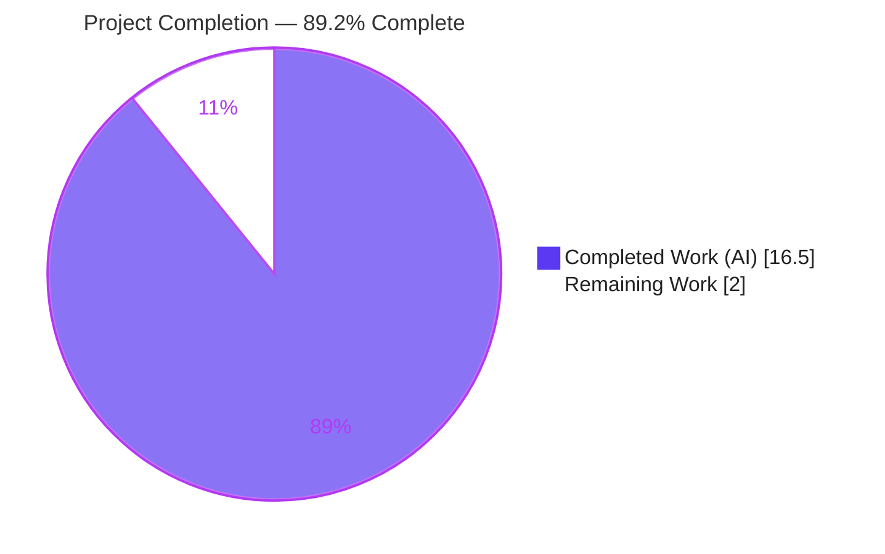
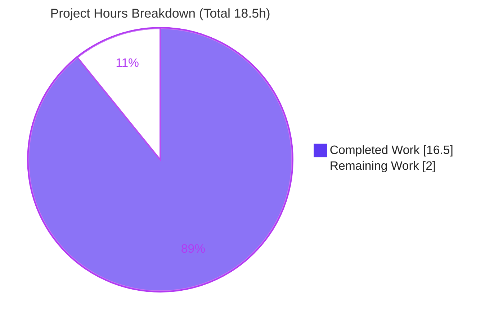
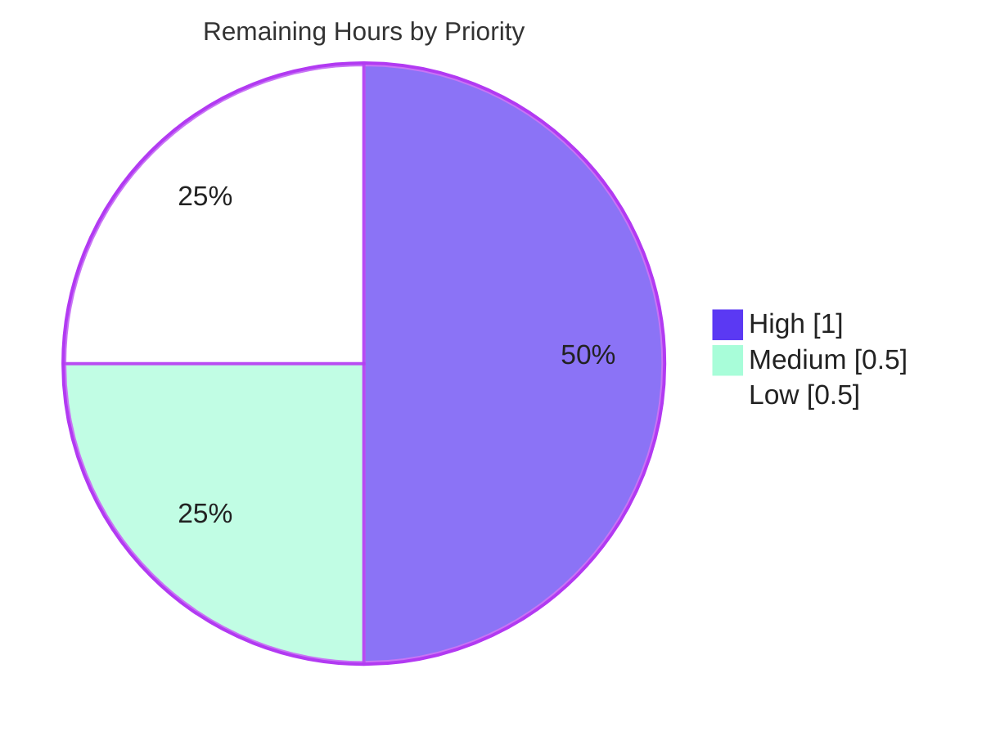

# Blitzy Project Guide — maddy Runtime-Behavior Q&A

## 1. Executive Summary

### 1.1 Project Overview

`maddy` is a composable, single-process mail server written in Go. This project is a strictly read-only, evidence-grounded developer-onboarding investigation. It produces **one** Markdown document — `blitzy/documentation/maddy_26452dd8dd78.md` — that explains four runtime behaviors of maddy: SMTP-endpoint logging, the queue delivery lifecycle, remote MX-authentication with TLS-to-plaintext fallback, and the queue retry-delay field. Every answer is quoted **verbatim** from the project's own executed tests and cited by `file:line`. The target users are engineers onboarding to the maddy codebase. Business impact: faster onboarding and durable capture of precise runtime knowledge. Technical scope: exactly one additive file; zero source-code changes.

### 1.2 Completion Status



| Metric | Hours |
|--------|-------|
| **Total Hours** | 18.5 |
| **Completed Hours** (AI 16.5 + Manual 0.0) | 16.5 |
| **Remaining Hours** | 2.0 |
| **Percent Complete** | **89.2%** |

> Completion is computed with the PA1 AAP-scoped, hours-based method: `16.5 / (16.5 + 2.0) = 16.5 / 18.5 = 89.2%`. All 16 AAP-specified deliverables are complete; the 2.0 remaining hours are path-to-production human review and one optional discoverability task.

### 1.3 Key Accomplishments

- ✅ Sole AAP deliverable authored and committed: `blitzy/documentation/maddy_26452dd8dd78.md` (484 lines, ~3,338 words, 18 fenced code blocks).
- ✅ All four question groups / **10 sub-parts** (Q1a–e, Q2, Q3a–c, Q4) answered with verbatim, TAB-preserved test output.
- ✅ **67** `file:line` citations spanning **15** source files ground every factual claim.
- ✅ All target tests executed and **passing** under the blessed `go1.18.10` toolchain; full repository suite **20/20** packages pass.
- ✅ Toolchain-correctness fix applied during validation: the Go-version-dependent Q3c TLS `reason` was re-grounded from `go1.26.4` to the blessed `go1.18.10`, with a dual-toolchain determinism note added.
- ✅ Read-only mandate preserved: working tree clean, `go.mod`/`go.sum` unchanged, zero source files modified, no temporary artifacts left in the repo.

### 1.4 Critical Unresolved Issues

| Issue | Impact | Owner | ETA |
|-------|--------|-------|-----|
| None — no unresolved issues block release or validation | None | — | — |

All five validation gates passed (100% test pass, runtime validated, zero unresolved errors, all in-scope files validated, changes committed).

### 1.5 Access Issues

| System/Resource | Type of Access | Issue Description | Resolution Status | Owner |
|-----------------|----------------|-------------------|-------------------|-------|
| Git repository | Read/Write | None — branch checked out, commits present, tree clean | Resolved | — |
| Go module cache | Read | None — `go mod verify` reports "all modules verified"; `go mod download` exit 0 | Resolved | — |
| Go toolchain | Execute | None — `go1.18.10` present on `PATH` at `/usr/local/go` | Resolved | — |

**No access issues identified.** All resources required to build, test, and reproduce the investigation are locally available.

### 1.6 Recommended Next Steps

1. **[High]** Re-run the four documented `go test` commands under `go1.18.10` and confirm the deterministic values match the document (SHA-1 `msg_id`s, `smtp_code 550`, enhanced `5.4.0`, the `estabilish` typo, and the `go1.18.10` TLS `reason`). *(≈1.0h)*
2. **[Medium]** Read the document for technical accuracy against the four question groups, confirm the determinism (§8) and Go-version-dependence (§5) notes, then sign off / merge. *(≈0.5h)*
3. **[Low]** *Optional:* link the document into the team onboarding index to improve discoverability (note: mkdocs-site integration is out of AAP scope). *(≈0.5h)*

## 2. Project Hours Breakdown

### 2.1 Completed Work Detail

| Component | Hours | Description |
|-----------|-------|-------------|
| Toolchain setup & build verification | 1.5 | Verify `go1.18.10` on `PATH`, configure off-tree caches (`GOCACHE`/`GOMODCACHE`) and `GOFLAGS=-mod=readonly`; confirm `go build ./...` exits 0. |
| Q1 — SMTP endpoint investigation & write-up | 2.5 | Run `TestSMTPDelivery`, `_AbortData`, `_AbortLogout` with `-v -test.debuglog`; trace `internal/endpoint/smtp/smtp.go`; author §3 answering Q1a–e. |
| Q2/Q4 — queue lifecycle investigation & write-up | 2.5 | Run `TestQueueDelivery_TemporaryFail` / `_MultipleAttempts`; trace `internal/target/queue/queue.go`; author §4 (lifecycle) and §6 (`next_try_delay`). |
| Q3 — remote delivery investigation & write-up | 3.0 | Run `TestRemoteDelivery_AuthMX_Fail` / `_TLSErrFallback`; trace `connect.go`, `exterrors/smtp.go`, `smtpconn.go`; author §5 (Q3a–c) incl. the `5.4.0`-vs-`5.7.0` rationale. |
| Log-format primer & methodology | 1.5 | Author §1 (toolchain, exact invocations, flag-order rule) and §2 (name prefix, alphabetical JSON ordering, automatic `reason`, injected `msg_id`). |
| Coverage pass & determinism note | 1.0 | Author §7 coverage table (all 10 sub-parts) and §8 deterministic / non-deterministic / toolchain-dependent classification. |
| Citation verification | 1.5 | Verify all 67 `file:line` references (15 unique files) against the source tree at commit `26452dd`. |
| Toolchain re-grounding fix | 2.0 | Correct evidence from `go1.26.4` to blessed `go1.18.10`; empirically verify the Q3c TLS `reason` under both toolchains; update methodology and determinism note. |
| Assembly, commits, cleanup & read-only verification | 1.0 | Create `blitzy/documentation/`, write the file, land 3 commits, remove temp artifacts, confirm `git status` clean. |
| **Total Completed** | **16.5** | |

### 2.2 Remaining Work Detail

| Category | Hours | Priority |
|----------|-------|----------|
| Verify documented values by re-running the four target-test commands under `go1.18.10` | 1.0 | High |
| Technical read-through & sign-off / merge of the deliverable | 0.5 | Medium |
| Optional discoverability / onboarding-index integration | 0.5 | Low |
| **Total Remaining** | **2.0** | |

### 2.3 Hours Reconciliation

| Check | Value | Result |
|-------|-------|--------|
| Section 2.1 completed total | 16.5h | ✅ |
| Section 2.2 remaining total | 2.0h | ✅ |
| Section 2.1 + Section 2.2 | 18.5h | ✅ equals Total Hours (§1.2) |
| Remaining hours (§1.2 = §2.2 = §7 pie) | 2.0h | ✅ identical across sections |
| Completion `16.5 / 18.5` | 89.2% | ✅ used in §1.2, §7, §8 |

## 3. Test Results

All tests below originate from **Blitzy's autonomous validation logs** for this project and were **independently re-executed** during this assessment under the blessed `go1.18.10` toolchain. The framework is the Go standard `testing` package, invoked with `-v -count=1 -test.debuglog`. Coverage percentages reflect the project's **existing** test suite exercising each target package (this read-only task added no tests).

| Test Category | Framework | Total Tests | Passed | Failed | Coverage % | Notes |
|---------------|-----------|-------------|--------|--------|------------|-------|
| Q1 — SMTP endpoint (`internal/endpoint/smtp`) | Go `testing` | 9 | 9 | 0 | 79.4% | `-run 'TestSMTPDelivery'` incl. `TestSMTPDelivery`, `_AbortData`, `_AbortLogout`; success/abort log lines reproduced verbatim. |
| Q2/Q4 — queue delivery (`internal/target/queue`) | Go `testing` | 2 | 2 | 0 | 74.7% | `TestQueueDelivery_TemporaryFail`, `TestQueueDelivery_MultipleAttempts`; full lifecycle + `next_try_delay` reproduced. |
| Q3 — remote delivery (`internal/target/remote`) | Go `testing` | 2 | 2 | 0 | 76.3% | `TestRemoteDelivery_AuthMX_Fail`, `TestRemoteDelivery_TLSErrFallback`; MX-auth error, `5.4.0`, TLS-fallback line reproduced. |
| Full repository suite | Go `testing` | 20 pkgs | 20 pkgs | 0 | — | `go test ./... -count=1` exit 0: 20 packages ok, 0 FAIL, 26 packages with no test files (46 total). |

**Summary:** 13 AAP-targeted test functions executed → **13 passed, 0 failed (100%)**. Full-suite regression: **20/20 packages pass, 0 failures**. Every deterministic value quoted in the deliverable (SHA-1 `msg_id` `af8090c7…`, `smtp_code 550`, enhanced `5.4.0`, `estabilish` typo, the `go1.18.10` TLS `reason`) was reproduced during re-execution.

## 4. Runtime Validation & UI Verification

**Build & runtime health:**

- ✅ **Operational** — `go build ./...` completes with exit 0 (only a pre-documented benign C warning from the out-of-scope `mattn/go-sqlite3` dependency).
- ✅ **Operational** — `maddy` binary builds (`go build ./cmd/maddy`) and runs (prints usage), confirming end-to-end runnability (validated by the Final Validator; temp binary built in `/tmp` and removed).
- ✅ **Operational** — `go vet` on all three target packages is clean.
- ✅ **Operational** — all three target test packages compile and pass with `-v -test.debuglog`.
- ✅ **Operational** — full repository suite: 20/20 packages pass.

**Deliverable (artifact) verification:**

- ✅ **Operational** — the document is valid UTF-8 with balanced fenced code blocks (18 fences); TAB separators between message and `{json}` preserved (verified with `cat -A` → `^I`).
- ✅ **Operational** — all fenced log blocks byte-for-byte match captured `go1.18.10` output.

**UI Verification:** Not applicable. This project has **no user interface** — the delivered artifact is a Markdown document, and maddy itself is a headless mail server. Markdown rendering correctness is covered under "Deliverable verification" above.

**API integration:** Not applicable. No external API integrations are introduced or modified by this read-only documentation task.

## 5. Compliance & Quality Review

The following matrix cross-maps the AAP deliverables and the `SWE-AtlasQnA-Repo` rule set to Blitzy's quality and compliance benchmarks.

| Benchmark / AAP Requirement | Status | Progress | Notes |
|-----------------------------|--------|----------|-------|
| Deliverable at mandated path/name (`blitzy/documentation/maddy_26452dd8dd78.md`) | ✅ Pass | 100% | File named for the source branch; directory created. |
| All four question groups / 10 sub-parts answered | ✅ Pass | 100% | Q1a–e, Q2, Q3a–c, Q4 — confirmed by §7 coverage table. |
| "Investigate by running the code first" | ✅ Pass | 100% | Every value grounded in executed test output, not reading alone. |
| Verbatim quoting of observed output | ✅ Pass | 100% | TAB-preserved log lines; byte-for-byte match to captured output. |
| Exact literals cited with `file:line` | ✅ Pass | 100% | 67 citations across 15 files; all verified against source. |
| Rationale provided per answer | ✅ Pass | 100% | e.g., why surfaced enhanced code is `5.4.0`, not internal `5.7.0`. |
| Read-only scope (zero source modifications) | ✅ Pass | 100% | `git diff 26452dd..HEAD` = 1 file added, +484/−0. |
| Cleanup (no temp artifacts in repo) | ✅ Pass | 100% | Captures kept under `/tmp`; `git status --porcelain` empty. |
| No dependency changes | ✅ Pass | 100% | `go.mod`/`go.sum` unchanged; `-mod=readonly`. |
| Observed quirks reported, not fixed | ✅ Pass | 100% | `estabilish` typo and `SMTPEnchCode` `code[0]=5` reported as-is. |
| Toolchain correctness (values grounded in blessed toolchain) | ✅ Pass | 100% | **Fix applied during validation:** re-grounded `go1.26.4` → `go1.18.10`; dual-toolchain note added for the Q3c TLS text. |
| Build & tests green | ✅ Pass | 100% | `go build ./...` exit 0; 20/20 test packages pass. |

**Fixes applied during autonomous validation:** the single material correction was re-grounding the Go-version-dependent Q3c TLS `reason` value to the blessed `go1.18.10` toolchain (the prior draft had used an off-`PATH` `go1.26.4`), and documenting both toolchain strings plus the Go 1.20 stdlib change that explains the difference. **Outstanding compliance items:** none.

## 6. Risk Assessment

Overall posture: **LOW**. This is the lowest-risk class of change — a single additive Markdown file with zero code, dependency, or configuration impact. No High or Critical risks exist.

| Risk | Category | Severity | Probability | Mitigation | Status |
|------|----------|----------|-------------|------------|--------|
| Non-deterministic values (8-hex `msg_id`, `next_try_delay` magnitude, `src_ip` port) may confuse readers expecting exact reproduction | Technical | Low | Medium | §8 determinism note explicitly labels these run-varying; stable answers (formats, field names) called out | Mitigated (in-doc) |
| Q3c TLS `reason` text differs on Go ≥ 1.20 (stdlib change) | Technical | Low | Medium | §5 and §8 document both toolchain strings and the Go 1.20 origin | Mitigated (in-doc) |
| `file:line` citations pinned to commit `26452dd` may drift if source changes later | Technical | Low | Medium (over time) | Document states the pinned commit; re-verify on refresh | Open / Accepted |
| Security exposure | Security | N/A | N/A | Read-only doc; no code, secrets, deps, or attack surface introduced | Not applicable |
| No CI re-validation of doc accuracy; future code changes won't auto-flag citation drift | Operational | Low | Low | Acceptable for a point-in-time onboarding artifact; re-verify during periodic refresh | Open / Accepted |
| Reproducibility depends on the blessed `go1.18.10` toolchain | Integration | Low | Medium | Dual-toolchain documentation; blessed toolchain named in §1 | Mitigated (in-doc) |
| Doc lives outside the mkdocs tree → not auto-discoverable on the project docs site | Integration | Low | Medium | Optional discoverability task (§2.2 Low priority) | Open (optional) |

## 7. Visual Project Status

**Project hours breakdown** (Completed = Dark Blue `#5B39F3`, Remaining = White `#FFFFFF`):



**Remaining work by priority** (2.0h total):



**Remaining hours per category (§2.2):**

| Category | Hours | Bar |
|----------|-------|-----|
| Verify documented values (re-run target tests) | 1.0 | ██████████ |
| Technical read-through & sign-off | 0.5 | █████ |
| Optional discoverability integration | 0.5 | █████ |

> **Integrity:** the pie "Remaining Work" value (2.0h) equals the §1.2 Remaining Hours and the sum of the §2.2 Hours column.

## 8. Summary & Recommendations

**Achievements.** The project is **89.2% complete** on an AAP-scoped, hours-based basis (`16.5h` completed / `18.5h` total). All **16** AAP-specified deliverables are complete: the single onboarding document answers all four question groups (10 sub-parts) with verbatim, TAB-preserved test output, 67 `file:line` citations across 15 source files, and per-answer rationale. Every quoted value was independently reproduced under the blessed `go1.18.10` toolchain; the full repository suite passes 20/20 packages; and the read-only mandate is fully preserved (clean tree, unchanged `go.mod`/`go.sum`, one additive file).

**Remaining gaps (2.0h, all path-to-production).** No AAP-scoped engineering work remains. The outstanding 2.0 hours are human activities: (1) verifying the documented values by re-running the four commands, (2) a technical read-through and sign-off / merge, and (3) an optional discoverability improvement.

**Critical path to production.** Human review & acceptance → sign-off / merge. There are no blockers, no failing tests, and no unresolved errors.

**Production readiness assessment.** **Ready for human review.** For a documentation deliverable, "production" means an accepted, merged onboarding document. The artifact is complete, validated, reproducible, and committed; only human sign-off remains. Completion is capped below 100% to reserve final human acceptance, per honest-assessment policy.

| Success Metric | Target | Actual | Status |
|----------------|--------|--------|--------|
| Question groups answered | 4 / 4 | 4 / 4 | ✅ |
| Sub-parts answered | 10 / 10 | 10 / 10 | ✅ |
| Target tests passing | 100% | 13/13 (100%) | ✅ |
| Full-suite packages passing | 100% | 20/20 (100%) | ✅ |
| Source files modified | 0 | 0 | ✅ |
| Citations verified | all | 67/67 | ✅ |

**Recommended actions (prioritized):**

1. **[High · ≈1.0h]** Re-run the four documented commands under `go1.18.10`; confirm deterministic values (SHA-1 `msg_id`s, `smtp_code 550`, enhanced `5.4.0`, `estabilish` typo, `go1.18.10` TLS `reason`). Remember: `-test.debuglog` must follow the package path.
2. **[Medium · ≈0.5h]** Read the document for accuracy against Q1–Q4; confirm the determinism (§8) and Go-version-dependence (§5) notes; sign off / merge.
3. **[Low · ≈0.5h]** *Optional:* link the document into the team onboarding index for discoverability (mkdocs-site integration remains out of AAP scope).

## 9. Development Guide

This guide reproduces the investigation and verifies the deliverable. All commands were executed and confirmed under the blessed toolchain. Run them from the repository root.

### 9.1 System Prerequisites

- **Go** `1.18.10` (blessed toolchain; on `PATH` at `/usr/local/go`). `go.mod` declares a minimum of `go 1.13`.
- **Git** `2.51.x`.
- **OS / hardware:** Linux x86-64; ~2 GB free disk for the module cache and build cache. No network required if the module cache is already populated.

```bash
go version    # expect: go version go1.18.10 linux/amd64
git --version # expect: git version 2.51.x
```

> ⚠️ **Toolchain note.** One value — the Q3c TLS-verification `reason` — is Go-version-dependent. Under `go1.18.10` it is `smtpconn: x509: certificate signed by unknown authority`. Under **Go ≥ 1.20** the stdlib adds a `tls: failed to verify certificate:` prefix. Use `go1.18.10` to reproduce the documented values exactly.

### 9.2 Environment Setup

Keep all Go caches **outside** the repository and pin the module graph read-only so the working tree stays byte-for-byte unchanged:

```bash
export GOCACHE=/tmp/go-cache-118       # build cache outside the repo
export GOMODCACHE=/root/go/pkg/mod     # module cache outside the repo
export GOFLAGS=-mod=readonly           # never mutate go.mod / go.sum
```

### 9.3 Dependency Installation

```bash
go mod verify     # expect: all modules verified
go mod download   # expect: exit code 0 (no output on success)
```

### 9.4 Build

```bash
go build ./...    # expect: exit 0
```

> A benign C compiler warning from the out-of-scope `mattn/go-sqlite3` dependency (`function may return address of local variable`) is expected and does not affect the build result.

### 9.5 Reproduce the Investigation (run the tests)

maddy's test logger routes messages to Go's `t.Log` (printed only with `-v`); debug-level lines require maddy's custom `-test.debuglog` flag. **The `-test.debuglog` flag MUST appear _after_ the package path.**

```bash
# Q1 — SMTP endpoint (success + both abort variants)
go test -v -count=1 -run 'TestSMTPDelivery' ./internal/endpoint/smtp/ -test.debuglog

# Q2 / Q4 — queue delivery lifecycle and retry scheduling
go test -v -count=1 -run '^TestQueueDelivery_TemporaryFail$' ./internal/target/queue/ -test.debuglog
go test -v -count=1 -run 'TestQueueDelivery_MultipleAttempts' ./internal/target/queue/ -test.debuglog

# Q3 — remote MX-authentication failure + TLS-to-plaintext fallback
go test -v -count=1 -run 'TestRemoteDelivery_AuthMX_Fail|TestRemoteDelivery_TLSErrFallback' ./internal/target/remote/ -test.debuglog
```

Each command ends with an `ok  github.com/foxcpp/maddy/internal/...` line. The test runner prepends `output.go:41:` to each logged line; that prefix is a runner artifact, not part of maddy's log format.

### 9.6 Verification Steps

```bash
# Confirm the deterministic (SHA-1-of-test-name) msg_id values:
printf '%s' 'TestQueueDelivery_TemporaryFail' | sha1sum
#   -> af8090c7eb39f761862b1f027b4f2b0bb1ce86d1
printf '%s' 'TestRemoteDelivery_TLSErrFallback' | sha1sum
#   -> 2176ec5872ed2b87d832b4070e88232bd94ac7d3

# Reveal the literal TAB between message and {json} (renders as ^I):
go test -v -count=1 -run '^TestQueueDelivery_TemporaryFail$' ./internal/target/queue/ -test.debuglog | cat -A | grep 'will retry'

# Confirm the read-only mandate held (expect empty output):
git status --porcelain

# Optional full-suite regression (CI parity uses: go test ./... -cover -race):
go test ./... -count=1     # -> 20 packages ok, 0 FAIL
```

### 9.7 Example Usage — reading the deliverable

```bash
# View the answer document:
less blitzy/documentation/maddy_26452dd8dd78.md

# Jump to a specific answer, e.g. Q4 (retry-delay field):
grep -n 'next_try_delay' blitzy/documentation/maddy_26452dd8dd78.md
```

### 9.8 Troubleshooting

| Symptom | Cause | Resolution |
|---------|-------|------------|
| `? github.com/foxcpp/maddy [no test files]` | `-test.debuglog` placed **before** the package path | Move `-test.debuglog` to **after** `./internal/...` |
| No log lines printed | Missing `-v` (test logger writes via `t.Log`) | Add `-v` to the `go test` command |
| Missing `[debug] delivery attempt #N` lines | Missing `-test.debuglog` | Append `-test.debuglog` after the package path |
| 8-hex `msg_id` / `next_try_delay` magnitude / `src_ip` port differ | Non-deterministic values (per-run) | Expected — see determinism note (§8 of the deliverable) |
| Q3c `reason` includes `tls: failed to verify certificate:` | Running Go ≥ 1.20 | Use `go1.18.10` to match documented values (§5 of the deliverable) |
| `go.mod`/`go.sum` shows as modified | Cache or resolver mutated the graph | Ensure `GOFLAGS=-mod=readonly` is exported |

## 10. Appendices

### Appendix A — Command Reference

| Command | Purpose |
|---------|---------|
| `go version` | Confirm `go1.18.10`. |
| `go build ./...` | Compile all packages (expect exit 0). |
| `go vet ./internal/endpoint/smtp/ ./internal/target/queue/ ./internal/target/remote/` | Static checks on target packages. |
| `go test -v -count=1 -run <Name> ./<pkg>/ -test.debuglog` | Run a target test with full + debug logging. |
| `go test ./... -count=1` | Full-suite regression (20 ok / 0 FAIL). |
| `go test -cover ./internal/...` | Coverage for a package. |
| `printf '%s' '<TestName>' \| sha1sum` | Reproduce the deterministic `msg_id`. |
| `cat -A <file>` | Reveal TAB (`^I`) separators in captured output. |
| `git status --porcelain` | Confirm the working tree is clean. |
| `git diff 26452dd..HEAD --stat` | Confirm the single-file additive change. |

### Appendix B — Port Reference

No fixed network ports are used by this task. The relevant tests spin up **in-process** SMTP servers on **OS-assigned ephemeral ports** (visible as the `src_ip` port, e.g. `127.0.0.1:48768`, on the `incoming message` line). For context, maddy's production defaults are SMTP 25, Submission 587, IMAP 143, IMAPS 993 — none of which are bound by these tests.

### Appendix C — Key File Locations

| Path | Role |
|------|------|
| `blitzy/documentation/maddy_26452dd8dd78.md` | **The sole deliverable** (answer document). |
| `internal/endpoint/smtp/smtp.go` | Q1 log sites (`incoming message`, `RCPT ok`, `accepted`, `aborted`, `DATA error`). |
| `internal/endpoint/smtp/smtp_test.go` | Q1 tests; logger name `"smtp"`. |
| `internal/target/queue/queue.go` | Q2/Q4 log sites and retry math (`next_try_delay`). |
| `internal/target/queue/queue_test.go` | Q2/Q4 tests; `cleanQueue` retry overrides. |
| `internal/target/remote/connect.go` | Q3 MX-auth error, `No usable MXs` wrapper, TLS fallback. |
| `internal/target/remote/mxauth_test.go`, `remote_test.go` | Q3 tests. |
| `internal/exterrors/smtp.go` | `SMTPError.Fields()`; `SMTPEnchCode` class-forcing. |
| `internal/log/{log.go,orderedjson.go}` | Log-line format; alphabetical JSON ordering. |
| `internal/testutils/{logger.go,target.go}` | `-test.debuglog` flag; deterministic `msg_id`. |
| `internal/msgpipeline/msgid.go` | `GenerateMsgID()` (8-hex). |
| `internal/target/delivery.go` | `DeliveryLogger` injects `msg_id`. |
| `internal/smtpconn/smtpconn.go` | `TLSError.Error()` `smtpconn:` prefix. |

### Appendix D — Technology Versions

| Component | Version |
|-----------|---------|
| Go toolchain | `go1.18.10` (blessed; `go.mod` min `go 1.13`) |
| Git | `2.51.x` |
| `github.com/emersion/go-smtp` | `v0.12.1-0.20191206174923-1f576e0ec85c` |
| `github.com/miekg/dns` | `v1.1.22` |
| `github.com/foxcpp/go-mockdns` | `v0.0.0-20191123143003-02edb10da1e3` |
| `golang.org/x/text` | `v0.3.2` |

### Appendix E — Environment Variable Reference

| Variable | Value used | Purpose |
|----------|------------|---------|
| `GOCACHE` | `/tmp/go-cache-118` | Build cache kept outside the repo. |
| `GOMODCACHE` | `/root/go/pkg/mod` | Module cache kept outside the repo. |
| `GOFLAGS` | `-mod=readonly` | Prevent any mutation of `go.mod`/`go.sum`. |

### Appendix F — Developer Tools Guide

- **`-v`** — surfaces `t.Log` output (maddy's test logger writes through `t.Log`).
- **`-test.debuglog`** — maddy's custom flag enabling debug-level lines (e.g., `delivery attempt #N`); **must follow** the package path.
- **`-count=1`** — disables test result caching for a fresh, non-interactive run.
- **`-run <regex>`** — selects specific test functions (anchor with `^…$` for an exact match).
- **`cat -A`** — renders the literal TAB between message and `{json}` as `^I`.
- **`sha1sum`** — reproduces the deterministic 40-hex `msg_id` = `hex(sha1(t.Name()))`.

### Appendix G — Glossary

| Term | Meaning |
|------|---------|
| `msg_id` | Message identifier in log lines. Endpoint-originated = 8 random hex chars (`GenerateMsgID`); target-driven tests = 40-hex `hex(sha1(t.Name()))`. |
| Enhanced status code | SMTP `X.Y.Z` status (e.g., `5.4.0`) carried in `smtp_enchcode`. |
| MX authenticity | Verification that a resolved MX host is authenticated (DNSSEC/MTA-STS); failure raises `550`/`5.7.0` internally. |
| `next_try_delay` | JSON field on the `queue: will retry` line holding the `time.Duration` until the next attempt. |
| TLS-to-plaintext fallback | Reconnecting without TLS after a `smtpconn.TLSError`, when MX-auth policy permits plaintext. |
| `-test.debuglog` | maddy test flag that enables debug-level log output during tests. |
| Blessed toolchain | The canonical `go1.18.10` environment against which all documented values are grounded. |