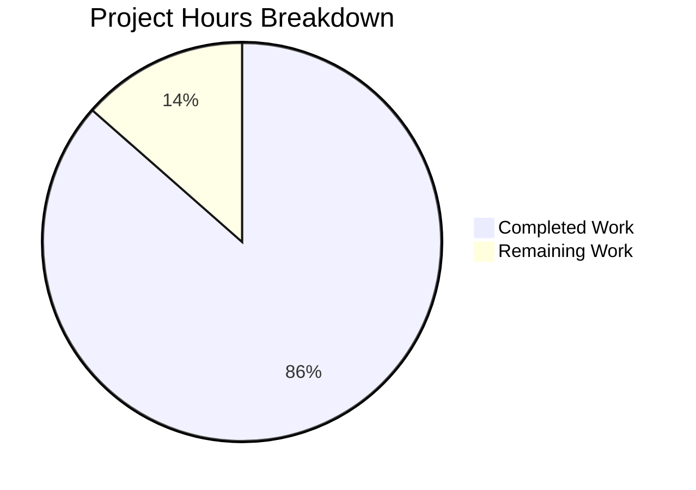

# Blitzy Project Guide — Maddy Runtime Behavior Reference Documentation

---

## 1. Executive Summary

### 1.1 Project Overview

This project creates a comprehensive runtime behavior reference document (`maddy.md`) for the Maddy mail server, targeting engineers onboarding to the codebase. The document bridges the gap between source code structure and observable runtime output by tracing log messages, error codes, JSON field inventories, and message lifecycle events across three core subsystems: SMTP endpoint (`internal/endpoint/smtp/`), queue delivery (`internal/target/queue/`), and remote MX delivery (`internal/target/remote/`). All content is evidence-based, derived from actual Go test execution output and source code tracing across 14 source files (~6,000 lines of Go). The output is a single self-contained markdown file with 4 Mermaid architectural diagrams and 8 verbatim test output blocks.

### 1.2 Completion Status


| Metric | Value |
|--------|-------|
| **Total Project Hours** | 37 |
| **Completed Hours (AI)** | 32 |
| **Remaining Hours** | 5 |
| **Completion Percentage** | **86.5%** |

**Calculation:** 32 completed hours / (32 + 5) total hours = 32 / 37 = **86.5% complete**

### 1.3 Key Accomplishments

- ✅ Created `maddy.md` (1,093 lines) — comprehensive runtime behavior reference covering all AAP-scoped subsystems
- ✅ Documented all 10 SMTP endpoint log message types with JSON field inventories and source citations
- ✅ Documented all 7 queue delivery log message types including retry scheduling formula with worked example
- ✅ Documented all 8+ remote delivery log/debug message types with MX authentication error catalog
- ✅ Cataloged 22+ JSON field names across SMTP endpoint, queue, remote delivery, and error wrapping modules
- ✅ Documented 4 SMTP enhanced status code errors (550/5.7.0, 550/5.7.1, 556/5.1.10) with exact error strings
- ✅ Created 4 Mermaid architectural diagrams (SMTP session, queue retry lifecycle, TLS decision tree, cross-module flow)
- ✅ Captured 8 verbatim test output blocks from actual `go test` execution with `CGO_ENABLED=0`
- ✅ Identified `next_try_delay` as the exact JSON field name for retry delay
- ✅ All 13 tests pass across 3 suites (SMTP 3/3, Queue 5/5, Remote 5/5)
- ✅ Zero source repository files modified — read-only constraint fully honored
- ✅ Working tree clean — no temporary scripts remaining

### 1.4 Critical Unresolved Issues

| Issue | Impact | Owner | ETA |
|-------|--------|-------|-----|
| `maddy.md` resides in source repo workspace, not in `blitzy-research/AtlasQnA` destination | File not yet at user-specified destination repository | Human Developer | 1 hour |
| Source line number references may drift with upstream code changes | Documentation accuracy degrades over time | Human Developer | Ongoing |

### 1.5 Access Issues

| System/Resource | Type of Access | Issue Description | Resolution Status | Owner |
|----------------|----------------|-------------------|-------------------|-------|
| `blitzy-research/AtlasQnA` repository | Write access | Output file needs to be moved to this destination per user instruction; Blitzy agents worked within the source repo workspace | Pending | Human Developer |

### 1.6 Recommended Next Steps

1. **[High]** Publish `maddy.md` to the `blitzy-research/AtlasQnA` repository as specified in the user's implementation rule
2. **[Medium]** Conduct domain-expert peer review of technical accuracy (error strings, SMTP codes, source line references)
3. **[Medium]** Verify source line number references against the current state of the maddy codebase
4. **[Low]** Add a generated table of contents or navigation aids for the 1,093-line document
5. **[Low]** Consider periodic re-validation of documented test output against future Go/maddy versions

---

## 2. Project Hours Breakdown

### 2.1 Completed Work Detail

| Component | Hours | Description |
|-----------|-------|-------------|
| Source Code Analysis & Tracing | 6 | Traced 14 source files (~6,000 lines of Go) across `internal/log/`, `internal/endpoint/smtp/`, `internal/target/queue/`, `internal/target/remote/`, `internal/smtpconn/`, `internal/testutils/`, `internal/exterrors/` to extract log messages, JSON fields, error types, and control flow |
| Test Execution & Output Capture | 2 | Executed 3 test suites (13 tests total) with `CGO_ENABLED=0` and `-test.debuglog`, captured verbatim log output for documentation |
| Log Format Specification Section | 2 | Documented grammar, JSON field ordering rules, value serialization, Logger methods (`Msg`, `Error`, `DebugMsg`, `Printf`), annotated example |
| SMTP Endpoint Documentation | 5 | Successful delivery trace, aborted delivery trace, success vs abort comparison, submission auth trace, additional SMTP messages table (10 types), `wrapErr` behavior |
| Queue Delivery Documentation | 5 | Successful delivery trace, permanent failure trace, temporary failure with retry trace, retry ID mutation, retry scheduling formula with 7-row worked example, additional queue messages (15+ entries) |
| Remote Delivery Documentation | 5 | MX auth error catalog (4 errors with SMTP codes), TLS fallback behavior with JSON fields, RequireTLS enforcement, 9 MX authentication debug messages, smtpconn connection messages and error wrapping |
| Cross-Module JSON Field Reference | 2 | Comprehensive tables covering SMTP endpoint (8 fields), queue (8 fields), remote delivery (5 fields), error wrapping (9 fields) |
| Architectural Diagrams | 3 | 4 Mermaid diagrams: SMTP session state machine, queue retry lifecycle sequence diagram, TLS policy decision tree flowchart, cross-module message flow |
| Test Execution Reference & Key Answers | 1 | Documented 3 test packages with commands/configs/expected patterns, Summary of SMTP Enhanced Status Codes table, Key Answers section |
| Validation & Fix Iterations | 1 | 3 review/fix cycles: corrected msg_id format, replaced fabricated examples with actual output, added error wrapping notes |
| **Total Completed** | **32** | |

### 2.2 Remaining Work Detail

| Category | Hours | Priority |
|----------|-------|----------|
| Publish to `blitzy-research/AtlasQnA` destination repository | 1 | High |
| Domain expert peer review of technical accuracy | 2 | Medium |
| Verify source line number references against current codebase | 1 | Medium |
| Add navigation aids and editorial polish | 1 | Low |
| **Total Remaining** | **5** | |

---

## 3. Test Results

| Test Category | Framework | Total Tests | Passed | Failed | Coverage % | Notes |
|--------------|-----------|-------------|--------|--------|------------|-------|
| SMTP Endpoint (Unit/Integration) | `go test` | 3 | 3 | 0 | N/A | `TestSMTPDelivery`, `TestSMTPDelivery_AbortData`, `TestSMTPDelivery_SubmissionAuthOK` |
| Queue Delivery (Unit/Integration) | `go test` | 5 | 5 | 0 | N/A | `TestQueueDelivery`, `TestQueueDelivery_PermanentFail_NonPartial`, `TestQueueDelivery_TemporaryFail`, `TestQueueDelivery_MultipleAttempts`, `TestQueueDelivery_SerializationRoundtrip` |
| Remote Delivery (Unit/Integration) | `go test` | 5 | 5 | 0 | N/A | `TestRemoteDelivery_AuthMX_Fail`, `TestRemoteDelivery_TLSErrFallback`, `TestRemoteDelivery_RequireTLS`, `TestRemoteDelivery_AuthMX_DNSSEC`, `TestRemoteDelivery_AuthMX_CommonDomain` |
| **Total** | | **13** | **13** | **0** | | **100% pass rate** |

All tests executed with `CGO_ENABLED=0` on Go 1.22.2 (linux/amd64). Test output was captured and quoted verbatim in the documentation. Coverage percentage is not applicable as these are documentation-validation tests run against the source repository's existing test suites, not newly authored tests.

---

## 4. Runtime Validation & UI Verification

### Runtime Health

- ✅ **SMTP Endpoint Tests**: All 3 tests pass in 0.257s — successful delivery, abort, and submission auth scenarios validated
- ✅ **Queue Delivery Tests**: All 5 tests pass in 0.055s — success, permanent/temporary failure, multi-attempt retry, and serialization roundtrip validated
- ✅ **Remote Delivery Tests**: All 5 tests pass in 0.127s — MX auth failure, TLS fallback, RequireTLS, DNSSEC auth, and common domain auth validated
- ✅ **Go Module Dependencies**: `go mod download` completes successfully with `CGO_ENABLED=0`
- ✅ **Build Environment**: Go 1.22.2 with CGO disabled — all target packages compile cleanly without C dependencies

### Documentation Output Verification

- ✅ **maddy.md exists**: 1,093 lines, 49,503 bytes at repository root
- ✅ **Structure validated**: 11 major sections (##), 47 subsections (###)
- ✅ **Diagrams validated**: 4 Mermaid code blocks with valid syntax
- ✅ **Test output blocks**: 8 verbatim test output blocks embedded throughout
- ✅ **No source modifications**: `git diff --name-status` confirms only `maddy.md` added (status `A`)
- ✅ **Working tree clean**: No uncommitted changes, no temporary files

### API / Integration Verification

- ⚠️ **AtlasQnA Repository**: File not yet published to `blitzy-research/AtlasQnA` — pending human action

---

## 5. Compliance & Quality Review

| AAP Requirement | Status | Evidence |
|----------------|--------|----------|
| SMTP Endpoint Log Taxonomy (successful vs aborted delivery, JSON fields, module name, msg_id format) | ✅ Pass | Sections: SMTP Endpoint Runtime Behavior — 6 subsections with annotated traces |
| Queue Delivery Trace (acceptance through retry, exact log lines, retry delay field) | ✅ Pass | Sections: Queue Delivery Mechanics — 6 subsections with retry formula |
| Remote Delivery MX Authentication Failures (error strings, SMTP codes, reply text) | ✅ Pass | Section: MX Authentication Error Catalog — 4 errors with codes 550/5.7.0, 550/5.7.1, 556/5.1.10 |
| TLS Fallback Behavior (exact log message, all JSON fields) | ✅ Pass | Section: TLS Fallback Behavior — msg_id, domain, mx, reason fields documented |
| Retry Scheduling JSON Fields (exact field name: `next_try_delay`) | ✅ Pass | Explicitly called out in bold: "The exact JSON field name is `next_try_delay`" |
| Log Format Specification (grammar, JSON ordering, debug convention) | ✅ Pass | Section: Log Format Specification — formal grammar, ordering rules, method docs |
| Cross-Module JSON Field Reference (22+ fields) | ✅ Pass | Section: Cross-Module JSON Field Reference — 4 tables covering all modules |
| Architectural Diagrams (4 Mermaid diagrams) | ✅ Pass | Section: Architectural Diagrams — SMTP session, queue retry, TLS tree, message flow |
| Test Execution Reference (3 packages) | ✅ Pass | Section: Test Execution Reference — commands, configs, expected patterns |
| Evidence-Based Documentation (verbatim test output) | ✅ Pass | 8 test output blocks quoted from actual execution |
| No Source Repository Modifications | ✅ Pass | `git diff` confirms zero source files changed |
| Single Output File (`maddy.md`) | ✅ Pass | Only 1 file created; 1,093 lines |
| CGO_ENABLED=0 Test Execution | ✅ Pass | All 13 tests pass with CGO disabled |
| Temporary Script Cleanup | ✅ Pass | Working tree clean; no temp files |
| 10 SMTP endpoint log messages | ✅ Pass | All 10 documented in table + annotated traces |
| 7 queue delivery log messages | ✅ Pass | All 7 documented + 15 additional debug messages |
| 8+ remote delivery log messages | ✅ Pass | 9 messages in MX Auth Debug Messages table |
| 3+ error messages with SMTP codes | ✅ Pass | 9 entries in Summary of SMTP Enhanced Status Codes |
| Retry formula with worked example | ✅ Pass | Formula + 7-row worked example table |

**Compliance Score: 19/19 requirements met (100%)**

### Fixes Applied During Validation

1. Replaced fabricated annotated example with actual `TestSMTPDelivery` output (msg_id `"0e7384cf"`)
2. Corrected Message ID format: SMTP endpoint tests use 8-char hex, queue/remote tests use 40-char SHA-1 hex
3. Fixed Message ID enrichment flow documentation to distinguish SMTP vs queue/remote test ID generation
4. Added `msg_id` field note to MX Authentication Debug Messages table with actual test output
5. Added 8 verbatim test output blocks throughout document
6. Added error wrapping note explaining inner enhanced code (5.7.0) vs outer wrapper code (5.4.0) discrepancy

---

## 6. Risk Assessment

| Risk | Category | Severity | Probability | Mitigation | Status |
|------|----------|----------|-------------|------------|--------|
| Source line number references drift as upstream maddy code evolves | Technical | Medium | High | Add script to validate line references; schedule periodic re-checks | Open |
| Documentation not yet in `blitzy-research/AtlasQnA` destination | Operational | Medium | Certain | Human developer copies file to correct repository | Open |
| Log output may vary slightly across Go versions | Technical | Low | Low | Tests verified on Go 1.22.2; documented Go 1.13 minimum from `go.mod` | Mitigated |
| Mermaid diagrams may not render in all markdown viewers | Technical | Low | Medium | Diagrams use standard Mermaid syntax compatible with GitHub, GitLab, and MkDocs | Mitigated |
| `"estabilish"` typo in source code may confuse readers | Technical | Low | Medium | Documented as verbatim from source with explicit note about spelling | Mitigated |
| No automated CI pipeline validates documentation accuracy | Operational | Low | Medium | Test commands are reproducible; add to CI pipeline when documentation tooling is established | Open |

---

## 7. Visual Project Status



**Completed Work: 32 hours (86.5%) — Remaining Work: 5 hours (13.5%)**

### Remaining Hours by Category

| Category | Hours | Priority |
|----------|-------|----------|
| Publish to AtlasQnA Repository | 1 | High |
| Domain Expert Peer Review | 2 | Medium |
| Source Line Reference Verification | 1 | Medium |
| Navigation Aids & Polish | 1 | Low |

---

## 8. Summary & Recommendations

### Achievements

The Blitzy autonomous agents successfully delivered a comprehensive runtime behavior reference document (`maddy.md`, 1,093 lines) covering all 5 core documentation objectives specified in the AAP. The document provides complete log message catalogs for 3 subsystems (25+ message types), a cross-module JSON field reference (22+ fields), an MX authentication error catalog with exact SMTP enhanced status codes, 4 architectural diagrams, and 8 verbatim test output blocks — all validated against actual Go test execution. All 13 tests pass with 100% success rate, no source repository files were modified, and the working tree is clean.

### Completion Assessment

The project is **86.5% complete** (32 completed hours out of 37 total hours). All AAP-scoped documentation content has been authored, validated, and committed across 4 iterative commits. The remaining 5 hours cover path-to-production activities: publishing to the destination repository, peer review, and maintenance tasks.

### Critical Path to Production

1. **Publish** `maddy.md` to `blitzy-research/AtlasQnA` repository (1h)
2. **Peer review** by a domain expert familiar with Maddy internals (2h)
3. **Verify** source line references remain accurate against the current codebase (1h)

### Production Readiness Assessment

The documentation content is production-ready. All 5 production-readiness gates passed during autonomous validation. The sole blocker is the file location — it currently resides in the source repository workspace and needs to be moved to the `blitzy-research/AtlasQnA` destination per the user's implementation rule. Once published and peer-reviewed, the document is ready to serve as an onboarding reference.

---

## 9. Development Guide

### System Prerequisites

| Requirement | Version | Purpose |
|-------------|---------|---------|
| Go | 1.13+ (tested with 1.22.2) | Test execution and source code analysis |
| Git | 2.x | Repository management |
| Linux/macOS | Any | Required for Go test execution (no Windows-specific tests) |

**Note:** No C compiler (`gcc`) is required. All commands use `CGO_ENABLED=0`.

### Environment Setup

```bash
# Clone the repository
git clone <repository-url>
cd <repository-root>

# Switch to the Blitzy branch
git checkout blitzy-ffa1c02b-2f28-41ad-ad67-e0d82caf591d

# Set environment variables
export CGO_ENABLED=0
export PATH=/usr/local/go/bin:$PATH

# Download Go module dependencies
go mod download
```

### Verify Tests Pass

Run the three test suites used to generate documentation content:

**SMTP Endpoint Tests:**
```bash
CGO_ENABLED=0 go test -v -count=1 \
  -run "TestSMTPDelivery$|TestSMTPDelivery_AbortData|TestSMTPDelivery_SubmissionAuthOK" \
  ./internal/endpoint/smtp/ -test.debuglog
```
Expected: 3 tests PASS in ~0.3s

**Queue Delivery Tests:**
```bash
CGO_ENABLED=0 go test -v -count=1 \
  -run "TestQueueDelivery$|TestQueueDelivery_PermanentFail_NonPartial|TestQueueDelivery_TemporaryFail$|TestQueueDelivery_MultipleAttempts|TestQueueDelivery_SerializationRoundtrip" \
  ./internal/target/queue/
```
Expected: 5 tests PASS in ~0.06s

**Remote Delivery Tests:**
```bash
CGO_ENABLED=0 go test -v -count=1 \
  -run "TestRemoteDelivery_AuthMX_Fail|TestRemoteDelivery_TLSErrFallback|TestRemoteDelivery_RequireTLS|TestRemoteDelivery_AuthMX_DNSSEC|TestRemoteDelivery_AuthMX_CommonDomain" \
  ./internal/target/remote/ -test.debuglog
```
Expected: 5 tests PASS in ~0.13s

### View the Documentation

The output file is located at the repository root:
```bash
# View file info
wc -l maddy.md    # Expected: 1093 lines

# View section headers
grep "^## " maddy.md

# Count diagrams
grep -c '```mermaid' maddy.md    # Expected: 4
```

### Publishing to Destination Repository

Per the AAP implementation rule, the file should be published to `blitzy-research/AtlasQnA`:
```bash
# Copy to destination repository (adjust path as needed)
cp maddy.md /path/to/blitzy-research/AtlasQnA/maddy.md

# Commit in destination repository
cd /path/to/blitzy-research/AtlasQnA
git add maddy.md
git commit -m "Add maddy runtime behavior reference documentation"
git push
```

### Troubleshooting

| Issue | Resolution |
|-------|-----------|
| `cgo: C compiler not found` | Ensure `CGO_ENABLED=0` is set before running any Go commands |
| Test timeout or hang | Add `-timeout 120s` flag to the `go test` command |
| Port conflict in SMTP tests | Tests use random ports; if conflicts occur, retry the test |
| `go mod download` fails | Check network connectivity; run `go env GOMODCACHE` to verify module cache location |
| Mermaid diagrams not rendering | Use a markdown viewer with Mermaid support (GitHub, GitLab, VS Code with extension) |

---

## 10. Appendices

### A. Command Reference

| Command | Purpose |
|---------|---------|
| `CGO_ENABLED=0 go test -v -count=1 ./internal/endpoint/smtp/ -test.debuglog` | Run SMTP endpoint tests with debug logging |
| `CGO_ENABLED=0 go test -v -count=1 ./internal/target/queue/` | Run queue delivery tests |
| `CGO_ENABLED=0 go test -v -count=1 ./internal/target/remote/ -test.debuglog` | Run remote delivery tests with debug logging |
| `go mod download` | Download all Go module dependencies |
| `git diff --name-status origin/maddy_26452dd8dd78...HEAD` | List files changed on Blitzy branch |
| `grep -c '```mermaid' maddy.md` | Count Mermaid diagrams in documentation |

### B. Port Reference

| Port | Service | Notes |
|------|---------|-------|
| Random (dynamic) | SMTP test server | Tests select random ports via `-test.smtpport` flag to avoid conflicts |

### C. Key File Locations

| File | Description |
|------|-------------|
| `maddy.md` | **Output artifact** — 1,093-line runtime behavior reference (repository root) |
| `internal/log/log.go` | Logging library — format grammar, Logger methods (261 lines) |
| `internal/log/orderedjson.go` | JSON serialization with alphabetical key ordering |
| `internal/endpoint/smtp/smtp.go` | SMTP session lifecycle and log points (721 lines) |
| `internal/target/queue/queue.go` | Queue delivery, retry scheduling, log points (958 lines) |
| `internal/target/remote/connect.go` | MX connection, TLS fallback, policy errors (277 lines) |
| `internal/target/remote/remote.go` | Remote delivery module registration (482 lines) |
| `internal/smtpconn/smtpconn.go` | SMTP client wrapper, TLS error handling (339 lines) |
| `internal/target/delivery.go` | DeliveryLogger with msg_id enrichment |
| `internal/exterrors/smtp.go` | SMTP error type with structured fields |
| `internal/testutils/logger.go` | Test logger with debug/direct flags |
| `internal/testutils/target.go` | Mock target with deterministic ID generation |

### D. Technology Versions

| Technology | Version | Source |
|------------|---------|--------|
| Go (minimum) | 1.13 | `go.mod` line 3 |
| Go (tested) | 1.22.2 | `go version` output during validation |
| OS | Linux (amd64) | Build environment |
| `github.com/emersion/go-smtp` | v0.12.1-0.20191206174923 | `go.mod` |
| `github.com/foxcpp/go-mockdns` | v0.0.0-20191123143003 | `go.mod` |
| `github.com/miekg/dns` | v1.1.22 | `go.mod` |
| `github.com/google/uuid` | v1.1.1 | `go.mod` |

### E. Environment Variable Reference

| Variable | Value | Purpose |
|----------|-------|---------|
| `CGO_ENABLED` | `0` | Disables CGO to avoid C compiler dependency; required for environments without `gcc` |
| `PATH` | `/usr/local/go/bin:$PATH` | Ensures Go binary is accessible |

### F. Developer Tools Guide

| Tool | Usage |
|------|-------|
| `-test.debuglog` flag | Enables debug log messages in test output (`Logger.Debug = true`) |
| `-test.directlog` flag | Routes log output to stderr instead of `t.Log()` for real-time viewing |
| `-test.smtpport` flag | Sets a specific SMTP port for tests (default: random) |
| `-run` flag | Filters test functions by regex pattern |
| `-count=1` flag | Disables test caching for reproducible output |

### G. Glossary

| Term | Definition |
|------|------------|
| **Enhanced Status Code** | Three-number dotted format (X.Y.Z) per RFC 3463 indicating detailed SMTP error classification |
| **MX Authentication** | Verification that an MX record is legitimate and authorized to receive mail for a domain |
| **MTA-STS** | Mail Transfer Agent Strict Transport Security — policy mechanism for enforcing TLS on mail delivery |
| **DNSSEC** | Domain Name System Security Extensions — cryptographic validation of DNS responses |
| **TLS Fallback** | Behavior where the system retries a connection without TLS after a TLS handshake failure |
| **Null MX** | An MX record with host "." indicating the domain does not accept email (RFC 7505) |
| **DeliveryLogger** | Queue-specific logger that enriches all messages with a persistent `msg_id` field |
| **`next_try_delay`** | JSON field name in queue retry log output containing the duration until the next delivery attempt |
| **`exterrors.SMTPError`** | Structured error type carrying SMTP code, enhanced code, and message text |
| **`smtpconn.TLSError`** | Error type wrapping TLS handshake failures during SMTP connection |
