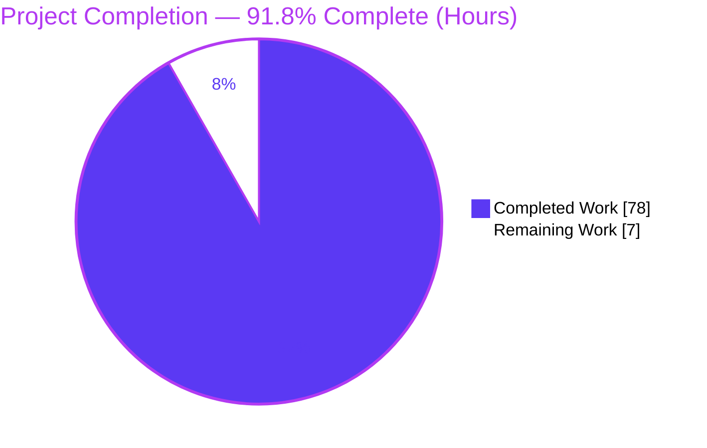
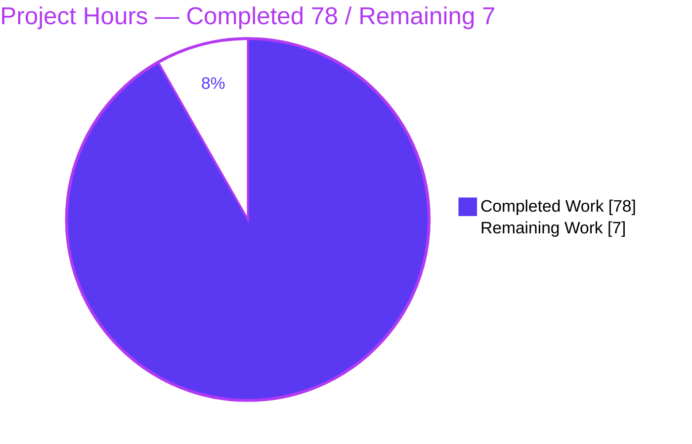
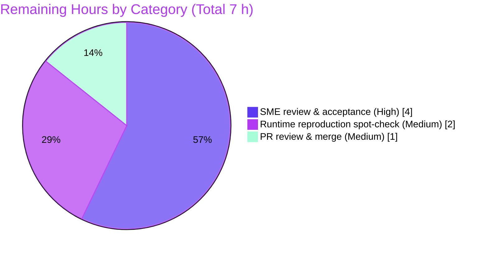

# Blitzy Project Guide — Maddy Sender-Identity & DKIM Runtime Investigation (commit `26452dd`)

> **Task type:** Runtime-investigation Q&A / Documentation (rule set **SWE-AtlasQnA-Repo**, observe-first & read-only).
> **Sole repository deliverable:** `blitzy/documentation/maddy_26452dd8dd78.md` (1,039 lines).
> **Completion:** **91.8%** (78 of 85 hours). **Remaining:** 7 hours of human review & publish.

---

## 1. Executive Summary

### 1.1 Project Overview

This project answers, **from direct runtime observation of a locally built Maddy mail server at commit `26452dd`**, how Maddy enforces sender identity and message authentication on an *authenticated SMTP submission* session: (a) how it accepts/rejects the client-supplied sender address, and (b) how DKIM signing behaves — backed by actual SMTP response codes and actual stored header bytes. The audience is mail-server engineers and security reviewers evaluating Maddy's submission-path guarantees. It is a **read-only investigation**: no product code changes, no dependency changes. The single deliverable is an evidence-grounded Markdown answer document produced by building the server, driving its real submission entry point through six sender scenarios (T1–T6), and capturing verbatim protocol and storage evidence.

### 1.2 Completion Status



| Metric | Value |
|--------|-------|
| **Total Hours** | **85** |
| **Completed Hours (AI + Manual)** | **78** (78 AI autonomous + 0 Manual) |
| **Remaining Hours** | **7** |
| **Percent Complete** | **91.8%** (78 ÷ 85) |

> **Completion basis (PA1, AAP-scoped):** Every AAP autonomous deliverable — the answer document, objectives **O1–O8**, the **T1–T6** scenario matrix, all SWE-AtlasQnA-Repo methodology rules, and build/cleanup activity — is **Completed** and evidence-backed. The remaining **7 h** is exclusively the standard path-to-production **human acceptance/publish** path for a documentation deliverable; there are **no open AAP functional gaps**. Color key: **Completed = Dark Blue `#5B39F3`**, **Remaining = White `#FFFFFF`**.

### 1.3 Key Accomplishments

- ✅ **Single required artifact delivered:** `blitzy/documentation/maddy_26452dd8dd78.md` (1,039 lines, 14 sections), committed `010a1a2`; `git diff` vs base `26452dd` shows **only** this file (read-only mandate honored).
- ✅ **Canonical runtime built & stood up (O1):** `cmd/maddy` (`-tags debug`) and `cmd/maddyctl` build clean; version banner `maddy unknown (built from source tree)`; authenticated submission + DKIM + local SQLite delivery + two same-domain accounts.
- ✅ **All six sender scenarios exercised through the real entry point (O2):** SMTP `AUTH` → message pipeline → `sign_dkim` → SQLite storage; stable across ≥2 runs and transport-independent (plaintext `:587` ≡ implicit-TLS `:465`).
- ✅ **Three-gate thesis established & observed (O3/O7/O8):** (1) `AUTH` always required; (2) acceptance is **DOMAIN-level** authorization on the **envelope** sender — **not** per-user (T1: auth *alice*, `MAIL FROM bob@example.org` → **ACCEPTED**); (3) `From`-alignment gates **only DKIM signing** — misalignment yields **silent UNSIGNED delivery, never rejection**.
- ✅ **Byte-exact evidence captured (O4/O5):** verbatim `DKIM-Signature` (T2 signed, `From` oversigned in `h=`), raw `Received` (reflects envelope, not `From`/auth), and a **config-conditional** `Authentication-Results` negative.
- ✅ **Full protocol transactions captured (O6):** one ACCEPTED + one REJECTED transaction at both client and server (`io_debug`) level; documented `tcpdump`-absent fallback.
- ✅ **Verbatim SMTP codes confirmed:** `235` / `250` / `354` / **`501 5.1.8 "Non-local sender domain"`** (T3, deferred to RCPT) / **`554 5.6.0 "Message does not contains a From header field"`** (T6, verbatim grammar).
- ✅ **Independently re-validated by this assessment:** rebuild exit 0; all 8 doc-cited packages pass; 4 pivotal `file:line` citations verified accurate against source.

### 1.4 Critical Unresolved Issues

| Issue | Impact | Owner | ETA |
|-------|--------|-------|-----|
| _None._ All five Blitzy validation gates pass; zero unresolved errors, zero failing tests, zero citation inaccuracies, zero uncommitted changes. | N/A | N/A | N/A |

> No blocking issues exist. The one discrepancy found during autonomous validation (§3.4 plaintext `:587` TLS description) was corrected and re-verified in commit `010a1a2`.

### 1.5 Access Issues

| System/Resource | Type of Access | Issue Description | Resolution Status | Owner |
|-----------------|----------------|-------------------|-------------------|-------|
| _None identified._ | — | Repository, Go toolchain, build & test all accessible in the canonical container; no external credentials, DNS, or third-party APIs are required (testing is deliberately DNS-independent and local). | N/A | N/A |

> **No access issues identified.** The investigation is intentionally self-contained: local domains, local delivery, self-signed TLS, and a locally generated DKIM key — no external MX/DNS/API dependencies.

### 1.6 Recommended Next Steps

1. **[High]** Assign a mail-server/security SME to review and accept the answer document — verify it answers both question parts and spot-check the headline claims (domain-level authorization, silent unsigned delivery, `501`/`554` codes, byte-exact DKIM signature). *(HT-1, 4 h)*
2. **[Medium]** Optionally reproduce 1–2 key scenarios independently (rebuild, run T1/T2/T3) to confirm the OBSERVED SMTP codes and DKIM sign/skip outcomes. *(HT-2, 2 h)*
3. **[Medium]** Complete a final editorial pass and merge the PR, confirming the diff contains only `blitzy/documentation/maddy_26452dd8dd78.md`. *(HT-3, 1 h)*
4. **[Low]** Record the two headline security-relevant findings (domain-only authorization; PKCS#1/PKIX DKIM interop divergence) in the team's Maddy operational notes for downstream operators.

---

## 2. Project Hours Breakdown

### 2.1 Completed Work Detail

All hours are autonomous (AI) work; each component traces to a specific AAP objective or activity.

| Component | Hours | Description |
|-----------|-------|-------------|
| Runtime foundation & source build (O1) | 8 | Build `cmd/maddy` + `cmd/maddyctl` (CGO/SQLite), author canonical `maddy.conf`, generate self-signed TLS cert, initialize `all.db` store, provision two same-domain accounts via `maddyctl users create`, start daemon with `-debug`, confirm DKIM key auto-generation & version banner. |
| Test harness authoring & scenario execution (O2) | 6 | Python `smtplib` harness decoupling envelope `MAIL FROM` from the `From` header with SASL PLAIN; `run_all.sh` driving all six scenarios over `:587` (×2) and `:465` (×1); confirm stability & transport-independence. |
| Accept/reject mechanism + verbatim SMTP codes (O3) | 4 | Capture verbatim codes (`235`/`250`/`354`/`501 5.1.8`/`554 5.6.0`/`221`), analyze deferred sender reject (`defer_sender_reject`), and prove dependence on how the mismatch is constructed (5-way table). |
| Verbatim stored header capture (O4) | 5 | Read byte-exact `DKIM-Signature`, `Received`, and `Authentication-Results` from stored message bytes via `maddyctl imap-msgs dump` / SQLite; byte-level `h=` tag (oversigning) analysis. |
| DKIM triggering probe + custom verifier (O5) | 7 | Probe signing under `From` manipulation; confirm `From` coverage/oversigning; build a `go-msgauth` verifier against the repo's exact deps to derive a recipient's conclusion (Findings A PKCS#1/PKIX, B in-library round-trip, C stored-copy mismatch). |
| Full SMTP transaction capture (O6) | 4 | Server-side `io_debug` transcripts + client transcripts for ≥1 ACCEPTED and ≥1 REJECTED transaction; document `tcpdump`-absent fallback and plaintext-listener strategy. |
| Default-vs-explicit policy determination + rule-outs (O7) | 6 | Establish default = domain-level only; demonstrate an explicit per-user gate via the generic `command` check (variant config + `cmp_sender.sh` → observed `553 5.7.1`); refute three incorrect interpretations with evidence. |
| Behavior-diverges analysis (O8) | 4 | Domain-accept + silent-unsigned divergence; `require_sender_match` parser/default contradiction; `auth_user` bypass; PKCS#1/PKIX interop divergence. |
| Source walk + citation appendix (§10/§13) | 6 | Domain-vs-per-user source walk tying observation to code; comprehensive `file:line` citation appendix; verification of ~100 citations naming function/method/struct. |
| Supplementary out-of-scope observations (§14) | 4 | CLI administrative exit-`0` defects, malformed double-`@` acceptance, protocol robustness, normalization (CVE note), storage integrity — documented (not remediated) per read-only scope. |
| Answer document authoring (deliverable) | 9 | Structure and write the 1,039-line answer: direct-answer lead, methodology mapping, evidence blocks, tables, OBSERVED-vs-INFERRED labeling, objective coverage pass (§12). |
| QA iterations across 7 commits | 8 | Rewrite with complete runtime evidence, restore historical byte-exact captures, remove unsupported cross-check claims, resolve 16 QA findings, citation-precision fixes, §3.4 correction. |
| Final validation (build/test/reproduce/verify) | 6 | `go build` both binaries + `go test -tags debug ./...` (20 packages) exit 0; reproduce every OBSERVED claim byte-for-byte; verify every §13/§14 citation; resolve & re-verify the §3.4 discrepancy; commit; confirm clean tree. |
| Cleanup & repository hygiene | 1 | Remove all transient runtime artifacts (config, TLS, SQLite db, DKIM keys, scripts, captures) created outside the source tree; confirm `git status` shows only the deliverable. |
| **Total Completed** | **78** | — |

### 2.2 Remaining Work Detail

Path-to-production only — the human acceptance/publish path for a documentation deliverable. **No AAP functional gaps.**

| Category | Hours | Priority |
|----------|-------|----------|
| SME technical review & acceptance of the answer document | 4 | High |
| Independent runtime reproduction spot-check (rebuild + run T1/T2/T3) | 2 | Medium |
| PR review & merge/publish documentation | 1 | Medium |
| **Total Remaining** | **7** | — |

### 2.3 Total Reconciliation & Confidence

- **Total Project Hours = 85** = Completed **78** (§2.1) + Remaining **7** (§2.2). ✔ Cross-section integrity Rule 2.
- **Completion % = 78 ÷ 85 = 91.76% ≈ 91.8%** — used identically in §1.2, §7, and §8.
- **Remaining = 7 h**, identical across §1.2, §2.2, and §7. ✔ Cross-section integrity Rule 1.
- **Confidence: High.** The scope is fully known (a single, finished, committed deliverable), build and tests were independently re-run to exit 0, and the remaining work is well-bounded human review. No low-confidence unknowns remain; there are **no blocking fixes** and **no optimization work** in scope.

---

## 3. Test Results

All results below originate from **Blitzy's autonomous validation logs** (GATE 1 `go test`; GATE 2 runtime scenario matrix; GATE 5 DKIM verifier) and were **independently corroborated** by this assessment (rebuild + doc-cited package runs).

| Test Category | Framework | Total Tests | Passed | Failed | Coverage % | Notes |
|---------------|-----------|-------------|--------|--------|-----------|-------|
| Unit / Package (regression gate) | Go `testing` (`go test -tags debug ./...`) | 232 test funcs across 20 pkgs | 232 | 0 | N/A (not measured) | Pre-existing upstream suite run as a regression guard to confirm the read-only investigation left the tree green. 0 FAIL / 0 panic / 0 data race. All 8 doc-cited packages independently re-run here → pass. |
| Runtime Scenario Matrix (integration) | Python `smtplib` harness → real submission endpoint | 6 (T1–T6) | 6 | 0 | 100% of T-matrix | Each expected OBSERVED outcome reproduced & stable across ≥2 runs on `:587` + ×1 on `:465`. T1/T2/T4/T5 accepted; T3/T6 rejected. Codes byte-exact. |
| DKIM Signature Verification | `go-msgauth` verifier (repo-exact deps) | 3 (Findings A/B/C) | 3 | 0 | N/A | A: published PKCS#1 key fails PKIX parse; B: in-library round-trip passes; C: stored T2 copy no longer matches its own signature. All reproduced. |
| Build Compilation | Go 1.18.x + gcc (CGO) | 2 binaries | 2 | 0 | N/A | `cmd/maddy` (`-tags debug`) & `cmd/maddyctl` exit 0; only benign `mattn/go-sqlite3 -Wreturn-local-addr` CGO warning. |

> **Integrity note:** No new tests were authored — this is a read-only documentation task. The Go suite is the upstream test set, executed by Blitzy's autonomous validation as a regression gate; the "tests" that carry the investigation's findings are the T1–T6 runtime scenarios and the DKIM verifier checks, all captured in the autonomous validation logs. Coverage % is reported as **N/A** where it was not measured (honest reporting; the validator recorded pass/fail, not line coverage).

---

## 4. Runtime Validation & UI Verification

**Runtime health (headless mail server — no UI/frontend in scope):**

- ✅ **Operational** — Daemon starts from the canonical config (`maddy -debug -config …`); submission endpoint listens on `:465` (implicit TLS) and `:587` (plaintext + `insecure_auth` for capture).
- ✅ **Operational** — `AUTH PLAIN` succeeds (`235 2.0.0 Authentication succeeded`) via the unified `sql` SQLite auth backend; two same-domain accounts provisioned with `maddyctl users create`.
- ✅ **Operational** — Message pipeline domain routing: local envelope domain **ACCEPTED**; non-local envelope domain **REJECTED** `501 5.1.8` (deferred to first `RCPT`).
- ✅ **Operational** — `sign_dkim` modifier: aligned message **SIGNED** (`DKIM-Signature` added); misaligned message delivered **UNSIGNED** (no rejection).
- ✅ **Operational** — Local delivery to SQLite mailbox; messages inspectable via `maddyctl imap-msgs dump` with byte-exact stored headers.
- ✅ **Operational** — DKIM key auto-generated under the state directory on first start; public key emitted for verification.
- ✅ **Operational** — Transport independence confirmed: identical behavior on `:587` and `:465`.

**API / protocol integration outcomes (SMTP):**

- ✅ **Operational** — Verbatim codes: `235` (AUTH), `250 2.0.0 Roger, accepting mail from …` (MAIL FROM), `250` (RCPT), `354` (DATA go-ahead), `250 2.0.0 OK: queued` (DATA accept), `221` (QUIT).
- ✅ **Operational** — `501 5.1.8 "Non-local sender domain"` (T3) and `554 5.6.0 "Message does not contains a From header field"` (T6) reproduced verbatim, including the server's exact grammar.
- ⚠ **Partial (by design, config-conditional)** — `Authentication-Results` header is **absent by default** on submission; it appears **only** when a check such as `verify_dkim` is added to the submission `source` (demonstrated in doc §8). This is an intended negative, not a failure.

**UI verification:** ❌ **Not applicable** — Maddy is a headless SMTP/IMAP server; there is no web/graphical UI within the AAP scope. No browser/visual verification was required or performed.

---

## 5. Compliance & Quality Review

Cross-mapping of AAP deliverables and the SWE-AtlasQnA-Repo rule set to Blitzy quality benchmarks.

| Benchmark / Requirement | Status | Progress | Evidence & Notes |
|--------------------------|--------|----------|------------------|
| **Deliverable** — single file `blitzy/documentation/maddy_26452dd8dd78.md` | ✅ Pass | 100% | 1,039 lines; committed `010a1a2`; `git diff` = only this file. |
| **O1** Canonical runtime (AUTH submission + DKIM + local delivery + ≥2 users) | ✅ Pass | 100% | Doc §3; rebuild + banner corroborated. |
| **O2** Three scenarios + edges via real entry point | ✅ Pass | 100% | Doc §4/§5; T1–T6 through AUTH→pipeline→sign_dkim→SQLite. |
| **O3** Accept/reject mechanism + exact codes + mismatch dependence | ✅ Pass | 100% | Doc §4.1; verbatim codes; 5-way dependence table. |
| **O4** Verbatim stored headers (DKIM-Signature/Received/Auth-Results) | ✅ Pass | 100% | Doc §6.3/§7/§8; byte-exact. |
| **O5** DKIM triggering under `From` manipulation + verifier conclusion | ✅ Pass | 100% | Doc §6/§9; oversigned `h=`; Findings A/B/C. |
| **O6** Full transaction ≥1 rejected + ≥1 accepted; tool-absent fallback | ✅ Pass | 100% | Doc §5; io_debug + client transcripts; `tcpdump` fallback documented. |
| **O7** Default = domain-level; per-user via explicit check; ≥1 rule-out | ✅ Pass | 100% | Doc §11.1/§11.2; observed `553 5.7.1`; 3 interpretations refuted. |
| **O8** ≥1 behavior-diverges case | ✅ Pass | 100% | Doc §11.3/§11.5 + §9 Finding A. |
| **Rule** Run-first, observed evidence with producing command | ✅ Pass | 100% | Doc §2 maps each rule; OBSERVED blocks throughout. |
| **Rule** ≥2-run stability & real-scale observation | ✅ Pass | 100% | Each scenario ≥2× on `:587`, ×1 on `:465`; deterministic fields byte-identical. |
| **Rule** Exact code path via real entry point (no stand-ins) | ✅ Pass | 100% | Real submission path exercised end-to-end. |
| **Rule** Canonical build/config + exact commands stated | ✅ Pass | 100% | Build/startup/provisioning commands verbatim in §3. |
| **Rule** Actual complete unedited output; no elided logic | ✅ Pass | 100% | Complete greeting-through-`QUIT` transcript; excerpts labeled. |
| **Rule** OBSERVED vs INFERRED labeled; `file:line` grounding | ✅ Pass | 100% | Labels + §13 citation appendix; 4 spot-checks verified accurate. |
| **Rule** Every part answered + coverage pass | ✅ Pass | 100% | Doc §12 O1–O8 checklist. |
| **Rule** Read-only source tree; temp scripts removed | ✅ Pass | 100% | `git status` clean; only the doc added; artifacts external + deleted. |
| **Constraint** No dependency/manifest/import changes | ✅ Pass | 100% | `go.mod`/`go.sum` untouched; versions match AAP §0.6. |
| **Quality** Build clean & tests green (regression gate) | ✅ Pass | 100% | 2 binaries + 20 packages exit 0; benign CGO warning only. |

**Fixes applied during autonomous validation:** 16 QA findings resolved (commit `ca8fa63`); unsupported `dkimpy` cross-check claims removed (`2e8ac4b`); citation-precision fixes (`20a6250`); §3.4 plaintext-`:587` TLS description corrected and re-verified (`010a1a2`). **Outstanding compliance items:** none.

---

## 6. Risk Assessment

| Risk | Category | Severity | Probability | Mitigation | Status |
|------|----------|----------|-------------|------------|--------|
| Runtime evidence may not reproduce identically in a different environment (per-run fields differ) | Technical | Low | Low | Doc §2 distinguishes **deterministic** (codes, `bh=`, `h=`, `c=`, `a=`, `x−t`) from **per-run** fields (`msg_id`, timestamps, `b=`); reproduction guide provided; build+tests re-corroborated here. | Mitigated |
| `file:line` citations drift if applied to a different commit | Technical | Low | Low | Every claim pinned to commit `26452dd` (title + §13). | Mitigated |
| A minority of claims are labeled INFERRED rather than OBSERVED | Technical | Low | Low | Explicit OBSERVED/INFERRED labeling; OBSERVED claims reproduced byte-for-byte by validation. | Accepted |
| Findings describe security-relevant Maddy behavior (domain-only authz; silent unsigned delivery; PKCS#1/PKIX DKIM interop) | Security | Informational | N/A | These are **observations of Maddy@`26452dd`**, not defects introduced here; source-grounded and scoped out-of-remediation per AAP §0.5.2. Flagged for downstream operators. | Documented |
| Secrets/keys accidentally committed | Security | Low | Low | TLS/DKIM keys + bcrypt hashes created **outside** the tree and removed; `.gitignore` excludes `*.pem`/`*.key`; `git status` clean. | Mitigated |
| Document read as applying to newer Maddy versions (staleness) | Operational | Low | Low | Commit-pinned scope stated in title and §11.1; makes no claim about other versions. | Accepted |
| Future rebuild depends on module availability (cold cache) | Operational | Low | Low | `go.mod`/`go.sum` pin exact versions; canonical container ships warm cache; this assessment's rebuild succeeded fetching pinned versions. | Mitigated |
| No integration surface introduced | Integration | None | N/A | Deliverable adds no code/dependency/API; only one Markdown file in `blitzy/documentation/`. | N/A |
| External tools absent (`swaks`, `tcpdump`, `sqlite3` CLI) | Integration | Low | Low | Doc documents substitutions (Python `smtplib`/`maddyctl`/Python `sqlite3`) and the `tcpdump`-absent fallback (O6). | Mitigated |

**Overall risk posture:** **Low.** Consistent with a read-only, fully-validated documentation deliverable that introduces no runtime code, no dependencies, and no integration surface.

---

## 7. Visual Project Status

**Project hours (Completed = Dark Blue `#5B39F3`, Remaining = White `#FFFFFF`):**



**Remaining work by category (hours) — from §2.2:**



> **Integrity check:** "Remaining Work" = **7 h** here equals §1.2 Remaining Hours (7) and the §2.2 Hours total (7). "Completed Work" = **78 h** equals §1.2 Completed Hours. ✔

---

## 8. Summary & Recommendations

**Achievements.** The project delivered its single required artifact — a 1,039-line, evidence-grounded answer document — that resolves the two-part question from **direct runtime observation** of Maddy at commit `26452dd`. It establishes a clear **three-gate** mental model: `AUTH` is always required; **acceptance is domain-level authorization on the envelope sender (not per-user)**; and **`From`-alignment governs only DKIM signing, degrading to silent unsigned delivery rather than rejection**. Every behavioral claim is paired with its producing command and actual output, byte-sensitive results (the `DKIM-Signature`) are verified byte-for-byte, and every factual claim is grounded in a `file:line` citation. The read-only mandate is fully honored: the only repository change is the document itself.

**Remaining gaps.** None functional. The outstanding **7 hours** are the standard documentation path-to-production: SME technical review & acceptance (4 h), an optional independent reproduction spot-check (2 h), and PR review & merge (1 h).

**Critical path to production.** SME review & sign-off → optional reproduction → merge. There are **no blocking fixes**, no failing tests, and no configuration or integration work required.

**Success metrics.** All five Blitzy validation gates pass; build exit 0; 20/20 test packages green; all T1–T6 scenarios reproduce byte-exact and stable; all spot-checked citations accurate; working tree clean with a single added file.

**Production readiness assessment.** At **91.8% complete (78 of 85 hours)**, the deliverable is **ready for human review**. For a Q&A/documentation deliverable, "production" is SME acceptance and merge — a well-bounded 7-hour effort with high confidence and low risk. Recommendation: **proceed to review and merge**; capture the two headline security-relevant findings in operational notes for downstream Maddy operators.

| Metric | Value |
|--------|-------|
| Completion | 91.8% (78/85 h) |
| Validation gates passed | 5 / 5 |
| Test packages green | 20 / 20 |
| Scenario matrix reproduced | 6 / 6 (T1–T6) |
| Blocking issues | 0 |
| Files changed vs base | 1 (the deliverable) |

---

## 9. Development Guide

> All commands below were **executed and verified** in the assessment environment (Go 1.18.10, gcc 15.2.0, Python 3.13.7, git 2.51.0). Paths use a disposable working directory outside the source tree.

### 9.1 System Prerequisites

- **OS:** Linux x86-64 (canonical container: `ghcr.io/scaleapi/swe-atlas:swe_atlas_QnA_foxcpp_maddy_1.0`, repo at `/app`).
- **Go:** 1.18.x (declared lower bound `go 1.13`). Verify: `go version`.
- **C compiler:** `gcc` — **mandatory** (the `mattn/go-sqlite3` driver requires **CGO**).
- **Python:** 3.x with stdlib `smtplib` + `sqlite3` (no `pip install` needed).
- **openssl:** for a self-signed TLS certificate (only if using the `:465` implicit-TLS listener).
- **git:** for provenance/verification commands.

### 9.2 Environment Setup

```bash
# Put Go on PATH and enable modules + CGO (CGO is REQUIRED for SQLite)
export PATH="$PATH:/usr/local/go/bin"
export GO111MODULE=on
export CGO_ENABLED=1

# Work in a disposable directory OUTSIDE the source tree (keeps the repo read-only)
export WS=/tmp/maddy_qa_ws
mkdir -p "$WS" && cd "$WS"
```

### 9.3 Build

```bash
cd /app                       # repository root (contains go.mod, maddy.conf, cmd/, internal/)
go build -trimpath -tags debug -o "$WS/maddy"    ./cmd/maddy      # exit 0
go build -trimpath            -o "$WS/maddyctl"  ./cmd/maddyctl   # exit 0
```

*Expected:* both exit `0`. The only compiler output is the benign warning
`sqlite3-binding.c: … [-Wreturn-local-addr]` from `mattn/go-sqlite3` — **not** an error.

```bash
"$WS/maddy" -v          # -> maddy unknown (built from source tree)
"$WS/maddyctl" -v       # -> unknown (built from source tree)
```

### 9.4 Configuration (canonical submission semantics)

Author `"$WS/maddy.conf"` mirroring the repository default. Key blocks (verbatim from `maddy.conf`):

```
sql local_mailboxes local_authdb {
    driver sqlite3
    dsn all.db
}

submission tls://0.0.0.0:465 {
    auth &local_authdb
    source $(local_domains) {
        modify { sign_dkim $(primary_domain) default }
        destination $(local_domains) { deliver_to &local_mailboxes }
        default_destination { deliver_to &remote_queue }
    }
    default_source { reject 501 5.1.8 "Non-local sender domain" }
}
```

For clean **plaintext** protocol capture, add a second listener:
`submission tcp://0.0.0.0:587 { … insecure_auth … }` (inherits the global TLS config; advertises `STARTTLS`).

### 9.5 Provision Accounts (two, same domain)

```bash
# 'users create' reads the password from stdin (or use -p for debugging only)
printf 'password123\n' | "$WS/maddyctl" --config "$WS/maddy.conf" users create alice@example.org
printf 'password123\n' | "$WS/maddyctl" --config "$WS/maddy.conf" users create bob@example.org
"$WS/maddyctl" --config "$WS/maddy.conf" users list
```
*Flags:* `--hash {bcrypt|sha3-512}` (default `bcrypt`), `--bcrypt-cost N` (default 10), `--null`, `--cfg-block` (default `local_authdb`).

### 9.6 Application Startup

```bash
# Start the daemon in the foreground with debug logging (background it with & if scripting)
cd "$WS"
"$WS/maddy" -debug -config "$WS/maddy.conf"
```

### 9.7 Verification Steps

```bash
# 1) Regression gate: full test suite (20 packages) — from repo root
cd /app && go test -tags debug -count=1 ./...        # exit 0, all packages ok

# 2) Inspect a delivered message byte-exact (subcommand BEFORE positional args!)
"$WS/maddyctl" --config "$WS/maddy.conf" imap-msgs dump alice@example.org INBOX 2

# 3) Confirm the repository is read-only except the deliverable
cd /app
git diff 26452dd --name-status          # -> A  blitzy/documentation/maddy_26452dd8dd78.md
git status --porcelain                   # -> (empty = clean)
git log --author="agent@blitzy.com" 26452dd..HEAD --oneline | wc -l   # -> 7
```

### 9.8 Example Usage (drive one scenario)

A minimal Python `smtplib` client that decouples the envelope sender from the `From` header (T1 cross-user):

```python
import smtplib
c = smtplib.SMTP("127.0.0.1", 587); c.set_debuglevel(1)
c.ehlo(); c.starttls(); c.ehlo()
c.login("alice@example.org", "password123")                 # -> 235 Authentication succeeded
c.sendmail("bob@example.org",                                 # envelope MAIL FROM (cross-user)
           ["alice@example.org"],
           "From: bob@example.org\r\nTo: alice@example.org\r\nSubject: t1\r\n\r\nhi")
c.quit()
# Expected: ACCEPTED (250 OK: queued) and delivered UNSIGNED (From != authenticated identity).
```

### 9.9 Troubleshooting

- **CGO/SQLite build failure** → ensure `gcc` is installed and `export CGO_ENABLED=1`.
- **`go: downloading …` hangs or is slow** → cold module cache + limited network; `go.mod`/`go.sum` pin exact versions (the canonical container ships a warm cache).
- **`:465` connection fails** → it requires a TLS certificate; use a self-signed cert (`openssl`) or drive the plaintext `:587` listener with `insecure_auth` instead.
- **`maddyctl imap-msgs` prints `No help topic for 'INBOX'`** → the subcommand (`dump`) must come **before** `USERNAME MAILBOX SEQ` (note: a separate CLI defect makes it still exit `0`).
- **pip `externally-managed-environment`** → not needed here (Python stdlib `smtplib`/`sqlite3` suffice); otherwise use a venv or `--break-system-packages`.
- **Cleanup** → remove `$WS` entirely (`rm -rf /tmp/maddy_qa_ws`); the repository stays byte-for-byte unchanged.

---

## 10. Appendices

### A. Command Reference

| Purpose | Command |
|---------|---------|
| Build daemon | `CGO_ENABLED=1 go build -trimpath -tags debug -o "$WS/maddy" ./cmd/maddy` |
| Build CLI | `CGO_ENABLED=1 go build -trimpath -o "$WS/maddyctl" ./cmd/maddyctl` |
| Version banner | `"$WS/maddy" -v` · `"$WS/maddyctl" -v` |
| Run test suite | `go test -tags debug -count=1 ./...` |
| Create user | `printf 'PW\n' \| "$WS/maddyctl" --config "$WS/maddy.conf" users create USER@DOMAIN` |
| List users | `"$WS/maddyctl" --config "$WS/maddy.conf" users list` |
| Start daemon | `"$WS/maddy" -debug -config "$WS/maddy.conf"` |
| Dump message bytes | `"$WS/maddyctl" --config "$WS/maddy.conf" imap-msgs dump USER MAILBOX SEQ` |
| Diff vs base | `git diff 26452dd --name-status` |
| Verify clean tree | `git status --porcelain` |

### B. Port Reference

| Port | Protocol | Purpose | TLS |
|------|----------|---------|-----|
| 465 | SMTP submission | Canonical authenticated submission | Implicit TLS (STARTTLS **not** advertised) |
| 587 | SMTP submission | Optional plaintext listener for clean protocol capture (`insecure_auth`) | STARTTLS advertised (TLS available, not yet active) |

### C. Key File Locations

| Path | Role |
|------|------|
| `blitzy/documentation/maddy_26452dd8dd78.md` | **The deliverable** (answer document, 1,039 lines) |
| `maddy.conf` | Default config: submission, `source`/`default_source`, `sign_dkim`, reject codes (REFERENCE) |
| `internal/modify/dkim/dkim.go` | `sign_dkim` modifier: `require_sender_match`, `shouldSign`, `RewriteBody` (REFERENCE) |
| `internal/endpoint/smtp/smtp.go` | Submission AUTH enforcement, envelope capture, `Received` (REFERENCE) |
| `internal/endpoint/smtp/submission.go` | `submissionPrepare` — `From` presence/syntax, `554 5.6.0` (REFERENCE) |
| `internal/msgpipeline/msgpipeline.go` | Source-domain matching precedence & reject execution (REFERENCE) |
| `internal/target/received.go` | `Received` header content for submission (REFERENCE) |
| `internal/storage/sql/sql.go` | `CheckPlain` PRECIS/bcrypt credential verification (REFERENCE) |
| `cmd/maddyctl/users.go` | `users create`/`list` provisioning (REFERENCE) |

### D. Technology Versions

| Component | Version | Notes |
|-----------|---------|-------|
| Go toolchain | 1.18.10 (declared min `go 1.13`) | CGO required |
| gcc | 15.2.0 (assessment) / 10.2.1 (canonical) | For `mattn/go-sqlite3` |
| Python | 3.13.7 | stdlib `smtplib` + `sqlite3` |
| github.com/emersion/go-smtp | v0.12.1-0.20191206174923-1f576e0ec85c | SMTP server/client |
| github.com/emersion/go-msgauth | v0.3.2-0.20191028231513-55b75676976c | DKIM sign/verify |
| github.com/emersion/go-sasl | v0.0.0-20190817083125-240c8404624e | SASL PLAIN |
| github.com/emersion/go-message | v0.10.9-0.20191116124005-65fd0119e899 | Header parse/serialize |
| github.com/foxcpp/go-imap-sql | v0.3.2-0.20191208094750-8b4ec6b19a78 | SQL IMAP storage + creds |
| github.com/mattn/go-sqlite3 | v1.11.0 | SQLite driver (CGO) |
| github.com/miekg/dns | v1.1.22 | DNS |
| github.com/urfave/cli | v1.22.1 | `maddyctl` CLI framework |
| github.com/google/uuid | v1.1.1 | Message-ID generation |
| golang.org/x/crypto | v0.0.0-20191108234033-bd318be0434a | bcrypt |
| golang.org/x/text | v0.3.2 | PRECIS/IDNA normalization |

### E. Environment Variable Reference

| Variable | Value | Purpose |
|----------|-------|---------|
| `PATH` | `+ /usr/local/go/bin` | Locate the Go toolchain |
| `GO111MODULE` | `on` | Module-mode build |
| `CGO_ENABLED` | `1` | **Required** for the SQLite driver |
| `MADDY_CONFIG` | path | Alternative to `--config` for `maddyctl` |
| `MADDY_CFGBLOCK` | `local_authdb` | Config block for `maddyctl users` |

### F. Developer Tools Guide

- **Compiler diagnostics:** the `-Wreturn-local-addr` warning from `sqlite3-binding.c` is upstream and benign — do not treat it as a build failure.
- **Protocol capture:** prefer Maddy `-debug` (`io_debug`) logs + the Python client transcript (`set_debuglevel(1)`); `tcpdump`/`swaks` are absent in the canonical container — the plaintext `:587` listener is the documented capture fallback.
- **Mailbox inspection:** `maddyctl imap-msgs dump` (subcommand-first argument order) or read `all.db` directly with Python's `sqlite3` module (the `sqlite3` CLI is not installed).
- **DKIM verification:** build a small `go-msgauth` verifier against the repo's exact module versions to reproduce Findings A/B/C.

### G. Glossary

| Term | Meaning |
|------|---------|
| **Submission** | Authenticated SMTP path for local users to send mail (always requires `AUTH`). |
| **Envelope sender / `MAIL FROM`** | SMTP-level sender address; basis for pipeline domain authorization. |
| **`From` header** | Message-level author; basis for DKIM `require_sender_match` (signing only). |
| **`require_sender_match`** | `sign_dkim` directive (default `envelope auth`) deciding whether to sign; misalignment → unsigned, never reject. |
| **Oversigning** | Listing a header in `h=` one more time than it occurs, binding it and blocking silent addition. |
| **Domain-level authorization** | Acceptance keyed on the envelope **domain** (`source`/`default_source`), not the individual user. |
| **`default_source`** | Catch-all pipeline block; here `reject 501 5.1.8 "Non-local sender domain"`. |
| **PKCS#1 vs PKIX** | Two RSA public-key encodings; the observed interop divergence (Finding A) is between the published key format and the verifier's expectation. |

---

*Prepared by the Blitzy autonomous assessment agent. Completion **91.8%** (78 of 85 hours); remaining **7 hours** is human review & publish. All figures are consistent across §1.2, §2, §7, and §8.*