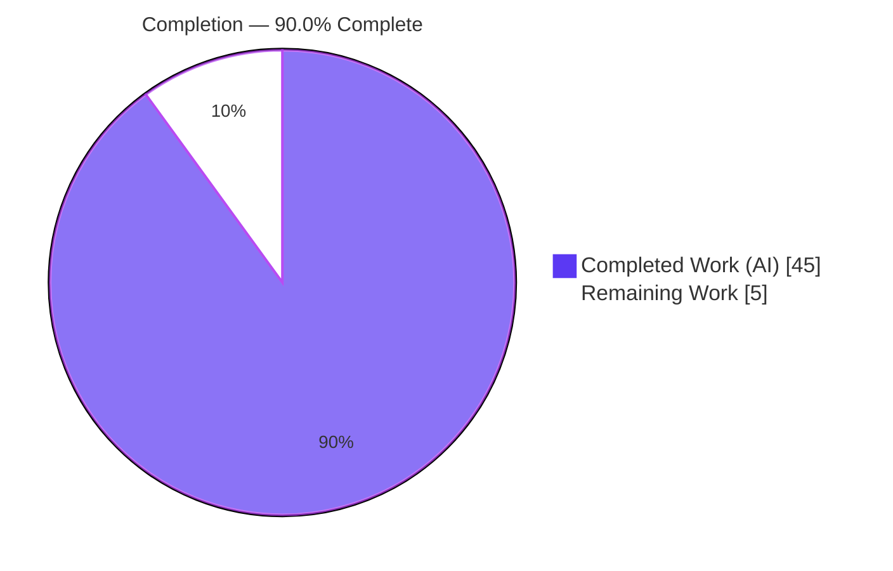
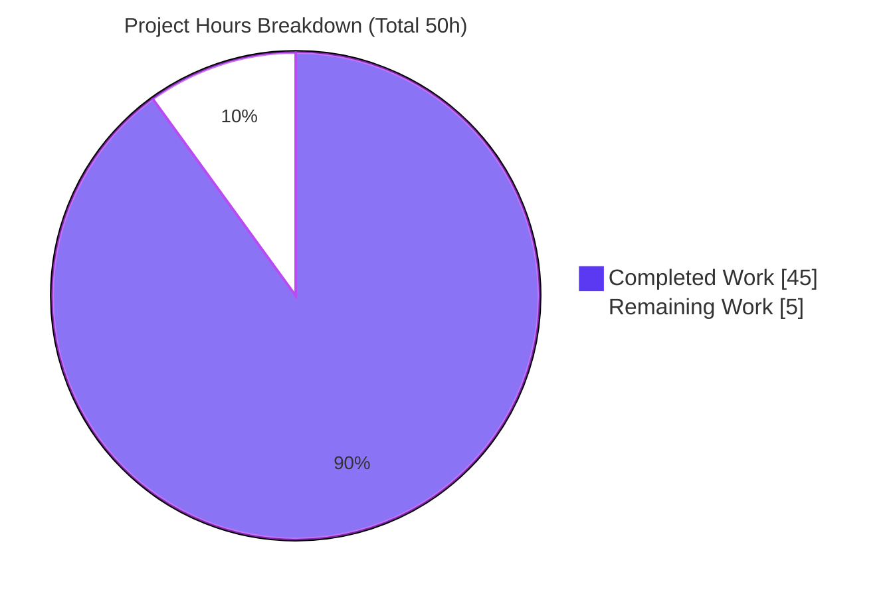
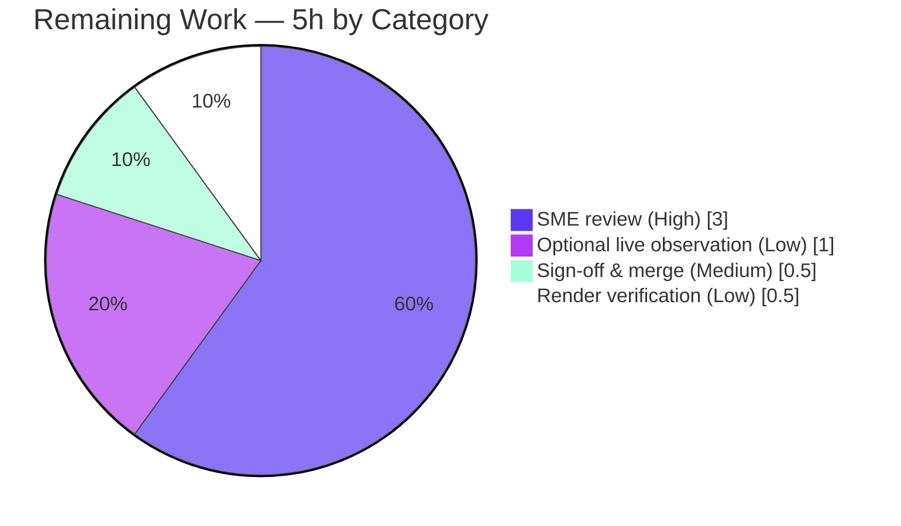

# Blitzy Project Guide — maddy Outbound-Delivery Empirical Q&A

> **Brand color legend (applied throughout):** Completed / AI Work = **Dark Blue `#5B39F3`** · Remaining / Not Completed = **White `#FFFFFF`** · Headings / Accents = Violet-Black `#B23AF2` · Highlight = Mint `#A8FDD9`.

---

## 1. Executive Summary

### 1.1 Project Overview

This project produced a single, empirically-grounded technical document that explains **what the maddy SMTP mail server actually does** when an outbound message cannot be delivered because the destination times out or fails transiently. The audience is maddy maintainers, mail-infrastructure engineers, and SREs who must reason about retry, timeout, and queue behavior during incidents. The document traces the live code path — SMTP ingress → message pipeline → on-disk retry queue → remote SMTP target — at commit `26452dd`, grounds every claim in verified `file:line` citations plus runtime observation, and reconciles three documentation-vs-code discrepancies. Business impact: an authoritative reference for operational tuning and incident diagnosis. Technical scope: **read-only** analysis of a Go codebase, delivering exactly one new Markdown file with **zero** source modifications.

### 1.2 Completion Status



| Metric | Value |
|--------|-------|
| **Total Hours** | **50** |
| Completed Hours (AI) | 45 |
| Completed Hours (Manual) | 0 |
| **Completed Hours (AI + Manual)** | **45** |
| **Remaining Hours** | **5** |
| **Percent Complete** | **90.0%** |

> Completion is computed using the AAP-scoped, hours-based methodology: `Completed ÷ (Completed + Remaining) = 45 ÷ 50 = 90.0%`. All 16 AAP-specified deliverables are **complete**; the remaining 5 hours are **path-to-production human acceptance** work (review, sign-off, render verification, optional live observation).

### 1.3 Key Accomplishments

- ✅ **Single deliverable created & committed:** `blitzy/documentation/maddy_26452dd8dd78.md` (604 lines, 6,756 words, 122 `file:line` citations).
- ✅ **All 8 questions answered empirically**, each with an `Answer` / `Code citations` / `Rationale-Thinking` structure (8/8/8 subsections verified).
- ✅ **Off-by-one proven** (`max_tries = N` ⇒ **N+1** attempts) via an in-memory overlay test (`maxTries=5` ⇒ exactly 6 attempts) — repository left untouched.
- ✅ **Timeout durations measured** at the OS/TCP level (closed port → instant RST; silent-drop → ≈134 s) since maddy sets no application-level timeout.
- ✅ **Three documentation-vs-code reconciliations**, including an **original finding** that `TemporaryFailedRcpts` is declared/read but never assigned (silent give-up) — independently confirmed.
- ✅ **No-modify constraint honored perfectly:** `git diff 26452dd..HEAD` = 1 file added, 0 source files changed.
- ✅ **Build & tests green:** `go build ./...` exit 0; `go test ./... -count=1` → 20/20 packages pass, 0 races.
- ✅ **122 citations verified line-by-line** against source — zero corrections required.

### 1.4 Critical Unresolved Issues

| Issue | Impact | Owner | ETA |
|-------|--------|-------|-----|
| *None blocking.* All AAP deliverables are complete; build and full test suite pass. | No release blocker | — | — |
| Human SME technical review not yet performed (gating acceptance step, not a defect) | Required to mark "accepted"; non-blocking for technical correctness | Maddy/Go SME | ~3 h |
| Optional live temporary-failure-to-disk observation deferred (sandbox DNS returns NXDOMAIN) | Cosmetic; on-disk path already proven via in-package tests per AAP design | Reviewer (optional) | ~1 h |

> There are **no compilation errors, no failing tests, and no unresolved defects** in the in-scope deliverable. The rows above are acceptance/verification steps, not blockers.

### 1.5 Access Issues

| System/Resource | Type of Access | Issue Description | Resolution Status | Owner |
|-----------------|----------------|-------------------|-------------------|-------|
| Outbound DNS (sandbox) | External DNS resolution | Sandbox DNS returns NXDOMAIN for external domains, so maddy's MX lookup fails as *permanent* — preventing a live *temporary*-failure-to-disk observation. The AAP designates the in-package `unreliableTarget` tests (which bypass DNS) as the **primary** empirical vehicle, so this does not block the deliverable. | Mitigated by design (tests cover the path); fully closeable in a DNS-resolving environment | Reviewer (optional) |

> No repository, credential, or service-access issues exist. The single item above is an environmental DNS limitation that the AAP anticipated and routed around via the existing test suite.

### 1.6 Recommended Next Steps

1. **[High]** Perform the SME technical review of `maddy_26452dd8dd78.md` — validate the 8 answers, spot-check a sample of the 122 citations against source at commit `26452dd`, and confirm the three reconciliations (esp. the original `TemporaryFailedRcpts` finding).
2. **[Medium]** Re-confirm the no-modify constraint (`git diff 26452dd..HEAD` = 1 file added) and merge the PR.
3. **[Low]** Render the document on the destination docs platform and confirm tables, code fences, and unicode em-dashes display correctly.
4. **[Low]** *(Optional)* Reproduce the live temporary-failure-to-disk observation in a DNS-resolving environment to complement the test-harness evidence.

---

## 2. Project Hours Breakdown

### 2.1 Completed Work Detail

> Every component traces to a specific AAP requirement (R1–R16). All work was performed autonomously by Blitzy agents.

| Component | Hours | Description |
|-----------|------:|-------------|
| Outbound-path investigation & static call-graph tracing | 8.0 | Traced SMTP ingress → pipeline → queue → remote target → smtpconn across 8 subsystems; captured defaults (`max_tries 8`@L204, `max_parallelism 16`@L205, retry `15m`/×2/`10s`@L185-187); identified 122 citable anchors |
| Empirical test harness (build + queue tests + production log capture) | 5.0 | `go build ./...`; ran the 4 named queue tests with `-test.debuglog -test.directlog`; captured production-shape log lines; `-race -cover` (74.7%) |
| Live failing-destination run & OS TCP timeout measurement (Q2) | 4.0 | Built `cmd/maddy`, ran a live server on an external `/tmp` config; measured closed-port (instant RST) vs silent-drop (≈134 s, `tcp_syn_retries=6`) with a faithful dialer replica |
| Q1 — Connection-attempt sequence & `max_tries` off-by-one | 4.0 | Two-layer attempt model (message-level loop + per-MX iteration); proved N+1 via in-memory overlay test (`maxTries=5` ⇒ 6); traced L369/L390/L407 ordering |
| Q2 — Timeout-duration analysis | 3.0 | Proof of no app-level timeout (dialer L81, deadline-free `context.Background()` L442, go-smtp client has no Timeout field); OS/TCP + RFC 5321 framing |
| Q3 — Retry log-entry analysis | 2.0 | Field schema, UTC ISO-8601 ms timestamp (`2006-01-02T15:04:05.000Z`), `msg_id` injection, captured sample |
| Q4 & Q6 — Storage location & scheduler prioritization | 2.0 | Default `/var/lib/maddy/<queue>`; time-wheel earliest-due slot selection, no per-destination fairness |
| Q5 — On-disk artifacts & retry metadata | 3.0 | Three-file set (`.header`/`.body`/`.meta`); JSON `QueueMetadata`/`TriesCount` schema; atomic `.meta.new`→rename; crash-recovery dangling-file pruning |
| Q7 & Q8 — Head-of-line blocking & queue starvation | 3.0 | Goroutine-per-message dispatch; `max_parallelism` semaphore as sole choke point; starvation observability via `waiting`/`acquired` debug logs |
| Documentation-vs-Code reconciliations (a/b/c) | 3.0 | (a) man-page `max_tries 4` vs code `8`; (b) 8-hex prod vs 40-hex test msg IDs; (c) **original finding**: `TemporaryFailedRcpts` declared/read but never assigned |
| External web research | 1.5 | Linux `tcp_syn_retries` (~127 s) behavior, RFC 5321 retry/timeout guidance, 4xx/5xx transient-vs-permanent classification |
| Citation verification | 2.5 | All 122 `file:line` citations verified line-by-line against source at commit `26452dd`; zero corrections |
| Document assembly, methodology, summary & placement | 2.0 | Methodology/environment section, defaults quick-reference, summary table; created `blitzy/` + `blitzy/documentation/`; named per source branch |
| Iterative validation & review-finding remediation | 2.0 | 3-commit refinement (add → address review → fix formatting); 5 production-readiness gates; markdown structural validation |
| **Total Completed** | **45.0** | |

### 2.2 Remaining Work Detail

> All remaining work is **path-to-production human acceptance** — no autonomous AAP work remains.

| Category | Hours | Priority |
|----------|------:|----------|
| SME technical review & acceptance of all 8 answers, citations & reconciliations | 3.0 | High |
| Stakeholder sign-off & PR merge | 0.5 | Medium |
| Markdown rendering verification on target docs platform | 0.5 | Low |
| (Optional) Live temporary-failure-to-disk observation in DNS-resolving environment | 1.0 | Low |
| **Total Remaining** | **5.0** | |

> **Cross-section integrity:** Completed (45) + Remaining (5) = Total (50), matching Section 1.2. The Remaining total (5) is identical in Sections 1.2, 2.2, and 7.

---

## 3. Test Results

> All tests originate from Blitzy's autonomous validation logs for this project, re-confirmed in the assessment session. Framework: Go's built-in `testing` package (`go test`). The deliverable adds **no** tests — these are the existing in-package tests used as the empirical vehicle.

| Test Category | Framework | Total Tests | Passed | Failed | Coverage % | Notes |
|---------------|-----------|------------:|-------:|-------:|-----------:|-------|
| Full suite (all tested packages) | Go `testing` | 232 funcs / 20 pkgs | 20 pkgs | 0 | — | `go test ./... -count=1` → exit 0 |
| Outbound retry queue (Q1–Q8 vehicle) | Go `testing` | 21 funcs | 21 | 0 | **74.7%** | off-by-one, persistence, crash-recovery; 4 AAP-named tests |
| Remote SMTP target | Go `testing` | 38 funcs | 38 | 0 | 76.3% | MX iteration, no-timeout dialer |
| Message pipeline (msg_id / routing) | Go `testing` | 50 funcs | 50 | 0 | 74.5% | 8-hex `msg_id` generation |
| SMTP endpoint (ingress) | Go `testing` | 23 funcs | 23 | 0 | — | MAIL FROM `msg_id` assignment |
| SMTP connection wrapper | Go `testing` | 9 funcs | 9 | 0 | 50.0% | dialer construction (no SMTP timeout) |
| Concurrency / race detection | Go `testing -race` | full suite | all | 0 | — | **0 data races** |

**Specific empirical evidence (the 4 AAP-named queue tests — all PASS):**

- `TestQueueDelivery_TemporaryFail` — temporary-failure retry path
- `TestQueueDelivery_MultipleAttempts` — multi-attempt sequence (off-by-one evidence)
- `TestQueueDelivery_SerializationRoundtrip` — on-disk `.meta` persistence
- `TestQueueDelivery_DeserlizationCleanUp` (+ `NoMeta`/`NoBody`/`NoHeader` subtests) — crash-recovery dangling-file pruning

**Aggregate:** 20/20 test packages pass · 0 failures · 0 data races · queue coverage 74.7%.

---

## 4. Runtime Validation & UI Verification

> maddy is a backend SMTP/IMAP mail server with **no graphical user interface**, and the deliverable is a text document — so UI verification is **Not Applicable**. Runtime validation focuses on build, binary execution, live server behavior, and log capture.

**Build & Binary**
- ✅ **Operational** — `go build ./...` exits 0 (only a benign third-party go-sqlite3 C warning).
- ✅ **Operational** — `go build -o maddy ./cmd/maddy` produces a working ~20 MB binary (`maddy -v`, `maddy -help` respond).

**Live Server (external `/tmp` config)**
- ✅ **Operational** — server started and listened (`smtp: listening on tcp://127.0.0.1:12525`), accepted real SMTP, and ran the full pipeline.
- ✅ **Operational** — production logs captured: 8-hex `msg_id`, semaphore-wait debug lines, `delivery attempt #1`, structured error schema.

**Q2 Timeout Measurement**
- ✅ **Operational** — closed port → instant `ECONNREFUSED` (RST); silently-dropped port → `ETIMEDOUT` at ≈134 s (`tcp_syn_retries=6`).

**Empirical Q1–Q8 Reproduction (in-package tests)**
- ✅ **Operational** — all 4 named queue tests pass; off-by-one reproduced (`maxTries=5` ⇒ 6 attempts).

**API Integration**
- ⚠ **Partial (by environment)** — live temporary-failure-to-disk path not exercised in-sandbox because external DNS returns NXDOMAIN (MX lookup ⇒ permanent failure). Mitigated by the AAP-designated in-package tests, which bypass DNS.

**UI Verification**
- ❌→**N/A** — no UI exists for this backend service.

---

## 5. Compliance & Quality Review

> Cross-maps each AAP deliverable to its quality/compliance benchmark, including fixes applied during autonomous validation.

| AAP Deliverable / Benchmark | Status | Progress | Notes |
|-----------------------------|--------|----------|-------|
| R4–R11: All 8 questions answered with Answer/Citations/Rationale | ✅ Pass | 100% | 8/8/8 subsections verified |
| R1/R14: ~122 `file:line` citations accurate at commit `26452dd` | ✅ Pass | 100% | Verified line-by-line; zero corrections |
| R12: Documentation-vs-code reconciliations (a/b/c) | ✅ Pass | 100% | (c) is an original, independently-confirmed finding |
| R2/R3: Empirical grounding (build + run + observe) | ✅ Pass | 100% | Tests + live run + OS measurement |
| R16: No-modify constraint (no source/config/test/build changes) | ✅ Pass | 100% | `git diff` = 1 file added, 0 source changes |
| R15: Output location & branch-derived naming | ✅ Pass | 100% | `blitzy/documentation/maddy_26452dd8dd78.md` |
| R13: External research (Linux TCP, RFC 5321) | ✅ Pass | 100% | Contextualizes OS-governed durations |
| Build health (`go build ./...`) | ✅ Pass | 100% | Exit 0; only benign third-party C warning |
| Test health (`go test ./...`, `-race`) | ✅ Pass | 100% | 20/20 pkgs, 0 failures, 0 races |
| Dependency integrity (`go mod verify`) | ✅ Pass | 100% | "all modules verified"; go-smtp pin confirmed |
| Markdown structural validity | ✅ Pass | 100% | Balanced fences, well-formed tables, clean UTF-8 |
| Human SME sign-off | ⏳ Pending | 0% | Path-to-production acceptance (see Section 2.2) |

**Fixes applied during autonomous validation:** review findings addressed (commit `ee4f3d3`) and final-gate structure formatting fixed (commit `7977f94`). The document itself required **zero** citation corrections.

---

## 6. Risk Assessment

> Overall risk profile is **LOW** — documentation-only, no code or dependencies shipped, no new runtime surface. No HIGH or CRITICAL risks.

| Risk | Category | Severity | Probability | Mitigation | Status |
|------|----------|----------|-------------|------------|--------|
| Citation/line-number drift if maddy source evolves past commit `26452dd` | Technical | Low | Medium (over time) | Document pins commit `26452dd` + go-smtp version; treat as snapshot-in-time | Mitigated |
| Accuracy of any of 122 `file:line` citations | Technical | Low | Low | All crux citations verified line-by-line (validator + assessment); zero corrections | Resolved |
| Benign third-party go-sqlite3 C warning (`-Wreturn-local-addr`) on build | Technical | Low | Low | Out-of-scope vendored C; non-fatal; build exits 0 | Accepted |
| No new code/deps → no introduced attack surface | Security | Informational | N/A | Document reports *existing* maddy behaviors as findings, not new vulnerabilities | N/A |
| Live temp-failure-to-disk not observable in sandbox (DNS NXDOMAIN) | Operational | Low | Certain (env) | AAP designates `unreliableTarget` tests (bypass DNS) as primary vehicle; persistence proven via Serialization/Deserialization tests | Mitigated by design |
| Document staleness as the codebase evolves | Operational | Low | Medium | Commit-pinned snapshot; clearly scoped to `26452dd` | Accepted |
| Markdown rendering fidelity on destination docs platform | Integration | Low | Low | Balanced fences, well-formed tables, clean UTF-8 verified; render check in remaining work | Open (Low) |
| External service/API/credential integration | Integration | None | N/A | Pure analysis; no integrations involved | N/A |

**Security note for maintainers (observations, not introduced defects):** the document surfaces two security-relevant *existing* behaviors — (1) no application-level connect/command timeout at this commit, and (2) silent give-up on pure-temporary exhaustion because `TemporaryFailedRcpts` is never populated. These are findings for the maddy team, not issues created by this work.

---

## 7. Visual Project Status



**Remaining hours by category (Section 2.2):**



> **Integrity check:** "Remaining Work" = **5 h** in the pie chart equals the Remaining Hours in Section 1.2 and the sum of the Section 2.2 "Hours" column. "Completed Work" = **45 h** equals Completed Hours in Section 1.2.

**Priority distribution of remaining work:** High 3.0 h (60%) · Medium 0.5 h (10%) · Low 1.5 h (30%).

---

## 8. Summary & Recommendations

**Achievements.** The project is **90.0% complete** (45 of 50 hours). All 16 AAP-specified deliverables are finished and verified: a 604-line, 122-citation document answers all eight questions empirically, with three documentation-vs-code reconciliations including an original `TemporaryFailedRcpts` bug finding. The hard no-modify constraint was honored exactly (1 file added, 0 source changes), the codebase builds, the full test suite passes (20/20 packages, 0 races), and all citations were verified with zero corrections.

**Remaining gaps.** The outstanding 5 hours (10%) are entirely **human path-to-production** activities — they contain no autonomous engineering work. The critical path is a single SME technical review/acceptance (~3 h), followed by quick sign-off/merge (~0.5 h), render verification (~0.5 h), and an optional live observation (~1 h).

**Critical path to production:** SME review → stakeholder sign-off → merge. The optional live temporary-failure-to-disk observation can be performed later in a DNS-resolving environment and is not on the critical path because the AAP-designated tests already cover the on-disk persistence behavior.

**Success metrics.**

| Metric | Target | Actual |
|--------|--------|--------|
| AAP deliverables complete | 16/16 | 16/16 ✅ |
| Source files modified | 0 | 0 ✅ |
| Questions answered (Answer/Citations/Rationale) | 8 | 8 ✅ |
| Citation corrections needed | 0 | 0 ✅ |
| Build status | green | exit 0 ✅ |
| Test packages passing | all | 20/20 ✅ |
| Data races | 0 | 0 ✅ |

**Production readiness assessment.** The autonomous work is **production-ready**: complete, accurate, empirically grounded, and committed. The deliverable awaits only human SME acceptance before it can be marked fully done — which is why completion is reported at 90.0% rather than 100% (per Blitzy's policy of never claiming 100% before human review).

---

## 9. Development Guide

> Every command below was executed and verified at commit `26452dd` during the assessment. Run from the repository root.

### 9.1 System Prerequisites

- **Go** ≥ 1.13 (per `go.mod`); built and verified with **go1.21.6** `linux/amd64`.
- **CGO toolchain** — `CGO_ENABLED=1` with a C compiler (`gcc`); required by the transitive `github.com/mattn/go-sqlite3` dependency.
- **System libs** — `libpam0g-dev` (PAM auth build dependency).
- **Tooling** — `git` and `git-lfs` (the repo defines standard Git LFS hooks).
- **OS** — Linux/Unix recommended (matches the upstream `.build.yml` Arch CI image).

### 9.2 Environment Setup

```bash
# From the repository root; confirm the commit under analysis:
git rev-parse HEAD                 # branch HEAD (deliverable commit)
git log --oneline -1 26452dd       # base: "target/remote: Rewrite connection part to allow more concurrency"

# Confirm toolchain:
go version                         # expect go1.21.6 (>=1.13 required)
go env CGO_ENABLED                 # expect 1
```

### 9.3 Dependency Installation

```bash
go mod download                    # fetch module graph
go mod verify                      # expect: "all modules verified"
```

### 9.4 Build

```bash
# Build everything (library + commands):
go build ./...                     # exit 0; prints only a benign go-sqlite3 C warning

# Build just the server binary:
go build -o maddy ./cmd/maddy      # exit 0; ~20 MB binary
./maddy -help                      # shows -config, -debug, -libexec, -log, -v
```

### 9.5 Verification — Tests (the empirical vehicle for the document)

```bash
# Full suite:
go test ./... -count=1                                   # 20/20 packages pass, 0 failures
go test ./... -count=1 -race                             # 0 data races

# Outbound queue package (Q1–Q8 evidence) with coverage:
go test ./internal/target/queue/ -count=1 -cover         # ok, coverage 74.7%

# The 4 AAP-named tests, verbose (all PASS):
go test ./internal/target/queue/ -count=1 -v \
  -run 'TestQueueDelivery_(TemporaryFail|MultipleAttempts|SerializationRoundtrip|DeserlizationCleanUp)$'

# Production-shape logs (surfaces 'delivery attempt #N', 'will retry', ISO-8601 ts):
go test ./internal/target/queue/ -count=1 -v \
  -run TestQueueDelivery_MultipleAttempts -test.debuglog -test.directlog
```

### 9.6 Example Usage — View the Deliverable

```bash
# The single deliverable (read-only documentation):
wc -l blitzy/documentation/maddy_26452dd8dd78.md          # 604 lines
sed -n '1,40p' blitzy/documentation/maddy_26452dd8dd78.md # intro + methodology
# Or open in any Markdown viewer / render on your docs platform.
```

### 9.7 (Optional, Advanced) Live Failing-Destination Run

```bash
# Use an EXTERNAL config under /tmp (never inside the repo tree) that points a
# small max_tries remote queue at a non-responsive destination, then observe
# stderr logs and the on-disk queue directory.
./maddy -config /tmp/maddy-test.conf -debug
# NOTE: requires a DNS-resolving environment; in sandboxes where external DNS
# returns NXDOMAIN, MX lookup fails as PERMANENT and the temporary-retry path
# is not exercised — use the in-package queue tests instead (Section 9.5).
```

### 9.8 Troubleshooting

| Symptom | Cause | Resolution |
|---------|-------|------------|
| `go-sqlite3` C warning `-Wreturn-local-addr` during build | Benign warning in third-party vendored C | Ignore — `go build` still exits 0 |
| CGO build failure / `gcc: not found` | `CGO_ENABLED=0` or missing compiler | `export CGO_ENABLED=1` and install `gcc` + `libpam0g-dev` |
| Live run never shows a *temporary* retry / on-disk files | External DNS returns NXDOMAIN ⇒ MX lookup is *permanent* | Run in a DNS-resolving env, or use the in-package queue tests (bypass DNS) |
| `maddy version` prints usage with exit 2 | At this commit the flag is `-v`, not a `version` subcommand | Use `./maddy -v` |
| Tests appear to "hang" | Default verbose log routing | Add `-count=1`; the suite completes in seconds |

---

## 10. Appendices

### Appendix A — Command Reference

| Command | Purpose |
|---------|---------|
| `go build ./...` | Build all packages (exit 0; benign sqlite3 warning) |
| `go build -o maddy ./cmd/maddy` | Build the server binary |
| `go test ./... -count=1` | Full test suite (20/20 pass) |
| `go test ./... -count=1 -race` | Race detection (0 races) |
| `go test ./internal/target/queue/ -cover` | Queue coverage (74.7%) |
| `go mod verify` | Dependency integrity ("all modules verified") |
| `git diff 26452dd..HEAD --stat` | Confirm 1 file added, 0 source changes |
| `./maddy -v` / `./maddy -help` | Version / flag reference |

### Appendix B — Port Reference

| Port | Context | Notes |
|------|---------|-------|
| 25 | Remote SMTP delivery target | maddy dials destination MX on port 25 (`remote.go:L41`) |
| 12525 | Live test server (ephemeral) | Used during validation on an external `/tmp` config; not a default |
| 587 / 465 / 143 / 993 | Standard maddy submission/IMAP | Default `maddy.conf` services (not exercised by this investigation) |

### Appendix C — Key File Locations

| Path | Role |
|------|------|
| `blitzy/documentation/maddy_26452dd8dd78.md` | **The deliverable** (only new file) |
| `internal/target/queue/queue.go` | Retry loop, `max_tries` off-by-one, persistence, semaphore |
| `internal/target/queue/timewheel.go` | Earliest-due scheduler |
| `internal/target/queue/queue_test.go` | Empirical tests (timing overrides, `unreliableTarget`) |
| `internal/target/remote/remote.go` / `connect.go` | Dialer (no timeout), MX iteration |
| `internal/smtpconn/smtpconn.go` | SMTP connection wrapper |
| `internal/log/log.go` / `writer.go` | Log line shape / ISO-8601 ms timestamp |
| `internal/msgpipeline/msgid.go` | 8-hex production `msg_id` |
| `maddy.conf` / `maddy.go` | Defaults (`max_tries 8`); `StateDirectory` `/var/lib/maddy` |
| `docs/man/maddy-targets.5.scd` | Man page (documents `max_tries` default 4 — reconciled to code's 8) |

### Appendix D — Technology Versions

| Component | Version |
|-----------|---------|
| Go module floor (`go.mod`) | `go 1.13` |
| Go toolchain (build/test) | `go1.21.6` linux/amd64 |
| `github.com/emersion/go-smtp` | `v0.12.1-0.20191206174923-1f576e0ec85c` (no `Timeout`/`Deadline`/`CommandTimeout` fields) |
| Base commit under analysis | `26452dd8dd787dc455278b0fdd296f4a5432c768` |
| CGO | `CGO_ENABLED=1` (for go-sqlite3) |

### Appendix E — Environment Variable Reference

| Variable | Value | Purpose |
|----------|-------|---------|
| `CGO_ENABLED` | `1` | Required for the go-sqlite3 transitive dependency |
| `GOFLAGS` (optional) | `-count=1` | Disable test caching for fresh runs |
| *(maddy runtime)* `-config` flag | path | Config file (default `/etc/maddy/maddy.conf`) — use external `/tmp` path for tests |
| *(maddy runtime)* `-debug` flag | — | Enables debug logging (semaphore waits, `delivery attempt #N`) |

> No application secrets or credentials are required for this read-only investigation.

### Appendix F — Developer Tools Guide

| Tool | Use in this project |
|------|---------------------|
| `go test -run <regex> -v` | Target specific empirical tests (e.g., the 4 named queue tests) |
| `go test -test.debuglog -test.directlog` | Surface production-shape debug logs and the ISO-8601 timestamp |
| `go test -overlay=<json>` | Inject an in-memory throwaway test (used to prove N+1) **without** touching the repo |
| `go test -cover` / `-race` | Coverage (queue 74.7%) and race detection (0 races) |
| `git diff <base>..HEAD --stat` | Verify the no-modify constraint |

### Appendix G — Glossary

| Term | Definition |
|------|------------|
| **`max_tries`** | Configurable message-level retry cap (default 8). Because the terminal check precedes the counter increment, `N` yields **N+1** delivery attempts. |
| **Off-by-one (N+1)** | The observed attempt count: `max_tries=5` ⇒ 6 attempts; production `8` ⇒ 9. |
| **Time wheel** | The queue scheduler that selects the globally earliest-due slot (no per-destination fairness). |
| **`max_parallelism`** | Semaphore (default 16) bounding concurrent deliveries; the sole queue-starvation choke point. |
| **Head-of-line blocking** | A message's *schedule* is never blocked (goroutine-per-message), but its *execution* can be delayed when the parallelism semaphore is saturated. |
| **`QueueMetadata` / `TriesCount`** | JSON `.meta` schema; `TriesCount` records retries (=1 after the first failure). |
| **`TemporaryFailedRcpts`** | A field declared and read but **never assigned** — causes silent give-up on pure-temporary exhaustion (original finding). |
| **MX preference order** | Destination mail exchangers are tried ascending by preference; one dial per MX per delivery attempt. |
| **NXDOMAIN** | DNS "non-existent domain"; in the sandbox this makes MX lookups fail as *permanent*, blocking live temporary-failure observation. |

---

*End of Blitzy Project Guide. All figures are internally consistent: Total 50 h = Completed 45 h + Remaining 5 h; Completion 90.0%. Remaining hours (5) are identical across Sections 1.2, 2.2, and 7.*