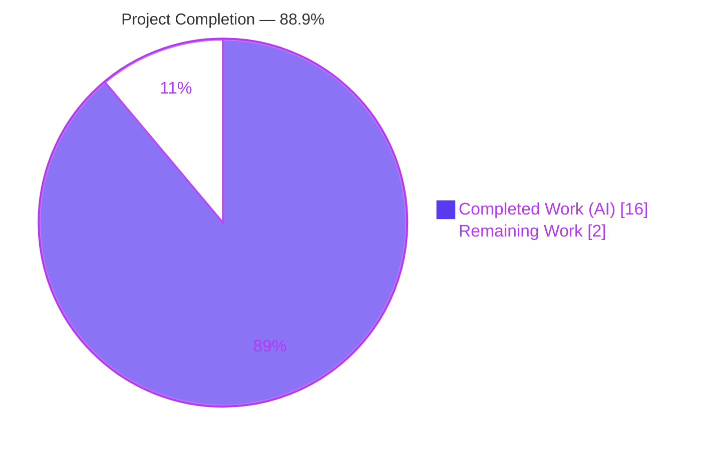
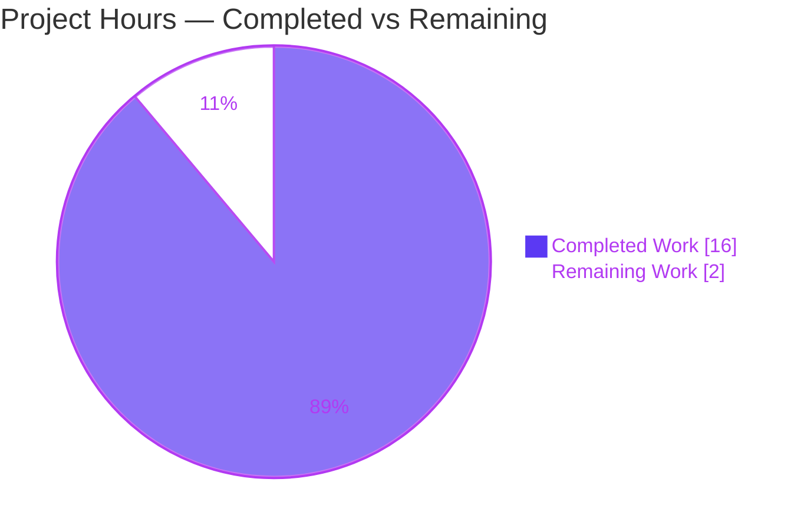
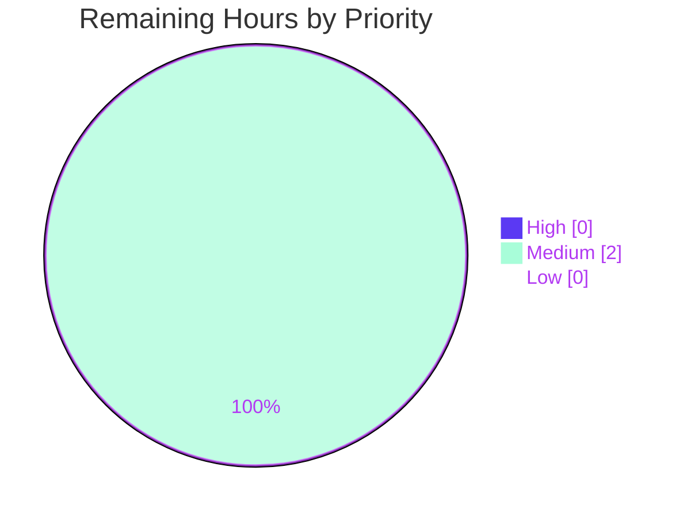

# Blitzy Project Guide — maddy Runtime Behavior Q&A Documentation

> **Deliverable:** `blitzy/documentation/maddy_26452dd8dd78.md` — an observation-grounded onboarding Q&A explaining maddy's SMTP-endpoint, delivery-queue, and remote-delivery runtime behavior.
> **Task type:** Documentation-only (rule set `SWE-AtlasQnA-Repo`). The maddy Go source tree is **strictly read-only**.
> **Brand legend:** <span style="color:#5B39F3">■ Completed / AI Work — Dark Blue `#5B39F3`</span> · <span>□ Remaining / Not Completed — White `#FFFFFF`</span>

---

## 1. Executive Summary

### 1.1 Project Overview

This project delivers a single onboarding document that explains, from **observed runtime behavior**, how the maddy mail server logs and reports errors across three subsystems: the **SMTP endpoint** (`internal/endpoint/smtp`), the **delivery queue** (`internal/target/queue`), and the **remote-delivery target** (`internal/target/remote`). The audience is engineers onboarding to maddy who need authoritative, evidence-backed answers about log-line formats, JSON field names, `msg_id` semantics, MX-authentication errors, SMTP enhanced status codes, and retry scheduling. Following the mandated "run first, then write" method, maddy was built and its test suites executed with structured logging enabled; every behavioral claim in the document is paired with a verbatim captured log line and an exact `file:line` citation. The technical scope is deliberately narrow — one new Markdown file, zero source changes.

### 1.2 Completion Status



| Metric | Hours |
|---|---|
| **Total Hours** | **18.0** |
| **Completed Hours** (AI + Manual) | **16.0** |
| &nbsp;&nbsp;• AI (autonomous) | 16.0 |
| &nbsp;&nbsp;• Manual (human) | 0.0 |
| **Remaining Hours** | **2.0** |
| **Percent Complete** | **88.9%** |

> **Completion formula (PA1, AAP-scoped):** `Completed ÷ (Completed + Remaining) = 16 ÷ (16 + 2) = 16 ÷ 18 = 88.9%`. The remaining 2 hours are human path-to-production only (review + merge); there is **no** engineering rework.

### 1.3 Key Accomplishments

- ✅ **Deliverable authored and committed** — `blitzy/documentation/maddy_26452dd8dd78.md` (395 lines), the single required artifact, named after the source branch.
- ✅ **"Run first, then write" satisfied** — maddy built with `CGO_ENABLED=1 go build ./...` (exit 0) and all three target suites executed with `-v -test.debuglog -count=1`.
- ✅ **Every question group answered with verbatim evidence** — Q1 (SMTP), Q2 (queue trace), Q3 (remote MX-auth + TLS fallback), Q4 (retry scheduling), each with a captured log line.
- ✅ **109 `file:line` citations** grounding every claim; 18 primary citations independently verified exact on-disk.
- ✅ **Three canonical-vs-non-canonical reconciliations documented** — random SMTP `msg_id` vs. deterministic SHA-1 test IDs; test near-zero retry delays vs. production `15m × 2^(n−1)`; intrinsic `5.7.0` vs. surfaced `5.4.0`.
- ✅ **Latent upstream quirks reported (not fixed)** per AAP §0.5.2 — the literal `estabilish` typo and the `SMTPEnchCode` class-digit forcing.
- ✅ **Read-only integrity preserved** — diff vs. base is exactly 1 file added, 395 insertions, **0** source changes; working tree clean.
- ✅ **Full regression green** — `go test ./...` → 20/20 packages pass, 0 fail.

### 1.4 Critical Unresolved Issues

| Issue | Impact | Owner | ETA |
|---|---|---|---|
| _None._ Build is clean, all tests pass, and the deliverable is verified and committed. No issue blocks release. | — | — | — |

### 1.5 Access Issues

| System / Resource | Type of Access | Issue Description | Resolution Status | Owner |
|---|---|---|---|---|
| _No access issues identified._ The task uses only the local repository and toolchain; the Go module cache is populated and `go mod verify` reports "all modules verified". | — | — | Resolved | — |

> **No access issues identified.** No repository permissions, service credentials, or third-party API access are required for this documentation deliverable.

### 1.6 Recommended Next Steps

1. **[Medium]** Have a maddy-familiar engineer review `blitzy/documentation/maddy_26452dd8dd78.md` for technical accuracy and onboarding usefulness (~1h).
2. **[Medium]** Approve the pull request and merge the deliverable to the target branch, confirming read-only integrity (only the `.md` is added) (~1h).
3. **[Low / advisory]** Establish a lightweight refresh cadence: if the cited maddy source paths change upstream, re-run the three observation suites and update the document (0h, outside AAP scope).

---

## 2. Project Hours Breakdown

### 2.1 Completed Work Detail

| Component | Hours | Description |
|---|---|---|
| Build environment & default-config compilation | 2.0 | Go 1.22.12 + gcc (cgo) + PAM toolchain; first-time dependency resolution; `CGO_ENABLED=1 go build ./...` verified (exit 0). |
| Q1 — SMTP endpoint investigation & write-up | 3.0 | Ran `TestSMTPDelivery` / `_AbortData` / `_AbortLogout`; captured & traced `RCPT ok`, `accepted`, `DATA error`, `aborted`; confirmed module name `smtp` and 8-hex `msg_id`. |
| Q2 — Queue message-trace investigation & write-up | 2.0 | Ran the three queue tests; captured the complete ordered lifecycle (accept → attempt → delivered/failed → will retry → terminal) and traced each line. |
| Q3 — Remote MX-auth + TLS-fallback investigation & write-up | 3.0 | Ran the three remote tests; captured MX-auth error, enhanced-code reconciliation (`5.7.0`→`5.4.0`), reply text, and TLS-fallback log fields. |
| Q4 — Queue retry-scheduling investigation & write-up | 1.0 | Identified `next_try_delay`; documented the observed value and the production formula/defaults (15m, ×2, max 8). |
| Canonical-vs-non-canonical reconciliations | 1.0 | Deep analysis of the three nuances (`msg_id`, retry delay, enhanced code) with both forms labeled and explained. |
| Document assembly & formatting | 2.0 | 395-line Markdown; one-claim-one-evidence structure; 109 citations; verbatim code fences; final coverage pass. |
| Autonomous validation & verification | 2.0 | Verified 18 primary citations on-disk; 6 reruns to characterize non-determinism; byte-for-byte checks; +2-line additive fix; commit; read-only integrity check. |
| **Total Completed** | **16.0** | |

### 2.2 Remaining Work Detail

| Category | Hours | Priority |
|---|---|---|
| Human technical review of the Q&A document (accuracy + onboarding usefulness; optional spot-check via documented commands) | 1.0 | Medium |
| PR approval & merge to target branch (verify read-only integrity) | 1.0 | Medium |
| **Total Remaining** | **2.0** | |

### 2.3 Hours Methodology & Reconciliation

- **Basis (PA1/PA2):** hours estimate the focused senior-engineer effort to build, observe, trace, author, and validate. Scope is the AAP deliverable + its "run-first" grounding + path-to-production (human review/merge). No items outside AAP scope are included.
- **Reconciliation:** Section 2.1 total (**16.0**) + Section 2.2 total (**2.0**) = **18.0** = Total Hours in §1.2. Remaining (**2.0**) is identical in §1.2, §2.2, and the §7 pie chart.
- **Confidence:** **High** — the deliverable and its validation are complete and independently reproduced; the only variable is human review depth, bounded at ~1–2h for a 395-line doc.

---

## 3. Test Results

All tests below originate from Blitzy's autonomous validation logs and were **independently reproduced** in this session (`CGO_ENABLED=1`, Go 1.22.12).

| Test Category | Framework | Total Tests | Passed | Failed | Coverage % | Notes |
|---|---|---|---|---|---|---|
| Q1 SMTP-endpoint observation (targeted) | Go `testing` | 3 | 3 | 0 | 79.4% (pkg) | `TestSMTPDelivery`, `TestSMTPDelivery_AbortData`, `TestSMTPDelivery_AbortLogout` — emit `smtp:` log lines. |
| Q2/Q4 queue-delivery observation (targeted) | Go `testing` | 3 | 3 | 0 | 74.7% (pkg) | `TestQueueDelivery`, `_TemporaryFail`, `_MultipleAttempts` — emit `queue:` trace incl. `next_try_delay`. |
| Q3 remote-delivery observation (targeted) | Go `testing` | 3 | 3 | 0 | 76.3% (pkg) | `TestRemoteDelivery_AuthMX_Fail`, `_MTASTS_SkipNonMatching`, `_TLSErrFallback`. |
| Full regression (all packages) | Go `testing` | 20 pkgs | 20 pkgs | 0 | — | `go test ./...` → exit 0; 26 packages with no test files. |
| Target-package suites (full, not just targeted) | Go `testing` | 82 funcs | 82 funcs | 0 | 74–79% | 23 (smtp) + 21 (queue) + 38 (remote) test functions all pass. |

**Summary:** 9/9 targeted observation subtests pass; 82/82 test functions in the three target packages pass; 20/20 packages pass in full regression with **0 failures**. Debug JSON fields required `-v -test.debuglog -count=1` (the test logger gates debug output behind these flags — `internal/testutils/logger.go:14-40`).

---

## 4. Runtime Validation & UI Verification

This is a mail-server codebase plus a documentation deliverable; there is **no web UI or HTTP API surface** in scope. "Runtime validation" here means the build health and the observable runtime log output that grounds the document.

- ✅ **Build (default configuration):** `CGO_ENABLED=1 go build ./...` → **exit 0**. Only output is a benign `go-sqlite3` `-Wreturn-local-addr` C warning (upstream dependency; non-blocking).
- ✅ **SMTP endpoint runtime logs:** observed `smtp: incoming message`, `smtp: RCPT ok {"msg_id","rcpt"}`, `smtp: accepted {"msg_id"}`, `smtp: DATA error {"msg_id","reason"}`, `smtp: aborted {"msg_id"}` — module prefix `smtp`, 8-hex `msg_id`.
- ✅ **Queue delivery runtime logs:** observed full ordered lifecycle with `[debug]` prefix; `queue: will retry` carries `next_try_delay`.
- ✅ **Remote delivery runtime logs:** observed MX-auth error with literal `estabilish`, `smtp_enchcode:[5 4 0]` (surfaced `5.4.0`), `No usable MXs, last err: …`, and `remote: TLS error, falling back to plaintext {"domain","msg_id","mx","reason"}`.
- ✅ **Deterministic values matched:** SHA-1-of-test-name `msg_id`s (`cab2c2f3…`, `af8090c7…`, `10a443bb…`, `2176ec58…`) reproduce exactly.
- ⚠ **Non-reproducible-by-design values:** random SMTP `msg_id` and near-zero-negative `next_try_delay` vary per run — **disclosed** in the document with canonical production forms stated (expected, not a defect).
- ✅ **Read-only runtime integrity:** `git status` clean; source tree byte-for-byte unchanged.

---

## 5. Compliance & Quality Review

Mapping of AAP deliverables and governing rules (`SWE-AtlasQnA-Repo`) to their compliance status. Fixes applied during autonomous validation are noted.

| Benchmark / Rule (AAP) | Requirement | Status | Evidence / Notes |
|---|---|---|---|
| Deliverable location & name | `blitzy/documentation/<branch>.md` | ✅ Pass | `blitzy/documentation/maddy_26452dd8dd78.md` created (395 lines). |
| Run first, then write | Build + run tests, capture real output before writing | ✅ Pass | Build exit 0; 3 suites run with `-v -test.debuglog -count=1`. |
| Quote observed output verbatim | Exact log lines / error strings | ✅ Pass | Code fences reproduce output byte-for-byte (incl. TABs). |
| One claim, one evidence | Each behavioral statement paired with one observed line | ✅ Pass | Structure enforced; inferred-only statements labeled "(inferred)" (7×). |
| Exact literals + `file:line` | Cite every requested value | ✅ Pass | 109 citations; 18 primary verified exact on-disk. |
| Canonical vs. non-canonical | Label test artifacts; state canonical form | ✅ Pass | 3 reconciliations (`msg_id`, retry delay, enhanced code); "canonical" used 24×. |
| Answer every named item + coverage pass | Address each sub-item; final completeness check | ✅ Pass | Explicit coverage pass (doc L376–395) with per-item checkboxes. |
| Report exactly what is observed | No silent correction of quirks | ✅ Pass | Literal `estabilish` typo and surfaced `5.4.0` reported, not corrected (per §0.5.2). |
| Read-only source | No source file modified/added (except the doc, outside the tree) | ✅ Pass | Diff vs. base = 1 file added, 0 source changes; temp artifacts kept in `/tmp` outside repo. |
| No dependency changes | `go.mod`/`go.sum` untouched | ✅ Pass | `go mod verify` → "all modules verified"; no manifest diff. |
| Determinism / cache-free | `-count=1`; confirm stability across ≥2 runs | ✅ Pass | Format stability confirmed; non-determinism in sibling failure-line order characterized via 6 reruns → **+2-line additive note applied**. |
| Markdown integrity | Balanced fences, valid structure | ✅ Pass | 50 backtick fences balanced; 7 H2 / 14 H3 sections. |

**Fix applied during validation:** a concise blockquote (+2 lines) was added to the Q2 trace to document that the relative order of the two sibling `delivery attempt failed` lines within one attempt is non-deterministic (goroutine/result-map iteration order), while the overall lifecycle order is stable. Purely additive; no existing evidence altered.

---

## 6. Risk Assessment

| Risk | Category | Severity | Probability | Mitigation | Status |
|---|---|---|---|---|---|
| Non-reproducible observed values (random SMTP `msg_id`; near-zero-negative `next_try_delay`) differ on future runs | Technical | Low | N/A | Document labels them per-run/non-canonical and states canonical forms | ✅ Resolved (by design) |
| Non-deterministic sibling `delivery attempt failed` ordering in Q2 | Technical | Low | Medium | Explicit ordering note added (doc L231); overall lifecycle order is stable | ✅ Resolved |
| Documentation / toolchain drift vs. upstream maddy | Technical / Operational | Low | Low | Pinned to base commit `26452dd` + Go 1.22.12; exact build/invocation commands stated; refresh if code changes | ◑ Mitigated / Accepted |
| Benign `go-sqlite3` `-Wreturn-local-addr` C warning at build | Technical | Informational | High | Cosmetic upstream-dependency warning; build still exits 0 | ✅ Accepted (out of scope) |
| Security exposure via deliverable | Security | Negligible | N/A | Static Markdown; no code, secrets, or runtime surface; only synthetic fixtures (`example.org`/`example.invalid`) quoted | ✅ N/A |
| First-time dependency download requires module-proxy access | Integration | Low | Low | Module cache already populated; `go mod verify` passes; offline builds work thereafter | ◑ Mitigated |
| External service / API-key / webhook dependency | Integration | None | N/A | No external integration exists for this task | ✅ N/A |

**Overall risk posture: LOW.** No High or Critical risks; no blockers. The two latent upstream quirks (`estabilish` typo; `SMTPEnchCode` class-digit forcing → `5.4.0`) are **observations reported per AAP §0.5.2**, not defects introduced by this work.

---

## 7. Visual Project Status

**Project hours breakdown** (Completed = Dark Blue `#5B39F3`, Remaining = White `#FFFFFF`):



**Remaining work by priority** (all remaining hours are Medium priority):



**Remaining hours per category (Section 2.2):**

| Category | Hours | Bar |
|---|---|---|
| Human technical review | 1.0 | █████ |
| PR approval & merge | 1.0 | █████ |
| **Total** | **2.0** | |

> **Integrity check:** "Remaining Work" = **2** in the pie chart equals the §1.2 Remaining Hours (**2.0**) and the sum of the §2.2 Hours column (**1.0 + 1.0 = 2.0**). ✔

---

## 8. Summary & Recommendations

**Achievements.** The project delivered its single required artifact — a 395-line, observation-grounded Q&A that authoritatively answers all four question groups about maddy's SMTP-endpoint, queue, and remote-delivery runtime behavior. Every claim is backed by verbatim captured output and an exact `file:line` citation (109 total), and the three subtle canonical-vs-non-canonical nuances are explicitly reconciled. The work was produced under a strict read-only constraint that was fully honored.

**Remaining gaps.** None are technical. The outstanding **2.0 hours** are human path-to-production only: a technical review of the document (1.0h) and PR approval + merge (1.0h).

**Critical path to production.** Review → approve → merge. There is no build, deployment, or integration work, and no engineering rework.

**Success metrics.** `go build` exit 0; `go test ./...` 20/20 packages pass, 0 fail; 9/9 targeted observation subtests pass; 18/18 primary citations verified; read-only integrity intact (0 source changes).

**Production readiness assessment.** The deliverable is **production-ready** and, per PA1 AAP-scoped accounting, the project is **88.9% complete (16h of 18h)**. The residual 11.1% reflects necessary human sign-off on a knowledge artifact — appropriately below the 99% cap for pre-review status. **Recommendation: proceed to human review and merge.**

| Metric | Value |
|---|---|
| AAP requirements completed | 18 of 19 |
| Completion (AAP-scoped, hours-based) | 88.9% |
| Build status | ✅ Pass (exit 0) |
| Test status | ✅ 20/20 packages, 0 fail |
| Blocking issues | 0 |
| Confidence | High |

---

## 9. Development Guide

All commands below were executed and verified in this session (Linux, Go 1.22.12, gcc 15.2.0). Run from the repository root.

### 9.1 System Prerequisites

- **OS:** Linux (Ubuntu 25.10 verified; any modern Linux/macOS works).
- **Go:** 1.22.x (module declares `go 1.13` minimum — `go.mod:L3`). Verified with `go1.22.12`.
- **C toolchain (cgo):** `gcc` (verified `15.2.0`) — required by the SQLite driver and PAM helper.
- **PAM headers:** `libpam0g-dev` — required to build `cmd/maddy-pam-helper`.
- **cgo enabled:** `CGO_ENABLED=1`.

```bash
# Verify the toolchain
go version                 # expect: go1.22.x
gcc --version | head -1    # expect: gcc (…) 15.x or 13.x
go env CGO_ENABLED         # expect: 1
```

### 9.2 Environment Setup

```bash
# From the repository root on the project branch
git branch --show-current          # blitzy-0635093d-9b8a-4146-bc8d-0765fdc998ca
git log -1 --oneline               # 26eec66 docs: note non-deterministic sibling failure-line order …

# (Debian/Ubuntu) install cgo build dependencies if missing
sudo DEBIAN_FRONTEND=noninteractive apt-get install -y gcc libpam0g-dev
```

### 9.3 Dependency Installation

```bash
# Dependencies are declared in go.mod/go.sum (unchanged by this task).
go mod verify        # expect: all modules verified
# First-time only (fresh machine; needs Go module-proxy network access):
# go mod download
```

### 9.4 Build (default configuration)

```bash
CGO_ENABLED=1 go build ./...
# Expect: exit 0. A single benign go-sqlite3 "-Wreturn-local-addr" C warning may print; it is non-fatal.
```

### 9.5 Run the Observation Test Suites

The requested JSON log fields are only emitted with `-v -test.debuglog` and `-count=1` (bypasses the test cache).

```bash
# Q1 — SMTP endpoint logging
CGO_ENABLED=1 go test -count=1 -v \
  -run 'TestSMTPDelivery$|TestSMTPDelivery_AbortData$|TestSMTPDelivery_AbortLogout$' \
  ./internal/endpoint/smtp/ -test.debuglog

# Q2 & Q4 — queue delivery trace and retry scheduling
CGO_ENABLED=1 go test -count=1 -v \
  -run 'TestQueueDelivery$|TestQueueDelivery_TemporaryFail$|TestQueueDelivery_MultipleAttempts$' \
  ./internal/target/queue/ -test.debuglog

# Q3 — remote MX-auth failure and TLS fallback
CGO_ENABLED=1 go test -count=1 -v \
  -run 'TestRemoteDelivery_AuthMX_Fail$|TestRemoteDelivery_MTASTS_SkipNonMatching$|TestRemoteDelivery_TLSErrFallback$' \
  ./internal/target/remote/ -test.debuglog

# Full regression (canonical command per .build.yml)
go test ./...            # expect: 20 packages "ok", 0 FAIL, 26 "no test files"
```

**Expected markers:** each targeted suite prints `--- PASS: <TestName>` for its three subtests, then `PASS` and `ok  github.com/foxcpp/maddy/internal/<pkg>`.

### 9.6 Verification

```bash
# Deliverable present (395 lines)
test -f blitzy/documentation/maddy_26452dd8dd78.md && wc -l blitzy/documentation/maddy_26452dd8dd78.md

# Read-only integrity — ONLY the .md should appear (status "A" = added)
git diff --name-status 26452dd..HEAD

# Working tree clean
git status --porcelain    # empty output = clean
```

### 9.7 Example Usage

```bash
# View the answer to Q4 (retry-delay field name)
grep -n 'next_try_delay' blitzy/documentation/maddy_26452dd8dd78.md | head

# Reproduce the RCPT-ok log line live (msg_id will differ per run — expected)
CGO_ENABLED=1 go test -count=1 -v -run 'TestSMTPDelivery$' \
  ./internal/endpoint/smtp/ -test.debuglog 2>&1 | grep 'smtp: RCPT ok'
```

### 9.8 Troubleshooting

- **Debug JSON fields don't appear** → you must pass **both** `-v` **and** `-test.debuglog`, plus `-count=1` to bypass the test cache. The test logger routes to `t.Log()` and gates debug lines behind the flag (`internal/testutils/logger.go:14-40`).
- **Build fails with a cgo / C error** → install `gcc` and `libpam0g-dev`, and ensure `CGO_ENABLED=1` (the SQLite driver and PAM helper require cgo).
- **`msg_id` or `next_try_delay` differ from the document's quoted values** → **expected.** The SMTP `msg_id` is random 8-hex per run; queue/remote `msg_id` is a deterministic SHA-1 of the test name; `next_try_delay` is near-zero-negative because tests set `initialRetryTime=0`. The document states the canonical production forms.
- **`go build`/`go mod download` fails on a fresh machine** → first-time dependency download needs Go module-proxy network access; afterward the module cache satisfies offline builds.

---

## 10. Appendices

### Appendix A — Command Reference

| Purpose | Command |
|---|---|
| Verify Go toolchain | `go version` |
| Verify cgo enabled | `go env CGO_ENABLED` |
| Verify dependencies | `go mod verify` |
| Build (default config) | `CGO_ENABLED=1 go build ./...` |
| Full regression | `go test ./...` |
| Canonical build+test (`.build.yml`) | `go test ./... -cover -race` |
| Q1 observation suite | `go test -count=1 -v -run 'TestSMTPDelivery$\|TestSMTPDelivery_AbortData$\|TestSMTPDelivery_AbortLogout$' ./internal/endpoint/smtp/ -test.debuglog` |
| Q2/Q4 observation suite | `go test -count=1 -v -run 'TestQueueDelivery$\|TestQueueDelivery_TemporaryFail$\|TestQueueDelivery_MultipleAttempts$' ./internal/target/queue/ -test.debuglog` |
| Q3 observation suite | `go test -count=1 -v -run 'TestRemoteDelivery_AuthMX_Fail$\|TestRemoteDelivery_MTASTS_SkipNonMatching$\|TestRemoteDelivery_TLSErrFallback$' ./internal/target/remote/ -test.debuglog` |
| Read-only integrity check | `git diff --name-status 26452dd..HEAD` |

### Appendix B — Port Reference

| Port | Context | Notes |
|---|---|---|
| `127.0.0.1:14100` (and nearby) | SMTP mock server (test harness) | Ephemeral, chosen by `internal/testutils/smtp_server.go` during tests. **No production ports** — the deliverable is a document, not a running service. |

### Appendix C — Key File Locations

| Path | Role |
|---|---|
| `blitzy/documentation/maddy_26452dd8dd78.md` | **Deliverable** (the only created file) |
| `internal/endpoint/smtp/smtp.go` · `smtp_test.go` | Q1 SMTP log sites + tests |
| `internal/msgpipeline/msgid.go` | `GenerateMsgID` (8-hex `msg_id`) |
| `internal/target/queue/queue.go` · `queue_test.go` | Q2/Q4 delivery + retry logging + tests |
| `internal/target/remote/connect.go` · `remote.go` · `mxauth_test.go` · `remote_test.go` | Q3 MX-auth, TLS fallback + tests |
| `internal/log/log.go` · `writer.go` | Log-line format & `[debug]`/timestamp prefixing |
| `internal/exterrors/smtp.go` | `SMTPCode`/`SMTPEnchCode` (enhanced-code computation) |
| `internal/target/delivery.go` | `DeliveryLogger` `msg_id` injection |
| `internal/testutils/{logger,target,smtp_server}.go` | Test-harness flags, mock IDs, SMTP mock server |
| `.build.yml` · `go.mod` | Canonical build/test commands; Go minimum version |

### Appendix D — Technology Versions

| Component | Version | Source |
|---|---|---|
| Go toolchain | 1.22.12 | `go version` |
| Go module minimum | 1.13 | `go.mod:L3` |
| gcc (cgo) | 15.2.0 | `gcc --version` |
| libpam0g-dev | 1.5.x | apt (build dep) |
| go-mockdns | as in `go.sum` | remote-delivery DNS mocking (unchanged) |
| go-smtp (emersion) | as in `go.sum` | SMTP protocol library (unchanged) |
| Base commit | `26452dd` | branch `maddy_26452dd8dd78` |

### Appendix E — Environment Variable Reference

| Variable | Value | Purpose |
|---|---|---|
| `CGO_ENABLED` | `1` | Enables cgo for the SQLite driver / PAM helper (required to build). |
| `DEBIAN_FRONTEND` | `noninteractive` | Non-interactive apt installs of build deps. |
| `GOFLAGS` | _(unset)_ | Not required; commands pass flags explicitly. |

### Appendix F — Developer Tools Guide (Go test flags)

| Flag | Effect |
|---|---|
| `-v` | Verbose; prints per-test output and `t.Log()` lines (required to see log output). |
| `-test.debuglog` | Enables maddy's debug log lines in tests (required for the requested JSON fields). |
| `-test.directlog` | (Optional) routes logs directly instead of via `t.Log()`. |
| `-count=1` | Bypasses the test result cache so logs are re-emitted each run. |
| `-run '<regex>'` | Selects specific test functions (anchored with `$` for exact match). |
| `-cover` | Reports statement coverage (SMTP 79.4%, queue 74.7%, remote 76.3%). |
| `-race` | Enables the race detector (part of the canonical `.build.yml` test command). |

### Appendix G — Glossary

| Term | Definition |
|---|---|
| `msg_id` | Per-message identifier in delivery logs. Canonical (SMTP entry point): 8-char lowercase hex from `GenerateMsgID`. In queue/remote tests: 40-char SHA-1 of the test name (non-canonical harness artifact). |
| MX | Mail Exchanger — the DNS record identifying a domain's mail server. |
| MX authenticity | maddy's check that an MX record is trustworthy (DNSSEC/MTA-STS); failure yields the `estabilish …` error. |
| MTA-STS | SMTP MTA Strict Transport Security — policy requiring TLS to a domain's MX. |
| Enhanced status code | SMTP `X.Y.Z` status (RFC 3463). Here: intrinsic `5.7.0` (MX-auth) surfaced as `5.4.0` after the `No usable MXs` wrapper forces the class digit. |
| `next_try_delay` | JSON field in the `queue: will retry` log carrying the delay until the next retry. Production: `initialRetryTime × retryTimeScale^(TriesCount−1)` = `15m × 2^(n−1)`. |
| cgo | Go's C-interop mechanism; required here for the SQLite driver and PAM helper. |
| Canonical vs. non-canonical | "Canonical" = value from the real production entry point/config; "non-canonical" = value from a test stand-in, explicitly labeled and reconciled to its canonical form. |

---

*Prepared by the Blitzy autonomous assessment agent. Completion is measured strictly against AAP-scoped work plus path-to-production (PA1). All test results originate from Blitzy's autonomous validation logs and were independently reproduced. Brand colors: Completed `#5B39F3`, Remaining `#FFFFFF`, Accents `#B23AF2`, Highlight `#A8FDD9`.*