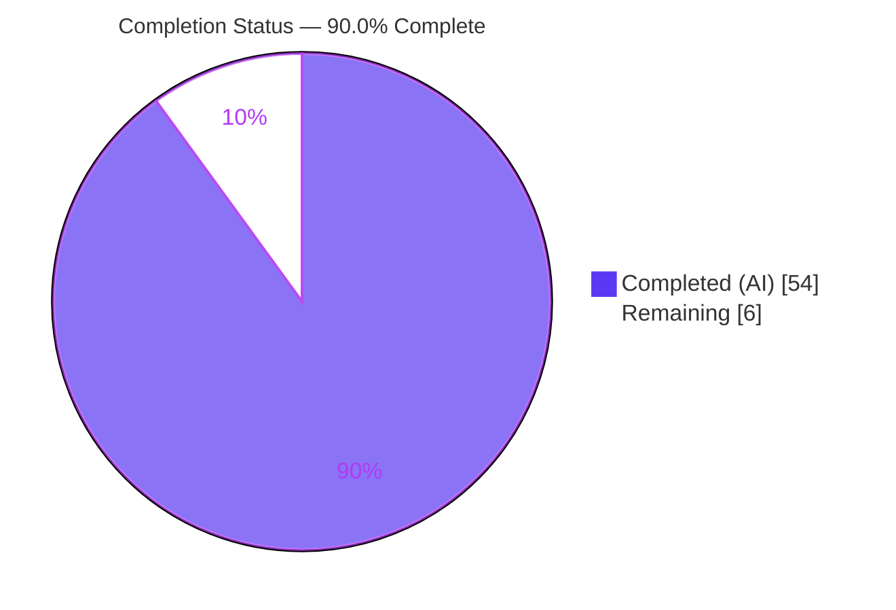
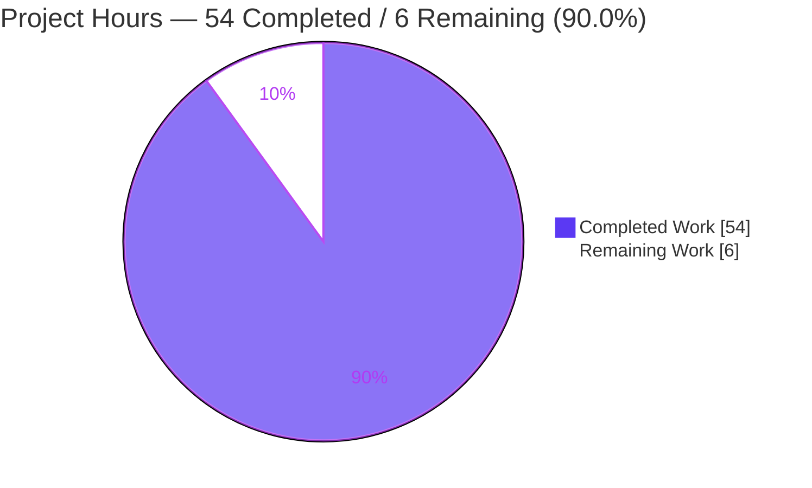
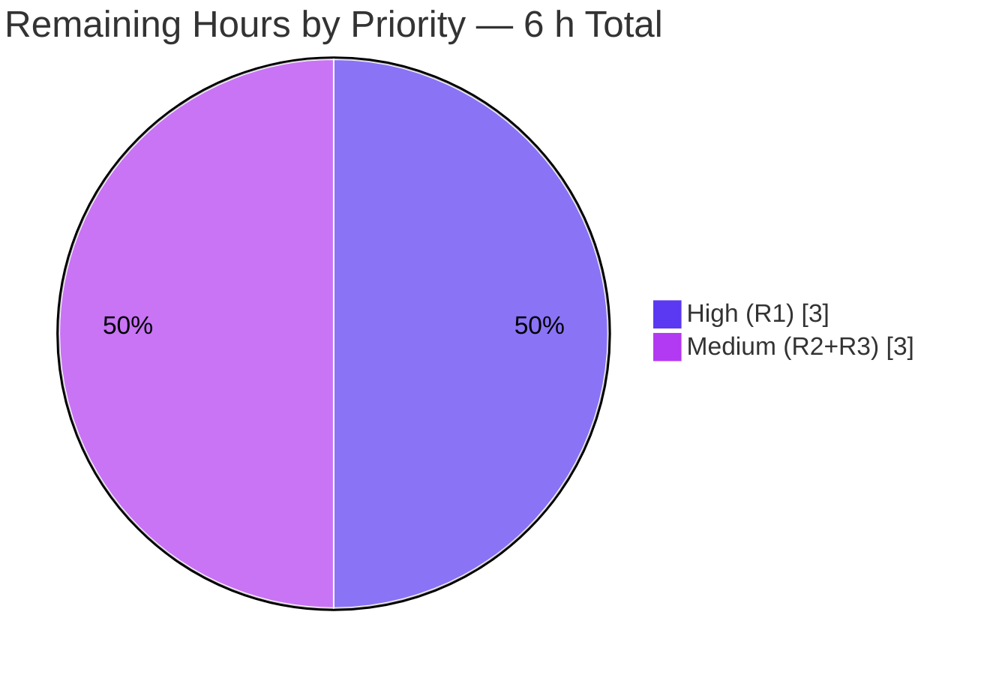

# Blitzy Project Guide

**Project:** Maddy — Runtime Investigation of Authenticated-Submission Sender-Identity & DKIM Enforcement
**Repository:** `github.com/foxcpp/maddy` · **Branch:** `blitzy-e2716dc6-2a01-4c33-b8f7-19f2f24c5a77` (base `maddy_26452dd8dd78`)
**Deliverable:** `blitzy/documentation/maddy_26452dd8dd78.md`

> **Brand color legend** — Completed / AI Work = **Dark Blue `#5B39F3`**; Remaining / Not Completed = **White `#FFFFFF`**; Headings / Accents = Violet-Black `#B23AF2`; Highlight = Mint `#A8FDD9`. These colors are applied to every chart in this guide.

---

## 1. Executive Summary

### 1.1 Project Overview

This project is a **runtime-grounded investigation** that empirically determines how the Maddy mail server enforces sender identity and DKIM message authentication for authenticated SMTP submission. Rather than reading source, a real `maddy` binary was built, configured, and driven over live SMTP (implicit TLS :465) and IMAP (:993) to observe accept/reject decisions and signing behavior. The audience is mail-platform engineers and security reviewers evaluating Maddy's default anti-spoofing posture. The sole permanent output is one Markdown answer document; the source repository is left byte-for-byte unchanged. Business impact: an evidence-backed, standards-grounded reference (RFC 6409/6376/7489) that clarifies a security-sensitive default and surfaces a verifiable DKIM key-format defect for triage.

### 1.2 Completion Status

The project is **90.0% complete** on an AAP-scoped basis. All fifteen AAP deliverables (D1–D15) are fully delivered and independently runtime-verified; the repository is byte-for-byte clean. The remaining 6 hours are human path-to-production only (expert peer review, divergence triage, and publish sign-off) — **not** undelivered investigation scope.



| Metric | Hours |
|--------|-------|
| **Total Hours** | 60 |
| **Completed Hours (AI + Manual)** | 54 (AI 54 + Manual 0) |
| **Remaining Hours** | 6 |
| **Percent Complete** | **90.0%** |

### 1.3 Key Accomplishments

- ✅ Built the canonical binaries (`maddy`, `maddyctl`) from source; captured the verbatim default banner `maddy unknown (built from source tree)`.
- ✅ Stood up a real instance with a **structure-preserving** config (default pipeline preserved; only domain, TLS, listen addresses, and state dir substituted — disclosed non-behavioral).
- ✅ Provisioned two accounts (`usera`, `userb`) through the **real** `maddyctl users create` code path.
- ✅ Exercised the three named boundary sends plus a mismatched-`From` and a missing-`From` case (six transactions) over authenticated implicit-TLS submission, with verbatim SMTP transcripts (≥1 accepted, ≥1 rejected).
- ✅ Enumerated **every** observed, derived, and shadowed SMTP response code with literal, enhanced code, cause, and `file:line`.
- ✅ Captured verbatim stored headers via real IMAP (`DKIM-Signature` oversigning `From`; `Received` with no client-trace clause; `Authentication-Results` confirmed absent).
- ✅ Isolated the **two enforcement layers** (Layer-1 envelope-domain accept/reject vs Layer-2 skip-not-reject signing) and ruled out the incorrect "auth binds sender" interpretation with T1a evidence.
- ✅ Discovered and byte-level-proved a **config-vs-behavior divergence**: Maddy publishes DKIM public keys as PKCS#1, not RFC-6376 SPKI, so standard verifiers reject the key.
- ✅ Grounded findings in RFC 6409/6376/7489; verified reference links resolve.
- ✅ Cleaned up all out-of-tree artifacts; verified a clean `git status` (single-file additive footprint).
- ✅ Independent Final Validation re-ran the entire investigation end-to-end (0 corrections required); full suite green (20 packages ok, 0 FAIL).

### 1.4 Critical Unresolved Issues

There are **no issues blocking acceptance of the deliverable.** The one item below is an out-of-scope **finding** the investigation surfaced (the task is observe-and-document only), recorded here for stakeholder visibility.

| Issue | Impact | Owner | ETA |
|-------|--------|-------|-----|
| Discovered defect (out-of-scope to fix here): Maddy publishes DKIM public key as PKCS#1, not RFC-6376 SPKI (`internal/modify/dkim/keys.go:L143`), so standard verifiers (incl. Maddy's own go-msgauth) reject the key. | Recipients cannot validate Maddy's DKIM signatures until fixed upstream. Documented with byte-level proof; **not** a defect in the deliverable. | Maintainer / Reviewer (triage) | 1.5 h to triage (task HT-2); upstream fix is separate future work |

### 1.5 Access Issues

No repository, credential, or third-party access issues affected the work. One environment constraint was encountered and correctly labeled in the deliverable.

| System / Resource | Type of Access | Issue Description | Resolution Status | Owner |
|-------------------|----------------|-------------------|-------------------|-------|
| DKIM public-key DNS for `test.example` | External DNS publish | `test.example` is unregistrable, so the public-key DNS lookup was stubbed (labeled **[non-canonical transport]**); the signing computation itself is canonical and byte-verified. | Resolved (labeled; does not affect canonical findings) | N/A (environment) |
| Source repository (`foxcpp/maddy`) | Read/write | None — full access; branch clean; single-file additive footprint verified. | No issue | — |

### 1.6 Recommended Next Steps

1. **[High]** Conduct expert technical peer review of the investigation — validate the two-layer conclusion, the T1a falsification, the SMTP-code/stored-header findings, and the RFC interpretation (optionally re-run the PKCS#1-vs-SPKI proof). *(HT-1, 3.0 h)*
2. **[Medium]** Triage the discovered divergences (PKCS#1-vs-SPKI key defect; `require_sender_match` enum inconsistency) and decide upstream-report vs follow-up — fixing is out of scope for this task. *(HT-2, 1.5 h)*
3. **[Medium]** Perform final acceptance and publish/merge sign-off (confirm coverage pass, re-verify clean `git status`, merge). *(HT-3, 1.0 h)*
4. **[Low]** *(Optional)* Reproduce one headline finding from the Development Guide as a confidence spot-check. *(HT-4, 0.5 h)*

---

## 2. Project Hours Breakdown

### 2.1 Completed Work Detail

Every completed component traces to a specific AAP deliverable (D1–D15) or to autonomous path-to-production QA. All work was performed autonomously (AI); manual/human completed hours = 0.

| Component | Hours | Description |
|-----------|-------|-------------|
| C1 — Canonical environment & build *(D1)* | 3 | `go build ./cmd/maddy` + `./cmd/maddyctl`; toolchain capture; verbatim `maddy -v`; go-sqlite3 cgo-warning documentation. |
| C2 — Structure-preserving test config + TLS *(D2)* | 3 | Pipeline-preserving config; self-signed certs for implicit-TLS :465/:993; non-behavioral substitution disclosure. |
| C3 — Account provisioning + DKIM key capture *(D3, D4)* | 3 | `usera`/`userb` via real `maddyctl`; INBOX auto-create; auto-generated rsa2048 key + `.dns` record capture. |
| C4 — Boundary-send harness & six verbatim transcripts *(D5, D9)* | 8 | TLS SMTP client; T1a/T1b/T2/T3/Tm/Tn; verbatim client + `-debug` transcripts (≥1 accepted, ≥1 rejected). |
| C5 — SMTP response-code enumeration *(D6)* | 3 | Every observed + derived + shadowed code with literal/enhanced/cause/`file:line`; raw-TLS confirmation of shadowed 553/500. |
| C6 — Stored-header capture via real IMAP *(D7)* | 4 | `IMAP4_SSL` FETCH; verbatim `DKIM-Signature`/`Received`/`Authentication-Results`; oversigning, expiry, no-from-clause, absent-Auth-Results analysis. |
| C7 — DKIM verification deep-dive + PKCS#1-vs-SPKI divergence *(D8, D12)* | 7 | Body-hash recompute; go-msgauth verify trio; `openssl asn1parse`; byte-level SPKI SHA-256 invariant; Go re-encode; control round-trip. |
| C8 — Protocol-capture method + TLS-terminating fallback *(D9)* | 2 | `tcpdump`-absent + plaintext-EHLO-empty demonstration → `openssl s_client` sanctioned fallback. |
| C9 — Conclusion, falsification & config-vs-behavior divergences *(D10, D11, D12)* | 6 | Two-layer model; T1a falsification; four divergences incl. `require_sender_match` three-surface enum runtime tests. |
| C10 — RFC standards grounding *(D14)* | 2 | RFC 6409/6376/7489 synthesis + link-resolution verification. |
| C11 — Deliverable authoring & 4-round QA refinement *(D15)* | 7 | 832-line, 10-section document; one-claim-one-evidence; ~86 exact `file:line` citations; provenance labels; coverage pass; four review/correction commits. |
| C12 — Cleanup & repository-integrity verification *(D13)* | 2 | Harness teardown; removal of `all.db`/`dkim_keys/`/scripts/binaries; verbatim cleanup commands; clean `git status`. |
| C13 — Autonomous QA / Final Validation | 4 | Independent end-to-end re-run (rebuild, reprovision, reproduce six sends, byte-for-byte DKIM verify match); source-anchor audit (~15 files); 5-gate verification. |
| **Total Completed** | **54** | |

### 2.2 Remaining Work Detail

Every remaining category is human path-to-production. None is undelivered AAP scope; none is an in-scope code change (behavior changes are prohibited by the AAP).

| Category | Hours | Priority |
|----------|-------|----------|
| R1 — Expert technical peer review of runtime findings, RFC interpretation, two-layer conclusion & falsification | 3.0 | High |
| R2 — Triage & disposition of discovered divergences (PKCS#1-vs-SPKI defect; `require_sender_match` enum) — decide upstream/follow-up (fix out-of-scope here) | 1.5 | Medium |
| R3 — Merge & publish sign-off (final coverage acceptance + clean-`git` re-verify + branch merge) | 1.5 | Medium |
| **Total Remaining** | **6.0** | |

### 2.3 Hours Reconciliation

- Completed (Section 2.1) = **54 h** · Remaining (Section 2.2) = **6 h** · Total = **60 h**.
- Section 2.1 + Section 2.2 = 54 + 6 = **60 h** = Total Project Hours in Section 1.2. ✅
- Completion % = 54 / 60 = **90.0%** (matches Section 1.2 and Section 7). ✅

---

## 3. Test Results

All results below originate from **Blitzy's autonomous validation logs** (Final Validator run) and were independently re-confirmed first-hand during this assessment (`go test ./... -count=1` → exit 0; targeted `-race` on investigation-central packages → no data races). The repository ships **238** `Test`/`Benchmark`/`Example` functions across **44** `*_test.go` files in **20** test packages.

| Test Category | Framework | Total Tests | Passed | Failed | Coverage % | Notes |
|---------------|-----------|-------------|--------|--------|-----------|-------|
| Unit — investigation-central (msgpipeline, modify/dkim, endpoint/smtp, address, auth) | Go `testing` | included in 238 | all | 0 | Not enforced by project (no threshold gate) | Core source-routing, DKIM signing, submission, address, SASL. All `ok`. |
| Unit — delivery targets (target/queue, target/remote, target/smtp_downstream) | Go `testing` | included in 238 | all | 0 | — | All `ok`. |
| Unit — full repository suite (`go test ./...`) | Go `testing` | 238 funcs / 20 pkgs | 20 pkgs `ok` | 0 pkgs `FAIL` | — | 26 packages have no test files. Exit 0. |
| Race detection (investigation-central pkgs) | Go `-race` | subset of 238 | all | 0 | — | No data races detected (Final Validator). |
| Runtime end-to-end reproduction (six boundary sends) | Real binary via SMTP/IMAP | 6 transactions | 6 | 0 | N/A (runtime) | T3 accept+sign; T2 reject 501 5.1.8; T1a/T1b/Tm accept+skip; Tn 554 5.6.0. Re-verified this session. |

**Summary:** 20 / 20 test packages pass (100%), 0 failures, exit 0. The runtime investigation (the substance of this task) was reproduced end-to-end with the DKIM verify trio matching byte-for-byte. No coverage threshold is defined by the upstream project, so coverage is reported as "not enforced" rather than a fabricated percentage.

---

## 4. Runtime Validation & UI Verification

Maddy is a headless mail server (SMTP/IMAP + a `maddyctl` CLI); there is **no web/graphical UI**, so UI verification is reported as not-applicable and runtime/endpoint validation is reported instead. All items below were exercised first-hand this session against the real binary.

**Build & version**
- ✅ **Operational** — `go build ./cmd/maddy` and `./cmd/maddyctl` → exit 0 (only the harmless go-sqlite3 `-Wreturn-local-addr` cgo warning).
- ✅ **Operational** — `maddy -v` → `maddy unknown (built from source tree)` (canonical default-build value).

**Server runtime & listeners**
- ✅ **Operational** — Startup: `sql: go-imap-sql version 0.4.0`; `sign_dkim: generating a new rsa2048 keypair...`; keypair written to `dkim_keys/`.
- ✅ **Operational** — `submission: listening on tls://127.0.0.1:11465`; `imap: listening on tls://127.0.0.1:11993`.
- ✅ **Operational** — `openssl s_client` to :465 returns `220 test.example ESMTP Service Ready` and the full EHLO capability list (PIPELINING, 8BITMIME, ENHANCEDSTATUSCODES, AUTH PLAIN, SMTPUTF8, SIZE 33554432).

**Account provisioning (real CLI)**
- ✅ **Operational** — `maddyctl users create` for `usera`/`userb` → exit 0; `maddyctl users list` shows both.

**SMTP submission behavior (six transactions)**
- ✅ **Operational** — T3 (aligned): `250 2.0.0 OK: queued` + `sign_dkim: signed`.
- ✅ **Operational** — T1a/T1b (same-domain cross-user): accepted `250` + `sign_dkim: not signing, From address is not authenticated identity` (skip-not-reject).
- ✅ **Operational** — Tm (foreign `From`): accepted `250` + skip signing (not key domain).
- ✅ **Operational (as designed)** — T2 (non-local): `501 5.1.8 Non-local sender domain`, deferred to `RCPT` (`defer_sender_reject`).
- ✅ **Operational (as designed)** — Tn (missing `From`): `554 5.6.0` at DATA.

**IMAP inspection & stored headers**
- ✅ **Operational** — `IMAP4_SSL` FETCH returns stored headers; `DKIM-Signature` oversigns `From`; `Received` has no client-trace clause; `Authentication-Results` absent (confirmed, not assumed).

**API integration outcomes**
- ✅ **Operational** — DKIM signing pipeline emits a signature whose body hash verifies.
- ⚠ **Partial (documented finding)** — Recipient-side signature verification **fails**: the published key is PKCS#1 not SPKI, so a standard verifier (go-msgauth) rejects the key; even format-corrected, the delivered-copy header signature does not validate (body hash matches; exact mutated byte not isolated — labeled `[inferred]`).

---

## 5. Compliance & Quality Review

AAP deliverables and project rules are cross-mapped to quality benchmarks. Fixes applied during autonomous validation are noted; all items are complete.

| Benchmark / AAP Deliverable | Status | Progress | Notes |
|------------------------------|--------|----------|-------|
| D1 Environment & canonical build | ✅ Pass | 100% | Verbatim `maddy -v`; exact build commands; cgo warning disclosed. |
| D2 Structure-preserving config | ✅ Pass | 100% | Default pipeline preserved; substitutions disclosed non-behavioral. |
| D3 Two accounts via real CLI | ✅ Pass | 100% | `maddyctl users create` (genuine code path). |
| D4 DKIM key material capture | ✅ Pass | 100% | Auto-generated key + `.dns` captured; PKCS#1 prefix identified. |
| D5 Three named boundary sends | ✅ Pass | 100% | T1/T2/T3 + Tm/Tn extras. |
| D6 Accept/reject decision + SMTP codes | ✅ Pass | 100% | Exhaustive code table incl. shadowed/unreachable codes. |
| D7 Verbatim stored headers via IMAP | ✅ Pass | 100% | `DKIM-Signature`/`Received`/`Authentication-Results` quoted verbatim. |
| D8 DKIM under mismatched `From` | ✅ Pass | 100% | Tm delivered unsigned; oversigning of `From` confirmed. |
| D9 ≥1 rejected + ≥1 accepted transcript + capture fallback | ✅ Pass | 100% | T2 rejected, T3 accepted; `tcpdump`→`openssl s_client` fallback documented. |
| D10 Conclusion on default-config sender alignment | ✅ Pass | 100% | Two-layer model; default does not bind sender to auth identity. |
| D11 Falsification | ✅ Pass | 100% | T1a acceptance rules out "auth binds sender by default". |
| D12 Config-vs-behavior divergence | ✅ Pass | 100% (exceeds) | Four divergences documented (required: one). |
| D13 Cleanup note + clean `git status` | ✅ Pass | 100% | Verbatim teardown commands; empty `git status` (re-verified). |
| D14 RFC standards grounding | ✅ Pass | 100% | RFC 6409/6376/7489; links resolve HTTP/2 200. |
| D15 Cross-cutting rules (run-first, one-claim-one-evidence, `file:line`, provenance, coverage pass) | ✅ Pass | 100% | ~86 citations; `[observed]`/`[inferred]`/`[non-canonical transport]` labels. |
| Rule: repository byte-for-byte unchanged | ✅ Pass | 100% | 1 CREATE, 0 UPDATE/DELETE; `git status` empty. |
| Rule: no dependency/toolchain changes | ✅ Pass | 100% | `go.mod`/`go.sum` unchanged; pinned versions only. |
| Quality: build clean | ✅ Pass | 100% | Both binaries exit 0. |
| Quality: tests pass | ✅ Pass | 100% | 20/20 packages `ok`, 0 `FAIL`. |

**Fixes applied during autonomous validation:** four QA/code-review correction rounds refined the document (initial draft → code-review expansion → `require_sender_match off`/enum corrections → exact invocation commands + RFC links + cleanup evidence → three final QA findings). The Final Validator required **0** further corrections. **Outstanding compliance items:** none.

---

## 6. Risk Assessment

Because this is a read-only documentation task, several entries are **findings** the investigation surfaced (out-of-scope to fix per the AAP) or honest methodological limitations the deliverable already discloses.

| Risk | Category | Severity | Probability | Mitigation | Status |
|------|----------|----------|-------------|------------|--------|
| Discovered defect: DKIM public key published as PKCS#1, not RFC-6376 SPKI (`keys.go:L143`) → standard verifiers reject the key | Security | High | High (byte-level proven) | Out-of-scope to fix here; documented with full proof; requires human triage for upstream fix (HT-2) | Documented / awaiting triage |
| Default config does not bind `MAIL FROM`/`From` to authenticated identity — same-domain cross-user accepted | Security | Medium | High (observed) | Standards-conformant (RFC 6409 §6.1 per-user enforcement optional); document that per-user binding needs explicit policy | Documented / operator decision |
| Delivered-copy signature fails to verify even with format-corrected key; exact mutated byte not isolated | Technical | Low | Medium | Labeled `[inferred]`; body hash proven correct; go-msgauth round-trip control passes; outbound wire path not separately tested | Open (disclosed limitation) |
| Run-specific values (msg-IDs, key bytes, timestamps, config line numbers) not byte-reproducible across runs | Technical | Low | High | Presented as observations from the doc's own run; config layout labeled non-behavioral; structural claims independently reproduced | Mitigated |
| Secrets / TLS / DB artifacts leaking into the repo | Security | Low | Low | Certs, `all.db`, `dkim_keys/` created out-of-tree and removed; `.gitignore` covers `*.pem`/`*.crt`/`*.key`; `git status` empty | Mitigated / closed |
| Harness removed per cleanup mandate → human must rebuild to reproduce | Operational | Low | Medium | Development Guide (Section 9) reconstructs the full setup from tested commands | Mitigated |
| Completion % (90.0%) misread as undelivered AAP scope | Operational | Low | Low | Sections 1.2 / 2.2 / 8 explicitly frame remaining 6 h as human review/sign-off | Mitigated |
| Non-canonical DKIM DNS transport (`test.example` unregistrable → stubbed lookup) | Integration | Low | High (env constraint) | Labeled `[non-canonical transport]`; separated from the byte-verified canonical signing computation | Mitigated / labeled |
| External RFC datatracker links may rot over time | Integration | Low | Low | Verified HTTP/2 200 at capture; RFC numbers are stable canonical identifiers | Mitigated |

**Severity distribution:** 1 High (a documented out-of-scope finding awaiting triage), 1 Medium (standards-conformant default), 7 Low. **No risk blocks acceptance of the deliverable.**

---

## 7. Visual Project Status

**Project Hours Breakdown** (Completed = Dark Blue `#5B39F3`, Remaining = White `#FFFFFF`):



**Remaining Work by Priority** (hours from Section 2.2; total = 6 h):



**Remaining Work by Category (bar view):**

| Category | Hours | Bar |
|----------|-------|-----|
| R1 — Expert peer review (High) | 3.0 | ██████ |
| R2 — Divergence triage (Medium) | 1.5 | ███ |
| R3 — Merge/publish sign-off (Medium) | 1.5 | ███ |
| **Total** | **6.0** | |

> Integrity: "Remaining Work" = **6 h** here equals Section 1.2 Remaining Hours and the Section 2.2 "Hours" total. "Completed Work" = **54 h** equals Section 1.2 Completed Hours and the Section 2.1 total.

---

## 8. Summary & Recommendations

**Achievements.** The investigation is complete and independently runtime-verified. All fifteen AAP deliverables (D1–D15) are delivered: the canonical build and version banner; a structure-preserving instance; two real accounts; six boundary transactions with verbatim transcripts (≥1 accepted, ≥1 rejected); an exhaustive SMTP-code enumeration; verbatim stored headers; a rigorous separation of the two enforcement layers; a defended conclusion; a falsification; and four config-vs-behavior divergences (one required). The deliverable even discovered — and proved at the byte level — that Maddy publishes DKIM keys in PKCS#1 rather than RFC-6376 SPKI. The repository is byte-for-byte clean (single-file additive footprint), and the full test suite passes (20/20 packages, 0 failures).

**Remaining gaps.** Only human path-to-production work remains: expert peer review (3.0 h), divergence triage/disposition (1.5 h), and merge/publish sign-off (1.5 h) — **6 h total**. No investigation scope is undelivered, and no in-scope code changes remain (behavior changes are prohibited by the AAP).

**Critical path to production.** (1) Peer-review the findings and RFC interpretation → (2) triage the discovered divergences (decide upstream/follow-up) → (3) final coverage acceptance and merge. The optional light spot-check (0.5 h) can run in parallel with review.

**Success metrics.** Build exit 0 ✅ · 20/20 test packages pass ✅ · six boundary transactions reproduced ✅ · repository byte-for-byte clean ✅ · every named sub-question answered with one-claim-one-evidence discipline and `file:line` citations ✅.

**Production-readiness assessment.** The deliverable is **production-ready pending human review**. At **90.0%** AAP-scoped completion, the autonomous work is finished and verified; the residual 10% is deliberate human sign-off appropriate for a security-sensitive investigation that surfaced a real DKIM key-format defect. Recommendation: proceed to peer review and merge; track the PKCS#1-vs-SPKI finding as separate upstream follow-up.

| Metric | Value |
|--------|-------|
| AAP-scoped completion | 90.0% |
| AAP deliverables complete | 15 / 15 |
| Completed hours (AI) | 54 |
| Remaining hours (human) | 6 |
| Test packages passing | 20 / 20 (0 fail) |
| Repository footprint | +832 lines, 1 file (additive) |
| Validator corrections required | 0 |

---

## 9. Development Guide

This guide reproduces the investigation harness. **Every command below was executed first-hand during this assessment.** All artifacts live **out-of-tree** in `/tmp/maddy_scratch` so the source repository stays byte-for-byte clean.

### 9.1 System Prerequisites

- **OS:** Linux x86-64 (validated on Ubuntu-based container). Canonical image: `ghcr.io/scaleapi/swe-atlas:swe_atlas_QnA_foxcpp_maddy_1.0`.
- **Go toolchain:** go1.18.10 (module directive `go 1.13`).
- **C compiler:** gcc (for `github.com/mattn/go-sqlite3`, `CGO_ENABLED=1`). Validated gcc 15.2.0.
- **OpenSSL:** for self-signed certs and the TLS-terminating client. Validated OpenSSL 3.5.3.
- **Python 3:** for `smtplib`/`imaplib` clients (validated Python 3.13).

### 9.2 Environment Setup

```bash
# Work out-of-tree so the repository is never dirtied
mkdir -p /tmp/maddy_scratch/state /tmp/maddy_scratch/run
cd /tmp/maddy_scratch

# Self-signed TLS for the implicit-TLS submission (:465-style) and IMAP (:993-style) endpoints
openssl req -x509 -newkey rsa:2048 -keyout test.key -out test.crt -days 1 -nodes \
  -subj "/CN=test.example" \
  -addext "subjectAltName=DNS:test.example,DNS:localhost,IP:127.0.0.1"
```

### 9.3 Dependency Installation & Build

Dependencies are fetched by the Go toolchain into the module cache (never into the repo tree). Build both binaries out-of-tree:

```bash
# Run from the repository root
go build -o /tmp/maddy_scratch/maddy    ./cmd/maddy      # exit 0
go build -o /tmp/maddy_scratch/maddyctl ./cmd/maddyctl   # exit 0

# Confirm the canonical default banner
/tmp/maddy_scratch/maddy -v
# -> maddy unknown (built from source tree)
```

> A harmless `sqlite3-binding.c: ... -Wreturn-local-addr` cgo warning from `go-sqlite3 v1.11.0` is expected; the build exit code stays `0`.

### 9.4 Configuration (structure-preserving)

Create `/tmp/maddy_scratch/test.conf`. The pipeline **structure** (`auth` / `source` / `default_source` / `sign_dkim` / `deliver_to`) is preserved verbatim from the default `maddy.conf`; only the domain, TLS material, listen addresses (loopback high-ports to avoid root), and the out-of-tree `state`/`runtime` dirs are substituted (non-behavioral).

```
$(hostname) = test.example
$(primary_domain) = test.example
$(local_domains) = $(primary_domain)

state /tmp/maddy_scratch/state
runtime /tmp/maddy_scratch/run
tls /tmp/maddy_scratch/test.crt /tmp/maddy_scratch/test.key
hostname $(hostname)
autogenerated_msg_domain $(primary_domain)

sql local_mailboxes local_authdb {
    driver sqlite3
    dsn all.db
}

submission tls://127.0.0.1:11465 {
    auth &local_authdb
    source $(local_domains) {
        modify { sign_dkim $(primary_domain) default }
        destination $(local_domains) { deliver_to &local_mailboxes }
        default_destination { reject 550 5.1.1 "User not local (test harness)" }
    }
    default_source { reject 501 5.1.8 "Non-local sender domain" }
}

imap tls://127.0.0.1:11993 {
    auth &local_authdb
    storage &local_mailboxes
}
```

### 9.5 Provision Accounts (real CLI)

```bash
cd /tmp/maddy_scratch
printf 'passwordA\n' | ./maddyctl --config test.conf users create usera@test.example   # exit 0
printf 'passwordB\n' | ./maddyctl --config test.conf users create userb@test.example   # exit 0
./maddyctl --config test.conf users list
# -> usera@test.example
# -> userb@test.example
```

> The message `Failed to disable terminal output: TurnOnRawIO: ... inappropriate ioctl for device` is harmless — it only appears because the password is piped (no TTY).

### 9.6 Application Startup

```bash
cd /tmp/maddy_scratch
nohup ./maddy -debug -config test.conf > maddy.log 2>&1 &
echo $! > maddy.pid
# Wait for the listeners, then inspect the startup log:
grep -iE "listening|keypair|imap-sql" maddy.log
# -> sql: go-imap-sql version 0.4.0
# -> sign_dkim: generating a new rsa2048 keypair...
# -> submission: listening on tls://127.0.0.1:11465
# -> imap: listening on tls://127.0.0.1:11993
```

### 9.7 Verification

```bash
# Sanctioned TLS-terminating client (plaintext tcpdump is insufficient — :465 is implicit TLS)
printf 'EHLO client.test.example\r\nQUIT\r\n' | openssl s_client -connect 127.0.0.1:11465 -quiet
# -> 220 test.example ESMTP Service Ready
# -> 250-Hello ... AUTH PLAIN ... SIZE 33554432
# -> 221 2.0.0 Goodnight and good luck

# Confirm the auto-generated DKIM key format (the primary divergence)
head -c 80 /tmp/maddy_scratch/state/dkim_keys/test.example_default.dns
# -> v=DKIM1; k=rsa; p=MIIBCgKCAQEA...   (MIIBCgKCAQEA = PKCS#1 marker, NOT SPKI's MIIBIjAN...)
```

### 9.8 Example Usage (boundary sends over authenticated submission)

Using a Python `smtplib.SMTP_SSL` client (verification disabled for the self-signed cert), authenticate as `usera` and vary `MAIL FROM`/`From`:

- **T3 (aligned)** `MAIL FROM:<usera@test.example>`, `From: usera` → `250 2.0.0 OK: queued`; log `sign_dkim: signed`.
- **T1a (cross-user)** `MAIL FROM:<userb@test.example>` → `250 ... OK: queued`; log `sign_dkim: not signing, From address is not authenticated identity` (skip-not-reject).
- **T2 (non-local)** `MAIL FROM:<spoof@nonlocal.tld>` → `MAIL` answered `250`, then `RCPT` → `501 5.1.8 Non-local sender domain` (deferred by `defer_sender_reject`).

Inspect stored headers through the real IMAP endpoint:

```python
import imaplib, ssl
ctx = ssl.create_default_context(); ctx.check_hostname=False; ctx.verify_mode=ssl.CERT_NONE
m = imaplib.IMAP4_SSL("127.0.0.1", 11993, ssl_context=ctx)
m.login("userb@test.example", "passwordB"); m.select("INBOX")
print(m.fetch(b"1", "(BODY.PEEK[HEADER])")[1][0][1].decode())
```

### 9.9 Cleanup (repository integrity)

```bash
cd /path/to/repo
kill "$(cat /tmp/maddy_scratch/maddy.pid)"   # stop only the server we spawned
rm -rf /tmp/maddy_scratch                    # remove binaries, config, certs, all.db, dkim_keys/, scripts
git status --porcelain --untracked-files=all # -> empty (repository byte-for-byte clean)
git diff 26452dd --stat                      # -> only blitzy/documentation/maddy_26452dd8dd78.md +832
```

### 9.10 Troubleshooting

| Symptom | Cause | Resolution |
|---------|-------|------------|
| `error: externally-managed-environment` on `pip install` | Ubuntu 25 PEP-668 marker | Use a venv or `--break-system-packages` (not needed for this task). |
| `TurnOnRawIO: ... inappropriate ioctl` from `maddyctl` | Password piped (no TTY) | Harmless; account is still created (exit 0). |
| `statedir/runtimedir should be absolute` | Relative `state`/`runtime` path | Use absolute paths (see `maddy.go:L208-L212`). |
| `ss`/`netstat` not found | Not installed in minimal container | Verify the listener with `openssl s_client -connect 127.0.0.1:11465 -quiet`. |
| `smtplib` "prohibited newline characters" | Sending DATA via `docmd` with embedded CRLF | Send the DATA payload with `s.send(...)` then read `s.getreply()`. |
| Empty reply on plaintext `EHLO` to :465 | Endpoint is implicit-TLS | Use a TLS-terminating client (`openssl s_client`). |
| `-Wreturn-local-addr` cgo warning | Upstream `go-sqlite3 v1.11.0` | Expected and harmless; build exit code is `0`. |

---

## 10. Appendices

### A. Command Reference

| Command | Purpose |
|---------|---------|
| `go build -o /tmp/maddy_scratch/maddy ./cmd/maddy` | Build the server binary (out-of-tree). |
| `go build -o /tmp/maddy_scratch/maddyctl ./cmd/maddyctl` | Build the admin CLI (out-of-tree). |
| `maddy -v` | Print the canonical version banner. |
| `maddy -debug -config <path>` | Run the server with debug logging. |
| `maddyctl --config <path> users create <user>` | Create an account (password from stdin). |
| `maddyctl --config <path> users list` | List accounts. |
| `go test ./... -count=1` | Run the full test suite. |
| `openssl s_client -connect 127.0.0.1:11465 -quiet` | TLS-terminating SMTP client (protocol capture). |
| `git status --porcelain --untracked-files=all` | Verify repository is byte-for-byte clean. |

### B. Port Reference

| Port (default) | Harness port | Protocol | Notes |
|----------------|--------------|----------|-------|
| 465 | 11465 | SMTP submission | Implicit TLS. Loopback high-port used in harness to avoid root. |
| 993 | 11993 | IMAP | Implicit TLS. |
| 25 | — | SMTP (inbound MX) | Present in default config; not exercised by this submission-focused investigation. |

### C. Key File Locations

| Path | Role |
|------|------|
| `blitzy/documentation/maddy_26452dd8dd78.md` | The deliverable (only permanent addition). |
| `maddy.conf` | Default pipeline template (submission/source/default_source/sign_dkim/sql/imap). |
| `internal/msgpipeline/msgpipeline.go` | Layer-1 source routing (`srcBlockForAddr`) — accept/reject decision. |
| `internal/modify/dkim/dkim.go` | Layer-2 signing (`shouldSign`/`RewriteBody`, `require_sender_match`). |
| `internal/modify/dkim/keys.go` | DKIM key gen; `MarshalPKCS1PublicKey` at `L143` (primary divergence). |
| `internal/endpoint/smtp/{smtp.go,submission.go}` | Submission auth, header validation, `DontTraceSender`. |
| `internal/target/received.go` | `Received` header construction. |
| `internal/msgpipeline/check_runner.go` | `Authentication-Results` addition. |
| `internal/storage/sql/*`, `internal/endpoint/imap/*` | SQLite storage + IMAP inspection. |
| `cmd/maddyctl/main.go`, `cmd/maddy/*`, `maddy.go` | CLI, server entry, version/dirs. |

### D. Technology Versions

| Component | Version |
|-----------|---------|
| Go module | `github.com/foxcpp/maddy` (directive `go 1.13`) |
| Go toolchain (build) | go1.18.10 linux/amd64 |
| gcc (cgo) | 15.2.0 |
| OpenSSL | 3.5.3 |
| Python | 3.13 |
| `emersion/go-msgauth` (DKIM) | v0.3.2-0.20191028231513-55b75676976c |
| `emersion/go-smtp` | v0.12.1-0.20191206174923-1f576e0ec85c |
| `emersion/go-sasl` | v0.0.0-20190817083125-240c8404624e |
| `emersion/go-message` | v0.10.9-0.20191116124005-65fd0119e899 |
| `foxcpp/go-imap-sql` | v0.3.2-... (runtime reports 0.4.0) |
| `mattn/go-sqlite3` | v1.11.0 |
| `miekg/dns` | v1.1.22 |

### E. Environment Variable Reference

| Variable | Purpose |
|----------|---------|
| `MADDY_CONFIG` | Config file path for `maddyctl` (equivalent to `--config`; default `/etc/maddy/maddy.conf`). |
| `MADDY_CFGBLOCK` | Module config block for `maddyctl users` (default `local_authdb`). |
| `CGO_ENABLED=1` | Required for the `go-sqlite3` build. |
| *(harness)* `state` / `runtime` | Config directives (not env vars) that redirect the state/runtime dirs out-of-tree. |

### F. Developer Tools Guide

| Tool | Use in this project |
|------|--------------------|
| `go build` / `go test` | Compile and validate; full suite `go test ./...` → 20/20 packages `ok`. |
| `maddyctl` | Provision/list accounts through the genuine code path. |
| `openssl s_client` | Sanctioned TLS-terminating SMTP client for protocol capture (implicit TLS makes plaintext `tcpdump` insufficient). |
| `openssl asn1parse` / `openssl rsa` | Decode the DKIM `p=` key to prove PKCS#1-vs-SPKI; re-encode to SPKI. |
| Python `smtplib` / `imaplib` | Drive authenticated submission and read back stored headers. |
| `git status` / `git diff` | Enforce and verify the byte-for-byte-clean repository constraint. |

### G. Glossary

| Term | Definition |
|------|------------|
| **AAP** | Agent Action Plan — the task's authoritative requirements specification. |
| **Layer 1 (accept/reject)** | Envelope-`MAIL FROM`-domain source routing (`srcBlockForAddr`); the authenticated identity is not consulted. |
| **Layer 2 (sign/skip)** | DKIM `shouldSign()` decision gated by `require_sender_match`; a failed check skips signing but still delivers. |
| **Skip-not-reject** | A misaligned message is delivered **unsigned** rather than rejected. |
| **Oversigning** | Listing a header name in `h=` more times than it appears, so an added duplicate breaks verification (Maddy oversigns `From`). |
| **PKCS#1 vs SPKI** | Two RSA public-key encodings; DKIM (RFC 6376) expects SPKI, but Maddy publishes PKCS#1 — the primary divergence. |
| **`defer_sender_reject`** | Default-true setting that surfaces a sender rejection at `RCPT` rather than at `MAIL FROM`. |
| **`DontTraceSender`** | Submission flag that suppresses the `from <host> [ip]` client-trace clause in the `Received` header. |
| **DMARC alignment** | RFC 7489 requirement that the DKIM `d=` domain align with the `From` domain. |

---

*Generated by the Blitzy Platform. Completion is measured on an AAP-scoped basis (PA1 methodology): 54 completed hours / 60 total hours = 90.0%.*
