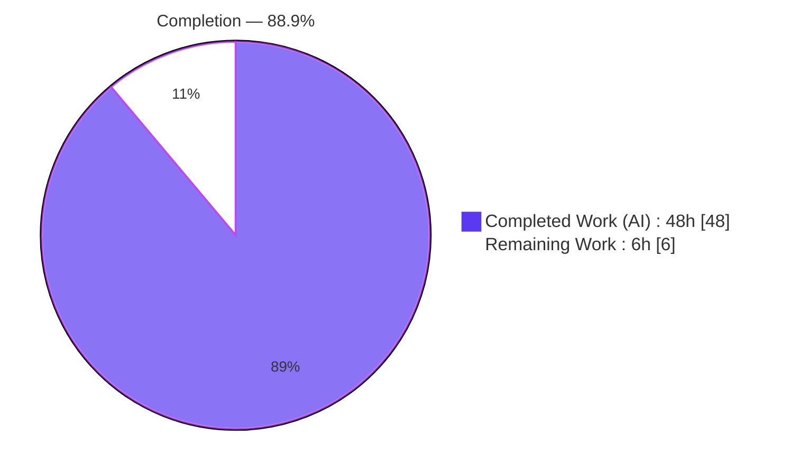
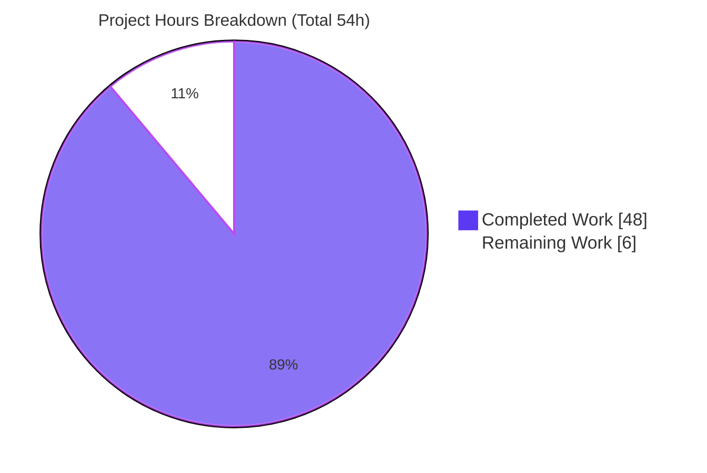
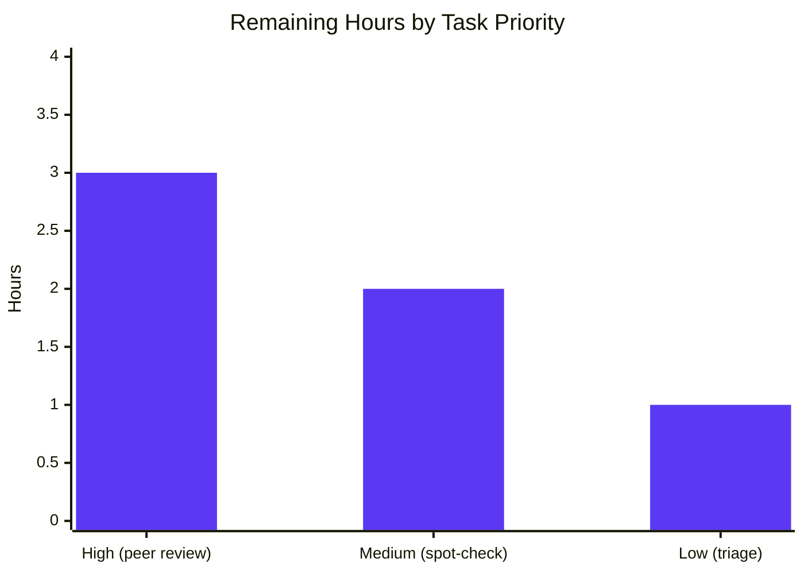

# Blitzy Project Guide

> **Project:** Runtime Investigation — Maddy Sender-Identity & DKIM Enforcement
> **Subject codebase:** `github.com/foxcpp/maddy` @ pinned commit `26452dd`
> **Deliverable:** `blitzy/documentation/maddy_26452dd8dd78.md` (read-only investigation answer)
> **Branch:** `blitzy-f454e013-443c-41bf-a239-e2757361b5fc`
>
> **Brand color legend:** Completed / AI Work = Dark Blue `#5B39F3` · Remaining / Not Completed = White `#FFFFFF` · Headings/Accents = Violet-Black `#B23AF2` · Highlight = Mint `#A8FDD9`

---

## 1. Executive Summary

### 1.1 Project Overview

This project is a **read-only runtime security investigation** of the Maddy mail server (`foxcpp/maddy` @ `26452dd`). Its single deliverable is a comprehensive Markdown answer document explaining — from directly observed evidence rather than source inference — how Maddy enforces **sender identity** and **DKIM signing** on an authenticated SMTP submission path. A canonical default-style deployment was built and run; four adversarial sender scenarios plus edge cases were driven through the real implicit-TLS `:465` submission endpoint; and actual SMTP codes, transcripts, debug logs, and raw stored headers were captured. The audience is security engineers and mail-infrastructure maintainers who need to know exactly how the pinned version behaves — including where its behavior diverges from a reasonable reading of the configuration.

### 1.2 Completion Status



| Metric | Value |
|--------|-------|
| **Total Hours** | **54** |
| **Completed Hours (AI + Manual)** | **48** (48 AI + 0 Manual) |
| **Remaining Hours** | **6** |
| **Percent Complete** | **88.9%** |

> Completion is computed with the AAP-scoped, hours-based methodology: `48 / (48 + 6) = 48 / 54 = 88.9%`. Capped below 100% because human review/acceptance has not yet occurred.

### 1.3 Key Accomplishments

- ✅ Built `maddy` + `maddyctl` from source with `CGO_ENABLED=1` (CGO SQLite driver); binaries reproduced byte-identically (`maddy`=19,307,784 B, `maddyctl`=19,530,896 B).
- ✅ Stood up a canonical default-style deployment in an **isolated** `/tmp` state directory, keeping the repository byte-for-byte unchanged.
- ✅ Exercised all **four** adversarial sender scenarios (A/B/C/D) **plus** edge/error paths over the **real** implicit-TLS `:465` submission endpoint, each repeated ≥2× to confirm determinism.
- ✅ Captured actual runtime evidence for every claim: exact SMTP codes, full `swaks` transcripts, `maddy -debug` logs, and raw stored `DKIM-Signature`/`Received` headers.
- ✅ Answered all **five** analytical questions, leading with the direct answer: the default config enforces sender alignment at the **domain** level only — there is **no `authorize_sender`** check at commit `26452dd`.
- ✅ Discovered, root-caused, and documented **three** behavioral divergences — including the counterintuitive headline that Maddy's emitted DKIM signatures **do not verify** — independently confirmed via three methods.
- ✅ Delivered a **1,286-line** answer document with **~90 exact `file:line` citations**, all re-verified against pristine `26452dd`.
- ✅ Passed all **five** autonomous production-readiness gates; committed read-only (net diff = exactly one file) as `agent@blitzy.com`; clean working tree.

### 1.4 Critical Unresolved Issues

| Issue | Impact | Owner | ETA |
|-------|--------|-------|-----|
| Pending human peer review & acceptance of the answer document | Deliverable cannot be marked formally *accepted* until a qualified human reviewer signs off; no technical blocker exists | Human reviewer (mail/security SME) | ~3h (task HT-1) |
| Independent spot-check of divergence #3 (DKIM sigs don't verify) + citation sample | Reviewer confidence in the counterintuitive headline finding; low risk (already confirmed 3 ways) | Human reviewer | ~2h (task HT-2) |

> **No defects block release of the deliverable.** All five autonomous gates passed, the working tree is clean, and the net diff is exactly one file. The rows above are path-to-production review activities, not code defects.
>
> **Informational (not blocking this deliverable):** The document *reports* two subject-system security findings — (S1) the default config does not bind the sender to the authenticated user, and (S2) emitted DKIM signatures do not verify at RFC-6376 recipients. **Remediating** these is explicitly **out of AAP scope** (§0.3.2); they are surfaced for downstream stakeholder decision (task HT-3).

### 1.5 Access Issues

| System/Resource | Type of Access | Issue Description | Resolution Status | Owner |
|-----------------|----------------|-------------------|-------------------|-------|
| Assessment sandbox (Go toolchain) | Build/runtime environment | Go is not installed in the assessment sandbox; the subject cannot be compiled/run there | **Resolved / Mitigated** — build & runtime reproduction performed in the canonical Docker container (`ghcr.io/scaleapi/swe-atlas`, image `foxcpp__maddy__26452dd…`) as anticipated by AAP §0.2.3 | Platform (canonical image provided) |

> Aside from the environment note above, **no access issues were identified.** Repository read/write access, commit, and push all succeeded; validation reproduced the full experiment in the canonical container.

### 1.6 Recommended Next Steps

1. **[High]** Conduct a technical peer review and formal acceptance of `blitzy/documentation/maddy_26452dd8dd78.md`, verifying the direct answers, the four scenario transcripts, and the read-only proof (task HT-1, 3h).
2. **[Medium]** Independently spot-check the headline divergence #3 (DKIM signatures do not verify) and a sample of the ~90 `file:line` citations against `git show 26452dd:<file>` (task HT-2, 2h).
3. **[Low]** Convene a stakeholder/security triage to decide whether to act on the two reported subject-system findings and, optionally, file an upstream bug for the DKIM verification defect (task HT-3, 1h).

---

## 2. Project Hours Breakdown

### 2.1 Completed Work Detail

| Component | Hours | Description |
|-----------|-------|-------------|
| Research & observation-tooling selection | 2 | Web research validating the SMTP test client (`swaks`) and flags, DKIM verifier tooling, and Maddy's sender-authorization evolution (confirming `authorize_sender` is absent at this commit) — AAP §0.2.2 |
| Build & compile | 2 | `CGO_ENABLED=1 go build ./cmd/maddy` and `go build ./cmd/maddyctl`; binary-size verification |
| Isolated deployment | 3 | Authored `test-maddy.conf` from canonical `maddy.conf`; self-signed TLS for implicit-TLS `:465`; `state` directive isolation; documented 3 test-only deviations |
| Identity provisioning | 2 | First-start auto-generation of RSA-2048 DKIM key + `.dns` record; created 2 accounts (`alice`, `bob`) via `maddyctl users create` |
| Four sender scenarios A–D | 9 | Drove A/B/C/D through the real `:465` submission session; captured exact SMTP codes, full `swaks` transcripts, `-debug` lines, and raw stored headers |
| Edge/error paths + determinism | 3 | Missing `From` (554 5.6.0), invalid `From`/`To` (554 5.6.0), no-auth (502 5.7.0); each scenario re-run ≥2× |
| Evidence-capture infrastructure | 3 | `-debug` logging harness, `maddyctl imap-msgs` dumps, `sqlite3 all.db` inspection of raw stored messages |
| Recipient-side DKIM verification & root-cause forensics | 6 | Offline verification (3 methods); root-caused the PKCS#1-vs-PKIX public-key defect and the header-fold mismatch behind non-verifying signatures |
| Analytical write-up | 4 | Answered 5 analytical questions; ruled out the "auth binds sender==authuser" interpretation; documented 3 divergences and `Authentication-Results` provenance |
| Answer-document authoring | 6 | Wrote the 1,286-line, 12-section document with ~90 `file:line` citations and a coverage pass |
| Cleanup + read-only proof | 1 | Torn down `/tmp` artifacts; authored commit-invariant git proofs of read-only scope |
| Autonomous validation — 5 gates | 4 | Full experiment re-run in the canonical container: `go test ./...`, all scenarios, edges, and 2× determinism |
| Independent divergence #3 confirmation + line-by-line doc review | 2 | Reproduced the non-verifying-signature finding 3 ways; validated every runtime value and re-verified all citations |
| Fixes + commit | 1 | Reframed git proofs to commit-invariant form; corrected two citation ranges; committed (commit `02dd2b3`) |
| **Total Completed** | **48** | **Matches Completed Hours in §1.2** |

### 2.2 Remaining Work Detail

| Category | Hours | Priority |
|----------|-------|----------|
| Technical peer review & acceptance of the answer document | 3 | High |
| Independent spot-check of divergence #3 + sample of ~90 citations | 2 | Medium |
| Stakeholder/security triage on reported findings (decision only; remediation out of scope) | 1 | Low |
| **Total Remaining** | **6** | **Matches Remaining Hours in §1.2 and §7 pie chart** |

### 2.3 Hours Reconciliation

- **Completed (§2.1) = 48h** · **Remaining (§2.2) = 6h** · **Total = 54h**
- **Completion % = 48 / 54 = 88.9%** — used identically in §1.2, §7, and §8.
- Cross-section integrity: §1.2 Remaining = §2.2 Total = §7 "Remaining Work" = **6h** ✔ ; §2.1 + §2.2 = **54h** = §1.2 Total ✔

---

## 3. Test Results

> **Integrity note:** Every result below originates from Blitzy's autonomous validation logs (Gates 1–3) for this project — the subject repository's own Go test suite and the scenario re-runs executed in the canonical container.

| Test Category | Framework | Total Tests | Passed | Failed | Coverage % | Notes |
|---------------|-----------|-------------|--------|--------|------------|-------|
| Subject unit tests (whole repo) | Go `testing` (`go test ./...`) | 20 test packages (+26 no-test) | 20 | 0 | Not separately recorded¹ | `CGO_ENABLED=1`; exit 0; ground truth (all `.go` files byte-identical to `26452dd`) |
| Investigated-package tests (`dkim`, `msgpipeline`, `endpoint/smtp`, `target/*`) | Go `testing` | included in 20 pkgs | all OK | 0 | Not separately recorded¹ | Directly exercises the code paths under investigation |
| Static analysis / build | `go build ./...`, `go vet ./...` | 2 gates | 2 | 0 | — | Both exit 0; only a benign upstream `mattn/go-sqlite3` cgo warning |
| Scenario reproduction (A/B/C/D) | `swaks` over real `:465` | 4 | 4 | 0 | — | Reproduced exactly; only volatile msg-id/port/timestamp/key differ |
| Edge / error paths | `swaks` | 3 | 3 | 0 | — | Missing `From` → 554 5.6.0; invalid `From`/`To` → 554 5.6.0; no-auth → 502 5.7.0 |
| Determinism (repeat runs) | `swaks` (2× each scenario) | 8 | 8 | 0 | — | Outcomes stable across repeated identical inputs |
| DKIM verification (divergence #3) | go-msgauth (exact pins), dkimpy 1.1.8, round-trip harness | 3 methods | 3 confirmed | 0 | — | Confirmed emitted signatures do **not** verify; byte-exact error strings matched the document |

> ¹ *Coverage %:* the subject repo's CI invokes `go test ./... -cover -race`, but a numeric coverage figure was **not** separately captured in the autonomous validation logs; it is therefore reported as "not separately recorded" rather than fabricated. Pass/fail is authoritative (20/20 packages, 0 failures).

---

## 4. Runtime Validation & UI Verification

**Runtime health — endpoints brought up in the canonical container:**

- ✅ **Operational** — Submission endpoint `submission tls://0.0.0.0:465` (auth-required, implicit TLS)
- ✅ **Operational** — IMAP endpoint `imap tls://0.0.0.0:993` (mailbox inspection)
- ✅ **Operational** — Inbound SMTP `smtp tcp://0.0.0.0:25`
- ✅ **Operational** — Plaintext submission **test** port `:1587` (test-only deviation for human-readable capture; isolated in `/tmp`, removed at cleanup)

**Scenario / protocol verification (runtime-observed):**

- ✅ **Scenario A** — auth `alice`, `MAIL FROM`+`From` `bob`: `250` accepted & delivered, **NOT signed** (auth-identity gate `internal/modify/dkim/dkim.go:L306`); `Received` embeds envelope-sender `<bob>` with `ESMTPS`.
- ✅ **Scenario B** — `MAIL FROM x@notlocal.example`: `250` at `MAIL FROM`, then `501 5.1.8 "Non-local sender domain"` at **`RCPT TO`** (deferred; `internal/endpoint/smtp/smtp.go:L567`).
- ✅ **Scenario C** — aligned `alice`: accepted, delivered & signed; body hash `bh=kaTAjM6spWb4aNQuvIfFtkJZ5MvWz8Za5ernh4ELPSY=` byte-identical to the document.
  - ⚠ **Partial (reported divergence)** — the emitted `DKIM-Signature` **does not verify** at an RFC-6376 recipient (`crypto/rsa: verification error`); root-caused, confirmed 3 ways; remediation out of scope.
- ✅ **Scenario D** — `MAIL FROM alice`, `From stranger@other.example`: accepted & delivered, **NOT signed** (key-domain gate `internal/modify/dkim/dkim.go:L288`); the true envelope sender is exposed in `Received`.
- ✅ **Edge/error paths** — missing `From` → `554 5.6.0`; invalid `From`/`To` → `554 5.6.0`; no-auth → `502 5.7.0` (`authAlwaysRequired`, `smtp.go:L590`/`L662`).

**UI verification:** ❕ **N/A** — Maddy is a headless mail server with **no web/graphical UI**. "UI verification" is therefore satisfied by protocol-level (SMTP response codes + transcripts) and stored-message (raw header) verification, which are all ✅ operational above.

---

## 5. Compliance & Quality Review

The 18 discrete AAP requirements were each mapped to runtime evidence and are **all COMPLETED**. Remediation of reported subject-system findings is intentionally excluded per AAP §0.3.2.

| # | AAP Requirement | AAP Ref | Status | Evidence |
|---|-----------------|---------|--------|----------|
| R1 | Build `maddy`+`maddyctl` with `CGO_ENABLED=1` | §0.1.1 | ✅ Completed | Gate 2 byte-identical binaries |
| R2 | Auth-required submission `:465` | §0.1.1 | ✅ Completed | `authAlwaysRequired` observed; no-auth → 502 5.7.0 |
| R3 | DKIM signing enabled for a domain | §0.1.1 | ✅ Completed | `sign_dkim` active; key auto-generated |
| R4 | Local delivery to inspectable mailbox | §0.1.1 | ✅ Completed | `imapsql` store; `imap-msgs`/`sqlite3` dumps |
| R5 | ≥2 user accounts | §0.1.1 | ✅ Completed | `alice`, `bob` via `maddyctl users create` |
| R6 | Isolated runtime (repo unchanged) | §0.1.1 | ✅ Completed | `state /tmp/...`; clean tree proven |
| R7 | Scenario A (different user) | §0.1.3 | ✅ Completed | 250 accepted, unsigned (`dkim.go:L306`) |
| R8 | Scenario B (foreign envelope domain) | §0.1.3 | ✅ Completed | 501 5.1.8 at `RCPT TO` (`smtp.go:L567`) |
| R9 | Scenario C (legitimate) | §0.1.3 | ✅ Completed | Signed; `bh` byte-identical (verify divergence documented) |
| R10 | Scenario D (foreign `From`) | §0.1.3 | ✅ Completed | 250 accepted, unsigned (`dkim.go:L288`) |
| R11 | Edge paths + determinism (≥2×) | §0.7 | ✅ Completed | 3 edge cases + 2× reruns, stable |
| R12 | Capture actual runtime evidence | §0.1.1 | ✅ Completed | Codes, transcripts, `-debug`, raw headers |
| R13 | Offline recipient-side DKIM verification | §0.1.1 | ✅ Completed | 3 verifier methods against stored bytes |
| R14 | Answer 5 analytical questions | §0.1.1 | ✅ Completed | Document §8 (direct answers + rule-out) |
| R15 | Web-search research requirements | §0.1.3 | ✅ Completed | `swaks`/verifier/evolution research |
| R16 | Answer doc + `file:line` citations | §0.6.2 | ✅ Completed | 1,286 lines, ~90 citations verified |
| R17 | Cleanup + read-only proof | §0.7 | ✅ Completed | `/tmp` removed; net diff = 1 file |
| R18 | Validation + fixes committed | §0.8 | ✅ Completed | 5 gates; commit `02dd2b3` |

**Blitzy quality-benchmark cross-map:**

| Quality Benchmark | Status | Notes |
|-------------------|--------|-------|
| Run-first methodology (observe, don't infer) | ✅ Pass | Every claim backed by captured output |
| Actual, unedited output for every claim | ✅ Pass | Transcripts, debug lines, raw headers embedded |
| Exact `file:line` grounding | ✅ Pass | ~90 citations verified against `26452dd` |
| Read-only scope preserved | ✅ Pass | Net diff = exactly one file; `go.mod`/`go.sum` untouched |
| Inferred statements labeled | ✅ Pass | 3 `(inferred)` labels in §9.3, factually grounded |
| Determinism confirmed | ✅ Pass | ≥2× runs per scenario, stable |
| Markdown structural validity | ✅ Pass | 86 balanced fences, well-formed tables, 0 broken cross-refs |

**Fixes applied during autonomous validation (commit `02dd2b3`, +18/−15):** (1) git-proof staleness reframed to commit-invariant commands; (2) citation range `oversignDefault` L31–L52 → L31–L54; (3) citation `.dns`-path L150 → L150–L152. **Outstanding compliance items:** none.

---

## 6. Risk Assessment

| Risk | Category | Severity | Probability | Mitigation | Status |
|------|----------|----------|-------------|------------|--------|
| T1 — Headline finding (DKIM sigs don't verify) is counterintuitive & contradicts the AAP's predicted Scenario C PASS; a reviewer might dismiss it as an artifact | Technical | Low | Low | Confirmed via 3 independent methods (go-msgauth, dkimpy 1.1.8, round-trip harness) against exact stored bytes; byte-exact error strings recorded | ✅ Mitigated |
| T2 — ~90 `file:line` citations could appear to drift if checked against the wrong commit | Technical | Low | Low | All citations framed against pristine `git show 26452dd:<file>`; commit-invariant | ✅ Mitigated |
| T3 — Findings are scoped to commit `26452dd`; misapplying them to current Maddy would be wrong | Technical | Medium | Low | Version-fidelity caveat documented (doc §9.4); modern `authorize_sender` context noted, not applied | ✅ Mitigated / Documented |
| S1 — Default config does **not** bind sender to the authenticated user; an authenticated user can spoof any same-domain sender | Security | High | High | **Reported & documented** (the deliverable's core finding); remediation (modern `authorize_sender`) is **out of AAP scope** | ⚠ Reported (owner: consumer/security team) |
| S2 — DKIM signatures emitted by this build do not verify at RFC-6376 recipients | Security | High | High | **Reported & root-caused** (PKCS#1-vs-PKIX key + header-fold mismatch); fix out of scope per §0.3.2 | ⚠ Reported (owner: upstream/consumer) |
| S3 — Self-signed TLS + plaintext test port `:1587` used during the experiment | Security | Low | Low | Test-only, isolated under `/tmp`, removed at cleanup; explicitly labeled a deviation | ✅ Mitigated |
| O1 — Assessment sandbox lacks Go; experiment reproducible only in the canonical container | Operational | Medium | Low | Exact commands + canonical image documented; validator reproduced end-to-end | ✅ Mitigated |
| O2 — Working artifacts could dirty the repo/environment if not cleaned | Operational | Low | Low | `/tmp/maddy-run` teardown + clean-tree confirmation (doc §10.2) | ✅ Mitigated |
| I1 — Offline DKIM verification depends on feeding the generated public key without public DNS | Integration | Low | Low | Verified against exact stored bytes with the run's own key; 3 methods | ✅ Mitigated |
| I2 — The deliverable's only integration point is human review; no CI/CD or deployment pipeline | Integration | Medium | Low | Acknowledged as the 6h path-to-production (human review = §2.2) | ◻ Open (pending human review) |

---

## 7. Visual Project Status



**Remaining work by priority (from §2.2 — sums to 6h):**



> **Integrity check:** "Remaining Work" = **6h**, identical to §1.2 (Remaining Hours) and §2.2 (total). "Completed Work" = **48h**, identical to §1.2 and §2.1. Colors: Completed = Dark Blue `#5B39F3`, Remaining = White `#FFFFFF`.

---

## 8. Summary & Recommendations

**Achievements.** The project delivered a rigorous, evidence-backed answer to how Maddy (`@26452dd`) enforces sender identity and DKIM signing on authenticated submission. Every conclusion is grounded in directly observed runtime output — exact SMTP codes, full transcripts, `maddy -debug` logs, and raw stored headers — with ~90 verified `file:line` citations. The investigation correctly **leads with the direct answer**: the default configuration enforces sender alignment only at the **domain** level via pipeline source-routing, and there is **no `authorize_sender`** check at this commit binding the sender to the authenticated user.

**Notable findings.** Three behavioral divergences were surfaced and substantiated: (1) `require_sender_match` gates **signing**, not **acceptance** — a mismatched message is still accepted and delivered, merely unsigned; (2) the `501 5.1.8` sender rejection surfaces at **`RCPT TO`**, not `MAIL FROM`, because `defer_sender_reject` defaults true; and (3) — most consequentially, and contrary to the AAP's predicted Scenario C PASS — Maddy's emitted DKIM signatures **do not verify** at an RFC-6376 recipient, root-caused to a PKCS#1-vs-PKIX public-key format defect and a header-folding mismatch, and independently confirmed via three methods. The document honestly reports this rather than fabricating a PASS.

**Remaining gaps & critical path.** No engineering work on the AAP scope remains. The **6h** of remaining effort is entirely human path-to-production: technical peer review and acceptance (3h), an independent spot-check of the headline divergence and citation sample (2h), and a stakeholder/security triage decision on the reported findings (1h). Fixing the reported subject-system issues is deliberately **out of scope** per AAP §0.3.2.

**Production readiness.** The deliverable is **production-ready** for a documentation artifact: it passed all five autonomous production-readiness gates, the subject codebase builds and passes 100% of its unit tests (20/20 packages), read-only scope is proven (net diff = exactly one file; `go.mod`/`go.sum` untouched), and the working tree is clean. Overall completion is **88.9%** (48 of 54 hours), the balance being human review that cannot be autonomously performed.

| Success Metric | Target | Actual |
|----------------|--------|--------|
| AAP requirements completed | 18 / 18 | ✅ 18 / 18 |
| Autonomous production gates passed | 5 / 5 | ✅ 5 / 5 |
| Subject unit-test packages passing | 20 / 20 | ✅ 20 / 20 |
| Read-only scope (net files changed) | 1 | ✅ 1 |
| Completion (AAP-scoped hours) | — | **88.9%** (48/54h) |

---

## 9. Development Guide

> This project's "development" activity is **reproducing the read-only investigation** and **verifying the committed deliverable**. Commands are split into (A) deliverable-verification commands that run in **any** environment (all tested in the assessment sandbox and passing), and (B) reproduce-the-investigation commands that require the **canonical Go + CGO container**.

### 9.1 System Prerequisites

- **For deliverable verification (Part A):** `git` and `python3` (both present in the assessment sandbox). No Go required.
- **For reproducing the investigation (Part B):** the canonical Docker image `ghcr.io/scaleapi/swe-atlas` (tag `swe_atlas_QnA_foxcpp_maddy…` / `foxcpp__maddy__26452dd8dd787dc455278b0fdd296f4a5432c768`), which provides **Go ≥ 1.13** and a **C toolchain** (`gcc`) for the CGO SQLite driver. Additional OS-level observation tools: `swaks`, `openssl`, `sqlite3`, and a DKIM verifier (`dkimpy` 1.1.8 or `driusan/dkim`).
- **Note:** The assessment sandbox has `gcc` (15.2.0) but **not** Go; therefore Part B is run inside the canonical container, exactly as the validator did.

### 9.2 Environment Setup

```bash
# Verify you are on the delivery branch at the repository root
cd /tmp/blitzy/maddy/blitzy-f454e013-443c-41bf-a239-e2757361b5fc_a84467
git branch --show-current          # -> blitzy-f454e013-443c-41bf-a239-e2757361b5fc
git rev-parse 26452dd^{commit}     # -> 26452dd8dd787dc455278b0fdd296f4a5432c768 (pinned base resolves)
```

For Part B (inside the canonical container), the runtime state is isolated so the repo stays clean:

```bash
# Isolated state directory (keeps the checkout byte-for-byte unchanged; maddy os.Chdir's here at startup)
mkdir -p /tmp/maddy-run/state /tmp/maddy-run/certs
# Self-signed TLS material for the implicit-TLS :465 submission port
openssl req -x509 -newkey rsa:2048 -nodes \
  -keyout /tmp/maddy-run/certs/example.org.key \
  -out    /tmp/maddy-run/certs/example.org.crt \
  -subj "/CN=example.org" -days 365
# test-maddy.conf is derived from the canonical maddy.conf with:
#   state /tmp/maddy-run/state
#   tls  file /tmp/maddy-run/certs/example.org.crt /tmp/maddy-run/certs/example.org.key
```

### 9.3 Build (Part B — canonical container)

```bash
# CGO is mandatory: the mattn/go-sqlite3 driver requires a C toolchain
CGO_ENABLED=1 go build ./cmd/maddy
CGO_ENABLED=1 go build ./cmd/maddyctl
# Expected: two binaries (~19 MB each). go.mod / go.sum are NEVER modified.
```

### 9.4 Application Startup & Provisioning (Part B)

```bash
# 1) First start auto-generates the RSA-2048 DKIM key + example.org_default.dns record
./maddy -config /tmp/maddy-run/test-maddy.conf -debug &
MADDY_PID=$!
# 2) Create the two accounts (NOTE: subcommand is `users create`, not `creds create`)
./maddyctl --config /tmp/maddy-run/test-maddy.conf users create alice@example.org
./maddyctl --config /tmp/maddy-run/test-maddy.conf users create bob@example.org
```

### 9.5 Verification Steps

**Part A — verify the committed deliverable (runs anywhere; all tested & passing):**

```bash
cd /tmp/blitzy/maddy/blitzy-f454e013-443c-41bf-a239-e2757361b5fc_a84467
# Read-only scope proofs (commit-invariant)
git merge-base --is-ancestor 26452dd HEAD && echo "26452dd is ancestor"   # -> prints
git diff --name-status 26452dd..HEAD                                       # -> A blitzy/documentation/maddy_26452dd8dd78.md (exactly one file)
git log 26452dd..HEAD --format='%ae' | sort -u                             # -> agent@blitzy.com
git status --porcelain                                                     # -> (empty = clean tree)
# Document integrity
wc -l blitzy/documentation/maddy_26452dd8dd78.md                           # -> 1286
python3 - <<'PY'
lines=open('blitzy/documentation/maddy_26452dd8dd78.md',encoding='utf-8').read().splitlines()
f=sum(1 for l in lines if l.startswith('```'))
print('fences:',f,'balanced' if f%2==0 else 'UNBALANCED')                  # -> 86 balanced
PY
# Confirm authorize_sender is absent at this commit
ls internal/check/                                                         # -> command dkim dns dnsbl requiretls spf (+ action.go skeleton.go stateless_check.go)
grep -rl authorize_sender internal/check/ || echo "NONE (confirmed absent)"
```

**Part B — verify runtime behavior (canonical container):** drive the scenarios and inspect stored mail.

```bash
# Scenario C (aligned, should sign) — vary --from / --header "From:" for A/B/D
swaks --server 127.0.0.1:465 --tls-on-connect \
      --auth PLAIN --auth-user alice@example.org --auth-password '<pw>' \
      --from alice@example.org --to bob@example.org \
      --header "From: alice@example.org"
# Inspect raw stored headers (DKIM-Signature, Received)
./maddyctl --config /tmp/maddy-run/test-maddy.conf imap-msgs bob@example.org INBOX
sqlite3 /tmp/maddy-run/state/all.db "SELECT header FROM ...;"   # raw stored bytes
# Offline recipient-side DKIM verification, fed the generated public key
cat /tmp/maddy-run/state/dkim_keys/example.org_default.dns      # public key record
```

### 9.6 Example Usage & Expected Outputs

| Scenario command (auth as `alice`) | Expected observed outcome |
|------------------------------------|---------------------------|
| `--from bob@… --header "From: bob@…"` (A) | `250` accepted & delivered; **not** signed; `Received` shows envelope-sender `<bob>` + `ESMTPS` |
| `--from x@notlocal.example …` (B) | `250` at `MAIL FROM`, then `501 5.1.8 "Non-local sender domain"` at `RCPT TO` |
| `--from alice@… --header "From: alice@…"` (C) | accepted, delivered & signed; `bh=kaTAjM6…ELPSY=` — signature present but does **not** verify (divergence #3) |
| `--from alice@… --header "From: stranger@other.example"` (D) | `250` accepted & delivered; **not** signed (key-domain gate); true envelope sender exposed in `Received` |

### 9.7 Cleanup

```bash
kill "$MADDY_PID" 2>/dev/null      # stop the server you started (only the PID you spawned)
rm -rf /tmp/maddy-run              # remove all working artifacts (state, keys, certs, transcripts)
cd /tmp/blitzy/maddy/blitzy-f454e013-443c-41bf-a239-e2757361b5fc_a84467 && git status --porcelain   # -> empty (repo unchanged)
```

### 9.8 Troubleshooting

| Symptom | Cause | Resolution |
|---------|-------|------------|
| `go: command not found` | Assessment sandbox has no Go | Run Part B in the canonical Docker container |
| Build fails with `sqlite3` C errors | CGO disabled | Build with `CGO_ENABLED=1` and ensure `gcc` is present |
| `swaks` connect fails / garbled on `:465` | Port 465 is **implicit** TLS | Use `--tls-on-connect`; `tcpdump` on 465 sees ciphertext — rely on `-debug` + the `swaks` transcript (or the plaintext test port `:1587`) |
| Runtime files appear inside the checkout | State dir not isolated | Set `state /tmp/maddy-run/state`; Maddy `os.Chdir`s into it at startup (`maddy.go:L220`) |
| DKIM verifier reports no signature (A/D) | Message was intentionally **not** signed | Expected — sender/`From` did not satisfy the signing gates |
| DKIM verifier reports `crypto/rsa: verification error` (C) | Divergence #3 (documented) | Expected for this build; verify against the exact **stored** bytes, not a re-serialized copy |

---

## 10. Appendices

### Appendix A — Command Reference

| Command | Purpose |
|---------|---------|
| `CGO_ENABLED=1 go build ./cmd/maddy` | Build the mail server (CGO required) |
| `CGO_ENABLED=1 go build ./cmd/maddyctl` | Build the admin CLI |
| `CGO_ENABLED=1 go test ./...` | Run the subject unit suite (20/20 packages OK) |
| `go vet ./...` / `go build ./...` | Static analysis / full build (both exit 0) |
| `./maddy -config <conf> -debug` | Run the server with debug logging |
| `./maddyctl --config <conf> users create <addr>` | Create a mailbox user (**`users`**, not `creds`) |
| `./maddyctl --config <conf> imap-msgs <addr> INBOX` | List/dump stored messages |
| `swaks --server host:465 --tls-on-connect --auth PLAIN …` | Drive an authenticated submission |
| `git diff --name-status 26452dd..HEAD` | Prove net change = one file |
| `git merge-base --is-ancestor 26452dd HEAD` | Prove base is an ancestor of HEAD |

### Appendix B — Port Reference

| Port | Protocol | Role | Notes |
|------|----------|------|-------|
| 465 | SMTP submission | **Implicit TLS**, auth-required | Primary endpoint under test |
| 993 | IMAP | Implicit TLS mailbox access | Inspect delivered mail |
| 25 | SMTP | Inbound MX receive path | Where `verify_dkim`/`apply_spf`/`dmarc` run |
| 1587 | SMTP submission | **Plaintext test port** | Test-only deviation for readable capture; removed at cleanup |

### Appendix C — Key File Locations

| Path | Role |
|------|------|
| `blitzy/documentation/maddy_26452dd8dd78.md` | **The deliverable** (1,286 lines) |
| `maddy.conf` | Canonical config the test config derives from |
| `internal/endpoint/smtp/smtp.go` | Submission session; `deferServerReject` (L567); `authAlwaysRequired` (L590/L662) |
| `internal/endpoint/smtp/submission.go` | `submissionPrepare` header handling (no sender-vs-auth check) |
| `internal/msgpipeline/msgpipeline.go` | `srcBlockForAddr` domain-scoped accept/reject routing |
| `internal/modify/dkim/dkim.go` | `shouldSign` gates (key-domain L288, envelope L294, auth L306); `RewriteBody` |
| `internal/modify/dkim/keys.go` | RSA key + `.dns` record auto-generation (L143, L150–L152) |
| `internal/target/received.go` | `GenerateReceived` — envelope-sender embedding |
| `cmd/maddyctl/main.go` | Account creation (L47/L71) & mailbox inspection |
| `maddy.go` | Startup `os.Chdir(StateDirectory)` (L220) |

### Appendix D — Technology Versions

| Component | Version | Source |
|-----------|---------|--------|
| Subject module | `github.com/foxcpp/maddy` | `go.mod` |
| Go language floor | `go 1.13` | `go.mod` |
| SQLite driver | `mattn/go-sqlite3 v1.11.0` (CGO) | `go.mod` |
| SMTP server lib | `emersion/go-smtp v0.12.1-…` | `go.mod` |
| DKIM lib | `emersion/go-msgauth v0.3.2-…` | `go.mod` |
| IMAP SQL store | `foxcpp/go-imap-sql v0.3.2-…` | `go.mod` |
| DKIM verifier (external) | `dkimpy 1.1.8` / `driusan/dkim` | OS-level tool |
| Assessment `gcc` | 15.2.0 | sandbox |

### Appendix E — Environment Variable Reference

| Variable | Value | Purpose |
|----------|-------|---------|
| `CGO_ENABLED` | `1` | **Required** to compile the CGO SQLite driver |
| `INPUT_DIR` / `OUTPUT_DIR` | (tooling) | Sandbox I/O directories (not used by the subject) |

> The Maddy subject is configured via its config-file DSL (macros `$(hostname)`, `$(primary_domain)`, `$(local_domains)`), not environment variables; the only build-critical env var is `CGO_ENABLED`.

### Appendix F — Developer Tools Guide

| Tool | Use in this project |
|------|---------------------|
| `swaks` | Scriptable SMTP client; `--from` sets envelope `MAIL FROM`, `--header "From:"` sets the header independently — enabling the A/D envelope-vs-header mismatch |
| `openssl` | Generate self-signed TLS for `:465`; `s_client` for raw TLS SMTP inspection |
| `sqlite3` | Inspect `all.db` stored messages directly |
| `dkimpy` / `driusan/dkim` | Recipient-side DKIM verification against the generated public key |
| `tcpdump`/`tshark` | Optional packet capture on the plaintext test port `:1587` |
| `git` + `python3` | Deliverable read-only proofs and Markdown integrity checks |

### Appendix G — Glossary

| Term | Definition |
|------|------------|
| **AAP** | Agent Action Plan — the authoritative project scope |
| **DKIM** | DomainKeys Identified Mail — cryptographic message signing (RFC 6376) |
| **Envelope sender** | The SMTP `MAIL FROM` address (distinct from the message `From:` header) |
| **`From:` header** | The message-level author address, set independently of the envelope |
| **Implicit TLS** | TLS negotiated immediately on connect (port 465), vs. STARTTLS |
| **`authorize_sender`** | A modern Maddy check binding sender to authenticated user — **absent** at commit `26452dd` |
| **`require_sender_match`** | DKIM-modifier option; observed to gate **signing**, not acceptance |
| **`shouldSign`** | The DKIM-modifier function deciding whether to sign (`dkim.go`) |
| **`srcBlockForAddr`** | The pipeline function performing domain-scoped accept/reject routing |
| **CGO** | C-Go interop; required by the SQLite driver |
| **Read-only scope** | The rule that no existing repo file may change; net diff = one new doc |

---

*Generated by the Blitzy Platform · Completion **88.9%** (48 of 54 hours) · Remaining **6h** (human review) · Read-only deliverable: `blitzy/documentation/maddy_26452dd8dd78.md`*
