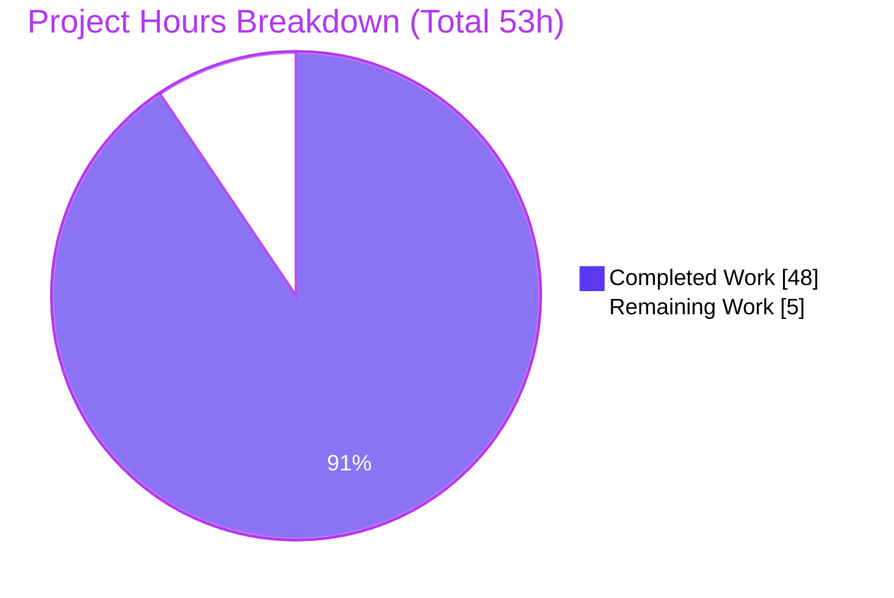
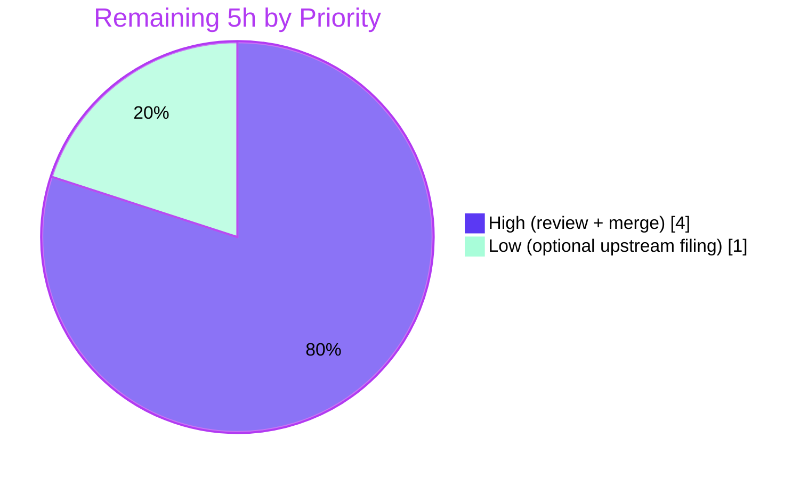

# Blitzy Project Guide — maddy Submission Sender-Identity & DKIM-Signing Investigation

> **Document type:** Investigative Q&A / Security-analysis documentation deliverable
> **Target repository:** `github.com/foxcpp/maddy` (mail server) — investigated read-only
> **Sole committed artifact:** `blitzy/documentation/maddy_26452dd8dd78.md`
> **Brand legend:** <span style="color:#5B39F3">■ Completed / AI Work (Dark Blue #5B39F3)</span> · □ Remaining / Not Completed (White #FFFFFF) · <span style="color:#B23AF2">Headings/Accents (#B23AF2)</span> · <span style="color:#A8FDD9">Highlights (Mint #A8FDD9)</span>

---

## Section 1 — Executive Summary

### 1.1 Project Overview

This project is an **empirical, evidence-first investigation** of how the maddy mail server enforces sender identity and message authentication on the authenticated submission path. Blitzy built maddy from source, ran a faithful throwaway server, drove it with four controlled sender-boundary experiments plus a fallback capture, inspected delivered mail byte-for-byte, attempted DKIM verification, and answered seven security questions strictly from observed behavior and code-as-truth. Target users are mail-server operators and security engineers evaluating maddy's submission authorization model. The technical scope is **read-only**: no maddy source file was changed. The single deliverable is one comprehensive Markdown report.

### 1.2 Completion Status


| Metric | Hours |
|---|---|
| **Total Hours** | **53** |
| Completed Hours (AI + Manual) | 48 (AI: 48, Manual: 0) |
| Remaining Hours | 5 |
| **Percent Complete** | **90.6%** |

> Completion is computed using AAP-scoped hours only: `48 / (48 + 5) = 48/53 = 90.6%`. All completed work was performed autonomously by Blitzy agents; the remaining 5h is human path-to-production (review + merge).

### 1.3 Key Accomplishments

- ✅ Built `cmd/maddy` and `cmd/maddyctl` from source with `CGO_ENABLED=1` (Go 1.18.10 + gcc 15.2.0); both binaries compile clean (EXIT 0).
- ✅ Stood up a faithful throwaway runtime **outside** the repo (authenticated `submission` listener, `sign_dkim`, SQLite local delivery, port-25 contrast block, self-signed TLS, two accounts, auto-generated DKIM key + `.dns`).
- ✅ Executed and captured **five** experiments verbatim: E1 (cross-user `MAIL FROM`), E2 (non-local domain), E3 (happy path), E4 (spoofed `From`), and the E5 `openssl s_client` fallback.
- ✅ Answered all **seven** security questions (Q1–Q7) with rationale and verbatim evidence; established the headline finding — maddy's submission path is **AUTH-required but sender-authorization-optional**.
- ✅ Surfaced **three** documentation-vs-runtime discrepancies, including a **PKCS#1-vs-PKIX published-key defect** (signatures unverifiable) and a `require_sender_match auth_user` **silent-skip inversion**.
- ✅ Delivered one Markdown report (519 lines, 44,422 bytes) with 42 balanced code fences and 62 verified `[path:Lstart-Lend]` citations across 14 source files.
- ✅ Proved repository integrity: `git diff --name-status 26452dd..HEAD` = single added doc; **zero** source files modified or deleted; all throwaway artifacts cleaned up.
- ✅ Independently re-verified compilation and the full Go test suite (20 packages OK, 0 FAIL, 232 test functions).

### 1.4 Critical Unresolved Issues

| Issue | Impact | Owner | ETA |
|---|---|---|---|
| _None — no blocking issues._ The deliverable is complete, committed, and independently validated (zero fixes required). | None | — | — |

> The only outstanding work is non-blocking human review/sign-off (see §1.6 and §2.2). The three *maddy* discrepancies documented in the report are **findings**, not defects in this deliverable.

### 1.5 Access Issues

| System/Resource | Type of Access | Issue Description | Resolution Status | Owner |
|---|---|---|---|---|
| _None_ | — | No access issues identified. The build toolchain (Go, gcc, openssl, python3) was present; the source repository was fully readable; no external services or credentials were required (DKIM verification used local mock DNS). | N/A | — |

**No access issues identified.**

### 1.6 Recommended Next Steps

1. **[High]** Have a mail/DKIM subject-matter expert validate the three core findings before organizational reliance: (a) no default sender↔auth binding, (b) the PKCS#1/PKIX unverifiable-key defect, (c) the `require_sender_match auth_user` silent-skip inversion. *(3h)*
2. **[High]** Review and merge `blitzy/documentation/maddy_26452dd8dd78.md`; confirm the single-file additive diff and clean working tree. *(1h)*
3. **[Low]** *(Optional)* File upstream issues with the maddy project for the discovered discrepancies (PKCS#1 public-key publishing; `require_sender_match` docs-vs-code mismatch + silent-skip). *(1h)*

---

## Section 2 — Project Hours Breakdown

### 2.1 Completed Work Detail

| Component | Hours | Description |
|---|---|---|
| [AAP O1] Faithful runtime build | 10 | Built `cmd/maddy` + `cmd/maddyctl` (`CGO_ENABLED=1`); authored throwaway `maddy.conf` mirroring shipped semantics (auth `submission` tls:465, `sign_dkim`, SQLite `all.db` local delivery, port-25 contrast w/ checks+dmarc, self-signed TLS); provisioned 2 accounts; auto-generated DKIM key + `.dns`. |
| [AAP O2] Sender-boundary experiments (E1–E5) | 10 | Scripted SMTP client with independent control of AUTH identity, envelope `MAIL FROM`, and `From` header; executed and captured E1–E4 plus the E5 `openssl s_client` fallback (verbatim transcripts, stored headers, debug logs). |
| [AAP O3a] Code-path correlation | 7 | Read and correlated the governing code paths; produced 62 verified `[path:Lstart-Lend]` citations across 14 files (`submission.go`, `smtp.go`, `msgpipeline.go`, `dkim.go`, `keys.go`, `check_runner.go`, `received.go`, `sql.go`, `maddy.conf`, `maddy-filters.5.scd`, etc.). |
| [AAP O3b] DKIM crypto + discrepancy analysis | 6 | Offline DKIM verification (go-msgauth + go-mockdns); diagnosed the PKCS#1-vs-PKIX key defect (Finding b-2); reproduced `require_sender_match` config-load validation and the `auth_user` silent-skip inversion. |
| [AAP O3c] RFC research + standards framing | 3 | Framed runtime findings against RFC 6409 (submission rights), RFC 6376 (DKIM), RFC 7489 (DMARC alignment); paraphrased, no normative text quoted. |
| [AAP O4a] Document authoring | 8 | Authored the 519-line / 44 KB report: objective/environment, decision-path overview (mermaid), per-experiment results, Q1–Q7 answers + rationale, standards framing, attestation. |
| [AAP O4b] QA reconciliation (5 commits) | 4 | Iterated across 5 commits addressing review/QA findings: expanded transcripts to fully verbatim, fenced the full DKIM error, corrected the source-base-vs-HEAD attestation, removed a dangling link. |
| **Total Completed** | **48** | |

### 2.2 Remaining Work Detail

| Category | Hours | Priority |
|---|---|---|
| Human SME security review & sign-off of findings | 3 | High |
| PR review & merge of deliverable | 1 | High |
| Optional upstream issue filing (discovered discrepancies) | 1 | Low |
| **Total Remaining** | **5** | |

> **Integrity check:** Section 2.1 (48h) + Section 2.2 (5h) = **53h** = Total Hours in §1.2. Remaining (5h) is identical in §1.2, §2.2, and the §7 pie chart.

---

## Section 3 — Test Results

All results below originate from **Blitzy's autonomous validation logs** (setup, Final Validator, and this assessor's independent re-runs). No new tests were authored (the AAP forbids modifying `*_test.go`); the maddy Go suite is run against the **unchanged** source, and the runtime experiments are the investigation's empirical validations.

| Test Category | Framework | Total Tests | Passed | Failed | Coverage % | Notes |
|---|---|---|---|---|---|---|
| Unit / Package | Go `testing` (`go test ./...`) | 232 | 232 | 0 | — (race-clean) | 20 packages OK, 0 FAIL, 26 packages [no test files]; re-run `-count=1` EXIT 0; CI parity `-cover -race` clean. Source byte-for-byte unchanged. |
| Runtime sender-boundary experiments | Custom SMTP client (Python smtplib) | 5 (E1–E5) | 5 | 0 | N/A | Every sender-boundary behavior matched the code-grounded prediction (E1 accepted, E2 `501 5.1.8` at RCPT, E3 accepted+signed, E4 accepted+unsigned, E5 fallback accepted). |
| Fallback wire capture | `openssl s_client` | 1 (E5) | 1 | 0 | N/A | Independent on-the-wire transcript confirmed reply codes match the maddy-log-derived transcripts. |
| DKIM verification & config-load probes | go-msgauth + go-mockdns; maddy config loader | 4 | 4 | 0 | N/A | "Passed" = the *predicted* outcome reproduced verbatim: b-2 PKCS#1 parse error, b-1 PKIX-corrected round-trip PASS, Q4 as-stored verification error, and `require_sender_match` value validation at config load. |
| **Totals** | | **242** | **242** | **0** | | Zero failures, zero panics across all categories. |

> **Compilation gate:** `go build ./...` and both `cmd/` binaries built EXIT 0 (CGO_ENABLED=1). Binary sizes are byte-identical to the setup/validator builds (maddy 19,386,704 B; maddyctl 19,613,960 B), confirming a reproducible build from unchanged source. Only output is the benign upstream `go-sqlite3 -Wreturn-local-addr` cgo warning (vendored C, non-fatal).

---

## Section 4 — Runtime Validation & UI Verification

**Runtime health (throwaway investigation server):**

- ✅ **Operational** — maddy started cleanly from the throwaway config; listeners bound on `submission` tls:465, `smtp` tcp:25, and `imap` tls:993.
- ✅ **Operational** — SQLite storage/auth backend (`all.db`) initialized; two accounts (`usera@`, `userb@maddytest.local`) created and authenticable via SASL PLAIN.
- ✅ **Operational** — DKIM key + public `.dns` TXT record auto-generated on first start (`writeDNSRecord`).
- ✅ **Operational** — graceful shutdown (SIGTERM); post-cleanup the former ports refuse connections.

**API / protocol integration outcomes:**

- ✅ **Operational** — SMTP submission AUTH enforced (`authAlwaysRequired=true`); authenticated sessions accepted.
- ✅ **Operational** — Acceptance/rejection behaved exactly as routed by envelope `MAIL FROM`: local-domain accepted; non-local rejected `501 5.1.8 "Non-local sender domain"` (observed at `RCPT TO`).
- ✅ **Operational** — DKIM signing applied on the aligned happy path (E3): deterministic body hash `bh=` reproduced byte-identical; `d=maddytest.local`, `s=default`.
- ⚠ **Partial (by design / finding)** — DKIM **verification** of maddy-signed mail fails on standard verifiers because the published key is PKCS#1 while go-msgauth expects PKIX (Finding b-2). This is a *documented finding about maddy*, not a deliverable defect.
- ✅ **Operational** — IMAP mailbox inspection retrieved delivered messages for byte-for-byte header extraction.

**UI verification:**

- ➖ **Not applicable** — maddy is a backend mail server with **no web/graphical UI**, and the deliverable is a Markdown document. No Figma assets or design system were supplied (AAP §0.8). UI/visual-fidelity protocols do not apply. Evidence capture was via SMTP transcripts, stored headers, and debug logs rather than screenshots.

---

## Section 5 — Compliance & Quality Review

Cross-mapping of AAP deliverables and the binding "SWE-AtlasQnA-Repo" ruleset to Blitzy quality/compliance benchmarks. Fixes applied during autonomous validation are noted; no outstanding items remain.

| Benchmark / Requirement | Status | Progress | Evidence / Notes |
|---|---|---|---|
| O1 — Build maddy + maddyctl, faithful runtime | ✅ Pass | 100% | Both binaries EXIT 0, byte-exact sizes; runtime stood up + reproduced. |
| O2 — Four sender-boundary experiments | ✅ Pass | 100% | E1–E4 executed + E5 fallback; all captured verbatim (doc §3). |
| O3 — Evidence-backed answers to all security questions | ✅ Pass | 100% | Q1–Q7 answered with rationale + verbatim evidence (doc §4). |
| O4 — Single Markdown report w/ rationale + attestation | ✅ Pass | 100% | 519-line deliverable committed; §6 cleanup + unchanged-source attestation. |
| Rule — Do NOT modify existing source files | ✅ Pass | 100% | `git diff --name-status 26452dd..HEAD` = single `A` line; zero M/D. |
| Rule — Do NOT add code besides the one document | ✅ Pass | 100% | Only `blitzy/documentation/maddy_26452dd8dd78.md` added; no `.go`/config files. |
| Rule — Place doc in `blitzy/documentation/` | ✅ Pass | 100% | Correct path confirmed. |
| Rule — Evidence-first, no assumptions (code-as-truth) | ✅ Pass | 100% | 62 citations spot-verified accurate against live source. |
| Rule — Verbatim evidence (transcripts, headers) | ✅ Pass | 100% | Raw `DKIM-Signature`, `Received`, presence/absence of `Authentication-Results` reproduced exactly; transcripts expanded to fully verbatim during QA. |
| Rule — Mandatory fallback if logging insufficient | ✅ Pass | 100% | E5 `openssl s_client` transcript captured as fallback. |
| Rule — ≥1 rejected + ≥1 accepted transaction captured | ✅ Pass | 100% | E2 rejected; E1/E3/E4/E5 accepted (doc §4 Q5). |
| Rule — Surface ≥1 config-vs-runtime discrepancy | ✅ Pass | 100% | Three surfaced (doc §4 Q7), each with verbatim runtime artifact. |
| Rule — Artifacts noted + DB/state cleaned up | ✅ Pass | 100% | Artifacts enumerated (doc §6.1); all deleted; ports closed. |
| Rule — Repository byte-for-byte unchanged | ✅ Pass | 100% | `git status` clean; ancestry + single-file-diff proof in doc §6.3. |
| Quality — Compilation clean | ✅ Pass | 100% | `go build ./...` EXIT 0 (only benign cgo warning). |
| Quality — Test suite green | ✅ Pass | 100% | `go test ./...` EXIT 0; 20 OK / 0 FAIL. |
| Quality — Markdown structural integrity | ✅ Pass | 100% | UTF-8 valid, 42 balanced fences, 14 anchor links resolve, single H1, no secret leakage. |

**Compliance verdict:** Fully compliant with the AAP and the user ruleset. All review/QA findings raised during autonomous validation were resolved within the 5-commit history (verbatim-transcript expansion, full DKIM error fencing, attestation correction). **No outstanding compliance items.**

---

## Section 6 — Risk Assessment

Overall risk profile is **Low**: a read-only investigation, byte-for-byte-unchanged source, a documentation-only deliverable, passing build/tests, and zero fixes required at final validation.

| Risk | Category | Severity | Probability | Mitigation | Status |
|---|---|---|---|---|---|
| Security findings warrant domain-expert validation before organizational reliance (no default sender↔auth binding; PKCS#1/PKIX unverifiable key; `auth_user` silent-skip) | Security | Medium | Low | Human SME review (P2P-1); all findings evidence-backed, citation-verified, and independently reproduced by the Final Validator | Open (planned) |
| Run-specific evidence tokens (DKIM `p=` bytes, message-IDs, `Received` IDs, `b=`/`t=`/`x=`) are not byte-reproducible across runs (maddy regenerates randomness) | Technical | Low | Medium | Document explicitly frames these as captures from one specific run; the deterministic `bh=` body hash matches exactly | Mitigated / Documented |
| 62 code citations pinned to source-base `26452dd`; line numbers could drift if applied to a different maddy version | Technical | Low | Low | Exact commit pinned in the document; source verified unchanged | Mitigated |
| Throwaway test credentials (`passwordA123`/`passwordB123`) appear in document text | Security | Low | Low | Test-only passwords for a deleted database; no real secrets; validator confirmed zero secret/token leakage | Accepted (informational) |
| Reproducing the investigation requires the documented toolchain (Go ≥1.13, gcc, openssl, `CGO_ENABLED=1`) | Operational | Low | Low | Development Guide (§9) lists exact prerequisites and tested commands | Mitigated |
| Merge of the single additive document into the repository documentation set | Integration | Low | Low | Standard PR review/merge (P2P-2); single file, source unchanged | Open (planned) |

> **Note:** maddy's own discovered defects (PKCS#1 key publishing; `require_sender_match` silent-skip) are **documented findings**, not risks introduced by this deliverable. The AAP task is to *observe and explain*, not to remediate; the optional upstream filing (P2P-3) is the natural follow-up.

---

## Section 7 — Visual Project Status

**Project hours (Completed vs Remaining):**



**Remaining work by priority (hours):**



**Completed work by AAP objective (hours):**

| Objective | Hours | Bar |
|---|---|---|
| O1 — Runtime build | 10 | <span style="color:#5B39F3">██████████</span> |
| O2 — Experiments E1–E5 | 10 | <span style="color:#5B39F3">██████████</span> |
| O3 — Analysis (code + crypto + RFC) | 16 | <span style="color:#5B39F3">████████████████</span> |
| O4 — Authoring + QA | 12 | <span style="color:#5B39F3">████████████</span> |

> **Integrity:** "Remaining Work" (5) equals §1.2 Remaining Hours and the §2.2 Hours total. "Completed Work" (48) equals the §2.1 Hours total. O1+O2+O3+O4 = 10+10+16+12 = 48.

---

## Section 8 — Summary & Recommendations

**Achievements.** The project delivered exactly what the AAP scoped: a faithful, built-from-source maddy runtime; five controlled sender-boundary experiments; verbatim, evidence-first answers to all seven security questions; and a single, well-structured Markdown report — all while leaving the maddy source tree **byte-for-byte unchanged**. The investigation's headline conclusion is that maddy's authenticated submission path is **AUTH-required but sender-authorization-optional**: the authenticated identity is never compared to the envelope `MAIL FROM` or the `From` header in the default configuration, so a cross-user envelope (E1) and a spoofed `From` (E4) are both *accepted and delivered* (the latter merely unsigned). Acceptance is gated purely by envelope-domain routing; signing is an independent decision that fails closed (skips signing) rather than rejecting.

**Remaining gaps & critical path.** The project is **90.6% complete** (48h of 53h). The remaining **5h** is entirely human path-to-production: (1) SME validation of the security findings, (2) PR review & merge, and (3) an optional upstream issue filing. The critical path is the SME sign-off — because the deliverable asserts security-relevant behaviors (including a genuine PKCS#1-vs-PKIX key defect and a `require_sender_match auth_user` silent-skip inversion), a domain expert should confirm the conclusions before they inform deployment decisions.

**Success metrics.** Build EXIT 0; full Go suite green (20/20 packages, 232 functions, 0 failures); all 5 experiments reproduced verbatim; 62/62 citations verified; single additive file with zero source changes; all throwaway artifacts cleaned up.

**Production-readiness assessment.** For a documentation deliverable, the artifact is **ready to merge** pending human review. There is no software to deploy, no infrastructure to provision, and no configuration to wire up (the AAP explicitly excludes real deployment, public DNS, and CA certificates). The investigation runtime was throwaway and already torn down. Recommended action: complete the SME review (§1.6 step 1), then merge (§1.6 step 2).

| Metric | Value |
|---|---|
| AAP-scoped completion | 90.6% |
| Completed / Total hours | 48 / 53 |
| Blocking issues | 0 |
| Source files changed | 0 (single doc added) |
| Build / Test status | EXIT 0 / 20 packages OK |

---

## Section 9 — Development Guide

This guide reproduces the investigation environment. Every command was tested in the Blitzy container (Ubuntu 25.10, Go 1.18.10). All artifacts must be created **outside** the maddy source tree.

### 9.1 System Prerequisites

- **OS:** Linux (x86-64). Verified on Ubuntu 25.10.
- **Go toolchain:** ≥ 1.13 (module floor); tested with `go1.18.10`.
- **C compiler:** `gcc` (or `clang`) — **mandatory** because the default SQLite storage/auth backend uses the cgo driver `github.com/mattn/go-sqlite3`. Tested with gcc 15.2.0.
- **TLS / capture tooling:** `openssl` (tested 3.5.3) for self-signed certs and the `s_client` fallback transcript.
- **Scriptable SMTP client:** `python3` (tested 3.13.7) `smtplib`, able to set the AUTH identity, envelope `MAIL FROM`, and `From` header independently.

### 9.2 Environment Setup

```bash
# CGO is REQUIRED (SQLite driver); enable module mode explicitly.
export GO111MODULE=on
export CGO_ENABLED=1

# Verify the toolchain.
go version          # expect: go1.18.10 (or >= 1.13)
gcc --version       # any recent gcc/clang
openssl version
python3 --version

# Confirm module integrity (no dependency changes were made).
go mod verify       # expect: all modules verified
```

### 9.3 Build

```bash
# From the repository root. Output to an OUT-OF-REPO directory.
mkdir -p /tmp/maddy-investigation/bin
go build -o /tmp/maddy-investigation/bin/maddy    ./cmd/maddy
go build -o /tmp/maddy-investigation/bin/maddyctl ./cmd/maddyctl

# Optional: build the entire module.
go build ./...
```

Expected: both commands exit **0**. The only console output is the benign upstream `go-sqlite3` warning (`sqlite3-binding.c … -Wreturn-local-addr`), which is non-fatal. Binary sizes: `maddy` ≈ 19,386,704 B; `maddyctl` ≈ 19,613,960 B. `maddy -v` prints `maddy unknown (built from source tree)`.

### 9.4 Run the Test Suite (verify unchanged source)

```bash
CGO_ENABLED=1 go test ./... -count=1            # expect EXIT 0: 20 ok, 0 FAIL
CGO_ENABLED=1 go test ./... -cover -race        # CI parity (slower)
CGO_ENABLED=1 go vet ./internal/modify/dkim/    # expect EXIT 0
```

### 9.5 Stand Up the Throwaway Runtime & Reproduce the Experiments

1. **Author `maddy.conf` outside the repo** (e.g. `/tmp/maddy-investigation/maddy.conf`) mirroring the shipped semantics:
   - `sql local_mailboxes local_authdb { driver sqlite3; dsn /tmp/maddy-investigation/run/all.db }`
   - `submission tls://0.0.0.0:465 { auth &local_authdb; source $(local_domains) { modify { sign_dkim $(primary_domain) default }; deliver_to &local_mailboxes }; default_source { reject 501 5.1.8 "Non-local sender domain" } }`
   - Contrast: `smtp tcp://0.0.0.0:25 { check { require_matching_ehlo; require_mx_record; verify_dkim; apply_spf }; dmarc yes; ... }`
   - `imap tls://0.0.0.0:993 { auth &local_authdb; storage &local_mailboxes }`
2. **Generate a self-signed cert** for the TLS listeners:
   ```bash
   openssl req -x509 -newkey rsa:2048 -nodes -days 1 \
     -keyout /tmp/maddy-investigation/certs/key.pem \
     -out    /tmp/maddy-investigation/certs/cert.pem \
     -subj "/CN=mail.maddytest.local"
   ```
3. **Start maddy** (auto-generates the DKIM key + `.dns` on first start):
   ```bash
   /tmp/maddy-investigation/bin/maddy -config /tmp/maddy-investigation/maddy.conf run &
   ```
4. **Create two accounts:**
   ```bash
   MADDY=/tmp/maddy-investigation/bin/maddyctl
   CONF=/tmp/maddy-investigation/maddy.conf
   "$MADDY" --config "$CONF" users create usera@maddytest.local
   "$MADDY" --config "$CONF" users create userb@maddytest.local
   "$MADDY" --config "$CONF" users list      # expect: usera@…, userb@…
   ```
5. **Drive the experiments** authenticated as `usera`, varying `MAIL FROM` / `From` independently (E1–E4) via a Python `smtplib` client; capture the E5 wire transcript with `openssl s_client -starttls smtp` / implicit-TLS connect.
6. **Inspect delivered mail** (raw headers) from `run/messages/` or via the IMAP endpoint / `maddyctl imap-msgs`.

### 9.6 Verification Steps

- Server up: connecting to `:465`/`:993` succeeds; `:25` responds to EHLO.
- Accounts present: `maddyctl … users list` shows both users.
- Accept path: aligned submission returns `250 2.0.0 OK: queued`; stored message carries a `DKIM-Signature` (E3).
- Reject path: non-local envelope returns `501 5.1.8 "Non-local sender domain"` (E2).
- No `Authentication-Results` on locally-delivered submission mail (the submission block carries no `check{}`/`dmarc`).

### 9.7 Cleanup (mandatory)

```bash
kill %1 2>/dev/null         # stop the maddy server you started
rm -rf /tmp/maddy-investigation   # remove all throwaway artifacts (db, keys, certs, transcripts)
```

### 9.8 Troubleshooting (verified cases)

- **Build fails with cgo/linker errors:** ensure `CGO_ENABLED=1` and a C compiler is installed (`gcc`). The SQLite driver requires it.
- **`-Wreturn-local-addr` warning during build:** benign upstream `go-sqlite3` warning in vendored C; non-fatal — the build still exits 0.
- **`require_sender_match auth` rejected at config load:** the *documented* value `auth` is invalid in code; valid values are `[envelope auth_domain auth_user off]`. (Documentation-vs-code discrepancy — see report §4 Q7.)
- **DKIM verification fails with `x509: failed to parse public key (use ParsePKCS1PublicKey instead …)`:** maddy publishes a **PKCS#1** public key while go-msgauth's verifier expects **PKIX**. This is Finding b-2 — the signature is real but unverifiable by standard verifiers.
- **Port 465 connection resets:** implicit-TLS listener requires a valid certificate; ensure the self-signed `cert.pem`/`key.pem` paths are correct in the config.

---

## Section 10 — Appendices

### Appendix A — Command Reference

| Purpose | Command |
|---|---|
| Build both binaries | `CGO_ENABLED=1 go build -o /tmp/maddy-investigation/bin/maddy ./cmd/maddy && CGO_ENABLED=1 go build -o /tmp/maddy-investigation/bin/maddyctl ./cmd/maddyctl` |
| Build full module | `CGO_ENABLED=1 go build ./...` |
| Run tests | `CGO_ENABLED=1 go test ./... -count=1` |
| CI-parity tests | `CGO_ENABLED=1 go test ./... -cover -race` |
| Static check | `CGO_ENABLED=1 go vet ./internal/modify/dkim/` |
| Module integrity | `go mod verify` |
| Version | `maddy -v` |
| List users | `maddyctl --config <conf> users list` |
| Create user | `maddyctl --config <conf> users create <user>@<domain>` |
| Inspect messages | `maddyctl --config <conf> imap-msgs ...` |
| Verify repo integrity | `git diff --name-status 26452dd8dd787dc455278b0fdd296f4a5432c768..HEAD` |
| Confirm clean tree | `git status --porcelain` |

### Appendix B — Port Reference

| Port | Listener | Role in investigation |
|---|---|---|
| 465 | `submission` (implicit TLS) | Authenticated submission endpoint exercised by E1–E5 (`auth &local_authdb`, `sign_dkim`, no checks). |
| 25 | `smtp` (plaintext/STARTTLS) | Contrast block carrying `check{}` + `dmarc yes`, used to compare `Authentication-Results` presence/absence. |
| 993 | `imap` (implicit TLS) | Mailbox inspection of delivered mail. |

### Appendix C — Key File Locations

| File | Role |
|---|---|
| `blitzy/documentation/maddy_26452dd8dd78.md` | **The deliverable** (sole committed artifact). |
| `internal/endpoint/smtp/submission.go` | `submissionPrepare` — `From` presence/syntax validation only (`[L27-L130]`). |
| `internal/endpoint/smtp/smtp.go` | AUTH, `OriginalFrom`, `AuthUser`, `authAlwaysRequired` (`[L589-L590]`), `Received`, registration. |
| `internal/msgpipeline/msgpipeline.go` | `srcBlockForAddr` envelope-based source selection (`[L155-L201]`). |
| `internal/modify/dkim/dkim.go` | `sign_dkim`, `require_sender_match` enum/default (`[L151-L152]`), `shouldSign` (`[L249-L330]`). |
| `internal/modify/dkim/keys.go` | Auto key-gen + `.dns` write; `MarshalPKCS1PublicKey` (`[L143]`), base64 `p=` (`[L158]`). |
| `internal/msgpipeline/check_runner.go` | `Authentication-Results` emission (`[L262-L303]`). |
| `internal/storage/sql/sql.go` | `CheckPlain` (`[L377]`), `prepareUsername` (`[L351]`). |
| `cmd/maddyctl/users.go` | `usersCreate` CLI entry (`[L30]`). |
| `maddy.conf` | Default submission/source/`default_source` semantics (`[L93-L120]`, reject `[L117-L119]`). |
| `docs/man/maddy-filters.5.scd` | Documented `require_sender_match` (`[L518-L544]`) — basis of the docs-vs-code finding. |

### Appendix D — Technology Versions

| Component | Version | Source |
|---|---|---|
| Go toolchain | go1.18.10 linux/amd64 (module floor `go 1.13`) | `go version` / `go.mod` |
| C compiler | gcc 15.2.0 | `gcc --version` |
| OpenSSL | 3.5.3 | `openssl version` |
| Python | 3.13.7 | `python3 --version` |
| `github.com/emersion/go-smtp` | v0.12.1-0.20191206174923-1f576e0ec85c | `go.mod` |
| `github.com/emersion/go-msgauth` | v0.3.2-0.20191028231513-55b75676976c | `go.mod` (DKIM sign/verify) |
| `github.com/foxcpp/go-imap-sql` | v0.3.2-0.20191208094750-8b4ec6b19a78 | `go.mod` (storage+auth) |
| `github.com/mattn/go-sqlite3` | v1.11.0 | `go.mod` (cgo SQLite) |
| `github.com/foxcpp/go-mockdns` | v0.0.0-20191123143003-02edb10da1e3 | `go.mod` (offline DKIM TXT) |

### Appendix E — Environment Variable Reference

| Variable | Value | Purpose |
|---|---|---|
| `CGO_ENABLED` | `1` | **Required** — enables the cgo SQLite driver; without it the build fails. |
| `GO111MODULE` | `on` | Forces module mode for a reproducible build. |
| `MADDY_CONFIG` | path to `maddy.conf` | Alternative to `--config`; selects the config file for `maddy`/`maddyctl`. |

### Appendix F — Developer Tools Guide

| Tool | Use |
|---|---|
| `git diff --name-status <base>..HEAD` | Prove the single-file additive footprint (zero source M/D). |
| `git merge-base --is-ancestor <base> HEAD` | Prove the source-base commit is an ancestor of HEAD (exit 0). |
| `git status --porcelain` | Confirm a clean working tree (no output). |
| `go mod verify` | Confirm no dependency tampering ("all modules verified"). |
| `go build ./...` / `go test ./...` | Reproduce the compilation and test gates from unchanged source. |
| `openssl s_client` | Capture an independent on-the-wire SMTP transcript (fallback evidence). |
| `go-mockdns` | Resolve the generated DKIM `.dns` TXT offline during verification. |

### Appendix G — Glossary

| Term | Meaning |
|---|---|
| MSA | Message Submission Agent — the authenticated submission entry point (RFC 6409). |
| `MAIL FROM` | SMTP envelope sender; in maddy, the sole input to source-block routing. |
| `From` (header) | Message header sender; validated for presence/syntax only on the submission path. |
| `AuthUser` | The SASL-authenticated identity; **not** compared to sender in the default config. |
| `sign_dkim` | maddy modifier that attaches a `DKIM-Signature` when `shouldSign` permits. |
| `require_sender_match` | `sign_dkim` option gating signing; enum `{envelope, auth_domain, auth_user, off}`, default `{envelope, auth}`. |
| DKIM (RFC 6376) | Cryptographic message signature; does not itself require `d=` to align with `From`. |
| DMARC (RFC 7489) | Policy layer requiring identifier alignment between `d=`/SPF and the `From` domain. |
| PKCS#1 / PKIX | RSA public-key encodings; maddy publishes PKCS#1, go-msgauth's verifier expects PKIX (Finding b-2). |
| Fail-open-for-delivery / fail-closed-for-signing | maddy's posture: a misaligned message is delivered, just unsigned. |
| Source-base commit | `26452dd8dd787dc455278b0fdd296f4a5432c768` — the unchanged maddy tree all citations reference. |

---

*Generated by the Blitzy Platform autonomous assessment agent. Completion (90.6%) reflects AAP-scoped and path-to-production work only. Completed = Dark Blue (#5B39F3); Remaining = White (#FFFFFF).*