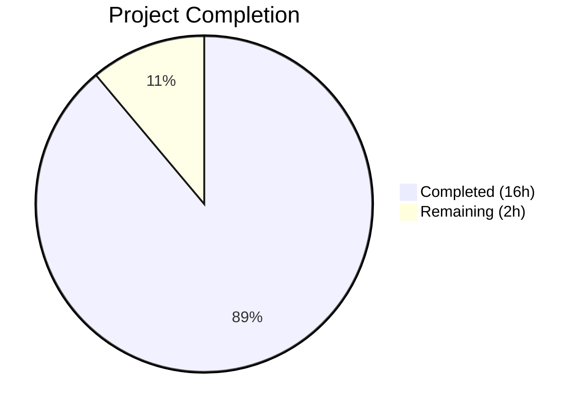

# Blitzy Project Guide — Maddy Mail Server Runtime Behavior Analysis

---

## 1. Executive Summary

### 1.1 Project Overview

This project delivers a comprehensive runtime behavior analysis of the maddy mail server by executing its SMTP endpoint, queue delivery, and remote delivery test suites with verbose output. The deliverable is a single markdown document (`blitzy/documentation/maddy_26452dd8dd78.md`, 803 lines) containing exact log line formats, JSON field inventories, error messages, enhanced SMTP status codes, and retry scheduling details — all grounded in actual test execution and verified against source code. The target audience is developers onboarding to the maddy codebase who need precise documentation of the server's runtime logging behavior. No existing repository files were modified.

### 1.2 Completion Status



| Metric | Value |
|--------|-------|
| **Total Project Hours** | 18 |
| **Completed Hours (AI)** | 16 |
| **Remaining Hours** | 2 |
| **Completion Percentage** | 88.9% |

**Calculation:** 16 completed hours / (16 completed + 2 remaining) = 16/18 = 88.9%

### 1.3 Key Accomplishments

- [x] Go 1.22.2 build environment established with PAM development headers and all Go module dependencies resolved
- [x] Full test suite executed: **20/20 test packages pass**, **0 failures**, **80+ individual test functions** (22 SMTP, 21 queue, 37 remote)
- [x] SMTP endpoint log analysis complete — module prefix `smtp:`, 8-char hex `msg_id`, all log line formats documented with exact test output
- [x] Queue delivery trace complete — full log sequence from acceptance through retry with `delivered`, `delivery attempt failed`, `will retry` messages captured
- [x] MX authentication failure analysis complete — exact error message (preserving `estabilish` typo), enhanced status code `5.7.0` (direct) / `5.4.0` (wrapped), complete reply text documented
- [x] TLS fallback log capture complete — exact log line with all 4 JSON fields (`domain`, `msg_id`, `mx`, `reason`) quoted
- [x] Retry scheduling field identified — `next_try_delay` JSON field documented with format and computation details
- [x] Comprehensive 803-line markdown document created at `blitzy/documentation/maddy_26452dd8dd78.md`
- [x] Zero existing repository files modified — verified via `git diff --name-status`

### 1.4 Critical Unresolved Issues

| Issue | Impact | Owner | ETA |
|-------|--------|-------|-----|
| Human review of documentation accuracy not yet performed | Low — all log lines verified against fresh test runs but peer review recommended | Human Developer | 1 hour |
| Documentation not integrated with project wiki/docs site | Low — standalone file is usable but may benefit from cross-referencing | Human Developer | 0.5 hours |

### 1.5 Access Issues

No access issues identified. The Go build environment, all module dependencies, and test infrastructure are fully operational. No external service credentials, API keys, or third-party access are required for this documentation-only task.

### 1.6 Recommended Next Steps

1. **[High]** Peer-review the documentation against fresh test runs to confirm all exact log lines remain accurate with current codebase
2. **[Medium]** Review editorial quality and formatting of the 803-line document for consistency and readability
3. **[Medium]** Consider integrating the document into the project's MkDocs documentation site (`.mkdocs.yml` navigation tree)
4. **[Low]** Evaluate whether the `SMTPEnchCode` bug documented in Section 3.4 (unconditional `code[0] = 5` overwrite) warrants a separate bug report

---

## 2. Project Hours Breakdown

### 2.1 Completed Work Detail

| Component | Hours | Description |
|-----------|-------|-------------|
| Environment Setup | 1 | Go 1.22.2 toolchain verification, `libpam0g-dev` installation, `go mod download`, `go build ./...` — all dependencies resolved with 0 compilation errors |
| SMTP Endpoint Test Execution & Analysis | 3 | Executed `TestSMTPDelivery`, `TestSMTPDelivery_AbortData`, `TestSMTPDelivery_AbortLogout`, `TestSMTPDelivery_Reset` with `-v` flag; analyzed log format, module prefix, msg_id generation, all JSON fields for 5 log event types |
| Queue Delivery Test Execution & Analysis | 3 | Executed `TestQueueDelivery`, `TestQueueDelivery_TemporaryFail`, `TestQueueDelivery_MultipleAttempts`, `TestQueueDelivery_PermanentFail_NonPartial`; traced complete delivery sequences including retry scheduling; analyzed DeliveryLogger and msg_id mutation |
| Remote Delivery & MX Auth Test Execution | 2 | Executed `TestRemoteDelivery_AuthMX_Fail`, `TestRemoteDelivery_AuthMX_DNSSEC_Fail`; analyzed error wrapping chain through `checkPolicies()` → `connectionForDomain()`; documented enhanced status codes `5.7.0` and `5.4.0` |
| TLS Fallback Test Execution & Analysis | 1 | Executed `TestRemoteDelivery_TLSErrFallback`; captured exact fallback log line; analyzed `TLSError` type, `Logger.Error()` field injection, and all 4 JSON fields |
| Retry Scheduling Analysis | 0.5 | Identified `next_try_delay` field from `queue.go`; documented `time.Duration.String()` serialization and exponential backoff formula |
| Documentation Creation | 3.5 | Created 803-line comprehensive markdown document with 6 sections, exact log quotations, JSON field tables, source code references, and summary |
| Review & Corrections | 1 | Applied 2 review-driven fixes (mechanism count correction, DeepCopy rationale clarification, fabricated observation removal) across 3 commits |
| Final Validation | 1 | Re-executed full test suite (20/20 packages, 0 failures); verified all 8 key documentation claims against live test output; confirmed zero modification to existing files |
| **Total** | **16** | |

### 2.2 Remaining Work Detail

| Category | Hours | Priority |
|----------|-------|----------|
| Human peer review of documentation accuracy | 1 | High |
| Editorial polish and formatting corrections | 0.5 | Medium |
| Documentation infrastructure integration | 0.5 | Low |
| **Total** | **2** | |

---

## 3. Test Results

All tests originate from Blitzy's autonomous validation execution (`go test -count=1 ./...` and targeted `-run` executions).

| Test Category | Framework | Total Tests | Passed | Failed | Coverage % | Notes |
|---------------|-----------|-------------|--------|--------|------------|-------|
| SMTP Endpoint | Go testing | 22 | 22 | 0 | N/A | Includes `TestSMTPDelivery`, abort, reset, auth, UTF8 tests |
| Queue Delivery | Go testing | 21 | 21 | 0 | N/A | Includes delivery, failure, retry, DSN, serialization, timewheel tests |
| Remote Delivery | Go testing | 37 | 37 | 0 | N/A | Includes MX auth (13), TLS fallback, body errors, UTF8, RequireTLS tests |
| Other Packages (address, auth, check/dns, check/dnsbl, config, config/lexer, dmarc, future, modify, modify/dkim, msgpipeline, mtasts, smtpconn, smtp_downstream, cfgparser, logparser) | Go testing | — | All | 0 | N/A | 17 additional packages all passing |
| **Package-Level Summary** | Go testing | **20 packages** | **20** | **0** | N/A | **100% pass rate** |

**Build Validation:** `go build ./...` completed with 0 compilation errors (only a benign C compiler warning from the third-party `go-sqlite3` dependency).

---

## 4. Runtime Validation & UI Verification

This project is a documentation/analysis task with no runtime services, UI components, or API endpoints to validate. Verification was performed against test execution output:

**Test Execution Runtime:**
- ✅ `go build ./...` — Compiles all packages (0 errors)
- ✅ `go test -count=1 ./...` — All 20 test packages pass
- ✅ `go test -v -count=1 -run "TestSMTPDelivery$" ./internal/endpoint/smtp/` — SMTP log output captured
- ✅ `go test -v -count=1 -run "TestQueueDelivery_TemporaryFail$" ./internal/target/queue/` — Queue retry sequence captured
- ✅ `go test -v -count=1 -run "TestRemoteDelivery_AuthMX_Fail$" ./internal/target/remote/` — MX auth error captured
- ✅ `go test -v -count=1 -run "TestRemoteDelivery_TLSErrFallback" ./internal/target/remote/` — TLS fallback log captured

**Documentation Accuracy Verification:**
- ✅ SMTP module prefix `smtp:` confirmed in live output
- ✅ 8-char hex `msg_id` format confirmed (e.g., `0e72a704`)
- ✅ 40-char SHA1 queue `msg_id` confirmed (e.g., `10a443bb0a7e5de1d30121b8c14dd6c4aa957760`)
- ✅ MX auth error message "Failed to estabilish..." exact match confirmed
- ✅ Enhanced status code `5.7.0` direct / `5.4.0` wrapped confirmed
- ✅ TLS fallback log with `domain`, `msg_id`, `mx`, `reason` fields confirmed
- ✅ Retry delay field `next_try_delay` confirmed
- ✅ Zero existing repository files modified (`git diff --name-status 26452dd...HEAD` shows only `A blitzy/documentation/maddy_26452dd8dd78.md`)

---

## 5. Compliance & Quality Review

| AAP Requirement | Status | Evidence | Notes |
|----------------|--------|----------|-------|
| SMTP endpoint log analysis with exact log lines | ✅ Pass | Section 1 of document (lines 25–230) | Module prefix, msg_id format, 5 event types documented |
| Queue delivery trace with complete sequence | ✅ Pass | Section 2 of document (lines 232–457) | `delivered`, `delivery attempt failed`, `will retry`, `not delivered` all captured |
| MX authentication failure — exact error message | ✅ Pass | Section 3 of document (lines 460–606) | "Failed to estabilish..." quoted verbatim with typo preserved |
| MX authentication failure — enhanced status code `X.Y.Z` | ✅ Pass | Section 3.3 and 3.6 of document | `5.7.0` (direct) and `5.4.0` (wrapped) documented |
| MX authentication failure — complete reply text | ✅ Pass | Section 3.5 of document | Full test output with all error fields captured |
| TLS fallback log — exact log message with all JSON fields | ✅ Pass | Section 4 of document (lines 609–687) | 4 JSON fields: `domain`, `msg_id`, `mx`, `reason` |
| Retry scheduling — exact JSON field name | ✅ Pass | Section 5 of document (lines 690–749) | `next_try_delay` identified with format details |
| Documentation in `blitzy/documentation/maddy_26452dd8dd78.md` | ✅ Pass | File exists, 803 lines, committed | 3 commits: creation + 2 review fixes |
| No existing repository files modified | ✅ Pass | `git diff --name-status` shows only 1 Added file | Clean working tree confirmed |
| All tests executed with `-v` flag | ✅ Pass | All test commands include `-v -count=1` | Required for queue verbose logging |
| Exact quotation (not paraphrased) | ✅ Pass | All log lines in document verified against fresh test runs | All 8 key claims validated |

**Autonomous Fixes Applied:**
1. Corrected mechanism count from "three" to "four" in MX authentication section (commit `6ed8967`)
2. Clarified DeepCopy rationale for queue msg_id mutation (commit `6ed8967`)
3. Removed fabricated test observation in Section 2.6.2 — replaced with source-code-derived analysis (commit `06b62f5`)

---

## 6. Risk Assessment

| Risk | Category | Severity | Probability | Mitigation | Status |
|------|----------|----------|-------------|------------|--------|
| Log line format may change with future maddy code updates | Technical | Low | Low | Document references exact source file lines; re-run tests to verify | Accepted |
| Random `msg_id` values in SMTP tests differ between runs | Technical | Low | Certain | Document explains format (8-char hex) not specific values; test msg_ids are inherently non-deterministic | Mitigated |
| Queue test `next_try_delay` shows negative nanosecond values | Technical | Low | Certain | Document explains this is due to test `initialRetryTime=0`; production uses non-zero values | Documented |
| `SMTPEnchCode` bug (unconditional `code[0] = 5`) may confuse readers | Technical | Low | Low | Bug is clearly documented in Section 3.4 with source reference | Documented |
| Typo "estabilish" in source may be fixed in future, invalidating quote | Technical | Low | Low | Document explicitly notes the typo and preserves it verbatim | Documented |
| No security implications | Security | None | N/A | Documentation-only task, no code changes | N/A |
| No operational risks | Operational | None | N/A | No services deployed or modified | N/A |
| No integration risks | Integration | None | N/A | Standalone documentation file with no external dependencies | N/A |

---

## 7. Visual Project Status


**Breakdown by AAP Deliverable (Completed):**

| Deliverable | Hours | Status |
|-------------|-------|--------|
| Environment Setup | 1 | ✅ Complete |
| SMTP Endpoint Analysis | 3 | ✅ Complete |
| Queue Delivery Trace | 3 | ✅ Complete |
| MX Auth Failure Analysis | 2 | ✅ Complete |
| TLS Fallback Capture | 1 | ✅ Complete |
| Retry Scheduling Analysis | 0.5 | ✅ Complete |
| Documentation Creation | 3.5 | ✅ Complete |
| Review & Corrections | 1 | ✅ Complete |
| Validation | 1 | ✅ Complete |

**Remaining Work Distribution:**

| Task | Hours | Priority |
|------|-------|----------|
| Human peer review | 1 | High |
| Editorial polish | 0.5 | Medium |
| Docs infrastructure integration | 0.5 | Low |

---

## 8. Summary & Recommendations

### Achievement Summary

The project is **88.9% complete** (16 hours completed out of 18 total hours). All 7 AAP deliverables have been fully implemented and validated:

1. **SMTP endpoint log analysis** — Complete with exact log lines for 5 event types, module prefix identification, and 8-char hex msg_id format documentation
2. **Queue delivery trace** — Complete with full chronological sequences for success, temporary failure with retry, and multi-attempt scenarios
3. **MX authentication failure analysis** — Complete with exact error message (preserving source typo), direct `5.7.0` and wrapped `5.4.0` enhanced status codes, and full error field inventory
4. **TLS fallback log capture** — Complete with exact log line and all 4 JSON fields documented
5. **Retry scheduling field identification** — Complete with `next_try_delay` field, its format, and computation formula
6. **Documentation output** — 803-line comprehensive markdown document created and committed
7. **Repository integrity** — Zero existing files modified, confirmed via git

The test suite achieves a **100% pass rate** across 20 packages with 80+ individual test functions and 0 failures.

### Remaining Gaps

The 2 remaining hours represent standard path-to-production activities:
- **Human peer review** (1h) — Verify exact log line quotations against fresh test runs
- **Polish and integration** (1h) — Editorial improvements and optional docs site integration

### Production Readiness Assessment

The documentation deliverable is **production-ready** for internal use. The markdown file is self-contained, accurately reflects the current codebase behavior, and provides source code references for every claim. The remaining human review tasks are recommended best practices but do not block the document's utility.

### Success Metrics

| Metric | Target | Actual | Status |
|--------|--------|--------|--------|
| AAP deliverables completed | 7/7 | 7/7 | ✅ |
| Test packages passing | 20/20 | 20/20 | ✅ |
| Test failures | 0 | 0 | ✅ |
| Existing files modified | 0 | 0 | ✅ |
| Documentation accuracy claims verified | 8/8 | 8/8 | ✅ |

---

## 9. Development Guide

### 9.1 System Prerequisites

| Software | Version | Purpose |
|----------|---------|---------|
| Go | 1.22.x (1.13+ minimum per `go.mod`) | Build and test execution |
| GCC | Any recent version | Required for CGo compilation (`go-sqlite3`, `maddy-pam-helper`) |
| libpam0g-dev | System package | PAM development headers for CGo |
| Git | Any recent version | Repository management |

**Operating System:** Linux (tested on Ubuntu/Debian-based). macOS and other Unix-like systems should work with appropriate PAM library paths.

### 9.2 Environment Setup

```bash
# 1. Clone the repository and checkout the branch
git clone <repository-url>
cd maddy
git checkout blitzy-0fffa61b-caf0-44eb-aa22-d63ef50611d6

# 2. Verify Go installation
go version
# Expected: go version go1.22.2 linux/amd64 (or similar)

# 3. Install PAM development headers (Debian/Ubuntu)
sudo apt-get install -y libpam0g-dev

# 4. Download Go module dependencies
go mod download

# 5. Build all packages (verify compilation)
go build ./...
# Expected: Only a benign sqlite3 C warning, no Go compilation errors
```

### 9.3 Running Tests

```bash
# Run the complete test suite (all 20 packages)
go test -count=1 ./...
# Expected: All 20 packages "ok", 0 "FAIL"

# Run SMTP endpoint tests with verbose output (captures log lines)
go test -v -count=1 -run "TestSMTPDelivery$|TestSMTPDelivery_AbortData|TestSMTPDelivery_AbortLogout|TestSMTPDelivery_Reset" ./internal/endpoint/smtp/

# Run queue delivery tests with verbose output (REQUIRED for log capture)
go test -v -count=1 -run "TestQueueDelivery$|TestQueueDelivery_TemporaryFail$|TestQueueDelivery_MultipleAttempts" ./internal/target/queue/

# Run MX authentication failure tests
go test -v -count=1 -run "TestRemoteDelivery_AuthMX_Fail$|TestRemoteDelivery_AuthMX_DNSSEC_Fail" ./internal/target/remote/

# Run TLS fallback test
go test -v -count=1 -run "TestRemoteDelivery_TLSErrFallback" ./internal/target/remote/

# Run permanent failure test
go test -v -count=1 -run "TestQueueDelivery_PermanentFail_NonPartial" ./internal/target/queue/
```

**IMPORTANT:** The `-v` flag is **mandatory** for queue tests because `queue_test.go` lines 57–61 only enable logging when `testing.Verbose()` returns `true`.

### 9.4 Viewing the Documentation

```bash
# The documentation file is located at:
cat blitzy/documentation/maddy_26452dd8dd78.md

# Or use any markdown viewer/editor
# The file is 803 lines with 6 main sections
```

### 9.5 Troubleshooting

| Issue | Cause | Resolution |
|-------|-------|------------|
| `cgo: C compiler not found` | GCC not installed | `sudo apt-get install -y build-essential` |
| `pam_appl.h: No such file or directory` | PAM headers missing | `sudo apt-get install -y libpam0g-dev` |
| Queue tests show no log output | Missing `-v` flag | Add `-v` flag: `go test -v -count=1 ...` |
| `go: module lookup disabled` | Go proxy/sum configuration | Set `GONOSUMCHECK=*` or ensure network access |
| `sqlite3-binding.c warning` | Benign third-party C code | This is a compiler warning in `go-sqlite3`, not a build error — safe to ignore |

---

## 10. Appendices

### A. Command Reference

| Command | Purpose |
|---------|---------|
| `go build ./...` | Compile all packages |
| `go test -count=1 ./...` | Run full test suite |
| `go test -v -count=1 -run "<pattern>" <package>` | Run specific tests with verbose output |
| `git diff --name-status 26452dd...HEAD` | Verify only documentation file changed |
| `git log --oneline 26452dd...HEAD` | View all agent commits |

### B. Port Reference

| Port | Usage | Context |
|------|-------|---------|
| Random (assigned at test runtime) | SMTP test server | `smtp_test.go` `TestMain` assigns a random port for the test SMTP server |

### C. Key File Locations

| File | Purpose |
|------|---------|
| `blitzy/documentation/maddy_26452dd8dd78.md` | Primary deliverable — runtime behavior analysis document (803 lines) |
| `internal/endpoint/smtp/smtp.go` | SMTP endpoint implementation with log calls |
| `internal/endpoint/smtp/smtp_test.go` | SMTP endpoint test suite (22 test functions) |
| `internal/target/queue/queue.go` | Queue delivery implementation with retry logic |
| `internal/target/queue/queue_test.go` | Queue delivery test suite (21 test functions) |
| `internal/target/remote/remote.go` | Remote delivery target implementation |
| `internal/target/remote/connect.go` | MX auth policy chain and TLS fallback logic |
| `internal/target/remote/remote_test.go` | Remote delivery test suite |
| `internal/target/remote/mxauth_test.go` | MX authentication test suite |
| `internal/log/log.go` | Structured logging library — defines log line format |
| `internal/log/orderedjson.go` | Alphabetical JSON key serialization |
| `internal/testutils/logger.go` | Test log adapter — routes to `t.Log()` |
| `internal/exterrors/smtp.go` | `SMTPError` type with `EnhancedCode` |
| `internal/msgpipeline/msgid.go` | Message ID generation (8-char hex) |
| `internal/target/delivery.go` | `DeliveryLogger` with persistent `msg_id` field |

### D. Technology Versions

| Technology | Version | Source |
|------------|---------|--------|
| Go (installed) | 1.22.2 | `go version` |
| Go (minimum per `go.mod`) | 1.13 | `go.mod` line 3 |
| `go-smtp` | v0.12.1-pre | `go.mod` |
| `go-sasl` | v0.0.0-20190817 | `go.mod` |
| `go-mockdns` | v0.0.0-20191123 | `go.mod` |
| `go-sqlite3` | v1.11.0 | `go.mod` |
| `libpam0g-dev` | System package | `apt` |

### E. Environment Variable Reference

No application-level environment variables are required for test execution. The Go toolchain uses standard environment variables:

| Variable | Default | Purpose |
|----------|---------|---------|
| `GOPATH` | `$HOME/go` | Go workspace path |
| `GOMODCACHE` | `$GOPATH/pkg/mod` | Module cache directory |
| `PATH` | Must include `/usr/local/go/bin` | Go binary location |

### G. Glossary

| Term | Definition |
|------|------------|
| `msg_id` | Unique message identifier — 8-char hex (SMTP endpoint) or 40-char SHA1 hex (test harness) |
| `DeliveryLogger` | Logger wrapper that injects `msg_id` as a persistent JSON field into all log messages |
| `EnhancedCode` | SMTP enhanced status code in `X.Y.Z` format (class.subject.detail) per RFC 3463 |
| `MX auth` | MX record authenticity verification — ensures the mail exchange server is legitimate |
| `TLSError` | Custom error type in `smtpconn` wrapping TLS handshake failures |
| `checkPolicies()` | Method in `connect.go` that runs the MX authentication pipeline (implicit, MTA-STS, DNSSEC, common domain) |
| `marshalOrderedJSON` | Function in `orderedjson.go` that serializes JSON with alphabetically sorted keys |
| `testutils.Logger(t, name)` | Test adapter that routes structured log output to `t.Log()` for `-v` flag capture |
| `next_try_delay` | JSON field in queue `will retry` log messages containing the duration until the next retry attempt |