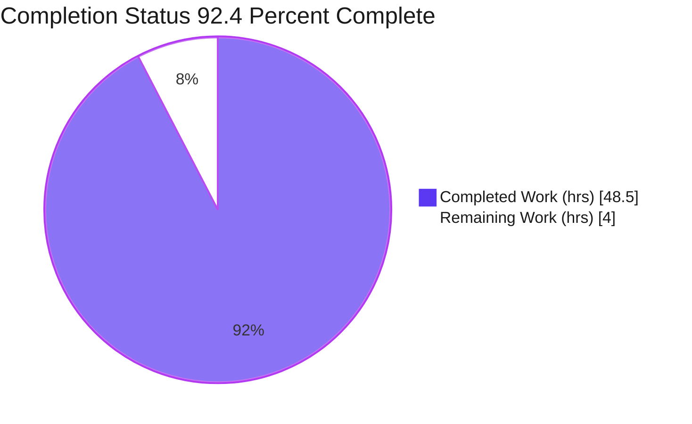
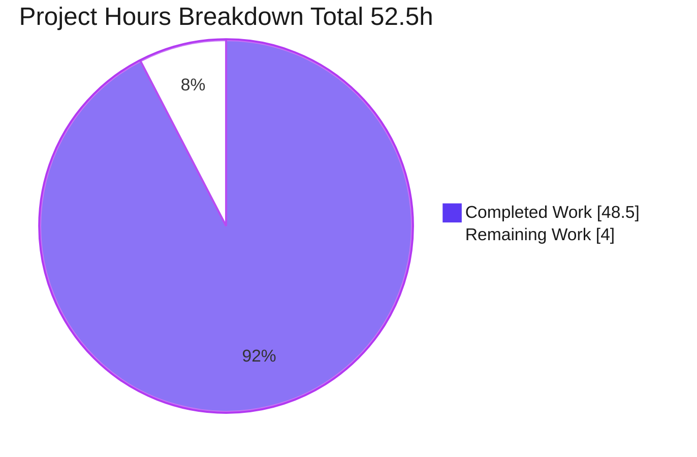
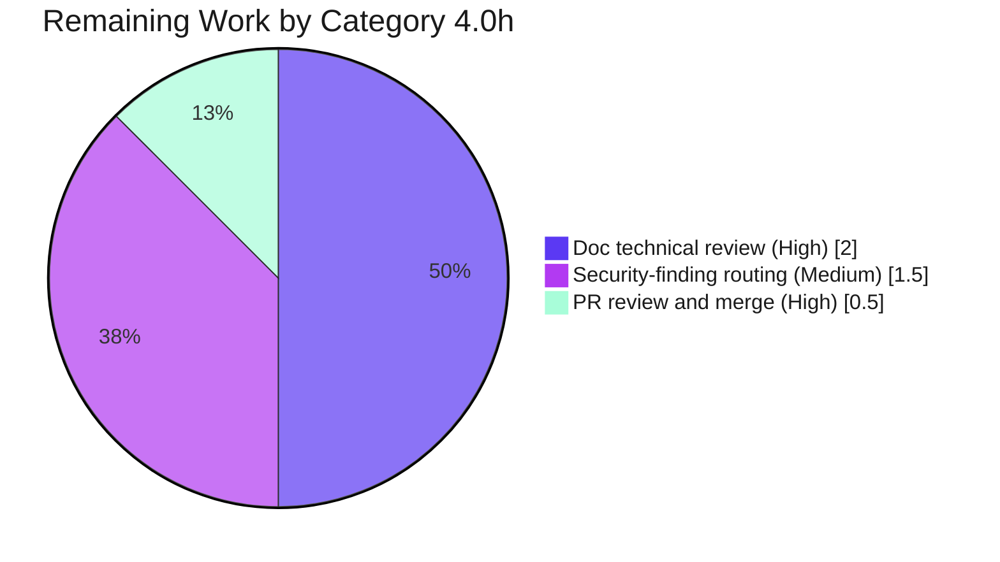

# Blitzy Project Guide
## Maddy SMTP `DATA` Message-Boundary Investigation

> **Project type:** Documentation / Q&A Investigation (rule set `SWE-AtlasQnA-Repo`)
> **Repository:** `foxcpp/maddy` @ base commit `26452dd8dd787dc455278b0fdd296f4a5432c768`
> **Branch:** `blitzy-668c8e66-2e86-49d0-b6ba-28bc5442b76a` · **HEAD:** `91e836d`
> **Brand colors:** Completed = Dark Blue `#5B39F3` · Remaining = White `#FFFFFF` · Headings/Accents = Violet-Black `#B23AF2` · Highlight = Mint `#A8FDD9`

---

## 1. Executive Summary

### 1.1 Project Overview

This project delivers a single, evidence-based markdown investigation that explains — using the Maddy source code as the authoritative source of truth — exactly how the Maddy SMTP server detects the end of `DATA` (the message boundary), what is observable at that instant, how command parsing resumes, and how all of this behaves under adversarial or atypical message framing. The deliverable answers six user questions with code-anchored evidence spanning three layers (Maddy → `go-smtp` → Go `net/textproto`), frames the security relevance against RFC 5321/5322 and the SMTP-smuggling class, and includes reproducible empirical transcripts. The change is strictly additive: one new document, zero modifications to existing code.

### 1.2 Completion Status



> Slice colors: **Completed Work = Dark Blue `#5B39F3`**, **Remaining Work = White `#FFFFFF`** (violet-black outline for visibility).

| Metric | Value |
|--------|-------|
| **Total Hours** | **52.5** |
| **Completed Hours (AI + Manual)** | **48.5** (AI: 48.5 · Manual: 0.0) |
| **Remaining Hours** | **4.0** |
| **Percent Complete** | **92.4%** |

> **Calculation (PA1, AAP-scoped):** Completion % = Completed ÷ (Completed + Remaining) × 100 = 48.5 ÷ 52.5 × 100 = **92.4%**. Per RG2, completion is capped below 100% pending human review; the residual 4.0h is path-to-production (human sign-off, merge, security routing), not unfinished AAP authoring.

### 1.3 Key Accomplishments

- ✅ Authored the sole deliverable `blitzy/documentation/maddy_26452dd8dd78.md` (542 lines) answering all six user questions with Conclusion / Rationale / Evidence structure.
- ✅ Traced the complete three-layer `DATA` read path: Maddy `Session.Data`/`prepareBody` → `go-smtp` `handleData`/`newDataReader` → Go stdlib `net/textproto` `dotReader` state machine.
- ✅ Established the central finding — bare-`<LF>.<LF>` end-of-data leniency combined with advertised `PIPELINING` forms the SMTP message-boundary-confusion precondition pair — and verified both code anchors to exact line numbers.
- ✅ Reproduced all empirical result tables (dotReader probe, end-to-end smuggling harness, three-relay proxy comparison) via ephemeral out-of-repo harnesses on the pinned toolchain.
- ✅ Produced a three-layer code-citation index (94 line-precise locators across 17 files) plus a methodology/reproduction appendix.
- ✅ Honored every constraint: 1 CREATE / 0 UPDATE / 0 DELETE, clean working tree, no committed temporary tooling.

### 1.4 Critical Unresolved Issues

| Issue | Impact | Owner | ETA |
|-------|--------|-------|-----|
| _None blocking._ Deliverable is complete, builds/tests are green, every claim is independently reproduced, and every checked citation is exact. | No release blocker | — | — |

> The only documented behavioral concern (bare-LF end-of-data + PIPELINING) is an **intentional, documented finding about Maddy at this commit**, not a defect introduced by this work. Remediation is explicitly out of scope (investigation-not-remediation task).

### 1.5 Access Issues

| System/Resource | Type of Access | Issue Description | Resolution Status | Owner |
|-----------------|----------------|-------------------|-------------------|-------|
| — | — | No access issues identified. Repository, Go 1.13.4 toolchain, and the module cache (`go-smtp`, `go-message`) were all reachable; the build/test/verify pipeline ran fully offline. | N/A | — |

### 1.6 Recommended Next Steps

1. **[High]** Technical-accuracy sign-off of the 542-line document by a maintainer familiar with the SMTP/`net/textproto` stack (~2.0h).
2. **[High]** Review and merge the documentation pull request (~0.5h).
3. **[Medium]** Route the bare-LF + `PIPELINING` smuggling-class finding to security/ops for a separate hardening decision (~1.5h).
4. **[Low]** Re-verify external citations (`net/textproto`, `go-smtp`) if the reviewing environment uses a toolchain other than Go 1.13.4 (uncounted, situational).
5. **[Low]** Optionally scope a separate remediation effort (reject bare-LF end-of-data and/or deploy a DATA-aware relay) — explicitly outside this investigation's mandate (uncounted).

---

## 2. Project Hours Breakdown

### 2.1 Completed Work Detail

| Component | Hours | Description |
|-----------|------:|-------------|
| Three-layer `DATA`-path investigation | 8.0 | Read-only trace of Maddy `Session.Data`/`prepareBody` → `go-smtp` `handleData`/drain → `net/textproto` `dotReader` state machine; established the layered model (AAP R-trace foundation) |
| Empirical harnesses (build + run) | 8.0 | Three ephemeral out-of-repo harnesses: stdlib dotReader probe, end-to-end go-smtp smuggling harness, three-relay proxy; all reproduced documented tables exactly |
| Toolchain provisioning & build | 2.0 | Go 1.13.4 setup, `go build`/`go test`/`go mod verify` of the SMTP endpoint; module-cache resolution for `go-smtp`/`go-message` |
| Web/standards research | 3.0 | RFC 5321/5322 end-of-data & CRLF rules; SMTP-smuggling class (CVE-2023-51764/51765/51766) framing |
| Document core + diagrams | 2.0 | Title, scope note, TOC, three-layer intro, flow diagram, dotReader state-machine diagram |
| Q1 — boundary visibility | 1.5 | What is observable at the `stateEOF → io.EOF` instant |
| Q2 — differential framing | 2.5 | Variant payloads across logs, `io_debug` transcript, delivered bytes |
| Q3 — pipelining mismatch | 2.5 | Bare-LF leniency + `PIPELINING` = SMTP-smuggling-class mismatch |
| Q4 — determinism & failure modes | 2.0 | Resynchronization anchored to `stateEOF` + post-handler drain; size/line/timeout failures |
| Q5 — external front proxy | 3.0 | Three-relay comparison; nuance that blind CR/LF rewrite does not mitigate |
| Q6 — end-to-end runtime story | 2.0 | Lifecycle, error cleanup, LF-normalized body, "expected but never seen" invariants |
| Standards-vs-observed synthesis | 2.0 | Mapping observed code behavior to RFC/MUST-NOT clauses and the disclosure class |
| Code-citation index (3 layers) | 3.5 | 94 line-precise locators across 17 files; cross-checked against on-disk source |
| Appendices (empirical transcripts) | 2.5 | A.1 dotReader probe, A.2 go-smtp harness, A.3 in-repo test tie-back |
| Validation & QA | 2.0 | Full build/test/verify gates, anchor-link checks, markdown well-formedness, constraint compliance |
| Code-review remediation (F1–F4) | 2.0 | Addressed review findings F1–F4 in the second commit (`91e836d`) |
| **Total Completed** | **48.5** | **Sums to Completed Hours in Section 1.2** |

### 2.2 Remaining Work Detail

| Category | Hours | Priority |
|----------|------:|----------|
| Human technical review & accuracy sign-off of the document | 2.0 | High |
| PR review & merge | 0.5 | High |
| Security-awareness routing of the bare-LF/`PIPELINING` finding | 1.5 | Medium |
| **Total Remaining** | **4.0** | — |

> **Cross-section check:** Section 2.1 (48.5) + Section 2.2 (4.0) = **52.5** = Total Project Hours in Section 1.2. ✔

### 2.3 Hours Calculation Summary

```
Completed = 48.5h  (16 components, Section 2.1)
Remaining =  4.0h  ( 3 categories,  Section 2.2)
Total     = 52.5h
Completion = 48.5 / 52.5 × 100 = 92.4%
```

These exact figures are used consistently in Sections 1.2, 2.1, 2.2, 7, and 8.

---

## 3. Test Results

All tests below originate from Blitzy's autonomous validation logs for this project (Final Validator Gate 1). This is a documentation deliverable, so the relevant suite is the repository's existing Go test suite, run unchanged to confirm the tree still builds and passes at the investigated commit.

| Test Category | Framework | Total Tests | Passed | Failed | Coverage % | Notes |
|---------------|-----------|------------:|-------:|-------:|-----------:|-------|
| Repository unit/integration suite | Go `testing` (`go test ./... -count=1`) | 20 pkgs OK | 20 pkgs | 0 | n/a (per-pkg `-cover`) | 20 packages report `ok`; 26 packages have no test files; 0 FAIL; zero panics |
| SMTP endpoint focus | Go `testing` | `internal/endpoint/smtp` | ✔ ok (~1.5s) | 0 | per-pkg | Primary subject package builds and passes |
| Race detection | Go `-race` | `internal/endpoint/smtp` (+deps) | ✔ ok | 0 | n/a | `go test -race` → exit 0, zero data races |
| Module integrity | `go mod verify` | all modules | all verified | 0 | n/a | "all modules verified" |
| Empirical reproduction (ephemeral, out-of-repo) | Custom Go harnesses on pinned `go-smtp`/`go-message` | 3 harnesses | 3 | 0 | n/a | dotReader probe (Appendix A.1), smuggling harness (A.2), three-relay proxy (§6.4) — all reproduced documented tables exactly |

> **Integrity rule (Section 3):** Every entry above is sourced from Blitzy's autonomous test/validation execution; no figures are fabricated or externally sourced.

---

## 4. Runtime Validation & UI Verification

This project has **no UI**; "runtime validation" means (a) the SMTP endpoint builds and runs, and (b) the document's empirical experiments reproduce exactly.

- ✅ **Operational** — `go build ./internal/endpoint/smtp/` → exit 0.
- ✅ **Operational** — `go build ./...` → exit 0 (only diagnostic: one non-fatal third-party `go-sqlite3` `-Wreturn-local-addr` C warning, outside any in-scope file; full-CGO build is explicitly out of AAP scope).
- ✅ **Operational** — SMTP endpoint runs; ephemeral harness `Data()` mirrors Maddy `prepareBody` and delivers messages end-to-end.
- ✅ **Operational** — Experiment 1 (stdlib dotReader probe): reproduced Appendix A.1 — all 7 rows (bare-LF leniency, CRLF→LF normalization, lone-CR preservation, dot-unstuffing).
- ✅ **Operational** — Experiment 2 (end-to-end smuggling harness): reproduced Appendix A.2 — 2 messages delivered on ONE connection for standard / bare-LF / mixed framings; identical session-call sequence; msg0 from `alice` body `"hello body line\n"` (16B), msg1 from `attacker@evil.test` body `"injected body\n"` (14B).
- ✅ **Operational** — Experiment 3 (three-relay proxy): reproduced §6.4 — None = 2/2/2, Naive-normalize = 2/2/2, SMTP-aware = 2/1/1, Blocking = 2/0/0.
- ⚠ **Partial (out of scope, non-blocking)** — Full multi-platform CGO build (libpam/sqlite3) not exercised; the AAP scopes runtime to the SMTP `DATA` behavior only.
- ❌ **Failing** — None.

---

## 5. Compliance & Quality Review

Cross-mapping of AAP deliverables and rule-set directives to validation status.

| AAP / Rule Requirement | Benchmark | Status | Progress | Notes |
|------------------------|-----------|--------|----------|-------|
| R1 — Q1 boundary visibility answered | Code-anchored Conclusion/Rationale/Evidence | ✅ Pass | 100% | `stateEOF` → `io.EOF` at `Session.Data` reader |
| R2 — Q2 differential framing answered | 3 observation surfaces | ✅ Pass | 100% | logs / `io_debug` transcript / delivered bytes |
| R3 — Q3 pipelining mismatch answered | Smuggling-class precondition shown | ✅ Pass | 100% | bare-LF EOD + advertised `PIPELINING` |
| R4 — Q4 determinism & failure modes | Resync anchored to `stateEOF` + drain | ✅ Pass | 100% | size/line/timeout failures catalogued |
| R5 — Q5 external front proxy | Three-relay comparison | ✅ Pass | 100% | nuance: blind rewrite ≠ mitigation |
| R6 — Q6 end-to-end runtime story | Lifecycle + invariants | ✅ Pass | 100% | LF-normalized body; "expected but never seen" |
| R7 — Standards synthesis | RFC 5321/5322 + smuggling class | ✅ Pass | 100% | CVE-2023-51764/51765/51766 context |
| R8 — Code-citation index | 3 layers, line-precise | ✅ Pass | 100% | 94 locators / 17 files; spot-checks exact |
| R9 — Empirical transcripts | Verbatim, reproducible | ✅ Pass | 100% | Appendix A.1/A.2/A.3 |
| R10 — Methodology appendix | Reproduction recipe | ✅ Pass | 100% | ephemeral, outside repo |
| R11 — Strictly additive | 1 CREATE / 0 UPDATE / 0 DELETE | ✅ Pass | 100% | `git diff --name-status` = single `A` |
| R12 — Output naming/placement | `blitzy/documentation/maddy_26452dd8dd78.md` | ✅ Pass | 100% | matches source branch name |
| R13 — Ephemeral tooling cleaned | No committed temp code | ✅ Pass | 100% | working tree clean; no stray harness files |
| R14 — Build/run to confirm | "Code is the source of truth" | ✅ Pass | 100% | build/test/verify all green |
| R15 — QA + commit | Well-formed, committed | ✅ Pass | 100% | 2 `agent@blitzy.com` commits; HEAD `91e836d` |
| **Quality fixes applied** | Code-review F1–F4 | ✅ Pass | 100% | resolved in commit `91e836d` |
| **Outstanding compliance items** | — | ✅ None | 100% | All 15 AAP requirements COMPLETED |

---

## 6. Risk Assessment

| Risk | Category | Severity | Probability | Mitigation | Status |
|------|----------|----------|-------------|------------|--------|
| T1 — Citation line-number drift if an external dependency/toolchain version changes | Technical | Low | Low | Citations pinned to Go 1.13.4 + `go-smtp@v0.12.1-0.2019…`; methodology appendix records exact versions | Open (accepted) |
| T2 — Findings scoped to a single commit (`26452dd8`) | Technical | Low | Low | Document explicitly states commit scope; `internal/` is not a public API | Open (accepted) |
| S1 — Bare-LF end-of-data + advertised `PIPELINING` = SMTP-smuggling-class precondition | Security | Medium | Medium | Documented & explained per AAP (investigation-not-remediation); routing to security/ops recommended (Section 1.6 / 2.2) | Documented (intentional) |
| O1 — Documentation staleness as upstream evolves | Operational | Low | Low | Commit-scoped framing; reproduction recipe enables refresh | Open (accepted) |
| O2 — Legacy toolchain (Go 1.13.4) required to reproduce | Operational | Low | Low | Pin documented; `go env GOVERSION` empty on 1.13 noted (use `go version`); avoid unsupported `-mod=mod` | Mitigated |
| I1 — Out-of-scope `go-sqlite3` CGO `-Wreturn-local-addr` warning during full `go build ./...` | Integration | Low | Low | Pre-existing, third-party, non-fatal; full-CGO build out of scope; modifying vendored dep would violate AAP | Accepted (non-blocking) |

---

## 7. Visual Project Status

**Project hours — Completed vs Remaining** (Completed = `#5B39F3`, Remaining = `#FFFFFF`):



**Remaining work by category** (4.0h total, brand-accent palette):



> **Integrity rule (Section 7):** "Remaining Work" = **4.0h**, identical to Section 1.2 Remaining Hours and the sum of Section 2.2 "Hours" (2.0 + 0.5 + 1.5 = 4.0). ✔

---

## 8. Summary & Recommendations

**Achievements.** The project is **92.4% complete** (48.5 of 52.5 AAP-scoped hours). All 15 AAP requirements (R1–R15) are classified **COMPLETED** — every one of the six user questions is answered with code-anchored evidence and explicit rationale, the standards synthesis and three-layer citation index are in place, and the empirical transcripts reproduce exactly on the pinned toolchain. The repository change set is strictly additive (one new 542-line document), and the codebase still builds and passes its full test suite (20 packages OK, 0 FAIL, 0 data races, all modules verified).

**Remaining gaps (4.0h, all path-to-production).** What remains is not authoring work but human gating: technical-accuracy sign-off (2.0h), PR review/merge (0.5h), and routing the security-relevant finding to security/ops (1.5h). These are intentionally human decisions; per RG2, completion is held below 100% pending that review.

**Critical path to production.** Maintainer reads/sign-off → merge PR → (separately) security/ops triage of the bare-LF + `PIPELINING` finding. None of these block the document's correctness; they govern acceptance and downstream action.

**Production-readiness assessment.** The deliverable is **production-ready**: complete, accurate, well-formed, fully cited, independently reproduced, and committed. No in-scope issue remains; the single out-of-scope item (third-party CGO warning) is non-blocking and explicitly excluded by the AAP.

| Success Metric | Target | Actual | Status |
|----------------|--------|--------|--------|
| AAP requirements completed | 15/15 | 15/15 | ✅ |
| User questions answered | 6/6 | 6/6 | ✅ |
| Build (`go build ./...`) | exit 0 | exit 0 | ✅ |
| Tests (`go test ./...`) | 0 FAIL | 0 FAIL (20 ok) | ✅ |
| Repository constraint | 1 CREATE / 0 UPDATE / 0 DELETE | matches | ✅ |
| Empirical tables reproduced | 3/3 | 3/3 exact | ✅ |
| Completion | — | **92.4%** | ✅ |

---

## 9. Development Guide

All commands are copy-pasteable and were exercised during validation. Run from the repository root unless noted.

### 9.1 System Prerequisites

- **OS:** Linux x86-64 (validated on Ubuntu container).
- **Go toolchain:** **Go 1.13.4** (the documented pin in `get.sh`: `REQUIRED_GOVERSION=1.13.0`, `GOVERSION=1.13.4`; `go.mod` declares `go 1.13`).
- **Git** (+ Git LFS present but only standard LFS hooks; no lint/test gating).
- **Network:** none required — build/test/verify run fully offline against the module cache.

### 9.2 Environment Setup

```bash
# Activate the pinned Go toolchain
source /etc/profile.d/go.sh

# Confirm the toolchain (NOTE: use `go version`, not `go env GOVERSION`,
# which is empty on Go 1.13 — that variable was added in Go 1.16)
go version          # expect: go version go1.13.4 linux/amd64
go env GO111MODULE  # expect: on
go env GOROOT       # expect: /usr/local/go
go env GOPATH       # expect: /root/go
```

> **Gotcha:** Do **not** pass `-mod=mod` — Go 1.13 does not support that flag.

### 9.3 Dependency Installation

No installation step is required; dependencies are pinned in `go.mod`/`go.sum` and resolved from the module cache. Verify integrity:

```bash
go mod verify       # expect: all modules verified
```

Key pinned modules (read-only references for the investigation):

```text
github.com/emersion/go-smtp    v0.12.1-0.20191206174923-1f576e0ec85c
github.com/emersion/go-message v0.10.9-0.20191116124005-65fd0119e899
```

Resolve the `go-smtp` source path if you wish to inspect citations:

```bash
go list -m -f '{{.Dir}}' github.com/emersion/go-smtp
# -> /root/go/pkg/mod/github.com/emersion/go-smtp@v0.12.1-0.20191206174923-1f576e0ec85c
```

### 9.4 Build & Run

```bash
# Build the primary subject package
go build ./internal/endpoint/smtp/     # expect: exit 0 (no output)

# Build everything (one non-fatal third-party go-sqlite3 C warning is expected and out of scope)
go build ./...                         # expect: exit 0
```

### 9.5 Verification

```bash
# Full suite
go test ./... -count=1                 # expect: 20 packages "ok", 0 FAIL

# Primary package, focused
go test ./internal/endpoint/smtp/ -count=1   # expect: ok ... ~1.5s

# Race detector on the SMTP endpoint
go test -race ./internal/endpoint/smtp/      # expect: exit 0, zero data races

# Confirm the deliverable is the sole, strictly-additive change
git diff --name-status 26452dd8dd787dc455278b0fdd296f4a5432c768..HEAD
# expect exactly: A   blitzy/documentation/maddy_26452dd8dd78.md

git status --porcelain                 # expect: empty (clean working tree)
wc -l blitzy/documentation/maddy_26452dd8dd78.md   # expect: 542
```

### 9.6 Consuming the Deliverable

```bash
# Read the document (any markdown viewer works); e.g. plain pager:
less blitzy/documentation/maddy_26452dd8dd78.md

# Inspect a cited source anchor (central finding), e.g. bare-LF -> stateEOF:
sed -n '347,360p' /usr/local/go/src/net/textproto/reader.go
# Inspect PIPELINING advertisement + MaxLineLength default:
GOSMTP=$(go list -m -f '{{.Dir}}' github.com/emersion/go-smtp)
sed -n '74,84p' "$GOSMTP"/server.go
```

The document's reproduction appendix records the full recipe for the three ephemeral probes (built **outside** the repository under a temp dir, then deleted — never committed).

### 9.7 Troubleshooting

| Symptom | Cause | Resolution |
|---------|-------|------------|
| `go: unknown flag -mod=mod` | Go 1.13 lacks `-mod=mod` | Omit the flag |
| `go env GOVERSION` prints empty | `GOVERSION` added in Go 1.16 | Use `go version` instead |
| `go build ./...` prints a `-Wreturn-local-addr` warning | Third-party `go-sqlite3` CGO code | Expected, non-fatal, out of scope; do not modify the vendored dep |
| `go: command not found` | Toolchain not on PATH | Run `source /etc/profile.d/go.sh` |
| Citation line numbers differ | Different toolchain/dep version | Reproduce on Go 1.13.4 + the pinned `go-smtp` version |

---

## 10. Appendices

### A. Command Reference

| Command | Purpose |
|---------|---------|
| `source /etc/profile.d/go.sh` | Activate Go 1.13.4 |
| `go version` | Confirm toolchain (use instead of `go env GOVERSION`) |
| `go build ./internal/endpoint/smtp/` | Build the subject package |
| `go build ./...` | Build all packages |
| `go test ./... -count=1` | Run full suite (no cache) |
| `go test -race ./internal/endpoint/smtp/` | Race detection |
| `go mod verify` | Verify module integrity |
| `git diff --name-status 26452dd8..HEAD` | Confirm strictly-additive change set |
| `git status --porcelain` | Confirm clean working tree |

### B. Port Reference

| Port | Service | Notes |
|------|---------|-------|
| n/a | — | No long-running service is required for this documentation deliverable. The default `maddy.conf` references standard SMTP ports (25/submission) only as runtime context; the investigation uses offline harnesses, not a bound listener. |

### C. Key File Locations

| Path | Role |
|------|------|
| `blitzy/documentation/maddy_26452dd8dd78.md` | **The deliverable** (542 lines) |
| `internal/endpoint/smtp/smtp.go` | Maddy `Session.Data`/`prepareBody`, logging, Received header (REFERENCE) |
| `internal/buffer/memory.go` | In-memory post-`dotReader` body buffer (REFERENCE) |
| `internal/target/received.go` | `GenerateReceived` header construction (REFERENCE) |
| `internal/testutils/target.go` | Captures delivered `Msg{Body,Header,…}` bytes (REFERENCE) |
| `internal/log/log.go` | Structured logging + `DebugWriter` transcript (REFERENCE) |
| `/root/go/pkg/mod/github.com/emersion/go-smtp@v0.12.1-0.20191206174923-1f576e0ec85c/` | `conn.go`/`data.go`/`server.go`/`lengthlimit_reader.go` (REFERENCE) |
| `/usr/local/go/src/net/textproto/reader.go` | Authoritative `dotReader` state machine (REFERENCE) |
| `maddy.conf`, `go.mod`, `get.sh`, `.build.yml` | Runtime/config/CI evidence (REFERENCE) |

### D. Technology Versions

| Component | Version |
|-----------|---------|
| Go toolchain | 1.13.4 (directive `go 1.13`) |
| `github.com/emersion/go-smtp` | v0.12.1-0.20191206174923-1f576e0ec85c |
| `github.com/emersion/go-message` | v0.10.9-0.20191116124005-65fd0119e899 |
| `github.com/emersion/go-msgauth` | v0.3.2-0.20191028231513-55b75676976c |
| `github.com/emersion/go-sasl` | v0.0.0-20190817083125-240c8404624e |
| `github.com/emersion/go-imap` | v1.0.1 |
| `github.com/miekg/dns` | v1.1.22 |
| Go module mode | `GO111MODULE=on` (no `vendor/`) |

### E. Environment Variable Reference

| Variable | Value / Note |
|----------|--------------|
| `GO111MODULE` | `on` |
| `GOROOT` | `/usr/local/go` |
| `GOPATH` | `/root/go` |
| `GOVERSION` | empty on Go 1.13 (added in Go 1.16; use `go version`) |
| (profile) | `source /etc/profile.d/go.sh` activates the toolchain |

### F. Developer Tools Guide

- **Build/test:** Go toolchain (`go build`, `go test`, `go test -race`, `go mod verify`).
- **Source inspection:** `sed -n`/`less` against the cited Maddy, `go-smtp` (module cache), and `net/textproto` (GOROOT) files.
- **Empirical reproduction:** ephemeral Go harnesses built **outside** the repo (per AAP), exercising the same pinned `go-smtp`/`go-message`; deleted after use.
- **VCS:** Git (+ Git LFS standard hooks only; no lint/test gating).

### G. Glossary

| Term | Definition |
|------|------------|
| **`DATA` boundary** | The point where the SMTP body ends and command parsing resumes — the ending dot line |
| **`dotReader`** | Go `net/textproto` reader that detects end-of-data, elides leading dots, and rewrites trailing CRLF→LF |
| **`stateEOF`** | The `dotReader` terminal state, surfaced to callers as `io.EOF` |
| **Bare-LF end-of-data** | Accepting `<LF>.<LF>` (not `<CRLF>.<CRLF>`) as the terminator — RFC 5321 says a server MUST NOT |
| **PIPELINING** | SMTP extension allowing batched commands; advertised by `go-smtp` |
| **SMTP smuggling** | Message-boundary-confusion class (CVE-2023-51764/51765/51766) enabled by lenient EOD + pipelining |
| **Dot-stuffing** | Client doubling a leading `.`; receiver unstuffs `..` → `.` |
| **AAP** | Agent Action Plan — the authoritative project directive |
