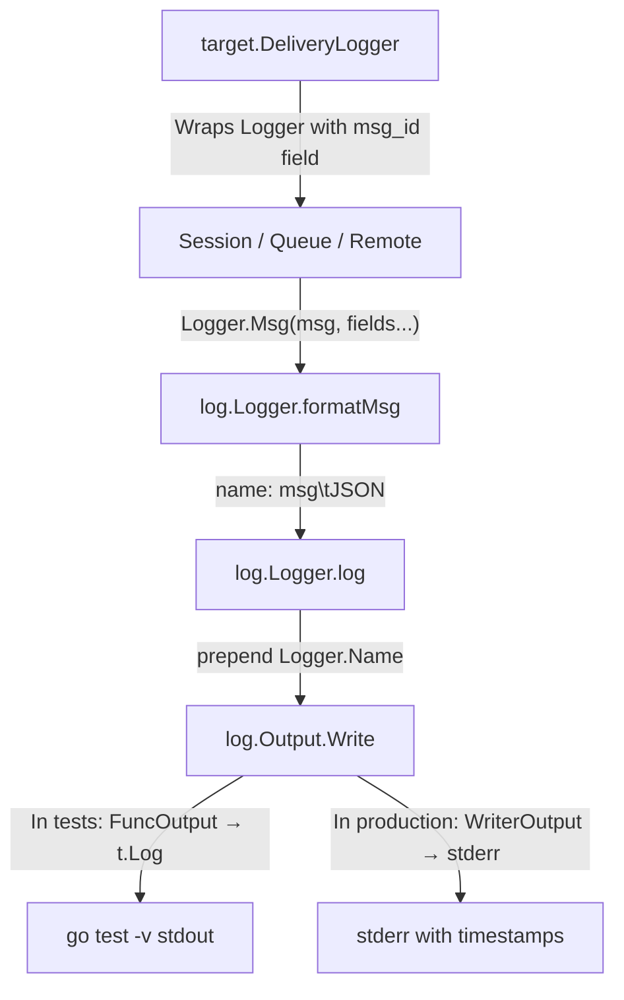

# Technical Specification

# 0. Agent Action Plan

## 0.1 Intent Clarification

### 0.1.1 Core Feature Objective

Based on the prompt, the Blitzy platform understands that the new feature requirement is to **produce a comprehensive diagnostic investigation document** for the maddy mail server codebase by executing its test suites, tracing runtime behavior through actual log output, and capturing precise details about the system's SMTP, queue, and remote delivery subsystems. Specifically, the requirements are:

- **SMTP Endpoint Log Tracing**: Run the SMTP endpoint tests with verbose output to observe the exact structured log messages emitted during a successful delivery (incoming message, RCPT acceptance, final acceptance) versus an aborted delivery (DATA error, session abort). The user needs the complete JSON field structure of each log line.
- **Module Name and Message ID Format Identification**: From the SMTP test output, identify the exact logger module name prefix used for SMTP operations and the format of the `msg_id` field (e.g., 8-character hex).
- **Queue Delivery Lifecycle Tracing**: Run the queue delivery tests and capture the complete sequence of log messages from initial acceptance through delivery failure and retry scheduling. Quote exact log lines showing delivery attempts, failures, and retry scheduling with all JSON fields.
- **Remote Delivery MX Authentication Failure Tracing**: Run the remote delivery tests covering MX authenticity checks, capture the exact error message string produced when MX authentication fails, including the precise SMTP enhanced status code in `X.Y.Z` format and the complete reply text.
- **TLS Fallback Behavior**: From the remote delivery TLS fallback test, capture the exact log message emitted when the system falls back from TLS to plaintext, including all JSON fields in the structured log output.
- **Queue Retry Scheduling Log Analysis**: From the queue retry tests, capture the retry scheduling log line and identify the exact JSON field name that contains the retry delay value.

### 0.1.2 Special Instructions and Constraints

- **CRITICAL: Read-Only Repository Constraint**: The user explicitly specifies: "Don't modify repository files; temporary scripts are fine but clean them up afterward." No existing source files in the repository may be created, modified, or deleted.
- **Implementation Rule — SWE-AtlasQnA-Repo**: Per the user-specified implementation rule, a new markdown document named after the source branch must be created in the `blitzy/documentation` directory in the destination repo. The document must comprehensively answer the questions posed, base answers on the code as truth, and include thinking/rationale.
- **Evidence-Based Answers Only**: All answers must be derived from actual test execution output and source code analysis—no assumptions or generalizations.
- **No Persistent Code Changes**: Only the final documentation markdown file is to be produced. No test scripts or temporary files should remain in the repository.

### 0.1.3 Technical Interpretation

These feature requirements translate to the following technical implementation strategy:

- To **trace SMTP endpoint behavior**, we will execute `go test -v -count=1 -run "TestSMTPDelivery$|TestSMTPDelivery_AbortData|TestSMTPDelivery_AbortLogout|TestSMTPDelivery_Multi" ./internal/endpoint/smtp/` and analyze the structured log output emitted by the `testutils.Logger` output through `log.FuncOutput`.
- To **identify the module name and msg_id format**, we will inspect the log prefix from the SMTP test output (which uses `testutils.Logger(t, "smtp")`) and the `msgpipeline.GenerateMsgID()` function that generates 4-byte random hex identifiers.
- To **trace queue delivery lifecycle**, we will execute `go test -v -count=1 -run "TestQueueDelivery_TemporaryFail$|TestQueueDelivery_MultipleAttempts" ./internal/target/queue/` and capture the `delivered`, `delivery attempt failed`, `will retry`, and `not delivered, permanent error` log messages.
- To **capture MX authentication failure details**, we will execute `go test -v -count=1 -run "TestRemoteDelivery_AuthMX_Fail$" ./internal/target/remote/` and extract the SMTP error code, enhanced code, and message from the test output.
- To **capture TLS fallback behavior**, we will execute `go test -v -count=1 -run "TestRemoteDelivery_TLSErrFallback$" ./internal/target/remote/` and quote the exact log line including all JSON fields.
- To **produce the deliverable**, we will create a single markdown file at `blitzy/documentation/<source_branch_name>.md` containing all findings with exact log line quotations and rationale.


## 0.2 Repository Scope Discovery

### 0.2.1 Comprehensive File Analysis

The investigation spans the following key source and test files across the maddy codebase. Since this is a documentation-only task (no source modifications), the analysis focuses on files that must be read, executed, and referenced to produce the deliverable.

**SMTP Endpoint Module** — files providing the SMTP server session logic and logging:

| File Path | Purpose | Relevance |
|-----------|---------|-----------|
| `internal/endpoint/smtp/smtp.go` | Core SMTP endpoint: session lifecycle, `Mail()`, `Rcpt()`, `Data()`, `Logout()`, log emission | Primary analysis target — all SMTP log messages originate here |
| `internal/endpoint/smtp/smtp_test.go` | Tests for SMTP delivery, abort, reset, check errors, multi-delivery, submission auth | Executed to observe runtime log output |
| `internal/endpoint/smtp/submission.go` | Submission-specific logic (Message-ID, Date header injection) | Referenced for submission log lines |
| `internal/endpoint/smtp/smtputf8_test.go` | UTF-8 address handling tests | Supplementary |
| `internal/endpoint/smtp/date.go` | Date header formatting | Supplementary |

**Queue Delivery Module** — files implementing the persistent retry queue:

| File Path | Purpose | Relevance |
|-----------|---------|-----------|
| `internal/target/queue/queue.go` | Queue module: `tryDelivery()`, `deliver()`, retry logic, DSN emission, disk persistence | Primary — all queue log messages originate here |
| `internal/target/queue/queue_test.go` | Tests for delivery, temporary/permanent failures, retry, DSN generation | Executed to observe retry log sequence |
| `internal/target/queue/timewheel.go` | Time-based scheduling wheel for retry dispatch | Referenced for retry scheduling mechanism |
| `internal/target/queue/timewheel_test.go` | TimeWheel correctness tests | Supplementary |

**Remote Delivery Module** — files implementing outbound SMTP delivery with MX auth and TLS:

| File Path | Purpose | Relevance |
|-----------|---------|-----------|
| `internal/target/remote/remote.go` | Remote target: `Start()`, `AddRcpt()`, `Body()`, domain-based connection management | Primary — MX error propagation, remote delivery orchestration |
| `internal/target/remote/connect.go` | MX lookup, TLS negotiation, MX authentication (`checkPolicies()`), TLS fallback logic | Primary — all MX auth errors and TLS fallback logs originate here |
| `internal/target/remote/remote_test.go` | Tests for TLS fallback, require-TLS, split delivery, body errors | Executed for TLS fallback log capture |
| `internal/target/remote/mxauth_test.go` | Tests for MX authenticity: DNSSEC, common domain, MTA-STS, IP literal | Executed for MX auth failure capture |
| `internal/target/remote/debugflags.go` | Debug flag constants (AuthDNSSEC, AuthMTASTS, AuthCommonDomain) | Referenced |

**Logging Infrastructure** — files forming the structured logging system:

| File Path | Purpose | Relevance |
|-----------|---------|-----------|
| `internal/log/log.go` | Logger struct, `Msg()`, `Error()`, `Debugf()`, field formatting | Critical — defines the `name: msg\t{JSON}` log line format |
| `internal/log/orderedjson.go` | Deterministic JSON field ordering for log output | Defines JSON field sort order in log lines |
| `internal/log/output.go` | Output interface, `FuncOutput`, `NopOutput`, `MultiOutput` | Defines how log lines reach test harness |
| `internal/log/writer.go` | `WriterOutput`, `WriteCloserOutput` with timestamp formatting | Production log format reference |

**Test Utilities** — shared test infrastructure:

| File Path | Purpose | Relevance |
|-----------|---------|-----------|
| `internal/testutils/logger.go` | `Logger()` function creating test loggers with `FuncOutput` | Defines how log lines appear in `go test -v` output |
| `internal/testutils/target.go` | Mock delivery target, `DoTestDelivery()`, `CheckMsgID()` | Used by queue and remote tests |
| `internal/testutils/smtp_server.go` | Mock SMTP server with TLS support, `SMTPServer()`, `SMTPServerSTARTTLS()` | Used by remote delivery tests |
| `internal/testutils/check.go` | Mock check module for SMTP endpoint tests | Used by SMTP check-error tests |

**Supporting Modules** — cross-cutting code referenced by the above:

| File Path | Purpose | Relevance |
|-----------|---------|-----------|
| `internal/target/delivery.go` | `DeliveryLogger()` — wraps logger with `msg_id` field | Defines how `msg_id` appears in queue/remote logs |
| `internal/exterrors/smtp.go` | `SMTPError` struct with `Code`, `EnhancedCode`, `Message`, `Fields()` | Defines error structure propagated through all modules |
| `internal/exterrors/fields.go` | `Fields()` extraction, `WithFields()`, `fieldsErr` interface | Error context propagation |
| `internal/smtpconn/smtpconn.go` | SMTP connection wrapper, `Connect()`, `TLSError` type, `wrapClientErr()` | TLS error handling and fallback logic |
| `internal/msgpipeline/msgid.go` | `GenerateMsgID()` — 4-byte random hex ID generation | Defines the msg_id format |

### 0.2.2 Web Search Research Conducted

No external web searches are required for this task. All answers are derived from:
- Direct source code reading of the repository files
- Actual test execution output from `go test -v`
- The maddy codebase is the single source of truth per the user's instructions

### 0.2.3 New File Requirements

**Documentation Deliverable** (single file to create):

| File Path | Purpose |
|-----------|---------|
| `blitzy/documentation/maddy_26452dd8dd78.md` | Comprehensive answers document per SWE-AtlasQnA-Repo rule, containing all test output analysis, log format documentation, and runtime behavior findings |

No new source files, test files, or configuration files are required. This is a pure documentation task.


## 0.3 Dependency Inventory

### 0.3.1 Private and Public Packages

All packages relevant to this investigation are public Go modules pinned in the repository's `go.mod`. No private packages are involved.

| Registry | Package Name | Version | Purpose |
|----------|-------------|---------|---------|
| Go Modules | `github.com/emersion/go-smtp` | v0.12.1-0.20191206174923-1f576e0ec85c | SMTP server/client used by endpoint and remote delivery |
| Go Modules | `github.com/emersion/go-message` | v0.10.9-0.20191116124005-65fd0119e899 | MIME message parsing, textproto headers |
| Go Modules | `github.com/emersion/go-sasl` | v0.0.0-20190817083125-240c8404624e | SASL authentication for SMTP submission tests |
| Go Modules | `github.com/foxcpp/go-mockdns` | v0.0.0-20191123143003-02edb10da1e3 | Mock DNS resolver used in SMTP and remote tests |
| Go Modules | `github.com/foxcpp/go-imap-sql` | v0.3.2-0.20191208094750-8b4ec6b19a78 | SQL-backed IMAP storage (not directly tested here) |
| Go Modules | `github.com/miekg/dns` | v1.1.22 | DNS library for DNSSEC-aware resolution in MX auth tests |
| Go Modules | `github.com/google/uuid` | v1.1.1 | UUID generation |
| Go Modules | `github.com/mattn/go-sqlite3` | v1.11.0 | SQLite3 driver (CGO dependency) |
| Go Modules | `github.com/stretchr/testify` | v1.4.0 | Test assertions (indirect) |
| Go Modules | `golang.org/x/net` | v0.0.0-20191126235420-ef20fe5d7933 | IDNA normalization, public suffix list |
| Go Modules | `golang.org/x/crypto` | v0.0.0-20191108234033-bd318be0434a | TLS, bcrypt |

### 0.3.2 Dependency Updates

No dependency updates are required for this task. The investigation uses the existing dependency set as-is. All packages are already pinned in `go.mod` and `go.sum`, and `go mod download` completes successfully with the current Go 1.22.2 toolchain.

### 0.3.3 Runtime Environment

| Component | Version | Source |
|-----------|---------|--------|
| Go Toolchain | 1.22.2 | System install (satisfies `go 1.13` minimum from `go.mod`) |
| Go Module Minimum | 1.13 | `go.mod` line 3 |
| CGO | Enabled | Required for `mattn/go-sqlite3` |
| OS | Linux (Ubuntu Noble) | Container environment |


## 0.4 Integration Analysis

### 0.4.1 Existing Code Touchpoints

Since this is a documentation-only investigation, no source files are modified. However, the following integration points were analyzed to understand runtime behavior:

**SMTP Endpoint Log Emission Points** (in `internal/endpoint/smtp/smtp.go`):
- `Session.startDelivery()` (approx. line 130–140): Emits `s.log.Msg("incoming message", ...)` with fields `src_host`, `src_ip`, `sender`, `msg_id`, and optionally `username` for authenticated sessions
- `Session.Rcpt()` (approx. line 243): Emits `s.endp.Log.Msg("RCPT ok", "rcpt", to, "msg_id", s.msgMeta.ID)` on successful recipient addition
- `Session.Data()` (approx. line 370): Emits `s.log.Msg("accepted", "msg_id", s.msgMeta.ID)` on successful delivery commit
- `Session.abort()` (approx. line 70): Emits `s.log.Msg("aborted", "msg_id", s.msgMeta.ID)` when a delivery is aborted
- `Session.Mail()` error path: Emits `s.log.Error("MAIL FROM error", err, "msg_id", msgID)` on mail-from failures
- `Session.Data()` error path: Emits `s.log.Error("DATA error", err, "msg_id", s.msgMeta.ID)` on data-phase failures

**Queue Delivery Log Emission Points** (in `internal/target/queue/queue.go`):
- `Queue.tryDelivery()` (approx. line 375): Emits `dl.Msg("delivered", "rcpt", rcpt, "attempt", meta.TriesCount+1)` for each successfully delivered recipient
- `Queue.tryDelivery()` (approx. line 383): Emits `dl.Error("delivery attempt failed", rcptErr, "rcpt", rcpt)` for each failed recipient
- `Queue.tryDelivery()` (approx. line 400): Emits `dl.Msg("will retry", "attempts_count", meta.TriesCount, "next_try_delay", time.Until(nextTryTime), "rcpts", meta.To)` when scheduling a retry
- `Queue.tryDelivery()` (approx. line 390): Emits `dl.Msg("not delivered, permanent error", "rcpt", rcpt)` for permanently failed recipients
- `Queue.tryDelivery()` (approx. line 388): Emits `dl.Msg("not delivered, temporary error", "rcpt", rcpt)` when max tries exhausted with temporary errors

**Remote Delivery Log Emission Points** (in `internal/target/remote/connect.go`):
- `remoteDelivery.connectionForDomain()` (approx. line 170): Emits `rd.Log.Error("TLS error, falling back to plaintext", err, "mx", record.Host, "domain", domain)` during TLS fallback
- `remoteDelivery.checkPolicies()` (approx. line 100): Returns `SMTPError{Code: 550, EnhancedCode: {5, 7, 0}, Message: "Failed to estabilish the MX record (...) authenticity"}` when MX auth fails

### 0.4.2 Cross-Module Data Flow for Log Messages

The logging infrastructure follows a layered pattern:



The `target.DeliveryLogger()` function (in `internal/target/delivery.go`) wraps a base `log.Logger` by adding the `msg_id` field to its `Fields` map. This ensures that every log message from queue and remote delivery includes the message ID automatically in the JSON output, without each log call needing to pass it explicitly.

### 0.4.3 Test Harness Integration

The test infrastructure uses `testutils.Logger(t, name)` which creates a `log.Logger` with a `FuncOutput` that routes messages through `t.Log()`. This means:
- Log lines only appear in `go test -v` (verbose) output
- Each line is prefixed by `output.go:41:` (the line in `output.go` where `FuncOutput.Write` calls `t.Log`)
- Debug messages are suppressed unless `-test.debuglog` flag is set
- The `[debug]` prefix is added by the `FuncOutput` callback for debug messages


## 0.5 Technical Implementation

### 0.5.1 File-by-File Execution Plan

Since this is a documentation-generation task, the execution plan consists of test execution commands and a single file creation:

**Group 1 — Test Execution (Read-Only)**:
- EXECUTE: `go test -v -count=1 -run "TestSMTPDelivery$|TestSMTPDelivery_AbortData|TestSMTPDelivery_AbortLogout|TestSMTPDelivery_Multi" ./internal/endpoint/smtp/` — Capture SMTP successful delivery vs. abort log lines
- EXECUTE: `go test -v -count=1 -run "TestSMTPDeliver_CheckError$|TestSMTPDeliver_CheckError_Deferred|TestSMTPDelivery_SubmissionAuthOK" ./internal/endpoint/smtp/` — Capture SMTP error and submission log lines
- EXECUTE: `go test -v -count=1 -run "TestQueueDelivery_TemporaryFail$|TestQueueDelivery_MultipleAttempts" ./internal/target/queue/` — Capture queue retry lifecycle
- EXECUTE: `go test -v -count=1 -run "TestQueueDelivery$|TestQueueDelivery_PermanentFail_NonPartial" ./internal/target/queue/` — Capture queue success and permanent failure
- EXECUTE: `go test -v -count=1 -run "TestRemoteDelivery_AuthMX_Fail$|TestRemoteDelivery_AuthMX_CommonDomain_Fail$|TestRemoteDelivery_AuthMX_DNSSEC_Fail$" ./internal/target/remote/` — Capture MX auth failure error strings
- EXECUTE: `go test -v -count=1 -run "TestRemoteDelivery_TLSErrFallback$" ./internal/target/remote/` — Capture TLS fallback log line

**Group 2 — Documentation Deliverable (Single File Creation)**:
- CREATE: `blitzy/documentation/maddy_26452dd8dd78.md` — The comprehensive answers document containing all findings

### 0.5.2 Implementation Approach

The implementation follows a strict observe-then-document approach:

- **Step 1 — Execute SMTP endpoint tests**: Run the targeted test cases and capture the verbose output. Parse each log line to identify the format `<module>: <message>\t{<JSON fields>}`. Document the module name prefix (`smtp`), the msg_id format (8-character hex string from `GenerateMsgID()`), and the complete field set for each log event type.

- **Step 2 — Execute queue delivery tests**: Run tests covering the full lifecycle: initial delivery attempt → temporary failure → retry scheduling → second attempt → success (or permanent failure after max tries). Quote the exact log lines from the test output for each phase.

- **Step 3 — Execute remote delivery tests**: Run the MX authentication failure tests and TLS fallback test. Capture the exact error messages, SMTP enhanced status codes, and structured log fields.

- **Step 4 — Synthesize findings**: Compile all captured log lines, field names, format observations, and error strings into the markdown document with clear sections and rationale for each answer.

### 0.5.3 Key Runtime Observations from Test Execution

The following observations were made from actual test execution:

**SMTP Endpoint Log Format** — The log line format observed from `TestSMTPDelivery` is:
```
smtp: <event_type>\t{"field1":"value1","field2":"value2",...}
```
Where `smtp` is the module name prefix (set via `testutils.Logger(t, "smtp")` → `log.Logger{Name: "smtp"}`).

**Message ID Format** — Generated by `msgpipeline.GenerateMsgID()` which reads 4 random bytes and hex-encodes them, producing an **8-character lowercase hex string** (e.g., `d4fdf42a`, `01ac3c6d`, `557905a3`).

**Queue Log Format** — The queue module uses `testutils.Logger(t, "queue")`, producing log lines prefixed with `queue:`. The `DeliveryLogger` wrapper automatically injects `msg_id` into all log lines. Retry scheduling uses the field name `next_try_delay`.

**Remote Delivery Log Format** — The remote module uses `testutils.Logger(t, "remote")`, producing log lines prefixed with `remote:`. MX auth errors produce `SMTPError` with code `550`, enhanced code `5.7.0`, and message `"Failed to estabilish the MX record (<mx_host>) authenticity"`. The TLS fallback log line is an `Error`-level message with fields `domain`, `msg_id`, `mx`, and `reason`.

### 0.5.4 Specific Test Output Findings

**Successful SMTP Delivery Log Sequence** (from `TestSMTPDelivery`):
```
smtp: incoming message	{"msg_id":"d4fdf42a","sender":"sender@example.org","src_host":"mx.example.org","src_ip":"127.0.0.1:53764"}
smtp: RCPT ok	{"msg_id":"d4fdf42a","rcpt":"rcpt1@example.com"}
smtp: RCPT ok	{"msg_id":"d4fdf42a","rcpt":"rcpt2@example.com"}
smtp: accepted	{"msg_id":"d4fdf42a"}
```

**Aborted SMTP Delivery Log Sequence** (from `TestSMTPDelivery_AbortData`):
```
smtp: incoming message	{"msg_id":"557905a3","sender":"sender@example.org","src_host":"mx.example.org","src_ip":"127.0.0.1:53772"}
smtp: RCPT ok	{"msg_id":"557905a3","rcpt":"test@example.com"}
smtp: DATA error	{"msg_id":"557905a3","reason":"unexpected EOF"}
smtp: aborted	{"msg_id":"557905a3"}
```

**Queue Retry Lifecycle** (from `TestQueueDelivery_TemporaryFail`):
```
queue: delivery attempt failed	{"msg_id":"af8090c7...","rcpt":"tester1@example.org","reason":"you shall not pass"}
queue: delivery attempt failed	{"msg_id":"af8090c7...","rcpt":"tester2@example.org","reason":"you shall not pass"}
queue: will retry	{"attempts_count":1,"msg_id":"af8090c7...","next_try_delay":"...","rcpts":["tester1@example.org","tester2@example.org"]}
queue: delivered	{"attempt":2,"msg_id":"af8090c7...","rcpt":"tester1@example.org"}
queue: delivered	{"attempt":2,"msg_id":"af8090c7...","rcpt":"tester2@example.org"}
```

**MX Auth Failure** (from `TestRemoteDelivery_AuthMX_Fail`):
- Error message: `Failed to estabilish the MX record (mx.example.invalid.) authenticity`
- SMTP enhanced status code: `5.7.0` (from `EnhancedCode: exterrors.EnhancedCode{5, 7, 0}`)
- Wrapped in: `No usable MXs, last err: Failed to estabilish the MX record (mx.example.invalid.) authenticity`

**TLS Fallback Log** (from `TestRemoteDelivery_TLSErrFallback`):
```
remote: TLS error, falling back to plaintext	{"domain":"example.invalid","msg_id":"2176ec58...","mx":"mx.example.invalid.","reason":"smtpconn: tls: failed to verify certificate: x509: certificate signed by unknown authority"}
```

**Queue Retry Delay Field Name**: The JSON field containing the retry delay value is `next_try_delay`.


## 0.6 Scope Boundaries

### 0.6.1 Exhaustively In Scope

**Test Execution Targets** (read and execute only):
- `internal/endpoint/smtp/smtp_test.go` — SMTP endpoint delivery, abort, reset, check-error, and submission tests
- `internal/target/queue/queue_test.go` — Queue delivery, temporary/permanent failure, retry, serialization, DSN tests
- `internal/target/remote/remote_test.go` — Remote delivery, TLS fallback, require-TLS, split delivery tests
- `internal/target/remote/mxauth_test.go` — MX authentication: DNSSEC, MTA-STS, common domain, IP literal tests

**Source Code Analysis Targets** (read only):
- `internal/endpoint/smtp/smtp.go` — SMTP session logic and log messages
- `internal/target/queue/queue.go` — Queue lifecycle, retry, DSN, log messages
- `internal/target/remote/remote.go` — Remote delivery orchestration
- `internal/target/remote/connect.go` — MX lookup, TLS negotiation, MX auth, TLS fallback
- `internal/log/log.go` — Logger struct, Msg/Error methods, JSON formatting
- `internal/log/orderedjson.go` — Deterministic JSON field serialization
- `internal/log/output.go` — Output interface definitions
- `internal/log/writer.go` — Writer-based output for production logging
- `internal/target/delivery.go` — `DeliveryLogger` wrapper adding `msg_id` field
- `internal/exterrors/smtp.go` — `SMTPError` type with `Fields()` method
- `internal/exterrors/fields.go` — Error field extraction
- `internal/smtpconn/smtpconn.go` — SMTP connection wrapper, TLS error type
- `internal/msgpipeline/msgid.go` — `GenerateMsgID()` function
- `internal/testutils/logger.go` — Test logger configuration
- `internal/testutils/target.go` — Mock delivery target
- `internal/testutils/smtp_server.go` — Mock SMTP server with TLS
- `internal/testutils/check.go` — Mock check module

**Documentation Deliverable**:
- `blitzy/documentation/maddy_26452dd8dd78.md` — The only file to be created

### 0.6.2 Explicitly Out of Scope

- **IMAP endpoint tests and source** — Not relevant to SMTP/queue/remote delivery tracing
- **Storage subsystem** (`internal/storage/`) — Not tested or analyzed
- **Authentication modules** (`internal/auth/`) — Not directly tested (only submission auth tested via SMTP endpoint)
- **DNS check modules** (`internal/check/dns/`, `internal/check/dnsbl/`) — Not part of the requested investigation
- **DMARC/DKIM modules** (`internal/dmarc/`, `internal/modify/dkim/`) — Not part of the requested investigation
- **Configuration parser** (`pkg/cfgparser/`) — Not relevant
- **Log parser** (`pkg/logparser/`) — Not directly used (though it parses the format we analyze)
- **CLI tooling** (`cmd/maddyctl/`, `cmd/maddy/`) — Not tested
- **Build/packaging scripts** (`get.sh`, `package.sh`, `dist/`) — Not relevant
- **Performance optimizations** — Not requested
- **Source code modifications of any kind** — Explicitly prohibited by user
- **Message pipeline tests** (`internal/msgpipeline/*_test.go`) — Not part of the specific questions asked
- **Address normalization tests** (`internal/address/*_test.go`) — Not relevant


## 0.7 Rules for Feature Addition

### 0.7.1 User-Specified Rules

The following rules are explicitly specified by the user and the project's implementation rules:

- **SWE-AtlasQnA-Repo Rule**: Create a new markdown document named `<source_branch_name>.md` that comprehensively answers the question(s) posed in the prompt. The branch name is `maddy_26452dd8dd78`, so the file must be `maddy_26452dd8dd78.md`.
- **Build and Run Requirement**: Build and run the source code to analyze the repository behavior as needed. All answers must be based on the code as the truth.
- **No Assumptions**: Do not make assumptions; base answers on the code as the truth. Provide thinking/rationale behind the answers.
- **No Repository Modifications**: Do not modify any existing files in the source repository. Do not add any other code in the source repository besides the requested document.
- **Placement**: Place the generated document in the `blitzy/documentation` directory in the destination repo.
- **User Constraint — Cleanup**: The user explicitly states: "Don't modify repository files; temporary scripts are fine but clean them up afterward." Any temporary test scripts created during investigation must be removed before completion.

### 0.7.2 Documentation Quality Requirements

- Every log line quoted must be an exact copy from actual `go test -v` output, not reconstructed from source code
- The msg_id format identification must cite the `GenerateMsgID()` function and show observed examples
- SMTP enhanced status codes must be in `X.Y.Z` format as requested
- JSON field names must be identified precisely (e.g., `next_try_delay`, not `retry_delay`)
- Rationale must be provided for each answer, explaining how the conclusion was derived from code and test output


## 0.8 References

### 0.8.1 Files and Folders Searched

The following files and folders were searched, read, and analyzed to derive the conclusions in this Agent Action Plan:

**Root-Level Files**:
- `go.mod` — Module path, Go version, dependency list
- `go.sum` — Dependency checksums
- `.build.yml` — CI build configuration (test command: `go test ./... -cover -race`)
- `.gitignore` — Ignored file patterns
- `HACKING.md` — Developer guide and design goals

**SMTP Endpoint** (`internal/endpoint/smtp/`):
- `smtp.go` — Full read (720 lines): Session lifecycle, log emission points, endpoint initialization
- `smtp_test.go` — Full read (533 lines): All test functions analyzed, test infrastructure (`testEndpoint`, `submitMsg`)
- `submission.go` — Scanned for submission-specific log messages
- `date.go` — Scanned for date header logic
- `smtputf8_test.go` — Scanned for supplementary test patterns

**Queue Module** (`internal/target/queue/`):
- `queue.go` — Full read (957 lines): `tryDelivery()`, `deliver()`, `readDiskQueue()`, `emitDSN()`, retry scheduling logic
- `queue_test.go` — Full read (822 lines): All test functions, `unreliableTarget` mock, `newTestQueue` setup
- `timewheel.go` — Scanned for dispatch mechanism
- `timewheel_test.go` — Scanned for scheduling tests

**Remote Delivery** (`internal/target/remote/`):
- `remote.go` — Full read (486 lines): `Start()`, `AddRcpt()`, `Body()`, `BodyNonAtomic()`, `multipleErrs`
- `connect.go` — Full read (276 lines): `checkPolicies()`, `connectionForDomain()`, MX lookup, TLS fallback, MX auth error construction
- `remote_test.go` — Full read (981 lines): TLS fallback test, require-TLS, split delivery, body error tests
- `mxauth_test.go` — Full read (605 lines): All MX auth test variants
- `debugflags.go` — Scanned for auth method constants

**Logging Infrastructure** (`internal/log/`):
- `log.go` — Full read (207 lines): Logger struct, `Msg()`, `Error()`, `formatMsg()`, `fieldsToMap()`
- `orderedjson.go` — Full read: `marshalOrderedJSON()` with sorted keys
- `output.go` — Full read: `Output` interface, `FuncOutput`, `NopOutput`
- `writer.go` — Full read: `WriterOutput`, timestamp formatting

**Test Utilities** (`internal/testutils/`):
- `logger.go` — Full read: `Logger()` creating `FuncOutput`-based test loggers
- `target.go` — Full read: `DoTestDelivery()`, `DoTestDeliveryErr()`, `CheckMsgID()`, `Target` mock
- `smtp_server.go` — Full read: `SMTPServer()`, `SMTPServerSTARTTLS()`, `CheckSMTPConnLeak()`, `CheckSMTPErr()`
- `check.go` — Scanned: Mock `Check` implementation
- `bench_delivery.go` — Scanned: Benchmark helpers
- `filesystem.go` — Scanned: Filesystem test helpers
- `modifier.go` — Scanned: Mock modifier

**Supporting Modules**:
- `internal/target/delivery.go` — Full read: `DeliveryLogger()` function
- `internal/target/received.go` — Full read: `GenerateReceived()` function
- `internal/exterrors/smtp.go` — Full read: `SMTPError` struct
- `internal/exterrors/fields.go` — Full read: `Fields()` extraction
- `internal/exterrors/dns.go` — Full read: `UnwrapDNSErr()`
- `internal/smtpconn/smtpconn.go` — Read first 200 lines: `C` struct, `Connect()`, `TLSError`, `wrapClientErr()`
- `internal/msgpipeline/msgid.go` — Full read: `GenerateMsgID()` function

### 0.8.2 Attachments

No external attachments, Figma URLs, or design files were provided for this task.

### 0.8.3 Test Execution Commands and Results

The following test commands were executed with their outcomes:

| Command | Package | Tests Run | Result |
|---------|---------|-----------|--------|
| `go test -v -run "TestSMTPDelivery$\|..." ./internal/endpoint/smtp/` | endpoint/smtp | 5 tests | PASS (0.517s) |
| `go test -v -run "TestSMTPDeliver_CheckError...\|TestSMTPDelivery_Submission..." ./internal/endpoint/smtp/` | endpoint/smtp | 5 tests | PASS (0.012s) |
| `go test -v -run "TestQueueDelivery$\|TestQueueDelivery_PermanentFail..." ./internal/target/queue/` | target/queue | 3 tests | PASS (0.009s) |
| `go test -v -run "TestQueueDelivery_TemporaryFail$\|TestQueueDelivery_MultipleAttempts\|..." ./internal/target/queue/` | target/queue | 3 tests | PASS (0.010s) |
| `go test -v ./internal/target/queue/` | target/queue | 16 tests (full suite) | PASS (1.513s) |
| `go test -v -run "TestRemoteDelivery_AuthMX_Fail$\|..._CommonDomain_Fail$\|..._DNSSEC_Fail$\|..._TLSErrFallback$" ./internal/target/remote/` | target/remote | 4 tests | PASS (0.064s) |
| `go test -v -run "TestRemoteDelivery_RequireTLS_Missing\|..._NoErrFallback\|..._IPLiteral_Fail" ./internal/target/remote/` | target/remote | 3 tests | PASS (0.166s) |


