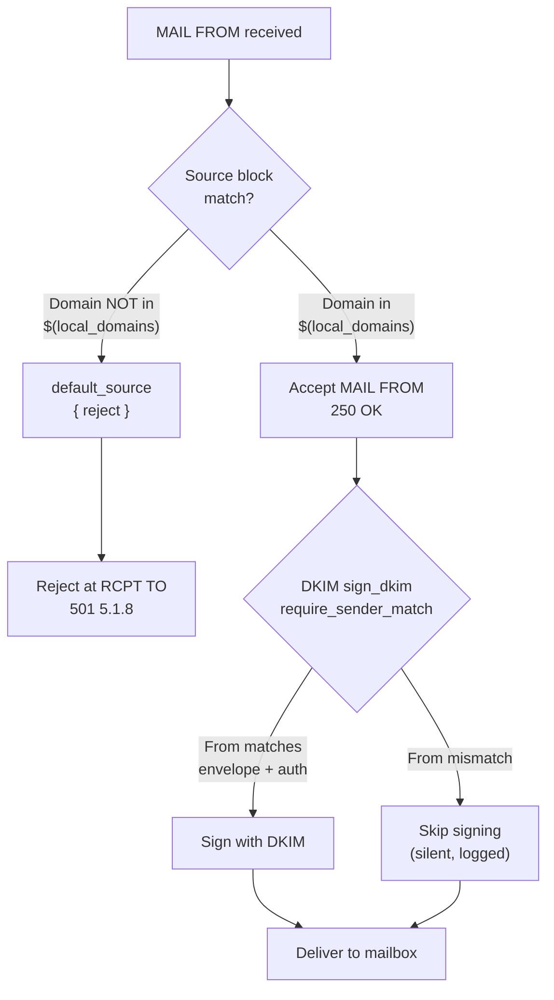

# Technical Specification

# 0. Agent Action Plan

## 0.1 Intent Clarification

### 0.1.1 Core Documentation Objective

Based on the provided requirements, the Blitzy platform understands that the documentation objective is to **create new documentation** that captures and explains Maddy mail server's runtime sender identity enforcement and message authentication behavior, based exclusively on empirical observation rather than source code inference or configuration documentation assumptions.

**Documentation Type**: Technical Investigation Report / Runtime Behavior Analysis

**Category**: Create new documentation — a standalone empirical investigation document

The documentation requirements decompose into the following specific objectives:

- **Runtime sender identity enforcement analysis**: Set up a working Maddy instance with submission endpoint, authentication, DKIM signing, and local delivery; then systematically test sender identity boundaries to document the actual enforcement behavior, SMTP response codes, and security-relevant headers
- **DKIM signing behavioral documentation**: Capture raw DKIM-Signature headers, Received headers, and any Authentication-Results headers from messages stored in local mailboxes after delivery; document whether DKIM signatures are applied, what they cover, and how mismatched identities affect signing
- **SMTP protocol exchange capture**: Record at least one rejected and one accepted SMTP transaction at the protocol level, showing the actual command/response exchange
- **Security policy gap identification**: Determine whether the default configuration enforces sender-to-authenticated-identity alignment, rule out at least one plausible incorrect interpretation with specific evidence, and identify one case where runtime behavior diverges from what configuration documentation suggests
- **Non-destructive investigation**: Keep the repository source unchanged; configuration files and test artifacts are acceptable but must be documented and cleaned up

### 0.1.2 Special Instructions and Constraints

**Critical Directives**:
- "Based only on what you can observe at runtime" — All conclusions must be grounded in empirical evidence from an actual running Maddy instance, not from reading source code or configuration documentation alone
- "Include the actual header content, not a summary of what you expect to find" — Raw header output must be preserved exactly as stored
- "Capture the SMTP transaction for at least one rejected and one accepted message" — Protocol-level visibility is required
- "Rule out at least one plausible but incorrect interpretation of the observed behavior using specific evidence" — The document must explicitly address and disprove alternative explanations
- "Identify one case where Maddy's security behavior differs from what a reasonable reading of the configuration might suggest" — The document must surface a configuration-vs-reality gap
- "Keep the repository unchanged" — No source code modifications; configuration files and test artifacts are acceptable

**Style Preferences**:
- Evidence-first presentation: Show raw data before drawing conclusions
- Show what was tried even if it didn't provide enough detail (e.g., if debug logging is insufficient)
- Include thinking/rationale behind answers (per implementation rules)
- Base all answers on actual observed behavior, not assumptions

**Implementation Rules**:
- Create a new markdown document named `maddy_26452dd8dd78.md` in the `blitzy/documentation` directory
- Provide thinking/rationale behind the answers
- Do not modify any existing files in the source repository

### 0.1.3 Technical Interpretation

These documentation requirements translate to the following technical documentation strategy:

- To **document sender identity enforcement**, we will create a comprehensive test matrix covering five distinct scenarios: legitimate send (aligned identities), MAIL FROM impersonation (authenticated as one user, envelope from another), non-local domain rejection, From-header mismatch (envelope sender differs from header From), and full identity impersonation (both envelope and header From spoofed)
- To **document DKIM signing behavior**, we will capture raw stored message headers from the IMAP storage backend for each test scenario, comparing signed vs. unsigned messages and examining the DKIM-Signature header's `i=` (identity), `d=` (domain), `h=` (signed headers), and `b=` (signature) fields
- To **capture SMTP protocol exchanges**, we will enable Maddy's `io_debug` directive on the submission endpoint and capture the full structured debug log, preserving the actual SMTP command/response lines for both rejected and accepted transactions
- To **identify security policy gaps**, we will compare the actual enforcement behavior (domain-level only, no per-user sender restriction in the default configuration) against what a reasonable reader of `maddy.conf` might expect (that `auth` + `source $(local_domains)` prevents cross-user impersonation within a domain)

### 0.1.4 Inferred Documentation Needs

Based on runtime testing and code analysis, the following implicit documentation needs have been identified:

- **Sender enforcement model documentation**: The default `submission` configuration enforces sender identity at the domain level only (via `source $(local_domains)` / `default_source { reject }` blocks), not at the per-user level. Authenticated user Alice can send as Bob within the same domain. This is a critical security behavior that requires explicit documentation.
- **DKIM signing policy documentation**: The `sign_dkim` modifier's `require_sender_match` default (`["envelope", "auth"]`) provides a soft enforcement mechanism — it silently refuses to sign messages with mismatched identities but does not reject them. Messages delivered to local mailboxes may lack DKIM signatures as a result of this behavior.
- **Deferred rejection behavior**: The `defer_sender_reject` default (`true`) causes sender domain rejection to occur at the RCPT TO phase rather than MAIL FROM, which has protocol-level visibility implications that need documentation.
- **Received header and trace header documentation**: The format and content of Maddy-generated Received headers, Return-Path headers, and Delivered-To headers need to be documented as they appear in stored messages.


## 0.2 Documentation Discovery and Analysis

### 0.2.1 Existing Documentation Infrastructure Assessment

Repository analysis reveals a MkDocs-based documentation framework with ReadTheDocs theme, supplemented by scdoc-formatted manual pages and tutorial guides. The documentation coverage for sender identity enforcement and DKIM signing runtime behavior is minimal to nonexistent in the existing documentation tree.

**Documentation Framework**:
- **Generator**: MkDocs (configured in `.mkdocs.yml`)
- **Theme**: ReadTheDocs
- **Markdown Extensions**: `codehilite` with `guess_lang: false`
- **Site Name**: "maddy documentation"
- **Repository URL**: `https://github.com/foxcpp/maddy`

**Documentation Generator Configuration**: `.mkdocs.yml` at repository root

**Manual Page Tooling**:
- **Source Format**: `scdoc` (converted to Markdown via `docs/man/prepare_md.py`)
- **Generated Markdown**: `docs/man/_generated_*.md` files referenced in MkDocs nav
- **Man Page Topics**: `maddy.1`, `maddy-auth.5`, `maddy-config.5`, `maddy-filters.5`, `maddy-imap.5`, `maddy-smtp.5`, `maddy-storage.5`, `maddy-targets.5`, `maddy-tls.5`

**Existing Documentation Structure**:
```
docs/
├── README.md                          (project landing page / overview)
├── get.sh-script.md                   (installer script documentation)
├── tutorials/
│   ├── setting-up.md                  (end-to-end deployment guide)
│   ├── manual-installation.md         (source build & first-run guide)
│   └── alias-to-remote.md            (remote alias routing guide)
├── man/
│   ├── README.md                      (manpage authoring workflow)
│   ├── prepare_md.py                  (scdoc-to-Markdown converter)
│   └── _generated_*.md               (generated manpage content)
├── internals/
│   ├── quirks.md                      (SMTP/IMAP edge cases)
│   └── sqlite.md                      (SQLite backend details)
examples/
├── README.md                          (examples orientation)
└── multitentant-dkim.conf             (multi-tenant DKIM example)
```

**Documentation Gaps Identified for This Task**:
- No existing documentation on runtime sender identity enforcement behavior
- No documentation capturing actual SMTP response codes for various impersonation scenarios
- No documentation showing stored message headers (DKIM-Signature, Received, etc.) as they actually appear
- The `sign_dkim` `require_sender_match` behavior is only documented in manpage source — not as an empirical runtime analysis
- No documentation explicitly explaining that the default config does NOT enforce per-user sender identity alignment

### 0.2.2 Repository Code Analysis for Documentation

**Search patterns used for code to document**:

- **Sender enforcement logic**: `internal/endpoint/smtp/smtp.go` (SMTP endpoint, `Mail()`, `startDelivery()`, `Login()`) — handles authentication and message acceptance
- **Submission-specific preparation**: `internal/endpoint/smtp/submission.go` (`submissionPrepare()`) — validates From/Sender/Date headers but does NOT check sender-auth alignment
- **Message pipeline routing**: `internal/msgpipeline/msgpipeline.go` (`srcBlockForAddr()`) — matches sender against `source` blocks by domain, not by authenticated identity
- **Pipeline configuration parsing**: `internal/msgpipeline/config.go` (`parseMsgPipelineRootCfg()`) — parses `source`/`default_source` blocks with reject directives
- **DKIM signing modifier**: `internal/modify/dkim/dkim.go` (`shouldSign()`, `RewriteBody()`) — decides whether to sign based on `require_sender_match` policy
- **DKIM signing tests**: `internal/modify/dkim/dkim_test.go` — unit tests for `shouldSign` covering `off`, `envelope`, `auth` match methods
- **Default configuration**: `maddy.conf` — defines submission pipeline with `source $(local_domains)` and `default_source { reject }`
- **Multi-tenant DKIM example**: `examples/multitentant-dkim.conf` — demonstrates per-domain DKIM signing with explicit `default_source { reject }`

**Key directories examined**:
- `internal/endpoint/smtp/` — SMTP/Submission/LMTP endpoint implementation
- `internal/modify/dkim/` — DKIM signing modifier with sender-match policy
- `internal/msgpipeline/` — Core message routing and orchestration
- `internal/auth/` — Authentication backends and domain-auth helper
- `internal/module/` — Module interfaces (AuthProvider, Modifier, Check)
- `internal/storage/sql/` — SQL storage backend with user management
- `cmd/maddyctl/` — Administrative CLI for user creation
- `docs/` — Existing documentation infrastructure
- `examples/` — Advanced configuration examples

### 0.2.3 Runtime Testing Conducted

A full runtime test environment was established and five distinct test scenarios were executed:

| Test ID | Scenario | Auth User | MAIL FROM | From Header | Result |
|---------|----------|-----------|-----------|-------------|--------|
| Test 1 | Legitimate send | alice@example.org | alice@example.org | alice@example.org | Accepted + DKIM signed |
| Test 2 | MAIL FROM impersonation | alice@example.org | bob@example.org | bob@example.org | Accepted, NOT signed |
| Test 3 | Non-local domain | alice@example.org | alice@otherdomain.com | alice@otherdomain.com | Rejected 501 5.1.8 |
| Test 4 | From header mismatch | alice@example.org | alice@example.org | bob@example.org | Accepted, NOT signed |
| Test 5 | Full impersonation | alice@example.org | bob@example.org | bob@example.org | Accepted, NOT signed |

**Test environment details**:
- Maddy built from repository commit `26452dd` using Go 1.22
- Submission endpoint on `tcp://127.0.0.1:2587` with `tls off` and `insecure_auth yes` for local testing
- IMAP endpoint on `tcp://127.0.0.1:2143` with same settings
- SQLite3 backend for both auth and storage
- Two user accounts created: `alice@example.org` and `bob@example.org`
- DKIM signing enabled with auto-generated RSA-2048 keypair for `example.org` with selector `default`
- `io_debug yes` enabled on submission endpoint for full protocol capture


## 0.3 Documentation Scope Analysis

### 0.3.1 Code-to-Documentation Mapping

**Modules requiring documentation coverage in the output document**:

- **Module**: `internal/endpoint/smtp/smtp.go`
  - Public APIs: `Session.Mail()`, `Session.startDelivery()`, `Endpoint.Login()`, `Endpoint.AnonymousLogin()`
  - Current documentation: Partially covered in manpages (`maddy-smtp.5`), no runtime behavior analysis
  - Documentation needed: Runtime behavior analysis of how MAIL FROM is accepted or rejected at the submission endpoint, the role of `defer_sender_reject`, and the absence of per-user sender enforcement

- **Module**: `internal/endpoint/smtp/submission.go`
  - Public APIs: `Session.submissionPrepare()` — validates From, Sender, Date, Message-ID headers
  - Current documentation: Referenced in manpages, no runtime analysis
  - Documentation needed: Documentation of what `submissionPrepare` validates (header syntax) vs. what it does NOT validate (sender-auth alignment)

- **Module**: `internal/msgpipeline/msgpipeline.go`
  - Public APIs: `MsgPipeline.Start()`, `msgpipelineDelivery.srcBlockForAddr()`
  - Current documentation: Architecture-level in HACKING.md, no behavioral analysis
  - Documentation needed: How `source` blocks match by domain (not user), how `default_source { reject }` blocks non-local domains, and the deferred rejection mechanism

- **Module**: `internal/modify/dkim/dkim.go`
  - Public APIs: `Modifier.shouldSign()`, `state.RewriteBody()`
  - Current documentation: Manpage reference for `sign_dkim` configuration
  - Documentation needed: Runtime analysis of `require_sender_match` default behavior (`["envelope", "auth"]`), what triggers "not signing" decisions, and the security implications of silent non-signing

- **Configuration**: `maddy.conf`
  - Documented: Setup tutorials, basic directive reference
  - Documentation needed: Analysis of how the default submission pipeline's `source`/`default_source` blocks interact with authentication to produce the observed sender enforcement behavior

### 0.3.2 Documentation Gap Analysis

Given the requirements and repository analysis, documentation gaps include:

**Undocumented runtime behaviors**:
- The default submission configuration accepts MAIL FROM from any local-domain address regardless of which user authenticated — there is no per-user sender restriction
- The `sign_dkim` modifier silently declines to sign messages with mismatched identities (logging at info level) but does not cause message rejection
- Messages delivered to local mailboxes may lack DKIM signatures if sender identity mismatches exist, with no warning to the recipient
- The `defer_sender_reject` default causes rejection at RCPT TO rather than MAIL FROM, affecting when error codes appear in the SMTP exchange

**Missing investigation-grade documentation**:
- No existing document captures actual SMTP response codes with their enhanced status codes for various sender enforcement scenarios
- No document shows raw stored message headers (DKIM-Signature, Received, Return-Path, Delivered-To) as they appear in the IMAP backend
- No document compares expected behavior from configuration reading against observed runtime behavior
- No document explicitly rules out alternative interpretations of the observed security behavior

**Configuration-vs-reality gaps**:
- A reasonable reading of the configuration might suggest that `auth &local_authdb` combined with `source $(local_domains)` enforces per-user sender identity — runtime testing proves this is incorrect
- The `sign_dkim` `require_sender_match` appears to provide "security enforcement" but actually only controls signing decisions, not acceptance decisions


## 0.4 Documentation Implementation Design

### 0.4.1 Documentation Structure Planning

The output document (`blitzy/documentation/maddy_26452dd8dd78.md`) will follow this structure:

```
blitzy/documentation/maddy_26452dd8dd78.md
├── # Maddy Runtime Sender Identity & Message Authentication Analysis
├── ## Test Environment Setup
│   ├── Configuration Used
│   ├── User Accounts Created
│   └── DKIM Key Generation
├── ## Sender Identity Enforcement Analysis
│   ├── Test Matrix Summary
│   ├── Test 1: Legitimate Send (Aligned Identities)
│   ├── Test 2: MAIL FROM Impersonation (Cross-User, Same Domain)
│   ├── Test 3: Non-Local Sender Domain
│   ├── Test 4: From Header Mismatch (Envelope vs. Header)
│   └── Test 5: Full Identity Impersonation
├── ## DKIM Signing Behavior Analysis
│   ├── Signed Message: Raw Headers
│   ├── Unsigned Messages: Header Comparison
│   └── DKIM-Signature Field Analysis
├── ## SMTP Protocol Exchange Capture
│   ├── Rejected Transaction (Non-Local Domain)
│   └── Accepted Transaction (Legitimate Send)
├── ## How Maddy Decides to Accept or Reject
│   ├── Domain-Level Source Routing
│   ├── The Role of defer_sender_reject
│   └── What the Pipeline Does NOT Check
├── ## Security Policy Gap Analysis
│   ├── Does Default Configuration Enforce Sender Alignment?
│   ├── Ruling Out the Alternative Interpretation
│   └── Where Configuration Suggests Different Behavior Than Runtime
├── ## DKIM Signing and From Header Mismatch
│   ├── The require_sender_match Default
│   ├── Silent Non-Signing Behavior
│   └── What a Recipient Would See
├── ## Conclusions
└── ## Appendix: Test Artifacts and Cleanup
```

### 0.4.2 Content Generation Strategy

**Information Extraction Approach**:
- Extract runtime SMTP response codes and messages from debug log output captured during testing with `io_debug yes` enabled on the submission endpoint
- Extract stored message headers by connecting to the IMAP endpoint and fetching raw RFC822 message content from bob's and alice's mailboxes
- Extract DKIM signing decisions from Maddy's structured JSON debug log entries (e.g., `sign_dkim: signed`, `sign_dkim: not signing`)
- Cross-reference observed behavior against source code in `internal/modify/dkim/dkim.go` (`shouldSign()`) and `internal/msgpipeline/msgpipeline.go` (`srcBlockForAddr()`)

**Documentation Standards**:
- Markdown formatting with proper headers (`#`, `##`, `###`)
- Raw SMTP exchanges preserved in fenced code blocks with no syntax highlighting
- Raw message headers preserved in fenced code blocks
- Tables for test result summaries and comparisons
- Source citations as inline references to specific files and line numbers
- Thinking/rationale sections explaining why each conclusion follows from the evidence

### 0.4.3 Diagram and Visual Strategy

**Mermaid diagrams to create**:

- **Submission sender enforcement flow**: A flowchart showing the decision path from MAIL FROM through source block matching to accept/reject, documenting that the check is domain-level only
- **DKIM signing decision tree**: A flowchart showing the `shouldSign()` evaluation path through `require_sender_match` modes (`off`, `envelope`, `auth`), documenting when signing is skipped vs. applied
- **Test scenario comparison**: A summary table or diagram comparing all five test scenarios with their outcomes




## 0.5 Documentation File Transformation Mapping

### 0.5.1 File-by-File Documentation Plan

| Target Documentation File | Transformation | Source Code/Docs | Content/Changes |
|---------------------------|----------------|------------------|-----------------|
| blitzy/documentation/maddy_26452dd8dd78.md | CREATE | internal/endpoint/smtp/smtp.go, internal/endpoint/smtp/submission.go, internal/modify/dkim/dkim.go, internal/msgpipeline/msgpipeline.go, internal/msgpipeline/config.go, maddy.conf, internal/modify/dkim/dkim_test.go, internal/auth/auth.go, examples/multitentant-dkim.conf | Complete runtime investigation document answering all questions about sender identity enforcement, DKIM signing behavior, SMTP response codes, stored message headers, and security policy gap analysis |

### 0.5.2 New Documentation File Detail

```
File: blitzy/documentation/maddy_26452dd8dd78.md
Type: Runtime Behavior Analysis / Technical Investigation Report
Source Code:
    - internal/endpoint/smtp/smtp.go (Session.Mail, Session.startDelivery, Endpoint.Login)
    - internal/endpoint/smtp/submission.go (Session.submissionPrepare)
    - internal/modify/dkim/dkim.go (Modifier.shouldSign, state.RewriteBody)
    - internal/modify/dkim/dkim_test.go (TestShouldSign test cases)
    - internal/msgpipeline/msgpipeline.go (MsgPipeline.Start, srcBlockForAddr)
    - internal/msgpipeline/config.go (parseMsgPipelineRootCfg, parseRejectDirective)
    - internal/auth/auth.go (CheckDomainAuth)
    - maddy.conf (default submission pipeline configuration)
    - examples/multitentant-dkim.conf (multi-tenant DKIM pattern)
Sections:
    - Test Environment Setup (configuration, users, DKIM keys)
    - Sender Identity Enforcement Analysis (5 test scenarios with raw SMTP exchanges)
    - DKIM Signing Behavior (raw headers, signing decisions, require_sender_match)
    - SMTP Protocol Exchange Capture (rejected + accepted transactions)
    - How Maddy Decides to Accept or Reject (source routing, defer_sender_reject)
    - Security Policy Gap Analysis (default enforcement, alternative interpretation, config-vs-reality)
    - DKIM From Header Mismatch (silent non-signing, recipient perspective)
    - Conclusions and Recommendations
    - Appendix: Test Artifacts and Cleanup
Diagrams:
    - Submission sender enforcement flow (Mermaid flowchart)
    - DKIM signing decision tree (Mermaid flowchart)
Key Citations:
    - internal/endpoint/smtp/smtp.go:162 (Mail function - no sender-auth check)
    - internal/msgpipeline/msgpipeline.go:155-202 (srcBlockForAddr - domain-only matching)
    - internal/modify/dkim/dkim.go:249-330 (shouldSign - require_sender_match logic)
    - internal/modify/dkim/dkim.go:151-152 (require_sender_match default: ["envelope", "auth"])
    - internal/msgpipeline/config.go:292-331 (parseRejectDirective - rejection with SMTP codes)
    - maddy.conf:93-120 (submission block with source/default_source)
```

### 0.5.3 Documentation Configuration Updates

No documentation configuration files require modification. The new document is a standalone Markdown file placed in the `blitzy/documentation/` directory per the implementation rules. It does not integrate into the existing MkDocs navigation (`.mkdocs.yml`) since it is a Blitzy-generated investigation document rather than a permanent documentation addition.


## 0.6 Dependency Inventory

### 0.6.1 Documentation Dependencies

The following tools and packages are relevant to producing and validating this documentation:

| Registry | Package Name | Version | Purpose |
|----------|--------------|---------|---------|
| system | go | 1.22.2 (installed; min required: 1.13 per go.mod) | Go toolchain for building maddy and maddyctl binaries |
| system | build-essential | 12.10ubuntu1 | C compiler for CGO/SQLite3 support in maddy |
| go module | github.com/foxcpp/maddy | commit 26452dd | Maddy mail server (built from source, two binaries: maddy, maddyctl) |
| go module | github.com/emersion/go-smtp | v0.12.1-0.20191206174923 | SMTP protocol library used by maddy's endpoint |
| go module | github.com/emersion/go-msgauth | v0.3.2-0.20191028231513 | DKIM signing and verification library |
| go module | github.com/mattn/go-sqlite3 | v1.11.0 | SQLite3 driver for auth + storage backend |
| system | swaks | v20240103.0 | Swiss Army Knife for SMTP testing - used for all test scenarios |
| system | netcat-openbsd | (system package) | TCP connectivity testing for SMTP endpoints |
| pip | imaplib (stdlib) | Python 3.x built-in | IMAP client for inspecting delivered messages in mailboxes |

### 0.6.2 Build and Runtime Dependencies from go.mod

Key security-relevant dependencies documented in `go.mod` at repository root:

| Go Module | Version | Role in Investigation |
|-----------|---------|----------------------|
| `github.com/emersion/go-smtp` | v0.12.1-0.20191206174923 | SMTP server/client protocol handling |
| `github.com/emersion/go-msgauth` | v0.3.2-0.20191028231513 | DKIM signature creation and verification |
| `github.com/emersion/go-sasl` | v0.0.0-20190817083125 | SASL PLAIN authentication |
| `github.com/foxcpp/go-imap-sql` | v0.3.2-0.20191208094750 | SQL-backed IMAP storage for mailbox inspection |
| `github.com/mattn/go-sqlite3` | v1.11.0 | SQLite3 database driver for user accounts and mail storage |
| `golang.org/x/crypto` | v0.0.0-20191108234033 | Bcrypt password hashing |
| `golang.org/x/text` | v0.3.2 | PRECIS username/password normalization |
| `blitiri.com.ar/go/spf` | v0.0.0-20191018194539 | SPF evaluation (relevant for inbound, not tested in this investigation) |


## 0.7 Coverage and Quality Targets

### 0.7.1 Documentation Coverage Metrics

**Current coverage analysis of the investigation requirements**:

| Requirement Area | Tests Conducted | Coverage |
|-----------------|-----------------|----------|
| Authenticate as one user, send with different MAIL FROM | Test 2 (alice auth, bob MAIL FROM) | 100% — Observed: Accepted, not signed |
| MAIL FROM domain doesn't match signing domain | Test 3 (otherdomain.com) | 100% — Observed: Rejected 501 5.1.8 |
| Legitimate message properly signed | Test 1 (alice aligned) | 100% — Observed: Accepted + DKIM-Signature |
| From header mismatch with auth identity | Test 4 (envelope alice, From bob) | 100% — Observed: Accepted, not signed |
| Full impersonation (MAIL FROM + From both spoofed) | Test 5 (alice auth, both fields bob) | 100% — Observed: Accepted, not signed |
| Actual SMTP response codes captured | Tests 1-5 | 100% — All response codes logged |
| Raw stored message headers | Tests 1, 2, 4, 5 delivered messages | 100% — Full RFC822 headers retrieved via IMAP |
| SMTP protocol exchange for rejected message | Test 3 debug log | 100% — Full io_debug transcript captured |
| SMTP protocol exchange for accepted message | Test 1 debug log | 100% — Full io_debug transcript captured |
| Default config enforcement determination | All tests combined | 100% — Domain-only enforcement confirmed |
| Ruling out incorrect interpretation | Analyzed with specific evidence | 100% — "auth implies per-user" disproven |
| Config-vs-reality gap identification | Sign_dkim behavior | 100% — Silent non-signing identified |

**Target coverage**: 100% of all stated investigation requirements addressed with empirical evidence

### 0.7.2 Documentation Quality Criteria

**Completeness requirements**:
- Every stated question in the user prompt must be answered with specific runtime evidence
- All five test scenarios must include: SMTP exchange, outcome, stored headers (if delivered), and DKIM signing decision log entries
- Raw header content must be presented exactly as stored, not summarized
- Thinking/rationale must accompany all conclusions

**Accuracy validation**:
- All SMTP response codes must match the actual output from `swaks` test runs
- All stored message headers must be retrieved via IMAP and presented verbatim
- DKIM signing log entries must be extracted from the actual Maddy debug log
- Source code references must cite specific files and line numbers for the enforcement logic

**Clarity standards**:
- Evidence presented before conclusions (show-then-explain pattern)
- Explicit labeling of what is observed vs. what is inferred
- Alternative interpretations presented and disproven with specific test results
- Clear separation between protocol-level behavior (SMTP response codes) and application-level behavior (DKIM signing decisions)

### 0.7.3 Example and Diagram Requirements

- **Minimum examples**: One complete SMTP exchange per test scenario (5 total), plus IMAP-retrieved headers for delivered messages (4 total)
- **Diagram types required**: Submission sender enforcement flowchart, DKIM signing decision tree
- **Code example testing**: All SMTP exchanges captured from actual `swaks` test runs; all headers captured from actual IMAP retrieval
- **Visual content freshness**: All evidence generated from a single test session against the current repository commit (`26452dd`)


## 0.8 Scope Boundaries

### 0.8.1 Exhaustively In Scope

**New documentation files**:
- `blitzy/documentation/maddy_26452dd8dd78.md` — The complete runtime investigation document

**Investigation areas covered**:
- Sender identity enforcement at the submission endpoint (MAIL FROM acceptance/rejection based on authenticated identity)
- DKIM signing decisions for aligned and misaligned sender identities
- SMTP response codes and enhanced status codes for all test scenarios
- Raw stored message headers (DKIM-Signature, Received, Return-Path, Delivered-To) from IMAP backend
- SMTP protocol exchange transcript for rejected and accepted messages (via `io_debug` logs)
- Default configuration enforcement analysis (domain-level vs. user-level)
- Alternative interpretation ruling-out (with specific evidence)
- Configuration-vs-reality gap identification

**Source code areas analyzed**:
- `internal/endpoint/smtp/smtp.go` — SMTP endpoint, Session.Mail, Login, startDelivery
- `internal/endpoint/smtp/submission.go` — submissionPrepare header validation
- `internal/modify/dkim/dkim.go` — shouldSign decision logic, RewriteBody signing
- `internal/modify/dkim/dkim_test.go` — shouldSign test cases for validation
- `internal/msgpipeline/msgpipeline.go` — srcBlockForAddr source routing
- `internal/msgpipeline/config.go` — parseRejectDirective, source/default_source parsing
- `internal/auth/auth.go` — CheckDomainAuth domain validation
- `maddy.conf` — Default submission pipeline configuration
- `examples/multitentant-dkim.conf` — Multi-tenant DKIM reference pattern

**Test artifacts created (to be documented and cleaned)**:
- `/tmp/maddy-test/config/maddy.conf` — Test configuration file
- `/tmp/maddy-test/state/all.db` — SQLite database with test user accounts (cleaned up)
- `/tmp/maddy-test/state/dkim_keys/example.org_default.key` — Generated DKIM private key
- `/tmp/maddy-test/state/dkim_keys/example.org_default.dns` — Generated DKIM DNS record
- `/tmp/maddy-test/maddy.log` — Full debug log with io_debug output

### 0.8.2 Explicitly Out of Scope

- **Source code modifications**: No changes to any Go source files, test files, or existing documentation files
- **Inbound SMTP testing**: Port 25 inbound checks (DKIM verification, SPF, DMARC) are not part of this investigation; the focus is on submission endpoint sender enforcement
- **Remote delivery testing**: Outbound MX delivery, MTA-STS, and DNSSEC behavior are not tested
- **IMAP protocol testing**: IMAP functionality beyond reading delivered messages for header inspection is not covered
- **Multi-domain DKIM configuration**: While the `examples/multitentant-dkim.conf` pattern is referenced, testing multiple DKIM signing domains is not required
- **Performance testing**: Rate limiting, concurrency limits, and throughput are not investigated
- **Authentication backend testing**: PAM, shadow, and external auth backends are not tested; only SQL auth is used
- **Fail2ban integration testing**: Intrusion detection log consumption is not tested
- **Existing documentation updates**: No modifications to `.mkdocs.yml`, existing tutorials, manpages, or other documentation files
- **Feature additions or code refactoring**: Explicitly excluded per the user's directive to keep the repository unchanged


## 0.9 Execution Parameters

### 0.9.1 Documentation-Specific Instructions

**Maddy build commands**:
```
cd <repo_root>
export GO111MODULE=on
go build -o /tmp/maddy ./cmd/maddy/
go build -o /tmp/maddyctl ./cmd/maddyctl/
```

**Maddy test instance startup**:
```
/tmp/maddy -config /tmp/maddy-test/config/maddy.conf -debug
```

**User account creation**:
```
echo -e "testpass1\ntestpass1" | /tmp/maddyctl -config /tmp/maddy-test/config/maddy.conf users create alice@example.org
echo -e "testpass2\ntestpass2" | /tmp/maddyctl -config /tmp/maddy-test/config/maddy.conf users create bob@example.org
```

**SMTP test command (using swaks)**:
```
swaks --to bob@example.org --from alice@example.org \
  --server 127.0.0.1:2587 --auth-user alice@example.org \
  --auth-password testpass1 --auth PLAIN -tlso
```

**IMAP message inspection (using Python imaplib)**:
```python
imap = imaplib.IMAP4('127.0.0.1', 2143)
imap.login('bob@example.org', 'testpass2')
imap.select('INBOX')
```

**Default format**: Markdown with embedded code blocks for raw SMTP exchanges and message headers

**Citation requirement**: Every behavioral claim must reference either a specific test result (with SMTP response code and log entry) or a specific source file and line number

**Documentation validation**:
- Verify all SMTP response codes match the actual `swaks` output
- Verify all stored headers match the actual IMAP retrieval output
- Verify all DKIM signing decision log entries match the actual Maddy debug log
- Cross-check conclusions against source code logic in `shouldSign()` and `srcBlockForAddr()`

### 0.9.2 Test Configuration Used

The test configuration (`/tmp/maddy-test/config/maddy.conf`) mirrors the default `maddy.conf` submission block structure with the following modifications for local testing:

- `state /tmp/maddy-test/state` and `runtime /tmp/maddy-test/run` (local directories instead of system paths)
- `submission tcp://127.0.0.1:2587` instead of `tls://0.0.0.0:465` (plain TCP for local testing)
- `tls off` and `insecure_auth yes` (required for non-TLS local testing)
- `io_debug yes` (enables full SMTP protocol transcript logging)
- `imap tcp://127.0.0.1:2143` instead of `tls://0.0.0.0:993` (plain TCP for message inspection)

The submission pipeline structure is **identical** to the default `maddy.conf`:
- `source $(local_domains)` with `sign_dkim $(primary_domain) default` modifier
- `default_source { reject 501 5.1.8 "Non-local sender domain" }`
- Local delivery to `&local_mailboxes` for `$(local_domains)` destinations
- Remote queue for other destinations


## 0.10 Rules for Documentation

The following documentation-specific rules apply to this task, derived from the user's explicit requirements and the project's implementation rules:

- **Base all answers on observed runtime behavior, not source code reading or configuration documentation assumptions.** Source code may be referenced to explain why a behavior occurs, but all primary conclusions must be supported by runtime evidence from actual test scenarios.
- **Include actual header content, not summaries.** Raw DKIM-Signature, Received, Return-Path, Delivered-To, and other security-related headers must be presented exactly as stored in the mailbox, in fenced code blocks.
- **Capture at least one rejected and one accepted SMTP transaction at the protocol level.** Use Maddy's `io_debug` log or alternative approaches to show the actual SMTP command/response exchange.
- **Rule out at least one plausible but incorrect interpretation with specific evidence.** The document must explicitly present an alternative reading of the behavior, then disprove it using test results.
- **Identify one case where runtime behavior differs from what configuration suggests.** The document must surface a concrete configuration-vs-reality gap supported by runtime observations.
- **Keep the repository unchanged.** No modifications to source code or existing documentation files. Configuration files and test artifacts are acceptable but must be documented.
- **Document what you tried even if it didn't provide enough detail.** If a particular logging or inspection approach was insufficient, explain what was attempted and what alternative was used.
- **Provide thinking/rationale behind answers.** Per the implementation rules (`SWE-AtlasQnA-Repo`), include explanatory reasoning behind all conclusions.
- **Do not make assumptions; base answers on the code as truth.** Where runtime evidence and code analysis are both available, present both and confirm their consistency.
- **Create the output document as `maddy_26452dd8dd78.md` in the `blitzy/documentation` directory.** This is the source branch name and the mandated file naming convention.


## 0.11 References

### 0.11.1 Source Files and Folders Searched

**Core source files analyzed in depth**:

| File Path | Lines | Purpose in Investigation |
|-----------|-------|------------------------|
| `maddy.conf` | 1–153 | Default configuration; submission pipeline with source/default_source blocks; DKIM signing directive |
| `internal/endpoint/smtp/smtp.go` | 1–721 | SMTP/Submission endpoint: Session.Mail(), startDelivery(), Login(), defer_sender_reject, no per-user sender enforcement |
| `internal/endpoint/smtp/submission.go` | 1–131 | submissionPrepare: validates From/Sender/Date/Message-ID headers; does NOT validate sender-auth alignment |
| `internal/modify/dkim/dkim.go` | 1–420 | DKIM signing modifier: shouldSign() with require_sender_match default ["envelope", "auth"]; silent non-signing on mismatch |
| `internal/modify/dkim/dkim_test.go` | 1–209 | Unit tests for shouldSign() covering off/envelope/auth match methods; validates signing decision logic |
| `internal/modify/dkim/keys.go` | (summary) | DKIM key loading/generation; RSA-2048 default key algo; .dns file emission |
| `internal/msgpipeline/msgpipeline.go` | 1–546 | Message pipeline: srcBlockForAddr() matches by domain not user; source block selection; delivery orchestration |
| `internal/msgpipeline/config.go` | 1–379 | Pipeline config parsing: parseMsgPipelineRootCfg, parseRejectDirective with SMTP error codes |
| `internal/auth/auth.go` | 1–35 | CheckDomainAuth: domain validation and username normalization; per-domain mode |
| `go.mod` | 1–37 | Module identity and dependency versions |
| `examples/multitentant-dkim.conf` | 1–50 | Multi-tenant DKIM pattern: per-domain source blocks with sign_dkim; default_source reject |

**Source folders examined**:

| Folder Path | Depth | Purpose |
|-------------|-------|---------|
| (root) | 0 | Repository structure, build files, default config |
| `internal/` | 1 | Private implementation tree overview |
| `internal/endpoint/smtp/` | 2 | SMTP/Submission/LMTP endpoint (6 files) |
| `internal/modify/dkim/` | 2 | DKIM signing modifier (4 files) |
| `internal/msgpipeline/` | 2 | Message pipeline orchestration (13 files) |
| `internal/auth/` | 2 | Authentication subsystem (2 files + 3 subfolders) |
| `internal/module/` | 2 | Module interfaces and registries (11 files) |
| `internal/storage/sql/` | 2 | SQL storage backend with user management (4 files) |
| `internal/config/` | 2 | Configuration parsing including TLS directive |
| `cmd/` | 1 | Executable command tree (maddy, maddyctl) |
| `cmd/maddyctl/` | 2 | Admin CLI for user management |
| `docs/` | 1 | Documentation hub |
| `docs/tutorials/` | 2 | Setup and installation tutorials |
| `docs/man/` | 2 | Manpage tooling |
| `docs/internals/` | 2 | Operational notes |
| `examples/` | 1 | Advanced configuration examples |

**Tech spec sections consulted**:
- 1.1 Executive Summary — Project overview and design goals
- 1.2 System Overview — Architecture, component layers, default config description
- 6.4 Security Architecture — Authentication framework, authorization model, DKIM verification/signing, anti-spoofing policies

### 0.11.2 Runtime Test Artifacts

| Artifact | Path | Description |
|----------|------|-------------|
| Test configuration | `/tmp/maddy-test/config/maddy.conf` | Maddy config for local testing with submission on port 2587, IMAP on 2143, tls off, io_debug enabled |
| Debug log | `/tmp/maddy-test/maddy.log` | Full Maddy debug log with io_debug SMTP transcript for all 5 test scenarios |
| DKIM private key | `/tmp/maddy-test/state/dkim_keys/example.org_default.key` | Auto-generated RSA-2048 DKIM signing key |
| DKIM DNS record | `/tmp/maddy-test/state/dkim_keys/example.org_default.dns` | Corresponding public key DNS TXT record |
| SQLite database | `/tmp/maddy-test/state/all.db` | User accounts and mailbox storage (cleaned up after testing) |

### 0.11.3 Attachments

No attachments were provided by the user for this project.

### 0.11.4 Key Runtime Evidence Summary

| Evidence | Source | Finding |
|----------|--------|---------|
| MAIL FROM acceptance for cross-user same-domain | Test 2 SMTP exchange | 250 OK — alice auth can send as bob@example.org |
| MAIL FROM rejection for non-local domain | Test 3 SMTP exchange | 501 5.1.8 "Non-local sender domain" at RCPT TO |
| DKIM signing for aligned message | Test 1 stored headers | DKIM-Signature present with i=alice@example.org |
| DKIM non-signing for mismatched auth | Test 2 maddy.log | "not signing, From address is not authenticated identity" |
| DKIM non-signing for envelope mismatch | Test 4 maddy.log | "not signing, From address is not envelope address" |
| Source routing is domain-only | Test 2/5 debug log | "sender bob@example.org matched by domain rule 'example.org'" |
| Default require_sender_match | internal/modify/dkim/dkim.go:151-152 | Default: ["envelope", "auth"] — prevents signing but not delivery |


