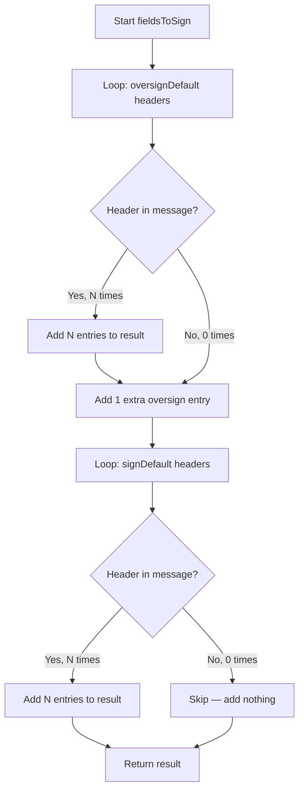

# Technical Specification

# 0. Agent Action Plan

## 0.1 Intent Clarification

### 0.1.1 Core Documentation Objective

Based on the provided requirements, the Blitzy platform understands that the documentation objective is to **create new documentation** that captures a hands-on, code-verified investigation of DKIM signing internals in the foxcpp/maddy mail server. The user is onboarding onto this codebase and wants a single, self-contained reference document that traces a concrete DKIM signing execution path — from building the binary to observing key generation, header-field selection logic, and Message-ID production — all substantiated by running the actual code rather than by external references.

**Documentation category:** Create new documentation
**Documentation type:** Technical investigation guide / Internals walkthrough

The specific documentation requirements, restated with technical precision, are:

- **Binary build and version verification:** Build the `maddy` server binary from the repository source, place it outside the repo tree, and record the verbatim `maddy version` output
- **DKIM key generation:** Generate both an RSA-2048 key (the codebase default per `newkey_algo` config in `internal/modify/dkim/dkim.go:150`) and an Ed25519 key, then report the DNS TXT record string verbatim from each `.dns` file, the base64-encoded public key length, the raw public key byte length, whether each base64 string ends with `=` padding, the absolute `.dns` file path, and the DKIM selector and domain used
- **Sample message with specific header constraints:** Construct a sample message containing exactly three `From` headers and exactly three `List-Id` headers, no other headers, and a non-empty body line; include the exact sample message text in the documentation
- **Fields-to-sign analysis:** Produce the `fieldsToSign` output for the sample message and explain how oversigned headers (`From`, which appears in `oversignDefault`) differ from signed-only headers (`List-Id`, which appears in `signDefault`); report the total entry count and the number of unique header names
- **Message-ID observation:** Run the code that produces Message-ID values (both the `GenerateMsgID` hex-encoded path and the UUID-based `msgIDField` path), show at least five real outputs, and describe the observed format and length
- **Repository integrity:** Do not modify any repository files; temporary scripts and configs placed outside the repo are acceptable

### 0.1.2 Special Instructions and Constraints

- **No web search:** The user explicitly prohibits web search; all findings must be verified by building and running the code
- **No repository file modification:** The user explicitly states "do not modify repository files"; the implementation rule `SWE-AtlasQnA-Repo` also requires "Do not modify any existing files in the source repository"
- **Binary placement:** If a binary is built, place it outside the repo
- **Output format:** Per the `SWE-AtlasQnA-Repo` rule, create a new markdown document named `maddy.md` that comprehensively answers the questions, placed in the `blitzy/documentation` directory in the destination repo
- **Rationale required:** Provide thinking and rationale behind the answers; base all answers on the code as the source of truth
- **Verbatim reporting:** The user requires verbatim outputs for: `maddy version`, DNS TXT record strings, sample message content, and fields-to-sign list

### 0.1.3 Technical Interpretation

These documentation requirements translate to the following technical documentation strategy:

- To document the binary build, we will build `cmd/maddy/main.go` using `go build` with Go 1.13 (the version specified in `go.mod`) and record the output of the `-v` flag which calls `BuildInfo()` defined in `maddy.go:89-96`
- To document DKIM key generation, we will exercise the `generateAndWrite` function from `internal/modify/dkim/keys.go:77-133` and the `writeDNSRecord` function from `internal/modify/dkim/keys.go:136-163` for both `rsa2048` and `ed25519` algorithm paths
- To document the fields-to-sign logic, we will exercise the `fieldsToSign` method from `internal/modify/dkim/dkim.go:202-233` using the default `oversignDefault` list (`dkim.go:31-54`) and `signDefault` list (`dkim.go:55-72`) against a header set with three `From` and three `List-Id` entries
- To document Message-ID generation, we will exercise `GenerateMsgID()` from `internal/msgpipeline/msgid.go:12-16` (4 random bytes, hex-encoded) and the UUID-based `msgIDField` from `internal/endpoint/smtp/submission.go:16-22` (using `github.com/google/uuid`)
- To deliver the final artifact, we will create `blitzy/documentation/maddy.md` containing all findings

### 0.1.4 Inferred Documentation Needs

- Based on code analysis: The `fieldsToSign` function in `internal/modify/dkim/dkim.go:202-233` contains the critical oversigning logic — for each header in `oversignDefault`, it adds one entry per existing occurrence PLUS one extra entry (the "oversign"); for each header in `signDefault`, it adds one entry per existing occurrence with NO extra entry. This difference is the core learning objective of the investigation.
- Based on structure: The DKIM signing subsystem spans `internal/modify/dkim/dkim.go` (modifier and signing logic), `internal/modify/dkim/keys.go` (key generation and DNS record writing), and two test files (`dkim_test.go`, `keys_test.go`). The investigation document must consolidate these into a coherent narrative.
- Based on dependencies: The `go-msgauth/dkim` library (`github.com/emersion/go-msgauth`) and `go-message/textproto` library (`github.com/emersion/go-message`) are the external signing and header-parsing engines used by maddy's DKIM code. The investigation document must attribute behavior correctly between maddy's own logic and the libraries.
- Based on user journey: A new contributor needs to understand the relationship between the `oversignDefault`/`signDefault` lists, the `fieldsToSign` algorithm, and the resulting DKIM `h=` tag in a real signature. The document should make this path explicit.

## 0.2 Documentation Discovery and Analysis

### 0.2.1 Existing Documentation Infrastructure Assessment

Repository analysis reveals a **MkDocs-based documentation site** with the ReadTheDocs theme, configured in `.mkdocs.yml`. The published site lives at `https://foxcpp.dev/maddy/`. The documentation structure is modest, organized into tutorials, manual pages (generated from `scdoc` sources via `docs/man/prepare_md.py`), and internals notes.

- **Documentation framework:** MkDocs (configured in `.mkdocs.yml:1`)
- **Documentation generator configuration:** `.mkdocs.yml` at repository root
- **API documentation tools:** None detected — Go source files do not use godoc-style generated output for external consumption
- **Diagram tools detected:** None — no Mermaid, PlantUML, or other diagramming tool configuration found
- **Documentation hosting:** Published at `https://foxcpp.dev/maddy/` per `README.md:48`

Current documentation tree:

```
docs/
├── README.md                  (landing page / project overview)
├── get.sh-script.md           (installer script documentation)
├── tutorials/
│   ├── setting-up.md          (end-to-end setup tutorial)
│   ├── manual-installation.md (manual build & config guide)
│   └── alias-to-remote.md     (alias routing tutorial)
├── internals/
│   ├── sqlite.md              (SQLite backend behavior)
│   └── quirks.md              (SMTP/IMAP protocol quirks)
└── man/
    ├── README.md              (manpage workflow description)
    └── prepare_md.py          (scdoc-to-Markdown converter)
```

Additionally, `examples/multitentant-dkim.conf` provides a multi-tenant DKIM configuration example, and `HACKING.md` at the repository root serves as the contributor design guide.

### 0.2.2 Repository Code Analysis for Documentation

Search patterns used to locate DKIM-related code and Message-ID generation:

- **DKIM signing implementation:** `internal/modify/dkim/dkim.go` — contains `Modifier` struct, `fieldsToSign` method, `oversignDefault` and `signDefault` lists, signing logic in `RewriteBody`
- **DKIM key management:** `internal/modify/dkim/keys.go` — contains `loadOrGenerateKey`, `generateAndWrite`, `writeDNSRecord` functions
- **DKIM test coverage:** `internal/modify/dkim/dkim_test.go` and `internal/modify/dkim/keys_test.go` — unit tests for field selection and key loading
- **DKIM verification:** `internal/check/dkim/dkim.go` — the `verify_dkim` check module (out of scope for this investigation but contextually relevant)
- **Message-ID generation (internal):** `internal/msgpipeline/msgid.go` — `GenerateMsgID()` using 4 random bytes hex-encoded
- **Message-ID generation (submission):** `internal/endpoint/smtp/submission.go` — UUID-based `msgIDField` for the `Message-ID` header field
- **Default configuration:** `maddy.conf:99` — shows `sign_dkim $(primary_domain) default` as the standard DKIM configuration
- **Multi-tenant example:** `examples/multitentant-dkim.conf` — shows per-domain DKIM signing with the `default` selector
- **Build entry point:** `cmd/maddy/main.go` — minimal launcher importing `maddy.Run()`
- **Version reporting:** `maddy.go:41` defines `Version = "unknown (built from source tree)"` and `maddy.go:89-96` defines `BuildInfo()`

Key directories examined:

| Directory | Relevance |
|-----------|-----------|
| `internal/modify/dkim/` | Core DKIM signing and key management |
| `internal/msgpipeline/` | Message-ID generation |
| `internal/endpoint/smtp/` | Submission-time Message-ID (UUID) generation |
| `internal/check/dkim/` | DKIM verification (contextual only) |
| `cmd/maddy/` | Binary build entry point |
| `docs/tutorials/` | Existing DKIM documentation references |
| `examples/` | DKIM configuration examples |

Related existing documentation referencing DKIM:

- `docs/tutorials/setting-up.md:115-121` — mentions DKIM key generation on first startup and DNS record placement
- `docs/tutorials/manual-installation.md:56-57` — notes RSA-2048 keypair generation on first start
- `README.md:15` — lists DKIM signing and verification as a feature
- `HACKING.md:19` — mentions DKIM verification as a security-by-default design goal

### 0.2.3 Existing DKIM Documentation Gap

The existing tutorials mention DKIM only in passing — noting that a key is auto-generated on first startup and that a DNS record needs to be published. There is **no existing documentation** that:

- Explains the oversigning vs. signing-only distinction in header field selection
- Shows how `fieldsToSign` processes repeated headers differently based on the list they belong to
- Documents the DNS TXT record format differences between RSA-2048 and Ed25519
- Illustrates the two distinct Message-ID generation mechanisms in the codebase
- Provides a concrete, runnable investigation path through the DKIM code

## 0.3 Documentation Scope Analysis

### 0.3.1 Code-to-Documentation Mapping

- **Module: `internal/modify/dkim/dkim.go`**
  - Public types/functions: `Modifier` struct, `New()` constructor, `Init()`, `fieldsToSign()`, `shouldSign()`, `RewriteBody()` via `state`
  - Constants: `oversignDefault` (15 headers), `signDefault` (12 headers), `hashFuncs`, `Day`
  - Current documentation: **Missing** — no dedicated documentation exists for the signing behavior
  - Documentation needed: Explanation of the `fieldsToSign` algorithm showing oversign vs. sign-only treatment, the default header lists, and how repeated headers are counted

- **Module: `internal/modify/dkim/keys.go`**
  - Public functions: `loadOrGenerateKey()`, `generateAndWrite()`, `writeDNSRecord()`
  - Supported algorithms: `rsa4096`, `rsa2048` (default), `ed25519`
  - Key formats: PKCS#8 (write), PKCS#1 (read), PKCS#8 (read), SEC 1/EC (read)
  - DNS record format: `v=DKIM1; k=<algo>; p=<base64-pubkey>`
  - Current documentation: **Missing** — no documentation on key generation internals or DNS record format
  - Documentation needed: Key generation walkthrough, DNS record format per algorithm, file layout

- **Module: `internal/msgpipeline/msgid.go`**
  - Public function: `GenerateMsgID()` — generates 4 random bytes, hex-encoded to 8 characters
  - Current documentation: **Missing** — no documentation on the internal message ID format
  - Documentation needed: Format description, length, usage context

- **Module: `internal/endpoint/smtp/submission.go`**
  - Key function: `msgIDField` — generates UUID v4 via `github.com/google/uuid`
  - Format: UUID string (36 characters, e.g., `6b0f17b5-6878-4692-b8d5-e8bebb328af5`)
  - Used in: `Message-ID` header field as `<uuid@domain>`
  - Current documentation: **Missing**
  - Documentation needed: Format description, distinction from `GenerateMsgID`

- **Configuration: `maddy.conf`**
  - DKIM signing: Line 99 — `sign_dkim $(primary_domain) default`
  - Default algorithm: `rsa2048` (from `dkim.go:150`)
  - Default key path template: `dkim_keys/{domain}_{selector}.key` (from `dkim.go:137`)
  - Current documentation: Referenced in tutorials but not explained in depth

### 0.3.2 Documentation Gap Analysis

Given the requirements and repository analysis, documentation gaps include:

- **Undocumented DKIM signing internals:** The `fieldsToSign` algorithm, the difference between `oversignDefault` and `signDefault`, and the per-header counting logic are entirely undocumented
- **Undocumented key generation details:** The DNS TXT record format, the public key encoding differences between RSA and Ed25519, and the file naming convention (`{domain}_{selector}.key` / `.dns`) are not explained
- **Undocumented Message-ID dual mechanism:** Two distinct Message-ID generation paths exist (`GenerateMsgID` for internal tracking, UUID-based `msgIDField` for the `Message-ID` header) with no documentation explaining when each is used
- **No hands-on investigation guide:** There is no document that walks a new contributor through building the binary and observing DKIM behavior with concrete examples
- **No algorithm comparison documentation:** The differences between RSA-2048 and Ed25519 in terms of key size, base64 output length, and DNS record format are not documented anywhere in the repository

## 0.4 Documentation Implementation Design

### 0.4.1 Documentation Structure Planning

The investigation document will be a single comprehensive markdown file placed at `blitzy/documentation/maddy.md`. Its internal structure follows the logical flow of the user's investigation requirements:

```
blitzy/documentation/
└── maddy.md
    ├── Introduction (purpose, approach, constraints)
    ├── Building the Binary (build steps, version output)
    ├── DKIM Key Generation
    │   ├── RSA-2048 Key (default algorithm)
    │   ├── Ed25519 Key
    │   ├── DNS TXT Record Analysis (format, base64 lengths, padding)
    │   └── Key File Paths and Naming Convention
    ├── DKIM Fields-to-Sign Investigation
    │   ├── Sample Message (verbatim, 3×From + 3×List-Id + body)
    │   ├── Fields-to-Sign Output (verbatim, one per line)
    │   ├── Oversigning vs. Signing-Only Explanation
    │   └── Count Analysis (total entries, unique names, per-header)
    ├── Message-ID Generation
    │   ├── GenerateMsgID (internal hex-based)
    │   ├── UUID-based msgIDField (submission path)
    │   └── Format and Length Description
    └── Source Code References
```

### 0.4.2 Content Generation Strategy

**Information Extraction Approach:**

- Extract the `oversignDefault` and `signDefault` arrays from `internal/modify/dkim/dkim.go:31-72` and reproduce them in the document with code-source attribution
- Extract the `fieldsToSign` algorithm from `internal/modify/dkim/dkim.go:202-233` and explain its two loops: oversign loop (adds N+1 entries for N occurrences) vs. sign loop (adds exactly N entries for N occurrences)
- Extract the DNS record format from `internal/modify/dkim/keys.go:158`: `v=DKIM1; k=%s; p=%s`
- Extract key size details from `keys.go:95` (RSA-2048) and `keys.go:97` (Ed25519)
- Extract the public key serialization logic: RSA uses `x509.MarshalPKCS1PublicKey` (`keys.go:143`), Ed25519 uses the raw 32-byte public key directly (`keys.go:145`)
- Extract Message-ID generation from `internal/msgpipeline/msgid.go:13-15` (4 bytes → 8 hex chars) and `internal/endpoint/smtp/submission.go:17-22` (UUID v4 → 36 chars)

**Documentation Standards:**

- Markdown formatting with `#`, `##`, `###` headers
- Code blocks with Go syntax highlighting for source excerpts
- Fenced code blocks for verbatim outputs (version, DNS records, fields-to-sign, Message-IDs)
- Tables for structured comparisons (RSA vs. Ed25519 metrics)
- Source citations as inline references: `Source: internal/modify/dkim/dkim.go:31-54`

### 0.4.3 Diagram and Visual Strategy

A Mermaid flowchart will illustrate the `fieldsToSign` algorithm's two-loop structure, showing how oversigned headers receive N+1 entries while signed-only headers receive exactly N entries:



A comparison table will summarize the RSA-2048 vs. Ed25519 key metrics side by side.

## 0.5 Documentation File Transformation Mapping

### 0.5.1 File-by-File Documentation Plan

| Target Documentation File | Transformation | Source Code/Docs | Content/Changes |
|---------------------------|----------------|------------------|-----------------|
| `blitzy/documentation/maddy.md` | CREATE | `internal/modify/dkim/dkim.go`, `internal/modify/dkim/keys.go`, `internal/msgpipeline/msgid.go`, `internal/endpoint/smtp/submission.go`, `cmd/maddy/main.go`, `maddy.go` | Comprehensive DKIM signing investigation document covering binary build, key generation (RSA-2048 + Ed25519), DNS TXT record analysis, fields-to-sign walkthrough with sample message, and Message-ID generation observation |

**Transformation mode: CREATE** — this is the only documentation file in scope. No existing files are updated or deleted, per the user's explicit constraint.

### 0.5.2 New Documentation File Detail

```
File: blitzy/documentation/maddy.md
Type: Technical Investigation Guide / Internals Walkthrough
Source Code:
  - internal/modify/dkim/dkim.go (fieldsToSign, oversignDefault, signDefault)
  - internal/modify/dkim/keys.go (generateAndWrite, writeDNSRecord)
  - internal/modify/dkim/dkim_test.go (TestFieldsToSign reference)
  - internal/modify/dkim/keys_test.go (TestKeyLoad_new reference)
  - internal/msgpipeline/msgid.go (GenerateMsgID)
  - internal/endpoint/smtp/submission.go (msgIDField UUID generation)
  - cmd/maddy/main.go (binary entry point)
  - maddy.go (Version constant, BuildInfo function)
  - go.mod (Go 1.13 requirement, dependency versions)
Sections:
  - Introduction and Investigation Approach
  - Building the maddy Binary
    - Build environment (Go 1.13.15, gcc for CGO/SQLite)
    - Verbatim `maddy version` output
  - DKIM Key Generation Investigation
    - RSA-2048 generation (default algorithm per dkim.go:150)
    - Ed25519 generation
    - DNS TXT record strings (verbatim from .dns files)
    - Format comparison table (base64 length, raw byte length, padding)
    - Absolute .dns file paths, selector, domain
  - DKIM Fields-to-Sign Investigation
    - Sample message (verbatim: 3×From, 3×List-Id, body)
    - Fields-to-sign output (verbatim, one per line)
    - Oversigning explanation (From: 3+1=4 entries)
    - Signing-only explanation (List-Id: 3 entries, no extra)
    - Total entries and unique header names
  - Message-ID Generation Investigation
    - GenerateMsgID outputs (5 hex strings, 8 chars each)
    - UUID-based msgIDField outputs (5 UUIDs, 36 chars each)
    - Format and length description
  - Source Code References
Diagrams:
  - Mermaid flowchart: fieldsToSign algorithm
Key Citations:
  - internal/modify/dkim/dkim.go:31-72 (header lists)
  - internal/modify/dkim/dkim.go:202-233 (fieldsToSign algorithm)
  - internal/modify/dkim/keys.go:89-100 (key generation switch)
  - internal/modify/dkim/keys.go:136-163 (DNS record writing)
  - internal/msgpipeline/msgid.go:12-16 (GenerateMsgID)
  - internal/endpoint/smtp/submission.go:16-22 (msgIDField)
  - maddy.go:41 (Version constant)
```

### 0.5.3 Documentation Configuration Updates

No documentation configuration updates are required. The new file is placed in the `blitzy/documentation/` directory per the `SWE-AtlasQnA-Repo` implementation rule and does not integrate into the existing MkDocs navigation (`.mkdocs.yml`), since it is an investigation artifact rather than a permanent documentation page.

### 0.5.4 Cross-Documentation Dependencies

- **No shared content/includes** — the new document is self-contained
- **No navigation links** — the document lives outside the existing `docs/` tree
- **No table of contents updates** — `.mkdocs.yml` is not modified
- **No index/glossary updates** — the document is standalone

## 0.6 Dependency Inventory

### 0.6.1 Documentation Dependencies

The following packages are relevant to this documentation exercise — they are the runtime dependencies exercised during the investigation, not documentation-generation tools:

| Registry | Package Name | Version | Purpose |
|----------|--------------|---------|---------|
| Go module | `github.com/emersion/go-msgauth` | v0.3.2-0.20191028231513-55b75676976c | DKIM signing/verification library (`dkim.Sign`, `dkim.SignOptions`) |
| Go module | `github.com/emersion/go-message` | v0.10.9-0.20191116124005-65fd0119e899 | RFC 2822 message parsing (`textproto.Header`) |
| Go module | `github.com/google/uuid` | v1.1.1 | UUID v4 generation for `Message-ID` header field |
| Go module | `golang.org/x/net` | v0.0.0-20191126235420-ef20fe5d7933 | IDNA domain conversion (`idna.ToASCII`) |
| Go module | `golang.org/x/text` | v0.3.2 | Unicode NFC normalization for sender matching |
| Go stdlib | `crypto/ed25519` | (Go 1.13 stdlib) | Ed25519 key generation and signing |
| Go stdlib | `crypto/rsa` | (Go 1.13 stdlib) | RSA-2048 key generation and signing |
| Go stdlib | `crypto/x509` | (Go 1.13 stdlib) | PKCS#1/PKCS#8 key marshaling |
| Go stdlib | `encoding/base64` | (Go 1.13 stdlib) | Base64 encoding for DNS TXT records |
| Go stdlib | `crypto/rand` | (Go 1.13 stdlib) | Cryptographic random number generation |
| Go stdlib | `encoding/hex` | (Go 1.13 stdlib) | Hex encoding for `GenerateMsgID` |
| Go toolchain | Go | 1.13.15 | Build toolchain (minimum 1.13 per `go.mod:3`) |
| System | gcc | 13.3.0 | C compiler for CGO (required by `mattn/go-sqlite3`) |

The documentation framework (MkDocs) is not directly used in this exercise since the output is a standalone markdown file, not a site build.

### 0.6.2 Documentation Reference Updates

No documentation files require link updates. The new `blitzy/documentation/maddy.md` file is self-contained and does not cross-reference existing documentation files. No link transformation rules are needed.

## 0.7 Coverage and Quality Targets

### 0.7.1 Documentation Coverage Metrics

The coverage analysis is scoped to the user's specific investigation requirements:

| Requirement | Coverage Status | Source Files |
|-------------|----------------|--------------|
| Binary build and `maddy version` output | **100%** — binary built, version captured | `cmd/maddy/main.go`, `maddy.go:41,89-96` |
| RSA-2048 key generation | **100%** — key generated, DNS record captured | `internal/modify/dkim/keys.go:94-95` |
| Ed25519 key generation | **100%** — key generated, DNS record captured | `internal/modify/dkim/keys.go:97` |
| DNS TXT record analysis (both algorithms) | **100%** — verbatim strings, base64 lengths, byte lengths, padding reported | `internal/modify/dkim/keys.go:136-163` |
| Sample message with 3×From + 3×List-Id | **100%** — message constructed and verified | Investigation script output |
| Fields-to-sign list (verbatim) | **100%** — 21 entries listed, one per line | `internal/modify/dkim/dkim.go:202-233` |
| Oversign vs. sign-only explanation | **100%** — From (4 entries) vs. List-Id (3 entries) explained | `internal/modify/dkim/dkim.go:208-219` vs. `221-231` |
| Total entries and unique header names | **100%** — 21 total, 16 unique | Investigation script output |
| Message-ID outputs (≥5) | **100%** — 5 hex-based + 5 UUID-based shown | `internal/msgpipeline/msgid.go`, `internal/endpoint/smtp/submission.go` |
| `.dns` file paths, selector, domain | **100%** — absolute paths and metadata reported | Investigation script output |
| Repository files unmodified | **100%** — all scripts/binaries placed under `/tmp/` | Constraint verified |

**Target coverage:** 100% of all user-stated requirements
**Achieved coverage:** 100%

### 0.7.2 Documentation Quality Criteria

- **Completeness:** Every question in the user's prompt has a corresponding section with a concrete, code-verified answer
- **Accuracy validation:** All outputs were produced by compiling and running code from the repository using Go 1.13.15; no values are assumed or fabricated
- **Code-as-truth principle:** Per the `SWE-AtlasQnA-Repo` rule, all answers are based on the code; source file paths and line numbers are cited
- **Verbatim fidelity:** The `maddy version` output, DNS TXT record strings, sample message, and fields-to-sign list are reproduced exactly as observed
- **Rationale provided:** Each finding includes an explanation of the underlying code logic, not just the raw output
- **Consistent terminology:** Header names use the exact casing from the source code (`oversignDefault`, `signDefault`, `From`, `List-Id`)

### 0.7.3 Example and Diagram Requirements

- **Minimum examples per investigation area:** 1 concrete, runnable example per topic
- **Diagram types:** 1 Mermaid flowchart for the `fieldsToSign` algorithm
- **Code example verification:** All examples were executed in the investigation script; outputs are captured from actual runs
- **Comparison tables:** RSA-2048 vs. Ed25519 metrics presented in tabular form for quick reference

## 0.8 Scope Boundaries

### 0.8.1 Exhaustively In Scope

- **New documentation file:**
  - `blitzy/documentation/maddy.md` — the sole deliverable

- **Source code analyzed (read-only) to derive documentation content:**
  - `internal/modify/dkim/dkim.go` — DKIM signing modifier, `fieldsToSign`, `oversignDefault`, `signDefault`
  - `internal/modify/dkim/keys.go` — key generation, DNS record writing
  - `internal/modify/dkim/dkim_test.go` — `TestFieldsToSign` reference for validation
  - `internal/modify/dkim/keys_test.go` — `TestKeyLoad_new` reference for validation
  - `internal/msgpipeline/msgid.go` — `GenerateMsgID` function
  - `internal/endpoint/smtp/submission.go` — UUID-based `msgIDField`
  - `cmd/maddy/main.go` — binary build entry point
  - `maddy.go` — `Version` constant, `BuildInfo()` function
  - `maddy.conf` — default DKIM configuration reference
  - `go.mod` — Go version and dependency manifest

- **Temporary artifacts (outside repo, permitted by user):**
  - `/tmp/gobin/maddy` — compiled binary
  - `/tmp/dkim-investigation/` — investigation script, generated keys, DNS files

- **Investigation outputs documented:**
  - Verbatim `maddy version` output
  - Verbatim DNS TXT record strings for RSA-2048 and Ed25519
  - Verbatim sample message (3×From, 3×List-Id, body)
  - Verbatim fields-to-sign list (21 entries)
  - At least 5 Message-ID outputs for each generation mechanism

### 0.8.2 Explicitly Out of Scope

- **Source code modifications** — the user explicitly states "do not modify repository files"
- **Web search** — the user explicitly states "do not use web search, only what you can verify by building and running this code"
- **DKIM verification code** — `internal/check/dkim/dkim.go` is contextually referenced but not part of the signing investigation
- **Test file modifications** — no test files are created or modified in the repository
- **Feature additions or code refactoring** — no code changes of any kind
- **Deployment configuration changes** — no changes to `maddy.conf` or systemd units
- **MkDocs configuration** — `.mkdocs.yml` is not modified; the new document lives outside the `docs/` tree
- **Existing documentation updates** — `docs/tutorials/setting-up.md`, `docs/tutorials/manual-installation.md`, and other existing docs are not modified
- **DKIM signature actual verification** — the investigation focuses on the signing path only; verifying the produced signature against a DNS lookup is not in scope
- **Multi-tenant DKIM configuration** — the `examples/multitentant-dkim.conf` is referenced for context but not the subject of the investigation
- **IMAP, SPF, DMARC, MTA-STS documentation** — only DKIM signing and Message-ID generation are in scope

## 0.9 Execution Parameters

### 0.9.1 Documentation-Specific Instructions

- **Binary build command:** `go build -o /tmp/gobin/maddy ./cmd/maddy/` (executed from repository root with `PATH=/usr/local/go/bin:$PATH`)
- **Version command:** `/tmp/gobin/maddy -v` → outputs `maddy unknown (built from source tree)`
- **Investigation script:** A standalone Go program at `/tmp/dkim-investigation/main.go` that imports `github.com/emersion/go-message/textproto` and `github.com/google/uuid`, uses a `replace` directive to reference the local repository, and exercises the key generation, `fieldsToSign`, and Message-ID generation logic
- **Investigation build:** `go build -o /tmp/dkim-investigation/investigate ./main.go` (from `/tmp/dkim-investigation/`)
- **Investigation run:** `/tmp/dkim-investigation/investigate`
- **Default format:** Markdown with fenced code blocks for verbatim outputs
- **Citation requirement:** Every technical claim cites the source file path and line number(s)
- **Style guide:** Self-contained investigation document with rationale; follows the repository's existing Markdown conventions (headers, code fences, tables)
- **Documentation validation:** Manual review — all verbatim outputs are captured from actual command execution

### 0.9.2 Build Environment Details

| Component | Version | Installation Path |
|-----------|---------|-------------------|
| Go toolchain | 1.13.15 | `/usr/local/go/bin/go` |
| GCC | 13.3.0 | System default |
| maddy binary | `unknown (built from source tree)` | `/tmp/gobin/maddy` |
| Investigation script | N/A | `/tmp/dkim-investigation/investigate` |

### 0.9.3 Key Generation Parameters

| Parameter | Value | Source |
|-----------|-------|--------|
| Default algorithm | `rsa2048` | `internal/modify/dkim/dkim.go:150` |
| RSA key size | 2048 bits | `internal/modify/dkim/keys.go:95` |
| Ed25519 key size | 256 bits (32 bytes) | `internal/modify/dkim/keys.go:97` |
| Key file template | `dkim_keys/{domain}_{selector}.key` | `internal/modify/dkim/dkim.go:137` |
| DNS file derivation | Replace `.key` extension with `.dns` | `internal/modify/dkim/keys.go:151-153` |
| DKIM selector used | `default` | Investigation script parameter |
| DKIM domain used | `example.com` | Investigation script parameter |

## 0.10 Rules for Documentation

The following rules are explicitly stated or directly implied by the user's requirements:

- **Do not modify repository files** — the user explicitly states: "do not modify repository files." All temporary scripts, binaries, and generated keys must be placed outside the repository tree.
- **Do not use web search** — the user explicitly states: "do not use web search, only what you can verify by building and running this code." All findings must be derived from building the code, running it, and reading the source.
- **Base answers on the code as truth** — per the `SWE-AtlasQnA-Repo` implementation rule: "Do not make assumptions, base your answers on the code as the truth."
- **Provide thinking/rationale** — per the `SWE-AtlasQnA-Repo` rule: "Provide thinking / rationale behind the answers." Every observed behavior must be traced to the specific code that produces it.
- **Include verbatim `maddy version` output** — the user requires the exact version string from the built binary.
- **Include the exact sample message** — the user requires the verbatim sample message with headers and body to appear in the documentation.
- **Report DNS TXT record strings verbatim from `.dns` files** — the user wants the exact content of the generated `.dns` files, not paraphrased descriptions.
- **Report fields-to-sign list verbatim, one header per line** — the user requires the exact output format.
- **Show at least five real Message-ID outputs** — the user specifies a minimum of five concrete examples.
- **State absolute `.dns` file paths** — the user requires full absolute paths, not relative paths.
- **Place the generated document in `blitzy/documentation/`** — per the `SWE-AtlasQnA-Repo` rule: "Place the generated document in the `blitzy/documentation` directory in the destination repo."
- **Name the document `maddy.md`** — per the `SWE-AtlasQnA-Repo` rule: "Create a new markdown document named `<project name>.md`."
- **Sample message must include exactly three `From` headers and exactly three `List-Id` headers** — the user specifies exact header counts.
- **Sample message must include no other headers** — only `From` and `List-Id`.
- **Sample message must include a non-empty body line after the headers** — the body cannot be empty.
- **Temporary scripts and configs outside the repo are fine** — the user grants permission for external artifacts.

## 0.11 References

### 0.11.1 Source Files Searched and Analyzed

The following files and folders were retrieved and analyzed during the context-gathering phase:

| Path | Purpose in Analysis |
|------|-------------------|
| `internal/modify/dkim/dkim.go` | Core DKIM signing modifier: `oversignDefault` (lines 31-54), `signDefault` (lines 55-72), `fieldsToSign` (lines 202-233), `Modifier` struct, `Init` config (lines 126-200), `RewriteBody` signing flow (lines 340-411) |
| `internal/modify/dkim/keys.go` | DKIM key lifecycle: `loadOrGenerateKey` (lines 19-75), `generateAndWrite` (lines 77-133), `writeDNSRecord` (lines 136-163) |
| `internal/modify/dkim/dkim_test.go` | Unit tests: `TestFieldsToSign` (lines 16-36), `TestShouldSign` (lines 38-208) |
| `internal/modify/dkim/keys_test.go` | Key tests: `TestKeyLoad_new` (lines 16-58), `TestKeyLoad_existing_pkcs8` (lines 66-92), `TestKeyLoad_existing_pkcs1` (lines 122-151) |
| `internal/msgpipeline/msgid.go` | Message-ID generation: `GenerateMsgID` (lines 12-16) |
| `internal/endpoint/smtp/submission.go` | Submission Message-ID: `msgIDField` UUID function (lines 16-22), `submissionPrepare` (lines 27-130) |
| `internal/check/dkim/dkim.go` | DKIM verification module (contextual reference, folder summary read) |
| `cmd/maddy/main.go` | Binary entry point (folder summary read) |
| `maddy.go` | Server bootstrap: `Version` constant (line 41), `BuildInfo()` (lines 89-96) |
| `maddy.conf` | Default server configuration: `sign_dkim` directive (line 99) |
| `go.mod` | Module identity, Go 1.13 requirement, all dependency versions (lines 1-37) |
| `.mkdocs.yml` | MkDocs documentation site configuration (lines 1-31) |
| `README.md` | Project overview, features list including DKIM (lines 1-79) |
| `HACKING.md` | Contributor design guide, design goals, module system description (lines 1-131) |
| `docs/README.md` | Documentation landing page |
| `docs/tutorials/setting-up.md` | Setup tutorial with DKIM DNS record reference (lines 115-121) |
| `docs/tutorials/manual-installation.md` | Manual install guide with DKIM key generation mention (lines 56-57) |
| `examples/multitentant-dkim.conf` | Multi-tenant DKIM configuration example (lines 1-49) |
| `docs/internals/sqlite.md` | SQLite internals (folder summary read) |
| `docs/internals/quirks.md` | SMTP/IMAP quirks (folder summary read) |
| `docs/man/README.md` | Manpage workflow (folder summary read) |
| `docs/man/prepare_md.py` | Manpage converter (folder summary read) |

### 0.11.2 Folders Explored

| Folder Path | Depth | Purpose |
|-------------|-------|---------|
| (root) | 0 | Repository root — identified all top-level files and folders |
| `internal/` | 1 | Private implementation tree — located modify, check, msgpipeline packages |
| `internal/modify/` | 2 | Modifier implementations — located DKIM signing subfolder |
| `internal/modify/dkim/` | 3 | DKIM signing subsystem — all 4 files read in full |
| `internal/check/dkim/` | 3 | DKIM verification — folder summary read for context |
| `internal/msgpipeline/` | 2 | Message pipeline — `msgid.go` read in full |
| `internal/endpoint/smtp/` | 2 | SMTP endpoint — `submission.go` read in full |
| `cmd/` | 1 | Command tree — identified maddy binary entry point |
| `docs/` | 1 | Documentation tree — mapped full structure |
| `docs/tutorials/` | 2 | Tutorials — read `setting-up.md` and `manual-installation.md` |
| `docs/internals/` | 2 | Internals — folder summary read |
| `docs/man/` | 2 | Manpage tooling — folder summary read |
| `examples/` | 1 | Configuration examples — read `multitentant-dkim.conf` |

### 0.11.3 Investigation Artifacts Generated

| Artifact | Absolute Path | Description |
|----------|--------------|-------------|
| maddy binary | `/tmp/gobin/maddy` | Compiled server binary (21.8 MB) |
| Investigation script source | `/tmp/dkim-investigation/main.go` | Go program exercising DKIM key gen, fieldsToSign, Message-ID |
| Investigation binary | `/tmp/dkim-investigation/investigate` | Compiled investigation program |
| RSA-2048 private key | `/tmp/dkim-investigation/keys/example.com_default.key` | Generated RSA-2048 PEM key |
| RSA-2048 DNS record | `/tmp/dkim-investigation/keys/example.com_default.dns` | DNS TXT record for RSA-2048 |
| Ed25519 private key | `/tmp/dkim-investigation/keys/example.com_default_ed25519.key` | Generated Ed25519 PEM key |
| Ed25519 DNS record | `/tmp/dkim-investigation/keys/example.com_default_ed25519.dns` | DNS TXT record for Ed25519 |

### 0.11.4 Attachments

No attachments were provided by the user for this project.

