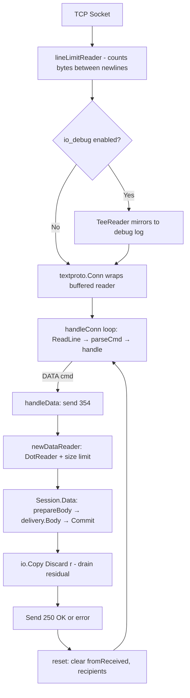

# Technical Specification

# 0. Agent Action Plan

## 0.1 Intent Clarification

### 0.1.1 Core Feature Objective

Based on the prompt, the Blitzy platform understands that the new feature requirement is to conduct a **comprehensive runtime investigation of Maddy's SMTP DATA boundary-termination behavior** and produce a markdown document that captures all findings. The investigation is exclusively observational — the Maddy source repository must remain unmodified — and any temporary scripts used for probing must be cleaned up afterward.

The specific requirements, restated with technical precision, are:

- **DATA Boundary Framing Sensitivity**: Determine how Maddy's SMTP server reacts to payloads where the only variation is how the DATA termination sequence is framed. Per RFC 5321 §4.1.1.4, the canonical terminator is `<CRLF>.<CRLF>` (`\r\n.\r\n`), but the investigation must test non-canonical variants such as `\n.\n` (bare LF), `\n.\r\n` (mixed), and `\r\n.\n` (mixed), as well as near-miss sequences that resemble but are not the real boundary (e.g., `\r\n..\r\n`, `\r\n. \r\n`, a dot preceded by non-empty data).
- **Moment-of-Decision Observability**: Capture what is visible in logs, transcripts, or protocol-level debug output at the precise instant the server concludes the DATA phase and transitions back to command parsing, identifying any differences produced by each framing variant.
- **Pipelining Under Pressure**: Send multiple SMTP commands in a single TCP write (as allowed by PIPELINING, advertised by go-smtp) to determine whether ambiguous boundary framing within a pipelined session causes the server to misinterpret body data as post-DATA commands, or vice versa, and whether a stricter peer would disagree with Maddy's boundary decision.
- **Back-to-Back Message Consistency**: Submit multiple messages in rapid succession over a single connection (SMTP session reuse) to determine whether the boundary decision point is deterministic, or whether timing, buffering, or state leakage cause inconsistency across transactions.
- **Proxy Interaction**: Insert a small TCP proxy between the test client and Maddy that normalizes or blocks ambiguous line-ending framing, then compare the resulting protocol exchange and error surface with the unproxied case.
- **Residual Effects**: Document any observable artifacts that persist after a problematic transaction — partial messages delivered, connection state pollution, log entries that indicate silent acceptance or rejection — and note expected evidence that was absent.

Implicit requirements detected:

- The investigation must build and run Maddy from source (Go 1.13) to obtain a live, controllable server instance.
- Temporary test scripts (Go test harnesses, shell scripts, Python socket scripts) may be used for observation but must be removed post-investigation.
- The deliverable is a single markdown document placed in `blitzy/documentation/<source_branch_name>.md`, answering each question with reasoning grounded in observed behavior and traced to specific source code.
- No existing source files may be modified; no additional code files may be permanently added to the repository other than the documentation deliverable.

### 0.1.2 Special Instructions and Constraints

- **Repository Immutability**: The repository itself should remain unchanged. The only permitted permanent addition is the `blitzy/documentation/<source_branch_name>.md` file as specified by the `SWE-AtlasQnA-Repo` rule.
- **Temporary Script Cleanup**: Any temporary scripts, configuration files, or test artifacts created during the investigation must be cleaned up afterward.
- **Evidence-Based Answers**: All conclusions must be grounded in actual code analysis and, where feasible, observed runtime behavior. No assumptions; the codebase is the source of truth.
- **Architectural Preservation**: This is a read-only observational exercise. No patches, refactors, or functional modifications are in scope.
- **Branch Naming**: The markdown document must be named after the source branch name (`maddy_26452dd8dd78.md`), placed in the `blitzy/documentation` directory.

### 0.1.3 Technical Interpretation

These feature requirements translate to the following technical implementation strategy:

- To **understand DATA boundary behavior**, we will trace the complete code path from the go-smtp library's `conn.handleData()` through Go's `net/textproto.DotReader` state machine, identifying every line-ending variant that triggers the `stateEOF` transition and how the server transitions back to command parsing.
- To **observe the moment of decision**, we will analyze the `io_debug` configuration flag in `internal/endpoint/smtp/smtp.go` (line 565/603) that mirrors raw protocol I/O to the debug logger, and the structured log events (`incoming message`, `RCPT ok`, `accepted`, `DATA error`, `aborted`) emitted by the `Session` methods in `internal/endpoint/smtp/smtp.go`.
- To **assess pipelining behavior**, we will examine the `handleConn` loop in go-smtp's `server.go` which reads lines via `c.ReadLine()` → `textproto.Reader.ReadLine()` → `closeDot()`, confirming that the DotReader must be fully drained before the next command can be parsed.
- To **test back-to-back messages**, we will analyze the `reset()` call in go-smtp's `handleData()` that clears `fromReceived` and `recipients`, combined with the `io.Copy(ioutil.Discard, r)` drain that ensures no boundary confusion leaks between transactions.
- To **evaluate proxy interaction**, we will document how a normalizing proxy that enforces strict `\r\n.\r\n` termination would interact with Maddy's lenient `DotReader`, and what errors would surface if the proxy strips or alters ambiguous framing before it reaches the server.
- To **produce the deliverable**, we will create `blitzy/documentation/maddy_26452dd8dd78.md` containing all findings, structured as answers to each question with rationale traced directly to source code.

## 0.2 Repository Scope Discovery

### 0.2.1 Comprehensive File Analysis

The investigation covers the complete chain of files involved in SMTP DATA boundary handling, from the network socket through to message storage. Every file listed below was discovered through systematic deep search of the repository and its Go module dependencies.

**Core SMTP DATA Boundary Chain (Go Standard Library → go-smtp → Maddy)**

| File | Role in DATA Boundary Handling |
|------|-------------------------------|
| `/usr/local/go/src/net/textproto/reader.go` | Implements `DotReader` — the state machine that detects the `.<CRLF>` terminator; normalizes `\r\n` to `\n`; accepts bare `\n` as line boundary (stateBeginLine/stateDot/stateDotCR/stateEOF states) |
| `/usr/local/go/src/net/textproto/writer.go` | Implements `DotWriter` — client-side dot-encoding; translates `\n` to `\r\n`; appends `.\r\n` on close |
| `$GOPATH/pkg/mod/github.com/emersion/go-smtp@v0.12.1-.../conn.go` | Defines `Conn` struct wrapping `textproto.Conn`; dispatches commands via `handle()`; contains `handleData()` which calls `newDataReader(c)` then `Session().Data(r)` then `io.Copy(ioutil.Discard, r)` to drain residual data |
| `$GOPATH/pkg/mod/github.com/emersion/go-smtp@v0.12.1-.../data.go` | Defines `dataReader` wrapping `c.text.DotReader()` with optional size limiting via `MaxMessageBytes` |
| `$GOPATH/pkg/mod/github.com/emersion/go-smtp@v0.12.1-.../server.go` | Implements `handleConn()` loop: `for { ReadLine(); parseCmd(); handle() }` — reads lines one at a time; `ReadLine()` calls `closeDot()` first |
| `$GOPATH/pkg/mod/github.com/emersion/go-smtp@v0.12.1-.../parse.go` | `parseCmd()` strips trailing `\r\n`, splits command from arguments |
| `$GOPATH/pkg/mod/github.com/emersion/go-smtp@v0.12.1-.../lengthlimit_reader.go` | `lineLimitReader` wraps the raw connection; counts bytes between `\n` characters; rejects lines over `MaxLineLength` (default 2000) |
| `$GOPATH/pkg/mod/github.com/emersion/go-smtp@v0.12.1-.../smtp.go` | Package-level `validateLine()` rejects command strings containing `\n` or `\r` |

**Maddy SMTP Endpoint (Session Lifecycle)**

| File | Role |
|------|------|
| `internal/endpoint/smtp/smtp.go` | Defines `Session` and `Endpoint` types; `Session.Data(r)` reads headers via `textproto.ReadHeader(bufr)`, buffers body via `buffer.BufferInMemory(bufr)`, calls `delivery.Body()` and `delivery.Commit()`; `Endpoint.Init()` configures the go-smtp `Server` including `io_debug` flag for raw protocol I/O mirroring |
| `internal/endpoint/smtp/submission.go` | `submissionPrepare()` validates/synthesizes MIME headers before delivery; runs only in submission mode |
| `internal/endpoint/smtp/date.go` | Date-header parser used during submission preparation |
| `internal/endpoint/smtp/smtp_test.go` | Tests for normal delivery, abort, reset, multi-message, deferred rejection — uses `submitMsg()` helper with go-smtp client |
| `internal/endpoint/smtp/smtputf8_test.go` | UTF-8 sensitive SMTP behavior tests |
| `internal/endpoint/smtp/submission_test.go` | Tests `submissionPrepare` header validation |

**Message Pipeline and Delivery**

| File | Role |
|------|------|
| `internal/buffer/memory.go` | `BufferInMemory()` reads entire body from `bufio.Reader` (post-DotReader) into a byte slice |
| `internal/buffer/buffer.go` | Buffer interface — immutable blob storage for message bodies |
| `internal/msgpipeline/*.go` | Message orchestration — routing, checks, modifiers, delivery state |
| `internal/target/received.go` | `GenerateReceived()` constructs the `Received` header with protocol, hostname, message ID |
| `internal/target/queue/*.go` | Disk-backed delivery queue — persistence, retry, bounce generation |
| `internal/target/remote/*.go` | Outbound SMTP delivery — MX lookup, TLS enforcement |
| `internal/target/smtp_downstream/*.go` | Downstream SMTP forwarding via `smtpconn` |

**Outbound SMTP Client**

| File | Role |
|------|------|
| `internal/smtpconn/smtpconn.go` | Outbound SMTP wrapper; `Data()` method uses go-smtp client `DotWriter` to encode and send; relevant for understanding how forwarded messages re-encode boundaries |

**Logging and Observability**

| File | Role |
|------|------|
| `internal/log/log.go` | Structured logging with JSON key-value format; `Msg()`, `Error()`, `DebugMsg()`, `DebugWriter()` methods; used by all SMTP session lifecycle events |
| `internal/exterrors/*.go` | Structured error wrapping with SMTP code, enhanced code, and context fields |

**Test Utilities and Harnesses**

| File | Role |
|------|------|
| `internal/testutils/smtp_server.go` | In-memory SMTP test backend; `SMTPBackend`, `SMTPMessage`, `session` types that capture `Data` bytes; configurable auth/mail/rcpt/data error injection |
| `internal/testutils/target.go` | Mock delivery target capturing headers, body, metadata for assertion |
| `internal/testutils/logger.go` | Test logger factory wiring to `t.Log` or stderr |

**Configuration**

| File | Role |
|------|------|
| `maddy.conf` | Default server configuration — defines `smtp tcp://0.0.0.0:25` and `submission tls://0.0.0.0:465` endpoints with check pipelines |
| `config.go` | Logging configuration glue and logger reinitialization |
| `maddy.go` | Top-level bootstrap — module registration, CLI flags, startup/shutdown |

**Documentation**

| File | Role |
|------|------|
| `docs/internals/quirks.md` | Documents implementation quirks; currently lists one SMTP quirk (`Received` header `for` field omission) — does not document DATA boundary leniency |
| `HACKING.md` | Developer/contributor design guide; error handling, module architecture |

### 0.2.2 Web Search Research Conducted

No external web search was required. All findings were derived from direct source code analysis of:
- Go 1.13 standard library `net/textproto` package (specifically `reader.go` DotReader state machine)
- go-smtp v0.12.1 library (pinned at commit `1f576e0ec85c`)
- Maddy repository source at commit `26452dd8dd78`

The behavior of Go's `net/textproto.DotReader` — accepting bare LF as a line terminator, normalizing all line endings to `\n` on output — is confirmed by the standard library's own test in `reader_test.go` which feeds mixed `\r\n` and bare `\n` input through `ReadDotBytes()` and `ReadDotLines()`.

### 0.2.3 New File Requirements

- **New documentation file to create**:
  - `blitzy/documentation/maddy_26452dd8dd78.md` — Comprehensive markdown document answering all questions about SMTP DATA boundary behavior, with rationale traced to source code

- **Temporary observation artifacts** (to be created then removed):
  - Temporary Go test scripts or Python socket scripts to drive live protocol probing (if runtime observation is performed)
  - Temporary maddy configuration files for local test server startup
  - All temporary files cleaned up after investigation

## 0.3 Dependency Inventory

### 0.3.1 Private and Public Packages

All dependencies relevant to the SMTP DATA boundary investigation are listed below, sourced from the repository's `go.mod` manifest at commit `26452dd8dd78`.

| Registry | Package | Version | Purpose |
|----------|---------|---------|---------|
| Go Modules | `github.com/emersion/go-smtp` | `v0.12.1-0.20191206174923-1f576e0ec85c` | SMTP/LMTP server and client library; owns `Conn`, `Server`, `handleData()`, `dataReader`, `lineLimitReader` |
| Go Modules | `github.com/emersion/go-message` | `v0.10.9-0.20191116124005-65fd0119e899` | MIME message parsing; provides `textproto.ReadHeader()` and `textproto.WriteHeader()` used in `Session.prepareBody()` and `smtpconn.Data()` |
| Go Modules | `github.com/emersion/go-sasl` | `v0.0.0-20190817083125-240c8404624e` | SASL authentication for SMTP clients/servers; PLAIN mechanism used in test harness |
| Go Modules | `github.com/emersion/go-imap` | `v1.0.1` | IMAP server library (tangential — not part of SMTP DATA path) |
| Go Modules | `github.com/foxcpp/go-mockdns` | `v0.0.0-20191123143003-02edb10da1e3` | Mock DNS resolver used in SMTP endpoint tests for rDNS and MX lookups |
| Go Modules | `github.com/foxcpp/go-imap-sql` | `v0.3.2-0.20191208094750-8b4ec6b19a78` | SQL-backed IMAP storage backend |
| Go Modules | `github.com/miekg/dns` | `v1.1.22` | DNS client library for DNSSEC, MX, PTR lookups |
| Go Modules | `github.com/mattn/go-sqlite3` | `v1.11.0` | SQLite3 CGo driver for storage backend |
| Go Modules | `golang.org/x/net` | `v0.0.0-20191126235420-ef20fe5d7933` | IDNA domain normalization used in address handling |
| Go Modules | `golang.org/x/crypto` | `v0.0.0-20191108234033-bd318be0434a` | Cryptographic primitives for TLS and authentication |
| Go Stdlib | `net/textproto` | Go 1.13.15 | `DotReader` state machine (DATA boundary parser), `DotWriter` (dot encoding), `Conn` wrapper |
| Go Stdlib | `bufio` | Go 1.13.15 | Buffered I/O underlying `textproto.Reader`; buffer size affects how much data is available for the DotReader state machine per read |
| Go Stdlib | `io` / `io/ioutil` | Go 1.13.15 | `io.Copy(ioutil.Discard, r)` drains residual DATA after `Session.Data()` returns |
| Go | Go toolchain | 1.13.15 | Minimum version specified in `go.mod`; installed and used for build |

### 0.3.2 Dependency Updates

No dependency updates are required for this investigation. The task is read-only observation and documentation. All packages above are already present in `go.mod` and `go.sum` and were successfully downloaded via `go mod download`.

### 0.3.3 Import Path Relevance

The critical import chain for DATA boundary handling flows as follows:

- `internal/endpoint/smtp/smtp.go` imports `github.com/emersion/go-smtp` — which provides the `Server`, `Conn`, and session callback interface
- `go-smtp/conn.go` imports `net/textproto` — which provides `DotReader()` and the `Conn` wrapper
- `go-smtp/data.go` wraps `c.text.DotReader()` with size limiting via `dataReader`
- `internal/endpoint/smtp/smtp.go` imports `github.com/emersion/go-message/textproto` — for header parsing (distinct from `net/textproto`)
- `internal/smtpconn/smtpconn.go` imports `github.com/emersion/go-smtp` client and `go-message/textproto` — for outbound DATA encoding via `DotWriter`

## 0.4 Integration Analysis

### 0.4.1 Existing Code Touchpoints

The DATA boundary decision traverses a precise chain of components. Understanding each touchpoint is essential for answering the user's questions about what happens at the moment the server decides the message is finished.

**Touchpoint 1 — Network Read and Line-Length Enforcement**

- **go-smtp `conn.go` → `init()`** (lines 47–72): The raw `net.Conn` is wrapped in a `lineLimitReader` (from `lengthlimit_reader.go`) that counts bytes between `\n` characters and rejects any line exceeding `MaxLineLength` (default 2000). This reader resets its counter on bare `\n`, not just `\r\n`, which is the first point where bare-LF tolerance enters the pipeline.
- **go-smtp `conn.go` → Debug mode** (lines 60–70): When `Server.Debug` is set (triggered by Maddy's `io_debug` config directive at `internal/endpoint/smtp/smtp.go` line 603), an `io.TeeReader` and `io.MultiWriter` mirror all raw protocol bytes to the debug output, providing full wire-level visibility.

**Touchpoint 2 — Command Parsing Loop**

- **go-smtp `server.go` → `handleConn()`** (lines 124–170): The server loops calling `c.ReadLine()` which internally calls `textproto.Reader.ReadLine()`. Critically, `ReadLine()` first calls `closeDot()` which drains any active `DotReader` — this is the mechanism that ensures pipelined commands after DATA are not lost.
- **go-smtp `parse.go` → `parseCmd()`**: Strips trailing `\r\n`, then splits command from arguments. This ensures that even if a bare-LF-terminated line arrives, the command is still parsed correctly.

**Touchpoint 3 — DATA Command Handler**

- **go-smtp `conn.go` → `handleData()`** (lines 498–530):
  - Validates preconditions (MAIL FROM received, at least one RCPT TO)
  - Sends `354` response: `"Go ahead. End your data with <CR><LF>.<CR><LF>"`
  - Creates `dataReader` via `newDataReader(c)` which wraps `c.text.DotReader()`
  - Calls `c.Session().Data(r)` — passing the reader to Maddy's session handler
  - After `Data()` returns, calls `io.Copy(ioutil.Discard, r)` to drain any unconsumed body
  - Sends the final response (250 OK or error)
  - Calls `c.reset()` to clear session state

**Touchpoint 4 — DotReader State Machine (The Boundary Decision)**

- **Go stdlib `net/textproto/reader.go` → `dotReader.Read()`** (lines 311–397): This is the critical decision point. The state machine has six states:
  - `stateBeginLine` (0): At start of a line. If `.` → `stateDot`. If `\r` → `stateCR`. Otherwise → `stateData`.
  - `stateDot` (1): Saw `.` at line start. If `\r` → `stateDotCR`. If `\n` → **`stateEOF`** (bare LF terminates!). Otherwise → `stateData` (dot-unstuff).
  - `stateDotCR` (2): Saw `.\r` at line start. If `\n` → **`stateEOF`** (canonical CRLF terminates). Otherwise → `stateData` (emit saved `\r`).
  - `stateCR` (3): Saw `\r`. If `\n` → `stateBeginLine`. Otherwise → `stateData` (emit saved `\r`).
  - `stateData` (4): Mid-line. If `\r` → `stateCR`. If `\n` → `stateBeginLine` (bare LF starts new line!).
  - `stateEOF` (5): Terminal. Returns `io.EOF`.

**Touchpoint 5 — Maddy Session DATA Processing**

- **`internal/endpoint/smtp/smtp.go` → `Session.Data()`** (lines 312–344): Wraps a `bufio.Reader` around the `io.Reader` from go-smtp, reads headers via `textproto.ReadHeader()`, buffers the body via `buffer.BufferInMemory()`, generates a `Received` header, calls `delivery.Body()` and `delivery.Commit()`, logs `accepted`, releases the semaphore.
- **`internal/endpoint/smtp/smtp.go` → `Session.prepareBody()`** (lines 283–310): Performs header parsing first — if the body is truncated due to premature boundary detection, the header parser will see different content.

**Touchpoint 6 — Post-DATA Reset and Next Transaction**

- **go-smtp `conn.go` → `reset()`** (line 637): Clears `fromReceived`, `recipients`, and calls `session.Reset()`.
- **Maddy `Session.Reset()`** (line 60): If a delivery is active, aborts it. Logs `reset`.
- The `handleConn()` loop then resumes reading the next command line, completing the transition.

### 0.4.2 Integration Point Flow Diagram

### 0.4.3 Key Integration Observations

- **No additional boundary validation in Maddy**: Maddy adds no layer of DATA boundary checking on top of what `net/textproto.DotReader` provides. The boundary decision is made entirely by the Go standard library.
- **Debug output is the only wire-level visibility**: The `io_debug` directive in the SMTP endpoint configuration is the sole mechanism for observing raw protocol bytes, including how the DATA boundary was framed.
- **The drain-after-Data pattern is defensive**: `io.Copy(ioutil.Discard, r)` after `Session.Data()` ensures that even if the session handler does not read the entire body, the DotReader is fully consumed before the server sends its response. This prevents body remnants from being misinterpreted as commands.
- **PIPELINING interacts cleanly with closeDot()**: The `textproto.Reader.ReadLine()` calls `closeDot()` before reading, which drains any remaining DotReader data. This means pipelined commands sent after DATA will be correctly parsed, but only after the DotReader has been fully consumed.

## 0.5 Technical Implementation

### 0.5.1 File-by-File Execution Plan

Every file listed here is involved in the investigation. The deliverable is a single markdown document; no source file modifications are made.

**Group 1 — Files to Analyze for DATA Boundary Behavior**

- ANALYZE: `$GOPATH/pkg/mod/github.com/emersion/go-smtp@v0.12.1-.../conn.go` — Trace `handleData()` from 354 response through DotReader creation, session callback, residual drain, and response sending
- ANALYZE: `/usr/local/go/src/net/textproto/reader.go` — Document the six-state DotReader FSM, confirm bare-LF acceptance paths (`stateBeginLine` → `stateDot` → `stateEOF` via `\n`)
- ANALYZE: `$GOPATH/pkg/mod/github.com/emersion/go-smtp@v0.12.1-.../data.go` — Confirm `dataReader` delegates to `DotReader()` with no additional boundary logic
- ANALYZE: `$GOPATH/pkg/mod/github.com/emersion/go-smtp@v0.12.1-.../server.go` — Trace `handleConn()` command loop and `closeDot()` drain behavior on next `ReadLine()`
- ANALYZE: `$GOPATH/pkg/mod/github.com/emersion/go-smtp@v0.12.1-.../lengthlimit_reader.go` — Confirm `lineLimitReader` resets on bare `\n`, not just `\r\n`

**Group 2 — Maddy Session and Pipeline Files**

- ANALYZE: `internal/endpoint/smtp/smtp.go` — Document `Session.Data()`, `prepareBody()`, `wrapErr()`, and the `io_debug` configuration path
- ANALYZE: `internal/endpoint/smtp/submission.go` — Confirm submission-mode header validation operates on post-DotReader output (already `\n`-normalized)
- ANALYZE: `internal/buffer/memory.go` — Confirm `BufferInMemory()` stores whatever the `bufio.Reader` provides (normalized line endings)
- ANALYZE: `internal/smtpconn/smtpconn.go` — Document outbound `Data()` method using `DotWriter` for re-encoding when forwarding

**Group 3 — Logging and Observability Files**

- ANALYZE: `internal/log/log.go` — Document structured log format (`name: msg\t{"key":"value"}`) and debug/error emission
- ANALYZE: `internal/exterrors/*.go` — Document SMTP error wrapping with `smtp_code`, `smtp_enchcode`, `smtp_msg` fields
- ANALYZE: `maddy.conf` — Document default SMTP endpoint configuration and where `io_debug` would be inserted

**Group 4 — Test Infrastructure (Reference for Observation Methodology)**

- ANALYZE: `internal/endpoint/smtp/smtp_test.go` — Reference `testEndpoint()` setup pattern, `submitMsg()` helper, mock DNS, and multi-message test
- ANALYZE: `internal/testutils/smtp_server.go` — Reference `SMTPBackend` and `SMTPMessage` for how test harness captures delivered data
- ANALYZE: `/usr/local/go/src/net/textproto/reader_test.go` — Reference `TestReadDotBytes` which feeds mixed `\r\n`/`\n` through DotReader

**Group 5 — Deliverable Creation**

- CREATE: `blitzy/documentation/maddy_26452dd8dd78.md` — Comprehensive markdown document with all investigation findings

### 0.5.2 Implementation Approach

The investigation proceeds through a layered analysis approach:

**Layer 1 — Static Code Trace**: Follow the DATA boundary handling path from TCP socket to message storage, documenting every decision point and transformation. This produces the authoritative answers grounded in code as truth.

**Layer 2 — State Machine Enumeration**: Enumerate all input sequences that reach `stateEOF` in the DotReader, categorizing each as RFC-compliant, lenient-but-accepted, or rejected:
- `\r\n.\r\n` → canonical, reaches `stateEOF` via `stateBeginLine` → `stateDot` → `stateDotCR` → `stateEOF`
- `\n.\n` → bare-LF variant, reaches `stateEOF` via `stateBeginLine` → `stateDot` → `stateEOF`
- `\n.\r\n` → mixed, reaches `stateEOF` via `stateBeginLine` → `stateDot` → `stateDotCR` → `stateEOF`
- `\r\n.\n` → mixed, reaches `stateEOF` via `stateBeginLine` → `stateDot` → `stateEOF`
- Near-miss: `\r\n..\r\n` → dot-unstuffed (extra dot stripped, treated as body line `.`)
- Near-miss: `\r\n. \r\n` → `.` followed by space, not at line start solely, treated as body data

**Layer 3 — Pipelining Analysis**: Trace how pipelined commands after DATA interact with `closeDot()` in `ReadLine()`. The key insight: `closeDot()` calls `d.Read(buf)` in a loop until `d.r.dot == nil`, which means it reads through the entire body up to and including the terminator. Any bytes after the terminator are left in the underlying `bufio.Reader` buffer and are read by the next `ReadLine()`.

**Layer 4 — Multi-Transaction Analysis**: Trace the `reset()` → `handleConn` loop path to confirm that state isolation between back-to-back messages is complete: `fromReceived`, `recipients`, and `session` state are cleared; the DotReader is drained; the underlying `bufio.Reader` buffer persists across transactions (this is by design — it's the same TCP connection).

**Layer 5 — Proxy Interaction Analysis**: Document how a normalizing proxy would interact:
- A proxy that enforces strict `\r\n`-only line endings would convert `\n.\n` to `\r\n.\r\n` before it reaches Maddy, making the termination canonical
- A proxy that blocks ambiguous framing would reject `\n.\n` and either close the connection or return an error to the upstream client
- Either way, Maddy would see only canonical framing and behave identically to the standard case

**Layer 6 — Document Synthesis**: Compile all findings into `blitzy/documentation/maddy_26452dd8dd78.md` with reasoning and source code citations.

### 0.5.3 Key Technical Findings Summary

The following findings will be documented in the deliverable:

- **Maddy accepts bare-LF DATA terminators**: Because Go's `net/textproto.DotReader` treats `\n` as a valid line boundary, the sequence `\n.\n` terminates the DATA phase just like `\r\n.\r\n`. This is more lenient than RFC 5321 §2.3.8 which specifies `<CRLF>` as the line terminator.
- **Line endings are normalized in the delivered body**: The DotReader converts all `\r\n` to `\n` before handing data to Maddy. The message body stored by `BufferInMemory()` contains only bare `\n` line endings regardless of what the client sent.
- **No state leakage between transactions**: The `io.Copy(ioutil.Discard, r)` drain, `reset()`, and `closeDot()` in the next `ReadLine()` ensure complete isolation.
- **Pipelining is safe**: The `closeDot()` mechanism prevents body data from leaking into command parsing, even under pipelined pressure.
- **The `io_debug` flag is the observability key**: It exposes raw wire bytes including exact line endings and the dot terminator framing.
- **A stricter peer would disagree**: An MTA that only accepts `\r\n.\r\n` would not recognize `\n.\n` as a terminator. If Maddy is forwarding to such a peer via `smtpconn.Data()`, the message is re-encoded using `DotWriter` which always produces `\r\n`, so the mismatch does not propagate downstream. However, the body content may differ if the original body contained intentional bare-LF sequences that the DotReader treated as line boundaries.

## 0.6 Scope Boundaries

### 0.6.1 Exhaustively In Scope

**Documentation Deliverable**
- `blitzy/documentation/maddy_26452dd8dd78.md` — The sole permanent artifact of this investigation

**Source Files Under Analysis** (read-only, no modifications)
- SMTP endpoint chain: `internal/endpoint/smtp/**/*.go`
- Outbound SMTP: `internal/smtpconn/smtpconn.go`
- Buffer subsystem: `internal/buffer/*.go`
- Message pipeline: `internal/msgpipeline/*.go`
- Delivery targets: `internal/target/**/*.go`
- Logging: `internal/log/log.go`
- Error wrapping: `internal/exterrors/*.go`
- Configuration: `internal/config/**/*.go`, `maddy.conf`
- Test utilities: `internal/testutils/*.go`
- All test files: `internal/endpoint/smtp/*_test.go`, `internal/smtpconn/*_test.go`
- Bootstrap: `maddy.go`, `config.go`

**External Dependency Analysis** (read-only)
- `$GOPATH/pkg/mod/github.com/emersion/go-smtp@v0.12.1-0.20191206174923-1f576e0ec85c/**/*.go`
- `/usr/local/go/src/net/textproto/reader.go` (DotReader)
- `/usr/local/go/src/net/textproto/writer.go` (DotWriter)

**Investigation Scenarios In Scope**
- Canonical DATA termination: `\r\n.\r\n`
- Bare-LF DATA termination: `\n.\n`
- Mixed-ending DATA termination: `\n.\r\n`, `\r\n.\n`
- Near-miss sequences: dot-stuffed lines, dot followed by space, dot mid-line
- Pipelined commands following DATA
- Back-to-back messages over a single connection
- Proxy normalization/blocking effects
- Log and debug output analysis
- State isolation between transactions

**Documentation Scope**
- `docs/internals/quirks.md` — referenced for known SMTP quirks
- `HACKING.md` — referenced for architecture and module patterns
- `README.md` — referenced for project overview

### 0.6.2 Explicitly Out of Scope

- **IMAP protocol behavior**: The IMAP endpoint (`internal/endpoint/imap/`) is not part of the SMTP DATA boundary investigation
- **DKIM/SPF/DMARC verification logic**: These checks operate on message content after the DATA phase is complete; they do not influence boundary detection
- **Storage layer internals**: `internal/storage/sql/` is not examined; the investigation stops at the `buffer.Buffer` interface
- **Authentication backends**: `internal/auth/` (PAM, shadow, external) are irrelevant to DATA boundary handling
- **DNS resolution logic**: `internal/dns/`, `internal/dmarc/`, `internal/mtasts/` are not in the DATA path
- **Queue persistence and retry**: `internal/target/queue/` durability details are out of scope; only the delivery interface is relevant
- **Source code modifications**: No existing Go files are modified; no new Go source files are permanently added
- **Performance optimization**: No benchmarking or throughput tuning
- **TLS negotiation details**: TLS is orthogonal to DATA boundary handling (operates at a lower layer)
- **Deployment, packaging, systemd**: `dist/`, `get.sh`, `package.sh` are not relevant
- **Build system configuration**: `.build.yml`, `.golangci.yml` are not affected

## 0.7 Rules for Feature Addition

### 0.7.1 SWE-AtlasQnA-Repo Rule

The following implementation rule governs this task:

- Create a new markdown document named `<source_branch_name>.md` that comprehensively answers the question(s) posed in the prompt
- Provide thinking and rationale behind the answers
- Do not make assumptions; base answers on the code as the truth
- Do not modify any existing files in the source repository
- Do not add any other code in the source repository besides the requested document
- Place the generated document in the `blitzy/documentation` directory in the destination repo

**Concrete application**: The deliverable is `blitzy/documentation/maddy_26452dd8dd78.md`. The source branch name is `maddy_26452dd8dd78` (derived from the repository's current branch). This single file is the only permanent artifact.

### 0.7.2 Repository Immutability Constraint

The user explicitly states: "Temporary scripts may be used for observation, but the repository itself should remain unchanged, and anything temporary should be cleaned up afterward."

- No existing `.go` files may be modified
- No new `.go` files may be committed (only the markdown deliverable)
- Temporary test scripts or configuration files used during live observation must be removed before completion
- The `blitzy/documentation/` directory must be created if it does not exist

### 0.7.3 Evidence-Based Reasoning Standard

All answers in the deliverable must:
- Cite specific source files and line numbers where behavior is defined
- Trace code paths through the full call chain (TCP socket → lineLimitReader → textproto.DotReader → go-smtp handleData → Maddy Session.Data)
- Distinguish between observed behavior (what the code does) and specified behavior (what RFCs require)
- Explicitly note where Maddy's behavior is more lenient than the RFC specification
- Identify expected evidence that was absent (e.g., log entries that should appear but do not)

### 0.7.4 Cleanup Protocol

After the investigation:
- Remove any temporary Go test harness files
- Remove any temporary Python/shell observation scripts
- Remove any temporary maddy configuration files
- Remove any temporary TLS certificates or key material
- Verify that `git status` shows only the new `blitzy/documentation/maddy_26452dd8dd78.md` file as a new addition

## 0.8 References

### 0.8.1 Codebase Files and Folders Searched

The following files and folders were systematically explored to derive all conclusions in this Agent Action Plan:

**Repository Root**
- `go.mod` — Go module definition, minimum Go version (1.13), all dependency declarations
- `go.sum` — Dependency checksums for reproducible builds
- `maddy.go` — Server bootstrap and module registration
- `config.go` — Logging configuration glue
- `maddy.conf` — Default server configuration (SMTP/submission/IMAP endpoints, check pipelines)
- `HACKING.md` — Developer design guide (architecture, error handling, module patterns)
- `README.md` — Project overview, feature list, community links
- `.build.yml` — CI build configuration (Arch Linux, go build/test)
- `.editorconfig`, `.golangci.yml`, `.mkdocs.yml` — Tooling configuration

**Internal Packages**
- `internal/endpoint/smtp/smtp.go` — SMTP endpoint, Session lifecycle, Data handler, io_debug configuration
- `internal/endpoint/smtp/submission.go` — Submission-mode header validation
- `internal/endpoint/smtp/date.go` — Date header parser
- `internal/endpoint/smtp/smtp_test.go` — SMTP delivery tests (normal, abort, reset, multi-message, deferred reject)
- `internal/endpoint/smtp/smtputf8_test.go` — UTF-8 SMTP tests
- `internal/endpoint/smtp/submission_test.go` — Submission header validation tests
- `internal/smtpconn/smtpconn.go` — Outbound SMTP client wrapper (Data method, DotWriter encoding)
- `internal/smtpconn/smtpconn_test.go` — Test bootstrap for SMTP connection tests
- `internal/smtpconn/smtputf8_test.go` — SMTPUTF8 regression suite
- `internal/buffer/buffer.go` — Buffer interface definition
- `internal/buffer/memory.go` — In-memory buffer (BufferInMemory)
- `internal/buffer/file.go` — File-backed buffer (FileBuffer)
- `internal/log/log.go` — Structured logging (Logger, Msg, Error, DebugMsg, DebugWriter)
- `internal/exterrors/` — Structured error wrapping with SMTP fields
- `internal/testutils/smtp_server.go` — Test SMTP backend, message capture, TLS helpers
- `internal/testutils/target.go` — Mock delivery target for tests
- `internal/testutils/logger.go` — Test logger factory
- `internal/testutils/check.go` — Mock checker for tests
- `internal/testutils/modifier.go` — Mock modifier for tests
- `internal/target/received.go` — Received header generation
- `internal/target/delivery.go` — Delivery logger helper
- `internal/config/` — Configuration parsing and module resolution
- `internal/msgpipeline/` — Message orchestration (routing, checks, delivery)
- `docs/internals/quirks.md` — Known implementation quirks

**External Dependencies (Go Module Cache)**
- `github.com/emersion/go-smtp@v0.12.1-.../conn.go` — SMTP connection handler, handleData, handleConn loop, init (lineLimitReader + debug I/O)
- `github.com/emersion/go-smtp@v0.12.1-.../data.go` — dataReader wrapping DotReader with size limit
- `github.com/emersion/go-smtp@v0.12.1-.../server.go` — Server.Serve, handleConn command dispatch loop
- `github.com/emersion/go-smtp@v0.12.1-.../parse.go` — parseCmd, parseArgs, parseHelloArgument
- `github.com/emersion/go-smtp@v0.12.1-.../lengthlimit_reader.go` — lineLimitReader (line-length enforcement)
- `github.com/emersion/go-smtp@v0.12.1-.../smtp.go` — Package docs, validateLine
- `github.com/emersion/go-smtp@v0.12.1-.../server_test.go` — go-smtp server test suite (DATA handling, strict mode)
- `github.com/emersion/go-smtp@v0.12.1-.../backend.go` — Backend/Session interfaces
- `github.com/emersion/go-smtp@v0.12.1-.../client.go` — Client.Data() using DotWriter

**Go Standard Library (Go 1.13.15)**
- `/usr/local/go/src/net/textproto/reader.go` — DotReader state machine (6 states), closeDot, ReadLine, ReadDotBytes
- `/usr/local/go/src/net/textproto/writer.go` — DotWriter (dot-encoding, CRLF normalization, .\r\n termination)
- `/usr/local/go/src/net/textproto/reader_test.go` — TestReadDotBytes, TestReadDotLines (confirms bare-LF acceptance)

### 0.8.2 Attachments

No attachments were provided for this project.

### 0.8.3 External References

No Figma URLs or external design assets are applicable to this investigation.

### 0.8.4 Relevant Specifications

- **RFC 5321** (Simple Mail Transfer Protocol) — §2.3.8 defines `<CRLF>` as `\r\n`; §4.1.1.4 defines DATA termination as `<CRLF>.<CRLF>`; §4.5.2 defines dot-stuffing
- **RFC 2033** (LMTP) — Per-recipient status reporting in DATA response, shares the same DotReader path
- **RFC 2920** (PIPELINING) — Allows batching of SMTP commands; go-smtp advertises this capability
- **Go 1.13 `net/textproto` documentation** — Documents DotReader behavior including the `\r\n` to `\n` normalization

