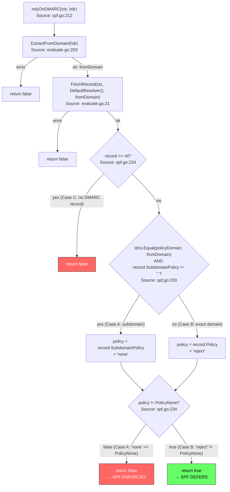
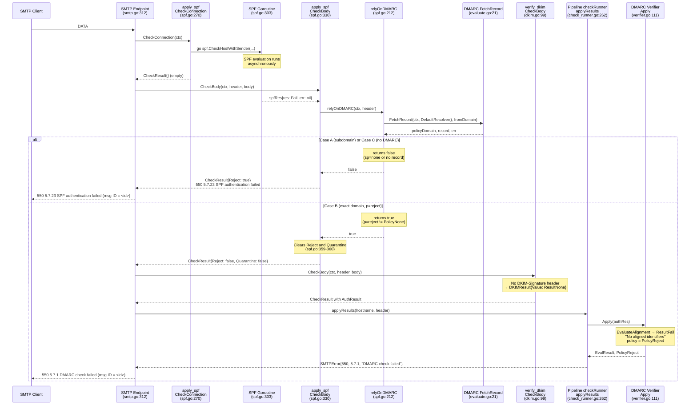

# SPF/DMARC Deferral Behavior in Maddy Mail Server

## Introduction

This document investigates a counterintuitive behavior in maddy's SPF and DMARC
checking pipeline: **why does maddy accept messages from a domain that publishes
`SPF: v=spf1 -all` (hard-fail-all) when a DMARC policy with a non-`none` policy
exists for that domain?**

Three controlled SMTP sessions (Cases A, B, C) are reproduced below. All three
sender domains publish identical SPF records (`v=spf1 -all`), yet the `apply_spf`
module produces different outcomes depending on the presence and content of the
sender's DMARC record.

**Default pipeline configuration** — The default maddy SMTP listener
(`maddy.conf` lines 53–70) configures the following check pipeline:

```
check {
    require_matching_ehlo
    require_mx_record
    verify_dkim
    apply_spf
}
dmarc yes
```

Source: `maddy.conf:53-70`

The `apply_spf` module has `enforceEarly` set to `false` by default
(Source: `internal/check/spf/spf.go:61`). This means the SPF evaluation starts
asynchronously inside `CheckConnection` (a goroutine calls
`spf.CheckHostWithSender`), and the result is consumed later in `CheckBody`,
where the DMARC deferral logic is applied.

The design rationale is stated in the comment at
Source: `internal/check/spf/spf.go:298-301`:

```go
// We start evaluation in parallel to other message processing,
// once we get the body, we fetch DMARC policy and see if it exists
// and not p=none. In that case, we rely on DMARC alignment to define result.
```

---

## DNS Environment

The following DNS zones define the controlled environment for all three cases:

| Domain | Record Type | Value |
|--------|-------------|-------|
| `subdomain.maddy-dmarc.com` | TXT (SPF) | `v=spf1 -all` |
| `maddy-dmarc.com` | TXT (SPF) | `v=spf1 -all` |
| `maddy-no-dmarc.com` | TXT (SPF) | `v=spf1 -all` |
| `_dmarc.maddy-dmarc.com` | TXT (DMARC) | `v=DMARC1; p=reject; sp=none` |

**Notable absences:**

- No `_dmarc.subdomain.maddy-dmarc.com` record exists.
- No `_dmarc.maddy-no-dmarc.com` record exists.

All three sender domains publish the same SPF hard-fail policy. The only
variable across the three cases is the DMARC record (or lack thereof) applicable
to each sender domain.

---

## Case A: subdomain.maddy-dmarc.com

**Session:** `MAIL FROM:<test@subdomain.maddy-dmarc.com>` with a matching
`From: <test@subdomain.maddy-dmarc.com>` header.

### (1) SMTP Response

```
550 5.7.23 SPF authentication failed (msg ID = <id>)
```

**Rationale:** The `apply_spf` module's `relyOnDMARC` function returns `false`
for this domain, so the SPF `failAction` is applied without deferral. The
`spfResult` helper constructs an `SMTPError` for `spf.Fail` with
`Code: 550`, `EnhancedCode: {5, 7, 23}`, and `Message: "SPF authentication
failed"` (Source: `internal/check/spf/spf.go:155-165`). The endpoint's `wrapErr`
method appends the message ID (Source: `internal/endpoint/smtp/smtp.go:436-437`).

The default `failAction` is `FailAction{Quarantine: true}`
(Source: `internal/check/spf/spf.go:70-73`). With a test configuration using
`FailAction{Reject: true}`, `FailAction.Apply` sets `Reject = true` on the
result (Source: `internal/check/action.go:97`). The deferral mechanism is
identical regardless of the configured action — `relyOnDMARC` clears **both**
`Reject` and `Quarantine` flags when it returns `true`
(Source: `internal/check/spf/spf.go:359-360`).

### (2) Stage of Outcome

**Stage:** `CheckBody` in the `apply_spf` module.

The rejection occurs during the body check phase. `CheckBody`
(Source: `internal/check/spf/spf.go:330`) reads the asynchronous SPF result from
the channel, calls `relyOnDMARC`, receives `false`, and falls through to line
364: `return s.spfResult(res.res, res.err)` — returning the full check result
with the Reject flag intact.

### (3) Server Log Lines

```
apply_spf: result: fail (matched 'all')
```

Source: `internal/check/spf/spf.go:315` — the `Debugf` log in the async
goroutine.

No `"deferring action due to a DMARC policy"` log line appears because
`relyOnDMARC` returned `false`.

### Code Trace

1. **`CheckConnection`** (line 270): Starts the async SPF goroutine.
   `spf.CheckHostWithSender` evaluates the sending IP against
   `subdomain.maddy-dmarc.com`'s SPF record (`v=spf1 -all`) and produces
   `spf.Fail`.

2. **`CheckBody`** (line 330): Reads `spfRes{res: Fail, err: nil}` from the
   channel.

3. **`relyOnDMARC`** (line 212):
   - `ExtractFromDomain(hdr)` extracts `"subdomain.maddy-dmarc.com"` from the
     `From` header (Source: `internal/dmarc/evaluate.go:203`).
   - `FetchRecord(ctx, dns.DefaultResolver(), "subdomain.maddy-dmarc.com")`
     (Source: `internal/dmarc/evaluate.go:21`):
     - Looks up `_dmarc.subdomain.maddy-dmarc.com` → **not found**.
     - Falls back to organizational domain via
       `publicsuffix.EffectiveTLDPlusOne("subdomain.maddy-dmarc.com")` →
       `"maddy-dmarc.com"` (Source: `internal/dmarc/evaluate.go:34`).
     - Looks up `_dmarc.maddy-dmarc.com` → **found**.
     - Returns `policyDomain = "maddy-dmarc.com"`,
       `record = {Policy: "reject", SubdomainPolicy: "none"}`.
   - Line 230: `!dns.Equal("maddy-dmarc.com", "subdomain.maddy-dmarc.com")` →
     `true` (they are not equal;
     Source: `internal/dns/norm.go:39`), AND `record.SubdomainPolicy != ""` →
     `true` (`"none" != ""`).
   - Line 231: `policy = record.SubdomainPolicy` = `"none"`.
   - Line 234: `"none" != dmarc.PolicyNone` → `false`
     (`dmarc.PolicyNone` = `"none"`; Source: `internal/dmarc/dmarc.go:21`).
   - **Returns `false`.**

4. **Line 364:** `return s.spfResult(res.res, res.err)` — the full result with
   Reject flag is returned, causing **rejection**.

---

## Case B: maddy-dmarc.com

**Session:** `MAIL FROM:<test@maddy-dmarc.com>` with a matching
`From: <test@maddy-dmarc.com>` header.

### (1) SMTP Response

This case has **two levels** of outcome, which is the core of the
counterintuitive behavior:

**At the SPF check level** — the `apply_spf` module **defers** enforcement.
`CheckBody` clears both enforcement flags
(Source: `internal/check/spf/spf.go:359-360`):

```go
checkRes.Quarantine = false
checkRes.Reject = false
```

The SPF check itself does **not** reject the message. The `AuthResult` (SPF
fail) is still recorded for downstream consumption.

**At the pipeline DMARC level** — the pipeline's `checkRunner.applyResults`
(Source: `internal/msgpipeline/check_runner.go:262`) invokes
`dmarcVerify.Apply(authRes)` (line 268). In `verifier.go:Apply`
(Source: `internal/dmarc/verifier.go:111`):

- `EvaluateAlignment` produces `ResultFail` with
  `Reason: "No aligned identifiers"` because SPF failed and no DKIM pass exists
  (Source: `internal/dmarc/evaluate.go:179-181`).
- Policy selection (line 150–153): `policyDomain == fromDomain` (both
  `"maddy-dmarc.com"`), so no subdomain policy substitution occurs →
  `policy = record.Policy = PolicyReject`.
- Back in `check_runner.go` line 271: `policy == PolicyReject` → constructs
  `SMTPError{Code: 550, EnhancedCode: {5, 7, 1}, Message: "DMARC check failed"}`
  (Source: `internal/msgpipeline/check_runner.go:278-281`).

The final SMTP response after `wrapErr` formatting:

```
550 5.7.1 DMARC check failed (msg ID = <id>)
```

**Key distinction:** The message IS ultimately rejected, but by the **pipeline
DMARC evaluator** — not by the SPF check. The SPF check accepted (deferred).
The overall pipeline outcome depends on whether DKIM passes or not. With no DKIM
signature (producing `DKIMResult{Value: ResultNone}` per
Source: `internal/check/dkim/dkim.go:116-118`), DMARC alignment fails and the
pipeline rejects.

### (2) Stage of Outcome

Two stages are involved:

1. **SPF deferral stage:** `CheckBody` in the `apply_spf` module
   (Source: `internal/check/spf/spf.go:351-361`). The SPF check returns
   `{Reject: false, Quarantine: false}` — it passes the message through.

2. **Final rejection stage:** `applyResults` in `checkRunner` of
   `internal/msgpipeline/check_runner.go:262-290`. The pipeline DMARC evaluator
   applies `PolicyReject` and returns the DMARC rejection error.

### (3) Server Log Lines

```
apply_spf: result: fail (matched 'all')
apply_spf: deferring action due to a DMARC policy
```

Source: `internal/check/spf/spf.go:315` for the first line (logged at `Debugf`
level in the async goroutine).
Source: `internal/check/spf/spf.go:353` for the second line (logged at `Printf`
/ INFO level because `res.res != spf.Pass`).

The presence of `"deferring action due to a DMARC policy"` is the observable
signal that SPF enforcement was deferred.

### Code Trace

1. **`CheckConnection`** (line 270): Starts the async SPF goroutine.
   `spf.CheckHostWithSender` evaluates the sending IP against
   `maddy-dmarc.com`'s SPF record (`v=spf1 -all`) and produces `spf.Fail`.

2. **`CheckBody`** (line 330): Reads `spfRes{res: Fail, err: nil}` from the
   channel.

3. **`relyOnDMARC`** (line 212):
   - `ExtractFromDomain(hdr)` extracts `"maddy-dmarc.com"`.
   - `FetchRecord(ctx, dns.DefaultResolver(), "maddy-dmarc.com")`:
     - Looks up `_dmarc.maddy-dmarc.com` → **found on first try**.
     - Returns `policyDomain = "maddy-dmarc.com"`,
       `record = {Policy: "reject", SubdomainPolicy: "none"}`.
   - Line 230: `!dns.Equal("maddy-dmarc.com", "maddy-dmarc.com")` → `false`
     (they are equal) → the entire condition is `false`; subdomain policy is
     **not** selected.
   - `policy = record.Policy` = `"reject"`.
   - Line 234: `"reject" != dmarc.PolicyNone` → `true`
     (`"reject" != "none"`).
   - **Returns `true`.**

4. **Lines 351–361:** `relyOnDMARC` returned `true`:
   - Line 353: Logs `"deferring action due to a DMARC policy"` at INFO level.
   - Line 358: `checkRes = s.spfResult(Fail, nil)` — computes the full SPF
     result (with `SMTPError` and `AuthResult`).
   - Line 359: `checkRes.Quarantine = false`.
   - Line 360: `checkRes.Reject = false`.
   - Returns the modified result — the SPF `fail` `AuthResult` is preserved
     for downstream DMARC evaluation, but **no enforcement flags are set**.

---

## Case C: maddy-no-dmarc.com

**Session:** `MAIL FROM:<test@maddy-no-dmarc.com>` with a matching
`From: <test@maddy-no-dmarc.com>` header.

### (1) SMTP Response

```
550 5.7.23 SPF authentication failed (msg ID = <id>)
```

Same as Case A — the SPF `failAction` is applied without deferral because
`relyOnDMARC` returns `false`
(Source: `internal/check/spf/spf.go:155-165`,
`internal/endpoint/smtp/smtp.go:436-437`).

### (2) Stage of Outcome

**Stage:** `CheckBody` in the `apply_spf` module.

Rejection at line 364: `return s.spfResult(res.res, res.err)` — the full result
with Reject flag intact.

### (3) Server Log Lines

```
apply_spf: result: fail (matched 'all')
```

Source: `internal/check/spf/spf.go:315`.

No `"deferring"` log line because `relyOnDMARC` returned `false`.

### Code Trace

1. **`CheckConnection`** (line 270): Starts the async SPF goroutine.
   `spf.CheckHostWithSender` evaluates the sending IP against
   `maddy-no-dmarc.com`'s SPF record (`v=spf1 -all`) and produces `spf.Fail`.

2. **`CheckBody`** (line 330): Reads `spfRes{res: Fail, err: nil}` from the
   channel.

3. **`relyOnDMARC`** (line 212):
   - `ExtractFromDomain(hdr)` extracts `"maddy-no-dmarc.com"`.
   - `FetchRecord(ctx, dns.DefaultResolver(), "maddy-no-dmarc.com")`:
     - Looks up `_dmarc.maddy-no-dmarc.com` → **not found**.
     - Falls back via
       `publicsuffix.EffectiveTLDPlusOne("maddy-no-dmarc.com")` →
       `"maddy-no-dmarc.com"` (it is already the organizational domain).
     - Looks up `_dmarc.maddy-no-dmarc.com` again → **still not found**.
     - Returns `nil` record
       (Source: `internal/dmarc/evaluate.go:49-51`).
   - Line 224–225: `record == nil` → **returns `false`**.

4. **Line 364:** `return s.spfResult(res.res, res.err)` — full result with
   Reject flag, causing **rejection**.

---

## Explanation

### Why Case B is Accepted Despite SPF -all

**Answer:** The `apply_spf` module's `CheckBody` method
(Source: `internal/check/spf/spf.go:351-361`) calls `relyOnDMARC` before
applying the SPF enforcement action. For Case B, `relyOnDMARC` discovers a DMARC
record at `_dmarc.maddy-dmarc.com` with `p=reject`. Because `policyDomain`
equals `fromDomain` (both `"maddy-dmarc.com"`), the subdomain policy (`sp=none`)
is **not** selected — instead, the domain-level policy (`p=reject`) is used.
Since `"reject" != PolicyNone`, `relyOnDMARC` returns `true`.

This triggers the deferral path at lines 358–361 where `checkRes.Quarantine`
and `checkRes.Reject` are both explicitly set to `false`, clearing any SPF
enforcement flags. The SPF `AuthResult` (fail) is still recorded as part of the
check result for downstream DMARC evaluation, but the SPF check itself does not
reject or quarantine the message.

**Thinking/Rationale:** The design philosophy (explained in the comment at
Source: `internal/check/spf/spf.go:298-301`) is: when a meaningful DMARC policy
exists (non-`none`), the SPF result should feed into the DMARC alignment
evaluation rather than independently enforcing rejection. This allows DMARC to
make the final disposition decision by considering both SPF and DKIM results
together. The SPF check essentially says: *"I found a failure, but there is a
DMARC policy that should handle this."*

At the pipeline level, DMARC evaluation does subsequently reject the message
(with `550 5.7.1 DMARC check failed`) because SPF is not aligned and no DKIM
pass is present. But the rejection comes from the pipeline DMARC evaluator
(`internal/msgpipeline/check_runner.go:278-281`), not from `apply_spf`.

### What Input Condition Triggers the Deferral

**Answer:** The deferral is triggered when **all** of the following conditions
are met (Source: `internal/check/spf/spf.go:212-234`):

1. `enforceEarly` is `false` (the default; Source: `internal/check/spf/spf.go:61`).
   If `true`, `CheckBody` returns an empty result immediately at line 331–334,
   and `CheckConnection` handles enforcement synchronously.

2. `ExtractFromDomain(hdr)` successfully extracts a `From` domain from the
   message header (Source: `internal/dmarc/evaluate.go:203`). If this fails
   (e.g., missing or malformed `From` header), `relyOnDMARC` returns `false`.

3. `FetchRecord(ctx, dns.DefaultResolver(), fromDomain)` returns a **non-nil**
   DMARC record (Source: `internal/dmarc/evaluate.go:21`). If no record is found
   (as in Case C), `relyOnDMARC` returns `false`.

4. The **effective policy** for the domain is **not** `PolicyNone` (`"none"`).

The effective policy selection logic (Source: `internal/check/spf/spf.go:228-232`):

- If `policyDomain == fromDomain`: effective policy = `record.Policy`.
- If `policyDomain != fromDomain` AND `record.SubdomainPolicy != ""`:
  effective policy = `record.SubdomainPolicy`.
- If `policyDomain != fromDomain` AND `record.SubdomainPolicy == ""`:
  effective policy = `record.Policy`.

**Thinking/Rationale:** The function mirrors the subdomain policy selection logic
found in the DMARC verifier (`internal/dmarc/verifier.go:150-153`), ensuring
that the SPF module's deferral decision aligns with what the pipeline DMARC
evaluator would enforce. If the effective policy is `none`, deferring would be
pointless — DMARC would not enforce anything, so SPF should enforce on its own.

### Why Case A Does Not Defer

**Answer:** Case A uses `fromDomain = "subdomain.maddy-dmarc.com"`. There is no
`_dmarc.subdomain.maddy-dmarc.com` record, so `FetchRecord` falls back to the
organizational domain via
`publicsuffix.EffectiveTLDPlusOne("subdomain.maddy-dmarc.com")` =
`"maddy-dmarc.com"` (Source: `internal/dmarc/evaluate.go:34`). The record is
found at `_dmarc.maddy-dmarc.com`, yielding `policyDomain = "maddy-dmarc.com"`
while `fromDomain = "subdomain.maddy-dmarc.com"`.

In `relyOnDMARC` at line 230:
`!dns.Equal("maddy-dmarc.com", "subdomain.maddy-dmarc.com")` evaluates to
`true` (they are **not** equal; Source: `internal/dns/norm.go:39`), and
`record.SubdomainPolicy` is `"none"` (not the empty string). So the subdomain
policy is selected: `policy = "none"` = `dmarc.PolicyNone`.

At line 234: `"none" != PolicyNone` evaluates to `false`. Therefore
`relyOnDMARC` returns `false`, and SPF enforces its result directly with
`550 5.7.23 SPF authentication failed`.

**Thinking/Rationale:** The distinction between Case A and Case B comes down to
whether the **effective** DMARC policy for the specific domain is `none` or not.
For subdomains covered by `sp=none`, the SPF check does **not** defer because it
knows the pipeline DMARC evaluator would apply `PolicyNone` — meaning DMARC
would not enforce anything. If SPF also deferred, the message would pass through
with no enforcement at all, creating an enforcement gap. The `relyOnDMARC`
function prevents this by only deferring when the effective DMARC policy would
actually do something (`p=reject` or `p=quarantine`).

### Which Runtime Component Makes the Decision

**Answer:** The decision is made by the `relyOnDMARC` method on the `state`
struct in `internal/check/spf/spf.go:212-235`. This method is called within
`CheckBody` at line 351 and acts as a gatekeeper: if it returns `true`, the SPF
check clears its enforcement flags (lines 359–360); if it returns `false`, SPF
enforcement proceeds normally (line 364).

**Important implementation detail:** `relyOnDMARC` performs its **own
independent** DMARC lookup using `dns.DefaultResolver()`
(Source: `internal/check/spf/spf.go:219`,
`internal/dns/resolver.go:37-43` — returns `net.DefaultResolver`). This is
separate from the pipeline-level DMARC verifier
(`internal/dmarc/verifier.go:48-53`) which uses the pipeline's resolver. This
means the SPF module's DMARC lookup may use a different resolver instance than
the pipeline's DMARC evaluation, although in production they both resolve to the
same `net.DefaultResolver`.

**Thinking/Rationale:** The `relyOnDMARC` function is a local decision-maker
embedded in the SPF check module. It does not communicate with the pipeline's
DMARC verifier; instead, it duplicates the DMARC record fetch and subdomain
policy selection logic. This design decouples the SPF check from the pipeline
architecture but introduces a subtle coupling to the DMARC record format and
policy semantics.

### How to Verify Using Observable Signals

**Answer:** Two observable signals distinguish the deferral path from the
enforcement path:

**Signal 1 — SMTP Response Enhanced Code:**

| Scenario | SMTP Response | Enhanced Code |
|----------|---------------|---------------|
| SPF rejects directly | `550 5.7.23 SPF authentication failed (msg ID = <id>)` | `5.7.23` |
| SPF defers, DMARC rejects | `550 5.7.1 DMARC check failed (msg ID = <id>)` | `5.7.1` |

Source: `internal/check/spf/spf.go:159-161` for the SPF error code.
Source: `internal/msgpipeline/check_runner.go:278-281` for the DMARC error code.

The enhanced code `5.7.23` vs `5.7.1` unambiguously distinguishes whether the
rejection originated from the SPF check or from the DMARC evaluator.

**Signal 2 — Server Log Lines:**

| Scenario | Log Line | Level |
|----------|----------|-------|
| SPF deferred | `apply_spf: deferring action due to a DMARC policy` | INFO |
| SPF not deferred | (line absent) | — |
| SPF result (always) | `apply_spf: result: fail (matched 'all')` | DEBUG |

Source: `internal/check/spf/spf.go:353` for the deferral log.
Source: `internal/check/spf/spf.go:315` for the result log.

**Verification method:** Enable debug logging for the `apply_spf` module. For
any incoming message with an SPF fail result:

- If you see `"deferring action due to a DMARC policy"` → SPF deferred to DMARC.
- If you do **not** see that line → SPF enforced independently.
- Check the SMTP response enhanced code: `5.7.23` = SPF rejection,
  `5.7.1` = DMARC rejection.

When deferral occurs **and** the message is ultimately rejected by DMARC, both
the SPF deferral log and the DMARC rejection will appear in the server logs.

---

## Decision Flowchart

The following diagram traces the `relyOnDMARC` function's decision path for
each of the three cases:



---

## Message Processing Sequence Diagram

The following sequence diagram illustrates how a message flows through the SPF
and DMARC pipeline for all three cases:



---

## Source Code References

| File | Key Lines | Purpose |
|------|-----------|---------|
| `internal/check/spf/spf.go` | 28, 61, 70–73, 115–165, 212–235, 270–320, 330–365 | SPF check module: `relyOnDMARC`, `CheckBody`, `CheckConnection`, `spfResult`, default `failAction` |
| `internal/dmarc/evaluate.go` | 21–69, 99–184, 186–201, 203–233 | `FetchRecord` with subdomain fallback, `EvaluateAlignment`, `isAligned`, `ExtractFromDomain` |
| `internal/dmarc/verifier.go` | 48–53, 66–95, 111–156 | `NewVerifier`, `FetchRecord` (method), `Apply` with subdomain policy selection at 150–153 |
| `internal/dmarc/dmarc.go` | 9–24 | Type aliases: `Record`, `Policy`, `PolicyNone`, `PolicyReject`, `PolicyQuarantine` |
| `internal/msgpipeline/check_runner.go` | 245–260, 262–309 | `checkBody` with DMARC fetch, `applyResults` with DMARC policy enforcement |
| `internal/msgpipeline/config.go` | 22, 90–95 | `doDMARC` flag definition and `dmarc yes` parsing |
| `internal/check/dkim/dkim.go` | 99–121 | `CheckBody`: when no `DKIM-Signature` header, returns `DKIMResult{Value: ResultNone}` via `noSigAction.Apply` |
| `internal/check/action.go` | 34–39, 81–98 | `FailAction` struct, `Apply` method merging reject/quarantine flags |
| `internal/endpoint/smtp/smtp.go` | 312–344, 389–455 | `Data` method calling `wrapErr`, `wrapErr` formatting `exterrors.SMTPError` to SMTP response |
| `internal/dns/resolver.go` | 37–43 | `DefaultResolver()` returning `net.DefaultResolver` |
| `internal/dns/norm.go` | 39–49 | `Equal()` domain comparison using IDNA normalization |
| `maddy.conf` | 53–70 | Default SMTP pipeline: `apply_spf`, `verify_dkim`, `dmarc yes` |
