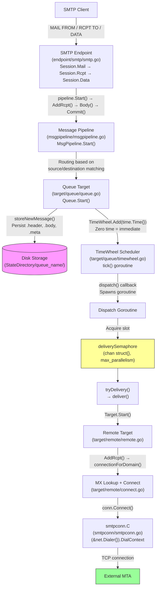
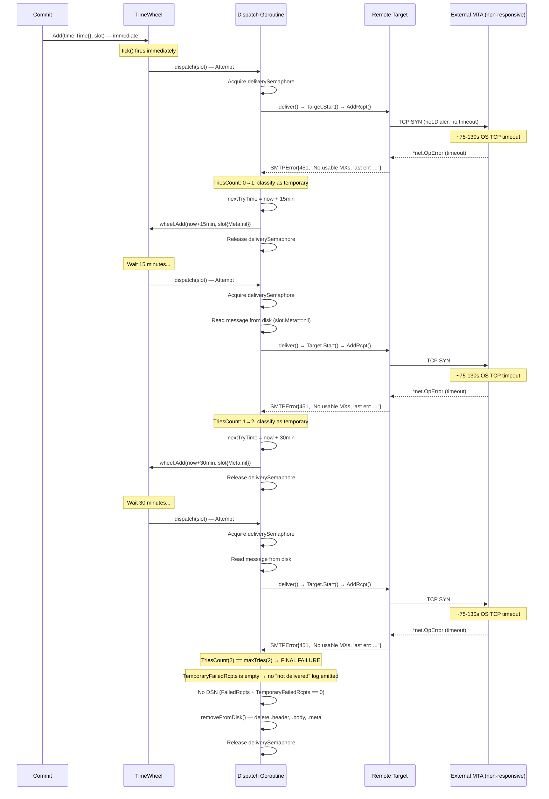
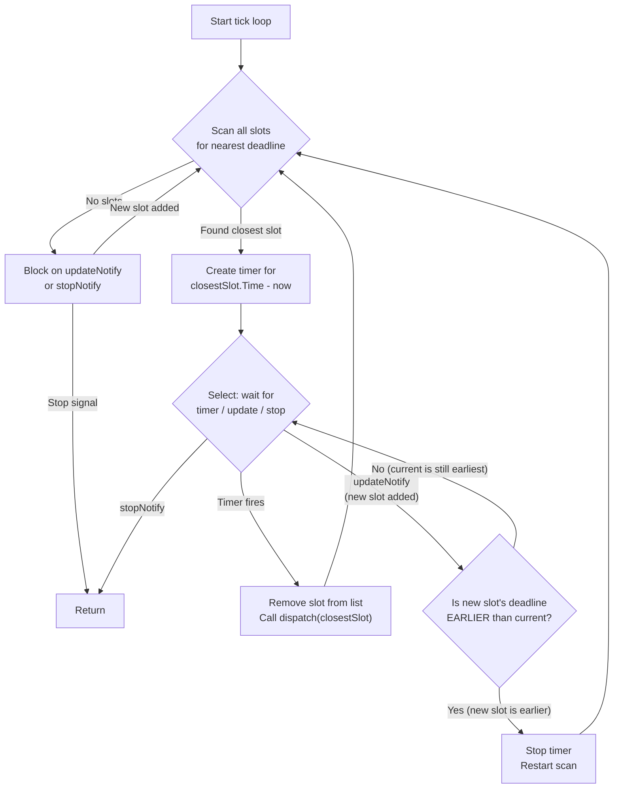
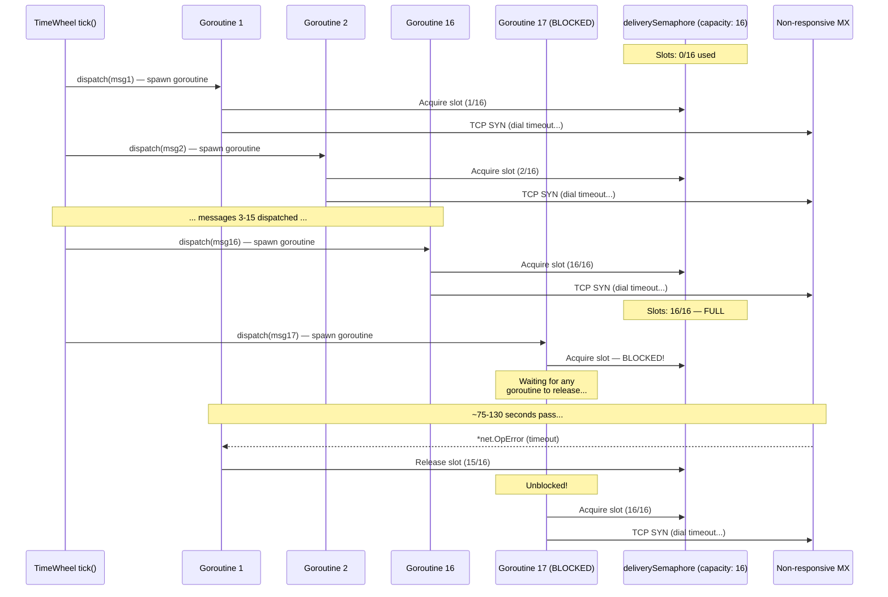
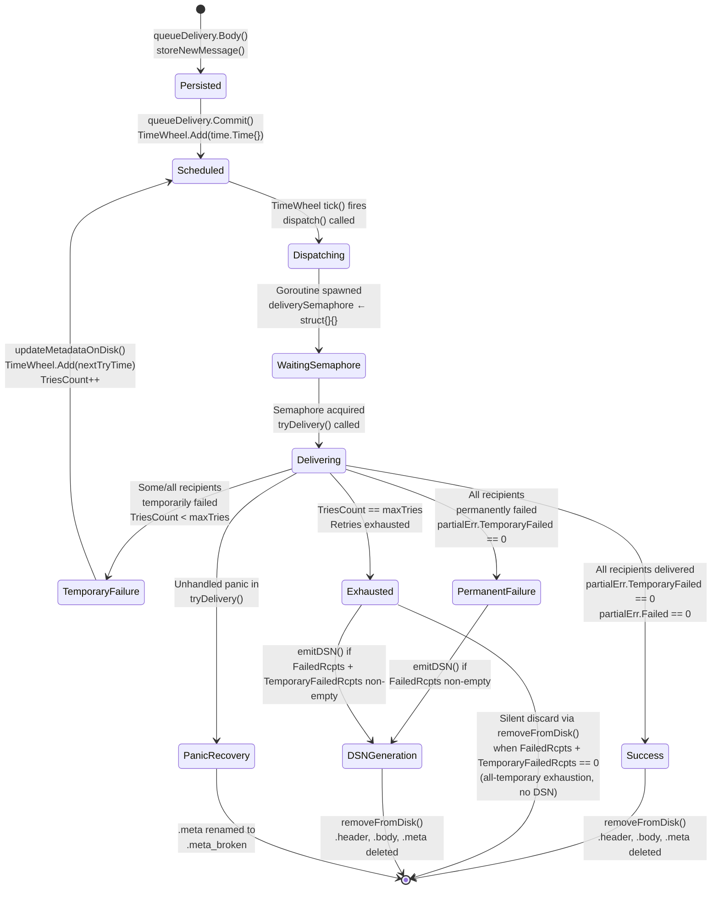

# Maddy Mail Server: Message Processing Pipeline Deep-Dive

## Introduction and Scope

This document provides a comprehensive, code-grounded technical investigation of the **maddy mail server's** message processing pipeline — specifically focusing on the retry, queuing, and scheduling subsystems as they behave under adverse conditions (non-responsive SMTP destinations with timeout failures).

### Questions Addressed

This analysis answers the following eight operational questions:

1. **Q1:** What is the end-to-end message processing pipeline from SMTP ingress to remote delivery?
2. **Q2:** What is the exact retry sequence when `max_tries` is small and the SMTP destination is non-responsive?
3. **Q3:** What are the actual timeout durations at each layer?
4. **Q4:** What do the structured log entries look like at each retry stage?
5. **Q5:** What is the on-disk filesystem layout of the queue?
6. **Q6:** How does the queue scheduler handle multiple simultaneous messages?
7. **Q7:** Is message A's retry timing affected when message B is blocking on a slow timeout?
8. **Q8:** Can queue starvation occur when the delivery semaphore is saturated by slow connections?

### Methodology

Every answer in this document is grounded in direct analysis of the maddy source code. No assumptions are made about theoretical behavior — all claims trace to specific source files and line numbers. Source citations use the format `Source: path/to/file.go:LineNumber`.

---

## Q1: End-to-End Message Processing Pipeline

This section traces the complete journey of an email message from the moment it arrives at maddy's SMTP endpoint to the point where it is dispatched for remote delivery over an outbound SMTP connection.

### 1.1 SMTP Ingress

The inbound SMTP endpoint is implemented in `internal/endpoint/smtp/smtp.go`. The `Session` struct (line 35) manages per-connection state for each SMTP client session.

**Message acceptance flow:**

1. **MAIL FROM command** — `Session.Mail()` (line 162) triggers `startDelivery()` (line 83), which:
   - Creates a `module.MsgMetadata` struct with a randomly generated message ID via `msgpipeline.GenerateMsgID()` (line 112)
   - Acquires a concurrency semaphore from `internal/limiters/` to limit simultaneous messages
   - Calls `s.delivery.Start()` on the message pipeline to initiate a delivery transaction
   - Source: `internal/endpoint/smtp/smtp.go:83-160`

2. **RCPT TO command** — `Session.Rcpt()` (line 208) calls `delivery.AddRcpt()` for each recipient address, propagating it to the downstream delivery target.
   - Source: `internal/endpoint/smtp/smtp.go:208-245`

3. **DATA command** — `Session.Data()` (line 312) calls `delivery.Body()` to transmit the message body, then `delivery.Commit()` to finalize the transaction. The concurrency semaphore is released after commit.
   - Source: `internal/endpoint/smtp/smtp.go:312-344`

### 1.2 Message Pipeline Routing

The message pipeline (`internal/msgpipeline/msgpipeline.go`) is the routing orchestrator that sits between the SMTP endpoint and delivery targets.

- `MsgPipeline` struct (line 26) implements the `module.DeliveryTarget` interface.
- `MsgPipeline.Start()` (line 79) begins a delivery transaction by:
  - Creating a `msgpipelineDelivery` object
  - Running connection-level and sender-level checks (SPF, DKIM, DMARC, etc.)
  - Selecting the appropriate source block based on the sender and destination
  - Routing the message to downstream delivery targets (e.g., `queue`, `local_mailbox`)
- Each delivery target receives its own `module.Delivery` object via `target.Start()`.
- Source: `internal/msgpipeline/msgpipeline.go:26-100`

The `module.DeliveryTarget` interface (`internal/module/delivery_target.go`) defines the contract that all targets must implement:
- `Start(ctx, msgMeta, mailFrom) → (Delivery, error)`
- The `Delivery` interface provides: `AddRcpt()`, `Body()`, `Commit()`, `Abort()`
- Source: `internal/module/delivery_target.go:1-72`

### 1.3 Queue Acceptance and Disk Persistence

When the message pipeline routes a message to the queue target (`internal/target/queue/queue.go`), the following sequence occurs:

1. **Queue.Start()** (line 589) creates a fresh `queueDelivery` with a new `QueueMetadata` struct. The metadata includes the message's `MsgMeta` (with its unique ID), the envelope sender (`From`), empty recipient list, and zero `TriesCount`.
   - Source: `internal/target/queue/queue.go:589-598`

2. **queueDelivery.AddRcpt()** (line 542) appends each recipient address to `meta.To`.
   - Source: `internal/target/queue/queue.go:542-545`

3. **queueDelivery.Body()** (line 547) calls `storeNewMessage()` to persist the message to disk as a triplet of files (`.header`, `.body`, `.meta`). This is the point of no return — the message is now durably stored.
   - Source: `internal/target/queue/queue.go:547-569`

4. **queueDelivery.Commit()** (line 571) adds the message to the `TimeWheel` scheduler with `time.Time{}` (zero time = immediate dispatch). The first-time message passes its `Meta`, `Hdr`, and `Body` in-memory via the `queueSlot` struct, avoiding an immediate disk read.
   - Source: `internal/target/queue/queue.go:571-587`

### 1.4 TimeWheel Dispatch

The `TimeWheel` scheduler (detailed in Q6) fires the dispatch callback for the closest-deadline message. For a newly committed message with zero time, this is effectively immediate.

**dispatch()** (line 275) is the callback invoked by the TimeWheel on its tick goroutine:

1. Logs `"starting delivery for {ID}"` (line 278)
2. Calls `deliveryWg.Add(1)` to track pending deliveries (line 280)
3. **Spawns a new goroutine** (line 281) — this is critical: the TimeWheel is NOT blocked by slow deliveries
4. Inside the goroutine:
   - Logs `"waiting on delivery semaphore for {ID}"` (line 282)
   - **Acquires the `deliverySemaphore`** — a buffered channel of size `max_parallelism` (default 16). This blocks if all slots are occupied. (line 283)
   - Deferred semaphore release and `deliveryWg.Done()` (line 285)
   - Includes panic recovery (lines 284-296): on panic, renames `.meta` to `.meta_broken` via `discardBroken()`
   - Logs `"delivery semaphore acquired for {ID}"` (line 299)
   - If `slot.Meta == nil` (retry case), reads the message from disk via `readMessageMeta()` and `openMessage()` (lines 305-319)
   - If `slot.Meta != nil` (first attempt), uses the in-memory data directly
   - Calls `tryDelivery()` (line 321)
- Source: `internal/target/queue/queue.go:275-323`

### 1.5 Remote Delivery

When `tryDelivery()` calls `deliver()` (line 431), the queue delegates to the configured delivery target — typically `remote` (`internal/target/remote/remote.go`).

1. **Target.Start()** (line 185) creates a `remoteDelivery` with an empty `connections` map (`map[string]mxConn`). No I/O occurs at this point — it always succeeds.
   - Source: `internal/target/remote/remote.go:185-193`

2. **remoteDelivery.AddRcpt()** (line 195) extracts the recipient's domain and calls `connectionForDomain()` (`connect.go:113`):
   - Creates a new `smtpconn.C` via `smtpconn.New()` (connect.go:121)
   - Sets the dialer from `rt.dialer` (connect.go:125)
   - Performs MX lookup via `lookupMX()` (connect.go:145) which queries DNS, sorts by preference (`records[i].Pref < records[j].Pref`), and falls back to A/AAAA records if no MX records exist (connect.go:240-276)
   - Iterates MX records by preference (`internal/target/remote/connect.go:154-199`), calling `conn.Connect()` for each until one succeeds
   - **Per-domain connection caching:** The `rd.connections` map (line 182) means multiple recipients at the same domain share a single SMTP connection
   - If ALL MX records fail: returns `SMTPError{Code: SMTPCode(err, 451, 550), Message: "No usable MXs, last err: ..."}` (`internal/target/remote/connect.go:204-213`)
   - Source: `internal/target/remote/connect.go:113-225`

3. **BodyNonAtomic()** (line 400) sends the DATA command to all connections concurrently via goroutines — one goroutine per domain connection.
   - Source: `internal/target/remote/remote.go:400-440`

### 1.6 SMTP Connection Layer

The actual TCP connection to the remote mail server is handled by `internal/smtpconn/smtpconn.go`:

1. **smtpconn.New()** (line 57) creates a `C` struct with `Dialer: (&net.Dialer{}).DialContext` (line 59) — **no explicit timeout is set** on the dialer.
   - Source: `internal/smtpconn/smtpconn.go:57-63`

2. **Connect()** (line 122) calls `attemptConnect()`, which:
   - Dials the TCP connection via `c.Dialer(ctx, "tcp", address)` (line 154)
   - Creates an `smtp.Client` from the connection
   - Sends EHLO, optionally negotiates STARTTLS
   - Source: `internal/smtpconn/smtpconn.go:122-200`

3. **Error wrapping via `wrapClientErr()`** (line 65): If the connection fails with a `*net.OpError` (e.g., connection timeout), it is wrapped into an `SMTPError`:
   ```go
   &exterrors.SMTPError{
       Code:         450,
       EnhancedCode: exterrors.EnhancedCode{4, 4, 2},
       Message:      "Network I/O error",
       Err:          err,
       Misc: map[string]interface{}{
           "remote_addr": err.Addr,
           "io_op":       err.Op,
       },
   }
   ```
   - Source: `internal/smtpconn/smtpconn.go:65-120`

### 1.7 Pipeline Flow Diagram



---

## Q2: Retry Sequence Under Timeout

This section documents the exact sequence of events when `max_tries` is set to a small value (e.g., 2) and the SMTP destination is completely non-responsive (all MX hosts timing out on TCP connect).

### 2.1 Configuration Setup

The queue's retry behavior is controlled by these configuration directives and internal defaults:

| Parameter | Config Key | Default | Source |
|-----------|-----------|---------|--------|
| Maximum retries | `max_tries` | 8 | `queue.go:204` |
| Max concurrent deliveries | `max_parallelism` | 16 | `queue.go:205` |
| Initial retry delay | (internal) | 15 minutes | `queue.go:185` |
| Retry delay multiplier | (internal) | 2.0 | `queue.go:186` |
| Post-restart delay | (internal) | 10 seconds | `queue.go:187` |

Example configuration with small `max_tries`:

```
queue local_queue {
    max_tries 2
    max_parallelism 16
    target remote
    bounce {
        destination postmaster
    }
}
```

**Important behavioral note:** With `max_tries` set to N, the total number of delivery attempts is **N + 1** (one initial attempt plus N retries). This is because `TriesCount` tracks the number of attempts *already completed*, and the check `meta.TriesCount == q.maxTries` at line 390 occurs *after* the current attempt's delivery has finished but *before* `TriesCount` is incremented. When `TriesCount` equals `maxTries`, the code enters the final-failure path without scheduling another retry.

Source: `internal/target/queue/queue.go:390, 407`

### 2.2 First Attempt — Connection Timeout

**Step 1: Commit triggers immediate dispatch**

`queueDelivery.Commit()` (line 571) adds the message to the TimeWheel with `time.Time{}` (zero time), which means the TimeWheel's `tick()` loop will dispatch it on the very next scan iteration — effectively immediately.

Source: `internal/target/queue/queue.go:571-587`

**Step 2: Dispatch goroutine launches**

`dispatch()` spawns a new goroutine that acquires the delivery semaphore and calls `tryDelivery()`.

Source: `internal/target/queue/queue.go:275-323`

**Step 3: Delivery attempt**

`tryDelivery()` (line 365) calls `deliver()` (line 431), which:

1. Creates a `context.Background()` with **no deadline or timeout** (line 442) — only tracing is attached via `trace.NewTask()`
2. Calls `q.Target.Start()` → creates `remoteDelivery` (always succeeds, no I/O)
3. Calls `delivery.AddRcpt()` → `connectionForDomain()` → `smtpconn.Connect()` → `c.Dialer()` which is `(&net.Dialer{}).DialContext`

Source: `internal/target/queue/queue.go:431-532`

**Step 4: TCP connection timeout**

With a non-responsive destination, the `net.Dialer` with default (zero) `Timeout` field waits for the operating system's TCP SYN retry mechanism to exhaust. On Linux, this is governed by the `tcp_syn_retries` sysctl (default 6), resulting in approximately **75–130 seconds** of waiting per MX host.

The `connectionForDomain()` function iterates all MX records by preference (connect.go:154-199). If the destination has multiple MX records, **each one is tried sequentially**, multiplying the total timeout by the number of MX hosts.

Source: `internal/smtpconn/smtpconn.go:57-63`, `internal/target/remote/connect.go:154-199`

**Step 5: Error propagation**

When all MX connections fail, the error chain is:

1. OS returns a `*net.OpError` (e.g., `dial tcp 192.0.2.1:25: i/o timeout`)
2. `wrapClientErr()` wraps it as `SMTPError{Code: 450, EnhancedCode: {4,4,2}, Message: "Network I/O error"}` — Source: `internal/smtpconn/smtpconn.go:105-114`
3. `connectionForDomain()` wraps the last error as `SMTPError{Code: 451, Message: "No usable MXs, last err: ..."}` — Source: `internal/target/remote/connect.go:204-213`
4. `deliver()` receives this error from `AddRcpt()`, classifies the recipient using inline `exterrors.IsTemporaryOrUnspec(err)` checks and appends to `perr.TemporaryFailed` or `perr.Failed` — Source: `internal/target/queue/queue.go:461-468`

### 2.3 Error Classification Chain

The error classification determines whether a failed delivery gets retried (temporary) or abandoned (permanent):

1. **`SMTPError.Temporary()`** returns `se.Code/100 == 4` — for code 450 or 451, this is `true` (temporary).
   - Source: `internal/exterrors/smtp.go:95-97`

2. **`partialError.SetStatus()`** (queue.go:89-102) calls `exterrors.IsTemporaryOrUnspec(err)`:
   - If the error implements `Temporary()`, uses that result
   - If the error does **NOT** implement `Temporary()`, returns `true` (defaults to temporary)
   - Source: `internal/exterrors/temporary.go:15-21`

3. **`toSMTPErr()`** (queue.go:325-363) converts the error for metadata storage:
   - If `IsTemporaryOrUnspec()` returns true: sets SMTP code 451, enhanced code {4,0,0}
   - If permanent: sets SMTP code 554, enhanced code {5,0,0}
   - Source: `internal/target/queue/queue.go:325-363`

**Key design principle:** Errors without an explicit `Temporary()` method are assumed temporary by `IsTemporaryOrUnspec()`, ensuring that unknown errors trigger retries rather than premature message abandonment.

> **Observed codebase behavior — `SMTPEnchCode()` bug:** The function `SMTPEnchCode()` at `internal/exterrors/smtp.go:122-128` contains a bug where `code[0] = 5` (line 126) unconditionally overwrites the conditional `code[0] = 4` (line 124) that was set for temporary errors. This makes the temporary-code branch dead code, so the first digit of the enhanced code is always `5` regardless of whether the error is temporary or permanent. As a result, the `connectionForDomain()` outer error (which passes enhanced code `{0,4,0}`) always produces `{5,4,0}` (formatted as `"5.4.0"` in logs), even when the SMTP code is 451 (temporary). This mismatch between the SMTP code class (4xx = temporary) and the enhanced code prefix (5 = permanent) is visible in structured log output.

### 2.4 Backoff Calculation

After a temporary failure, `tryDelivery()` calculates the next retry time using exponential backoff:

```go
// Source: internal/target/queue/queue.go:413-414
nextTryTime = nextTryTime.Add(
    q.initialRetryTime * time.Duration(math.Pow(q.retryTimeScale, float64(meta.TriesCount-1)))
)
```

Note that `TriesCount` has already been incremented (line 407) before this calculation, so `TriesCount-1` represents the zero-indexed retry number.

**Retry delay table (with defaults: `initialRetryTime=15m`, `retryTimeScale=2`):**

| Retry # | TriesCount (after increment) | Formula | Delay |
|---------|------------------------------|---------|-------|
| 1st retry | 1 | 15m × 2^(1-1) = 15m × 1 | **15 minutes** |
| 2nd retry | 2 | 15m × 2^(2-1) = 15m × 2 | **30 minutes** |
| 3rd retry | 3 | 15m × 2^(3-1) = 15m × 4 | **60 minutes** |
| 4th retry | 4 | 15m × 2^(4-1) = 15m × 8 | **2 hours** |
| 5th retry | 5 | 15m × 2^(5-1) = 15m × 16 | **4 hours** |
| 6th retry | 6 | 15m × 2^(6-1) = 15m × 32 | **8 hours** |
| 7th retry | 7 | 15m × 2^(7-1) = 15m × 64 | **16 hours** |
| 8th retry | 8 | 15m × 2^(8-1) = 15m × 128 | **32 hours** |

Source: `internal/target/queue/queue.go:184-186, 407, 413-414`

### 2.5 Re-Scheduling for Retry

After computing the next try time, the message is re-added to the TimeWheel:

```go
// Source: internal/target/queue/queue.go:420-428
q.wheel.Add(nextTryTime, queueSlot{
    ID: meta.MsgMeta.ID,
    // Meta, Hdr, Body are all nil — data is NOT kept in memory between retries
})
```

The metadata is persisted to disk via `updateMetadataOnDisk()` (line 409) with the updated `TriesCount`, `LastAttempt`, reduced `To` list, and accumulated `RcptErrs`. On the next attempt, the dispatch goroutine will read the message back from disk since `slot.Meta == nil`.

Source: `internal/target/queue/queue.go:409, 420-428`

### 2.6 Subsequent Attempts and Final Failure

With `max_tries = 2`, the complete sequence is:

| Attempt | TriesCount (entry) | Outcome | TriesCount (exit) | Next Action |
|---------|-------------------|---------|-------------------|-------------|
| #1 (initial) | 0 | Timeout → temp fail | 1 | Retry in 15 min |
| #2 (1st retry) | 1 | Timeout → temp fail | 2 | Retry in 30 min |
| #3 (2nd retry) | 2 | Timeout → temp fail | — | **Final failure** |

On the final attempt (TriesCount == maxTries at line 390):

1. The code iterates `meta.TemporaryFailedRcpts` to log each recipient as `"not delivered, temporary error"` (lines 393-395). However, since `meta.TemporaryFailedRcpts` is never populated anywhere in the codebase (see note below), this loop body never executes and **no "not delivered, temporary error" log entries are emitted in practice**
2. Recipients in `meta.FailedRcpts` (permanently failed) are logged as `"not delivered, permanent error"` (lines 396-398) — however, in the all-timeout scenario, `meta.FailedRcpts` is empty because all failures were temporary, so **no permanent-error log entries are emitted**
3. The DSN condition at line 400 checks `len(meta.FailedRcpts) + len(meta.TemporaryFailedRcpts) != 0`. In the all-timeout scenario, `meta.FailedRcpts` is empty (only temporary errors occurred) and `meta.TemporaryFailedRcpts` is **always empty** (the field is declared at `queue.go:160` but never populated anywhere in the codebase). Therefore, the condition evaluates to **false** and **no DSN/bounce message is generated** — the message is silently discarded
4. **`removeFromDisk()`** deletes the `.header`, `.body`, and `.meta` files (line 403)

> **Observed codebase gap:** The `TemporaryFailedRcpts` field in `QueueMetadata` (line 160) appears intended to track recipients that failed with temporary errors for DSN reporting on retry exhaustion. However, it is never assigned anywhere in the codebase (`grep -rn "TemporaryFailedRcpts" --include="*.go"` confirms only declaration and read-site references). As a result, messages that exhaust all retries with only temporary failures are removed from disk without generating a bounce notification to the sender. This is likely an unfinished implementation detail.

Source: `internal/target/queue/queue.go:390-403`

### 2.7 Retry Timeline Diagram



---

## Q3: Timeout Duration Analysis

This section documents the actual timeout durations observed at each layer when connecting to a non-responsive SMTP destination.

### 3.1 Go net.Dialer Default Timeout

The SMTP connection layer creates a `net.Dialer` with **zero (default) settings**:

```go
// Source: internal/smtpconn/smtpconn.go:57-63
func New() *C {
    return &C{
        Dialer: (&net.Dialer{}).DialContext,
        // ...
    }
}
```

The same pattern appears in the remote delivery target:

```go
// Source: internal/target/remote/remote.go:81
dialer: (&net.Dialer{}).DialContext,
```

When `net.Dialer.Timeout` is zero, Go's documentation states that no timeout is set by the dialer itself. The TCP connection timeout is therefore entirely governed by the **operating system's SYN retry mechanism**.

On Linux:
- The `tcp_syn_retries` sysctl controls how many SYN packets are retransmitted before the kernel gives up
- Default value: **6 retries**
- Each retry doubles the timeout (1s, 2s, 4s, 8s, 16s, 32s), plus the initial SYN
- Total timeout: approximately **75–130 seconds** depending on kernel version and configuration

Source: `internal/smtpconn/smtpconn.go:57-63`, `internal/target/remote/remote.go:81`

### 3.2 SMTP Client-Level Timeouts

The `go-smtp` library (version `v0.12.1`) provides the `smtp.Client` type that wraps the underlying TCP connection. Maddy does **not** set any explicit per-command timeouts on the SMTP client. The client inherits the timeout characteristics of the underlying `net.Conn` provided by the dialer.

After a successful TCP connection, individual SMTP commands (EHLO, MAIL FROM, RCPT TO, DATA) rely on the TCP connection's default read/write timeouts, which on Linux are controlled by `tcp_retries2` (default ~13–30 minutes for established connections).

Source: `internal/smtpconn/smtpconn.go:152-200`

### 3.3 Context Propagation — No Deadline

The `deliver()` function in the queue creates its execution context from `context.Background()`:

```go
// Source: internal/target/queue/queue.go:442
msgCtx, msgTask := trace.NewTask(context.Background(), "Queue delivery")
```

This context carries **no deadline and no cancellation mechanism**. The `trace.NewTask()` call adds only tracing instrumentation — it does not set a timeout. This context propagates to all downstream operations:

- `q.Target.Start(mailCtx, msgMeta, meta.From)` (line 446)
- `delivery.AddRcpt(rcptCtx, rcpt)` (line 461)
- `delivery.Body(bodyCtx, header, body)` (line 493)
- `delivery.Commit(commitCtx)` (line 521)

**Conclusion:** The TCP connection timeout for a non-responsive host is entirely determined by the OS-level TCP SYN retry behavior. There is no application-level timeout cap. For a single MX host on Linux with default settings, this is approximately **75–130 seconds**. If the destination has multiple MX records, `connectionForDomain()` tries each sequentially (connect.go:154-199), so the total timeout multiplies by the number of MX hosts.

Source: `internal/target/queue/queue.go:442-521`, `internal/target/remote/connect.go:154-199`

### 3.4 Timeout Summary Table

| Layer | Timeout Source | Duration | Configurable? |
|-------|---------------|----------|---------------|
| TCP Connect | OS `tcp_syn_retries` via `net.Dialer{}` (zero Timeout) | ~75-130s per MX host | OS sysctl only |
| SMTP Commands | TCP `tcp_retries2` (established connection) | ~13-30 min | OS sysctl only |
| Queue Context | `context.Background()` — no deadline | ∞ (no timeout) | Not configurable |
| Per-MX Iteration | Sequential in `connectionForDomain()` | N × TCP timeout (N = MX count) | Not configurable |

---

## Q4: Log Entry Anatomy During Retries

This section documents the exact structured log fields emitted at each stage of the retry process.

### 4.1 Structured Log Format

Maddy uses a custom structured logging system implemented in `internal/log/`.

**Timestamp format** (`internal/log/writer.go:16-29`):

```go
stamp.UTC().Format("2006-01-02T15:04:05.000Z ")
```

All timestamps are in **UTC with millisecond precision and a `Z` suffix**. Debug messages receive an additional `[debug]` prefix.

**Log line format** (`internal/log/log.go:135-155, 180-195`):

```
TIMESTAMP [debug]? LOGGER_NAME: MESSAGE\t{ORDERED_JSON}
```

Where:
- `TIMESTAMP` = `2006-01-02T15:04:05.000Z ` (UTC, millisecond precision)
- `[debug]` is present only for debug-level messages
- `LOGGER_NAME` = the logger's `Name` field (e.g., `"queue"`)
- `MESSAGE` = the log message string
- `\t` = literal tab character
- `{ORDERED_JSON}` = JSON object with **alphabetically sorted keys**

**JSON field ordering** (`internal/log/orderedjson.go:16-62`):

The `marshalOrderedJSON()` function sorts all keys alphabetically (`sort.Strings(order)` at line 23) and handles special types:

| Go Type | JSON Serialization | Example |
|---------|-------------------|---------|
| `time.Time` | `"2006-01-02T15:04:05.000"` (no Z) | `"2025-01-15T10:30:45.123"` |
| `time.Duration` | `.String()` | `"15m0s"` |
| `LogFormatter` interface | `.FormatLog()` | `"4.4.2"` (for `EnhancedCode`) |
| `fmt.Stringer` interface | `.String()` | `"192.0.2.1:25"` (for `net.Addr`) |
| `error` interface | `.Error()` | `"dial tcp ...: i/o timeout"` |
| All others | `json.Marshal()` | Standard JSON encoding |

Source: `internal/log/orderedjson.go:23, 40-51`

### 4.2 DeliveryLogger — The msg_id Field

The `DeliveryLogger()` utility (`internal/target/delivery.go:8-16`) creates a child logger that adds the `msg_id` field to every log entry from that logger:

```go
// Source: internal/target/delivery.go:8-16
func DeliveryLogger(l log.Logger, msgMeta *module.MsgMetadata) log.Logger {
    fields := make(map[string]interface{}, len(l.Fields)+1)
    for k, v := range l.Fields {
        fields[k] = v
    }
    fields["msg_id"] = msgMeta.ID
    l.Fields = fields
    return l
}
```

This means all log entries from `tryDelivery()` and `deliver()` automatically include `"msg_id"` with the original message ID.

### 4.3 Logger.Msg() and Logger.Error()

**`Logger.Msg()`** (`log.go:72-76`): Accepts a message string and key-value field pairs. Converts fields to a map and calls `formatMsg()`.

**`Logger.Error()`** (`log.go:89-104`): In addition to the above:
1. Extracts structured fields from the error via `exterrors.Fields(err)` — which walks the entire error chain via `Unwrap()`, collecting fields from every error that implements the `fieldsErr` interface. Outer errors override inner ones.
2. Adds a `"reason"` field set to `err.Error()` if one is not already present from the error's own fields
3. Merges with any additional key-value fields passed by the caller

Source: `internal/log/log.go:72-76, 89-104`, `internal/exterrors/fields.go:28-52`

### 4.4 EnhancedCode in Log JSON

The `EnhancedCode` type (`type EnhancedCode smtp.EnhancedCode` at `exterrors/smtp.go:9`) implements the `LogFormatter` interface:

```go
// Source: internal/exterrors/smtp.go:11-13
func (ec EnhancedCode) FormatLog() string {
    return fmt.Sprintf("%d.%d.%d", ec[0], ec[1], ec[2])
}
```

This means that in log JSON, enhanced SMTP codes appear as formatted strings like `"4.4.2"` rather than as arrays — because `marshalOrderedJSON()` checks for the `LogFormatter` interface before defaulting to `json.Marshal()`.

Source: `internal/exterrors/smtp.go:11-13`, `internal/log/orderedjson.go:45-46`

### 4.5 SMTPError.Fields() — Error Metadata

When an `SMTPError` is passed to `Logger.Error()`, the `Fields()` method (`exterrors/smtp.go:72-92`) provides these structured fields:

| Field | Type | Description |
|-------|------|-------------|
| `smtp_code` | `int` | SMTP status code (e.g., 450, 451, 550) |
| `smtp_enchcode` | `EnhancedCode` | Enhanced status code (formatted as `"X.Y.Z"` via `FormatLog()`) |
| `smtp_msg` | `string` | Human-readable SMTP message |
| `reason` | `string` | Error string from `se.Err.Error()` (if `se.Reason` is empty) |
| `check` | `string` | Check name (if applicable, e.g., from SPF/DKIM checks) |
| `target` | `string` | Target name (if applicable, e.g., `"remote"`) |
| Additional `Misc` fields | varies | Extra context (e.g., `remote_addr`, `io_op`, `domain`) |

Source: `internal/exterrors/smtp.go:72-92`

### 4.6 Log Entries Per Delivery Phase

The following log entries are emitted during the queue dispatch and retry cycle. Entries marked `[debug]` require `debug true` in the queue configuration.

**Phase: Dispatch (queue.go:275-323)**

| # | Level | Code Location | Message | Key Fields |
|---|-------|--------------|---------|------------|
| 1 | debug | `queue.go:278` | `"starting delivery for {ID}"` | *(no JSON — uses q.Log directly)* |
| 2 | debug | `queue.go:282` | `"waiting on delivery semaphore for {ID}"` | *(no JSON)* |
| 3 | debug | `queue.go:299` | `"delivery semaphore acquired for {ID}"` | *(no JSON)* |
| 4 | error | `queue.go:309` | `"read message"` | *(error fields from I/O failure)* |

**Phase: Delivery Attempt (queue.go:365-429)**

| # | Level | Code Location | Message | Key Fields |
|---|-------|--------------|---------|------------|
| 5 | debug | `queue.go:367` | `"delivery attempt #N"` | `msg_id` |
| 6 | info | `queue.go:378` | `"delivered"` | `msg_id`, `rcpt`, `attempt` |
| 7 | error | `queue.go:384` | `"delivery attempt failed"` | `msg_id`, `rcpt`, `reason`, `smtp_code`, `smtp_enchcode`, `smtp_msg`, + error Misc fields |
| 8 | info | `queue.go:394` | `"not delivered, temporary error"` | `msg_id`, `rcpt` | ⚠️ **Never emitted in practice** — iterates `meta.TemporaryFailedRcpts` which is never populated (see Q2.6) |
| 9 | info | `queue.go:398` | `"not delivered, permanent error"` | `msg_id`, `rcpt` |
| 10 | info | `queue.go:415-418` | `"will retry"` | `msg_id`, `attempts_count`, `next_try_delay`, `rcpts` |

**Phase: DSN Generation (queue.go:849-953)**

| # | Level | Code Location | Message | Key Fields |
|---|-------|--------------|---------|------------|
| 11 | info | `queue.go:914` | `"generated failed DSN"` | `msg_id`, `dsn_id` |

### 4.7 Example Log Sequence — Two-Attempt Failure

The following shows a realistic complete log output for a message to `user@unreachable.example.com` with `max_tries 2`. Message ID is `a1b2c3d4`, and the destination has one MX record at `192.0.2.1:25`.

```
2025-01-15T10:30:00.100Z [debug] queue: starting delivery for a1b2c3d4
2025-01-15T10:30:00.100Z [debug] queue: waiting on delivery semaphore for a1b2c3d4
2025-01-15T10:30:00.101Z [debug] queue: delivery semaphore acquired for a1b2c3d4
2025-01-15T10:30:00.101Z [debug] queue: delivery attempt #1	{"msg_id":"a1b2c3d4"}
2025-01-15T10:32:10.500Z queue: delivery attempt failed	{"domain":"unreachable.example.com","io_op":"dial","msg_id":"a1b2c3d4","rcpt":"user@unreachable.example.com","reason":"dial tcp 192.0.2.1:25: i/o timeout","remote_addr":"192.0.2.1:25","smtp_code":451,"smtp_enchcode":"5.4.0","smtp_msg":"No usable MXs, last err: dial tcp 192.0.2.1:25: i/o timeout","target":"remote"}
2025-01-15T10:32:10.510Z queue: will retry	{"attempts_count":1,"msg_id":"a1b2c3d4","next_try_delay":"14m49.49s","rcpts":["user@unreachable.example.com"]}

2025-01-15T10:47:00.000Z [debug] queue: starting delivery for a1b2c3d4
2025-01-15T10:47:00.001Z [debug] queue: waiting on delivery semaphore for a1b2c3d4
2025-01-15T10:47:00.001Z [debug] queue: delivery semaphore acquired for a1b2c3d4
2025-01-15T10:47:00.002Z [debug] queue: delivery attempt #2	{"msg_id":"a1b2c3d4"}
2025-01-15T10:49:10.300Z queue: delivery attempt failed	{"domain":"unreachable.example.com","io_op":"dial","msg_id":"a1b2c3d4","rcpt":"user@unreachable.example.com","reason":"dial tcp 192.0.2.1:25: i/o timeout","remote_addr":"192.0.2.1:25","smtp_code":451,"smtp_enchcode":"5.4.0","smtp_msg":"No usable MXs, last err: dial tcp 192.0.2.1:25: i/o timeout","target":"remote"}
2025-01-15T10:49:10.310Z queue: will retry	{"attempts_count":2,"msg_id":"a1b2c3d4","next_try_delay":"29m49.69s","rcpts":["user@unreachable.example.com"]}

2025-01-15T11:19:00.000Z [debug] queue: starting delivery for a1b2c3d4
2025-01-15T11:19:00.001Z [debug] queue: waiting on delivery semaphore for a1b2c3d4
2025-01-15T11:19:00.001Z [debug] queue: delivery semaphore acquired for a1b2c3d4
2025-01-15T11:19:00.002Z [debug] queue: delivery attempt #3	{"msg_id":"a1b2c3d4"}
2025-01-15T11:21:10.200Z queue: delivery attempt failed	{"domain":"unreachable.example.com","io_op":"dial","msg_id":"a1b2c3d4","rcpt":"user@unreachable.example.com","reason":"dial tcp 192.0.2.1:25: i/o timeout","remote_addr":"192.0.2.1:25","smtp_code":451,"smtp_enchcode":"5.4.0","smtp_msg":"No usable MXs, last err: dial tcp 192.0.2.1:25: i/o timeout","target":"remote"}
(message silently removed from disk — no further log entries)
```

**Notes on the example:**
- Each `"delivery attempt failed"` entry uses `Logger.Error()` (Source: `internal/log/log.go:89-104`), which merges fields from `exterrors.Fields(err)` (the error chain), adds a `"reason"` field from `err.Error()` if not already present (line 98-100), and merges the `"rcpt"` field passed by `tryDelivery()`. All JSON keys are alphabetically sorted by `marshalOrderedJSON`.
- The fields shown are from the **outer** `connectionForDomain()` error (Source: `internal/target/remote/connect.go:204-213`), which wraps the inner `wrapClientErr()` error. `exterrors.Fields()` walks the error chain with outer-first-wins semantics (Source: `internal/exterrors/fields.go:37`): the outer error contributes `smtp_code`, `smtp_enchcode`, `smtp_msg`, `target`, and `domain`; the inner error contributes only non-overlapping fields `remote_addr` and `io_op`.
- The `"smtp_enchcode"` field appears as `"5.4.0"` rather than the expected `"4.4.0"` for a temporary error due to the `SMTPEnchCode()` bug documented in Q2.3 — the enhanced code's first digit is always 5 regardless of the SMTP code class.
- The `"will retry"` entry shows `"next_try_delay"` as a `time.Duration` formatted via `.String()` (e.g., `"14m49.49s"`).
- The `~2 minutes` gap between "delivery attempt #N" and "delivery attempt failed" represents the TCP SYN timeout to the unreachable host.
- Debug entries (`[debug]` prefix) from `dispatch()` use `q.Log` directly (not `DeliveryLogger`) and therefore do **not** include a JSON payload when the logger has no base `Fields`.
- Entries from `tryDelivery()` use `DeliveryLogger` and always include `{"msg_id":"..."}`.
- On the final attempt (attempt #3), retries are exhausted (`TriesCount == maxTries`). The code at lines 393-395 iterates `meta.TemporaryFailedRcpts` to log `"not delivered, temporary error"` — but since `TemporaryFailedRcpts` is never populated anywhere in the codebase, **this log entry is never emitted** (Source: `internal/target/queue/queue.go:393-395`; see Q2.6 for details). No DSN/bounce is generated because both `meta.FailedRcpts` and `meta.TemporaryFailedRcpts` are empty. The message is then **silently removed from disk** via `removeFromDisk()` with no explicit log entry indicating the message was discarded — the last log entry an operator would see is the `"delivery attempt failed"` line above.

---

## Q5: Queue Filesystem Layout

This section documents the on-disk file structure used by the queue for durable message storage.

### 5.1 Storage Directory

Queue files are stored in the directory `{StateDirectory}/{queue_name}/`, configured via:

```go
// Source: internal/target/queue/queue.go:229
q.location = filepath.Join(config.StateDirectory, q.name)
```

For example, with the default configuration (`queue remote_queue`), the path would be `/var/lib/maddy/remote_queue/` (or wherever `StateDirectory` is configured).

### 5.2 File Naming Convention

Each queued message is stored as a triplet of files, all sharing the message ID as their filename prefix:

```
{queue_directory}/
├── a1b2c3d4.header    # RFC 2822 headers (textproto format)
├── a1b2c3d4.body      # Raw message body bytes
├── a1b2c3d4.meta      # JSON metadata (retry state, recipients, errors)
├── e5f6g7h8.header
├── e5f6g7h8.body
├── e5f6g7h8.meta
└── ...
```

The message ID (`a1b2c3d4` in this example) is randomly generated by the SMTP endpoint via `msgpipeline.GenerateMsgID()` at the time of message ingress.

Source: `internal/endpoint/smtp/smtp.go:112`

### 5.3 File Creation — storeNewMessage()

The `storeNewMessage()` function (`queue.go:690-740`) creates the triplet atomically:

1. **`.header` file** (line 700): Written via `textproto.WriteHeader()` — standard RFC 2822 header format with `Key: Value\r\n` lines.
2. **`.body` file** (line 719): Written via `io.Copy()` from the message buffer — raw message body bytes as received.
3. **`.meta` file** (line 725): Written via `updateMetadataOnDisk()` — JSON-encoded `QueueMetadata`.
4. Both `.header` and `.body` files are explicitly `Sync()`'d to ensure durability (lines 731-737).
5. On any error during creation, partially-written dangling files are cleaned up via `tryRemoveDanglingFile()`.
6. Returns a `buffer.FileBuffer{Path: bodyPath}` for subsequent in-memory access to the body.

Source: `internal/target/queue/queue.go:690-740`

### 5.4 Atomic Metadata Updates — updateMetadataOnDisk()

The `updateMetadataOnDisk()` function (`queue.go:742-767`) uses a **write-rename strategy** for atomic updates:

1. Creates `{id}.meta.new` temporary file (line 744)
2. Deep-copies the `QueueMetadata` (line 751) and sets `Conn = nil` (line 752) — the `ConnState` is not serializable
3. JSON-encodes the metadata via `json.NewEncoder(file).Encode(metaCopy)` (line 754)
4. Calls `file.Sync()` to flush to disk (line 758)
5. Calls `os.Rename("{id}.meta.new", "{id}.meta")` (line 762) — this is atomic on POSIX filesystems

This strategy ensures that a crash during metadata update never corrupts the `.meta` file — either the old version persists (if the rename didn't complete) or the new version is fully written.

Source: `internal/target/queue/queue.go:742-767`

### 5.5 .meta JSON Schema

The `.meta` file contains a JSON-encoded `QueueMetadata` struct (`queue.go:149-170`):

```json
{
  "MsgMeta": {
    "ID": "a1b2c3d4",
    "OriginalFrom": "sender@example.com",
    "SMTPOpts": {
      "UTF8": false
    },
    "OriginalRcpts": {
      "user@unreachable.example.com": "user@unreachable.example.com"
    },
    "Quarantine": false,
    "DontTraceSender": false
  },
  "From": "sender@example.com",
  "To": ["user@unreachable.example.com"],
  "FailedRcpts": [],
  "TemporaryFailedRcpts": [],
  "RcptErrs": {
    "user@unreachable.example.com": {
      "Code": 451,
      "EnhancedCode": [5, 4, 0],
      "Message": "No usable MXs, last err: dial tcp 192.0.2.1:25: i/o timeout"
    }
  },
  "TriesCount": 1,
  "FirstAttempt": "2025-01-15T10:30:00.100Z",
  "LastAttempt": "2025-01-15T10:32:10.500Z"
}
```

**Field descriptions:**

| Field | Type | Description |
|-------|------|-------------|
| `MsgMeta` | `module.MsgMetadata` | Immutable message metadata (ID, original sender, SMTP options). `Conn` field is always nil on disk. |
| `From` | `string` | Envelope sender (MAIL FROM address) |
| `To` | `[]string` | Remaining recipients for the next delivery attempt |
| `FailedRcpts` | `[]string` | Recipients that permanently failed (accumulated across retries) |
| `TemporaryFailedRcpts` | `[]string` | Recipients that temporarily failed (for DSN reporting). **(Note: this field is declared at `queue.go:160` but never populated anywhere in the current codebase — it is always empty on disk. See Q2.6 for the impact on DSN generation.)** |
| `RcptErrs` | `map[string]*smtp.SMTPError` | Per-recipient error details as serialized `SMTPError` objects |
| `TriesCount` | `int` | Number of delivery attempts already completed |
| `FirstAttempt` | `time.Time` | Timestamp of the first delivery attempt (RFC 3339 JSON encoding) |
| `LastAttempt` | `time.Time` | Timestamp of the most recent delivery attempt |

Source: `internal/target/queue/queue.go:149-170`, `internal/module/msgmetadata.go:55-105`

**Note on `RcptErrs` serialization:** The error objects stored in `RcptErrs` are `*smtp.SMTPError` (from the `go-smtp` library), not `*exterrors.SMTPError`. The `toSMTPErr()` function (`queue.go:325-363`) converts `exterrors.SMTPError` errors to the simpler `smtp.SMTPError` type for JSON serialization.

### 5.6 Reading Messages — readMessageMeta() and openMessage()

**`readMessageMeta()`** (`queue.go:769-791`):
- Opens the `.meta` file and JSON-decodes it into a `QueueMetadata` struct
- Initializes an empty `module.MsgMetadata` if nil (defensive coding)
- Returns the populated metadata

**`openMessage()`** (`queue.go:806-839`):
- Opens `.header` via `textproto.ReadHeader()` to parse RFC 2822 headers
- Creates a `buffer.FileBuffer{Path: bodyPath}` for the `.body` file
- Returns the header and body buffer without loading the entire body into memory

### 5.7 Startup Recovery — readDiskQueue()

On server restart, `readDiskQueue()` (`queue.go:622-688`) scans the queue directory:

1. Lists all `.meta` files in the directory
2. For each `.meta` file, verifies that the corresponding `.header` and `.body` files exist
3. Calls `readMessageMeta()` to load the metadata
4. Calculates the next retry time using the same backoff formula (lines 662-669):
   ```go
   nextTryTime = nextTryTime.Add(
       q.initialRetryTime * time.Duration(math.Pow(q.retryTimeScale, float64(meta.TriesCount-1)))
   )
   ```
5. Applies `postInitDelay` (default 10 seconds): if the calculated retry time is less than `postInitDelay` (default 10 seconds) away from now — i.e., `time.Until(nextTryTime) < q.postInitDelay` — it is clamped to `now + postInitDelay` (lines 672-674). This covers both past retry times and near-future retry times, preventing a thundering herd of immediate deliveries after a restart.
6. Adds each recovered message to the TimeWheel with `Meta: nil` (data will be re-read from disk on dispatch)

Source: `internal/target/queue/queue.go:622-688`

### 5.8 Disk Cleanup — removeFromDisk()

`removeFromDisk()` (`queue.go:600-620`) deletes files in a specific order:

1. Remove `.header`
2. Remove `.body`
3. Remove `.meta` **last**

**Rationale for ordering:** The `.meta` file is removed last because `readDiskQueue()` discovers messages by scanning for `.meta` files. If the server crashes after removing `.header` but before removing `.meta`, the recovery process will detect the orphaned `.meta` file and skip or clean up the incomplete message (since it verifies `.header` and `.body` existence at lines 639-647).

Source: `internal/target/queue/queue.go:600-620`

### 5.9 Filesystem State Between Retries

Between retry attempts, the on-disk state reflects the accumulated retry history:

- **`.header` file**: **Unchanged** — headers are immutable after initial storage
- **`.body` file**: **Unchanged** — body content is immutable
- **`.meta` file**: **Updated** after each attempt via `updateMetadataOnDisk()` with:
  - Incremented `TriesCount`
  - Updated `LastAttempt` timestamp
  - Reduced `To` list (containing only temporarily-failed recipients for the next attempt)
  - Accumulated `FailedRcpts` (permanently failed recipients)
  - Updated `RcptErrs` with the latest per-recipient error information

---

## Q6: Queue Scheduler and Multi-Message Prioritization

This section documents how the `TimeWheel` scheduler handles multiple simultaneous messages and coordinates with the delivery semaphore for concurrent dispatch.

### 6.1 TimeWheel Architecture

The `TimeWheel` (`internal/target/queue/timewheel.go`) is a linked-list-based scheduler that dispatches messages at their scheduled delivery times.

**Core data structures:**

```go
// Source: internal/target/queue/timewheel.go:10-25
type TimeSlot struct {
    Time  time.Time
    Value interface{} // Holds a queueSlot struct
}

type TimeWheel struct {
    stopped      uint32               // Checked via atomic.LoadUint32(); 1 = stopped
    slots        *list.List           // Linked list of TimeSlot elements
    slotsLock    sync.Mutex           // Protects slots list during Add()
    updateNotify chan time.Time        // Wakes tick() when new slot is added
    stopNotify   chan struct{}         // Signals tick() to exit
    dispatch     func(TimeSlot)       // Callback invoked for each due message
}
```

**Single-goroutine model:** `NewTimeWheel()` (line 27) starts exactly one `tick()` goroutine that is responsible for all scheduling decisions. This goroutine is the only one that removes elements from the linked list (line 86 comment: "Only tick goroutine removes elements").

Source: `internal/target/queue/timewheel.go:10-35`

### 6.2 TimeWheel.Add()

The `Add()` method (lines 38-53) is called from any goroutine (the Commit path or a retry re-scheduling path):

1. Guards against adding to a stopped TimeWheel (line 39)
2. Panics on nil value (line 45) — defensive check
3. Appends a new `TimeSlot{Time, Value}` to the end of the linked list under lock (lines 48-50)
4. Sends a notification on the `updateNotify` channel (line 52) to wake up the `tick()` loop if it is sleeping

Source: `internal/target/queue/timewheel.go:38-53`

### 6.3 tick() Loop — The Core Scheduling Algorithm

The `tick()` function (lines 71-128) is the heart of the scheduler. It runs in a single goroutine and implements a **nearest-deadline-first** dispatch strategy:



**Detailed step-by-step:**

1. **Scan for nearest deadline** (lines 73-84): Iterates the entire linked list under lock, finding the slot with the earliest `Time`. Uses `slot.Time.Sub(now) < closestSlot.Time.Sub(now)` comparison.

2. **Empty queue handling** (lines 89-97): If no slots exist, blocks on a `select` between `updateNotify` (new slot added → restart scan) and `stopNotify` (shutdown → return).

3. **Create timer** (line 99): `time.NewTimer(closestSlot.Time.Sub(time.Now()))` — waits until the nearest deadline.

4. **Select loop** (lines 102-126): Three cases:
   - **Timer fires** (line 104): Removes the slot from the linked list under lock, calls `tw.dispatch(closestSlot)`, breaks out to restart the scan
   - **New slot added** via `updateNotify` (line 112): Receives the new slot's target time. If the current closest slot still has the earliest deadline (line 115: `closestSlot.Time.Sub(now) <= newTarget.Sub(now)`), ignores the update and continues waiting. Otherwise, stops the timer and restarts the full scan to pick the new earliest slot.
   - **Stop signal** (line 122): Returns, ending the goroutine

**Key insight:** The TimeWheel uses **nearest-deadline priority**, NOT FIFO ordering. A newly added message with an earlier deadline (e.g., a freshly committed message with `time.Time{}` zero time) will preempt a retry that is further in the future.

Source: `internal/target/queue/timewheel.go:71-128`

### 6.4 Delivery Semaphore

The delivery semaphore limits the number of concurrent delivery goroutines:

```go
// Source: internal/target/queue/queue.go:242
q.deliverySemaphore = make(chan struct{}, maxParallelism)
```

In `dispatch()`, the goroutine acquires a slot before starting delivery:

```go
// Source: internal/target/queue/queue.go:283
q.deliverySemaphore <- struct{}{} // Blocks if all slots are occupied

// Source: internal/target/queue/queue.go:285
defer func() { <-q.deliverySemaphore }() // Release on return
```

Default `maxParallelism` = 16, configured via:
```go
// Source: internal/target/queue/queue.go:205
cfg.Int("max_parallelism", false, false, 16, &maxParallelism)
```

### 6.5 Multi-Message Scheduling Behavior

When multiple messages are in the queue simultaneously:

1. **TimeWheel dispatches one at a time:** The `tick()` loop fires the `dispatch()` callback for the nearest-deadline slot, then immediately rescans for the next nearest. Since `dispatch()` just spawns a goroutine and returns immediately, the TimeWheel moves to the next message without waiting.

2. **Concurrent execution via goroutines:** Each `dispatch()` call creates an independent goroutine. Multiple goroutines can be in-flight simultaneously, each independently acquiring the semaphore, reading from disk, and calling `tryDelivery()`.

3. **Bounded parallelism:** The `deliverySemaphore` caps concurrent deliveries at `max_parallelism`. If the semaphore is full, new goroutines block at the semaphore acquisition step (line 283) but the TimeWheel itself is unaffected.

4. **Preemption of timer:** If a new message with an earlier deadline is added while the TimeWheel is waiting for a timer, the `updateNotify` mechanism causes the timer to be stopped and the scan restarted, ensuring the new message is dispatched first.

---

## Q7: Cross-Message Retry Independence

This section analyzes whether message A's retry timing is affected when message B to a different destination is blocking on a slow timeout.

### 7.1 Goroutine-Per-Dispatch Model

Each call to `dispatch()` (`queue.go:275-323`) spawns an independent goroutine (line 281):

```go
// Source: internal/target/queue/queue.go:280-281
q.deliveryWg.Add(1)
go func() {
    // ... acquire semaphore, read message, call tryDelivery() ...
}()
```

**Key architectural properties:**

- The goroutine is created immediately and starts running independently
- `dispatch()` returns to the TimeWheel's `tick()` goroutine immediately after spawning the goroutine
- The TimeWheel is **never blocked** by a slow delivery — it can continue scheduling other messages
- Each goroutine manages its own lifecycle: semaphore acquisition, disk I/O, delivery, error handling, and retry scheduling

### 7.2 Timing Independence — Scheduling vs. Execution

Message retry timing has two distinct phases:

**1. Scheduling (INDEPENDENT):**
- Each message's retry time is calculated independently based on its own `TriesCount` and `LastAttempt` (queue.go:413-414)
- Each message has its own `TimeSlot` in the TimeWheel linked list
- The TimeWheel fires the dispatch callback for each message independently based on its deadline
- Message A's retry schedule is **completely unaffected** by message B's existence or state

**2. Execution (POTENTIALLY DELAYED):**
- After dispatch, the goroutine must acquire the `deliverySemaphore` before starting delivery (line 283)
- If all semaphore slots are occupied by goroutines blocked on slow TCP timeouts, the new goroutine waits
- This means the actual delivery START time may be delayed beyond the scheduled time

### 7.3 Semaphore Saturation Scenario

Consider this scenario:
- `max_parallelism = 16`
- 16 messages are all blocking on TCP timeouts to various non-responsive hosts
- Message A's retry timer fires in the TimeWheel

**What happens:**

1. TimeWheel calls `dispatch()` with message A's slot
2. `dispatch()` spawns a goroutine — this returns immediately to the TimeWheel
3. The goroutine logs `"waiting on delivery semaphore for A"` (line 282)
4. The goroutine attempts `q.deliverySemaphore <- struct{}{}` (line 283) — **BLOCKS** because all 16 slots are occupied
5. The TimeWheel is free to dispatch message C, D, etc. (they will also block on semaphore)
6. When one of the 16 timeout goroutines finishes (releases its semaphore slot), message A's goroutine acquires it
7. Message A's delivery then proceeds

**Key observation:** The TimeWheel's `tick()` goroutine is **never blocked** by semaphore saturation. The dispatch callback just spawns a goroutine and returns. The blocking occurs inside the spawned goroutine, not in the scheduler.

### 7.4 Conclusion: Scheduling Independent, Execution Conditionally Delayed

| Aspect | Independent? | Explanation |
|--------|-------------|-------------|
| Retry timing calculation | **Yes** | Each message uses its own `TriesCount` and backoff formula |
| TimeWheel scheduling | **Yes** | Each message has its own `TimeSlot`, evaluated independently |
| TimeWheel dispatch | **Yes** | `dispatch()` spawns goroutine and returns immediately |
| Delivery execution start | **Conditional** | Blocked only if `deliverySemaphore` is full |
| Delivery execution | **Yes** | Each goroutine runs independently after acquiring semaphore |

**Bottom line:** Message A's retry **scheduling** is never affected by message B. Message A's retry **execution** can be delayed if the delivery semaphore is saturated by slow connections (from message B or any other messages). The delay is bounded by the time it takes for any one existing delivery goroutine to complete (including timeout).

---

## Q8: Queue Starvation Analysis

This section analyzes whether and how starvation can occur when the delivery semaphore is saturated by slow-timeout connections.

### 8.1 Starvation Conditions

Starvation occurs when **all `max_parallelism` semaphore slots** are occupied by goroutines blocked on slow TCP timeouts, preventing any new deliveries from starting.

**How starvation develops:**

1. Multiple messages are queued for non-responsive destinations
2. TimeWheel dispatches them, spawning goroutines
3. Each goroutine acquires a semaphore slot and enters `connectionForDomain()` → `smtpconn.Connect()` → TCP dial
4. The dial blocks for ~75-130 seconds (OS TCP SYN timeout) per MX host
5. If `connectionForDomain()` tries multiple MX hosts sequentially, the goroutine holds the semaphore slot for **N × ~75-130 seconds** (where N = number of MX records)
6. When all 16 slots are held by timeout-blocked goroutines, new dispatches create goroutines that block at `q.deliverySemaphore <- struct{}{}` (line 283)

**Critical detail:** The goroutine creation in `dispatch()` is **unconditional** — there is no backpressure mechanism from the semaphore to the TimeWheel. The TimeWheel continues firing dispatch callbacks, and goroutines accumulate waiting on the semaphore.

```go
// Source: internal/target/queue/queue.go:280
q.deliveryWg.Add(1) // Tracked BEFORE goroutine spawn
```

The `deliveryWg.Add(1)` call (line 280) happens before the goroutine is spawned, meaning that `Queue.Close()` (which calls `deliveryWg.Wait()` at line 255) will wait for all pending goroutines — including those blocked on the semaphore.

Source: `internal/target/queue/queue.go:255, 275-323`

### 8.2 Observable Patterns in Logs

Semaphore starvation is observable through the timing gap between debug-level log entries. These entries require `debug true` in the queue configuration:

```
2025-01-15T10:30:00.100Z [debug] queue: starting delivery for msg001
2025-01-15T10:30:00.100Z [debug] queue: waiting on delivery semaphore for msg001
```

If the next expected log entry is significantly delayed:

```
2025-01-15T10:32:10.500Z [debug] queue: delivery semaphore acquired for msg001
```

The **~2 minute gap** between `"waiting on delivery semaphore"` and `"delivery semaphore acquired"` indicates that `msg001` was waiting for a semaphore slot to become available.

**Log entry locations:**
- `"starting delivery for {ID}"` — `queue.go:278` — emitted OUTSIDE the goroutine, immediately on dispatch
- `"waiting on delivery semaphore for {ID}"` — `queue.go:282` — emitted INSIDE the goroutine, BEFORE semaphore acquisition
- `"delivery semaphore acquired for {ID}"` — `queue.go:299` — emitted AFTER acquisition

### 8.3 Relationship Between max_parallelism and Starvation Risk

| max_parallelism | Semaphore Slots | Starvation Threshold | Trade-off |
|----------------|----------------|---------------------|-----------|
| Low (e.g., 4) | 4 | 4 stalled connections | Less resource usage, faster starvation |
| Default (16) | 16 | 16 stalled connections | Balanced |
| High (e.g., 64) | 64 | 64 stalled connections | More resources, slower starvation |

**Resource impact of higher max_parallelism:**
- Each stalled delivery holds: one goroutine (~8KB stack), one file descriptor (TCP socket), one semaphore slot
- With default `max_parallelism = 16` and all slots timing out: ~128KB goroutine stacks + 16 TCP sockets
- Each delivery also opens `.header`, `.body`, `.meta` files for disk reads — additional file descriptors

**No per-destination limit:** There is no per-domain concurrency limit in the queue. A single unreachable domain with many queued messages can consume ALL semaphore slots. The `connections` map in `remoteDelivery` (remote.go:182) caches per-domain connections **within a single delivery**, but each queue dispatch creates a new `remoteDelivery` instance.

Source: `internal/target/remote/remote.go:182-185`

### 8.4 Starvation Duration

When the semaphore is fully saturated:

- **Minimum starvation duration:** Time for the fastest-completing stalled goroutine to timeout and release. With a single MX host: ~75-130 seconds.
- **Maximum starvation duration per cycle:** Time for the slowest-completing stalled goroutine. With multiple MX hosts tried sequentially: `N × 130` seconds.
- **Repeated starvation:** If messages continue to be queued for non-responsive destinations, starvation can recur in cycles: fill semaphore → all timeout → brief availability → fill again.

### 8.5 Mitigation Strategies

**1. Increase `max_parallelism`** — Allows more concurrent deliveries, reducing starvation risk at the cost of more OS resources:
```
queue remote_queue {
    max_parallelism 32
    ...
}
```

**2. OS-level TCP timeout tuning** — Reduce `tcp_syn_retries` to shorten the timeout for non-responsive hosts:
```bash
# Reduce TCP SYN retries from default 6 to 2 (~7 seconds timeout)
sysctl -w net.ipv4.tcp_syn_retries=2
```

**3. Monitor debug logs** — Enable debug logging to detect starvation patterns:
```
queue remote_queue {
    debug true
    ...
}
```

### 8.6 Additional Starvation Considerations

**Post-init delay:** The `postInitDelay` (default 10 seconds, `queue.go:187`) adds a minimum delay after server restart before dispatching recovered messages. This spreads out initial deliveries and prevents a thundering herd at startup.

Source: `internal/target/queue/queue.go:129-138, 672-674`

**Shutdown behavior:** `Queue.Close()` calls `deliveryWg.Wait()` at line 255, which blocks until ALL pending deliveries complete — including goroutines blocked on the semaphore AND goroutines blocked on TCP timeouts. This means **shutdown can be delayed by the cumulative timeout of all stalled connections**.

Source: `internal/target/queue/queue.go:253-258`

### 8.7 Semaphore Saturation Diagram



---

## DSN/Bounce Generation

When all retries are exhausted or all recipients permanently fail, the queue generates a Delivery Status Notification (DSN) bounce message to inform the original sender.

### DSN Generation — emitDSN()

The `emitDSN()` function (`queue.go:849-953`) is called from `tryDelivery()` when the final failure path is reached (line 401).

**Pre-conditions checked:**

1. **DSN pipeline must be configured** (line 851): If `q.dsnPipeline` is nil, DSN generation is skipped entirely. The DSN pipeline is configured via the `bounce` block in the queue configuration:
   ```
   queue remote_queue {
       bounce {
           destination postmaster
       }
   }
   ```
   Source: `maddy.conf:139-143`

2. **Original sender must not be empty** (line 856): If `meta.MsgMeta.OriginalFrom` is an empty string (null return path, used for bounces-of-bounces), DSN generation is skipped to prevent infinite bounce loops.

**DSN construction sequence:**

1. **Generate DSN ID** (line 860): `dsnID := msgpipeline.GenerateMsgID()` — a new unique identifier for the bounce message.

2. **Create DSN envelope** (line 868): The bounce is sent FROM `MAILER-DAEMON@{autogenMsgDomain}` TO the original sender (`meta.MsgMeta.OriginalFrom`).

3. **Build ReportingMTAInfo** (lines 871-880): Metadata about the reporting server:
   ```go
   reportingMTA := dsn.ReportingMTAInfo{
       ReportingMTA:    q.hostname,
       XSender:         meta.From,
       XMessageID:      meta.MsgMeta.ID,
       ArrivalDate:     meta.FirstAttempt,
       LastAttemptDate:  meta.LastAttempt,
   }
   ```
   Source: `internal/dsn/dsn.go:19-34`

4. **Build RecipientInfo list** (lines 882-897): One entry per recipient in `meta.RcptErrs`:
   ```go
   rcptInfo = append(rcptInfo, dsn.RecipientInfo{
       FinalRecipient: rcpt,
       Action:         dsn.ActionFailed,
       Status:         err.EnhancedCode,
       DiagnosticCode: err,
   })
   ```
   The `Status` field contains the enhanced SMTP code (e.g., `{4,0,0}`), and `DiagnosticCode` contains the full `SMTPError` for human-readable diagnostic information.
   Source: `internal/dsn/dsn.go:97-106`

5. **Generate DSN message** (line 901): `dsn.GenerateDSN()` creates an RFC 3464-compliant multipart/report message with:
   - A human-readable text part explaining the delivery failure
   - A machine-readable `message/delivery-status` part with per-recipient status
   - The original message headers as a `message/rfc822-headers` part
   Source: `internal/dsn/dsn.go:167-191`

6. **Deliver DSN** (lines 916-951): The generated bounce message is delivered through `q.dsnPipeline` (typically routing to the postmaster's mailbox):
   - Calls `dsnPipeline.Start()` with DSN metadata
   - Calls `AddRcpt()` for the original sender
   - Calls `Body()` with the generated DSN content
   - Calls `Commit()` to finalize delivery

7. **Log DSN** (line 914): `dl.Msg("generated failed DSN", "dsn_id", dsnID)` — logs the DSN generation with the new DSN message ID.

Source: `internal/target/queue/queue.go:849-953`

---

## Queue Message State Machine

The following state diagram shows the lifecycle of a message in the queue, from initial persistence through delivery attempts to final disposition.



**State descriptions:**

| State | Description | Source |
|-------|-------------|--------|
| **Persisted** | Message written to disk as `.header`, `.body`, `.meta` triplet | `queue.go:690-740` |
| **Scheduled** | Message added to TimeWheel with a target delivery time | `queue.go:571-587` |
| **Dispatching** | TimeWheel has fired; goroutine spawned by `dispatch()` | `queue.go:275-281` |
| **WaitingSemaphore** | Goroutine blocked on `deliverySemaphore` acquisition | `queue.go:282-283` |
| **Delivering** | `tryDelivery()` → `deliver()` executing; SMTP connection in progress | `queue.go:365-532` |
| **Success** | All recipients accepted by remote MTA | `queue.go:373-379` |
| **TemporaryFailure** | At least one recipient temporarily failed; retry scheduled | `queue.go:407-428` |
| **PermanentFailure** | All recipients permanently failed or no temporary failures remain | `queue.go:390-403` |
| **Exhausted** | `TriesCount == maxTries`; no more retries allowed | `queue.go:390` |
| **DSNGeneration** | Bounce message being generated and delivered | `queue.go:849-953` |
| **PanicRecovery** | Unhandled panic caught by `recover()`; metadata marked broken | `queue.go:284-296` |

---

## Source Citations

All source code references in this document point to files within the maddy repository. The following table lists every source file referenced, organized by subsystem.

### Queue Subsystem

| File | Lines | Key Contents |
|------|-------|-------------|
| `internal/target/queue/queue.go` | 957 | Queue struct (112-147), QueueMetadata (149-170), NewQueue defaults (182-199), Init config (201-238), start/TimeWheel/semaphore (240-252), Close (253-258), dispatch (275-323), toSMTPErr (325-363), tryDelivery (365-429), deliver (431-532), queueDelivery (534-587), Queue.Start (589-598), removeFromDisk (600-620), readDiskQueue (622-688), storeNewMessage (690-740), updateMetadataOnDisk (742-767), readMessageMeta (769-791), openMessage (806-839), emitDSN (849-953) |
| `internal/target/queue/timewheel.go` | 128 | TimeSlot/TimeWheel structs (10-25), NewTimeWheel (27-35), Add (38-53), Close (55-69), tick scheduling loop (71-128) |

### Remote Delivery Subsystem

| File | Lines | Key Contents |
|------|-------|-------------|
| `internal/target/remote/remote.go` | 486 | Target struct (49-70), remoteDelivery with connections map (175-183), Target.Start (185-193), AddRcpt → connectionForDomain (195-241), BodyNonAtomic concurrent delivery (400-440) |
| `internal/target/remote/connect.go` | 276 | connectionForDomain (113-225), MX iteration with failover (154-199), "No usable MXs" error (204-213), lookupMX DNS resolution (240-276) |

### SMTP Connection Layer

| File | Lines | Key Contents |
|------|-------|-------------|
| `internal/smtpconn/smtpconn.go` | 338 | C struct with Dialer (31-53), New() with (&net.Dialer{}).DialContext (57-63), wrapClientErr error conversion (65-120), Connect (122-133), attemptConnect TCP dial (152-200) |

### Message Pipeline

| File | Lines | Key Contents |
|------|-------|-------------|
| `internal/msgpipeline/msgpipeline.go` | ~545 | MsgPipeline struct (26-32), Start method with checks and routing (79-100) |

### SMTP Endpoint

| File | Lines | Key Contents |
|------|-------|-------------|
| `internal/endpoint/smtp/smtp.go` | ~720 | Session struct (35-58), startDelivery with GenerateMsgID (83-160), Mail (162-179), Rcpt (208-245), Data with Body+Commit (312-344) |

### Logging Subsystem

| File | Lines | Key Contents |
|------|-------|-------------|
| `internal/log/log.go` | 207 | Logger struct (26-34), Msg (72-76), Error with exterrors.Fields (89-104), formatMsg with marshalOrderedJSON (135-155), log with Name prefix (180-195) |
| `internal/log/orderedjson.go` | 62 | marshalOrderedJSON (16-62), alphabetical sort (23), type-specific formatting: time.Time, Duration, LogFormatter, Stringer, error (40-51) |
| `internal/log/writer.go` | 77 | wcOutput.Write with timestamp format "2006-01-02T15:04:05.000Z " (16-29) |

### Error Handling

| File | Lines | Key Contents |
|------|-------|-------------|
| `internal/exterrors/smtp.go` | 128 | EnhancedCode type (9), FormatLog "X.Y.Z" format (11-13), SMTPError struct (19-66), Fields method (72-92), Temporary: Code/100==4 (95-97) |
| `internal/exterrors/temporary.go` | 56 | IsTemporaryOrUnspec: defaults to true if no Temporary() method (15-21), IsTemporary: defaults to false (25-31) |
| `internal/exterrors/fields.go` | 56 | Fields: walks error chain, outer overrides inner (28-52) |

### Module Interfaces

| File | Lines | Key Contents |
|------|-------|-------------|
| `internal/module/delivery_target.go` | 71 | DeliveryTarget interface with Start(), Delivery interface with AddRcpt/Body/Commit/Abort |
| `internal/module/msgmetadata.go` | 117 | ConnState (10-42), MsgMetadata with ID/OriginalFrom/SMTPOpts (55-105) |

### Supporting Subsystems

| File | Lines | Key Contents |
|------|-------|-------------|
| `internal/target/delivery.go` | 16 | DeliveryLogger: adds msg_id field (8-16) |
| `internal/dsn/dsn.go` | 275 | ReportingMTAInfo (19-34), RecipientInfo (97-106), GenerateDSN RFC 3464 multipart/report (167-191) |
| `internal/limiters/concurrency.go` | 46 | Semaphore wrapping buffered channel |
| `internal/buffer/buffer.go` | 42 | Buffer interface |
| `internal/buffer/file.go` | 68 | FileBuffer for on-disk body storage |

### Configuration

| File | Lines | Key Contents |
|------|-------|-------------|
| `maddy.conf` | 152 | Queue block (122-147): max_tries 8, max_parallelism 16, target remote, bounce block |

---

## Appendix: Default Configuration Values Quick Reference

| Parameter | Default Value | Config Key | Source Location |
|-----------|--------------|------------|-----------------|
| Max retries | 8 | `max_tries` | `queue.go:204` |
| Max concurrent deliveries | 16 | `max_parallelism` | `queue.go:205` |
| Initial retry delay | 15 minutes | *(internal)* | `queue.go:185` |
| Retry delay multiplier | 2.0 | *(internal)* | `queue.go:186` |
| Post-restart delay | 10 seconds | *(internal)* | `queue.go:187` |
| Outbound SMTP port | 25 | *(internal)* | `remote.go:41` |
| TCP connect timeout | OS default (~75-130s) | *(OS sysctl)* | `smtpconn.go:59` |

---

*Document generated from source code analysis of the maddy mail server repository. All claims are traceable to specific source locations cited inline.*
