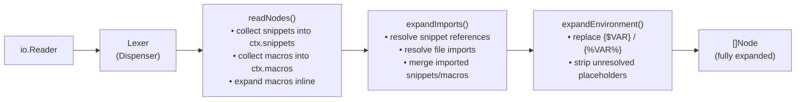
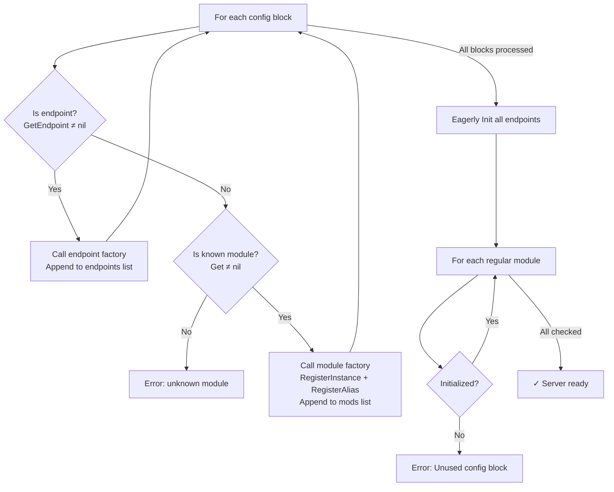
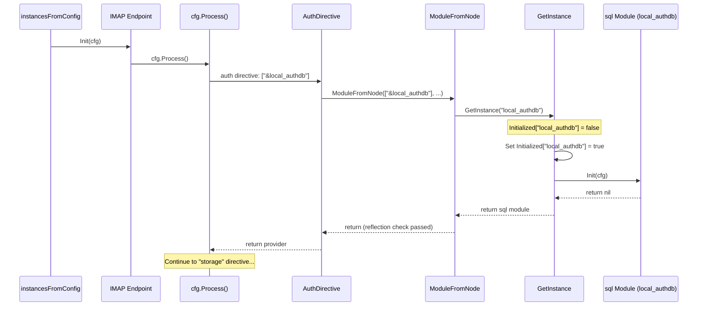
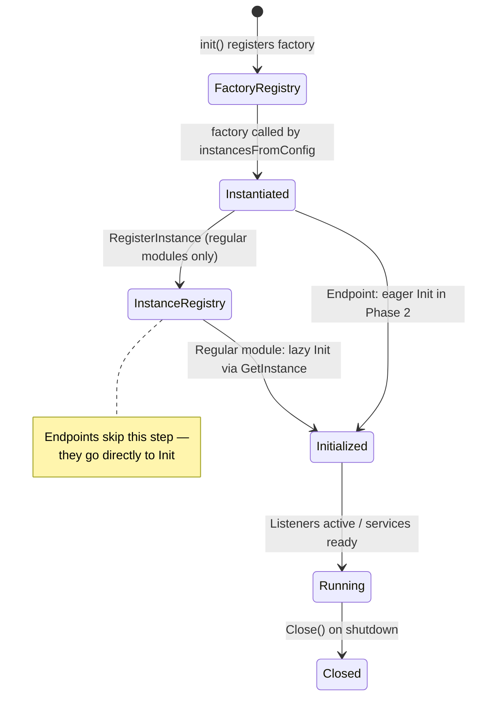
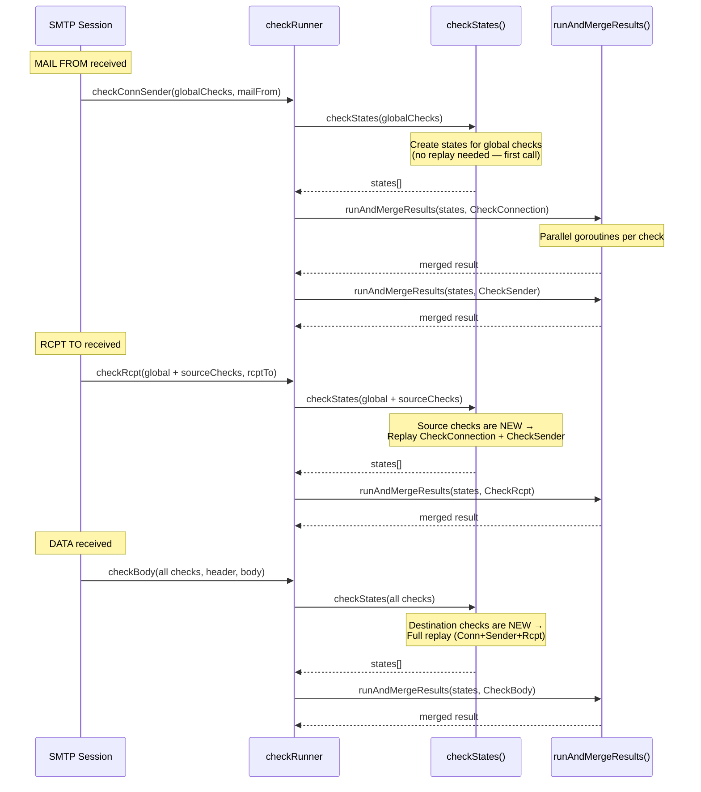
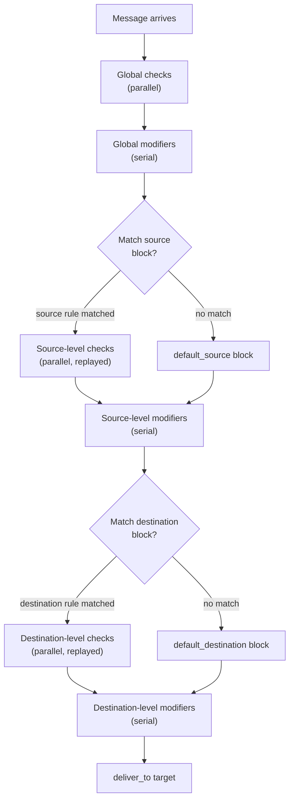

# Maddy Mail Server: Module System Lifecycle Deep-Dive

## Introduction & Context

This document answers four interconnected technical questions about the Maddy mail server's module system, tracing the lifecycle from configuration parsing through runtime message processing:

1. **Configuration-time behavior:** How the declarative configuration file is parsed, what the parser actually produces, and how macros, snippets, and environment variables are resolved before any module sees the config. Specifically, what gets registered immediately upon parsing and what stays unresolved until later.
2. **Lazy initialization and the `&` reference syntax:** How `ModuleFromNode` in `internal/config/module/modconfig.go` distinguishes between inline module creation and `&`-prefixed references to pre-registered instances, and how `module.GetInstance()` in `internal/module/instances.go` implements at-most-once lazy initialization with circular dependency protection.
3. **Endpoint vs. regular module lifecycle divergence:** Why endpoint modules (SMTP, IMAP, LMTP) are eagerly initialized while regular modules (storage, auth, queue, checks, modifiers) are lazily initialized on first reference, and the architectural consequences of this split.
4. **Message-flow-time coordination of checks and modifiers:** How the `checkRunner` lazily creates per-check states, replays prior SMTP phases for late-initialized checks, runs checks in parallel goroutines with mutex-protected result merging, and how modifiers apply serially through the `modify.Group` wrapper.

This document builds upon and deepens the conceptual summary in `HACKING.md` (lines 32–62), which describes the module system at a high level. Where `HACKING.md` states that modules "are represented by objects implementing the module.Module interface" and that "`&`-syntax reference[s] existing configuration block," this document traces the actual code paths, data structures, and concurrency mechanisms that implement those abstractions.

Every claim is grounded in specific source files and line numbers. No assumptions are made — the code is the truth.

---

## Section 1: Configuration Parsing — From Text to Node Tree

The configuration parser transforms a text file into a fully-expanded tree of `Node` structs through a multi-pass pipeline: lexing → recursive descent parsing (with inline snippet/macro collection) → import/snippet expansion → macro expansion → environment variable substitution. By the time the parser returns, all snippets, macros, and environment variables have been resolved. The caller receives a flat slice of concrete configuration directives — no unresolved references remain.

### 1.1 The `Node` Struct — What the Parser Produces

The fundamental data structure is the `Node` struct, defined at `pkg/cfgparser/parse.go:18-43`:

```go
type Node struct {
    Name     string
    Args     []string
    Children []Node
    Snippet  bool
    Macro    bool
    File     string
    Line     int
}
```

Source: `pkg/cfgparser/parse.go:18-43`

This is a recursive tree structure. Each `Node` represents a configuration directive or block: `Name` holds the directive keyword (e.g., `smtp`, `hostname`, `sql`), `Args` holds any arguments on the same line, and `Children` holds nested directives within a block delimited by braces. The `File` and `Line` fields track provenance for error reporting. The `Snippet` and `Macro` flags are internal bookkeeping — as documented in the struct comments at lines 27–35, these are always `false` for all nodes returned from `Read()` because snippets and macros are expanded before the function returns.

### 1.2 The Multi-Pass Parsing Pipeline

The entry point is the `Read()` function at `pkg/cfgparser/parse.go:294-298`:

```go
func Read(r io.Reader, location string) (nodes []Node, err error) {
    nodes, _, _, err = readTree(r, location, 0)
    nodes = expandEnvironment(nodes)
    return
}
```

Source: `pkg/cfgparser/parse.go:294-298`

The pipeline has two top-level stages: `readTree()` (which internally performs lexing, parsing, snippet/macro collection, and import expansion) followed by `expandEnvironment()`.

Inside `readTree()` at `pkg/cfgparser/parse.go:259-292`:

1. A `parseContext` is created with a lexer `Dispenser`, empty `snippets` map, empty `macros` map, and nesting level `-1`.
2. `readNodes()` performs recursive descent parsing. During this pass, it **collects** snippet definitions (lines 235–244) and macro definitions (lines 220–233) into the context maps, and **expands** macros inline via `expandMacros()` (line 247).
3. After parsing completes, `expandImports()` is called (line 287) to resolve `import` directives — replacing them with the contents of referenced snippets or external files.
4. The function returns the expanded `[]Node` tree plus the snippet and macro maps (which `Read()` discards since expansion is complete).



### 1.3 Snippet and Macro System

**Snippets** use the `(name) { ... }` syntax. The parser detects them via `isSnippet()` at `pkg/cfgparser/parse.go:131-136`:

```go
func (ctx *parseContext) isSnippet(name string) (bool, string) {
    if strings.HasPrefix(name, "(") && strings.HasSuffix(name, ")") {
        return true, name[1 : len(name)-1]
    }
    return false, ""
}
```

Source: `pkg/cfgparser/parse.go:131-136`

When a snippet is encountered during `readNodes()`, its children are stored in `ctx.snippets[node.Name]` at line 243, and the node is **not** appended to the result — it is consumed in place. Later, `expandImports()` replaces any `import name` directive with the corresponding snippet's children.

**Macros** use the `$(name) = value1 value2` syntax. The parser detects them via `parseAsMacro()` at `pkg/cfgparser/parse.go:138-153`, which strips the `$(` and `)` delimiters, verifies the `=` sign, and extracts the value arguments. During `readNodes()`, macro definitions are stored in `ctx.macros[node.Name]` at line 232 and consumed. Macro references in other directives (e.g., `$(hostname)` as an argument) are expanded inline by `expandMacros()` in `pkg/cfgparser/imports.go:94-134`.

The function `expandSingleValueMacro()` at `pkg/cfgparser/imports.go:138-156` handles macros embedded inside larger strings — for example, `mx$(primary_domain)` would expand the `$(primary_domain)` portion while preserving the `mx` prefix. Multi-value macros cannot be embedded this way (line 142–144: an error is returned if the macro has more than one argument).

**Concrete example from `maddy.conf`:** The default configuration defines macros like `$(hostname)` and `$(primary_domain)`, and a snippet `(local_delivery_actions)` containing a reusable block of delivery directives. These are all resolved before any module code sees the configuration.

### 1.4 Import Resolution

The `expandImports()` function at `pkg/cfgparser/imports.go:10-58` walks the node tree recursively. For each node named `import`, it calls `resolveImport()` to obtain the replacement subtree and splices it in.

`resolveImport()` at `pkg/cfgparser/imports.go:60-92` uses a two-tier lookup:

1. **Snippet lookup** (line 61): checks `ctx.snippets[name]`. If found, returns the snippet's children immediately.
2. **File-based import** (lines 65–79): opens a file relative to the current config file's directory. If the exact filename doesn't exist, tries appending `.conf`. Calls `readTree()` recursively on the imported file, then merges any snippets and macros discovered in the imported file back into the current context (lines 84–89).

A recursion limit of 255 is enforced at `imports.go:28-30` to prevent infinite import loops.

**Rationale:** The two-tier approach means snippets (defined inline with `(name) { ... }`) take priority over file-based imports. This allows a configuration file to override an imported snippet by defining a same-named snippet before the `import` directive.

### 1.5 Environment Variable Substitution

`expandEnvironment()` at `pkg/cfgparser/env.go:9-29` is the **last** pass. It builds a `strings.Replacer` from `os.Environ()` (mapping both `{$VAR}` Unix-style and `` Windows-style placeholders to their values) and applies it to every node's `Name` and `Args` fields, recursing into `Children`.

After replacement, `removeUnexpandedEnvvars()` at `pkg/cfgparser/env.go:34-38` strips any leftover unresolved placeholders (using regex patterns `{\$([^\$]+)}` and `{%([^%]+)%}`) so that undefined environment variables simply vanish rather than causing errors.

**Rationale:** Environment expansion happens last so that snippets and macros can contain environment variable references. For example, a snippet could reference `{$MAIL_DOMAIN}`, and that reference is only resolved in this final pass — after the snippet has been expanded into the main tree.

### 1.6 What Gets Registered Immediately

During the parse pass itself (inside `readNodes()`):

- **Macros** are registered into `ctx.macros` at `parse.go:232` and expanded inline via `expandMacros()` at `parse.go:247` before `readNodes()` returns.
- **Snippets** are registered into `ctx.snippets` at `parse.go:243` and expanded by `expandImports()` at `parse.go:287` before `readTree()` returns.

Both are consumed and expanded before `Read()` returns. The final `[]Node` tree contains only fully-expanded, concrete configuration directives ready for module processing. Callers never see `Snippet=true` or `Macro=true` nodes.

**What stays unresolved until later:** The `&`-prefixed module references (e.g., `&local_mailboxes`) are **not** resolved during parsing. They appear as ordinary string arguments in the node tree. Resolution happens later during module configuration processing (see Section 4).

---

## Section 2: Module Registration — What Happens at Import Time

Before `main()` runs and before any configuration is read, all module packages execute their `init()` functions via Go's side-effect import mechanism. These `init()` functions populate two global registries — one for regular modules and one for endpoint modules — with factory functions that know how to create module instances. This is a compile-time wiring step that establishes the vocabulary of available module types.

### 2.1 Side-Effect Imports and `init()` Functions

The bootstrap file `maddy.go` contains a block of blank imports at lines 20–38:

```go
// Import packages for side-effect of module registration.
_ "github.com/foxcpp/maddy/internal/auth/external"
_ "github.com/foxcpp/maddy/internal/check/dns"
_ "github.com/foxcpp/maddy/internal/endpoint/smtp"
// ... (18 total packages)
```

Source: `maddy.go:20-38`

Go's `init()` functions run automatically when a package is imported, even via a blank import (`_`). These side-effect imports ensure all module packages' `init()` functions execute at process start, BEFORE `main()` runs.

**Concrete example — regular module:** `internal/module/dummy.go:56-59`:

```go
func init() {
    Register("dummy", func(_, instName string, _, _ []string) (Module, error) {
        return &Dummy{instName: instName}, nil
    })
}
```

Source: `internal/module/dummy.go:56-59`

**Concrete example — endpoint module:** `internal/endpoint/smtp/smtp.go:714-720`:

```go
func init() {
    module.RegisterEndpoint("smtp", New)
    module.RegisterEndpoint("submission", New)
    module.RegisterEndpoint("lmtp", New)
}
```

Source: `internal/endpoint/smtp/smtp.go:714-717`

Note that the same `New` factory is registered under three names (`smtp`, `submission`, `lmtp`) — the factory uses the `modName` argument to determine behavioral differences (e.g., `submission` requires authentication, `lmtp` uses the LMTP protocol variant).

### 2.2 The Dual-Registry Pattern

The registries are defined at `internal/module/registry.go:7-11`:

```go
var (
    modules     = make(map[string]FuncNewModule)
    endpoints   = make(map[string]FuncNewEndpoint)
    modulesLock sync.RWMutex
)
```

Source: `internal/module/registry.go:7-11`

Two separate global maps exist: `modules` for regular modules and `endpoints` for endpoint modules, protected by a single `sync.RWMutex`.

- `Register()` (lines 19–28) adds to `modules`. Panics on duplicate names — enforcing the invariant that each module name is globally unique.
- `RegisterEndpoint()` (lines 56–65) adds to `endpoints`. Same panic-on-duplicate invariant.
- `Get()` (lines 35–40) performs a read-locked lookup in `modules` only. Does **not** return endpoint modules.
- `GetEndpoint()` (lines 45–50) performs a read-locked lookup in `endpoints` only. Does **not** return regular modules.

**Rationale:** The separation exists because endpoint modules have a fundamentally different constructor signature (`FuncNewEndpoint` takes `addrs []string` for listen addresses) and lifecycle (no instance name, no global instance registry participation, eager initialization). Keeping them in separate maps prevents accidental cross-referencing and makes the type distinction explicit.

### 2.3 Constructor Type Contrast

The two constructor types are defined at `internal/module/module.go:49-71`:

| Aspect | `FuncNewModule` (line 57) | `FuncNewEndpoint` (line 71) |
|--------|--------------------------|----------------------------|
| Signature | `func(modName, instName string, aliases, inlineArgs []string) (Module, error)` | `func(modName string, addrs []string) (Module, error)` |
| Instance Name | Unique per-instance name | `InstanceName()` always returns same as `Name()` |
| Registry Participation | Registered in global instance registry | NOT registered in instance registry |
| Can be defined inline | Yes (via `ModuleFromNode`) | No |
| Can be referenced with `&` | Yes | No |
| Initialization Timing | Lazy (on first `&` reference) | Eager (during `instancesFromConfig` Phase 2) |
| Config Args | First arg = instance name, rest = aliases | All args = listen addresses |

Source: `internal/module/module.go:49-71`

The GoDoc comments at lines 59–71 explicitly state: "endpoint module instances are: Not registered in the global registry. Can't be defined inline. Don't have an unique name. All config arguments are always passed as an 'addrs' slice."

### 2.4 Complete Module Inventory

The following modules are registered via side-effect imports in `maddy.go:20-38`:

| Import Package | Module Type | Registered Names |
|---------------|-------------|-----------------|
| `internal/endpoint/smtp` | Endpoint | `smtp`, `submission`, `lmtp` |
| `internal/endpoint/imap` | Endpoint | `imap`, `imaps` |
| `internal/storage/sql` | Storage + Auth | `sql` |
| `internal/auth/external` | Auth | `extauth` |
| `internal/auth/pam` | Auth | `pam` |
| `internal/auth/shadow` | Auth | `shadow` |
| `internal/check/dns` | Check (stateless) | `require_matching_rdns`, `require_mx_record`, `require_matching_ehlo` |
| `internal/check/dkim` | Check | `verify_dkim` |
| `internal/check/spf` | Check | `apply_spf` |
| `internal/check/dnsbl` | Check | `dnsbl` |
| `internal/check/command` | Check | `command` |
| `internal/check/requiretls` | Check | `require_tls` |
| `internal/modify` | Modifier | `replace_sender`, `replace_rcpt`, `alias_file` |
| `internal/modify/dkim` | Modifier | `sign_dkim` |
| `internal/target/queue` | Delivery Target | `queue` |
| `internal/target/remote` | Delivery Target | `remote` |
| `internal/target/smtp_downstream` | Delivery Target | `smtp_downstream` |
| `internal/module` (always loaded) | Utility | `dummy` |

---

## Section 3: From Config to Running Modules — `instancesFromConfig`

After the parser produces a fully-expanded `[]Node` tree, the `moduleMain()` function separates global directives from module definition blocks using the `AllowUnknown()` + `Process()` pattern, then feeds the module blocks into `instancesFromConfig()`. This function implements a two-phase loop: first it instantiates all modules and registers regular modules in the instance registry (without initializing them), then it eagerly initializes all endpoints — which transitively triggers lazy initialization of any referenced regular modules. Finally, it verifies that every defined module was actually referenced.

### 3.1 Entry Point: `moduleMain()`

The function at `maddy.go:243-287` orchestrates the transition from configuration to running modules:

**Step 1** (line 244): Create a `config.Map` from the parsed nodes.

**Step 2** (lines 245–254): Register known global directives — `state`, `runtime`, `hostname`, `autogenerated_msg_domain`, `tls`, `storage_perdomain`, `auth_perdomain`, `auth_domains`, `log`, `debug`.

**Step 3** (line 255): Call `globals.AllowUnknown()` — this is critical. Any config blocks that are not recognized as global directives will be collected as "unknown" nodes instead of causing an error.

**Step 4** (line 256): Call `globals.Process()` — processes all global directives through their matchers and returns the unmatched nodes as `unknown`.

**Step 5** (line 267): Call `instancesFromConfig(globals.Values, unknown)` — passes the global values and the unknown (module definition) blocks for module instantiation.

Source: `maddy.go:243-267`

### 3.2 The `AllowUnknown()` + `Process()` Mechanism

`AllowUnknown()` at `internal/config/map.go:69-73` simply sets `m.allowUnknown = true`.

`Process()` at `internal/config/map.go:562-564` delegates to `ProcessWith()` (lines 567–597), which iterates over `block.Children`. For each child node, it checks if a matcher exists in `m.entries` (line 579). If a matcher is found, it executes the mapper function and stores the result. If no matcher exists and `m.allowUnknown` is true, the node is appended to the `unknown` slice (line 584). Otherwise, an error is returned.

```go
if !m.allowUnknown {
    return nil, m.MatchErr("unexpected directive: %s", subnode.Name)
}
unknown = append(unknown, subnode)
```

Source: `internal/config/map.go:581-584`

**Rationale:** This is the bridge that separates "global config directives" (hostname, tls, log, etc.) from "module definition blocks" (smtp, imap, sql, queue, etc.). The global directives are consumed by their registered matchers; everything else falls through as module configuration to be processed by `instancesFromConfig`.

### 3.3 Phase 1: Classify and Instantiate

`instancesFromConfig` at `maddy.go:294-375` processes each unknown node (top-level config block):

For each block (lines 300–346):
1. **Extract identity** (lines 301–308): The block's `Name` is the module type name (e.g., `sql`). If `Args` are present, the first arg is the instance name and the rest are aliases; otherwise, the instance name defaults to the block name.
2. **Endpoint check** (line 312): Try `module.GetEndpoint(modName)` first. If found, call the endpoint factory with addresses, append to `endpoints` slice, and `continue` — skipping instance registration.
3. **Regular module** (lines 323–345): Try `module.Get(modName)`. If nil, return error "unknown module or global directive." Check for duplicate instance names via `module.HasInstance(instName)` (line 328). Call the factory: `factory(modName, instName, modAliases, nil)` (line 332). Register the instance and its config via `module.RegisterInstance(inst, config.NewMap(globals, &block))` (line 338). Register aliases (lines 339–344).

**Key insight:** After this loop, all regular modules are **instantiated and registered** but **NOT initialized**. All endpoints are instantiated but **NOT registered** in the instance registry. The `Init()` method has not been called on any module yet.

### 3.4 Phase 2: Eager Endpoint Initialization

At lines 348–356, all endpoints are initialized eagerly:

```go
for _, endp := range endpoints {
    if err := endp.instance.Init(config.NewMap(globals, &endp.cfg)); err != nil {
        return nil, err
    }
}
```

Source: `maddy.go:352-355`

This is **eager initialization** — endpoints are initialized immediately, in the order they appear in the configuration. During `Init()`, each endpoint parses its own configuration (including pipeline directives), which triggers lazy initialization of referenced modules via `ModuleFromNode` → `GetInstance` (detailed in Section 4).

### 3.5 Phase 3: Unused Module Verification

After all endpoints have been initialized (and their transitive lazy initialization chains have completed), lines 358–365 verify every regular module:

```go
for _, inst := range mods {
    if module.Initialized[inst.instance.InstanceName()] {
        continue
    }
    return nil, fmt.Errorf("Unused configuration block at %s:%d - %s (%s)",
        inst.cfg.File, inst.cfg.Line, inst.instance.InstanceName(), inst.instance.Name())
}
```

Source: `maddy.go:358-365`

If any module's instance name is NOT in the `Initialized` map (i.e., it was never referenced by any endpoint's initialization chain), an error is returned with the file and line number from the original config.

**Rationale:** This catches configuration errors where a module block is defined but never referenced by any endpoint. It is the definitive check that the module graph has "settled" — every defined module was reachable through the endpoint initialization chain, or the server refuses to start.



### 3.6 The AllowUnknown Pipeline Bridge (SMTP Endpoint)

The same `AllowUnknown()` + `Process()` pattern recurs inside the SMTP endpoint's `setConfig()` method at `internal/endpoint/smtp/smtp.go:551-586`:

1. Lines 557–574: Register known SMTP directives (`auth`, `hostname`, `write_timeout`, `read_timeout`, `max_message_size`, `tls`, `insecure_auth`, `io_debug`, `debug`, `defer_sender_reject`, `ratelimit`, `concurrency`).
2. Line 575: `cfg.AllowUnknown()`.
3. Line 576: `unknown, err := cfg.Process()` — collects pipeline directives (`source`, `destination`, `check`, `modify`, `deliver_to`, `reject`, `reroute`, `default_source`, `default_destination`, `dmarc`) as unknown nodes.
4. Line 580: `endp.pipeline, err = msgpipeline.New(cfg.Globals, unknown)` — constructs the message pipeline from those directives.

**Rationale:** This two-level `AllowUnknown` pattern enables the SMTP endpoint's configuration to contain arbitrary pipeline directives without the endpoint needing to know about every possible pipeline directive at compile time. The endpoint handles its own directives; everything else is delegated to the message pipeline constructor.

---

## Section 4: Lazy Initialization and the `&` Reference Syntax

When a module's configuration references another module — for example, when the IMAP endpoint's `auth` directive specifies `&local_authdb` — the `ModuleFromNode` function detects the `&` prefix and triggers lazy initialization via `GetInstance()`. The `GetInstance` function implements an at-most-once guarantee: it sets the `Initialized` flag **before** calling `Init()`, which is the key to breaking circular dependencies. If module A's `Init()` triggers lazy init of module B, and B references A back, `GetInstance("A")` sees the flag already set and returns A's instance without re-entering `Init()`.

### 4.1 How `ModuleFromNode` Resolves References

The central resolution function is `ModuleFromNode` at `internal/config/module/modconfig.go:54-93`:

Line 59 contains the critical detection:

```go
referenceExisting := strings.HasPrefix(args[0], "&")
```

Source: `internal/config/module/modconfig.go:59`

**Branch 1 — `&` reference** (lines 63–68): If the first argument starts with `&`, the function calls `module.GetInstance(args[0][1:])` (stripping the `&`). This triggers lazy initialization if the module hasn't been initialized yet. It logs `"reference %s"` via debug. It requires exactly one argument and no children block — a `&` reference is just a name pointer.

**Branch 2 — Inline creation** (lines 69–72): Otherwise, calls `createInlineModule(args[0], args[1:])` which looks up the factory via `module.Get(modName)` and calls `newMod(modName, "", nil, args)` (empty instance name, nil aliases). Logs `"new module %s %v"` via debug.

After obtaining the module object, **reflection-based interface verification** occurs (lines 78–84): the function checks whether the module implements the required interface type using `reflect.TypeOf`. If not, an error is returned.

For inline modules only (lines 86–90): `initInlineModule()` constructs a synthetic `config.Map` and calls `modObj.Init()`. Inline modules are initialized immediately at the point of reference.

**Rationale:** The `&` prefix is a lightweight syntax for the user to distinguish "create a new anonymous module here" from "reference an existing named module defined elsewhere." Referenced modules participate in the global instance registry and can be shared across multiple referencing sites; inline modules are anonymous and private to the referencing block.

```mermaid
flowchart TD
    A["ModuleFromNode(args, inlineCfg, globals, moduleIface)"] --> B{args[0] starts<br/>with '&'?}
    B -->|Yes| C["module.GetInstance(name)\n→ lazy init if needed"]
    B -->|No| D["createInlineModule(name, args)\n→ module.Get(name) + factory call"]
    C --> E["Reflection: implements\nrequired interface?"]
    D --> E
    E -->|No| F["Error: doesn't implement interface"]
    E -->|Yes| G{Was inline<br/>creation?}
    G -->|Yes| H["initInlineModule()\n→ Init() called immediately"]
    G -->|No| I["Return module\n(already initialized by GetInstance)"]
    H --> I
```

### 4.2 `GetInstance` and At-Most-Once Initialization

The `GetInstance` function at `internal/module/instances.go:53-75` is where lazy initialization actually happens:

1. **Alias resolution** (lines 54–57): If the name has an alias, follow it.
2. **Instance lookup** (lines 59–62): Look up in the `instances` map. If not found, return error `"unknown config block: %s"`.
3. **Circular dependency breaking** (lines 65–67): If `Initialized[name]` is already `true`, return the module **without** calling `Init()` again. This is the at-most-once guarantee.
4. **Initialize** (lines 69–72): Set `Initialized[name] = true` **before** calling `Init()`. Then call `mod.mod.Init(mod.cfg)`.

```go
Initialized[name] = true
if err := mod.mod.Init(mod.cfg); err != nil {
    return mod.mod, err
}
```

Source: `internal/module/instances.go:69-72`

**Rationale — why set `Initialized` before `Init()`:** This is the key to breaking circular dependencies. If module A's `Init()` triggers lazy init of module B, and module B's `Init()` references module A via `&`, `GetInstance("A")` sees `Initialized["A"] == true` and returns A's instance immediately without re-entering `Init()`. The module object was already created in Phase 1 of `instancesFromConfig` (via the factory call at `maddy.go:332`), so it exists and is usable — it is just not fully initialized yet. This is a deliberate design choice: partial initialization is acceptable for breaking cycles, because the module object's struct fields have already been set by the factory. Note that if `Init()` fails, the module remains marked as `Initialized` — a failed init is not retried.

### 4.3 The `instances` and `Initialized` Data Structures

Defined at `internal/module/instances.go:9-17`:

```go
var (
    instances   = make(map[string]struct{ mod Module; cfg *config.Map })
    aliases     = make(map[string]string)
    Initialized = make(map[string]bool)
)
```

Source: `internal/module/instances.go:9-17`

- **`instances`**: Maps instance name → (module object, config.Map). Populated by `RegisterInstance()` during Phase 1 of `instancesFromConfig`.
- **`aliases`**: Maps alias name → canonical instance name. Populated by `RegisterAlias()` during Phase 1.
- **`Initialized`**: Maps instance name → bool. Starts empty. Set to `true` just before `Init()` is called in `GetInstance`. Exported (capital `I`) so it is accessible from `maddy.go` for the unused-module check at line 359.

### 4.4 Tracing a Concrete Reference Chain

Consider the IMAP endpoint in `maddy.conf` with directives `auth &local_authdb` and `storage &local_mailboxes`:

1. During Phase 2 (eager init), `instancesFromConfig` calls `imapEndpoint.Init(cfg)`.
2. Inside `Init()` at `internal/endpoint/imap/imap.go:53-69`:
   - Line 60: `cfg.Custom("auth", false, true, nil, modconfig.AuthDirective, &endp.Auth)` — registers the `auth` directive with `modconfig.AuthDirective` as the mapper.
   - Line 61: `cfg.Custom("storage", false, true, nil, modconfig.StorageDirective, &endp.Store)` — same for `storage`.
   - Line 67: `cfg.Process()` — processes all directives.
3. When `Process()` encounters the `auth &local_authdb` directive, it calls `modconfig.AuthDirective` (at `internal/config/module/auth.go:8-14`), which calls `ModuleFromNode(node.Args, node, m.Globals, &provider)`.
4. `ModuleFromNode` detects the `&` prefix → calls `module.GetInstance("local_authdb")`.
5. `GetInstance` checks `Initialized["local_authdb"]` → it is `false`, so sets it to `true` and calls `local_authdb.Init(cfg)`.
6. The SQL module's `Init()` runs, potentially triggering further lazy inits.
7. Control returns to the IMAP endpoint's `Process()`, which continues with the `storage` directive, triggering lazy init of `&local_mailboxes` in the same way.



---

## Section 5: Endpoint vs. Regular Module Lifecycle

Endpoint modules (SMTP, IMAP, LMTP) are the "entry points" of the server — they open network listeners and accept connections. They are eagerly initialized during `instancesFromConfig` Phase 2 because the server cannot signal readiness until listeners are active. Regular modules (storage, auth, checks, modifiers, delivery targets) are lazily initialized on first `&` reference. This split enables order-independent configuration, automatic circular dependency handling, and unused-module detection.

### 5.1 `FuncNewEndpoint` vs. `FuncNewModule` Contrast

| Aspect | `FuncNewModule` | `FuncNewEndpoint` |
|--------|----------------|-------------------|
| **Signature** | `func(modName, instName string, aliases, inlineArgs []string) (Module, error)` | `func(modName string, addrs []string) (Module, error)` |
| **Instance Name** | Unique per-instance name from config | `InstanceName()` returns same as `Name()` |
| **Instance Registry** | Registered via `RegisterInstance()` | NOT registered — never enters `instances` map |
| **Can be `&`-referenced** | Yes | No |
| **Can be defined inline** | Yes (via `ModuleFromNode`) | No |
| **Init Timing** | Lazy (on first `&` reference via `GetInstance`) | Eager (during `instancesFromConfig` Phase 2) |
| **Config Args** | First arg = instance name, rest = aliases | All args = listen addresses |

Source: `internal/module/module.go:49-71`

### 5.2 Registry Participation and Naming

**Endpoints** (lines 312–321 of `maddy.go`): The endpoint factory is called, and the instance is appended to the `endpoints` slice, but `module.RegisterInstance()` is **never** called. Endpoints never enter the `instances` map. They cannot be referenced by `&name` from other modules.

**Regular modules** (lines 323–345 of `maddy.go`): The factory is called, the instance **is** registered via `module.RegisterInstance()`, and aliases are registered via `module.RegisterAlias()`. They can be referenced by `&name` from any other module's configuration.

**Consequence:** Endpoints are the roots of the initialization dependency graph. They reference regular modules (via `&`), but nothing references them back. This creates a clear, directed dependency flow.

### 5.3 Configuration Processing Differences

**SMTP endpoint** (`internal/endpoint/smtp/smtp.go:500-609`): Its `Init()` creates the SMTP server, calls `setConfig()` which uses the `AllowUnknown` + `Process` pattern to collect pipeline directives, constructs a `msgpipeline.MsgPipeline` (line 580), then sets up network listeners.

**IMAP endpoint** (`internal/endpoint/imap/imap.go:53-119`): Its `Init()` calls `cfg.Process()` (line 67) which triggers `modconfig.AuthDirective` and `modconfig.StorageDirective` — these use `ModuleFromNode` to resolve `&local_authdb` and `&local_mailboxes`, triggering their lazy initialization.

**Regular modules:** Their `Init()` is called lazily by `GetInstance()` when first referenced. They do not open listeners — they provide services (storage, authentication, checking, modification) consumed by endpoints.

### 5.4 Why the Divergence Exists — Rationale

The comment in `internal/module/module.go:30-36` explicitly states the design rationale:

> "Init... is not done in FuncNewModule so all module instances are registered at time of initialization, thus initialization does not depends on ordering of configuration blocks and modules can reference each other without any problems."

Source: `internal/module/module.go:30-36`

Lazy initialization of regular modules provides three architectural benefits:

1. **Order-independent configuration:** You can define `sql local_mailboxes { ... }` before or after `imap { storage &local_mailboxes }` — the order doesn't matter because `local_mailboxes` is only initialized when the IMAP endpoint's `Init()` first references it.
2. **Circular dependency handling:** The `Initialized` map (set before `Init()` in `GetInstance`) breaks cycles. Module A can reference module B, and module B can reference module A — neither will deadlock.
3. **Unused module detection:** Phase 3 of `instancesFromConfig` catches modules that were defined but never referenced — a clear signal of a configuration error.

Endpoints, by contrast, MUST be initialized eagerly because they open network listeners. The server cannot signal readiness (systemd notification at `maddy.go:272`) until all listeners are active.



---

## Section 6: Message Flow — Check and Modifier Coordination

During message processing, the `checkRunner` orchestrates checks with lazy per-check state creation, phase replay for late-arriving checks, and parallel execution with mutex-protected result merging. Modifiers, by contrast, execute serially through the `modify.Group` wrapper — each modifier's output becomes the next modifier's input. This parallel-checks / serial-modifiers split reflects the fundamental difference between read-only inspections (which can safely overlap) and ordered mutations (which must be deterministic).

### 6.1 The `checkRunner` Structure

Defined at `internal/msgpipeline/check_runner.go:17-37`:

```go
type checkRunner struct {
    msgMeta  *module.MsgMetadata
    mailFrom string
    checkedRcpts         []string
    checkedRcptsPerCheck map[module.CheckState]map[string]struct{}
    checkedRcptsLock     sync.Mutex
    resolver      dns.Resolver
    doDMARC       bool
    didDMARCFetch bool
    dmarcVerify   *dmarc.Verifier
    log log.Logger
    states    map[module.Check]module.CheckState
    mergedRes module.CheckResult
}
```

Source: `internal/msgpipeline/check_runner.go:17-37`

Key fields: `states` maps each `Check` to its `CheckState` (lazy-created); `mergedRes` accumulates check results across all checks; `checkedRcpts` tracks previously checked recipients for replay; `checkedRcptsPerCheck` provides per-check deduplication; `dmarcVerify` handles DMARC evaluation.

Constructed by `newCheckRunner()` at lines 39–48, which initializes all maps and creates a `dmarc.Verifier`.

### 6.2 Lazy Check State Creation with `checkStates()`

The `checkStates()` function at `internal/msgpipeline/check_runner.go:50-140` is called at each SMTP phase (connection, sender, recipient, body) with the set of checks applicable at that phase:

For each check in the list (lines 60–76): if `cr.states[check]` already exists, reuse it. If not, call `check.CheckStateForMsg(ctx, cr.msgMeta)` (line 68) to create a new state. New states are tracked in `newStates` and `newStatesMap`.

The debug log at line 67 traces each new state creation:

```go
cr.log.Debugf("initializing state for %v (%p)", objectName(check), check)
```

Source: `internal/msgpipeline/check_runner.go:67`

**Rationale:** Different pipeline levels (global, per-source, per-destination) may introduce different sets of checks. A check encountered at the per-destination level hasn't seen prior SMTP phases, so it needs replay — described next.

### 6.3 Phase Replay for Late-Initialized Checks

Lines 82–131 contain the phase replay logic, with the comment:

> "Here we replay previous CheckConnection/CheckSender/CheckRcpt calls for any newly initialized checks so they all get change to see all these things."

Source: `internal/msgpipeline/check_runner.go:82-83`

The replay proceeds as follows:

1. **If `cr.mailFrom != ""`** (meaning MAIL FROM was already processed): replay `CheckConnection` (lines 88–95) and `CheckSender` (lines 96–103) for all newly created states.
2. **If `cr.checkedRcpts` is non-empty**: replay `CheckRcpt` for each previously seen recipient (lines 106–131). Deduplication is enforced via the `checkedRcptsPerCheck` map with `checkedRcptsLock` mutex protection (lines 112–121) to prevent the same check from processing the same recipient twice.

After all replays succeed, new states are persisted into `cr.states` (lines 135–137).

**Rationale:** This ensures every check, regardless of when it is first encountered in the pipeline, has a consistent view of all prior SMTP transaction phases. A destination-level check added during RCPT TO processing still sees the connection metadata and sender address that were established earlier.

### 6.4 Parallel Check Execution with `runAndMergeResults()`

The function at `internal/msgpipeline/check_runner.go:142-209` runs checks in parallel:

For each state (lines 158–196): a goroutine is launched (`data.wg.Add(1)` then `go func() { ... }()`). Each goroutine runs the check and merges results using separate synchronization primitives:

- **`data.authResLock`** (lines 166–170): Mutex protecting `cr.mergedRes.AuthResult` for concurrent append.
- **`data.headerLock`** (lines 171–177): Mutex protecting `cr.mergedRes.Header` for concurrent field addition.
- **`data.setQuarantineErr`** and **`data.setRejectErr`** (lines 179–186): `sync.Once` — only the first quarantine or reject result "wins."

After `data.wg.Wait()` (line 198): if `rejectErr` is non-nil, return it as a hard failure. If `quarantineErr` is non-nil, log it and set `cr.mergedRes.Quarantine = true`.

**Rationale:** As stated in `HACKING.md` line 29: "Do as much I/O as possible in parallel to minimize latencies." Checks often involve DNS lookups (SPF, DKIM, DNSBL), so parallelism is essential for performance. The `sync.Once` for quarantine/reject ensures deterministic behavior — the first check to signal a rejection wins, regardless of goroutine scheduling order.



### 6.5 DMARC Integration

DMARC evaluation is integrated into the check pipeline at two points:

1. **Record fetch** (lines 251–254 of `check_runner.go`): During `checkBody()`, if `cr.doDMARC && !cr.didDMARCFetch`, the runner calls `cr.dmarcVerify.FetchRecord(ctx, header)` to retrieve the domain's DMARC DNS record. This happens once per message.

2. **Policy application** (lines 262–309 in `applyResults()`): After all checks complete, `cr.dmarcVerify.Apply(cr.mergedRes.AuthResult)` evaluates the DMARC policy against accumulated SPF and DKIM authentication results. If the policy is `PolicyReject`, an SMTP 550 error is returned. If `PolicyQuarantine`, the message metadata is flagged.

The `Authentication-Results` header is assembled at lines 301–303:

```go
if len(cr.mergedRes.AuthResult) != 0 {
    header.Add("Authentication-Results", authres.Format(hostname, cr.mergedRes.AuthResult))
}
```

Source: `internal/msgpipeline/check_runner.go:301-303`

### 6.6 The Modifier Chain: Serial `modify.Group` Execution

The `Group` struct at `internal/modify/group.go:11-15` wraps `[]module.Modifier`:

```go
type Group struct {
    Modifiers []module.Modifier
}
```

Source: `internal/modify/group.go:13-15`

All operations execute **serially** — the output of one modifier becomes the input of the next:

- **`ModStateForMsg()`** (lines 22–36): Iterates modifiers serially, creates per-message state for each. If any fails, closes already-created states.
- **`RewriteSender()`** (lines 38–47): Passes `mailFrom` through each state serially — each modifier can transform the sender address, and the transformed value is passed to the next.
- **`RewriteRcpt()`** (lines 49–58): Same serial chain for recipient rewriting.
- **`RewriteBody()`** (lines 60–67): Same serial chain for body/header rewriting.
- **`Close()`** (lines 69–80): Closes all states, returns last error.

**Key contrast with checks:** Checks run in **parallel** (goroutines + mutexes); modifiers run **serially** (sequential loop). Checks are read-only inspections that can safely overlap. Modifiers are mutations that must be applied in a defined order to produce deterministic results — if modifier A rewrites the sender to `admin@example.com` and modifier B rewrites `admin@` to `postmaster@`, the order matters.

### 6.7 Two-Level Source/Destination Routing

The pipeline configuration parsed by `parseMsgPipelineRootCfg()` at `internal/msgpipeline/config.go:25-129` supports two levels of routing:

1. **`source` blocks** (lines 55–84): Match based on sender address or domain.
2. **`destination` blocks** (inside source blocks): Match based on recipient address or domain.

Each level can add its own checks and modifiers, which are **merged** with global checks/modifiers. The `checkRunner` handles this by accepting different check lists at different SMTP phases:

- At MAIL FROM: global checks only.
- At RCPT TO: global + source-matched checks.
- At DATA: global + source-matched + destination-matched checks.

Check and modifier resolution uses `modconfig.MessageCheck()` at `internal/msgpipeline/config.go:350-361` and `modconfig.MsgModifier()` at lines 363–374, both of which call `ModuleFromNode` — meaning checks and modifiers can be either `&`-referenced named modules or inline anonymous modules.



---

## Section 7: Runtime Evidence of Module Graph Settlement

Multiple runtime signals confirm that the module dependency graph has fully settled: the `Initialized` map records which modules were actually initialized, the unused-module error catches unreferenced definitions, debug logs trace every module resolution, and the systemd readiness notification signals that the server is fully operational.

### 7.1 The `Initialized` Map

The exported `Initialized` map at `internal/module/instances.go:16`:

```go
Initialized = make(map[string]bool)
```

Source: `internal/module/instances.go:16`

After all endpoints have been eagerly initialized and their lazy initialization chains have completed, every referenced module will have `Initialized[name] == true`. This map is the primary bookkeeping structure that tracks which modules have been activated.

### 7.2 Unused Module Error

At `maddy.go:358-365`, after endpoint initialization completes, the loop checks every regular module:

```go
if module.Initialized[inst.instance.InstanceName()] {
    continue
}
return nil, fmt.Errorf("Unused configuration block at %s:%d - %s (%s)", ...)
```

Source: `maddy.go:359-364`

If any module's instance name is NOT in the `Initialized` map, the error includes the file and line number from the original configuration, making it easy to locate the offending block. This is the **definitive signal** that the module graph has "settled" — every defined module was reachable through the endpoint initialization chain, or the server refuses to start.

### 7.3 Debug Logging Evidence

When debug logging is enabled (via `-debug` flag or `debug yes` in config), the following log lines trace every module resolution:

- **`ModuleFromNode`** at `modconfig.go:68`: `log.Debugf("%s:%d: reference %s", ...)` — emitted when resolving a `&` reference.
- **`ModuleFromNode`** at `modconfig.go:70`: `log.Debugf("%s:%d: new module %s %v", ...)` — emitted when creating an inline module.
- **`checkRunner.checkStates`** at `check_runner.go:67`: `cr.log.Debugf("initializing state for %v (%p)", objectName(check), check)` — emitted when creating a new check state at runtime.

These debug logs provide a complete runtime trace of every module resolution and check state initialization, allowing an operator to verify the full initialization graph at startup and the check activation sequence during message processing.

### 7.4 systemd Readiness Notification

At `maddy.go:272`:

```go
systemdStatus(SDReady, "Listening for incoming connections...")
```

Source: `maddy.go:272`

This is called AFTER `instancesFromConfig` completes successfully — meaning all endpoints are initialized, all lazy init chains are done, all modules are verified as used, and all listeners are active. This is the **process-level signal** that the module graph has fully settled and the server is ready to accept connections.

### 7.5 The `Future` Concurrency Primitive

The `Future` type at `internal/future/future.go:12-19` provides async value propagation:

```go
type Future struct {
    mu     sync.RWMutex
    set    bool
    val    interface{}
    err    error
    notify chan struct{}
}
```

Source: `internal/future/future.go:12-19`

- `New()` (line 21–23) creates an unresolved future with a notification channel.
- `Set()` (lines 27–40) resolves the future. Panics if called twice — enforcing the at-most-once guarantee.
- `GetContext()` (lines 46–69) blocks until resolved or context is cancelled.

This is used in SMTP sessions for reverse-DNS lookups (`internal/endpoint/smtp/smtp.go:699-702`): `s.connState.RDNSName = future.New()` creates a future at session start, and `go s.fetchRDNSName(rdnsCtx)` resolves it asynchronously. Checks that need the rDNS name (like `require_matching_rdns`) call `ctx.MsgMeta.Conn.RDNSName.Get()` which blocks only if the lookup hasn't completed yet. This allows SMTP commands to proceed without blocking on DNS — a form of runtime evidence that module coordination occurs through data-flow dependencies rather than explicit initialization ordering.

---

## Conclusion

The four questions are answered through a single architectural thread:

1. **Configuration parsing** produces a fully-expanded `[]Node` tree through a multi-pass pipeline (lexing → parsing with snippet/macro collection → import/snippet expansion → environment substitution). All macros, snippets, and environment variables are resolved before any module code sees the config. The `&`-prefixed references remain as ordinary string arguments, unresolved until module initialization time.

2. **Lazy initialization and the `&` syntax** are implemented by `ModuleFromNode` (which detects the `&` prefix and calls `GetInstance`) and `GetInstance` (which implements at-most-once initialization by setting `Initialized[name] = true` before calling `Init()`). This pre-flag-setting is the circular dependency breaker — if A's Init references B and B's Init references A, the second `GetInstance("A")` returns immediately.

3. **The endpoint/regular module lifecycle divergence** exists because endpoints are initialization graph roots that must open listeners before the server can signal readiness. Regular modules are graph leaves/intermediaries initialized lazily on first reference. This split enables order-independent configuration, circular dependency handling via the `Initialized` map, and unused-module detection.

4. **Check and modifier coordination** during message flow uses parallel execution with goroutine-per-check and mutex-protected result merging (checks), versus serial chain execution through `modify.Group` (modifiers). The `checkRunner` uses lazy per-check state creation with phase replay to ensure that checks added at later pipeline levels still see all prior SMTP phases.

The **key architectural insight** is that the `AllowUnknown()` + `Process()` pattern creates a two-tier configuration dispatch system. At the global level, it separates global directives from module definitions. At the endpoint level, it separates endpoint-specific directives from pipeline directives. This pattern cleanly separates concerns without requiring compile-time knowledge of all possible directives at any single level, and is the bridge that connects the static configuration tree to the dynamic module initialization graph.
