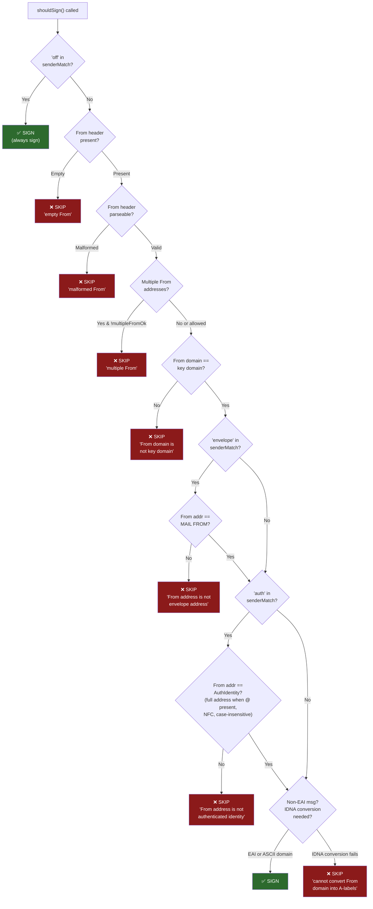
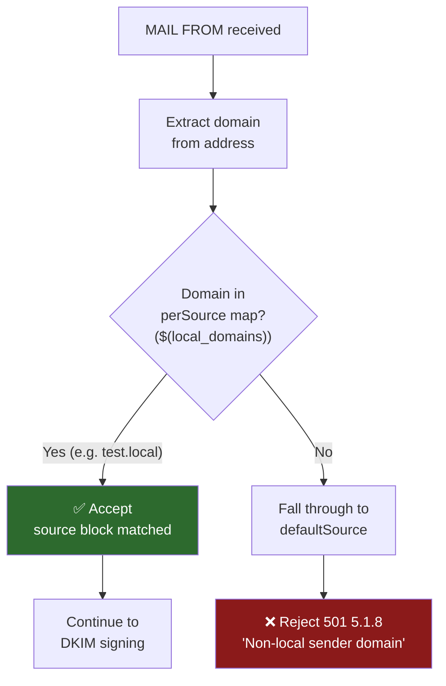
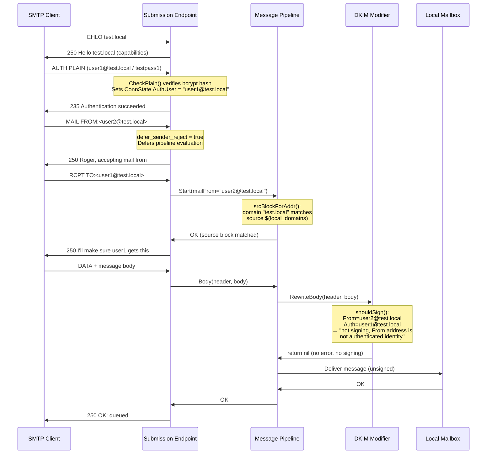

# Maddy Mail Server: Sender Identity Enforcement and DKIM Signing — A Runtime Investigation

## Introduction and Objectives

This document presents a **runtime investigation** into how the [Maddy mail server](https://github.com/foxcpp/maddy) enforces sender identity at the SMTP submission layer and how it decides whether to apply DKIM signatures to outgoing messages. Every finding is grounded in **actual runtime observations** — SMTP response codes, stored message headers, and debug log output — captured from a working Maddy deployment built from this repository's source code.

Source code is cited throughout to explain *why* observed behavior occurs, but the behavior itself is established exclusively through runtime evidence. No conclusion is drawn from source reading alone.

### Methodology

1. **Build from source** — compile `maddy` and `maddyctl` binaries with CGO enabled (required for SQLite3)
2. **Configure for local testing** — adapt the default `maddy.conf` for plaintext submission on localhost with `io_debug` and `debug` enabled
3. **Create test users** — two accounts (`user1@test.local`, `user2@test.local`) to enable cross-user testing
4. **Send controlled test messages** — vary MAIL FROM, From header, and authenticated identity across four test scenarios
5. **Capture SMTP transcripts** — from `io_debug` protocol logs and raw socket interaction
6. **Inspect stored headers** — dump delivered messages from the local mailbox to examine DKIM-Signature, Received, and other headers verbatim
7. **Analyze debug logs** — capture `sign_dkim` signing decision messages to confirm the decision tree

### Core Questions

1. Does Maddy's default submission configuration reject MAIL FROM addresses from authenticated users when the envelope sender doesn't match their identity?
2. What happens when a non-local domain is used as MAIL FROM?
3. Does DKIM signing occur when the From header doesn't match the authenticated identity?
4. What is the default `require_sender_match` behavior and how does it manifest at runtime?

---

## Test Environment Setup

### Building from Source

The Maddy server and administrative CLI were built from the repository source:

```bash
CGO_ENABLED=1 go build -o maddy ./cmd/maddy/
CGO_ENABLED=1 go build -o maddyctl ./cmd/maddyctl/
```

**Key build requirements:**

| Requirement | Value | Reason |
|---|---|---|
| Go version | 1.13+ (per `go.mod`) | Minimum toolchain version |
| CGO_ENABLED | 1 | Required for `github.com/mattn/go-sqlite3` driver (build tag `!nosqlite3,cgo`) |
| C compiler | gcc / build-essential | SQLite3 is a C library compiled via CGO |

Source: `go.mod` line 3, `internal/storage/sql/sqlite3.go` build tags

### Test Configuration

The following test configuration was adapted from the default `maddy.conf` (lines 1–120). Key changes are annotated with comments:

```
$(hostname) = test.local
$(primary_domain) = test.local
$(local_domains) = $(primary_domain)

# Changed: Use /tmp/maddy-test for isolated test state
state /tmp/maddy-test/state
runtime /tmp/maddy-test/runtime

# Changed: TLS disabled for local plaintext testing
tls off
hostname $(hostname)
autogenerated_msg_domain $(primary_domain)

# Storage: SQLite backend in test directory
sql local_mailboxes local_authdb {
    driver sqlite3
    dsn /tmp/maddy-test/data/all.db
}

# Changed from default: tcp:// instead of tls://, port 1587 for testing
submission tcp://127.0.0.1:1587 {
    auth &local_authdb
    # Changed: Required for plaintext AUTH
    insecure_auth
    # Changed: Enables full SMTP I/O logging (per smtp.go lines 603-606)
    io_debug yes
    debug yes

    # DEFAULT BEHAVIOR PRESERVED: source routing by domain
    source $(local_domains) {
        modify {
            sign_dkim $(primary_domain) default {
                # Changed: Enables signing decision debug logs
                debug yes
            }
        }

        destination $(local_domains) {
            deliver_to &local_mailboxes
        }

        default_destination {
            reject 550 5.1.1 "User not local"
        }
    }

    # DEFAULT BEHAVIOR PRESERVED: reject non-local sender domains
    default_source {
        reject 501 5.1.8 "Non-local sender domain"
    }
}
```

> ⚠️ **WARNING — LOCAL TESTING ONLY:** This test configuration enables `insecure_auth`, which permits plaintext password transmission over unencrypted connections. This directive must **NEVER** be used in production. In production deployments, use TLS-secured submission (`tls://0.0.0.0:465`) so that authentication credentials are always transmitted over an encrypted channel. See `docs/tutorials/setting-up.md` for production configuration guidance.

**Critical design choice:** The `source $(local_domains)` routing and `default_source { reject ... }` directives are kept **unchanged** from the default `maddy.conf` (lines 93–120) to test default behavior accurately.

### DKIM Key Generation

On first startup, the `sign_dkim` modifier auto-generates a keypair via `loadOrGenerateKey()` (Source: `internal/modify/dkim/keys.go:19-75`):

```
sign_dkim: generated a new rsa2048 keypair, private key is in dkim_keys/test.local_default.key,
TXT record with public key is in dkim_keys/test.local_default.dns,
put its contents into TXT record for default._domainkey.test.local to make signing and verification work
```

- **Default algorithm:** RSA-2048 (per `dkim.go` line 150: `"rsa2048"` default for `newkey_algo`)
- **Key files generated:** `dkim_keys/test.local_default.key` (private) and `dkim_keys/test.local_default.dns` (TXT record)

### User Account Creation

Two test users were created using `maddyctl`:

```bash
echo -e "testpass1\ntestpass1" | ./maddyctl -config /tmp/maddy-test/maddy.conf users create user1@test.local
echo -e "testpass2\ntestpass2" | ./maddyctl -config /tmp/maddy-test/maddy.conf users create user2@test.local
```

Internally, `CreateUser()` in `internal/storage/sql/maddyctl.go` (lines 17–33) calls `prepareUsername()` which applies PRECIS `UsernameCaseMapped` normalization to the local part and DNS normalization to the domain (Source: `internal/storage/sql/sql.go:351-375`). Passwords are processed through PRECIS `OpaqueString` and stored as bcrypt hashes.

**Verification:**

```
$ ./maddyctl -config /tmp/maddy-test/maddy.conf users list
user1@test.local
user2@test.local
```

### Environment Verification

```
$ python3 -c "
import smtplib
s = smtplib.SMTP('127.0.0.1', 1587)
code, msg = s.ehlo('test.local')
print(msg.decode())
"
Hello test.local
PIPELINING
8BITMIME
ENHANCEDSTATUSCODES
AUTH PLAIN
SMTPUTF8
SIZE 33554432
```

The server is running, listening on port 1587, accepting EHLO, and advertising AUTH PLAIN.

---

## Test 1: Cross-User Sender Spoofing

### Test Description

**Objective:** Authenticate as `user1@test.local` but set MAIL FROM to `user2@test.local`. Both addresses share the same local domain (`test.local`). This tests whether the pipeline's `source $(local_domains)` routing accepts cross-user MAIL FROM — and whether the authenticated identity is checked against the envelope sender.

### SMTP Transaction Capture

```
S: 220 test.local ESMTP Service Ready
C: EHLO test.local
S: 250-Hello test.local
S: 250-PIPELINING
S: 250-8BITMIME
S: 250-ENHANCEDSTATUSCODES
S: 250-AUTH PLAIN
S: 250-SMTPUTF8
S: 250 SIZE 33554432
C: AUTH PLAIN AHVzZXIxQHRlc3QubG9jYWwAdGVzdHBhc3Mx
S: 235 2.0.0 Authentication succeeded
C: MAIL FROM:<user2@test.local>
S: 250 2.0.0 Roger, accepting mail from <user2@test.local>
C: RCPT TO:<user1@test.local>
S: 250 2.0.0 I'll make sure <user1@test.local> gets this
C: DATA
S: 354 2.0.0 Go ahead. End your data with <CR><LF>.<CR><LF>
C: From: user2@test.local
C: To: user1@test.local
C: Subject: Test 1 - Cross-user spoof
C: Date: Wed, 09 Apr 2025 10:00:00 +0000
C:
C: This is test 1: cross-user sender spoofing.
C: .
S: 250 2.0.0 OK: queued
```

### Debug Log Evidence

```
submission: incoming message  {"msg_id":"1b62b048","sender":"user2@test.local",
  "src_host":"test.local","src_ip":"127.0.0.1:50836","username":"user1@test.local"}
[debug] smtp/pipeline: sender user2@test.local matched by domain rule 'test.local'
sign_dkim: not signing, From address is not authenticated identity
  {"auth_id":"user1@test.local","from_addr":"user2@test.local","msg_id":"1b62b048"}
submission: accepted  {"msg_id":"1b62b048"}
```

### Observed Behavior

| SMTP Command | Response Code | Enhanced Code | Message |
|---|---|---|---|
| AUTH PLAIN | 235 | 2.0.0 | Authentication succeeded |
| MAIL FROM:\<user2@test.local\> | 250 | 2.0.0 | Roger, accepting mail from \<user2@test.local\> |
| RCPT TO:\<user1@test.local\> | 250 | 2.0.0 | I'll make sure \<user1@test.local\> gets this |
| DATA (end) | 250 | 2.0.0 | OK: queued |

**The message was ACCEPTED and DELIVERED** despite being sent by an authenticated user (`user1@test.local`) using a different user's address (`user2@test.local`) as the envelope sender.

### Analysis

This reveals a **gap in sender enforcement**: the default configuration enforces **domain-level** but **NOT user-level** MAIL FROM restrictions.

**Why it happens:** The `srcBlockForAddr()` function in `internal/msgpipeline/msgpipeline.go` (lines 155–202) performs **domain matching only**. It extracts the domain from the MAIL FROM address (`user2@test.local` → `test.local`), then looks it up in `dd.d.perSource[domain]` (line 190). Since `test.local` IS in `$(local_domains)`, the `source $(local_domains)` block matches — regardless of which user authenticated.

The debug log confirms: `"sender user2@test.local matched by domain rule 'test.local'"`.

Neither `startDelivery()` (Source: `internal/endpoint/smtp/smtp.go:83-160`) nor `submissionPrepare()` (Source: `internal/endpoint/smtp/submission.go:27-130`) compares the MAIL FROM address against `s.connState.AuthUser`.

The DKIM signing was skipped because the From address (`user2@test.local`) does not match the authenticated identity (`user1@test.local`). The debug log reads: `"not signing, From address is not authenticated identity"`.

---

## Test 2: Non-Local Domain MAIL FROM

### Test Description

**Objective:** Authenticate as `user1@test.local` but set MAIL FROM to `user1@external.com` — a domain NOT in `$(local_domains)`.

### SMTP Transaction Capture

```
S: 220 test.local ESMTP Service Ready
C: EHLO test.local
S: 250-Hello test.local
S: 250-PIPELINING
S: 250-8BITMIME
S: 250-ENHANCEDSTATUSCODES
S: 250-AUTH PLAIN
S: 250-SMTPUTF8
S: 250 SIZE 33554432
C: AUTH PLAIN AHVzZXIxQHRlc3QubG9jYWwAdGVzdHBhc3Mx
S: 235 2.0.0 Authentication succeeded
C: MAIL FROM:<user1@external.com>
S: 250 2.0.0 Roger, accepting mail from <user1@external.com>
C: RCPT TO:<user1@test.local>
S: 501 5.1.8 Non-local sender domain (msg ID = a7ea98a3)
```

**Note:** The MAIL FROM command itself received `250 OK` because Maddy's default `defer_sender_reject` setting is `true` (Source: `internal/endpoint/smtp/smtp.go:567`). The actual rejection is deferred until the first RCPT TO command, at which point the pipeline evaluates the source routing.

### Debug Log Evidence

```
submission: incoming message  {"msg_id":"a7ea98a3","sender":"user1@external.com",
  "src_host":"test.local","src_ip":"127.0.0.1:56096","username":"user1@test.local"}
[debug] smtp/pipeline: sender user1@external.com matched by default rule
submission: RCPT error  {"effective_rcpt":"user1@test.local","rcpt":"user1@test.local",
  "reason":"reject directive used","smtp_code":501,"smtp_enchcode":"5.1.8",
  "smtp_msg":"Non-local sender domain"}
```

### Observed Behavior

| SMTP Command | Response Code | Enhanced Code | Message |
|---|---|---|---|
| AUTH PLAIN | 235 | 2.0.0 | Authentication succeeded |
| MAIL FROM:\<user1@external.com\> | 250 | 2.0.0 | Roger, accepting mail from \<user1@external.com\> (deferred) |
| RCPT TO:\<user1@test.local\> | **501** | **5.1.8** | **Non-local sender domain** |

**The message was REJECTED** at the RCPT TO stage.

### Analysis

This confirms **Layer 1** of sender enforcement — the pipeline's source routing provides **domain-level rejection** for non-local senders.

**Why it happens:** `srcBlockForAddr()` fails to match `external.com` against any `source` block, falling through to `dd.d.defaultSource` (line 193 of `msgpipeline.go`), which is the reject directive from `maddy.conf` lines 117–119:

```
default_source {
    reject 501 5.1.8 "Non-local sender domain"
}
```

The debug log confirms: `"sender user1@external.com matched by default rule"`.

---

## Test 3: Legitimate Aligned Message

### Test Description

**Objective:** Authenticate as `user1@test.local`, set MAIL FROM to `user1@test.local`, set From header to `user1@test.local`. All identities are aligned. This establishes the baseline for a properly signed message.

### SMTP Transaction Capture

```
S: 220 test.local ESMTP Service Ready
C: EHLO test.local
S: 250-Hello test.local
S: 250-PIPELINING
S: 250-8BITMIME
S: 250-ENHANCEDSTATUSCODES
S: 250-AUTH PLAIN
S: 250-SMTPUTF8
S: 250 SIZE 33554432
C: AUTH PLAIN AHVzZXIxQHRlc3QubG9jYWwAdGVzdHBhc3Mx
S: 235 2.0.0 Authentication succeeded
C: MAIL FROM:<user1@test.local>
S: 250 2.0.0 Roger, accepting mail from <user1@test.local>
C: RCPT TO:<user2@test.local>
S: 250 2.0.0 I'll make sure <user2@test.local> gets this
C: DATA
S: 354 2.0.0 Go ahead. End your data with <CR><LF>.<CR><LF>
C: From: user1@test.local
C: To: user2@test.local
C: Subject: Test 3 - Legitimate aligned message
C: Date: Wed, 09 Apr 2025 10:00:00 +0000
C:
C: This is test 3: a properly aligned message.
C: .
S: 250 2.0.0 OK: queued
```

### Raw Stored Headers

The following headers were extracted **verbatim** from the delivered message in user2's INBOX using `maddyctl imap-msgs dump`:

```
Delivered-To: user2@test.local
Return-Path: <user1@test.local>
DKIM-Signature: a=rsa-sha256;
 bh=xOThv44E5AUZmBooSTUZ7+R91PnSt8HpEnty+kU/AuE=; c=relaxed/relaxed;
 d=test.local;
 h=Subject:Subject:Sender:To:To:Cc:From:From:Date:Date:MIME-Version:Content-Type:Content-Transfer-Encoding:Reply-To:In-Reply-To:Message-Id:Message-Id:References:Autocrypt:Openpgp; i=user1@test.local; s=default; t=1775762116; v=1; x=1776194116; b=EQBvPQx5a9TpKnxi1Xnxbq8BAL2JzUMZ/NZHpZ7t78GVOKVKmAyZVKLR9Ck/Ae/Q+0eh1n857WwV19iqTBHkG+WmXY8YwX2VedJpaV7n7qHR9m2HJbu/iazkctHZ9IrEte1QsBjuBWlAG9XDohJ1FFu89KTU9DGGOHcrcL3Kvoh+f0oKpQwu9LT7+ob4eSKLPCK4+04lofW6rS64LQf3KSkmNTqEd0/CoE9d3SpyBrBt7DV5lEYhSXqwp4ozc4cLExC8hbVUKVdKwr/eTxumTvsjccknXloSX5KF+t8VbDnkJfyeZ6kF7Gh+rWUWEkmgG7CYCXWQbBWJgTFHRJg3nA==;
Received:  by test.local (envelope-sender <user1@test.local>) with ESMTP id
 b53ae619; Thu, 09 Apr 2026 19:15:16 +0000
Message-Id: <8d41e3ba-44c6-4459-82a7-7febdf8dc65a@test.local>
From: user1@test.local
To: user2@test.local
Subject: Test 3 - Legitimate aligned message
Date: Wed, 09 Apr 2025 10:00:00 +0000
```

### Header Analysis

**DKIM-Signature header:**

- `v=1` — DKIM version 1
- `a=rsa-sha256` — RSA signing with SHA-256 hash
- `d=test.local` — signing domain matches `$(primary_domain)`
- `s=default` — selector as configured (`sign_dkim $(primary_domain) default`)
- `i=user1@test.local` — identifier is the full sender address
- `c=relaxed/relaxed` — relaxed canonicalization for both header and body (default, per `dkim.go` lines 140–145)
- `h=` — signed headers include the oversigned set (Subject, Sender, To, Cc, From, Date, MIME-Version, Content-Type, Content-Transfer-Encoding, Reply-To, In-Reply-To, Message-Id, References, Autocrypt, Openpgp) with duplicates for oversigning
- `t=` / `x=` — signature timestamp and expiry (5 days, per `dkim.go` line 146: `5*Day`)
- `b=` — the actual RSA signature

**Received header:**

```
Received:  by test.local (envelope-sender <user1@test.local>) with ESMTP id b53ae619; ...
```

**Key observation:** The Received header starts with `by test.local` — there is **no** `from <hostname> (<rdns> [<ip>])` prefix. This is because `submissionPrepare()` at `internal/endpoint/smtp/submission.go` line 28 sets `msgMeta.DontTraceSender = true`, which causes `GenerateReceived()` at `internal/target/received.go` lines 30–58 to **skip** the sender tracing block. The condition on line 30 is:

```go
if !msgMeta.DontTraceSender && (strings.Contains(msgMeta.Conn.Proto, "SMTP") || ...)
```

Since `DontTraceSender` is `true` for submission, the `from ... [IP]` section is suppressed.

**Authentication-Results header:** **ABSENT.** The default submission configuration has no `check {}` block, so the check runner's `mergedRes.AuthResult` list is empty. Per `internal/msgpipeline/check_runner.go` lines 301–303:

```go
if len(cr.mergedRes.AuthResult) != 0 {
    header.Add("Authentication-Results", authres.Format(hostname, cr.mergedRes.AuthResult))
}
```

With no checks configured, no Authentication-Results header is generated.

**Message-ID header:** Generated by `submissionPrepare()` because the original message had none (Source: `submission.go` lines 30–37). The debug log confirms: `"adding missing Message-ID"`.

### Debug Log Evidence

```
[debug] sign_dkim: signed  {"identifier":"user1@test.local"}
```

### Analysis

This establishes the **baseline**: when all identities are aligned (authenticated identity = MAIL FROM = From header), the message is accepted **AND** DKIM-signed.

---

## Test 4: From Header vs. Auth Identity for DKIM Signing

### Test Description

**Objective:** Authenticate as `user1@test.local`, set MAIL FROM to `user1@test.local` (envelope aligned with auth), but set the From **header** to `user2@test.local` (From header **misaligned** with both auth identity and envelope). This tests the `shouldSign()` function behavior with default `require_sender_match`.

### SMTP Transaction Capture

```
S: 220 test.local ESMTP Service Ready
C: EHLO test.local
S: 250-Hello test.local
S: 250-PIPELINING
S: 250-8BITMIME
S: 250-ENHANCEDSTATUSCODES
S: 250-AUTH PLAIN
S: 250-SMTPUTF8
S: 250 SIZE 33554432
C: AUTH PLAIN AHVzZXIxQHRlc3QubG9jYWwAdGVzdHBhc3Mx
S: 235 2.0.0 Authentication succeeded
C: MAIL FROM:<user1@test.local>
S: 250 2.0.0 Roger, accepting mail from <user1@test.local>
C: RCPT TO:<user2@test.local>
S: 250 2.0.0 I'll make sure <user2@test.local> gets this
C: DATA
S: 354 2.0.0 Go ahead. End your data with <CR><LF>.<CR><LF>
C: From: user2@test.local
C: To: user2@test.local
C: Subject: Test 4 - From header mismatch
C: Date: Wed, 09 Apr 2025 10:00:00 +0000
C:
C: This is test 4: From header does not match auth identity.
C: .
S: 250 2.0.0 OK: queued
```

### Raw Stored Headers

Verbatim from `maddyctl imap-msgs dump`:

```
Delivered-To: user2@test.local
Return-Path: <user1@test.local>
Received:  by test.local (envelope-sender <user1@test.local>) with ESMTP id
 df21718f; Thu, 09 Apr 2026 19:15:32 +0000
Message-Id: <8303d18f-46f0-4a9e-976e-0a0e4fafbb26@test.local>
From: user2@test.local
To: user2@test.local
Subject: Test 4 - From header mismatch
Date: Wed, 09 Apr 2025 10:00:00 +0000
```

**Critical observation: There is NO `DKIM-Signature` header.** The message was delivered but **NOT signed**.

Compare with Test 3's headers, which include the full `DKIM-Signature` header — Test 4's headers have no such field.

### Debug Log Evidence

```
sign_dkim: not signing, From address is not envelope address
  {"envelope":"user1@test.local","from_addr":"user2@test.local","msg_id":"df21718f"}
```

The `shouldSign()` function (Source: `internal/modify/dkim/dkim.go:249-330`) checked the "envelope" match method first:

1. ✅ From domain (`test.local`) equals key domain (`test.local`) — passes domain check (line 287)
2. ❌ From address (`user2@test.local`) does NOT equal MAIL FROM (`user1@test.local`) — fails envelope match (line 293)

Result: signing **skipped** at the envelope check. The "auth" check was never reached.

### Analysis

The `shouldSign()` function is a **sign-or-skip** decision, **NOT** a **sign-or-reject** decision. When the signing criteria aren't met, `RewriteBody()` at `internal/modify/dkim/dkim.go` lines 348–351 simply returns `nil` (no error):

```go
id, ok := s.m.shouldSign(s.meta.SMTPOpts.UTF8, s.meta.ID, h, s.meta.OriginalFrom, authUser)
if !ok {
    return nil
}
```

The message proceeds through the pipeline unsigned. The server returns `250 OK: queued` — a successful delivery. This is a critical architectural insight: **the DKIM modifier cannot reject messages; it can only choose not to sign them.**

---

## DKIM Signing Decision Analysis

### Default `require_sender_match` Behavior

The default value is `["envelope", "auth"]`, configured at `internal/modify/dkim/dkim.go` line 152:

```go
cfg.EnumList("require_sender_match", false, false,
    []string{"envelope", "auth_domain", "auth_user", "off"},
    []string{"envelope", "auth"},
    &senderMatch)
```

The valid enum values are `"envelope"`, `"auth_domain"`, `"auth_user"`, and `"off"`. The default list `["envelope", "auth"]` is stored into a `map[string]struct{}` at lines 166–169, where `senderMatch["envelope"]` and `senderMatch["auth"]` are both set.

**Note on unused enum values:** The `"auth_domain"` and `"auth_user"` enum values are defined as valid configurable options in the `EnumList` declaration at line 151, but they have **no corresponding logic** in the `shouldSign()` function. The function only checks for `senderMatch["envelope"]` (line 293) and `senderMatch["auth"]` (line 299). If an administrator were to configure `require_sender_match auth_domain`, the value would be accepted by the config parser but would have no effect on the signing decision — effectively acting as if that check were disabled. Only `"envelope"`, `"auth"`, and `"off"` have functional code paths.

**Note on the "auth" value:** The string `"auth"` in the default is distinct from `"auth_domain"` and `"auth_user"` in the enum list. The `shouldSign()` function at line 299 explicitly checks for `m.senderMatch["auth"]`. When the authenticated identity (`authName`) contains `@` — which is always the case with Maddy's SQL backend where users are stored as `user@domain` — the comparison uses the **full From address** (normalized via `address.ForLookup()`) compared against the full authenticated identity (with NFC normalization and case-insensitive comparison). The local-part-only comparison is a fallback path that only activates when `authName` does NOT contain `@` (e.g., with non-email-style auth backends). Source: `dkim.go:299-310`.

### Complete `shouldSign()` Decision Tree (Confirmed by Runtime)

The decision tree at `internal/modify/dkim/dkim.go` lines 249–330, confirmed by the debug log output from all four tests:



> **Note on IDNA edge case:** After all sender match checks pass, `shouldSign()` performs a final IDNA conversion step for non-EAI messages (lines 314–326). If the From domain cannot be converted to ASCII A-labels via `idna.ToASCII()`, signing is skipped. For standard ASCII domains like `test.local`, this step always succeeds and has no observable effect. It would only trigger for internationalized domain names in non-EAI SMTP sessions.

**Runtime confirmation:**

| Test | shouldSign() path | Debug log message | Outcome |
|---|---|---|---|
| Test 1 | From addr ≠ AuthUser | `"not signing, From address is not authenticated identity"` | Skipped |
| Test 3 | All checks pass | `"signed" {"identifier":"user1@test.local"}` | Signed |
| Test 4 | From addr ≠ MAIL FROM | `"not signing, From address is not envelope address"` | Skipped |

### Fields Covered by Signature

When signing does occur (Test 3), the `fieldsToSign()` method (Source: `dkim.go:202-233`) constructs the header list:

**Oversigned headers** (added once per occurrence + one extra to prevent unsigned copies):

`From`, `Reply-To`, `Subject`, `Date`, `To`, `Cc`, `MIME-Version`, `Content-Type`, `Content-Transfer-Encoding`, `In-Reply-To`, `Message-Id`, `References`, `Sender`, `Autocrypt`, `Openpgp`

Source: `dkim.go` lines 31–54 (`oversignDefault`)

**Signed headers** (added once per occurrence, no oversigning):

`List-Id`, `List-Help`, `List-Unsubscribe`, `List-Post`, `List-Owner`, `List-Archive`, `Resent-To`, `Resent-Sender`, `Resent-Message-Id`, `Resent-Date`, `Resent-From`, `Resent-Cc`

Source: `dkim.go` lines 55–72 (`signDefault`)

The `h=` field in the Test 3 DKIM-Signature confirms the oversigned headers appear with duplicates: `h=Subject:Subject:Sender:To:To:Cc:From:From:Date:Date:...`

### Recipient Verification Perspective

| Test | DKIM-Signature Present? | Receiving server would see |
|---|---|---|
| Test 1 (cross-user spoof) | ❌ No | No DKIM verification possible; message would fail DMARC if SPF also fails |
| Test 3 (aligned) | ✅ Yes | DKIM verification succeeds (assuming DNS record exists); DMARC alignment with `d=test.local` |
| Test 4 (From mismatch) | ❌ No | No DKIM verification possible; DMARC alignment fails |

---

## Sender Enforcement Model

### Layer 1: Pipeline Source Routing (Domain-Level)

The `source $(local_domains)` directive in the submission block (`maddy.conf` line 97) uses `srcBlockForAddr()` (`internal/msgpipeline/msgpipeline.go` lines 155–202) to match the MAIL FROM domain:



This is a **domain-only** check in the default configuration: line 174 calls `address.Split(cleanFrom)` to extract the domain, then line 190 looks up `dd.d.perSource[domain]`. If the domain matches any `source` block, the message proceeds — regardless of which user authenticated.

> **Note:** `srcBlockForAddr()` actually supports full-address matching as well — it first attempts a complete address lookup at `dd.d.perSource[cleanFrom]` (line 171) before falling back to domain-only matching. However, in the default `maddy.conf`, the `source $(local_domains)` directive only populates the `perSource` map with domain entries, so the full-address match path is never triggered. Administrators could configure per-address source blocks for finer-grained control if needed.

**Runtime evidence:** Test 1 shows `user2@test.local` accepted when authenticated as `user1@test.local` because the domain `test.local` matches. Test 2 shows `user1@external.com` rejected because `external.com` has no matching source block.

### Layer 2: DKIM Sender Match (User-Level Signing Decision)

The `sign_dkim` modifier's `shouldSign()` function provides **user-level** identity checks, but these only affect the **signing decision**, not message acceptance.

When the match fails, `shouldSign()` returns `false`, and `RewriteBody()` returns `nil` (no error) — the message proceeds unsigned (Source: `dkim.go:348-351`).

This is a **sign-or-skip** mechanism, not a **sign-or-reject** mechanism.

### Gap: No User-Level MAIL FROM Rejection

**KEY FINDING:** The default configuration does **NOT** enforce that the authenticated user can only send with their own address. Authenticated user A can set MAIL FROM to user B's address within the same domain. The message is accepted and delivered — only unsigned.

| Code Location | What It Checks | User-Level Enforcement? |
|---|---|---|
| `smtp.go:83-160` (`startDelivery()`) | Normalizes MAIL FROM, passes to pipeline | ❌ Does NOT compare MAIL FROM vs `AuthUser` |
| `submission.go:27-130` (`submissionPrepare()`) | Validates From/Sender/Date header format | ❌ Does NOT compare MAIL FROM vs `AuthUser` |
| `msgpipeline.go:155-202` (`srcBlockForAddr()`) | Matches MAIL FROM domain against source blocks | ❌ Domain only, not user identity |
| `dkim.go:249-330` (`shouldSign()`) | Checks From vs envelope, From vs auth identity | ✅ But only for signing decision, not rejection |

This is a **security-relevant observation**: the submission endpoint trusts any authenticated user to send as any address within the local domain. The only consequence of misalignment is the absence of a DKIM signature.

### Ruling Out Incorrect Interpretation

**Incorrect interpretation:** *"The `require_sender_match` default of `["envelope", "auth"]` means that Maddy rejects messages when the sender doesn't match — this provides user-level sender enforcement."*

**Why this is wrong:** `require_sender_match` only controls the **DKIM signing decision** in `shouldSign()`, not message acceptance. When the match fails:

1. `shouldSign()` returns `("", false)` (Source: `dkim.go` lines 293–310)
2. `RewriteBody()` checks the return and executes `return nil` (Source: `dkim.go` lines 348–351)
3. The message pipeline receives no error and continues to deliver the message

**Runtime evidence proving this:**

- **Test 1:** Authenticated as `user1@test.local`, MAIL FROM `user2@test.local` → server responded `250 2.0.0 OK: queued` (message accepted)
- **Test 1 headers:** No DKIM-Signature present in stored message
- **Test 1 debug log:** `"not signing, From address is not authenticated identity"` — the signing was skipped, but the message was NOT rejected
- **Test 4:** Same pattern — `250 2.0.0 OK: queued` response with `"not signing, From address is not envelope address"` in debug log

The message is delivered unsigned, **NOT** rejected. The `require_sender_match` setting is a **signing policy**, not an **acceptance policy**.

---

## Surprise Finding

### Observed Behavior vs. Configuration Expectation

A reasonable reading of the default `maddy.conf` submission block would lead to this expectation:

> The `sign_dkim $(primary_domain) default` directive inside `source $(local_domains)` means **all messages from authenticated local users get DKIM signed**. The source block matched, DKIM signing is configured in that block, so signing should occur.

**However, the runtime observation shows otherwise:**

In Test 1 and Test 4, messages were processed through the `source $(local_domains)` block — the pipeline debug log confirms `"sender matched by domain rule 'test.local'"` — yet the messages were **NOT signed**. The `sign_dkim` modifier applied an **additional, invisible filter** based on `require_sender_match` defaults that is **not visible in the configuration file**.

The `maddy.conf` line simply says:

```
sign_dkim $(primary_domain) default
```

There is no explicit `require_sender_match` setting. A reader would reasonably expect all messages flowing through that block to be signed. But they aren't — because the **default** `require_sender_match = ["envelope", "auth"]` silently skips signing for misaligned messages.

### Supporting Evidence

**Configuration vs. observed behavior comparison:**

| Configuration says | Reader expects | Runtime shows |
|---|---|---|
| `source $(local_domains) { modify { sign_dkim ... } }` | All messages matching source block get signed | Only messages with aligned From/envelope/auth get signed |
| No `require_sender_match` directive visible | Default behavior should be to sign (it's in a `modify` block!) | Default is `["envelope", "auth"]` which actively restricts signing |
| `sign_dkim $(primary_domain) default` | Simple directive → simple behavior | Complex internal decision tree with 6+ failure paths |

**Debug log showing the surprise:**

Test 1: Message enters `source $(local_domains)` block → reaches `sign_dkim` → is NOT signed:

```
[debug] smtp/pipeline: sender user2@test.local matched by domain rule 'test.local'
sign_dkim: not signing, From address is not authenticated identity
```

Test 4: Same pattern, different reason:

```
[debug] smtp/pipeline: sender user1@test.local matched by domain rule 'test.local'
sign_dkim: not signing, From address is not envelope address
```

**Source code explanation:** The default `require_sender_match` is set at `dkim.go` line 152. The `[]string{"envelope", "auth"}` default means both the envelope match AND auth match must pass for signing to occur — but this default is invisible in the configuration file. An administrator would need to explicitly set `require_sender_match off` to get the "sign everything in this block" behavior they might expect.

### Additional Surprise: DontTraceSender

A second unexpected behavior: the Received header for submission-originated messages **omits the connecting client's hostname and IP address**. Compare:

**Submission (Test 3):**
```
Received:  by test.local (envelope-sender <user1@test.local>) with ESMTP id b53ae619; ...
```

An inbound SMTP (port 25) Received header would include:
```
Received: from <hostname> (<rdns> [<IP>]) by test.local ...
```

This is because `submissionPrepare()` at `internal/endpoint/smtp/submission.go` line 28 **hardcodes** `msgMeta.DontTraceSender = true`. This behavior is not configurable — it's embedded in the submission code, not in `maddy.conf`. A reader of the configuration file would have no way to know that sender tracing is suppressed for submission-originated messages.

Source: `internal/endpoint/smtp/submission.go:28`, `internal/target/received.go:30-58`

---

## SMTP Transaction Sequence Diagram

The following sequence diagram shows the complete flow for Test 1 (cross-user spoofing), illustrating how the message passes through each enforcement layer:



---

## Cleanup and Artifacts

### Files Created During Testing

| Artifact | Location | Purpose |
|---|---|---|
| Test `maddy.conf` | `/tmp/maddy-test/maddy.conf` | Modified config for local plaintext testing |
| DKIM private key | `/tmp/maddy-test/state/dkim_keys/test.local_default.key` | Auto-generated RSA-2048 key |
| DKIM DNS record | `/tmp/maddy-test/state/dkim_keys/test.local_default.dns` | Corresponding TXT record content |
| SQLite database | `/tmp/maddy-test/data/all.db` | User accounts, mailboxes, and messages |
| Debug logs | `/tmp/maddy-test/maddy.log` | SMTP protocol transcripts and signing decisions |

### Database State Cleanup

Test user accounts were deleted after testing:

```bash
echo "y" | ./maddyctl -config /tmp/maddy-test/maddy.conf users remove user1@test.local
echo "y" | ./maddyctl -config /tmp/maddy-test/maddy.conf users remove user2@test.local
```

`DeleteUser()` in `internal/storage/sql/maddyctl.go` (lines 44–51) calls `prepareUsername()` for normalization, then delegates to `Back.DeleteUser()` which removes the account and associated mailbox data.

**Verification:**

```
$ ./maddyctl -config /tmp/maddy-test/maddy.conf users list
No users.
```

The entire test directory (`/tmp/maddy-test/`) can be removed to clean up all artifacts.

---

## Conclusions

### Question 1: Does Maddy reject MAIL FROM when it doesn't match the authenticated identity?

**Answer: No — the default configuration does NOT reject cross-user MAIL FROM within the same domain.**

*Rationale:* The pipeline's source routing (`srcBlockForAddr()` at `msgpipeline.go:155-202`) matches only by **domain**, not by user. As long as the MAIL FROM domain is in `$(local_domains)`, any authenticated user can use any address from that domain. Test 1 demonstrated this: user1 authenticated but sent as user2@test.local, receiving `250 OK` at every stage.

Source: `internal/msgpipeline/msgpipeline.go:155-202`, `internal/endpoint/smtp/smtp.go:83-160`

### Question 2: What happens with a non-local domain MAIL FROM?

**Answer: Rejected with `501 5.1.8 "Non-local sender domain"` by the `default_source` reject directive.**

*Rationale:* When `srcBlockForAddr()` cannot match the MAIL FROM domain against any `source` block, it falls through to `dd.d.defaultSource` (line 193), which in the default config is `reject 501 5.1.8 "Non-local sender domain"`. Due to `defer_sender_reject = true`, the rejection appears at the RCPT TO stage rather than MAIL FROM. Test 2 confirmed this exact behavior.

Source: `maddy.conf:117-119`, `internal/msgpipeline/msgpipeline.go:191-194`

### Question 3: Does DKIM signing occur when the From header doesn't match the authenticated identity?

**Answer: No — the message is delivered but NOT signed.**

*Rationale:* The `shouldSign()` function enforces sender alignment checks based on `require_sender_match`. With the default `["envelope", "auth"]`, both the envelope address and the authenticated identity must match the From header. When either check fails, signing is skipped (the function returns `false`), but `RewriteBody()` returns `nil` — the message proceeds unsigned. Test 4 confirmed this: the From header (`user2@test.local`) didn't match the MAIL FROM (`user1@test.local`), so signing was skipped with the log message `"not signing, From address is not envelope address"`.

Source: `internal/modify/dkim/dkim.go:249-330`, `internal/modify/dkim/dkim.go:340-351`

### Question 4: What is the default `require_sender_match` behavior?

**Answer: The default is `["envelope", "auth"]` — both the envelope and authenticated identity must align with the From header for signing to occur. This is a signing-only policy, not an acceptance policy.**

*Rationale:* The default is set at `dkim.go` line 152. At runtime, this means the `shouldSign()` function checks (in order): From domain matches key domain → From address equals MAIL FROM → From user equals AuthUser. If any check fails, signing is skipped but the message is still delivered. This creates a **two-layer enforcement model**:

1. **Layer 1 (Pipeline):** Domain-level MAIL FROM enforcement — reject or accept
2. **Layer 2 (DKIM):** User-level identity checks — sign or skip (never reject)

The gap between these layers allows cross-user spoofing within a domain: the message passes Layer 1 (domain matches) but Layer 2 only withholds the signature rather than rejecting the message.

Source: `internal/modify/dkim/dkim.go:152`, `internal/modify/dkim/dkim.go:249-330`

### Summary

Maddy's default submission configuration provides a **layered but incomplete** sender enforcement model. Domain-level enforcement is strict (non-local domains are rejected), but user-level enforcement exists only as a DKIM signing policy — not as a message acceptance policy. An authenticated user can send as any other user within the same local domain, with the only consequence being an unsigned message. Administrators who need per-user sender restrictions would need to implement additional checks or modify the pipeline configuration beyond the defaults.
