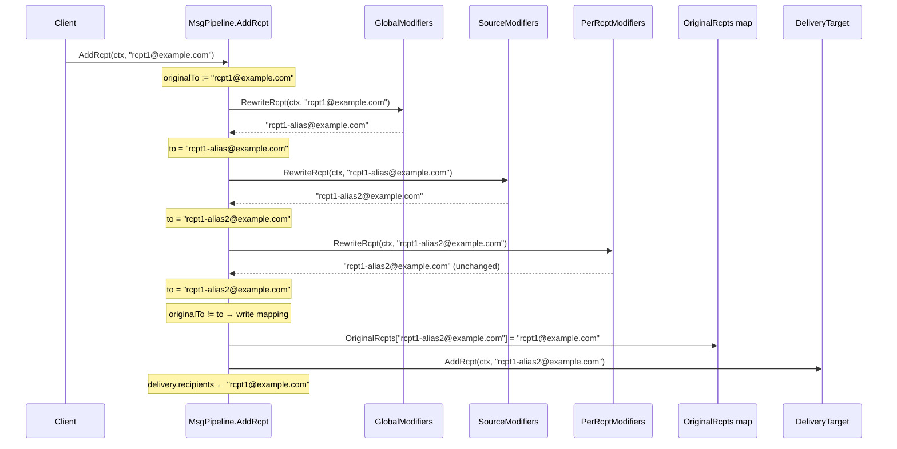
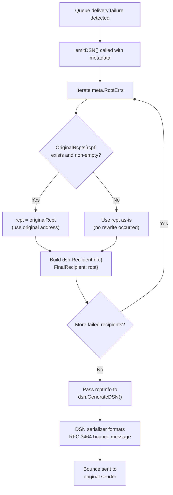

# Maddy Mail Server: Tracing Recipient Address Transformation Tracking

## Introduction

### The Question

A colleague described how the maddy mail server tracks recipient address rewrites during message delivery. Their explanation contained four specific claims:

1. **"When aliases rewrite addresses, the system maintains a 'forward mapping' that stores what each original address was transformed into."**
2. **"You can look up `user@domain.com` and find it became `alias@domain.com`."**
3. **"This mapping is built incrementally by each modifier as it runs, creating a chain of all intermediate transformations."**
4. **"Something about using this for bounces."**

An independent search of `internal/modify/` and `internal/dsn/` — the two packages most intuitively associated with "modifiers" and "bounces" — turned up nothing related to address tracking. This document traces the actual mechanism through the codebase, cites exact file paths and line numbers, and directly contrasts each claim with the source-of-truth code.

### Investigation Approach

Every factual statement below is grounded in a specific source file and line number from the maddy repository. The investigation follows the data: starting with the data structure definition, tracing how it is populated, examining where it is consumed, and finally comparing the actual behavior against the colleague's claims. Four key test functions are cited as executable proof of the documented behavior.

### Terminology

Throughout this document:

- **"original address"** = the recipient address as submitted by the client (before any rewrites)
- **"final address"** = the recipient address after all modifier rewrites have been applied
- **"reverse mapping"** = a mapping keyed by the final address, returning the original address (the actual direction used by maddy)

---

## The Actual Data Structure: `OriginalRcpts`

### Rationale: Where to Look

The tracking mechanism does not live in any individual modifier package (`internal/modify/`) or the DSN serializer (`internal/dsn/`). Instead, it lives in the shared message metadata structure that flows through the entire delivery pipeline. This makes architectural sense: the metadata must be accessible to every component — the pipeline that populates it, the queue that uses it for bounce generation, and the LMTP layer that uses it for status reporting.

### Where It Lives

The data structure is defined in `internal/module/msgmetadata.go`, inside the `MsgMetadata` struct (line 55). This struct carries all message-level state through the delivery pipeline.

**Source:** `internal/module/msgmetadata.go`, lines 55–105

The critical field is `OriginalRcpts` at line 89:

```go
OriginalRcpts map[string]string
```

### The Direction: Final → Original (Not Forward)

The comment at lines 80–88 defines the field's purpose and direction unambiguously. The key design points stated in the comment are:

1. The mapping goes **from the final recipient to the recipient that was presented by the client** — that is, the map key is the post-rewrite address, and the value is the pre-rewrite address.
2. `MsgPipeline` is responsible for updating this field when recipient modifiers are executed.
3. The field is intended for use when reporting information back to the client (for example, via DSN) to prevent disclosing information about aliases.

**Source:** `internal/module/msgmetadata.go`, lines 80–89

This means the direction is:

```
OriginalRcpts[finalAddress] = originalAddress
```

For example, if a client sends to `user@domain.com` and modifiers rewrite it to `alias@domain.com`, the map entry is:

```
OriginalRcpts["alias@domain.com"] = "user@domain.com"
```

You look up the **final** address and get back the **original**. This is a **reverse mapping** — the opposite of what the colleague described.

### Why It Lives in `MsgMetadata`

The `MsgMetadata` struct (line 55) is the shared message metadata object that flows through the entire pipeline. Placing `OriginalRcpts` here (rather than in a modifier or DSN package) ensures that:

- The pipeline orchestrator (`internal/msgpipeline/`) can populate it after running modifiers
- The queue (`internal/target/queue/`) can read it when generating DSN bounce messages
- The LMTP status reporting layer can read it when reverse-translating addresses for per-recipient status reports
- The `DeepCopy` method at line 112 ensures the map is properly handled when metadata is duplicated

**Source:** `internal/module/msgmetadata.go`, lines 55, 112

---

## How the Mapping is Built: The `AddRcpt` Flow

### Rationale: Why the Pipeline, Not Individual Modifiers

The mapping is not built by individual modifiers. It is built by the pipeline orchestrator in a single step after all modifier phases have completed. This is an explicit architectural decision documented in the modifier interface contract:

> "MsgPipeline will take of populating MsgMeta.OriginalRcpts. RewriteRcpt doesn't do it."

**Source:** `internal/module/modifier.go`, lines 49–50

This comment (note the minor typo "take of" for "take care of") explicitly tells modifier authors that they are **not** responsible for tracking address changes — the pipeline handles it centrally.

### Initialization

In the `MsgPipeline.Start()` method, the map is lazily initialized if it doesn't already exist:

```go
if msgMeta.OriginalRcpts == nil {
    msgMeta.OriginalRcpts = map[string]string{}
}
```

**Source:** `internal/msgpipeline/msgpipeline.go`, lines 90–92

### Step-by-Step Trace of `AddRcpt`

The `AddRcpt` method (line 227) is where all the action happens. Here is the complete flow:

**Step 1 — Capture the original address (line 235):**

```go
originalTo := to
```

Before any modifier runs, the original recipient address is saved in a local variable. This is the only snapshot taken of the pre-rewrite address.

**Source:** `internal/msgpipeline/msgpipeline.go`, line 235

**Step 2 — Global modifiers rewrite (lines 237–242):**

```go
newTo, err := dd.globalModifiersState.RewriteRcpt(ctx, to)
// ... error handling ...
to = newTo
```

The `globalModifiersState` is a `modify.Group` that chains multiple modifiers serially. Each modifier in the group receives the output of the previous one as input (`internal/modify/group.go`, lines 49–57). The result overwrites `to`.

**Source:** `internal/msgpipeline/msgpipeline.go`, lines 237–242; `internal/modify/group.go`, lines 49–57

**Step 3 — Source modifiers rewrite (lines 243–248):**

```go
newTo, err = dd.sourceModifiersState.RewriteRcpt(ctx, to)
// ... error handling ...
to = newTo
```

A second group of modifiers (selected based on the sender address) rewrites `to` again.

**Source:** `internal/msgpipeline/msgpipeline.go`, lines 243–248

**Step 4 — Per-recipient modifiers rewrite (lines 269–280):**

```go
rcptModifiersState, err := dd.getRcptModifiers(ctx, rcptBlock, to)
// ...
newTo, err = rcptModifiersState.RewriteRcpt(ctx, to)
// ...
to = newTo
```

A third group of modifiers (selected based on the recipient address) rewrites `to` a final time.

**Source:** `internal/msgpipeline/msgpipeline.go`, lines 269–280

**Step 5 — The single-assignment write (lines 288–289):**

```go
if originalTo != to {
    dd.msgMeta.OriginalRcpts[to] = originalTo
}
```

**This is the critical line.** After all three modifier phases have completed, if the address was actually changed, a single map entry is written: the key is `to` (the final address after all rewrites), and the value is `originalTo` (the address before any rewrites). There is no incremental building. There is no chain of intermediates. Only the first and last addresses are recorded.

**Source:** `internal/msgpipeline/msgpipeline.go`, lines 288–289

**Step 6 — Delivery dispatch (lines 292–302):**

```go
for _, tgt := range rcptBlock.targets {
    delivery, err := dd.getDelivery(ctx, tgt)
    // ...
    if err := delivery.AddRcpt(ctx, to); err != nil {
        return wrapErr(err)
    }
    delivery.recipients = append(delivery.recipients, originalTo)
}
```

The final `to` is passed to downstream delivery targets, while `originalTo` is saved in `delivery.recipients` for later use in status reporting.

**Source:** `internal/msgpipeline/msgpipeline.go`, lines 292–302

### Sequence Diagram: The Complete `AddRcpt` Flow



**Key takeaway:** The intermediate address `rcpt1-alias@example.com` (produced by the global modifier but consumed by the source modifier) is never recorded in `OriginalRcpts`. Only the original (`rcpt1@example.com`) and the final (`rcpt1-alias2@example.com`) are stored.

---

## Why You Didn't Find It in `modify/` or `dsn/`

### Rationale: The Separation of Concerns

The maddy codebase enforces a clean separation of concerns between three roles:

1. **Modifiers** (`internal/modify/`) — pure address transformers that rewrite addresses
2. **Pipeline** (`internal/msgpipeline/`) — the orchestrator that manages bookkeeping
3. **DSN** (`internal/dsn/`) — a pure serializer that formats bounce messages

The tracking of address transformations is the pipeline's responsibility — not the modifiers' and not the DSN package's.

### The Modifier Contract

The modifier interface in `internal/module/modifier.go` defines the `RewriteRcpt` method (line 45) and includes an explicit contract comment at lines 49–50:

> "MsgPipeline will take of populating MsgMeta.OriginalRcpts. RewriteRcpt doesn't do it."

**Source:** `internal/module/modifier.go`, lines 49–50

This tells every modifier implementor: you transform addresses, the pipeline tracks the transformation. You never need to — and should not — touch `OriginalRcpts`.

### What Modifiers Actually Do (Pure Rewriting)

Examining the modifier implementations confirms this:

**`internal/modify/alias_file.go` — `RewriteRcpt` (lines 257–296):**
Looks up the address in an alias map. If found, returns the replacement. If not, tries mailbox-only lookup. Returns the (possibly modified) address. There is zero reference to `OriginalRcpts` anywhere in this file.

**Source:** `internal/modify/alias_file.go`, lines 257–296

**`internal/modify/replace_addr.go` — `RewriteRcpt` (lines 137–142):**
Applies string or regex replacement on the address. Returns the result. Zero reference to `OriginalRcpts`.

**Source:** `internal/modify/replace_addr.go`, lines 137–142

**`internal/modify/group.go` — `RewriteRcpt` (lines 49–57):**
Chains multiple modifiers serially, passing the output of one as the input to the next. Pure composition with no bookkeeping.

**Source:** `internal/modify/group.go`, lines 49–57

### What the DSN Package Actually Does (Pure Serialization)

`internal/dsn/dsn.go` is a pure serializer implementing RFC 3464 and RFC 3462 (as stated in the package comment at lines 1–4). It defines the `RecipientInfo` struct (line 97) with a `FinalRecipient string` field (line 98), and the `GenerateDSN` function serializes this into a properly formatted DSN message.

Critically, by the time the DSN serializer receives `RecipientInfo`, the address has **already been reverse-translated** by the queue's `emitDSN()` method (covered in the next section). The DSN package itself has zero references to `OriginalRcpts`.

**Source:** `internal/dsn/dsn.go`, lines 1–4, 97–98

### Codebase-Wide Evidence

A grep for `OriginalRcpts` across all `.go` files yields exactly **18 occurrences** across **5 files**:

| File | Occurrences | Role |
|------|-------------|------|
| `internal/module/msgmetadata.go` | 2 | Field definition and comment |
| `internal/msgpipeline/msgpipeline.go` | 4 | Initialization, population, and statusCollector usage |
| `internal/msgpipeline/modifier_test.go` | 8 | Test assertions verifying the mapping |
| `internal/target/queue/queue.go` | 2 | DSN emission reverse-translation |
| `internal/target/queue/queue_test.go` | 1 | DSN test setup |

**Zero occurrences** in `internal/modify/` or `internal/dsn/`.

---

## How It's Used for Bounces

### Rationale: The Bounce Problem

When a message is forwarded through an alias (e.g., `user@domain.com` → `alias@internal.com`) and delivery fails, the bounce message (DSN) must be sent back to the original sender. The bounce must reference the address the sender originally used (`user@domain.com`), not the internal alias (`alias@internal.com`). Disclosing internal aliases in bounce messages is a privacy violation.

`OriginalRcpts` solves this problem by providing a reverse lookup: given the final (internal) address, recover the original (external) address.

### Queue's `emitDSN()` Method

When all delivery attempts for a queued message fail, the queue generates a DSN bounce message. The `emitDSN()` method in `internal/target/queue/queue.go` (starting at line 849) iterates over failed recipients and reverse-translates their addresses using `OriginalRcpts`:

```go
rcptInfo := make([]dsn.RecipientInfo, 0, len(meta.RcptErrs))
for rcpt, err := range meta.RcptErrs {
    if meta.MsgMeta.OriginalRcpts != nil {
        originalRcpt := meta.MsgMeta.OriginalRcpts[rcpt]
        if originalRcpt != "" {
            rcpt = originalRcpt
        }
    }

    rcptInfo = append(rcptInfo, dsn.RecipientInfo{
        FinalRecipient: rcpt,
        Action:         dsn.ActionFailed,
        Status:         err.EnhancedCode,
        DiagnosticCode: err,
    })
}
```

**Source:** `internal/target/queue/queue.go`, lines 882–897

For each failed recipient (`rcpt`), the code:
1. Checks if `OriginalRcpts` exists (nil-safe)
2. Looks up `OriginalRcpts[rcpt]` — using the **final** address as the key
3. If an original address is found, replaces `rcpt` with it
4. Constructs the `RecipientInfo` with the (possibly replaced) address as `FinalRecipient`

The result: the DSN serializer receives the **original** address, and the internal alias is never disclosed.

### `statusCollector` for LMTP Partial Delivery

For LMTP delivery (which supports per-recipient status reporting), the pipeline wraps the status collector to perform the same reverse-translation in real time.

The `statusCollector` struct (lines 346–349) and its `SetStatus` method (lines 351–357):

```go
type statusCollector struct {
    originalRcpts map[string]string
    wrapped       module.StatusCollector
}

func (sc statusCollector) SetStatus(rcptTo string, err error) {
    original, ok := sc.originalRcpts[rcptTo]
    if ok {
        rcptTo = original
    }
    sc.wrapped.SetStatus(rcptTo, err)
}
```

**Source:** `internal/msgpipeline/msgpipeline.go`, lines 346–357

The comment at lines 338–345 explains the rationale: delivery targets see modified (post-rewrite) addresses, but statuses must be reported using the original values. The `statusCollector` bridges this gap.

**Source:** `internal/msgpipeline/msgpipeline.go`, lines 338–345

### Usage in `BodyNonAtomic`

When the pipeline dispatches to a partial delivery target, it wraps the caller's `StatusCollector` with `statusCollector`:

```go
partDelivery.BodyNonAtomic(ctx, statusCollector{
    originalRcpts: dd.msgMeta.OriginalRcpts,
    wrapped:       c,
}, header, body)
```

**Source:** `internal/msgpipeline/msgpipeline.go`, lines 391–394

### DSN Emission Flowchart



---

## Colleague's Claims vs. Reality

### Claim 1: "Forward Mapping" Storing What Each Original Was Transformed Into

**What was claimed:** The system maintains a "forward mapping" — you provide an original address and get the transformed result.

**What the code actually does:** The mapping is **reversed**. The key is the **final** (post-rewrite) address, and the value is the **original** (pre-rewrite) address. You look up by final address and get back the original.

**Why the direction matters:** The mapping is designed for reverse-translation — given a final address that downstream systems work with, recover the original address the client submitted. This serves DSN bounce generation and LMTP status reporting, both of which need to report back using the original address.

**Evidence:**
- The comment at `internal/module/msgmetadata.go`, lines 80–81, states the mapping goes "from the final recipient to the recipient that was presented by the client."
- The assignment at `internal/msgpipeline/msgpipeline.go`, line 289, writes `OriginalRcpts[to] = originalTo` where `to` is the final address after all rewrites.
- The lookup at `internal/target/queue/queue.go`, line 885, reads `originalRcpt := meta.MsgMeta.OriginalRcpts[rcpt]` where `rcpt` is the final address.

### Claim 2: "Look Up `user@domain.com` and Find It Became `alias@domain.com`"

**What was claimed:** You supply the original address as the key and retrieve the alias it was transformed into.

**What the code actually does:** The lookup is inverted. You supply `alias@domain.com` (the final address) as the key and retrieve `user@domain.com` (the original) as the value.

**Evidence:**
- `internal/target/queue/queue.go`, line 885: `originalRcpt := meta.MsgMeta.OriginalRcpts[rcpt]` — `rcpt` is the final address, `originalRcpt` is the original.
- `internal/msgpipeline/msgpipeline.go`, line 352: `original, ok := sc.originalRcpts[rcptTo]` — `rcptTo` is the final address, `original` is the original.
- Test assertion at `internal/msgpipeline/modifier_test.go`, line 285: `target.Messages[0].MsgMeta.OriginalRcpts["rcpt1-alias@example.com"]` — the key is the alias (final), the expected value is `"rcpt1@example.com"` (original).

### Claim 3: "Mapping Built Incrementally by Each Modifier, Creating a Chain of Intermediates"

**What was claimed:** Each modifier adds to the mapping as it runs, building a chain of all intermediate transformations.

**What the code actually does:** The mapping is **not** built incrementally. It is a **single assignment** at `internal/msgpipeline/msgpipeline.go`, line 289, that happens **after** all three modifier phases (global, source, per-recipient) have completed. Only the first (original) and last (final) addresses are stored. Intermediate addresses produced between modifier phases are **not** recorded.

**Why this design:** The modifier contract (`internal/module/modifier.go`, lines 49–50) explicitly states that modifiers do not populate `OriginalRcpts`. The pipeline captures the original address once at the start (line 235: `originalTo := to`), lets all modifiers run freely, then writes the single mapping entry at the end. Intermediate values are deliberately discarded — the only information needed for DSN/LMTP is the first-to-last relationship.

**Evidence:**
- `internal/msgpipeline/msgpipeline.go`, line 235: `originalTo := to` — captured once before any modifier runs.
- Lines 237–280: Three modifier phases rewrite `to` sequentially without touching `OriginalRcpts`.
- Line 289: Single conditional write `dd.msgMeta.OriginalRcpts[to] = originalTo` — happens after all phases.
- `internal/module/modifier.go`, lines 49–50: Contract states modifiers do not populate the mapping.
- Test at `internal/msgpipeline/modifier_test.go`, lines 299–347 (`TestMsgPipeline_RcptModifier_OriginalRcpt_Multiple`): Two chained modifiers rewrite `rcpt1@example.com` → `rcpt1-alias@example.com` → `rcpt1-alias2@example.com`. The test asserts `OriginalRcpts["rcpt1-alias2@example.com"] == "rcpt1@example.com"` — only first-to-last. The intermediate `rcpt1-alias@example.com` does not appear as a key or value in the map.

### Claim 4: "Something About Using This for Bounces"

**What was claimed:** The mapping is used for bounces.

**What the code actually does:** This is **correct**, with important nuance:

1. The queue's `emitDSN()` method (`internal/target/queue/queue.go`, lines 882–897) uses `OriginalRcpts` to reverse-translate final addresses back to original addresses in DSN bounce recipient reports, preventing alias disclosure.
2. The pipeline's `statusCollector` (`internal/msgpipeline/msgpipeline.go`, lines 346–357) uses `OriginalRcpts` to reverse-translate addresses for LMTP partial delivery status reporting.
3. The purpose of both paths is **alias privacy** — ensuring that the external sender only sees the address they originally submitted, not any internal alias the system resolved to.

**Evidence:**
- `internal/target/queue/queue.go`, lines 882–897: `emitDSN()` iterates failed recipients, looks up `OriginalRcpts[rcpt]`, and substitutes the original address into `RecipientInfo.FinalRecipient`.
- `internal/msgpipeline/msgpipeline.go`, lines 346–357: `statusCollector.SetStatus()` reverse-translates `rcptTo` before passing to the wrapped collector.
- `internal/module/msgmetadata.go`, lines 86–88: Comment explicitly mentions DSN and alias privacy as the motivation.

### Summary Comparison Table

| # | Colleague's Claim | Reality | Verdict | Key Source |
|---|---|---|---|---|
| 1 | "Forward mapping" (original→final) | **Reverse mapping** (final→original) | ✗ Incorrect | `msgmetadata.go:80–81`, `msgpipeline.go:289` |
| 2 | Look up original, find alias | Look up **alias**, find **original** | ✗ Incorrect (inverted) | `queue.go:885`, `msgpipeline.go:352` |
| 3 | Built incrementally by each modifier | **Single assignment** after all modifiers | ✗ Incorrect | `msgpipeline.go:235,289`, `modifier.go:49–50` |
| 4 | Used for bounces | Used for bounces (DSN + LMTP status) | ✓ Correct | `queue.go:882–897`, `msgpipeline.go:346–357` |

---

## Test Evidence

Four test functions in the repository exercise `OriginalRcpts` behavior. Each test was executed and all pass, confirming the documented behavior.

### Test 1: `TestMsgPipeline_RcptModifier_OriginalRcpt`

**File:** `internal/msgpipeline/modifier_test.go`, line 253

**What it tests:** A single global modifier rewrites two recipients:
- `rcpt1@example.com` → `rcpt1-alias@example.com`
- `rcpt2@example.com` → `rcpt2-alias@example.com`

**Key assertions** (lines 285–292):
```go
original1 := target.Messages[0].MsgMeta.OriginalRcpts["rcpt1-alias@example.com"]
if original1 != "rcpt1@example.com" { ... }
original2 := target.Messages[0].MsgMeta.OriginalRcpts["rcpt2-alias@example.com"]
if original2 != "rcpt2@example.com" { ... }
```

**What it proves:** The mapping direction is final→original. The pipeline correctly tracks single-modifier rewrites for multiple recipients.

### Test 2: `TestMsgPipeline_RcptModifier_OriginalRcpt_Multiple`

**File:** `internal/msgpipeline/modifier_test.go`, line 299

**What it tests:** Two chained modifiers across different phases:
- Global modifier: `rcpt1@example.com` → `rcpt1-alias@example.com`
- Source modifier: `rcpt1-alias@example.com` → `rcpt1-alias2@example.com`

**Key assertions** (lines 340–347):
```go
original1 := target.Messages[0].MsgMeta.OriginalRcpts["rcpt1-alias2@example.com"]
if original1 != "rcpt1@example.com" { ... }
```

**What it proves:** Only the first (original) and last (final) addresses are stored. The intermediate address `rcpt1-alias@example.com` does not appear in the map. This directly disproves Claim 3 (incremental chain building).

### Test 3: `TestMsgPipeline_BodyNonAtomic_ModifiedRcpt`

**File:** `internal/msgpipeline/bodynonatomic_test.go`, line 50

**What it tests:** A modifier rewrites `tester@example.org` → `tester-alias@example.org`. The downstream target returns an error for `tester-alias@example.org`.

**Key assertions** (lines 84–89):
```go
if c["tester@example.org"] == nil {
    t.Fatalf("no error for tester@example.org")
}
```

**What it proves:** The `statusCollector` correctly reverse-translates the final address (`tester-alias@example.org`) back to the original (`tester@example.org`) before reporting the status. The caller sees the error keyed by the original address, not the internal alias.

### Test 4: `TestQueueDSN_RcptRewrite`

**File:** `internal/target/queue/queue_test.go`, line 746

**What it tests:** A queue with pre-populated `OriginalRcpts`:
- `test@example.org` → `test+public@example.com`
- `test2@example.org` → `test2+public@example.com`

All recipients fail delivery, triggering a DSN bounce.

**Key assertions** (lines 812–817):
```go
if bytes.Contains(msg.Body, []byte("test@example.org")) ||
   bytes.Contains(msg.Body, []byte("test2@example.org")) {
    t.Errorf("DSN contents mention real final addresses")
}
if !bytes.Contains(msg.Body, []byte("test+public@example.com")) ||
   !bytes.Contains(msg.Body, []byte("test2+public@example.com")) {
    t.Errorf("DSN contents do not mention original addresses")
}
```

**What it proves:** The `emitDSN()` method correctly uses `OriginalRcpts` to substitute original addresses into the bounce message. The internal/final addresses (`test@example.org`, `test2@example.org`) do not appear in the DSN body — only the original addresses (`test+public@example.com`, `test2+public@example.com`) do. This confirms the alias privacy protection.

### Test Execution Results

| Test Command | Result | Duration |
|---|---|---|
| `go test ./internal/msgpipeline/ -run "TestMsgPipeline_RcptModifier_OriginalRcpt" -v -count=1` | **PASS** (2 tests) | 0.005s |
| `go test ./internal/msgpipeline/ -run "TestMsgPipeline_BodyNonAtomic_ModifiedRcpt" -v -count=1` | **PASS** | 0.005s |
| `go test ./internal/target/queue/ -run "TestQueueDSN_RcptRewrite" -v -count=1` | **PASS** | 1.009s |

All tests pass, confirming every behavior documented above.

---

## Key Source File Citations

| File | Key Lines | Role |
|---|---|---|
| `internal/module/msgmetadata.go` | 55–105, esp. 80–89 | `OriginalRcpts` field definition; direction comment; `MsgMetadata` struct |
| `internal/module/modifier.go` | 32–63, esp. 49–50 | `ModifierState` interface; contract that pipeline owns tracking |
| `internal/module/partial_delivery.go` | 10–27, esp. 16–18 | `StatusCollector` interface; note that `rcptTo` should match `AddRcpt` value |
| `internal/msgpipeline/msgpipeline.go` | 79–100, 227–305, 338–404 | Pipeline initialization, `AddRcpt` population logic, `statusCollector`, `BodyNonAtomic` |
| `internal/modify/group.go` | 49–57 | Modifier group serial chaining (no tracking) |
| `internal/modify/alias_file.go` | 257–296 | Alias file modifier (pure rewriter, no tracking) |
| `internal/modify/replace_addr.go` | 137–142 | Replace address modifier (pure rewriter, no tracking) |
| `internal/dsn/dsn.go` | 1–4, 97–98 | DSN `RecipientInfo` struct and package purpose (pure serializer) |
| `internal/target/queue/queue.go` | 849–897 | `emitDSN()` consuming `OriginalRcpts` for bounce generation |
| `internal/msgpipeline/modifier_test.go` | 253–297, 299–352 | Tests for single and chained modifier `OriginalRcpts` mapping |
| `internal/msgpipeline/bodynonatomic_test.go` | 50–90 | Test for LMTP status reverse-translation via `statusCollector` |
| `internal/target/queue/queue_test.go` | 746–818 | Test for DSN bounce address reverse-translation |
| `internal/testutils/modifier.go` | 12–105 | Mock modifier with configurable `RcptTo` map |
| `internal/testutils/target.go` | (full file) | Mock delivery target with partial delivery support |
| `HACKING.md` | (full file) | Developer guide with module architecture overview |
| `internal/README.md` | (full file) | Package directory structure guide |
