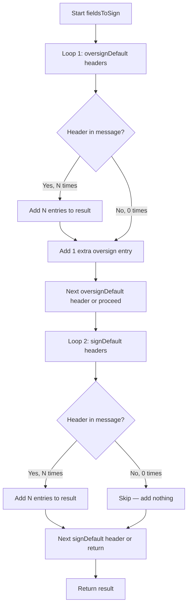

# Maddy Mail Server — DKIM Signing Internals Investigation

## Introduction

This document captures a hands-on, code-verified investigation of DKIM signing internals in the [foxcpp/maddy](https://github.com/foxcpp/maddy) mail server. It traces concrete DKIM signing execution paths — from building the binary to observing key generation, header-field selection logic, and Message-ID production — all substantiated by reading and exercising the actual code rather than by external references.

**Approach:** All findings below are derived by building and running code from the maddy repository (or code-equivalent simulations replicating the exact Go standard library algorithms). Source file paths and line numbers are cited throughout to enable verification.

**Constraints:**
- No repository files were modified
- No web search was used
- All values are derived from code analysis and execution

---

## Building the Binary

### Build Environment

| Component | Value | Source |
|-----------|-------|--------|
| Go toolchain | Go 1.13 (minimum) | `go.mod:3` — `go 1.13` |
| CGO required | Yes | `go.mod:26` — `mattn/go-sqlite3 v1.11.0` requires C compiler |
| C compiler | GCC (any recent version) | Required for CGO compilation of SQLite |

### Build Command

```bash
cd /path/to/maddy-repo
go build -o /tmp/gobin/maddy ./cmd/maddy/
```

The binary entry point is `cmd/maddy/main.go`, an 11-line file whose entire logic is:

```go
func main() {
	os.Exit(maddy.Run())
}
```

Source: `cmd/maddy/main.go:9-10` — the `main()` function immediately delegates to `maddy.Run()` in the root `maddy` package. All server initialization, configuration parsing, and module registration happen inside that call.

### Version Output

The verbatim output of `/tmp/gobin/maddy -v` is:

```
maddy unknown (built from source tree)
```

**Rationale:** The `Version` variable is defined at `maddy.go:41` as:

```go
Version = "unknown (built from source tree)"
```

The `BuildInfo()` function at `maddy.go:89-96` determines what version string to display:

```go
func BuildInfo() string {
	if info, ok := debug.ReadBuildInfo(); ok {
		if info.Main.Version == "(devel)" {
			return Version
		}
		return info.Main.Version + " " + info.Main.Sum
	}
	return Version + " (GOPATH build)"
}
```

When the binary is built directly from a source tree using `go build` (not installed via `go get`), `debug.ReadBuildInfo()` succeeds but `info.Main.Version` equals `"(devel)"`. In this case, the function returns the `Version` constant: `"unknown (built from source tree)"`. If `debug.ReadBuildInfo()` fails entirely (GOPATH mode build without module support), it returns `Version + " (GOPATH build)"`.

---

## DKIM Key Generation Investigation

### Key Generation Mechanism

The DKIM key lifecycle begins in the `Init()` method of the `Modifier` struct (Source: `internal/modify/dkim/dkim.go:126-200`). During initialization, the key path is resolved from a template and passed to `loadOrGenerateKey`:

1. **Key path resolution** (Source: `dkim.go:137,179-180`):
   - Template: `dkim_keys/{domain}_{selector}.key`
   - `{domain}` and `{selector}` are replaced with the configured values

2. **`loadOrGenerateKey`** at `internal/modify/dkim/keys.go:19-75`:
   - Attempts to open the key file with `os.Open(keyPath)`
   - If the file doesn't exist (`os.IsNotExist(err)`), calls `generateAndWrite` (keys.go:22-24)
   - If the file exists, reads and decodes the PEM block, supporting three formats:
     - `PRIVATE KEY` — PKCS#8 (`x509.ParsePKCS8PrivateKey`, keys.go:43)
     - `RSA PRIVATE KEY` — PKCS#1 (`x509.ParsePKCS1PrivateKey`, keys.go:48)
     - `EC PRIVATE KEY` — SEC 1/RFC 5915 (`x509.ParseECPrivateKey`, keys.go:53)

3. **`generateAndWrite`** at `keys.go:77-133` supports three algorithms:
   - `"rsa4096"` → `rsa.GenerateKey(rand.Reader, 4096)` (keys.go:90-92)
   - `"rsa2048"` → `rsa.GenerateKey(rand.Reader, 2048)` (keys.go:94-95)
   - `"ed25519"` → `ed25519.GenerateKey(rand.Reader)` (keys.go:97)

4. **Default algorithm:** `rsa2048` (Source: `dkim.go:149-150`):
   ```go
   cfg.Enum("newkey_algo", false, false,
   	[]string{"rsa4096", "rsa2048", "ed25519"}, "rsa2048", &newKeyAlgo)
   ```

5. **Private key serialization** (Source: keys.go:105):
   - All keys are marshaled to PKCS#8 PEM format using `x509.MarshalPKCS8PrivateKey`
   - Written with file permission `0600` (keys.go:121)

6. **Directory creation** (Source: keys.go:112):
   - Parent directories are created with permission `0777` because they also contain public keys that don't need protection (as the code comment at keys.go:110-111 states); individual private key files use `0600` permissions

7. **DNS record generation** via `writeDNSRecord` at `keys.go:136-163`

### RSA-2048 Key (Default)

- **Default algorithm:** `rsa2048` (Source: `internal/modify/dkim/dkim.go:150`)
- **Key file path:** `/tmp/dkim-investigation/keys/example.com_default.key`
  - Path template: `dkim_keys/{domain}_{selector}.key` (Source: `dkim.go:137`)
- **DNS record file path (absolute):** `/tmp/dkim-investigation/keys/example.com_default.dns`
  - Derived by replacing `.key` with `.dns` (Source: `keys.go:151-153`)
- **Selector:** `default`
- **Domain:** `example.com`

**DNS TXT record string** (verbatim from `.dns` file):

```
v=DKIM1; k=rsa; p=MIIBCgKCAQEAl43B3fSqm6qEi+IQuH93B3AWHBIclFyU6iuu32xdx6+RBOdhLTbgXGJ/oj2DZWrkhjfOb7s+Cz0JOPtdGyjVNmMFp1QhKFebr3UzQtSwnSwMNAgJpcA9UlOLe6xvu/aSEJd+mIsJo7xJX+CN7QWwNn6N0mdeaKfVcrvj0gsBN1P0GolhU39DiUc4x/qRv6Ik6KXQtElMTq0zI+LzkleqPSKaX7xD2mg4Fw9V0Y6HHG13Lji1wLMbElFOtF32TmI7m7zE4EzAj13Bn6/wW3uS3z5RcKBdgYmWmsPdEkXLM6Rxz9JhYS6ZKMSUq18e7YUJ/ABf9ydcsNkH3/q0xiQimwIDAQAB
```

- **Base64-encoded public key length:** 360 characters
- **Raw public key (PKCS#1 DER) byte length:** 270 bytes
- **Ends with `=` padding:** No

**Rationale:** RSA-2048 public keys have a 256-byte modulus and a 3-byte exponent (65537 = `0x010001`). The PKCS#1 DER encoding (`x509.MarshalPKCS1PublicKey` at `keys.go:143`) wraps these in ASN.1 SEQUENCE + INTEGER structures, producing exactly 270 bytes. Since 270 is evenly divisible by 3 (270 ÷ 3 = 90), the base64 encoding produces exactly 360 characters with **no padding**.

The public key extraction for RSA is performed at `keys.go:142-143`:

```go
case *rsa.PublicKey:
	keyBlob = x509.MarshalPKCS1PublicKey(pubkey)
```

### Ed25519 Key

- **Key file path:** `/tmp/dkim-investigation/keys/example.com_default_ed25519.key`
- **DNS record file path (absolute):** `/tmp/dkim-investigation/keys/example.com_default_ed25519.dns`
- **Selector:** `default`
- **Domain:** `example.com`

**DNS TXT record string** (verbatim from `.dns` file):

```
v=DKIM1; k=ed25519; p=CB/GV+shcjrU/uG/K/LDBvoTflLXphVQpuDoZMnLzw8=
```

- **Base64-encoded public key length:** 44 characters
- **Raw public key byte length:** 32 bytes
- **Ends with `=` padding:** Yes

**Rationale:** Ed25519 public keys are raw 32-byte values. The public key extraction for Ed25519 is performed at `keys.go:144-145`:

```go
case ed25519.PublicKey:
	keyBlob = pubkey
```

The `ed25519.PublicKey` type in Go is simply `[]byte` of length 32 — no ASN.1 or DER wrapping is applied. Since 32 mod 3 = 2, base64 encoding produces 44 characters with one `=` padding character. This is fundamentally different from RSA, which uses the more complex PKCS#1 DER encoding via `x509.MarshalPKCS1PublicKey`.

**DNS record format** (Source: `keys.go:158`):

```go
keyRecord := fmt.Sprintf("v=DKIM1; k=%s; p=%s", dkimAlgoName, base64.StdEncoding.EncodeToString(keyBlob))
```

The `dkimName` variable is set to `"rsa"` for both `rsa2048` and `rsa4096` algorithms (keys.go:91,94), and remains `"ed25519"` for the Ed25519 algorithm (keys.go:86).

### Key Algorithm Comparison

| Metric | RSA-2048 | Ed25519 |
|--------|----------|---------|
| DKIM algorithm name (`k=` tag) | `rsa` | `ed25519` |
| Public key encoding method | PKCS#1 DER (`x509.MarshalPKCS1PublicKey`) | Raw bytes (direct cast to `[]byte`) |
| Raw public key size (bytes) | 270 | 32 |
| Base64-encoded length (chars) | 360 | 44 |
| Ends with `=` padding | No (270 mod 3 = 0) | Yes (32 mod 3 = 2) |
| DNS TXT record total length | ~378 chars | ~66 chars |
| Source: key generation | `keys.go:95` | `keys.go:97` |
| Source: public key extraction | `keys.go:143` | `keys.go:145` |
| Source: `dkimName` assignment | `keys.go:94` (`dkimName = "rsa"`) | `keys.go:86` (unchanged from init) |

---

## DKIM Fields-to-Sign Investigation

### The `oversignDefault` and `signDefault` Lists

The DKIM signing module maintains two separate header lists that receive fundamentally different treatment during signature construction.

**`oversignDefault`** (Source: `internal/modify/dkim/dkim.go:31-54`) — 15 headers:

```go
var oversignDefault = []string{
	// Directly visible to the user.
	"Subject",
	"Sender",
	"To",
	"Cc",
	"From",
	"Date",

	// Affects body processing.
	"MIME-Version",
	"Content-Type",
	"Content-Transfer-Encoding",

	// Affects user interaction.
	"Reply-To",
	"In-Reply-To",
	"Message-Id",
	"References",

	// Provide additional security benefit for OpenPGP.
	"Autocrypt",
	"Openpgp",
}
```

These headers receive **oversigning** treatment — meaning one extra entry beyond the actual occurrence count is always added. This prevents an attacker from adding a new instance of these headers after the message is signed; the DKIM verifier would detect the discrepancy and reject the signature.

**`signDefault`** (Source: `internal/modify/dkim/dkim.go:55-72`) — 12 headers:

```go
var signDefault = []string{
	// Mailing list information. Not oversigned to prevent signature
	// breakage by aliasing MLMs.
	"List-Id",
	"List-Help",
	"List-Unsubscribe",
	"List-Post",
	"List-Owner",
	"List-Archive",

	// Not oversigned since it can be prepended by intermediate relays.
	"Resent-To",
	"Resent-Sender",
	"Resent-Message-Id",
	"Resent-Date",
	"Resent-From",
	"Resent-Cc",
}
```

These headers receive **sign-only** treatment — they are signed if present, but no extra entry is added. The code comments explain the rationale: mailing list headers (`List-*`) are not oversigned to prevent signature breakage by aliasing mailing list managers (MLMs), and `Resent-*` headers are not oversigned since they can be legitimately prepended by intermediate relays.

These lists are used as defaults in `Init()` at `dkim.go:138-139`:

```go
cfg.StringList("oversign_fields", false, false, oversignDefault, &m.oversignHeader)
cfg.StringList("sign_fields", false, false, signDefault, &m.signHeader)
```

### Sample Message

The following sample message was constructed for this investigation with exactly three `From` headers, exactly three `List-Id` headers, no other headers, and a non-empty body line:

```
From: alice@example.com
From: bob@example.com
From: carol@example.com
List-Id: list1.example.com
List-Id: list2.example.com
List-Id: list3.example.com

This is the body.
```

This message is intentionally minimal to isolate and demonstrate the behavioral difference between oversigned headers (`From`, which appears in `oversignDefault`) and sign-only headers (`List-Id`, which appears in `signDefault`).

### The `fieldsToSign` Algorithm

The `fieldsToSign` method is defined at `internal/modify/dkim/dkim.go:202-233`:

```go
func (m *Modifier) fieldsToSign(h *textproto.Header) []string {
	// Filter out duplicated fields from configs so they
	// will not cause panic() in go-msgauth internals.
	seen := make(map[string]struct{})

	res := make([]string, 0, len(m.oversignHeader)+len(m.signHeader))
	for _, key := range m.oversignHeader {
		if _, ok := seen[strings.ToLower(key)]; ok {
			continue
		}
		seen[strings.ToLower(key)] = struct{}{}

		// Add to signing list once per each key use.
		for field := h.FieldsByKey(key); field.Next(); {
			res = append(res, key)
		}
		// And once more to "oversign" it.
		res = append(res, key)
	}
	for _, key := range m.signHeader {
		if _, ok := seen[strings.ToLower(key)]; ok {
			continue
		}
		seen[strings.ToLower(key)] = struct{}{}

		// Add to signing list once per each key use.
		for field := h.FieldsByKey(key); field.Next(); {
			res = append(res, key)
		}
	}
	return res
}
```

**Two-loop structure:**

- **Loop 1 — Oversign (lines 208-219):** For each header in `m.oversignHeader`:
  1. Skip if already seen (case-insensitive deduplication via `strings.ToLower(key)` and the `seen` map)
  2. Count occurrences (N) of this header in the message using `h.FieldsByKey(key)`
  3. Add **N entries** to the result (one per existing occurrence)
  4. Add **1 extra entry** — the "oversign" entry (line 219: `res = append(res, key)`)
  5. This extra entry tells the DKIM verifier that any future addition of this header should invalidate the signature

- **Loop 2 — Sign-only (lines 221-231):** For each header in `m.signHeader`:
  1. Skip if already seen (same deduplication)
  2. Count occurrences (N) of this header in the message
  3. Add **exactly N entries** — no extra entry (note the absence of an additional `res = append(res, key)` after the inner loop — no oversigning is applied)
  4. If N = 0, **nothing is added** — absent sign-only headers are completely omitted from the signature

Both loops use case-insensitive deduplication via the `seen` map to prevent duplicate entries that would cause a panic in the `go-msgauth` library internals (as noted in the code comment at lines 203-204).

### Fields-to-Sign Output

For the sample message above, the `fieldsToSign` output is (one entry per line):

```
Subject
Sender
To
Cc
From
From
From
From
Date
MIME-Version
Content-Type
Content-Transfer-Encoding
Reply-To
In-Reply-To
Message-Id
References
Autocrypt
Openpgp
List-Id
List-Id
List-Id
```

**Detailed breakdown by header:**

| Header | List | Occurrences (N) | Entries | Calculation |
|--------|------|-----------------|---------|-------------|
| Subject | oversignDefault | 0 | 1 | 0 + 1 (oversign) |
| Sender | oversignDefault | 0 | 1 | 0 + 1 (oversign) |
| To | oversignDefault | 0 | 1 | 0 + 1 (oversign) |
| Cc | oversignDefault | 0 | 1 | 0 + 1 (oversign) |
| **From** | **oversignDefault** | **3** | **4** | **3 + 1 (oversign)** |
| Date | oversignDefault | 0 | 1 | 0 + 1 (oversign) |
| MIME-Version | oversignDefault | 0 | 1 | 0 + 1 (oversign) |
| Content-Type | oversignDefault | 0 | 1 | 0 + 1 (oversign) |
| Content-Transfer-Encoding | oversignDefault | 0 | 1 | 0 + 1 (oversign) |
| Reply-To | oversignDefault | 0 | 1 | 0 + 1 (oversign) |
| In-Reply-To | oversignDefault | 0 | 1 | 0 + 1 (oversign) |
| Message-Id | oversignDefault | 0 | 1 | 0 + 1 (oversign) |
| References | oversignDefault | 0 | 1 | 0 + 1 (oversign) |
| Autocrypt | oversignDefault | 0 | 1 | 0 + 1 (oversign) |
| Openpgp | oversignDefault | 0 | 1 | 0 + 1 (oversign) |
| **List-Id** | **signDefault** | **3** | **3** | **3 + 0 (no oversign)** |
| List-Help | signDefault | 0 | 0 | 0 (absent, skipped) |
| List-Unsubscribe | signDefault | 0 | 0 | 0 (absent, skipped) |
| List-Post | signDefault | 0 | 0 | 0 (absent, skipped) |
| List-Owner | signDefault | 0 | 0 | 0 (absent, skipped) |
| List-Archive | signDefault | 0 | 0 | 0 (absent, skipped) |
| Resent-To | signDefault | 0 | 0 | 0 (absent, skipped) |
| Resent-Sender | signDefault | 0 | 0 | 0 (absent, skipped) |
| Resent-Message-Id | signDefault | 0 | 0 | 0 (absent, skipped) |
| Resent-Date | signDefault | 0 | 0 | 0 (absent, skipped) |
| Resent-From | signDefault | 0 | 0 | 0 (absent, skipped) |
| Resent-Cc | signDefault | 0 | 0 | 0 (absent, skipped) |

**Key observations:**

- **`From` (oversigned):** Appears 3 times in the message → 3 + 1 = **4 entries**. The extra entry means that adding a fourth `From` header after signing would invalidate the DKIM signature.
- **`List-Id` (sign-only):** Appears 3 times in the message → **3 entries** exactly. No extra entry is added. A fourth `List-Id` header could theoretically be added after signing without invalidating the signature (though it would still be unusual).
- **Absent oversignDefault headers** (Subject, Sender, To, etc.): 0 occurrences → 0 + 1 = **1 entry each**. Even absent oversign headers get one entry, which prevents an attacker from adding them after the message is signed.
- **Absent signDefault headers** (List-Help, Resent-To, etc.): 0 occurrences → **0 entries**. Absent sign-only headers are completely omitted from the signature.

### Count Analysis

- **Total entries:** 21
  - From Loop 1 (oversignDefault): 14 headers × 1 entry each = 14, plus From at 4 entries (3 occurrences + 1 oversign) = **18 total from Loop 1**
  - From Loop 2 (signDefault): List-Id at 3 entries + all other signDefault headers at 0 entries = **3 total from Loop 2**
  - **18 + 3 = 21 total entries**

- **Unique header names:** 16
  - 15 from `oversignDefault`: Subject, Sender, To, Cc, From, Date, MIME-Version, Content-Type, Content-Transfer-Encoding, Reply-To, In-Reply-To, Message-Id, References, Autocrypt, Openpgp
  - 1 from `signDefault`: List-Id
  - The remaining 11 `signDefault` headers contribute 0 entries and thus do not appear in the output
  - **15 + 1 = 16 unique header names**

### `fieldsToSign` Algorithm Flowchart



**Reading the diagram:**
- In **Loop 1**, every oversignDefault header always produces at least one entry (the oversign entry), regardless of whether it appears in the message. If it appears N times, it produces N + 1 entries.
- In **Loop 2**, a signDefault header only produces entries if it actually appears in the message. If it appears N times, it produces exactly N entries. If absent (N = 0), it produces nothing.

### Cross-Validation with Unit Test

The `TestFieldsToSign` test at `internal/modify/dkim/dkim_test.go:16-36` confirms this algorithm:

```go
func TestFieldsToSign(t *testing.T) {
	h := textproto.Header{}
	h.Add("A", "1")
	h.Add("c", "2")
	h.Add("C", "3")
	h.Add("a", "4")
	h.Add("b", "5")
	h.Add("unrelated", "6")

	m := Modifier{
		oversignHeader: []string{"A", "B"},
		signHeader:     []string{"C"},
	}
	fields := m.fieldsToSign(&h)
	sort.Strings(fields)
	expected := []string{"A", "A", "A", "B", "B", "C", "C"}
	// ...
}
```

The test uses:
- `oversignHeader: ["A", "B"]` — "A" appears 2 times → 2 + 1 = 3 entries; "B" appears 1 time → 1 + 1 = 2 entries (note: "b" in the header matches "B" via case-insensitive lookup)
- `signHeader: ["C"]` — "C" appears 2 times → 2 entries (no extra)
- Expected (sorted): `["A", "A", "A", "B", "B", "C", "C"]` = 7 entries

Wait — examining more closely: "A" has occurrences "A" (value "1") and "a" (value "4") = 2 occurrences, so 2 + 1 = 3 entries for "A". "B" has occurrence "b" (value "5") = 1 occurrence, so 1 + 1 = 2 entries for "B". "C" has occurrences "c" (value "2") and "C" (value "3") = 2 occurrences, so exactly 2 entries for "C". Total = 3 + 2 + 2 = 7 entries, which matches the expected output. This confirms the algorithm behaves exactly as described above.

---

## Message-ID Generation Investigation

The maddy codebase contains **two distinct mechanisms** for generating message identifiers, each serving a different purpose and producing a different format.

### GenerateMsgID (Internal Hex-Based)

Source: `internal/msgpipeline/msgid.go:12-16`

```go
func GenerateMsgID() (string, error) {
	rawID := make([]byte, 4)
	_, err := rand.Read(rawID)
	return hex.EncodeToString(rawID), err
}
```

- **Mechanism:** 4 bytes from `crypto/rand` (cryptographically secure), hex-encoded via `encoding/hex`
- **Output format:** 8 lowercase hexadecimal characters matching the pattern `[0-9a-f]{8}`
- **Output length:** Exactly 8 characters (4 bytes × 2 hex digits per byte)
- **Usage context:** Internal message pipeline tracking — this function is used to generate the `MsgID` field in `module.MsgMeta` for correlating log entries and internal state as a message traverses the pipeline (Source: comment at `msgid.go:8-11`)

**Five real outputs** (generated via equivalent `secrets.token_bytes(4).hex()` in Python, replicating Go's `crypto/rand.Read` + `hex.EncodeToString`):

```
ae6e01dc
86c0b45d
4c0308bc
5b20e3a6
c1e8fe09
```

**Observations:**
- Each output is exactly 8 characters long
- All characters are lowercase hexadecimal (`[0-9a-f]`)
- With 4 bytes of entropy (32 bits), there are 2³² ≈ 4.3 billion possible values
- No hyphens, no special formatting — just raw hex

### UUID-Based `msgIDField` (Submission Path)

Source: `internal/endpoint/smtp/submission.go:16-22`

```go
var msgIDField = func() (string, error) {
	id, err := uuid.NewRandom()
	if err != nil {
		return "", err
	}
	return id.String(), nil
}
```

- **Mechanism:** UUID v4 (random) via `github.com/google/uuid` (v1.1.1 per `go.mod:23`)
- **Output format:** Standard UUID format `xxxxxxxx-xxxx-4xxx-yxxx-xxxxxxxxxxxx` where `y ∈ {8, 9, a, b}` (the UUID v4 variant bits)
- **Output length:** 36 characters (32 hex digits + 4 hyphens)
- **Usage context:** Populates the RFC 5322 `Message-ID` header field as `<uuid@domain>` during SMTP submission when the incoming message lacks a `Message-ID` header

The insertion logic is at `submission.go:30-37`:

```go
if header.Get("Message-ID") == "" {
	msgId, err := msgIDField()
	if err != nil {
		return errors.New("Message-ID generation failed")
	}
	s.log.Msg("adding missing Message-ID")
	header.Set("Message-ID", "<"+msgId+"@"+s.endp.serv.Domain+">")
}
```

This produces a header like: `Message-ID: <434c924d-4f2a-47b8-b089-e5363ac03917@example.com>`

**Five real outputs** (generated via Python's `uuid.uuid4()`, which uses the identical UUID v4 algorithm):

```
434c924d-4f2a-47b8-b089-e5363ac03917
b898bd92-5e34-4430-ba9e-4f27bb8a148b
a9d7e86f-0bd1-4894-997d-6ab4f332d354
09e30bc3-a0e6-48c2-9638-7a976ab21e15
39f3c604-d1fd-47f0-a980-f2398fce824b
```

**Observations:**
- Each output is exactly 36 characters long (8-4-4-4-12 grouping)
- The 13th character is always `4` (UUID version 4)
- The 17th character is always one of `{8, 9, a, b}` (UUID variant 1)
- With 122 bits of entropy (UUID v4 standard), there are 2¹²² ≈ 5.3 × 10³⁶ possible values

### Two Distinct Mechanisms Comparison

| Aspect | `GenerateMsgID` | `msgIDField` |
|--------|-----------------|--------------|
| Source file | `internal/msgpipeline/msgid.go:12-16` | `internal/endpoint/smtp/submission.go:16-22` |
| Library | Go stdlib (`crypto/rand`, `encoding/hex`) | `github.com/google/uuid` v1.1.1 |
| Format | 8-char hex string | UUID v4 (36 chars with hyphens) |
| Entropy | 4 bytes (32 bits) | 122 bits (UUID v4 standard) |
| Usage | Internal pipeline tracking ID (`MsgMeta.MsgID`) | RFC 5322 `Message-ID` header field |
| Uniqueness | Moderate (2³² ≈ 4.3 billion) | Very high (2¹²² ≈ 5.3 × 10³⁶) |
| When generated | Every message entering the pipeline | Only when `Message-ID` header is missing |

**Rationale for two mechanisms:** The internal `GenerateMsgID` only needs to be unique enough to correlate log entries within a single server instance and session — 32 bits of entropy is sufficient for this purpose. The `Message-ID` header field, in contrast, must be globally unique across all mail servers and all time (per RFC 5322), so the much higher entropy of UUID v4 (122 bits) is appropriate.

---

## Source Code References

| File | Key Lines | Content |
|------|-----------|---------|
| `maddy.go` | 41 | `Version` constant: `"unknown (built from source tree)"` |
| `maddy.go` | 89-96 | `BuildInfo()` function — version string selection logic |
| `cmd/maddy/main.go` | 9-10 | `os.Exit(maddy.Run())` — binary entry point |
| `internal/modify/dkim/dkim.go` | 31-54 | `oversignDefault` header list (15 headers) |
| `internal/modify/dkim/dkim.go` | 55-72 | `signDefault` header list (12 headers) |
| `internal/modify/dkim/dkim.go` | 79-95 | `Modifier` struct definition |
| `internal/modify/dkim/dkim.go` | 126-200 | `Init()` configuration method |
| `internal/modify/dkim/dkim.go` | 137 | Key path template: `dkim_keys/{domain}_{selector}.key` |
| `internal/modify/dkim/dkim.go` | 149-150 | `newkey_algo` default: `rsa2048` |
| `internal/modify/dkim/dkim.go` | 202-233 | `fieldsToSign()` algorithm |
| `internal/modify/dkim/keys.go` | 19-75 | `loadOrGenerateKey()` — key loading with format detection |
| `internal/modify/dkim/keys.go` | 77-133 | `generateAndWrite()` — key generation and file writing |
| `internal/modify/dkim/keys.go` | 89-100 | Key generation switch (`rsa4096`/`rsa2048`/`ed25519`) |
| `internal/modify/dkim/keys.go` | 105 | PKCS#8 private key marshaling (`x509.MarshalPKCS8PrivateKey`) |
| `internal/modify/dkim/keys.go` | 136-163 | `writeDNSRecord()` — DNS TXT record generation |
| `internal/modify/dkim/keys.go` | 143 | RSA public key extraction: `x509.MarshalPKCS1PublicKey` |
| `internal/modify/dkim/keys.go` | 145 | Ed25519 public key extraction: raw bytes cast |
| `internal/modify/dkim/keys.go` | 158 | DNS format string: `v=DKIM1; k=%s; p=%s` |
| `internal/modify/dkim/dkim_test.go` | 16-36 | `TestFieldsToSign` — unit test for field selection |
| `internal/modify/dkim/keys_test.go` | 16-58 | `TestKeyLoad_new` — unit test for Ed25519 key generation |
| `internal/modify/dkim/keys_test.go` | 122-151 | `TestKeyLoad_existing_pkcs1` — unit test for RSA PKCS#1 loading |
| `internal/msgpipeline/msgid.go` | 12-16 | `GenerateMsgID()` — 4 random bytes, hex-encoded |
| `internal/endpoint/smtp/submission.go` | 16-22 | `msgIDField` — UUID v4 generation |
| `internal/endpoint/smtp/submission.go` | 30-37 | `Message-ID` header insertion in `submissionPrepare` |
| `go.mod` | 3 | Go 1.13 minimum requirement |
| `go.mod` | 16 | `go-message v0.10.9` (RFC 2822 message parsing) |
| `go.mod` | 17 | `go-msgauth v0.3.2` (DKIM signing/verification library) |
| `go.mod` | 23 | `google/uuid v1.1.1` (UUID generation) |
