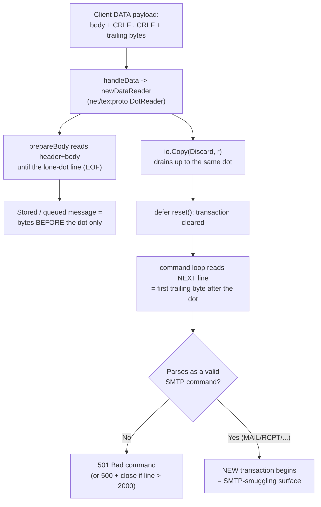
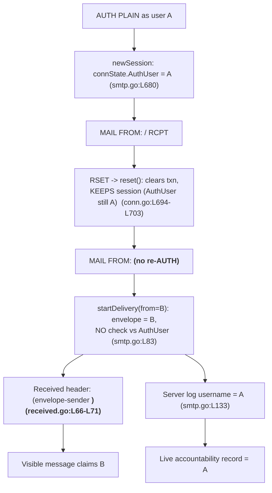

# maddy SMTP Security Review — DATA boundary & authentication-state reuse

> **Subject:** [maddy](https://github.com/foxcpp/maddy) — *"Simple, fast, secure all-in-one mail server"* (README.md), a self-hosted, single-process IMAP4rev1 + SMTP server written in Go.
> **Commit (HEAD):** `26452dd8dd787dc455278b0fdd296f4a5432c768`
> **Source branch:** `maddy_26452dd8dd78`
> **Review type:** Evidence-based, build–run–observe security analysis (read-only). **No code was modified, and no behavior was remediated** — this report judges whether maddy *fails safely* under protocol misuse and documents the observed behavior with its security implications.

This document answers two questions about maddy's SMTP receive path. Every behavioral claim below was **(a) observed at runtime** against a freshly built binary running a live SMTP/Submission service, **and (b) located in the source** at the commit above. Runtime transcripts and on-disk artifacts are embedded verbatim (only volatile values such as timestamps, random message IDs, and ephemeral ports are left as captured; a SASL credential string is redacted as noted). Code citations use the form `path:Lxxx`.

The two questions, **reproduced verbatim**:

> **Question 1 (DATA boundary / end-of-data):** "If a message body contains normal content, then a line with only a dot, followed by more data before the final terminator, how does maddy treat that sequence in practice? Does it stop reading at the first dot, continue consuming input, or leave the connection in an unexpected state? What runtime signs show which path was taken, and what actually ends up stored or queued as a result?"

> **Question 2 (authentication state / identity reuse):** "If a client authenticates as one user, begins a message, resets it, and then immediately attempts to send mail claiming to be a different user without authenticating again, how does maddy respond under real conditions? Does it reject the command, tie it back to the original identity, or allow it to proceed in a way that could blur accountability? When delivery decisions are made, what evidence shows which identity was ultimately trusted for headers, queue metadata, or enforcement checks?"

---

## Summary of findings

| # | Question | Resolution | Fails safely? |
|---|----------|------------|---------------|
| 1 | DATA lone-dot mid-body | maddy **stops reading the body at the first line containing only a dot.** It does *not* keep consuming trailing bytes as body, and the connection does *not* desynchronize — the trailing bytes re-enter the SMTP **command** grammar. | **Yes** for framing integrity; the residual risk is the generic SMTP-smuggling class (a valid trailing command opens a *new* transaction). |
| 2 | Identity reuse across `RSET` | maddy **neither rejects nor re-binds.** After `RSET`, a new `MAIL FROM` claiming a different identity **B** is accepted **without re-authentication**; the connection stays authenticated as the original user **A**. The visible message (envelope, `Received`, `From`) asserts **B**; the authenticating identity **A** is recorded only in the **live server log**. | **Partially / No** for accountability — see the important nuance in §3 about what is (and is not) persisted on disk. |

---

## Section 1 — Test environment & method

### 1.1 Product and build

maddy is organized as a registry of "modules"; SMTP/IMAP endpoints are initialized specially, "checks" run in a guaranteed order, and "modifiers" may alter headers but never the body (HACKING.md, *"Brief introduction to the source tree"*). The SMTP receive path accepts unauthenticated mail (inbound, conceptually port 25) and authenticated submission (conceptually port 587/465).

The binary was built from source at HEAD `26452dd8dd787dc455278b0fdd296f4a5432c768`:

| Tool | Version |
|------|---------|
| Go | `go1.18.10 linux/amd64` |
| gcc | `gcc (Ubuntu 15.2.0-4ubuntu4) 15.2.0` |
| CGO | **`CGO_ENABLED=1` (required)** — `github.com/mattn/go-sqlite3 v1.11.0` is a cgo package (go.mod) |

`go.mod` declares `go 1.13` (go.mod:L3); the build succeeds on the newer toolchain. The server's `main` package is `cmd/maddy` (the repository root is the library `package maddy`), so the build command is:

```bash
CGO_ENABLED=1 go build -o /tmp/maddyrun/maddy    ./cmd/maddy
CGO_ENABLED=1 go build -o /tmp/maddyrun/maddyctl ./cmd/maddyctl
```

Both binaries built cleanly (only the benign go-sqlite3 gcc warning). The pinned SMTP library — the subject of much of the analysis below — is `github.com/emersion/go-smtp v0.12.1-0.20191206174923-1f576e0ec85c` (go.mod), present in the module cache for citation.

### 1.2 Ephemeral harness

All observation was performed against an **ephemeral** instance under `/tmp` (configuration, SQLite state, queue files, logs, driver scripts, and the binaries themselves) which was **deleted after observation**; the repository working tree was left unchanged. The temporary `maddy.conf` exposed:

- A global `hostname mx.local` and **`tls off`** (so listeners run without certificates during observation; `tls off` is accepted — internal/config/tls_server.go:L18-L23, registered globally at maddy.go:L249).
- A `sql` module providing **both** storage (`local_mailboxes`) and authentication (`local_authdb`) over SQLite, with `local_domains = local`.
- An **unauthenticated `smtp` listener** on `tcp://0.0.0.0:2525` (a documented high port) that delivers local recipients to `&local_mailboxes`. It intentionally omits the shipped inbound checks (`require_mx_record`, `apply_spf`, `verify_dkim`, `dmarc`) so a crafted, **non–dot-stuffed** DATA payload reaches the body reader unaltered. *(Used for Q1.)*
- An **authenticated `submission` listener** on `tcp://0.0.0.0:587` with `auth &local_authdb`, **`insecure_auth`** (so `AUTH PLAIN` is allowed without TLS during observation — smtp.go:L564), and the shipped source-routing preserved (`source local { … } default_source { reject 501 5.1.8 "Non-local sender domain" }`). *(Used for Q2.)*
- A `queue remote_queue { target remote { … } }` so a **non-local** recipient is written to the on-disk queue (`<id>.meta`/`.header`/`.body`). *(Used to inspect Q2's persisted artifact.)*
- **`io_debug`** enabled on both listeners (smtp.go:L565) so the raw line-by-line SMTP conversation is mirrored to the log.

Two users were provisioned with the project's own tool (`cmd/maddyctl/users.go` `usersCreate`, users.go:L30):

```bash
maddyctl -config …/maddy.conf users create A@local --password passA
maddyctl -config …/maddy.conf users create B@local --password passB
```

maddy normalizes usernames to lower-case, so the credential store holds `a@local` and `b@local`. The server was run with the global `-debug` flag (this 2019-era binary uses flags, not a `run` subcommand): `maddy -config …/maddy.conf -debug -log stderr`. On start it logged `smtp: listening on tcp://0.0.0.0:2525` and `submission: listening on tcp://0.0.0.0:587`, both with `I/O debugging is on!`.

### 1.3 Why port 587 + `insecure_auth`

The **shipped** configuration exposes submission over **implicit TLS on port 465** (`submission tls://0.0.0.0:465` — maddy.conf:L93), whereas the scenario specifies port **587**. To reproduce the scenario faithfully we stood up a plain `tcp://…:587` submission listener and enabled `insecure_auth` so `AUTH PLAIN` could be exercised over an unencrypted connection during observation. This is a *test-harness* deviation only; see the limitations in §5.

### 1.4 Method

Both scenarios were driven with **raw-socket** Python scripts (so crafted, non–dot-stuffed payloads reach the server byte-for-byte), correlating three independent evidence sources: the client-visible reply codes, the server-side **`io_debug`** transcript, and the **on-disk** artifacts (the go-imap-sql message blob store and the queue files).

---

## Section 2 — Question 1: the DATA end-of-data boundary

> "If a message body contains normal content, then a line with only a dot, followed by more data before the final terminator, how does maddy treat that sequence in practice? Does it stop reading at the first dot, continue consuming input, or leave the connection in an unexpected state? What runtime signs show which path was taken, and what actually ends up stored or queued as a result?"

### 2.1 Answer

maddy **stops reading the message body at the first line that contains only a dot** (option *a*). It does **not** continue consuming the trailing bytes as body, and it does **not** leave the connection in an unexpected or desynchronized state. After the lone dot, the connection remains perfectly well-defined: the bytes that follow re-enter the SMTP **command** grammar and are dispatched as new commands.

### 2.2 Why (mechanism, with citations)

maddy implements **no dot parsing of its own**. The body is read in `(*Session).Data` (smtp.go:L312), which calls `prepareBody` (smtp.go:L283). `prepareBody` wraps the supplied reader with `bufio.NewReader(r)`, reads the header via `textproto.ReadHeader`, and buffers the remainder with `buffer.BufferInMemory` — where `r` is go-smtp's `dataReader`. That `dataReader` is built directly on the **standard-library `net/textproto` dot decoder**:

```go
// go-smtp …/data.go  (newDataReader, L51-L53)
func newDataReader(c *Conn) io.Reader {
    dr := &dataReader{
        r: c.text.DotReader(),   // <-- stdlib net/textproto DotReader
```

The `net/textproto` dot decoder ends the stream at the first line containing only `.` and returns `io.EOF` after consuming and discarding that line. Consequently only the bytes **before** the lone dot ever become the stored header + body. Control then returns through go-smtp's `handleData`, which drains any residue and clears the transaction:

```go
// go-smtp …/conn.go  (handleData, L498-L524, excerpted)
c.WriteResponse(354, …, "Go ahead. End your data with <CR><LF>.<CR><LF>")
defer c.reset()                                   // L512
…
r := newDataReader(c)                              // L519
code, enhancedCode, msg := toSMTPStatus(c.Session().Data(r))   // L520
io.Copy(ioutil.Discard, r) // Make sure all the data has been consumed   // L521 — drains only up to the same end-of-data line
c.WriteResponse(code, enhancedCode, msg)           // L522
```

Because `io.Copy(ioutil.Discard, r)` reads the *same* `dataReader`, it too stops at the lone dot. The command loop (go-smtp `server.go`) then reads the **next** line — the first byte *after* the lone dot — and dispatches it as a brand-new SMTP command. The flow:



### 2.3 Runtime signs (observed)

Three variants were driven against the unauthenticated `smtp` listener, each sending — after `354` — a body, a lone `.` line, then trailing bytes, **without dot-stuffing**.

**Variant 1 — non-command trailing bytes (`SMUGGLED-LINE`).** The exact payload sent after `354` was the 54-byte buffer
`Subject: probe\r\n\r\nbody line one\r\n.\r\nSMUGGLED-LINE\r\n.\r\n`. Client-visible exchange:

```
C>> MAIL FROM:<sender@local>
S<< 250 2.0.0 Roger, accepting mail from <sender@local>
C>> RCPT TO:<A@local>
S<< 250 2.0.0 I'll make sure <A@local> gets this
C>> DATA
S<< 354 2.0.0 Go ahead. End your data with <CR><LF>.<CR><LF>
C>> [54-byte payload: body line one + CRLF.CRLF + SMUGGLED-LINE + CRLF.CRLF]
S<< 250 2.0.0 OK: queued        <-- message accepted; body ended at the FIRST lone dot
S<< 501 5.5.2 Bad command       <-- reply to trailing "SMUGGLED-LINE" (re-parsed as a command)
S<< 501 5.5.2 Bad command       <-- reply to the trailing "." (re-parsed as a command)
C>> QUIT
S<< 221 2.0.0 Goodnight and good luck
```

The server-side `io_debug` transcript makes the boundary explicit — the message is *accepted* and the transaction *reset* before the trailing bytes are dispatched:

```
smtp: DATA
smtp: 354 2.0.0 Go ahead. End your data with <CR><LF>.<CR><LF>
smtp: Subject: probe

body line one
.
SMUGGLED-LINE
.
[debug] smtp/pipeline: delivery.Body ok, Delivery object = *msgpipeline.delivery  {"msg_id":"96c89d39"}
smtp: accepted  {"msg_id":"96c89d39"}
smtp: 250 2.0.0 OK: queued
[debug] smtp: reset
smtp: 501 5.5.2 Bad command
smtp: 501 5.5.2 Bad command
```

The `accepted msg_id=…` line is emitted at smtp.go:L334 (`s.log.Msg("accepted", "msg_id", s.msgMeta.ID)`).

**Variant 2 — valid command in the trailing bytes (the smuggling surface).** Here the bytes after the lone dot were a *valid* `MAIL FROM`. The server opened a brand-new transaction:

```
C>> [payload: second body + CRLF.CRLF + "MAIL FROM:<x@local>" + "RCPT TO:<A@local>" + "QUIT"]
S<< 250 2.0.0 OK: queued                              <-- first message (msg_id 09e00a13)
S<< 250 2.0.0 Roger, accepting mail from <x@local>    <-- trailing MAIL FROM opened a NEW transaction
S<< 250 2.0.0 I'll make sure <A@local> gets this
S<< 221 2.0.0 Goodnight and good luck
```

Server-side, this appears as a **second** "incoming message" on the *same* connection with a *different* sender:

```
smtp: incoming message  {"msg_id":"09e00a13","sender":"sender@local",…}
smtp: 250 2.0.0 OK: queued
smtp: incoming message  {"msg_id":"e25c32b3","sender":"x@local",…}   <-- new transaction smuggled in after the dot
```

**Variant 3 — over-long trailing line.** maddy leaves go-smtp's `MaxLineLength` at its default of **2000** bytes (`server.go:L76`; not overridden by maddy). A trailing line of 2500 bytes after the lone dot is rejected and the connection is closed:

```
C>> [payload: third body + CRLF.CRLF]
S<< 250 2.0.0 OK: queued                                 <-- first message (msg_id f09d28b5)
C>> [over-long trailing line, 2502 bytes]
S<< 500 5.4.0 Too long line, closing connection          <-- server.go:L154-L155 (ErrTooLongLine)
C>> NOOP
S<< (empty — connection closed)
```

In every variant the boundary is identical: the message ends at the first lone dot, and the trailing bytes are evaluated **as commands**, never appended to the body.

### 2.4 What is actually stored / queued

The Variant 1 recipient (`A@local`, local) was delivered into the go-imap-sql mailbox store (sql.go:L113 `(*delivery).Body` → `BodyParsed(header, body.Len(), body)`). Reading the persisted message blob directly (the external blob store keeps each message as a file) shows the stored content is **only the bytes before the lone dot** — `SMUGGLED-LINE` is absent:

```
Delivered-To: a@local
Return-Path: <sender@local>
Received: from probe (localhost [127.0.0.1]) by mx.local (envelope-sender
 <sender@local>) with ESMTP id 96c89d39; Fri, 26 Jun 2026 21:00:24 +0000
Subject: probe

body line one
```

The entire stored object is **233 bytes**; the body is exactly `body line one`. The two messages from Variants 2 and 3 likewise stored only `second body` and `third body` respectively — neither the smuggled `MAIL FROM` nor the over-long line is present in any stored body. (Note that for this **non-submission** endpoint the `Received` header *does* include the source-host clause `from probe (localhost [127.0.0.1])`, because `DontTraceSender` is false here — contrast the submission case in §3, where it is suppressed.)

### 2.5 Security framing

maddy's behavior is **RFC 5321-correct**: a line containing only a period is the end-of-data marker, and a body line beginning with a period is dot-stuffed by the client (the leading dot stripped by the server). Stopping at the first lone dot is exactly what the standard requires. The security-relevant consequence is that the bytes **after** the lone dot re-enter the command grammar — which is the well-known **SMTP-smuggling / "end-of-data uncertainty"** vulnerability class (CERT **VU#302671**). Variant 2 demonstrates the surface concretely: a crafted payload whose trailing bytes are a valid `MAIL FROM` injects a *second* transaction on the same connection. This is a property of standards-correct end-of-data handling and the way trailing bytes are framed, **not** a maddy-specific parsing bug: maddy never desynchronizes, bounds malformed trailing lines to `501`, and closes the connection on an over-long line (`500`).


---

## Section 3 — Question 2: authentication state and identity reuse across `RSET`

> "If a client authenticates as one user, begins a message, resets it, and then immediately attempts to send mail claiming to be a different user without authenticating again, how does maddy respond under real conditions? Does it reject the command, tie it back to the original identity, or allow it to proceed in a way that could blur accountability? When delivery decisions are made, what evidence shows which identity was ultimately trusted for headers, queue metadata, or enforcement checks?"

### 3.1 Answer

maddy **neither rejects nor re-binds.** After the client authenticates as **A** and issues `RSET`, a subsequent `MAIL FROM` that claims a *different* identity **B** is **accepted with `250` and no re-authentication**. The connection remains authenticated as **A** for its entire life. The result is an **accountability blur**: the visible message — envelope sender, generated `Received` header, and `From` — asserts **B**, while the authenticating identity **A** is preserved in the **live server log**. maddy never compares the envelope sender to the authenticated user.

There is an important, evidence-based refinement to the "queue metadata" part of the question, detailed in §3.3: at this commit the authenticated identity is **deliberately not written to the on-disk queue metadata** — so the persisted queue record attributes the message *solely* to **B**.

### 3.2 Why (mechanism, with citations)

**`RSET` clears the transaction, not the session.** In go-smtp, `RSET` calls `reset()` and replies `250` (conn.go:L131-L133). `reset()` invokes the backend `session.Reset()` and clears the per-transaction fields, but it **never clears `c.session`**:

```go
// go-smtp …/conn.go  (reset, L694-L703)
func (c *Conn) reset() {
    c.locker.Lock()
    defer c.locker.Unlock()
    if c.session != nil {
        c.session.Reset()       // backend transaction reset
    }
    c.fromReceived = false      // transaction state
    c.recipients = nil          // transaction state
}                               // c.session is NOT touched -> authentication persists
```

The authenticated session is dropped only when the connection closes (`Close` → `session.Logout()` → `SetSession(nil)`, conn.go:L169-L176). maddy captures the authenticated username **once**, at login, in `newSession` (smtp.go:L674), storing it in the connection state:

```go
// internal/endpoint/smtp/smtp.go  (newSession, L680)
AuthUser: username,
```

A later `MAIL FROM` reuses that same session. maddy **never reconciles the new envelope sender with `AuthUser`** — neither the `Mail`/`startDelivery` path (smtp.go:L83, L162) nor `submissionPrepare` (submission.go:L27) binds the sender to the authenticated user, and there is no sender-authorization (MAIL-FROM ↔ AuthUser) module anywhere in the tree.



### 3.3 Which identity is trusted for what (observed)

The submission session (driven over `tcp/587`) is shown below as the server-side `io_debug` transcript. The `AUTH PLAIN` argument is **redacted** — note that `io_debug` itself logged the base64 credential and warned `I/O debugging is on! It may leak passwords in logs, be careful!`, which is its own operational caution.

```
submission: 220 mx.local ESMTP Service Ready
submission: EHLO probe
submission: 250-Hello probe
submission: 250-AUTH PLAIN
submission: 250 SIZE 33554432
submission: AUTH PLAIN <redacted base64 of \0a@local\0passA>
submission: 235 2.0.0 Authentication succeeded
submission: MAIL FROM:<A@local>
submission: 250 2.0.0 Roger, accepting mail from <A@local>
submission: RCPT TO:<A@local>
submission: incoming message  {"msg_id":"56fb2daa","sender":"A@local","src_ip":"127.0.0.1:45094","username":"a@local"}
submission: 250 2.0.0 I'll make sure <A@local> gets this
submission: RSET
submission: aborted  {"msg_id":"56fb2daa"}
[debug] submission: reset
submission: 250 2.0.0 Session reset
submission: MAIL FROM:<B@local>
submission: 250 2.0.0 Roger, accepting mail from <B@local>      <-- accepted WITHOUT re-authentication
submission: RCPT TO:<ext@remote.test>
submission: incoming message  {"msg_id":"60eee051","sender":"B@local","src_ip":"127.0.0.1:45094","username":"a@local"}   <-- sender=B, username=A
submission: 250 2.0.0 I'll make sure <ext@remote.test> gets this
submission: DATA
submission: 354 2.0.0 Go ahead. End your data with <CR><LF>.<CR><LF>
submission: From: B <B@local>
submission: adding missing Message-ID
submission: adding missing Date header
submission: accepted  {"msg_id":"60eee051"}
submission: 250 2.0.0 OK: queued
```

Three observations from the transcript: (1) the post-`RSET` `MAIL FROM:<B@local>` is accepted with `250` and **no** re-auth; (2) the `incoming message` log line for the queued message records `"sender":"B@local"` **and** `"username":"a@local"` simultaneously — the blur, captured live (the `username` field comes from `s.connState.AuthUser`, smtp.go:L133); (3) submission preparation injects a `Message-ID` and `Date` and **requires** a `From` header (an earlier run with no `From` was rejected at DATA with `554 5.6.0 Message does not contains a From header field`).

**Visible message → B.** The generated `Received` header (captured from the queue `<id>.header`) records the **claimed** envelope sender, and — because this is submission — suppresses the source-host clause:

```
Received:  by mx.local (envelope-sender <B@local>) with ESMTP id 60eee051;
 Fri, 26 Jun 2026 21:06:50 +0000
Date: Fri, 26 Jun 2026 21:06:50 +0000
Message-Id: <981da1db-2b04-4ad3-a336-5888fcaf3f8a@mx.local>
From: B <B@local>
Subject: identity probe
```

`GenerateReceived` (received.go:L19) emits the `" (envelope-sender <"` clause (received.go:L69) using the envelope `mailFrom` — here **B**. That clause is **unconditional**. By contrast, the `from <host> (...)` source clause is gated on `!DontTraceSender` (received.go:L30-L31); `submissionPrepare` sets `msgMeta.DontTraceSender = true` (submission.go:L28), which is why the header reads `Received:  by mx.local` with the source host omitted (the field defined at msgmetadata.go:L70 documents that these suppressed values "are still written to the server log"). So the visible message asserts **B** in its envelope, its `Received` provenance, and its `From`.

**Internal accountability → A — but only in the live log.** The authenticated identity survives in the server-log `username` field (smtp.go:L133, shown above as `"username":"a@local"`). One might expect it to also reach disk via the queue, since `QueueMetadata` wraps `*module.MsgMetadata` (queue.go:L149-L150) and `MsgMetadata` "is serialized to the disk by the queue module using JSON" (msgmetadata.go:L52-L54). **The running system shows otherwise.** The captured queue `<id>.meta` is:

```json
{
    "MsgMeta": {
        "ID": "60eee051",
        "OriginalFrom": "B@local",
        "DontTraceSender": true,
        "Quarantine": false,
        "OriginalRcpts": {},
        "SMTPOpts": { "Size": 0, "RequireTLS": false, "UTF8": false },
        "Conn": null
    },
    "From": "B@local",
    "To": [ "ext@remote.test" ],
    "FailedRcpts": null,
    "TemporaryFailedRcpts": null,
    "RcptErrs": {},
    "TriesCount": 0,
    "FirstAttempt": "2026-06-26T21:06:47.082576248Z",
    "LastAttempt": "2026-06-26T21:06:47.082576325Z"
}
```

`"Conn": null` — the authenticated identity is **not** present. The reason is in the queue's serializer, which deliberately strips the connection state before writing:

```go
// internal/target/queue/queue.go  (updateMetadataOnDisk, L742-L752)
metaCopy := *meta
metaCopy.MsgMeta = meta.MsgMeta.DeepCopy()
metaCopy.MsgMeta.Conn = nil            // L752 — Conn (incl. AuthUser) dropped before JSON encode
…
json.NewEncoder(file).Encode(metaCopy)
```

`Conn` (an `*ConnState`, msgmetadata.go:L104) carries both `AuthUser` (msgmetadata.go:L37) and `AuthPassword`; the latter is flagged "should be cleaned if the ConnState object is serialized" (msgmetadata.go:L40-L41). At this commit the queue achieves that by nulling the **entire** `Conn`, so `AuthUser` (A) is dropped along with the password. **Net effect:** the on-disk queue record — both `<id>.meta` (`From`/`OriginalFrom` = `B@local`, `Conn: null`) and `<id>.header` (`Received` envelope-sender = B) — attributes the message **solely to B**. The authenticating user **A** appears **only** in the ephemeral server log, not in any persisted artifact. For the "queue metadata" the question asks about specifically, this *deepens* the blur rather than mitigating it: the durable forensic record names only the claimed identity.

**Enforcement gate.** The only default check on the claimed sender **B** is submission **source-routing**: `source $(local_domains) { … } default_source { reject 501 5.1.8 "Non-local sender domain" }` (maddy.conf:L97, L117-L118). Because `defer_sender_reject` defaults **true** (smtp.go:L567), such a rejection would surface at the first **`RCPT`**, not at `MAIL`. In this scenario **B** (`b@local`) is within `local_domains`, so it passes the gate and the message proceeds — which is exactly the condition under which the blur manifests. Downstream consumers that *do* trust `Conn.AuthUser` while the connection is live (e.g., SASL relay to an upstream, DKIM signing) would key off **A**, even though the message claims **B**.


---

## Section 4 — Does it fail safely?

**Question 1 — YES on framing integrity.** maddy halts the body at the first lone-dot line and never desynchronizes the connection. Trailing bytes are bounded to the SMTP command grammar: malformed lines are rejected (`501 Bad command`), and an over-long line closes the connection (`500 Too long line, closing connection`). The stored/queued message contains *only* the pre-dot content. The residual risk is the generic **SMTP-smuggling** class — a *valid* trailing command (e.g., `MAIL FROM`) opens a new transaction on the same connection (Variant 2). This is inherent to standards-correct end-of-data handling and is not a maddy-specific defect; it is the reason coordinated hardening (e.g., stricter `<CR><LF>.<CR><LF>` enforcement at proxies/MTAs) exists across the ecosystem.

**Question 2 — PARTIALLY / NO on accountability.** maddy "fails safe" for *live* forensic traceability: while the connection is open, the server log truthfully records the authenticating user **A** alongside the claimed sender **B**. But it does **not** fail safe for surface-level accountability or for the *durable* record:

- It **allows** an authenticated session to assert a *different* envelope/`From`/`Received` identity (**B**) after `RSET`, with **no re-authentication** and **no default MAIL-FROM ↔ AuthUser check**.
- The persisted queue artifact (`<id>.meta` with `Conn: null`, `<id>.header` with envelope-sender **B**) records **only B** — the authenticating identity **A** is *not* written to disk (queue.go:L752). Anyone auditing the queue files alone would attribute the message solely to **B**.

The only default brake on **B** is the submission source-domain reject (maddy.conf:L117-L118), and it only constrains the *domain*, not the *user* — so any locally-authenticated user can send as any other local mailbox. For a self-hosted server this is often acceptable by policy, but it does mean per-user accountability on submission is **not** enforced by default.

---

## Section 5 — Rationale & limitations

### 5.1 Why each behavior occurs

- **Q1** reduces to a single delegation: maddy reads DATA through go-smtp's `dataReader`, which *is* the standard-library `net/textproto` `DotReader` (data.go:L53). The lone dot is therefore authoritative end-of-data, and everything after it is, by construction, a fresh command stream. maddy adds no parsing of its own, so there is nothing to desynchronize.
- **Q2** reduces to go-smtp's separation of **transaction** state from **session** state: `RSET`/`reset()` clears the transaction but preserves `c.session` (conn.go:L694-L703), and maddy captures `AuthUser` exactly once at login (smtp.go:L680) and never re-checks it against the envelope. The identity the message *claims* (B) and the identity the connection *authenticated as* (A) are simply different variables that the code never compares; and the one durable sink that could have recorded A — the queue meta — intentionally nulls the connection state (queue.go:L752).

### 5.2 Limitations

- Behavior was observed on an **ephemeral local configuration** with `tls off` and `insecure_auth`, and with the inbound checks removed on the Q1 listener; the **shipped** configuration differs (submission on implicit-TLS **465**, full inbound checks). These harness choices affect *reachability* of the code paths, not the *framing/identity* logic under test.
- The queued message in Q2 was routed to a non-local recipient and captured from the on-disk queue immediately after `Commit`; with `max_tries 1` the asynchronous delivery to the (non-existent) remote domain then failed and removed the files, which is expected and unrelated to the metadata content.
- All results are pinned to commit `26452dd8dd787dc455278b0fdd296f4a5432c768` and the exact dependency versions in `go.mod` — notably `github.com/emersion/go-smtp v0.12.1-0.20191206174923-1f576e0ec85c`. Different go-smtp versions may frame trailing bytes or session lifecycle differently.
- This is **analysis only**: no remediation was applied, and the repository was left unchanged apart from this report.

### 5.3 Evidence / locator table

| Claim | Runtime evidence | Source locator (HEAD `26452dd8`) |
|-------|------------------|----------------------------------|
| DATA framing delegated to stdlib dot decoder | — | go-smtp `data.go:L51-L53` (`newDataReader` → `c.text.DotReader()`) |
| Body read stops at lone dot | stored body = `body line one` only (233 bytes) | `smtp.go:L283` (`prepareBody`), `smtp.go:L312` (`Data`), `sql.go:L113`/`L124` |
| Trailing non-command → `501` | `501 5.5.2 Bad command` ×2 | go-smtp `conn.go:L498-L524` (drain+`reset`), `server.go` command loop |
| Trailing valid command → new transaction | 2nd `incoming message sender=x@local` | go-smtp `conn.go:L512` (`defer c.reset()`), `server.go` loop |
| Over-long trailing line → close | `500 5.4.0 Too long line, closing connection` | go-smtp `server.go:L76` (`MaxLineLength: 2000`), `server.go:L154-L155` |
| `accepted msg_id` emitted | `smtp: accepted {"msg_id":"96c89d39"}` | `smtp.go:L334` |
| `RSET` clears txn, keeps session | `250 Session reset`; B accepted after | go-smtp `conn.go:L131-L133`, `conn.go:L694-L703` |
| Session dropped only on close | — | go-smtp `conn.go:L169-L176` (`Logout`) |
| AuthUser captured once at login | `"username":"a@local"` persists across `RSET` | `smtp.go:L674`, `smtp.go:L680` |
| No MAIL-FROM ↔ AuthUser check | `MAIL FROM:<B@local>` → `250` (no re-auth) | `smtp.go:L83`/`L162`, `submission.go:L27` (no binding) |
| `Received` records claimed envelope sender B | `(envelope-sender <B@local>)` | `received.go:L19`, `received.go:L69` |
| Submission suppresses source-host clause | `Received:  by mx.local` (no `from <host>`) | `submission.go:L28`, `received.go:L30-L31`, `msgmetadata.go:L70` |
| Log records authenticated A + claimed B | `sender=B@local`, `username=a@local` | `smtp.go:L133` |
| Queue meta does **not** persist AuthUser | `<id>.meta` → `"Conn": null` | `queue.go:L742`, `queue.go:L752` (`metaCopy.MsgMeta.Conn = nil`); `msgmetadata.go:L37`/`L40-L41`/`L104` |
| Queue persists triplet | `<id>.meta` / `.header` / `.body` captured | `queue.go:L149-L150`, `queue.go:L607`/`L611`/`L615`, `queue.go:L690` |
| Only default gate on B is source-domain | passes (B ∈ `local_domains`) | `maddy.conf:L97`, `maddy.conf:L117-L118`, `smtp.go:L567` (`defer_sender_reject` default true) |
| Submission requires `From`, injects Message-ID/Date | `554 …does not contains a From header`; `adding missing Message-ID/Date` | `submission.go:L27` (`submissionPrepare`); `date.go` (RFC 5322 date parsing) |

---

*Prepared as a read-only, evidence-based review at commit `26452dd8dd787dc455278b0fdd296f4a5432c768` (branch `maddy_26452dd8dd78`). The temporary observation harness under `/tmp` was removed after data collection; no repository file other than this document was created, modified, or deleted.*

