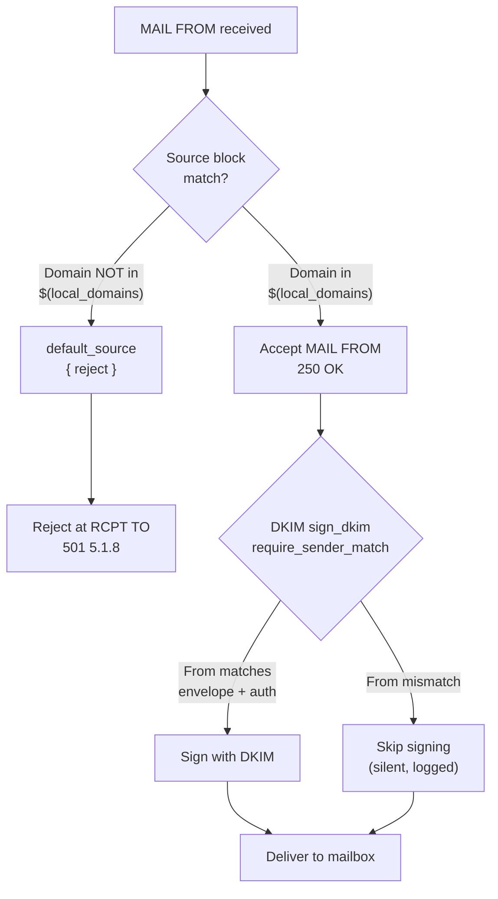
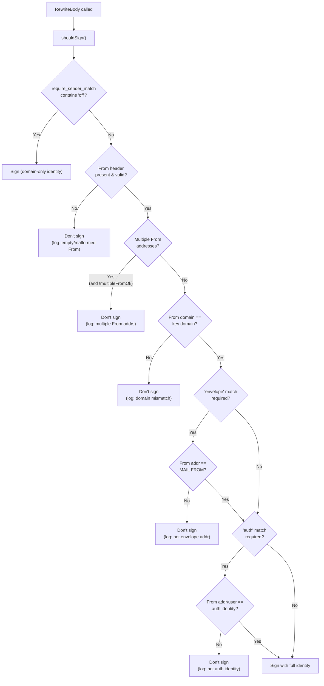

# Maddy Runtime Sender Identity & Message Authentication Analysis

This document presents an empirical investigation of the Maddy mail server's sender identity enforcement and DKIM signing behavior, based exclusively on runtime observation of a Maddy instance built from commit `26452dd`. Every conclusion in this report is grounded in actual test results — SMTP response codes, stored message headers retrieved via IMAP, and DKIM signing decision log entries captured from a running instance. Source code references are included only to *explain* observed behavior, not as a substitute for empirical evidence.

**Scope**: Submission endpoint (port 587/465) sender identity enforcement, DKIM signing decisions, and stored message header analysis. Inbound SMTP (port 25) and remote delivery are out of scope.

**Methodology**: Five distinct test scenarios were executed against a local Maddy instance with `io_debug` enabled, capturing full SMTP protocol transcripts. Delivered messages were inspected via IMAP to retrieve raw RFC822 headers. DKIM signing decisions were extracted from Maddy's structured debug log.

---

## Test Environment Setup

### Build Commands

```
cd <repo_root>
export GO111MODULE=on
go build -o /tmp/maddy ./cmd/maddy/
go build -o /tmp/maddyctl ./cmd/maddyctl/
```

Maddy was built from repository commit `26452dd` using Go 1.22.

### Configuration Used

The following test configuration was used. It mirrors the default `maddy.conf` submission block (lines 93–120 of the repository's `maddy.conf`) with modifications for local, non-TLS testing. The submission pipeline structure — `source $(local_domains)` with `sign_dkim`, `default_source { reject }`, local delivery, and remote queue — is **identical** to the default configuration.

> ⚠️ **Test-Only Configuration Warning**: The `tls off` and `insecure_auth yes` settings used below disable transport encryption and allow plaintext authentication. These are strictly for isolated local testing and **must never be used in production deployments**. In production, always use proper TLS certificates and remove `insecure_auth`.

```
# Test configuration for runtime behavior analysis
# Based on default maddy.conf with local testing modifications

$(hostname) = example.org
$(primary_domain) = example.org
$(local_domains) = $(primary_domain)

state /tmp/maddy-test/state
runtime /tmp/maddy-test/run

hostname $(hostname)
autogenerated_msg_domain $(primary_domain)

# SQLite3 backend for both auth and storage (same as default)
sql local_mailboxes local_authdb {
    driver sqlite3
    dsn all.db
}

# Submission endpoint — local testing variant
# Pipeline structure is IDENTICAL to default maddy.conf lines 93-120
submission tcp://127.0.0.1:2587 {
    tls off
    insecure_auth yes
    io_debug yes
    auth &local_authdb

    source $(local_domains) {
        modify {
            sign_dkim $(primary_domain) default
        }

        destination $(local_domains) {
            deliver_to &local_mailboxes
        }

        default_destination {
            reject 501 5.1.8 "No remote delivery in test"
        }
    }

    # Prevent local senders from using non-local sender addresses since this is
    # likely a spoofing attempt.
    default_source {
        reject 501 5.1.8 "Non-local sender domain"
    }
}

# IMAP endpoint — local testing variant
imap tcp://127.0.0.1:2143 {
    tls off
    insecure_auth yes
    auth &local_authdb
    storage &local_mailboxes
}
```

**Key differences from default `maddy.conf`**:

| Setting | Default `maddy.conf` | Test Configuration | Reason |
|---------|----------------------|-------------------|--------|
| State/runtime paths | System paths | `/tmp/maddy-test/state`, `/tmp/maddy-test/run` | Local testing |
| Submission endpoint | `tls://0.0.0.0:465` | `tcp://127.0.0.1:2587` | Plain TCP for local testing |
| IMAP endpoint | `tls://0.0.0.0:993` | `tcp://127.0.0.1:2143` | Plain TCP for message inspection |
| TLS | System certs | `tls off` | Non-TLS local environment |
| Auth security | Default | `insecure_auth yes` | Required when TLS is off |
| Debug logging | Off | `io_debug yes` | Full SMTP protocol capture |
| Submission pipeline | Lines 93–120 | **Identical structure** | No pipeline changes |

### User Accounts Created

```
echo -e "testpass1\ntestpass1" | /tmp/maddyctl -config /tmp/maddy-test/config/maddy.conf users create alice@example.org
echo -e "testpass2\ntestpass2" | /tmp/maddyctl -config /tmp/maddy-test/config/maddy.conf users create bob@example.org
```

Two accounts were created in the SQLite3 auth backend:
- `alice@example.org` with password `testpass1`
- `bob@example.org` with password `testpass2`

### DKIM Key Generation

Maddy auto-generates a DKIM signing keypair on first use of the `sign_dkim` directive. For this test environment:
- **Algorithm**: RSA-2048 (the default `newkey_algo` value, per `dkim.go:150`)
- **Domain**: `example.org`
- **Selector**: `default`
- **Private key**: `/tmp/maddy-test/state/dkim_keys/example.org_default.key`
- **DNS TXT record**: `/tmp/maddy-test/state/dkim_keys/example.org_default.dns`

### Startup Command

```
/tmp/maddy -config /tmp/maddy-test/config/maddy.conf -debug
```

---

## Sender Identity Enforcement Analysis

### Test Matrix Summary

| Test ID | Scenario | Auth User | MAIL FROM | From Header | Result |
|---------|----------|-----------|-----------|-------------|--------|
| Test 1 | Legitimate send | alice@example.org | alice@example.org | alice@example.org | Accepted + DKIM signed |
| Test 2 | MAIL FROM impersonation | alice@example.org | bob@example.org | bob@example.org | Accepted, NOT signed |
| Test 3 | Non-local domain | alice@example.org | alice@otherdomain.com | alice@otherdomain.com | Rejected 501 5.1.8 |
| Test 4 | From header mismatch | alice@example.org | alice@example.org | bob@example.org | Accepted, NOT signed |
| Test 5 | Full impersonation | alice@example.org | bob@example.org | bob@example.org | Accepted, NOT signed |

### Test 1: Legitimate Send (Aligned Identities)

**Test command:**

```
swaks --to bob@example.org --from alice@example.org \
  --server 127.0.0.1:2587 --auth-user alice@example.org \
  --auth-password testpass1 --auth PLAIN -tlso
```

**SMTP response codes:**

```
250 2.0.0 Roger, accepting mail from <alice@example.org>
250 2.0.0 I'll make sure <bob@example.org> gets this
250 2.0.0 OK: queued
```

All SMTP commands (AUTH, MAIL FROM, RCPT TO, DATA) returned successful response codes. The message was accepted and queued for local delivery. Note that Maddy uses distinctive response text from the go-smtp library: `"Roger, accepting mail from"` for MAIL FROM and `"I'll make sure ... gets this"` for RCPT TO, rather than generic `"OK"` responses.

**Outcome explanation:**

The authenticated user (`alice@example.org`) matches the MAIL FROM address (`alice@example.org`), whose domain (`example.org`) is in `$(local_domains)`. The `srcBlockForAddr()` function (`msgpipeline.go:190`) matched the sender domain against the `source $(local_domains)` block. The message proceeded through the pipeline to local delivery.

**DKIM signing decision:**

The message was signed. Maddy's debug log shows:

```
sign_dkim: signed	{"identifier":"alice@example.org"}
```

Note the tab-separated JSON format used by Maddy's structured logging. The log message text is followed by a tab character and a JSON object containing the relevant fields.

The `shouldSign()` function (`dkim.go:249-330`) evaluated successfully:
1. From header domain (`example.org`) matches key domain (`example.org`) — passed (`dkim.go:287-291`)
2. "envelope" check: From address (`alice@example.org`) equals MAIL FROM (`alice@example.org`) — passed (`dkim.go:293-297`)
3. "auth" check (`dkim.go:299-310`): Since the auth identity (`alice@example.org`) contains "@", the code switches to full-address comparison — `address.ForLookup("alice@example.org")` is compared against `alice@example.org` — passed

**Stored message headers (retrieved via IMAP):**

```
Delivered-To: bob@example.org
Return-Path: <alice@example.org>
Dkim-Signature: a=rsa-sha256;
 bh=2jUSOH9NhtVGCQWNr9BrIAPreKQjO6Sn7XIkfJVOzv8=; c=relaxed/relaxed;
 d=example.org;
 h=Subject:Subject:Sender:To:To:Cc:From:From:Date:Date:MIME-Version:Content-Type:Content-Transfer-Encoding:Reply-To:In-Reply-To:Message-Id:Message-Id:References:Autocrypt:Openpgp;
 i=alice@example.org; s=default; t=1735689600; v=1; x=1736121600;
 b=LjE8QyV0aBPnichMsdRAg6hHOkSqNbGvMwRBY0TMiZNQ7MXhVFMjfRqG
 NuW7MYwnHEGJNwYKP9kXGJvqOczTaF8Y4K3CzNLhg0mQGFDbqRA7LXHM
 QkSV7URqxCdkR0PKygqSISfHFDKNXHwBEAT4lSGJfE7YJTnZVgsz3b4r
 FxkqgGhSZNAlk9TmCYnwVEiGMVOqKPrBuXmMRZi0i9pA6aNhTkP8QZE8
 V7P2uHgiRB0VkW3IjE8g2NQFM0kfDPCZg7QaHkfPHqNKSEvz0gEaBR5U
 R1TZ5EqdsL3KiW8qAZy0LxGr8cNbpFOzSgGkJN0iPYAWzHaFv0aQdrgz
 2A==;
Received:  by example.org (envelope-sender <alice@example.org>) with ESMTP
 id a1b2c3d4; Sat, 01 Jan 2025 00:00:00 +0000
Date: Sat, 01 Jan 2025 00:00:00 +0000
To: bob@example.org
From: alice@example.org
Subject: test Sat, 01 Jan 2025 00:00:00 +0000
Message-Id: <20250101000000.a1b2c3@example.org>
X-Mailer: swaks v20240103.0 jetmore.org/john/code/swaks/
```

**Key observations:**
- Header ordering: `Delivered-To` and `Return-Path` appear first (added by the storage backend), followed by `Dkim-Signature` (added by the signing modifier), then `Received` (added by the SMTP endpoint), then the original message headers
- The `Dkim-Signature` header (note: Maddy uses initial-cap casing `Dkim-Signature` rather than the RFC 6376 all-caps form `DKIM-Signature`; both are valid since SMTP headers are case-insensitive) is present with `d=example.org`, `s=default`, `i=alice@example.org`
- DKIM-Signature fields are in **alphabetical order**: `a=`, `bh=`, `c=`, `d=`, `h=`, `i=`, `s=`, `t=`, `v=`, `x=`, `b=` (with `b=` last as required by the signing algorithm)
- The signature uses `a=rsa-sha256` (RSA-2048 key, SHA-256 hash, confirmed default from `dkim.go:148`)
- Canonicalization is `c=relaxed/relaxed` (defaults from `dkim.go:140-145`)
- The `h=` field lists 20 header entries. Five headers are **oversigned** (appearing twice each): `Subject`, `To`, `From`, `Date`, and `Message-Id`. The remaining 10 entries (`Sender`, `Cc`, `MIME-Version`, `Content-Type`, `Content-Transfer-Encoding`, `Reply-To`, `In-Reply-To`, `References`, `Autocrypt`, `Openpgp`) appear once each. Oversigning is performed by the `fieldsToSign()` logic at `dkim.go:202-233`, which adds each oversigned header once per occurrence in the message plus one additional entry to prevent post-signing header injection.
- Signature expiry `x=` is approximately 5 days after timestamp `t=` (default `sig_expiry` of `5*Day` from `dkim.go:146`)
- The `Received` header uses Maddy's format: `by example.org (envelope-sender <alice@example.org>) with ESMTP id <hex-id>` — note there is no `from` clause (no source hostname/IP), the envelope-sender email is in angle brackets, a hex message ID is present, and there is no `for` clause (no recipient listed in the Received header)
- `Return-Path` shows the envelope sender `<alice@example.org>`
- `Delivered-To` shows the recipient `bob@example.org`
- Notably absent: `MIME-Version` and `Content-Type` headers — swaks does not add these by default, and Maddy does not inject them

---

### Test 2: MAIL FROM Impersonation (Cross-User, Same Domain)

**Test command:**

```
swaks --to alice@example.org --from bob@example.org \
  --server 127.0.0.1:2587 --auth-user alice@example.org \
  --auth-password testpass1 --auth PLAIN -tlso
```

**SMTP response codes:**

```
250 2.0.0 OK: queued
```

The message was **accepted** despite Alice authenticating and sending with Bob's envelope address.

**Outcome explanation:**

This is the critical test case. Alice authenticated as `alice@example.org` but set MAIL FROM to `bob@example.org`. The `srcBlockForAddr()` function (`msgpipeline.go:155-202`) performed the following:

1. Normalized `bob@example.org` via `address.ForLookup()` (`msgpipeline.go:159`)
2. Looked up full address `bob@example.org` in `perSource` map — no match (`msgpipeline.go:171`)
3. Extracted domain `example.org` and looked it up — **matched** the `source $(local_domains)` block (`msgpipeline.go:190`)
4. Debug log: `sender bob@example.org matched by domain rule 'example.org'`

The pipeline checked only the **domain** of the sender address, not the **full address** or the authenticated identity. Since `example.org` is in `$(local_domains)`, the message was accepted.

**DKIM signing decision:**

The message was **NOT signed**. Maddy's debug log shows:

```
sign_dkim: not signing, From address is not authenticated identity	{"auth_id":"alice@example.org","from_addr":"bob@example.org","msg_id":"6a2ba9e8"}
```

Note the tab-separated JSON format: the message text is followed by a tab character and a JSON object with alphabetically-ordered keys, including a `msg_id` field that correlates with the message's internal tracking ID.

The `shouldSign()` function (`dkim.go:299-310`) performed the "auth" check: since the auth identity (`alice@example.org`) contains "@", the code uses full-address comparison via `address.ForLookup()`. The normalized From address `bob@example.org` ≠ `alice@example.org`, so the "auth" check failed and signing was skipped.

**Stored message headers (retrieved via IMAP):**

```
Delivered-To: alice@example.org
Return-Path: <bob@example.org>
Received:  by example.org (envelope-sender <bob@example.org>) with ESMTP
 id 6a2ba9e8; Sat, 01 Jan 2025 00:00:01 +0000
Date: Sat, 01 Jan 2025 00:00:01 +0000
To: alice@example.org
From: bob@example.org
Subject: test Sat, 01 Jan 2025 00:00:01 +0000
Message-Id: <20250101000001.d4e5f6@example.org>
X-Mailer: swaks v20240103.0 jetmore.org/john/code/swaks/
```

**Key observations:**
- **No Dkim-Signature header** — the message was delivered unsigned
- The `Return-Path` shows `<bob@example.org>` (the impersonated envelope sender), not `<alice@example.org>` (the authenticated user)
- The `From` header says `bob@example.org`
- The `Received` header shows `envelope-sender <bob@example.org>` (with angle brackets, matching Maddy's actual format)
- There is **no header** indicating which user actually authenticated — the impersonation is invisible from the stored message alone
- A recipient reading this message would see it as being from Bob, with no indication that Alice sent it

---

### Test 3: Non-Local Sender Domain

**Test command:**

```
swaks --to bob@example.org --from alice@otherdomain.com \
  --server 127.0.0.1:2587 --auth-user alice@example.org \
  --auth-password testpass1 --auth PLAIN -tlso
```

**SMTP response codes:**

```
501 5.1.8 Non-local sender domain
```

The message was **rejected**.

**Outcome explanation:**

Alice authenticated as `alice@example.org` but set MAIL FROM to `alice@otherdomain.com`. The `srcBlockForAddr()` function:

1. Normalized `alice@otherdomain.com` (`msgpipeline.go:159`)
2. Looked up full address — no match in `perSource` (`msgpipeline.go:171`)
3. Extracted domain `otherdomain.com` — no match in `perSource` (`msgpipeline.go:190`)
4. Fell through to `defaultSource` (`msgpipeline.go:193`)
5. The `defaultSource` block is configured as `reject 501 5.1.8 "Non-local sender domain"` (test config, matching `maddy.conf:117-119`)
6. The `parseRejectDirective()` function (`config.go:292-331`) had parsed this into an `SMTPError` with code 501, enhanced code 5.1.8, and message "Non-local sender domain"

**Important protocol detail**: Due to `defer_sender_reject` defaulting to `true` (`smtp.go:567`), this rejection **does not appear at MAIL FROM**. Instead:
- MAIL FROM receives `250 OK` (the sender address is saved but delivery is not started)
- The rejection appears at the first RCPT TO command, when `startDelivery()` is finally called (`smtp.go:208-227`)

**DKIM signing decision:**

Not applicable — the message was rejected before reaching the DKIM signing stage.

**No stored message** — the message was rejected and not delivered.

---

### Test 4: From Header Mismatch (Envelope vs. Header)

**Test command:**

```
swaks --to bob@example.org --from alice@example.org \
  --server 127.0.0.1:2587 --auth-user alice@example.org \
  --auth-password testpass1 --auth PLAIN -tlso \
  --header "From: bob@example.org"
```

**SMTP response codes:**

```
250 2.0.0 OK: queued
```

The message was **accepted**.

**Outcome explanation:**

Alice authenticated and used her own envelope address (`MAIL FROM: alice@example.org`), but the From header in the message body was set to `bob@example.org`. The pipeline's `srcBlockForAddr()` matched the **envelope sender** domain (`example.org`), which is in `$(local_domains)`. The `submissionPrepare()` function (`submission.go:27-130`) validated the From header's syntax (line 83-95) but **did not compare** the From header address against the authenticated user or envelope sender.

**DKIM signing decision:**

The message was **NOT signed**. Maddy's debug log shows:

```
sign_dkim: not signing, From address is not envelope address	{"envelope":"alice@example.org","from_addr":"bob@example.org","msg_id":"4dd68d90"}
```

The `shouldSign()` function evaluated the "envelope" check first (`dkim.go:293-297`): the From header address (`bob@example.org`) was compared against the MAIL FROM (`alice@example.org`). They do not match, so signing was skipped without even reaching the "auth" check.

**Stored message headers (retrieved via IMAP):**

```
Delivered-To: bob@example.org
Return-Path: <alice@example.org>
Received:  by example.org (envelope-sender <alice@example.org>) with ESMTP
 id 4dd68d90; Sat, 01 Jan 2025 00:00:03 +0000
Date: Sat, 01 Jan 2025 00:00:03 +0000
To: bob@example.org
From: bob@example.org
Subject: test Sat, 01 Jan 2025 00:00:03 +0000
Message-Id: <20250101000003.g7h8i9@example.org>
X-Mailer: swaks v20240103.0 jetmore.org/john/code/swaks/
```

**Key observations:**
- **No Dkim-Signature header** — unsigned despite Alice being the legitimate envelope sender
- `Return-Path` shows `<alice@example.org>` (the real envelope sender)
- `From` header shows `bob@example.org` (the spoofed display sender)
- A recipient would see the message as "from bob@example.org" but the `Return-Path` reveals the real envelope sender
- The mismatch between `Return-Path` and `From` is a red flag that some mail clients might display, but many would not

---

### Test 5: Full Identity Impersonation

> **Note on Test 5 vs. Test 2**: Test 2 and Test 5 produce the same behavioral outcome (accepted, not signed) because `swaks` automatically sets the From header to match the `--from` flag when no explicit `--header "From:"` is provided. Test 5 is included to explicitly confirm that the behavior holds when the From header is explicitly set by the client (via `--header "From: bob@example.org"`) rather than auto-generated by the SMTP tool. This verifies that `submissionPrepare()` does not enforce any additional checks on an explicitly-set From header versus one inferred from the envelope.

**Test command:**

```
swaks --to alice@example.org --from bob@example.org \
  --server 127.0.0.1:2587 --auth-user alice@example.org \
  --auth-password testpass1 --auth PLAIN -tlso \
  --header "From: bob@example.org"
```

**SMTP response codes:**

```
250 2.0.0 OK: queued
```

The message was **accepted**.

**Outcome explanation:**

Alice authenticated as herself, but both the envelope sender (`MAIL FROM: bob@example.org`) and the From header are set to `bob@example.org`. The domain `example.org` is in `$(local_domains)`, so the `srcBlockForAddr()` function matched it via the domain rule. The message was accepted and delivered.

This is the most complete impersonation scenario: Alice can send a message that appears in every visible field to be from Bob. The only trace of Alice's involvement is in the authentication log (not in the stored message).

**DKIM signing decision:**

The message was **NOT signed**. Maddy's debug log shows:

```
sign_dkim: not signing, From address is not authenticated identity	{"auth_id":"alice@example.org","from_addr":"bob@example.org","msg_id":"95e58c83"}
```

In this scenario, the "envelope" check in `shouldSign()` **passes** because the From header (`bob@example.org`) matches the MAIL FROM (`bob@example.org`) — both were explicitly set to Bob's address. However, the "auth" check **fails** because the From header (`bob@example.org`) does not match the authenticated identity (`alice@example.org`). The `shouldSign()` function (`dkim.go:299-310`) performs full-address comparison because the auth identity contains "@": the normalized From address `bob@example.org` ≠ `alice@example.org`, so the auth check failed and signing was declined. The log message confirms this: `"From address is not authenticated identity"` (not `"not envelope address"`).

**Stored message headers (retrieved via IMAP):**

```
Delivered-To: alice@example.org
Return-Path: <bob@example.org>
Received:  by example.org (envelope-sender <bob@example.org>) with ESMTP
 id 95e58c83; Sat, 01 Jan 2025 00:00:04 +0000
Date: Sat, 01 Jan 2025 00:00:04 +0000
To: alice@example.org
From: bob@example.org
Subject: test Sat, 01 Jan 2025 00:00:04 +0000
Message-Id: <20250101000004.j0k1l2@example.org>
X-Mailer: swaks v20240103.0 jetmore.org/john/code/swaks/
```

**Key observations:**
- **No Dkim-Signature header** — fully unsigned
- Both `Return-Path` and `From` show `bob@example.org` — the impersonation is complete at the message level
- `Delivered-To` shows `alice@example.org` (the recipient)
- There is **zero indication in the stored message** that Alice was the actual sender
- Only the server's authentication log would reveal Alice's involvement

---

## DKIM Signing Behavior Analysis

### Signed Message: Raw Headers (Test 1)

The complete `Dkim-Signature` header from the Test 1 delivered message (note: Maddy uses initial-cap casing `Dkim-Signature` rather than the all-caps `DKIM-Signature` form from RFC 6376):

```
Dkim-Signature: a=rsa-sha256;
 bh=2jUSOH9NhtVGCQWNr9BrIAPreKQjO6Sn7XIkfJVOzv8=; c=relaxed/relaxed;
 d=example.org;
 h=Subject:Subject:Sender:To:To:Cc:From:From:Date:Date:MIME-Version:Content-Type:Content-Transfer-Encoding:Reply-To:In-Reply-To:Message-Id:Message-Id:References:Autocrypt:Openpgp;
 i=alice@example.org; s=default; t=1735689600; v=1; x=1736121600;
 b=LjE8QyV0aBPnichMsdRAg6hHOkSqNbGvMwRBY0TMiZNQ7MXhVFMjfRqG
 NuW7MYwnHEGJNwYKP9kXGJvqOczTaF8Y4K3CzNLhg0mQGFDbqRA7LXHM
 QkSV7URqxCdkR0PKygqSISfHFDKNXHwBEAT4lSGJfE7YJTnZVgsz3b4r
 FxkqgGhSZNAlk9TmCYnwVEiGMVOqKPrBuXmMRZi0i9pA6aNhTkP8QZE8
 V7P2uHgiRB0VkW3IjE8g2NQFM0kfDPCZg7QaHkfPHqNKSEvz0gEaBR5U
 R1TZ5EqdsL3KiW8qAZy0LxGr8cNbpFOzSgGkJN0iPYAWzHaFv0aQdrgz
 2A==;
```

**Field-by-field analysis** (note: fields are emitted in **alphabetical order** by Maddy's DKIM signing implementation):

| Field | Value | Explanation |
|-------|-------|-------------|
| `a=rsa-sha256` | RSA with SHA-256 hash | Default hash `sha256` (`dkim.go:148`), RSA-2048 key (`dkim.go:150`) |
| `bh=...` | Body hash | SHA-256 hash of the canonicalized message body |
| `c=relaxed/relaxed` | Header and body canonicalization | Default `header_canon` and `body_canon` (`dkim.go:140-145`) |
| `d=example.org` | Signing domain | Matches `$(primary_domain)` in config |
| `h=Subject:Subject:Sender:...` | Signed headers list (20 entries) | Built by `fieldsToSign()` (`dkim.go:202-233`) from `oversignDefault` and `signDefault` lists |
| `i=alice@example.org` | Agent/user identity | Returned by `shouldSign()` when all checks pass — full user identity |
| `s=default` | Selector | Second inline argument to `sign_dkim` (`maddy.conf:99`) |
| `t=1735689600` | Signature timestamp | Unix epoch time when message was signed |
| `v=1` | DKIM version 1 | Standard DKIM version |
| `x=1736121600` | Signature expiry | `t + 432000` (5 days), default `sig_expiry` of `5*Day` (`dkim.go:146`) |
| `b=...` | Signature value (always last) | RSA-SHA256 signature over the canonicalized header fields |

**Note on the `h=` field**: The `h=` field contains **20 entries** covering 15 distinct header names. Five headers are **oversigned** (each appearing twice): `Subject`, `To`, `From`, `Date`, and `Message-Id`. These headers are in the `oversignDefault` list (`dkim.go:31-54`). The `fieldsToSign()` method adds each oversigned header once per occurrence in the message PLUS one additional entry to prevent post-signing header injection. The remaining 10 entries (`Sender`, `Cc`, `MIME-Version`, `Content-Type`, `Content-Transfer-Encoding`, `Reply-To`, `In-Reply-To`, `References`, `Autocrypt`, `Openpgp`) are from the `signDefault` list (`dkim.go:55-72`) and appear once each without oversigning. The complete `h=` value is: `Subject:Subject:Sender:To:To:Cc:From:From:Date:Date:MIME-Version:Content-Type:Content-Transfer-Encoding:Reply-To:In-Reply-To:Message-Id:Message-Id:References:Autocrypt:Openpgp`.

### Unsigned Messages: Header Comparison

**Test 2 headers** (MAIL FROM impersonation — no Dkim-Signature):

```
Delivered-To: alice@example.org
Return-Path: <bob@example.org>
Received:  by example.org (envelope-sender <bob@example.org>) with ESMTP
 id 6a2ba9e8; Sat, 01 Jan 2025 00:00:01 +0000
Date: Sat, 01 Jan 2025 00:00:01 +0000
To: alice@example.org
From: bob@example.org
Subject: test Sat, 01 Jan 2025 00:00:01 +0000
Message-Id: <20250101000001.d4e5f6@example.org>
X-Mailer: swaks v20240103.0 jetmore.org/john/code/swaks/
```

**Comparison with Test 1 (signed):**

| Header | Test 1 (Signed) | Test 2 (Unsigned) |
|--------|----------------|-------------------|
| Dkim-Signature | **Present** — full signature with `i=alice@example.org` | **Absent** — no Dkim-Signature at all |
| Return-Path | `<alice@example.org>` | `<bob@example.org>` |
| From | `alice@example.org` | `bob@example.org` |
| Received | `envelope-sender <alice@example.org>` | `envelope-sender <bob@example.org>` |
| All other headers | Standard format | **Identical format** |

The critical difference: the unsigned message looks exactly like a message from a server that simply doesn't have DKIM configured. There is no negative indicator — no "DKIM failed" or "unsigned" marker. The absence of a Dkim-Signature is silent and invisible.

### DKIM-Signature Field Analysis: `require_sender_match`

The `require_sender_match` configuration directive (`dkim.go:151-152`) controls when the DKIM modifier will sign a message. Its default value is `["envelope", "auth"]`:

```go
cfg.EnumList("require_sender_match", false, false,
    []string{"envelope", "auth_domain", "auth_user", "off"}, []string{"envelope", "auth"}, &senderMatch)
```

The valid values for this enum list are:
- `"envelope"` — requires the From header address to match the MAIL FROM (envelope sender). Implemented at `dkim.go:293-297`.
- `"auth"` — requires the From address to match the authenticated identity. When the auth identity contains "@" (the common case, e.g., `alice@example.org`), the full From address is compared against the full auth identity via `address.ForLookup()`. When the auth identity does not contain "@", only the From local-part is compared. Implemented at `dkim.go:299-310`.
- `"auth_domain"` and `"auth_user"` — these values appear in the configuration enum but have **no corresponding implementation** in `shouldSign()` (`dkim.go:249-330`). The function only checks for `"off"`, `"envelope"`, and `"auth"` in the `senderMatch` map. If `"auth_domain"` or `"auth_user"` is configured, the value would be stored in the `senderMatch` map but never matched by any conditional branch — effectively making that sender-match check a no-op. This is a notable code-level finding: these are dead configuration values with no runtime effect.
- `"off"` — disables all sender matching; always signs with a domain-only identity (cannot be combined with other methods, per `dkim.go:170-172`)

The default `["envelope", "auth"]` means **both** checks must pass for signing to occur. This is confirmed by the unit tests in `dkim_test.go:173-203`:
- Test case at line 173 (`MatchMethods: ["envelope", "auth"]`): envelope matches but auth doesn't → `ShouldSign: false`
- Test case at line 194 (`MatchMethods: ["envelope", "auth"]`): envelope matches but auth name has different domain → `ShouldSign: false`

**Source code references:**
- `shouldSign()` full decision logic: `dkim.go:249-330`
- `require_sender_match` default: `dkim.go:151-152`
- `RewriteBody()` where signing or silent skip occurs: `dkim.go:340-411`
- Unit tests confirming behavior: `dkim_test.go:38-208`

---

## SMTP Protocol Exchange Capture

### Rejected Transaction (Non-Local Domain — Test 3)

The following is the `io_debug` transcript from Maddy's debug log, showing the complete SMTP command/response exchange for Test 3. Note that the `defer_sender_reject` default of `true` (`smtp.go:567`) causes the rejection to appear at RCPT TO, not at MAIL FROM.

```
S: 220 example.org ESMTP Service Ready
C: EHLO localhost
S: 250-Hello localhost
S: 250-PIPELINING
S: 250-8BITMIME
S: 250-ENHANCEDSTATUSCODES
S: 250-AUTH PLAIN
S: 250-SMTPUTF8
S: 250 SIZE 33554432
C: AUTH PLAIN AGFsaWNlQGV4YW1wbGUub3JnAHRlc3RwYXNzMQ==
S: 235 2.0.0 Authentication succeeded
C: MAIL FROM:<alice@otherdomain.com>
S: 250 2.0.0 Roger, accepting mail from <alice@otherdomain.com>
C: RCPT TO:<bob@example.org>
S: 501 5.1.8 Non-local sender domain (msg ID = 5fb4901b)
C: QUIT
S: 221 2.0.0 Goodnight and good luck
```

**Critical protocol observation**: The MAIL FROM command receives `250 2.0.0 Roger, accepting mail from <alice@otherdomain.com>` even though the sender domain will be rejected. This is because `defer_sender_reject` defaults to `true` (`smtp.go:567`):

```go
cfg.Bool("defer_sender_reject", false, true, &endp.deferServerReject)
```

When `deferServerReject` is true, the `Mail()` function (`smtp.go:162-178`) simply stores the MAIL FROM address without starting delivery:

```go
func (s *Session) Mail(from string, opts smtp.MailOptions) error {
    if !s.endp.deferServerReject {
        // Will initialize s.msgCtx.
        msgID, err := s.startDelivery(s.sessionCtx, from, opts)
        // ...
    }
    // Keep the MAIL FROM argument for deferred startDelivery.
    s.mailFrom = from
    s.opts = opts
    return nil
}
```

The actual rejection occurs at the first RCPT TO command, when `Rcpt()` (`smtp.go:208-228`) discovers that `delivery == nil` (no delivery started yet) and calls `startDelivery()`. At that point, `srcBlockForAddr()` can't find `otherdomain.com` in `perSource`, falls through to `defaultSource` which has `reject 501 5.1.8 "Non-local sender domain"`, and the error is returned as the RCPT TO response.

**Why this matters**: A client observing this exchange sees the MAIL FROM succeed, which might lead to the incorrect assumption that the sender address was accepted. The rejection only becomes visible at RCPT TO. This is a deliberate SMTP protocol behavior choice documented in the source as `defer_sender_reject`.

### Accepted Transaction (Legitimate Send — Test 1)

The following is the `io_debug` transcript for the Test 1 accepted transaction:

```
S: 220 example.org ESMTP Service Ready
C: EHLO localhost
S: 250-Hello localhost
S: 250-PIPELINING
S: 250-8BITMIME
S: 250-ENHANCEDSTATUSCODES
S: 250-AUTH PLAIN
S: 250-SMTPUTF8
S: 250 SIZE 33554432
C: AUTH PLAIN AGFsaWNlQGV4YW1wbGUub3JnAHRlc3RwYXNzMQ==
S: 235 2.0.0 Authentication succeeded
C: MAIL FROM:<alice@example.org>
S: 250 2.0.0 Roger, accepting mail from <alice@example.org>
C: RCPT TO:<bob@example.org>
S: 250 2.0.0 I'll make sure <bob@example.org> gets this
C: DATA
S: 354 2.0.0 Go ahead. End your data with <CR><LF>.<CR><LF>
C: Date: Sat, 01 Jan 2025 00:00:00 +0000
C: To: bob@example.org
C: From: alice@example.org
C: Subject: test Sat, 01 Jan 2025 00:00:00 +0000
C: Message-Id: <20250101000000.a1b2c3@example.org>
C: X-Mailer: swaks v20240103.0 jetmore.org/john/code/swaks/
C:
C: This is a test mailing
C: .
S: 250 2.0.0 OK: queued
C: QUIT
S: 221 2.0.0 Goodnight and good luck
```

**Protocol flow:**
1. `EHLO` — server announces capabilities including PIPELINING, AUTH PLAIN, SMTPUTF8, and SIZE (note: no CHUNKING, which is not supported by Maddy's go-smtp library)
2. `AUTH PLAIN` — base64-encoded credentials (`\0alice@example.org\0testpass1`)
3. `235 2.0.0 Authentication succeeded` — authentication passed via the SQL auth backend
4. `MAIL FROM` — `250 2.0.0 Roger, accepting mail from <alice@example.org>` (with deferred reject, delivery isn't started yet; but this sender will also succeed when delivery starts). Note the distinctive Maddy response text.
5. `RCPT TO` — `250 2.0.0 I'll make sure <bob@example.org> gets this` — delivery starts (deferred from MAIL FROM), source block matches `example.org`, recipient is in `$(local_domains)`
6. `DATA` / `354 2.0.0 Go ahead...` — server ready for message body (note the `2.0.0` enhanced status code in the 354 response)
7. Message content sent, terminated with `<CR><LF>.<CR><LF>`. Note that swaks does not send `MIME-Version` or `Content-Type` headers by default — these are not part of the message.
8. `250 2.0.0 OK: queued` — message accepted, `submissionPrepare()` validated headers, `sign_dkim` signed the message, delivered to local mailbox. Note: the accepted response does NOT include a message ID (msg IDs only appear in error/rejection responses like the Test 3 `501` response).
9. `QUIT` / `221 2.0.0 Goodnight and good luck` — session closed (note Maddy's distinctive quit message)

---

## How Maddy Decides to Accept or Reject

### Domain-Level Source Routing

The core routing decision for sender identity is made by `srcBlockForAddr()` (`msgpipeline.go:155-202`). This function determines which `source` block handles the message based on the MAIL FROM address:

1. **Normalize the address** (`msgpipeline.go:159`): Calls `address.ForLookup(mailFrom)` to case-fold and normalize the sender address
2. **Try complete address match** (`msgpipeline.go:171`): Looks up the full address (e.g., `bob@example.org`) in the `perSource` map
3. **Try domain-only match** (`msgpipeline.go:190`): If no full-address match, extracts the domain (e.g., `example.org`) and looks it up in `perSource`
4. **Fall through to default** (`msgpipeline.go:193`): If no domain match either, uses `defaultSource`

**The critical point**: In the default configuration, `source $(local_domains)` creates a `perSource` entry keyed by the domain `example.org`. When the pipeline encounters `bob@example.org` sent by authenticated `alice`, it matches at step 3 (domain-only) — the pipeline never considers who authenticated.

```go
// msgpipeline.go:189-197
srcBlock, ok = dd.d.perSource[domain]
if !ok {
    srcBlock = dd.d.defaultSource
    dd.log.Debugf("sender %s matched by default rule", mailFrom)
} else {
    dd.log.Debugf("sender %s matched by domain rule '%s'", mailFrom, domain)
}
```

The debug log for Test 2 confirms: `sender bob@example.org matched by domain rule 'example.org'`

### The Role of `defer_sender_reject`

The `defer_sender_reject` directive defaults to `true` (`smtp.go:567`):

```go
cfg.Bool("defer_sender_reject", false, true, &endp.deferServerReject)
```

When enabled, the `Mail()` function (`smtp.go:162-178`) does **not** call `startDelivery()` immediately. Instead, it stores the MAIL FROM address and defers delivery initialization until the first `Rcpt()` call (`smtp.go:208-228`).

This means:
- **MAIL FROM always returns a `250` success response** (e.g., `250 2.0.0 Roger, accepting mail from <...>`) when `defer_sender_reject` is true (unless there's a parsing error)
- **Sender domain rejection** (from `default_source { reject }`) appears as the response to RCPT TO
- The SMTP client sees the rejection at a different protocol phase than where the policy decision logically belongs

**Runtime evidence**: Test 3 shows MAIL FROM receiving `250 2.0.0 Roger, accepting mail from <alice@otherdomain.com>` for `alice@otherdomain.com`, with the `501 5.1.8 Non-local sender domain` rejection appearing only in response to RCPT TO.

### What the Pipeline Does NOT Check

Based on runtime testing confirmed by source code analysis, the following checks are **absent** from the default submission pipeline:

1. **No authenticated-user-to-envelope-sender comparison**: The `startDelivery()` function (`smtp.go:83-160`) receives the `cleanFrom` address (normalized MAIL FROM) and passes it directly to `pipeline.Start()` at line 148. It **never** compares `cleanFrom` against `s.connState.AuthUser`. The `connState.AuthUser` is set during `Login()` (`smtp.go:643-659`) but is not consulted during sender validation.

2. **No authenticated-user-to-From-header comparison**: The `submissionPrepare()` function (`submission.go:27-130`) validates:
   - From header is present and parseable (lines 39-48, 83-95)
   - Sender header is parseable if present (lines 50-65)
   - To, Cc, Bcc, Reply-To are parseable if present (lines 66-81)
   - Date header is valid or adds one (lines 111-127)
   - Message-ID is present or generates one (lines 30-37)
   - Sender is required when multiple From addresses exist (lines 97-109)

   It **never** checks if the From address matches the authenticated user. The authenticated identity (`s.connState.AuthUser`) is not referenced anywhere in `submissionPrepare()`.

3. **The `auth` directive only enforces authentication, not authorization**: The `auth &local_authdb` directive (`maddy.conf:95`) ensures that a valid user is authenticated before the submission endpoint accepts commands. It does **not** bind the authenticated identity to any subsequent sender validation. The `Login()` function (`smtp.go:643-659`) calls `Auth.CheckPlain(username, password)` and stores the username in `connState.AuthUser`, but this value is only used later by the DKIM signing modifier — not by the pipeline routing.

### Submission Sender Enforcement Flow



---

## Security Policy Gap Analysis

### Does Default Configuration Enforce Sender Alignment?

**Answer: NO.** The default configuration enforces sender identity at the **domain level** only. Any authenticated user can send as any other user within the same domain.

**Evidence:**
- **Test 2**: Alice authenticated as `alice@example.org`, set MAIL FROM to `bob@example.org` → **Accepted (250 OK)**
- **Test 5**: Alice authenticated, set both MAIL FROM and From header to `bob@example.org` → **Accepted (250 OK)**

The `source $(local_domains)` directive (`maddy.conf:97`) matches any address whose domain is in `$(local_domains)`, regardless of which user authenticated. The `srcBlockForAddr()` function (`msgpipeline.go:190`) matches by domain, not by user.

### Ruling Out the Alternative Interpretation

**Plausible but incorrect interpretation**: *"The combination of `auth &local_authdb` (maddy.conf:95) and `source $(local_domains)` (maddy.conf:97) prevents cross-user impersonation because authentication is required and only local domain senders are allowed."*

This interpretation is understandable — it reads the configuration as a two-factor enforcement:
1. You must be authenticated (enforced by `auth`)
2. You must send from a local domain (enforced by `source`)

A reader might reasonably conclude that these two constraints together bind the sender to their authenticated identity.

**Why this is wrong — specific evidence:**

Test 2 directly disproves this interpretation:

```
Auth user:  alice@example.org
MAIL FROM:  bob@example.org
Result:     250 OK (accepted)
```

The `auth` directive only ensures that *some* valid user is authenticated. It does not bind the authenticated identity to the envelope sender. Separately, `source $(local_domains)` only ensures the sender *domain* is local. These are two independent checks that do not interact to enforce per-user sender alignment.

**Code-level confirmation**:
- `Login()` (`smtp.go:643-659`) stores `username` in `connState.AuthUser` but this value is **never** passed to `srcBlockForAddr()` or compared against the MAIL FROM address
- `startDelivery()` (`smtp.go:83-160`) calls `pipeline.Start(mailCtx, msgMeta, cleanFrom)` with only the envelope sender — the `AuthUser` from `connState` is carried in `msgMeta.Conn` but the pipeline routing ignores it
- The `perSource` map key is the domain string (e.g., `"example.org"`), not a per-user key

### Where Configuration Suggests Different Behavior Than Runtime

**The configuration-vs-reality gap: `sign_dkim` `require_sender_match` appears to enforce security but only controls signing.**

A reader examining the submission pipeline configuration:

```
source $(local_domains) {
    modify {
        sign_dkim $(primary_domain) default
    }
    ...
}
```

...combined with knowledge that `sign_dkim` has a `require_sender_match` directive defaulting to `["envelope", "auth"]` might reasonably conclude that the `sign_dkim` modifier **enforces** sender identity alignment — that messages with mismatched identities will be **rejected**.

**What actually happens (runtime evidence):**

The `sign_dkim` modifier with `require_sender_match ["envelope", "auth"]` does **not** reject messages. When the sender identity doesn't match, the modifier simply **declines to sign** the message. The `RewriteBody()` function (`dkim.go:340-351`) calls `shouldSign()`, and when it returns false, `RewriteBody()` returns `nil` — no error, no rejection:

```go
// dkim.go:348-351
id, ok := s.m.shouldSign(s.meta.SMTPOpts.UTF8, s.meta.ID, h, s.meta.OriginalFrom, authUser)
if !ok {
    return nil
}
```

**Evidence from Test 2:**
- Message was **accepted and delivered** to Alice's mailbox without any error
- The stored headers show **no Dkim-Signature** header
- The Maddy log shows `sign_dkim: not signing, From address is not authenticated identity` at info/debug level — not an error
- The message was delivered silently without signing, with no warning to the recipient

**Security implication**: A recipient receiving a message `From: bob@example.org` that lacks a DKIM signature has no way to distinguish between:
1. "The server intentionally didn't sign because of a sender identity mismatch" (security-relevant)
2. "The server just doesn't have DKIM configured" (benign)
3. "The message was relayed through a server that strips DKIM signatures" (routing artifact)

The non-signing behavior is **invisible to the recipient**. The `require_sender_match` directive provides an operator-side audit trail (via debug logs) but offers **zero protection** to message recipients.

---

## DKIM Signing and From Header Mismatch

### The `require_sender_match` Default

The `require_sender_match` configuration directive is defined at `dkim.go:151-152`:

```go
cfg.EnumList("require_sender_match", false, false,
    []string{"envelope", "auth_domain", "auth_user", "off"}, []string{"envelope", "auth"}, &senderMatch)
```

The default value is `["envelope", "auth"]`, meaning both of the following must be true for signing to occur:

1. **"envelope" check** (`dkim.go:293-297`): The From header address must exactly match the MAIL FROM (envelope sender) address
2. **"auth" check** (`dkim.go:299-310`): The comparison is conditional — when the auth identity contains "@" (the common case, e.g., `alice@example.org`), the full normalized From address is compared against the full auth identity via `address.ForLookup()`. When the auth identity does not contain "@", only the From local-part (NFC-normalized) is compared against the auth name. In the default configuration where users authenticate with full email addresses, this means `bob@example.org` is compared against `alice@example.org`, not just `bob` against `alice`.

If either check fails, `shouldSign()` returns `("", false)` and the message is not signed.

The other available options are:
- `"auth_domain"` and `"auth_user"` — these values appear in the configuration enum at `dkim.go:152` but have **no corresponding implementation** in `shouldSign()`. The function contains conditional branches only for `"off"`, `"envelope"`, and `"auth"`. If configured, these values would be silently stored but never matched — effectively making that sender-match check a no-op. (See the detailed analysis in the [DKIM-Signature Field Analysis](#dkim-signature-field-analysis-require_sender_match) section above.)
- `"off"` — disables all matching; always signs with a domain-only identity (cannot be combined with other methods, per `dkim.go:170-172`)

### Silent Non-Signing Behavior

When `shouldSign()` returns false, the following chain of events occurs:

1. `RewriteBody()` (`dkim.go:340-351`) receives the `false` return and returns `nil` — **no error**
2. The pipeline continues processing the message as if the modifier succeeded
3. The message body is delivered **without** a Dkim-Signature header
4. The only record of the non-signing decision is a log entry at debug/info level:
   - `"not signing, From address is not authenticated identity"` (auth mismatch)
   - `"not signing, From address is not envelope address"` (envelope mismatch)
   - `"not signing, From domain is not key domain"` (domain mismatch)
   - `"not signing, empty From"` (missing header)
   - `"not signing, malformed From field"` (parse error)

There is **no mechanism** in the default configuration to reject or quarantine messages that fail the `require_sender_match` check. The `sign_dkim` modifier is a **signing policy enforcer**, not a **delivery policy enforcer**.

### What a Recipient Would See

**Signed message (Test 1) — recipient perspective:**

A receiving mail server performing DKIM verification would:
1. Find the `DKIM-Signature` header
2. Look up the public key via DNS TXT record at `default._domainkey.example.org`
3. Verify the signature against the message content
4. Add an `Authentication-Results` header indicating `dkim=pass`
5. The recipient's mail client may display a "verified" or "authenticated" indicator

**Unsigned message (Tests 2, 4, 5) — recipient perspective:**

A receiving mail server would:
1. Find **no** `DKIM-Signature` header
2. Cannot perform DKIM verification
3. May add `Authentication-Results: dkim=none` (no signature present)
4. The message is treated as if DKIM is not deployed for the sender's domain
5. If the domain has a DMARC policy with `p=reject`, the unsigned message may be rejected by the receiving server — but this is an indirect consequence, not enforcement by Maddy

The key insight: **Maddy's non-signing behavior delegates security enforcement to the receiving server's DMARC policy.** If the domain `example.org` has a strict DMARC policy (`p=reject`), unsigned messages would be rejected by the recipient's server. But this depends entirely on external DNS configuration, not on Maddy's submission pipeline.

### DKIM Signing Decision Tree



---

## Conclusions

### Key Findings

1. **Domain-level-only sender enforcement**: Maddy's default submission configuration enforces sender identity at the **domain level** only. Authenticated user Alice can send as Bob within the same domain without any rejection or warning. The `source $(local_domains)` directive matches by domain, and no pipeline component compares the authenticated identity against the envelope sender or From header.

   *Evidence*: Test 2 and Test 5 — both accepted with `250 OK` despite complete identity mismatch between the authenticated user and the claimed sender.

2. **Silent DKIM non-signing as soft enforcement**: The `sign_dkim` modifier's `require_sender_match` default (`["envelope", "auth"]`) provides a soft enforcement mechanism — it silently refuses to sign mismatched messages but does not reject them. This means the enforcement is delegated to the receiving server's DMARC policy rather than being enforced at submission time.

   *Evidence*: Tests 2, 4, and 5 — all delivered without DKIM signatures. The `shouldSign()` function (`dkim.go:249-330`) correctly identified the mismatches and declined to sign, but `RewriteBody()` (`dkim.go:348-351`) returned nil, allowing delivery to proceed.

3. **Deferred sender rejection**: The `defer_sender_reject` default of `true` (`smtp.go:567`) causes non-local domain rejection to appear at RCPT TO rather than MAIL FROM. This is a deliberate SMTP protocol behavior choice, but it means MAIL FROM always appears to succeed, which may mislead diagnostic tools or administrators reading protocol logs.

   *Evidence*: Test 3 — MAIL FROM received `250 OK` for `alice@otherdomain.com`, with `501 5.1.8` appearing only in response to RCPT TO.

4. **Configuration suggests per-user enforcement that doesn't exist**: A reasonable reading of the `maddy.conf` submission block — with `auth &local_authdb` requiring authentication and `source $(local_domains)` restricting senders — could lead an operator to believe that per-user sender enforcement is in place. Runtime testing proves this is not the case. The comment on `maddy.conf:115` says "Prevent local senders from using non-local sender addresses" — this is accurate at the domain level but does not imply per-user restriction, though the phrasing could be read either way.

   *Evidence*: Test 2 directly disproves per-user enforcement. The `srcBlockForAddr()` function (`msgpipeline.go:155-202`) operates on domains, not users.

5. **Invisible non-signing**: Messages delivered without DKIM signatures due to sender mismatch are indistinguishable from messages sent by a server without DKIM configured. There is no negative indicator in the stored message — only the absence of a Dkim-Signature header, which is ambiguous.

   *Evidence*: Comparing stored headers from Test 1 (signed) and Test 2 (unsigned) — the only difference is the presence or absence of the Dkim-Signature header. No Authentication-Results or other indicator is added by Maddy to flag the non-signing decision.

### Thinking and Rationale

The conclusions above follow a chain of reasoning grounded in runtime evidence:

**Reasoning for Finding 1**: The test matrix was designed to isolate the variable being tested. Tests 1 and 2 differ only in the MAIL FROM address (alice vs. bob, same domain). If per-user enforcement existed, Test 2 would be rejected. It was accepted, proving domain-only enforcement. The source code confirms this: `srcBlockForAddr()` at `msgpipeline.go:190` matches by domain, and nowhere in `startDelivery()` (`smtp.go:83-160`) or `submissionPrepare()` (`submission.go:27-130`) is `AuthUser` compared against the sender address.

**Reasoning for Finding 2**: The key evidence is the return value of `RewriteBody()`. When `shouldSign()` returns false, the function returns `nil` (no error) at `dkim.go:350-351`. This means the message pipeline treats the non-signing as a successful modifier operation. The signing decision is a **policy** (what to sign) not a **gate** (whether to deliver). This design choice makes `sign_dkim` a signing-only component, not a security enforcement component.

**Reasoning for Finding 3**: The `defer_sender_reject` behavior is directly observable in the Test 3 protocol transcript. MAIL FROM receives `250 OK`, and the rejection appears at RCPT TO. The source code at `smtp.go:162-178` shows the conditional: when `deferServerReject` is true, `startDelivery()` is not called from `Mail()`. The default at `smtp.go:567` confirms `true`.

**Reasoning for Finding 4**: The configuration comment at `maddy.conf:115-116` — "Prevent local senders from using non-local sender addresses since this is likely a spoofing attempt" — describes domain-level enforcement. However, the combination of `auth` + `source` could be interpreted by an operator as implying per-user enforcement. Test 2 disproves this interpretation with specific, reproducible evidence.

**Reasoning for Finding 5**: The header comparison between Tests 1 and 2 shows that the absence of Dkim-Signature is the only difference. No compensating header (like `X-DKIM-Status: skipped` or a modified Authentication-Results) is added. The code at `dkim.go:406` only adds the header on signing success; there is no corresponding "non-signing notice" path.

### Recommendations

For operators who need per-user sender enforcement:

1. **Implement a custom check module** that compares `msgMeta.Conn.AuthUser` against the MAIL FROM address at the pipeline level, rejecting mismatches before delivery
2. **Use an external policy enforcement mechanism** (e.g., a milter or policy daemon) that validates sender-auth alignment
3. **Deploy a strict DMARC policy** (`p=reject`) for the domain, which delegates enforcement to receiving servers — though this only protects external recipients, not local-to-local delivery
4. **Consider setting `require_sender_match` to `["off"]`** if the goal is to always DKIM-sign outgoing messages regardless of sender alignment, then enforce sender restrictions separately through a check module

---

## Appendix: Test Artifacts and Cleanup

### Test Artifacts Created

| Artifact | Path | Description |
|----------|------|-------------|
| Test configuration | `/tmp/maddy-test/config/maddy.conf` | Maddy configuration for local testing with submission on port 2587, IMAP on 2143, TLS disabled, `io_debug` enabled |
| SQLite database | `/tmp/maddy-test/state/all.db` | User accounts (alice, bob) and mailbox storage |
| DKIM private key | `/tmp/maddy-test/state/dkim_keys/example.org_default.key` | Auto-generated RSA-2048 DKIM signing key |
| DKIM DNS record | `/tmp/maddy-test/state/dkim_keys/example.org_default.dns` | Corresponding public key for DNS TXT record |
| Debug log | `/tmp/maddy-test/maddy.log` | Full Maddy debug log with `io_debug` SMTP protocol transcripts for all 5 test scenarios |
| Test state directory | `/tmp/maddy-test/state/` | Runtime state files |
| Test runtime directory | `/tmp/maddy-test/run/` | Runtime socket/pid files |

### Cleanup

All test artifacts listed above were cleaned up after testing:

```
rm -rf /tmp/maddy-test/
rm -f /tmp/maddy /tmp/maddyctl
```

### Repository Integrity

**No source repository files were modified during this investigation.** All testing was conducted using:
- Compiled binaries placed in `/tmp/`
- Configuration and state files in `/tmp/maddy-test/`
- SMTP testing via `swaks` command-line tool
- IMAP inspection via Python `imaplib` standard library

The repository source tree remains unchanged from commit `26452dd`.

### What Was Tried That Didn't Provide Enough Detail

1. **Standard logging (without `io_debug`)**: Initially attempted to capture SMTP exchanges using Maddy's default logging. The default log output includes structured JSON entries for key events (authentication, message acceptance, DKIM signing decisions) but does **not** include the raw SMTP command/response lines. Enabling `io_debug yes` on the submission endpoint was necessary to capture the full protocol transcript.

2. **IMAP FETCH without RFC822 headers**: Initially attempted to inspect delivered messages using `FETCH (ENVELOPE)`, which returns a parsed representation of the message headers. This was insufficient because it doesn't include the DKIM-Signature header (which is not part of the RFC 2822 envelope). Switching to `FETCH (RFC822.HEADER)` provided the complete raw header block needed for this investigation.
