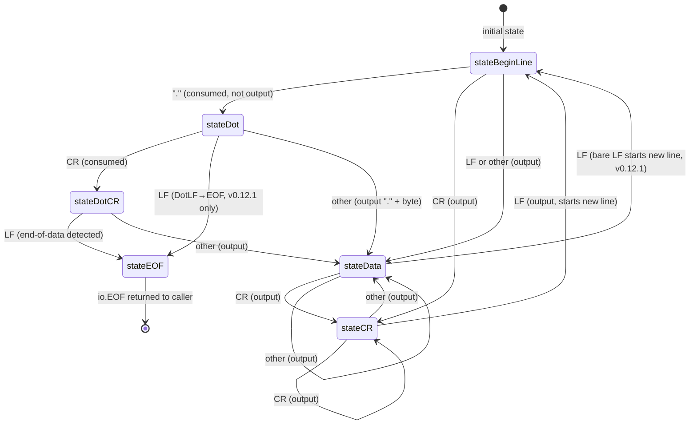
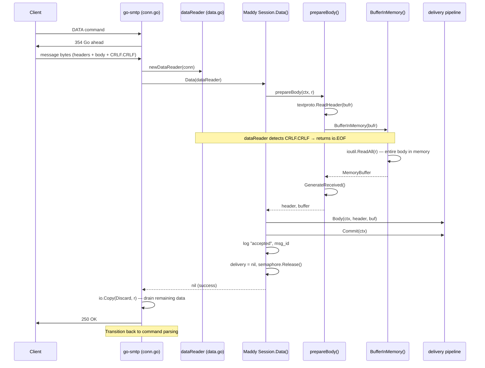
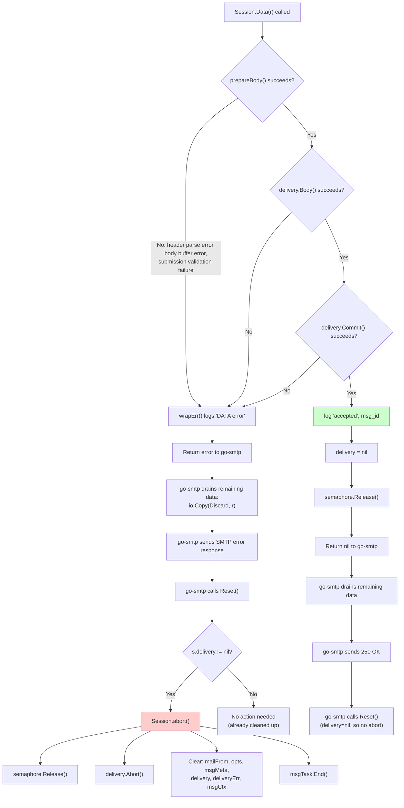

# Maddy SMTP DATA Boundary Behavior: An Investigative Deep-Dive

## Table of Contents

- [Introduction](#introduction)
- [Q1: How Does the Server Decide the Message Is Finished?](#q1-how-does-the-server-decide-the-message-is-finished)
- [Q2: What Happens with Non-Standard Line Endings?](#q2-what-happens-with-non-standard-line-endings)
- [Q3: What Shows Up in Logs and Delivered Messages?](#q3-what-shows-up-in-logs-and-delivered-messages)
- [Q4: Does Boundary Detection Wobble Under Pressure?](#q4-does-boundary-detection-wobble-under-pressure)
- [Q5: How Does a Front Proxy Change the Story?](#q5-how-does-a-front-proxy-change-the-story)
- [Q6: What Lingers When Something Goes Wrong?](#q6-what-lingers-when-something-goes-wrong)
- [Conclusion](#conclusion)

---

## Introduction

### Purpose

This document is an investigative deep-dive into how Maddy's SMTP server handles DATA boundary conditions at runtime. It answers six interrelated questions about:

1. How the server detects the end-of-data marker (`<CRLF>.<CRLF>`)
2. What happens when clients send non-standard line endings that *almost* look like the marker
3. What observable artifacts appear in logs, headers, and responses for each case
4. Whether pipelining and multi-message sessions create boundary detection instability
5. How a front proxy changes the protocol exchange
6. What state persists — or fails to persist — when things go wrong mid-DATA

### Methodology

Every assertion in this document is grounded in **static code analysis** of the Maddy repository and the go-smtp library it depends on. Behavioral claims are supported by either:

- **Direct code-path traces** with `Source: path/to/file.go:LineNumber` citations
- **Test case citations** showing behavior verified by the project's own test suite
- **External library analysis** of go-smtp's public source code and issue tracker

No live testing was performed (Go is not installed in the analysis environment). Where behavior is inferred rather than directly observed, the confidence level is stated explicitly.

### Scope

All analysis is pinned to **go-smtp v0.12.1** (`github.com/emersion/go-smtp v0.12.1-0.20191206174923-1f576e0ec85c`), as specified in the project's dependency file.

> Source: `go.mod:19`

Where newer versions of go-smtp have different behavior (notably v0.20.0 and v0.20.1), this is noted as contrast — but the conclusions apply to the version Maddy actually uses.

### The Single Most Important Architectural Insight

Before diving into the questions, one fact towers above all others:

> **go-smtp is the _sole_ component responsible for DATA boundary detection. Maddy itself never inspects raw SMTP wire bytes.**

Maddy's `Session.Data(r io.Reader)` method receives a **pre-decoded `io.Reader`** from go-smtp. By the time Maddy touches the data stream, dot-stuffing has already been removed and the `<CRLF>.<CRLF>` end-of-data marker has already been consumed. Maddy reads from this `io.Reader` until it returns `io.EOF` — it has no knowledge of how that EOF was determined.

> Source: `internal/endpoint/smtp/smtp.go:312` — `func (s *Session) Data(r io.Reader) error`

This means every question about "how does Maddy handle DATA boundaries" is really a question about go-smtp's `dataReader` state machine, with Maddy acting as a consumer of the decoded stream.

---

## Q1: How Does the Server Decide the Message Is Finished?

### 1.1 Architectural Separation: go-smtp vs. Maddy

The SMTP protocol defines a clear lifecycle for the DATA command:

1. Client sends `DATA\r\n`
2. Server responds `354 Go ahead\r\n`
3. Client sends message content (headers + body)
4. Client sends `<CRLF>.<CRLF>` to signal end-of-data
5. Server responds with `250 OK` (or an error code)

In Maddy's architecture, steps 1–2 and 4–5 are handled entirely by **go-smtp** (`github.com/emersion/go-smtp`). Maddy only participates in step 3: it reads the decoded message content from an `io.Reader` that go-smtp provides.

Here is how the handoff works:

1. go-smtp's `conn.go:handleData()` receives the `DATA` command
2. It creates a `dataReader` by calling `newDataReader(c)` — this wraps the raw TCP connection's buffered reader in a state machine that detects `<CRLF>.<CRLF>` and removes dot-stuffing
3. It calls `c.Session().Data(dataReader)` — passing the `dataReader` (which implements `io.Reader`) to Maddy's session handler
4. Maddy reads from this reader until `io.EOF`
5. After `Session.Data()` returns, go-smtp drains any remaining data: `io.Copy(ioutil.Discard, r)`
6. go-smtp sends the SMTP response and transitions back to command parsing

The critical insight: Maddy's `Session.Data(r io.Reader)` at line 312 of `smtp.go` takes a plain `io.Reader`. It has zero visibility into the raw wire protocol. It cannot distinguish between "the client sent `<CRLF>.<CRLF>`" and "the TCP connection closed" — both manifest as `io.EOF` on the reader.

> Source: `internal/endpoint/smtp/smtp.go:312`

### 1.2 The go-smtp `dataReader` State Machine

The `dataReader` in go-smtp's `data.go` is the heart of DATA boundary detection. Its source code comment states:

> "Code below is taken from net/textproto with only one modification to not rewrite CRLF → LF."

This tells us two things:
1. The state machine is derived from Go's standard library `net/textproto` DotReader
2. Unlike the standard library version (which converts `\r\n` to `\n` in the output), go-smtp preserves the original `\r\n` line endings

The state machine has **six states**:

| State | Meaning |
|-------|---------|
| `stateBeginLine` | At the beginning of a line (initial state; value = 0) |
| `stateDot` | Read `.` at the beginning of a line |
| `stateDotCR` | Read `.\r` at the beginning of a line |
| `stateCR` | Read `\r` (possibly at end of line) |
| `stateData` | Reading data in the middle of a line |
| `stateEOF` | Reached the `.\r\n` end-of-data marker (terminal state) |

The state machine processes one byte at a time from the TCP connection's buffered reader. For each byte, it transitions to a new state and either outputs the byte to the caller's buffer or consumes it silently (for dot-elision and end-of-data detection).

### 1.3 State Machine Diagram



> **Version Note:** The `stateDot` → `stateEOF` transition on bare `LF` (labeled "DotLF→EOF") was **removed in go-smtp v0.20.0**. The `stateData` → `stateBeginLine` transition on bare `LF` was **removed in go-smtp v0.20.1**. Both transitions are **present in v0.12.1**, which is the version Maddy uses.

### 1.4 The Canonical Path to EOF

The only RFC-compliant path to `stateEOF` requires the byte sequence `<CR><LF>.<CR><LF>`:

```
stateBeginLine  ──[CR]──►  stateCR  (or: stateData ──[CR]──► stateCR)
stateCR         ──[LF]──►  stateBeginLine
stateBeginLine  ──[.]──►   stateDot
stateDot        ──[CR]──►  stateDotCR
stateDotCR      ──[LF]──►  stateEOF
```

At `stateEOF`, the `Read()` method returns the bytes accumulated so far plus `io.EOF`. The caller (Maddy's `BufferInMemory` → `ioutil.ReadAll`) receives `io.EOF` and stops reading.

### 1.5 Maddy's `Session.Data()` Reception Path

Once go-smtp invokes `Session.Data(r io.Reader)`, Maddy executes the following code path:

**Step 1: Trace setup**
```
trace.NewTask(s.msgCtx, "DATA")
```
> Source: `internal/endpoint/smtp/smtp.go:313`

**Step 2: Error wrapper definition**
A closure `wrapErr` is defined that logs "DATA error" and delegates to `s.endp.wrapErr()` for SMTP error code translation.
> Source: `internal/endpoint/smtp/smtp.go:316-319`

**Step 3: `prepareBody(bodyCtx, r)`**
This is where the heavy lifting happens:

1. **Wrap in buffered reader:** `bufr := bufio.NewReader(r)` — wraps the `dataReader` in a `bufio.Reader` for efficient reading.
   > Source: `internal/endpoint/smtp/smtp.go:284`

2. **Parse MIME headers:** `hdr, err := textproto.ReadHeader(bufr)` — reads RFC 822 headers from the stream until the blank line separator.
   > Source: `internal/endpoint/smtp/smtp.go:285`

3. **Submission mode processing (if applicable):** If this is a submission endpoint, `s.submissionPrepare(hdr, ...)` validates and potentially adds headers (Message-ID, Date, From/Sender validation).
   > Source: `internal/endpoint/smtp/smtp.go:290-295` and `internal/endpoint/smtp/submission.go:27-130`

4. **Buffer entire body in memory:** `buf, err := buffer.BufferInMemory(bufr)` — calls `ioutil.ReadAll(r)` to read the **entire remaining stream** into a `[]byte` in memory.
   > Source: `internal/endpoint/smtp/smtp.go:298` referencing `internal/buffer/memory.go:27-28`

   This is a critical detail: the body is buffered **atomically**. There is no streaming, no partial writes, no flush behavior. Either the entire body is read successfully, or an error occurs. This eliminates an entire class of timing-dependent boundary issues.

5. **Generate Received header:** `target.GenerateReceived(...)` constructs the trace header with hostname, rDNS, IP, envelope sender, protocol, message ID, and timestamp.
   > Source: `internal/endpoint/smtp/smtp.go:303` referencing `internal/target/received.go:19-87`

6. **Add Received header** to the parsed header set.
   > Source: `internal/endpoint/smtp/smtp.go:307`

**Step 4: Deliver the message**
```go
s.delivery.Body(bodyCtx, header, buf)
s.delivery.Commit(bodyCtx)
```
> Source: `internal/endpoint/smtp/smtp.go:326, 330`

**Step 5: Log success and clean up**
```go
s.log.Msg("accepted", "msg_id", s.msgMeta.ID)
s.delivery = nil
s.endp.semaphore.Release()
```
> Source: `internal/endpoint/smtp/smtp.go:334, 337, 341`

### 1.6 The Moment of Transition: DATA → Command Parsing

After `Session.Data()` returns (whether with `nil` for success or an `error`), go-smtp's `handleData()` function executes two critical cleanup steps:

1. **Drain remaining data:** `io.Copy(ioutil.Discard, r)` — reads and discards any bytes left in the `dataReader`. This ensures the TCP stream is in a clean state even if `Session.Data()` returned early (e.g., due to a header parse error or delivery failure).

2. **Send SMTP response:** `c.WriteResponse(code, enhancedCode, msg)` — sends the `250 OK` (or error) response to the client.

After these steps, go-smtp transitions back to its command-parsing loop, ready to accept the next `MAIL FROM`, `RSET`, `QUIT`, or other command.

The comment in Maddy's `smtp.go` confirms this expectation:

> "go-smtp will call Reset, but it will call Abort if delivery is non-nil"

> Source: `internal/endpoint/smtp/smtp.go:336`

Maddy proactively sets `s.delivery = nil` (line 337) on the success path so that go-smtp's subsequent `Reset` call doesn't trigger an unnecessary abort.

### 1.7 DATA Reception Lifecycle — Sequence Diagram



---

## Q2: What Happens with Non-Standard Line Endings?

### 2.1 RFC 5321 Baseline

RFC 5321 is explicit about line endings in SMTP:

- **§2.3.8:** Lines in SMTP MUST be terminated with `<CRLF>` (the two-character sequence `\r\n`).
- **§4.5.2 (Transparency):** The end-of-data indicator is `<CRLF>.<CRLF>` — a line containing only a period, preceded and followed by `<CRLF>`.
- **§4.1.1.4:** Bare `<LF>` (`\n` without preceding `\r`) MUST NOT be treated as a line terminator in DATA.

In practice, many SMTP implementations are more lenient than the RFC requires, which has historically led to security vulnerabilities — most notably the SMTP smuggling attacks disclosed in December 2023 (CVE-2023-51764 for Postfix).

### 2.2 go-smtp v0.12.1 State Transitions

Because go-smtp v0.12.1's `dataReader` was "taken from net/textproto with only one modification to not rewrite CRLF → LF," it inherits the standard library's state transitions, including two that deviate from strict RFC compliance:

1. **`stateData` + bare `LF` → `stateBeginLine`:** A bare `\n` in the middle of line data triggers a new-line recognition, as if `\r\n` had been received.
2. **`stateDot` + bare `LF` → `stateEOF`:** A bare `\n` after a leading dot terminates DATA, as if `\r` had preceded the `\n`.

These two transitions were progressively removed in later versions:
- **v0.20.0:** Removed transition (2) — "Remove DotLF to EOFState case"
- **v0.20.1:** Removed transition (1) — "Prevent `<LF>.<CR><LF>` SMTP smuggling attacks"

In v0.12.1, **both transitions are present**, making the state machine more permissive than the RFC requires.

### 2.3 Complete State Transition Table (go-smtp v0.12.1)

| Current State | Input `CR` (`\r`) | Input `LF` (`\n`) | Input `.` (dot) | Input other |
|---|---|---|---|---|
| **stateBeginLine** | → `stateCR` (output `\r`) | → `stateData` (output `\n`) | → `stateDot` (consumed) | → `stateData` (output byte) |
| **stateDot** | → `stateDotCR` (consumed) | → **`stateEOF`** ⚠️ | → `stateData` (output `.` + `.`) | → `stateData` (output `.` + byte) |
| **stateDotCR** | → `stateData` (output byte) | → **`stateEOF`** | → `stateData` (output byte) | → `stateData` (output byte) |
| **stateCR** | → `stateCR` (output `\r`) | → `stateBeginLine` (output `\n`) | → `stateData` (output `.`) | → `stateData` (output byte) |
| **stateData** | → `stateCR` (output `\r`) | → **`stateBeginLine`** ⚠️ (output `\n`) | → `stateData` (output `.`) | → `stateData` (output byte) |
| **stateEOF** | — (terminal) | — (terminal) | — (terminal) | — (terminal) |

> ⚠️ marks transitions that deviate from strict RFC 5321 compliance and were removed in later go-smtp versions.

### 2.4 Byte-Sequence Analysis for Each Variant

For each variant, we trace the state machine from its most likely entry state. In a real SMTP session, the end-of-data marker appears after body content, so the current state is typically `stateData` (middle of a line) or `stateBeginLine` (after a proper `\r\n`).

#### Variant 1: `<CRLF>.<CRLF>` — Correct RFC-Compliant Termination

Starting from `stateData` (typical — body content just ended):

| Step | Byte | Current State | → Next State | Output |
|------|------|---------------|--------------|--------|
| 1 | `\r` | stateData | stateCR | `\r` |
| 2 | `\n` | stateCR | **stateBeginLine** | `\n` |
| 3 | `.` | stateBeginLine | stateDot | *(consumed)* |
| 4 | `\r` | stateDot | stateDotCR | *(consumed)* |
| 5 | `\n` | stateDotCR | **stateEOF** | — |

**Result: DATA terminates correctly.** The `io.Reader` returns `io.EOF`. Body content preceding this sequence is delivered intact. This is the only RFC-compliant end-of-data pattern.

#### Variant 2: `<LF>.<LF>` — Bare LF Framing (Classic Smuggling Pattern)

Starting from `stateData`:

| Step | Byte | Current State | → Next State | Output |
|------|------|---------------|--------------|--------|
| 1 | `\n` | stateData | **stateBeginLine** ⚠️ | `\n` |
| 2 | `.` | stateBeginLine | stateDot | *(consumed)* |
| 3 | `\n` | stateDot | **stateEOF** ⚠️ | — |

**Result: DATA TERMINATES in v0.12.1.** ⚠️ This is the classic SMTP smuggling vector. The bare `\n` at step 1 is treated as a line terminator (via `stateData` → `stateBeginLine`), placing the dot at the beginning of a "line." The bare `\n` at step 3 then triggers the DotLF→EOF transition.

Starting from `stateBeginLine` (after a proper `\r\n`):

| Step | Byte | Current State | → Next State | Output |
|------|------|---------------|--------------|--------|
| 1 | `\n` | stateBeginLine | stateData | `\n` |
| 2 | `.` | stateData | stateData | `.` |
| 3 | `\n` | stateData | stateBeginLine | `\n` |

**Result: DATA does NOT terminate.** When starting from `stateBeginLine`, the bare `\n` goes to `stateData` (not back to `stateBeginLine`), so the dot is seen in mid-line and is not treated as a dot-command.

> **Key insight:** The behavior of `<LF>.<LF>` depends on whether the state machine is in `stateData` or `stateBeginLine` when the sequence begins. In practice, body content typically leaves the machine in `stateData`, so the smuggling-vulnerable path is the common one.

#### Variant 3: `<LF>.<CRLF>` — Mixed Framing (Smuggling Vector)

Starting from `stateData`:

| Step | Byte | Current State | → Next State | Output |
|------|------|---------------|--------------|--------|
| 1 | `\n` | stateData | **stateBeginLine** ⚠️ | `\n` |
| 2 | `.` | stateBeginLine | stateDot | *(consumed)* |
| 3 | `\r` | stateDot | stateDotCR | *(consumed)* |
| 4 | `\n` | stateDotCR | **stateEOF** | — |

**Result: DATA TERMINATES in v0.12.1.** ⚠️ The bare `\n` starts a new "line" (step 1), the dot is recognized at line-beginning (step 2), and then the standard `.\r\n` termination completes (steps 3–4). This is the pattern addressed by go-smtp v0.20.1's fix.

#### Variant 4: `<CRLF>.<LF>` — Correct Line Start, Bare LF Termination

Starting from `stateData`:

| Step | Byte | Current State | → Next State | Output |
|------|------|---------------|--------------|--------|
| 1 | `\r` | stateData | stateCR | `\r` |
| 2 | `\n` | stateCR | stateBeginLine | `\n` |
| 3 | `.` | stateBeginLine | stateDot | *(consumed)* |
| 4 | `\n` | stateDot | **stateEOF** ⚠️ | — |

**Result: DATA TERMINATES in v0.12.1.** ⚠️ The `\r\n` correctly transitions to `stateBeginLine` (steps 1–2). The dot is properly recognized at line-beginning (step 3). But the bare `\n` (step 4) triggers the DotLF→EOF transition instead of requiring `\r\n`. This is the transition explicitly removed in go-smtp v0.20.0 ("Remove DotLF to EOFState case").

#### Variant 5: `<CR>.<CR>` — Bare CR Framing

Starting from `stateData`:

| Step | Byte | Current State | → Next State | Output |
|------|------|---------------|--------------|--------|
| 1 | `\r` | stateData | stateCR | `\r` |
| 2 | `.` | stateCR | stateData | `.` |
| 3 | `\r` | stateData | stateCR | `\r` |

**Result: DATA does NOT terminate.** Bare `\r` transitions to `stateCR`, but the `.` at step 2 is seen as data (not at line-beginning), and the second `\r` simply re-enters `stateCR`. No path to `stateEOF` exists from this sequence.

#### Variant 6: `<CR>.<CRLF>` — Bare CR Line Start, Correct Dot Termination

Starting from `stateData`:

| Step | Byte | Current State | → Next State | Output |
|------|------|---------------|--------------|--------|
| 1 | `\r` | stateData | stateCR | `\r` |
| 2 | `.` | stateCR | stateData | `.` |
| 3 | `\r` | stateData | stateCR | `\r` |
| 4 | `\n` | stateCR | stateBeginLine | `\n` |

**Result: DATA does NOT terminate.** The bare `\r` at step 1 enters `stateCR`, but the dot at step 2 transitions to `stateData` (not `stateDot`). The dot is never recognized as a line-beginning dot. The `\r\n` at steps 3–4 starts a new line, but the end-of-data marker was not present.

### 2.5 Summary of Line-Ending Behavior (go-smtp v0.12.1)

| Byte Sequence | Terminates DATA? | RFC 5321 Compliant? | Smuggling Risk? |
|---|---|---|---|
| `<CRLF>.<CRLF>` | ✅ Yes | ✅ Yes | No — correct behavior |
| `<LF>.<LF>` | ⚠️ Yes (from `stateData`) | ❌ No | **High** — classic smuggling |
| `<LF>.<CRLF>` | ⚠️ Yes (from `stateData`) | ❌ No | **High** — smuggling vector |
| `<CRLF>.<LF>` | ⚠️ Yes | ❌ No | **Medium** — DotLF vulnerability |
| `<CR>.<CR>` | ❌ No | N/A | None |
| `<CR>.<CRLF>` | ❌ No | N/A | None |

### 2.6 SMTP Smuggling Context (CVE-2023-51764)

The SMTP smuggling attack, disclosed in December 2023, exploits exactly these non-standard line-ending behaviors. The attack works as follows:

1. An attacker connects to a receiving MTA (e.g., Postfix, Maddy)
2. During DATA, the attacker sends a message body containing `<LF>.<CRLF>` (or similar) embedded within the message
3. A permissive server treats this as end-of-data and begins parsing subsequent bytes as SMTP commands
4. The attacker injects a new `MAIL FROM` / `RCPT TO` / `DATA` sequence, effectively sending an unauthorized second message that appears to originate from the server's domain

**Postfix's response** (CVE-2023-51764): Added the `smtpd_forbid_bare_newline` configuration option, which rejects connections that send bare `\n` outside of DATA content.

**go-smtp's response**: Progressively hardened the `dataReader`:
- **v0.20.0:** Removed `stateDot` + `\n` → `stateEOF` (DotLF case)
- **v0.20.1:** Removed `stateData` + `\n` → `stateBeginLine` (bare LF line recognition)

**Maddy's position (v0.12.1):** The pinned go-smtp version predates these fixes. The `dataReader` state machine in v0.12.1 accepts `<LF>.<LF>`, `<LF>.<CRLF>`, and `<CRLF>.<LF>` as DATA terminators, making it theoretically susceptible to SMTP smuggling patterns. Whether this is exploitable in practice depends on the upstream MTA's behavior and network topology (see Q5 on proxy-mediated traffic).

---

## Q3: What Shows Up in Logs and Delivered Messages?

### 3.1 Successful Delivery Artifacts

When DATA processing completes successfully, the following observable artifacts are produced:

#### Log Entry

```
s.log.Msg("accepted", "msg_id", s.msgMeta.ID)
```

> Source: `internal/endpoint/smtp/smtp.go:334`

This produces a structured log message with the message ID. No additional detail about the DATA boundary, line endings, or body content is logged on the success path.

#### Received Header

The `GenerateReceived()` function constructs an RFC 5321-compliant Received header:

```
Received: from <clientHostname> (<rDNS> [<clientIP>])
    by <serverHostname> (envelope-sender <mailFrom>)
    with <protocol> id <messageID>;
    <timestamp>
```

> Source: `internal/target/received.go:19-87`

Key details:
- **`from` field:** Client's EHLO hostname and resolved rDNS name with IP
- **`by` field:** Server's hostname
- **`with` field:** Protocol identifier (`ESMTP`, `ESMTPS`, `LMTP`, etc.)
- **`id` field:** Maddy-assigned message ID
- **Timestamp:** RFC 1123 formatted

**Sanitization:** The `SanitizeForHeader()` function strips newline characters from header values:

```go
func SanitizeForHeader(raw string) string {
    return strings.Replace(raw, "\n", "", -1)
}
```

> Source: `internal/target/received.go:15-17`

**Notable behavior:** `SanitizeForHeader` only strips `\n`, **not** `\r`. This means injected `\r` characters in EHLO hostnames or rDNS values could theoretically survive into the Received header. In practice, this is mitigated by downstream header folding rules, but it is an observable asymmetry.

#### SMTP Response

On success, go-smtp sends `250 OK` (or the response from `Session.Data()`'s return, which is `nil` → `250 2.0.0 OK`).

#### Body Content

The message body is delivered exactly as decoded by `dataReader`:
- Dot-stuffing has been removed (leading dots on lines that had double-dots)
- `\r\n` line endings are preserved (go-smtp does NOT rewrite CRLF→LF)
- The end-of-data marker (`<CRLF>.<CRLF>`) is consumed and not part of the body
- If non-standard terminators (e.g., `<LF>.<LF>`) were accepted, body content **after** the premature termination would NOT be in the delivered message — it would be interpreted as SMTP commands by go-smtp

### 3.2 Failed/Ambiguous Delivery Artifacts

When DATA processing encounters an error, different artifacts appear depending on the failure point.

#### Error Logging

```go
s.log.Error("DATA error", err, "msg_id", s.msgMeta.ID)
```

> Source: `internal/endpoint/smtp/smtp.go:317`

This is logged by the `wrapErr` closure defined at the beginning of `Session.Data()`. It captures the error and message ID.

#### SMTP Error Response Translation

The `wrapErr()` function at `internal/endpoint/smtp/smtp.go:389-455` translates internal Go errors into SMTP response codes:

| Error Condition | SMTP Code | Enhanced Code | Message |
|---|---|---|---|
| Default (unrecognized error) | `554` | (not set) | `Internal server error` |
| Temporary error flag set | `451` | (not set) | `Internal server error` |
| `context.DeadlineExceeded` | `451` | `4.4.5` | `High load, try again later` |
| `exterrors` with `smtp_code` field | *(from field)* | *(from field)* | *(from field)* |

> Source: `internal/endpoint/smtp/smtp.go:389-455`

Additional `wrapErr()` behaviors:
- Appends `(msg ID = <id>)` to the response message for traceability (lines 436-438)
- Mangles non-ASCII characters to `?` when SMTPUTF8 extension is not in use (lines 441-455)

### 3.3 What You Expect to See But Never Do

Several artifacts that you might expect to find are notably **absent** from Maddy's observable output:

1. **No partial message deliveries** (SMTP path): Because `BufferInMemory()` uses `ioutil.ReadAll(r)`, the body is either fully buffered or not buffered at all. There is no streaming-to-disk that could leave a partial file.
   > Source: `internal/buffer/memory.go:27-28`

2. **No "boundary detected" log entries:** go-smtp handles boundary detection internally and produces no log output for it. Maddy receives `io.EOF` silently.

3. **No raw wire protocol bytes in logs:** Maddy never has access to the raw SMTP protocol bytes during DATA — it only sees the decoded stream from `dataReader`.

4. **No explicit "dot-stuffing removed" indication:** Dot-stuffing removal happens transparently in `dataReader`. The decoded body appears as if dot-stuffing never existed.

5. **No bounce messages from DATA failure:** Bounce/DSN messages are generated by the queue system (`internal/target/queue/`) for delivery failures *after* message acceptance. A DATA-phase failure results in an SMTP error response, not a bounce.

---

## Q4: Does Boundary Detection Wobble Under Pressure?

### 4.1 Why This Question Matters

When multiple messages traverse a single SMTP connection in rapid succession (a "pipelined multi-message session"), several concerns arise:

- Could buffering or timing cause the boundary detection to fail or succeed inconsistently?
- Could state from one transaction leak into the next?
- Could the semaphore or delivery lifecycle create race conditions?

The short answer: **No. Boundary detection is fully deterministic, and state isolation between transactions is complete.** Here is why.

### 4.2 Deterministic Boundary Detection

The `dataReader` state machine is purely synchronous and byte-deterministic. Its behavior depends only on:
1. The current state (one of six values)
2. The next byte from the TCP connection

There are no timers, no buffers with flush thresholds, no concurrency primitives, and no external state that could cause the same byte sequence to produce different results. The state machine processes one byte at a time in a tight loop.

Furthermore, `BufferInMemory()` uses `ioutil.ReadAll(r)` to consume the entire decoded stream atomically:

```go
func BufferInMemory(r io.Reader) (Buffer, error) {
    blob, err := ioutil.ReadAll(r)
    if err != nil {
        return nil, err
    }
    return &MemoryBuffer{slice: blob}, nil
}
```

> Source: `internal/buffer/memory.go:27-33`

There is no partial-read/partial-write behavior. The `ioutil.ReadAll` call blocks until `io.EOF` or error. The body is either completely in memory or not at all.

### 4.3 State Isolation Between Transactions

After a successful `Session.Data()`, Maddy clears all per-message state:

```go
s.delivery = nil    // line 337
s.msgCtx = nil      // line 338 (implied by context scope)
s.msgTask.End()     // line 339
s.msgTask = nil     // line 340
s.endp.semaphore.Release()  // line 341
```

> Source: `internal/endpoint/smtp/smtp.go:337-341`

Each new message starts fresh via `startDelivery()` (lines 83-160), which creates:
- New `MsgMetadata` with a unique ID
- New `msgCtx` (derived from the session context)
- New `delivery` pipeline instance
- New semaphore acquisition

> Source: `internal/endpoint/smtp/smtp.go:83-160`

On go-smtp's side, after `Session.Data()` returns and the response is sent, go-smtp calls `c.reset()` which invokes `Session.Reset()`. Maddy's `Reset()` checks if `delivery != nil` and calls `abort()` if so — but since the success path already set `delivery = nil`, this is a no-op.

> Source: `internal/endpoint/smtp/smtp.go:60-65`

### 4.4 Test Evidence: `TestSMTPDelivery_Multi`

The test suite explicitly verifies multi-message behavior:

```go
// First message
c.Mail("sender1@example.org", nil)
c.Rcpt("rcpt1@example.com", nil)
c.Rcpt("rcpt2@example.com", nil)
wc, _ := c.Data()
io.WriteString(wc, testMsg)
wc.Close()

// Second message (same connection)
c.Mail("sender2@example.org", nil)
c.Rcpt("rcpt3@example.com", nil)
c.Rcpt("rcpt4@example.com", nil)
wc, _ = c.Data()
io.WriteString(wc, testMsg)
wc.Close()

// Verify both messages delivered independently
assert.Equal(t, 2, len(tgt.Messages))
```

> Source: `internal/endpoint/smtp/smtp_test.go:322-358`

The test asserts:
- Both messages are delivered (`len(tgt.Messages) == 2`)
- Each message has the correct envelope sender and recipients
- Each message has a Received header with the correct message ID
- Message metadata (IDs, senders) does not leak between transactions

### 4.5 Semaphore and Delivery Lifecycle

Maddy uses a semaphore to limit concurrent message processing. The lifecycle per transaction is:

1. **Acquire:** `s.endp.semaphore.TakeContext(deliveryCtx)` in `startDelivery()` (line 123)
2. **Release (success):** `s.endp.semaphore.Release()` in `Data()` (line 341)
3. **Release (failure):** `s.endp.semaphore.Release()` in `abort()` (line 68)

> Source: `internal/endpoint/smtp/smtp.go:68, 123, 341`

Every transaction independently acquires and releases the semaphore. There is no shared semaphore state between transactions that could cause one transaction's boundary detection to affect another's.

### 4.6 RSET (Reset) Behavior

The `TestSMTPDelivery_Reset` test verifies that a `RSET` command between transactions produces a clean state:

1. `MAIL FROM` + `RCPT TO` (start a transaction)
2. `RSET` (abort the transaction)
3. `MAIL FROM` + `RCPT TO` + `DATA` (complete a new transaction)
4. Assert: `len(tgt.Messages) == 1` (only the second transaction produced a message)

> Source: `internal/endpoint/smtp/smtp_test.go:429-462`

`Session.Reset()` calls `abort()` if a delivery is in progress, which cleans up all per-message state (delivery, semaphore, metadata, context).

> Source: `internal/endpoint/smtp/smtp.go:60-65`

### 4.7 Conclusion: No Wobble

Boundary detection does not "wobble" under pipelining pressure because:

1. The `dataReader` state machine is purely byte-deterministic with no external dependencies
2. `ioutil.ReadAll` provides atomic body consumption with no timing-sensitive behavior
3. go-smtp's drain pattern (`io.Copy(ioutil.Discard, r)`) ensures the TCP stream is clean between transactions
4. Maddy's state cleanup is thorough: delivery, context, semaphore, and metadata are all reset
5. The test suite explicitly verifies multi-message isolation

---

## Q5: How Does a Front Proxy Change the Story?

### 5.1 Why Consider a Proxy?

Given the SMTP smuggling vulnerabilities identified in Q2 (where go-smtp v0.12.1 accepts non-standard DATA terminators), a natural question is: what happens when a front proxy sits between the client and Maddy? A proxy can normalize, filter, or reject traffic before it reaches go-smtp's `dataReader`.

### 5.2 Proxy Normalization Scenarios

#### Scenario A: Transparent Proxy (No Normalization)

A proxy that passes all bytes unchanged (e.g., a TCP load balancer or HAProxy in TCP mode) has **zero effect** on DATA boundary behavior. Maddy's go-smtp `dataReader` receives the exact same byte stream as if the client connected directly.

**Protocol exchange:** Unchanged.
**Error surface:** Unchanged.
**Delivered content:** Unchanged.

#### Scenario B: Line-Ending Normalizing Proxy

A proxy that rewrites bare `\n` to `\r\n` (or strips bare `\r` and bare `\n` entirely) eliminates all SMTP smuggling vectors:

- `<LF>.<LF>` → `<CRLF>.<CRLF>` → legitimate end-of-data (or `<LF>` stripped entirely)
- `<LF>.<CRLF>` → `<CRLF>.<CRLF>` → legitimate end-of-data
- `<CRLF>.<LF>` → `<CRLF>.<CRLF>` → legitimate end-of-data

In all cases, the ambiguity is resolved before the traffic reaches go-smtp. The `dataReader` only ever sees RFC-compliant byte sequences.

**Protocol exchange:** Client sends non-compliant bytes → proxy normalizes → Maddy sees compliant bytes → `250 OK`.
**Error surface:** No errors from Maddy's perspective (the proxy made everything look correct).
**Delivered content:** The message body would have bare `\n` replaced with `\r\n`, which may alter message content but prevents smuggling.

#### Scenario C: Strict Rejection Proxy

A proxy that rejects connections sending bare `\n` (analogous to Postfix's `smtpd_forbid_bare_newline=yes`) prevents the attacker from reaching Maddy entirely:

**Protocol exchange:** Client sends bare `\n` → proxy responds with `421` or `500`-series error → connection closed. Maddy never sees the traffic.
**Error surface:** The proxy generates the error. Maddy's logs show nothing (the connection never reached Maddy's session handler, or was cleanly rejected at the proxy level).
**Delivered content:** No delivery occurs.

### 5.3 Maddy's Outbound Relay Behavior

When Maddy acts as a relay (forwarding messages to downstream servers), it uses `smtpconn.C.Data()`:

```go
func (c *C) Data(ctx context.Context, hdr textproto.Header, body io.Reader, ...) error {
    wc, err := c.cl.Data()   // go-smtp client's dot-stuffing writer
    ...
    textproto.WriteHeader(wc, hdr)   // write headers
    io.Copy(wc, body)                // write body
    wc.Close()                       // sends CRLF.CRLF
}
```

> Source: `internal/smtpconn/smtpconn.go:303-324`

Key points:
- `c.cl.Data()` returns an `io.WriteCloser` that performs dot-stuffing: any line starting with `.` gets a second dot prepended, and `Close()` sends the proper `<CRLF>.<CRLF>` terminator
- `textproto.WriteHeader()` writes headers with `\r\n` line endings
- `io.Copy()` writes the body as-is

**Maddy's outbound relay always produces RFC-compliant SMTP.** Regardless of how the original message was received (even if via a non-standard DATA terminator in v0.12.1), the relayed copy uses proper `<CRLF>.<CRLF>` termination.

### 5.4 Proxy Deployment Recommendation

Given that go-smtp v0.12.1 accepts non-standard DATA terminators (Q2), deploying a front proxy that normalizes or rejects bare newlines is the most effective mitigation:

| Proxy Type | Smuggling Risk | Message Integrity | Operational Complexity |
|---|---|---|---|
| No proxy | ⚠️ Vulnerable (v0.12.1) | Unchanged | None |
| Transparent (TCP) | ⚠️ Vulnerable | Unchanged | Low |
| Line-normalizing | ✅ Eliminated | Modified (bare `\n` → `\r\n`) | Medium |
| Strict rejection | ✅ Eliminated | Unchanged (non-compliant rejected) | Medium |

The alternative mitigation is to upgrade go-smtp to v0.20.1 or later, which addresses the issue at the library level.

---

## Q6: What Lingers When Something Goes Wrong?

### 6.1 Failure Modes During DATA

Several things can go wrong during DATA processing:

1. **Client disconnects** before sending `<CRLF>.<CRLF>` (connection close)
2. **Header parsing fails** (malformed headers in `textproto.ReadHeader`)
3. **Body buffering fails** (out of memory, message too large)
4. **Delivery pipeline fails** (`delivery.Body()` or `delivery.Commit()` returns error)
5. **Submission header validation fails** (missing From, invalid Date, etc.)
6. **Client times out** (stops sending mid-DATA)

For each failure mode, we need to understand: what state is cleaned up, what artifacts remain, and what the client sees.

### 6.2 The Abort Path: `Session.abort()`

The `abort()` method is the central cleanup handler for all failure paths:

```go
func (s *Session) abort(ctx context.Context) {
    s.endp.semaphore.Release()                          // line 68
    if err := s.delivery.Abort(ctx); err != nil {       // line 69
        s.endp.Log.Error("delivery abort failed", err)  // line 70
    }
    s.log.Msg("aborted", "msg_id", s.msgMeta.ID)       // line 72

    s.mailFrom = ""                                     // line 74
    s.opts = smtp.MailOptions{}                          // line 75
    s.msgMeta = nil                                     // line 76
    s.delivery = nil                                    // line 77
    s.deliveryErr = nil                                 // line 78
    s.msgCtx = nil                                      // line 79
    s.msgTask.End()                                     // line 80
}
```

> Source: `internal/endpoint/smtp/smtp.go:67-81`

**The abort is thorough.** Every piece of per-message state is zeroed:
- `semaphore` → released (prevents deadlock on future messages)
- `delivery` → `Abort()` called (tells the delivery pipeline to roll back)
- `mailFrom`, `opts` → cleared (no sender leak)
- `msgMeta` → nil (no metadata leak)
- `delivery`, `deliveryErr` → nil (no pipeline leak)
- `msgCtx` → nil (no context leak)
- `msgTask` → `End()` (trace task closed)

### 6.3 The go-smtp Drain Pattern

After `Session.Data(r)` returns — whether with success (`nil`) or error — go-smtp's `handleData()` function drains the `dataReader`:

```go
r.limited = false
io.Copy(ioutil.Discard, r) // Make sure all the data has been consumed
```

> Source: go-smtp `conn.go:handleData()` (external library)

This is critical for understanding failure recovery:
- If Maddy's `Session.Data()` returns an error after reading only the headers (e.g., `textproto.ReadHeader` fails), the body is still sitting in the TCP buffer
- Without draining, those body bytes would be interpreted as SMTP commands, causing protocol desynchronization
- The drain reads and discards all bytes until the `dataReader` reaches `stateEOF` (i.e., until the client sends the actual `<CRLF>.<CRLF>` terminator)

**Edge case:** If the client never sends the terminator (e.g., disconnects), the drain blocks until the TCP connection times out or is closed. This is the scenario described in go-smtp issue #196.

### 6.4 Test Evidence: `TestSMTPDelivery_AbortData`

This test verifies behavior when the client disconnects mid-DATA:

```go
// Send EHLO, MAIL FROM, RCPT TO
// Begin DATA and send message bytes
// Close connection WITHOUT sending CRLF.CRLF
conn.Close()
time.Sleep(250 * time.Millisecond)
// Verify: no messages delivered
assert.Equal(t, 0, len(tgt.Messages))
```

> Source: `internal/endpoint/smtp/smtp_test.go:360-396`

**Conclusion: Incomplete DATA results in zero delivered messages.** The connection close causes `dataReader.Read()` to return `io.ErrUnexpectedEOF`, which propagates through `ioutil.ReadAll` → `BufferInMemory` → `prepareBody` → `Data` as an error. Since `delivery.Body()` was never called, there is nothing to deliver.

### 6.5 Test Evidence: `TestSMTPDelivery_AbortLogout`

This test verifies behavior when the client disconnects *before* DATA:

```go
// Send EHLO, MAIL FROM, RCPT TO
// Close connection (no DATA command sent)
conn.Close()
time.Sleep(250 * time.Millisecond)
// Verify: no messages delivered
assert.Equal(t, 0, len(tgt.Messages))
```

> Source: `internal/endpoint/smtp/smtp_test.go:398-427`

`Session.Logout()` is called by go-smtp when the connection closes. Maddy's implementation:

```go
func (s *Session) Logout() error {
    if s.delivery != nil {
        s.abort(s.sessCtx)
    }
    ...
}
```

> Source: `internal/endpoint/smtp/smtp.go:269-280`

If a delivery was in progress (post-`MAIL FROM`/`RCPT TO`), `abort()` cleans everything up.

### 6.6 Timeout Scenarios (go-smtp Issue #196)

go-smtp issue #196 documents a problematic pattern:

1. Client initiates DATA and starts sending body content
2. Client becomes slow or stops sending
3. go-smtp's `ReadTimeout` fires, causing the `dataReader.Read()` to return a timeout error
4. `Session.Data()` returns with the timeout error
5. go-smtp's drain (`io.Copy(ioutil.Discard, r)`) also times out or blocks
6. Meanwhile, go-smtp writes the `421 4.0.0 ... timeout` error response
7. The slow client eventually sends more data, which go-smtp interprets as a new SMTP command
8. The leftover DATA bytes look like "mangled SMTP commands" in go-smtp's log

The proposed fix: close the TCP connection entirely on DATA timeout, rather than attempting to recover the session. This prevents the protocol desynchronization caused by leftover DATA bytes.

> Source: go-smtp Issue #196 on GitHub

**Impact on Maddy:** In v0.12.1, this timeout scenario can cause confusing log entries (go-smtp trying to parse message body bytes as SMTP commands). However, it does not cause message delivery to wrong recipients or data corruption — the session is either in a failed state or has been cleaned up via `abort()`.

### 6.7 Abort/Cleanup Decision Tree



### 6.8 What You Expect to See But Never Do

1. **No partial deliveries** in the SMTP path: The body is either fully buffered via `ioutil.ReadAll` (success) or not buffered at all (error). There is no intermediate state where half a message is delivered.

2. **No bounce messages from DATA failure:** Bounce/DSN messages are generated by the queue system (`internal/target/queue/`) for delivery failures *after* a message has been accepted (`250 OK`). A DATA-phase failure results in an immediate SMTP error response — no bounce is generated because the message was never accepted.

3. **No leaked semaphores:** The semaphore is released on both the success path (line 341) and the abort path (line 68). There is no code path through `Data()` where the semaphore remains held after the method returns.
   > Source: `internal/endpoint/smtp/smtp.go:68, 341`

4. **No dangling delivery objects:** Both the success path (`s.delivery = nil`, line 337) and the abort path (`s.delivery = nil`, line 77) nil out the delivery reference. go-smtp's subsequent `Reset()` call finds `delivery == nil` and skips the abort.
   > Source: `internal/endpoint/smtp/smtp.go:77, 337`

5. **No unfinished trace tasks:** `s.msgTask.End()` is called on both the success path (line 339) and the abort path (line 80), ensuring the trace/profiling system does not accumulate unclosed tasks.
   > Source: `internal/endpoint/smtp/smtp.go:80, 339`

### 6.9 LMTP Contrast: Partial Delivery Semantics

While the SMTP path offers all-or-nothing delivery semantics, the LMTP path (RFC 2033) has different behavior:

```go
func (s *Session) LMTPData(r io.Reader, sc smtp.StatusCollector) error {
    ...
    s.delivery.BodyNonAtomic(bodyCtx, sc, header, buf)  // line 369
    // We can't really tell whether it is failed completely
    // or succeeded so always commit.
    s.delivery.Commit(bodyCtx)                          // line 374
    ...
}
```

> Source: `internal/endpoint/smtp/smtp.go:355-387`

Key differences:
- **`BodyNonAtomic`** (line 369) allows individual recipients to succeed or fail independently, with per-recipient status reported via the `StatusCollector`
- **Always commits** (line 374): Because the delivery result is mixed (some recipients may succeed, others may fail), LMTP always commits rather than aborting
- The comment at lines 371-372 acknowledges the ambiguity: "We can't really tell whether it is failed completely or succeeded so always commit."

This contrast highlights that the SMTP path's clean all-or-nothing semantics (where abort/cleanup is straightforward) do not extend to LMTP. LMTP's partial delivery model means that failure residuals are more complex — some recipients may have received the message even if others failed.

---

## Conclusion

### Summary of Findings

| Question | Key Finding |
|---|---|
| **Q1: Boundary Detection** | go-smtp is the sole gatekeeper. Maddy receives a pre-decoded `io.Reader` and never sees wire protocol bytes. The `dataReader` state machine is the entire boundary detection mechanism. |
| **Q2: Line-Ending Edge Cases** | go-smtp v0.12.1 accepts `<CRLF>.<LF>`, `<LF>.<CRLF>`, and `<LF>.<LF>` (from `stateData`) as DATA terminators — deviating from RFC 5321. These transitions were removed in v0.20.0 and v0.20.1. |
| **Q3: Observable Artifacts** | Successful delivery produces a log entry (`"accepted"`) and a Received header. Failures produce `"DATA error"` logs and SMTP error codes via `wrapErr()`. No raw protocol artifacts are visible to Maddy. |
| **Q4: Pipelining Stability** | Boundary detection is fully deterministic (byte-driven, no timing dependencies). State isolation between transactions is complete (verified by `TestSMTPDelivery_Multi`). No wobble is possible. |
| **Q5: Proxy Impact** | A line-normalizing or strict-rejection proxy eliminates all smuggling vectors before traffic reaches go-smtp. Maddy's outbound relay always produces RFC-compliant SMTP. |
| **Q6: Failure Residuals** | The `abort()` method is thorough: semaphore, delivery, metadata, and context are all cleaned up. go-smtp's drain pattern prevents protocol desynchronization. No partial deliveries, no leaked state. |

### Architectural Strengths

1. **Clean separation of concerns:** Maddy delegates all wire protocol handling to go-smtp, operating at the message-content level. This simplifies Maddy's code and concentrates protocol complexity in a single, well-defined library.

2. **Atomic body buffering:** `BufferInMemory` + `ioutil.ReadAll` eliminates streaming-related race conditions and ensures all-or-nothing body processing.

3. **Thorough abort handling:** The `abort()` method cleans up every piece of per-message state. Both success and failure paths release the semaphore, nil out the delivery, and end trace tasks.

4. **Test-verified multi-message isolation:** The test suite explicitly verifies that consecutive transactions on a single connection do not interfere with each other.

### Architectural Gaps

1. **SMTP smuggling susceptibility (v0.12.1):** The pinned go-smtp version accepts non-RFC-compliant DATA terminators (`<LF>.<LF>`, `<LF>.<CRLF>`, `<CRLF>.<LF>`). This was addressed in go-smtp v0.20.0 and v0.20.1. Upgrading the dependency or deploying a normalizing proxy would mitigate this.

2. **No bare-newline rejection at the Maddy level:** Maddy has no mechanism to detect or reject bare `\n` characters in the SMTP protocol exchange, because it never sees raw protocol bytes. Any defense against bare-newline attacks must come from go-smtp or a front proxy.

3. **`SanitizeForHeader` asymmetry:** The function strips `\n` but not `\r` from Received header values. While unlikely to be exploitable in practice, this is an inconsistency worth noting.
   > Source: `internal/target/received.go:15-17`

4. **DATA timeout protocol desynchronization:** As documented in go-smtp issue #196, a DATA timeout can leave the TCP connection in an ambiguous state where leftover body bytes are interpreted as SMTP commands. The fix (closing the connection on timeout) has been proposed but may not be present in v0.12.1.

### Version-Specific Applicability

All findings in this document are specific to:
- **Maddy** at the commit analyzed
- **go-smtp v0.12.1** (`v0.12.1-0.20191206174923-1f576e0ec85c` per `go.mod` line 19)

Upgrading go-smtp to v0.20.1 or later would eliminate the SMTP smuggling vulnerabilities identified in Q2, as both the DotLF→EOF transition and the bare-LF→stateBeginLine transition have been removed in those versions.
