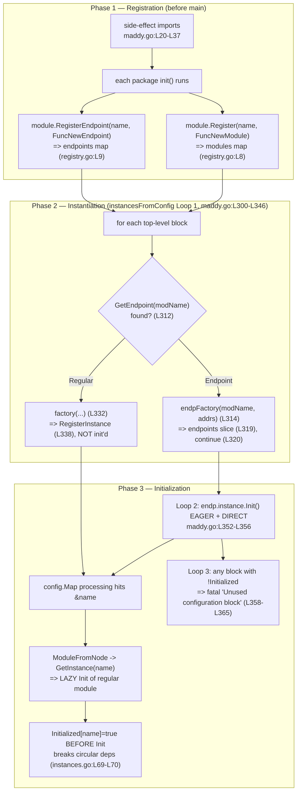

# maddy Module System at Startup — Onboarding (commit `26452dd8dd78`)

> Repository: `github.com/foxcpp/maddy` • Commit: `26452dd8dd787dc455278b0fdd296f4a5432c768` • Branch: `maddy_26452dd8dd78`

**maddy** is a single-process mail server written in Go (Go module `github.com/foxcpp/maddy`, `[go.mod:L1]`). A single binary hosts every role a mail system needs — SMTP/Submission/LMTP servers, an IMAP server, authentication, storage, message checks, and message modifiers. What ties these roles together is maddy's **module system**: every functional unit is a "module" that implements a small `Module` interface (`[internal/module/module.go:L29-L47]`), **self-registers** into a global factory registry from a package `init()`, and is then **wired together purely through the configuration file** using directives and `&name` references. There is no hand-written dependency-injection code in `main`; the config file *is* the composition.

This document answers six onboarding questions about how that system "comes together" when the server starts, with emphasis on a configuration that mixes **SMTP** endpoints (`smtp`, `submission`) and an **IMAP** endpoint (`imap`). It is written **run-first**: the maddy binary was built and executed against a canonical mixed configuration, and every behavioral claim below is backed by the **actual captured output** (reproduced verbatim), then explained as *cause → effect* with a verified `file:line` anchor. Anything that was not directly observed at runtime is explicitly labeled **inferred**.

## Run-first methodology, environment, and exact commands

All observation was performed inside the project's canonical Docker toolchain image so that the values reported here reflect a normal, reproducible build — not a host-specific artifact.

- **Go toolchain:** `go1.18.10 linux/amd64`. This satisfies the module's declared minimum `go 1.13` (`[go.mod:L3]`) and the `REQUIRED_GOVERSION=1.13.0` documented in `[get.sh:L3]` (default download `1.13.4`, `[get.sh:L10]`). The canonical image ships 1.18.10, so that is what is reported here.
- **C compiler:** `cc (Debian 10.2.1-6) 10.2.1`. **CGO is required** because the default `sql` storage driver uses `github.com/mattn/go-sqlite3` (`[go.mod:L26]`, `v1.11.0`), which is a CGO binding.
- **TLS helper:** `OpenSSL 1.1.1n` (used only to mint a throwaway self-signed certificate for the observation config).

**Build** (run from the repository root; the binary is written outside the repo to keep the tree pristine) — observed exit code `0`:

```bash
CGO_ENABLED=1 go build -o /tmp/maddybin ./cmd/maddy
```

The only thing this build prints is a harmless warning emitted by the sqlite3 C binding while compiling its bundled amalgamation:

```text
# github.com/mattn/go-sqlite3
sqlite3-binding.c: In function 'sqlite3SelectNew':
sqlite3-binding.c:125322:10: warning: function may return address of local variable [-Wreturn-local-addr]
125322 |   return pNew;
       |          ^~~~
sqlite3-binding.c:125282:10: note: declared here
125282 |   Select standin;
       |          ^~~~~~~
```

**Run** — the correct invocation is simply the binary plus flags:

```bash
/tmp/maddybin -debug -config /tmp/obs/maddy.conf
```

> **Invocation correction.** Some upstream planning notes show a trailing `run` subcommand (`... -config <file> run`). **At this commit there is no `run` subcommand.** A trailing positional argument is rejected by `Run()` at `[maddy.go:L120]` (`if len(flag.Args()) != 0` → prints usage → returns `2`). The correct command has **no** positional argument; the `run`-argument behavior is documented as **Edge 4** below.

The full 52-line observation config (mixing `smtp` + `submission` + `imap`, with an intentionally out-of-order `&remote_queue` reference) and every command used are collected in **Appendix A**. A per-item coverage checklist is in **Appendix B**.

A note on log formatting reproduced throughout: maddy writes each log record terminated by a literal **TAB** character (verified with `cat -A`, which renders it as `^I` before the newline). That trailing whitespace is cosmetic and is omitted from the quoted blocks below for readability; the visible text is otherwise verbatim.

---

## The Three-Phase Assembly Model (Registration → Instantiation → Initialization)

The single most useful mental model for maddy startup is that it proceeds in **three distinct phases**. Phase 1 happens before `main` even runs; Phases 2 and 3 happen inside one function, `instancesFromConfig` (`[maddy.go:L294-L375]`). Keeping these phases separate is exactly what lets the config look declarative and order-independent.

| Phase | When | What happens | Key code | Result |
|-------|------|--------------|----------|--------|
| **1 — Registration** | Process start, *before* `main()` | Go runs every imported package's `init()`. Each module package calls `module.Register(name, …)` or `module.RegisterEndpoint(name, …)`, populating two global **factory maps**. | side-effect imports `[maddy.go:L20-L37]`; `Register` `[internal/module/registry.go:L19]`; `RegisterEndpoint` `[internal/module/registry.go:L56]` | `modules` map `[registry.go:L8]` + `endpoints` map `[registry.go:L9]` populated. Nothing is configured or listening. |
| **2 — Instantiation** | `instancesFromConfig` Loop 1 `[maddy.go:L300-L346]` | For each top-level config block, look up its factory and **construct** an instance object. Endpoints go to a separate slice; regular modules are placed in the **instance registry**. **No `Init` is called.** | `GetEndpoint` `[maddy.go:L312]`; `Get` `[maddy.go:L323]`; `RegisterInstance` `[maddy.go:L338]` | Instance objects exist but are un-initialized. |
| **3 — Initialization** | `instancesFromConfig` Loops 2 & 3 `[maddy.go:L352-L365]` | Endpoints are initialized **eagerly and directly** (Loop 2). Each endpoint's `Init` processes its directives; a `&name` reference triggers the target regular module's **lazy** `Init` on first use. Loop 3 then fails startup if any block was never initialized. | endpoint `Init` `[maddy.go:L353]`; lazy `GetInstance` `[internal/module/instances.go:L53]`; unused-block guard `[maddy.go:L358-L365]` | Endpoints listening; referenced modules initialized; unreferenced blocks are fatal. |



The two vocabulary words that recur below map onto this model:

- **"Registered immediately"** = the *factory functions* placed into the `modules`/`endpoints` maps in Phase 1, **plus** the *constructed instance objects* placed into the instance registry in Phase 2.
- **"Unresolved until later"** = the `Init` calls, deferred to Phase 3 and, for regular modules, driven lazily by `&` references.

---

## Q1 — Startup assembly across mixed `smtp` / `submission` / `imap` endpoints

**Direct answer.** Startup is the three-phase assembly described above, driven through the real entry chain `main()` → `maddy.Run()` → `moduleMain()` → `instancesFromConfig()`. With a configuration that mixes `smtp`, `submission`, and `imap`, all three endpoint instances are **constructed** in Loop 1 and then **eagerly initialized** in Loop 2, and each one binds its network listener at the moment its `Init` completes. There is no separate "wiring" step — the endpoints are the entry points, and initializing them pulls in everything they reference.

**Mechanism (cause → effect).**

1. `main()` is 2 lines: it calls `os.Exit(maddy.Run())` (`[cmd/maddy/main.go:L9-L10]`).
2. `Run()` (`[maddy.go:L102]`) parses flags, rejects stray positional arguments (`[maddy.go:L120]`), reads the config into a `[]config.Node` tree via `parser.Read` (`[maddy.go:L150]`, parser type at `[pkg/cfgparser/parse.go:L18-L25]`), and calls `moduleMain(cfg)` (`[maddy.go:L157]`).
3. `moduleMain()` (`[maddy.go:L243]`) processes global directives (`state`, `runtime`, `hostname`, `tls`, …) and then calls `instancesFromConfig(globals.Values, unknown)` (`[maddy.go:L267]`).
4. `instancesFromConfig()` (`[maddy.go:L294]`) is the master assembly routine. It keeps two slices — `endpoints` and `mods` (`[maddy.go:L296-L297]`) — and executes three loops:
   - **Loop 1 (construct):** for each block it calls `module.GetEndpoint(modName)` (`[maddy.go:L312]`). If that returns a factory, the block is an **endpoint**: it is built with `endpFactory(modName, block.Args)` (`[maddy.go:L314]`), appended to the `endpoints` slice (`[maddy.go:L319]`), and the loop `continue`s (`[maddy.go:L320]`) — endpoints are *not* placed in the instance registry. Otherwise the block is a **regular module**: `module.Get(modName)` (`[maddy.go:L323]`) yields its factory, `factory(...)` constructs it (`[maddy.go:L332]`), and `module.RegisterInstance(...)` files it in the instance registry (`[maddy.go:L338]`).
   - **Loop 2 (initialize endpoints):** `endp.instance.Init(...)` is called for each endpoint (`[maddy.go:L352-L356]`). This is where `smtp`, `submission`, and `imap` bind their listeners, in the order they appeared in the config.
   - **Loop 3 (settle check):** any regular block never marked initialized is a fatal error (`[maddy.go:L358-L365]`).

The `smtp` and `submission` blocks are served by the **same** endpoint constructor `New` (`[internal/endpoint/smtp/smtp.go:L488]`), registered under three names in one `init()` (`[internal/endpoint/smtp/smtp.go:L714-L717]`: `smtp`, `submission`, `lmtp`); `imap` is a distinct constructor `New` (`[internal/endpoint/imap/imap.go:L44]`) registered in its own `init()` (`[internal/endpoint/imap/imap.go:L220-L221]`).

**Observed evidence.** Command:

```bash
/tmp/maddybin -debug -config /tmp/obs/maddy.conf
```

```text
[debug] tls: using /tmp/obs/cert.pem//tmp/obs/key.pem
[debug] tls: min version: 0, max version: 0
[debug] sql: go-imap-sql version 0.4.0
[debug] /tmp/obs/maddy.conf:18: reference &local_mailboxes
smtp: listening on tcp://127.0.0.1:2525
[debug] /tmp/obs/maddy.conf:23: reference &local_authdb
[debug] /tmp/obs/maddy.conf:26: reference &local_mailboxes
[debug] /tmp/obs/maddy.conf:35: new module remote []
[debug] /tmp/obs/maddy.conf:40: reference &local_mailboxes
[debug] queue: delivery target: *remote.Target
[debug] /tmp/obs/maddy.conf:29: reference &remote_queue
[debug] submission: authentication provider: sql local_mailboxes
submission: listening on tls://127.0.0.1:5870
[debug] /tmp/obs/maddy.conf:50: reference &local_authdb
[debug] /tmp/obs/maddy.conf:51: reference &local_mailboxes
imap: listening on tls://127.0.0.1:1930
signal received (terminated), next signal will force immediate shutdown.
```

The three `X: listening on …` lines appear in **config order** — `smtp` (port 2525) → `submission` (port 5870) → `imap` (port 1930) — each marking the completion of that endpoint's `Init` inside Loop 2. The run stays alive until it receives a signal; here it was terminated with `SIGTERM` (sent via `timeout -s TERM`), and it shut down gracefully, printing `signal received (terminated), …`. This output was **identical across two consecutive runs** (stable).

---

## Q2 — Immediate registration vs. deferred initialization

**Direct answer.** Two different things are "registered immediately," and one thing is "unresolved until later." Immediately registered: (a) the module **factory functions**, filed into the global `modules`/`endpoints` maps in Phase 1 by each package's `init()`; and (b) the **constructed instance objects** of every top-level block, filed into the instance registry by `RegisterInstance` during Loop 1. What stays unresolved until later is every regular module's **`Init` call** — it does not run until something references the module (or, for endpoints, until Loop 2).

**Mechanism (cause → effect).**

- The **factory registry** lives in `[internal/module/registry.go]`: two maps `modules` (`[registry.go:L8]`) and `endpoints` (`[registry.go:L9]`) guarded by a `sync.RWMutex` (`[registry.go:L10]`). `Register` (`[registry.go:L19]`) and `RegisterEndpoint` (`[registry.go:L56]`) insert into them and **panic on a duplicate name** (`[registry.go:L24]`, `[registry.go:L61]`). These run from package `init()`s pulled in by the side-effect imports (`[maddy.go:L20-L37]`) — i.e., before `main`.
- The **instance registry** lives in `[internal/module/instances.go]`: the `instances` map of `{mod, cfg}` (`[instances.go:L10-L13]`), an `aliases` map (`[instances.go:L14]`), and a separate `Initialized` map (`[instances.go:L16]`). `RegisterInstance` (`[instances.go:L23]`) files a constructed object; crucially it does **not** call `Init`.
- In Loop 1, `instancesFromConfig` constructs each regular block with `factory(...)` (`[maddy.go:L332]`) and immediately `RegisterInstance`s it (`[maddy.go:L338]`) — but the `Init` calls only happen in Phase 3. The reason `Init` is deliberately kept out of the constructor is documented on the `Module` interface itself (`[internal/module/module.go:L32-L35]`), preserving the source's exact wording (including its typo):

  > "It is not done in FuncNewModule so all module instances are registered at time of initialization, thus initialization does not depends on ordering of configuration blocks and modules can reference each other without any problems."

  (The typo "does not **depends**" is present in the source and is preserved here exactly.)

**Observed evidence.** Excerpt from the Q1 command above (`/tmp/maddybin -debug -config /tmp/obs/maddy.conf`). In the Q1 log, the line `sql: go-imap-sql version 0.4.0` is printed by the `sql` module *inside its `Init`*. It does **not** appear at construction time; it appears immediately **after** the first reference to that block:

```text
[debug] sql: go-imap-sql version 0.4.0
[debug] /tmp/obs/maddy.conf:18: reference &local_mailboxes
```

The `sql local_mailboxes local_authdb` instance was constructed and registered in Loop 1, but its `Init` (which prints the version banner) fired only when `smtp`'s `deliver_to &local_mailboxes` (config line 18) first referenced it. It printed **once** for the whole run even though the same instance is referenced five more times (lines 23, 26, 40, 50, 51) — because initialization is at-most-once (see Q3). That is the immediate-registration-vs-deferred-initialization split made visible.

---


## Q3 — Lazy initialization & out-of-order `&` (ampersand) reference resolution

**Direct answer.** Because **all** top-level blocks are *constructed* (Loop 1) before **any** `Init` runs (Loop 2/3), a `&name` reference is free to point at a block defined **later** in the file. When a module's `Init` processes a directive whose first argument starts with `&`, the config matcher strips the `&` and calls `module.GetInstance(name)`, which runs that target's `Init` **on demand, at most once**. That deferral is precisely what makes the configuration appear declarative and order-independent even though initialization is actually a depth-first traversal driven by references.

**Mechanism (cause → effect).** Every role directive that can take a reference (`auth`, `deliver_to`, `storage`, a `check` entry, a `modify` entry) funnels through one function, `modconfig.ModuleFromNode` (`[internal/config/module/modconfig.go:L54]`). (Note: this file is only **93 lines** long; the correct span for `ModuleFromNode` is `L54-L92`.) Inside it:

1. `referenceExisting := strings.HasPrefix(args[0], "&")` (`[modconfig.go:L59]`) — this is the `&` detection.
2. If it is a reference (`[modconfig.go:L63]`), it must be a single bare argument (`[modconfig.go:L64-L65]`), and the module is looked up with `module.GetInstance(args[0][1:])` (`[modconfig.go:L67]`) — the `[1:]` strips the leading `&`.
3. The debug line is logged **after** `GetInstance` returns, at `[modconfig.go:L68]`:

   ```go
   modObj, err = module.GetInstance(args[0][1:])
   log.Debugf("%s:%d: reference %s", inlineCfg.File, inlineCfg.Line, args[0])
   ```

   This ordering is the key to the "invisible" behavior the config surface hides: the `reference &X` line is only printed once `GetInstance` has fully returned — i.e., after the target's nested `Init` has completed.
4. If it is *not* a reference, the else branch logs `new module …` (`[modconfig.go:L70]`) and builds it inline with `createInlineModule` (`[modconfig.go:L71]`, `[modconfig.go:L23]`), initializing it in place at `[modconfig.go:L86-L90]`.
5. Either way, a reflection check verifies the resolved object implements the required role interface, else it errors with `module %s (%s) doesn't implement %v interface` (`[modconfig.go:L78-L82]`, message at `[modconfig.go:L81]`).

The at-most-once, cycle-safe behavior lives in `GetInstance` (`[internal/module/instances.go:L53]`). Its ordering is deliberate:

```go
// Break circular dependencies.
if Initialized[name] {
    return mod.mod, nil
}

Initialized[name] = true
if err := mod.mod.Init(mod.cfg); err != nil {
    return mod.mod, err
}
```

`Initialized[name] = true` is set at `[instances.go:L69]` **before** `mod.mod.Init(...)` is called at `[instances.go:L70]`. So if initializing A re-enters and references A again, the guard at `[instances.go:L64-L67]` returns the half-built object instead of recursing forever. If the name is unknown, `GetInstance` returns `unknown config block: %s` (`[instances.go:L61]`). This is exactly the design the developer docs describe (`[HACKING.md:L54-L58]`): "All modules defined the configuration as a separate top-level blocks are created before main initialization and are placed in the instances registry," and top-level instances are "initialized (`Init` method) **lazily** as they are required by other modules" (`[HACKING.md:L60-L62]`).

**User example (carried through exactly).** The prompt names the ampersand syntax as the way modules reference each other "even when they appear out of order." The canonical example is in `[maddy.conf]`: the `submission` endpoint contains `deliver_to &remote_queue` at `[maddy.conf:L111]`, but the `queue remote_queue { … }` block it points to is defined **later**, at `[maddy.conf:L122]`. Likewise `deliver_to &local_mailboxes` (`[maddy.conf:L83]`, `[maddy.conf:L106]`, `[maddy.conf:L141]`), `auth &local_authdb` (`[maddy.conf:L95]`, `[maddy.conf:L150]`), and `storage &local_mailboxes` (`[maddy.conf:L151]`) all resolve back to the single `sql local_mailboxes local_authdb` block declared near the top at `[maddy.conf:L32]`. The observation config reproduces this precisely: `deliver_to &remote_queue` sits at line 29 while `queue remote_queue { … }` is defined afterward at line 34.

**Observed evidence.** In the Q1 log, the reference to the *later*-defined queue is resolved successfully, and — critically — the `reference &remote_queue` line is emitted **after** the queue's own nested initialization completes:

```text
[debug] /tmp/obs/maddy.conf:26: reference &local_mailboxes
[debug] /tmp/obs/maddy.conf:35: new module remote []
[debug] /tmp/obs/maddy.conf:40: reference &local_mailboxes
[debug] queue: delivery target: *remote.Target
[debug] /tmp/obs/maddy.conf:29: reference &remote_queue
```

Config line 29 (`deliver_to &remote_queue`) is textually **before** the queue block (line 34), yet its `reference` log appears **after** the queue's inner work (`new module remote` at line 35, the bounce's `reference &local_mailboxes` at line 40, and `queue: delivery target: *remote.Target`). That depth-first ordering is the direct consequence of `[modconfig.go:L68]` logging only after `GetInstance` (`[modconfig.go:L67]`) has run the target's `Init` to completion.

A second run confirms the reference is logged **even when the target's `Init` ultimately fails**. Removing the global `autogenerated_msg_domain` makes the queue's `bounce {}` initialization fail; the reference line is still printed just before the error surfaces. Command:

```bash
/tmp/maddybin -debug -config /tmp/obs/maddy_nobounce.conf
```

Full output (exit code `2`):

```text
[debug] tls: using /tmp/obs/cert.pem//tmp/obs/key.pem
[debug] tls: min version: 0, max version: 0
[debug] sql: go-imap-sql version 0.4.0
[debug] /tmp/obs/maddy_nobounce.conf:17: reference &local_mailboxes
smtp: listening on tcp://127.0.0.1:2525
[debug] /tmp/obs/maddy_nobounce.conf:22: reference &local_authdb
[debug] /tmp/obs/maddy_nobounce.conf:25: reference &local_mailboxes
[debug] /tmp/obs/maddy_nobounce.conf:34: new module remote []
[debug] /tmp/obs/maddy_nobounce.conf:39: reference &local_mailboxes
[debug] /tmp/obs/maddy_nobounce.conf:28: reference &remote_queue
queue: autogenerated_msg_domain is required if bounce {} is specified
```

(Removing one global line shifts the reference from line 29 to line 28.) Reading the full trace top-to-bottom: `smtp` still binds first (its `deliver_to &local_mailboxes` at config line 17), then the `submission` endpoint's `default_destination` `deliver_to &remote_queue` (line 28) triggers the queue's lazy `Init`. One detail distinguishes this failed run from the successful main run: the `queue: delivery target: *remote.Target` line is **absent** here. That line is logged only inside the queue's `start()` at `[internal/target/queue/queue.go:L248]`, which is reached only *after* the `autogenerated_msg_domain` guard at `[queue.go:L217-L219]` passes; in this run the guard fails and `Init` returns before `start()` ever runs. The bounce pipeline's own `reference &local_mailboxes` (config line 39) still appears because it is resolved earlier, while `cfg.Process()` evaluates the `bounce {}` directive via `msgpipeline.New` (`[queue.go:L210-L213]`), before that guard is checked. This proves the reference is logged unconditionally after `GetInstance` returns — `GetInstance` is called at `[modconfig.go:L67]`, the reference is logged at `[modconfig.go:L68]`, and only then is the error inspected at `[modconfig.go:L73]`.

---

## Q4 — Endpoint vs. regular-module lifecycle divergence (and why)

**Direct answer.** Endpoint modules diverge from regular modules at **both** construction and initialization. They are built by a different factory type (`FuncNewEndpoint`, not `FuncNewModule`), they are **never placed in the instance registry** (they live in a separate slice), and they are initialized **eagerly and directly** in Loop 2 — whereas regular modules are initialized **lazily, on reference**. The reason is structural: endpoints are the **roots** of the reference graph (nothing in the config references *them*), so there is nothing to trigger a lazy init; they must be initialized directly, and they must bind their listeners immediately for the server to be useful.

**Mechanism (cause → effect).** The two factory types are declared side by side in `[internal/module/module.go]`: `FuncNewModule` at `[module.go:L57]` and `FuncNewEndpoint` at `[module.go:L71]`. The interface doc enumerates the four ways endpoints differ (`[module.go:L62-L67]`), quoted verbatim:

> - "Not registered in the global registry."
> - "Can't be defined inline."
> - "Don't have an unique name"
> - "All config arguments are always passed as an 'addrs' slice and not used as names."

Because an endpoint has no per-instance name, "`InstanceName` of the module object always returns the same value as `Name`" (`[module.go:L69-L70]`). This is confirmed in the implementations: `smtp`'s `Name()` and `InstanceName()` both return `endp.name` (`[internal/endpoint/smtp/smtp.go:L480]`, `[smtp.go:L484]`), and `imap`'s both return the literal `"imap"` (`[internal/endpoint/imap/imap.go:L166]`, `[imap.go:L170]`).

In `instancesFromConfig`, the divergence is realized as follows:

- **Construction:** endpoints are detected by `module.GetEndpoint(modName)` (`[maddy.go:L312]`), built by `endpFactory(modName, block.Args)` (`[maddy.go:L314]`) — note the whole argument list is handed over as `addrs` — appended to the `endpoints` slice (`[maddy.go:L319]`), and skipped past `RegisterInstance` via `continue` (`[maddy.go:L320]`). Regular modules instead pass through `Get`/`factory`/`RegisterInstance` (`[maddy.go:L323]`, `[maddy.go:L332]`, `[maddy.go:L338]`).
- **Initialization:** endpoints are initialized **eagerly and directly** in Loop 2, `endp.instance.Init(...)` (`[maddy.go:L352-L356]`), before any unused-block check. Regular modules are only initialized when a reference reaches them via `GetInstance` (Q3).

The developer docs state the same rule plainly (`[HACKING.md:L60-L62]`): "`'smtp'` and `'imap'` modules follow a special initialization path, so they are always initialized directly."

**Observed evidence.** Two runtime facts demonstrate the divergence:

1. In the Q1 log, each endpoint prints `listening on …` as its `Init` completes in Loop 2 — that is the eager, direct path.
2. The unused-block edge case proves Loop 3 runs **after** Loop 2 (endpoints bind, *then* the settle check fires). Command:

   ```bash
   /tmp/maddybin -config /tmp/obs/maddy_unused.conf
   ```

   Output (exit code `2`):

   ```text
   smtp: listening on tcp://127.0.0.1:2525
   submission: listening on tls://127.0.0.1:5870
   imap: listening on tls://127.0.0.1:1930
   Unused configuration block at /tmp/obs/maddy_unused.conf:55 - orphan_db (sql)
   ```

   All three endpoints bind (Loop 2) before the orphaned regular block at line 55 triggers the fatal from Loop 3 (`[maddy.go:L358-L365]`).

3. The dangling-reference edge case shows endpoints initialize in config/slice order, and a regular module is only reached through a reference. Command:

   ```bash
   /tmp/maddybin -config /tmp/obs/maddy_dangling.conf
   ```

   Output (exit code `2`):

   ```text
   smtp: listening on tcp://127.0.0.1:2525
   submission: listening on tls://127.0.0.1:5870
   unknown config block: does_not_exist
   ```

   `smtp` and `submission` bind, then `imap`'s `Init` fails while trying to resolve `storage &does_not_exist` — the error string comes straight from `GetInstance` (`[internal/module/instances.go:L61]`).

---


## Q5 — Check/modifier coordination in the message pipeline (no explicit wiring)

**Direct answer.** `check { }` and `modify { }` blocks are collected **positionally** — in the order they appear — into per-scope slices (`[]module.Check` and a `modify.Group`) at three scopes: global, per-source, and per-recipient. At message time the pipeline runs them in a **code-defined order**: checks in a group fan out as parallel goroutines and merge their results under a lock, while modifier calls are strictly ordered. There is **no configuration directive that wires one check or modifier to another**; coordination is entirely a product of (a) which scope/positional slice a directive lands in and (b) the pipeline's fixed call sequence.

**Mechanism (cause → effect).**

- **Positional collection.** The pipeline config struct `msgpipelineCfg` (`[internal/msgpipeline/config.go:L17]`) holds `globalChecks []module.Check` (`[config.go:L18]`), `globalModifiers modify.Group` (`[config.go:L19]`), a `perSource` map (`[config.go:L20]`), and a `defaultSource` (`[config.go:L21]`). Two helpers turn config child nodes into these collections, preserving config order:
  - `parseChecksGroup` (`[config.go:L350]`) iterates the child directives, resolves each via `modconfig.MessageCheck` (`[config.go:L353]`), and `append`s to a `[]module.Check` (`[config.go:L358]`).
  - `parseModifiersGroup` (`[config.go:L363]`) resolves each via `modconfig.MsgModifier` (`[config.go:L366]`) and `append`s to `modify.Group.Modifiers` (`[config.go:L371]`).
  Both resolvers ultimately call the same `ModuleFromNode` (`[internal/config/module/check.go:L8-L10]`, `[internal/config/module/modifier.go:L8-L10]`), so checks and modifiers can themselves use the `&`-reference syntax — but that references a *module*, it does not wire two checks together.
- **Scoped storage.** The parsed slices are stored on `sourceBlock` (`[internal/msgpipeline/msgpipeline.go:L34]`) and `rcptBlock` (`[msgpipeline.go:L42]`), each of which carries its own `checks []module.Check` and `modifiers modify.Group`.
- **Fixed run order at message time.** `msgpipelineDelivery.start` (`[msgpipeline.go:L102]`) invokes the stages in SMTP-transaction order: global checks via `checkRunner.checkConnSender(… globalChecks …)` (`[msgpipeline.go:L105]`), then global modifiers (`[msgpipeline.go:L109]`), then the per-source checks (`[msgpipeline.go:L123]`), then `RewriteSender` (`[msgpipeline.go:L131]`).
- **Parallel checks, merged under a lock.** The `checkRunner` is documented as the coordinator (`[internal/msgpipeline/check_runner.go:L17-L18]`): "checkRunner runs groups of checks, collects and merges results." / "It also makes sure that each check gets only one state object created." It keeps one `CheckState` per check in a `states` map (`[check_runner.go:L34]`). `runAndMergeResults` (`[check_runner.go:L142]`) launches each check's work in its own goroutine (`go func()` at `[check_runner.go:L161]`) and merges the results under `data.authResLock.Lock()` (`[check_runner.go:L167]`). The stage entry points are ordered `checkConnSender` (`[check_runner.go:L211]`) → `checkRcpt` (`[check_runner.go:L219]`) → `checkBody` (`[check_runner.go:L245]`), matching the `CheckState` interface method order `CheckConnection` (`[internal/module/check.go:L43]`) → `CheckSender` (`[check.go:L47]`) → `CheckRcpt` (`[check.go:L51]`) → `CheckBody` (`[check.go:L58]`).
- **Strictly ordered modifiers.** Modifier calls are strictly ordered by contract. The `Modifier` interface doc states it verbatim (typos preserved, `[internal/module/modifier.go:L22-L25]`):

  > "Calls on ModifierState are always strictly ordered. RewriteRcpt is newer called before RewriteSender and RewriteBody is never called before RewriteRcpts. This allows modificator code to save values passed to previous calls for use in later operations."

  (Preserved verbatim: the source really does say "newer" (for "never") and "RewriteRcpts".)

  `modify.Group` implements this by running its members **serially**: it "wraps multiple modifiers and runs them serially" (`[internal/modify/group.go:L12-L14]`), and `RewriteSender` (`[group.go:L38]`), `RewriteRcpt` (`[group.go:L49]`), and `RewriteBody` (`[group.go:L60]`) each loop over `gs.states` in collected order.

So the "coordination without wiring" is: checks/modifiers are just ordered lists per scope; the pipeline calls those lists at fixed points in the SMTP transaction; checks parallelize-and-merge while modifiers run serially in a fixed rewrite order. No check names another check; no modifier names another modifier.

**Observed evidence.** Excerpt from the Q1 command above (`/tmp/maddybin -debug -config /tmp/obs/maddy.conf`). The startup run confirms the pipeline is actually **constructed** during endpoint initialization: the `submission` endpoint logs `submission: authentication provider: sql local_mailboxes`. This line is emitted inside `Endpoint.Init` at `[internal/endpoint/smtp/smtp.go:L509-L510]` — the `if endp.Auth != nil { … Log.Debugf("authentication provider: %s %s", …) }` block — which runs **after** `setConfig` (called at `[smtp.go:L505]`, defined at `[smtp.go:L551]`) has already returned. Because `setConfig` is what constructs the message pipeline via `msgpipeline.New(cfg.Globals, unknown)` (`[smtp.go:L580]`), the pipeline has necessarily been built by the time this authentication-provider line is printed. In other words, `msgpipeline.New` ran while the endpoint came up:

```text
[debug] submission: authentication provider: sql local_mailboxes
submission: listening on tls://127.0.0.1:5870
```

**Inferred (from source, not exercised at runtime).** The observation configuration contains no `check {}`/`modify {}` blocks and no live mail transaction was driven through the server, so the *per-message* execution order (parallel check fan-out/merge; serial `RewriteSender` → `RewriteRcpt` → `RewriteBody`) was **not** directly observed. Those ordering claims are grounded in the cited source (`[check_runner.go:L142-L211]`, `[internal/module/modifier.go:L22-L25]`, `[internal/modify/group.go:L38-L60]`) and are labeled **inferred from source**. What *was* observed at runtime is that the pipeline is constructed and wired during endpoint `Init` (the log line above). Confirming the runtime ordering would require sending an actual message with instrumented check/modifier modules.

---

## Q6 — Runtime "settled graph" evidence

**Direct answer.** On plain stderr, the module graph is "settled" when two things are simultaneously true: **(a)** every endpoint has logged `listening on …`, and **(b)** Loop 3 found no unreferenced blocks — i.e., there is **no** `Unused configuration block` fatal. Together with the process staying alive and only exiting on a signal, those are the observable settle signals. A dangling reference or an endpoint-less config prevents settling and is reported with a specific error.

**Mechanism (cause → effect).**

- The final gate is Loop 3 (`[maddy.go:L358-L365]`): it walks every regular block and, for any whose `module.Initialized[...]` flag is still false (`[maddy.go:L359]`), fails startup with `Unused configuration block at %s:%d - %s (%s)` (`[maddy.go:L363-L364]`). Reaching the end of that loop without error means every top-level block was pulled into the graph through some reference — the graph is fully wired.
- A `&` that names a non-existent block never settles: `GetInstance` returns `unknown config block: %s` (`[internal/module/instances.go:L61]`).
- A config with no endpoints never settles: `if len(endpoints) == 0` returns `at least one endpoint should be configured` (`[maddy.go:L348-L349]`) before any endpoint `Init`.
- After `instancesFromConfig` returns successfully, `moduleMain` signals readiness to the service manager with `systemdStatus(SDReady, "Listening for incoming connections...")` (`[maddy.go:L272]`).

**Observed evidence.**

*Positive settle* — the Q1 run: all three `listening on` lines are present, there is no `Unused configuration block` fatal, and the process ran until it was signaled (`signal received (terminated), …`). That is the settled graph.

*Negative signals* (each preventing settle) were reproduced, all exiting with code `2`:

```bash
/tmp/maddybin -config /tmp/obs/maddy_unused.conf
```
```text
smtp: listening on tcp://127.0.0.1:2525
submission: listening on tls://127.0.0.1:5870
imap: listening on tls://127.0.0.1:1930
Unused configuration block at /tmp/obs/maddy_unused.conf:55 - orphan_db (sql)
```

```bash
/tmp/maddybin -config /tmp/obs/maddy_dangling.conf
```
```text
smtp: listening on tcp://127.0.0.1:2525
submission: listening on tls://127.0.0.1:5870
unknown config block: does_not_exist
```

```bash
/tmp/maddybin -config /tmp/obs/maddy_noendp.conf
```
```text
at least one endpoint should be configured
```

**Inferred (not observed on plain stderr).** The systemd readiness line `Listening for incoming connections...` (`[maddy.go:L272]`) is emitted through `systemdStatus`, which is only meaningful when the process runs under systemd with the `NOTIFY_SOCKET` environment variable set. In the runs above (plain stderr, no `NOTIFY_SOCKET`) that line was **never printed**, so it is labeled **inferred**. On plain stderr, the settle evidence is therefore the per-endpoint `listening on` lines **plus the absence of the unused-block fatal** — not the systemd status line.

---


## Appendix A — Exact commands, environment, and the observation config

**Environment (observed).**

```text
$ go version
go version go1.18.10 linux/amd64

$ cc --version
cc (Debian 10.2.1-6) 10.2.1 20210110

$ openssl version
OpenSSL 1.1.1n  15 Mar 2022
```

Go 1.18.10 satisfies the module's declared minimum `go 1.13` (`[go.mod:L3]`). CGO must be enabled because the default `sql` storage uses the CGO SQLite driver `github.com/mattn/go-sqlite3 v1.11.0` (`[go.mod:L26]`).

**Build** (repository root; output written outside the repo). Observed exit code `0`; the only output is the sqlite3 CGO warning shown in the intro:

```bash
CGO_ENABLED=1 go build -o /tmp/maddybin ./cmd/maddy
```

**Certificate for the observation config** (throwaway, outside the repo):

```bash
openssl req -x509 -newkey rsa:2048 -keyout /tmp/obs/key.pem -out /tmp/obs/cert.pem -days 1 -nodes -subj "/CN=localhost"
```

**Main run** (mixed `smtp` + `submission` + `imap`; terminated with `SIGTERM` after all endpoints bound):

```bash
/tmp/maddybin -debug -config /tmp/obs/maddy.conf
```

**Edge-case commands** (each exits with code `2`):

```bash
/tmp/maddybin -config /tmp/obs/maddy_unused.conf        # Unused configuration block
/tmp/maddybin -config /tmp/obs/maddy_dangling.conf      # unknown config block: does_not_exist
/tmp/maddybin -config /tmp/obs/maddy_noendp.conf        # at least one endpoint should be configured
/tmp/maddybin -config /tmp/obs/maddy.conf run           # usage: /tmp/maddybin [options]  (no 'run' subcommand)
/tmp/maddybin -debug -config /tmp/obs/maddy_nobounce.conf   # queue: autogenerated_msg_domain is required if bounce {} is specified
```

**Edge 4 — invocation guard (trailing `run` positional argument).** The correct invocation used for every run above takes **no** positional argument. Supplying a trailing `run` argument makes `Run()` reject the invocation at `[maddy.go:L120]` (`if len(flag.Args()) != 0`), print usage at `[maddy.go:L121]` (`fmt.Println("usage:", os.Args[0], "[options]")`), and return `2` at `[maddy.go:L122]` — i.e., the guard fires before any config is read or any module is assembled. This is the observed proof that there is no `run` subcommand at this commit. Command:

```bash
/tmp/maddybin -config /tmp/obs/maddy.conf run
```

Output (exit code `2`):

```text
usage: /tmp/maddybin [options]
```

**Observation config** `/tmp/obs/maddy.conf` (52 lines, entirely **outside** the repository). It mixes all three endpoint types and — the key demonstration — places `deliver_to &remote_queue` (line 29) **before** the `queue remote_queue { … }` block it references (line 34):

```text
# TEMPORARY observation config (OUTSIDE the maddy repository).
# Mixes smtp + submission + imap endpoints. Demonstrates out-of-order &remote_queue.
hostname localhost
autogenerated_msg_domain localhost
tls /tmp/obs/cert.pem /tmp/obs/key.pem
state /tmp/obs/state
runtime /tmp/obs/runtime

# Top-level sql block: provides &local_mailboxes (storage) and &local_authdb (auth).
sql local_mailboxes local_authdb {
    driver sqlite3
    dsn /tmp/obs/maddy.db
}

# Inbound SMTP on :2525
smtp tcp://127.0.0.1:2525 {
    insecure_auth
    deliver_to &local_mailboxes
}

# Submission on :5870 references &remote_queue (defined LATER) => OUT OF ORDER.
submission tls://127.0.0.1:5870 {
    auth &local_authdb
    insecure_auth
    destination localhost {
        deliver_to &local_mailboxes
    }
    default_destination {
        deliver_to &remote_queue
    }
}

# The queue block referenced above, defined AFTER submission.
queue remote_queue {
    target remote {
        authenticate_mx off
    }
    bounce {
        destination localhost {
            deliver_to &local_mailboxes
        }
        default_destination {
            reject 550 5.0.0 "no DSN to non-local"
        }
    }
}

# IMAP on :1930
imap tls://127.0.0.1:1930 {
    auth &local_authdb
    storage &local_mailboxes
}
```

**Edge config derivations** (all outside the repo):

- `maddy_unused.conf` = the config above **plus** an orphan top-level block so that `sql orphan_db {` lands on line 55:
  ```text
  # Orphan top-level block, never referenced by any endpoint.
  sql orphan_db {
      driver sqlite3
      dsn /tmp/obs/orphan.db
  }
  ```
- `maddy_dangling.conf` = the config above with the IMAP `storage &local_mailboxes` (line 51) replaced by `storage &does_not_exist`.
- `maddy_noendp.conf` = only the globals and the `sql local_mailboxes local_authdb` block (no endpoints).
- `maddy_nobounce.conf` = the config above with the `autogenerated_msg_domain` global removed (this shifts `deliver_to &remote_queue` from line 29 to line 28).

**Environment note (canonical vs. assumed).** Some upstream planning notes assume a Go 1.13.4 / gcc 13.3.0 toolchain. The canonical toolchain image used here ships **Go 1.18.10 / cc (Debian) 10.2.1**; per the run-first rule, the actually-observed toolchain is what is reported. The behavior, log strings, and exit codes are governed by the source at commit `26452dd8dd78` and are unaffected by the newer toolchain.

---

## Appendix B — Coverage checklist

| Item | Where addressed |
|------|-----------------|
| Q1–Q6 each answered, direct-answer-first, with cause → effect | Q1–Q6 sections |
| Three-phase model (Registration → Instantiation → Initialization) stated up front | "The Three-Phase Assembly Model" |
| `module.Register` / `RegisterEndpoint` (factory maps) | Q2 (`[registry.go:L19]`, `[registry.go:L56]`) |
| `module.Get` / `GetEndpoint` | Q1/Q4 (`[maddy.go:L323]`, `[maddy.go:L312]`) |
| `RegisterInstance` (instance registry) | Q2 (`[instances.go:L23]`, `[maddy.go:L338]`) |
| `GetInstance` (lazy `Init`, at-most-once, cycle break) | Q3 (`[instances.go:L53]`, `[instances.go:L69-L70]`) |
| `ModuleFromNode` (`&` detection, resolution, interface check) | Q3 (`[modconfig.go:L54-L92]`) |
| The `&` (ampersand) reference syntax + out-of-order example | Q3 (`[maddy.conf:L111]` → `[maddy.conf:L122]`; reproduced at config lines 29 → 34) |
| `Initialized[name]=true` **before** `Init` (circular-dependency break) | Q3 (`[instances.go:L69-L70]`) |
| Four `FuncNewEndpoint` differences; eager/direct vs. lazy | Q4 (`[module.go:L62-L67]`, `[maddy.go:L352-L356]`) |
| `smtp` / `submission` / `imap` endpoints | Q1/Q4 (`[smtp.go:L714-L717]`, `[imap.go:L220-L221]`) |
| `checkRunner` (parallel fan-out + merge) | Q5 (`[check_runner.go:L142-L167]`) |
| `modify.Group` (serial, strict order) | Q5 (`[group.go:L38-L60]`, `[modifier.go:L22-L25]`) |
| Verbatim main startup log | Q1 |
| All five edge/error outputs, each with its command **and complete unedited output** | Edge 1 unused block (Q4/Q6); Edge 2 dangling `&` reference (Q4/Q6); Edge 3 no-endpoints (Q6); Edge 4 invocation guard `run` (Appendix A); Edge 5 nobounce (Q3) |
| Settled-graph evidence (`listening on` + no unused-block fatal) | Q6 |
| systemd readiness line labeled **inferred** | Q6 |
| Per-message check/modifier ordering labeled **inferred from source** | Q5 |
| Corrected invocation (no `run` subcommand) | Intro + Appendix A (Edge 4) |
| `modconfig.go` correct anchors (file is 93 lines; `ModuleFromNode` = L54–L92) | Q3 |
| Preserved source typos quoted exactly ("does not depends", "newer"/"RewriteRcpts", "internalls") | Q2, Q5, Q3 |

### Source typos preserved verbatim (real at this commit)

- `[internal/module/module.go:L32-L35]` — "…initialization does not **depends** on ordering of configuration blocks…"
- `[internal/module/modifier.go:L22-L25]` — "RewriteRcpt is **newer** called before RewriteSender and RewriteBody is never called before **RewriteRcpts**."
- `[HACKING.md:L49]` — "…a matcher that internalls calls modconfig.ModuleFromNode." (the typo "internalls" is preserved).

